# AlphaFold2 关键算法介绍：从五十年探索到 Evoformer

> 本文配套视频：[《alphafold2关键算法介绍》](https://www.bilibili.com/video/BV1ucYmesENM/)。

## 本讲要解决的核心问题（SCQA）

**背景**：AlphaFold2 把蛋白质结构预测做到了接近实验精度，但它不是凭空出现的——在此之前，学术界已经摸索了半个多世纪。

**冲突**：大家常说 AlphaFold2 用了 Transformer，可它输入的「MSA」和「pair representation」都是三维张量，而普通 Transformer 只处理二维的「词向量序列」，直接套根本套不上。

**疑问**：这五十年里结构预测的思路是怎样一步步演进的？AlphaFold2 的核心组件 Evoformer 到底怎么把三维信息塞进注意力机制？

**回答（中心思想）**：结构预测的主线是「找约束、再重建」——从 contact map 到 distance map 再到共进化；AlphaFold2 的创新在于**把 MSA 和 pair representation 两个张量分别按「行」和「列」切片，让每一片都能用 Transformer 处理**，再通过行/列注意力和三角更新反复交换信息，最终直接端到端输出三维结构。

---

## 一、前 AlphaFold 时代：结构预测的探索

视频用一条时间轴串起了 1948 到 2017 年的关键节点，这条线其实就是结构预测的「找约束」史。

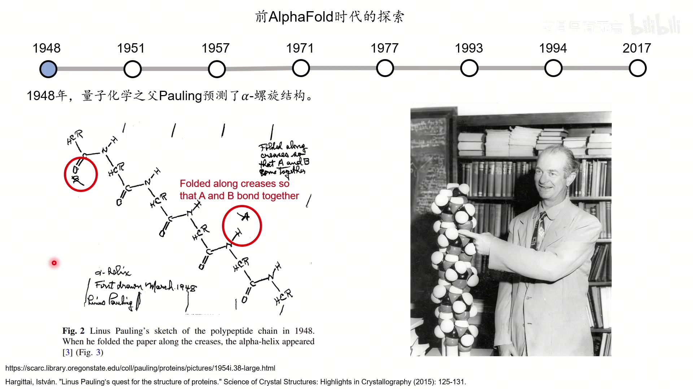

[【跳转到 00:25】](https://www.bilibili.com/video/BV1ucYmesENM/?t=25)

### 1.1 1948：Pauling 用折纸「折」出 α 螺旋

量子化学之父 Pauling（鲍林）当时是牛津大学的访问学者，感冒卧病在床，看侦探小说看无聊了，就拿一堆纸，把氨基酸一个个画在纸带上，然后**不断地折**。化学家当时已经知道不同化学结构之间的角度大概怎样合适；折着折着，他发现只要顺着某些折痕折，就能让带氢的基团和羰基的氧之间形成**氢键**，整条链就变成一个螺旋——这就是 **α 螺旋**。

因为只是折纸折出来的、缺乏实验验证，他当时没有发表。到了 1951 年，看到有人发表了错误的螺旋结构，他觉得离正确的东西也不远了，于是在 **PNAS** 上发表了两篇文章，分别预测 **α 螺旋**和 **β 折叠**。

### 1.2 1957：肌红蛋白与 PDB 数据库

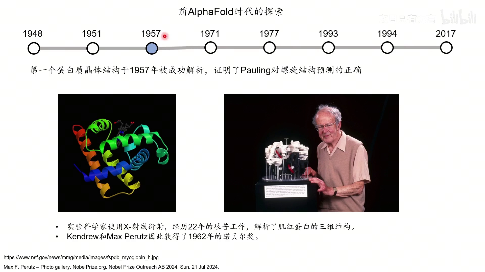

[【跳转到 02:45】](https://www.bilibili.com/video/BV1ucYmesENM/?t=165)

1957 年，英国两位科学家用 **X 射线衍射**（用 X 光照射晶体、从衍射图案反推原子位置）解析了**肌红蛋白**的三维结构，结构里能非常明显地看到 α 螺旋，Pauling 的预测得到证实（1962 年诺贝尔奖）。1971 年，**PDB**（Protein Data Bank，蛋白质数据库）建立，到 2024 年已有 **22 万条以上**记录。

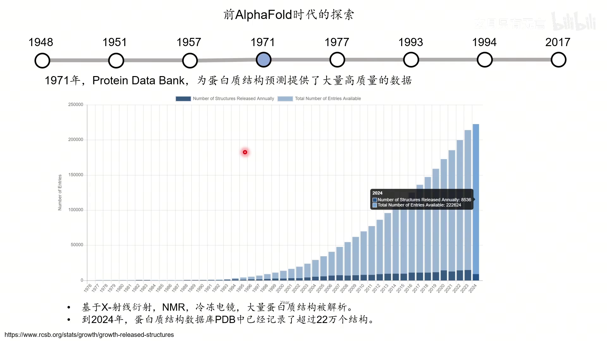

这些数据是后续一切结构预测方法的基础——深度学习最关键的「粮食」就是高质量数据，没有 PDB，AlphaFold2、AlphaFold3 的成功都不可能。

### 1.3 contact map：把三维结构压成一张二维图

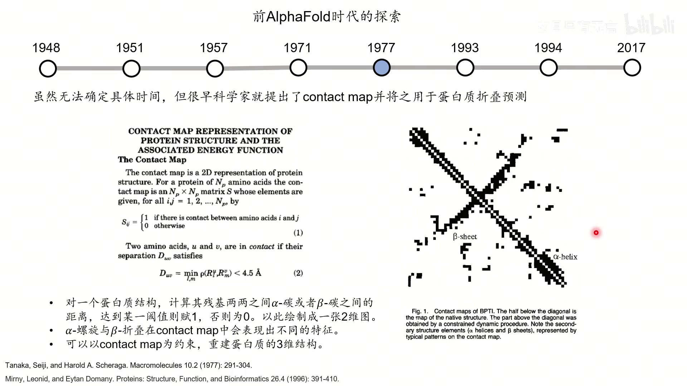

[【跳转到 04:15】](https://www.bilibili.com/video/BV1ucYmesENM/?t=255)

**contact map（接触图）**是一个 N×N 的矩阵：对一个已知结构，计算每两个氨基酸（用 α 碳或 β 碳）之间的距离，**小于 4.5 埃记作 1，否则记 0**。图上的点就代表这两个残基「有接触」。α 螺旋和 β 折叠在 contact map 上会呈现不同特征（对角线上连续的带、以及交叉的带）。

反过来，**contact map 可以作为约束去重建三维结构**——这在 NMR（核磁共振）解析中非常常见，因为核磁得到的正是残基之间的相对距离，再用这些距离约束把结构重建出来。只是它涉及的自由度太广，所以 NMR 没法解析非常大的蛋白。

### 1.4 1993：同源建模 SwissModel

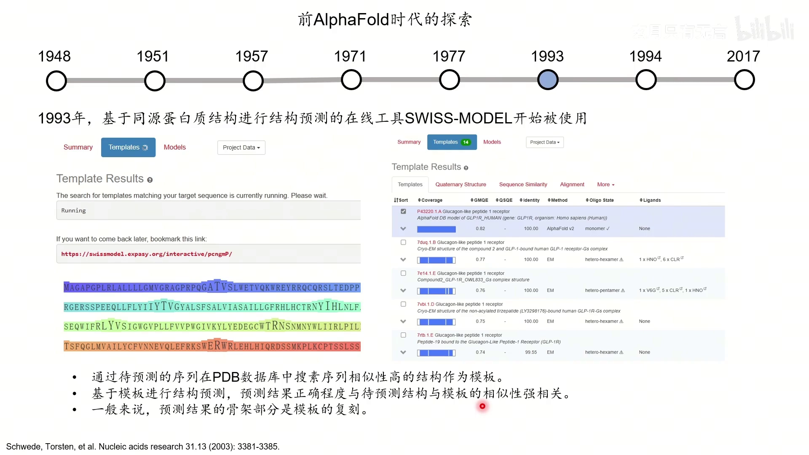

[【跳转到 05:55】](https://www.bilibili.com/video/BV1ucYmesENM/?t=355)

**SwissModel** 是做同源建模的在线工具：你想预测一个蛋白的结构，就拿它的氨基酸序列去 PDB 里搜索**序列相似性非常高**的结构，把搜到的结构当模板，再重建目标序列的结构。

它的假设非常朴素：**序列接近的两个蛋白，结构也接近**（「序列决定结构、结构决定功能」）。这种方法做出来的骨架基本是模板的复刻，但它首次把「已解析的结构信息」用于预测「未知的蛋白质结构」。

### 1.5 1994：共进化——从序列直接读出「谁离谁近」

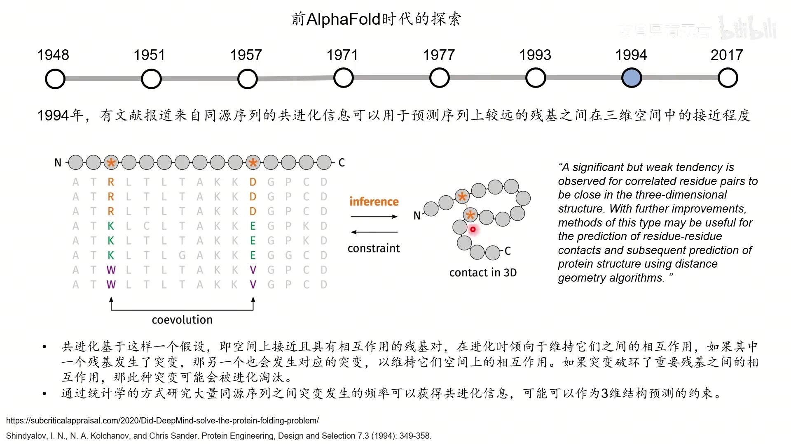

[【跳转到 07:35】](https://www.bilibili.com/video/BV1ucYmesENM/?t=455)

**共进化（coevolution）**是这一讲最重要的概念之一。它的逻辑是：

- 序列上相隔很远的两个残基，在空间上可能挨得很近、形成重要相互作用；
- 如果其中一个发生突变破坏了相互作用，蛋白功能受损，可能被进化淘汰；
- 于是与它相互作用的那个残基**会跟着发生对应的突变**，以维持相互作用。

因此，只要**收集大量不同物种的同源序列**，用统计方法分析「同一位置上残基的突变频率」，就能获得共进化信息：共进化趋势强的两个位置，往往在三维空间里接近。这样就能做出一种类似 contact map 的约束，再去重建结构。

### 1.6 2017：用卷积神经网络预测 contact map

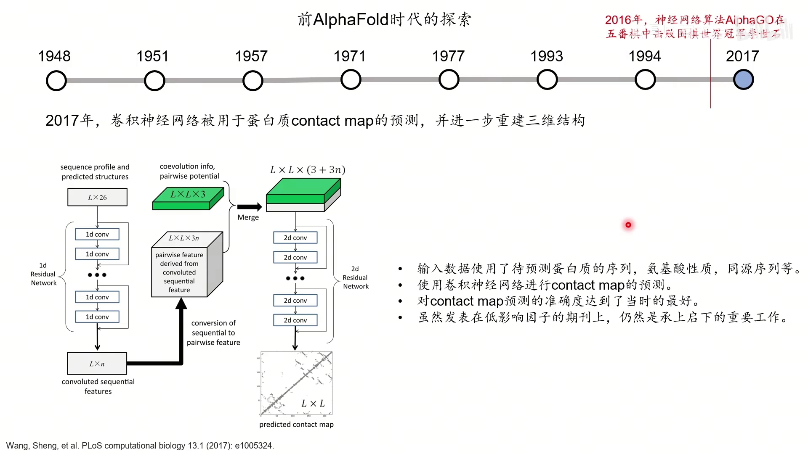

[【跳转到 10:05】](https://www.bilibili.com/video/BV1ucYmesENM/?t=605)

2016 年 **AlphaGo** 击败李世石，让世界看到了深度学习的威力。2017 年，芝加哥大学的徐锦波教授和学生王胜用**卷积神经网络**分析序列信息（结合同源序列，尝试找到共进化信息），预测 contact map，再重建三维结构。

到这里，整条路线已经清楚了：**同源序列 → 共进化 → contact map → 三维重建**。

## 二、AlphaFold1 与 AlphaFold2：从 contact map 到端到端

### 2.1 AlphaFold1：集数十年探索之大成

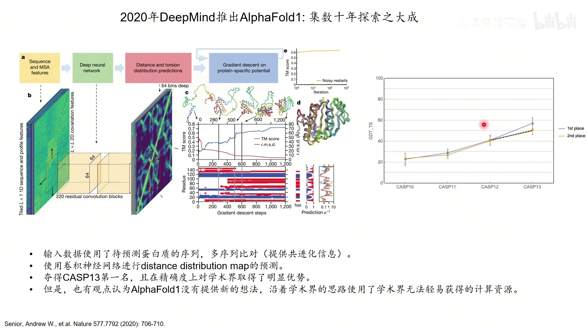

[【跳转到 11:20】](https://www.bilibili.com/video/BV1ucYmesENM/?t=680)

**AlphaFold1** 的思路是：输入**多序列比对**（提取共进化信息），用**残差神经网络**预测 **distance map（距离图）**。distance map 可以看成一种特殊形式的 contact map——它不只是「接不接触」，而是**一个 64 深度的分布**，判断两个残基之间距离的分布。它用了非常深的网络架构和大量计算资源（很多 TPU），以 PDB 结构为训练数据。

在第 13 届 **CASP** 比赛中，AlphaFold1 拿到第一名且大幅领先。但也有学术界人士认为这是一种 **「pay to win」**：你有钱、有算力，沿着大家已有的路做出更好的结果，谷歌也没有做太多区分。

### 2.2 AlphaFold2：直接端到端输出结构

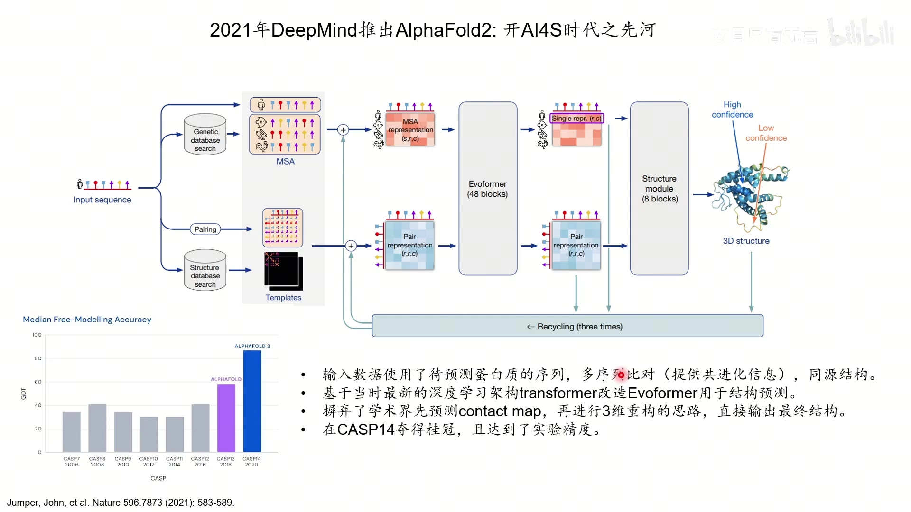

[【跳转到 13:07】](https://www.bilibili.com/video/BV1ucYmesENM/?t=787)

2021 年 **AlphaFold2** 翻开了新的一页。它的输入是：

- **多序列比对（MSA）**：提供共进化信息；
- **同源结构/模板**：用来初始化 **pair representation**（pair 表示）。

然后用 **Evoformer**（Transformer 的一种变体）综合来自共进化和模板的信息，再经过 **structure module（结构模块）** 生成结构。它**彻底放弃了「先预测 contact map、再重建」的思路，直接端到端输出最终结构**。

**pair representation 是什么？** 它和 contact map 很像：一个 R×R 的矩阵，第 i 行第 j 列代表残基 i 和 j 之间的关系；不同颜色代表不同位置的氨基酸，我们希望这个格子编码的是**两个残基之间的距离信息**。而且它是**有深度的**（每个格子是一个向量），不是单个数。

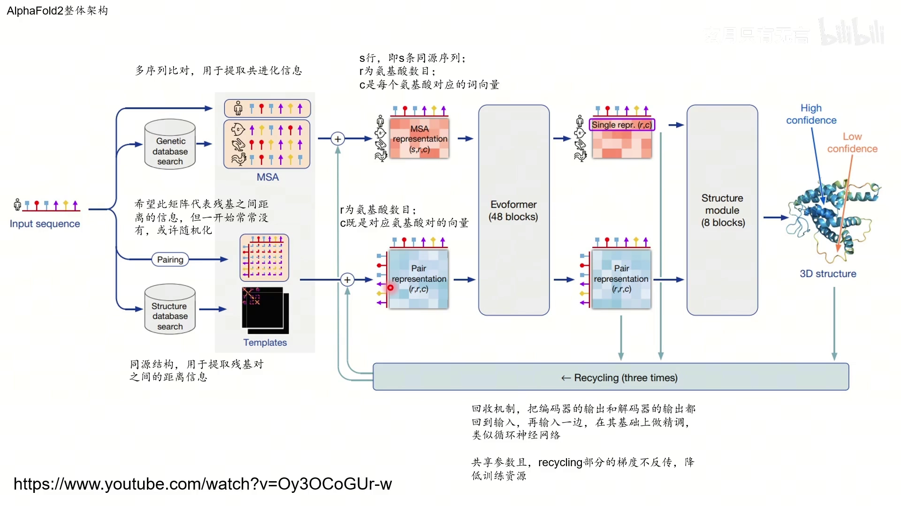

[【跳转到 16:52】](https://www.bilibili.com/video/BV1ucYmesENM/?t=1012)

在 **CASP14** 中，AlphaFold2 夺得第一并达到**实验精度**。作者的评价很有意思：对学术界而言，**有幸也有不幸**——幸运的是见到这么强大的工具出现，不幸的是它几乎把这个领域「做死」了：以前提高一两个点就能发文章，现在新发表的结构预测文章除非有大量新意，否则一定要比 AlphaFold2 更强才行。

## 三、AlphaFold2 的核心：Evoformer

### 3.1 两个张量与整体结构

Evoformer 是 AlphaFold2 里最重要的组件，结构里叠了 **48 块**，而且**不共享权重**。

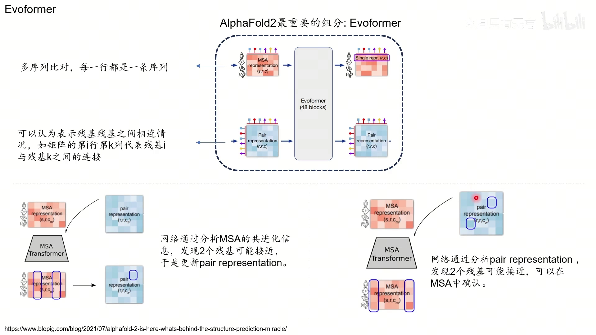

[【跳转到 16:21】](https://www.bilibili.com/video/BV1ucYmesENM/?t=981)

我们有两个张量：

- **MSA representation**：维度 **S×R×C**。S 是 MSA 的行数（同源序列条数），R 是蛋白质的残基数目，C 是每个残基对应的「词向量」维度（包含氨基酸种类、理化性质等信息）。
- **pair representation**：维度 **R×R×C**。每个格子是一个长度为 C 的向量，我们期待它代表对应两个残基之间的距离。

初始化时，我们会把同源结构拿来，算残基之间的距离，画成一张图，作为 pair representation 的初始化——这是一个「非常美好的期待」。

### 3.2 为什么不能直接套 Transformer

普通 Transformer 处理的是「`I like cat`」这样的句子：**每个单词是一个二维向量**，序列长度一维。可现在 MSA 和 pair representation 都是**三维张量**，没办法直接用。

DeepMind 的做法很巧妙：**不直接对整张图用，而是切片**。

- 对 MSA representation，取**一行**，它是一个 R×C 的矩阵——这就是一个长度为 R、每个位置维度为 C 的序列，**可以用 Transformer 处理**；
- 对 pair representation 同样，**取单行、单列拿出来，都能用 Transformer 处理**。

于是就有了 Evoformer 里各式各样的「行注意力和列注意力」。视频主要讲与注意力相关的两部分，它们也是最重要的部分。

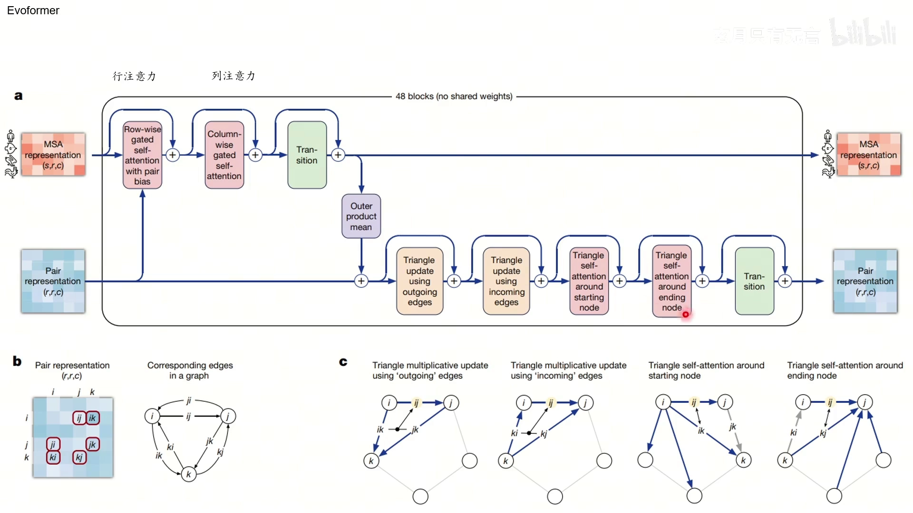

[【跳转到 19:43】](https://www.bilibili.com/video/BV1ucYmesENM/?t=1183)

### 3.3 逐个拆解 row-wise gated self-attention with pair bias

这个模块名字很长，拆开看就很清楚：**row-wise（按行） + gated（带门控） + self-attention（自注意力） + with pair bias（加入 pair 偏置）**。

**① 按行做普通自注意力**：拿 MSA 的一行（比如「兔子」这条序列）作为输入，经过三个全连接层得到 **Q、K、V**，和 Transformer 里一样，Q 和 K 相乘得到「相关性」。我们希望这些相关性代表残基之间的距离。

**② 加入 pair bias**：为了拿到距离信息，从 pair representation 出发，经过全连接层算出一个 **pair bias**，加到注意力分数上。这背后的道理和 **ResNet** 一样——**与其直接把结果完全算出来，不如算它和一个「本体」之间的差值**。既然 pair representation 已经期望代表残基间距离，那就把它作为偏置加进来，MSA 这边就不用直接算距离，只算和模板之间的差值。

**③ 多头注意力与 softmax**：把 Q、K 乘积得到的相关矩阵加上 bias，再做 softmax 得到注意力权重，最后乘以 V 得到 **output**。其中 H 是**多头注意力的头数**（multi-head attention）。

**④ 门控（gate）**：序列经过一个全连接层再过 **sigmoid**，得到一个每个位置非 0 即 1 的向量；把这个向量和 output **逐位置相乘**。某位是 0 就把对应输出「遮掉」，是 1 就保留——从而控制哪些信息继续往后传。最后再经全连接层，**更新 MSA 里对应的那一行**。

### 3.4 双向更新：MSA 与 pair representation 互相成全

**MSA 的更新**把 MSA 的信息和 pair representation 的信息组合了起来——pair representation 来源于同源蛋白结构，没有的话只能随机初始化，但一般来说很多情况下能搜到模板。

**pair representation 的更新**做法几乎一模一样：仍然是取一行、算 Q/K/V、加 bias、softmax、乘 V，再乘以 gate 更新对应行。区别在于这里的 bias **不是来自 MSA，而是它自己算出来的**。此外还有 **column-wise（按列）** 的版本——「行」按行处理，「列」按列往里扔，方式相同。这样就**分别更新了 MSA 和 pair representation**。

**最后一步是信息注入**：来自 MSA 的信息会通过一个**外积（outer product）**的形式，注入到 pair representation 里。就这样，**48 块 Evoformer 反复地用 MSA 和 pair representation 的信息互相更新**，最终得到一个能比较好地代表蛋白质**实际距离约束**的表示。

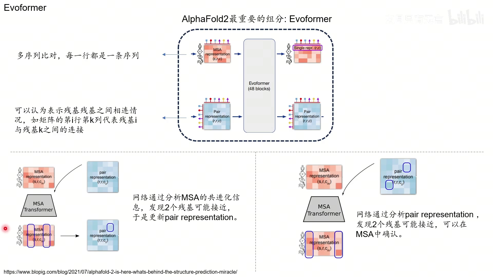

[【跳转到 15:31】](https://www.bilibili.com/video/BV1ucYmesENM/?t=931)

一句话总结这个循环：**网络分析 MSA 的共进化信息，发现两个残基可能接近，于是更新 pair representation；也可以从 pair representation 出发，发现两个残基可能接近，再到 MSA 里确认。** 这个反复迭代的过程，就是 AlphaFold2 最关键的部分。

## 小结

- 结构预测的主线是**「找约束、再重建」**：contact map → distance map → 共进化 → 端到端。
- **时间线**：1948 Pauling 预测 α 螺旋 → 1957 肌红蛋白 + X 射线衍射 → 1971 PDB → 1977 contact map → 1993 SwissModel 同源建模 → 1994 共进化 → 2017 卷积网络预测 contact map → 2020 AlphaFold1 → 2021 AlphaFold2。
- **AlphaFold1**：MSA + 残差网络预测 64 桶的 distance map，CASP13 第一，但被认为「pay to win」。
- **AlphaFold2**：MSA + 模板初始化 pair representation，经 **48 块 Evoformer** 与 structure module **端到端**输出结构，CASP14 达到实验精度。
- **Evoformer 的两条信息流**：MSA representation（S×R×C）与 pair representation（R×R×C）；因为它们是三维张量，无法直接套 Transformer，所以**按行、按列切片**分别处理。
- **row-wise gated self-attention with pair bias**：按行做自注意力 → 用 pair representation 算出 bias 加上去 → softmax → 门控 → 更新该行。
- **MSA 与 pair representation 互相更新**，最后用**外积**把 MSA 信息注入 pair representation。

## 关键术语速查

| 术语 | 一句话解释 |
| :--- | :--- |
| α 螺旋 / β 折叠 | 蛋白质二级结构，Pauling 1948/1951 预测 |
| X 射线衍射 | 用 X 光照射晶体、由衍射反推原子位置，1957 解析肌红蛋白 |
| PDB | 蛋白质数据库，2024 年已有 22 万条以上结构 |
| contact map | N×N 二值矩阵，距离小于阈值记 1，可作约束重建结构 |
| distance map | contact map 的推广，每个位置是距离的 64 桶分布 |
| 共进化 | 空间接近、有相互作用的残基对会协同突变，可从同源序列统计读出 |
| 同源建模 | 用序列相似的结构作模板重建目标结构（如 SwissModel） |
| MSA | 多序列比对，提供共进化信息 |
| Evoformer | AlphaFold2 核心组件，48 块不共享权重 |
| MSA representation | 维度 S×R×C 的张量，S 为同源序列数、R 为残基数、C 为词向量 |
| pair representation | 维度 R×R×C 的张量，每个格子期待代表残基对的距离 |
| pair bias | 由 pair representation 算出、加到注意力分数上的偏置 |
| 门控（gate） | sigmoid 得到 0/1 向量，与输出逐位相乘，控制信息是否传递 |
| outer product（外积） | 把 MSA 信息注入 pair representation 的方式 |
| CASP | 蛋白质结构预测的国际评测比赛（AlphaFold1 得 CASP13 第一、AlphaFold2 得 CASP14 第一） |
