# AlphaFold3 图解（The Illustrated AlphaFold）

> **原文**：*The Illustrated AlphaFold* — Elana Simon、Jake Silberg（Stanford University），2024-07-10。
> **原文链接**：<https://elanapearl.github.io/blog/2024/the-illustrated-alphafold/>
> 本文为原文的中文翻译，配图沿用原文插图，已随本文一同存放于本地 `assets/AlphaFold3图解_The_Illustrated_AlphaFold/`。

---

# 引言

### 谁适合阅读本文
你是否想确切了解 AlphaFold3 到底是如何工作的？它的架构相当复杂，论文里的描述也可能让人望而生畏，因此我们做了一份友好得多（但同样详尽！）的可视化解读。

本文主要面向机器学习（ML）读者，多处内容默认你熟悉注意力机制（attention）的各个步骤。如果你有些生疏，可以参阅 Jay Alammar 的 [The Illustrated Transformer](https://jalammar.github.io/illustrated-transformer/)，它提供了详细的视觉化讲解。那篇文章是少数能把模型架构讲解到单个矩阵运算级别的佳作，本文的示意图与命名方式也受其启发。

关于蛋白质结构预测的动机、CASP 竞赛、模型的失效模式、对评估的争论、对生物技术的影响等，已经有大量优秀的解读，因此我们不聚焦于这些，而是探讨其中的 _how_（怎么做）。

_这些分子在模型中是如何表示的？又有哪些运算把它们转换成预测出的结构？_

本文可能比大多数人想要的更详尽，但如果你想理解所有细节，并且喜欢通过图示学习，那它应该会帮到你 :)

### 架构总览
首先我们要指出，这个模型的目标与之前的 AlphaFold 模型略有不同：它不再只是预测单个蛋白质序列（AF2）或蛋白质复合物（AF-multimer）的结构，而是仅凭序列就能预测一个蛋白质的结构——该蛋白质可以可选地与其他蛋白质、核酸或小分子形成复合物。所以，之前的 AF 模型只需表示标准氨基酸序列，而 AF3 必须表示更复杂的输入类型，也因此有了更复杂的特征化/分词（featurization/tokenization）方案。分词会在专门的一节中描述，但眼下只需知道，当我们说“token（词元）”时，它要么代表单个氨基酸（针对蛋白质）、核苷酸（针对 DNA/RNA），要么在某个原子不属于标准氨基酸/核苷酸时代表该原子本身。

### 交互式目录

*完整架构。点击架构的任意部分即可跳转到对应章节；调整页面大小后可能需刷新以保持交互功能正常。（图改编自 AF3 论文）*

在全文各处，我们都会标出你在这张图中的位置，以免你迷路！

该模型可以拆解为 3 个主要部分：
1. [**输入准备（Input Preparation）**](#1-input-preparation) 用户提供一些待预测结构的分子序列，这些序列需要被嵌入为数值张量。此外，模型还会检索（retrieve）一批被假定与用户提供的分子具有相似结构的其他分子。输入准备这一步会找出这些分子，并把它们也各自嵌入为自己的张量。
2. [**表示学习（Representation learning）**](#2-representation-learning) 给定第 1 步创建的单体（Single）与配对（Pair）张量，我们使用多种注意力变体来更新这些表示。
3. [**结构预测（Structure prediction）**](#3-structure-prediction) 我们使用这些改进后的表示，以及第 1 步创建的原始输入，通过条件扩散（conditional diffusion）来预测结构。

你可以通过此处的章节名称，或点击上方架构图中相应的部分，跳转到特定章节。

我们还有一些额外章节，分别描述 4. [**损失函数、置信度头（confidence heads）以及其他相关的训练细节**](#4-loss-function-and-other-training-details)，以及 5. [**从 ML 趋势视角对模型的一些思考**](#ml-musings)。

### 关于变量与图示的说明
在整个模型中，一个蛋白质复合物以两种主要形式来表示：“单体（single）”表示刻画我们蛋白质复合物中的所有 token；“配对（pair）”表示刻画复合物中所有氨基酸/原子两两之间的关系（例如距离、潜在相互作用）。这两者都可以在原子级别或 token 级别上表示，并且始终使用以下名称（如 AF3 论文中所确立的）和颜色来展示：

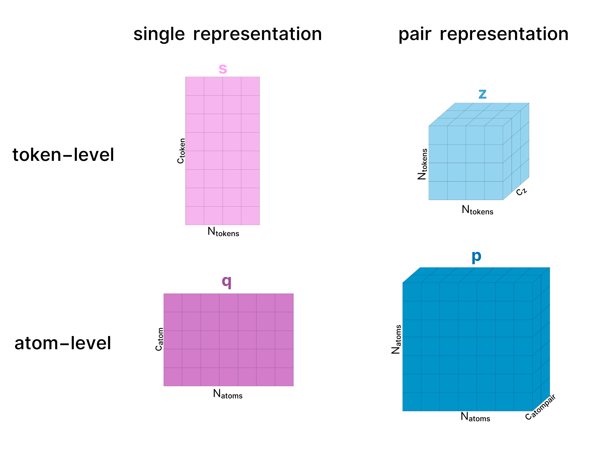

* 图中省略了模型权重，只可视化激活值（activations）的形状如何变化
* 激活张量始终用论文中使用的维度名称来标注，而图中各处的大小也大致对应这些维度扩张/收缩的时机。 （隐层维度名称通常以 "c" 开头，代表 "channel"（通道）。供参考，主要使用的维度为 cz=128、cm=64、catom=128、catompair=16、ctoken=768、cs=384。）
* 在可行的情况下，该图（以及所有图）中张量上方的名称都与 AF3 补充材料中使用的张量名称一致。通常，一个张量在流经模型时保持其名称不变。但在某些情况下，我们会用不同的名称来区分同一张量在不同处理阶段的版本。例如，在原子级单体表示中，**c** 代表初始的原子级单体表示，而 **q** 代表该表示在流经 Atom Transformer 后更新得到的版本。
* 为简洁起见，我们也忽略了大多数 LayerNorm，但它们其实_无处不在_。

---

# 1. 输入准备（Input Preparation）

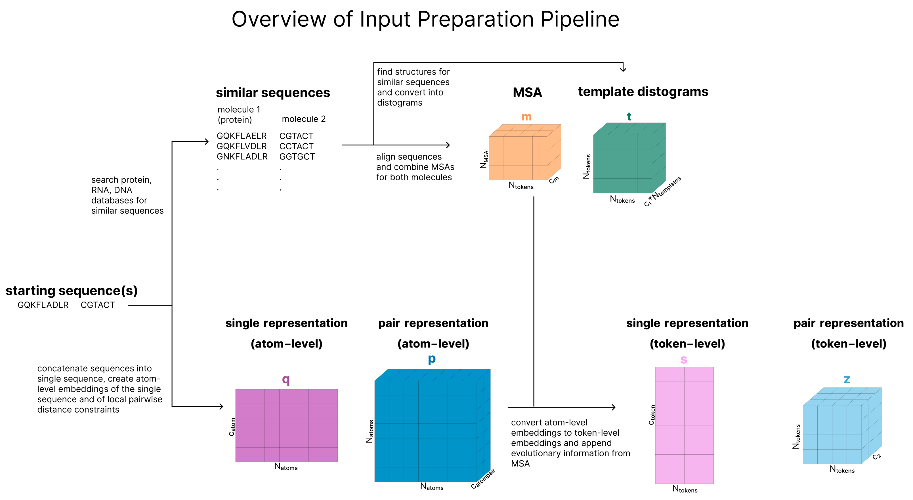

用户实际提供给 AF3 的输入是一个蛋白质的序列，以及可选的额外分子。本节的目标是把这些序列转换为一组 6 个张量，它们将作为模型主干（main trunk）的输入，正如下图所概述的。这些张量是：**s**，我们的 token 级单体表示；**z**，我们的 token 级配对表示；**q**，我们的原子级单体表示；**p**，我们的原子级配对表示；**m**，我们的 MSA 表示；以及 **t**，我们的模板（template）表示。

本节包含：
* [**分词（Tokenization）**](#tokenization) 描述分子如何被分词，并厘清原子级别与 token 级别之间的区别
* [**检索（Retrieval，创建 MSA 与模板）**](#retrieval-create-msa-and-templates) 解释我们为何以及如何向模型中引入额外输入。它创建我们的 MSA（**m**）和结构模板（**t**）。
* [**创建原子级表示（Create Atom-Level Representations）**](#create-atom-level-representations) 创建我们最初的原子级表示 **q**（单体）和 **p**（配对），并包含生成的分子构象（conformer）信息。
* [**更新原子级表示（Atom Transformer）**](#update-atom-level-representations-atom-transformer) 是主要的“Input Embedder”模块，也称为“Atom Transformer”，它被重复 3 次并更新原子级单体表示（**q**）。此处引入的构建模块（[**自适应 LayerNorm**](#1-adaptive-layernorm)、[**带配对偏置的注意力**](#2-attention-with-pair-bias)、[**条件门控**](#3-conditioned-gating) 和 [**条件过渡层**](#4-conditioned-transition)）在模型后续部分也很重要。
* [**聚合原子级 -> token 级（Aggregate Atom-Level -> Token-Level）**](#aggregate-atom-level--token-level) 取我们的原子级表示（**q**、**p**），对所有属于多原子 token 的原子进行聚合，以创建 token 级表示 **s**（单体）和 **z**（配对），并纳入 MSA（**m**）的信息以及用户提供的、关于配体已知键的任何信息。

## 分词（Tokenization）

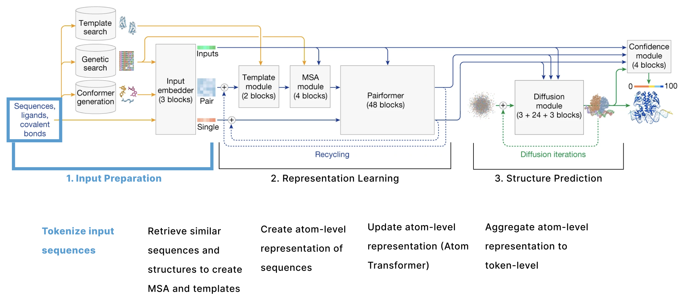

*看看它在整体架构中的位置*

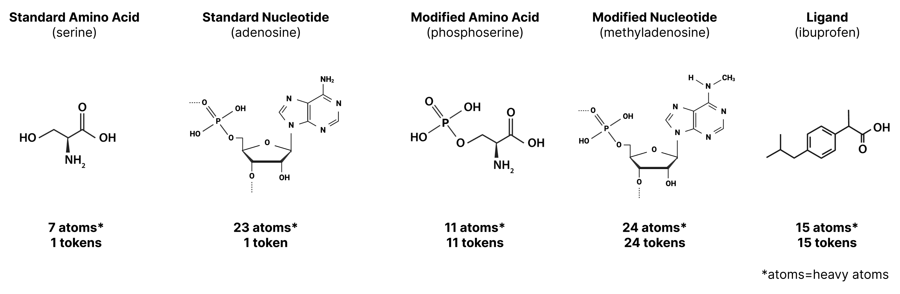

在 AF2 中，由于模型只使用固定的氨基酸集合来表示蛋白质，每个氨基酸都由它自己的 token 表示。这一做法在 AF3 中得以保留，但也为 AF3 能处理的额外分子类型引入了额外的 token：

* 标准氨基酸：1 个 token（同 AF2）
* 标准核苷酸：1 个 token
* 非标准氨基酸或核苷酸（甲基化核苷酸、带有翻译后修饰的氨基酸等）：_每个原子_ 1 个 token
* 其他分子：_每个原子_ 1 个 token

因此，我们可以把某些 token（例如氨基酸对应的 token）视为与多个原子相关联，而另一些 token（例如配体中某个原子对应的 token）则只与单个原子相关联。所以，一个含 35 个标准氨基酸的蛋白质（可能超过 600 个原子）会由 35 个 token 表示，而一个含 35 个原子的配体同样也会由 35 个 token 表示。

## 检索（Retrieval，创建 MSA 与模板）

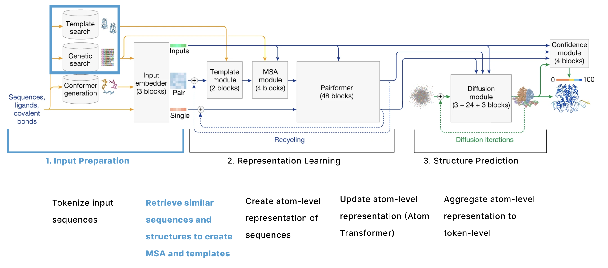

*看看它在整体架构中的位置*

AF3 早期一个关键步骤，类似于语言模型中的检索增强生成（Retrieval Augmented Generation，[RAG](https://aws.amazon.com/what-is/retrieval-augmented-generation)）。我们为感兴趣的蛋白质和 RNA 序列找出相似的序列（收集成一个多序列比对，即“MSA”），以及与它们相关的任何结构（称为“模板”，templates），然后分别把它们作为额外的输入 **m** 和 **t** 引入模型。

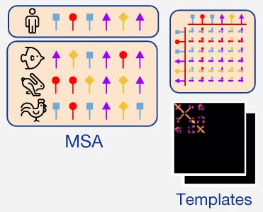

*(Image from AF2)*

我们为什么需要 MSA 和模板？

同一蛋白质在不同物种中的版本，在结构和序列上可能相当相似。通过把它们比对成一个多序列比对（MSA），我们可以观察蛋白质序列中某个特定位置在整个进化过程中是如何变化的。你可以把某个蛋白质的 MSA 看作一个矩阵，其中每一行都是来自不同物种的同源蛋白质的序列。已有研究表明，蛋白质某个特定位置对应列上呈现出的保守模式，可以反映该位置拥有特定氨基酸有多关键；而不同列之间的关系则反映氨基酸之间的关系（也就是说，如果两个氨基酸在物理上相互作用，那么二者氨基酸的变化在整个进化过程中很可能是相关的）。因此，MSA 常被用来丰富单个蛋白质的表示。

同样地，如果这些蛋白质中有任何已知结构，它们也很可能为该蛋白质的结构提供信息。这里不是搜索完整结构，而只使用蛋白质的单个链。这类似于同源建模（homology modeling）的做法：基于已知蛋白质结构中的模板来建模查询蛋白质的结构，这些模板被假定是相似的。

那么这些序列和结构是如何检索到的？

首先，会进行一次遗传搜索，寻找任何与输入蛋白质或 RNA 链相似的蛋白质或 RNA 链。这一过程不涉及任何训练，而是依赖现有的基于隐马尔可夫模型（Hidden Markov Model，HMM）的方法（具体来说，他们使用 jackhmmer、HHBlits 和 nhmmer），扫描多个蛋白质数据库和 RNA 数据库以寻找相关命中。然后这些序列相互比对，构建出含 NMSA 条序列的 MSA。由于模型的计算复杂度随 NMSA 增长，他们将其限制为 NMSA < 214。通常，MSA 是由单个蛋白质链构建的，但正如 <a href="https://www.biorxiv.org/content/10.1101/2021.10.04.463034v2.full.pdf">AF-multimer</a> 所述，与其只是把各个独立的 MSA 拼接成一个块对角矩阵，不如按<a href="https://www.biorxiv.org/content/10.1101/240754v3.full.pdf">此处</a>所述，把来自同一物种的某些链“配对”。这样，MSA 就不必那么大而稀疏，并且可以学到链之间关系的进化信息。

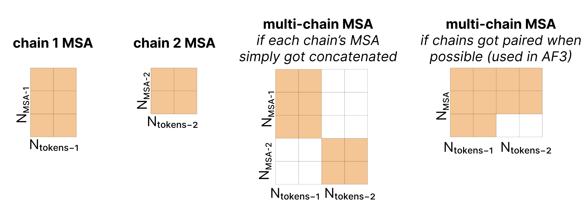

然后，对于每个蛋白质链，他们使用另一种基于 HMM 的方法（hmmsearch）在蛋白质数据库（Protein Data Bank，PDB）中寻找与所构建 MSA 相似的序列。选出质量最高的结构，并从中采样至多 4 个作为“模板”纳入。

与 AF-multimer 相比，这些检索步骤中唯一新增的部分是：我们现在除了蛋白质序列之外，还会对 RNA 序列做这种检索。请注意，这在传统上并不叫“检索”，因为用结构模板来指导蛋白质结构建模的做法，早在 RAG 这个术语出现之前就已是[同源建模](https://en.wikipedia.org/wiki/Homology_modeling)领域的常见实践。不过，尽管 AlphaFold 并未明确把这一过程称为检索，它确实与如今被广泛推广的 RAG 十分相似。

**我们如何表示这些模板？**

从模板搜索中，我们得到了每个模板的 3D 结构，以及关于哪些 token 属于哪些链的信息。首先，计算给定模板中所有 token 两两之间的欧几里得距离。对于与多个原子关联的 token，会用一个代表性的“中心原子（center atom）”来计算距离。对于氨基酸，这会是 Cɑ 原子；对于标准核苷酸，则会是 C1' 原子。

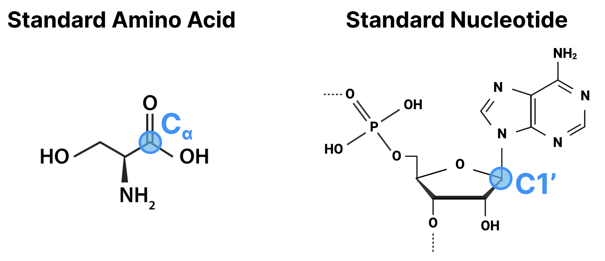

*Highlighting "center atoms" in single-token building blocks*

这会为每个模板生成一个 Ntoken x Ntoken 的矩阵。不过，我们不是把每个距离表示为一个数值，而是把距离离散化成“距离分布图（distogram）”（即距离的直方图）。（具体来说，数值被分到 3.15A 到 50.75A 之间的 38 个区间，另外还有 1 个额外的区间用于表示任何大于该范围的距离。）

对每个距离分布图，我们随后附加元数据，说明每个 token 属于哪条链（在分子复合物中，链（chain）指的是一个不同的分子或分子的一部分。它可以是蛋白质链（一段氨基酸序列）、DNA 或 RNA 链（一段核苷酸序列），或其他生物分子。AlphaFold 使用链信息来区分复合物的各个部分，帮助它预测这些部分如何相互作用以形成整体结构）、该 token 在晶体结构中是否被解析出来，以及每个氨基酸内部局部距离的信息。然后我们对这个矩阵做掩码，使得我们只看每条链内部的距离（例如，我们忽略链 A 与链 B 之间的距离），因为他们“不会尝试挑选模板……以获取链间相互作用的信息”（
这里没有说明原因，但请注意，虽然模板中没有链间相互作用，他们在构建 MSA 时却把它们包含了进来。）。

## 创建原子级表示（Create Atom-Level Representations）

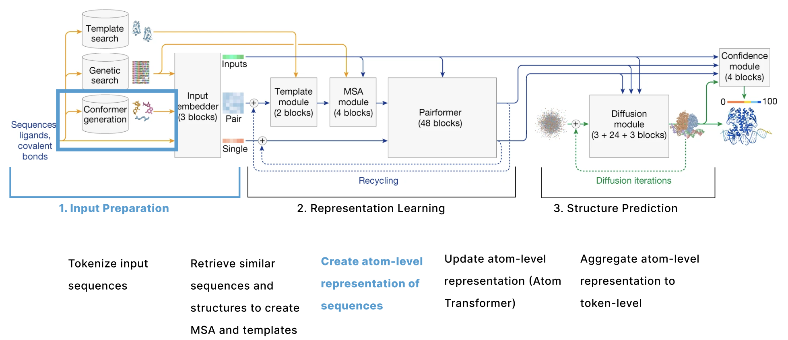

*看看它在整体架构中的位置*

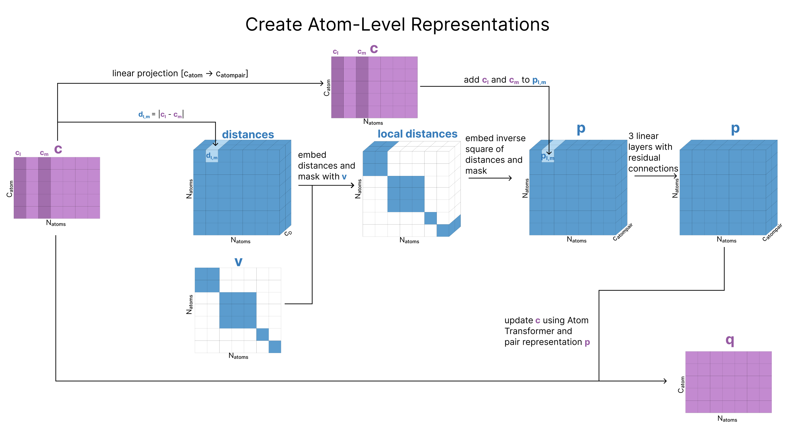

要创建 **q**，即我们的原子级单体表示，我们需要汇集所有原子级特征。第一步是为每个氨基酸、核苷酸和配体计算一个“参考构象（reference conformer）”。虽然我们还不知道整个复合物的结构，但我们对每个单独组分的局部结构有很强的先验。构象（conformer，是 [conformational isomer](https://www.sciencedirect.com/topics/chemistry/conformational-isomer#:~:text=Conformations%20or%20conformational%20isomers%20have,the%20same%20configuration%2C%20if%20chiral.) 的简称）是分子中原子的一种 3D 排列，它通过在单键周围采样旋转来生成。每个氨基酸都有一个“标准”构象，它只是该氨基酸可以存在的低能构象之一，可以通过查表检索得到。然而，每个小分子都需要自己生成构象。这些构象使用 [RDKit 的 ETKDGv3](https://rdkit.org/docs/RDKit_Book.html#conformer-generation) 生成，这是一种结合实验数据和扭转角偏好来生成 3D 构象的算法。

然后，我们把这个构象的信息（相对位置）与每个原子的电荷、原子序数和其他标识符拼接起来。矩阵 **c** 存储我们序列中所有原子的这些信息（在 AF3 补充材料中，原子级矩阵（<b>c</b> 和 <b>q</b>）通常以其向量形式出现（_例如_ <b>cl</b> 或 <b>cm</b>），其中 l 和 m 用于索引原子。）。然后我们用 **c** 来初始化我们的原子级配对表示 **p**，以存储原子之间的相对距离。因为我们只知道每个 token 内部的参考距离，所以我们用一个掩码（**v**）来确保这个初始距离矩阵只表示我们在构象生成中计算出的距离。我们还纳入距离平方倒数的线性嵌入，并加上 **cl** 和 **cm** 的一个投影，再用若干带残差连接的线性层更新它（AF3 论文并没有真正澄清为什么要做这个额外的距离平方倒数步骤，也没有包含关于其效果的消融实验；因此，正如我们将讨论的许多步骤一样，我们只能假设它们在经验上被证明是有用的。）（在 AF3 补充材料中，<b>p</b> 张量通常以其向量形式 <b>pl,m</b> 出现（这里表示原子 l 与原子 m 之间的关系）。）。

最后，我们复制一份原子级单体表示，把这个副本称为 **q**。这个矩阵 **q** 就是之后我们会持续更新的对象，而 **c** 则会被保存下来，在之后使用。

## 更新原子级表示（Atom Transformer）

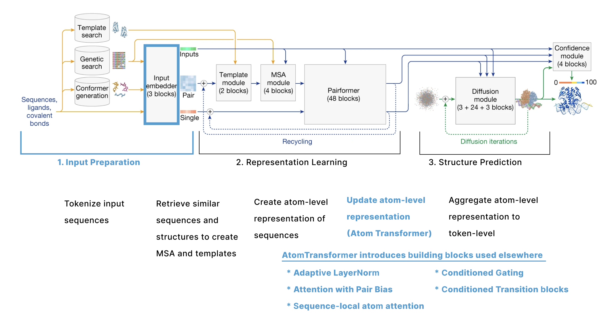

*看看它在整体架构中的位置*

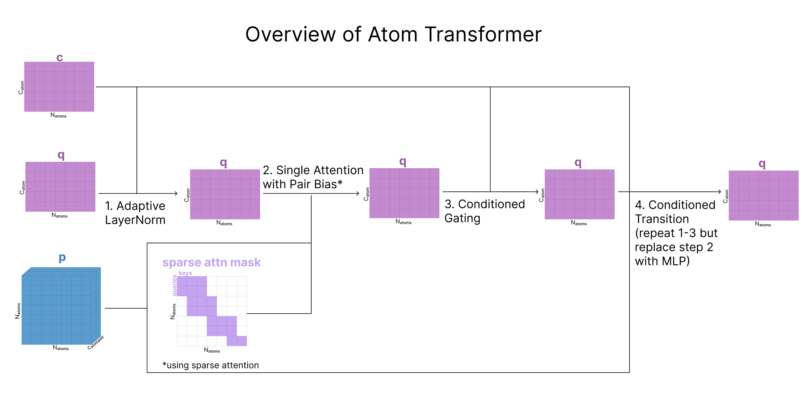

生成了 **q**（所有原子的表示）和 **p**（每对原子的表示）之后，我们现在想基于附近的其他原子来更新这些表示。每当 AF3 在原子级应用注意力时，都会使用一个叫做 Atom Transformer 的模块。Atom Transformer 由一系列 block（模块）组成，它们使用注意力，借助 **p** 和 **q** 的原始表示（称为 **c**）来更新 **q**。由于 **c** 不会被 Attention Transformer 更新，它可以被视为一条连到起始表示的残差连接。

Atom Transformer 大体上遵循标准的 transformer 结构，即层归一化（layer norm）、注意力、然后一个 MLP 过渡层。不过，每一步都被改造为包含来自 **c** 和 **p** 的额外输入（在这里引入次要输入有时被称为“条件化（conditioning）”）。此外，在注意力和 MLP 模块之间还有一个“门控（gating）”步骤。下面更详细地逐一介绍这 4 个步骤：

### 1. 自适应 LayerNorm（Adaptive LayerNorm）

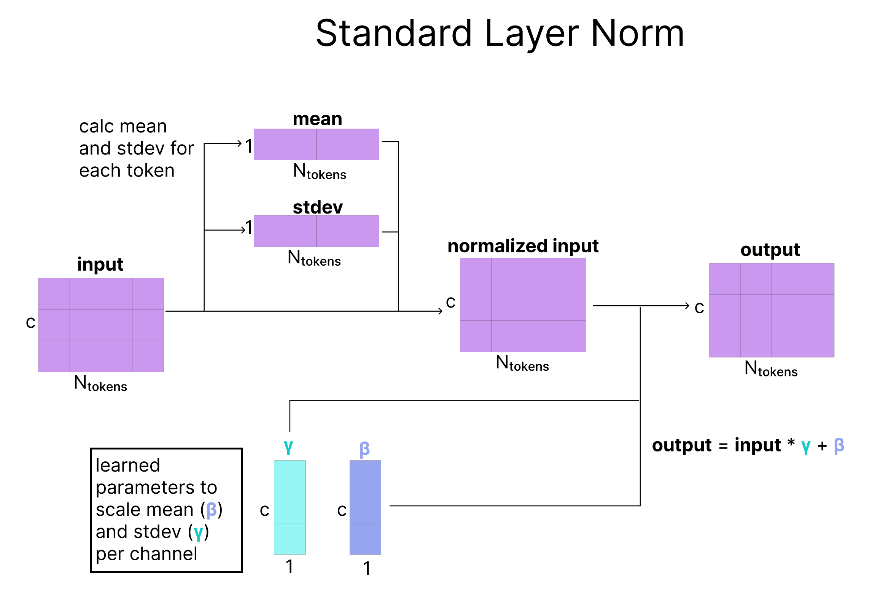

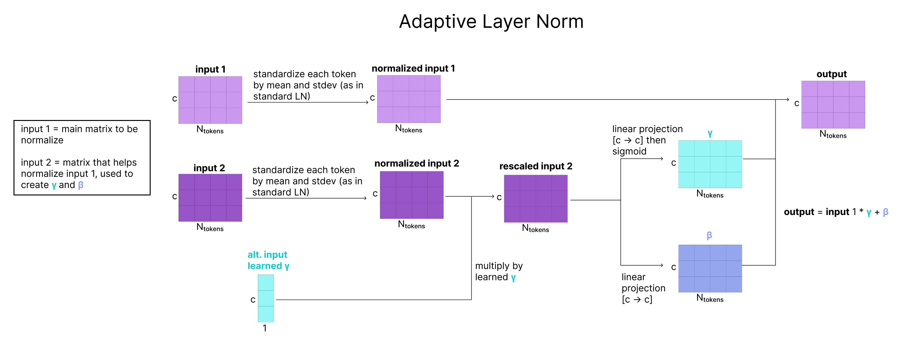

自适应 LayerNorm（AdaNorm）是 LayerNorm 的一个变体，只做了一处简单扩展。回忆一下，对于给定的输入矩阵，传统 LayerNorm 学习两个参数（缩放因子 gamma 和偏置因子 beta），用来调整矩阵中每个通道的均值和标准差。AdaNorm 不是学习固定的 gamma 和 beta 参数，而是学习一个函数，根据输入矩阵自适应地生成 gamma 和 beta。不过，它并不是基于被重新缩放的输入（在 Atom Transformer 中即 **q**）来生成参数，而是用一个次要输入（在 Atom Transformer 中即 **c**）来预测用于重新缩放 **q** 均值和标准差的 gamma 和 beta。

### 2. 带配对偏置的注意力（Attention with Pair Bias）

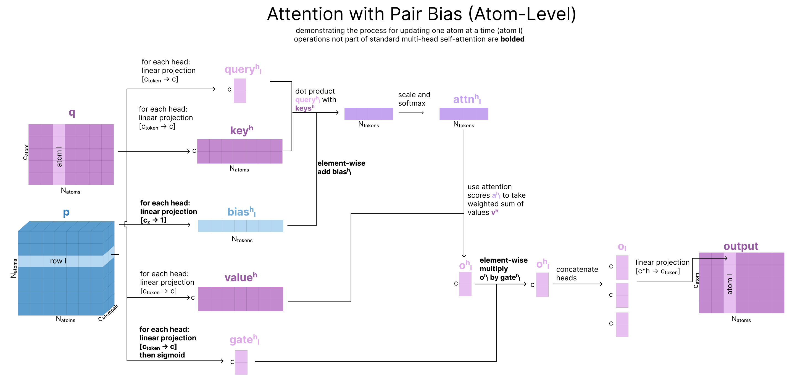

带配对偏置的原子级注意力可以看作是自注意力（self-attention）的一种扩展。与自注意力一样，查询（queries）、键（keys）和值（values）都来自同一个 1D 序列（即我们的单体表示 **q**）。不过，有 3 点不同：

1. **配对偏置（Pair-biasing）**：在计算出查询与键的点积之后，会把配对表示的一个线性投影作为偏置加上去，用来缩放注意力权重。请注意，这一操作不涉及用 **q** 的任何信息去更新 **p**，只是从配对表示到 **q** 的单向流动。这样做的理由是：具有更强成对关系的原子应当更强烈地相互注意，而 **p** 实际上已经编码了一张注意力图。

2. **门控（Gating）**：除了查询、键和值之外，我们还为 **q** 创建一个额外的投影，让它通过一个 sigmoid，把值压缩到 0 和 1 之间。在所有头重新合并之前，我们的输出会乘以这个“门”。这实际上迫使模型忽略它在此注意力过程中学到的一部分内容。这种门控在 AF3 中频繁出现，会在 ML-musings 章节中进一步讨论。简要展开来说，由于模型不断把每个部分的输出加到残差流（residual stream）上，这种门控机制可以看作是模型用来指定哪些信息会或不会被保存在该残差流中的方式。它的命名大概是借鉴了 LSTM 中类似的“门”，LSTM 用 sigmoid 学习一个过滤器，决定哪些输入会被加到运行中的单元状态（cell state）上。

3. **稀疏注意力（Sparse attention）**：
<table style="border-collapse: collapse; border: none;">
<tr>
<td width="2%" style="border: none;">
</td>
<td width="76%" style="border: none;">
因为原子数量可能远大于 token 数量，我们在此步骤不运行完整注意力，而是使用一种稀疏注意力（称为 Sequence-local atom attention），其中注意力实际上是在局部组内运行，每组 32 个原子可以同时注意 128 个其他原子。稀疏注意力模式在<a href="https://medium.com/@vishal09vns/sparse-attention-dad17691478">互联网上其他地方</a>有更详细的描述。
</td>
<td width="22%" style="border: none;">
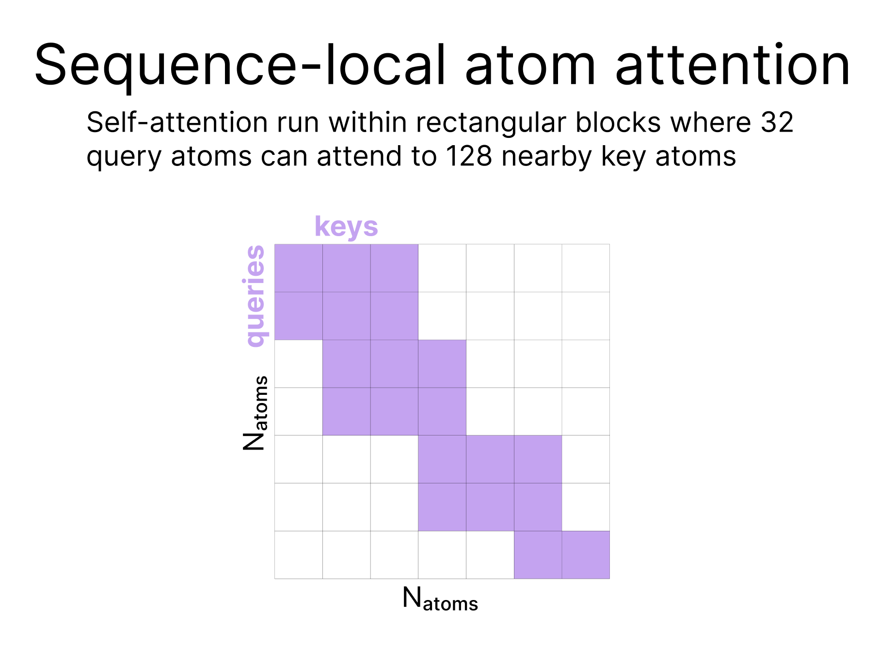
</td>
</tr>
</table>

### 3. 条件门控（Conditioned Gating）

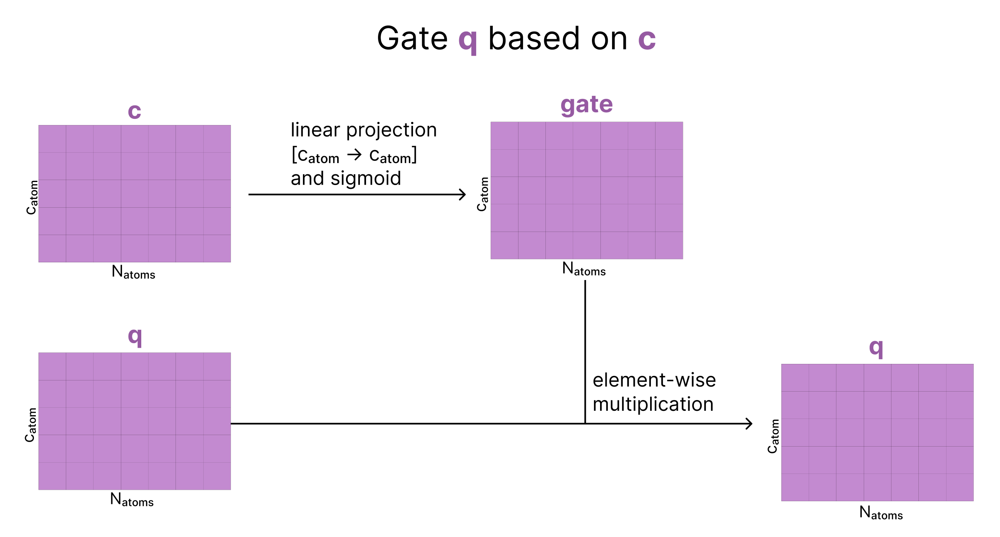

我们对数据再施加一个门，但这次的门是由我们原始的原子级单体矩阵 **c** 生成的（和许多步骤一样，目前不清楚为什么要这样做，也不清楚以原始表示 <b>c</b> 为条件去生成门、相比于从主要单体表示 <b>q</b> 学习门有什么好处）。

### 4. 条件过渡层（Conditioned Transition）

这一步等价于 transformer 中的 MLP 层，之所以称为“条件（conditioned）”，是因为该 MLP 被夹在自适应 LayerNorm（Atom Transformer 第 1 步）和条件门控（Atom Transformer 第 3 步）之间，而这两者都依赖 **c**。

本节的另一个值得注意之处是，AF3 在过渡模块中使用 SwiGLU 而不是 ReLU。从 ReLU → SwiGLU 的转变发生在 AF2 → AF3 之间，而且在许多近期架构中都是常见的变化，所以我们在此将其可视化。

对于基于 ReLU 的过渡层（如 AF2），我们取激活值，把它们向上投影到 4 倍大小，施加一个 ReLU，然后再向下投影回原始大小。使用 SwiGLU 时（如 AF3），输入激活会生成两个中间的上投影，其中一个经过 swish 非线性（ReLU 的改进变体），然后它们相乘，再向下投影。下图展示了这些差异：

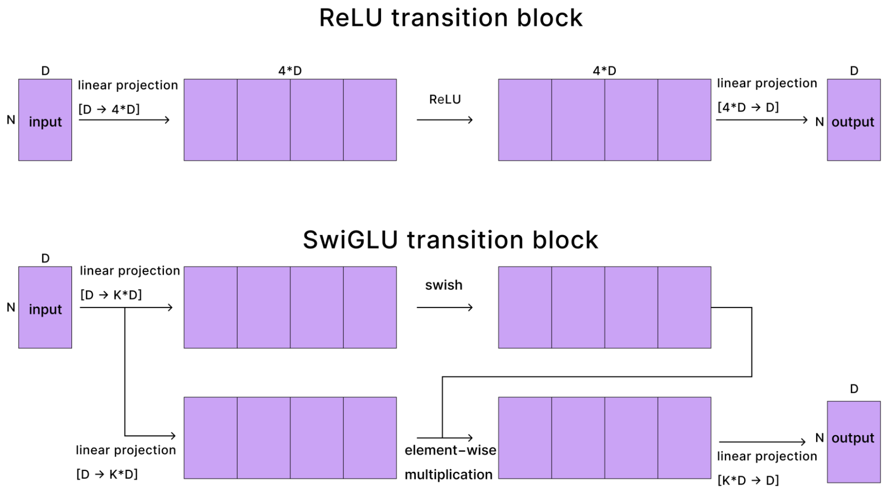

## 聚合原子级 → token 级（Aggregate Atom-Level → Token-Level）

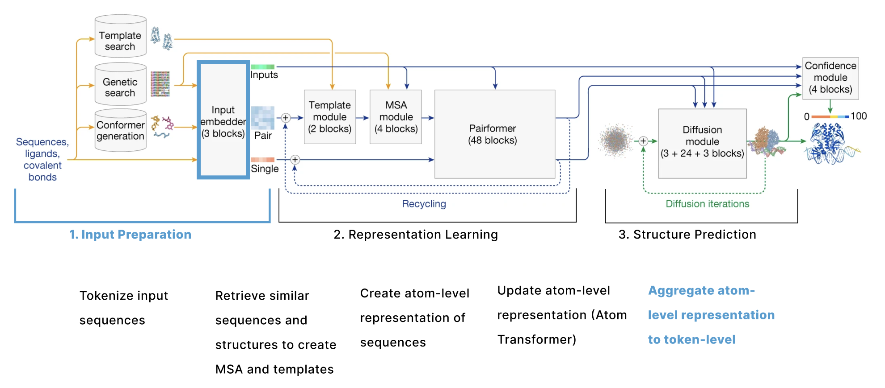

*看看它在整体架构中的位置*

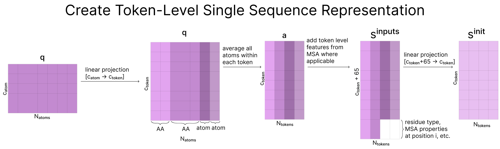

虽然到目前为止数据都存储在原子级别，但 AF3 的表示学习部分从此往后都在 token 级别上运作。要创建这些 token 级表示，我们首先把原子级表示投影到一个更大的维度（catom=128，ctoken=384）。然后，我们对分配给同一 token 的所有原子取均值。请注意，这只适用于与标准氨基酸和核苷酸相关联的原子（对挂接在同一 token 上的所有原子取均值），其余原子的表示保持不变（AF3 论文把这些分子类型描述为每个 token 有一个代表性原子（中心原子）。回忆一下，对氨基酸来说这是 Cα 原子，对标准核苷酸来说则是 C1' 原子。因此，虽然我们大多把这种降维后的表示视为“token 空间”，我们也可以把每个 token 看作代表单个原子（要么是一个代表性的 Cα/C1' 原子，要么是一个单独的原子）。）。

既然我们已经在“token 空间”中工作，我们就拼接我们的 token 级特征和来自 MSA 的统计量（在可用的地方）（例如，氨基酸类型（dim = 32）、MSA 中该位置氨基酸的分布（dim = 32），以及该 token 处的缺失均值（dim = 1），这些均来自我们的 MSA。请注意，对于不与 MSA 关联的配体原子，这些值将为零。）。这个矩阵，**sinputs**，因这些拼接而略微变大，随后又被投影回 ctoken，并命名为 **sinit**：这是我们序列的起始表示，将在表示学习部分被更新。请注意，**sinit** 会在表示学习部分被更新，而 **sinputs** 会被保存下来，以便在结构预测部分稍后使用。

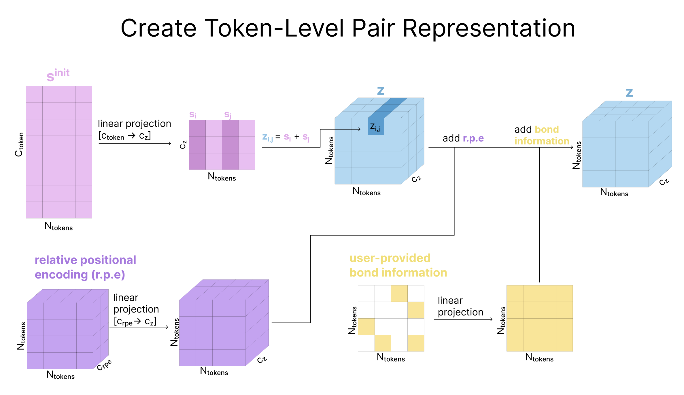

现在我们已经创建了 **sinit**，即初始化的单体表示，下一步是初始化我们的配对表示 **zinit**。配对表示是一个三维张量，但最容易把它想象成一个类似热力图的 2D 矩阵，带有一个隐式的深度维度 cz=128 个通道。因此，我们配对表示中的元素 **zi,j** 是一个 cz 维向量，用于存储 token 序列中 token i 与 token j 之间关系的信息。我们之前创建了一个类似的原子级矩阵 **p**，这里我们在 token 级上遵循类似的过程。

要初始化 **zi,j**，我们用一个线性投影让序列表示的通道维度与配对表示的通道维度匹配（384 → 128），并把得到的 **si** 和 **sj** 相加。在此基础上，我们再加上一个相对位置编码，
**pi,j**（这个编码包含：arel_pos，即两个 token id 在 token 空间中偏移量的独热编码（one-hot encoding）（如果两个 token 不在同一条链上，则设为最大值 65）；arel_token，即两个 token id 在 token 空间中偏移量的独热编码（如果这些 token 属于不同的氨基酸或核苷酸，则设为最大值 65）；以及 arel_chain，编码这些 token 所在的两条链的偏移。我们把这个拼接后的编码也投影到 <b>z</b> 的维度。）。如果用户还指定了 token 之间的特定键，这些键会在此处被线性嵌入，并加到配对表示中的相应元素上。

现在我们已经成功创建并嵌入了将在模型其余部分使用的所有输入：

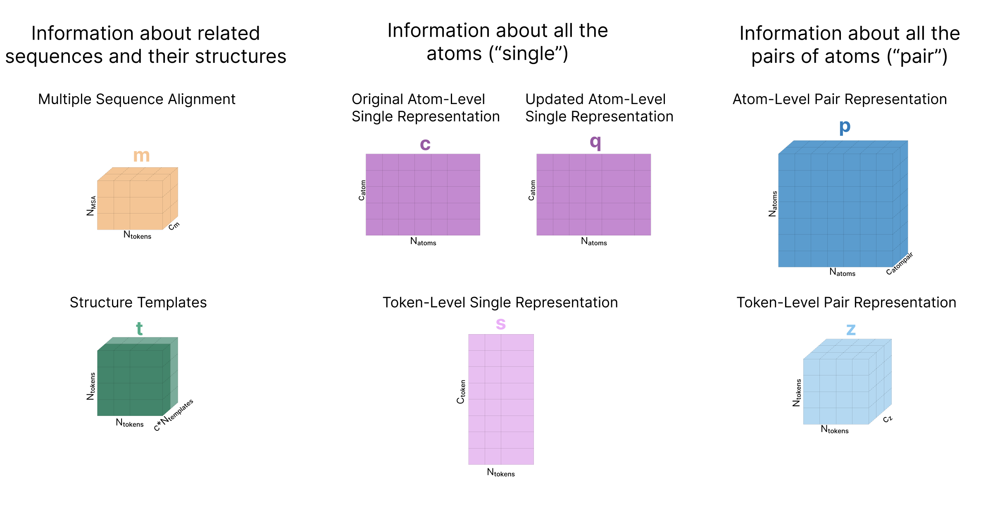

对于第 2 步，我们将暂时搁置原子级表示（**c**、**q**、**p**），并在下一节中专注于更新我们的 token 级表示 **s** 和 **z**（借助 **m** 和 **t**）。

# 2. 表示学习

*(Diagram modified from full AF3 architecture diagram)*

本节构成了模型的主体，通常被称为"主干"（trunk），因为大部分计算都在这里完成。我们将其称为模型的表示学习部分，因为其目标是学习上面初始化的 token 级"单体"（**s**）和"配对"（**z**）张量的更优表示。（
回想一下，我们所说的"单"序列表示，并不一定是某一个蛋白质的序列，而是我们结构中所有原子或 token 的拼接序列（其中可能包含多个相互独立的分子）。）

本节包含：

1. **Template module（模板模块）** 使用结构模板 **t** 更新 **z**
2. **MSA module（MSA 模块）** 先更新 MSA **m**，再将其加到 token 级的配对表示 **z** 上。在本节中，我们会花大量篇幅介绍两个操作：
   - [外积均值（Outer Product Mean）](#outer-product-mean) 让 **m** 能够影响 **z**
   - [仅使用配对偏置的 MSA 逐行门控自注意力](#row-wise-gated-self-attention-using-only-pair-bias) 基于 **z** 更新 **m**，它是带配对偏置注意力（专为 MSA 设计）的简化版本
3. **Pairformer** 使用受几何启发的（三角形）注意力更新 **s** 和 **z**。本节主要描述三角形操作（在 AF2 和 AF3 中都被广泛使用）。
   - [为什么要看三角形？](#why-look-at-triangles) 解释了三角形操作背后的部分直觉
   - [三角形更新](#triangle-updates) 和 [三角形注意力](#triangle-attention) 都使用与自注意力类似的方法更新 **z**，但受到了三角不等式（triangle inequality）的启发
   - [带配对偏置的单注意力](#single-attention-with-pair-bias) 基于 **z** 更新 **s**，它是带配对偏置注意力的 token 级等价形式（专为单序列设计）

每个独立的模块都会重复多次，然后整个部分的输出会再次作为输入反馈给它自身，并重复这一过程（这被称为循环复用，recycling）。

## Template Module（模板模块）

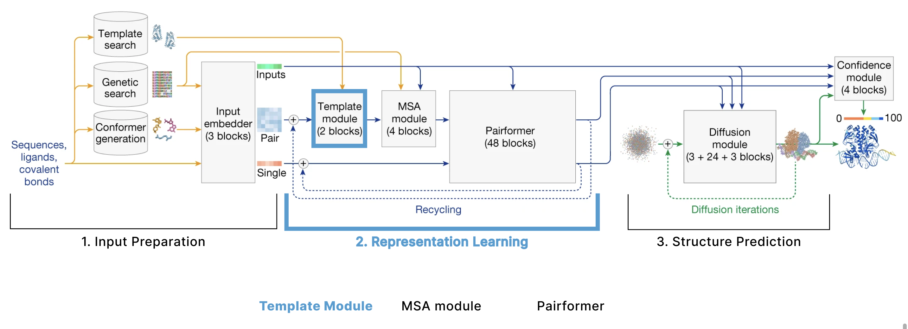

*看看它在整体架构中的位置*

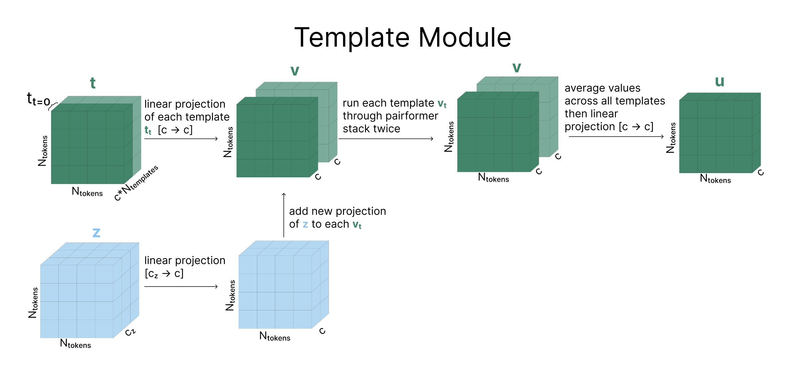

每个模板（图中 Ntemplates=2）都会经过一个线性投影，并与我们的配对表示（**z**）的线性投影相加。这个新组合出的矩阵会经过一系列被称为 Pairformer Stack 的操作（后文会详细描述）。最后，所有模板会被平均在一起，并——你猜对了——再经过一个线性层。（在 AF3 补充材料中，根据你查看的位置不同，这个东西有时被称为 template module，有时被称为 template embedder，但它们似乎指的就是同一个东西。）有趣的是，这最后一个线性层使用 ReLU 作为非线性，这本无特别之处，只是它是 AF3 中仅有的两处使用 ReLU 作为非线性的地方之一。和往常一样，我们只能推测为什么这样选择。

## MSA Module（MSA 模块）

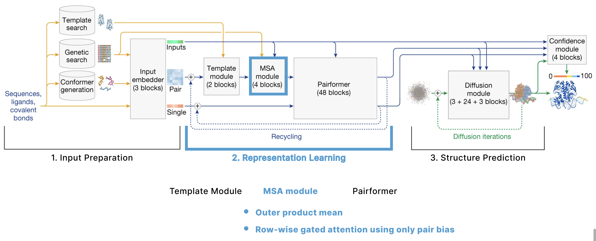

*看看它在整体架构中的位置*

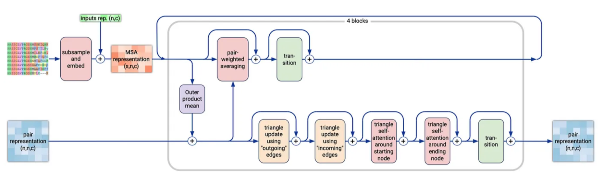

*Architecture of MSA Module. {Diagram from AF3}*

这个模块与 AF2 中被称为"Evoformer"的部分非常相似，其目标是同时改进 MSA 表示和配对表示。它会对这两种表示独立地执行一系列操作，然后还会在它们之间建立交互。

第一步是对 MSA 的行进行子采样，而不是使用之前生成的全部 MSA 行（最多可达 16k），然后将我们的单体表示的一个投影版本加到子采样后的 MSA 上。

### 外积均值（Outer Product Mean）

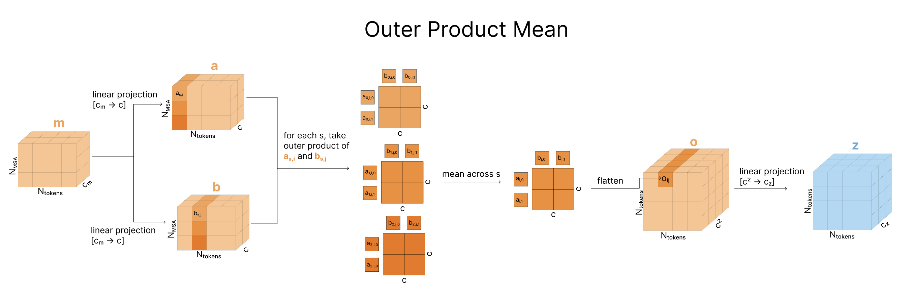

接下来，我们通过"外积均值"（Outer Product Mean）将 MSA 表示融入到配对表示中。比较 MSA 的两列可以揭示序列中两个位置之间关系的信息（_例如_ 这两个位置在整个进化过程中有多相关）。对于每一对 token 索引 i,j，我们遍历所有进化序列，取 **ms,i** 和 **ms,j** 的外积，然后在所有进化序列上求平均。接着我们将这个外积展平，投影回低维，再将其加到配对表示 **zi,j** 上（完整细节见图）。虽然每个外积只比较了某个给定序列 **ms** _内部_ 的值，但当我们对这些求均值时，就把信息在 _不同_ 序列之间混合了。_这是整个模型中唯一一处信息在进化序列之间共享的地方。_ 这是一项重大改动，用于降低（相对 AF2）Evoformer 的计算复杂度。

### 仅使用配对偏置的逐行门控自注意力

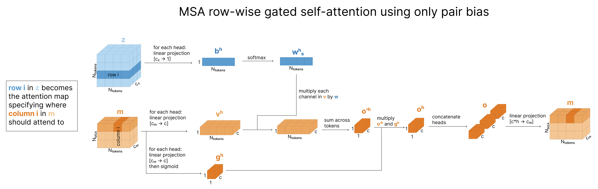

在基于 MSA 更新了配对表示之后，模型接下来基于配对表示更新 MSA。这种特定的更新模式被称为**仅使用配对偏置的逐行门控自注意力**，它是**带配对偏置的自注意力**的简化版本（在 Atom Transformer 一节中讨论），并独立地应用到 MSA 中的每一个序列（行）上。它受到注意力的启发，但不是使用 query 和 key 来决定每个 token 应该关注哪些其他位置，而是直接使用存储在我们配对表示 **z** 中 token 之间已有的关系。

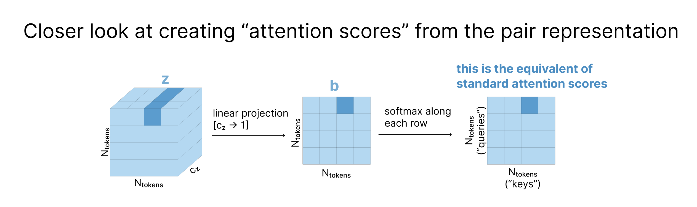

在配对表示中，每个 **zi,j** 都是一个包含 token i 和 j 之间关系信息的向量。当张量 **z** 被投影成一个矩阵时，每个 **zi,j** 向量都会变成一个标量，可用来确定 token i 应该关注 token j 的程度。在应用逐行 softmax 之后，这些值就等价于注意力分数，并像典型的注意力图那样被用来对 value 做加权平均。

注意，由于这个过程是对每一行独立运行的，所以 MSA 中不同的进化序列之间没有共享信息。

### 配对表示的更新
MSA 模块的最后一步是通过一系列被称为三角形更新和三角形注意力的步骤来更新配对表示。这些三角形操作会在下文的 Pairformer 中描述，因为那里会再次用到它们。此外还有一些过渡层（transition block），它们像 Atom Transformer 中那样使用 SwiGLU 对矩阵进行升维/降维投影。

## Pairformer 模块

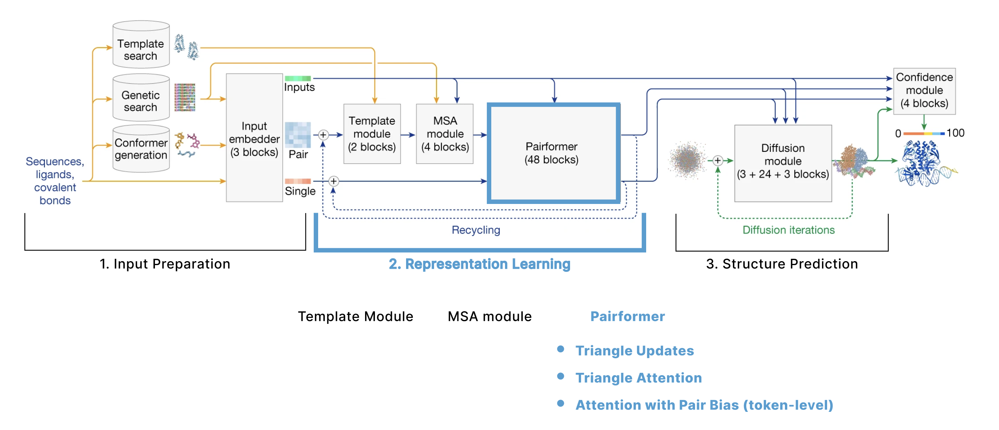

*看看它在整体架构中的位置*

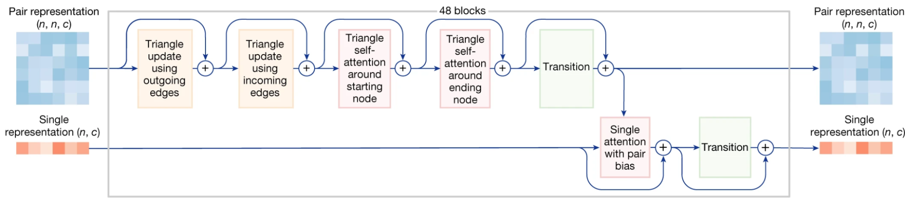
Diagram from AF3 supplement

在用模板和 MSA 更新了配对表示之后，我们在模型的其余部分就不再使用它们了。取而代之的是，只有更新后的配对表示（**z**）和单体表示（**s**）进入 Pairformer，并被用来互相更新。由于过渡层（transition block）已经描述过了，本节重点介绍三角形更新和三角形注意力，然后简要说明带配对偏置的单注意力与前面描述的变体有何不同。这些基于三角形的层最初在 AF2 中引入，不仅保留到了 AF3 中，而且在架构中出现的频率更高了，因此它们得到了相当多的关注。

### 为什么要看三角形？

这里的指导原则是三角不等式的思想："三角形任意两边之和大于或等于第三边"。回想一下，对张量中的每个 **zi,j** 都编码了序列中位置 i 和 j 之间的关系。虽然它并不字面地编码 token 对之间的物理距离，但我们不妨暂时把它想象成距离。如果我们想象每个 **zi,j** 是两个氨基酸之间的距离，并且我们知道 **zi,j**=1 和 **zj,k**=1。根据三角不等式，**zi,k** 不可能大于 2。知道其中两个距离，就让我们对第三个距离应当是多少有了很强的先验。三角形更新和三角形注意力的目标就是尝试把这些几何约束编码进模型中。

模型中并没有强制施加三角不等式，而是通过确保每个位置 **zi,j** 在更新时一次性考察所有可能的位置三元组（**i**，**j**，**k**）来鼓励它。因此 **zi,j** 会基于所有其他原子 k 的 **zj,k** 和 **zi,k** 来更新。由于 **z** 表示的是这些 token 之间复杂的物理关系，而不仅仅是它们的距离，所以这些关系可能是有方向的。因此对于 **zi,j**，我们还希望鼓励它与所有原子 k 的 **zk,i** 和 **zk,j** 保持一致。如果我们把原子看作一张图，把 **z** 看作一个有向邻接矩阵，那么 AlphaFold 把这些称为"出边"（outgoing edges）和"入边"（incoming edges）就说得通了。

考虑这个邻接矩阵的第 i=0 行，假设我们想更新 **z0,2**，它已用紫色高亮。这个更新背后的想法是：如果我们知道 0→1 和 2→1 之间的距离，那就对 0→2 可能是什么给出了某些约束。同样，如果我们知道 0→3 和 2→3 之间的距离，这也会对 0→2 给出约束。这对所有原子 k 都适用。

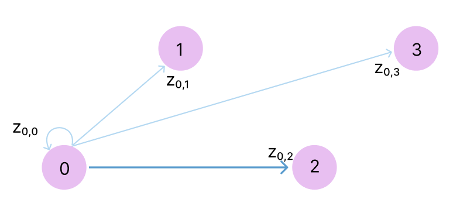

因此，在三角形更新和三角形注意力中，我们实际上考察的是这张图中 3 个节点的所有有向路径（也就是三角形，这正是其名字的由来！）。

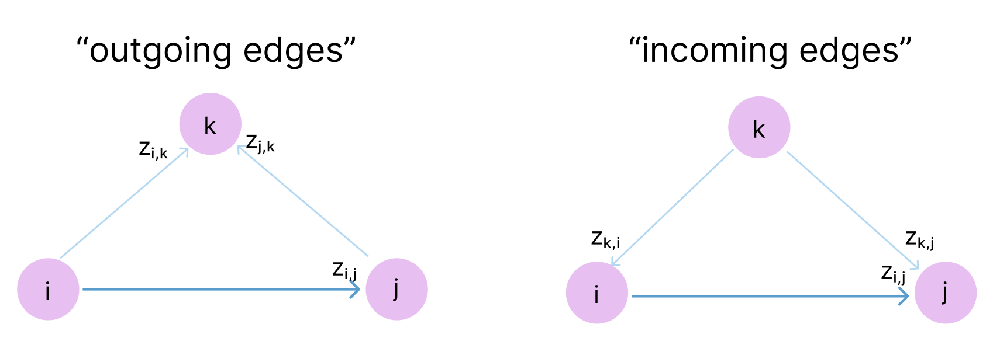

### 三角形更新

在从图论的角度仔细考察了三角形操作之后，我们来看它是如何用张量操作实现的。在出边更新中，配对表示里的每个位置 **zi,j** 都会基于同一行中其他元素的加权组合独立更新，其中每个 **zi,k** 的权重取决于它出边三角形中的第三个元素（**zj,k**）。

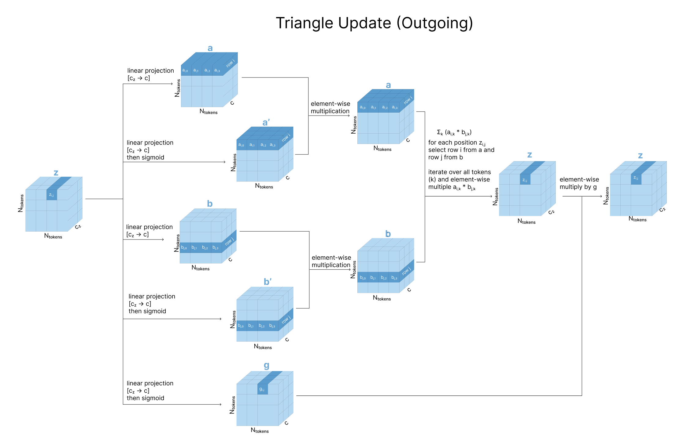

实际操作中，我们取 **z** 的三个线性投影（称为 a、b 和 g）。为了更新 **zi,j**，我们对 **a 的第 i 行** 和 **b 的第 j 行** 做逐元素相乘。然后对所有这样的行（不同的 k 值）求和，再用我们的 g 投影做门控。

此时你可能会注意到，门控在这个架构中被到处使用！

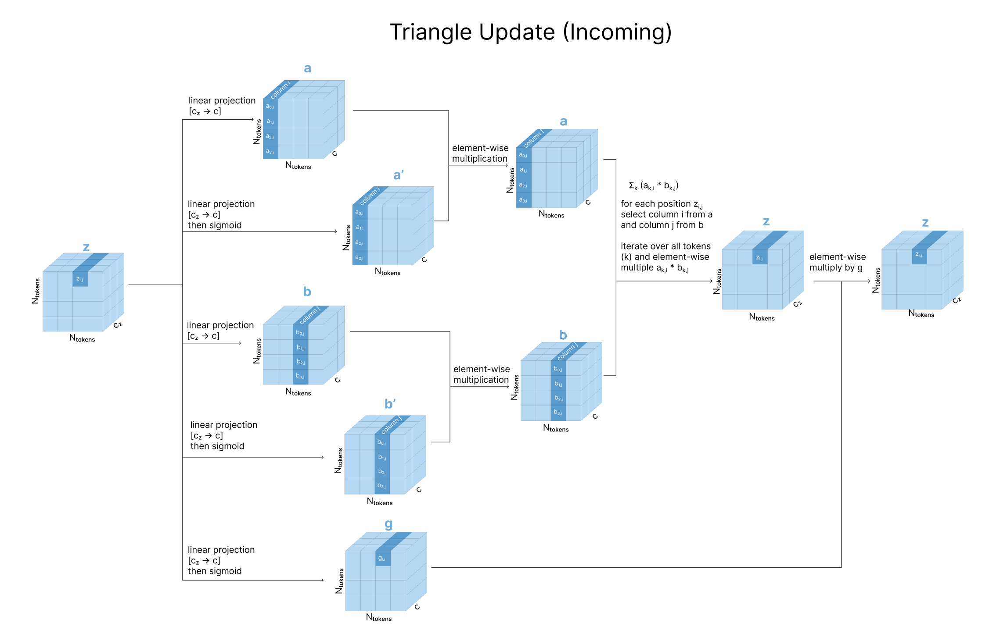

对于入边更新，我们实际上做同样的事情，只是把行和列对调，因此要更新 **zi,j**，我们取同一列中其他元素（**zk,j**）的加权和，其中每个 **zk,j** 的权重取决于它出边三角形中的第三个元素（**zk,i**）。在创建同样的线性投影之后，我们对 a 的**第 i 列**和 b 的**第 j 列**做逐元素相乘，并对**该矩阵的所有行**求和。你会发现，这些操作与上面描述的图论邻接视角完全对应。

### 三角形注意力

在我们的两个三角形更新步骤之后，我们还会分别针对出边和入边，使用**三角形注意力**更新每个 **zi,j**。AF3 论文把"出边"称为围绕起始节点的注意力（attention "around starting node"），把"入边"称为围绕结束节点的注意力（attention "around ending node"）。

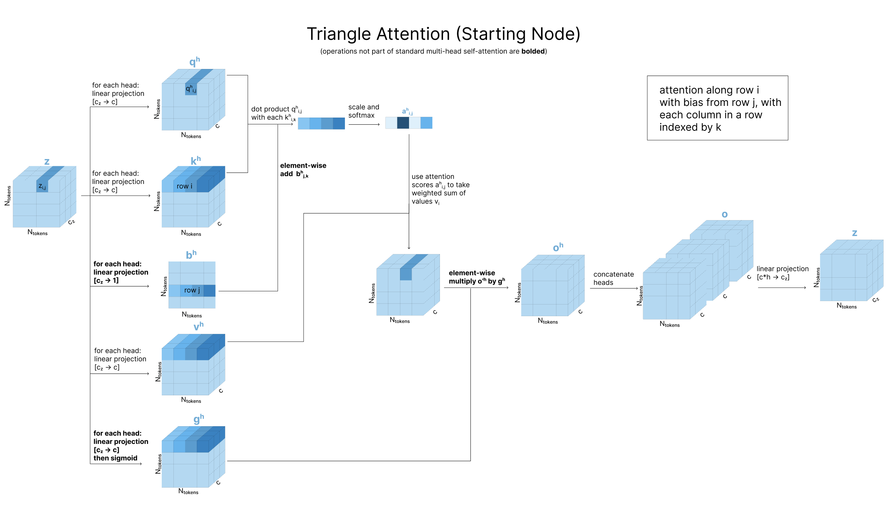

为了更好地理解三角形注意力，从一维序列上的典型自注意力出发会很有帮助。回想一下，query、key 和 value 都是对原始一维序列的变换。一种称为[轴向注意力（axial attention）](https://arxiv.org/abs/1912.12180)的注意力变体将其扩展到了矩阵，做法是在二维矩阵的不同轴上（先对行，再对列）分别应用独立的一维自注意力。三角形注意力在此基础上加入了我们之前讨论的三角形原则，通过纳入所有原子 k 的 **zi,k** 和 **zj,k** 来更新 **zi,j**。具体来说，在"起始节点"的情形中，为了计算沿第 i 行的注意力分数（以确定 **zi,j** 应受 **zi,k** 影响的多少），我们像往常一样对 **zi,j** 和 **zi,k** 做 query-key 比较，然后如上图所示基于 **zj,k** 对注意力施加偏置。

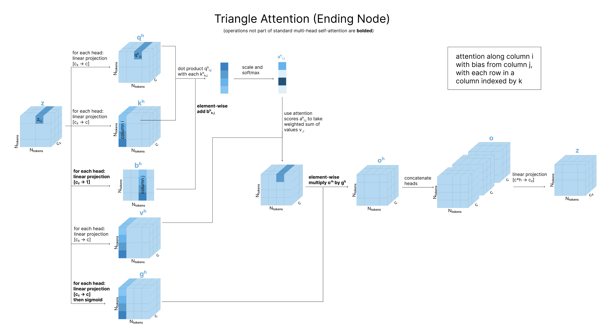

对于"结束节点"的情形，我们再次把行换成列。对于 **zi,j**，key 和 value 都将来自 **z** 的第 i 列，而偏置将来自第 j 列。因此，当把 query **zi,j** 与 key **zk,i** 进行比较时，我们基于 **zk,j** 对该注意力分数施加偏置。然后，一旦我们得到了所有 k 上的注意力分数，就使用来自第 i 列的 value 向量。

### 带配对偏置的单注意力

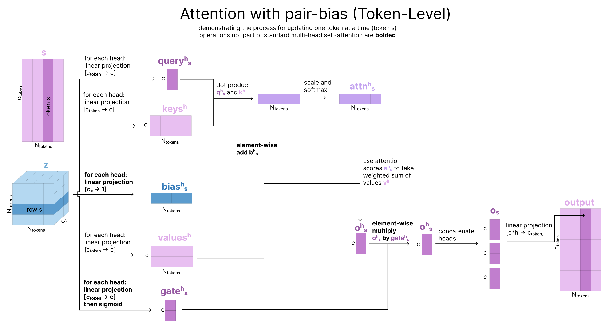

现在我们已经用这四个三角形步骤更新了配对表示，接着把配对表示传过一个如上所述的 Transition block。最后，我们想用这个新更新过的配对表示（**z**）来更新我们的单体表示（**s**），因此我们会使用带配对偏置的单注意力，如下图所示。这与 Atom Transformer 一节中描述的带配对偏置的单注意力（作为参考，在 AF3 补充材料中，带配对偏置的单注意力也被称为"Attention Pair Bias"。）完全相同，只是作用于 token 级。由于它工作在 token 级，所以使用的是完全注意力，而不是在原子级操作时使用的分块稀疏模式。

我们将 Pairformer 重复 48 个 block，最终得到 **strunk** 和 **ztrunk**。

# 3. 结构预测

## 扩散基础
现在，借助这些精炼后的表示，我们准备用 **s** 和 **z** 来预测复合物的结构。AF3 引入的改动之一是：整个结构预测都基于原子级别的扩散（atom-level diffusion）。已有文章更详尽地解释了扩散的[直觉](https://www.superannotate.com/blog/diffusion-models)与[数学](https://lilianweng.github.io/posts/2021-07-11-diffusion-models/)，但扩散模型（Diffusion Model）的基本思想是：从真实数据出发，向数据中加入随机噪声，然后训练一个模型去预测加入了什么噪声。噪声在一系列 T 个时间步（timestep）中迭代地加入数据，从而为每个数据点生成由 T 个变体构成的序列。我们把原始数据点称为 xt=0，把完全加噪后的版本称为 xt=T。训练时，在第 t 个时间步，模型接收 xt，并预测在 xt-1 与 xt 之间加入了什么噪声。我们根据预测所加的噪声与实际所加噪声之间的差异，执行一步梯度更新。

然后，在推理时，我们只需从随机噪声开始，它等价于 xt=T。对每一个时间步，我们预测模型认为已加入的噪声，并移除该预测噪声。经过预先指定数量的时间步后，我们最终得到一个完全"去噪"的数据点，它应当与数据集中的原始数据相似。

条件扩散（Conditional Diffusion）让模型能够以某个输入为条件来"条件化"这些去噪预测。实际上，这意味着模型在每一步都接收三个输入：
1. 我们当前生成的含噪迭代结果
2. 我们所处的当前时间步的表示
3. 我们想要作为条件的信息（这可以是生成图像时的文字描述，也可以是蛋白质的性质）。

因此，最终的生成结果不只是一个与训练数据分布相似的随机样本，而应当专门匹配该条件向量所表示的信息。

在 AF3 中，我们学习去噪的数据是一个矩阵 **x**，它包含我们序列中所有原子的 x、y、z 坐标。训练时，我们向这些坐标加入高斯噪声，直到它们实际上完全随机。然后在推理时，我们从随机坐标开始。在每个时间步，我们首先对整个预测出的复合物进行随机旋转和平移。这种数据增强让模型明白：我们复合物的任何旋转与平移都同样成立，并取代了 AF2 中复杂得多的不变点注意力（Invariant Point Attention）。（AF2 曾发展出一套名为不变点注意力（IPA）的复杂架构，旨在强制实现对平移和旋转的等变性。这引发了关于 IPA 在 AF2 成功中重要性的激烈争论。在 AF3 中，它被弃用，转而采用一种简单得多的方法：将随机旋转和平移作为数据增强来应用，帮助模型自然地学会这种等变性。所以在这里，我们只需围绕当前生成结果的中心（所有原子坐标的均值）随机旋转所有原子的坐标，并从 N(0,1) 高斯分布中为每个维度（x、y 和 z）随机采样一个平移量。从算法来看，平移似乎是普适的，也就是说对当前生成结果中的每个原子施加相同的平移。这种数据增强方式因 CNN 而流行起来，但在过去几年里，像 IPA 这样的等变架构被认为是一种更高效、更优雅的解决同一问题的方法。因此，当 AF3 用数据增强取代等变注意力时，引发了大量网络讨论。） 随后我们向坐标加入少量噪声，以鼓励生成结果更加多样化。（让模型生成若干略有差异的变体是有好处的。在推理时，我们可以用置信度头（confidence head）为每一个打分，只返回得分最高的生成结果。） 最后，我们用扩散模块（Diffusion Module）预测一个去噪步骤。我们将在下文中更详细地介绍这个模块：

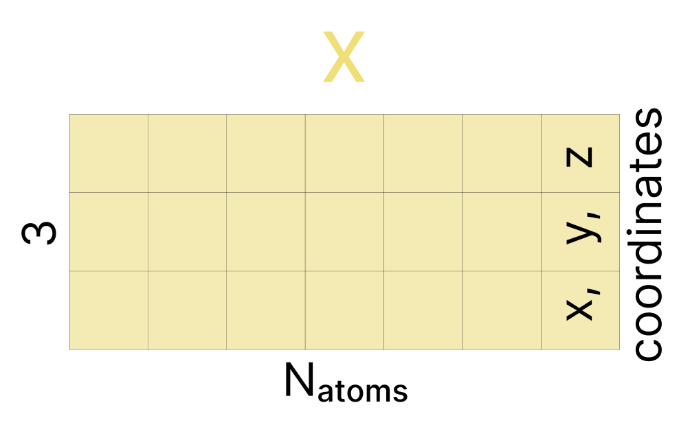 待去噪的数据（坐标）

## 扩散模块

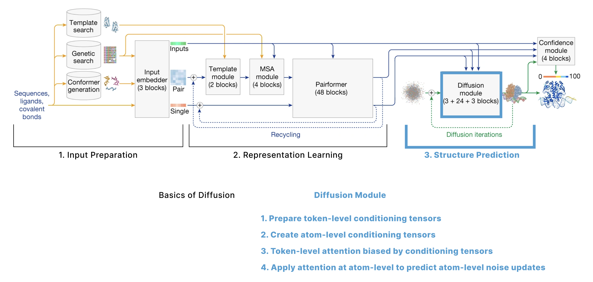

*查看它在整体架构中的位置*

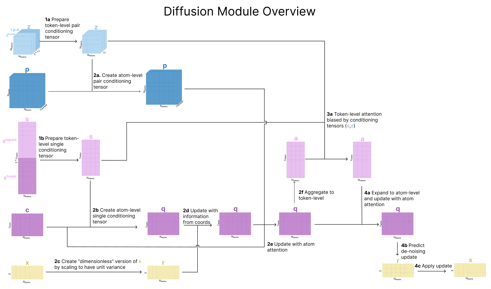

在每一个去噪扩散步骤中，我们对输入序列的多种表示进行条件化：

* 主干（trunk）的输出（即经过 Pairformer 之后更新得到的 **s** 和 **z**，现在称为 **strunk** 和 **ztrunk**）
* 在输入嵌入器（input embedder）中创建、且尚未经过主干（trunk）的序列初始原子级与 token 级表示（**sinputs**，**cinputs**）

AF3 论文将其扩散过程拆解为 4 个步骤，涉及从 token 到原子、再回到 token、最后再回到原子的过程：

1. [**准备 token 级条件张量**](#1-prepare-token-level-conditioning-tensors)
2. [**准备原子级条件张量，用 Atom Transformer 更新它们，并将它们聚合回 token 级**](#2-prepare-atom-level-tensors-apply-atom-level-attention-and-aggregate-back-to-token-level)
3. [**在 token 级施加注意力，并投影回原子**](#3-apply-attention-at-the-token-level)
4. [**在原子级施加注意力以预测原子级噪声更新**](#4-apply-attention-at-the-atom-level-to-predict-atom-level-noise-updates)

### 1. 准备 token 级条件张量

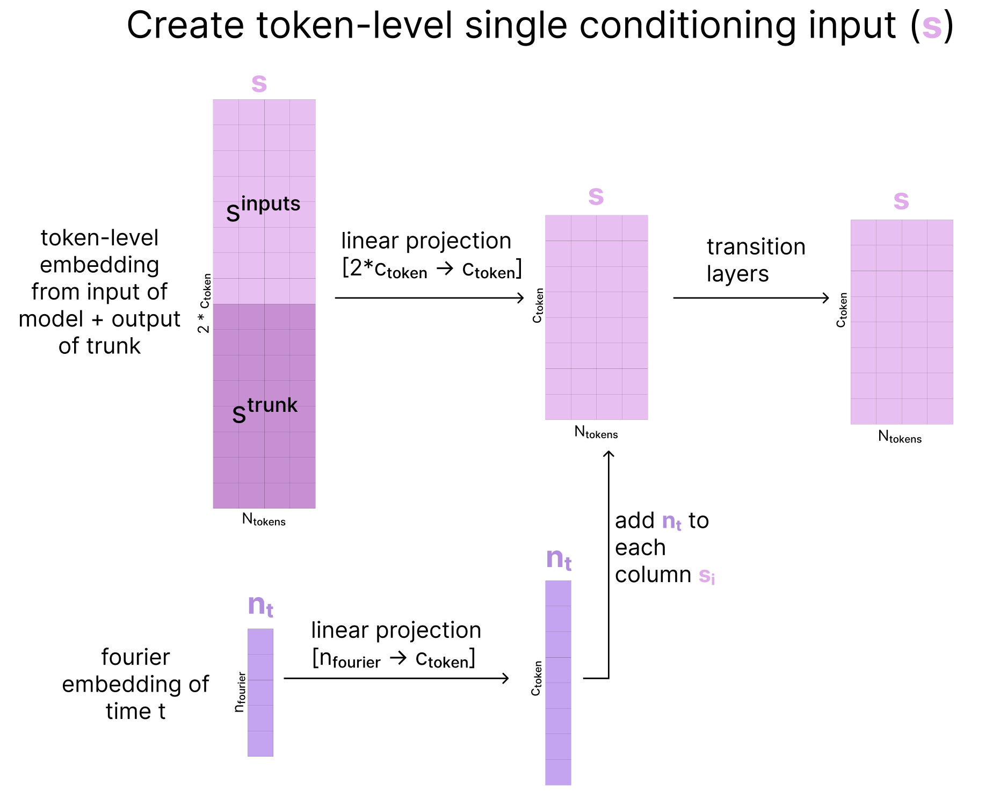

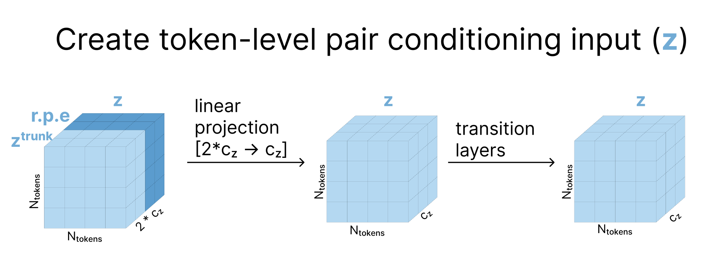

为初始化我们的 token 级条件表示，我们将 **ztrunk** 与相对位置编码（relative positional encodings）拼接，然后将这个更大的表示投影回较小维度，并让它通过若干个带残差连接的过渡层（transition block）。

类似地，对于 token 级单体表示（single representation），我们将模型开始时创建的输入的初始表示（**sinputs**）与当前表示（**strunk**）拼接，然后投影回其原始大小。接着，我们基于当前扩散时间步创建一个傅里叶嵌入（Fourier embedding）（更具体地说，是噪声调度（Noise Schedule）中与该时间步相关联的噪声量），把它加到我们的单体表示上，并让这个组合通过若干个过渡层（transition block）。通过在此处的条件输入中包含扩散时间步，可以确保模型在做去噪预测时清楚扩散过程中的时间步，从而为该时间步预测出正确的待移除噪声尺度。

### 2. 准备原子级张量，施加原子级注意力，并聚合回 token 级

此时，我们的条件向量以逐 token 的粒度存储信息，但我们还希望在原子级上运行注意力。为此，我们取在嵌入（Embedding）部分创建的输入的初始原子级表示（**c** 和 **p**），基于当前的 token 级表示对它们进行更新，从而创建原子级条件张量。

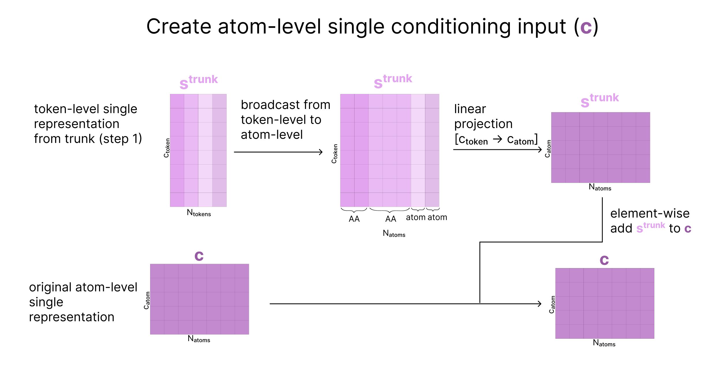

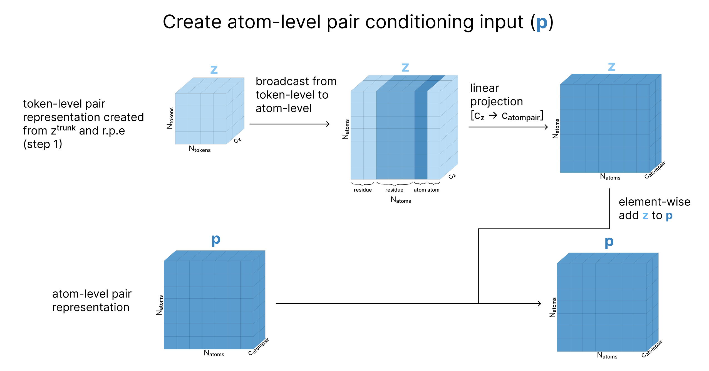

接着，我们用数据的方差来缩放原子的当前坐标（**x**），从而有效地创建出具有单位方差的"无量纲"坐标（称为 **r**）。然后，我们基于 **r** 更新 **q**，使得 **q** 现在能感知原子当前的位置。最后，我们用 Atom Transformer（它也把 pair 表示作为输入）更新 **q**，并像前面看到的那样把原子聚合回 token。（回想输入准备部分：Atom Transformer 在原子之上运行稀疏注意力，且所有步骤（层归一化、注意力、门控）都以条件张量 <b>c</b> 为条件。）

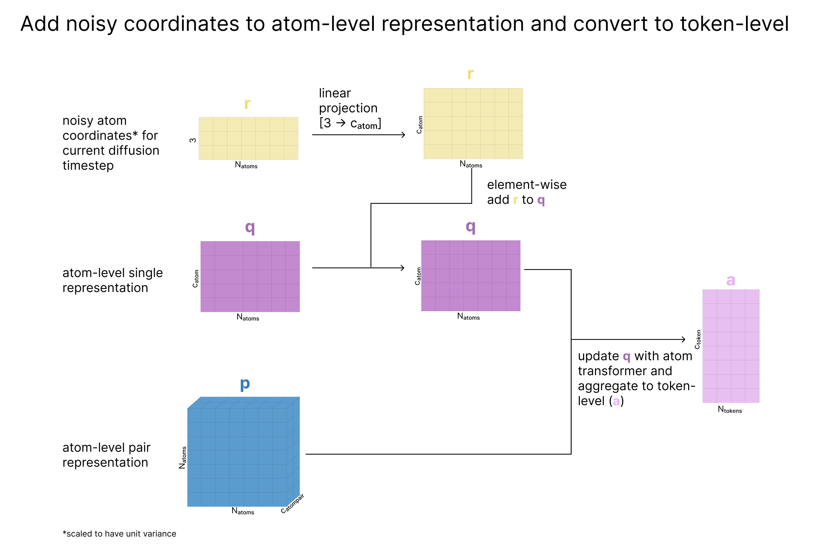

在这一步结束时，我们返回
* **q**：融入了原子当前坐标信息后更新得到的原子表示
* **a**：q 在 token 级聚合后的形式，捕获了坐标和序列信息
* **c**：基于 trunk、用于条件化的原子表示
* **p**：我们更新后、用于条件化的原子对（atom-pair）表示

### 3. 在 token 级施加注意力

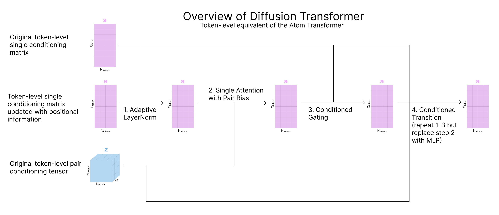

这一步的目标是施加注意力，以更新我们对原子坐标和序列信息的 token 级表示 a。这一步使用在输入准备部分展示过的 Diffusion Transformer，它类似 Atom Transformer，但作用于 token。

### 4. 在原子级施加注意力以预测原子级噪声更新

现在，我们回到原子空间。我们用更新后的 **a**（基于当前"中心原子"位置的 token 级表示），通过 Atom Transformer 来更新 **q**（基于当前位置、所有原子的原子级表示）。正如第 3 步所做的那样，我们将 token 表示广播到与开始时原子数量相匹配（选择性地复制代表多个原子的 token），并运行 Atom Transformer。最重要的是，最后一个线性层把这个原子级表示 **q** 映射回 R3。
这是关键的一步：我们使用了所有这些条件表示，为所有原子生成坐标更新 **rupdate**。现在，由于我们是在"无量纲"空间 rl 中生成这些更新的，我们要小心地重新缩放（这种小心的缩放既涉及我们数据的方差，也涉及基于当前时间步的噪声调度，从而使我们的更新随着去噪过程越走越深而越来越小。），把更新从 **rupdate** 转换为具有非单位方差的形式 **xupdate**，并将这些更新应用到 **xl**。

至此，我们完成了对 AlphaFold 3 主要架构的巡览！接下来，我们将提供关于损失函数、辅助置信度头和训练细节的一些补充信息。

# 4. 损失函数及其他训练细节

## 损失函数与置信度头
Lloss = Ldistogram * αdistogram  +  Ldiffusion * αdiffusion  +  Lconfidence * αconfidence

该损失是 3 个项的加权和：

* **Ldistogram**：在 token 层面上评估预测的距离分布图（distogram）的准确度。
* **Ldiffusion**：在原子层面上评估预测的距离分布图的准确度。它考察所有成对距离，然后加入额外的项，以优先考虑邻近原子之间以及参与蛋白质-配体键的原子之间的距离。
* **Lconfidence**：评估模型对哪些结构可能不准确的自我意识。

### Ldistogram
我们模型的输出是原子级坐标，可以很容易地用来构建原子级的距离分布图（回想一下最初距离分布图是如何通过对原子间成对距离进行分箱来创建的）。然而，这个损失评估的是 token 级的距离分布图。为了得到 token 的 xyz 坐标，我们只需使用"中心原子"（center atom）的坐标。由于这些距离分布图距离是类别型的，因此预测的距离分布图会通过交叉熵与真实距离分布图进行比较。

### Ldiffusion
扩散损失本身是三个项的加权和，每一项都在原子位置上计算，并额外乘以当前时间步所添加的噪声量（t^，即当前时间步采样得到的噪声水平，以及 σdata，即数据的方差，它决定了每个时间步的噪声量）：

Ldiffusion = (LMSE + Lbond * αbond) * (t̂² + σdata²)/(t̂+σdata)² + Lsmooth_lddt

* **LMSE** 是我们刚讨论的距离分布图损失的一个版本，但作用于所有原子而不只是"中心原子"（并且对 DNA、RNA 和配体原子加权）。此外，它考察位置之间的均方误差，而不是将它们分箱成距离分布图。
* **Lbond** 旨在通过为参与蛋白质-配体键的原子对添加一个额外的 MSE 损失（基于预测距离分布图与真值距离分布图之间的差异），来确保蛋白质-配体键的键长准确。（训练分为多个阶段，αbond 在初始阶段设为 0，因此该项只在后期引入。）
* **Lsmooth_LDDT**（平滑局部距离差异测试，smoothed local distance difference test）是距离分布图损失的又一个变体，试图捕捉局部距离的准确度。如果某个原子对的预测距离落在该原子对真实距离的给定阈值之内，则它"通过测试"。为了使这个指标平滑且可微，我们将预测距离分布图与真值距离分布图之间的差异通过一个以测试阈值为中心的 sigmoid。我们可以把它理解为生成该原子对通过测试的概率（介于 0 和 1 之间）。我们对四个阈值越来越严格的"测试"（4、2、1 和 0.5 Å）取平均值。使用这个损失鼓励模型降低在每个测试中失败的概率。最后，为了使测试"局部化"，如果某个原子对的真值距离很大，我们就忽略该原子对的损失，因为我们只希望模型专注于准确预测某个原子到邻近原子的距离（具体来说，对于原子对 l、m，如果原子 m 属于核苷酸，而 l 与 m 相距超过 30 Å，我们就忽略 l 和 m 的损失。如果 l 和 m 彼此相距超过 15 Å，且 m 不是核苷酸（即属于蛋白质或配体），我们也忽略 l 和 m 的损失。）。

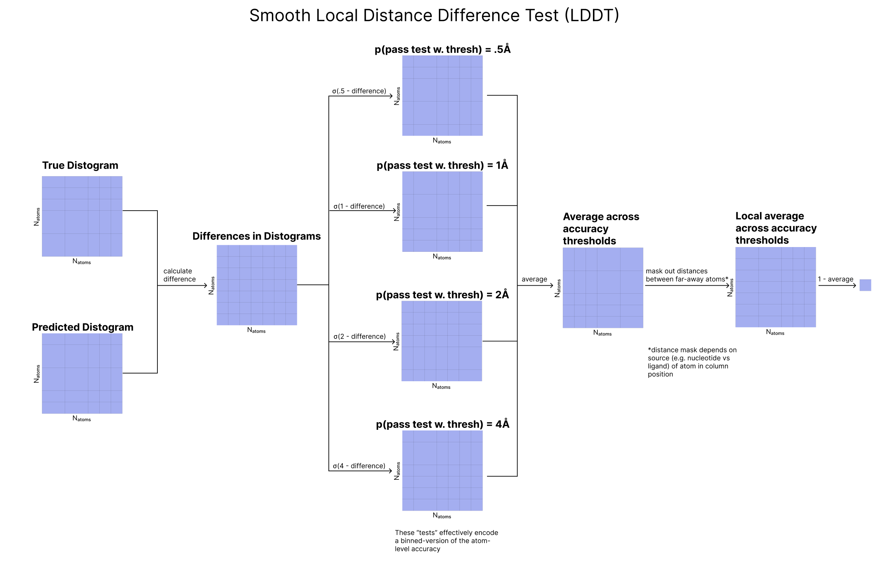

### Lconfidence

这个损失的目标不是提高结构的准确度，而是教会模型预测自身的准确度。该损失是 4 个项的加权和，每一项对应一种评估预测结构质量的方法：

Lconfidence = LplDDT + LPDE + Lresolved + LPAE * αPAE

* **lDDT**：原子级的"局部距离差异测试"，捕捉某个原子到邻近原子的预测距离的预期准确度。

* **PAE**：token i 的预测位置与真值位置之间的预测对齐误差（Predicted alignment error）。我们首先将预测的 token i 和真值的 token i 旋转并平移进 token j 的参考系。也就是说，如果我们暂且假设 token j 恰好处于其真值位置，那么我们就根据 token i 与 token j 的关系，预测 token i 离它应在的位置有多近。

* **PDE**：token 之间的预测距离误差（Predicted distance error），捕捉所有 token 对之间预测差异的准确度。

* **实验解析预测（Experimentally resolved prediction）**：模型预测哪些原子是被实验解析出来的（并非每个原子在每个晶体结构中都能被实验解析）。

为了得到每种指标的这些置信度损失，AF3 会预测这些误差指标的值，然后在预测结构上计算实际的误差指标，损失则基于这两者之间的差异。因此，即使结构确实非常错误、PAE 很高，但只要预测的 PAE 也很高，Lpae 就会很低。

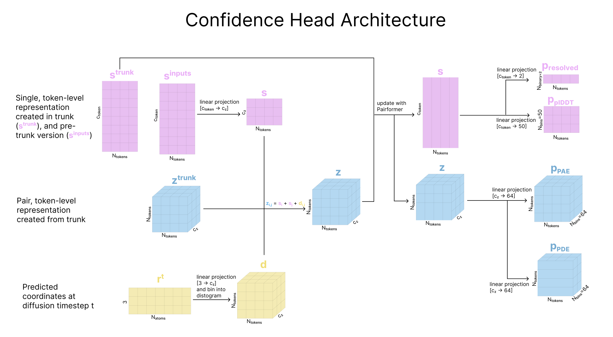

这些置信度预测是在扩散过程中途生成的。在选定的扩散步 t，预测坐标 **rt** 被用来更新在表示学习主干（representation learning trunk）中创建的单体表示和配对表示。然后，预测误差由更新后的配对表示（用于 PAE 和 PDE）或更新后的单体表示（用于 pLDDT 和实验解析）的线性投影计算得出。接着，基于同一批生成的原子坐标计算实际的误差指标（若感兴趣，过程见下文）以进行比较。

虽然这些项被纳入置信度头的损失中，但来自这些项的梯度只用于更新置信度预测头，不会影响模型的其余部分。

实际的误差指标是如何计算的？

<b>pLDDT：</b> 原子 l 的 LDDT 按如下方式计算：在当前预测结构中，我们计算原子 l 与一个由 m 索引的原子集合 R 中每个原子之间的距离，并将其与真值中的对应量进行比较。要属于这个集合，原子 m 必须是某条聚合物链的一部分、位于 l 的 15 或 30 Å 范围内（取决于 m 所属的分子），并且是某个 token 的中心原子。然后我们计算四个阈值越来越严格的二值距离测试（4、2、1 和 0.5 Å），取平均通过率，并在 R 中的原子上求和。我们将这个百分比分箱到 0 到 1 之间的 50 个箱中。

在推理时，我们有一个 pLDDT 头。这个头接收给定 token 的单体表示，将其复制到"附着"在该 token 上的所有原子上（严格来说，是附着在任意 token 上的最大原子数，以便我们能够堆叠张量），然后将所有这些原子级表示投影到我们 pLDDT_l 的 50 个箱。我们将这些视为 50 个"类别"上的 logits，用 softmax 转换为概率，并在这些箱上取一个多分类损失。

<b>预测对齐误差（PAE）：</b> 每个 token 都被认为有一个参考系，即由该 token 所涉及的三个原子（称为 a、b、c）创建的 3D 坐标参考系。这三个原子中的原子 b 构成该参考系的原点。在每个 token 只有一个原子"附着"的情况下，参考系的中心原子就是该 token 的单个原子，而同一实体（例如同一配体）的另外两个最近的 token 构成参考系的基。对于每个 token 对 (i,j)，我们用 token_j 的参考系重新表达 token_i 中心原子的预测坐标。我们对 token_i 中心原子的真值坐标做同样的操作。token_i 中心原子在这些变换后的真实坐标与预测坐标之间的欧几里得距离就是我们的对齐误差，分箱到 64 个箱。我们由配对表示 <b>zi,j</b> 预测这个对齐误差，将其投影到 64 维并视为 logits，再用 softmax 转换为概率。我们用分类损失训练这个头，每个箱作为一个类别。更多细节见<a href="https://www.ebi.ac.uk/training/online/courses/alphafold/inputs-and-outputs/evaluating-alphafolds-predicted-structures-using-confidence-scores/pae-a-measure-of-global-confidence-in-alphafold-predictions/">此处</a>。

第三，AF3 预测 token 之间的距离误差（PDE）。真实距离误差的计算方式是：取每个 token 对中心原子之间的距离，将这些距离分箱到从 0 Å 到 32 Å 的 64 个均匀大小的箱中。预测的距离误差来自将配对表示 <b>zi,j</b> 加上配对表示 <b>zj,i</b> 投影到 64 维，我们同样将其视为 logits，并再次用 softmax 转换为概率。

最后，AF3 预测每个原子是否在真值结构中被实验解析。与 pLDDT 头类似，我们将 <b>si</b> 单体表示复制到该 token 所代表的原子数量，然后投影到 2 维并使用二分类损失。

---

## 其他训练细节
既然架构已经讲完，最后几块内容是其他一些训练细节。

### 循环复用（Recycling）
正如 AF2 中引入的，AF3 会循环复用其权重；也就是说，模型并不通过加深来提升，而是复用同一组权重，让输入多次通过各模块，从而不断改进表示。扩散在推理时本质上就使用了循环复用，因为模型被训练成会纳入时间步信息，并对每个时间步使用相同的模型权重。

### 交叉蒸馏（Cross-distillation）
AF3 使用了混合的合成训练数据，这些数据既由它自己生成（通过自蒸馏），也由 AF2 生成（通过[交叉蒸馏](https://link.springer.com/article/10.1007/s11263-024-02002-0)）。具体来说，作者指出，在改用基于扩散的生成模块后，模型不再产生那种特征性的"意大利面"（spaghetti）区域——正是那些区域让 AF2 的用户能够凭肉眼识别出低置信度、很可能无序的区域。仅从视觉上看基于扩散生成的结果，所有区域看起来都同样高置信度，这使得识别潜在幻觉变得更加困难。

为了解决这个问题，他们在 AF3 的训练数据中加入了来自 AF2 和 AF-Multimer 的生成结果，让模型学会：当 AF2 对其预测不自信时，它应当输出这些未折叠区域，并"指示" AF3 也这样做。（蒸馏数据集中的核酸和小分子必须被移除，因为 AF2 和 AF-multimer 无法处理它们。然而，一旦前代模型生成了新的预测结构，并将这些结构与原始结构对齐后，被移除的分子就会被加回来。如果加回来后产生了新的原子碰撞，则整个结构都会被排除，以避免无意中教会模型接受碰撞。）

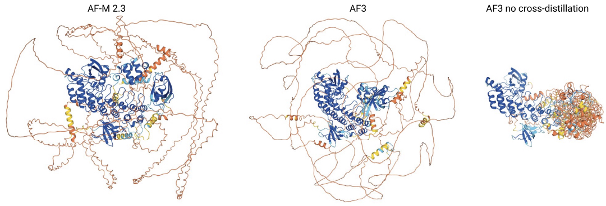

*（图来自 AF3 论文）*

### 裁剪与训练阶段
虽然模型的任何部分都没有对输入序列长度设置明确限制，但内存和计算需求会随序列长度显著增加（回想那些多次出现的 O(Ntokens3) 操作）。因此，出于效率考虑，蛋白质会被随机裁剪。正如 AF-multimer 中引入的，由于我们想要建模多条链之间的相互作用，随机裁剪需要把所有这些链都包含进来。他们使用 3 种裁剪方法，并且这 3 种方法会根据不同训练数据（例如 PDB 晶体结构 vs 无序 PDB 复合物 vs 蒸馏等）以不同比例使用。

* 连续裁剪（Contiguous cropping）：为每条链选取连续的氨基酸序列
* 空间裁剪（Spatial cropping）：根据到参考原子的距离来选取氨基酸（通常这个原子属于某个特定的链或感兴趣的结合界面）
* 空间界面裁剪（Spatial interface cropping）：与空间裁剪类似，但基于到特别是位于结合界面的原子的距离。

虽然在 384 长度随机裁剪上训练的模型可以应用到更长的序列，但为了提升模型处理这些序列的能力，它会在更长的序列长度上迭代地微调。各个训练阶段中数据集的混合方式和其他训练细节也有所不同，如下表所示。

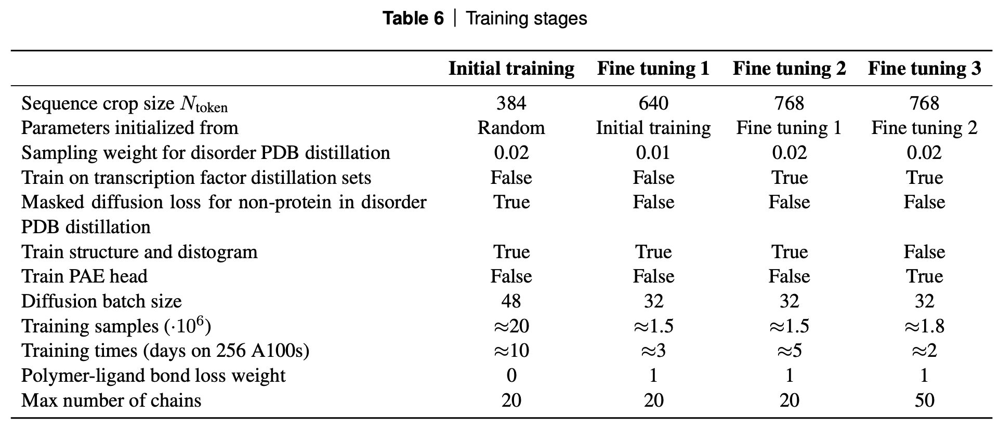

*（表来自 AF3 补充材料）*

### 碰撞（Clashing）
作者指出，AF3 的损失不包含针对重叠原子的碰撞惩罚。虽然改用基于扩散的结构模块意味着模型理论上可能预测出两个原子位于同一位置，但训练之后这种情况似乎很少。话虽如此，AF3 在对生成结构进行排序时确实采用了碰撞惩罚。

### 批大小
尽管扩散过程听起来相当复杂，但它在计算上仍然比模型的主干（trunk）便宜得多。因此，AF3 作者发现，从训练角度看，在主干之后扩大模型的批大小更为高效。所以，对于每个输入结构，它先经过嵌入和主干，然后应用该结构的 48 个独立的数据增强版本，这 48 个结构并行训练。

**训练过程就讲到这里！** 还有一些其他小细节，但到这里可能已经超出你所需了，如果你读到了这里，剩下的内容应该很容易通过阅读 AF3 补充材料来掌握。

# 机器学习随想
在如此彻底地梳理了 AF3 的架构及其与 AF2 的对比之后，看到作者所做的选择如何契合更广泛的机器学习趋势，是一件很有意思的事。

### AlphaFold 作为检索增强生成
在 AF2 发布时，在推理时引入来自训练集的检索并不常见。就 AF 而言，它利用了 MSA 和模板搜索。基于 MSA 的方法当时已被用于蛋白质建模，但这种检索方式在深度学习的其他领域使用较少（例如，计算机视觉中的 ResNet 在分类一张新图像时，并不会在推理时嵌入相关的训练图像）。尽管与 AF2 相比，AF3 降低了对 MSA 的重视程度（它不再在 Evoformer/Pairformer 的 48 个块中被运算和更新），他们仍然同时纳入了 MSA 和模板，即便像 ESMFold 这样的其他蛋白质预测模型已经放弃检索，转而采用完全参数化的推理。

有趣的是，如今一些规模最大、最成功的深度学习模型在推理时也常常纳入类似的额外信息。虽然检索系统的细节并不总是被公开，但大型语言模型在推理时经常使用检索增强生成（Retrieval Augmented Generation）系统，例如传统网页搜索，来引导模型关注相关信息（即使这些信息很可能已经存在于其训练数据中），从而指导推理。未来在推理时使用直接相关的样本会如何发展，将是一件值得关注的事。

### 配对偏置注意力（Pair-Bias Attention）
AF2 的主要组件之一，在 AF3 中甚至更加普遍，就是配对偏置注意力。也就是说，query、key 和 value 都来自同一来源（如同自注意力），但注意力图上会加入一个来自另一来源的偏置项。这实际上起到了一种轻量级信息共享的作用，而无需完整的交叉注意力。配对偏置注意力几乎出现在每一个模块中。虽然这种注意力现在也被用于其他蛋白质建模架构，但我们还没有在其他领域看到这种特定的交叉偏置用法（尽管这并不意味着没人做过！）。也许它只在这里效果好，是因为配对表示本身就天然类似于一张自注意力图，但它是纯粹自注意力或纯粹交叉注意力之外一个引人入胜的替代方案。

### 自监督训练
像 ESM 这样的自监督模型通过用自监督预训练得到的"概率 MSA"替代 MSA 嵌入，在预测蛋白质结构方面取得了令人印象深刻的成果。在 AF2 中，模型有一个额外的任务，即预测来自 MSA 的被掩码 token，实现了类似的自监督，但这一任务在 AF3 中被移除了。我们还没有看到作者对这些问题的评论：为什么他们没有在 MSA 上使用任何自监督语言建模预训练方法，反而减少了用于处理 MSA 的计算量。自监督学习没有被用来初始化 MSA 嵌入，可能有三个原因：1）他们认为大规模预训练阶段是对计算资源的次优使用；2）他们尝试过，发现包含一个小型 MSA 模块的效果优于预训练嵌入，且值得付出额外的推理时成本；或者 3）对氨基酸 token 使用预训练嵌入、同时对 DNA/RNA/配体使用随机初始化嵌入，这种做法不兼容，或者在其混合的原子-token 结构上表现不如完全监督训练。（由于专注于自监督任务，ESM 系列模型也比 AF3 简单得多（尽管它们不处理 DNA/RNA/配体，并且目标略有不同）。有趣的是，当一些模型致力于最大化架构的简洁性时，AlphaFold 却依然如此复杂！）

### 分类 vs. 回归
与 AF2 一样，AF3 继续混用 MSE 损失和分箱分类损失。分类部分很有意思，因为如果模型预测的距离分布图箱只差一格，它并不会因为"接近"而非"差得远"而得到任何"加分"。目前尚不清楚是什么影响了这一设计决策，但也许作者发现其梯度比使用多个不同的 MSE 损失更稳定，也许每个原子的损失经历了如此多的梯度步，以至于来自连续损失的额外信号并不会带来好处。

### 与循环架构（如 LSTM）的相似之处
AF3 的架构融入了若干令人联想到循环神经网络、而在传统 Transformer 中通常不常见的设计元素：
* 广泛的门控（Gating）：AF3 在整个架构中使用门控机制来控制残差流中的信息流动。这更类似于 LSTM 或 GRU 中的门控，而非普通 Transformer 层标准的纯前馈特性。
* 带权重复用的迭代处理：AF3 多次应用同一组权重来逐步精炼其预测。这个过程既涉及循环复用，也涉及扩散模型，类似于循环网络使用一组共享权重随时间步处理序列数据的方式。它不同于标准 Transformer，后者通常在一次前向传播中完成预测。这种方法让 AF3 能够在不增加参数数量的情况下迭代地改进其蛋白质结构预测。
* 自适应计算（Adaptive Computation）：循环复用也类似于扩散中使用的迭代更新，并且与自适应计算时间（adaptive compute time，[ACT](https://arxiv.org/abs/1603.08983)）的思想密切相关，后者最初被引入以动态决定 RNN 应使用多少计算量，最近又在 [Mixture-of-Depths](https://arxiv.org/pdf/2404.02258) 中被用于在 Transformer 上实现类似目标。这与标准 Transformer 固定深度的做法形成对比，理论上将允许模型对具有挑战性的输入施加更多处理。

AF2 的消融实验表明循环复用很重要，但关于门控重要性的讨论却很少。想必它像在 LSTM 中那样有助于训练稳定性，但有趣的是，它在这里如此普遍，却在许多其他基于 Transformer 的架构中并不常见。

### 交叉蒸馏
使用 AF2 的生成结果专门为低置信度区域重新引入其独特风格，这一点非常有意思。如果这里有可供借鉴的教训，那可能是最实用的一条：如果你的上一代模型在某件具体事情上比你的新模型做得更好，你可以尝试交叉蒸馏，从而兼得两者之长！

---

如果你读到了这里，感谢阅读，希望对你有所帮助！！如果你有任何问题 / 评论 / 纠正 / 反馈，欢迎在 twitter 上联系我们（[E](https://twitter.com/ElanaPearl/)、[J](https://twitter.com/JakeSilberg)）或发邮件（<a href="mailto:epsimon@stanford.edu" target="_blank">E</a>、<a href="mailto:jsilberg@stanford.edu" target="_blank">J</a>）！

特别感谢 [Kristy Carpenter](https://x.com/kristyacarp)、[Nicholas Joseph](https://twitter.com/nickevanjoseph)、[Kyle Swanson](https://swansonkyle.com/) 和 [Kara Liu](https://karamarieliu.github.io/) 对本文提供反馈 💜

