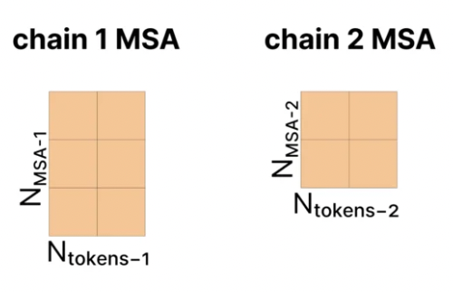

# AlphaFold3 架构解析（一）：输入准备（Input Preparation）

> 本文为 [shenyichong/alphafold3-architecture-walkthrough](https://github.com/shenyichong/alphafold3-architecture-walkthrough)（MIT License）中文版，已在原译文基础上做通顺化与术语统一。配图来自该仓库。

## **MSA 和 Templates 是如何来的？**

### 为什么需要 MSA？

- 同一类蛋白质在不同物种、不同版本中，其序列和结构可能是相似的。通过把这些蛋白质集合起来，我们可以观察到一个蛋白质的某些位置是如何随着进化而改变的。
- MSA 的每一行代表来自不同物种的相似蛋白质。列上的保守模式可以反映出该位置对某些特定氨基酸的重要程度。不同列之间的关系则反映出氨基酸之间的相互关系（如果两个氨基酸在物理上相互作用，那么它们在进化过程中氨基酸的变化也可能是相关的）。因此，MSA 常被用来丰富单一蛋白质的表示。

### 为什么需要 Templates？

- 类似地，如果上述 MSA 中包含了已知的结构，那么它很可能有助于预测当前蛋白质的结构。Template 只关心单链的结构。

### 如何获取 MSA？

- 使用 genetic search 搜索相近的蛋白质或 RNA 链，一条链一般会搜索出 N_msa（<16384）条相近的链：

    

- 如果是多条链，且来自相同物种、可以配对（paired），那么 MSA 矩阵的形式可能如下：

    

- 否则就是下面这样，构成一个对角矩阵（diagonal matrix）：

    

### 如何获取 Templates？

- 使用 Template Search：对于生成的 MSA，使用 HMM 在 PDB 数据库中寻找与之相似的蛋白质序列，然后从这些匹配到的序列中挑选 4 个质量最高的结构作为模板。

### 如何表征 Templates？

- 计算每一个 token 与 token 之间的欧几里得距离，并用离散化的距离表示（具体来说，值被划分为 38 个区间，范围从 3.15Å 到 50.75Å，外加一个额外的区间表示超过 50.75Å 的距离）。
- 如果某些 token 包含多个原子，则选择中心原子用于计算距离，例如 Cɑ 是氨基酸的中心原子，C1′ 是核苷酸的中心原子。
- 模板只包含同一条链上的距离信息，忽略了链之间的相互作用。

## **如何构建 Atom-level 的表征？**

#### 构建 p 和 q

- 构建得到 p 和 q：【对应 Algorithm 5 AtomAttentionEncoder】
    - 为了构建 atom-level 的单体表示（single representation），首先需要所有原子层面的特征。第一步是为每一个氨基酸、核苷酸以及配体（ligand）构建一个参考构象（reference conformer），参考构象可以通过特定的方式查出来或算出来，作为局部的先验三维结构信息。
    - c 就是针对参考构象中的各个特征进行 concatenate 之后，再进行一次线性变换的结果。c 的形状为 [C_atom=128, N_atoms]，其中 C_atom 为每一个 atom 线性变换之后的特征维度，N_atoms 为序列中所有原子的个数。c_l 代表 l 位置的原子特征，c_m 代表 m 位置的原子特征。

        

    - atom-level 的单体表示 q，通过 c 进行初始化：

        

    - 然后使用 c 来初始化 atom-level 的原子对表征 p（atom-level pair representation），p 表征的是原子之间的相对距离，具体过程如下：
        1. 计算原子参考三维坐标之间的距离，得到的结果是一个三维的向量。

            

        2. 因为原子的参考三维坐标仅仅是针对其自身参考构象得到的，属于局部信息，所以只在 token 内部（氨基酸、核苷酸、配体等）计算距离。因此需要计算得到一个 mask v，只有当 chain_id 和 residue_idx 都相同时才相互计算坐标位置差异，此时 v 为 1，其他情况下 v 为 0。

            

        3. 计算 p，形状为 [N_atoms, N_atoms, C_atompair=16]：

            

            - p(l,m) 向量的维度为 [C_atompair]，计算方式为：对 d(l,m) 三维向量通过一个线性层，得到一个维度为 C_atompair 的向量，同时乘一个用于 mask 的标量 v(l,m)。
            - 距离的平方倒数 1/(1+||d(l,m)||^2) 是一个标量，先经过一个线性变换变成 [C_atompair] 的向量，同时再乘一个用于 mask 的标量 v(l,m)。p(l,m) = p(l,m) + 这个新的向量。
            - 最后，p(l,m) 再加上 mask 这个标量。

            

            - p(l,m) 还需要加上原始 c 中的信息，包含 c(:, l) 的信息和 c(:, m) 的信息；这两个信息都先经过 relu，然后再做线性变换，变换成 C_atompair 的向量，加到 p(l,m) 中。
            - 最后 p(l,m) = p(l,m) + 三层 MLP(p(l,m))

#### 更新 q（Atom Transformer）

- 更新 q（Atom Transformer）：
    1. Adaptive LayerNorm：【对应 Algorithm 26 AdaLN】
        - 输入为 c 和 q，形状都是 [C_atom, N_atoms]。c 作为次要输入，主要用于计算 q 的 gamma 和 beta 值，从而通过 c 来动态调整 q 的 LayerNorm 结果。
        - 具体来说，正常的 LayerNorm 是这样做的：

            

        - 而 Adaptive LayerNorm 是这样做的：

            

            - 公式是这样的：

                

                - 这里的 a 就是 q，s 就是 c。
                - 计算时，sigmoid(Linear(s)) 相当于新的 gamma，LinearNoBias(s) 相当于新的 beta。
    2. Attention with Pair Bias：【对应 Algorithm 24 AttentionPairBias】
        - 输入为 q 和 p，q 的形状为 [C_atom, N_atoms]，p 的形状是 [N_atoms, N_atoms, C_atompair]。
        - 作为典型的 Attention 结构，(Q, K, V) 都来自 q，形状为 [C_atom, N_atoms]。
            - 假设是 N_head 头的 attention，其中 a_i 代表 q 中的第 i 个原子的向量 q_i，那么对于第 h 个头、第 i 个 q 向量，得到其 (q_h_i, k_h_i, v_h_i)：

                

                - 这里的维度 c 是这样得到的：

                    

            - Pair-biasing：从哪里来？从 p 中提取第 i 行，即第 i 个原子和其他原子的关系，那么 p_i_j 就是第 i 个原子和第 j 个原子之间的关系，向量形状为 [C_atompair]，在公式中用 z_i_j 代表 p_i_j。
                - z_i_j 先在 C_atompair 维度上做一次 LayerNorm，然后再做一次线性变换，从 C_atompair 维降到 1 维：

                    

                - 然后在 softmax 之前引入此 pair bias：此时针对第 i 个原子和第 j 个原子的向量 q_h_i 和 k_h_i 先做向量点乘再 scale，再加上一个标量 b_h_i_j 后进行 softmax，得到权重 A_h_i_j：

                    

                - 然后直接计算对于第 i 个原子的 attention 结果：

                    

            - Gating：从 q 中获取第 i 个原子的向量：
                - 先做一次线性变换，从 c_atom 维变到 Head 的维度 c 上，然后直接求 sigmoid，将其映射到 0 到 1 之间的一个数作为 gating。

                    

                - 然后与 attention 的结果进行 element-wise 相乘，最终将所有 Head concatenate 起来，并最后经过一个线性变换，得到 attention 的结果 q_i，形状是 [C_atom]。

                    

            - Sparse attention：因为原子的数量远远大于 token 的数量，所以这里计算 atom attention 时，从计算量上考虑，并不会计算一个原子对所有原子的 attention，而是计算一个局部的 attention，叫做 sequence-local atom attention，具体方法是：
                - 在计算 attention 时，将不关心位置 (i,j) 的 softmax 结果近似为 0，这相当于在 softmax 之前让特定位置 (i,j) 的值为负无穷大，通过引入的 beta_i_j 来进行区分：

                    

                    - 如果 i 和 j 之间的距离满足条件，那么就需要计算 atom attention，此时 beta_i_j 为 0。
                    - 如果 i 和 j 之间的距离不满足条件，那么就不需要计算 attention，此时 beta_i_j 为 -10^10。
    3. Conditioned Gating：【对应 Algorithm 24 AttentionPairBias】
        - 输入是 c 和 q，形状分别是 [C_atom, N_atoms]、[C_atom, N_atoms]，输出是 q，形状是 [C_atom, N_atoms]。
        - 这里公式中的 s_i 实际上就是 c_i，先做一次线性变换，然后计算 sigmoid，将 c_i 中的每一个元素映射到 0 和 1 之间，最后与 a_i（实际上就是 q_i）进行 element-wise 相乘，得到最新的 q_i：

            

    4. Conditioned Transition：【对应 Algorithm 25 ConditionalTransitionBlock】
        - 输入是 c、q 和 p，形状分别是 [C_atom, N_atoms]、[C_atom, N_atoms]、[N_atoms, N_atoms, C_atompair]，输出是 q，形状是 [C_atom, N_atoms]。
        - 这是 Atom Transformer 的最后一个模块，相当于 Transformer 中的 MLP 层。说它是 Conditional，是因为它夹在 Adaptive LayerNorm 层（前面第 1 步）和 Conditional Gating（前面第 3 步）之间，区别只是中间是 MLP 还是 Attention。
            - 第一步还是一个 Adaptive LayerNorm：

                

            - 第二步是一个 swish：

                

            - 第三步是 Conditional Gating：

                

## **如何构建 Token-level 的表征？**

#### Token 级单序列表征

- 构建 Token-level 的单序列表征（Single Sequence Representation）
    - 输入是 q，即 atom-level 的单体表示，形状是 [C_atom, N_atoms]。输出是 S_inputs 和 S_init，形状分别是 [C_token+65, N_tokens]、[C_token, N_tokens]。
    - 首先将每一个 atom 的表示维度 C_atom 经过线性变换到 C_token，然后经过 relu 激活函数，再在相同的 token 内部对所有 atom 表示求平均，得到 N_token 个 C_token 维度的向量。【来自 Algorithm 5 AtomAttentionEncoder】

        

    - 然后针对有 MSA 特征的 token，拼接上 residue_type（32）和 MSA 特征（MSA properties：32+1），从而得到 S_input。【来自 Algorithm 2 InputFeatureEmbedder】

        

    - 最后再进行一次线性变换，从 S_input 转换为 S_init。【来自 Algorithm 1 MainInferenceLoop】

        

        - 注意：这里的 C_s 就是 C_token = 384

#### Token 级对表征

- 构建 Token-level 的对表征（Pair Representation）【来自 Algorithm 1 MainInferenceLoop】
    - 输入是 S_init，形状是 [C_token=384, N_tokens]，输出是 Z_init，形状是 [N_tokens, N_tokens, C_z=128]。
    - 要计算 Z_init_i_j，需要得到特定两个 token 的特征，将其分别进行线性变换后再相加，得到第一个 z_i_j，向量长度从 C_tokens（即 C_s=384）转换为 C_z=128。

        

    - 然后在 z 的 (i, j) 位置加入相对位置编码：

        

        - 详解 RelativePositionEncoding：注意这里的 i 和 j 都指 token。【来自 Algorithm 3 RelativePositionEncoding】

            

            - a_residue_i_j：残基相对位置信息：
                - 如果 i 和 j 两个 token 在同一个链中，那么 d_residue_i_j 就是 i 残基和 j 残基相对位置之差（经 clip 后），范围在 [0, 65]。
                - 如果 i 和 j 两个 token 不在同一个链中，那么 d_residue_i_j = 2*r_max+1 = 65。
                - a_residue_i_j 为一个长度为 66 的 one-hot 编码，1 的位置为 d_residue_i_j 的值。
            - a_token_i_j：token 相对位置信息：
                - 如果 i 和 j 两个 token 在同一个残基中（对于修饰氨基酸或核苷酸，一个原子就是一个 token），那么 d_token_i_j 为 token 序号之差（经 clip 后），范围在 [0, 65]。
                - 如果 i 和 j 两个 token 不在同一个残基中，取最大值 d_token_i_j = 2*r_max+1 = 65。
                - a_token_i_j 为一个长度为 66 的 one-hot 编码，1 的位置为 d_token_i_j 的值。
            - a_chain_i_j：对称拷贝（sym_id）相对位置信息：
                - 如果 i 和 j 两个 token 属于同一个实体（same entity），那么 d_chain_i_j 为 sym_id 之差（经 clip 后），范围在 [0, 2*s_max] = [0, 4]。
                - 如果 i 和 j 两个 token 不属于同一个实体，那么 d_chain_i_j 设置为最大值 2*s_max+1 = 5。
                - a_chain_i_j 为一个长度为 6 的 one-hot 编码，1 的位置为 d_chain_i_j 的值。
            - b_same_entity_i_j：如果 i 和 j 两个 token 在同一个实体中（完全相同的氨基酸序列为唯一实体，拥有唯一实体 id），则为 1，否则为 0。
            - 最后将 [a_residue_i_j, a_token_i_j, b_same_entity_i_j, a_chain_i_j] 拼接起来，得到一个长度为 66+66+1+6 = 139 = C_rpe 的向量。
            - 然后再经过一次线性变换，将其向量维度变换到 C_z=128 维。
    - 最后，将 token 的 bond 信息加入，通过线性变换之后，加入 z_i_j，得到最后的结果。

        
