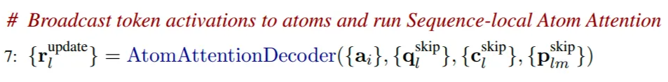

# AlphaFold3 架构解析（三）：结构预测（Structure Prediction）

> 本文为 [shenyichong/alphafold3-architecture-walkthrough](https://github.com/shenyichong/alphafold3-architecture-walkthrough)（MIT License）中文版，已在原译文基础上做通顺化与术语统一。配图来自该仓库。

## 扩散的基本概念

- 在 AlphaFold3 中，整个结构预测模块采用的方法是原子级的扩散（atom-level diffusion）。简单来说，扩散的具体工作方式如下：

  - 从最真实的原始数据开始，假设是一张真实的熊猫照片，然后不断对这张照片加入随机噪声，再训练模型来预测加入了什么样的噪声。
  - 具体步骤如下：
    - 训练阶段：
      - 加噪声过程：
        1. 假设 x(t=0) 是原始数据，在第一个时间步，对数据点 x(t=0) 添加一部分噪声，得到 x(t=1)。
        2. 在第二个时间步，对 x(t=1) 添加噪声，得到 x(t=2)。
        3. 持续重复这个过程，经过 T 步之后，数据完全被噪声覆盖，成为随机噪声 x(t=T)。
      - 模型的目标：给定某一个被噪声污染的数据点 x(t) 和时间步 t，模型需要预测这个数据点是如何从上一步 x(t-1) 转变而来，即模型需要预测在 x(t-1) 到 x(t) 之间添加了什么噪声。
      - 损失函数：模型的预测噪声和实际添加的噪声之间的差异。
    - 预测阶段：
      - 去噪声的过程：
        1. 从纯随机噪声开始，x(t=T) 是完全随机的噪声。
        2. 在每一个时间步 t，模型预测这一步应该移除的噪声，然后去除这些噪声，得到 x(t-1)。
        3. 重复这一过程，逐步从 x(t=T) 移到 x(t=0)。
        4. 最终得到一个去噪声之后的数据点，应该看起来像训练数据。
- 什么是条件扩散（Conditional Diffusion）？

  - 在扩散模型中，模型还可以基于某些输入信息来“控制”生成的结果，这就是条件扩散。
  - 所以不论在训练还是预测的过程中，在每一个时间步上，模型的输入应该包括：
    - 当前在 t 时刻的数据点 x(t)。
    - 当前的时间步 t。
    - 条件信息（如蛋白质的属性等信息，这里主要还是指 token 级和原子级的 single 和 pair 表征作为条件信息）。
  - 模型的输出：预测的从 x(t-1) 到 x(t) 添加的噪声（训练），或者预测从 x(t) 到 x(t-1) 应该移除的噪声（推理）。
- 扩散如何在 AlphaFold3 中进行应用？

  

  - 在 AlphaFold3 中，用于去噪的原始数据为一个矩阵 x，它的维度为 [N_atoms, 3]，其中 3 是每一个原子的坐标 xyz。
  - 在训练的时候，模型会基于一个正确的原子三维坐标序列 x，在每一步进行高斯噪声的添加，直到其坐标完全随机。
  - 然后在推理的时候，模型会从一个完全随机的原子三维坐标序列出发，在每一个时间步，首先会进行一个数据增强（data augmentation）的操作，对三维坐标进行旋转和变换，目的是为了实现 AF2 中的 Invariant Point Attention（IPA）的功能，证明经过旋转和变换之后的三维坐标是相互等价的，然后会再向坐标加入一些噪声来尝试产生一些不同的生成数据，最后，预测当前时间步去噪之后的结果作为下一步的起点。

  

## 结构预测详解

### 采样扩散部分详解（推理过程）

- 扩散的基本过程在 AlphaFold3 中的应用，这里指扩散模型的推理过程在 AlphaFold3 推理过程中的具体算法流程：从初始状态（完全随机的三维结构），然后经过一步一步地去噪，最终返回一个去噪之后的结果（预测的三维结构）。
- 具体的算法伪代码以及解析如下所示：

  

  - 首先它的输入参数包括了很多后续用于条件扩散的输入，包括 f*、{s_inputs_i}、{s_trunk_i}、{z_trunk_i_j}，这些后续主要在 DiffusionModule 这个算法中进行处理，这里暂时忽略不讨论。
  - 其他的输入主要是扩散算法中所需要关注的输入，包括噪声调度表 Noise Schedule $[c_0, c_1, ..., c_T]$、缩放因子（$γ_0$ 和 $γ_{min}$）、噪声缩放系数 noise_scale $λ$，以及步长缩放系数 step_scale η。它们的具体作用介绍如下：
    - 噪声调度表（Noise Schedule）：定义了扩散过程中每一步的噪声强度（以 Å 为单位的噪声水平），它是预先设定好的一系列标量。一般情况下，噪声强度在推理开始时最大，然后慢慢减小，到推理结束时最小。
    - 缩放因子（$γ_0$ 和 $γ_{min}$）与噪声缩放系数 noise_scale $λ$，都用于在采样扩散（Sample Diffusion）推理的每一步开始时，需要先给上一步的迭代结果添加噪声、生成噪声 $\hat\xi_l$ 的作用。
    - 步长缩放系数 step scale η：主要用于后续对 x_l 进行更新的时候，控制每一步迭代中输入更新的幅度，在 x_l 进行更新的过程中 $\vec{x}_l \leftarrow \vec{x}_l^{\text{noisy}} + \eta \cdot dt \cdot \vec{\delta}_l$：如果 η > 1 则增大更新幅度，加快去噪过程；如果 η < 1 则减小更新幅度，使得去噪过程更平滑，但是可能需要更多迭代步数。
  - 具体的算法流程解析如下：
    1. 最初的时候，$\vec{x}_l$ 是完全随机的三维噪声，并按初始噪声水平 $c_0$ 缩放：$\vec{x}_l \sim c_0 \cdot \mathcal{N}(\vec{0}, \mathbf{I}_3)$，维度是 [3]，{$\vec{x}_l$} 的维度是 [N_atoms, 3]。其中 $\mathcal{N}(\vec{0}, \mathbf{I}_3)$ 是多维正态分布，均值为三维向量 [0,0,0]，表示三个维度的均值都是 0；协方差矩阵为 [1, 0, 0; 0, 1, 0; 0, 0, 1]，表示各个维度之间相互独立且方差都为 1。
    2. 接下来进入每一个时间步的循环，从 $\tau=1$ 开始直到 $\tau=T$：
    3. 首先进行一次数据增强，这里的目的是为了解决之前 AlphaFold2 中使用 Invariant Point Attention 方法要去解决的问题，即解决旋转不变性和平移不变性，即一个序列的三维结构的坐标通过随机旋转和平移后实际上得到的新的坐标是等价的，三维结构本质不变，原子和原子之间的相对位置不变。
    4. 按 Algorithm 18：若 $c_\tau > \gamma_{\text{min}}$ 则 $\gamma = \gamma_0$，否则 $\gamma=0$（例如 $\gamma_0=0.8$，$\gamma_{\text{min}}=1.0$）。当 $\gamma=0$ 时本步不再额外注入噪声；当 $\gamma=\gamma_0$ 时，会按公式向当前坐标额外加入噪声。
    5. 时间步取 $\hat{t} = c_{\tau-1}(\gamma+1)$（$\gamma=0$ 时退化为 $\hat{t} = c_{\tau-1}$）。
    6. 计算得到的加噪声为：$\vec{\xi}_l = \lambda\sqrt{\hat{t}^2 - c_{\tau-1}^2}\,\mathcal{N}(\vec{0}, \mathbf{I}_3)$；当 $\gamma=0$ 时该项为 0。
    7. 于是得到加了噪声最后的 $\vec{x}_l^{\text{noisy}} = \vec{x}_l + \vec{\xi}_l$
    8. 这时候调用 DiffusionModule（下一阶段会详解）计算真正此步推理的结果，得到去噪之后的结果 $\{\vec{x}_l^{\text{denoised}}\}$。
    9. 然后开始计算去噪方向的向量 $\vec{\delta}_l = \frac{\left( \vec{x}_l^{\text{noisy}} - \vec{x}_l^{\text{denoised}} \right)}{\hat{t}}$，即从去噪坐标 $\vec{x}_l^{\text{denoised}}$ 指向加噪声坐标 $\vec{x}_l^{\text{noisy}}$ 的方向和幅度（再除以 $\hat{t}$ 做归一化）。可以将其理解为扩散过程中类似于“梯度”或者“方向导数”的量。
    10. 然后计算时间步差值 dt，即当前时间步和之前时间步的差值，为更新提供了一个“步长”，从 $c_\tau$ 到前一个时间步参数 $\hat{t}$ 的差值，这里实际上正好就是 $dt = c_\tau - \hat{t}$。
    11. 最后，更新 $\vec{x}_l$，从加噪声的坐标开始 $\vec{x}_l^{\text{noisy}}$，即 $\vec{x}_l=\vec{x}_l^{\text{noisy}}+\eta \cdot dt \cdot \vec{\delta}_l$。由于这里 dt 大概率是一个负数，乘以 $\vec{\delta}_l$ 后实际上会把坐标推向去噪结果（即减去噪声）。

### 扩散模块部分详解（推理过程）

- **DiffusionConditioning**：准备 token 级的条件化张量（pair 表征 z_i_j 和 single 表征 s_i）
- **AtomAttentionEncoder**：准备原子级的条件化张量（pair 表征 p_l_m、single 表征 q_l、c_l），同时使用其生成 token 级的 single 表征 a_i。
- **DiffusionTransformers**：token 级的 single 表征 a_i 经过 attention 计算，然后映射回原子级。
- **AtomAttentionDecoder**：在原子级上进行 attention 计算，得到预测的原子级去噪结果。

注1：这里原子级的 attention 都被作者标注为局部注意力（local attention），token 级的 attention 都被作者标注为全局注意力（global attention），原因在于原子的数量非常大，在计算原子序列之间的 attention 的时候，也就是计算 AtomTransformer 的时候，实际上都是计算的稀疏注意力，距离当前的 query 原子距离过远的其他原子并不参与当前原子的 attention 计算，否则计算量会非常大，所以它叫做局部注意力。而在 token 级的 attention 计算的时候，则是考虑了整个全局的所有 token 的信息，所以叫做全局注意力。

注2：这里的 AtomAttentionEncoder 中 3 blocks 和 AtomAttentionDecoder 中的 3 blocks，指的就是 AtomTransformer，本质上是加上稀疏偏置之后在原子粒度上的 DiffusionTransformer，而在 token 粒度上的 DiffusionTransformer 是 24 个 blocks。

1. **DiffusionConditioning**

   - 算法伪代码如下：

     
   - 构建 token 级的 pair 条件化输入：{z_i_j}

     

     1. 首先利用 f* 计算相对位置编码，这个相对位置编码是 (i,j) 的函数，代表任意两个 token 之间的相对位置关系，得到结果的维度是 c_z；和 z_trunk_i_j（维度也是 c_z）进行拼接，得到 z_i_j，维度是 2*c_z。
     2. 然后将 z_i_j 进行 layerNorm，之后再进行线性变换，变换到 c_z 的维度上。
     3. 最后经过两次 Transition Layer 的加合，得到一个新的 z_i_j。
   - 构建 token 级的 single 条件化输入：{s_i}

     

     1. 首先将 s_trunk_i 和 s_inputs_i 这两个 single 表征拼接起来，得到 s_i，维度变成 2*c_s+65（s_inputs_i 的维度为 c_s+65）。
     2. 然后对 s_i 进行归一化，然后进行线性变换，维度变成 c_s。
     3. 然后对扩散的时间步长（具体实际上就是当前时间步的 noise schedule 的值）信息（标量），将其映射到高维向量空间，以增强模型捕获时间步长非线性特征的能力。
        1. 具体的伪代码如下所示：

           

           1. 生成 c 维度的向量，每一维都是独立正态分布，得到 w 和 b。
           2. 生成时间步的高维度向量特征，通过 cos 函数将标量时间步长 t 编码到一个高维空间中，具体生成的向量可以理解为如下图（x 为时间步 t，y 的不同值为其在高维空间的向量）所示，每一个 t 切面就是一个 t 时刻的高维向量。

              

              - 不同的频率捕捉了时间步长的多尺度特征（低频表示全局动态，高频表示局部细节）
              - 偏移量增加了嵌入的多样性，使模型能学习到更复杂的时间特征。
        2. 将高维时间步信息先进行归一化，然后进行线性变换后（n → c_s），加入到 token 级的 single 表征 s_i 中去了。
        3. 再经过两次 Transition layer 的加合，得到一个新的 s_i，维度为 c_s。
   - 通过在此 DiffusionCondition 部分加入扩散时间步信息，使得模型在进行去噪过程中能够知道当前扩散过程的时间步，并且预测出需要去掉的正确尺度的噪声。
   - 经过 DiffusionCondition 的结果是在 token 级尺度上的信息，接下来需要在原子级计算原子级别的信息。
2. **AtomAttentionEncoder**

   - 首先将 x_noisy_l 进行缩放，转换为单位方差为 1 的单位向量，其缩放后的结果是一个无量纲的数值，便于保持数值的稳定性。

     
   - 然后正式进入 AtomAttentionEncoder 函数进行计算：

     

     - AtomAttentionEncoder 的输入包括：{f*}（原始特征参考构象特征）、{r_noisy_l}（加入当前噪声的当前时间步原子坐标）、{s_trunk_i}（经过 Pairformer 的 token 级 single 表征）、{z_i_j}（经过 DiffusionConditioning 之后的 token 级 pair 表征）
     - AtomAttentionEncoder 的输出包括：a_i（token 级的 single 表征）、q_l（本模块计算得到的原子级 single 表征）、c_l（基于参考构象获取的原子级初始表征）、p_l_m（本模块计算得到的原子级 pair 表征）。
     - AtomAttentionEncoder 的伪代码如下：（扩散新增的部分突出显示）

       

       - 首先，从原始参考构象表征中计算得到 c_l，并将 q_l 的初始值设定为 c_l，然后从参考构象表征中计算原子级的 pair 表征 p_l_m。
       - 接着，当 r_l 不为空的时候（就是当前扩散部分的推理过程时）：
         - 使用 s_trunk 这个 token 级的 single 特征，获取其在 atom 序号 l 对应的 token 序号 tok_idx(l)，然后获取这个 token 序号对应的 s_trunk 的向量，维度为 c_s（c_token），然后进行 LayerNorm 之后，进行线性变换，维度从 c_s → c_atom。然后再加上 c_l 本身，得到新的 c_l，具体过程如下所示：

           
         - 使用 z 这个 token 级的 pair 特征，获取 atom 序号 l 和 m 对应的 token 序号 tok_idx(l) 和 tok_idx(m)，然后获取这两个维度序号对应的 z 的向量，维度为 c_z，然后进行 LayerNorm 之后，进行线性变换，维度从 c_z → c_atompair。最后再加上 p_l_m 本身，得到新的 p_l_m，具体过程如下所示：

           
         - 针对加入当前噪声的当前时间步原子坐标 r_noisy_l，将其进行线性变换之后，维度变换 3→c_atom，加合到 q_l 上，得到最新的 q_l 结果。
       - 最后，基于 c_l 对 p_l_m 的结果进行更新，将 p_l_m 经过 3 层 MLP 得到 p_l_m，然后通过 AtomTransformer 计算得到最新的 q_l，最后将 q_l 这个原子级的 single 表征，在不同的 token 维度上求平均，得到 a_i（token 级的 single 表征）的结果。于是，通过 AtomAttentionEncoder 就得到以下结果：
         - {q_l}：更新之后的原子级 single 表征，包含了当前 atom 的坐标信息。
         - {c_l}：原子级 single 表征，基于 Pairformer 的 token 级 single 表征更新过的变量，主要作用是基于主干（Trunk）进行条件化。
         - {p_l_m}：原子级 pair 表征，用于后续扩散的条件化。
         - {a_i}：token 级 single 表征，从 q_l 中聚合而来。同时包含了原子级的坐标信息和 token 级的序列信息。
3. **DiffusionTransformers**

   - 具体的伪代码如下所示：这一部分主要是对上一步计算出来的 token 级信息 a_i（其包含了原子三维坐标信息和序列信息）进行 self-attention。

     

     - 首先，对从 **DiffusionConditioning** 计算得到的 token 级 single 表征 {s_i} 出发，计算它的 LayerNorm 结果之后，再进行线性变换，将其变换到 a_i 的维度，线性变换维度为 c_token → c_s，然后再加上 {a_i} 本身进行逐元素相加，得到新的 {a_i}。
     - 然后，对 token 级的信息 {a_i} 进行 attention，并且使用从 DiffusionConditioning 计算得到的 {s_i} 和 {z_i_j} 进行条件化，注意这里的 DiffusionTransformer 和在之前的所有 DiffusionTransformer 的一个大的区别是，这里是针对 token 级的（即原子 transformer 在 token 级的等价形式），所以这里的 $\beta_{ij} = 0$ 表示不加入稀疏 attention 的偏置。下面也给出一个示意图：

       
     - 最后，a_i 经过一个 LayerNorm 并进行输出，维度为 c_token。
4. **AtomAttentionDecoder**

   伪代码如下：

   

   - 现在，我们返回到 Atom 空间，使用更新之后的 a_i 来将其广播到每一个 atom 上，以更新原子级的 single 表征 q_l。

     
   - 然后，使用 Atom Transformer 来更新 q_l。

     
   - 最后，将更新后的 q_l 经过 LayerNorm 和线性变换之后，映射到原子序列的三维坐标上，得到 r_update_l。

     
   - 最后的最后，在 AtomAttentionDecoder 之外，将“无量纲（dimensionless）”的 r_update_l，重新 rescale 到非单位标准差的 x_out_l 上去，返回的就是 x_denoised_l。

     
