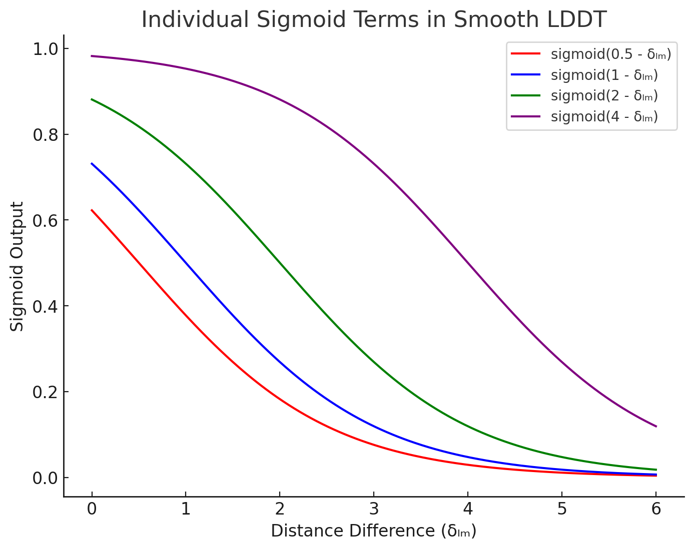
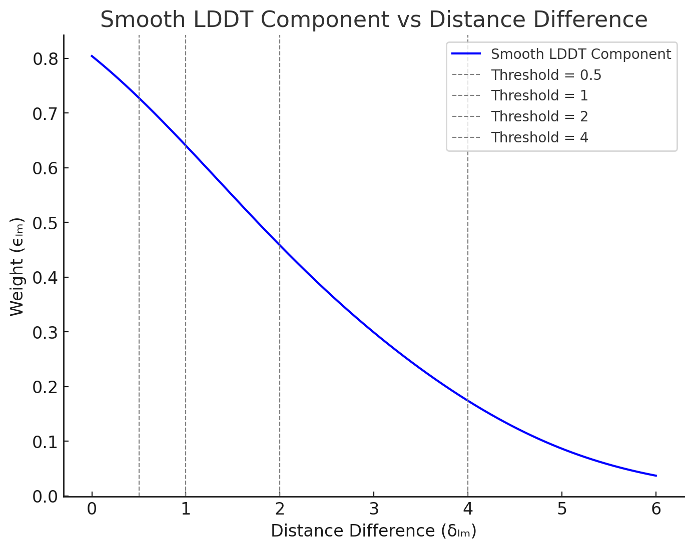

# AlphaFold3 架构解析（四）：损失函数（Loss Function）

> 本文为 [shenyichong/alphafold3-architecture-walkthrough](https://github.com/shenyichong/alphafold3-architecture-walkthrough)（MIT License）中文版，已在原译文基础上做通顺化与术语统一。配图来自该仓库。

最终的 Loss Function 公式如下：

$\mathcal{L}\_{\text{loss}} = \alpha\_{\text{confidence}} \cdot L\_{\text{confidence}} + \alpha\_{\text{diffusion}} \cdot \mathcal{L}\_{\text{diffusion}} + \alpha\_{\text{distogram}} \cdot \mathcal{L}\_{\text{distogram}}$

其中， $L\_{confidence}= \mathcal{L}\_{\text{plddt}} + \mathcal{L}\_{\text{pde}} + \mathcal{L}\_{\text{resolved}} + \alpha\_{\text{pae}} \cdot \mathcal{L}\_{\text{pae}}$

$\mathcal{L}\_{\text{loss}} = \alpha\_{\text{confidence}} \cdot \left( \mathcal{L}\_{\text{plddt}} + \mathcal{L}\_{\text{pde}} + \mathcal{L}\_{\text{resolved}} + \alpha\_{\text{pae}} \cdot \mathcal{L}\_{\text{pae}} \right) + \alpha\_{\text{diffusion}} \cdot \mathcal{L}\_{\text{diffusion}} + \alpha\_{\text{distogram}} \cdot \mathcal{L}\_{\text{distogram}}$

- L_distogram：用于评估模型预测的 token-level 距离分布图（distogram），也就是 token 与 token 之间的距离，是否准确。
- L_diffusion：用于评估模型预测的 atom-level 结构（原子坐标以及原子与原子之间的关系）是否准确；其中还包含一些额外的项，例如优先考虑相邻原子之间的关系，以及处理蛋白质-配体之间成键的原子。
- L_confidence：用于评估模型对自身预测结构中哪些准确、哪些不准确的自我评估是否准确。

## $L_{distogram}$

- 尽管模型输出的是 atom-level 的三维坐标，但这里的 L_distogram 是一个 token-level 指标，表征模型对 token 与 token 之间距离预测的准确度。由于得到的是原子三维坐标，要计算 token 的三维坐标时，直接取该 token 中心原子的三维坐标作为 token 的三维坐标。
- 为什么要评估 token（或原子）之间距离预测得是否准确，而不是直接评估 token（或原子）的坐标预测得是否准确？→ 最本质的原因在于，token（或原子）的坐标会随着整个结构在空间中的旋转或平移而改变，但它们之间的相对距离不会改变，只有这样的 loss 才能体现结构的旋转和平移不变性。
- 具体公式是怎样的？
    
    $\mathcal{L}\_{\text{dist}} = -\frac{1}{N\_{\text{res}}^2} \sum_{i,j} \sum_{b=1}^{64} y\_{ij}^b \log p\_{ij}^b$
    
    - 这里的 y_b_i_j 指的是：将第 i 个 token 与第 j 个 token 之间的距离均匀划分到 64 个桶中（从 2 埃到 22 埃），y_b_i_j 指的是真实结果落在 64 个桶中的某一个桶，用独热编码（one-hot）表示实际结果落到某个特定桶中。
    - p_b_i_j 指的是第 i 个 token 与第 j 个 token 之间的距离值落到某个桶中的概率，是经过 softmax 之后的结果。
    - 对于任意一个 token 对 (i,j)，用交叉熵（cross-entropy）衡量其预测距离与实际距离之间的差别：
        - 计算 $\sum_{b=1}^{64} y_{ij}^b \log p_{ij}^b=\log p_{ij}^{\text{target-bin}}$
    - 对所有 token 对计算 loss 的平均值：
        - 计算 $-\frac{1}{N_{\text{res}}^2} \sum_{i,j} \log p_{ij}^{\text{target-bin}}$ ，得到最终的 L_distogram loss 值。

## $L_{diffusion}$

- Diffusion 的训练过程：（图中红框部分表示 Diffusion 的训练设置；这幅图是 AlphaFold3 的总体训练设置，注意其中忽略了 distogram loss 部分）
    
    
    
    - 在 Diffusion 的训练过程中，首先使用 trunk 的输出结果作为输入，包括原始原子特征 f*、更新后的 token-level pair 表征、token-level single 表征等。
    - 训练时，Diffusion 部分会使用比 trunk 部分更大的 batch_size。每个样本经过 trunk 模块后，会生成 48 个相关但不同的三维结构，作为 diffusion 模块的输入。这些结构都基于真实结构（来自训练样本的真实三维结构）生成，但会进行随机旋转和平移，并添加不同程度的噪声。这样做的目的是获得大量（加噪结构，目标结构）对，让扩散模型学会如何去噪。
    - 由于加噪大小是随机的，相当于生成了一个来自 t 时间步（t 属于 [0,T]，根据噪声大小的不同，t 可能接近 T 时间步，也可能接近 0 时间步）的带噪结构，然后希望模型经过一次 diffusion module 的更新后，接近 t=0，也就是完全没有噪声的干净结构。
    - 最后，对这 48 个不同的结果，将其与真实结构（Ground Truth / 真值）对比，计算 loss（L_diffusion）并反向传播，同时优化 diffusion module 和 trunk module 的参数（confidence head 因 stop-gradient 不在此回传路径中）。
- Diffusion 的 loss 函数构造：注意，这里其实是在原子层面进行 loss 计算。
    - $L_{MSE}$：用于计算目标原子坐标与预测原子坐标差值的加权均方误差（weighted Mean Squared Error）。这里已知用于三维坐标的目标原子序列 {x_GT_l}，以及预测三维坐标原子序列 {x_l}，计算这两个三维结构之间的差别，具体计算方法如下：
        - 先对目标三维结构进行一次刚性对齐（rigid alignment），相当于把两个结构整体的位置和方向对齐，让它们在同一个参考坐标系下进行比较，这样比较出的误差就是结构本身的差异，而不是旋转或位置偏移造成的。这也解释了前面计算 L_distogram 时，在没有进行刚性对齐的情况下，直接比较的是 token 之间距离在真实值与预测值之间的差异，而不是直接比较 token 的坐标差异。
            
            
            
        - 然后计算 L_mse 的值： $L_{MSE} = \frac{1}{3} \cdot \text{mean}_l \big( w_l \| \tilde{x}_l - x_l^{GT-aligned} \|^2 \big)$
        - 注意这里是一个 weighted Mean Squared Error： $w_l = 1 + f_l^{\text{is-dna}} \alpha^{\text{dna}} + f_l^{\text{is-rna}} \alpha^{\text{rna}} + f_l^{\text{is-ligand}} \alpha^{\text{ligand}}$ ，其中 $\alpha^{\text{dna}} = \alpha^{\text{rna}} = 5,  \alpha^{\text{ligand}} = 10$ 。这里对 RNA/DNA 和配体（ligand）设置的权重较大，意味着对这些原子的预测准确性有更高的要求。
    - $L_{bond}$ ：用于确保配体（ligand）与主链之间的键长合理的损失函数。
        - 为什么需要这个 loss？原因在于，扩散模型可能恢复出一个总体结构正确、但细节不够精确的模型，比如某个化学键变得过长或过短。同时，配体就像挂在蛋白质链边上的小饰品，你不希望这个饰品过长或过短；而蛋白质氨基酸之间的肽键基本长度是稳定的，主链内部原子排列本身就有比较强的约束。
        - 所以这里的计算方法为： $\mathcal{L}\_{\text{bond}} = \text{mean}\_{(l,m) \in \mathcal{B}} \left( \left\| \vec{x}\_l - \vec{x}\_m \right\| - \left\| \vec{x}\_l^{\text{GT}} - \vec{x}\_m^{\text{GT}} \right\| \right)^2$ ，这里的 $\mathcal{B}$ 指的是一系列原子对（l 是起始原子的序号，m 是结束原子的序号），代表 protein-ligand bonds。相当于计算目标键长与真实键长之间的平均差距。
        - 本质上也是一个 MSE loss。
    - $L_{smooth-LDDT}$：用于比较预测原子对之间距离与实际原子对之间距离差异的 loss（Local Distance Difference Test），并着重关注相近原子之间距离预测的准确性。
        - 具体的计算伪代码如下：
            
            
            
            - 前两步计算任意两个原子之间的距离，包括预测值和实际值。
            - 接下来计算 (l,m) 原子对的预测距离与实际距离的绝对差值 $\delta\_{lm}$。
            - 然后计算一个分布在 [0,1] 之间的评分，用于衡量 $\delta\_{lm}$ 是否能通过（Local Distance Difference Test）。
                - 这里设置了 4 次 Test，每次 Test 采用不同的阈值。如果 $\delta\_{lm}$ 在设定的阈值范围内，就认为对 (l,m) 这个原子对距离的预测通过了 Test，那么本次 Test 的评分就大于 0.5，否则不通过、小于 0.5。
                - 所以每次 Test 设置了不同的阈值（分别为 4、2、1 和 0.5 Å），采用 sigmoid 函数实现：sigmoid(阈值 -  $\delta\_{lm}$ )，下面画出了这四个 Test 的函数曲线：
                    
                    
                    
                - 然后对这四个 Test 的结果取平均，得到评分 $\epsilon\_{lm}$。这是该评分的曲线，你会发现越靠近 0，评分越接近 1，否则越接近 0。
                    
                    
                    
            - 然后，为了让评分主要考察相近原子之间的距离，对实际距离非常远的原子对不计入 loss 的计算（c_l_m=0）。即针对实际距离大于 30Å 的核苷酸原子对，以及实际距离大于 15Å 的非核苷酸原子对，都不计入在内。
            - 最后，计算所有 c_l_m 不为 0 的原子对的 $\epsilon\_{lm}$ 评分的均值，作为 lddt 的值。该值越接近 1，说明平均原子对预测得越准。将其换算成 loss，即 1-lddt。
    - 最后， $\mathcal{L}\_{\text{diffusion}} = \frac{\hat{t}^2 + \sigma\_{\text{data}}^2}{(\hat{t} \cdot \sigma\_{\text{data}})^2} \cdot \left( \mathcal{L}\_{\text{MSE}} + \alpha\_{\text{bond}} \cdot \mathcal{L}\_{\text{bond}} \right) + \mathcal{L}\_{\text{smooth-lddt}}$
        - 这里的 $\sigma_{data}$ 是一个常数，由数据的方差决定，这里取 16。
        - 这里的 t^ 是训练时采样得到的噪声水平（sampled noise level），具体计算方法是 $\hat{t}=\sigma_{\text{data}} \cdot \exp\left( -1.2 + 1.5 \cdot \mathcal{N}(0, 1) \right)$
        - 这里的 $\alpha_{bond}$ 在初始训练时为 0，在后面 fine-tune 时为 1。

## $L_{confidence}$

- 最后一种 loss 的作用不是提升模型预测结构的准确性，而是帮助模型学习如何评估自身预测的准确性。这个 loss 也是四种用于评估自身准确性 loss 的加权和。
- 具体公式如下： $L\_{confidence}= \mathcal{L}\_{\text{plddt}} + \mathcal{L}\_{\text{pde}} + \mathcal{L}\_{\text{resolved}} + \alpha\_{\text{pae}} \cdot \mathcal{L}\_{\text{pae}}$
- Mini-Rollout 解释：
    
    
    
    - **原理**：正常情况下，要计算模型对生成的三维结构的置信度，需要获取模型最终生成的三维结构来计算，这与 AF2 的做法类似。但对 AF3 来说，diffusion module 单次迭代无法直接生成最终的去噪结果。因此这里引入了 mini-rollout 机制：训练时对 Diffusion module 进行固定次数（20 次）的迭代，从而让模型能从随机噪声快速生成一个近似的蛋白质结构预测。然后利用这个临时预测来计算评估指标并训练 confidence head。
    - **梯度阻断**：注意这里的 mini-rollout 并不回传梯度（如图中红色 STOP 标识，既不用于优化 Diffusion 模块，也不用于优化 Network trunk 模块），因为计算 L_confidence 的主要目标是优化模型对生成结构质量的评估能力，也就是优化 confidence module 本身的性能。这种设计确保了 diffusion 模块的训练目标（单步去噪）与 confidence head 的训练目标（结构质量度量）相互独立，避免训练目标不一致导致的冲突；同时也保证了 Trunk 模块的训练目标（提供更好的特征表征，为后续结构生成提供丰富且通用的特征表示）与 confidence head 的训练目标（结构质量度量）能够相互独立。
- 注意，这些 confidence loss 都只针对 PDB 数据集使用（不适用于任何蒸馏数据集，蒸馏数据集的结构是预测结构而非真实结构）；同时对数据集进行过滤，只选择过滤分辨率在 0.1 埃到 4 埃之间的真实结构来训练 confidence loss，以确保模型能够学习到与真实物理结构接近的误差分布。
- 下面分别详细解释每一个 loss 的含义：
    - Predicted Local Distance Difference Test(pLDDT)：每个原子的平均置信度。（注意 AlphaFold2 是每个残基的平均置信度）
        - 计算单个原子的 LDDT： $lddt_l$（训练时）：
            - 这里的目标是估计预测结构与真实结构之间的差异，而且是针对特定原子的差异估计。
            - 所以这里的计算公式设置如下：
                
                
                
                - 其中 $d_{lm}$ 是 mini-rollout 预测的原子 l 和 m 之间的距离。
                - ${m}\in{R}$ ，m 原子的选择基于该训练序列的真实三维结构来获取：1）m 的距离在 l 的一定就近范围内（30 埃或 15 埃，取决于 m 的原子类型）；2）m 只选择位于聚合物上的原子（小分子和配体不考虑）；3）一个 token 只考虑一个原子，对标准氨基酸或核苷酸中的原子，m 都用其代表原子（ $C_\alpha$ 或 $C_1$）来表示。
                - 然后针对每一对 (l,m) 进行 LDDT（Local Distance Difference Test）： $\frac{1}{4} \sum_{c \in \{0.5, 1, 2, 4\}} d\_{lm} < c$，如果 l 和 m 在真实距离中比较近，那么它们在预测结果中也应该足够近。这里设置了 4 个阈值，如果都满足，则 LDDT 为 1，如果都不满足则为 0。
                - 最后，相当于对所有在 l 附近的 m 计算得到的 LDDT 值进行加和，得到一个 l 原子的 $lddt_l$ 值，其大小可以衡量在 l 原子上模型预测结构与真实结构的差异，注意这是一个没有经过归一化的值。
        - 计算 confidence head 输出的此原子的 LDDT 概率分布： $p_l^{\text{plddt}}$（训练和预测时）
            - 这里暂时忽略 confidence 的具体计算过程（后续会详细说明），需要知道的是，这里的 $p_l^{\text{plddt}}$ 是在 l 原子处经过 confidence head 计算得到的、对 $lddt_l$ 值分布的一个估计。
            - 这里 $p_l^{\text{plddt}}$ 是一个 50 维向量，将 0～100 分成 50 个 bin，是 softmax 的结果，预测了 $lddt_l$ 值落在其中特定 bin 的概率分布。
            - 注意这里的计算完全不涉及任何真实结构，都是基于前面 trunk 相关表征进行的预测。
        - 计算整个的 $L_{plddt}$（训练时）：
            - 这里这个 loss 的优化目标就不是最大化 $lddt_l$，而是为了更准确地预测 $lddt_l$。
            - 而应该是实际的 $lddt_l$ 值与模型预测的 $lddt_l$ 分布始终对齐：如果实际的 $lddt_l$ 值低（模型结构预测得不准），那么模型预测的 $lddt_l$ 分布 $p_l^{\text{plddt}}$ 结果中落在数值较小 bin 的概率就更大；如果实际的     $lddt_l$ 值高（模型结构预测得准），那么模型预测的 $lddt_l$ 分布 $p_l^{\text{plddt}}$ 结果中落在数值较大 bin 的概率就更大。
            - 所以使用交叉熵 loss 来对齐这两者的差异，这也就能够保证模型真实的 LDDT 分布与预测的 LDDT 分布尽量一致： $\sum_{b=1}^{50} \text{lddt}_l^b \log p_l^b$ 。
            - 最后，因为要计算整体的 loss，所以在所有原子上进行平均，得到最终的计算方法：
                
                
                
        - 计算 pLDDT 的值（预测时）：
            - 另外，预测时模型输出单个原子的 pLDDT 值的计算方式为： $p_l^{\text{plddt}} * V_{bin}$ ，得到一个 0～100 之间的标量，代表模型对当前位置 l 原子 lddt 的预测值。当该原子周边的原子与它距离都比较近时 lddt 值大，代表模型对当前 l 原子位置预测的置信度越高，否则对当前 l 原子位置预测的置信度越低。
            - 原因在于，经过前面 loss 函数的优化， $p_l^{\text{plddt}}$ 已经是一个对 l 原子预测效果有较好评估能力的分布了。所以可以相信 $p_l^{\text{plddt}}$ 对 lddt 分布的估计，可以用求期望的方式来求 lddt 的预测值。
    - Predicted Aligned Error(PAE)：token 对之间对齐误差的置信度预测（以原子对的距离来计算）。
        - 一些概念和方法解释：
            - **reference frame：** 一个 token 的 reference frame 使用三个原子的坐标来表示： $\Phi_i = (\vec{a}_i, \vec{b}_i, \vec{c}_i)$， 这个 frame 的作用是定义 token i 的局部参考坐标系，用于与 token j 建立联系。针对不同的 token，reference frame 三个原子的选择是不同的：
                - 针对蛋白质 token 或残基，其 reference frame 是： $(\text{N}, \text{C}^\alpha, \text{C})$
                - 针对 DNA 或 RNA 的 token，其 reference frame 是： $(\text{C1}', \text{C3}', \text{C4}')$
                - 针对其他小分子，其 token 可能只包含一个原子，那么选择 b_i 为这个原子本身，然后选择最近的原子为 a_i，第二近的原子为 c_i。
                - 例外：如果选择的三个原子几乎在一条直线上（它们之间的夹角小于 25 度），或者在实际的链里找不到这三个原子（比如钠离子只有一个原子），那么这个 frame 就被定义为无效 frame，后续不参与 PAE 的计算。
            - $\text{expressCoordinatesInFrame}(\vec{x}, \Phi)$ : 在 $\Phi$ 坐标系下表示原子 $\vec{x}$ 的坐标。
                
                
                
                - 粗略地解释这个算法：
                    - 首先，从 $\Phi$ 中得到三个参考原子的坐标 a,b,c，将 b 视作新坐标系的原点。
                    - 然后，根据从 b 到 a 和从 b 到 c 的方向，构造一个正交规范基 (e_1, e_2, e_3)。
                    - 最后，将 x 投影到这个新的基上，得到 x_transformed，也就是 x 在新的坐标系 $\Phi$ 上的坐标。
                - 具体详细地解释这个算法：
                    - 已知三个参考原子的坐标，需要以 b 原子的坐标为原点来构建一个正交的三维坐标系。
                    - 计算 w1 和 w2，它们分别是从 b 到 a 方向上的一个**单位向量**和从 b 到 c 方向上的一个**单位向量**。
                    - 然后计算正交基：
                        - e1 可以看成位于 a 和 c 之间“夹角平分”的一个方向。
                        - e2 是将 w1 和 w2 相减之后得到的一个方向；因为 w1 和 w2 都是单位向量，所以这个向量和 e1 正交，而且也在同一个平面上。
                        - e3 是将 e2 和 e1 做叉乘，得到与两者都垂直的第三个基向量，从而形成三个完整的正交基。
                        - 完成这一步后，e1，e2，e3 就是一个以 b 为原点的右手系规范正交基。
                    - 最后将 x 投影到这个坐标系上面：
                        - 首先，将 x 平移，使得 b 成为原点。
                        - 然后进行投影，计算 d 在每个基向量上的投影，即（d*e1, d*e2, d*e3）。
                        - 最后，就得到了 x 在坐标系 $\Phi$ 中的新坐标：x_transformed。
            - $\text{computeAlignmentError}(\{\vec{x}_i\}, \{\vec{x}_i^\text{true}\}, \{\Phi_i\}, \{\Phi_i^\text{true}\}, \epsilon = 1e^{-8} \, \text{Å}^2)$：计算 token i 和 token j 之间的对齐误差。
                
                
                
                - 输入：
                    - x_i 指的是预测的 token i 代表性原子的坐标，x_true_i 指的是真实的 token i 代表性原子的坐标。
                    - $\Phi_i$ 指的是预测的 token i 的 reference frame， $\Phi_i^\text{true}$ 指的是真实的 token i 的 reference frame。
                - 计算流程：
                    - token 对 (i, j) 之间关系的预测结果：在 token i 的 reference frame 局部坐标系下，计算 token j 的代表性原子在这个坐标系中的坐标，相当于计算 token j 相对于 token i 的相对关系。
                    - token 对 (i, j) 之间关系的真实结果：在 token i 的 reference frame 局部坐标系下，计算 token j 的代表性原子在这个坐标系中的坐标，相当于计算 token j 相对于 token i 的相对关系。
                    - 计算对齐误差，即预测的相对位置与真实相对位置之间的差别，使用欧几里得距离来计算。如果 e_i_j 比较小，说明预测的 token i 和 j 之间的关系与真实的 token i 和 j 之间的关系对齐得好，否则对齐得差。
                    - 注意，这里的 (i,j) 不可交换，e_i_j 和 e_j_i 是不同的。
        - PAE Loss 计算流程：
            - 通过 confidence head 计算得到的 $\mathbf{p}\_{ij}^{\text{pae}}$ 为 b_pae=64 维度的向量，表示 e_i_j 落到 64 个 bin（从 0 埃到 32 埃，每 0.5 埃一个阶梯）中的概率。
            - 为了使 $\mathbf{p}\_{ij}^{\text{pae}}$ 的分布更加接近实际的 e_i_j 值，采用交叉熵 loss 函数来对齐二者，使得 $\mathbf{p}\_{ij}^{\text{pae}}$ 能够更好地预测实际的 e_i_j 值。（注意：这里 loss 的设计不是最小化 e_i_j 的值，那可能是为了获得更好的结构预测精度；而是通过交叉熵 loss 让预测的概率 $\mathbf{p}\_{ij}^{\text{pae}}$ 和 e_i_j 的结果更加接近，从而更好地预测 e_i_j 的大小；e_i_j 越大，表明模型认为这两个位置的相对构象存在较大的不确定性，e_i_j 越小，意味着对那两个位置的相对构象更有信心）
            - 所以最终 PAE 的 loss 定义为：（注意这里的 e_b_i_j 和前面的 e_i_j 不同，如果 e_i_j 落在对应的 bin b，则对应的 e_b_i_j 是 1，否则 e_b_i_j 是 0）
                
                
                
        - 如果在预测中要计算 PAE_i_j 的值，则通过求期望的方式来进行计算。
            - 把 64 个离散的 bin 取其区间的中心值，然后按照位置乘以每一个位置的预测概率 p_b_i_j（即 e_i_j 的值落在这个 bin 中的概率），就得到了对于 e_i_j 的一个期望值：
                
                
                
    - Predicted Distance Error(PDE)：token 对之间代表原子绝对距离的置信度预测。
        - 除了对齐误差，模型同样也需要预测重要原子之间绝对距离的预测误差。
        - 这里的 distance error 计算方式比较简单，如下：
            - 首先，计算模型预测的 token i 和 token j 代表性原子之间的绝对距离： $d\_{ij}^{\text{pred}}$
            - 然后，计算真实的 token i 和 token j 代表性原子之间的绝对距离： $d\_{ij}^{\text{gt}}$
            - 最后，直接计算二者的绝对差异： $e\_{ij} = \left| d\_{ij}^{\text{pred}} - d\_{ij}^{\text{gt}} \right|$
        - 类似地，通过 confidence head 预测出的 $\mathbf{p}\_{ij}^{\text{pde}}$ 结果同样也是 64 维向量，表示 e_i_j 落到 64 个 bin（从 0 埃到 32 埃，每 0.5 埃一个阶梯）中的概率。
        - 类似地，然后通过交叉熵 loss 来对齐二者，得到 L_pde:
            
            
            
        - 类似地，在预测中，使用求期望的方式来求一个 token-pair 的 pde 值：（ $\Delta_b$ 是区间中心值）
            
            
            
    - Experimentally Resolved Prediction：预测一个原子是否能够被实验观测到
        - 这是一个以原子序号 l 为索引的预测置信度值，用于表示当前原子 l 是否能够被正确实验观测到。
        - y_l 指的是当前原子是否被正确实验解析，是一个 2 维的 0/1 值；p_l 是一个从 confidence head 输出的 2 维向量，是 softmax 的结果，代表模型预测当前 l 原子是否被正确解析。
        - 最终的优化目标是预测当前原子是否能够被实验正确解析，所以 loss 函数是：
            
            
            
- Confidence Head 的计算：Confidence Head 的目标是基于前面模型的表征和预测，进一步生成一系列置信度分布（pLDDT、PAE、PDE、resolved 等的置信度分布），并可用于后续 confidence loss 的计算（或者直接用于模型的输出预测）
    - Confidence Head 的输入：
        - 来自最初 InputFeatureEmbedder 的 token-level single embedding 特征 {s_inputs_i}。
        - 来自主干网络的 token-level single embedding {s_i} 和 token-level pair embedding {z_i_j} 。
        - 来自 diffusion module 的 mini-rollout 预测结构： {x_pred_l}。
    - 算法计算过程解析：
        
        
        
        1. 对 token-level pair embedding z_i_j 进行更新，加入从初始 single embedding 投影过来的信息。
        2. 计算模型预测出的 token i 和 token j 的代表性原子（原子序号为 l_rep(i)）三维坐标之间的距离，标识为 d_i_j。
        3. 把 d_i_j 的值离散到 v_bins 定义的区间上，计算出其独热编码（one-hot）表征，然后经过一个线性变换，更新到 token-level pair embedding 上面。
        4. 继续让 token-level 的单体表征 {s_i} 和配对表征 {z_i_j} 进行 Pairformer 的更新，相当于再让这两类表征相互交互强化几轮，得到最终的 {s_i} 和 {z_i_j}。
        5. 计算 PAE 的置信度概率，其最终结果是一个 b_pae=64 维度的向量。因为 PAE 实际上也是 token-token 的表征（虽然实际计算的是代表原子和 frame 之间的距离），所以使用 {z_i_j} 进行线性变换之后直接求 softmax 来获取这个置信度概率，代表其 PAE 的值落在 64 个区间中每个区间的概率。（注意：这里 i 和 j 不可交换）
        6. 计算 PDE 的置信度概率，其最终结果是一个 b_pde=64 维度的向量。同理，PDE 也是 token-token 的表征（实际计算的是代表原子之间的绝对距离），使用 z_i_j 和 z_j_i 的信息进行融合，然后线性变换并直接求 softmax 来获取置信度概率，代表 PDE 的值落在 64 个区间中每个区间的概率。（注意：这里的 i 和 j 可交换）
        7. 计算 pLDDT 的置信度概率（注意：这里的 pLDDT 置信度概率是每个原子的值，以原子序号 l 而不是 token 序号 i 来索引。）
            1. 这里 s_i(l) 的含义是：获取原子 l 所对应的 token i 对应的那个 token-level single embedding。
            2. 这里的 LinearNoBias_token_atom_idx(l)( … ) 函数的作用是：针对不同的原子 l，其对应的用于线性变换的矩阵是不同的，通过 token_atom_idx(l) 获取对应的 weight 矩阵，矩阵形状为 [c_token, b_plddt] ，然后将其右乘 s_i(l)（形状为 [c_token]），得到最终的向量为 [b_plddt]。
            3. 最后再进行 softmax 来得到 pLDDT 的置信度概率，其 b_plddt=50，是一个 50 维度的向量，表示 lddt 的值落到这 50 个 bin 范围内的概率。
        8. 计算 resolved 的置信度概率（注意，这里的 resolved 置信度概率也是针对每个原子的值，同上）：计算结果经过 softmax 之后是一个 2 维向量，预测当前原子是否能够被实验解析出来的置信度。
