# AlphaFold3 算法详解（一）：输入处理

> 本文是「AlphaFold3 算法详解」系列第 1 篇，配套视频：[《AphaFold3算法详解 输入处理》](https://www.bilibili.com/video/BV1CNeKeYE7u/)。讲解材料主要来自斯坦福两位学者对 AlphaFold3 的详细拆解博客 [The Illustrated AlphaFold](https://elanapearl.github.io/blog/2024/the-illustrated-alphafold/)。

## 本讲要解决的核心问题（SCQA）

**背景**：AlphaFold3 能预测蛋白、核酸、小分子配体以及它们构成的复合物，接收的是用户给的序列（以及可选的其它分子）。

**冲突**：可它内部的模型并不直接吃「序列」。AlphaFold2 里最小单位是氨基酸残基，而 AlphaFold3 要处理配体、修饰残基这些没有标准残基概念的分子，旧的表示方式根本不够用。

**疑问**：一串序列是怎么一步步变成模型能吃的张量的？为什么中间会多出 atom-level（原子级）的表示？

**回答（中心思想）**：AlphaFold3 的输入处理做了一件事——**把不同种类的分子统一「切」成 token 和原子两级，再把序列信息、MSA、模板距离、原子性质、坐标这几路信息，组织成 6 个张量**：MSA（m）、模板 distogram（t）、原子级 single（q）与 pair（p）、token 级 single（s）与 pair（z）。有了这 6 个输入，中间的网络（Pairformer）才能开始学习。

---

## 一、AlphaFold3 的三段式总览

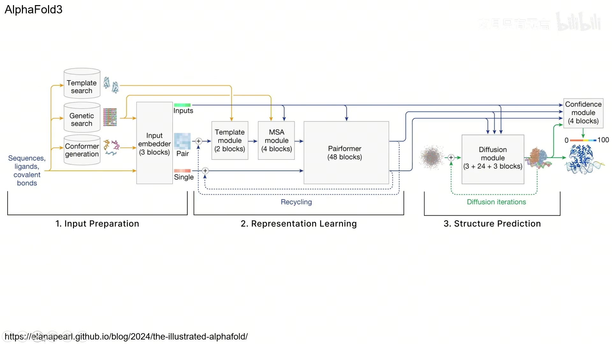

[【跳转到 00:28】](https://www.bilibili.com/video/BV1CNeKeYE7u/?t=28)

整个 AlphaFold3 分为三部分：

1. **输入准备（Input Preparation）**：把序列、配体、共价键等用户输入，经过模板搜索、基因搜索、构象生成，编码成一系列张量。
2. **表示学习（Representation Learning）**：中间主干的模块，用的是和 AlphaFold2 里 Evoformer 非常相似的架构，名叫 **Pairformer**。
3. **结构预测（Structure Prediction）**：用**扩散模型（diffusion model）**从随机坐标出发，一步步去噪得到最终的三维结构。

和 AlphaFold2 相比，输入的差别主要在两点：一是多了 **conformer generation（构象生成）**——因为 AlphaFold2 局限于标准氨基酸残基，而 AlphaFold3 要预测蛋白-配体复合物、DNA、RNA 以及各种非标准残基；二是多了 **atom-level（原子级）的 single representation 和 pair representation**。AlphaFold2 里的 pair representation，到 AlphaFold3 里就对应 token-level 的 pair representation。

## 二、把分子切成 token：tokenization

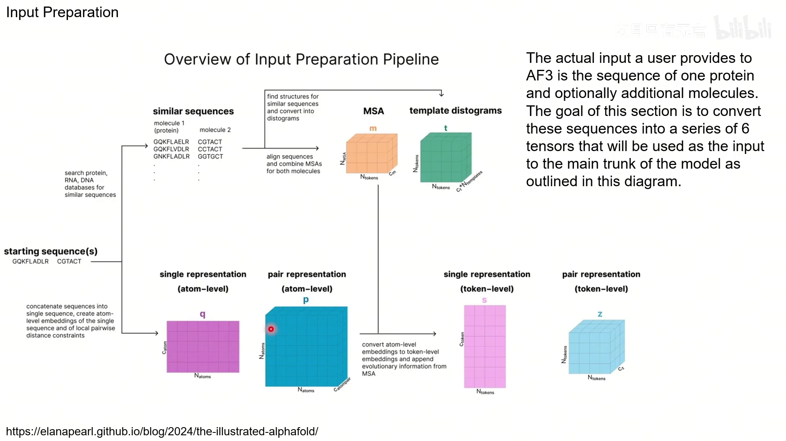

[【跳转到 02:53】](https://www.bilibili.com/video/BV1CNeKeYE7u/?t=173)

要理解后面的表示，先要弄明白 **token** 是什么。在 AlphaFold2 里，**每个氨基酸残基就是一个 token**，而一个残基里其实包含好几个原子。AlphaFold3 把这个粒度推广了：

- **标准氨基酸残基**：一个残基 = 一个 token（内含多个原子）；
- **标准核苷酸残基**：一个残基 = 一个 token；
- **修饰的氨基酸或核苷酸残基**：**按原子拆**，N 个原子的残基就是 N 个 token；
- **所有配体**：也**按原子拆**，每个重原子一个 token。

每个 token 还会指定一个 **token center atom（中心原子）**，用于后面计算 token 之间的距离：

- 标准氨基酸用 **Cα**；
- 标准核苷酸用 **C1'**；
- 其它情况（按原子拆的）就用它唯一的那一个原子。

> 为什么要有原子级？因为配体、修饰残基没有「标准残基」的模板。把每个重原子单独当成一个 token，模型才能统一处理它们。

## 三、六个输入张量是怎么来的

输入准备的产出是 6 个张量：从外部信息得到的 **MSA（m）** 和 **模板 distogram（t）**，以及从原子/序列性质构造的 **atom single（q）**、**atom pair（p）**、**token single（s）**、**token pair（z）**。

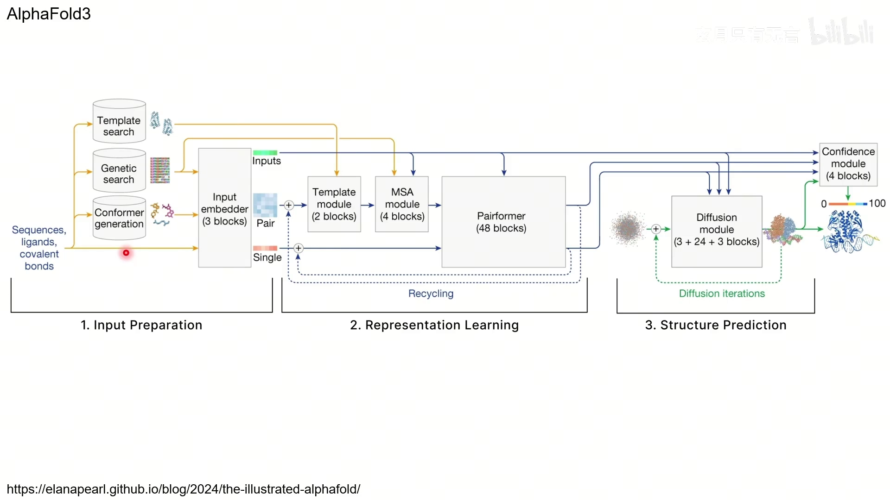

[【跳转到 01:18】](https://www.bilibili.com/video/BV1CNeKeYE7u/?t=78)

### 3.1 MSA 与模板 distogram：两路「外部知识」

- **MSA（多序列比对）**：把同源序列排在一起，提供共进化信息，表示成 **m**。
- **模板 distogram（模板距离直方图）**：从同源结构的模板出发，计算所有 token 两两之间的欧氏距离。

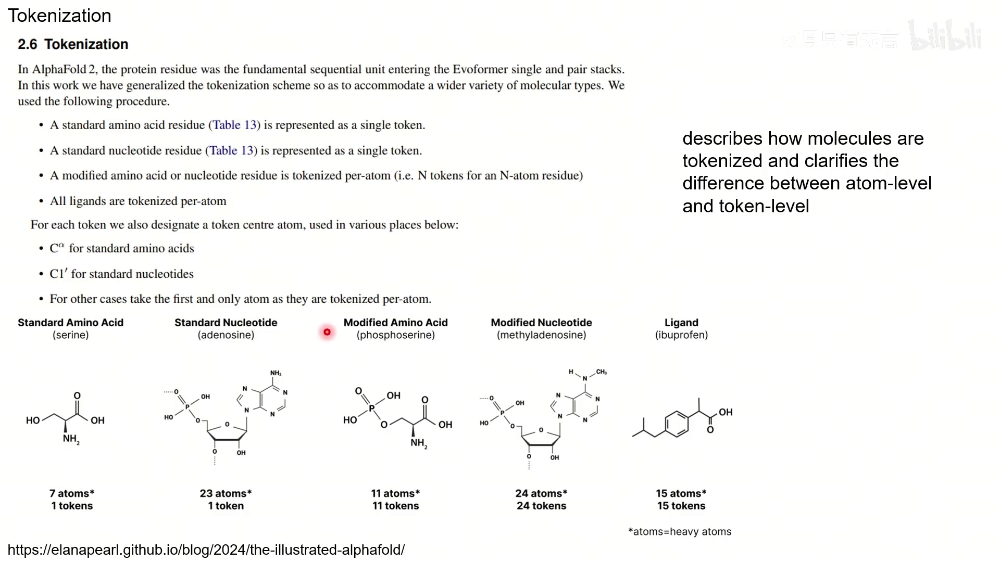

[【跳转到 03:39】](https://www.bilibili.com/video/BV1CNeKeYE7u/?t=219)

**distogram 的构造**很关键：不是直接存一个距离数值，而是把距离**离散化**——3.15 Å 到 50.75 Å 之间分成 **38 个等宽的桶**，另外再加 **1 个桶**专门装超过 50.75 Å 的距离（所以一共 39 个）。此外还会拼上一些元数据：每个 token 属于哪条链、这个 token 在晶体结构里有没有被解析出来、以及氨基酸内部的局部距离；并做一个 mask，**只看同一条链内的距离**，避免用跨链信息去猜测链间相互作用。

### 3.2 atom-level single representation（q）

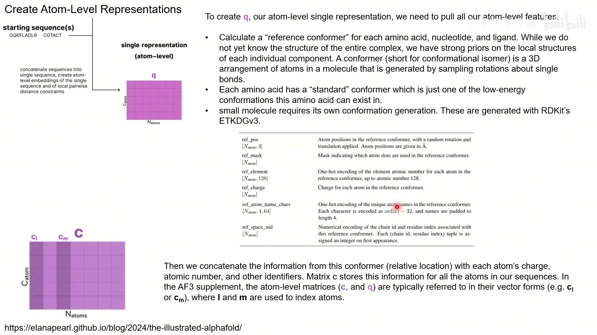

[【跳转到 06:05】](https://www.bilibili.com/video/BV1CNeKeYE7u/?t=365)

**single representation** 表示每个原子（token）自身的性质。构造它的核心是 **reference conformer（参考构象）**：虽然我们还不知道整个复合物的结构，但每个组件的局部结构有很强的先验。

- 20 种标准氨基酸，各自有事先确定好的**标准构象**（一种低能构象）；
- 核苷酸、配体同理；小分子用 **RDKit 的 ETKDGv3** 生成构象；
- 把参考构象的坐标做一次**随机旋转和平移**，再拼接每个原子的**元素（one-hot，最多到原子序数 128）、电荷、原子名字符、所属链/残基编号**等信息，就得到了 atom-level single representation。

代码里用一个矩阵 **c** 存这些信息；随后把 **c 拷贝一份叫做 q**，q 是后续会被不断更新的那份，而 c 会被保存下来备用。

### 3.3 atom-level pair representation（p）

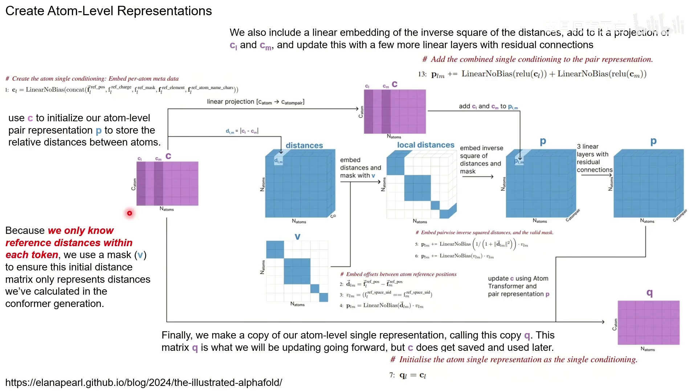

[【跳转到 07:55】](https://www.bilibili.com/video/BV1CNeKeYE7u/?t=475)

有了 c，就能用 c 去初始化 **atom-level pair representation p**，用来存原子之间的相对距离：

- 计算参考坐标的差值 `d_lm = |c_l - c_m|`；
- **做掩码 v**：因为我们只知道**每个 token 内部**的参考距离，所以初始距离矩阵只应表示这些算出来的距离，其余位置要屏蔽掉；
- 把距离平方的逆做线性嵌入，再加上 `c_l`、`c_m` 的投影，过几层带残差连接的全连接层，最终得到 p。

p 的每个格子都是一个向量，期待它编码对应两个原子之间的关系（距离）。

### 3.4 Atom Transformer 更新原子表示

有了 q 和 p，就要根据**邻近原子**去更新它们。这里用的是一个 **Atom Transformer**。

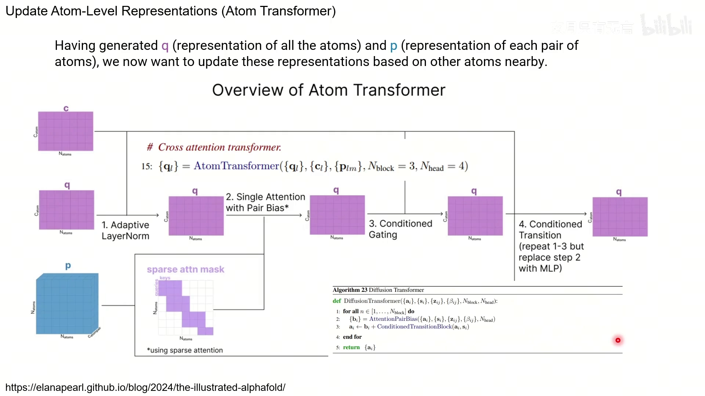

[【跳转到 10:12】](https://www.bilibili.com/video/BV1CNeKeYE7u/?t=612)

它由这几步组成（`N_block=3`、`N_head=4`）：

1. **Adaptive LayerNorm**；
2. **Single Attention with Pair Bias**（用的是**稀疏注意力**，只让相邻原子之间互相关注，因为没必要让所有原子两两都算）；
3. **Conditioned Gating**（门控）；
4. **Conditioned Transition**（把第 1~3 步的 attention 换成 MLP）。

其中 **attention with pair bias** 的过程和我们在 AlphaFold2 里见过的一样。

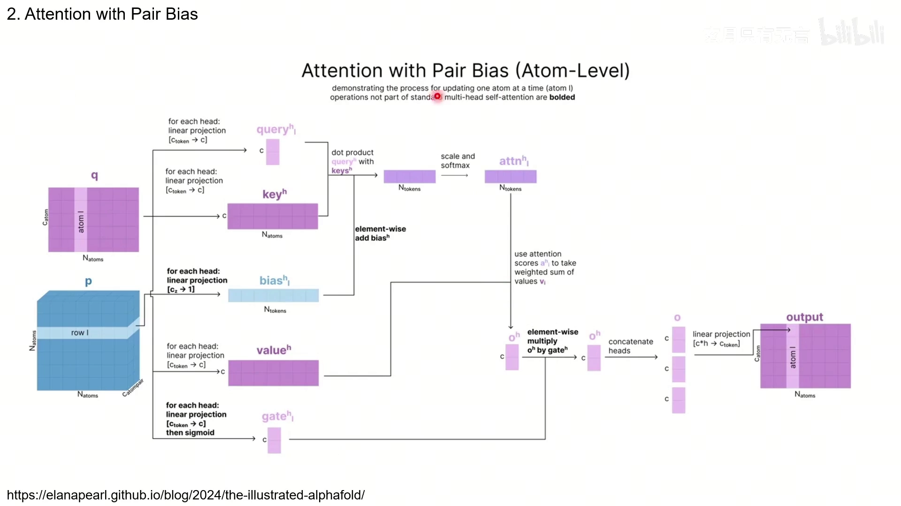

[【跳转到 11:30】](https://www.bilibili.com/video/BV1CNeKeYE7u/?t=690)

以更新第 l 个原子为例：从 q 出发，经过全连接层分别得到 **query、key、value**；**bias 来自 p 的第 l 行**——它描述的正是第 l 个原子与其他所有原子的距离/关系。把 query 与 key 点乘、**加上这个 bias**，softmax 得到注意力权重，再对 value 加权求和；同时从 q 算一个 **gate**（过 sigmoid，非 0 即 1），对应元素相乘控制信息是否通过；多头结果拼接后映射回原维度。

**Transition 层的设计也变了**：

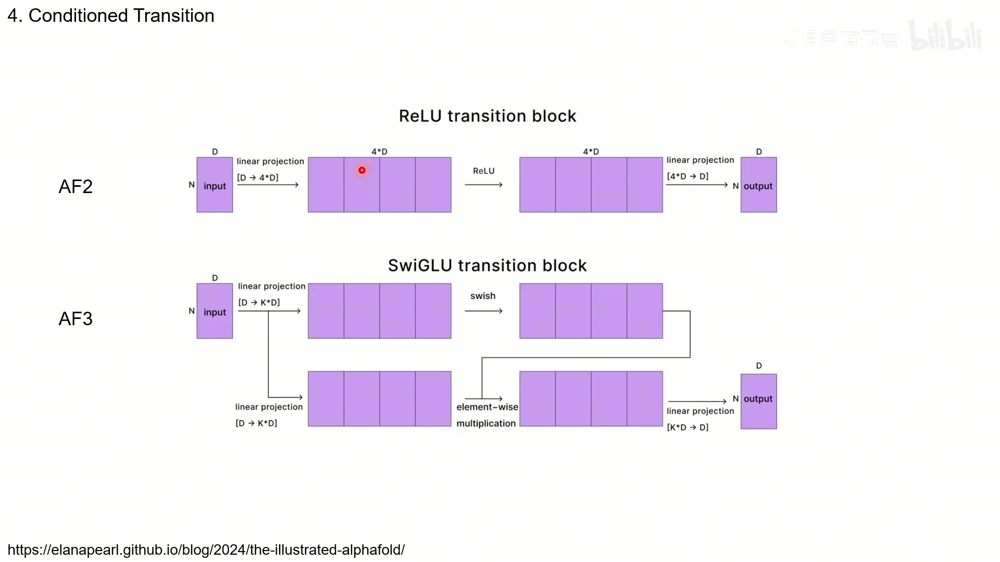

[【跳转到 14:02】](https://www.bilibili.com/video/BV1CNeKeYE7u/?t=842)

- AlphaFold2 用的是 **ReLU transition**：先 `D → 4D`，过 ReLU 激活，再压回 `D`；
- AlphaFold3 换成了 **SwiGLU transition**：从 x 出发经两个映射得到两个 `K*D` 张量，其中一路过 **swish** 激活，然后两路**逐元素相乘**，最后再 `K*D → D`。这看起来像 gate，但用的是 swish 而不是 sigmoid。

### 3.5 聚合到 token-level（s、z）

到这里，表示还都是原子级的。从表示学习阶段开始，网络主要在 **token 级** 上工作，所以要把原子级聚合成 token 级。

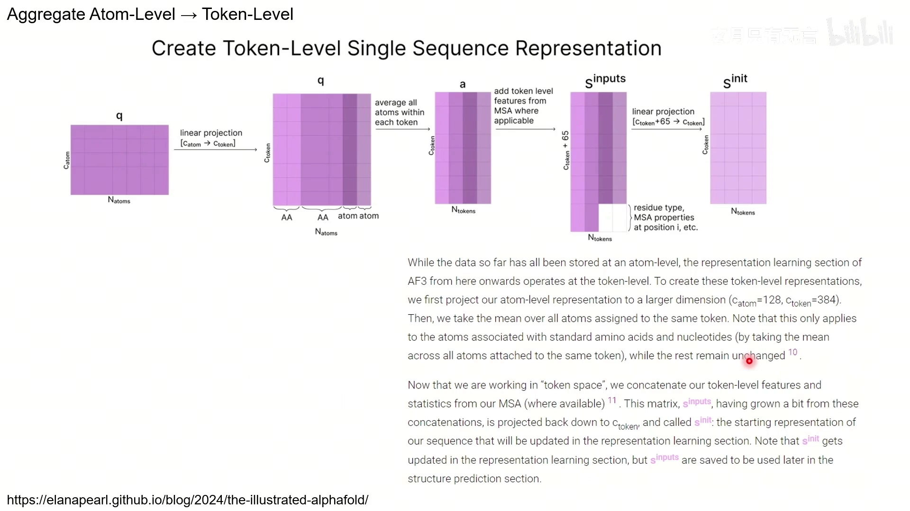

[【跳转到 15:12】](https://www.bilibili.com/video/BV1CNeKeYE7u/?t=912)

**token single（s）** 的做法：先把原子级表示投影到更大的维度（`c_atom=128 → c_token=384`），然后**对属于同一个 token 的所有原子求平均**（这只对标准氨基酸/核苷酸有意义，其它保持一致）；再拼上 MSA 统计、残基类型等特征（`c_token+65 → c_token`），得到 **s_init**。注意 s_inputs 会被保存下来，供结构预测阶段使用。

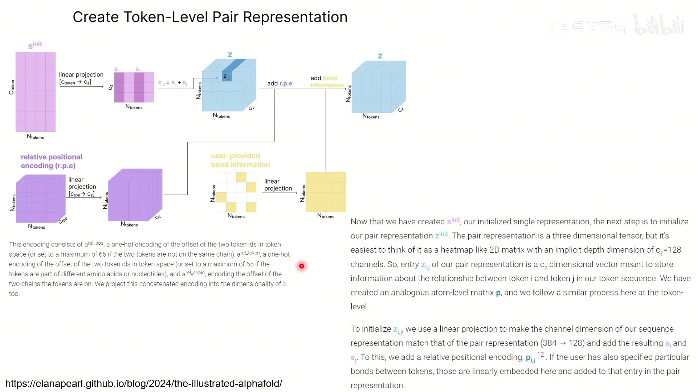

[【跳转到 15:59】](https://www.bilibili.com/video/BV1CNeKeYE7u/?t=959)

**token pair（z）** 的做法：把 s_init 做线性投影，令 **`z_ij = s_i + s_j`**；再加上 **relative positional encoding（相对位置编码 r.p.e）**——把两个 token 在序列上编号之差（`a_rel_pos`）、token 类型之差（`a_rel_token`）、是否同链（`a_rel_chain`）拼起来投影到 `c_z` 维度；如果用户还指定了 token 之间的共价键，也在这里线性嵌入后加进去。`c_z = 128`。

## 小结

- AlphaFold3 分三段：**输入准备 → 表示学习（Pairformer）→ 结构预测（扩散模型）**。
- 相比 AlphaFold2，多了 **conformer generation** 和 **atom-level 表示**，因此能处理配体、DNA/RNA、非标准残基。
- **tokenization**：标准残基/核苷酸是一个 token；修饰残基和配体**按重原子拆成 token**；中心原子分别是 Cα / C1' / 唯一原子。
- 输入准备的产出是 **6 个张量**：MSA（m）、模板 distogram（t）、atom single（q）、atom pair（p）、token single（s）、token pair（z）。
- **模板 distogram**：用中心原子算两两距离，离散成 38+1 个桶，并拼接链/解析/局部距离等元数据、屏蔽跨链距离。
- **atom single（c/q）** 来自参考构象 + 原子性质；**atom pair（p）** 由参考距离初始化；用 **Atom Transformer**（Adaptive LayerNorm + 稀疏 attention with pair bias + gating + SwiGLU transition）更新。
- 最后把原子表示聚合成 **token single / pair**：`z_ij = s_i + s_j` 再叠加相对位置编码与共价键。

## 关键术语速查

| 术语 | 一句话解释 |
| :--- | :--- |
| token | 模型处理的最小序列单位；标准残基是一个 token，修饰残基/配体按原子拆 |
| center atom（参考原子） | 计算 token 距离用的代表原子：Cα / C1' / 唯一原子 |
| MSA | 多序列比对，提供共进化信息，张量记为 m |
| distogram | 距离直方图，把两两距离离散成 38+1 个桶 |
| single representation | 每个原子/ token 自身性质的向量（q / s） |
| pair representation | 每对原子/ token 之间关系的张量（p / z） |
| reference conformer | 各组件局部结构的参考构象，随机旋转平移作为初始坐标 |
| ETKDGv3 | RDKit 里生成小分子构象的算法 |
| Atom Transformer | 更新原子级表示的模块：稀疏 attention with pair bias + gating + transition |
| pair bias | 由 pair representation 算出、加到注意力分数上的偏置 |
| SwiGLU transition | AF3 的 transition：两路映射，一路过 swish，逐元素相乘 |
| r.p.e | relative positional encoding，相对位置编码（序列差、类型差、是否同链） |
