# AlphaFold3 算法详解（二）：Pairformer

> 本文是「AlphaFold3 算法详解」系列第 2 篇，配套视频：[《AphaFold3算法详解 Pairformer》](https://www.bilibili.com/video/BV1kNeKeYEEn/)。讲解材料主要来自 [The Illustrated AlphaFold](https://elanapearl.github.io/blog/2024/the-illustrated-alphafold/)。

## 本讲要解决的核心问题（SCQA）

**背景**：上一篇我们为 AlphaFold3 准备好了 6 个输入张量：MSA（m）、模板 distogram（t）、原子级/ token 级的 single 与 pair 表示。

**冲突**：这些张量还不是「学到」的表示。而且 pair representation 需要满足一个几何性质——每个格子编码的是两个残基之间的距离，那么第 i 个到第 j 个的距离，不应该与第 i 个到第 k 个、第 j 个到第 k 个的距离矛盾。

**疑问**：AlphaFold3 中间的网络是怎么一步步更新这些表示的？它和 AlphaFold2 的 Evoformer 到底哪里一样、哪里不一样？

**回答（中心思想）**：表示学习由 **template module → MSA module → Pairformer** 三个模块串联，外加 **Recycling**。MSA module 保留了 AlphaFold2 的 outer product mean 与三角更新，却**去掉了 MSA 的行/列注意力**；Pairformer 则在 pair representation 上反复做**三角更新和三角注意力**，并用 **single attention with pair bias** 把 pair 信息传回 single。

---

## 一、表示学习总览：三个模块 + 回收

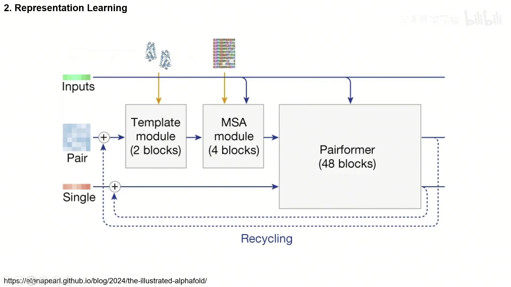

[【跳转到 00:00】](https://www.bilibili.com/video/BV1kNeKeYEEn/?t=0)

表示学习阶段由三个模块顺序组成：

1. **Template module**（2 个 block）：处理模板信息；
2. **MSA module**（4 个 block）：处理多序列比对；
3. **Pairformer**（48 个 block）：主干，更新 pair 与 single 表示。

和 AlphaFold2 一样，这里有一个 **Recycling（回收）** 机制：把网络的输出接回输入，再走一遍，用来做精修。

## 二、Template module：把模板信息注入 pair

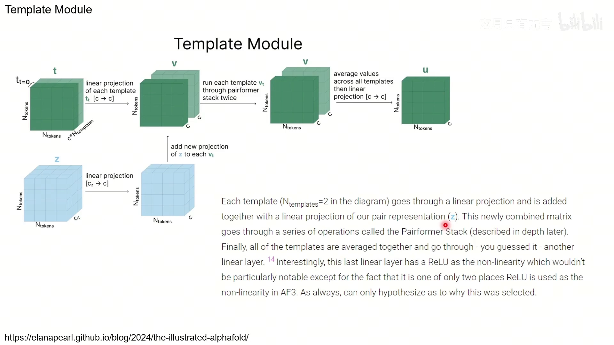

[【跳转到 00:13】](https://www.bilibili.com/video/BV1kNeKeYE7u/?t=13)

Template module 比较直接：

1. 每个模板 `t_t` 先做一次线性投影 `[c → c]`；
2. 把 pair representation z 也线性投影 `[c_z → c]`，**加到每个模板上**（给模板补充当前 pair 的信息）；
3. 每个模板各自**过两遍 Pairformer stack**；
4. 对所有模板**求平均**，再过一层线性投影 `[c → c]`。

> 一个有趣的细节：这最后一层线性投影用的是 **ReLU** 作为非线性，而 ReLU 在整个 AlphaFold3 里只出现两处——为什么这么选，作者也只能猜测。

## 三、MSA module：保留三角更新，砍掉 MSA 注意力

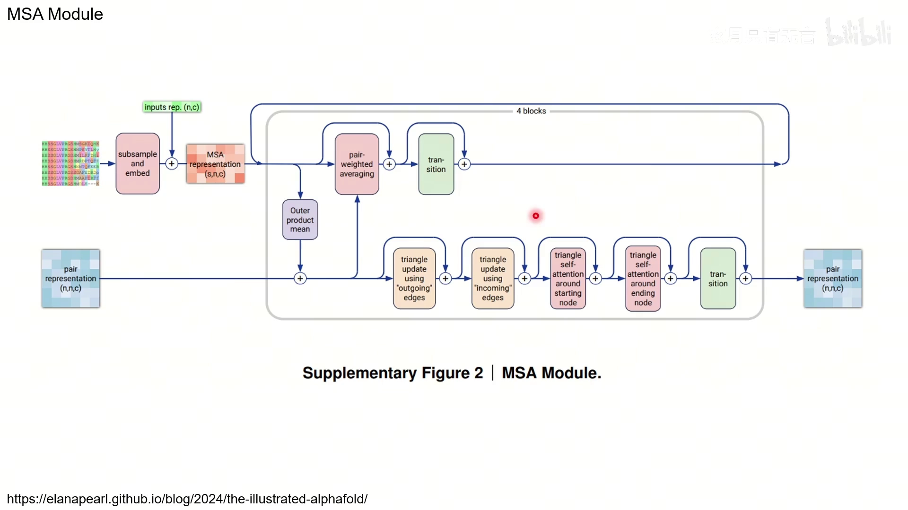

[【跳转到 01:10】](https://www.bilibili.com/video/BV1kNeKeYE7u/?t=70)

MSA module 的结构图可以分成两路：

- **MSA 分支**：subsample & embed → MSA representation（`s, n, c`）→ **pair-weighted averaging** → **transition**；
- **pair 分支**：从 pair representation 出发，做 **triangle update using outgoing edges** → **triangle update using incoming edges** → **triangle self-attention around starting node** → **triangle self-attention around ending node** → **transition**；
- 两路之间通过 **outer product mean** 交换信息。

**它和 AlphaFold2 的关键差别**：MSA module **去掉了 MSA 的那几个注意力机制**。回忆 AlphaFold2 的 Evoformer，里面还有 row-wise 和 column-wise 的 attention with pair bias；AlphaFold3 认为这些机制没那么重要，就没有保留。MSA 这边只保留 **pair-weighted averaging**，其余重点都放在 pair 表示的三角操作上。

### 3.1 Outer product mean：把 MSA 信息搬进 pair

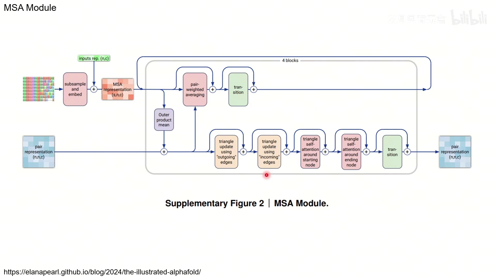

[【跳转到 02:00】](https://www.bilibili.com/video/BV1kNeKeYE7u/?t=120)

**outer product mean** 的作用是把 MSA 里的信息转成 pair 表示的更新。做法：

1. 把 MSA representation `m` 投影成两份 `a`、`b`（都是 `[c_m → c]`）；
2. 对每一条序列 s，取 `a_si` 和 `b_sj` 做**外积**，得到一个 `c×c` 的矩阵（外积就是 `a_si` 的每个分量与 `b_sj` 的每个分量两两相乘）；
3. 对所有序列 s **求平均**；
4. 把矩阵**展平**（维度从 `c` 变成 `c²`），再做一次线性投影 `[c² → c_z]`，得到 pair 表示的更新量 `o_ij`。

这样，MSA 中「第 i 列和第 j 列」的共变信息，就被汇聚成了 pair 表示的 `z_ij`。

### 3.2 MSA row-wise gated self-attention using only pair bias

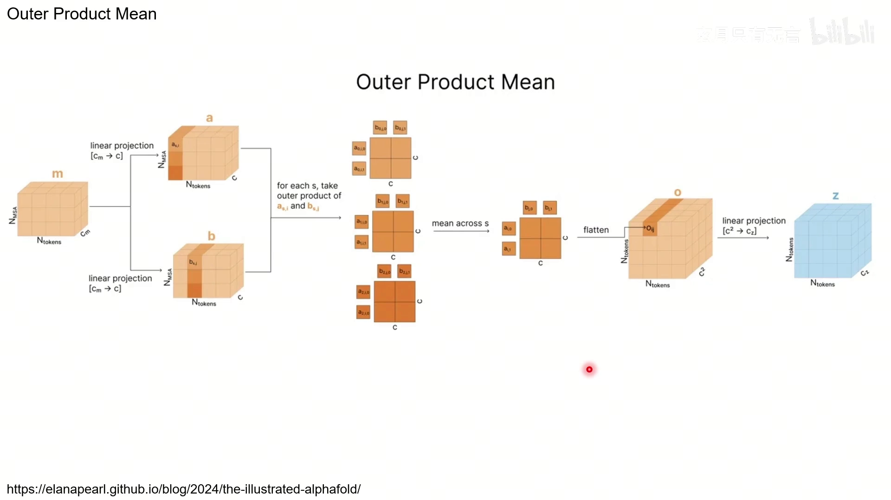

[【跳转到 03:27】](https://www.bilibili.com/video/BV1kNeKeYE7u/?t=207)

这个模块名字很长，但逻辑是：**用 pair 表示的一行当作注意力分布，来更新 MSA 的一列**。

- 取 pair 表示 **z 的第 s 行**，对每个 head 做线性投影 `[c_z → 1]`，再 softmax，就得到一条注意力分布 `w`（注意：这里的 query/key 不是从 MSA 自己算的，而是**直接来自 pair 表示**，所以叫 "using only pair bias"）；
- 从 MSA 表示 `m` 的第 s 列，对每个 head 做线性投影 `[c_m → c]` 得到 value；
- 用 `w` **对 value 的每个通道加权**，再沿 token 维度求和；
- 同时算一个 **gate**（`[c_m → c]` 再过 sigmoid），与结果逐元素相乘；
- 多头结果拼接后，线性投影 `[c*h → c_m]`，写回 `m`。

## 四、pair representation 的三角更新

pair representation 是这一讲的重头戏。它的核心思想来自一个几何事实。

### 4.1 为什么看三角形（outgoing / incoming）

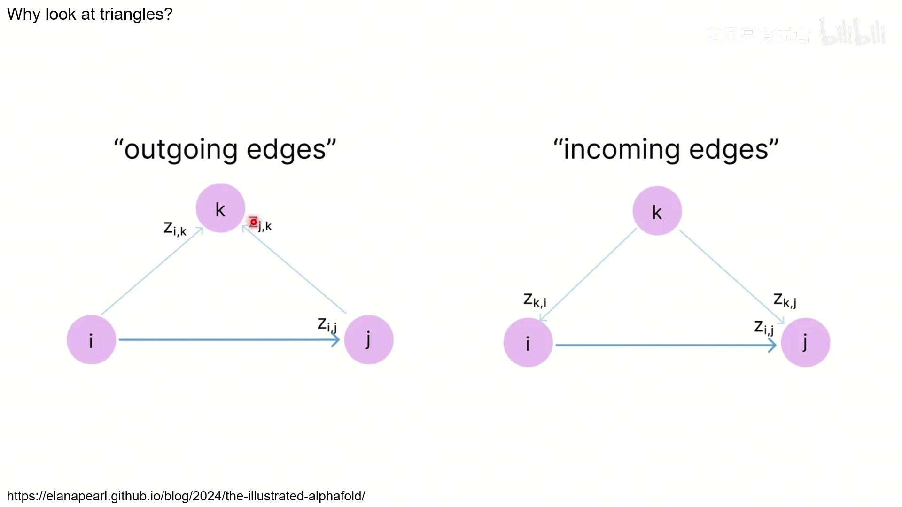

[【跳转到 06:22】](https://www.bilibili.com/video/BV1kNeKeYE7u/?t=382)

pair representation 的每个格子 `z_ij` 期望表示 i 和 j 之间的距离。而三角形有三边关系：**两边之和大于第三边**。这给了我们一个约束——`z_ij` 不应该和 `z_ik`、`z_jk` 任意取值，它们之间有几何一致性。因此，每当我们想更新 `z_ij`，就应该用上所有 `z_ik` 和 `z_jk` 的信息（对所有 k）。

这里有两种「边」的视角：

- **outgoing edges（出边）**：从 i、j 出发到 k，用到的是 `z_ik`、`z_jk`；
- **incoming edges（入边）**：从 k 指向 i、j，用到的是 `z_ki`、`z_kj`。

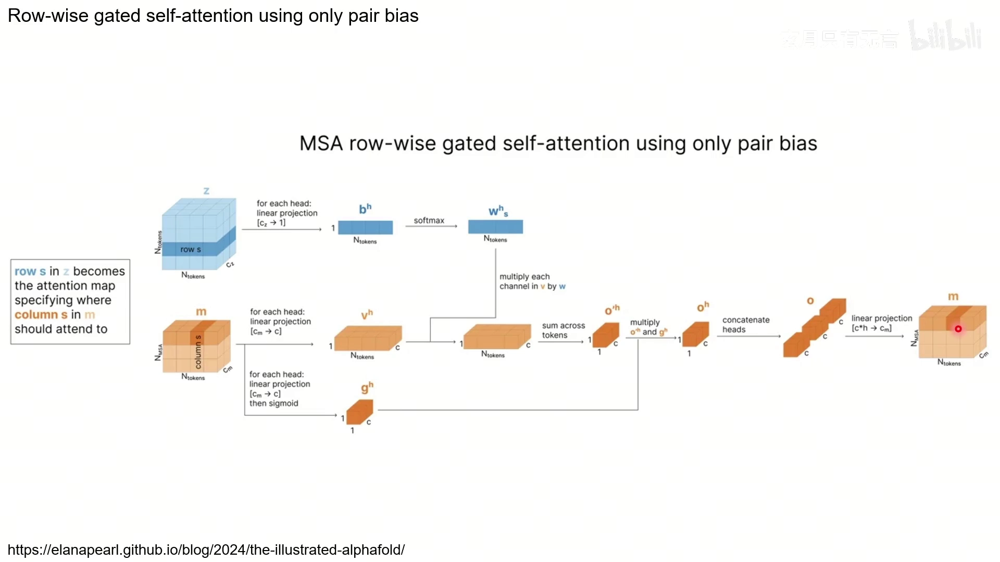

[【跳转到 05:32】](https://www.bilibili.com/video/BV1kNeKeYE7u/?t=332)

### 4.2 Triangle update：简单、便宜的乘法更新

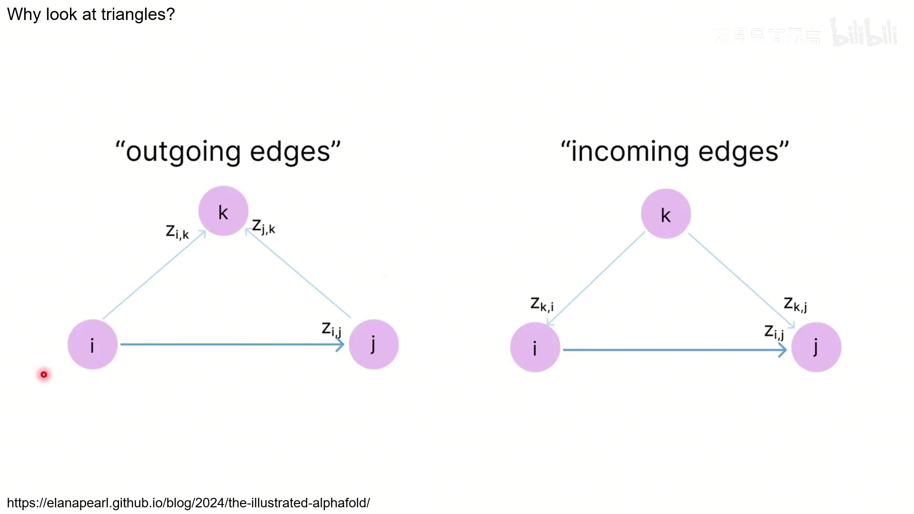

[【跳转到 06:47】](https://www.bilibili.com/video/BV1kNeKeYE7u/?t=407)

**triangle update（outgoing）** 的做法是：把 z 投影成 `a`、`b`，再把 a、b 各自「过线性层 + sigmoid」得到 `a'`、`b'`；`a` 与 `a'`、`b` 与 `b'` 分别逐元素相乘；然后对所有 k 做 `Σ_k (a_ik * b_jk)`，更新 `z_ij`；最后再乘一个 gate。**incoming** 版本完全对称，只是把「行」换成「列」（用 `z_ki`、`z_kj`）。

**它其实不是 attention**，只是逐元素乘法加求和，计算量比 Transformer 小不少——这在 48 层堆叠时很关键。

### 4.3 Triangle attention：带偏置的注意力

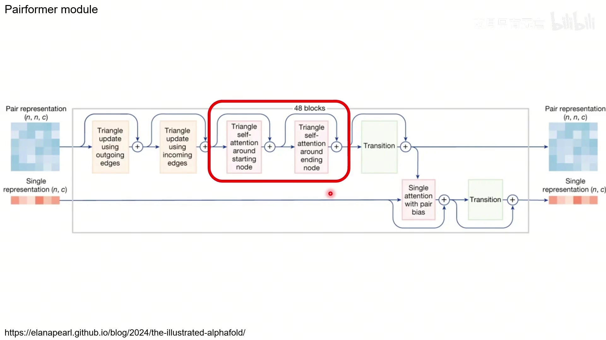

[【跳转到 09:42】](https://www.bilibili.com/video/BV1kNeKeYE7u/?t=582)

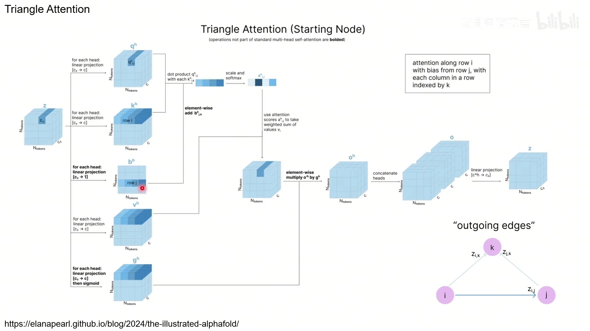

[【跳转到 10:32】](https://www.bilibili.com/video/BV1kNeKeYE7u/?t=632)

**triangle attention around starting node**：沿着**第 i 行**做注意力，**偏置来自第 j 行**，行里每个位置用 k 索引 → 对应 outgoing edges。做法和普通多头注意力一样：

1. 从 z 得到每个 head 的 **query、key、value**；
2. query 与每个 key 做点乘，**加上来自第 j 行的 bias**；
3. scale + softmax 得到注意力权重，对 value 加权求和；
4. 乘以 **gate**（sigmoid），多头拼接，再线性投影回 `c_z`。

**triangle attention around ending node** 则换成沿着**第 i 列**、**偏置来自第 j 列**、行用 k 索引 → 对应 incoming edges。AlphaFold2 里其实也有同样的设计。

## 五、Pairformer module 全貌与 single attention with pair bias

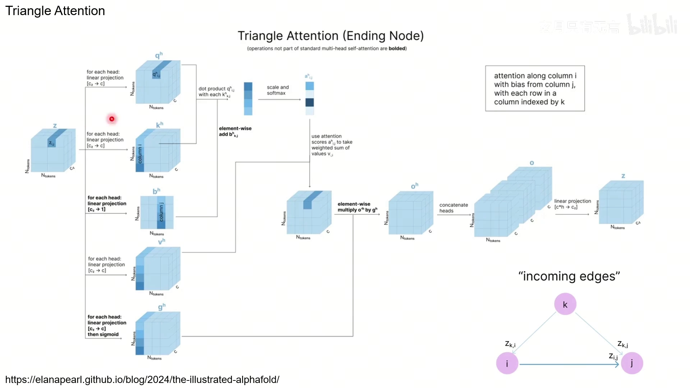

[【跳转到 12:37】](https://www.bilibili.com/video/BV1kNeKeYE7u/?t=757)

把上面这些拼起来，一个 **Pairformer block** 就是：

- **pair 分支**：triangle update（outgoing）→ triangle update（incoming）→ triangle self-attention（starting node）→ triangle self-attention（ending node）→ transition；
- **single 分支**：single attention with pair bias → transition。

一共叠 **48 个 block**。它和 MSA module 共用很大一部分结构（那些三角操作）。

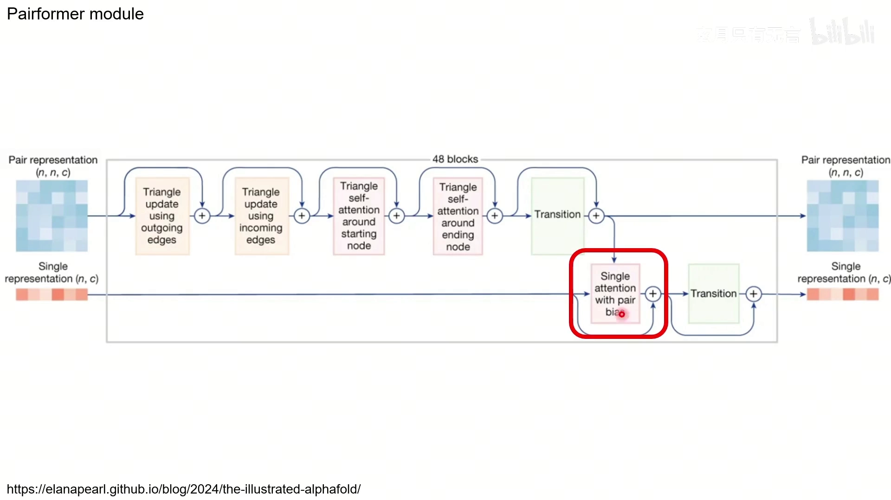

[【跳转到 13:02】](https://www.bilibili.com/video/BV1kNeKeYE7u/?t=782)

**single attention with pair bias** 负责把 pair 表示的信息传回 single 表示。以更新第 s 个 token 为例：从 single 表示 `s` 出发，经过全连接层得到 **query、key、value**；**bias 来自 pair 表示 z 的第 s 行**；query 与 key 点乘后加上 bias，softmax 得到注意力权重，对 value 加权求和；再过 **gate**（sigmoid）；多头结果拼接后线性投影，得到更新后的 single。

到此，中间这个 Pairformer 就讲完了——**主要仍然是一堆 Transformer，只不过多了 pair 与 single 之间的双向信息交换**。

## 小结

- 表示学习 = **Template module（2 块）→ MSA module（4 块）→ Pairformer（48 块）**，外加 **Recycling**。
- **Template module**：每个模板投影后叠加 pair 投影，过两遍 Pairformer stack，再求平均；末尾用 ReLU（AF3 中仅两处之一）。
- **MSA module** 与 AlphaFold2 的差别：**去掉了 MSA 的行/列注意力**，只保留 pair-weighted averaging；核心是 pair 表示的三角操作。
- **outer product mean**：把 MSA 两列的外积对序列求平均，展平后投影，更新 pair。
- **MSA row-wise gated self-attention using only pair bias**：用 pair 的一行当注意力分布去更新 MSA 的一列。
- **三角更新**：基于三角不等式，用所有 `z_ik`、`z_jk`（outgoing）或 `z_ki`、`z_kj`（incoming）更新 `z_ij`；triangle update 便宜、triangle attention 带偏置且更贵。
- **Pairformer block**：pair 做四次三角操作 + transition；single 做 single attention with pair bias + transition；共 48 块。

## 关键术语速查

| 术语 | 一句话解释 |
| :--- | :--- |
| Pairformer | AF3 表示学习主干，48 个 block，Evoformer 的升级版 |
| Template module | 把模板信息投影、过 Pairformer stack、求平均后注入 pair |
| MSA module | 处理多序列比对，保留三角操作、去掉 MSA 注意力 |
| Recycling | 把输出接回输入再走一遍做精修 |
| outer product mean | MSA 两列外积、对序列求平均，转成 pair 更新 |
| pair-weighted averaging | MSA module 里保留了 MSA 信息的平均机制 |
| outgoing / incoming edges | 从 i、j 出发到 k / 从 k 指向 i、j 两种三角视角 |
| triangle update | 用 Σ_k(a_ik·b_jk) 类乘法更新 z_ij，非注意力、便宜 |
| triangle attention | 沿行/列做注意力，偏置来自对应行/列，分别对应 starting/ending node |
| single attention with pair bias | 用 pair 的一行当 bias，更新 single 表示 |
| gate（门控） | sigmoid 得到 0/1，逐元素相乘控制信息是否传递 |
