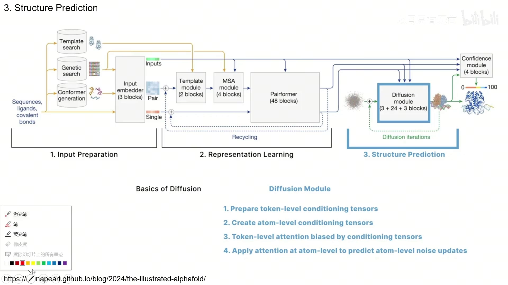
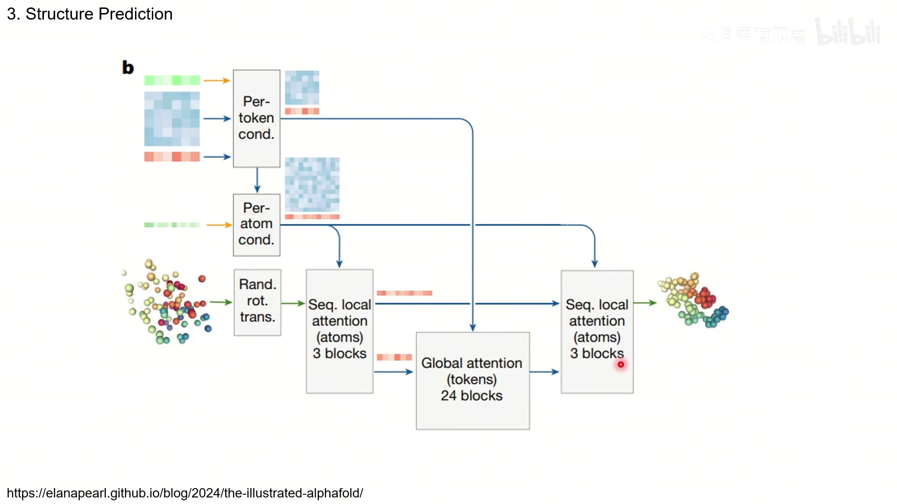
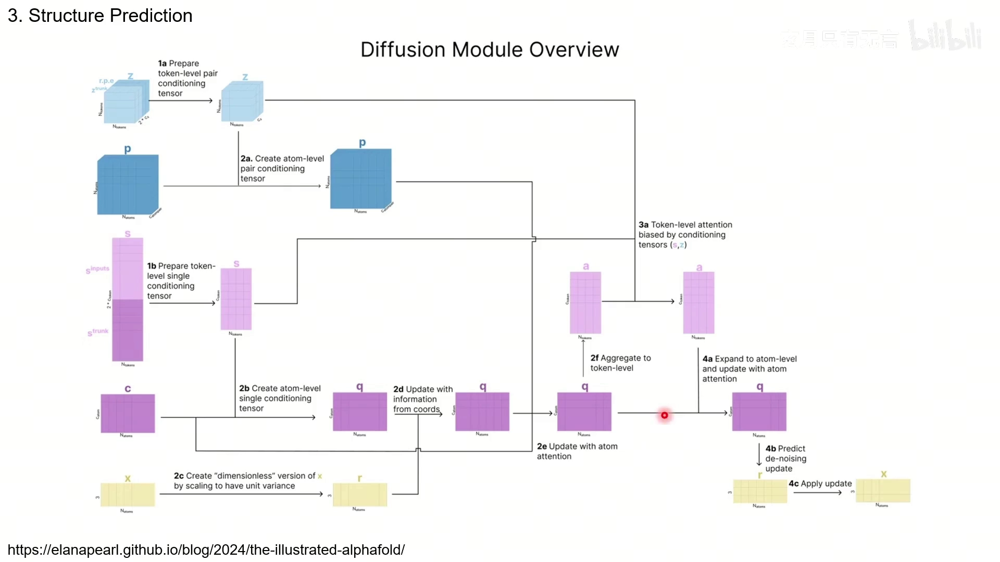
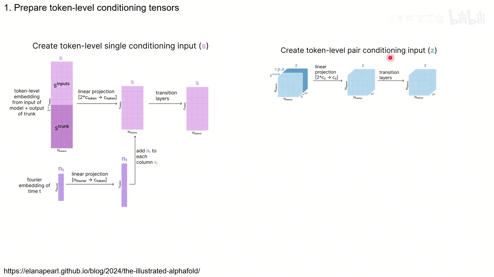
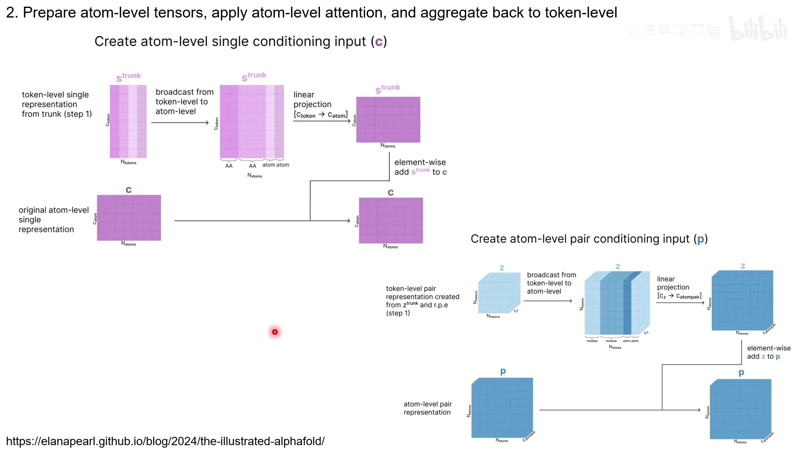
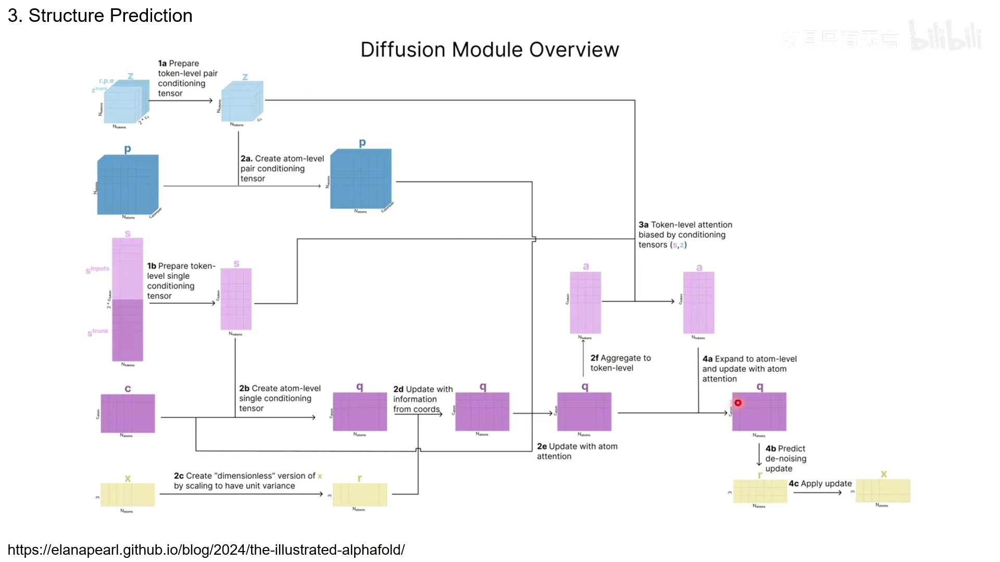
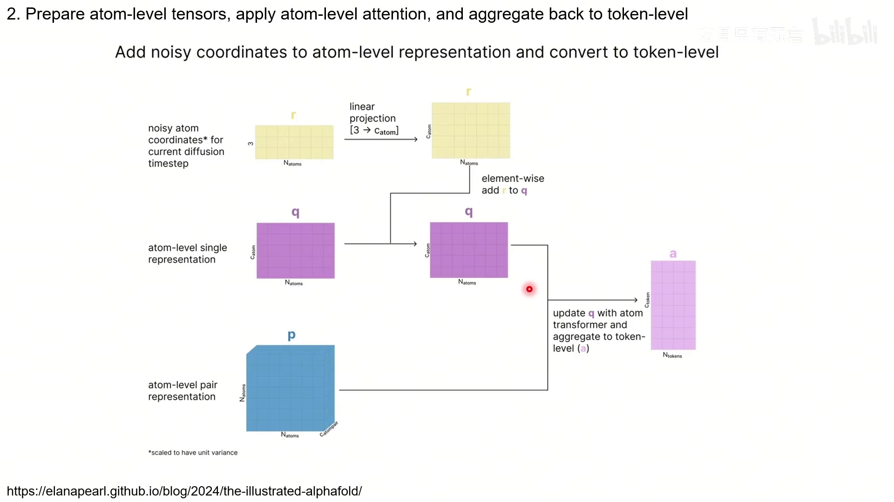

# AlphaFold3 算法详解（三）：扩散部分

> 本文是「AlphaFold3 算法详解」系列第 3 篇，配套视频：[《AlphaFold3算法详解 扩散部分》](https://www.bilibili.com/video/BV1ANeKeeESs/)。讲解材料主要来自 [The Illustrated AlphaFold](https://elanapearl.github.io/blog/2024/the-illustrated-alphafold/)。

## 本讲要解决的核心问题（SCQA）

**背景**：经过 Pairformer 的 48 个 block，我们得到了一组「学到」的表示：token 级的 single `s` 和 pair `z`，以及原子级的 single `q`、pair `p`。

**冲突**：但这些表示里还没有坐标。我们要的最终产物是每个原子的三维坐标，而坐标是一串**连续值**，不是分类标签；同时整个复合物的结构还应该满足旋转、平移不变性（转一下坐标系，结构本身没变）。

**疑问**：AlphaFold3 怎么从这些表示出发，一步步「烧」出三维坐标？它靠的是什么机制保证旋转平移不变性？

**回答（中心思想）**：结构预测用**扩散模型**完成——从随机坐标出发，反复预测噪声并去噪。整个 **Diffusion module 由 3 + 24 + 3 共 30 个 block 组成**，分四步：准备 token 级条件张量、准备原子级条件张量、token 级注意力、原子级注意力预测噪声更新。它**不使用等变网络**，而是在推理时随机旋转平移整团坐标来做数据扩增，让模型自己学会旋转平移不变性。

---

## 一、扩散模块总览：4 步、3+24+3 块

[【跳转到 00:00】](https://www.bilibili.com/video/BV1ANeKeeESs/?t=0)

进入最后的 diffusion module 后，我们会同时用到**原子级和 token 级**的 single/pair 表示。整个模块共 **30 个 block**，分四步：

1. **准备 token-level conditioning tensors**（token 级条件张量）；
2. **准备 atom-level conditioning tensors**（原子级条件张量）；
3. **token 级注意力**，由条件张量提供偏置；
4. **原子级注意力**，预测原子级的噪声更新。

[【跳转到 00:25】](https://www.bilibili.com/video/BV1ANeKeeESs/?t=25)

从上图的数据流能看到：先算 per-token 条件、再算 per-atom 条件；坐标做随机旋转平移后，先过 **3 个原子局部注意力 block**，再过 **24 个 token 全局注意力 block**，最后再过 **3 个原子局部注意力 block**，输出更新后的坐标。这就是 3 + 24 + 3 的由来。

[【跳转到 01:15】](https://www.bilibili.com/video/BV1ANeKeeESs/?t=75)

## 二、准备 token-level 条件张量（第 1 步）

[【跳转到 02:55】](https://www.bilibili.com/video/BV1ANeKeeESs/?t=175)

- **token pair 条件 `z`**：把 **z_trunk（经过 Pairformer 更新的 token pair）** 和 **r.p.e（相对位置编码）** 拼接起来，做线性投影 `[2*c_z → c_z]`，再过几层 transition。
- **token single 条件 `s`**：把 **s_inputs（输入阶段保存的）** 和 **s_trunk（trunk 输出）** 拼接起来，做线性投影 `[2*c_token → c_token]`；然后**加上时间步 t 的傅里叶嵌入**（`n_t`，线性投影后加到每一列 `s_i` 上）；再过几层 transition。

这里的关键是：**扩散过程是分很多时间步（timestep）的**，所以要把「当前是第几个时间步」这个信息编码进 single 表示——用时间 t 的傅里叶嵌入来实现。

## 三、准备 atom-level 条件张量（第 2 步）

[【跳转到 03:45】](https://www.bilibili.com/video/BV1ANeKeeESs/?t=225)

- **atom single 条件 `c`**：把 token 级的 single 表示从 token **广播到原子**（同一个 token 内的原子共享），做线性投影 `[c_token → c_atom]`，再**逐元素加到原始的原子级 single `c`** 上。
- **atom pair 条件 `p`**：把 token 级的 pair 表示从 token 广播到原子，做线性投影 `[c_z → c_atompair]`，再**逐元素加到原始的原子级 pair `p`** 上。

这样，来自主干（trunk）的「高层语义」就注入到了原子级的表示里。

### 3.1 坐标的「无量纲化」

![把坐标 x 缩放到单位方差得到 r，再线性投影 [3→c_atom] 加到 q 上](assets/AlphaFold3算法详解03_扩散部分/00281.webp)

[【跳转到 04:41】](https://www.bilibili.com/video/BV1ANeKeeESs/?t=281)

扩散模块要预测的是坐标，所以还要把坐标信息加进来：

- 原始坐标 `x` 是 `N_atoms × 3`。先把它**缩放到单位方差**，得到一个「无量纲」的版本 `r`（论文里叫 dimensionless，因为它不再带具体的长度单位，尺度统一）；
- 把 `r` 线性投影 `[3 → c_atom]`，**逐元素加到原子级 single `q`** 上；
- 再用 **Atom Transformer** 更新 `q`，并**聚合回 token 级**得到 `a`（供下一步的 token 级注意力使用）。

## 四、token 级注意力与原子级噪声预测

[【跳转到 05:19】](https://www.bilibili.com/video/BV1ANeKeeESs/?t=319)

**第 3 步（token 级注意力）**：用条件张量 `s`、`z` 作为偏置，在 token 级上做注意力，更新得到 `a`。因为 token 之间可以做**全局**的注意力（序列不太长），这一步对应数据流里那 24 个 global attention block。

**第 4 步（原子级注意力 + 预测噪声）**：

[【跳转到 08:09】](https://www.bilibili.com/video/BV1ANeKeeESs/?t=489)

- 回到原子空间，用更新后的 token 表示 `a` 去更新原子级 single `q`（用 **Atom Transformer**）；
- 把 token 表示**广播到原子**（把代表多个原子的 token 复制展开），再跑一遍 Atom Transformer；
- **最关键的一步**：最后一层线性层把原子级表示 `q` 映射回 **R³**，从而得到每个原子的**坐标更新量** `r_update`；
- 由于这些更新是在「无量纲」空间 `r` 里算的，需要把它**重新缩放**回带量纲的形式 `x_update`，再**加到当前坐标 x 上**。

得到新坐标后，就进入下一轮扩散迭代：再预测一次噪声、再去噪……如此反复，逐步逼近真实结构。这就是一个典型的**加噪 / 去噪（denoising）过程**。

[【跳转到 07:47】](https://www.bilibili.com/video/BV1ANeKeeESs/?t=467)

## 五、为什么没有等变网络

一般处理三维结构时，会设计**等变网络（equivariant network）**，让网络天生满足旋转、平移不变性（结构转了，输出也跟着转）。

但 AlphaFold3 没有这么做。它在 **inference（推理）时，把整团坐标随机地旋转、平移**，相当于做一个**数据扩增**：

- 每一步的旋转、平移程度都**记录下来**；
- 等整个去噪过程结束，把这些变换**还原回去**，再和真值比较。

通过「喂很多个不同旋转平移的数据」，模型被迫学会**旋转平移不会影响结果**，从而把这种不变性「学」进来，而不是内建在架构里。

## 小结

- **结构预测用扩散模型**：从随机坐标出发，反复预测噪声并去噪，得到最终三维结构。
- **Diffusion module 共 30 个 block（3 + 24 + 3）**，分 4 步：准备 token 条件、准备原子条件、token 级注意力、原子级注意力预测噪声。
- **token 条件**：single = `s_inputs` 与 `s_trunk` 拼接投影 + 时间步 t 的傅里叶嵌入；pair = `z_trunk` 与 `r.p.e` 拼接投影。
- **原子条件**：token 表示广播到原子后投影，分别加到原子级 `c`、`p` 上。
- **坐标处理**：先「无量纲化」（缩放到单位方差）得到 `r`，投影后加入 `q`；最后把预测的更新量重新缩放回 `x_update` 再应用。
- **没有等变网络**：靠推理时随机旋转/平移整团坐标做数据扩增，让模型学会旋转平移不变性。

## 关键术语速查

| 术语 | 一句话解释 |
| :--- | :--- |
| diffusion model | 扩散模型，从噪声逐步去噪生成结构 |
| Diffusion module | AF3 结构预测模块，3 + 24 + 3 = 30 个 block |
| conditioning tensor | 条件张量，给注意力提供偏置/上下文的 s、z、c、p |
| timestep embedding | 时间步嵌入，把扩散到第几步的信息用傅里叶嵌入加进 s |
| dimensionless r | 把坐标缩放到单位方差后的「无量纲」表示 |
| Atom Transformer | 更新原子级表示的模块，复用前面的注意力结构 |
| 去噪（denoising） | 预测噪声并减掉，得到更接近真值的坐标 |
| 等变网络 | 天生满足旋转平移不变性的网络；AF3 没用，改做数据扩增 |
| 数据扩增 | 随机旋转平移坐标来训练模型学会不变性 |
