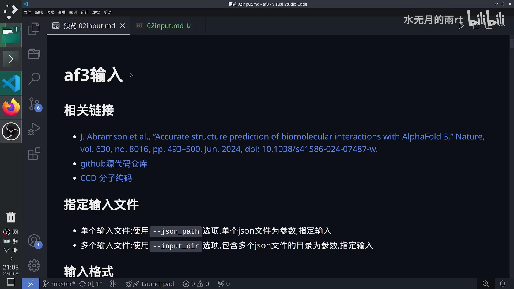
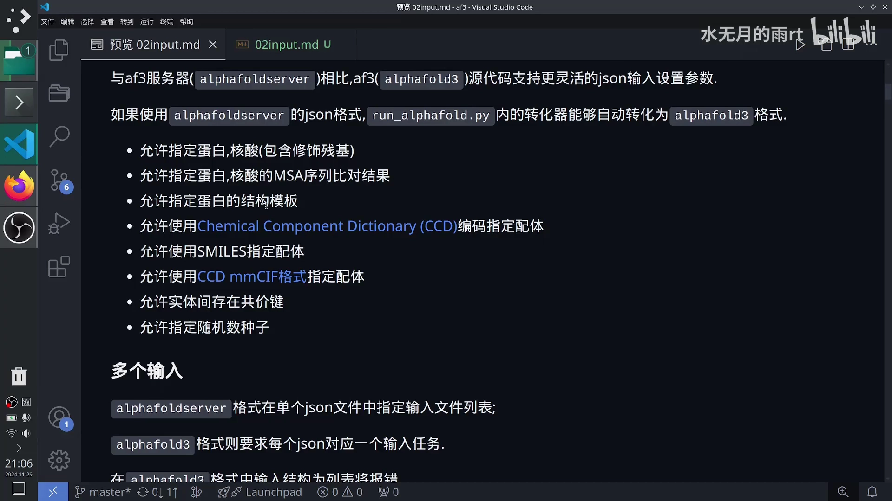
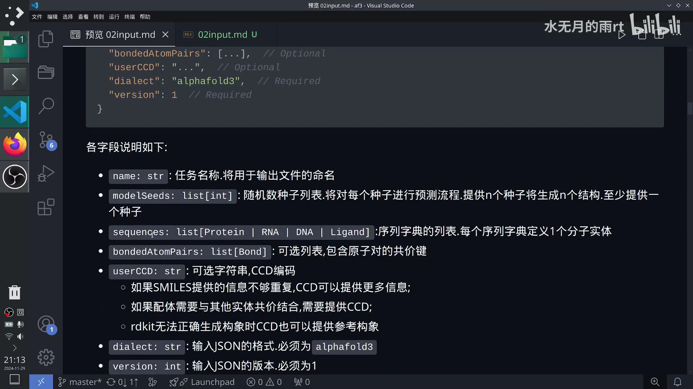
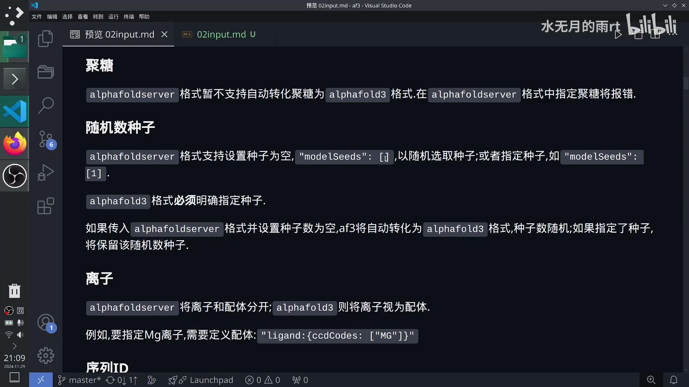
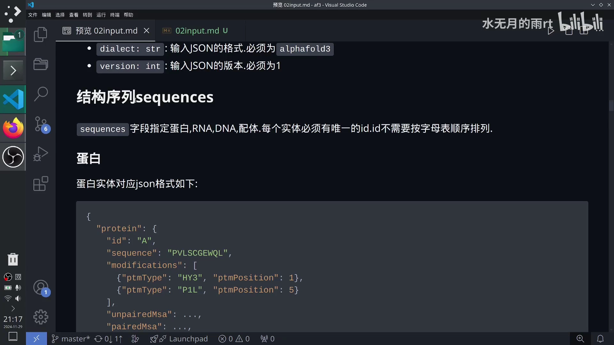
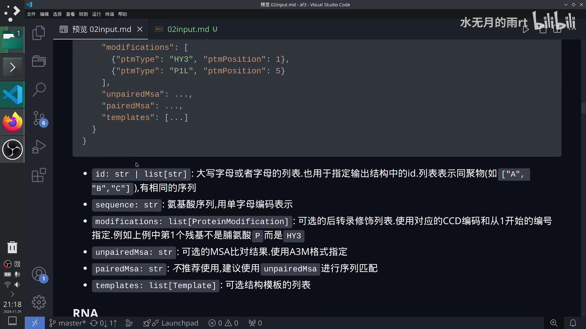
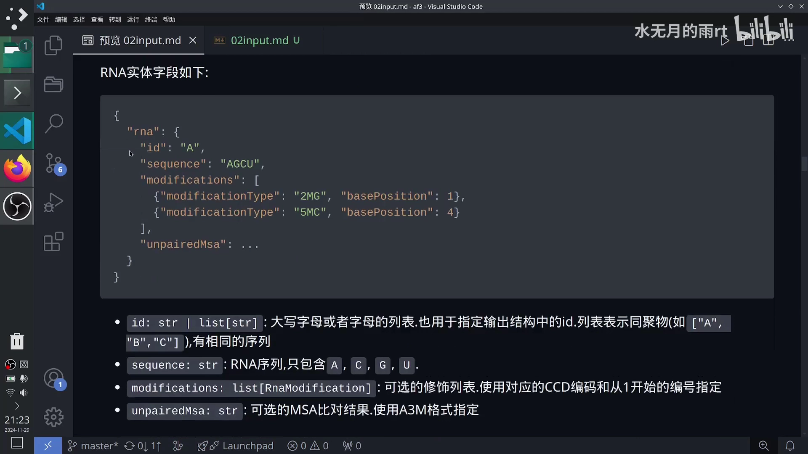
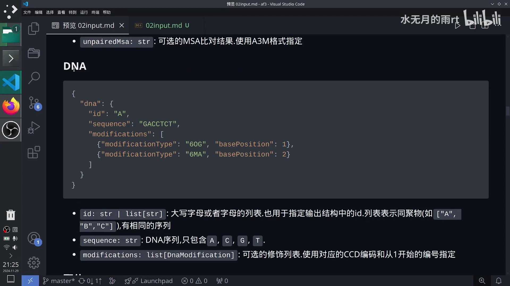
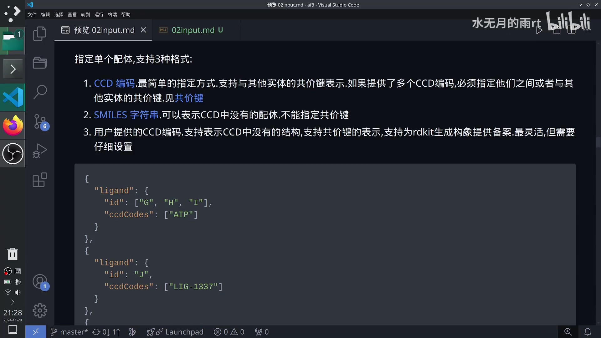

# AlphaFold3 输入设置（一）：序列定义与整体结构

> 本文是「AlphaFold3 官方文档讲解」系列第 1 篇，配套视频：[《alphafold3官方文档讲解:01 输入设置:兼容性,整体结构,序列定义》](https://www.bilibili.com/video/BV1yzzjYZETU/)。

## 本讲要解决的核心问题（SCQA）

**背景**：AlphaFold3 能预测蛋白、核酸、小分子配体甚至它们的复合物结构，官方文档里用一份 JSON 文件描述「要预测什么」。

**冲突**：这套输入格式和以前 AlphaFold Server（网页版）用的格式不一样——字段名不同、能不能省略种子不同、离子算不算配体也不同。旧配置文件直接拿到开源版跑，很容易报错。

**疑问**：一份合法的 AlphaFold3 输入 JSON 到底长什么样？蛋白、RNA、DNA、配体分别怎么定义？

**回答（中心思想）**：AlphaFold3 的输入就是一份「顶层 7 个字段 + `sequences` 里逐实体定义」的 JSON；只要先分清「服务器版（旧）」和「开源版（新）」两套格式的差异，再按蛋白 / RNA / DNA / 配体四类实体的模板填空，就能写出正确的输入。

---

## 一、先分清两套输入格式：服务器版（旧）与开源版（新）

AlphaFold3 官方文档在讲输入时，反复对比两套格式：AlphaFold Server 的 `alphafoldserver` 格式（视频里叫**旧版本**）和开源代码的 `alphafold3` 格式（**新版本**）。理解它们的差异，是看懂后续所有字段的前提。

### 1.1 怎么指定输入文件

跑开源版时，输入文件由命令行选项指定：

- **单个输入文件**：用 `--json_path` 选项，参数是一个 JSON 文件的路径。
- **多个输入文件**：用 `--input_dir` 选项，参数是「包含多个 JSON 文件的目录」。程序会依次处理目录下的每个任务。



[【跳转到 00:00】](https://www.bilibili.com/video/BV1yzzjYZETU/?t=0)

### 1.2 开源版支持更灵活的 JSON，还能自动转换旧格式

两个版本的关系可以概括成一句话：**开源版（`alphafold3`）的 JSON 更灵活，旧格式（`alphafoldserver`）能被自动转换过来。**

如果以前用过 AlphaFold Server、还留着它的配置文件，`run_alphafold.py` 里的转换器能自动把它转成 `alphafold3` 格式，不用手改。

开源版 JSON 允许指定的内容包括：

- 蛋白、核酸（都可以带修饰残基）；
- 蛋白、核酸的 MSA（多序列比对）结果；
- 蛋白的结构模板（templates）；
- 配体：用 **CCD 编码**、**SMILES** 或 **CCD mmCIF** 三种方式指定；
- 实体之间的**共价键**；
- 随机数种子（random seed）。



[【跳转到 01:15】](https://www.bilibili.com/video/BV1yzzjYZETU/?t=75)

> **术语**：**CCD**（Chemical Component Dictionary，化学组分词典）是 PDB 维护的分子编码库，给常见小分子、修饰残基分配了唯一的三字母编码和原子命名。用 CCD 编码指定配体，相当于报一个「身份证号」，最省事。

### 1.3 一次做多个任务：旧版能塞列表，新版必须一一对应

- **旧版本（`alphafoldserver`）**：可以在一个 JSON 文件里写一个「输入文件列表」，一次提交多个任务。
- **新版本（`alphafold3`）**：要求**一个 JSON 对应一个输入任务**。如果你在新格式里把任务写成列表，就会报错。

另外，旧格式里的**聚糖（glycan）暂时不支持自动转换**成新格式，在旧格式里指定聚糖会报错。旧格式整体也暂时不能自动转成新格式。

## 二、顶层 JSON 结构：认识 7 个字段

一份 `alphafold3` JSON 的顶层结构可以用下图概括，各字段含义如下。



[【跳转到 04:41】](https://www.bilibili.com/video/BV1yzzjYZETU/?t=281)

### 2.1 name 与 modelSeeds

- **`name`**：任务名称，会用于输出文件的命名。
- **`modelSeeds`**：随机数种子的**列表**，里面必须是整数。每提供一个种子，就对它跑一次预测流程——提供 n 个种子就会生成 n 个结构（具体数量还和采样有关）。**至少提供一个种子，而且必须放在方括号里**，写成 `[1]` 而不是 `1`。



[【跳转到 03:00】](https://www.bilibili.com/video/BV1yzzjYZETU/?t=180)

**新旧版的种子差异**：

- 旧版本允许种子为空（`"modelSeeds": []`），此时它随机取一个种子；也可以显式指定。
- 新版本**必须明确指定**种子，不能为空。如果传入的是旧格式且种子为空，转换器会自动填入一个随机种子；如果旧格式里已经指定了种子，则原样保留。

**离子的处理也变了**：旧版本把离子当作单独一类实体；新版本**统一把离子视为配体**。例如要指定镁离子（Mg），就在 `ligand` 字段里写 `"ligand": {"ccdCodes": ["MG"]}`。

### 2.2 其余字段速览

| 字段 | 含义 |
| :--- | :--- |
| `name` | 任务名称，用于输出文件命名 |
| `modelSeeds` | 随机数种子列表（整数），n 个种子生成 n 个结构 |
| `sequences` | 序列字典的列表，每个字典定义 1 个分子实体（蛋白 / RNA / DNA / 配体） |
| `bondedAtomPairs` | 可选，原子对的共价键列表 |
| `userCCD` | 可选字符串，用户自定义的 CCD 编码 |
| `dialect` | 输入 JSON 的格式，必须是 `alphafold3` |
| `version` | 输入 JSON 的版本，必须是 `1` |

关于 `userCCD`，它主要解决三类问题：① SMILES 提供的信息不够时，用 CCD 补充更多信息；② 配体需要和其他实体共价结合时，必须提供 CCD；③ RDKit 无法正确生成构象时，CCD 可以提供一个参考构象。

## 三、序列定义：蛋白 / RNA / DNA / 配体

`sequences` 是一个列表，列表里每一项是一个实体的字典。**每个实体必须有唯一的 `id`**，`id` 不需要按字母表顺序排列，只要互不相同即可。



[【跳转到 06:01】](https://www.bilibili.com/video/BV1yzzjYZETU/?t=361)

> **新旧版的 id 差异**：旧版本不支持自己指定 id，转换器会按 `sequences` 的顺序自动赋 id，顺序是 `A, B, …, Z, AA, BA, CA, …, ZA, AB, BB, …`。对于重复的实体（`count > 1`），每个实体的 id 具体规律并不明确。

### 3.1 蛋白（protein）

蛋白实体的字段如下：

```json
{
  "protein": {
    "id": "A",
    "sequence": "PVLSCGEWQL",
    "modifications": [
      {"ptmType": "HY3", "ptmPosition": 1},
      {"ptmType": "P1L", "ptmPosition": 5}
    ],
    "unpairedMsa": "...",
    "pairedMsa": "...",
    "templates": [...]
  }
}
```



[【跳转到 06:42】](https://www.bilibili.com/video/BV1yzzjYZETU/?t=402)

- **`id`**：字符串或字符串列表，都必须是**大写字母**，也会用于输出结构中给每条链编号。写成列表（如 `["A", "B", "C"]`）表示同聚物——多条一模一样的序列。
- **`sequence`**：氨基酸序列，用**单字母编码**表示。
- **`modifications`**：可选的后转录修饰列表，用对应的 CCD 编码和**从 1 开始**的位置编号指定。例如上例中第 1 个残基不是脯氨酸 `P`，而是被修饰成了 `HY3`。
- **`unpairedMsa`**：可选的 MSA 比对结果，用 **A3M 格式**指定。
- **`pairedMsa`**：不推荐使用，官方建议用 `unpairedMsa` 做序列匹配。
- **`templates`**：可选的结构模板列表。

### 3.2 RNA 与 DNA

RNA 实体的定义和蛋白类似，但更简单：

```json
{
  "rna": {
    "id": "A",
    "sequence": "AGCU",
    "modifications": [
      {"modificationType": "2MG", "basePosition": 1},
      {"modificationType": "5MC", "basePosition": 4}
    ],
    "unpairedMsa": "..."
  }
}
```



[【跳转到 08:25】](https://www.bilibili.com/video/BV1yzzjYZETU/?t=505)

- RNA 的 `id` 要求与蛋白一致；`sequence` **只允许 A、C、G、U**；`modifications` 用 CCD 编码和从 1 开始的位置指定。
- **RNA 没有 `pairedMsa`，也没有 `templates`**，因为它不需要。

DNA 的字段结构再次简化：

```json
{
  "dna": {
    "id": "A",
    "sequence": "GACCTCT",
    "modifications": [
      {"modificationType": "6OG", "basePosition": 1},
      {"modificationType": "6MA", "basePosition": 2}
    ]
  }
}
```



[【跳转到 08:50】](https://www.bilibili.com/video/BV1yzzjYZETU/?t=530)

DNA 的 `id` 与前面一致，`sequence` **只允许 A、C、G、T**，修饰的定义方式和 RNA 类似。

### 3.3 配体（ligand）：三种指定方式

配体是这一讲里内容最多的一块。指定单个配体支持三种格式：



[【跳转到 09:36】](https://www.bilibili.com/video/BV1yzzjYZETU/?t=576)

1. **CCD 编码**：最简单的指定方式，**支持与其他实体的共价键**。如果提供了多个 CCD 编码（比如一个聚糖由多个糖单元组成），必须指定它们之间、或与其他实体之间的共价键。
2. **SMILES 字符串**：可以表示 CCD 里没有的配体，但**不能指定共价键**——因为 CCD 是根据数据库不断扩充的，不是所有配体都有定义。
3. **用户提供的 CCD 编码**（`userCCD`）：支持表示 CCD 中没有的结构，支持共价键，还能为 RDKit 生成构象提供备案。**最灵活，但需要对 CCD 编码比较熟悉。**

一个包含三种配体的示例：

- 第一个配体有三条链，`id` 是 `["G", "H", "I"]`，类型是 `ATP`（用 CCD 编码）；
- 第二个配体只有一条链，`id` 是 `"J"`，名称是自定义的 `LIG-1337`，需要你进一步定义它的 CCD；
- 第三个配体用 SMILES 字符串表示。

**关键限制**：每个配体只能用 `ccdCodes` 或 `smiles` 其中一种，**不能同时指定两种**。但不同配体之间各用各的方式是允许的。

## 小结

- AlphaFold3 有**两套输入格式**：旧的 `alphafoldserver`（服务器版）和新的 `alphafold3`（开源版）；旧格式可由 `run_alphafold.py` 的转换器自动转换。
- 指定输入文件：单文件用 `--json_path`，目录用 `--input_dir`；**新版一个 JSON 只对应一个任务**，塞列表会报错。
- 顶层 7 个字段：`name`、`modelSeeds`、`sequences`、`bondedAtomPairs`、`userCCD`、`dialect`、`version`。
- **种子**：新版必须显式指定，至少一个，且要写成列表；旧版允许为空（随机）。
- **离子**：新版统一视为配体（如 Mg 写成 `ligand: {ccdCodes: ["MG"]}`）。
- **id**：新版必须为每个实体指定唯一大写 id，列表形式表示同聚物；旧版自动赋 id。
- 实体定义：**蛋白**有 `modifications / unpairedMsa / pairedMsa / templates`；**RNA** 有 `unpairedMsa` 但无配对 MSA 与模板；**DNA** 只有序列和修饰；**配体**可用 CCD / SMILES / 自定义 CCD 三种方式，`ccdCodes` 与 `smiles` 互斥。

## 关键术语速查

| 术语 | 一句话解释 |
| :--- | :--- |
| `alphafoldserver` | AlphaFold Server 的旧输入格式，开源版可自动转换它 |
| `alphafold3` | 开源版的输入格式，`dialect` 必须写这个值 |
| `--json_path` / `--input_dir` | 指定单个输入文件 / 输入文件所在目录 |
| `modelSeeds` | 随机数种子列表，n 个种子生成 n 个结构，至少 1 个 |
| `sequences` | 实体列表，每项是一个蛋白 / RNA / DNA / 配体 |
| `unpairedMsa` / `pairedMsa` | 未配对 / 配对的 MSA，用 A3M 格式；后者不推荐 |
| `templates` | 蛋白的结构模板列表 |
| `modifications` | 修饰残基列表，用 CCD 编码 + 从 1 开始的位置 |
| CCD | 化学组分词典，给分子分配唯一编码与原子命名 |
| SMILES | 用字符串表示分子结构，可表示 CCD 中没有的配体 |
| `userCCD` | 用户自定义 CCD 编码，最灵活，支持共价键 |
| `bondedAtomPairs` | 实体间共价键列表（下一篇详解） |
