# AlphaFold3 输入设置（二）：MSA、模板、共价键与 CCD

> 本文是「AlphaFold3 官方文档讲解」系列第 2 篇，配套视频：[《alphafold3官方文档讲解:02 输入设置:MSA,模板,共价键,CCD定义》](https://www.bilibili.com/video/BV11BzjYbEgD/)。

## 本讲要解决的核心问题（SCQA）

**背景**：上一篇讲了 AlphaFold3 输入 JSON 的整体结构和蛋白 / RNA / DNA / 配体的序列定义。对这些实体，除了序列本身，还有几类「附加信息」可以指定。

**冲突**：MSA（多序列比对）、结构模板、共价键、自定义 CCD 这几块字段多、规则细，而且同一个字段（比如 `unpairedMsa`）设成 `null`、空字符串 `""`、还是一段 A3M 文本，行为完全不同；官方文档前后甚至还有互相矛盾的地方。

**疑问**：这几类附加信息到底该怎么写？哪些字段该留空、哪些必须配套设置？

**回答（中心思想）**：MSA 是蛋白 / RNA 预测最关键的特征，**默认不设置就让 AlphaFold3 自己搜库**，要自己提供时必须守三条规矩；模板只对蛋白有意义；共价键用 `bondedAtomPairs` 描述原子对，只支持共价键；CCD 里的化合物没有定义时，就用 `userCCD` 自定义。

---

## 一、MSA：让模型「看到」进化信息

多序列比对（MSA，Multiple Sequence Alignment）是 AlphaFold 系列最核心的输入特征之一——它把同源序列排在一起，模型据此推断哪些残基在空间上接近（共进化信息）。**蛋白和 RNA 都支持自己提供 MSA；如果不设置，AlphaFold3 会用 Jackhmmer / Hmmer 自动去搜索基因数据库。**

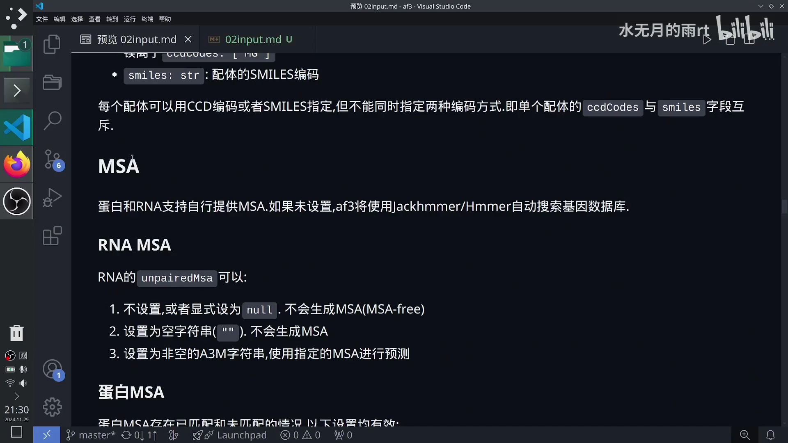

[【跳转到 00:00】](https://www.bilibili.com/video/BV11BzjYbEgD/?t=0)

### 1.1 RNA 的 MSA：三种写法

RNA 只有 `unpairedMsa` 一个字段，可以写成三种：

1. **不设置，或显式设为 `null`**：不会生成 MSA（即 MSA-free）。
2. **设为空字符串 `""`**：同样不会生成 MSA。
3. **设为非空的 A3M 字符串**：使用你指定的 MSA 进行预测。

### 1.2 蛋白的 MSA：五种组合

蛋白有 `unpairedMsa` 和 `pairedMsa` 两个字段（未配对 / 配对），以下设置都有效：

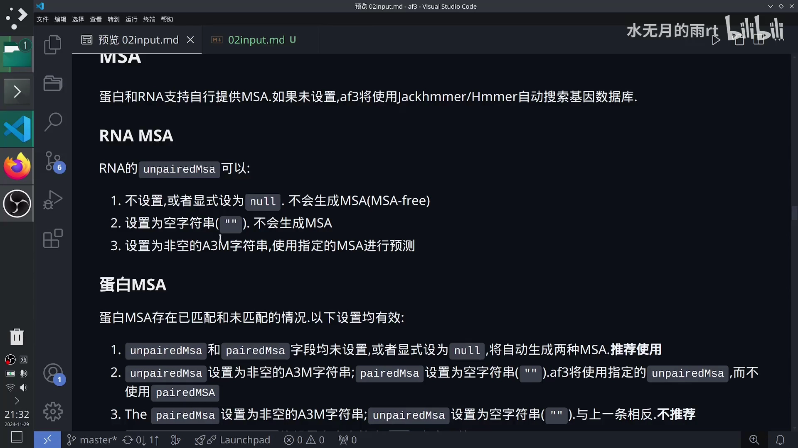

[【跳转到 00:50】](https://www.bilibili.com/video/BV11BzjYbEgD/?t=50)

1. **两个字段都不设置（或显式 `null`）**：自动生成两种 MSA，**推荐**。
2. **`unpairedMsa` 设为非空 A3M，`pairedMsa` 设为 `""`**：只用未配对的 MSA，不使用配对的。
3. **`pairedMsa` 设为非空 A3M，`unpairedMsa` 设为 `""`**：与上一条相反，**不推荐**。
4. **两个都设为 `""`**：完全不使用 MSA。
5. **两个都设为你自定义的 A3M**：按你提供的 MSA 预测。

**核心规则**：这两个字段**要么都设置（不为 `null`），要么都不设置**。如果设置了 `unpairedMsa`，一般把 `pairedMsa` 设为 `""`。哪怕你不需要配对的 MSA，只要你定义了配对的字段，也要把它设为空。

### 1.3 自己提供 MSA 的三条硬规矩

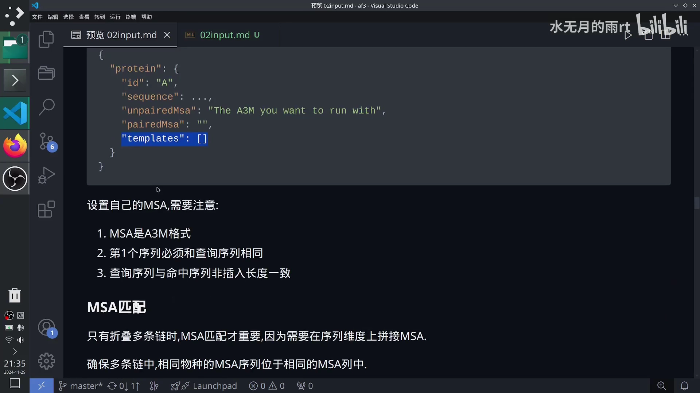

[【跳转到 02:13】](https://www.bilibili.com/video/BV11BzjYbEgD/?t=133)

1. **必须是 A3M 格式**；
2. **第一条序列必须和查询序列相同**——MSA 字段里的第一条要和上面 `sequence` 一致；
3. **查询序列与命中序列的「非插入部分」长度要一致**。

这条规矩一般只要软件正常跑就不会出错。作者的建议是：**不要一上来就自己设置 MSA**，可以先让 AlphaFold3 跑一遍序列比对搜索，它会自己生成一个包含 MSA 的 JSON，你再按需要去改；熟练之后，可以把一些好的配置存下来当模板复用。

### 1.4 多链才需要的 MSA 匹配

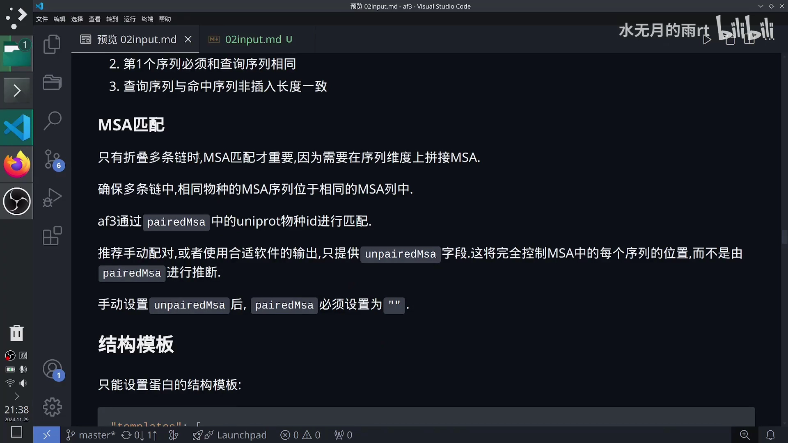

[【跳转到 03:22】](https://www.bilibili.com/video/BV11BzjYbEgD/?t=202)

**只有折叠多条链（多聚体）时，MSA 匹配才重要**，因为需要在序列维度上把多条链的 MSA 拼接起来。它要保证：**多条链中，相同物种的 MSA 序列位于相同的 MSA 列中**。否则不同链的同源信息就对不齐，「乱套了」。

- AlphaFold3 用 `pairedMsa` 字段做匹配，主要靠 MSA 里的 **UniProt 物种 id**。
- 官方推荐**手动配对**，或者**只提供 `unpairedMsa` 字段**——这两种方式都能完全控制每条序列在 MSA 里的位置，而不是让 `pairedMsa` 去自动推断。
- 手动设置 `unpairedMsa` 后，`pairedMsa` 必须设为 `""`（文档另一处又说「配置文件里就不要出现 `pairedMsa`」，前后不一致）。

> **作者的提醒**：关于预计算 MSA，GitHub 上有相关 issue，代码做过一些修改，导致文档前后可能不一致。遇到时以官方对 issue 的回复为准。

## 二、结构模板：只对蛋白有意义

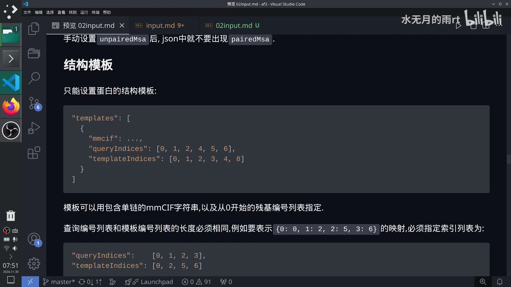

[【跳转到 05:06】](https://www.bilibili.com/video/BV11BzjYbEgD/?t=306)

**结构模板只能设置蛋白的**——RNA、DNA、小分子配体设置模板没有意义。一个模板的定义：

```json
"templates": [
  {
    "mmcif": "...",
    "queryIndices": [0, 1, 2, 4, 5, 6],
    "templateIndices": [0, 1, 2, 3, 4, 8]
  }
]
```

- **`mmcif`**：包含**单链**的 mmCIF 字符串。
- **`queryIndices` / `templateIndices`**：查询残基编号列表和模板残基编号列表，**编号都从 0 开始**，两个列表**长度必须相同**。例如要表示 `{0→0, 1→2, 2→5, 3→6}` 的映射，就写 `queryIndices: [0,1,2,3]`、`templateIndices: [0,2,5,6]`。
- 一个模板值里**只能包含一条链**，否则会报错；要提供多个模板，就在列表里用逗号接下一个。
- `"templates": []` 表示**不使用模板**预测；也可以直接不写这个字段，让 AlphaFold3 自动从基因数据库里去找。

同样地，作者建议不熟的话**先让 AlphaFold3 自己去找模板**，多跑几个任务后看看它更新出来的模板格式怎么写，再仿照着写。

## 三、共价键：把实体「焊」在一起

### 3.1 bondedAtomPairs 的结构

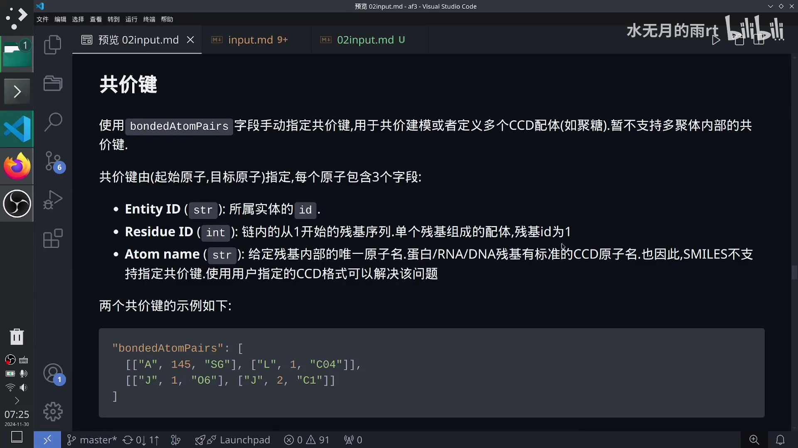

[【跳转到 06:39】](https://www.bilibili.com/video/BV11BzjYbEgD/?t=399)

用 `bondedAtomPairs` 字段**手动指定共价键**，用于共价建模，或者定义多个 CCD 配体（比如聚糖）。**目前暂不支持多聚体内部的共价键**（蛋白 / DNA / RNA 内部不允许连接），这种情况要用「修饰残基」的方式定义。

共价键由**（起始原子, 目标原子）**这一对原子指定，每个原子包含 3 个字段：

- **Entity ID**：所属实体的 `id`；
- **Residue ID**：链内**从 1 开始**的残基序号；单个残基组成的配体，残基 id 为 1；
- **Atom name**：该残基内部唯一的原子名。蛋白 / RNA / DNA 残基有标准的 CCD 原子名，**也因此 SMILES 不支持指定共价键**——要用用户自定义的 CCD 格式来解决。

### 3.2 两个例子与限制

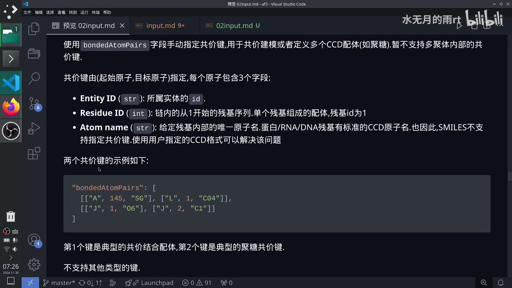

[【跳转到 07:15】](https://www.bilibili.com/video/BV11BzjYbEgD/?t=435)

```json
"bondedAtomPairs": [
  [["A", 145, "SG"], ["L", 1, "C04"]],
  [["J", 1, "O6"], ["J", 2, "C1"]]
]
```

- 第 1 个键是典型的**共价结合配体**：A 链 145 号残基的 SG 原子，连到 L 链 1 号残基的 C04 原子。
- 第 2 个键是典型的**聚糖共价键**：J 链内部 1 号残基的 O6 连到 2 号残基的 C1。

**只支持共价键**，其他类型的键——离子键、金属键等——目前都不支持。

## 四、聚糖与用户自定义 CCD

### 4.1 用配体表示聚糖

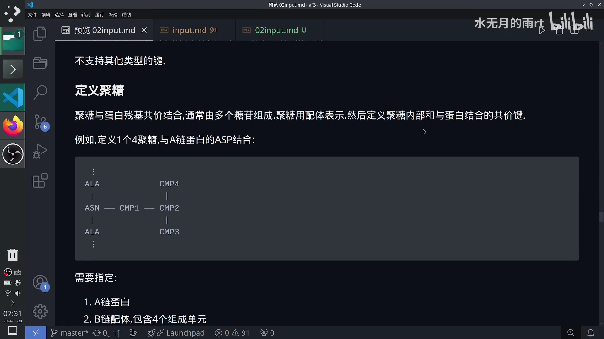

[【跳转到 08:49】](https://www.bilibili.com/video/BV11BzjYbEgD/?t=529)

聚糖（glycan）通常由多个**糖苷键**组成，**用配体来表示**，写在 `ligand` 字段里。定义聚糖时，需要定义**聚糖内部**以及**它与蛋白结合的共价键**。

一个例子：定义 1 个 4 聚糖，与 A 链蛋白的残基结合。你需要：

1. 定义 A 链蛋白的序列；
2. 定义 B 链配体，包含 4 个组成单元（如 `CMP1`、`CMP2`、`CMP3`、`CMP4`）；
3. 定义总共若干条共价键，表示这些糖单元之间、以及糖单元与蛋白残基之间的连接关系。

### 4.2 用户自定义 CCD：CCD 里没有的结构

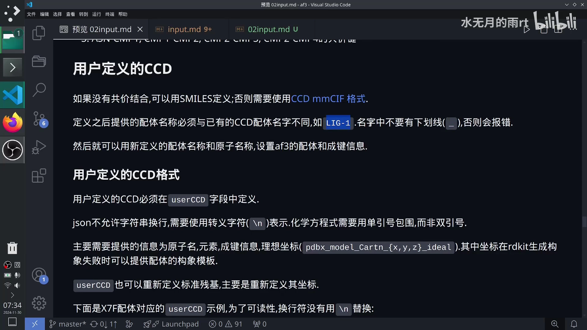

[【跳转到 09:44】](https://www.bilibili.com/video/BV11BzjYbEgD/?t=584)

- 如果没有共价结合，可以用 SMILES 定义；否则需要提供 CCD。
- 自定义的配体名称**必须和已有的 CCD 配体名称不同**，比如 `LIG-1`；
- **名字里不要有下划线 `_`**，否则会报错——代码内部下划线有其它含义，要用就用连字符 `-`；
- 定义好之后，就可以用新定义的配体名和原子名，设置 AlphaFold3 的配体和成键信息。

**`userCCD` 格式的三条格式规则**：

1. 自定义 CCD **必须在 `userCCD` 字段里定义**；
2. **JSON 不允许字符串换行**，所以要用转义字符 `\n` 表示换行；
3. **化学方程式要用单引号包围，而不是双引号**。原因：JSON 字符串最外层用双引号，内部要表示一个连续字符串就得用单引号，否则语法会错——如果内部也用双引号，解析器会认为「从前面这个双引号一直到这个结束是同一个字符串」，后面那段就不被当字符串了。

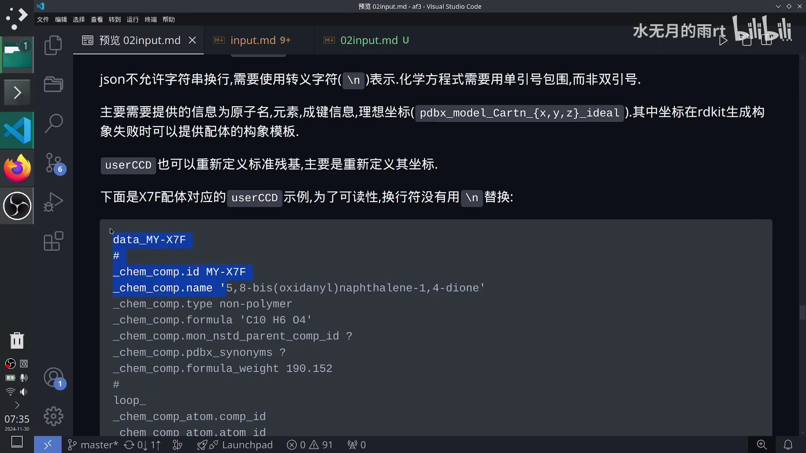

[【跳转到 10:34】](https://www.bilibili.com/video/BV11BzjYbEgD/?t=634)

`userCCD` 里需要提供的主要信息是：**原子名、元素、成键信息、理想坐标**（字段名形如 `pdbx_model_Cartn_{x,y,z}_ideal`）。其中理想坐标在 RDKit 生成构象失败时，可以作为配体的构象模板。`userCCD` 也可以**重新定义标准残基**，主要是重新定义它的坐标——一旦改了坐标，对应的键长、键角都会变化。

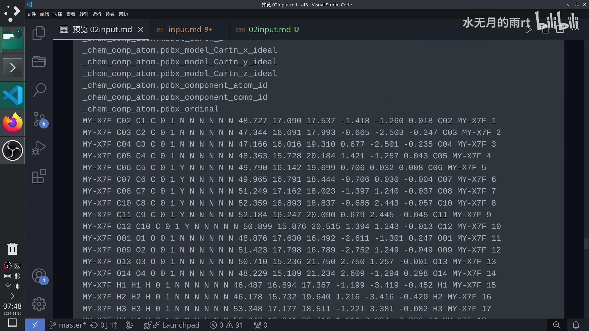

[【跳转到 11:49】](https://www.bilibili.com/video/BV11BzjYbEgD/?t=709)

以配体 `X7F` 为例（示例中为了可读性保留了换行，实际要全部替换成 `\n`，最终是一行很长的字符串）：里面有它的坐标，也有共价键信息，格式在 PDB 官网有说明。作者坦言**这一长串手动写不现实**，于是推荐了一个 CCD 生成库 **CCDUtils**，可以把 PDB 中的化学物质转成 CCD 编码，具体用法可以自己去看这个库。

## 小结

- **MSA**：不设置就自动搜库；RNA 的 `unpairedMsa` 有「null / 空串 / A3M」三种；蛋白的 `unpairedMsa` + `pairedMsa` 有五种组合，**要么都设要么都不设**。
- 自己提供 MSA 必须满足：**A3M 格式、首条等于查询序列、非插入长度一致**；建议先让 AlphaFold3 自己搜、再改它的 JSON。
- **MSA 匹配只有多链折叠才重要**，靠 `pairedMsa` 的 UniProt 物种 id 对齐；推荐手动配对或只用 `unpairedMsa`。
- **结构模板只对蛋白有意义**，字段为 `mmcif / queryIndices / templateIndices`，索引从 0 开始且两个列表等长，单个模板只能含一条链。
- **共价键**用 `bondedAtomPairs`，每个原子用 `(Entity ID, Residue ID, Atom name)` 描述；只支持共价键，不支持离子键、金属键，也不支持多聚体内部共价键。
- **聚糖用配体表示**，要定义内部和与蛋白结合的共价键。
- **用户自定义 CCD** 名称要与已有 CCD 不同、不含下划线；JSON 里换行用 `\n`、化学式用单引号；主要提供原子名、元素、成键信息与理想坐标；手动写不现实时可用 **CCDUtils** 生成。

## 关键术语速查

| 术语 | 一句话解释 |
| :--- | :--- |
| MSA | 多序列比对，把同源序列排在一起提供共进化信息 |
| `unpairedMsa` / `pairedMsa` | 未配对 / 配对的 MSA，A3M 格式；两者一起设或一起不设 |
| A3M | 一种 MSA 存储格式，首条为查询序列、插入用小写 |
| Jackhmmer / Hmmer | AlphaFold3 未指定 MSA 时用来搜基因数据库的工具 |
| MSA 匹配 | 多链折叠时对齐不同链的 MSA 列（按 UniProt 物种 id） |
| `templates` | 蛋白结构模板列表，`mmcif / queryIndices / templateIndices` |
| `bondedAtomPairs` | 实体间共价键列表，原子用 (实体 id, 残基号, 原子名) 描述 |
| 聚糖（glycan） | 由糖苷键连接的糖链，用配体 + 共价键表示 |
| `userCCD` | 用户自定义 CCD 编码，用于 CCD 里没有的配体/结构 |
| CCDUtils | 把 PDB 中的化学物质转成 CCD 编码的生成库 |
