# AlphaFold 的原理和展望：从序列到结构，它到底学到了什么、能做什么、不能做什么

> 本文整理自上海交通大学本科生钟博子韬在「钰沐菡 公益公开课」上的报告《AlphaFold 的原理和展望》。报告时长约 77 分钟，讲者面向生物背景的听众，重点是**讲清原理与边界**——不要求听众能复现模型，而是理解“为什么 AlphaFold 能做得这么好”、以及“作为用户怎样正确使用它”。本文严格基于视频演说图文稿撰写，关键处附时间戳跳转。

## 本讲要解决的核心问题（SCQA）

**背景**：2020 年 AlphaFold2 在 CASP14 上一鸣惊人，成为“深度学习 + 生命科学”的标杆案例。此后 AlphaFold 不断更新，AlphaFold DB 也已经覆盖了几乎所有已知蛋白序列，结构预测看起来唾手可得。

**冲突**：但绝大多数人是“只知道它很厉害”，却并不清楚它**到底学到了什么**——它预测的是共进化到接触图的映射，而不是真实的物理能量；由此带来一系列容易被误用的地方：拿它去判断蛋白稳定性、功能变化会失败；拿 AlphaFold2 单体模型硬凑复合物会出错；AlphaFold-Multimer 在某些体系上会把结构坍缩成一个球。

**疑问**：AlphaFold 究竟凭什么这么准？它的原理解释了什么、又暗示了哪些边界？作为一个普通用户，怎样才能正确地用它，而不是被它“看起来很像”的结果误导？

**回答（中心思想）**：AlphaFold2 的强大来自 **MSA、Recycling、Evoformer、Structure Module 与置信度输出**这五个关键设计，其本质是“从共进化信息推断结构上的接触”，而非物理模拟；因此它擅长预测**结构**，不擅长预测**稳定性与功能**；复合物预测要用专门的 AlphaFold-Multimer，并且在很多体系上还不如“ColabFold + 序列拼接”的土办法。理解这条主线，才能既用足它、又不被它坑。

---

## 一、为什么需要蛋白质结构预测：从中心法则到“半个世纪的难题”

### 1.1 蛋白质的功能由结构决定，而结构信息编码在序列里

蛋白质折叠是生命活动的基础。根据**中心法则**，遗传信息从 DNA 转录成 RNA，再翻译成蛋白质：蛋白质先得到一条没有折叠的**一级结构**（氨基酸序列），再逐步折叠成稳定的**三级结构**、乃至多个亚基组成的**四级结构**，才能发挥功能。

1972 年诺贝尔化学奖得主 **Anfinsen** 提出的“**Anfinsen's Dogma（安芬森法则）**”指出：蛋白质折叠成天然结构所需的全部信息，都已经编码在氨基酸序列里；蛋白质会折叠到最小能量状态，且大多数蛋白会折叠成一个独特的构象。[【跳转到 03:33】](https://www.bilibili.com/video/BV1fm4y1D7Wz/?t=213)

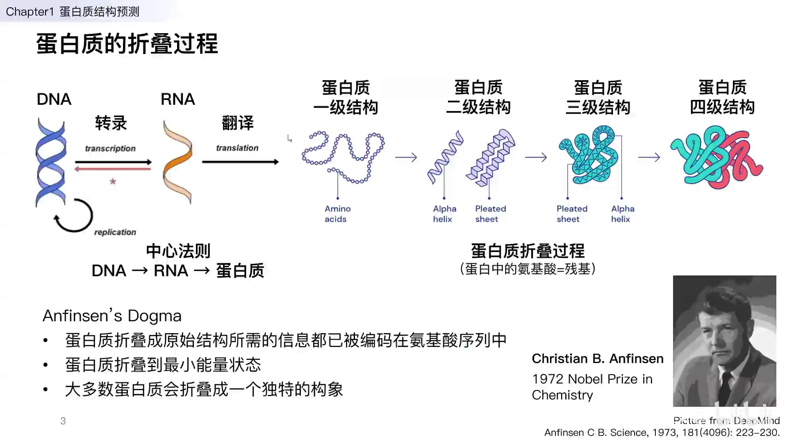

这句话其实在暗示：**只要知道序列，理论上就应该能推出结构**。但真做起来并不容易。

### 1.2 实验方法准但慢，计算方法快但曾经不准

从序列出发去解析结构，可以走**实验方法**（如 X 射线晶体学、冷冻电镜）：准确度很高，但**低通量**，需要大量时间和成本。也可以用**计算方法**替代：效率很高，但过去**准确度很低**——这正是计算方法长期以来的主要瓶颈。[【跳转到 04:17】](https://www.bilibili.com/video/BV1fm4y1D7Wz/?t=257)

于是就出现了一个巨大的 **gap**：序列数据极多，结构数据极少。演化的统计显示，已知核酸/蛋白序列的数量是已解析结构的上千倍。我们迫切需要一种**既高精度、又高通量**的发现蛋白质结构的方法来填平这道鸿沟。

### 1.3 CASP：用比赛来检验“谁预测得最准”

为了解决这个问题，科学家提出了 **CASP**（Critical Assessment of protein Structure Prediction，蛋白质结构预测关键评估）比赛。流程是：赛前提供一个蛋白质的序列，实验方解析出结构但**不公布**；参赛者用计算方法预测结构；三个月后，把预测结构与实验结构做比较，看谁的最准。[【跳转到 05:07】](https://www.bilibili.com/video/BV1fm4y1D7Wz/?t=307)

CASP 近 20 年的历史上，有几次决定性的台阶：

- **2014（MSA）**：**PSICOV**（David Jones，UCL）开始用多序列比对提取进化信息；
- **2016（深度学习 / ResNet）**：**RaptorX-Contact**（Jinbo Xu，TTIC / 芝加哥）引入深度学习；
- **2020（Transformer）**：**AlphaFold2**（DeepMind）引入 Transformer，让精度再上一个台阶。

从历年的结果也能看出区别：在“简单”蛋白上大家其实都还行，真正被拉开差距的是**困难蛋白**——而困难蛋白恰恰是过去最难攻克的部分。[【跳转到 06:27】](https://www.bilibili.com/video/BV1fm4y1D7Wz/?t=387)

---

## 二、传统思路：先预测“接触图”，再间接拼出结构

### 2.1 直接预测 3D 坐标很难，那就先预测二维的接触图

早期方法（AlphaFold2 之前的“主流套路”）是这样想的：输入是长度为 n 的蛋白质序列，每个位点是 20 种氨基酸之一，信息量太少；而我们想要的是长度为 n 的每个位点的**全部原子坐标**——需要的信息远多于序列本身。

多出来的信息来自**进化**：把序列拿去做**多序列比对（MSA）**，找到所有进化上相似的蛋白序列，就能补充信息。但直接让深度学习模型预测 3D 坐标很难，于是大家退一步，先预测蛋白质结构的**二维表示**——**Contact Map（接触图）/ Distance Map（距离图）**：即蛋白质中任意两个氨基酸之间的距离构成的矩阵，距离小于某个阈值就认为二者“接触”。[【跳转到 07:21】](https://www.bilibili.com/video/BV1fm4y1D7Wz/?t=441)

先预测接触图、再用它作为约束去优化折叠，比直接回归 3D 坐标简单得多，而且可以让模型采用计算机视觉里久经考验的结构（如 **CNN**）。

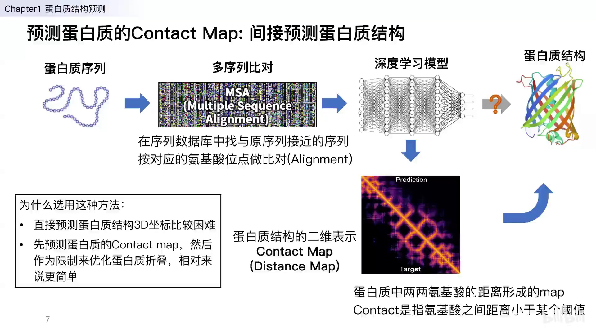

### 2.2 理论基础：共进化（Co-evolution）

从 MSA 到接触图的理论依据是**共进化**。多序列比对里包含两类信息：一是**保守性**（某个位点在所有相似蛋白中氨基酸种类不变），二是**共进化**（两个位点的氨基酸同步变化）。

关键在共进化：如果蛋白质里两个位点总是同时变化，说明它们在序列上可能相距很远，但在 3D 结构上应该离得很近——两者有相互作用，才会有这种同步变化。于是我们就能从“进化上的关联”推断“结构上的接触”。[【跳转到 08:50】](https://www.bilibili.com/video/BV1fm4y1D7Wz/?t=530)

### 2.3 AlphaFold 一代（2018）：把 ResNet 用到接触图上

作为这条路线里的佼佼者，**AlphaFold 一代（2018）**的大体流程是：先做多序列比对，找到相似的蛋白序列；再用一个很深的神经网络（**ResNet**）从 MSA 的进化信息预测出 **distance map**（以及 **torsion map**，即二面角）；最后以这些分布为约束，用**梯度下降**优化出蛋白质结构。[【跳转到 09:24】](https://www.bilibili.com/video/BV1fm4y1D7Wz/?t=564)

讲者指出：一代这套方案其实和传统方法差别不大，主要是工程上的胜利——硬件优势、算力、模型深度都很强，所以拿了第一名。但它**不是端到端**的：网络输出的是“二维表示”，还要靠后处理去“优化出”结构，因此对结果并不完全满意。[【跳转到 10:14】](https://www.bilibili.com/video/BV1fm4y1D7Wz/?t=614)

---

## 三、AlphaFold2 的五大关键设计：它为什么能做得这么好

AlphaFold2 的目标是**端到端**：输入序列，直接输出结构。它的整体架构由 **Embedding → Trunk（Evoformer 48 块）→ Heads（Structure module 8 块 + 置信度）** 组成，并叠加 **Recycling**。讲者把它的成功拆成五个“精彩之处”。

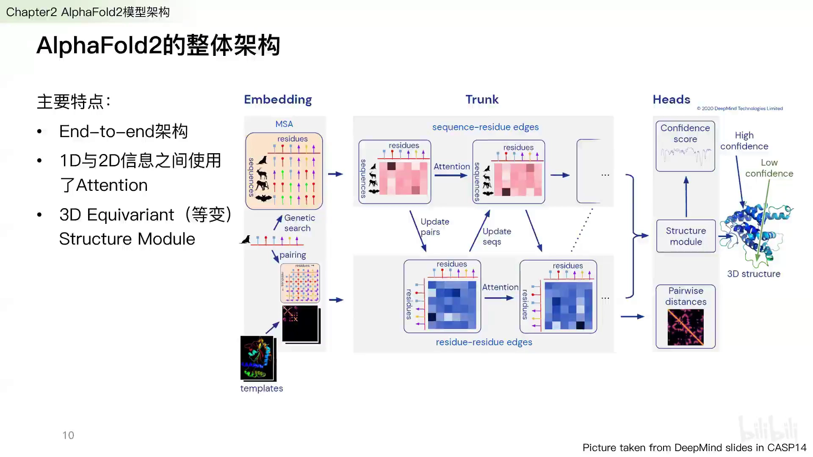

### 3.1 精彩一：MSA 决定了预测准确度的上限

AlphaFold2 的序列数据库主要来自三部分：**UniRef**、**MGnify**（宏基因组），以及最重要的 **BFD**（自己构建的、覆盖大量微生物与物种的序列库，体积最大）。结构数据库则用 **PDB**，并以 **70% 序列相似度去重**后用于模板搜索。[【跳转到 12:01】](https://www.bilibili.com/video/BV1fm4y1D7Wz/?t=721)

MSA 之所以是“精彩之一”，是因为它**决定了预测准确度的上限**：没有好的 MSA，准确度会大打折扣；只有 MSA 足够好，后面的结构预测才可能精确。

### 3.2 精彩二：Recycling——让输出“再跑一遍”

**Recycling** 听起来玄乎，其实非常简单：把模型的输出重新放回输入，让它再过一遍整个模型。就像电流一圈圈流过电阻一样，AlphaFold2 会让模型做 **3 轮 recycling**，也就是每个输入要经过 **4 次** AlphaFold 模块。[【跳转到 13:07】](https://www.bilibili.com/video/BV1fm4y1D7Wz/?t=787)

这种做法最初来自计算机视觉中的姿态估计（把训练结果返回输入继续迭代）。多轮迭代让模型的“有效深度”更深，从而让结构预测更精确、能处理更复杂的结构。

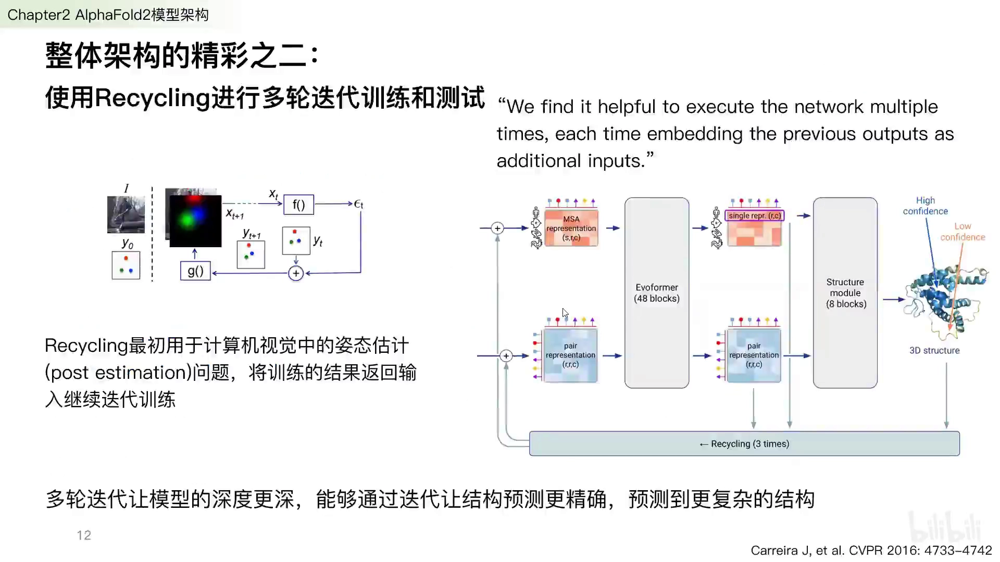

### 3.3 精彩三：Evoformer——用 Attention 提取进化信息

**Evoformer** 是 AlphaFold2 的核心，可以理解为一个“用来做结构预测的 Transformer”。它同时维护两行表示：

- 上面一行是 **MSA 表示**（多序列比对，序列 × 残基）；
- 下面一行是 **pair representation**（残基 × 残基，即两两氨基酸之间的相关性）。

两者用 **Attention** 互相更新、也各自自更新：MSA 表示会逐行逐列计算相关性，pair 表示则利用三角几何关系（“三角形更新与自注意力”）互相推断，比如用残基 i-k、j-k 的信息去推断 i-j。[【跳转到 14:02】](https://www.bilibili.com/video/BV1fm4y1D7Wz/?t=842)

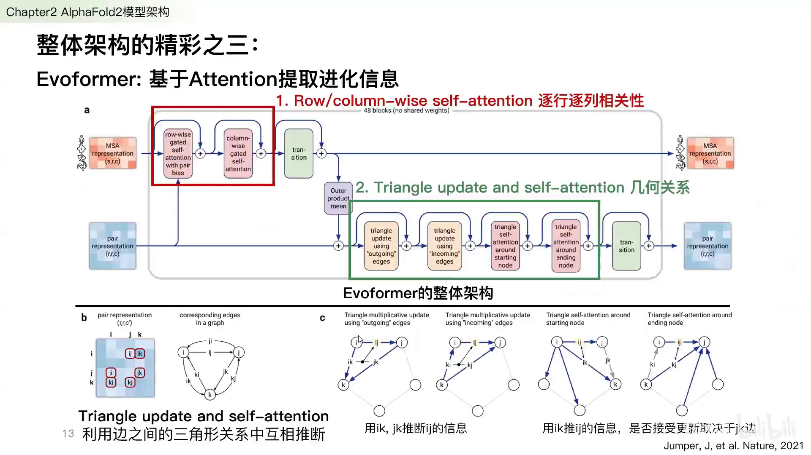

### 3.4 精彩四：Structure Module——实现端到端的关键

**Structure Module** 是 AlphaFold2 实现端到端的关键。它把蛋白质主链最重要的三个原子——氨基氮、中心碳（Cα）、羧基碳（C）——构成的三角形抽象成一个 **residue gas（残基刚体）**。这个三角形的形状几乎不变，只是坐标和朝向会变化；模型通过旋转这些刚体，把二维表示“摆”成三维结构。[【跳转到 15:09】](https://www.bilibili.com/video/BV1fm4y1D7Wz/?t=909)

其核心模块是 **IPA（Invariant Point Attention，不变点注意力）**，它保证模型具备 **3D 等变性（平移旋转等变性）**——整体旋转平移输入，输出结构也会相应地旋转平移。输入是：目标序列的表示（MSA 第一行）、Evoformer 学到的 pair 表示、以及初始的 residue gas；输出则是**全原子的位置坐标**（以及用于评估的 IDDT-Cα）。

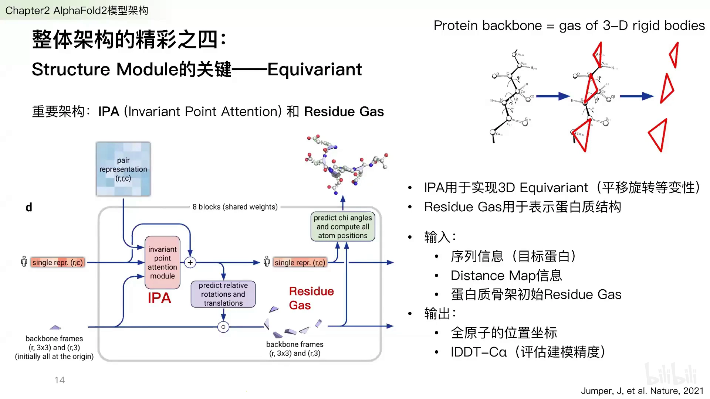

一个重要的效果是它做到了**原子水平**的优化：最后与真实结构对比时，每个原子都有精确度反馈，而不是只优化主链。训练过程中，化学上不合理的 **conflict（碰撞）数量会逐渐减少**——**这意味着 AlphaFold2 不再需要单独的 refinement 步骤**。事实上，2.0 最后只加了一个简短的 **AMBER 力场**优化，而这个优化并没有显著提升准确度。[【跳转到 17:14】](https://www.bilibili.com/video/BV1fm4y1D7Wz/?t=1034)

### 3.5 精彩五：多输出与 pLDDT——模型知道“自己哪里不确定”

AlphaFold2 不只输出结构，还会输出每部分的**置信度**，其中最重要的是 **pLDDT**：一个 0~100 的局部准确度评分。

- 蓝色（高 pLDDT）：模型认为这里很准，可以相信；
- 红色（低 pLDDT）：模型认为这里不确定，不要盲目采信。

如果整条蛋白的 pLDDT 都很低，说明模型自己都不相信结果，**整个预测很可能都是错的**。[【跳转到 17:47】](https://www.bilibili.com/video/BV1fm4y1D7Wz/?t=1067)

### 3.6 补充：自蒸馏（Self-distillation）扩充训练集

除了以上五点，AlphaFold2 在训练时还做了一件事：**self-distillation**。PDB 虽然很大（十万级结构，拆成单链约五十万），但对训练来说仍然偏少。做法是：先用带标签的 PDB 数据训练一版模型，再用它去跑 UniProt 里**没有结构**的序列，然后用 pLDDT 等标准挑出预测特别准的，混入训练集再训练。这套思路在 Google Brain 曾用过，在这里效果同样卓著。[【跳转到 19:59】](https://www.bilibili.com/video/BV1fm4y1D7Wz/?t=1199)

### 3.7 一句话小结 AlphaFold2 的整体架构

把上面的内容串起来，AlphaFold2 的流程就是：**强大的 MSA/模板搜索（决定上限）→ 用 attention 提取进化信息的 Evoformer → 3D 等变的 Structure Module 输出结构 → 输出每部分的置信度 → 整体跑 3 轮 recycling**。它最值得称道的三点，是 **recycling、attention、端到端**。

---

## 四、AlphaFold2 到底学到了什么：共进化 ≠ 物理

在讲复合物之前，必须先厘清一个根本问题：**AlphaFold 学习的到底是什么？**

答案：它学习的是**从 co-evolution（共进化）到 contact（接触）的映射**——即“哪些位置在结构上相关”。这里要强调两点：

1. AlphaFold 是从共进化信息**推断**结构上的 contact；
2. **共进化信息并不是物理的作用关系**。我们原以为它学到了物理能量高低，但“用单体 AlphaFold 预测复合物”的失败恰恰证明：它并没有学物理，只是与物理信息有相关性而已。[【跳转到 21:19】](https://www.bilibili.com/video/BV1fm4y1D7Wz/?t=1279)

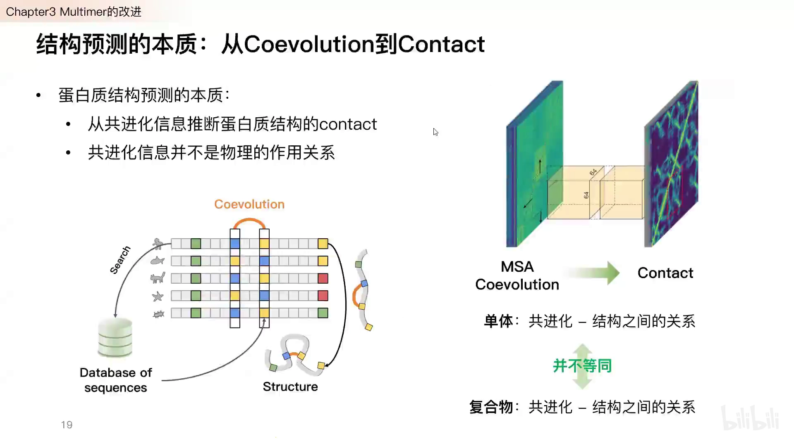

这个区别在**单体**和**复合物**上尤其关键：单体模型只掌握了“单体内的共进化—结构关系”，并不知道“两条链之间的共进化—结构关系”。用单体模型去拼复合物，会因为这种错配而产生大量误差。[【跳转到 21:44】](https://www.bilibili.com/video/BV1fm4y1D7Wz/?t=1304) 这也正是 AlphaFold-Multimer 要专门训练的原因。

### 4.1 意外之喜与一个警告：它学的是“晶体结构”

有趣的是，AlphaFold2 在测试中还展现出一些“意外之喜”：它能预测含金属离子体系里金属的位置与侧链摆放；给它输入**单链**，它有时会直接预测出该蛋白在**晶体三聚体**中的结构。[【跳转到 32:20】](https://www.bilibili.com/video/BV1fm4y1D7Wz/?t=1940)

这背后其实是一个重要提醒：**AlphaFold 学习的是“序列 → 晶体结构”的映射，而晶体结构并不一定等于蛋白质在溶液中的真实构象。** 比如某些蛋白只有在三聚体状态下才能结晶，单体状态本来是无序的，于是模型就“照着晶体里看到的”给出了三聚体结构。

---

## 五、AlphaFold-Multimer（2.1）：为复合物而生的改进

2020 年 9~10 月，AlphaFold 从 2.0 更新到 **2.1**，核心是新增了**预测蛋白质复合物**的能力。它在三个层面做了改进：**输入（MSA 配对）、损失函数、置信度指标**。

### 5.1 输入改进：Cross-Chain Genetics，把两条链的 MSA “拼”起来

做复合物 MSA 时，不仅要分别对两条链做多序列比对，还要把两个比对**配对（concatenate）**：如果 A 蛋白和 B 蛋白来源于同一物种，就把它们的 MSA 拼在一起。方法分为两类：[【跳转到 23:17】](https://www.bilibili.com/video/BV1fm4y1D7Wz/?t=1397)

- **原核生物**：使用 **genomic distance（基因组距离）**，借助 UniProt 中每个物种的编号/accession ID 估算物种接近程度；
- **真核生物**：没有这种便利，改用**两条链各自的序列相似性排序**，把排序相同的序列拼在一起。

有意思的是，实测中原核生物这套方案的效果有时反而更好。

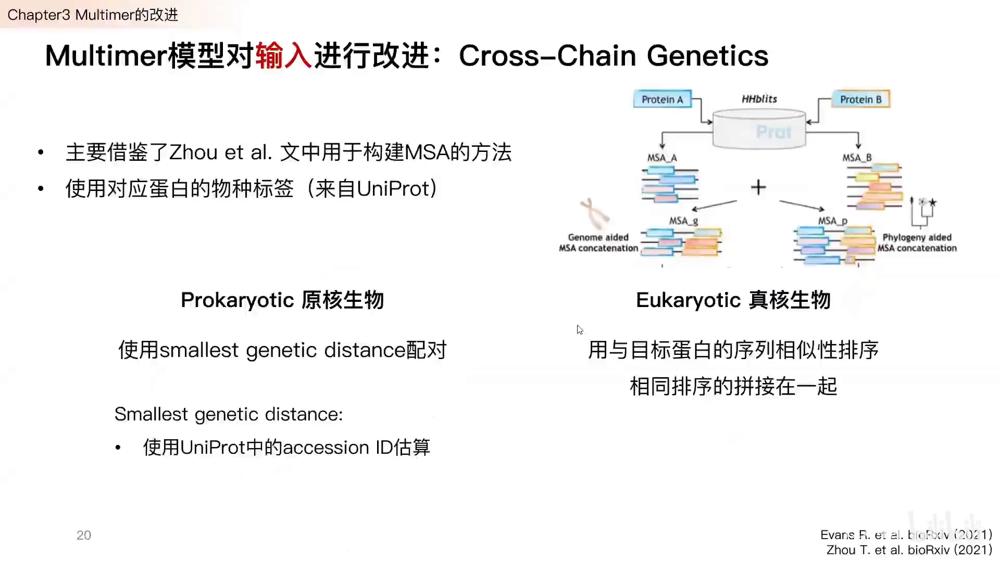

### 5.2 损失函数改进：链间不设阈值

原来的 **FAPE loss** 会把预测结构和真实结构中每个残基刚体叠合，计算每对原子的距离；它设了一个 **10 Å 的 cutoff**，超过就丢弃。但在复合物里，我们希望**链与链之间**的距离也纳入计算——因为两条链很容易错得很远，所以 **Multimer 在链间不设阈值**，强制模型也把界面贴合纳入优化。[【跳转到 24:37】](https://www.bilibili.com/video/BV1fm4y1D7Wz/?t=1477)

### 5.3 置信度改进：新增 ipTM

Multimer 在原有两个置信度指标之外，加了第三个：

- **pTM**：偏向反映**链内**结构是否准确；
- **ipTM（interface pTM）**：只考虑某个残基与**其他链**之间的 pTM，偏向反映**界面**是否准确；
- 最终的 **model confidence = 0.8 × ipTM + 0.2 × pTM**，更强调链间构象的准确性。

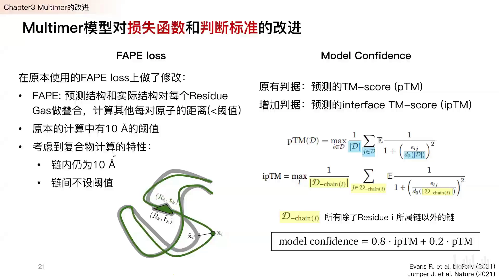

### 5.4 结果：单体碾压，复合物则要谨慎

**单体**上 AlphaFold2 在 CASP14 取得碾压性优势：GDT-TS 总分远高于第二名 Baker 团队；从 RMSD 看预测中位数约 **1.5 Å**，**超过 60% 的预测结构接近 2 Å 的实验精度**，让科学家有足够信心接受其结果。[【跳转到 26:49】](https://www.bilibili.com/video/BV1fm4y1D7Wz/?t=1609)

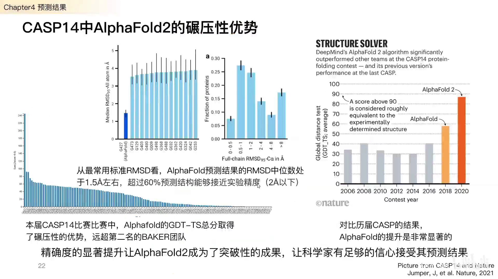

recycling 的必要性也在结果中体现：有的蛋白（如 T1024）很快就折叠好，而 T1064 在前三轮都不理想，直到**第四轮**才达到接近 80 分。所以“四轮优化”对复杂蛋白是必要的。[【跳转到 27:45】](https://www.bilibili.com/video/BV1fm4y1D7Wz/?t=1665)

**MSA 深度与模板的选择**也是常见问题：

- MSA 平均深度**超过 30** 就能取得较好效果；**超过 100** 后提升不显著；
- 模板只在 MSA 很差（深度 < 30）时才明显影响准确度，MSA 足够好时加不加模板差别不大。

因此**不要人为给 AlphaFold 塞模板**（想“同源建模”式地提供模板）——它的设计目的不是这个，你塞了也无法保证输出基于该模板。若确实有一个足够好的同源模板，直接使用 SWISS-MODEL 这类模板建模方法可能更合适。[【跳转到 31:00】](https://www.bilibili.com/video/BV1fm4y1D7Wz/?t=1860)

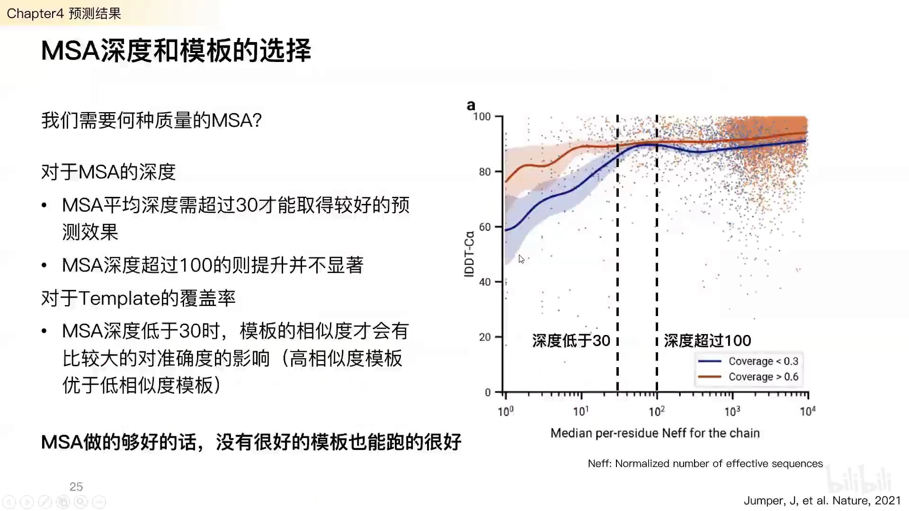

**复合物方面（DockQ 评估，>0.8 质量高，<0.23 为完全错误）**：AlphaFold-Multimer 平均 DockQ **超过 0.6**，优于 linker、gap（ColabFold）等所有对比方法。[【跳转到 34:05】](https://www.bilibili.com/video/BV1fm4y1D7Wz/?t=2045)

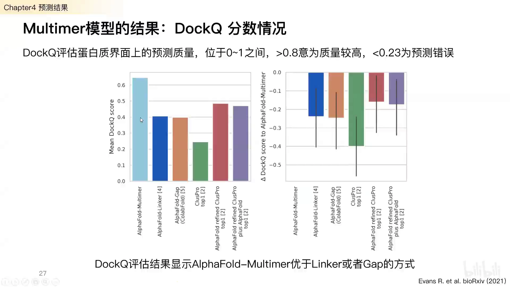

但要注意：**Multimer 在单体预测上反而比不过 AlphaFold 单体**。在同源多聚体（homomer）上差异不大，但在异源多聚体（heteromer）上 Multimer 才更好。[【跳转到 35:59】](https://www.bilibili.com/video/BV1fm4y1D7Wz/?t=2159)

---

## 六、讲者自己的工程改造与实测：POWERFOLD 与“好/中/差”三类案例

### 6.1 POWERFOLD：把串行的 AlphaFold 拆开，做高通量预测

实际使用时，很多人会发现 AlphaFold“宣称很快、实际很慢”。原因是它把流程做成了**串行**：先在 CPU 上做 UniRef / BFD / MGnify 的 MSA 与模板搜索，做完之后才在 GPU 上逐个跑模型，还要用 OpenMM 做 AMBER 优化。**CPU 部分常常占到 70% 以上的时间**：每个蛋白 CPU 算 1~2 小时，而 GPU 一个模型只要 5~10 分钟。[【跳转到 37:20】](https://www.bilibili.com/video/BV1fm4y1D7Wz/?t=2240)

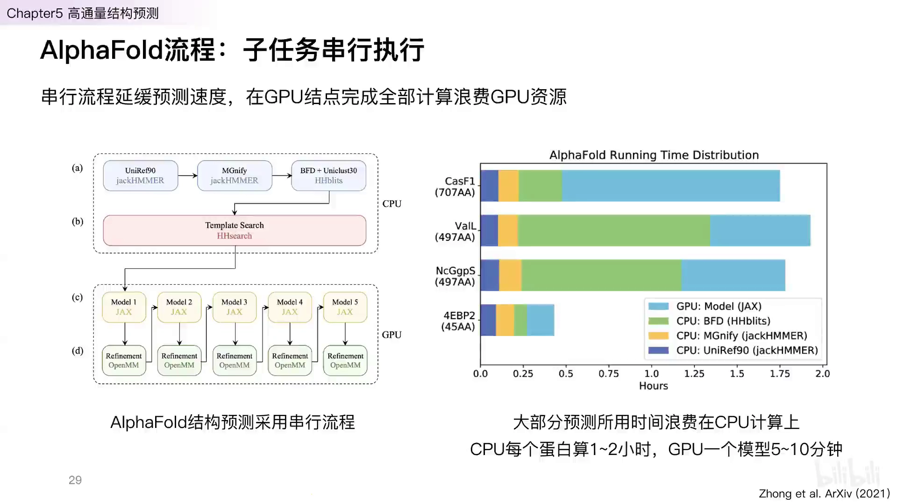

讲者团队（**POWERFOLD**）的做法与成效：

- **拆分 CPU / GPU**：CPU 部分产出中间 feature 文件，再交给 GPU 部分；
- **CPU 多线程优化**：用 Python 多线程加速 MSA，耗时下降约 **67%**（代价是需要更多 CPU 核）；
- **减少 GPU 编译**：对长度相同的蛋白只编译一次模型，后续复用，大幅缩短总时间；
- 在约 **2 万个、长度 50 的小蛋白**数据集上，用 **16 张 V100**，原本串行需上千小时，拆分后约 **43 小时**，再做编译优化后只需约 **3~5 小时**。

### 6.2 怎么评估预测结果：pLDDT 与 PAE

进入应用案例前，先记住两个最常用的指标：[【跳转到 40:58】](https://www.bilibili.com/video/BV1fm4y1D7Wz/?t=2458)

- **pLDDT**：每个残基的局部置信度（0~100）。**>90 几乎完全准确；<70 可信度低；<50 基本是错的**（也可能是无规蛋白）。
- **PAE（Predicted Aligned Error）**：每对残基的预测距离误差，单位 Å，**越低越好**；它尤其擅长反映**多结构域 / 复合物**的精度。注意：**只有 pTM 模型和 Multimer 模型才有 PAE 打分**。

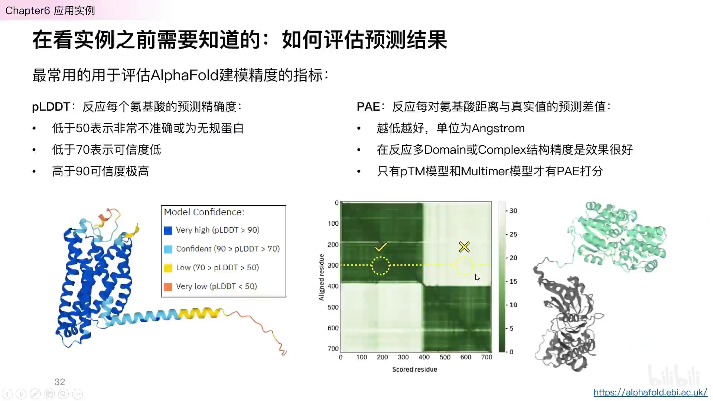

### 6.3 实测案例：好、中、差

**（1）单点突变导致的结构变化：可以试，但不保证。** GA98/GB98 是一个经典的“单突变在 3 螺旋与 β 折叠之间反复横跳”的体系。讲者去掉模板后测试四个序列，第 1、3、4 个二级结构大体正确，**第 2 个却预测错了**（把 β 折叠预测成了以螺旋为主）。更值得注意的是，这些结构**本就在训练集中**，本不该错得这么离谱。[【跳转到 43:10】](https://www.bilibili.com/video/BV1fm4y1D7Wz/?t=2590)

**（2）复合物预测：ColabFold 拼接 MSA 有时比 Multimer 更稳。** 把两条链的 MSA 用一个 gap 拼接起来（ColabFold 的方式），对同源/异源多聚体都能得到不错结果。

- **Ras–Raf**（训练集内）：预测极好，ipTM+pTM = **0.898**，RMSD 0.449 Å；
- **TCR–MHC**（训练集内）：中规中矩，ipTM+pTM = **0.552**，RMSD 3.567 Å。论文与作者报告都明确指出 **Multimer 不适用于预测抗体–抗原结合**。

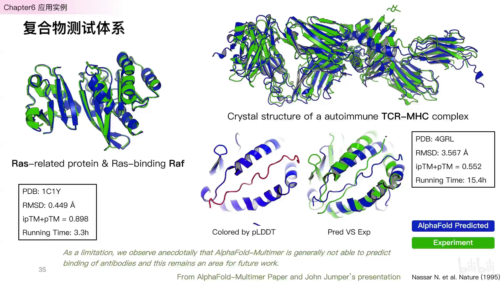

**（3）失败案例：新冠病毒 RBD–ACE2。** 该体系不在训练集内：得到的 ipTM+pTM 只有 **0.333**，耗时约 **8.6 小时**；真实的 RBD 应结合在右侧绿色区域，但模型多次都结合到了 ACE2 的另一侧——讲者推测 AlphaFold 有过强地往**柔性/无序区**结合的倾向。PAE 图也清楚显示链间可信度低，印证了“**PAE 差时要警惕模型不可用**”。[【跳转到 48:01】](https://www.bilibili.com/video/BV1fm4y1D7Wz/?t=2881)

**（4）更糟的 Spike 三聚体：** AlphaFold-Multimer 的结果“变成了一团毛线”，完全没有折叠出来；ColabFold 稍好、至少有二级结构的影子，但仍与真实结构相去甚远，且耗时 28 小时。（讲者：这类大体系要谨慎尝试。）[【跳转到 49:37】](https://www.bilibili.com/video/BV1fm4y1D7Wz/?t=2977)

**（5）淀粉样蛋白 Aβ42：** Multimer 完全没预测出淀粉样倾向，而 **ColabFold 反而给出了一个像样的淀粉样堆叠**。结合推特上更广泛的测试，讲者认为 **AlphaFold-Multimer 很可能“训练过度”了——大量预测结果会坍缩成一个球**。[【跳转到 50:27】](https://www.bilibili.com/video/BV1fm4y1D7Wz/?t=3027)

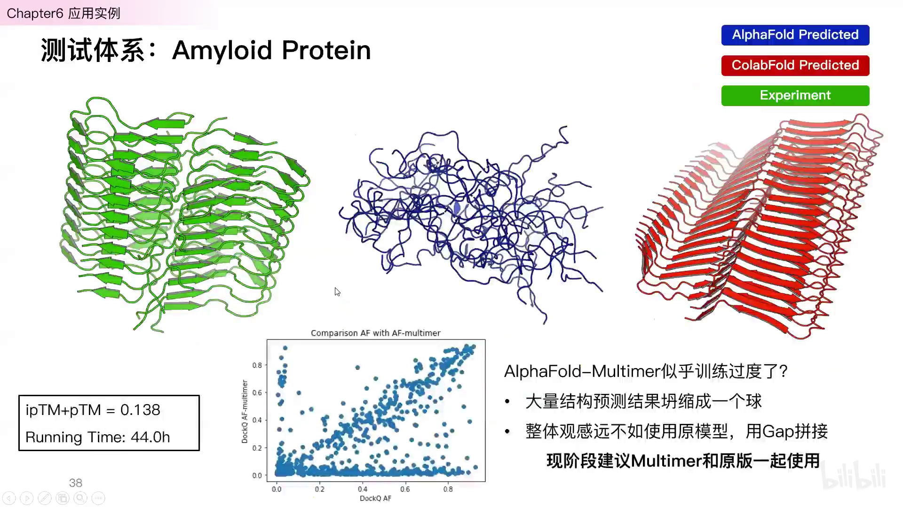

**结论**：现阶段的实用建议是——**Multimer 与 ColabFold（AF2 + gap 拼接）一起用，哪个好选哪个**。

---

## 七、怎样正确地使用 AlphaFold：版本、性能与踩坑

### 7.1 几个常用版本怎么选

- **AlphaFold 2.0**：只能预测单体；
- **AlphaFold 2.1**：单体 + 复合物，但**与 2.0 不兼容**（代码、输入指令都变了很多）；
- **ColabFold**：用 **MMseqs2** 做快速 MSA，可在 Google Colab 网页上跑（无需本地 GPU），可视化好；缺点是没有会员时 Colab 常常分配不到 GPU。可搭配本地版（日本开发者维护）在自己显卡上跑；
- **POWERFOLD**：面向集群、高通量结构预测的优化方案。

参数上，官方给出的经验值是：约 250~600 aa 的蛋白约 5 分钟，384 aa 约 10 分钟，2500 aa 可能长达约 18 小时——**序列越长越慢**，且长序列容易**超出显存**，需要多卡共享显存。[【跳转到 53:19】](https://www.bilibili.com/video/BV1fm4y1D7Wz/?t=3199)

### 7.2 Docker 版与 Conda 版

- **Docker 版（官方）**：高度封装、装上即用，但**可调参数少**——基本只能改序列、选 monomer/ptm/multimer、设置模板搜索的时间范围；
- **Conda / 本地版（如 ParaFold / ParallelFold）**：相当于本地安装，包含完整代码与运行环境，可自定义单体/pTM/复合物模型、**修改 recycling 次数、是否做 AMBER 优化、设定 data 数据集位置**等。

### 7.3 常见报错与解决（讲者汇总）

**MSA（CPU）报错：**

- **内存不足 / segmentation fault**：增加内存（集群中即增加 CPU 核数，或换大内存节点）；2.1 版已有所缓解。
- **HHblits failed**：**极易被误判为内存不足**。正确解法是把用到的 **UniClust 数据库从 2018-08 更新到 2020-06**——更新后几乎不再出现。

**GPU 报错：**

- **Index Error**：大概率是把**复合物任务用单体模型**算了，模型选错；
- **CUDA memory error**：显存不足（蛋白太长），需多卡共享显存；
- **Tensor larger than 2GB**：MSA 深度太大导致 feature 过大，需限制 MSA 深度（深度 >100 无意义）；2.1 已优化；
- **运行极慢（Slow Compile）**：大概率没找到 GPU，检查 Python / CUDA 环境，不要用 CPU 跑。

**不建议用 CPU 跑 AlphaFold**——实测效率很低。

---

## 八、AlphaFold 能做什么、不能做什么

### 8.1 能：预测结构（以及一些“隐含结论”）

- 单体结构预测非常可靠（尤其在 MSA 充分时），可用于辅助晶体结构解析、给结构建模当基础模板等；
- 能隐式处理一些“缺失信息”（金属离子、寡聚体），但这源于它学的是“序列→晶体结构”。

### 8.2 不能：预测稳定性

多篇文章一致表明：**AlphaFold 的 pLDDT / RMSD 与 ΔΔG（稳定性变化）相关性很差**（PCC 约 0.00~0.17）。用 Rosetta score 区分稳定/不稳定蛋白，效果反而更好（AUC 更高）。[【跳转到 61:17】](https://www.bilibili.com/video/BV1fm4y1D7Wz/?t=3677)

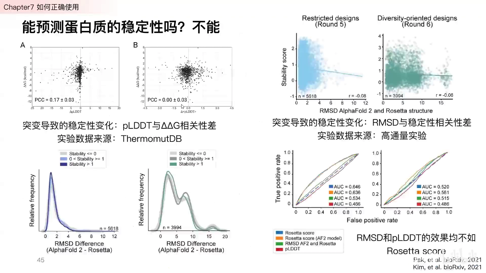

**但“还有救”**：有研究在 AlphaFold 的结构表示之上，接一个**简单的全连接神经网络（MLP）**，让 ΔΔG 预测的相关系数 r 提升到约 **0.8**。这说明稳定性信息**隐含在 AlphaFold 的表示里**，只是不直接体现在 pLDDT/PAE 上，需要额外提取。（该文刚上 bioRxiv，讲者提醒还需谨慎看待。）

### 8.3 真的不能：预测功能变化

以 GFP 荧光为例：把野生型和各种突变都用 AlphaFold 跑一遍，pLDDT 与荧光强度的相关系数只有约 **0.14~0.16**——**这次真的完全不能**。[【跳转到 65:02】](https://www.bilibili.com/video/BV1fm4y1D7Wz/?t=3902)

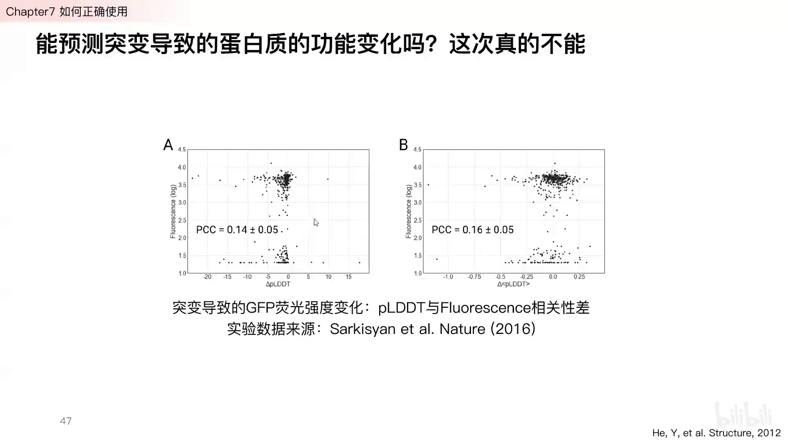

**结论**：现阶段 AlphaFold 的重心是**给出具体结构**；要做功能、稳定性分析，还需要额外的模型或特征工程。

---

## 九、答疑精选

- **AlphaFold 优化用到受力/能量信息吗？** 没有。它主要是学习原子坐标；力/能量只体现在之后的 AMBER 优化，而 AMBER 只动侧链、不动主链。[【跳转到 66:24】](https://www.bilibili.com/video/BV1fm4y1D7Wz/?t=3984)
- **Domain 间柔性 linker 预测准吗？** AlphaFold 对柔性/无规区永远给低 pLDDT，因此 linker 打分不高；可以结合 PAE 判断是否错误折叠。[【跳转到 66:49】](https://www.bilibili.com/video/BV1fm4y1D7Wz/?t=4009)
- **同源性约 50% 时选谁？** 都可能，同源建模也许更好；AlphaFold 自定义模板很麻烦，若无必要不要塞模板。[【跳转到 67:39】](https://www.bilibili.com/video/BV1fm4y1D7Wz/?t=4059)
- **GFP 三肽（Ser-Tyr-Gly）为何发荧光，能解释吗？** 已有工作，但**不是 AlphaFold 做的**，而是基于序列的深度学习模型在挖掘（对训练集预测准确率约 70%）。[【跳转到 68:42】](https://www.bilibili.com/video/BV1fm4y1D7Wz/?t=4122)
- **抗原–抗体预测？** AlphaFold-Multimer 表现不好，需要**专门针对抗体-抗原优化的特化模型**。[【跳转到 69:57】](https://www.bilibili.com/video/BV1fm4y1D7Wz/?t=4197)
- **能预测 protein-protein binding 吗？** 可以试。近期有 Nature Communications 文章用**单纯的 AlphaFold + gap 拼接**（甚至没用 Multimer）预测，效果不错。[【跳转到 70:53】](https://www.bilibili.com/video/BV1fm4y1D7Wz/?t=4253)
- **10~50 aa 的小肽选哪种模型？** 关键看它折不折叠：不折叠就难做好；折叠的小肽 pLDDT 通常中间高、两端低（两端本就柔性）。[【跳转到 71:18】](https://www.bilibili.com/video/BV1fm4y1D7Wz/?t=4278)
- **能预测折叠的动态过程吗？** 不能模拟折叠过程；但可通过设置不同的随机数/重复运行，勉强把握一些构象分布信息。[【跳转到 72:08】](https://www.bilibili.com/video/BV1fm4y1D7Wz/?t=4328)
- **5 个模型分数接近、有的有相互作用有的没有，怎么判断？** 先看 PAE：如果界面 PAE 很好（绿色）就大概率有相互作用；界面 PAE 差则更可能是模型算错，而非“没有相互作用”。[【跳转到 73:23】](https://www.bilibili.com/video/BV1fm4y1D7Wz/?t=4403)
- **ligand 结合位点周围几 Å 不准怎么办？** 把 AlphaFold 当作基础模板，用实验结构去拟合/优化侧链；资源有限时可直接忽略侧链问题。[【跳转到 74:13】](https://www.bilibili.com/video/BV1fm4y1D7Wz/?t=4453)
- **Rosetta 与 AlphaFold 结果冲突？** 若 AlphaFold 的 pLDDT 高，倾向于相信 AlphaFold；选择 AlphaFold 也不太会被审稿人/同行质疑。[【跳转到 75:28】](https://www.bilibili.com/video/BV1fm4y1D7Wz/?t=4528)
- **学 AlphaFold 需要很多数学基础吗？** 不需要，会写点代码就行。没有模板时**强力推荐 AlphaFold**，不推荐上一代的 I-TASSER。[【跳转到 76:18】](https://www.bilibili.com/video/BV1fm4y1D7Wz/?t=4578)

---

## 小结

- **为什么准**：AlphaFold2 的五个关键设计——**MSA（决定上限）、Recycling（迭代加深）、Evoformer（attention 提取进化信息）、Structure Module（IPA + residue gas 实现端到端）、pLDDT（自评置信度）**，再加上自蒸馏扩充训练集。
- **学到了什么**：本质是**共进化 → 接触**的映射，**不是物理**；它学的是“序列 → 晶体结构”，晶体结构 ≠ 溶液真实构象。
- **复合物要小心**：单体需用单体模型，复合物需用 AlphaFold-Multimer（新增 cross-chain MSA 配对、链间不设阈值的 FAPE、ipTM）；但 Multimer 常“训练过度、坍缩成球”，建议**与 ColabFold（AF2+gap）并用，哪个好选哪个**。
- **能/不能**：擅长预测**结构**；**不能**预测稳定性（但可接 MLP 从表示中“捞”出稳定性，r≈0.8）；**真的不能**预测功能变化（如 GFP 荧光）。
- **上手要点**：MSA 深度 >30 即可；别塞模板；recycling 默认 3 轮，只有三轮很差时才加；长序列注意显存；常见报错按“HHblits 先更新 UniClust 数据库”等对策处理；CPU 部分常占大头，高通量请做 CPU/GPU 拆分（POWERFOLD）。

## 关键术语速查

| 术语 | 一句话解释 |
| --- | --- |
| 中心法则 | 遗传信息从 DNA→RNA→蛋白质的传递方向 |
| Anfinsen's Dogma | 蛋白质折叠成天然结构所需的全部信息都编码在氨基酸序列中 |
| MSA（多序列比对） | 在序列库中找相似序列并按位点对齐，用于提取进化信息 |
| 共进化（Co-evolution） | 两个位点氨基酸同步变化，暗示它们在结构上相近 |
| Contact Map / Distance Map | 蛋白质两两氨基酸的距离/接触构成的二维表示 |
| CASP | 每两年举办一次的蛋白质结构预测“盲测”比赛 |
| Evoformer | AlphaFold2 中用 attention 同时更新 MSA 表示与 pair 表示的骨干网络 |
| Recycling | 把模型输出送回输入重复计算，默认 3 轮（共 4 次） |
| Structure Module | 用 IPA + residue gas 把二维表示变成三维全原子坐标的模块 |
| residue gas（残基刚体） | 由 N、Cα、C 三个主链原子构成的、近似刚性的三角形 |
| IPA | Invariant Point Attention，保证 3D 等变的关键注意力机制 |
| pLDDT | 逐残基的预测置信度（0~100），>90 很准、<50 基本错 |
| PAE | 预测的残基对距离误差（Å），越低越好，擅长看结构域/复合物 |
| pTM / ipTM | 预测的 TM-score / 界面 TM-score；综合评分=0.8·ipTM+0.2·pTM |
| AlphaFold-Multimer | AlphaFold 2.1 中专门预测复合物的模型 |
| ColabFold | 用 MMseqs2 加速 MSA 的 AlphaFold 便捷版，可用 gap 拼接预测复合物 |
| AFDB | AlphaFold DB，已覆盖近全部 UniProt 序列的预测结构库 |

---

*视频来源：[AlphaFold 的原理和展望 - 钟博子韬 | 钰沐菡 公益公开课](https://www.bilibili.com/video/BV1fm4y1D7Wz/)*

