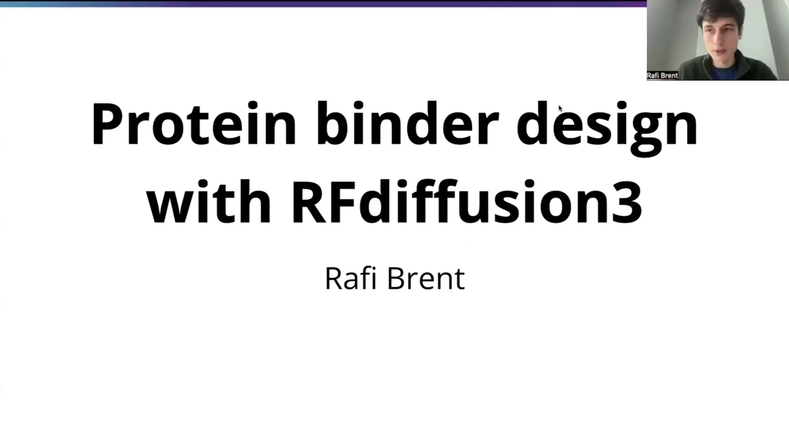
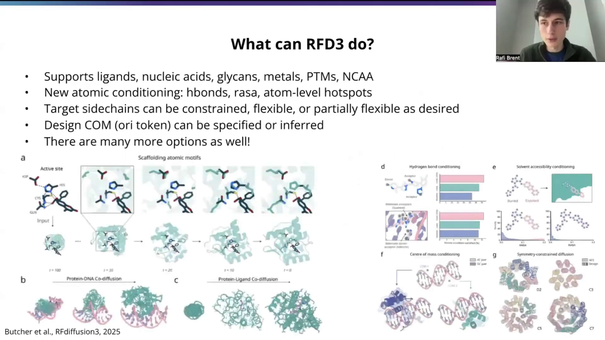
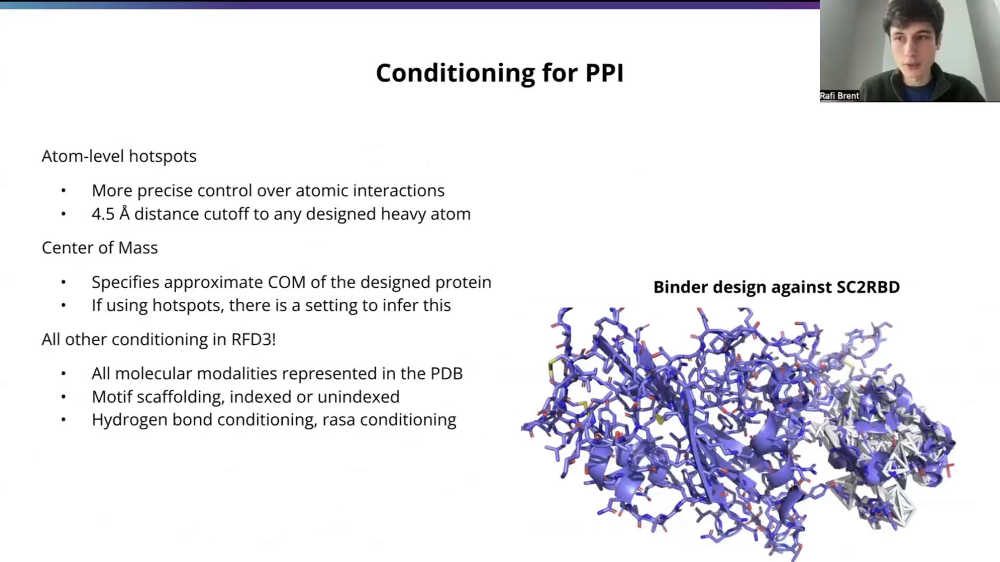
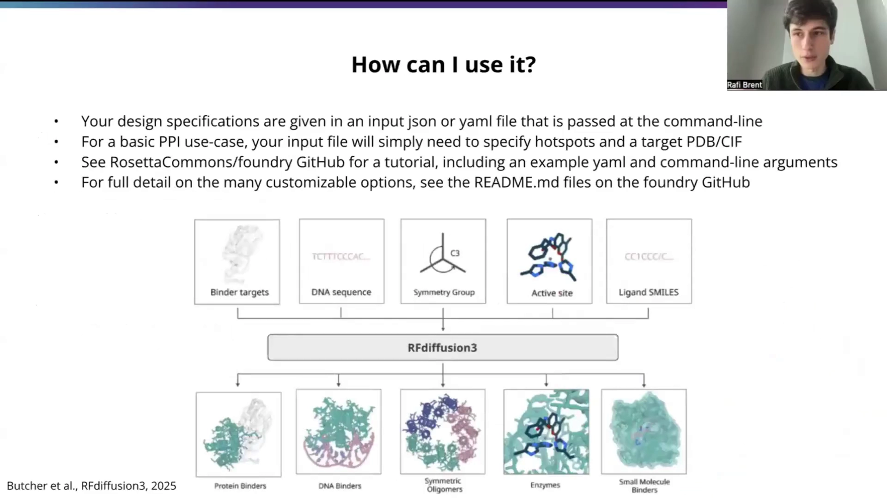
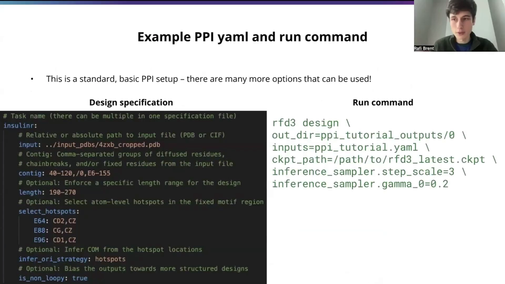
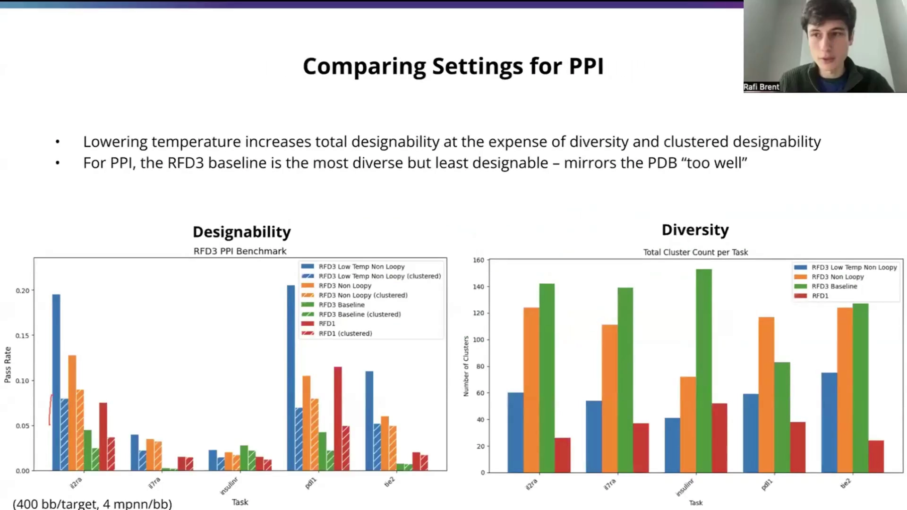
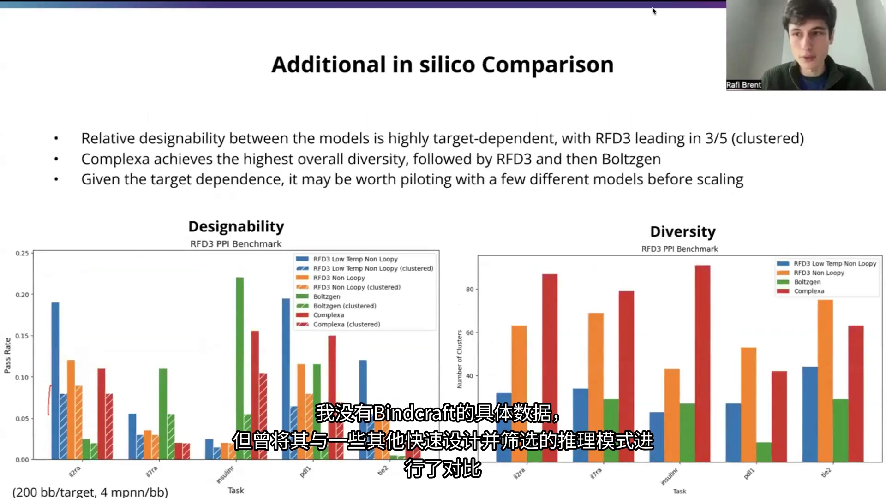
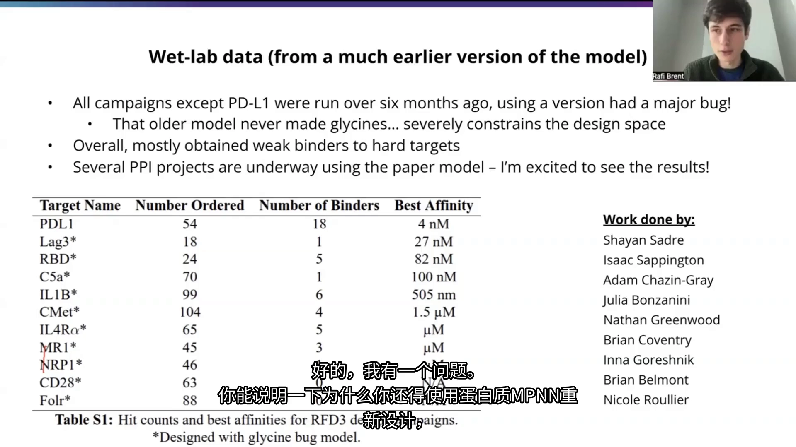

# Baker 实验室官方教程：用 RFdiffusion3 设计蛋白质 Binder



> 本文整理自 RosettaCommons 官方教程《Protein binder design with RFdiffusion3》，主讲人 **Rafi Brent**（华盛顿大学 Baker 实验室二年级博士生、RFdiffusion3 研发成员之一）。他系统地讲解了 RFdiffusion3（RFD3）是什么、如何用它的原子级条件设置设计蛋白质结合体（binder），并给出了 YAML/JSON 配置、运行命令、基准数据与工具选型建议。

## 本讲要解决的核心问题（SCQA）

**背景**：设计能与指定靶标（target）牢固结合的蛋白质 binder，是抗体替代、诊断与治疗中的核心任务。RFdiffusion 系列是这一领域最常用的生成式方法之一。

**冲突**：早期 RFdiffusion（RFD1）主要在**残基层面**扩散主链，做约束时只能到残基级；它也不太能精确处理与配体、核酸、糖基等非蛋白分子的相互作用，而且采样速度不算快。

**疑问**：最新的 RFdiffusion3（RFD3）到底有什么不同？用它设计一个 binder，从“想法”到“跑出结构”具体要怎么做？

**回答（中心思想）**：RFD3 是一个**原子级全原子扩散模型**——它直接扩散每个侧链的全部原子，因此能做原子级热点、氢键、可及性等复杂约束，同时速度快约 10 倍、支持 PDB 里各种分子模态。你只需准备一个 PDB/CIF 靶标文件加一份 YAML/JSON 配置（`contig` + 热点 + 质心 + 少数标志），用一条 `rfd3 design` 命令即可开始 binder 设计；再结合“可设计性 vs 多样性”的取舍和跨工具基准，就能决定用哪套参数、要不要换别的模型。

---

## 一、RFD3 是什么：从“主链扩散”升级到“全原子扩散”

**结论先行**：RFD3 与之前的 RFdiffusion 版本最大的区别，是它把每个侧链的**所有原子**都纳入扩散，而不只是主链。这带来一系列新能力。



具体来说，（[【跳转到 00:14】](https://www.bilibili.com/video/BV16RQDBuEyu/?t=14)）

- **输出更完整**：不仅得到主链坐标，还能得到所有侧链原子的精确坐标，以及序列和旋转异构体（rotamer，侧链的具体构象）。
- **训练数据覆盖整个 PDB**：除结晶辅助组分（如某些用于结晶的融合标签）和不良结构外，PDB 中的各种模态都被纳入训练。因此模型支持配体（ligands）、核酸、糖基（glycans）、金属、翻译后修饰（PTM）以及非天然氨基酸（NCAA）。
- **一个“全功能”模型**：所有这些任务共用一个模型，没有检查点切换，也没有隐藏的适配器（adapter）。

> 需要注意：PDB 中**少见**的模态模型可能更难处理，因为训练数据不足。这符合“数据少→效果差”的直觉。

### 1.1 原子级条件设置（conditioning）：告诉模型“我要什么”

**结论先行**：原子级建模的真正威力，在于可以施加过去做不到的**精细约束**，从而引导设计。



RFD3 提供的条件设置包括（[【跳转到 01:04】](https://www.bilibili.com/video/BV16RQDBuEyu/?t=64)、[【跳转到 02:15】](https://www.bilibili.com/video/BV16RQDBuEyu/?t=135)）：

- **氢键条件**（hbond）：让目标分子中某个特定原子充当供体或受体，模型据此设计出能形成氢键的 binder。
- **原子级热点**（atom-level hotspot）：指定靶标上**某个具体原子**必须与 binder 保持接触。这是 binder 设计里最相关的一项，下文详述。
- **溶剂可及性条件**（rASA）：约束某些原子/残基是被包埋还是暴露。
- **靶标侧链的处理方式**：可以完全约束它们（刚性），也让它们灵活或部分灵活。让侧链柔性有时能更好地反映溶液状态，甚至比刚性晶体结构更合适。
- **质心（center of mass, COM）**：指定设计蛋白质心的大致位置（称为 **ORI token**）。这是近似值，不必达到原子级精度，只需给出一个大致范围；若使用热点，还可以让模型自动推断（`infer_ori_strategy: hotspots`）。

在此基础上，你还能利用**对称性**、柔性配体、DNA 等做更多有趣的设计。Rafi 特别提醒：这些能力大多在同一套框架里，建议阅读论文和文档了解全部选项。

---

## 二、面向 PPI / binder 设计的三个关键点

**结论先行**：做蛋白质-蛋白质相互作用（PPI，protein–protein interaction）的 binder 设计时，最该掌握的是**原子级热点、质心条件、以及速度带来的“大批量设计+筛选”策略**。


### 2.1 原子级热点：比残基级更精准，且 4.5 Å 是经验距离

过去版本的 RFdiffusion 使用**残基级**热点（指定某个残基靠近 binder）。RFD3 可以进一步指定到**原子级**，约束更严格（[【跳转到 02:15】](https://www.bilibili.com/video/BV16RQDBuEyu/?t=135)、[【跳转到 02:40】](https://www.bilibili.com/video/BV16RQDBuEyu/?t=160)）：

- 模型被训练成让这些热点原子与 binder 的重原子保持在 **4.5 Å 以内**。
- 由于约束更严，模型不一定每次都能完美满足。Rafi 的经验是：**约 2/3 的情况下**会严格遵守所指定的具体原子间距；而几乎总是会有某个原子在 4.5 Å 这个量级的精确距离上发生接触（即便不是你指定的那个原子），也就是总能拿到近距离接触。
- 大多数时候，接触就发生在你指定的位置附近。

**为什么值得？** 原子级热点让你能更精准地“复刻”或“打断”某个天然相互作用界面。缺点是模型可能不够完美，尤其当原子级热点很多时。

### 2.2 质心（COM / ORI token）：没有热点时的“大致方位”

如果没有明确的热点区域，只想把 binder 大致引导到靶标的某一侧，可以只指定质心（[【跳转到 03:30】](https://www.bilibili.com/video/BV16RQDBuEyu/?t=210)、[【跳转到 03:55】](https://www.bilibili.com/video/BV16RQDBuEyu/?t=235)）：

- 若有热点，推荐用 `infer_ori_strategy: hotspots` 自动推断 ORI token；其作用是把质心从**热点质心向外移动约 10 Å**。
- 内部测试效果不错，Rafi 推荐初学者使用。这也是大多数 minibinder 设计的好起点。

### 2.3 速度优势：快约 10 倍，支撑“复杂约束 + 过滤”流程

**结论先行**：RFD3 比之前的 RFdiffusion 快得多，速度约为 RFD1 / RFD2 的**十倍**（取决于系统长度）。这不仅是省时间（[【跳转到 03:05】](https://www.bilibili.com/video/BV16RQDBuEyu/?t=185)）：

- 你可以先设定**很复杂的约束条件**，快速生成大量候选，再用这些约束在“重构模拟（refold）”之前就把明显不符合的部分过滤掉。
- 结果就是：即便模型并非每次都成功，仅靠这种“高效设计 + 筛选”流程，也能满足更多复杂约束。

一句话总结这一节：**原子级约束给了精度，速度给了规模化试错的能力。**

---

## 三、动手：用 YAML/JSON + PDB 跑一次 PPI binder 设计

**结论先行**：RFD3 的输入 = **一份 YAML/JSON 配置文件** + **一个靶标 PDB/CIF 文件**；输出通过命令行传给模型。一个标准 PPI 场景，主要就是指定热点位置。



### 3.1 输入文件长什么样

- 设计规范写在一个 JSON 或 YAML 文件里，在命令行传给 RFD3（[【跳转到 04:57】](https://www.bilibili.com/video/BV16RQDBuEyu/?t=297)）。
- 两者是**可互换**的嵌套数据结构，参数名称完全一致，只是格式不同；YAML 支持注释，所以教程里多用 YAML。
- 最简单的 PPI 用例，只需指定**热点**和**靶标 PDB/CIF**。
- 一个输入文件里可以包含**多个任务**（多个顶层条目），一条命令就能依次把它们全部跑完。
- 靶标结构来自 PDB/CIF，可以用相对或绝对路径；教程用的是从 RCSB PDB 裁剪后的胰岛素受体文件 `4zxb_cropped.pdb`。
- 更多资源见 GitHub 上的 `RosettaCommons/foundry`：有 PPI 等场景的教程、示例 YAML 和命令行参数；完整可选项见各模型的 `README.md`（[【跳转到 05:22】](https://www.bilibili.com/video/BV16RQDBuEyu/?t=322)、[【跳转到 05:47】](https://www.bilibili.com/video/BV16RQDBuEyu/?t=347)）。

### 3.2 `contig` 字符串：向 RFD3 描述“哪些残基怎么处理”

`contig` 是核心。它由逗号分隔的几组内容组成，能看到三种主要组件（[【跳转到 06:47】](https://www.bilibili.com/video/BV16RQDBuEyu/?t=407)）：

1. **扩散残基段**：如 `40-120`。这些区域会由模型全新设计；因为是新实例化的残基，所以左侧**没有链 ID**。`40-120` 表示长度会在 40~120 个残基之间采样，模型在该长度上对这一批进行设计。
2. **链断开**：用 `/0` 表示。因为 minibinder 要挂在**不同的链**上，需要在这里断开。
3. **从输入文件加载的残基**：写成“链 ID + 残基编号”，如 `E6-155`，表示从输入结构中加载链 E 的残基 6~155（含端点）作为固定/设计部分。



### 3.3 一个标准 PPI YAML 示例逐行解读

下图左侧是一个标准 PPI 配置，右侧是运行命令（[【跳转到 05:57】](https://www.bilibili.com/video/BV16RQDBuEyu/?t=357)、[【跳转到 06:22】](https://www.bilibili.com/video/BV16RQDBuEyu/?t=382)）：

```yaml
# Task name（一个 specification 文件里可以有多个任务）
insulinr:
  # 输入文件（PDB 或 CIF）的相对/绝对路径
  input: ../input_pdbs/4zxb_cropped.pdb
  # Contig：逗号分隔的“扩散残基 / 链断开 / 输入固定残基”组合
  contig: 40-120,/0,E6-155
  # 可选：强制设计的长度范围
  length: 190-270
  # 可选：在固定 motif 区域选择原子级热点
  select_hotspots:
    E64: CD2,CZ
    E88: CG,CZ
    E96: CD1,CZ
  # 可选：从热点位置推断质心（COM）
  infer_ori_strategy: hotspots
  # 可选：让输出偏向更有秩序（少 loop）的结构
  is_non_loopy: true
```

要点：

- `contig` 中 `40-120` 是待设计的 binder（长 40~120），`/0` 断开链，`E6-155` 是从输入加载的靶标。
- `length: 190-270` 是**可选的长度约束**（[【跳转到 07:37】](https://www.bilibili.com/video/BV16RQDBuEyu/?t=457)、[【跳转到 08:02】](https://www.bilibili.com/video/BV16RQDBuEyu/?t=482)）。最基础的 PPI 未必需要，但做 motif 支架构建时很有用：例如 motif 两侧各有一个扩散段（如 80+80，或 60+80），你希望两者**总长小于 150**，就可以用长度约束让它们不会同时取到各自的最大值。
- `select_hotspots` 用嵌套结构指定“链 ID + 残基编号 + 原子名”，例如 `E64: CD2,CZ` 就是把链 E 第 64 号残基的 CD2、CZ 原子设为原子级热点（[【跳转到 08:27】](https://www.bilibili.com/video/BV16RQDBuEyu/?t=507)、[【跳转到 08:52】](https://www.bilibili.com/video/BV16RQDBuEyu/?t=532)）。注意这些残基是从输入文件加载的、和 `contig` 里加载的部分同属一个范围。
- `infer_ori_strategy: hotspots` 让模型根据热点推断质心位置，通常就够用了（[【跳转到 09:17】](https://www.bilibili.com/video/BV16RQDBuEyu/?t=557)）。
- `is_non_loopy: true` 让输出更偏向**有序的二级结构（少 loop）**（[【跳转到 09:42】](https://www.bilibili.com/video/BV16RQDBuEyu/?t=582)）。原因很实际：很多参与 PPI 的蛋白质界面其实很“弯曲、无序”，而 AlphaFold3、RoseTTAFold3 这类模型在重折叠非常弯曲和无序的结构时**信心不足**，通过率会低很多。所以除非你想覆盖所有二级结构类型，一般建议开启它。

### 3.4 运行命令

（[【跳转到 10:07】](https://www.bilibili.com/video/BV16RQDBuEyu/?t=607)、[【跳转到 10:32】](https://www.bilibili.com/video/BV16RQDBuEyu/?t=632)）

克隆仓库、安装好、按文档下载检查点后，运行类似：

```bash
rfd3 design \
  out_dir=ppi_tutorial_outputs/0 \
  inputs=ppi_tutorial.yaml \
  ckpt_path=/path/to/rfd3_latest.ckpt \
  inference_sampler.step_scale=3 \
  inference_sampler.gamma_0=0.2
```

- `out_dir`：保存设计文件和元数据的地方。
- `inputs`：指向你的 JSON/YAML 配置。
- `ckpt_path`：下载好的模型检查点路径。
- 后面两个是**可选的采样“降温”参数**（详见第五节与第七节）。

> 初学者路径建议：先跟着 `RosettaCommons/foundry` 的 PPI 教程把这条命令跑通，再逐步加约束。

---

## 四、参数怎么选：可设计性（designability）vs 多样性（diversity）

**结论先行**：降低采样温度能**提高总通过率**，但会**牺牲多样性**；对 PPI 而言，RFD3 的默认基线最“多样”却最“不可设计”，因为它把 PDB 的样子学得“太像了”。



这张基准图（400 backbone/靶标，每个 backbone 用 MPNN 设计 4 条序列）中（[【跳转到 11:16】](https://www.bilibili.com/video/BV16RQDBuEyu/?t=676)）：

- **左图是可设计性**：实心柱 = 总通过率（经过四次 MPNN 后仍能重折叠的 backbone 比例），斜纹柱 = 聚类后的通过率（在基于折叠序列聚类后，每个簇是否至少有一个代表通过）。
- **右图是多样性**：每个任务的总簇数，簇越多代表设计越多样。

四条设置分别是：

- 🔵 **RFD3 低温 + non-loopy**：总通过率最高，但多样性最低。
- 🟠 **RFD3 默认温度 + non-loopy**：介于中间。
- 🟢 **RFD3 基线（默认温度、不指定 non-loopy）**：最多样，但可设计性最差——“镜像 PDB 太好”。基础模型会倾向复现 PDB 里那些**多样但不好折叠**的结构，所以可设计性下降。
- 🔴 **RFD1**（很多人熟悉的旧基线）。

具体结论（[【跳转到 11:41】](https://www.bilibili.com/video/BV16RQDBuEyu/?t=701)、[【跳转到 12:06】](https://www.bilibili.com/video/BV16RQDBuEyu/?t=726)、[【跳转到 12:56】](https://www.bilibili.com/video/BV16RQDBuEyu/?t=776)）：

1. **降温提高总通过率，但常使聚类通过率略降**——因为标准温度下多样性大大增加；在分布边缘采样，你会得到与模型其他设计差异更大的东西。
2. **默认（不指定 non-loopy）多样性最高，但可设计性明显下降。** 如果你愿意多做设计，完全没问题，总还是会有些能通过。
3. **在 PPI 中，不指定 non-loopy 会导致通过率显著降低**，所以一般建议开启 `is_non_loopy: true`。

### 4.1 non-loopy 对二级结构分布的影响

从二级结构分布图看（虚线 = β 片层 sheet，实线 = α 螺旋 helix，[【跳转到 13:21】](https://www.bilibili.com/video/BV16RQDBuEyu/?t=801)、[【跳转到 13:46】](https://www.bilibili.com/video/BV16RQDBuEyu/?t=826)）：

- 采样温度对二级结构分布**影响不大**（同一任务内）。
- 但**移除 non-loopy** 后，分布**大幅变化**：β 片层略增，螺旋数量**急剧减少**。
- 这与 RFD1 截然不同——RFD1 基本上是一台“螺旋生成机器”，还会产生更多环状（loop）结构。

所以 non-loopy 只是把二级结构分布稍微“挪”了一下，设计师可按需选择；但**一般建议先启用它**。

---

## 五、横向对比：RFD3 vs BoltzGen vs Complexa

**结论先行**：不同模型的相对可设计性**高度依赖具体靶标**；RFD3 在 5 个任务中有 3 个（聚类后）领先，Complexa 多样性最高，BoltzGen 则在某些靶标上更强。因此**值得先小规模试几种模型再放大**。



（200 backbone/靶标，每个 backbone 用 MPNN 设计 4 条序列；[【跳转到 25:06】](https://www.bilibili.com/video/BV16RQDBuEyu/?t=1506)、[【跳转到 25:31】](https://www.bilibili.com/video/BV16RQDBuEyu/?t=1531)）

- 🔵 低温 RFD3、🟠 默认温度 RFD3、🟢 **BoltzGen**、🔴 **Complexa**（同样区分聚类/非聚类）。
- 整体上：**RFD3 在 5 个任务中有 3 个（聚类后）表现最好**；但在某些任务上它明显吃亏。
- 例如**胰岛素受体**任务中，另外两个模型明显更好；而 **BoltzGen 在 IL-7 受体 α 亚基（IL-7 receptor subunit alpha）**上最佳。
- **多样性排名：Complexa 最高，其次是 RFD3，然后是 BoltzGen。**

**take-home**：设置不麻烦的话，先试几种模型是不错的想法。RFD3 很强、功能全、灵活，但**并非在所有情况下都最合适**，值得一试多种方法，再挑最适合自己具体场景的那一个（[【跳转到 26:21】](https://www.bilibili.com/video/BV16RQDBuEyu/?t=1581)）。

> 关于快速模型与慢模型：Rafi 把方法大致分两类——一类像 RFD3 很快、命中率不是极致；另一类像 **BindCraft** 或基于幻觉（hallucination）反向传播的方法命中率很高但很慢。如果你想让所有结果都通过 AlphaFold 验证，可能需要 BindCraft，但设计时间更长；RFD3 则是“快速生成更多设计、再过滤”。他没有 BindCraft 的具体基准数据（[【跳转到 24:20】](https://www.bilibili.com/video/BV16RQDBuEyu/?t=1460)、[【跳转到 24:45】](https://www.bilibili.com/video/BV16RQDBuEyu/?t=1485)）。

### 5.1 基准是怎么评测的

（[【跳转到 27:11】](https://www.bilibili.com/video/BV16RQDBuEyu/?t=1631)、[【跳转到 27:36】](https://www.bilibili.com/video/BV16RQDBuEyu/?t=1656)）

- 这是一个标准的**重折叠（refolding）基准**：拿设计好的序列去重新预测结构，看是否折叠回目标构象。
- Rafi 用 **RF3（RoseTTAFold3）**跑评估，因为它是公开的，别人更容易复现，性能与 AlphaFold3 差不多。
- 采用**较严格的判定标准**：如最小结合自由能阈值（约 −1.5）、配体相关质量指标，以及靶标对齐后的配体 RMSD 需低于 **2.5 Å** 等。这些阈值此前在 **AlphaProteo** 论文中发表过（当时用的是 AF3），Rafi 认为沿用类似阈值是合理的。

---

## 六、湿实验数据与真实表现

**结论先行**：现有湿实验数据大多来自一个**六个月的旧模型**，那个版本有严重 bug，因此结果偏保守；用当前模型正在开展的项目值得期待。



（[【跳转到 16:57】](https://www.bilibili.com/video/BV16RQDBuEyu/?t=1017)、[【跳转到 17:22】](https://www.bilibili.com/video/BV16RQDBuEyu/?t=1042)、[【跳转到 17:40】](https://www.bilibili.com/video/BV16RQDBuEyu/?t=1060)）

- **除 PD-L1 外，所有 campaign 都是六个月前用旧版本做的**，那个模型有一个大 bug：**从不生成甘氨酸（glycine）**。甘氨酸在蛋白质设计中很重要，不能生成会严重限制设计空间。
- 因此当时的做法是用 **ProteinMPNN 重新设计序列**；但如果骨架本身不适合甘氨酸，就较难得到理想结果。
- 总体结果：**对困难靶标大多只得到弱结合**（微摩尔 µM 或高纳摩尔级）。
- 表格（Table S1，带 `*` 的为“甘氨酸 bug 模型”所设计）：

| 靶标 | 订购数 | 得到的 binder 数 | 最佳亲和力 |
| --- | ---: | ---: | ---: |
| PD-L1 | 54 | 18 | **4 nM** |
| Lag3* | 18 | 1 | 27 nM |
| RBD* | 24 | 5 | 82 nM |
| C5a* | 70 | 1 | 100 nM |
| IL1B* | 99 | 6 | 505 nM |
| CMet* | 104 | 4 | 1.5 µM |
| IL4Rα* | 65 | 5 | µM 级 |
| MR1* | 45 | 3 | µM 级 |
| NRP1* | 46 | 1 | µM 级 |
| CD28* | 63 | 0 | N/A |
| Folr* | 88 | 0 | N/A |

- **PD-L1 是目前最容易的靶标**（不加星号）：旧模型也能得到 4 nM 的强结合。Rafi 用最新模型快速验证，确认仍能强烈结合 PD-L1。
- 目前不少人已在实验室里用正式发表的 RFD3 模型开展 PPI 项目，他收到一些联系，进度不一；预计很快会有更多**实验数据**出来。

> Rafi 也坦承：目前还没有很好的“头对头”对比数据，很多结果都带着那个旧模型的大问号。

---

## 七、Q&A 精华：约束层级、为什么要 MPNN、latent 空间

**结论先行**：RFD3 目前的热点约束必须指定到**原子级**；它输出的序列**仍需 ProteinMPNN 重设计**，原因是 atom14 表示不利于模型在连续空间里推理离散侧链；而 latent 空间方法（如 La-Proteina、Complexa）是另一条有前景的路线。

### 7.1 indexed / non-indexed motif 支架

（[【跳转到 15:16】](https://www.bilibili.com/video/BV16RQDBuEyu/?t=916)、[【跳转到 15:41】](https://www.bilibili.com/video/BV16RQDBuEyu/?t=941)、[【跳转到 16:07】](https://www.bilibili.com/video/BV16RQDBuEyu/?t=967)）

有观众问有没有 indexed / non-indexed 模式 scaffold 的例子。Rafi 说他**没有对带索引和不带索引的 motif 支架的 PPI 性能做基准测试**（但这值得研究），GitHub 上有相关文档。做 non-indexed motif 支架时，使用相同的 `contig` 语法，再加一个名为 `unindex` 的额外参数，指定哪些加载区域作为**未索引（non-indexed）约束**即可。

### 7.2 热点：原子级是必须的，残基级还不支持

（[【跳转到 19:45】](https://www.bilibili.com/video/BV16RQDBuEyu/?t=1185)、[【跳转到 20:10】](https://www.bilibili.com/video/BV16RQDBuEyu/?t=1210)）

做 PPI 时用原子级还是残基级约束更好？目前**还没有针对热点的残基层面约束**，所以**热点必须在原子层面指定**。虽然理论上可以指定一个残基的所有原子，但不如直接瞄准末端原子合理。Rafi 表示，实际效果会非常接近你指定的那个残基上的某个原子，因此原子级指定被认为**比残基级热点更具通用性**。

### 7.3 为什么 RFD3 输出序列后还要 ProteinMPNN 重设计？

（[【跳转到 20:35】](https://www.bilibili.com/video/BV16RQDBuEyu/?t=1235)、[【跳转到 21:00】](https://www.bilibili.com/video/BV16RQDBuEyu/?t=1260)、[【跳转到 21:25】](https://www.bilibili.com/video/BV16RQDBuEyu/?t=1285)、[【跳转到 21:50】](https://www.bilibili.com/video/BV16RQDBuEyu/?t=1310)）

RFD3 基于 **atom14** 表示：每个残基最多有 14 个原子（对应原子数最多的色氨酸 tryptophan）。模型在空间中扩散这些原子，其中一部分是**真实原子**，一部分是**虚拟原子（virtual atoms）**——模型会决定某些原子不应出现在输出里，并把它们放到已知位置（如 Cβ 位点），最后清理。

- 这种表示**对人类很直观**（能直接看到原子在空间中移动，轨迹漂亮），但**对模型非常困难**：侧链是**离散**的，不同氨基酸在三维坐标和原子数量上差异很大。
- 若模型想改变序列，它必须进行巨大的空间移动，而这些空间里大多是**无用信息**；在谷氨酰胺（Gln）和谷氨酸（Glu）之间插值，得到的一半是“垃圾数据”。
- 因此模型很难在不同氨基酸类型间做平滑过渡，调出最佳序列也比较难。**这就是为什么 RFD3 之后还需要 MPNN 来重设计序列。**

### 7.4 latent 空间方法：La-Proteina 与 Complexa

（[【跳转到 22:40】](https://www.bilibili.com/video/BV16RQDBuEyu/?t=1360)、[【跳转到 23:05】](https://www.bilibili.com/video/BV16RQDBuEyu/?t=1385)）

文献中还有一些其他方法，来自**英伟达（NVIDIA）**的一个小组，名为 **La-Proteina** 和 **Complexa**。它们使用与 atom14 不同的形式：先在 **latent 空间**嵌入，再投影出来。在它们设计的那个浅空间里，各种侧链被**更平滑**地表示——论文中有一张不错的降维图，能看到化学相似的残基彼此靠近。这或许能让模型更好地处理这些约束。

Rafi 认为这很有意思，但强调：**atom14 公式对 RFD3 很有效**；不过序列设计确实还不理想，实验室里有一些工作正在尝试改进。

### 7.5 温度的两个旋钮：step_scale 与 gamma_0

（[【跳转到 18:30】](https://www.bilibili.com/video/BV16RQDBuEyu/?t=1110)、[【跳转到 18:55】](https://www.bilibili.com/video/BV16RQDBuEyu/?t=1135)、[【跳转到 19:20】](https://www.bilibili.com/video/BV16RQDBuEyu/?t=1160)）

问：改变推理采样器的**步长尺度（step scale）**与改变**噪声（gamma_0）**，对多样性有什么影响？

答：它们是**两种达到相同目标的方法**，都能直观地导致更低温度的采样。

- `step_scale`（步长）表示你**向分布中心推进的程度**（对应命令里的 `inference_sampler.step_scale`）。
- `gamma_0`（噪声尺度）表示某种初始权重，即你**在每次采样步骤中添加多少噪声**（对应 `inference_sampler.gamma_0`）；它有最小值 0，此时不加任何噪声、直接按模型偏好采样每一步。

Rafi 通常把它们**一起调整**，但没有具体的二维图表来精确比较两者。想进一步降温时可以调 `step_scale`，两者效果确实类似。

### 7.6 AtomWorks 的 MPNN 还是原始 MPNN？

（[【跳转到 28:01】](https://www.bilibili.com/video/BV16RQDBuEyu/?t=1681)、[【跳转到 28:26】](https://www.bilibili.com/video/BV16RQDBuEyu/?t=1706)）

问：应该用 **AtomWorks** 包里的 MPNN，还是**原始的 MPNN**？经 RF3 设计后它们一样吗？

答：Andrew 一直在推动把 MPNN 整合进 **Foundry** 平台。Rafi 认为两者差别不大，但不确定是否做过全面对比（**计划了但还没做**）。为保证与之前的基准一致，他一直用**旧的 MPNN**，并认为它们应该很接近。总体上这只是**重新实现**，不是改进或下一代版本，差异应该很小。

---

## 小结

- **RFD3 = 原子级全原子扩散模型**：输出主链 + 侧链 + 序列 + 旋转异构体；训练覆盖整个 PDB，支持配体、核酸、糖基、金属、PTM、NCAA；所有任务共用一个全功能模型。
- **原子级条件设置是核心卖点**：原子级热点（4.5 Å）、氢键供体/受体、rASA、侧链刚/柔/部分柔性、质心（ORI token）。
- **PPI 设计三件套**：原子级热点 → `infer_ori_strategy: hotspots` 推断质心（向外约 10 Å）→ `is_non_loopy: true` 偏向有序结构。
- **输入只需两样**：一份 YAML/JSON 配置（`contig` + 热点 + 质心 + 标志）和一个靶标 PDB/CIF，用 `rfd3 design` 一条命令运行。
- **速度约快 10 倍**，让你能“设定复杂约束 → 大量生成 → 提前过滤”。
- **可设计性 vs 多样性要权衡**：降温提高总通过率但牺牲多样性；RFD3 默认基线最多样却最不可设计（“镜像 PDB 太好”），PPI 建议开启 non-loopy。
- **跨工具对比高度依赖靶标**：RFD3 在 3/5 任务（聚类后）领先；Complexa 多样性最高，BoltzGen 在个别靶标更强——值得先试几种再放大。
- **序列仍需 ProteinMPNN 重设计**：atom14 表示不利于在连续空间推理离散侧链；latent 方法（La-Proteina、Complexa）是另一条路线。
- **现有湿实验数据来自有 bug 的旧模型**（从不生成甘氨酸），结果偏弱；PD-L1 是唯一用新模型验证的容易靶标（4 nM）。

## 关键术语速查

| 术语 | 一句话解释 |
| --- | --- |
| RFdiffusion3（RFD3） | 新一代蛋白质扩散模型，对每个侧链的全部原子做扩散（全原子建模） |
| All-atom（全原子） | 不仅生成主链，还生成所有侧链原子的坐标 |
| Binder | 结合体，指被设计出来与靶标蛋白/分子结合的小蛋白 |
| PPI | Protein–Protein Interaction，蛋白质-蛋白质相互作用 |
| Hotspot（热点） | 靶标上必须与 binder 保持接触的残基/原子；RFD3 支持原子级热点 |
| Rotamer（旋转异构体） | 侧链的具体空间构象 |
| 4.5 Å 距离 | RFD3 训练时热点原子与 binder 重原子的典型接触上限 |
| COM / ORI token | Center of Mass，设计蛋白质心的大致位置；可由热点推断 |
| contig | 输入文件中描述“哪些残基扩散、哪里断链、哪些从输入加载”的字符串 |
| `is_non_loopy` | 让输出更偏向有序二级结构、减少 loop 的标志，PPI 常用 |
| designability（可设计性） | 设计序列经重折叠后仍能回到目标构象的比例（通过率） |
| refold（重折叠） | 用结构预测模型（如 RF3/AF3）重新预测设计序列的构象以做评估 |
| atom14 | 每个残基最多 14 个原子的表示，用虚拟原子补齐 |
| virtual atom（虚拟原子） | 在 atom14 中占位、最终会被清理掉的原子 |
| ProteinMPNN | 逆折叠序列设计工具，用给定骨架生成序列；RFD3 输出后推荐用它重设计 |
| latent 空间 | 压缩后的隐空间；La-Proteina、Complexa 在其中表示侧链以更平滑插值 |
| BoltzGen / Complexa / BindCraft | 与 RFD3 对比的其他 binder 设计工具（前两者有基准数据） |
| `step_scale` / `gamma_0` | 控制推理采样“温度”的两个旋钮：向分布中心推进的程度 / 每步加噪量 |
| AlphaProteo | 相关 binder 设计论文，其严格评估阈值被本工作借用 |
