# DNA与RNA数据如何输入机器学习模型：从序列到几何图

## 本讲要解决的核心问题（SCQA）

**背景**：做 RNA/DNA 研究的同学，手里通常有两类数据——一是 FASTA 格式的碱基序列，二是结构文件里每个原子的三维坐标。这两样东西在生物信息学里很常见。

**冲突**：序列是字母（A/U/C/G），坐标是一堆浮点数，二者"级别"不同。想把它们喂进深度学习模型，却发现不知道从哪一步开始——序列怎么变成数字？坐标怎么变成模型能吃的图？变长序列又怎么对齐？

**疑问**：RNA/DNA 的一级、二级、三级结构，分别应该怎样处理成神经网络的输入？

**回答（中心思想）**：按照"结构级别"分三步走——**一级结构做字母表编码，二级结构用连接关系成图，三级结构则把原子坐标转成"节点特征 + 边特征 + 邻接矩阵"的几何图**。本讲给出一套可直接运行的预处理代码，以 RNA 主链原子（P、O5'、C5'、C4'、C3'、O3'）的粗粒化为骨架，最终产出模型可用的序列张量、节点特征 `h_V`、边特征 `h_E` 与邻接关系。

> 说明：本文档是根据视频逐句讲解整理的学习笔记，代码片段与关键字还原自视频演示；视频为 12 分钟的口播教程，重点是"数据怎么用"，不涉及模型结构本身。

---

## 一、结构定级别：一级看序列、二级看连接、三级看空间

要决定数据怎么处理，先要搞清楚 RNA/DNA 的"三级结构"分别是什么。视频一开始就用一张经典示意图把三者并列了出来（来自 NCBI 的资料）。

- **一级结构（Primary structure）**：就是碱基序列本身，例如 `GGCUUCAACA…`。它只记录"谁排在谁后面"的语法，**完全不含空间信息**。
- **二级结构（Secondary structure）**：碱基之间配对形成的环、茎等结构（例如发夹、假结）。它开始有了"谁和谁相连"的**连接关系，相当于一张图**，但仍然不涉及三维坐标。
- **三级结构（Tertiary structure）**：RNA 在三维空间里折叠出来的真实构象。它包含二面角、原子间距离等**空间信息**，是当前研究/建模最主流的方式。

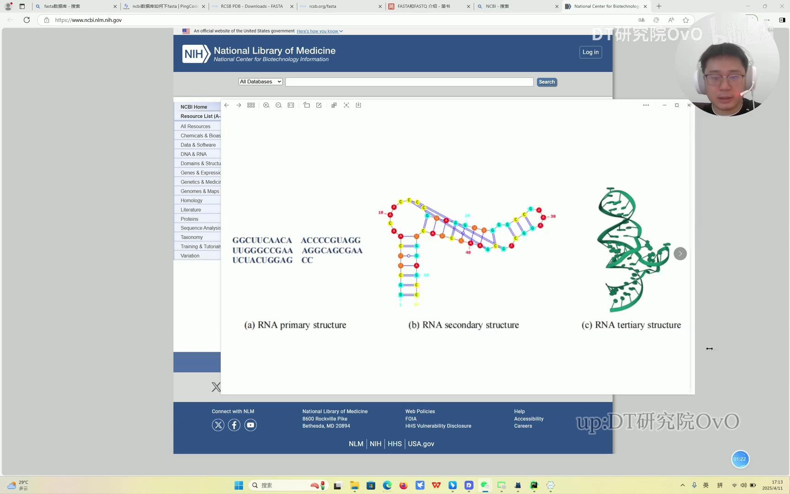

视频里特别圈出了前两者，强调"二级结构没有包含空间信息，只包含连接关系"。

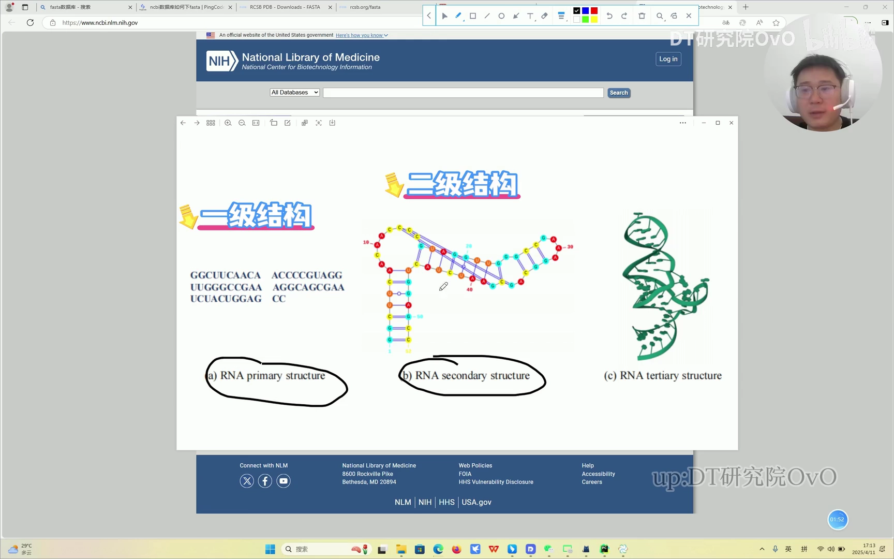

这三级正好对应三种建模思路：一级→序列模型（字母编码后送入 RNN/Transformer），二级→图模型（配对关系当边），三级→几何图神经网络（把原子坐标变成节点/边特征）。**本讲的重点是三级结构**，因为视频提问的同学正是在这里卡住：他有 FASTA 序列，也有坐标，但不知道如何结合。([跳转到 01:10](https://www.bilibili.com/video/BV1VBdDYLE8i/?t=70))

---

## 二、数据长什么样：FASTA 序列 + `.npy` 坐标

在写代码之前，先看清这两种文件的"形态"。

**FASTA 文件**：一行以 `>` 开头的名字（如 `>1A9N_1_Q`），下一行是碱基序列（如 `CCUGGUAUGC…`）。它提供的就是一级结构。

**坐标文件**：视频里用的是 `.npy`（NumPy 保存的数组）。每个残基由 **6 个主链原子**组成，分别是 `P`（磷）、`O5'`、`C5'`、`C4'`、`C3'`、`O3'`，每个原子有一组 x、y、z 坐标。

这里有一个理解要点：**主链是"固定"的，碱基是"变化"的**。从 P 开始，依次接氧、碳等原子，构成一个循环单元；下一位残基再接同样的循环。所以整条链看起来就是"同一个骨架不断重复"，不同之处在于每个位置上挂的碱基（A/U/C/G）不同。

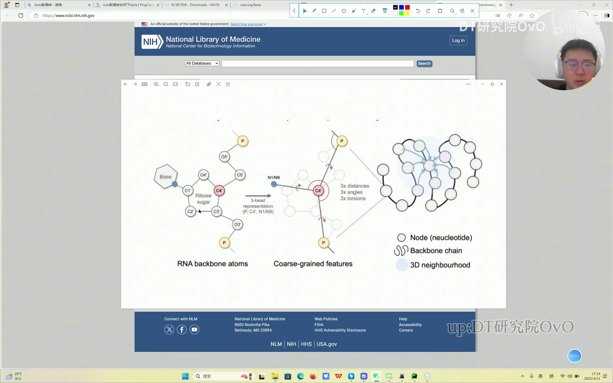

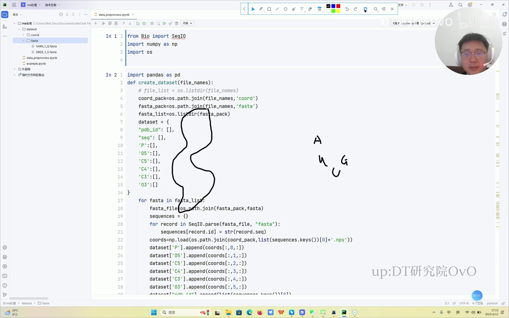

六个原子对应数组的第 0～5 行；一个残基就是 `(6, 3)` 的坐标块，整条链则是 `(残基数, 6, 3)`。视频演示里能看到 `.npy` 头部写着 `shape: (24, 7, 3)` 之类的信息——`24` 是残基数，`7` 是包含氢在内的原子数，`3` 是 xyz。([跳转到 03:25](https://www.bilibili.com/video/BV1VBdDYLE8i/?t=205))

---

## 三、第一步：用 `create_dataset` 把序列与坐标读进来

视频里的处理脚本叫 `data_preprocess.ipynb`，目录结构约定为：

```
dataset/
├─ coord/   1A9N_1_Q.npy, 2BQ5_1_S.npy   # 坐标
└─ fasta/   1A9N_1_Q.fasta, 2BQ5_1_S.fasta # 序列
```

核心函数 `create_dataset(file_names)` 做了三件事：

1. 用 `Bio.SeqIO.parse(..., "fasta")` 逐条读取 FASTA，拿到名字（`record.id`）和序列（`str(record.seq)`）；
2. 用 `np.load(...)` 读取对应的 `.npy` 坐标数组；
3. 把坐标**按行拆到六个原子列**：`coords[:,0,:]` 是 P，`coords[:,1,:]` 是 O5'，依次类推到 `coords[:,5,:]` 是 O3'。

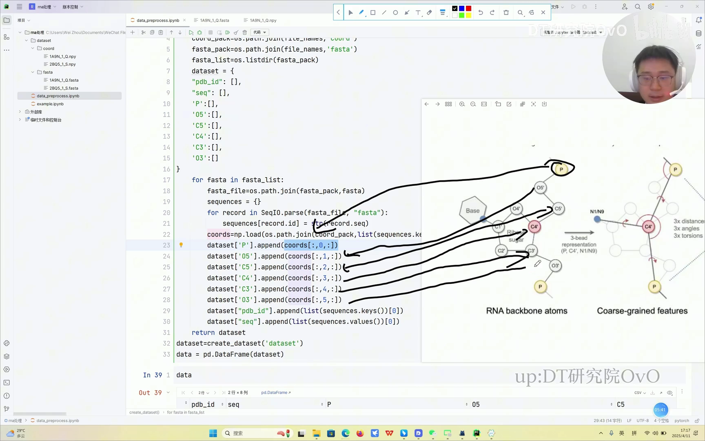

`dataset` 字典里最终包含：`pdb_id`、`seq`，以及 `P`、`O5'`、`C5'`、`C4'`、`C3'`、`O3'` 六列坐标。用 `pd.DataFrame(dataset)` 一包，就能直观看到"一条数据一行"的表格。([跳转到 03:45](https://www.bilibili.com/video/BV1VBdDYLE8i/?t=225))

---

## 四、一级结构的处理：字母表编码 + 对齐 + 掩码

把序列送给模型，第一件事就是把字母变成数字。

**字母表编码**：定义 `alphabet = 'AUCG'`，然后对序列里每个字符取它在字母表中的下标。比如 `A→0、U→1、C→2、G→3`。视频里演示的编码结果出现了 `2、2、1、3、3、1、0、1、1` 这样的整数数组——这就是模型真正会看到的"序列"。

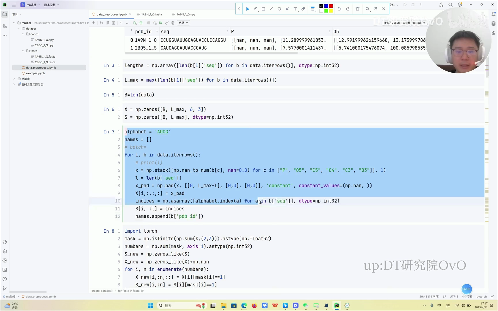

**统一长度（padding）**：不同 RNA 的残基数量不一样，但张量要求每条数据长度一致。做法是先求出全数据集最长序列 `L_max`，再把短的补到 `L_max`：坐标用 `np.pad(..., constant_values=np.nan)` 补 NaN，序列下标补 0。

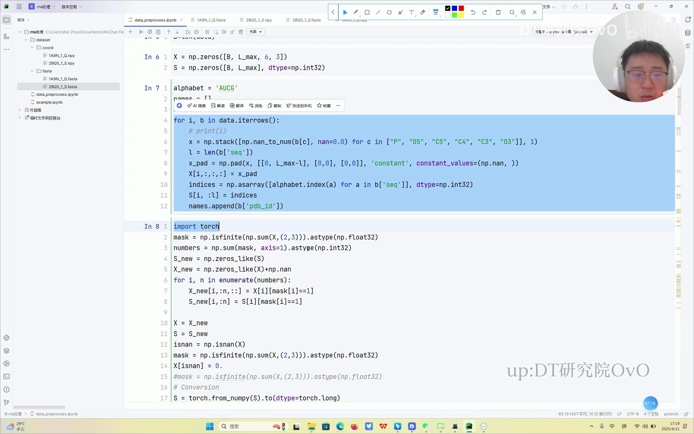

**掩码（mask）**：补出来的位置是"假的"，必须告诉模型别管它。用 `np.isinf(np.sum(X, (2,3)))` 判断哪些位置是 NaN/无效，得到 `mask`（有效为 1，无效为 0）。后续所有计算（距离、聚合）都会用这个 mask 把无效位排除掉。

对非计算机背景的同学，视频作者特意解释：**padding 是为了长度统一，mask 是为了让模型"看不见"填充位**，这两步是深度学习数据管道里的标准操作。([跳转到 06:36](https://www.bilibili.com/video/BV1VBdDYLE8i/?t=396))

---

## 五、三级结构第一步：用"距离 + Top-K"把残基连成邻接图

把数据送进图神经网络（GNN）之前，必须先造出图的两个基本要素：**邻接矩阵**（谁连着谁）和**节点特征矩阵**（每个点长什么样）。视频里先做邻接矩阵。

### 5.1 每个残基用一个"代表原子"定位

一个残基里有 6 个原子，但图的一个节点只应该对应一个残基。所以要先给每个残基选一个空间位置代表。视频里选择**主链上的代表原子**（代码中即 `atom_P`，也就是用 P 原子的坐标代表整个残基的位置），当然也可以把几个原子**求平均**得到一个中心点。选定代表点后，残基与残基"有多近"就可以用代表点之间的距离来衡量。

### 5.2 用 `_dist` 计算两两距离

`_dist(X, mask, top_k)` 把代表原子坐标两两相减、求平方和、开根号，得到一张距离矩阵 `D`。其中两个细节很关键：

- **无效位要屏蔽**：对 padding 出来的假残基，用 `(1 - mask_2D) * 10000` 把距离人为设成一个极大的数，避免它们被误当成"很近的邻居"；
- **取前 K 个**：对每个节点，从距离里挑出最近的 `top_k` 个邻居，记下它们的下标 `E_idx`。`top_k` 是一个**超参**，可以自己设定（视频代码里用了 5）。

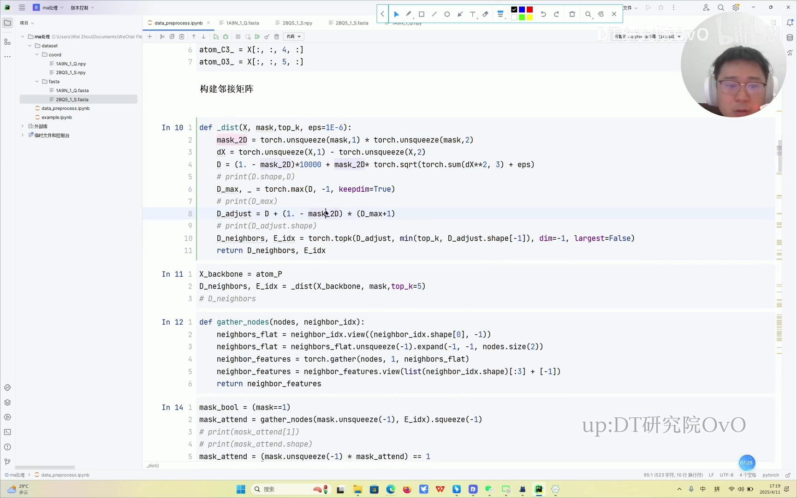

选出来的 `E_idx` 就是"邻接关系"，它告诉模型每个残基在三维空间里最靠近哪几个残基。由于是 3D 邻域，这个连接关系天然与前面讲的骨架结构相呼应。([跳转到 06:46](https://www.bilibili.com/video/BV1VBdDYLE8i/?t=406))([跳转到 07:43](https://www.bilibili.com/video/BV1VBdDYLE8i/?t=463))

---

## 六、节点特征：二面角 + RBF 距离 + 方向/朝向

有了"谁连着谁"，接下来要描述"每个节点长什么样"。三级结构的精髓就在这一步——把原子坐标转成具有几何意义的特征向量。视频代码把节点特征拆成三大类。

### 6.1 二面角（torsion）：刻画主链的折叠

主链由 6 个原子循环排列，相邻原子之间会形成一系列转角。函数 `_dihedrals(X)` 依次计算：

- **alpha（α）**：`O3'_{i-1} – P_i – O5'_i – C5'_i`
- **beta（β）**：`P_i – O5'_i – C5'_i – C4'_i`
- **gamma（γ）**：`O5'_i – C5'_i – C4'_i – C3'_i`
- **delta（δ）**：`C5'_i – C4'_i – C3'_i – O3'_i`
- **epsilon（ε）**：`C4'_i – C3'_i – O3'_i – P_{i+1}`
- **zeta（ζ）**：`C3'_i – O3'_i – P_{i+1} – O5'_{i+1}`
- 另外还有 **chi（χ）**，是碱基 `C1' – N9` 的扭转角（C、T、U 与 A、G 的定义不同）

代码的实现方式是：把相邻原子连成单位向量，用 `torch.cross` 求主链法向量，再取两个法向量之间的夹角，最后转成 `cos` 和 `sin` 两个分量返回。**为什么用二面角？** 因为序列在 3D 空间中会折叠，角度的变化正记录了它拐弯的方式，是残基最本质的几何特征之一。

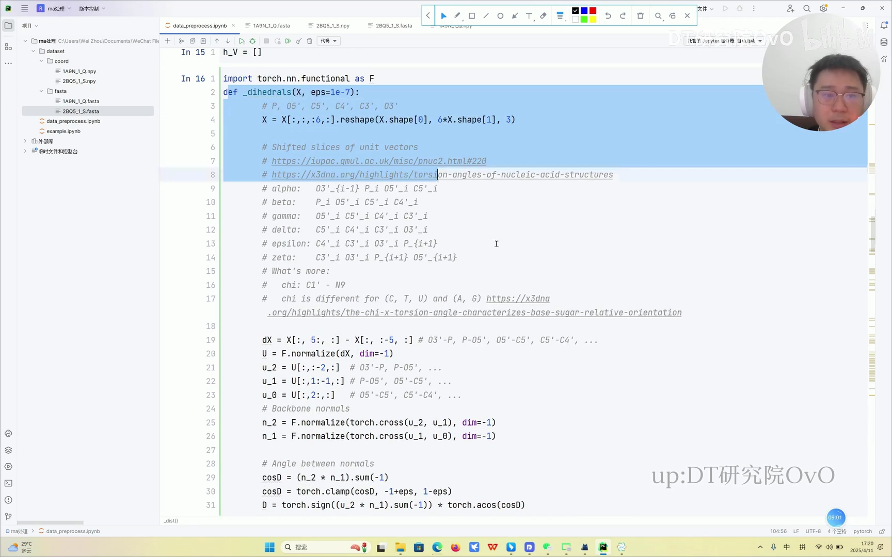

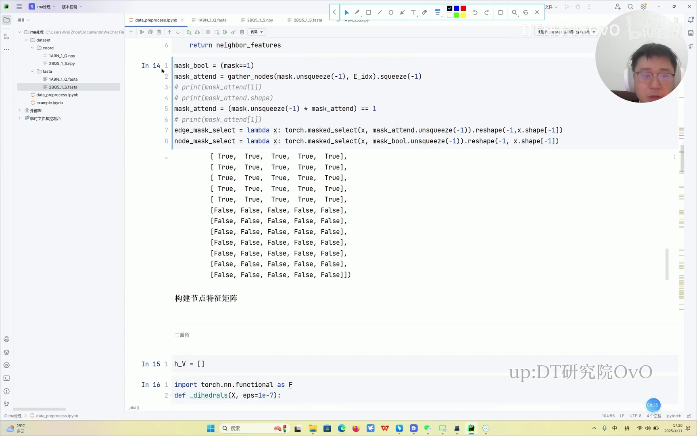

### 6.2 距离的 RBF 升维

原始的"距离"只是一个标量（一维），信息太少。代码用 **RBF（径向基函数）** 把它升维：设定 `num_rbf = 16`，在一段距离范围内布置 16 个中心，把每个距离展开成 16 维向量。

**为什么要升维？** 因为原始坐标只有 x、y、z 三个线性维度，模型很难从中分辨细微的空间差别；用 RBF 编码后，距离被展开成更丰富的特征描述。视频作者强调，这在几何图神经网络里是非常基础的操作，维数也可以设成 300 或更多。([跳转到 09:14](https://www.bilibili.com/video/BV1VBdDYLE8i/?t=554))

### 6.3 方向与朝向（orientation）

除了角和距离，代码还计算了**方向**部分。它利用每个残基局部坐标系（旋转矩阵的 `Rxx`、`Ryy`、`Rzz` 分量），结合四元数相关运算，返回：

- **节点级别的方向** `V_direct`
- **边级别的方向** `E_direct`
- **边级别的朝向** `E_orient`

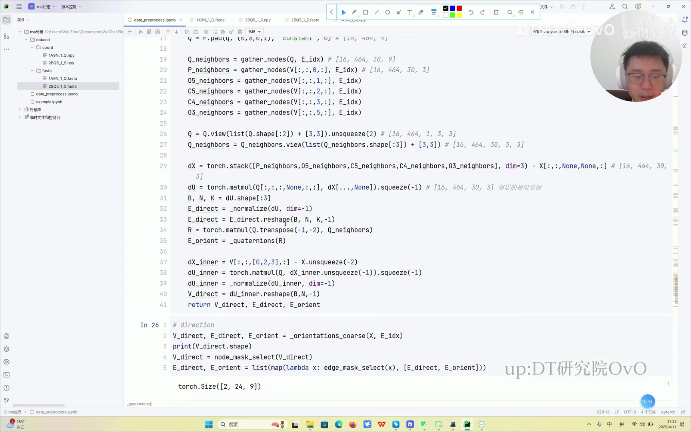

### 6.4 特征汇总

最后按开关（`node_feat_types`）把"角度、距离、方向"几路特征拼接起来，再做一次归一化 `_normalize`，得到最终的节点特征 `h_V`。也就是说，**每个残基节点的特征 = 它内部各原子的角度总和 + 距离 + 方向 + 编码信息**。

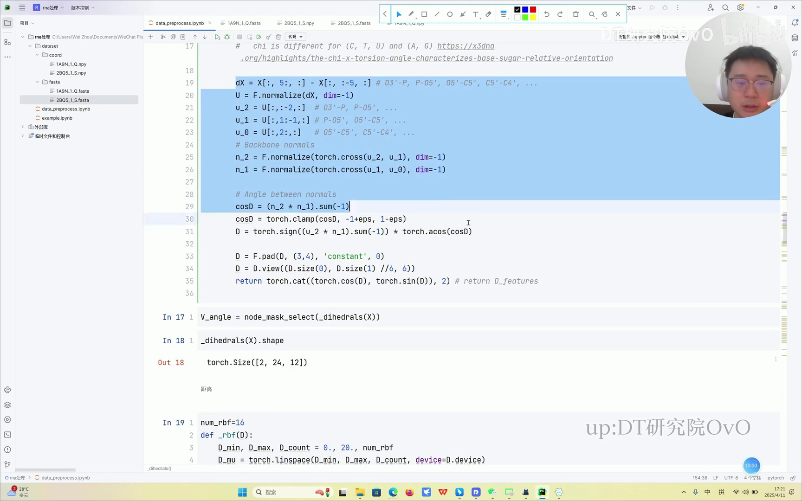

---

## 七、边特征与最终产物：把"图"交给模型

节点特征描述"点"，边特征描述"连接"。边的构造思路与节点类似，但它描述的是**残基与残基之间**的关系。

### 7.1 边特征用原子对的 RBF 距离

代码定义了一个边列表：

```python
edge_list = ['P-P', 'O5-P', 'C5-P', 'C4-P', 'C3-P', 'O3-P']
```

对每一对原子（如 `P-P`、`O5-P`……）用 `_get_rbf` 计算它们之间的 RBF 距离，再拼接成边特征 `E_dist`。之后再按 `edge_feat_types`（`orientation`、`distance`、`direction`）把边朝向、边距离、边方向汇总成 `h_E`。

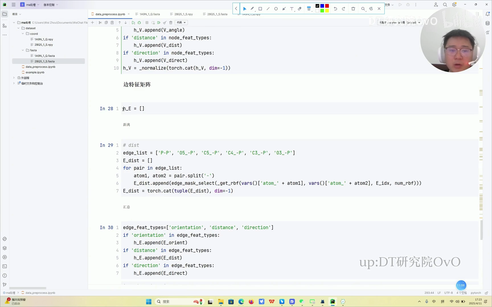

### 7.2 图里的"边权重"如何工作

对应到示意图，节点是核苷酸（残基），实线是主链连接，蓝色光晕是三维邻域。当消息传递发生时，**中心节点会聚合邻居节点的信息来更新自己**，这个聚合过程就由边特征（也就是边权重）来调节。这正是图神经网络"邻居聚合"的核心动作。

### 7.3 最终产出

把所有步骤串起来，交给模型的完整输入包括：

- **序列信息** `S`（字母编码后的整数张量）；
- **节点特征矩阵** `h_V`（角度 + 距离 + 方向）；
- **边特征矩阵** `h_E`（同一套几何量在边上的版本）；
- **邻接矩阵 / `E_idx`**（Top-K 近邻关系）；
- **批次信息 batch**（标明这条数据属于第几个批次）。

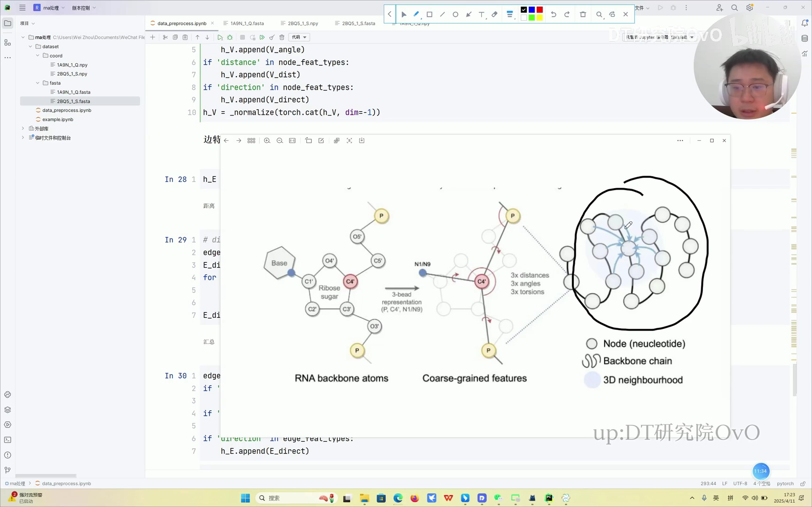

这样，最开始那位同学的问题——"我有 FASTA 序列和坐标，却不知道怎么用"——就得到了一套完整的解决方案。([跳转到 10:47](https://www.bilibili.com/video/BV1VBdDYLE8i/?t=647))

---

## 小结

- **先分级再处理**：RNA/DNA 分一级（序列）、二级（连接关系）、三级（空间构象），不同级别对应不同的数据组织方式。本讲聚焦三级结构。
- **两种输入文件**：FASTA 提供序列；`.npy` 提供坐标，每个残基由 P、O5'、C5'、C4'、C3'、O3' 六个主链原子组成，形状为 `(残基数, 6, 3)`。
- **一级结构处理**：建 `alphabet = 'AUCG'` 字母表 → 整数编码 → padding 对齐到 `L_max` → mask 标记有效位。
- **三级结构 = 一张几何图**：选主链代表原子（代码用 P）定位残基 → 算两两距离 → 取 Top-K 近邻得到邻接关系 `E_idx`。
- **节点特征三件套**：主链/碱基二面角（α、β、γ、δ、ε、ζ、χ，转 cos/sin）、RBF 距离升维（`num_rbf=16`）、方向与朝向（节点方向、边方向、边朝向），汇总并归一化得到 `h_V`。
- **边特征**：用 `P-P、O5-P、C5-P、C4-P、C3-P、O3-P` 等原子对的 RBF 距离等汇总成 `h_E`。
- **最终产物**：序列张量 `S`、节点/边特征 `h_V`/`h_E`、邻接矩阵、batch 信息，可直接输入图神经网络。

---

## 关键术语速查

| 术语 | 一句话解释 |
| --- | --- |
| 一级结构 | 碱基排列顺序（如 FASTA 里的 `AUCG…`），只有序列、没有空间信息 |
| 二级结构 | 碱基配对形成的环/茎等，有连接关系（图），但仍无三维坐标 |
| 三级结构 | RNA 在空间中的真实折叠构象，含二面角、距离等几何信息，是建模主流 |
| FASTA | 生物序列的标准文本格式，`>` 开头是名字，下一行是序列 |
| `.npy` | NumPy 保存的数组文件，这里存每个原子的 xyz 坐标 |
| 粗粒化 / 代表原子 | 把整个残基用一个原子（如 P）或平均点代表，作为图节点位置 |
| 邻接矩阵 | 描述"谁和谁相连"的矩阵，这里由 Top-K 近邻生成 |
| `E_idx` | 每个节点最近 K 个邻居的下标，即图的连接关系 |
| Top-K | 只保留最近的 K 个邻居，K 是可调超参 |
| padding | 把变长序列补齐到统一长度，便于批量并行 |
| mask（掩码） | 标记哪些位置是有效数据、哪些是填充位，计算时把填充位排除 |
| 二面角 / torsion | 由四个原子定义的角度，刻画主链如何折叠 |
| RBF | 径向基函数，把标量距离展开成高维向量，丰富特征表示 |
| 节点特征 `h_V` | 每个残基的几何描述（角度 + 距离 + 方向） |
| 边特征 `h_E` | 每条连接的描述（边距离 + 边方向 + 边朝向） |
| 图神经网络（GNN） | 在图上做消息传递、聚合邻居信息的神经网络 |

