# RFdiffusion：结合结构预测与扩散生成模型的精准蛋白质设计

> 这是 Joe Watson 与 David Juergens（华盛顿大学蛋白质设计研究所 Baker 实验室）关于 RFdiffusion 的一场报告。Joe 是博士后研究员，专注用生成模型做蛋白质设计；David 是博士生，研究基于深度学习的蛋白质序列与结构设计。报告分为两部分：先由 Joe 讲清"为什么用扩散模型、怎么把它搬到蛋白质上"，再由 David 展示一系列实验验证。
> 一句话结论：**RFdiffusion 把蛋白质结构预测网络 RoseTTAFold 微调成扩散模型的"去噪网络"，从纯噪声出发一步步去噪，直接生成蛋白质骨架（backbone）**。它在无条件生成、特定折叠、对称寡聚体、功能 motif 支架构建、结合物（binder）设计等广泛任务上——无论计算指标还是湿实验成功率——都显著优于此前方法。

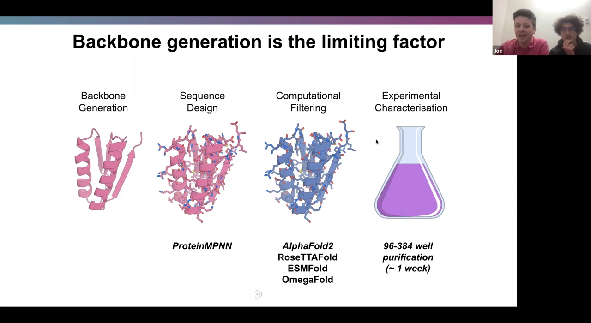

## 本讲要解决的核心问题（SCQA）

**背景**：蛋白质设计有一套成熟的工作流，机器学习的进步已经让"序列设计、计算筛选、实验表征"这三步变得非常高效（[【跳转到 03:21】](https://www.youtube.com/watch?v=wIHwHDt2NoI&t=201)）。也就是说，只要你手上有一个合理的蛋白质骨架，后面的路基本都通了。

**冲突**：但工作流的第一步——**生成骨架**——始终是瓶颈。过去的骨架生成方法要么算得慢、要么在长蛋白上失效，一直没什么好办法（[【跳转到 05:01】](https://www.youtube.com/watch?v=wIHwHDt2NoI&t=301)）。

**疑问**：能不能用一个深度学习生成模型，直接从"需求"生成蛋白质骨架？在图像领域大放异彩的扩散模型（diffusion），能不能迁移到三维蛋白质上？

**回答（中心思想）**：能。**RFdiffusion 把结构预测网络 RoseTTAFold 作为去噪网络的骨干，把扩散模型的"加噪—去噪"范式搬到蛋白质骨架上**。它用"框架（frame）"把每个残基表示成一个带位置的刚体，对 Cα 坐标加高斯噪声、对残基朝向在旋转群 SO(3) 上加噪声，从而在保持旋转/平移等变性的前提下逐步去噪（[【跳转到 09:28】](https://www.youtube.com/watch?v=wIHwHDt2NoI&t=568)）。它最大的意义在于：**同一个模型框架能接收多种设计约束**——无条件生成、特定折叠、对称、motif 支架、binder——且多数任务上超过了以往的专用模型（[【跳转到 41:51】](https://www.youtube.com/watch?v=wIHwHDt2NoI&t=2511)）。

## 一、为什么要"从零设计"蛋白质：骨架生成卡住了整条流水线

### 1.1 进化没有义务给我们想要的蛋白质

自然界只探索了可能存在的蛋白质中极小的一部分。更关键的是，**进化选择的是"能活下来"，而不是"溶解性好、稳定、好生产"**——而这些恰恰是制药和生物技术最看重的性质。所以从零设计（de novo design）的目标，是造出既有新功能、又具备这些理想性质的全新蛋白质（[【跳转到 01:42】](https://www.youtube.com/watch?v=wIHwHDt2NoI&t=102)）。

### 1.2 蛋白质设计的四步工作流：三步已通，只差第一步

在 Baker 实验室，蛋白质设计通常采用"结构优先"（structure-first）的思路，分四步（[【跳转到 02:31】](https://www.youtube.com/watch?v=wIHwHDt2NoI&t=151)）：

1. **骨架生成（Backbone Generation）**：先想出一个能执行目标功能的三维结构。
2. **序列设计（Sequence Design）**：给定骨架，找一条能折叠成它的氨基酸序列。这一步由 ProteinMPNN 这类神经网络完成，非常高效（[【跳转到 03:21】](https://www.youtube.com/watch?v=wIHwHDt2NoI&t=201)）。
3. **计算筛选（Computational Filtering）**：用 AlphaFold2、RoseTTAFold 等结构预测网络，验证"这条序列折叠出来的是不是我们设计的结构"。
4. **实验表征（Experimental Characterisation）**：把设计合成出来做实验。现在一周左右、96 到 384 个蛋白的规模就能从计算机推进到经过验证的蛋白质（[【跳转到 04:36】](https://www.youtube.com/watch?v=wIHwHDt2NoI&t=276)）。

问题就在于：后三步都有了强大的机器学习工具，**但第一步"生成骨架"没有**。既然计算上能生成的序列和结构远多于我们愿意实验测试的数量，骨架生成就成了许多设计问题的瓶颈。于是团队转向机器学习中已经很成熟的扩散模型（[【跳转到 05:01】](https://www.youtube.com/watch?v=wIHwHDt2NoI&t=301)）。

## 二、扩散模型为什么适合蛋白质设计

### 2.1 一分钟看懂扩散模型：先加噪，再学着去噪

扩散模型的基本原理可以用图像生成来理解（[【跳转到 05:23】](https://www.youtube.com/watch?v=wIHwHDt2NoI&t=323)）：

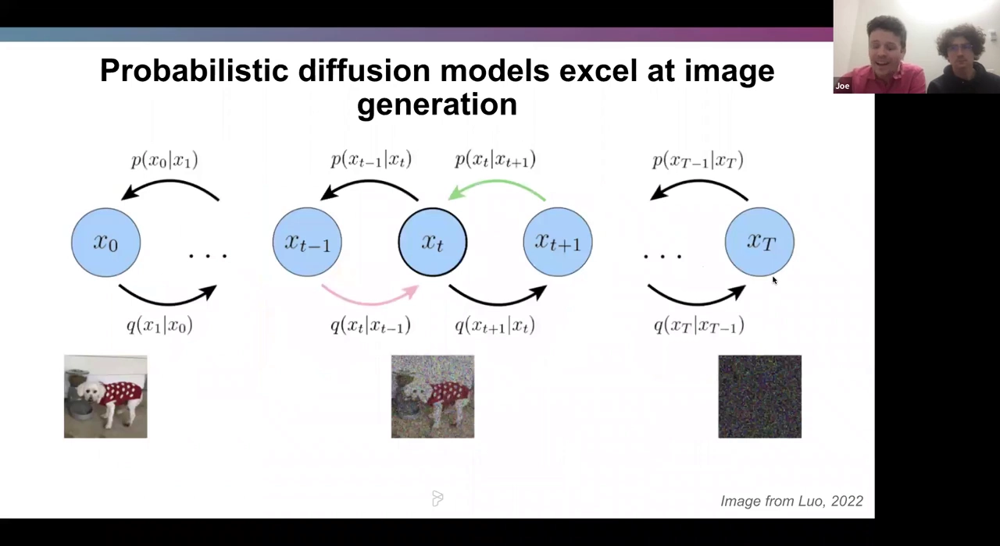

- **正向过程（加噪）**：从一张真实图像出发，在每个时间步加入一点高斯噪声。图像越来越模糊，中间步还能看出原图（比如一只狗），到最后一个时间步就变成一张"纯噪声"，原始信息基本被抹掉。关键是**每个时间步加的噪声结构是已知的**（通常是已知方差的高斯噪声），所以反复加噪最终会到达一个**已知分布**（标准高斯分布）。
- **反向过程（去噪）**：训练一个神经网络去"撤销"这些噪声。如果给它一张略微模糊的图 $x_{t+1}$，就让它预测 $x_t$。
- **生成**：训练成功后，从已知高斯分布里采一个纯噪声输入模型，反复去噪，就能得到一张与你训练数据（真实图像）分布高度接近的新图像。

### 2.2 三个理由：为什么偏偏选扩散模型做蛋白质

团队认为扩散模型特别适合蛋白质设计，主要有三点（[【跳转到 07:28】](https://www.youtube.com/watch?v=wIHwHDt2NoI&t=448)）：

1. **能生成无限多、多样化的输出**。每次去噪都重新注入随机噪声，使每条生成路径都不同，从而更密集地探索可能的解空间。
2. **可以直接对氨基酸坐标操作**。在建结构时，模型实际操作的是每个残基的三维坐标，这对后面要讲的对称、支架等应用非常有用。
3. **灵活的条件引导**。图像领域的经验表明，扩散模型能适应非常广泛的输入：既可以引导它满足高精度的具体要求（如某个功能图案），也可以只给一个粗略的约束（如"要某种折叠"），再引导生成过程。

## 三、在蛋白质上训练扩散模型的难点与解法

把图像那一套照搬过来并不行。**蛋白质是带物理约束的三维刚体，比图像"更难、也更特殊"**（[【跳转到 09:28】](https://www.youtube.com/watch?v=wIHwHDt2NoI&t=568)）。

### 3.1 蛋白质不是图像：它受严格的几何约束

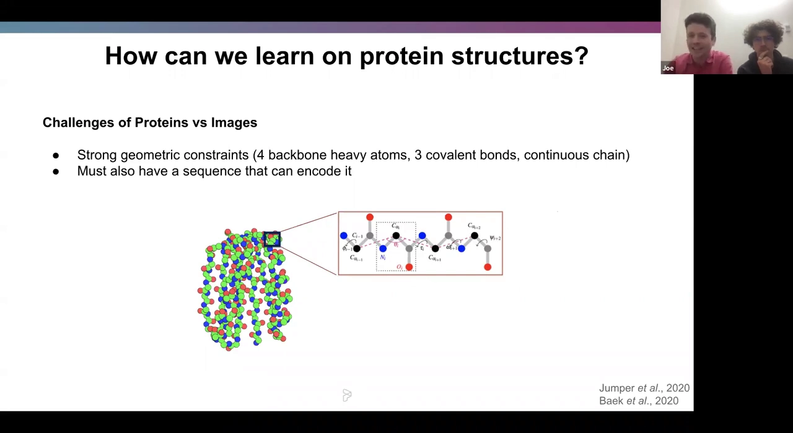

蛋白质结构由四个主链重原子组成：氮（N）、α 碳（Cα）、碳（C）、氧（O），它们通过三个共价键相连，必须形成一条**连续的链**。更麻烦的是，**并非所有骨架都能被氨基酸序列编码**——你设计出的结构，还得存在一条序列真的能折叠成它（[【跳转到 09:53】](https://www.youtube.com/watch?v=wIHwHDt2NoI&t=593)）。

### 3.2 用"框架"把复杂的蛋白质骨架简化成一组刚体

如果按原子级别建模，事情会复杂到无法训练。团队借鉴了 AlphaFold 和 RoseTTAFold 的做法——基于**框架（frame）**的表示（[【跳转到 10:18】](https://www.youtube.com/watch?v=wIHwHDt2NoI&t=618)）：

- 蛋白质里 N–Cα 和 Cα–C 的键几何几乎固定，氧原子的位置也能由这些框架推断出来。
- 于是可以把每个残基的 **N–Cα–C 三角形当作一个刚体框架**，它完全由一个**位移**（位置）和一个**旋转**（朝向）描述。
- 这样一个长度为 L 的蛋白质，就简化成了 **L 个位移 + L 个旋转**。既高效又简单。

### 3.3 对位移和旋转分别加噪

现在每个残基有两种"模态"：位置和朝向，加噪时必须同时处理（[【跳转到 11:33】](https://www.youtube.com/watch?v=wIHwHDt2NoI&t=693)）：

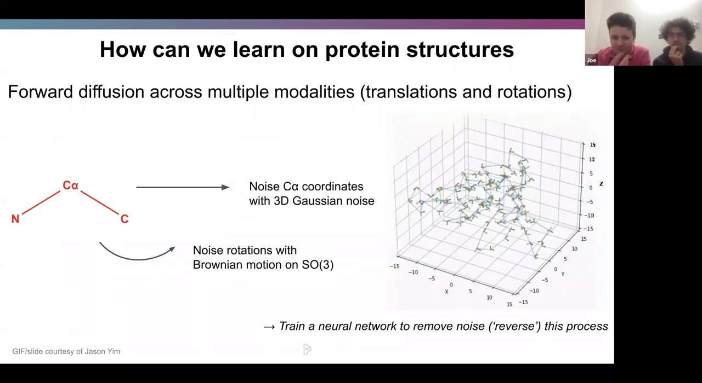

- **位移**：对 Cα 坐标施加三维高斯噪声。
- **旋转**：在旋转群 **SO(3)** 上做布朗运动（可以想象成球面上的随机游走）。
- 动画里可以看到：干净的三角形逐渐变得杂乱，位移和旋转都加上了噪声。

### 3.4 关键洞见：预测"一步噪声"等价于预测"真实结构"

这一点是整套方法的驱动力（[【跳转到 12:48】](https://www.youtube.com/watch?v=wIHwHDt2NoI&t=768)）。

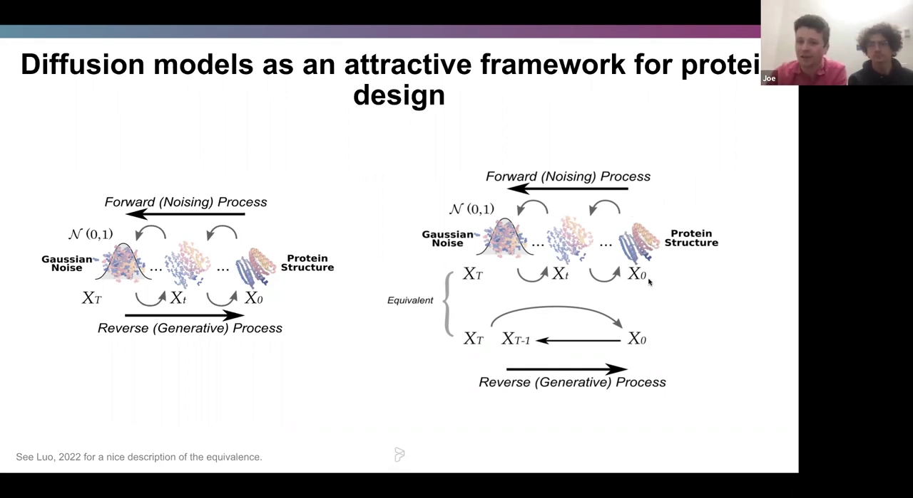

通常我们把反向生成理解为"每次去掉一步噪声"。但有一个很好的性质：**预测一步噪声，和直接预测原始图像（或真实蛋白质结构）$x_0$，在相差一个比例系数的意义下是等价的**。

这个等价性带来一个大胆的想法：既然"预测真实结构"正是**结构预测网络**的本职工作，那我们何不直接**拿一个结构预测网络来做去噪网络**？团队选的就是 RoseTTAFold（[【跳转到 13:13】](https://www.youtube.com/watch?v=wIHwHDt2NoI&t=793)）。

## 四、RFdiffusion：把 RoseTTAFold 改造成去噪网络

### 4.1 RoseTTAFold 天生就像个去噪网络

RoseTTAFold 的架构本身就很合适（[【跳转到 13:38】](https://www.youtube.com/watch?v=wIHwHDt2NoI&t=818)）：

- 它具备 **SE(3) 等变性**——也就是说，你对输入做一个三维旋转/平移，它的输出会相应地一起变，不会乱掉；
- 它本来就接收**输入序列 + 输入坐标**，并预测真实蛋白质结构。

所以团队保留 RoseTTAFold 预训练的结构与权重，**把它微调成生成模型**。具体做法是：

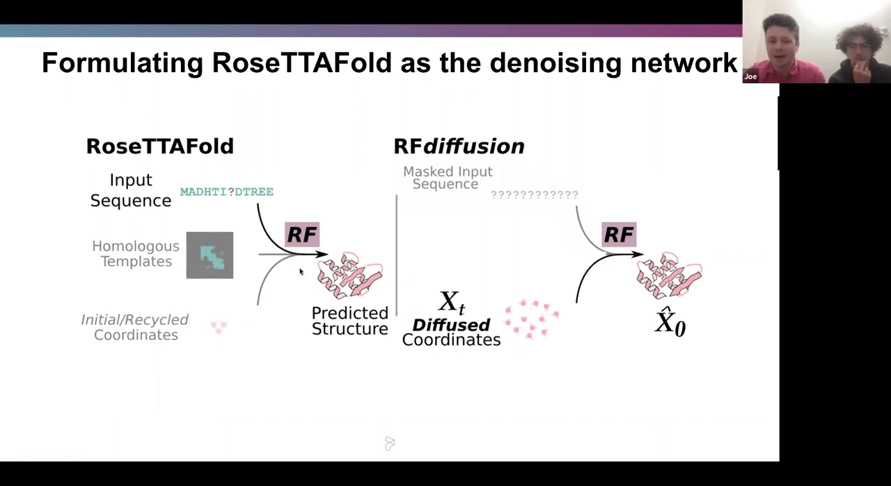

- **不再提供输入序列**，而是把它**屏蔽（mask）**掉，让序列基本成为空白（也许留很少量信息）；
- 给网络输入**带噪声的坐标**（$X_t$，diffused coordinates）；
- 让它输出对真实结构的预测 **$\hat{x}_0$**（读作"x0-hat"）。

由于输出结构与 RoseTTAFold 原来的产物一致，团队相信这是训练蛋白质结构生成模型的有效方式。

### 4.2 训练细节：中等算力，几天就能训好

（[【跳转到 15:18】](https://www.youtube.com/watch?v=wIHwHDt2NoI&t=918)）

- 用 **PDB（蛋白质数据库）** 训练，工作范围限于 **少于 384 个氨基酸**的蛋白质，因此不做裁剪；
- 蛋白质按序列相似性分组；
- 扩散过程用 **200 个时间步**，最终到达"Cα 坐标三维高斯分布 + 旋转均匀分布"的纯噪声；
- 算力相当适中：**8 块 A100 训练约 4 天**，模型约 **8000 万参数**。

### 4.3 self-conditioning：让模型看到自己上一步的预测

**self-conditioning（自条件）** 是 RFdiffusion 的一个关键设计（[【跳转到 15:43】](https://www.youtube.com/watch?v=wIHwHDt2NoI&t=943)）。它的动机是：

- 已有扩散模型文献表明，让模型**访问自己在上一时间步的预测**，有助于它做出更好的下一次预测；
- 这在概念上类似 AlphaFold / RoseTTAFold 里的 **recycling**——给网络多次机会，每次都基于上次的预测再调整。

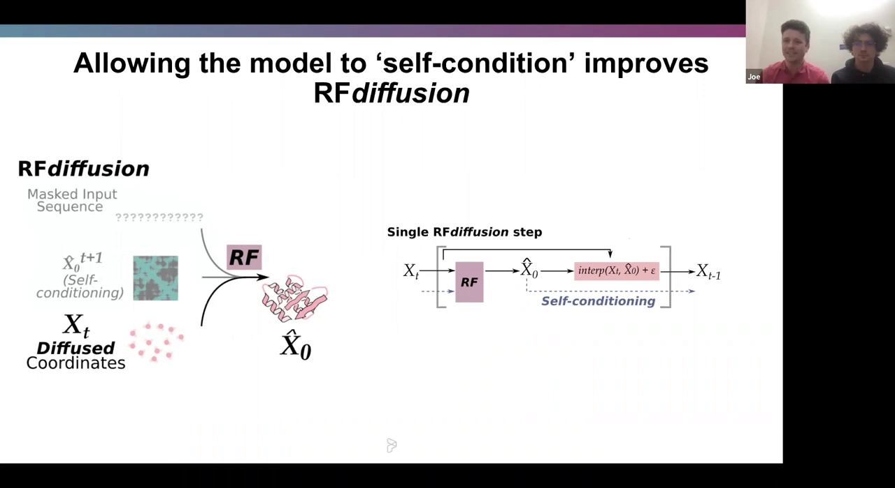

具体来说：在时间步 $t$ 得到 $\hat{x}_0$ 之后，把它和 $t$ 时刻的坐标 $\hat{x}_0^{t+1}$ 一起输入下一步的模型，模型就能同时利用"当前位置"和"上一步认为的真实结构"来做下一次预测。**这一改动显著提升了 RFdiffusion 的性能**。

在混合测试集上（无条件生成 + 功能 motif 支架构建），衡量指标是"AlphaFold 预测与设计之间的 RMSD"（越低越好）和"AlphaFold 置信度 pAE"（越低越好）。结果显示：**加上 self-conditioning 后，无条件生成能得到比 AlphaFold 更好的匹配，motif 支架构建的匹配也更好、置信度更高**（[【跳转到 17:45】](https://www.youtube.com/watch?v=wIHwHDt2NoI&t=1065)）。

### 4.4 从预训练权重出发，是训练可行的关键

一个关键对照实验（[【跳转到 18:35】](https://www.youtube.com/watch?v=wIHwHDt2NoI&t=1115)）：

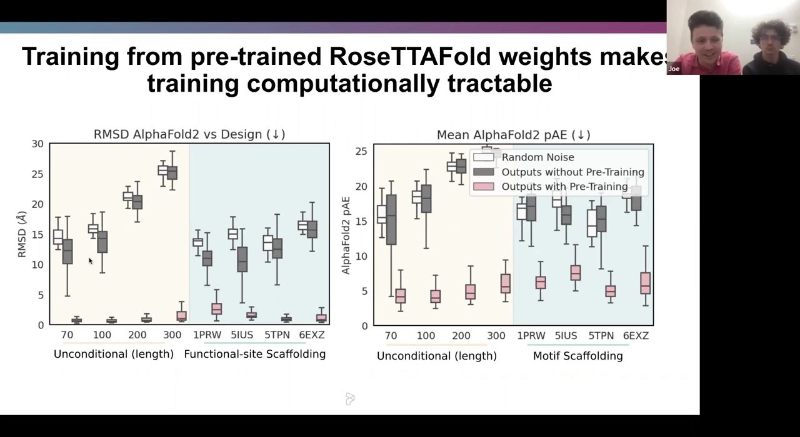

- **随机初始化**（不用预训练权重）用同样算力训练，性能很差；深灰色柱子显示各项任务都远不如预训练版本。团队强调：如果只在"高斯噪声"上跑 ProteinMPNN，得到的性能都和它差不多。
- **用预训练 RoseTTAFold 权重**（粉色）则能直接利用结构预测网络的归纳偏置，训出真正的生成模型。

可视化也印证了这点：完全没有预训练时，输出根本不像蛋白质；有预训练但不用 self-conditioning 时，能看出二级结构但折叠松散；**既用预训练又加 self-conditioning**，则能生成折叠紧密、拓扑丰富的漂亮结构（一个 300 氨基酸样本）（[【跳转到 19:35】](https://www.youtube.com/watch?v=wIHwHDt2NoI&t=1175)）。

## 五、计算层面的验证：RFdiffusion 强在哪里

介绍完模型，David 接手展示一系列实验（[【跳转到 20:23】](https://www.youtube.com/watch?v=wIHwHDt2NoI&t=1223)）。

### 5.1 无条件生成：又长、又准、又新

"无条件生成"指不给任何约束，让模型随便造一个蛋白质。这可以衡量模型在给定长度时能造出多规整的结构域（[【跳转到 21:13】](https://www.youtube.com/watch?v=wIHwHDt2NoI&t=1273)）。

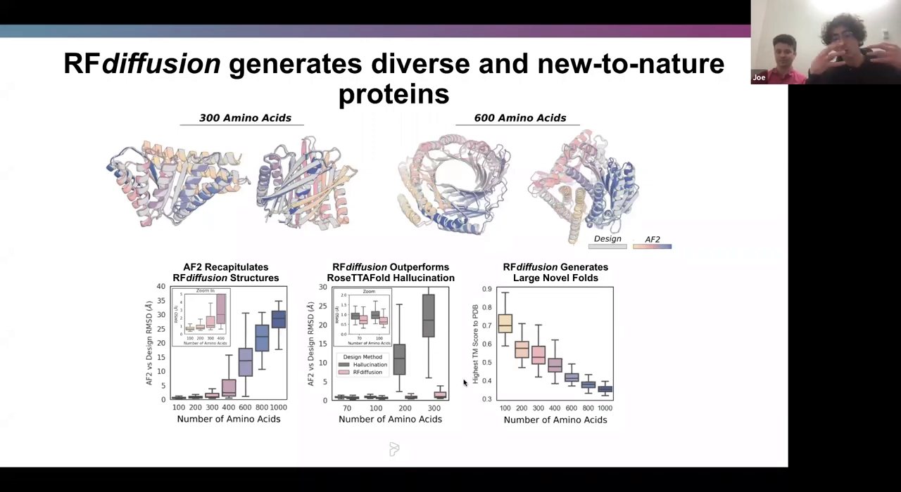

- **长蛋白也能建好**：用 ProteinMPNN 设计序列后，AlphaFold 能很好地重建出 RFdiffusion 的设计（图中彩色为 AlphaFold 预测，灰色为 RFdiffusion 设计）。即使到 **400 个氨基酸**，平均设计仍极好；到 **600 个氨基酸**仍能找到可被成功重建、高置信度、低 RMSD 的骨架。
- **胜过前辈**：与更成熟的 **Rosetta Hallucination** 相比，无论短蛋白还是长蛋白，在"AlphaFold 与设计 RMSD"这个指标上 RFdiffusion 都维持在很低的水平，**扩展性好得多**。
- **不是背数据集**：用 **TM-score** 衡量设计与整个 PDB 训练集的相似度，发现 RFdiffusion 的骨架与 PDB 里任何东西相似度都很低——**它们基本是全新的蛋白质**，说明模型真的在建模整个分布，而不是在记忆训练集（[【跳转到 23:18】](https://www.youtube.com/watch?v=wIHwHDt2NoI&t=1398)）。

### 5.2 特定折叠家族：给个"折叠草图"就能采样

很多设计方法依赖大型骨架库。RFdiffusion 可以围绕某个**折叠家族**创建库并采样（[【跳转到 25:15】](https://www.youtube.com/watch?v=wIHwHDt2NoI&t=1515)）。做法是把两部分"粗略信息"喂给网络：

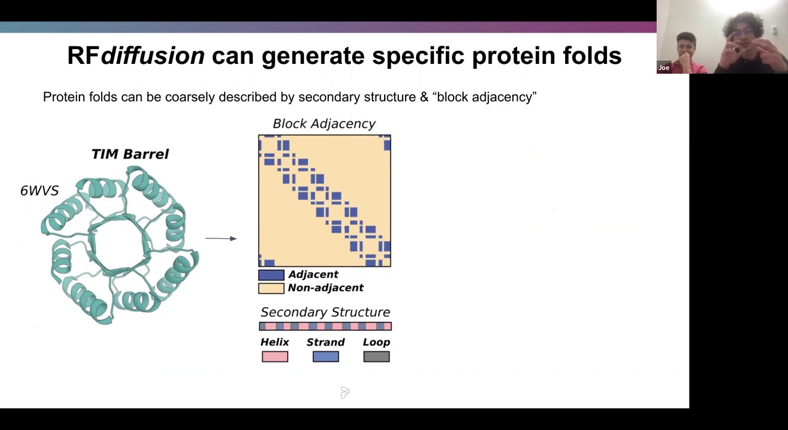

1. **块邻接矩阵（block adjacency）**：一个二维张量，粗略描述哪些二级结构元素在三维空间中彼此靠近；
2. **每个残基的二级结构编码**：告诉网络哪个位置是螺旋（helix）、哪段是折叠（strand）、哪段是环（loop）。

两样都容易计算。团队训练了一个新版本，让模型根据这些信息调整对 $\hat{x}_0$ 的预测（把它作为二维模板放进 RoseTTAFold 的输入路径）。

- 以 **TIM barrel（TIM 桶）** 家族为例，能看到一条清晰的迭代路径逐步重建出该折叠；从理想 TIM barrel 形状出发，还能采样出整个折叠分布中各种不同构型。
- 也用 **NTF2** 做了测试。
- 结果：生成的设计满足"可订购（orderable）"标准的比例约 **40% 到 50%**，是为一整个折叠家族创造新样本的高效方法（[【跳转到 27:25】](https://www.youtube.com/watch?v=wIHwHDt2NoI&t=1645)）。

### 5.3 对称寡聚体：从数学上"按定义"构造对称

对称寡聚体（oligomer）对材料设计和疫苗设计都很有用（[【跳转到 28:13】](https://www.youtube.com/watch?v=wIHwHDt2NoI&t=1693)）。

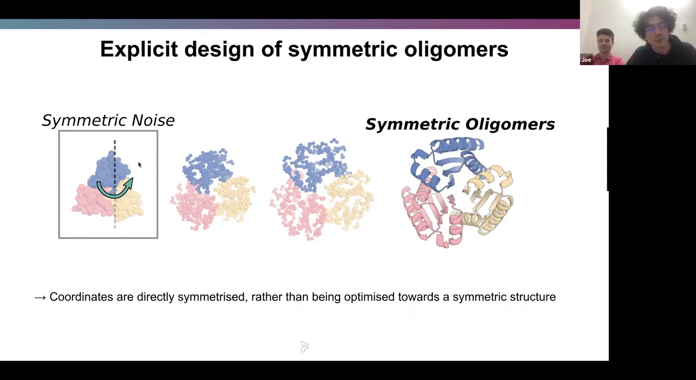

做法是：每次送给网络的点云里只取一个**不对称单元**的残基，从高斯分布采样后，**施加你想构建的点群对称的所有对称操作**。这样网络预测出的 $\hat{x}_0$ 会非常紧密地遵循该点对称；走完扩散路径后，得到的结构**按定义就是完美对称的**，再用 ProteinMPNN 对称地设计序列即可。

- 关键优势：这是"按定义"构造出对称，而不是"朝某个近乎对称的东西去优化"，因此比以往的深度学习方法更有用。
- 可用于循环对称、二面体对称和很大的多面体，计算机模拟中成功率非常高；**二面体对称和多面体过去用 hallucination 之类方法基本做不到**。
- **负染电镜验证**：团队开展大规模设计，纯化大量蛋白并用负染电镜验证大致结构。RFdiffusion 骨架与 AlphaFold 预测几乎无法区分，二维分类平均和三维重建都证实颗粒呈现预期的多形体形状（[【跳转到 30:50】](https://www.youtube.com/watch?v=wIHwHDt2NoI&t=1850)）。
- 还扩展到**二十面体类似物**：只建模最少亚基与界面，跑扩散 + MPNN，得到 C3 对称组分，与设计叠加得很好，实验三维重建与设计模型完全一致（[【跳转到 31:11】](https://www.youtube.com/watch?v=wIHwHDt2NoI&t=1871)）。

## 六、湿实验验证：从计算机到实验室

### 6.1 无条件设计确实稳定、好表达、极耐热

团队取了 300 个氨基酸的无条件设计，合成序列、在大肠杆菌中表达，然后测 CD 光谱（圆二色光谱，用来判断蛋白折叠）并尝试融解（[【跳转到 24:08】](https://www.youtube.com/watch?v=wIHwHDt2NoI&t=1448)）：

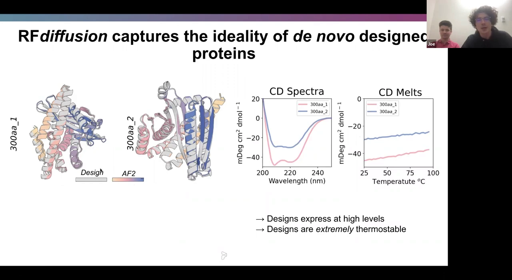

- **表达水平非常高**；
- CD 光谱显示**折叠良好**；
- **极其耐热**——如果把蛋白加热融解，CD 融解曲线会出现一个带拐点的 S 形；而在这些设计上**完全看不到拐点，即使煮沸也不融解**。

### 6.2 功能 motif 支架构建：p53 螺旋的癌症治疗潜力

**功能 motif 支架构建（functional motif scaffolding）** 是个经典问题（[【跳转到 32:06】](https://www.youtube.com/watch?v=wIHwHDt2NoI&t=1926)）：

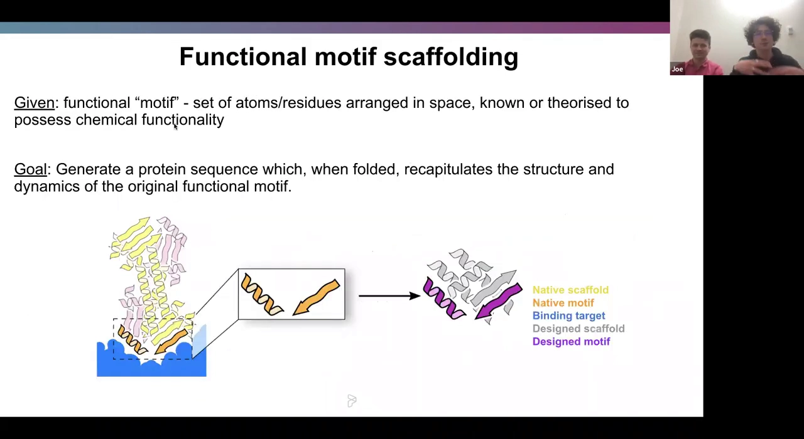

- **给定**：一个功能 motif（一组在空间中特定排列的原子/残基，已知或推测具有某种化学功能）；
- **目标**：生成一条序列，使它折叠后能**精确复现该 motif 的结构**，从而具备该功能。

RFdiffusion 在这个任务上覆盖了非常广泛的支架问题，**几乎在所有方面都取得合理成功率，某些情况下成功率非常高，显著优于 RosettaFold inpainting 和 hallucination**（[【跳转到 33:10】](https://www.youtube.com/watch?v=wIHwHDt2NoI&t=1990)）。

其中一个基准问题是**给 p53 的螺旋搭建支架**（[【跳转到 33:40】](https://www.youtube.com/watch?v=wIHwHDt2NoI&t=2020)）：

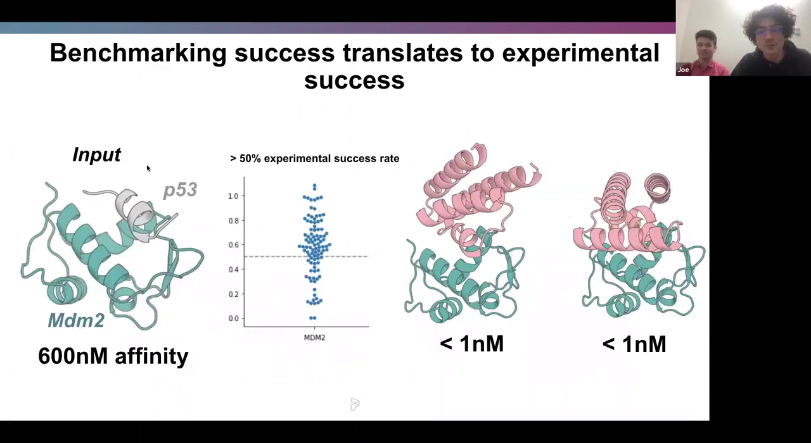

- 意义：正常 p53 螺旋与 MDM2 结合，如果能在折叠良好的蛋白里为 p53 螺旋搭建支架、让它结合 MDM2（甚至比正常 p53 更强），就可能成为**癌症疗法**。
- 天然 p53 的亲和力约为 **600 纳摩尔**。
- 订购 96 个设计后，**超过一半的结合亲和力至少与 p53 螺旋相当**；有些设计 **KD 小于 1 纳摩尔**，可视为治疗候选。

### 6.3 对称 metal-binding 设计：只用四个组氨酸为镍搭支架

团队还尝试**对称 motif 支架构建**，选择金属结合案例：只用**四个组氨酸残基**为**镍结合位点**搭建支架，用完美的螺旋把它们连接起来，目标是找到一个具有 **C4 对称**（平面正方形）的寡聚体（[【跳转到 35:32】](https://www.youtube.com/watch?v=wIHwHDt2NoI&t=2132)）。

把"支架构建"与"对称寡聚体生成"两套流程结合，就能无缝地把装饰 motif 穿进堆积紧密的寡聚体里。结果：

- 找到的底层结构种类之多令人惊讶，即使在组氨酸侧链层面也能得到出色模拟；
- 订购 48 个设计，**金属结合成功率达 30% 到 40%**；
- 负染和对称性验证显示结构都没问题，并观察到与镍的极强结合；
- **把组氨酸突变掉后，结合信号完全消失**——证明这些组氨酸确实负责结合镍（[【跳转到 37:17】](https://www.youtube.com/watch?v=wIHwHDt2NoI&t=2237)）。

### 6.4 binder 设计：实验成功率提升 2 到 10 倍

**蛋白质结合物（binder）设计**与治疗、诊断广泛相关（[【跳转到 38:00】](https://www.youtube.com/watch?v=wIHwHDt2NoI&t=2280)）。思路类似 motif 支架：把目标蛋白当作"motif"告诉网络，让它设计第二条球状链去装配到目标上。

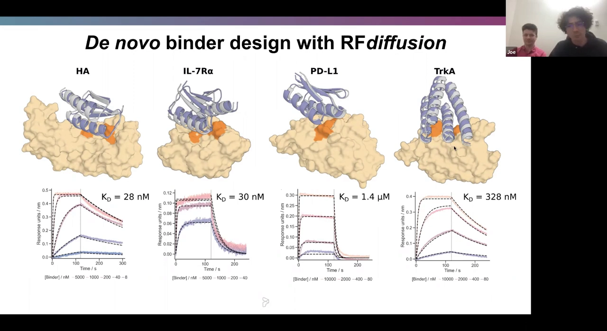

- 应用于四个治疗相关靶点：**HA（流感血凝素）、IL-7Rα、PD-L1、TrkA**；
- 实验成功率比之前的设计行动**提升 2 倍到至少 10 倍**——以前大约需要 **10000 个设计**才能找到结合物，这里从一开始就能有百分之几十的成功率；
- 针对流感血凝素配体，96 个设计里就能找到一个 **KD 为 28 纳摩尔**的配体。

更进一步，用**冷冻电镜（Cryo-EM）**解析了血凝素 binder 的原子级结构（[【跳转到 40:05】](https://www.youtube.com/watch?v=wIHwHDt2NoI&t=2405)）：

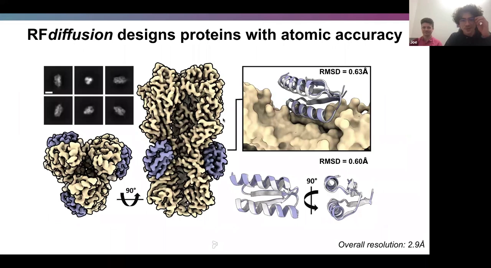

- RFdiffusion 模型与电镜结构的偏差**小于 1 埃**（细看为 **0.60 Å 和 0.63 Å**），整体分辨率 2.9 Å；
- 证实 RFdiffusion 生成的结构在原子层面精确、值得信赖。

### 6.5 肽结合物：未经实验室优化就达到皮摩尔级

最近的另一次设计行动由 Pritham 和 Susanna 牵头，为具有治疗/诊断意义的**肽**设计结合物（[【跳转到 40:43】](https://www.youtube.com/watch?v=wIHwHDt2NoI&t=2443)）。

- 把肽的结构喂进网络，让它围绕肽构建一个折叠；对螺旋肽，模型倾向于造出带凹槽的结构，让肽能很好地嵌进去；
- 在使用 MPNN、AlphaFold 并订购 96 个设计后，在 **PTH 和 BIM 肽**上都发现了**皮摩尔级**的结合；
- 据团队所知，这是迄今为止计算结果中、**未经任何实验室优化就取得的首个（或最强的）**结合数据。

## 七、结论：站在结构预测的"巨人肩膀"上

（[【跳转到 41:51】](https://www.youtube.com/watch?v=wIHwHDt2NoI&t=2511)）

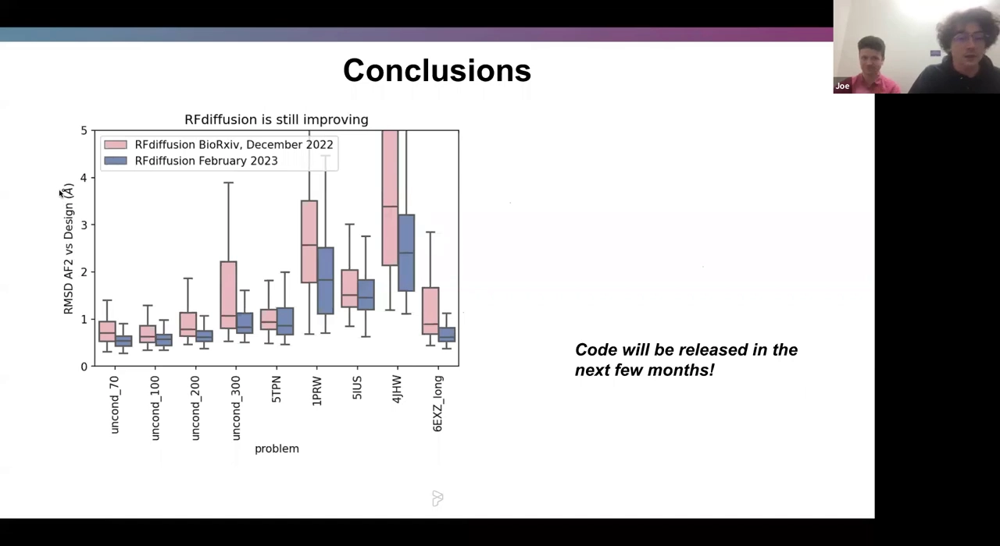

- RFdiffusion 实现了**生成蛋白质骨架能力的量子飞跃**，在广泛任务上、无论计算还是实验，都**显著且定量地超越了此前方法**；
- 它实际上是**受益于蛋白质结构预测领域的所有进步**——架构、数据表征、训练策略乃至权重本身。模型站在了结构预测进步的"巨人肩膀"上；
- 模型**仍在持续改进**：报告展示的新模型（2023 年 2 月版）在标准测试中比论文里的旧版（2022 年 12 月版）表现更好；
- 团队表示，**论文发表后会发布源代码**，也会尽量把发现的更好模型一并发出来，确保大家能用上最好的版本。

## 小结

- **骨架生成是蛋白质设计的瓶颈**：序列设计（ProteinMPNN）、计算筛选（AlphaFold）、实验表征都已成熟，唯独"从头生成骨架"没有好方法。
- **扩散模型天生适合蛋白质设计**：能生成无限多样输出、直接操作三维坐标、并可灵活接收各种条件约束。
- **难点在于表征**：蛋白质有严格的几何约束（连续链、必须可被序列编码）。RFdiffusion 用"N–Cα–C 框架"把每个残基表示成位移 + 旋转，对位移加三维高斯噪声、对旋转在 SO(3) 上加布朗运动。
- **核心洞见**：预测一步噪声等价于预测真实结构 $x_0$，因此可以直接把结构预测网络 RoseTTAFold 微调成去噪网络。
- **两个关键技巧**：屏蔽输入序列、只喂带噪坐标；用 **self-conditioning** 让模型参考自己上一步的预测（类似 recycling）。
- **从预训练权重出发**是训练可行的前提：随机初始化在同等算力下几乎学不会。
- **实验结果全面领先**：无条件生成又长又准又新；特定折叠家族可采样；对称寡聚体"按定义"构造；motif 支架（p53/MDM2、镍结合）和 binder 设计（HA 等）成功率大幅提升，并获冷冻电镜原子级验证。
- **意义**：RFdiffusion 站在蛋白质结构预测进步的"巨人肩膀"上，并仍在快速进化。

## 关键术语速查

| 术语 | 一句话解释 |
| --- | --- |
| de novo 蛋白质设计 | 从头设计自然界不存在的全新蛋白质，追求新功能 + 好性质（稳定、可溶、易生产）。 |
| 骨架 / backbone | 蛋白质主链的三维结构（N–Cα–C–O），是"结构优先"设计的第一步产物。 |
| 扩散模型 / diffusion | 生成模型范式：正向逐步加噪到已知分布，再训练网络反向逐步去噪生成新样本。 |
| 正向 / 反向过程 | 正向加噪（$q$）、反向去噪生成（$p$）；最终到达已知的高斯分布。 |
| 框架 / frame | 把每个残基的 N–Cα–C 三角形当作刚体，用位移 + 旋转描述，从而简化骨架表征。 |
| SO(3) | 三维空间中的旋转群；残基朝向在这里做布朗运动。 |
| SE(3) 等变性 | 输入做三维旋转/平移，输出会相应一起变换（不乱掉），是合适去噪网络的重要性质。 |
| x₀ / x̂₀ | 真实（干净）蛋白质结构 / 网络对它的预测；预测一步噪声与预测 $x_0$ 等价。 |
| self-conditioning | 把上一时间步对 $x_0$ 的预测喂回模型，类似 AlphaFold 的 recycling，显著提升性能。 |
| RoseTTAFold | 一个兼具序列与坐标输入、具 SE(3) 等变性的蛋白质结构预测网络，被微调为 RFdiffusion 的去噪骨干。 |
| RMSD | 两组结构对应原子间的均方根距离，越小表示预测与设计越一致。 |
| pAE | 预期对齐误差，AlphaFold 对自身预测的置信度指标，越小越自信。 |
| TM-score | 衡量两个结构的相似度（0–1）；用来判断设计是否与 PDB 中已知蛋白雷同，越低越"新"。 |
| motif / 功能 motif | 一组在空间中特定排列、具有某种化学功能的原子/残基。 |
| motif 支架构建 | 给定一个功能 motif，设计一个能精确复现它结构的新蛋白（scaffold）。 |
| 寡聚体 / oligomer | 由多个亚基组装成的蛋白；对称寡聚体指按点群对称排列的多聚体。 |
| binder | 能特异结合目标蛋白/肽的蛋白质，用于治疗、诊断。 |
| KD | 解离常数，衡量结合强度，数值越小结合越强（nM、pM 都很强）。 |
| Rosetta Hallucination | 此前的骨架生成方法，RFdiffusion 在多个任务上优于它。 |
| CD 光谱 / CD 融解 | 圆二色光谱，用来判断蛋白是否折叠良好；融解曲线的拐点指示融解温度。 |
| 负染电镜 / 冷冻电镜 | 电子显微镜技术，用于实验验证设计蛋白的真实结构。 |
