# RFdiffusion：从图像生成到蛋白质结构设计

> 这是一次偏科普的知识分享，不是典型意义上的论文精读。它想回答一个生物医学学生很自然会好奇的问题：**David Baker 是生物化学博士出身，为什么能做出一套 AI 蛋白质设计架构，还拿了诺奖？**
> 一句话结论：**RFdiffusion = RoseTTAFold 的蛋白质去噪网络 + 计算机视觉里的 diffusion 生成范式**。它把"生成一张图像"那套"加噪—逐步去噪"的思想搬到三维蛋白质上，并解决了二维图像与三维蛋白质表征不同的关键难点，从而能**根据功能需求直接生成蛋白质骨架（backbone）**。

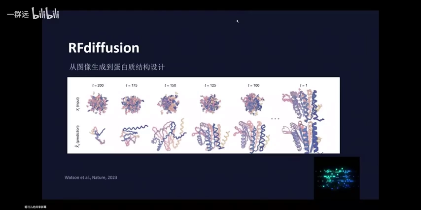

## 本讲要解决的核心问题（SCQA）

**背景**：在图像生成领域，2020 年前后 diffusion（扩散模型）取代了上一代的对抗式生成模型 GAN，成为主流生成范式（[【跳转到 01:25】](https://www.bilibili.com/video/BV12jgQ6UEo2/?t=85)）。与此同时，蛋白质结构预测领域已经有了 AlphaFold，Baker 团队也做出了功能对标 AlphaFold 的 RoseTTAFold（[【跳转到 13:54】](https://www.bilibili.com/video/BV12jgQ6UEo2/?t=834)）。

**冲突**：蛋白质设计的核心任务并不是"预测一个已知序列会折叠成什么结构"，而是反过来——**给定一个功能或结构上的需求，设计出一个自然界中不存在、但能用、稳定的蛋白质**。而 diffusion 是给二维图像设计的，蛋白质却是带朝向的三维刚体，两者"表征"完全不同（[【跳转到 20:09】](https://www.bilibili.com/video/BV12jgQ6UEo2/?t=1209)）。

**疑问**：diffusion 到底怎么工作？Baker 团队如何把它迁移到蛋白质上、克服了哪些困难？RFdiffusion 比前辈模型强在哪、又还有哪些没解决的问题？

**回答（中心思想）**：RFdiffusion 用 **RoseTTAFold 作为去噪网络骨干**，用 **diffusion 作为生成范式**，把"生成图像"换成"生成蛋白质骨架"。它把蛋白质每个残基表示成**带位置的刚体框架**，对 Cα 坐标做高斯扰动、对残基朝向在 SO(3) 旋转群上做扰动，从而在保持旋转/平移等变性的前提下逐步去噪（[【跳转到 21:49】](https://www.bilibili.com/video/BV12jgQ6UEo2/?t=1309)）。它最大的意义在于：**同一个模型框架能接收多种设计约束**（无条件、对称、binder、motif scaffolding），且在多数任务上超过了以往的专用模型（[【跳转到 31:48】](https://www.bilibili.com/video/BV12jgQ6UEo2/?t=1908)、[【跳转到 43:29】](https://www.bilibili.com/video/BV12jgQ6UEo2/?t=2609)）。

## 一、扩散模型：把"生成"变成"加噪之后再去噪"

### 1.1 从 GAN 到 diffusion：生成范式的更替

分享先用一句话概括了 diffusion 的核心思想：**它把图像生成问题看作了"加噪之后的去噪过程"**（[【跳转到 04:05】](https://www.bilibili.com/video/BV12jgQ6UEo2/?t=245)）。要理解它新在哪，得先看它取代的上一代架构。

上一代主流是**对抗式生成模型 GAN**：G 是 generative（生成）、A 是 adversarial（对抗）、N 是 neural network（神经网络）（[【跳转到 04:14】](https://www.bilibili.com/video/BV12jgQ6UEo2/?t=254)）。GAN 的思想有点像"把团队分成两拨人，去竞争同一个项目"：一个小小的**生成器**和一个小小的**判别器**比赛对抗，目标都是赢，而且都想让对方损失最大（[【跳转到 05:04】](https://www.bilibili.com/video/BV12jgQ6UEo2/?t=304)）。任务就是生成一张逼真的、但数据库里没有的图像。

而 diffusion 的逻辑完全不同：它**把真实的图像一步步加噪**，让架构去学习"去噪"这个过程；当想生成一张前所未有的图像时，就让模型从一团随机噪点出发，一点点把它还原出来（[【跳转到 05:29】](https://www.bilibili.com/video/BV12jgQ6UEo2/?t=329)）。

讲解者用了两个很形象的类比来帮助初学者理解：

- **雕塑类比**：先备好一块规整的石膏（相当于初始化噪声），去噪的过程就像"一点一点把多余的石膏凿掉"，最终显现出人形（[【跳转到 06:19】](https://www.bilibili.com/video/BV12jgQ6UEo2/?t=379)）。
- **画面类比**：PPT 上从一张清晰人脸开始，逐步加噪，最后变成一团混沌。

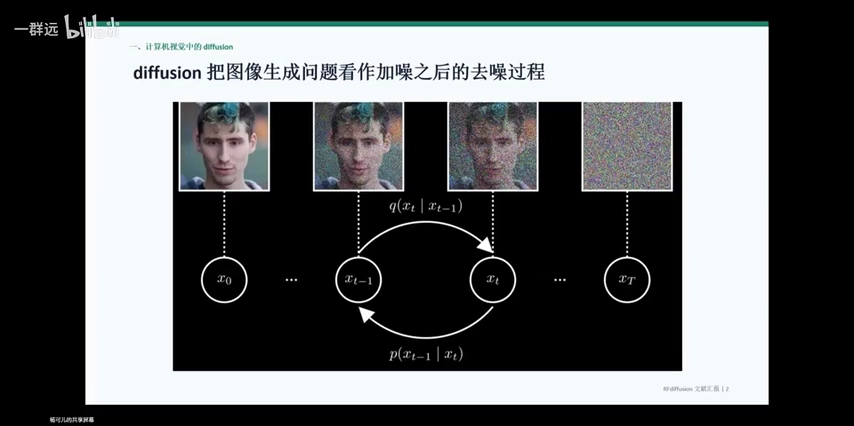

### 1.2 正向加噪与反向去噪

加噪并不是完全随意，它**服从高斯分布**：所谓"随机"其实也要满足一定分布，加噪就是把像素点按高斯分布加进噪声，最终让整张图的像素点整体满足一个"均值为 0、方差为 1"的标准高斯分布（[【跳转到 07:34】](https://www.bilibili.com/video/BV12jgQ6UEo2/?t=454)、[【跳转到 07:59】](https://www.bilibili.com/video/BV12jgQ6UEo2/?t=479)）。这里有很多为了让计算更流畅简便的数学变换，讲座里略过了。

于是就有了时间步（timestep）的概念：从 X0 出发，经过 X(t-1)、Xt，一直到 XT，这是一条**正向加噪**的链；而从右往左、从噪声还原回图像的，则是**反向去噪**（[【跳转到 08:24】](https://www.bilibili.com/video/BV12jgQ6UEo2/?t=504)）。**diffusion 模型学习的，就是让去噪过程的每一步都尽量贴近加噪过程的逆过程**（[【跳转到 08:49】](https://www.bilibili.com/video/BV12jgQ6UEo2/?t=529)）。

### 1.3 训练目标：让模型的"答案"贴标准答案——最小化 KL 散度

反向去噪学习的流程可以拆成几步（[【跳转到 09:19】](https://www.bilibili.com/video/BV12jgQ6UEo2/?t=559)）：

1. **真实样本 X0**：可以把它想象成图像上任意一个像素点的具体数值，也就是"干净的数据"；
2. **加噪得到 XT**：加噪强度是人为规定的；
3. **标准答案 q**：已知 X0 和 XT 后，可以推导出 X(t-1) 的**后验分布**——相当于"起点、终点都知道，中间某一步出现这张图的概率"（[【跳转到 10:09】](https://www.bilibili.com/video/BV12jgQ6UEo2/?t=609)）；
4. **模型答案 Pθ**：模型只看到最终那团噪点，要不断学习、更新权重，自己猜出这个后验分布（[【跳转到 10:50】](https://www.bilibili.com/video/BV12jgQ6UEo2/?t=650)）。

模型给出的 Pθ 也是一个概率分布。那么怎么设计目标函数，让模型这个"考生"尽量贴合标准答案？这就需要**KL 散度**——它衡量两个概率分布的差异。标准答案的后验分布与模型给出的分布，**均值和方差越接近，KL 散度就越小**（[【跳转到 11:51】](https://www.bilibili.com/video/BV12jgQ6UEo2/?t=711)）。所以 diffusion 的核心目标可以写成一句话：

$$
\min \mathrm{D_{KL}}\big(q(x_{t-1}\mid x_t, x_0)\ \|\ p_\theta(x_{t-1}\mid x_t)\big)
$$

**这行公式的意义，就是让模型预测的"上一步更干净的样本"，尽量接近正向加噪过程推导出的标准答案**（[【跳转到 12:16】](https://www.bilibili.com/video/BV12jgQ6UEo2/?t=736)、[【跳转到 12:41】](https://www.bilibili.com/video/BV12jgQ6UEo2/?t=761)）。

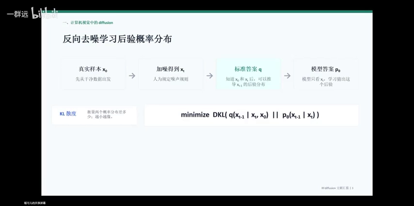

## 二、RFdiffusion 是什么：RoseTTAFold 的去噪骨干 + diffusion 生成范式

### 2.1 一个等式与一段开源故事

讲座用一句话概括了 RFdiffusion（[【跳转到 13:29】](https://www.bilibili.com/video/BV12jgQ6UEo2/?t=809)）：

> **RFdiffusion = RoseTTAFold 神经网络 + diffusion 生成架构**

这里面有个很值得一说的背景故事。**RoseTTAFold 是 David Baker 团队自己研发的一个对标 AlphaFold 的网络，功能约等于 AlphaFold**（[【跳转到 13:54】](https://www.bilibili.com/video/BV12jgQ6UEo2/?t=834)）。为什么在 AlphaFold 已经出现后还要自己重造一个？因为当时 AlphaFold 被 DeepMind 推出后**并没有开源**，而 Baker 是个极具开源精神的人——"你不开源，那我就自己研发一个，然后我开源"。结果 RoseTTAFold 开源之后，AlphaFold 也紧跟着开源了（[【跳转到 14:19】](https://www.bilibili.com/video/BV12jgQ6UEo2/?t=859)）。

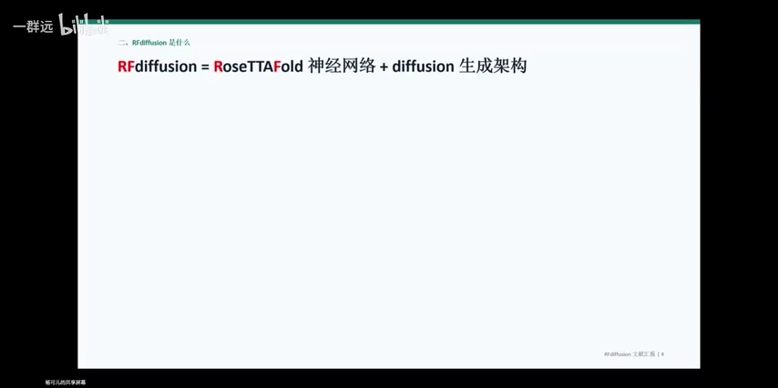

### 2.2 它在 AI for protein design 全流程中的位置

RoseTTAFold 原本的任务是"**根据序列预测结构**"：输入一条氨基酸序列，模型告诉我们它三维结构可能是什么样子（[【跳转到 14:44】](https://www.bilibili.com/video/BV12jgQ6UEo2/?t=884)）。而 RFdiffusion 的任务不同：**给定功能上或结构上的需求，生成一个蛋白质骨架**——所谓骨架，可以理解为蛋白质的二级和三级结构，但具体每个残基是什么氨基酸还不知道，那由其他模型完成（[【跳转到 15:09】](https://www.bilibili.com/video/BV12jgQ6UEo2/?t=909)、[【跳转到 15:34】](https://www.bilibili.com/video/BV12jgQ6UEo2/?t=934)）。

把这些模型放到 Baker 提出的、**totally in silico 的"从 0 开始 de novo 设计蛋白质"流程**里，就一目了然了（[【跳转到 16:49】](https://www.bilibili.com/video/BV12jgQ6UEo2/?t=1009)）。整个流程分为四步，全程不涉及湿实验：

1. **预期功能**：明确我们想要的功能，或预期的结构（比如"设计一个能结合某靶蛋白的蛋白"）；
2. **生成 protein backbone 骨架**：这一步由 **RFdiffusion（或幻觉 Illusion 模型）** 完成（[【跳转到 17:39】](https://www.bilibili.com/video/BV12jgQ6UEo2/?t=1059)）；
3. **设计氨基酸序列及侧链**：有了骨架后，具体每个残基是哪种氨基酸还不知道，请出 **ProteinMPNN** 把侧链填上（[【跳转到 18:04】](https://www.bilibili.com/video/BV12jgQ6UEo2/?t=1084)、[【跳转到 18:29】](https://www.bilibili.com/video/BV12jgQ6UEo2/?t=1109)）；
4. **验证结构**：把设计出的一级序列喂回 **AlphaFold2**，让它生成一个"它认为这条序列对应的三维结构"，再和最开始预期的结构对比。**如果头尾一致，就说明设计成功了**（[【跳转到 18:54】](https://www.bilibili.com/video/BV12jgQ6UEo2/?t=1134)、[【跳转到 19:19】](https://www.bilibili.com/video/BV12jgQ6UEo2/?t=1159)）。

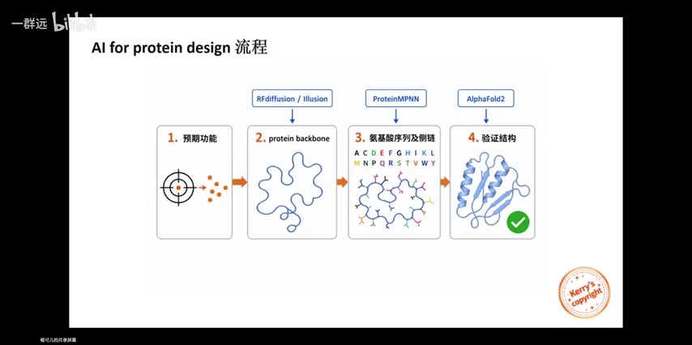

记住这张图，不同模型"该待在哪个位置"就清楚了。

### 2.3 核心难点：二维图像与三维蛋白质的表征不同

把一个为二维图像设计的 diffusion 架构落地到蛋白质设计领域，困难不少，**最大的困难就是维度**：它原本用于二维图像生成，而现在要建模的是具有空间立体构型的三维蛋白质（[【跳转到 20:09】](https://www.bilibili.com/video/BV12jgQ6UEo2/?t=1209)）。

这里引入一个关键概念——**表征（representation）**：就是"我们如何把一张图像或一个蛋白质，翻译成计算机能理解并运算的数字（矩阵）"。我们希望这个翻译过程**充分且必要**、不要太复杂（[【跳转到 20:34】](https://www.bilibili.com/video/BV12jgQ6UEo2/?t=1234)）。

二维图像和三维蛋白质的表征差别是根本性的：

| 维度 | 图像 diffusion | 蛋白 RFdiffusion |
| --- | --- | --- |
| 数据形式 | 张量 `x_t: [B, C, H, W]` | 残基框架 `residue frame: [R_i, t_i]` |
| 空间结构 | 像素在规则二维网格上 | 每个残基有 Cα 位置 `t_i` |
| 局部关系 | 局部邻域由上下左右决定 | N–Cα–C 定义局部朝向 `R_i` |
| 网络直觉 | U-Net / CNN 很自然 | **序列相邻 ≠ 空间相邻** |
| 朝向 | 像素本身没有三维朝向 | **需要 SE(3) 旋转/平移等变** |

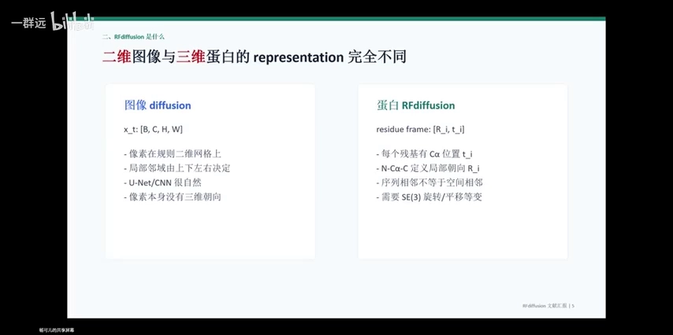

结论：**建模问题从"像素值的去噪"变成了"带位置和带朝向的氨基酸残基刚体结构的去噪"**（[【跳转到 22:14】](https://www.bilibili.com/video/BV12jgQ6UEo2/?t=1334)）。Baker 团队主要攻克两件事：**蛋白质在空间中的平移**，以及**每个氨基酸的旋转**（[【跳转到 22:39】](https://www.bilibili.com/video/BV12jgQ6UEo2/?t=1359)）。

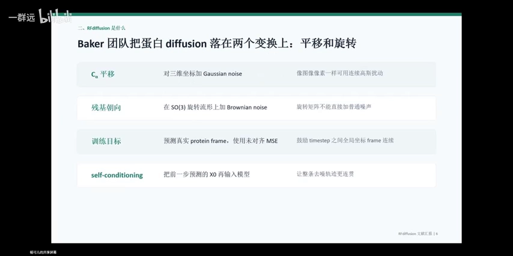

### 2.4 平移好办，旋转难：SE(3) 与残基朝向

**平移相对好办**：一个像素也能在二维平面里平移，所以这个问题基本可以沿用图像生成那边的处理方式——对坐标做连续的高斯扰动（[【跳转到 23:04】](https://www.bilibili.com/video/BV12jgQ6UEo2/?t=1384)）。

**旋转就麻烦一些**，因为直接给旋转矩阵加普通噪声不合适。团队的做法建立在一个几何事实上（[【跳转到 23:29】](https://www.bilibili.com/video/BV12jgQ6UEo2/?t=1409)）：

- 在氨基酸残基中，**氮原子、α 碳原子、羧基碳原子这三者之间的键长和键角基本不变**，无论 R 基是什么、蛋白质整体是什么构象（[【跳转到 24:19】](https://www.bilibili.com/video/BV12jgQ6UEo2/?t=1459)）；
- 空间中**三个不同的点可以确定一个平面**。团队就取这三者确定的平面，把**垂直于该平面的法向量**定义为这个氨基酸的**朝向**（[【跳转到 25:09】](https://www.bilibili.com/video/BV12jgQ6UEo2/?t=1509)）。

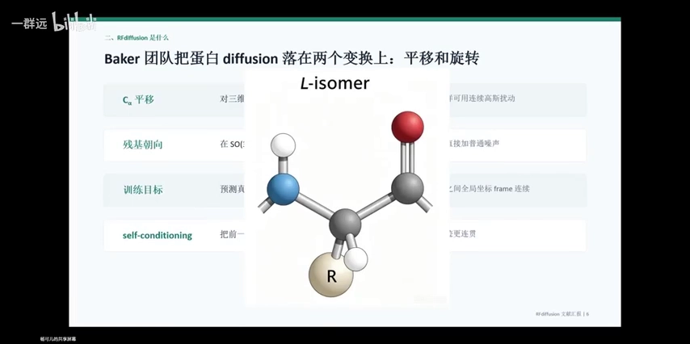

有了明确、可量化的朝向定义，处理旋转就容易多了。于是蛋白质上每一个残基在 diffusion 模型里，**不仅有绝对坐标的编码，也有相对位置的编码**，这样才能保证旋转不变性/平移不变性（[【跳转到 25:59】](https://www.bilibili.com/video/BV12jgQ6UEo2/?t=1559)）。

### 2.5 self-conditioning 与"不断预测最终干净结构"

论文里还有一个重要机制叫 **self-conditioning**（讲座坦言不好直译成中文）。它的意思是：模型有很多时间步 X0、X1、X2……XT，**每一个 X 都是上一轮计算的输出；把上一轮的 output 放到下一轮，当作下一轮的 input，这个过程就是 self-conditioning**（[【跳转到 26:49】](https://www.bilibili.com/video/BV12jgQ6UEo2/?t=1609)、[【跳转到 27:14】](https://www.bilibili.com/video/BV12jgQ6UEo2/?t=1634)）。

它的好处是：每次变换都基于上一步的结果，这里有个**马尔可夫性**——不用过问输入之前的过程是怎么来的，现在这个输入本身就蕴含了以往所有信息。这不仅让计算更便捷，也保证每一步的微调是**连续**的；否则去噪过程如果很跳脱（这里凿一下、那里找一下），蛋白质很容易被改乱（[【跳转到 27:39】](https://www.bilibili.com/video/BV12jgQ6UEo2/?t=1659)、[【跳转到 28:04】](https://www.bilibili.com/video/BV12jgQ6UEo2/?t=1684)）。

加噪和去噪的时间步都可以**人为规定**：加噪时 timestep 从 1 一路增到 200，去噪（也就是 diffusion 真正运算的过程）时 timestep 反过来递减，比如从 200、175、150……到 1（[【跳转到 32:13】](https://www.bilibili.com/video/BV12jgQ6UEo2/?t=1933)、[【跳转到 32:38】](https://www.bilibili.com/video/BV12jgQ6UEo2/?t=1958)）。这样，RFdiffusion 在每一个时间步都会给出一个**对最终干净结构 X0 的预测**：图里上排是该时间步下噪点的分布，下排则是据此预测出的蛋白质结构（[【跳转到 33:03】](https://www.bilibili.com/video/BV12jgQ6UEo2/?t=1983)）。

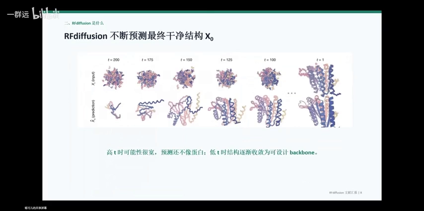

讲座用**函数与切线**打了比方：当前噪点像某个点上的函数值，而过该点做切线得到的"预测值"，就是模型对最终结构的估计。切线只是对这一点速度的预期，不能完全代表整条函数的走势——所以**高 t（时间步大）时预测宽、还不像蛋白；低 t 时结构逐渐收敛为可设计的 backbone**（[【跳转到 33:37】](https://www.bilibili.com/video/BV12jgQ6UEo2/?t=2017)、[【跳转到 35:07】](https://www.bilibili.com/video/BV12jgQ6UEo2/?t=2107)）。

## 三、一个模型，接收多种设计约束

RFdiffusion 最"不一样"的地方在于：**同一个模型框架，能接收多种设计约束，一揽子实现所有需求**。而以往的模型通常是一个应用场景配一个专用架构（[【跳转到 31:48】](https://www.bilibili.com/video/BV12jgQ6UEo2/?t=1908)）。论文里介绍了这么几类任务（[【跳转到 28:54】](https://www.bilibili.com/video/BV12jgQ6UEo2/?t=1734)）：

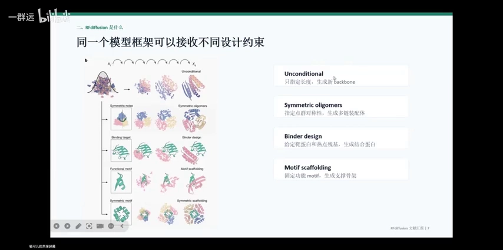

**1）Unconditional（无条件生成）**
不给任何约束条件。我们只指定一个序列长度，比如"我想要 300 个残基"，模型就给它一个初始化，然后生成一段骨架（[【跳转到 28:54】](https://www.bilibili.com/video/BV12jgQ6UEo2/?t=1734)）。

**2）Symmetric oligomers（对称寡聚体）**
想生成一个具有对称结构的蛋白质，做法是：**在初始化时只对最小的那个单元（symmetry unit）做加噪去噪，最后再把这个单元旋转、复制、粘贴**，拼成一个对称的单体（[【跳转到 29:19】](https://www.bilibili.com/video/BV12jgQ6UEo2/?t=1759)）。

**3）Binder design（结合蛋白设计）**
我们有一个靶蛋白，或一些想结合的"热点残基"。做法是：**初始化时把这团噪声和靶蛋白一起输进去**。靶蛋白在整个加噪去噪过程中保持不变、结构非常明确，真正在运算的只是那堆粉色噪声点；噪声逐渐变清晰，最终给出一个能结合靶蛋白的结合蛋白（[【跳转到 29:44】](https://www.bilibili.com/video/BV12jgQ6UEo2/?t=1784)、[【跳转到 30:09】](https://www.bilibili.com/video/BV12jgQ6UEo2/?t=1809)）。

**4）Motif scaffolding（功能基序支架）**
我们对结构有预期，也知道要实现某功能需要什么结构——比如一段实现核心功能的 **motif**（如一个 beta sheet 连着 alpha helix）。但蛋白质发挥功能的核心模块往往需要一个 **scaffold（支架）** 在旁边支撑，否则单独存在于体内不稳定。做法和 binder design 类似：**把预期的 motif 结构输入进去、固定不变，让模型在它周围生成噪点再去噪**，从而生成一个支撑它的骨架（[【跳转到 30:59】](https://www.bilibili.com/video/BV12jgQ6UEo2/?t=1859)、[【跳转到 31:24】](https://www.bilibili.com/video/BV12jgQ6UEo2/?t=1884)）。

## 四、性能对比：它为什么有标志性意义

### 4.1 in silico 验收的三个指标

RFdiffusion 确实能设计出很多骨架，但**怎么评判一个骨架的质量**？讲座介绍了一套不依赖湿实验的"验收条件"（[【跳转到 35:59】](https://www.bilibili.com/video/BV12jgQ6UEo2/?t=2159)）：

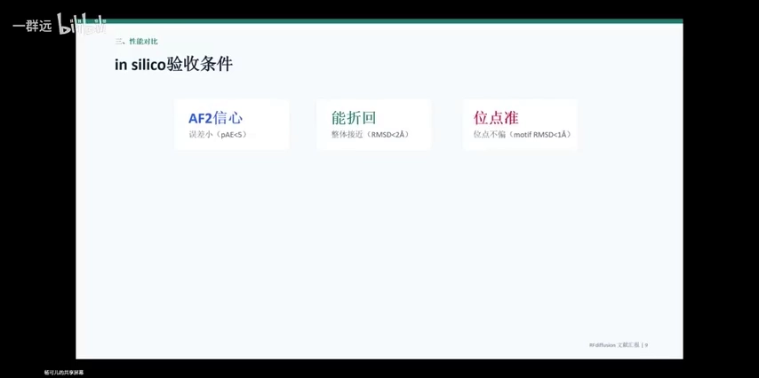

1. **AF2 信心（pAE < 5）**：把骨架喂给 ProteinMPNN 设计出序列，再把序列喂回 AlphaFold2 让它生成三维构型。**PAE 越小，说明 AlphaFold2 对自己生成的结构越有信心**（[【跳转到 36:24】](https://www.bilibili.com/video/BV12jgQ6UEo2/?t=2184)、[【跳转到 36:49】](https://www.bilibili.com/video/BV12jgQ6UEo2/?t=2209)）。
2. **能折回（scRMSD < 2Å）**：拿 AlphaFold2 折叠出的结构和 RFdiffusion 最初设计的骨架**逐个原子比对，误差小于 2Å**，说明整体确实挺像（[【跳转到 37:14】](https://www.bilibili.com/video/BV12jgQ6UEo2/?t=2234)、[【跳转到 37:39】](https://www.bilibili.com/video/BV12jgQ6UEo2/?t=2259)）。
3. **位点准（motif RMSD < 1Å）**：关键位点、最核心发挥功能的 motif，其原子间的距离误差**小于 1Å**，精度极高（[【跳转到 38:04】](https://www.bilibili.com/video/BV12jgQ6UEo2/?t=2284)、[【跳转到 38:29】](https://www.bilibili.com/video/BV12jgQ6UEo2/?t=2309)）。

这三个指标都以 AlphaFold2 作为**benchmark（对照组）**，也就是历史上在该任务上表现最佳的模型；比最佳还优秀，就说明模型进步了（[【跳转到 38:54】](https://www.bilibili.com/video/BV12jgQ6UEo2/?t=2334)）。

### 4.2 结果：更长、更复杂，同时 AF2 能折回

在**无条件单体生成**任务上，RFdiffusion 生成的结构覆盖了 alpha、beta 以及混合折叠，与已知 PDB 结构相似度低（说明不是简单记忆），且比 RF hallucination 在长链设计上成功率更高（[【跳转到 40:09】](https://www.bilibili.com/video/BV12jgQ6UEo2/?t=2409)、[【跳转到 40:34】](https://www.bilibili.com/video/BV12jgQ6UEo2/?t=2434)）。结论是：**它在更长的氨基酸序列、以及约束条件（condition）相对较少的情况下表现更优**；而以往模型在序列太长、限制太少时容易"幻想"出不合理的结构。

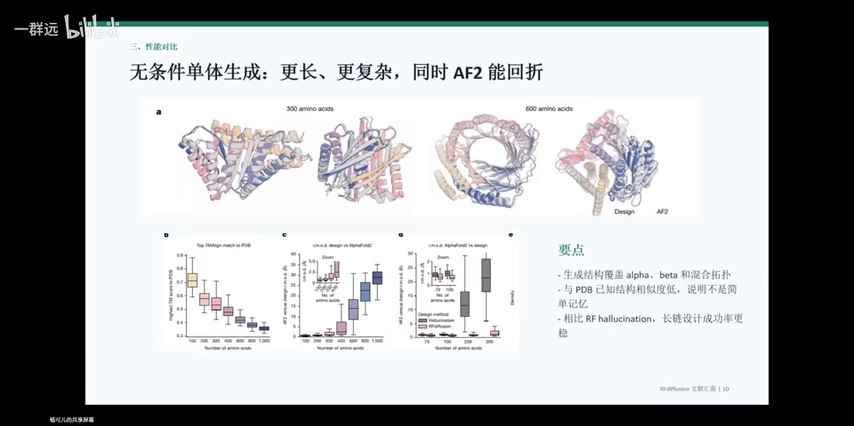

在 **motif scaffolding** 上差距更明显：**25 个任务中 RFdiffusion 解决了 23 个**，而 RFjoint inpainting 是 19/25，hallucination 是 15/25（[【跳转到 43:29】](https://www.bilibili.com/video/BV12jgQ6UEo2/?t=2609)、[【跳转到 43:54】](https://www.bilibili.com/video/BV12jgQ6UEo2/?t=2634)）。

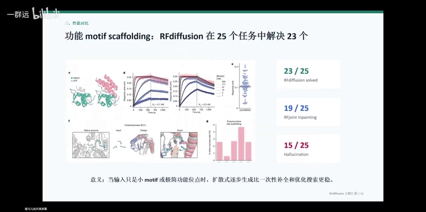

### 4.3 逐步生成为什么更稳

讲座解释了原因：**当输入是很小的 motif、或极简功能位点时，扩散式的逐步生成比优化搜索、一次性补全更稳**。因为像蒙特卡洛搜索、一次性补全这类思路，如果一开始就估计错了方向，后面就无法回头，只能沿着错的走；而扩散式是**一点一点逼近、一点一点优化**，不存在"先定全局再优化细节"的问题（[【跳转到 44:19】](https://www.bilibili.com/video/BV12jgQ6UEo2/?t=2659)、[【跳转到 44:44】](https://www.bilibili.com/video/BV12jgQ6UEo2/?t=2684)）。

回到雕塑比喻：**"剔除多余石膏"比"只能加不能减地捏造型"成功率更高**（[【跳转到 45:59】](https://www.bilibili.com/video/BV12jgQ6UEo2/?t=2759)）。

### 4.4 消融实验：成功不只靠 diffusion

论文还做了**消融实验（ablation）**——它和生物里的 knockout 实验类似，拿掉某个组件看结果是否变差（[【跳转到 40:59】](https://www.bilibili.com/video/BV12jgQ6UEo2/?t=2459)）。结论是：diffusion 架构确实是 RFdiffusion 表现好的原因，但**预训练权重、损失函数（MSE loss）的选择、以及 self-conditioning 同样重要**（[【跳转到 41:24】](https://www.bilibili.com/video/BV12jgQ6UEo2/?t=2484)、[【跳转到 41:49】](https://www.bilibili.com/video/BV12jgQ6UEo2/?t=2509)）。

作者真正想表达的是：AI for protein design 的进步**并非单纯"把 diffusion 用过来"**。团队此前在**蛋白质表征上的积淀、预训练和调参能力**才是更关键的因素——**如何结合生物学/生化的知识去精简高效地建模蛋白质，比模型本身更重要**（[【跳转到 42:14】](https://www.bilibili.com/video/BV12jgQ6UEo2/?t=2534)、[【跳转到 43:04】](https://www.bilibili.com/video/BV12jgQ6UEo2/?t=2584)）。

## 五、蛋白质设计仍待解决的问题

讲座最后把展望放在了"从功能出发到 protein backbone"的下游：理想状态是**完全 end-to-end——输入一个需求（某种疾病），模型直接输出一个合适的药物**，那样就可能实现个体化的精准医疗（[【跳转到 46:54】](https://www.bilibili.com/video/BV12jgQ6UEo2/?t=2814)、[【跳转到 47:19】](https://www.bilibili.com/video/BV12jgQ6UEo2/?t=2839)）。但显然，当前模型离这个程度还很远（[【跳转到 47:44】](https://www.bilibili.com/video/BV12jgQ6UEo2/?t=2864)）。具体有四类问题：

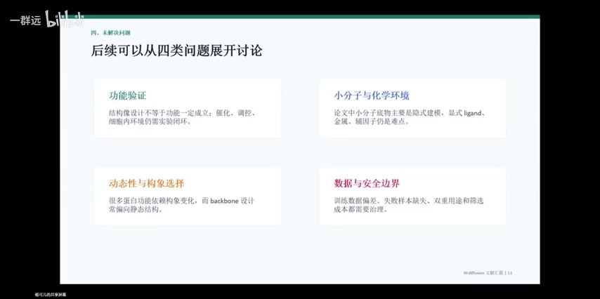

1. **功能验证**：全是干实验会显得不靠谱，还需要细胞内的实验来完成**闭环验证**（[【跳转到 48:00】](https://www.bilibili.com/video/BV12jgQ6UEo2/?t=2880)）。
2. **小分子与化学环境**：目前模型能表征的都是和氨基酸相关的"语言"，还**没有一种语言能把小分子、金属离子、各种辅因子和氨基酸放在一起互相理解**；而体内很多重要蛋白恰恰承担着结合金属离子、结合小分子的功能（[【跳转到 48:25】](https://www.bilibili.com/video/BV12jgQ6UEo2/?t=2905)、[【跳转到 48:50】](https://www.bilibili.com/video/BV12jgQ6UEo2/?t=2930)）。
3. **动态性与构象选择**：模型 embed 的都是**静止的蛋白质结构**，但生物体内蛋白质有构象变化，像离子通道的构象变化还极快。**动态是非常重要的事，但目前还没有能很好描述动态过程的方式**（[【跳转到 49:15】](https://www.bilibili.com/video/BV12jgQ6UEo2/?t=2955)、[【跳转到 50:05】](https://www.bilibili.com/video/BV12jgQ6UEo2/?t=3005)）。
4. **数据与安全边界**：蛋白质在体内往往处于**稳态/平衡**，有时需要它、有时不需要，有时要强、有时要弱。由于动态能力有限，想做到"离子通道想开就开、想关就关"这样的多重用途控制仍然很难，**体内安全性验证也无法仅靠 in silico 完成**（[【跳转到 50:05】](https://www.bilibili.com/video/BV12jgQ6UEo2/?t=3005)、[【跳转到 50:30】](https://www.bilibili.com/video/BV12jgQ6UEo2/?t=3030)）。

## 小结

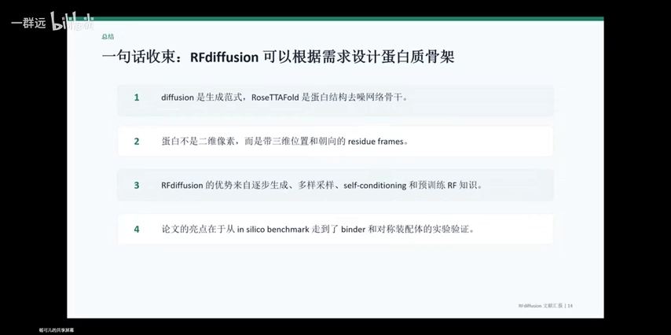

一句话收束：**RFdiffusion 就是一个"根据需求设计蛋白质骨架"的模型**。四点回顾（[【跳转到 51:20】](https://www.bilibili.com/video/BV12jgQ6UEo2/?t=3080)）：

1. **最好的架构往往来自跨界迁移**：diffusion 是一种**生成范式**（把生成看作加噪—去噪），它不代表某种神经网络结构；真正的网络骨干目前主要还是 transformer / 注意力机制。RoseTTAFold 的核心也是 transformer（[【跳转到 51:20】](https://www.bilibili.com/video/BV12jgQ6UEo2/?t=3080)、[【跳转到 51:45】](https://www.bilibili.com/video/BV12jgQ6UEo2/?t=3105)）。
2. **二维不等于三维**：蛋白不是二维像素，而是带位置与朝向的三维残基框架，因此表征和图像的去噪过程很不一样——这也是 Baker 团队攻克的核心难点（[【跳转到 52:10】](https://www.bilibili.com/video/BV12jgQ6UEo2/?t=3130)）。
3. **逐步生成 + self-conditioning + 预训练是优势来源**：分步生成不会"一开始就定错方向、全盘皆错"；每一步有逻辑关联、连续流畅，计算上也可能更有优势；再加上实验室在数据与模型权重上的积淀，使 RF 对蛋白质结构有非常好的编码（[【跳转到 52:35】](https://www.bilibili.com/video/BV12jgQ6UEo2/?t=3155)、[【跳转到 53:00】](https://www.bilibili.com/video/BV12jgQ6UEo2/?t=3180)）。
4. **对称设计是亮点并进入湿实验**：RFdiffusion 在设计对称蛋白上表现格外优秀，其骨架经 ProteinMPNN 填充序列后进入了**湿实验验证**。想象空间很大——比如做个"蛋白质笼"去固定二氧化碳，用途可能在医药健康乃至环境治理上都很有意义（[【跳转到 53:25】](https://www.bilibili.com/video/BV12jgQ6UEo2/?t=3205)、[【跳转到 53:50】](https://www.bilibili.com/video/BV12jgQ6UEo2/?t=3230)、[【跳转到 54:15】](https://www.bilibili.com/video/BV12jgQ6UEo2/?t=3255)）。

## 关键术语速查

| 术语 | 一句话解释 |
| --- | --- |
| diffusion（扩散模型） | 一种生成范式：先给真实数据逐步加噪，再训练模型学会反向一步步去噪，从而能从随机噪声生成新样本 |
| GAN（对抗式生成模型） | diffusion 之前的主流生成架构，用生成器与判别器对抗来产生逼真图像 |
| 时间步（timestep） | 加噪/去噪过程中的离散步骤，X0 是干净数据，XT 是纯噪声 |
| KL 散度 | 衡量两个概率分布差异的度量，diffusion 的目标就是最小化"模型答案"与"标准答案后验"的 KL 散度 |
| 表征（representation） | 把图像/蛋白质翻译成计算机可运算的数字或矩阵的方式 |
| 残基框架（residue frame） | 每个氨基酸残基用一个"位置 + 朝向"的刚体来表示 |
| SE(3) 等变 | 对三维空间的旋转与平移保持一致的变换特性，保证模型不因整体转动而改变结果 |
| SO(3) | 三维旋转群；残基朝向的旋转就发生在这个空间上 |
| backbone（骨架） | 蛋白质的二级/三级结构，只有主链形状，还不知道具体残基序列 |
| ProteinMPNN | 给定骨架、设计出具体氨基酸序列的逆折叠模型 |
| binder design | 给定靶蛋白/热点残基，设计能与之结合的蛋白质 |
| motif scaffolding | 固定一个实现核心功能的 motif，在其周围生成支撑用的骨架 |
| self-conditioning | 把上一时间步的预测输出再喂回作为下一步输入，使去噪过程连续 |
| in silico / 湿实验 | in silico 指纯计算（干实验）；湿实验指在细胞/试管里做真实验证 |
| pAE / RMSD | 结构置信度与原子位置偏差指标；pAE<5、scRMSD<2Å、motif RMSD<1Å 是常用的验收阈值 |
| SOTA / benchmark | SOTA 指当前最佳表现；benchmark 此处指用于对照的历史最佳模型 |
