# RoseTTAFold All-Atom：能建模 PDB 中所有分子的统一网络（论文精读）

> 本文整理自密歇根大学 MaomLab 的 Molecular ML Reading Group（2023-10-25）对论文 **《RoseTTAFold All-Atom》**（Krishna et al., 2023）的精读分享。主讲人是论文作者之一 **Rohith Krishna**（华盛顿大学 David Baker 实验室博士生）。他用约 50 分钟讲解了 RFAA 的动机、网络结构、损失函数、实验结果，以及与 RFdiffusion 结合后的蛋白质设计能力，并回答了现场提问。

## 本讲要解决的核心问题（SCQA）

**背景**：AlphaFold2 / RoseTTAFold 已经把“给一条氨基酸序列、预测出蛋白质 3D 结构”这件事做得非常成熟，它们对缺少辅助上下文（比如复合物里的其他链）也很鲁棒。

**冲突**：但 PDB 里远不止蛋白质——还有核酸、金属离子、小分子、共价修饰残基。AF2 / RF 对这些分子建模不足：它们往往不显式表示这些“额外原子”，因此**即使预测出了蛋白结构，也不知道这些辅因子是如何与蛋白相互作用的**。而在蛋白质设计里，这恰恰是刚需：要设计“结合某个小分子的蛋白”，就必须知道小分子长什么样。

**疑问**：能否设计一个**统一的神经网络架构**，显式地建模 PDB 中的**所有分子**，并且既服务于结构预测、又服务于骨架生成？

**回答（中心思想）**：能。**RoseTTAFold All-Atom（RFAA）** 在 RoseTTAFold2 的三轨架构上扩展，加入原子级 token、键几何、手性编码与“原子化（atomization）”数据增强，并改造损失函数使其适用于任意小分子；它用**一个模型**同时预测蛋白、核酸、金属、小分子与共价修饰。把它微调后得到的 **RFdiffusionAA**，还能在指定小分子的条件下**从头扩散生成结合蛋白**，且设计能量更低、与 AlphaFold 更一致、结构新颖且自洽。

---

## 一、背景：结构预测与骨架生成，是一对“共享特性”的任务

**结论先行**：结构预测与骨架生成看似两个任务，但它们对模型的要求高度重叠（SE(3) 等变、显式坐标、对相互作用的理解、多输入多输出），所以一个为结构预测打磨好的架构，可以顺势迁移到设计。

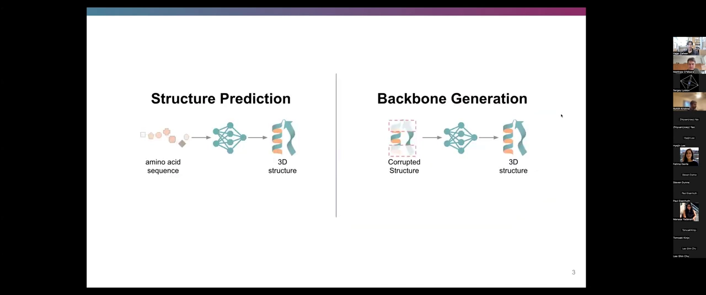

两个任务的定义（[【跳转到 01:04】](https://www.youtube.com/watch?v=PARZP6GWJ0w&t=64)）：

- **结构预测**：输入一条氨基酸序列 → 输出 3D 结构。
- **骨架生成（蛋白质设计）**：输入一个“被破坏的结构”——完全破坏（无先验）或部分破坏（保留 motif / 特权信息）→ 重建 3D 结构。

**深度学习为何有效**（[【跳转到 01:53】](https://www.youtube.com/watch?v=PARZP6GWJ0w&t=113)）：Rohith 认为关键靠两件事，都是 AlphaFold2 引入的——一是**问题域专用的归纳偏置**（例如 pair 表征被第三个节点偏置，从而在“三元组”上做注意力，强制满足距离的三角不等式）；二是**数据增强**（生物结构数据远少于图像/文本，必须想办法扩充训练集）。

**为什么现有模型还不够**（[【跳转到 02:48】](https://www.youtube.com/watch?v=PARZP6GWJ0w&t=168)、[【跳转到 03:22】](https://www.youtube.com/watch?v=PARZP6GWJ0w&t=202)）：PDB 里的蛋白质结构预测其实是一个 **underspecified（欠约束）** 问题——真实的生物系统里有大量蛋白多聚体、蛋白-核酸复合物、蛋白-小分子复合物。AF2 / RF 对“缺少完整上下文”很鲁棒，甚至不知道复合物里其他两条链也能预测得很准。但代价是：**你不知道那些辅助分子是怎样和你的预测结构相互作用的**。于是很多人尝试从 AlphaFold 数据库里“加料”（比如补上翻译后修饰或配体），但一直没有一个被充分解决的统一方案。

### 1.1 动机一：用一个架构建模 PDB 里的所有分子

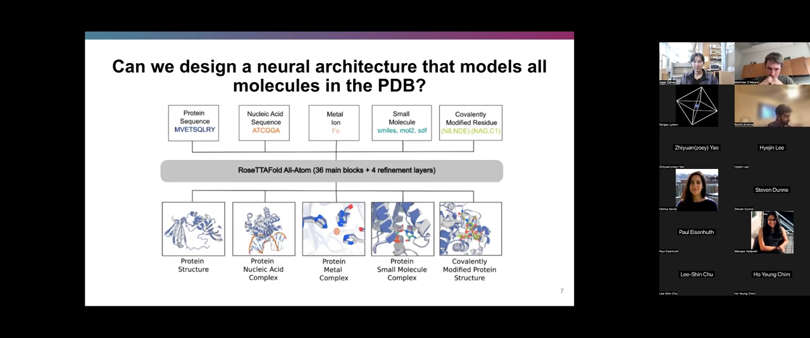

（[【跳转到 04:12】](https://www.youtube.com/watch?v=PARZP6GWJ0w&t=252)）PDB 里，蛋白质我们已经预测得很好，但还有**核酸、金属、小分子、共价修饰蛋白**。RFAA 的目标是：连同损失函数和训练数据一起，设计一个能把这些**全部**统一建模的架构。

### 1.2 动机二：蛋白质设计必须“指定配体”

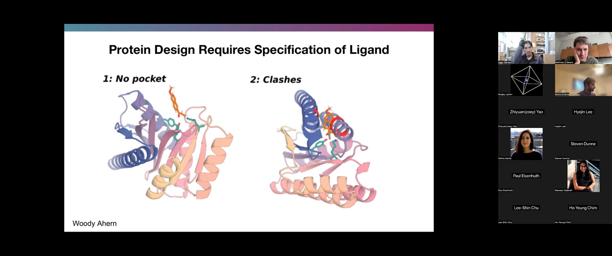

（[【跳转到 05:02】](https://www.youtube.com/watch?v=PARZP6GWJ0w&t=302)）共同作者 Woody Ahern 之前的工作发现：**如果不知道小分子，就让 RFdiffusion 去设计小分子结合蛋白，会出现很多病态问题**——

- **没有口袋**：设计出的蛋白对小分子没有好的形状互补性。
- **产生冲突（更严重）**：主链恰好会**挡住小分子本该占据的位置**。

所以，要设计配体结合蛋白（如小分子酶设计、诊断、乃至人工光系统“特殊对”中的两个叶绿素协同），就必须让模型“知道”配体。这正是深度学习方法此前**未能像蛋白质那样深刻影响**的领域（[【跳转到 05:52】](https://www.youtube.com/watch?v=PARZP6GWJ0w&t=352)）。

### 1.3 两个任务的共享特性

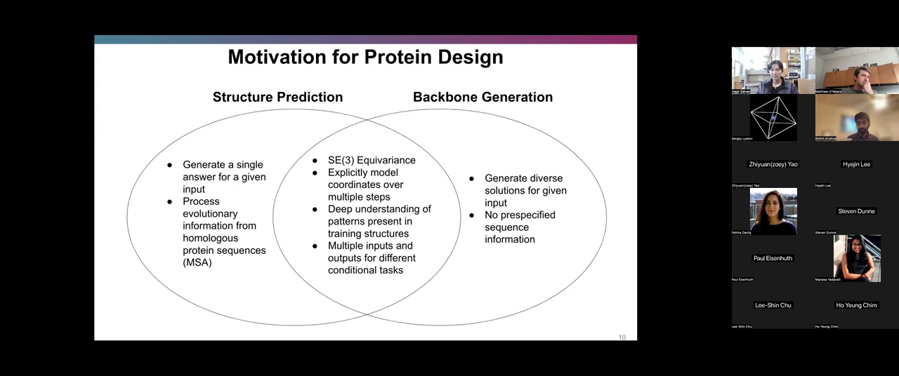

（[【跳转到 06:42】](https://www.youtube.com/watch?v=PARZP6GWJ0w&t=402)、[【跳转到 07:32】](https://www.youtube.com/watch?v=PARZP6GWJ0w&t=452)）两者共同需要：

- **SE(3) 等变性**：输入结构旋转，输出更新也应随之旋转。
- **显式建模坐标**：模型内部要有关于“额外原子”到底在哪的表示。
- **对相互作用的理解**：比如极性相互作用、形状互补。
- **多输入多输出**：支持条件任务——既能把蛋白完全破坏生成全新骨架，也能“给定一个 motif 或小分子”去做条件设计。

而 RFdiffusion 这类设计/骨架生成模型，本身就是从结构预测权重**微调**而来，因此“结构预测架构”的改进能立刻迁移到设计。

---

## 二、从 RoseTTAFold2 出发：一个纯三轨模型

**结论先行**：RFAA 的骨架是 RoseTTAFold2（RF2，Minkyung Baek & Frank DiMaio）——它用 **1D / 2D / 3D 三条轨道**反复迭代、逐步精修结构，3D 轨道用 SE(3)-Transformer 保证等变。

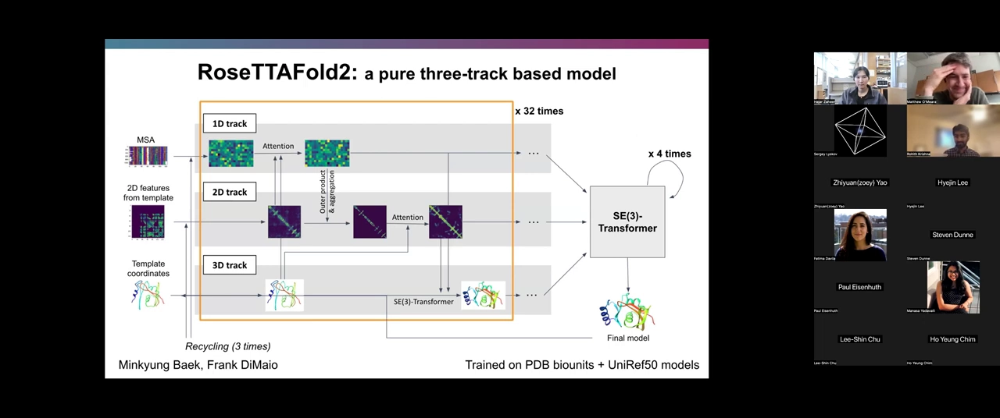

（[【跳转到 11:17】](https://www.youtube.com/watch?v=PARZP6GWJ0w&t=677)）

- **1D 轨道**：处理多序列比对（MSA），做行/列注意力。
- **2D 轨道**：表示两两距离与角度等 pair 信息。
- **3D 轨道**：用 **SE(3)-Transformer** 更新坐标；它基于 tensor field networks，用球谐函数约束滤波器的函数形式，通过张量积把标量（L=0）与矢量（L=1）特征混合，同时保持等变（[【跳转到 21:17】](https://www.youtube.com/watch?v=PARZP6GWJ0w&t=1277)）。
- 在 RF2 里有 32 个 block（RFAA 更多一些），**每个 block 都产出一个新结构**，上一步预测的结构作为下一步的输入，相当于**迭代精修**（[【跳转到 12:32】](https://www.youtube.com/watch?v=PARZP6GWJ0w&t=752)）。

> 有趣的细节：Rohith 提到，3D 轨道里还可以把“伪力”当作 L=1 特征喂给网络——先构造伪能量项，再对预测坐标求导得到梯度方向。直觉上，如果某个手性中心落在分子错误的一侧，能量会很差、梯度会把原子推向正确方向（[【跳转到 22:07】](https://www.youtube.com/watch?v=PARZP6GWJ0w&t=1327)）。实现上他们很“偷懒”，直接用 **autograd** 求导，效果就不错。

---

## 三、为“原子/小分子”做的关键改造

**结论先行**：要把 RF2 改造成能处理任意分子，需要四件事——**新增原子 token、提供键几何、改造损失函数、以及把手性作为输入**。

（[【跳转到 13:22】](https://www.youtube.com/watch?v=PARZP6GWJ0w&t=802)）

1. **1D 轨道新增 token**：让 1D 表示能区分不同原子。
2. **键几何**：蛋白质里残基是线性编码的（残基 1 连残基 2，可用相对偏移描述）；但小分子里原子 1 可能连到原子 9，所以必须**显式提供成键关系**。
3. **小分子适用的损失**：RF/AF 的损失依赖每个残基都有的 **N-Cα-C 局部坐标框架**，而任意分子没有这种规范框架。
4. **手性输入**：1D/2D 表示对**手性是不变的**（距离在两种手性下相同），因此手性必须通过 **3D 特征**偏置进去。

### 3.1 训练数据整理

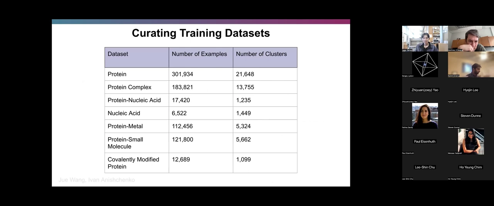

（[【跳转到 15:02】](https://www.youtube.com/watch?v=PARZP6GWJ0w&t=902)）他们遍历 PDB，按序列聚类构建训练集，覆盖蛋白、蛋白复合物、蛋白-核酸、核酸、蛋白-金属、蛋白-小分子、共价修饰蛋白等类别（图为其规模统计，也在论文补充材料里）。一个难点是：共价修饰既可能表现为“共价键连到蛋白”，也可能是“小分子与蛋白成键”，都要处理。

### 3.2 小分子数据太少？用 CSD 做正则化

（[【跳转到 16:17】](https://www.youtube.com/watch?v=PARZP6GWJ0w&t=977)）PDB 里约 **81,000** 个小分子，即使用很宽松的 Tanimoto 相似度（0.8）聚类，簇也很少——典型的**数据受限**。所以他们引入 **剑桥结构数据库（CSD）** 里的小分子晶体结构来扩充。预期收益有限，真正的目的是**避免对“只出现在 PDB 里的分子特征”过拟合**。

> 现场提问（[【跳转到 17:07】](https://www.youtube.com/watch?v=PARZP6GWJ0w&t=1027)）：为什么不用现成的 PDBbind / BioLiP？Rohith 答：很多情况下确实用它们做过滤，但自己处理能获得更**统一的数据流程**，且 PDBbind / BioLiP 有时会丢失生物组装体、跨分子的共价键等信息。至于数据集是否公开（[【跳转到 17:57】](https://www.youtube.com/watch?v=PARZP6GWJ0w&t=1077)），他说“其实没什么可发布的，就是从 PDB 下载 CIF 文件”，但他本人倾向于**更开放**，可以考虑公开序列聚类或处理脚本。

### 3.3 特征化与手性编码

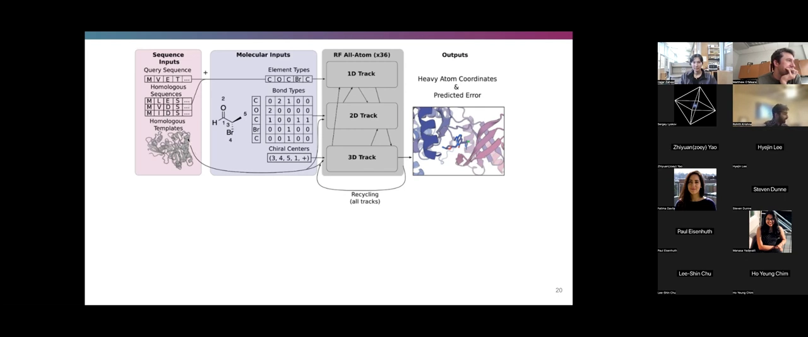

（[【跳转到 19:37】](https://www.youtube.com/watch?v=PARZP6GWJ0w&t=1177)、[【跳转到 20:02】](https://www.youtube.com/watch?v=PARZP6GWJ0w&t=1202)）输入由两部分相加：**序列输入**（查询序列、同源序列/ MSA、同源模板）+ **分子输入**（元素类型、键类型（单键/双键/芳香键等）、手性中心）。然后进入 1D/2D/3D 三轨，输出**重原子坐标与预测误差**，并带 recycling。

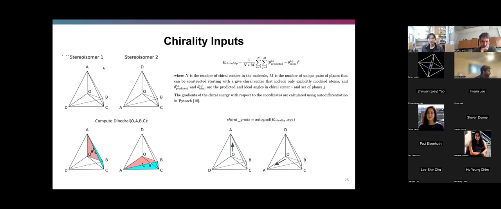

手性怎么编码？（[【跳转到 22:57】](https://www.youtube.com/watch?v=PARZP6GWJ0w&t=1377)、[【跳转到 23:47】](https://www.youtube.com/watch?v=PARZP6GWJ0w&t=1427)）传统上手性是**离散**的（要么 R 要么 S），但离散量难以求导。他们把手性放进**连续空间**：计算二面角，与“理想正四面体”的夹角比较，构造一个手性能量项，再用 **autograd** 求梯度，得到 L=1（矢量）特征去“推”原子。

> 现场讨论：有人问这是否就是为了把离散手性变成连续、可微，以便做梯度更新？Rohith 确认——而且这样网络**不必去学习“人类是如何定义手性”的**，而是用更几何化的描述，更符合网络的口味。

### 3.4 Atomization：把残基“降维”成原子，顺便解决共价修饰

**结论先行**：**Atomization（原子化）** 是一种巧妙的数据增强——随机取蛋白片段，把它当作“原子”来特征化（只保留元素类型、键类型、手性），从而让模型在处理“共价修饰残基”时能显式画出那个共价键。

（[【跳转到 25:02】](https://www.youtube.com/watch?v=PARZP6GWJ0w&t=1502)）思路来自“蛋白内部相互作用与蛋白-小分子相互作用具有相似性”。做原子化时，去掉 MSA 和模板信息，只保留元素类型、键类型、手性，然后采样。

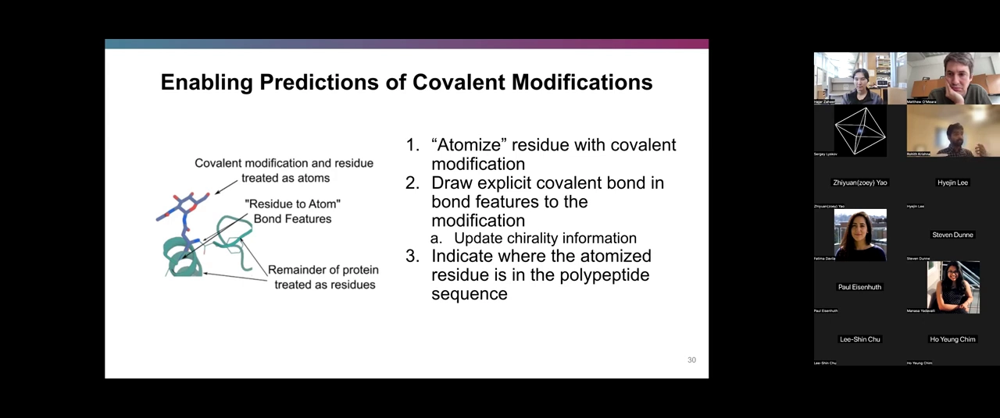

这为什么重要？（[【跳转到 25:55】](https://www.youtube.com/watch?v=PARZP6GWJ0w&t=1555)）在 AF / RF 类模型里，**只有主链被显式表示，侧链用内部角度表示**，所以很难区分侧链上的两个原子——当一个残基与小分子成键时，你**不知道是侧链上的哪个原子在成键**。原子化之后，就能在键特征里**显式画出**“修饰残基上的原子 ↔ 修饰基团”的共价键（同时更新手性信息），并额外用一个“主链键”特征与位置编码，告诉网络这个原子化残基在序列中的位置。

> 现场有人提出一个有意思的设想（[【跳转到 28:00】](https://www.youtube.com/watch?v=PARZP6GWJ0w&t=1680)）：既然有 1D/2D/3D 三条轨，能不能再加**第四条轨**，让残基级表示与原子级表示相互对齐、做自洽性/自监督目标？Rohith 觉得“非常有意思”，但坦承他们**还没探索过**。

---

## 四、损失函数：把 FAPE 搬到小分子上

**结论先行**：RFAA 沿用 AlphaFold 的 **Frame Aligned Point Error（FAPE）**，但因为它依赖 N-Cα-C 框架，作者为任意小分子设计了一套**确定性的局域框架**规则。

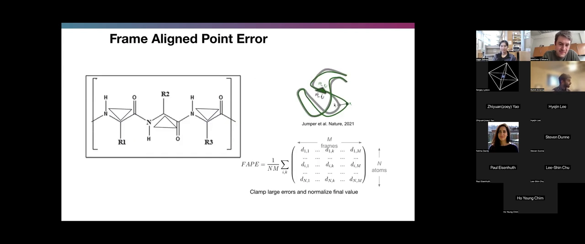

FAPE 的好处（[【跳转到 33:00】](https://www.youtube.com/watch?v=PARZP6GWJ0w&t=1980)）：既给网络**强的成对梯度**，又能**强制分子手性**。做法是对每个 N-Cα-C 三角形做对齐，再算其余原子相对该对齐的误差（并对大误差做 clamp、对最终值归一化）。

小分子没有 N-Cα-C 框架怎么办？（[【跳转到 33:50】](https://www.youtube.com/watch?v=PARZP6GWJ0w&t=2030)）一种想法是**随机采样**一个三键连接的框架，但他们担心这样同一个小分子的预测会因框架选择不同而得到不同 loss、不够稳定。于是他们改为**尽量确定性地**根据键几何为每个原子选一个“规范框架”，再套用与 AlphaFold 几乎一样的 FAPE（[【跳转到 34:40】](https://www.youtube.com/watch?v=PARZP6GWJ0w&t=2080)）。唯一区别是要为每个框架单独收集坐标，因为它们不在 N-Cα-C 位置。

---

## 五、实验结果

**结论先行**：RFAA 在加装新能力的同时**没有牺牲原有性能**，对小分子复合物有不错的泛化，并且微调后的 RFdiffusionAA 能显著改善配体结合蛋白的设计质量。

- **单体结构预测不退化**（[【跳转到 37:44】](https://www.youtube.com/watch?v=PARZP6GWJ0w&t=2264)）：在 CASP14 靶标上，RFAA 的精度与 AlphaFold2、RoseTTAFold2 非常接近——做“网络手术”后没有把原本擅长的事搞砸。
- **泛化分析**（[【跳转到 38:09】](https://www.youtube.com/watch?v=PARZP6GWJ0w&t=2289)、[【跳转到 38:34】](https://www.youtube.com/watch?v=PARZP6GWJ0w&t=2314)）：Rohith 用两个维度衡量难度——**序列同源性**（<30% 相似度算“负例”）与**配体相似度**（Tanimoto < 0.5，即 Morgan 指纹重叠 bit 少于 50%）。训练集内的样本确实做得更好，但训练集外的样本也有**相当一部分**能准确预测。

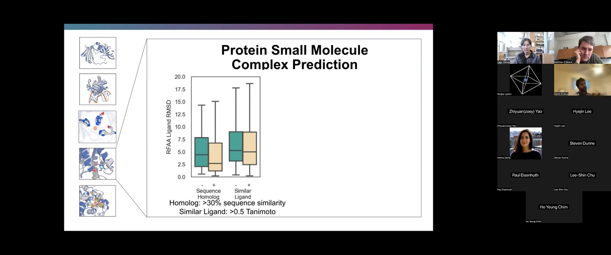

- **准确率与物理能相关**（[【跳转到 39:24】](https://www.youtube.com/watch?v=PARZP6GWJ0w&t=2364)）：一个很有意思的发现是——RFAA 预测小分子复合物的准确率，与 **Rosetta 计算出的结合能**（“结合得有多紧”）**正相关**。虽然模型与物理模拟路径不同，但准确率确实与某种“传统物理理解”相呼应，也解释了它为何能在训练集外的案例上预测准确。
- **共价修饰 / 糖基**（[【跳转到 40:14】](https://www.youtube.com/watch?v=PARZP6GWJ0w&t=2414)、[【跳转到 40:39】](https://www.youtube.com/watch?v=PARZP6GWJ0w&t=2439)）：做了与泛化类似的分析；离训练序列越远结构越不准，但仍有相当比例预测良好。作者也坦承展示的是**精挑细选（cherry-picked）**的例子，论文里有更多讨论。

### 5.1 微调成 RFdiffusionAA：指定小分子做从头设计

（[【跳转到 41:29】](https://www.youtube.com/watch?v=PARZP6GWJ0w&t=2489)、[【跳转到 41:54】](https://www.youtube.com/watch?v=PARZP6GWJ0w&t=2514)）在结构预测权重基础上，用扩散的方式（对 Cα 坐标加高斯噪声、对旋转框架做布朗运动，直到完全破坏，再让网络学会去噪）把它微调成 **RFdiffusionAA**。这段工作主要由 Woody Ahern 完成。

在一个示例中，**小分子作为输入 motif（未被破坏的部分）**，蛋白的残基与 Cα 坐标全部被破坏，模型便能**围绕小分子扩散出结合蛋白**。

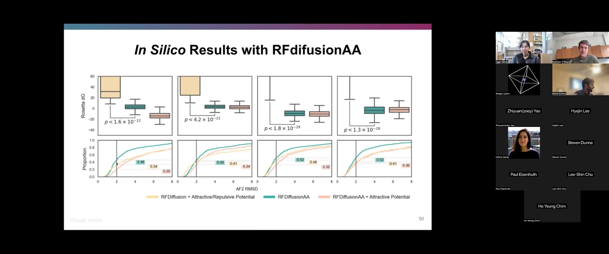

（[【跳转到 42:57】](https://www.youtube.com/watch?v=PARZP6GWJ0w&t=2577)）基准结果显示：

- **能量更低、更物理**：用普通 RFdiffusion 做这件事会产生很多不真实、不物理的相互作用；换成 RFAA 后，**Rosetta 能量更低、与 AlphaFold 的一致性更高**。
- **结构新颖**：把这些设计对训练集算 TM-score，发现它们与训练集中**哪怕含有相同配体**的结构也差异很大——不是简单“背下”了某些常见结合模式（[【跳转到 43:22】](https://www.youtube.com/watch?v=PARZP6GWJ0w&t=2602)）。
- **自洽**：人们常担心“新颖”的结构其实不自洽/不真实；这里自洽结构的分布与其他结构**完全一致**（[【跳转到 43:47】](https://www.youtube.com/watch?v=PARZP6GWJ0w&t=2627)）。
- **应用**（[【跳转到 44:37】](https://www.youtube.com/watch?v=PARZP6GWJ0w&t=2677)）：有人把这类模型带进实验室设计了不少东西；还能设计出**吸收光谱与自然界不同**的蛋白，有望**扩展光合作用可利用的波长范围**。

---

## 六、Q&A 要点

### 6.1 翻译后修饰（PTM）到底怎么处理？为什么不用预定义训练集？

（[【跳转到 30:30】](https://www.youtube.com/watch?v=PARZP6GWJ0w&t=1830)、[【跳转到 32:10】](https://www.youtube.com/watch?v=PARZP6GWJ0w&t=1930)）现场问：磷酸化、乙酰化这类常见修饰，是否作为特殊测试用例单独处理？

Rohith 解释，PDB 里“共价修饰”有两种表示：

1. 序列里就是一个**不同的残基**，比如磷酸化得到磷酸酪氨酸、或硒代甲硫氨酸等；
2. 一个**小分子**与某个残基形成共价键。

两种都会训练。就磷酸化而言，建模难点更多在于**它如何改变主链结构**，而非磷酸基本身建得多好；论文的评估主要针对“小分子通过共价键连接”这一类。对于“非共价连接配体”的修饰氨基酸，处理是**随机采样**的：

- **约 75%** 的情况下当作原子处理；
- **约 25%** 的情况下“规范化”为经典残基。

他也强调这块**还没花时间优化**，可能有更好的做法。

### 6.2 表征自洽能不能作为“第四条轨”？

（[【跳转到 28:00】](https://www.youtube.com/watch?v=PARZP6GWJ0w&t=1680)）如第三节所述，Rohith 认为这是个非常有意思的方向，让残基级/原子级表示相互对齐、保持几何一致，但目前尚未探索。

### 6.3 没提供某种表示时，网络拿到的是什么输入？

（[【跳转到 35:55】](https://www.youtube.com/watch?v=PARZP6GWJ0w&t=2155)、[【跳转到 36:20】](https://www.youtube.com/watch?v=PARZP6GWJ0w&t=2180)）答：坐标在初始时**统一初始化为原点**，网络本身就“不提供坐标”；对于被原子化的片段，只提供**元素类型、键类型、手性中心**，不提供 MSA 或模板信息。例如一段甘氨酸会被表示成氮、碳、碳、氧以及它们之间的成键方式。

### 6.4 能否用“势（potentials）”引导扩散？

（[【跳转到 46:06】](https://www.youtube.com/watch?v=PARZP6GWJ0w&t=2766)、[【跳转到 46:16】](https://www.youtube.com/watch?v=PARZP6GWJ0w&t=2776)）可以，且是在**采样阶段**做。思路与前面的手性特征类似：对某个启发式量求梯度，在扩散的每一步，除了按模型的方向去噪，还**额外朝启发式“希望”的方向推动噪声**。这样往往能让采样结果**更符合蛋白质设计者的直觉**。

### 6.5 计算开销相比 RFdiffusion 如何？

（[【跳转到 48:17】](https://www.youtube.com/watch?v=PARZP6GWJ0w&t=2897)）RFdiffusion All-Atom 从结构预测权重出发，**训练开销大致相同**；推理**略慢一点**（参数更多），但**不是数量级的慢**；显存占用大致相当，并随输入长度变化。

### 6.6 SE(3) 归纳偏置是否必要？

（[【跳转到 49:07】](https://www.youtube.com/watch?v=PARZP6GWJ0w&t=2947)）有观众问：SE(3) 等变是很重的归纳偏置，它在 Transformer 之上加了很多额外结构，性能提升显著吗？Rohith 回答：他**个人没有专门探索**过。而且扩散流程是从结构预测权重出发，所以**必须沿用结构预测的架构**，也就无法单独替换掉 SE(3) 那一块来对比。

---

## 小结

- **问题**：AF2 / RF 只擅长“蛋白质本体”，对 PDB 里的核酸、金属、小分子、共价修饰建模不足，导致**不知道辅因子如何与蛋白相互作用**；而蛋白质设计（尤其配体结合蛋白、酶）又**必须指定配体**。
- **方案**：**RoseTTAFold All-Atom（RFAA）**——在 RoseTTAFold2 三轨架构上扩展，用**一个模型**统一建模 PDB 中所有分子。
- **关键改造**：1D 轨道加原子 token；显式**键几何**；**手性**用连续、可微的几何描述经 autograd 注入 3D 特征；**atomization** 数据增强让共价修饰可显式建键；为任意小分子设计**确定性局域框架**以套用 FAPE。
- **数据**：PDB 全库整理 + 用 **CSD** 扩充小分子以抗过拟合。
- **结果**：单体预测（CASP14）不退化；小分子复合物在序列/配体都陌生时仍有不错泛化；准确率与 **Rosetta 结合能正相关**。
- **设计**：微调得到 **RFdiffusionAA**，可在指定小分子下从头生成结合蛋白，**能量更低、AF 一致性更高、结构新颖且自洽**。
- **开放问题**：数据集与代码的开放程度、PTM 的规范处理、残基/原子表征的自洽“第四轨”、以及 SE(3) 偏置的必要性，都还有探索空间。

## 关键术语速查

| 术语 | 一句话解释 |
| --- | --- |
| RoseTTAFold All-Atom（RFAA） | 在 RoseTTAFold2 基础上扩展、能统一建模蛋白/核酸/金属/小分子/共价修饰的模型 |
| RFdiffusionAA | 从 RFAA 微调得到的扩散模型，可在指定小分子条件下生成结合蛋白 |
| 结构预测 vs 骨架生成 | 前者“序列→结构”，后者“被破坏的结构→重建结构”（蛋白质设计） |
| 三轨架构（1D/2D/3D track） | RF2 的三组表征：MSA、pair 距离/角度、3D 坐标，迭代相互偏置 |
| SE(3) 等变 | 输入旋转/平移时，网络的坐标更新也按同样方式变换 |
| SE(3)-Transformer | 3D 轨道的核心模块，基于 tensor field networks，用球谐函数保持等变 |
| 归纳偏置（inductive bias） | 针对问题域预置的结构性假设，如 pair 注意力强制三角不等式 |
| MSA（多序列比对） | 同源序列的比对，提供进化信息 |
| underspecified（欠约束） | PDB 中大量结构缺少完整上下文，同一序列可有多种解读 |
| 配体（ligand） | 与蛋白结合的非蛋白分子（小分子、金属、糖基等） |
| 手性（chirality）/手性中心 | 分子“左右手”不可重叠的性质；RFAA 把它连续化以便求导 |
| atomization（原子化） | 把蛋白片段当作“原子”特征化，用于数据增强并支持共价修饰建模 |
| 共价修饰 | 与残基形成共价键的基团（如磷酸化、糖基化） |
| FAPE | Frame Aligned Point Error，AlphaFold 的损失；给强成对梯度并强制手性 |
| N-Cα-C 框架 | 每个残基的局部坐标框架，FAPE 的基础；小分子无此框架，需自建 |
| Rosetta energy | Rosetta 的物理打分能量，与 RFAA 预测准确率正相关 |
| 势引导扩散（potentials） | 在扩散采样时用启发式的梯度额外“推动”噪声，引导生成 |
| TM-score | 衡量两个结构相似度的指标，越小越“新颖” |
| MSA 之外的序列同源性 | 本节用 30% 相似度区分“同源/非同源” |
| Tanimoto / Morgan 指纹 | 衡量小分子相似度的指标，本节用 0.5 阈值区分“相似配体” |
