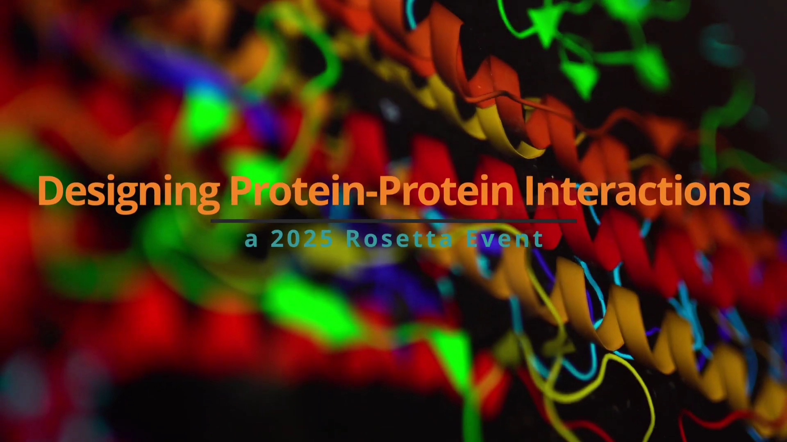
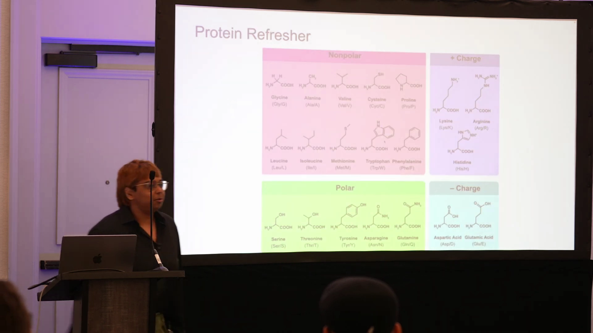
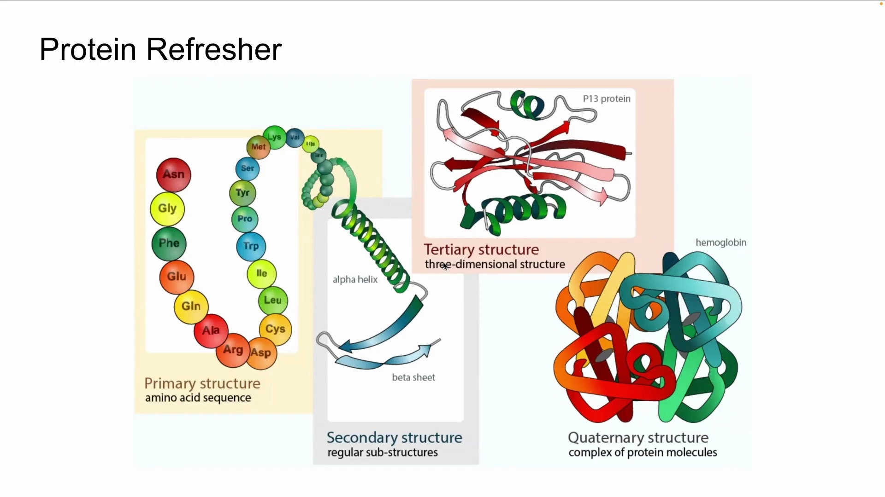
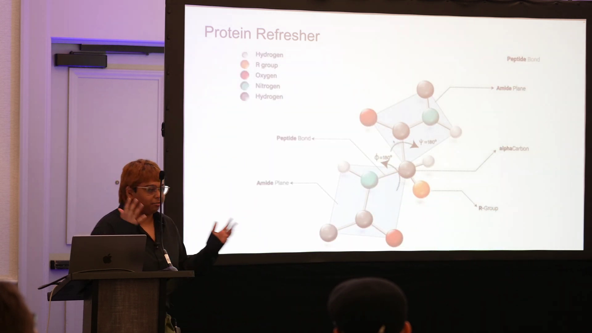
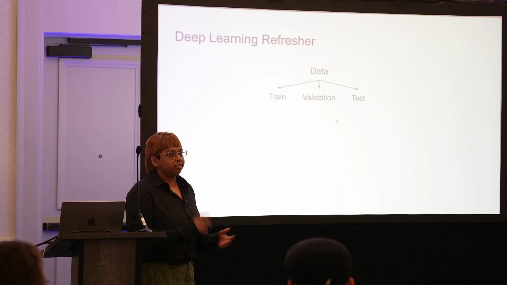
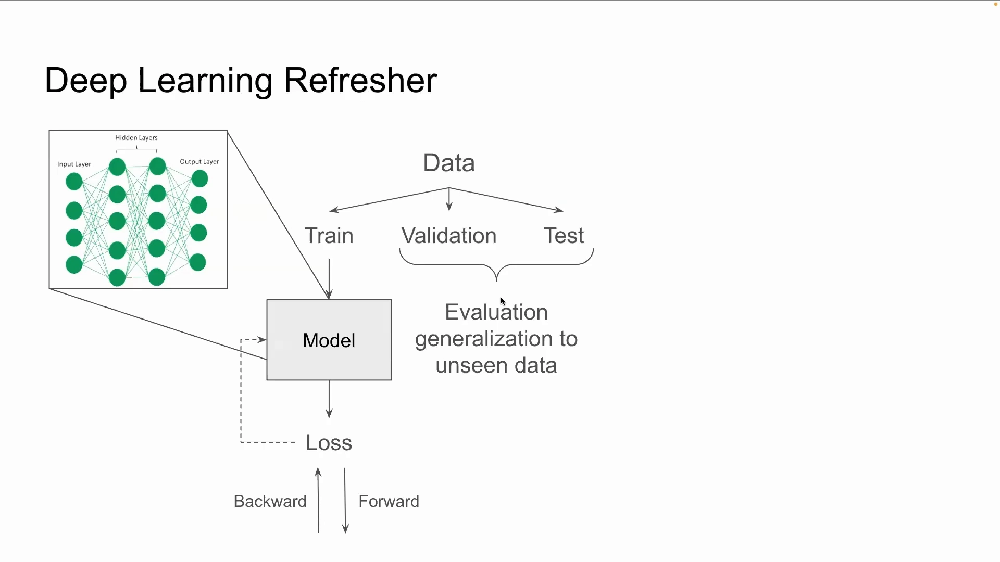

# 第01讲：PPI 工作坊总览——先补齐蛋白质与深度学习两块地基

## 本讲要解决的核心问题（SCQA）

**背景**：蛋白质是生命活动的执行分子，而**蛋白质之间的相互作用（Protein–Protein Interaction，PPI）**决定了许多关键生物学功能。近年来，以 AlphaFold、RFdiffusion、ProteinMPNN 为代表的方法，让"从头设计蛋白质"从设想变成了常规操作。

**冲突**：要真正上手"设计蛋白质-蛋白质相互作用"，同时需要两套背景知识——**蛋白质结构的基础概念**（氨基酸、肽键、二级/三级/四级结构）和**深度学习的基本工作方式**（数据划分、损失函数、训练与测试）。但参加这场 2025 年 Rosetta 工作坊的学员来自不同背景，未必两者都熟悉。

**疑问**：这场工作坊到底要做什么？在动手之前，我们又该先补齐哪些基础？

**回答（中心思想）**：这是一节总览课，它用一次快速的**"蛋白质复习 + 深度学习复习"**把不同背景的学员拉到同一起跑线，并点明整场工作坊的主线——**动手为主**：后面大家将以团队为单位，逐步走完"扩散生成骨架 → MPNN 设计序列 → AlphaFold 预测验证 → Rosetta 打分"的完整 PPI 设计流程。

本讲由 Amrita Nallathambi（北卡罗来纳大学教堂山分校，Kuhlman 实验室）主讲。

---

## 一、这是一场以动手为主的工作坊，而不是讲座

Amrita 一上来就说明了节奏安排：讲座式内容只是为了**热身**，让在座的新学员先跟上几个基础概念；真正的重头戏在**动手活动**。

- 讲完这些铺垫后，**当天下午和次日大部分时间**都是各团队一起做活动；
- 临近中午时会介绍一个**期末项目**，随后把学员**分成小组**（后续时间线见 [0:10](https://www.youtube.com/watch?v=xMUvH57aOHk&t=10) 与 [0:31](https://www.youtube.com/watch?v=xMUvH57aOHk&t=31)）。

> 读到这可以建立一个预期：这一讲讲的是"地图"和"通用语言"，具体的操作与工具会在后续讲次和活动里展开。

---

## 二、蛋白质复习之一：氨基酸是构成蛋白质的"字母表"

**结论先行**：蛋白质由氨基酸组成，而按侧链性质，20 种氨基酸可归为**四大类**——非极性、极性、带正电、带负电；它们之间能以多种方式相互作用（[0:49](https://www.youtube.com/watch?v=xMUvH57aOHk&t=49)）。

为什么先讲这个？因为在 PPI 设计里，"这个界面稳不稳、能不能结合"最终都要落到**残基之间的相互作用**上：疏水（非极性）残基倾向于埋藏在界面内部，极性残基能形成氢键，带正/负电的残基之间则可能形成盐桥。记住这四类，后面理解打分函数、设计规则就顺理成章了。

---

## 三、蛋白质复习之二：从肽键、键角到四级结构

**结论先行**：氨基酸靠**肽键**连成链，链上存在刚性的"原子平面"，并且只有特定范围的**键角和键长**是允许的——设计蛋白质时必须遵守这些几何规则（[1:15](https://www.youtube.com/watch?v=xMUvH57aOHk&t=75)）。

讲清三件事：

1. **是什么**：相邻氨基酸通过**肽键**相连，每个氨基酸周围有原子所在的平面（肽平面）；主链上有两个可旋转的二面角 φ（phi）和 ψ（psi），它们决定了主链的构象。
2. **为什么需要**：查看或设计蛋白质结构时，要确保模型没有违反这些"物理常识"。如果扭转角和键长不合理，预测出来的结构很可能不真实。
3. **怎么做**：把允许的键角、键长当作约束来对待——这也是后面 Rosetta 打分函数要检查的内容之一。

结构是有层次的（[1:55](https://www.youtube.com/watch?v=xMUvH57aOHk&t=115)）：

- **一级结构**：氨基酸序列（一串字母）；
- **二级结构**：局部的规则结构，如 **α 螺旋、β 折叠、环（loop）**；
- **三级结构**：二级结构进一步折叠成的三维整体；
- **四级结构**：多个结构域/亚基**组合**而成的复合物（这正是 PPI 关注的层面）。

---

## 四、深度学习复习之一：数据是模型的核心

**结论先行**：训练深度学习模型，**数据是绝对的核心**；标准做法是把数据划分为**训练集、验证集、测试集**三个互不重叠的集合（[2:25](https://www.youtube.com/watch?v=xMUvH57aOHk&t=145)）。

三个集合各司其职：

| 数据集 | 用途 | 类比 |
| --- | --- | --- |
| **训练集**（Train） | 真正用来训练模型、更新参数 | 上课做练习 |
| **验证集**（Validation） | 训练过程中反复评估，用于调参/早停 | 平时的小测验 |
| **测试集**（Test） | 训练全部结束后用一次，检验泛化能力 | 期末大考 |

Amrita 提到一种常见比例是 **80/10/10**，也还有其他划分方式。这里的关键词是**泛化（generalization）**：模型最终要在"**从未见过**的数据"上表现好，才算真的学会了规律，而不是把训练集背下来。

---

## 五、深度学习复习之二：损失函数、层堆叠与泛化

**结论先行**：模型训练的本质，是用**损失函数**衡量"预测与真实答案的差距"，再设法把这个差距压到尽可能低；模型本身则由**一层层神经元堆叠**而成，数据穿过每一层被逐步做非线性变换（[2:51](https://www.youtube.com/watch?v=xMUvH57aOHk&t=171)、[3:04](https://www.youtube.com/watch?v=xMUvH57aOHk&t=184)）。

- **损失函数（Loss）**：相当于给模型的打分反馈。模型做出预测后，损失函数告诉它"你离标准答案还差多远"；训练就是把这个数值推向最低。
- **层堆叠（Layers）**：网络由输入层、若干隐藏层和输出层组成；数据每经过一层，都会被做一次非线性变换，逐层提炼出更抽象的特征。
- **测试的两种时机**：一是训练**迭代过程中**用验证集评估（这就是验证集的意义）；二是训练**完全结束**后，在测试集上做"最终考试"，看它泛化到未见数据的能力（[3:26](https://www.youtube.com/watch?v=xMUvH57aOHk&t=206)）。

---

## 小结

- 这场 2025 Rosetta PPI 工作坊**以动手为主**：讲座只是热身，主体是团队活动与一个期末项目。
- **蛋白质侧**：氨基酸按侧链分四类（非极性/极性/带正电/带负电）；它们通过肽键连成链，遵守特定的键角与键长；结构分**一级→二级→三级→四级**四个层次，PPI 关心的是最高层的复合物组装。
- **深度学习侧**：数据是核心，常按 **训练/验证/测试** 划分；模型由多层堆叠而成，用**损失函数**驱动训练，最终在**未见数据**上检验泛化能力。
- 这两块基础，正是后续理解 **RFdiffusion / ProteinMPNN / AlphaFold / Rosetta** 全部内容的地基。

## 关键术语速查

| 术语 | 一句话解释 |
| --- | --- |
| PPI（Protein–Protein Interaction） | 蛋白质与蛋白质之间的相互作用，是本工作坊的设计对象 |
| 氨基酸（Amino Acid） | 构成蛋白质的基本单元，按侧链性质分非极性/极性/带正电/带负电四类 |
| 肽键 / 肽平面 | 连接相邻氨基酸的化学键；每个氨基酸有原子所在的刚性平面 |
| 一级/二级/三级/四级结构 | 序列 → α 螺旋/β 折叠/loop → 三维整体 → 多链复合物，四个由低到高的层次 |
| 训练/验证/测试集 | 分别用于训练参数、训练中调参、训练后检验泛化的三份数据 |
| 损失函数（Loss） | 衡量模型预测与真实答案差距的函数，训练的目标就是把它降到最低 |
| 泛化（Generalization） | 模型在从未见过的数据上仍然表现良好的能力 |

> 下一讲将正式进入正题：《面向蛋白质设计的深度学习导论》，系统讲解 **Transformer 与自注意力、AlphaFold2、图神经网络与 ProteinMPNN、扩散模型与 RFdiffusion** 这几项让蛋白质设计发生革命的关键技术。
