# 第02讲：面向蛋白质设计的深度学习导论——三大突破与三件核心工具

## 本讲要解决的核心问题（SCQA）

**背景**：蛋白质设计长期依赖物理力场（如 Rosetta 的打分函数）与大规模采样搜索，既慢又难以凭空跳出自然进化的"套路"。

**冲突**：过去几年深度学习彻底改写了这个领域，但初学者一上来就会被一堆名词淹没——**Transformer、自注意力、图神经网络、消息传递、扩散模型、AlphaFold、ProteinMPNN、RFdiffusion**。它们各自解决什么问题？彼此又是什么关系？

**疑问**：到底是什么让深度学习对蛋白质设计如此有用？我们又该按什么顺序理解这些工具？

**回答（中心思想）**：本讲把"深度学习改变蛋白质设计"归结为**三大技术突破**，它们分别支撑了工作坊要用的**三件核心工具**：

| 技术突破 | 核心机制 | 对应工具 | 干什么 |
| --- | --- | --- | --- |
| **Transformer** | 自注意力（self-attention） | **AlphaFold2** | 预测蛋白质 3D 结构 |
| **图神经网络（GNN）** | 消息传递（message passing） | **ProteinMPNN** | 给定骨架，设计序列 |
| **扩散模型（Diffusion）** | 从噪声逐步去噪 | **RFdiffusion** | 从噪声生成蛋白质骨架 |

本讲由 Amrita Nallathambi 主讲，是工作坊的第一节正式课程（[0:10](https://www.youtube.com/watch?v=6YuUVgO1VDo&t=10)）。

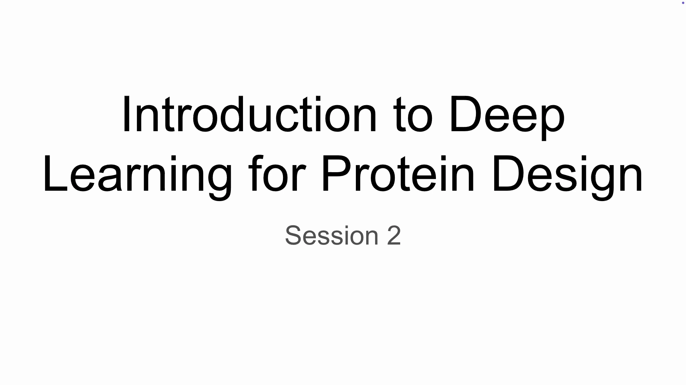

---

## 一、为什么深度学习改变了蛋白质设计

**结论先行**：深度学习之所以能重塑蛋白质设计，主要靠三点——**海量数据的积累、生成全新序列的能力、以及 AlphaFold 带来的高精度结构预测**（[0:37](https://www.youtube.com/watch?v=6YuUVgO1VDo&t=37)）。

1. **几十年的数据积累**。现代深度学习模型可以在**数百万个结构和序列**上训练，从而学到氨基酸序列、结构乃至功能之间潜在的规律与关系，理解蛋白质的"语法"（[0:51](https://www.youtube.com/watch?v=6YuUVgO1VDo&t=51)）。
2. **能生成从未存在过的序列**。与传统方法不同，深度学习可以生成全新的蛋白质序列，同时仍**保持折叠和功能所必需的物理化学性质**——这恰恰是传统方法很难做到的（[1:18](https://www.youtube.com/watch?v=6YuUVgO1VDo&t=78)）。
3. **结构预测变得又准又快**。多亏 AlphaFold 这样的突破，我们能在**合成之前**就预测设计出来的蛋白质长什么样，从而提前筛选与评估（[1:25](https://www.youtube.com/watch?v=6YuUVgO1VDo&t=85)）。

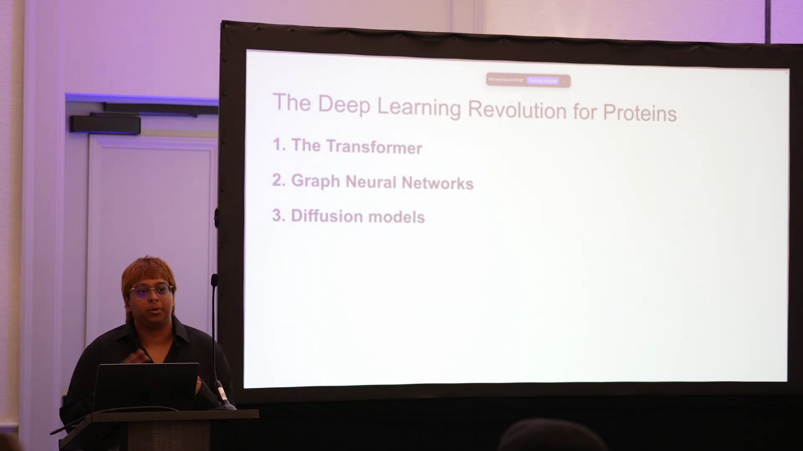

---

## 二、突破一：Transformer 与自注意力——让残基"互相交流"

**结论先行**：Transformer 擅长处理序列数据，其威力来自**自注意力机制**——它把序列拆成一个个 token（节点），让所有位置互相"对话"，动态决定该关注谁（[1:33](https://www.youtube.com/watch?v=6YuUVgO1VDo&t=93)）。

**是什么**：Transformer 最早用于自然语言处理（主要处理句子），后来被迁移到蛋白质设计。它把句子或**氨基酸序列**拆成若干 **token**，每个 token 被当作一个**节点**（[2:08](https://www.youtube.com/watch?v=6YuUVgO1VDo&t=128)）。

**为什么需要**：在自注意力中，不同氨基酸会计算"我需要多关注另一个氨基酸"，通过类似**消息传递**的方式，形成不断更新的**概率矩阵**——比如"这个离我更近，我应该更关注它"（[2:37](https://www.youtube.com/watch?v=6YuUVgO1VDo&t=157)）。

**为什么它对蛋白质特别有效**：蛋白质存在大量**长程相互作用**——序列上相邻的残基未必重要，真正关键的残基可能相隔很远，却在三维空间里彼此靠近。注意力机制恰好擅长捕捉这种跨距离的关系（[3:13](https://www.youtube.com/watch?v=6YuUVgO1VDo&t=193)）。

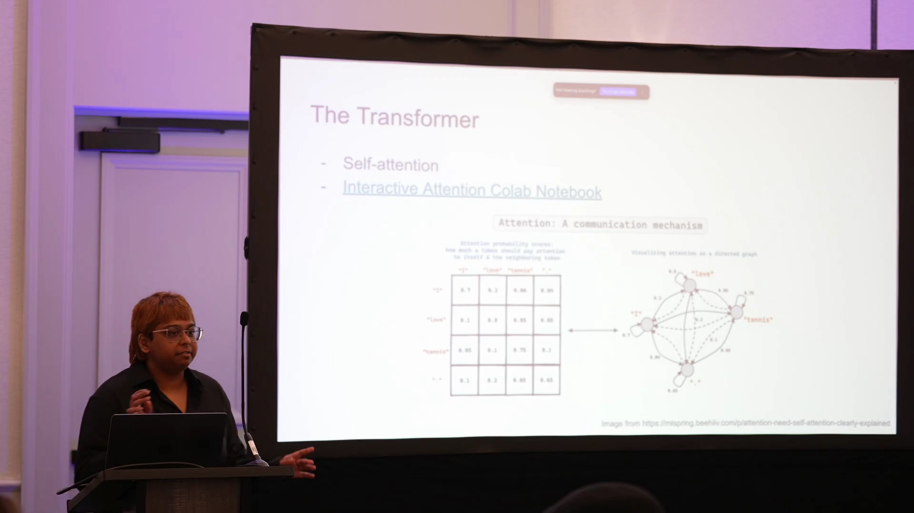

---

## 三、AlphaFold2：把 Transformer 变成结构预测引擎

**结论先行**：AlphaFold2 以 Transformer 为基本模块，通过**"输入处理 → Evoformer → 结构模块"三阶段 + 循环（recycling）**，把氨基酸序列预测成带置信度的 3D 结构（[3:33](https://www.youtube.com/watch?v=6YuUVgO1VDo&t=213)）。

### 3.1 三个阶段

1. **输入处理与初步分析**：从氨基酸序列出发，在基因数据库中搜索相关序列，构建**多序列比对（MSA, Multiple Sequence Alignment）**；同时寻找相似的已知结构作为**模板（templates）**。这为模型提供**进化上下文**与**结构线索**（[3:56](https://www.youtube.com/watch?v=6YuUVgO1VDo&t=236)）。

2. **Evoformer（核心处理）**：前两阶段的产物被编码为 **MSA 表示**和**配对表示（pair representation）**，一起送入 Evoformer——这是主 Transformer，共 **48 层**。它用 MSA 表示理解进化信息，用配对表示判断蛋白质不同部分如何相互作用；两者**不断互相更新**，逐步形成对结构更好的理解（[4:35](https://www.youtube.com/watch?v=6YuUVgO1VDo&t=275)）。

3. **结构模块（structure module）**：把充满信息的 n 维数组转换成真实的 **3D 坐标**，用**八个专门模块**逐步精修，最后输出结构以及每个部分准确度的**置信度分数**（[5:12](https://www.youtube.com/watch?v=6YuUVgO1VDo&t=312)）。

此外还有 **recycling（循环）**：模型把当前最好的猜测再送回模型里走一遍，反复精修（[5:05](https://www.youtube.com/watch?v=6YuUVgO1VDo&t=305)）。

> **类比**：Amrita 把 AlphaFold 想象成一个拼复杂拼图的人——查看各种证据、建立联系，经过**多轮**处理才拼出最终答案，并给出"我对每块拼图有多确定"的分数。

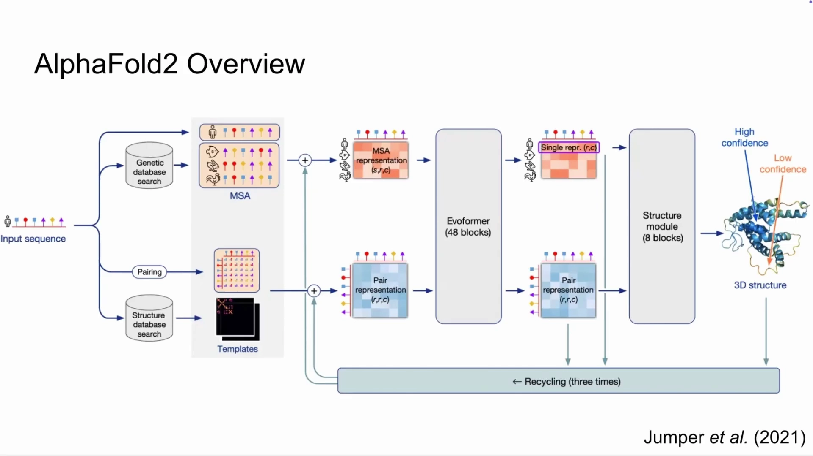

### 3.2 四项可调的输入

AlphaFold2 允许我们根据具体问题调整输入（[6:25](https://www.youtube.com/watch?v=6YuUVgO1VDo&t=385)）：

| 输入项 | 作用 | 调参经验 |
| --- | --- | --- |
| **Recycles（循环次数）** | 结构精修的遍数 | AlphaFold 3 默认约 20 次；追求准确就调高，批量跑想省算力就调低（常用 1–3 次） |
| **MSA depth（MSA 深度）** | 进化信息量 | 越深通常越自信；但**想让它听模板的话，就要减小 MSA 深度** |
| **Templates（模板）** | 已有相似结构，类似同源建模 | 可自行提供，也可让 Colab 自动搜索 |
| **Number of seeds（随机种子数）** | 预测的起始点 | 变种子可探索不同构象；难问题（如抗体）可跑近千个种子再选最好 |

关于 MSA，还可以通过**子采样（subsampling）**来控制"给多少、给哪些信息"：想更深，就把所有相似序列都放进去；想更浅，可以**按相似度聚类、只给聚类中心**；想让它预测某个特定构象，甚至可以只给某一个特定的聚类（[8:04](https://www.youtube.com/watch?v=6YuUVgO1VDo&t=484)）。

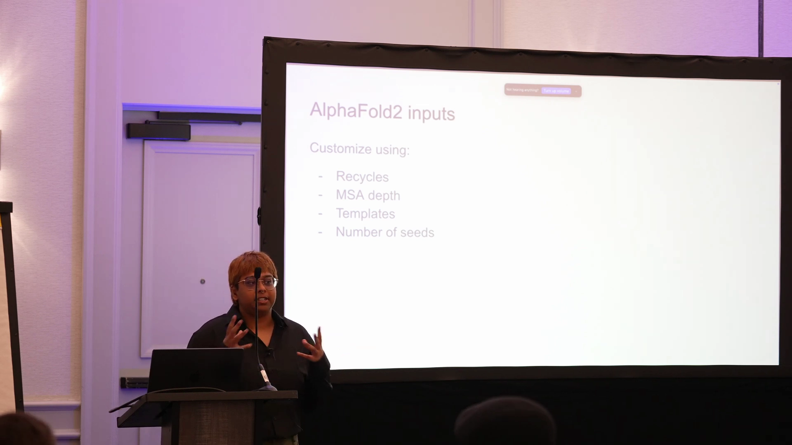

### 3.3 输出指标与如何解读

AlphaFold2 的输出包括：**PDB 结构文件**，以及几个置信度指标（[9:35](https://www.youtube.com/watch?v=6YuUVgO1VDo&t=575)）：

- **pLDDT**：**单个残基**的局部置信度；很多人会取平均 pLDDT 来给模型打分。
- **PAE（Predicted Aligned Error）**：**成对残基**的置信度，用热图表示。热图上，靶蛋白 A 内部、以及 binder B 内部都很"蓝"（自信），但 **A 与 B 之间的界面**区域则偏"红"（不自信），正好提示了哪个界面需要留意（[10:10](https://www.youtube.com/watch?v=6YuUVgO1VDo&t=610)）。
- **pTM**：整个复合物整体结构的准确度。
- **ipTM**：**亚基之间界面**预测的准确度；有轶事性证据表明，把蛋白-蛋白界面优化到 ipTM 较高，能较好地转化为实验成功（[11:13](https://www.youtube.com/watch?v=6YuUVgO1VDo&t=673)）。

两个小提醒：

- **PAE 矩阵不是对称的**——因为 PAE 是"对齐残基 X 后，看残基 Y 的误差"，X 对 Y 与 Y 对 X 未必相同；常用做法是**两者取平均**（[10:51](https://www.youtube.com/watch?v=6YuUVgO1VDo&t=651)）。
- **如何解读置信度**：AlphaFold 对某个预测"自信"，通常是因为它**见过类似的模式**（不一定是完全相同的残基或界面）。这意味着它也可能**漏掉**那些没见过、但其实好的设计。因此，用 PAE/ipTM 筛选设计时要意识到这种取舍。

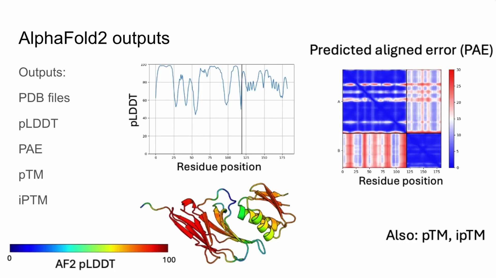

---

## 四、突破二：图神经网络与 ProteinMPNN——在骨架上"配"序列

**结论先行**：ProteinMPNN 是一个**图神经网络**：把蛋白质建模成"节点 + 边"的图，通过**消息传递**让残基交换信息，从而在给定骨架的前提下预测出合适的氨基酸序列（[13:28](https://www.youtube.com/watch?v=6YuUVgO1VDo&t=808)）。

### 4.1 图神经网络：把蛋白质看成一张图

- **节点**：可以表示**残基**（residue）或**原子**（atom），取决于你想看的交互层级；
- **边**：表示节点之间的**相互作用（interaction）**；
- **消息传递**：节点与直接相邻的节点交换信息、发送包含相关数据的"消息"。

Amrita 觉得这套机制特别优雅，因为它**映射了蛋白质的物理现实**：正如一个氨基酸与邻居通过各种相互作用彼此影响，消息传递让残基也能与邻居"交流"，共享化学性质、空间关系乃至长程相互作用（[13:52](https://www.youtube.com/watch?v=6YuUVgO1VDo&t=832)）。她还坦率地说，Transformer / GNN 这些名词之间的界限有时并不清晰，可以互换使用；这里强调 GNN，是因为 **ProteinMPNN 就是 GNN**。

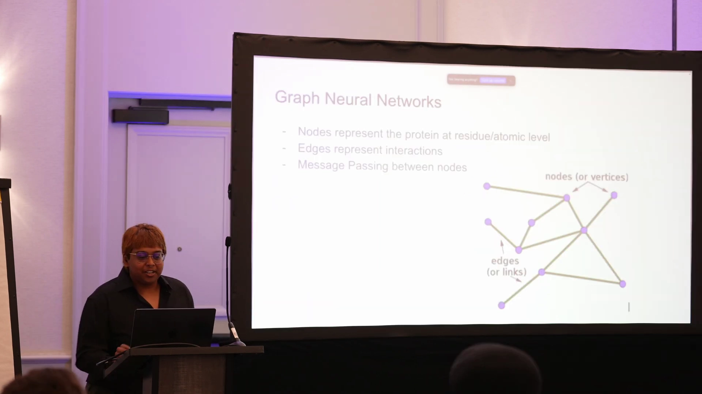

### 4.2 ProteinMPNN 的输入特征与结构

**节点特征**：ProteinMPNN 给每个残基使用主链原子的坐标——**N、Cα、C**，以及一个额外计算出来的 **Cβ**（碳 β）。Cβ 是一个**虚拟原子**，根据主链位置推算，可以理解成"残基侧链大致指向哪里"的质心（[14:43](https://www.youtube.com/watch?v=6YuUVgO1VDo&t=883)）。

**两个子网络**（[15:14](https://www.youtube.com/watch?v=6YuUVgO1VDo&t=914)）：

1. **编码器（Backbone Encoder）**：把结构解析成包含各节点及其相互作用信息的 n 维矩阵，计算精炼后的**节点嵌入**；
2. **解码器（Sequence Decoder）**：接收这些嵌入，逐步解析，最终在**每个氨基酸位置**上预测一个概率分布。

### 4.3 关键改进：随机解码顺序

ProteinMPNN 相比 Ingraham 2019 年的前作，最重要的改动是把**固定的"从左到右"解码**改成了**随机解码顺序**（random decoding order）。这带来一个实际好处：当你**不是**要预测整条序列，而是要**遮蔽（mask out）某些区域**、或存在**固定区域（fixed positions）**时，随机解码能工作得更好（[15:49](https://www.youtube.com/watch?v=6YuUVgO1VDo&t=949)）。

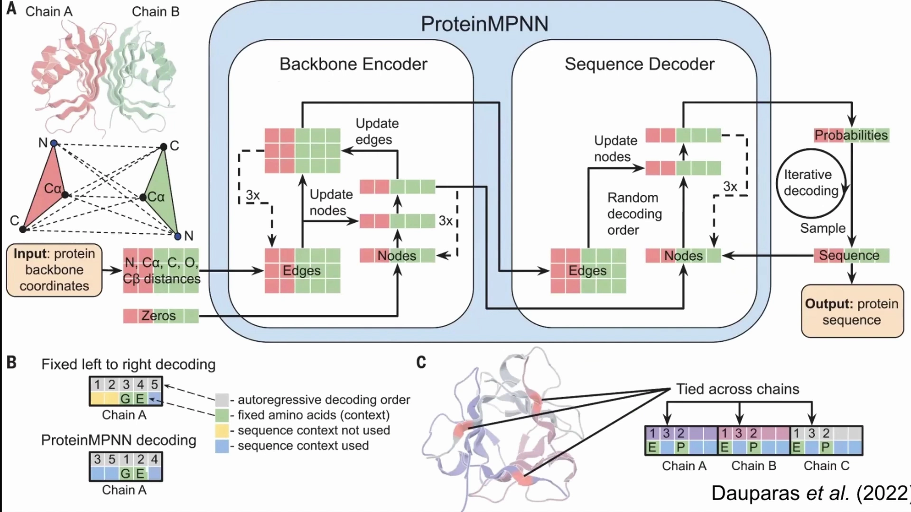

### 4.4 概率分布、损失与"还有别的选项"

**结论先行**：ProteinMPNN 的训练目标是预测一个**概率分布**，损失函数把这个分布**推向真实分布**（[16:18](https://www.youtube.com/watch?v=6YuUVgO1VDo&t=978)）。

Amrita 现场提了一个问题：假设某个位置的真实答案应该是**谷氨酰胺（GLU）**，真实分布该长什么样？答案是——**谷氨酰胺上是 100% 的柱，其余全为零**（[16:26](https://www.youtube.com/watch?v=6YuUVgO1VDo&t=986)）。

理解这一点有实用价值：ProteinMPNN 输出氨基酸时是**从这个分布里采样**，所以同一个位置往往**还有其他可选项**。如果你不同意它给出的选择，可以去看概率分布，看看它对那个位置还预测了哪些残基——这也是它在固定/遮蔽场景下好用的原因（[17:08](https://www.youtube.com/watch?v=6YuUVgO1VDo&t=1028)）。

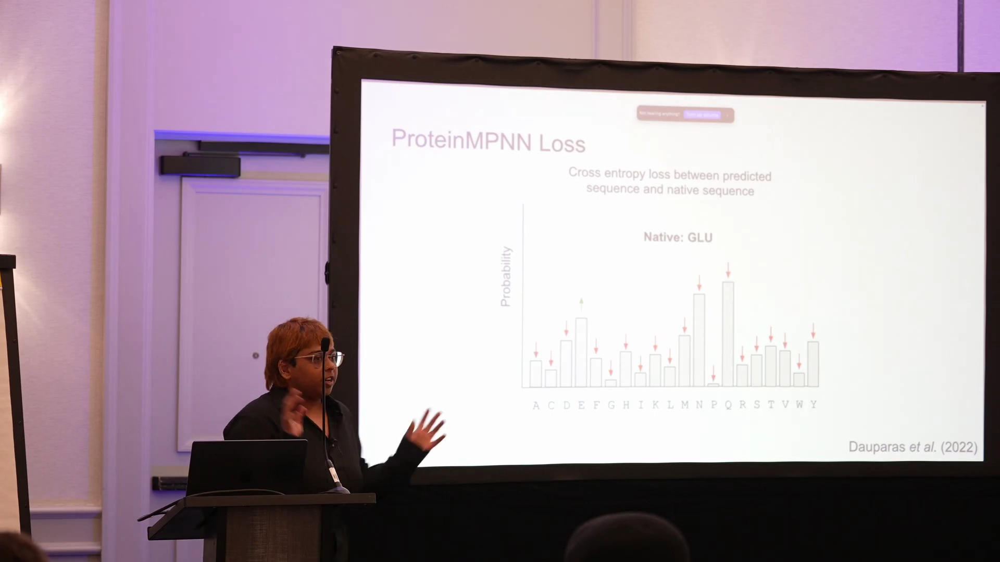

---

## 五、突破三：扩散模型与 RFdiffusion——从噪声"雕刻"出骨架

**结论先行**：扩散模型学习在**数据分布**和**噪声**之间插值；**RFdiffusion** 是建立在 RoseTTAFold 之上的扩散模型，能从噪声一步步"去噪"生成蛋白质骨架（[17:34](https://www.youtube.com/watch?v=6YuUVgO1VDo&t=1054)）。

### 5.1 扩散模型是什么

以"狗的图片"为例（[17:39](https://www.youtube.com/watch?v=6YuUVgO1VDo&t=1059)）：

- **训练**：给数据（狗图片）不断**加噪**，直到变成完全噪声；再训练模型从加噪的图片**回到**原图，即学习一条"去噪轨迹"。
- **推理**：给模型一个**随机噪声分布**，它就能生成一个"应当属于原始数据分布"的东西——不必与原数据中的某个样本完全相同，但会**具备原分布的性质**。

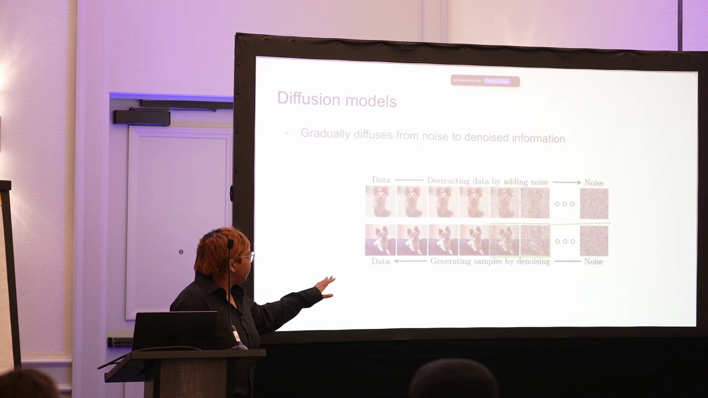

### 5.2 RFdiffusion：以 RoseTTAFold 为"雕塑大师"

RFdiffusion 的核心特点：它**建立在 Rosetta 之上**，利用 RoseTTAFold 已训练好的**结构知识**，在去噪过程的**每一步**做出有依据的决策（[18:38](https://www.youtube.com/watch?v=6YuUVgO1VDo&t=1118)）。

Amrita 的类比很生动：把噪声想象成**一大块黏土**，RoseTTAFold 像一位**雕塑大师**，不断指导你的手"这里改一下、那里改一下"；RFdiffusion 就是把黏土逐渐推向大师认可的方向——于是每一步都**越来越像蛋白质**（[18:52](https://www.youtube.com/watch?v=6YuUVgO1VDo&t=1132)）。

单步的流程大致是：当前带噪坐标输入 **RF（RoseTTAFold）**，预测出一个"干净"的结构 **x̂₀**，再把这个预测与当前噪声**插值并加噪**，得到下一步输入（这就是所谓的 **self-conditioning**）。

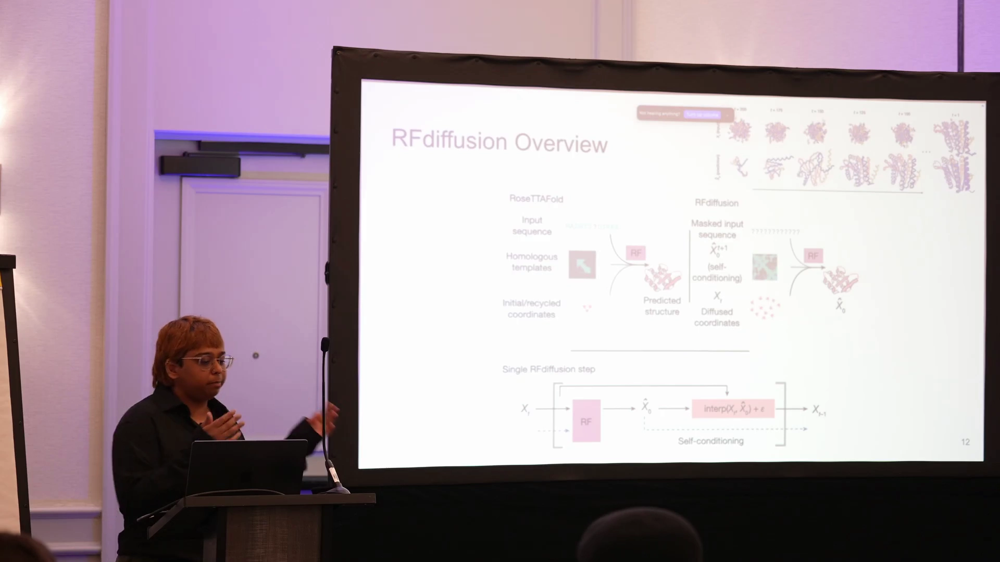

RoseTTAFold 与 AlphaFold 类似，也有三条轨道（track）：**MSA、配对（pair）、模板（template）**；在这个场景里可以把它当作"和 AlphaFold 差不多"的结构预测模型来理解（[19:31](https://www.youtube.com/watch?v=6YuUVgO1VDo&t=1171)）。

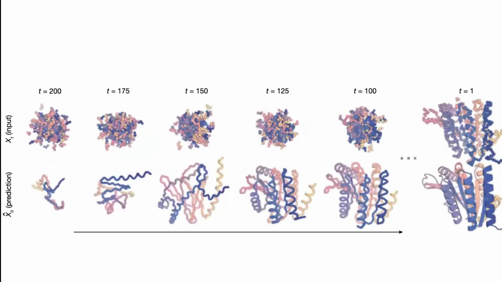

### 5.3 改造输入：让它生成我们想要的东西

既然扩散的输入只是一个**噪声分布**，我们就可以"动手脚"，让它承担更有用的任务（[19:50](https://www.youtube.com/watch?v=6YuUVgO1VDo&t=1190)）：

- **无条件生成**：给纯**高斯噪声** → 生成一个单体蛋白骨架；
- **对称蛋白**：给**对称点云**，让它去噪；
- **结合靶点 / 功能基序 / 对称基序**：把**固定位置**连同噪声一起给它，让它**围绕固定位置去噪**。

正是这些改造，让 RFdiffusion 被扩展到了各式各样的设计应用。

### 5.4 势函数（Potentials）：给去噪"指个方向"

最后讲到的**势函数（potentials）**用来引导扩散过程，可以理解为朝某个特定方向施加推动力（[20:34](https://www.youtube.com/watch?v=6YuUVgO1VDo&t=1234)）。

- 带势函数与不带势函数的采样，唯一差别就是一个**引导尺度（guiding scale）**——它把去噪推向特定方向；
- 常见的势函数有：**回旋半径（radius of gyration）、接触数（number of contacts）、链内接触、链间接触、底物接触**等；
- 除了内置的势函数，你也可以**自己写**，如果内置的不够用（[21:06](https://www.youtube.com/watch?v=6YuUVgO1VDo&t=1266)）。

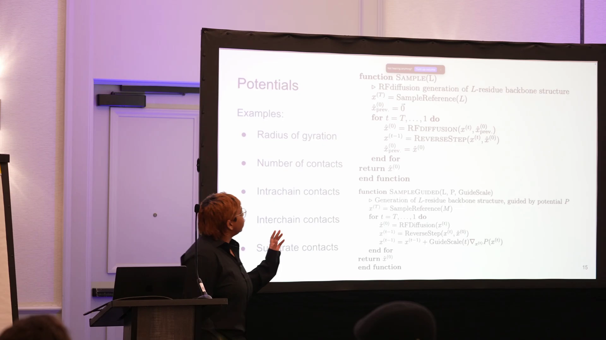

---

## 小结

- **一条主线**：本讲把深度学习对蛋白质设计的改造，归纳为 **Transformer、图神经网络、扩散模型** 三大突破，分别对应 **AlphaFold2（预测结构）、ProteinMPNN（设计序列）、RFdiffusion（生成骨架）** 三件工具。
- **Transformer / 自注意力**：让序列中所有位置互相"交流"，特别适合捕捉蛋白质的**长程相互作用**。
- **AlphaFold2**：MSA + 模板 → Evoformer（48 层）→ 结构模块（8 块）+ recycling；可用 **recycles / MSA 深度 / 模板 / 种子数** 调参；输出用 **pLDDT、PAE、pTM、ipTM** 解读置信度。
- **GNN / ProteinMPNN**：节点=残基、边=相互作用、消息传递；输入主链 N/Cα/C/Cβ 特征；编码器+解码器；**随机解码**支持固定/遮蔽；从概率分布中**采样**序列。
- **扩散 / RFdiffusion**：在噪声与数据之间插值；**建立在 RoseTTAFold 之上**，每步去噪；可改造输入实现**无条件生成、对称组装、binder/基序**设计；用**势函数**引导方向。
- **一句话收束**：这三件工具串起来，就构成了工作坊前面的完整设计流水线——**RFdiffusion 生成骨架 → ProteinMPNN 设计序列 → AlphaFold 预测验证 → Rosetta 打分分析**。

## 关键术语速查

| 术语 | 一句话解释 |
| --- | --- |
| Transformer | 基于自注意力、擅长处理序列数据的深度学习架构 |
| 自注意力（Self-attention） | 让序列中每个位置（token）根据相关性互相加权交流的机制 |
| Token / 节点 | 序列被拆成的最小单元，在注意力中当作互相通信的节点 |
| 长程相互作用 | 序列上相距较远、却在三维空间彼此靠近的残基间的相互作用 |
| MSA（多序列比对） | 把同源序列对齐排列，为模型提供进化信息 |
| Evoformer | AlphaFold2 的主 Transformer 模块（48 层），交替更新 MSA 表示与配对表示 |
| recycling | 把当前最佳结构预测再送回模型精修，循环多轮 |
| pLDDT | 每个残基的局部置信度（0–100） |
| PAE / pTM / ipTM | 成对残基误差 / 整体结构置信度 / 界面置信度 |
| 图神经网络（GNN） | 以节点和边表示对象及其关系、通过消息传递学习的网络 |
| 消息传递（Message passing） | 节点与邻居交换信息、更新自身表示的机制 |
| ProteinMPNN | 基于 GNN 的序列设计模型：给定骨架，预测每位点的氨基酸概率分布 |
| 随机解码顺序 | 打破固定左→右顺序的解码方式，利于固定/遮蔽区域的设计 |
| 扩散模型（Diffusion） | 学习从噪声逐步去噪生成数据的生成模型 |
| RFdiffusion | 建立在 RoseTTAFold 之上的扩散模型，用于生成蛋白质骨架 |
| 无条件生成 | 直接用高斯噪声生成（如单体骨架）的生成方式 |
| 势函数（Potentials） | 引导扩散去噪方向的附加"力"，如回旋半径、接触数、底物接触等 |
| RoseTTAFold | 与 AlphaFold 类似的结构预测模型，是 RFdiffusion 的骨干 |

> 本讲是工作坊的方法论总纲。后续讲次会分别展开 **PPI 界面、Binder 设计、BindCraft、对称组装与自组装纳米颗粒** 等具体主题。
