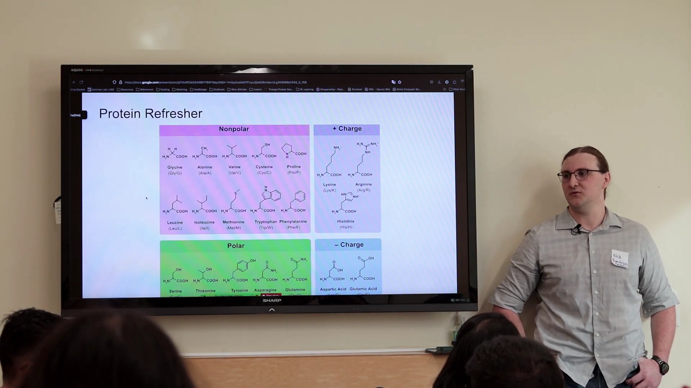
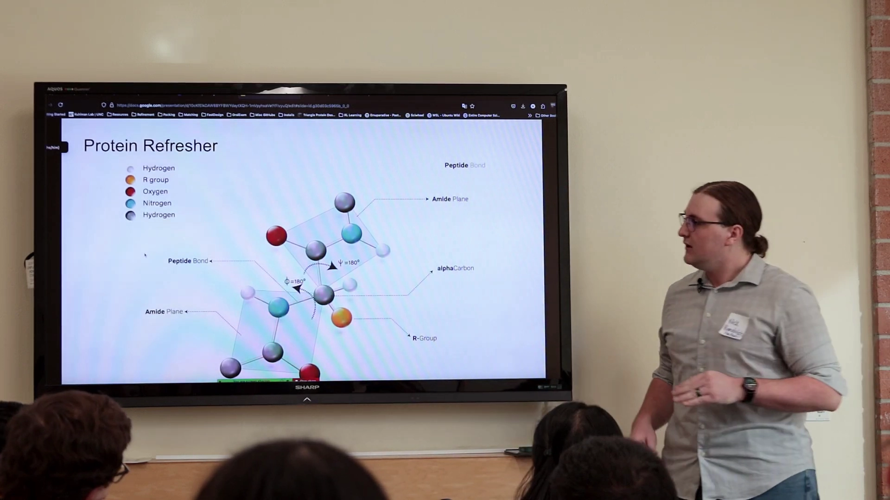
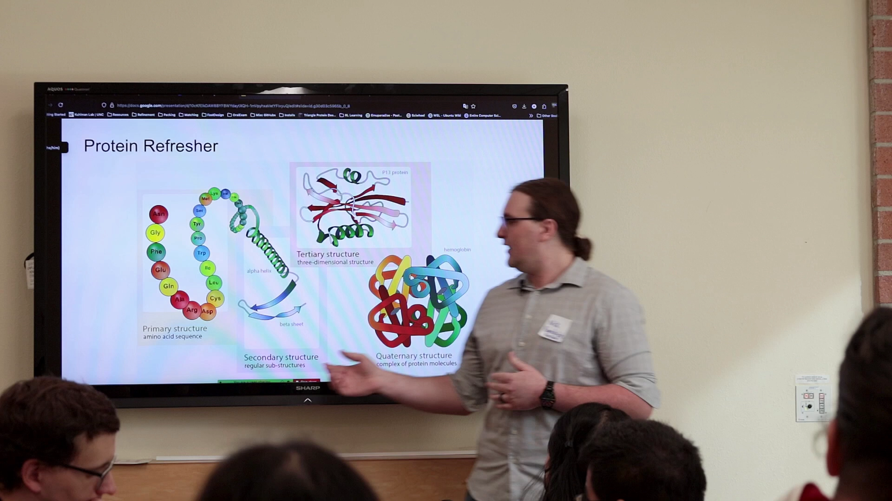
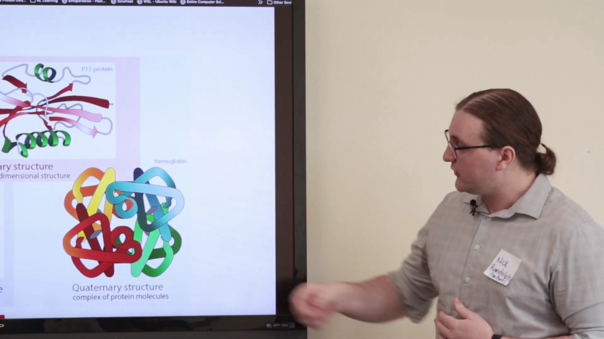
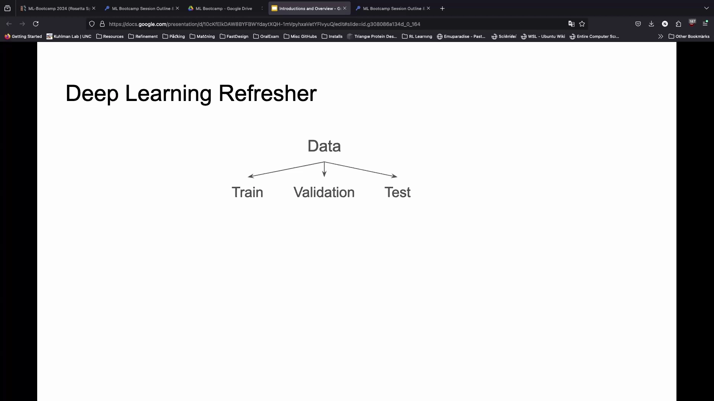
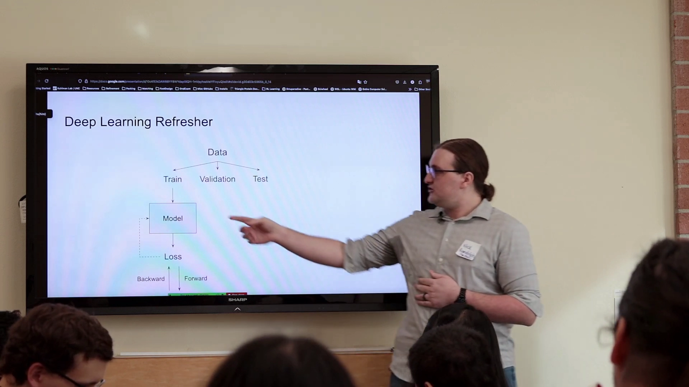
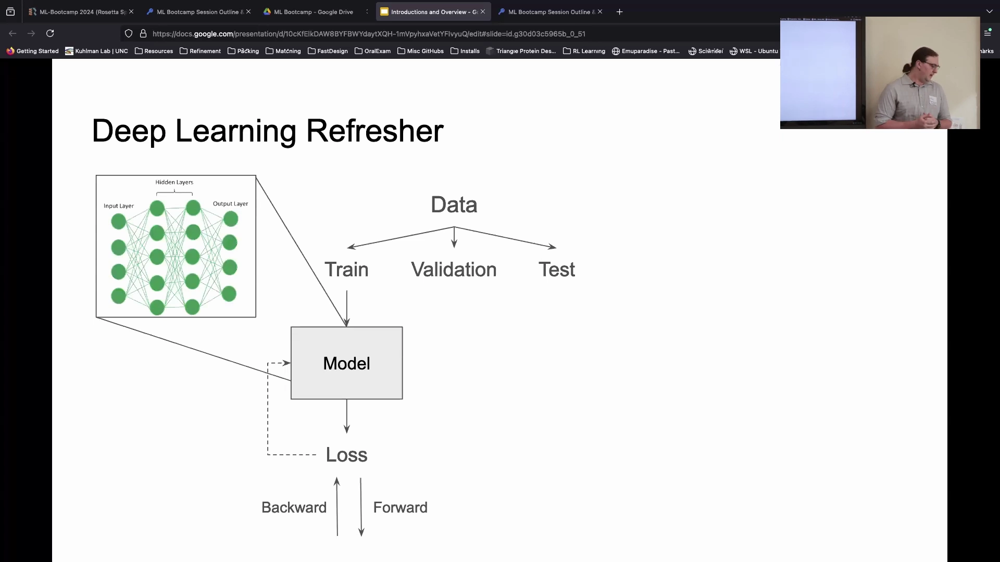
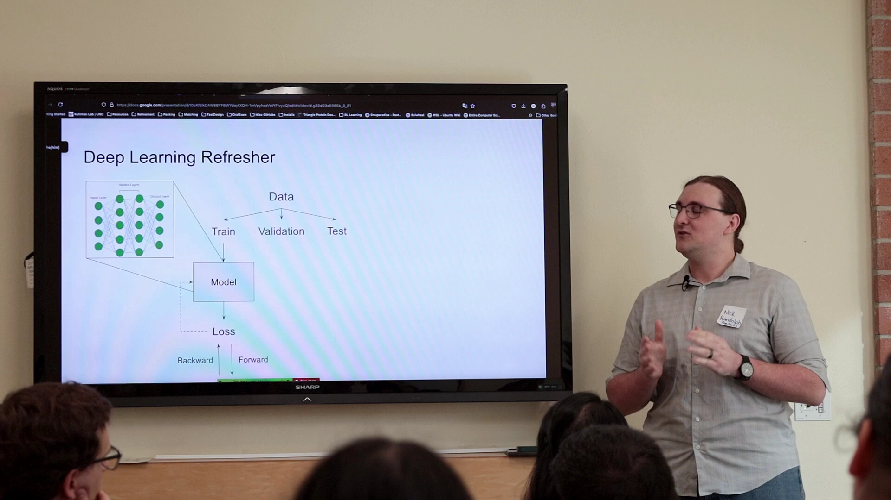
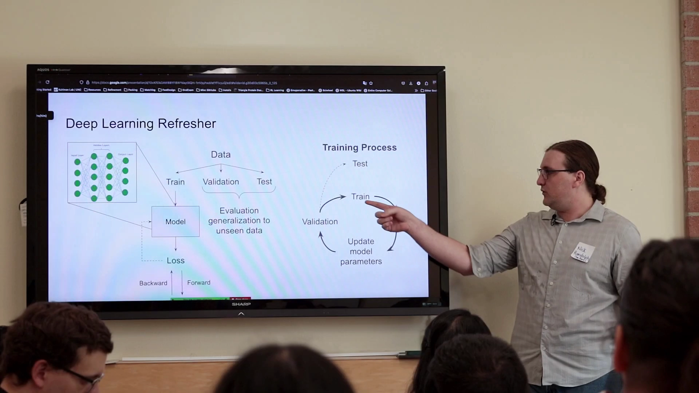
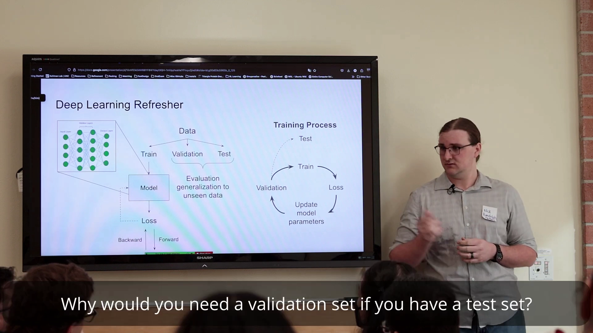

# 第01讲：用机器学习做蛋白质设计，先要打好「蛋白质」和「深度学习」两块地基

## 本讲要解决的核心问题（SCQA）

**背景**：这是 Rosetta Commons 机器学习训练营（ML Bootcamp：Machine Learning Methods for Protein Modeling and Design）的开场课，由 UNC Chapel Hill 的 Nick Randolph 主讲。接下来一周，大家要用机器学习（Machine Learning, ML）去做蛋白质建模与设计。

**冲突**：来听课的人背景很不一致——学生物的可能对深度学习不熟，学计算机的又可能没系统学过蛋白质。而后面要讲的那些具体模型，恰恰要求两边都懂一点：既要知道模型在预测蛋白质的什么，也要知道模型是怎么「学」出来的。

**疑问**：那么，要给「用 ML 做蛋白质设计」这件事打地基，最少需要铺垫哪些知识？

**回答（中心思想）**：本讲用两块地基把所有人拉回同一起跑线——**先复习蛋白质（它由什么组成、有哪些结构层次），再复习深度学习（数据怎么划分、模型怎么学）**。只要理解了蛋白质的组成与结构层次，以及深度学习「数据→损失→前向/反向传播→训练循环」这条主线，后面再看 AlphaFold 之类的具体模型时，就能马上明白它们「在做什么、为什么能奏效」。

---

## 一、蛋白质是生命的执行者，而氨基酸是它的 20 种「积木块」

**蛋白质几乎参与了生命活动的方方面面。** 生物学的许多过程，本质上都是蛋白质与其他蛋白质、其他分子、DNA、RNA、小分子、离子等发生相互作用的结果。[【跳转到 00:11】](https://www.youtube.com/watch?v=ekeXqoPSusI&t=11)

蛋白质之所以功能如此多样，根源在于它由氨基酸拼成。氨基酸（amino acid）就是构成蛋白质的基本单元；自然界中用来合成蛋白质的「标准氨基酸」一共有 **20 种**[【跳转到 00:16】](https://www.youtube.com/watch?v=ekeXqoPSusI&t=16)。可以把它们想成一套只有 20 种零件的乐高：不同的排列顺序、不同的长度，就能搭出功能天差地别的蛋白质。

这 20 种氨基酸的化学骨架高度相似：它们都具有一个标准的**氨基**（amino group, –NH₂）和一个**羧基**（carboxylic group, –COOH）[【跳转到 00:36】](https://www.youtube.com/watch?v=ekeXqoPSusI&t=36)。真正让它们彼此不同的，是连接在中心碳原子上的那个 **R 基团**（R group，也叫侧链）[【跳转到 00:41】](https://www.youtube.com/watch?v=ekeXqoPSusI&t=41)。换句话说：**骨架人人一样，性格全靠 R 基团。**

## 二、R 基团的化学性质，决定了氨基酸「住在哪、干什么」

R 基团决定了每个氨基酸的化学性质与功能[【跳转到 00:47】](https://www.youtube.com/watch?v=ekeXqoPSusI&t=47)。大致可以按「亲水/疏水、带不带电」分成几类，这直接对应它们在蛋白质里的分工：

- **非极性（nonpolar）残基**：疏水，喜欢抱团藏在蛋白质内部，非常适合**填充蛋白质的核心（core）**，把水（溶剂）排斥在外[【跳转到 00:57】](https://www.youtube.com/watch?v=ekeXqoPSusI&t=57)。比如**甘氨酸（glycine）**，它那个位置只有一个氢原子，相当于几乎没有 R 基团[【跳转到 00:52】](https://www.youtube.com/watch?v=ekeXqoPSusI&t=52)。
- **带电荷残基**：对形成**盐桥（salt bridge）**以及与其他残基、小分子等的相互作用非常重要[【跳转到 01:02】](https://www.youtube.com/watch?v=ekeXqoPSusI&t=62)。
- **极性（polar）残基**：很常见，而且特别集中在蛋白质**表面**，因为表面要接触溶剂，而水本身就是极性的[【跳转到 01:13】](https://www.youtube.com/watch?v=ekeXqoPSusI&t=73)。

这些氨基酸就是我们整周都要反复使用的「基本积木」，它们一个接一个地连接起来，形成更大的**多肽（polypeptide）**。

## 三、肽键把氨基酸串成链，二面角决定骨架怎么扭

**氨基酸之间靠肽键首尾相连。** 相邻氨基酸通过一个**肽键（peptide bond）**连接在一起[【跳转到 01:32】](https://www.youtube.com/watch?v=ekeXqoPSusI&t=92)。具体来说，每个氨基酸有 N、Cα、C 几个关键原子，连接就发生在肽键这里。由于肽键具有一定的刚性，N–Cα–C 这几段原子大致处在同一平面上，相邻残基之间就形成两个这样的平面[【跳转到 01:42】](https://www.youtube.com/watch?v=ekeXqoPSusI&t=102)。

**两个平面之间的扭转程度用二面角（dihedral angle）描述**，也就是常说的 **φ（Phi）角和 ψ（Psi）角**[【跳转到 01:57】](https://www.youtube.com/watch?v=ekeXqoPSusI&t=117)。这两个角为什么重要？

- 它们决定了蛋白质骨架的局部形状，进而决定蛋白质的许多性质[【跳转到 02:05】](https://www.youtube.com/watch?v=ekeXqoPSusI&t=125)；
- 特定的 φ/ψ 角会强烈**限制**某个位置上「哪种氨基酸更容易出现」——也就是说，**序列和结构是相互制约的**；
- 二面角还能帮助**预测侧链（side chain）的构象位置**[【跳转到 02:14】](https://www.youtube.com/watch?v=ekeXqoPSusI&t=134)。

对初学者来说，记住一句话就够了：**氨基酸序列是「写字」，二面角是「字体怎么扭」，二者共同决定蛋白质最终长什么样。**

## 四、蛋白质有四个结构层次，本课程主要研究三级和四级

蛋白质内部有明显的结构层次，从简单到复杂依次是[【跳转到 02:32】](https://www.youtube.com/watch?v=ekeXqoPSusI&t=152)：

| 结构层次 | 一句话含义 | 类比 |
| --- | --- | --- |
| 一级结构（primary structure） | 标准的氨基酸序列，氨基酸一个接一个连成多肽链[【跳转到 02:42】](https://www.youtube.com/watch?v=ekeXqoPSusI&t=162) | 一串珠子按顺序串好 |
| 二级结构（secondary structure） | 链上局部形成的规则子结构，最常见的是 **α 螺旋（alpha helix）**和 **β 折叠（beta sheet）**[【跳转到 02:52】](https://www.youtube.com/watch?v=ekeXqoPSusI&t=172) | 珠子串局部绕成弹簧或折成纸扇 |
| 三级结构（tertiary structure） | 整条链折叠成的三维整体结构，大致是「单链」形状[【跳转到 03:02】](https://www.youtube.com/watch?v=ekeXqoPSusI&t=182) | 整串珠子盘成一个立体造型 |
| 四级结构（quaternary structure） | 多条三级结构（亚基）聚合成更高级的寡聚体，描述蛋白质之间如何相互作用[【跳转到 03:28】](https://www.youtube.com/watch?v=ekeXqoPSusI&t=208) | 多个立体造型再拼成一个大组件 |

关于三级结构，有两个初学者常常误解的点：

1. **它不是静止的。** 蛋白质本身是柔性的、动态的，三级结构通常定义明确，但并非一成不变[【跳转到 03:02】](https://www.youtube.com/watch?v=ekeXqoPSusI&t=182)。
2. **不是每个蛋白质都有稳定结构。** 有些蛋白质没有固定结构，或者含有「内在无序」（intrinsically disordered）的区域[【跳转到 03:23】](https://www.youtube.com/watch?v=ekeXqoPSusI&t=203)。所以，「一个序列对应一个固定结构」只是常见情况，而不是铁律。

四级结构最经典的例子是**血红蛋白（hemoglobin）**：它由多条亚基组装而成，而且还具有**别构效应（allosteric effect）**与**协同性（cooperativity）**[【跳转到 03:33】](https://www.youtube.com/watch?v=ekeXqoPSusI&t=213)。简单说，一个亚基结合了氧之后，会「通知」其他亚基也更容易结合氧——这正是多亚基协同工作的魅力所在。

**本课程后续会大量涉及三级和四级结构**[【跳转到 03:43】](https://www.youtube.com/watch?v=ekeXqoPSusI&t=223)，因为这两级才是蛋白质发挥功能的实际形态。

## 五、深度学习的成败，首先取决于数据质量

讲完蛋白质，Nick 又把话锋转向深度学习[【跳转到 03:55】](https://www.youtube.com/watch?v=ekeXqoPSusI&t=235)。他先给了一个高层次概览，目标是让大家理解后面具体模型「在做什么、为什么能奏效」，细节则留给 Ben 的小节。

**深度学习的第一要点是数据。** 这个领域有句老话：**垃圾进，垃圾出（garbage in, garbage out）**[【跳转到 04:04】](https://www.youtube.com/watch?v=ekeXqoPSusI&t=244)。原因是：模型会从你给的数据里学习，并**复现它在数据中看到的模式**。如果喂进去的是一堆随机噪声，那它就学不到任何有用的东西。因此，数据的质量至关重要。

## 六、三份数据各司其职：训练、验证、测试

**数据不仅要质量好，还要划分好。** 把数据切分开，既能验证模型、比较不同模型和架构，也是你**可靠地做基准测试、客观衡量模型好坏**的方式[【跳转到 04:25】](https://www.youtube.com/watch?v=ekeXqoPSusI&t=265)。做深度学习时，通常把数据分成三份[【跳转到 04:50】](https://www.youtube.com/watch?v=ekeXqoPSusI&t=290)：

- **训练集（training set）**：占绝大部分，通常在 **80%** 左右[【跳转到 05:01】](https://www.youtube.com/watch?v=ekeXqoPSusI&t=301)，用来真正训练模型；
- **验证集（validation set）** 和 **测试集（test set）**：各占大约 **10%**[【跳转到 05:06】](https://www.youtube.com/watch?v=ekeXqoPSusI&t=306)。

它们各自的用法，会在第八、九节里结合训练流程展开。

## 七、损失函数是模型学习的「方向盘」

**训练集送进模型后，会得到一个输出，然后计算损失（loss）。** 损失本质上是一种**代价函数（cost function）**，可以理解为对预测误差的度量[【跳转到 05:27】](https://www.youtube.com/watch?v=ekeXqoPSusI&t=327)。它的作用是**告诉模型该如何更新参数**，从而在最终做出更好的判断。

损失的具体形式取决于任务类型[【跳转到 05:36】](https://www.youtube.com/watch?v=ekeXqoPSusI&t=336)：

- 比如把图片分类成马、猫、狗，用的是**分类损失（classification loss）**；
- 比如预测明天的股价，用的是**回归损失（regression loss）**[【跳转到 05:41】](https://www.youtube.com/watch?v=ekeXqoPSusI&t=341)。

用公式直观理解一下（仅为示意，便于初学者建立概念）：回归任务常用均方误差

$$
L = \frac{1}{N}\sum_{i=1}^{N}(y_i - \hat{y}_i)^2
$$

其中 $y_i$ 是真实值、$\hat{y}_i$ 是模型预测值——预测偏离真值越远，损失越大。模型要做的，就是**不断降低这个损失**。

## 八、前向传播与反向传播：深度学习是如何「学」的

深度学习的学习过程由两个方向的动作组成[【跳转到 05:41】](https://www.youtube.com/watch?v=ekeXqoPSusI&t=341)：

1. **前向传播（forward pass）**：把数据「流过」网络，得到输出并计算损失；
2. **反向传播（backward step）**：拿着损失**反向传播（backpropagate）梯度**，据此更新模型的参数[【跳转到 06:03】](https://www.youtube.com/watch?v=ekeXqoPSusI&t=363)。

用一句话概括：**拿数据 → 过模型 → 算损失 → 反向传播更新参数**，模型就学到了东西。用公式表示参数更新的核心思想就是：

$$
\theta \leftarrow \theta - \eta \nabla_\theta L
$$

即参数 $\theta$ 沿着损失梯度的**反方向**、按学习率 $\eta$ 迈一小步，让损失变小。

那「网络」内部到底在做什么？最常见的是**全连接（fully connected）**结构：图中每个圆点是一个**节点或神经元**，每一竖列是一层；每个神经元都与上一层和下一层相连[【跳转到 06:26】](https://www.youtube.com/watch?v=ekeXqoPSusI&t=386)。

**单层内部其实只做了非常简单的运算**：先做一次线性变换，再施加一个**激活函数（activation function）**，也就是某种非线性函数[【跳转到 06:41】](https://www.youtube.com/watch?v=ekeXqoPSusI&t=401)。它简单得出人意料——真正的**复杂性来自「层层堆叠」**：正是这些非线性激活的叠加，让网络能捕捉数据中非常复杂的特征，并**泛化（generalize）**到以前没见过的东西上[【跳转到 07:06】](https://www.youtube.com/watch?v=ekeXqoPSusI&t=426)。

## 九、训练是一个循环：训练→算损失→更新参数→验证

**深度学习的主线，就是一个不断重复的循环**[【跳转到 08:11】](https://www.youtube.com/watch?v=ekeXqoPSusI&t=491)：

1. 取训练数据，送进模型，计算损失；
2. 反向传播损失，更新模型的内部参数[【跳转到 08:23】](https://www.youtube.com/watch?v=ekeXqoPSusI&t=503)；
3. 用验证集评估学得好不好、还需不需要继续训练；
4. 如果对验证结果不满意，就继续训练，**一遍又一遍地循环**，直到参数更新到我们对验证分数满意为止，然后退出循环。

用验证集和测试集打分，评估的是两件事：模型**对训练数据学得有多好**，以及它对**未见数据的泛化能力**[【跳转到 08:42】](https://www.youtube.com/watch?v=ekeXqoPSusI&t=522)。到这里，就是深度学习的整体思路：**用简单运算从大量数据中学习，再靠堆叠产生复杂性，通过反向传播更新权重。**

## 十、既然有测试集，为什么还要验证集？

现场有听众问了一个非常关键的问题：**「既然有测试集，为什么还需要验证集？」**[【跳转到 09:05】](https://www.youtube.com/watch?v=ekeXqoPSusI&t=545)

答案的核心是：**验证集用来「迭代和挑选架构」，测试集用来「做最终裁决」。** 具体来说[【跳转到 09:20】](https://www.youtube.com/watch?v=ekeXqoPSusI&t=560)：

- 假设一个网络现在有 **2 个内部层（hidden layers）**，你可以很容易换成 3 个、5 个甚至 10 个[【跳转到 09:35】](https://www.youtube.com/watch?v=ekeXqoPSusI&t=575)。到底该选几层？
- 做法是：**在同一份训练集上训练所有这些模型**，再**在同一份验证集上评估**，选出验证表现最好的那个配置[【跳转到 09:40】](https://www.youtube.com/watch?v=ekeXqoPSusI&t=580)。
- 直觉上「更大的模型更好」，但**并不总是如此**：更大的模型可能更**过拟合（overfitting）**训练集，反而在验证集上更差[【跳转到 09:53】](https://www.youtube.com/watch?v=ekeXqoPSusI&t=593)。

关键区别在于**「信息泄漏」**：验证集会**影响你在架构上做的各种决策**，因此严格来说，模型会「略微学到」验证集的信息。所以**不能再用它来当最终成绩**。测试集必须一直留到最后，等选定满意架构后才使用，用来真正检验泛化能力。而且，只有当大家都用**相似的数据划分**时，测试集才能公平地比较「哪个模型更好」[【跳转到 07:46】](https://www.youtube.com/watch?v=ekeXqoPSusI&t=466)。

## 小结

- **蛋白质 = 20 种氨基酸搭成的**。它们骨架相同，性质差异几乎全由 **R 基团（侧链）**决定：非极性残基填充核心、极性残基多居表面、带电残基参与盐桥与相互作用。
- **氨基酸靠肽键串成多肽**；骨架的扭转由 **φ/ψ 二面角**描述，这些角既约束氨基酸偏好，也帮助预测侧链位置。
- **蛋白质有四个结构层次**：一级序列 → 二级（α 螺旋/β 折叠）→ 三级（单链三维结构）→ 四级（多亚基复合物）。三级结构是动态的，且并非所有蛋白质都有稳定结构；本课程重点研究三级与四级。
- **深度学习的第一原则是数据质量**（垃圾进、垃圾出），并且要把数据分成**训练/验证/测试**三份（约 80%/10%/10%）。
- **损失函数衡量预测误差**，是引导参数更新的「方向盘」，其形式随任务（分类/回归）而变。
- **学习靠前向+反向传播**：数据过网络算损失，再反向传播梯度更新参数；单层只是「线性变换+非线性激活」，复杂性来自层层堆叠。
- **训练是一个循环**：训练→算损失→更新参数→验证，不满意就继续，满意才退出。
- **验证集用于选架构，测试集用于做终考**：因为验证集会参与决策、导致轻微信息泄漏，最终泛化能力必须由从未参与决策的测试集来判定。

## 关键术语速查

| 术语 | 一句话解释 |
| --- | --- |
| 氨基酸（amino acid） | 构成蛋白质的基本单元，标准的有 20 种，骨架相同、R 基团不同 |
| R 基团 / 侧链（R group / side chain） | 接在氨基酸中心碳上的可变基团，决定其化学性质与功能 |
| 非极性残基（nonpolar residue） | 疏水残基，倾向藏在蛋白质内部、填充核心 |
| 极性残基（polar residue） | 亲水残基，常见于蛋白质表面以接触极性溶剂 |
| 肽键（peptide bond） | 连接相邻氨基酸的化学键，具有一定刚性 |
| 二面角 / φ、ψ 角（dihedral angle） | 描述蛋白质主链相邻平面扭转程度的角度，约束局部构象 |
| 一级结构（primary structure） | 氨基酸的线性序列 |
| 二级结构（secondary structure） | 局部规则子结构，如 α 螺旋、β 折叠 |
| 三级结构（tertiary structure） | 单条链折叠成的三维整体结构 |
| 四级结构（quaternary structure） | 多条链（亚基）组装成的复合物结构 |
| 内在无序（intrinsically disordered） | 没有固定三维结构（或含无序区域）的蛋白质/区段 |
| 血红蛋白（hemoglobin） | 四级结构的经典例子，具有别构效应与协同性 |
| 训练集（training set） | 用于真正训练模型的数据，通常约占 80% |
| 验证集（validation set） | 用于迭代、挑选模型与架构，约占 10% |
| 测试集（test set） | 留到最后、用于最终评估泛化能力，约占 10% |
| 损失 / 代价函数（loss / cost function） | 衡量预测误差的量，指引参数更新方向 |
| 分类损失 / 回归损失 | 分别对应「分对类别」和「预测连续数值」两类任务 |
| 前向传播（forward pass） | 数据流过网络、产生输出并计算损失的过程 |
| 反向传播（backpropagation） | 从损失出发反算梯度、据此更新参数的过程 |
| 激活函数（activation function） | 层内的非线性函数，使网络能拟合复杂关系 |
| 全连接（fully connected） | 相邻层之间每个神经元两两相连的网络结构 |
| 泛化（generalization） | 模型在未见数据上同样表现良好的能力 |
| 过拟合（overfitting） | 模型过度记住训练集、在验证/测试集上反而变差 |
