# 第04讲：用 AlphaFold2 / OpenFold 做结构预测——从 CASP14 的惊艳登场，到 Evoformer、结构模块与训练损失

> 视频来源：[Structure Prediction with AlphaFold2 and OpenFold](https://www.youtube.com/watch?v=Y5-lhdwdJC0)（Rosetta Commons ML Bootcamp：Machine Learning Methods for Protein Modeling and Design，主讲 Nick Randolph，UNC Chapel Hill，时长 1:39:36）
>
> 这是整个训练营里最长、也最硬核的一讲：前半段讲 AlphaFold2 在 CASP14 上的表现、它与 OpenFold 的关系、输入输出与置信度；后半段拆开模型内部，讲 Evoformer、注意力、三角操作、结构模块、SE(3) 与 FAPE 损失，最后讲局限与生态扩展。全程穿插课堂问答和现场演示。

## 本讲要解决的核心问题（SCQA）

**背景**：上一讲《结构预测导论》里我们已经知道，结构预测就是"给定氨基酸序列，求三维结构"，也知道了 CASP 盲测、MSA、共进化、AlphaFold1 这些概念 [【跳转到 00:11】](https://www.youtube.com/watch?v=Y5-lhdwdJC0&t=11)。

**冲突**：AlphaFold1 虽然把困难靶点的水准线抬高了，但它还**不是端到端**——模型只产出一堆分布，还要靠 Rosetta 这类能量极小化方法收尾。领域真正需要的是一个"输入序列、直接输出全原子结构"的模型；同时，AlphaFold2 最初只公开了推理代码，**你无法复现它的训练**。

**疑问**：AlphaFold2 到底强到什么程度？它凭什么能做到端到端？它的内部是怎么把一条序列变成三维结构的？我们能用哪些指标去读它的结果、又该怎样评价和驾驭它？

**回答（中心思想）**：本讲以 **AlphaFold2 / OpenFold** 为主线，给出一个"从外到内"的完整认识，可分四层。第一层是**战绩与定位**：AlphaFold2 在 CASP14 把中位 Cα RMSD 从约 3 Å 拉到约 1 Å，碾压所有对手 [【跳转到 01:16】](https://www.youtube.com/watch?v=Y5-lhdwdJC0&t=76)；OpenFold 则是它"忠实但可训练"的开源复现 [【跳转到 03:27】](https://www.youtube.com/watch?v=Y5-lhdwdJC0&t=207)。第二层是**输入输出与置信度**：输入是 MSA + 模板，输出是三维结构外加 pLDDT / pTM / PAE 这些自带置信度 [【跳转到 06:42】](https://www.youtube.com/watch?v=Y5-lhdwdJC0&t=402)。第三层是**内部机制**：Evoformer（48 个 block）用注意力与三角操作反复更新 MSA 表示和配对表示，再把它们交给结构模块（8 个 block）逐步"展开"成原子坐标 [【跳转到 22:19】](https://www.youtube.com/watch?v=Y5-lhdwdJC0&t=1339)。第四层是**损失与生态**：FAPE、distogram、masked MSA、置信度等多项损失共同训练模型，而它又催生了 Multimer、AFDB、AFsample、AF-Cluster、AF2Rank、EvoPro、BindCraft 等一大批扩展 [【跳转到 46:44】](https://www.youtube.com/watch?v=Y5-lhdwdJC0&t=2804)。

---

## 一、AlphaFold2 在 CASP14 上的登场：把中位 RMSD 从约 3 Å 拉到约 1 Å

上一讲停在 CASP13 的 AlphaFold1。现在进入 **CASP14（2018 年）**。先补一点背景：那几年开始出现一些**端到端**的模型——你给它一条序列，它直接预测出完整的全原子结构。讲者认为这大概是最早一届"各方法真正开始相互较量"的 CASP。[【跳转到 00:46】](https://www.youtube.com/watch?v=Y5-lhdwdJC0&t=46)

而 AlphaFold（2）一发布，就**把其他所有对手都远远甩在了后面**。[【跳转到 01:16】](https://www.youtube.com/watch?v=Y5-lhdwdJC0&t=76)

看数据：这里是**中等（medium）难度靶点**的 Cα RMSD。其他所有竞争者这些年在稳步进步，中位 RMSD 大约在 3 Å、也许略低于 3 Å；但 AlphaFold 一出现就改变了格局，**把它拉低到约 1 Å RMSD**，非常惊人。[【跳转到 01:34】](https://www.youtube.com/watch?v=Y5-lhdwdJC0&t=94)

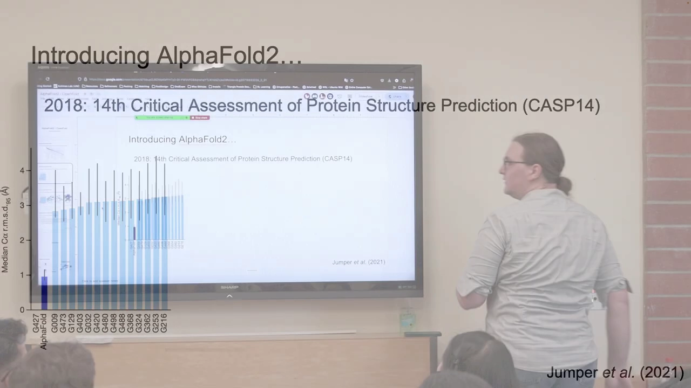

除了 RMSD 数值，AlphaFold2 给出的结构本身也很出色：末端（termini）会预测得稍差一些，但绝大部分与天然结构几乎完全一致，**TM-score 很高、RMSD 很低**。有一个很能说明"它学到了化学直觉"的例子：这个模型**并没有显式地对金属离子或其他分子建模**，但依然复现了锌离子的天然结合位点——侧链的摆放方式仍能配位锌离子。[【跳转到 02:18】](https://www.youtube.com/watch?v=Y5-lhdwdJC0&t=138) 它也能处理**非常大的结构**：整体基本正确，只有少数错误（主要在环区或外侧），RMSD 仍只有 2.2，TM-score 很高。[【跳转到 02:34】](https://www.youtube.com/watch?v=Y5-lhdwdJC0&t=154)

这个模型**2018 年首次亮相，但论文直到 2021 年才发表**，差不多也是完整开源代码发布的时候。在这段空白期里，很多人尝试复现它在 CASP14 中展现的性能，**RoseTTAFold** 就是在此时登场的；它没有 AlphaFold2 那么强，但仍取得了巨大提升，而且 AlphaFold2 提出的某些思路至今仍被 RFdiffusion 等沿用。[【跳转到 02:53】](https://www.youtube.com/watch?v=Y5-lhdwdJC0&t=173)

---

## 二、AlphaFold2 与 OpenFold：一份「忠实但可训练」的复现

讲者专门用**一页**幻灯片讲二者的区别，因为**它们其实没什么区别**。核心背景是：**AlphaFold2 只公布了推理代码，所以你无法复现它的训练**。于是 **Mohammed AlQuraishi** 和其他一些人聚在一起，决定合力重造 AlphaFold2 并开源代码，还在补充材料里给出了非常详尽的算法，让它对所有人都**完全可训练**。[【跳转到 03:42】](https://www.youtube.com/watch?v=Y5-lhdwdJC0&t=222)

OpenFold 相比原版的主要差别是：[【跳转到 03:32】](https://www.youtube.com/watch?v=Y5-lhdwdJC0&t=212)

- **快 3–5 倍**（对大多数蛋白质），因为它做了大量优化：引入了**自定义算子（custom kernels）**和更快的**注意力**实现等技巧。
- **更省显存**，可以把更长、更大的蛋白质或**多蛋白复合物**塞进**同一块 GPU**。
- 用 **PyTorch** 实现（最广泛使用的机器学习框架），而 AlphaFold2 用的是 **JAX**（Google 较新、偏实验性的框架，但还能用 **TPU**）。[【跳转到 04:07】](https://www.youtube.com/watch?v=Y5-lhdwdJC0&t=247)

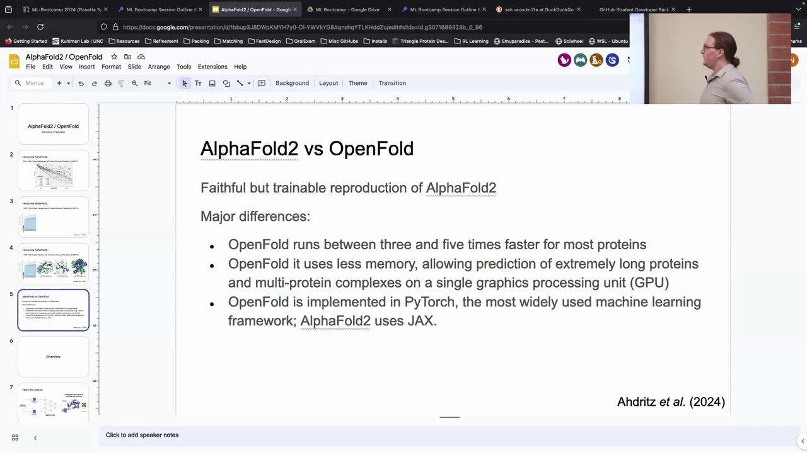

课堂上有人追问"快 3–5 倍是在哪些蛋白质上"，讲者判断**主要是那些较大的蛋白质**——因为大蛋白的瓶颈在显存，而 OpenFold 的内存优化正好对症。[【跳转到 05:00】](https://www.youtube.com/watch?v=Y5-lhdwdJC0&t=300)

---

## 三、AlphaFold2 的输入输出：MSA + 模板进，结构与置信度出

AlphaFold2 的整体逻辑是：**拿一条蛋白质序列，先做数据库搜索**。[【跳转到 05:36】](https://www.youtube.com/watch?v=Y5-lhdwdJC0&t=336)

具体地，它做两类搜索：

1. **序列数据库搜索（genetic database search）**：把查询序列与一个庞大的、来自各种物种的序列库比对，找出高度相似的**同源序列**——这构成了**多序列比对（MSA）**。
2. **结构数据库搜索（structure database search）**：把查询序列与 **PDB** 中所有结构对应的序列比对，找到相似的就**取出那个结构作为模板（template）**。[【跳转到 06:17】](https://www.youtube.com/watch?v=Y5-lhdwdJC0&t=377)

然后 **MSA、序列、模板**一起进入模型（暂时当作一个黑箱神经网络），输出一个**完整的三维结构**，外加**置信度值**。[【跳转到 06:42】](https://www.youtube.com/watch?v=Y5-lhdwdJC0&t=402)

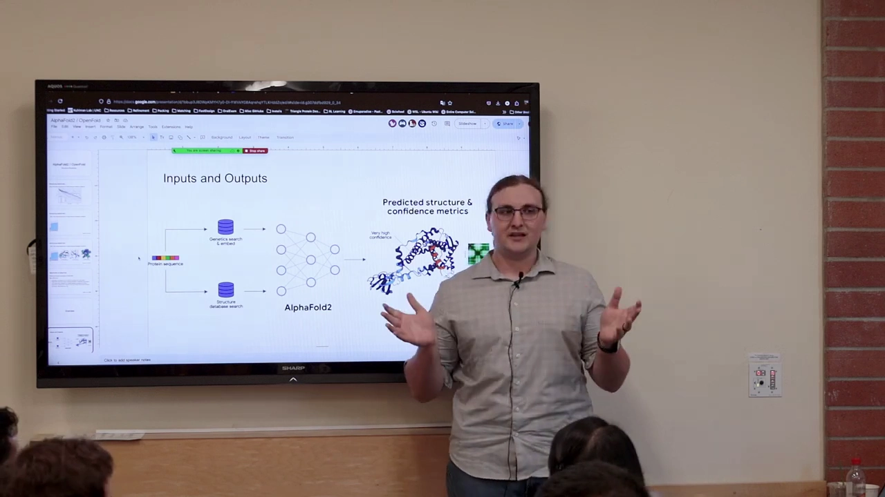

输出里有两种关键的置信度：[【跳转到 07:04】](https://www.youtube.com/watch?v=Y5-lhdwdJC0&t=424)

- **pLDDT（逐残基置信度）**：把结构按 pLDDT 着色，**红色/橙色是低置信区，深蓝是高置信区**。可以看到，结构域这类定义清晰的区域置信度很高，而**环区和末端置信度低得多**，因为它们本身更柔性。[【跳转到 07:19】](https://www.youtube.com/watch?v=Y5-lhdwdJC0&t=439)
- **PAE（预测对齐误差，predicted aligned error）**：一个**成对的误差矩阵**，横纵轴都是残基编号，每个**残基对**都有一个估计误差——本质上是在估计"这两个残基的相对位置偏离天然结构有多远"。[【跳转到 07:42】](https://www.youtube.com/watch?v=Y5-lhdwdJC0&t=462)

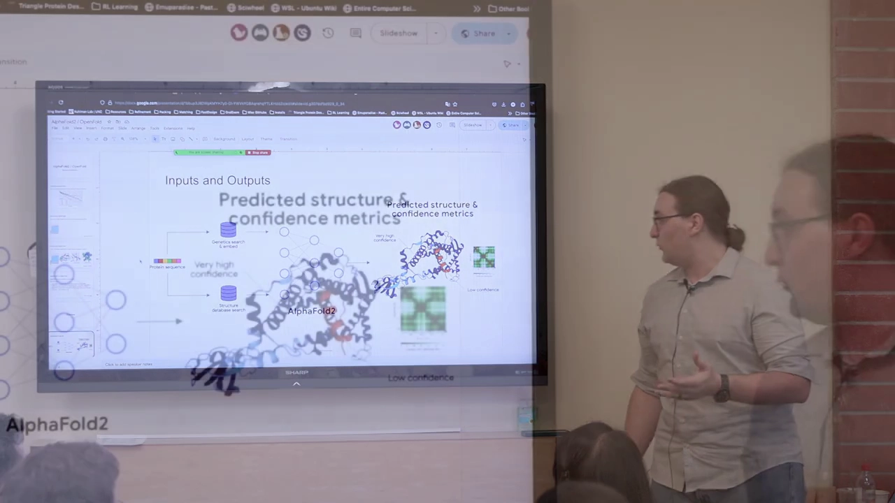

### 3.1 「AlphaFold 会听模板的话吗？」——不总是

课堂上有人问：有时想要蛋白质处于非活性构象（比如 GPCR），能不能**从 PDB 取一个非活性构象当模板**来"逼"它？讲者的回答是：可以这么做，但**AlphaFold 并不总是听模板的话**。对 AlphaFold2 来说，**MSA 才是输入里最重要的因素**；通过**修改 MSA 本身**，你可以制造出不同的构象状态让它预测（至于这些构象是否真实，仍待考证）。[【跳转到 08:28】](https://www.youtube.com/watch?v=Y5-lhdwdJC0&t=508)

另一位讲师补充了一个很有意思的现象：有时模型对某个蛋白质学得**太牢**（尤其是多状态蛋白）——即便 MSA 已经指向某个状态、甚至给了模板，在第一次 recycle 时它可能预测出你想要的构象，但在随后几次 recycle 中，**模型权重又把它"纠正"回训练集里那个状态**。也就是说，它有时会无视你给的一切，取决于它对那些信号学得有多强。[【跳转到 08:53】](https://www.youtube.com/watch?v=Y5-lhdwdJC0&t=533)

---

## 四、性能与置信度校准：RMSD 分布、侧链 χ1、pLDDT/pTM

除了 CASP，讲者还拆解了它在其他方面的表现。[【跳转到 09:18】](https://www.youtube.com/watch?v=Y5-lhdwdJC0&t=558)

**整链 Cα RMSD 的分布**：横轴是分数、纵轴是整条链的 Cα RMSD。可以看到大多数时候它预测的结构 RMSD 都很低；但确实有一条**相当大的"尾巴"**，对应那些基本预测错的结构（RMSD 超过 8 Å）。由于 RMSD 依赖长度，不知道具体蛋白多大就很难说这条尾巴"有多糟"；但对**大多数**蛋白质来说它仍然表现很好。[【跳转到 09:49】](https://www.youtube.com/watch?v=Y5-lhdwdJC0&t=589)

**侧链 χ1 的预测**：第二张图是**预测正确的 χ1 旋转异构体的比例**，横轴是残基的**局部置信度 lDDT-Cα**。χ1 是参数化侧链的二面角之一（除甘氨酸和丙氨酸外，几乎所有氨基酸都有意义）。图上清楚地显示：**局部质量越高，侧链预测越准**——这很合理，如果你对结构域的整体主链结构越有信心，就越能预测出正确的侧链位置。[【跳转到 11:15】](https://www.youtube.com/watch?v=Y5-lhdwdJC0&t=675)

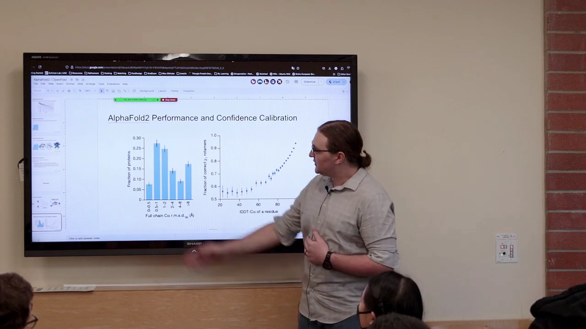

**置信度校准得怎么样？** 一个有意思的问题是：模型自带的置信度，和它试图估计的真实值吻合得如何？两张图分别对照 **lDDT vs pLDDT** 和 **TM-score vs pTM**，可以看到**预测置信度与真实值吻合得相当好**，说明它对"自己有多自信 / 预测有多好"给出了相当可靠的估计，这对实际使用这些模型很有用。[【跳转到 12:10】](https://www.youtube.com/watch?v=Y5-lhdwdJC0&t=730)

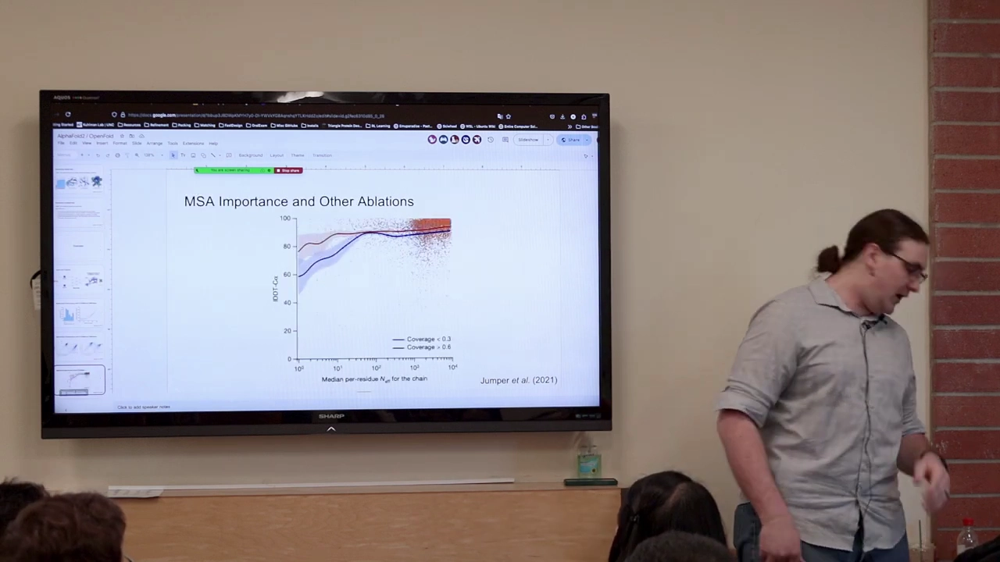

---

## 五、MSA 有多重要：N_eff 曲线与消融实验

**MSA 的深度直接决定预测质量。** 这里横轴是**有效序列数 N_eff**（MSA 里的序列数目），纵轴是 lDDT-Cα。[【跳转到 12:35】](https://www.youtube.com/watch?v=Y5-lhdwdJC0&t=755)

- 如果**只有一条序列**（N_eff = 1），表现会**截然不同（大幅下降）**。
- 往 MSA 里加入更多序列确实能改善效果，但**大约在 30 条序列左右就开始趋于平缓**；此后仍略有增长，但能榨取的信息已经不多了。

所以结论是：**MSA 对获得准确预测至关重要；如果你只有一条序列，表现会大幅下降**。这一点对**从头设计（de novo design）**尤其要记住——从头设计很多时候是想从零造一个自然界不存在的蛋白质，它可能没有多少（甚至完全没有）进化历史，或与我们已知的蛋白质都不相似，这会极大影响预测质量。[【跳转到 13:42】](https://www.youtube.com/watch?v=Y5-lhdwdJC0&t=822) 课堂上有人顺势问"那会不会出现零序列的情况"，答案是：不会，因为**查询序列本身就算一条**。

课堂上还追问："既然 MSA 这么重要、从头设计又没有 MSA，为什么还把它当设计的验证步骤？"讲者的解释是：AlphaFold 有时**仍能很好地预测从头设计蛋白**（另一些情况则完全错误），可能是因为很多从头设计蛋白**超级稳定、通常也更小**，它们的序列模式**非常强烈地指向某种拓扑结构**，容易从序列里捕捉到——相比高度柔性的蛋白，这类结构模式更容易被学到。[【跳转到 33:12】](https://www.youtube.com/watch?v=Y5-lhdwdJC0&t=1992)

### 5.1 消融实验：模型里的哪些部件真正有用

团队做了一堆**消融实验（ablation study）**——移除模型的一些组件，看它们对预测有多大影响。[【跳转到 14:06】](https://www.youtube.com/watch?v=Y5-lhdwdJC0&t=846)

- **自蒸馏（self-distillation）**：他们用模型做大量预测，然后**在高置信度的预测上微调模型**。因为 PDB 里只有约二十万个结构（算上独特结构更少），这是一种"往模型里灌入更多数据"的方式。它大约能把 GDT 提高 **2%**——不算大，但比基线好。[【跳转到 14:36】](https://www.youtube.com/watch?v=Y5-lhdwdJC0&t=876)
- **模板的影响很小**：移除模板对整体质量影响不大，说明模型其实**并不太看模板**。他们实际训练了**五个模型**，其中**三个完全不用模板**——所以不是"完全不用"，而是"不太依赖"。[【跳转到 14:49】](https://www.youtube.com/watch?v=Y5-lhdwdJC0&t=889)
- **recycle（循环）有益**：模型做一次预测，把预测结果再喂回去让它再试，一共做**三次**，也能提升表现。给模型多次预测的机会是有益的。[【跳转到 15:14】](https://www.youtube.com/watch?v=Y5-lhdwdJC0&t=914)

课堂上还讨论了"怎么让模型更听模板的话"：有人提到 AlphaFold 技术上有一个可以调"对模板有多自信"的旋钮，但在他们手里**似乎没太大作用**；一个可行的办法是**筛选输入信息**——比如不给它 MSA，它就**只能退回到模板**，这样可以施压，但也只在某些时候有用，且**非常取决于具体蛋白质**。[【跳转到 16:57】](https://www.youtube.com/watch?v=Y5-lhdwdJC0&t=1017)

## 六、AlphaFold2 整体架构：一条从序列到 3D 结构的流水线

把上面这些线索串起来，就是 AlphaFold2 的全貌。它的输入是**一条序列**；序列分别走两条支路，一条做**基因搜索（genetic database search）**得到 **MSA**，另一条做**结构搜索（structure database search）**并经过**配对（Pairing）**得到**模板（Templates）**；两条支路的产物一起进入 **Evoformer（48 个 block）**，输出更新后的 MSA 表示和**配对表示（pair representation）**；更新后的 MSA 表示被压成**单链表示（single representation）**，再和配对表示一起进入**结构模块（Structure module，8 个 block）**，最终输出 **3D 结构**与**置信度（高置信/低置信）**。结构模块的输出还会**回灌回去，循环（recycling）三次**。[【跳转到 20:04】](https://www.youtube.com/watch?v=Y5-lhdwdJC0&t=1204)

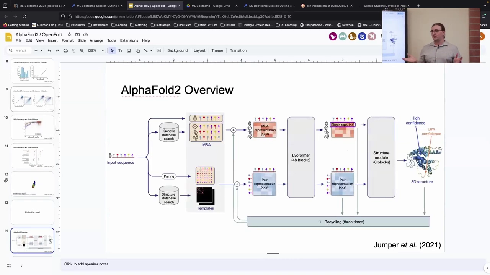

几个关键对象值得先建立直觉：

- **MSA 里的序列来自不同物种**（人类、鱼、兔子……），这些只是物种差异。它们被嵌入（embedding）成一种高维表示，本质上是**用抽象的方式表示"这个 MSA 是什么"**。它是一个相当大的对象：大致是 **128 × 序列数目 × 残基数**。[【跳转到 21:44】](https://www.youtube.com/watch?v=Y5-lhdwdJC0&t=1304)
- **配对表示（pair representation）**：表示**蛋白质中每一对残基之间的相互作用**，形状大致是 **残基数 × 残基数 × 通道数（也是 128）**。这是模型学习"推理残基之间相对位置"的地方。[【跳转到 22:09】](https://www.youtube.com/watch?v=Y5-lhdwdJC0&t=1329)
- **模板 → distogram（距离分布图）**：模板结构被转成距离分布——根据 **Cα/Cβ** 计算每对残基之间的距离，生成一张距离分布图，且只用了**四个模板**。[【跳转到 20:52】](https://www.youtube.com/watch?v=Y5-lhdwdJC0&t=1252)
- **Evoformer**：整段 MSA 处理都发生在这里。它**迭代地更新** MSA 表示和配对表示，目标是提取所有**进化信息、残基之间的耦合关系**，最终我们**丢弃除查询序列之外的每一条序列表示，只保留第一条**，得到单一表示 U。[【跳转到 22:49】](https://www.youtube.com/watch?v=Y5-lhdwdJC0&t=1369)

### 6.1 为什么"共进化"能指向结构

MSA 之所以有用，核心在于**共进化**。你观察两个位置，看它们在序列变化时**一起变了多少**：两个残基越相关（X 变 Y 也跟着变），通常意味着它们在 3D 空间中**非常接近**——因为蛋白质需要维持这种相互作用，一个残基的身份变了，另一个往往也不得不跟着变，才能维持"电荷对电荷"或"疏水对疏水"的搭配。于是**相关性越强，在结构空间中的距离就越近**；模型据此排出接触图。这种从 MSA 抽出的信号，再与配对表示结合，就让模型获得了"什么靠在一起、什么不靠在一起"的强概念。[【跳转到 26:08】](https://www.youtube.com/watch?v=Y5-lhdwdJC0&t=1568)

### 6.2 从序列到原子坐标，中间到底经过什么

输入侧还有一个 $\textbf{填充/特征化（featurization）}$ 步骤。以最简单的一项为例：**残基索引**就是"这个氨基酸在序列中的位置"；**氨基酸类型**则被转成一个 **20 维的独热（one-hot）向量**——20 种氨基酸对应 20 个位置，只在代表该氨基酸的那一维写 1。此外还有 **profile 信息**、**缺失（deletion）计数**、**模板特征**、**角度特征（如主链二面角）**、**配对特征（如 Cβ distogram）**等。[【跳转到 34:48】](https://www.youtube.com/watch?v=Y5-lhdwdJC0&t=2088)

这些维度各异的信息会被各自**线性投影到同一个高维空间**，这样就能直接相加、融合成 MSA 表示和配对表示。举例来说，配对表示一方面由**每一对残基在序列中的相对位置**构成，另一方面还纳入**查询序列的序列信息**；MSA 表示则既含序列信息、也含 MSA 自身信息。由于 MSA 序列数可能远超上限，模型还引入一个额外的 **"extra MSA stack / MSA 插入特征"**，把多余的序列压缩成一组信息补进配对表示，尽量不浪费手头的信息。[【跳转到 37:24】](https://www.youtube.com/watch?v=Y5-lhdwdJC0&t=2244)

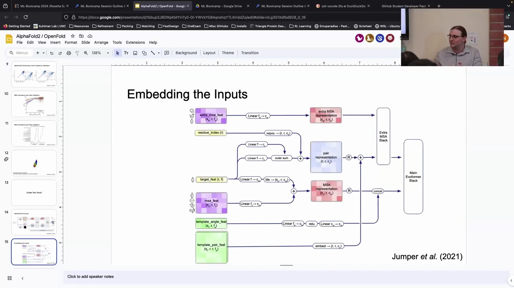

课堂还演示了一个有趣的可视化：把 **Evoformer 切成越来越深的小片段**，为每个片段分别训练一个结构预测模块。随着 Evoformer 越来越深、从 MSA 提取的信息越来越多，**预测会逐步变好**；有些结构很快就被确定下来，而另一些区域则要慢慢琢磨。这说明表示是**渐进式**地被精炼成最终结构的。[【跳转到 18:34】](https://www.youtube.com/watch?v=Y5-lhdwdJC0&t=1114)

### 6.3 recycle 到底循环了什么

标准一次运行会 **recycle 三次，所以网络一共前向传播四次**。第一遍后得到预测结构，然后模型**从结构中提取信息，加回到 MSA 表示和配对表示上**，再重新处理一遍，尝试做出更好的预测。[【跳转到 24:15】](https://www.youtube.com/watch?v=Y5-lhdwdJC0&t=1455) 一个容易被误解的细节是：**MSA 的初始嵌入并不会被改变**，被加进去的是"模型认为上一次预测做对了/做错了什么"的额外上下文；而且**它不累积**——每次都只从**上一次** recycle 拿信息，而不是把前几次都记下来。[【跳转到 25:38】](https://www.youtube.com/watch?v=Y5-lhdwdJC0&t=1538)

---

## 七、Evoformer 内部：注意力、门控与三角操作

要理解 Evoformer，先要理解**注意力机制（attention）**。讲者用 3Blue1Brown（视频里口误成 "Three Brown One Blue"）的《Inside an LLM》做了一个直观铺垫：输入被拆成 **token（词元）**，每个 token 对应一个向量；这些向量经过**注意力块**互相交流、更新含义（例如"model"在"机器学习模型"和"时装模特"里含义不同）；再经过**多层感知机 / 前馈层**，向量之间不再互相交流、而是并行地经过同一操作。整个 Transformer 就是**注意力块与前馈块交替堆叠**。[【跳转到 41:31】](https://www.youtube.com/watch?v=Y5-lhdwdJC0&t=2491)

把这个框架搬到蛋白质：**token 就是单个残基**。[【跳转到 42:16】](https://www.youtube.com/watch?v=Y5-lhdwdJC0&t=2536) 注意力让残基能够**互相交流**，而且不像卷积网络那样被限制在局部邻域（每次只能和最近十几个邻居说话）——在这里，**每个残基都能跟其他所有残基交流**，来判断彼此应该靠近还是远离。[【跳转到 43:06】](https://www.youtube.com/watch?v=Y5-lhdwdJC0&t=2586)

注意力的工作机制可以用 **query（查询）/ key（键）/ value（值）** 来理解：每个 token 生成自己的 Q/K/V，然后把"自己的 query"和"其他 token 的 key"比较，**匹配就取用对应的 value，不匹配就不太理会**。又因为有**多个头（multi-head）**，模型可以同时关注不同的方面。讲者用**约会软件**作类比：每个人格有多个侧面（音乐口味、爱好……），软件把它们互相比较、算一个匹配度分数，多头的意义就是让模型能分别表达这些不同的侧面。[【跳转到 45:05】](https://www.youtube.com/watch?v=Y5-lhdwdJC0&t=2705)

### 7.1 MSA 表示怎么更新：按行、按列、再转换

在 Evoformer 里，MSA 表示的更新分三步：[【跳转到 47:08】](https://www.youtube.com/watch?v=Y5-lhdwdJC0&t=2828)

1. **按行门控注意力（rowwise gated attention with pair bias）**：MSA 的**每一行是一条序列**。模型在**序列层面**做注意力，让每条序列关注自己内部的残基，理解"这条序列里有哪些模式、为什么在这儿"，并据此更新自身状态。[【跳转到 47:37】](https://www.youtube.com/watch?v=Y5-lhdwdJC0&t=2857)
2. **按列门控注意力（columnwise gated attention）**：现在对**每一个位置**，去看该位置上、来自**所有序列**的残基。比如人类序列的第 1 个残基去看鱼类序列的第 1 个残基……这就开始纳入**进化历史**：这个残基是保守的吗？会突然切换吗？是不是只有两种偏好？[【跳转到 47:52】](https://www.youtube.com/watch?v=Y5-lhdwdJC0&t=2872)
3. **转换（transition）**：相当于视频里说的"问一长串问题再更新自己的状态"。

此外，配对表示也会被引入到 MSA 的注意力里，让两种表示能互相交流，避免得出不一致的假设。[【跳转到 48:47】](https://www.youtube.com/watch?v=Y5-lhdwdJC0&t=2927) 而 MSA 更新完之后，又会**加回到配对表示**上，接着配对表示开始**与自身交流**，逐步提出"各方应该在哪"的结构假设。[【跳转到 49:09】](https://www.youtube.com/watch?v=Y5-lhdwdJC0&t=2949)

### 7.2 三角操作：把「三角不等式」这类物理约束塞进模型

配对表示更新里最有意思的，是所谓的**三角操作（triangle operations）**，包括**三角更新（triangle update，视频里也称作三角乘法 triangle multiplication）**和**三角注意力（triangle self-attention）**。核心思路是**给模型强加一个归纳偏置（inductive bias）**：蛋白质是三维空间中的物体，必须遵守空间带来的物理约束，比如**三角不等式**——三角形任意两边之和不能小于第三边。[【跳转到 50:27】](https://www.youtube.com/watch?v=Y5-lhdwdJC0&t=3027)

具体做法是让**残基三元组（i, j, k）彼此交流**：我们有 i、j、k 之间的配对表示（i-j、j-k、k-i 等边），把它们连接起来，用其中两条边去更新另一条边。例如"两条边都从同一节点流出（outgoing edges）"就合并进对应的配对表示；而在"流入方向（starting/ending node）"上，第三个残基把信息送给要更新的那一对，从而把"第三个残基在哪"也纳入这对残基的表示中。[【跳转到 52:03】](https://www.youtube.com/watch?v=Y5-lhdwdJC0&t=3123)

为什么要这么做？讲者解释：模型最终输出的是**残基坐标系**，而坐标系**天然满足三角不等式**，所以这是一个**先验正确**的约束；在中间把这些信息显式传递，就给模型指出了一条"阻力最小的路径"，让它更快收敛并内化这种物理性质。[【跳转到 55:23】](https://www.youtube.com/watch?v=Y5-lhdwdJC0&t=3323) 消融实验也支持这一点——去掉三角注意力后效果**反而更差**。[【跳转到 56:13】](https://www.youtube.com/watch?v=Y5-lhdwdJC0&t=3373) 至于三角乘法与三角注意力的区别：后者合并的信息更多、但也更贵；最初三角乘法是作为更便宜的替代，后来发现**两者都用比只用其一更好**，所以都保留了。[【跳转到 52:53】](https://www.youtube.com/watch?v=Y5-lhdwdJC0&t=3173)

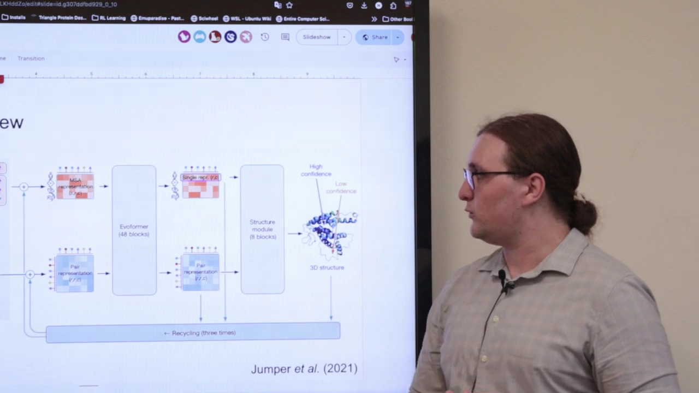

---

## 八、结构模块：残基气体、IPA、SE(3) 与 FAPE 损失

Evoformer 处理完后，我们拿到了更新后的配对表示（一个还不错的结构假设）和单链表示。现在要从某个起点**构建 3D 结构**。[【跳转到 58:12】](https://www.youtube.com/watch?v=Y5-lhdwdJC0&t=3492)

### 8.1 「黑洞初始化」与残基气体

起点是所谓的**黑洞初始化（black hole initialization）**：把**所有残基坐标系丢到原点 (0,0,0)**，然后让它们被逐渐移动、展开。[【跳转到 58:29】](https://www.youtube.com/watch?v=Y5-lhdwdJC0&t=3509) 这正是之前那段可视化里"一开始全挤在一起、然后逐渐展开"的原因。[【跳转到 58:34】](https://www.youtube.com/watch?v=Y5-lhdwdJC0&t=3514)

这种做法被称为**残基气体（residue gas）**：把**每个残基当作一个可以相对于彼此独立移动的对象**。它的好处很关键——它**打破了多肽的链式结构**，因此可以**同时精修每个残基的局部环境**；代价是可能破坏一些物理约束，所以最后有一个**松弛（relaxation）步骤**来把约束补回来。[【跳转到 23:15】](https://www.youtube.com/watch?v=Y5-lhdwdJC0&t=1395)

### 8.2 IPA：让配对表示、单链表示和主链坐标互相交流

**IPA（Invariant Point Attention，不变性点注意力）**是结构模块的核心。它让**配对表示、单链表示和当前主链坐标系**三者相互交流：单链表示生成 query 和 key，与 3D 位置比较，判断哪些残基应该相互交流、并相对移动；配对表示则带着它的结构假设来更新这些注意力亲和度。最终每个残基都知道"它应该对哪个残基关注多少"，据此更新单链表示。[【跳转到 68:27】](https://www.youtube.com/watch?v=Y5-lhdwdJC0&t=4107)

结构模块一共 **8 个这样的 block（共享权重）**，每个 block 里：先做 IPA 更新单链表示，再据此**预测旋转和平移**来更新主链坐标系，最后**预测侧链的 χ 角并计算所有原子位置**。如此反复 8 次，残基从中心展开、组织成二级结构单元，最终得到一个包含全部重原子的完整结构。[【跳转到 70:45】](https://www.youtube.com/watch?v=Y5-lhdwdJC0&t=4245)

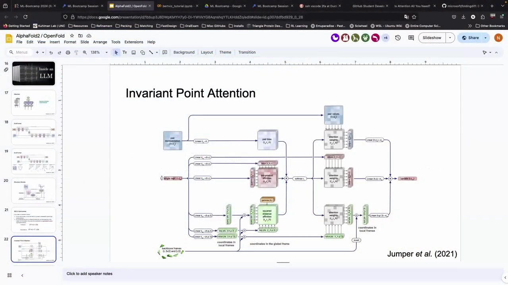

### 8.3 SE(3)、不变性与等变性

要理解 IPA 为什么叫"不变性点注意力"，需要一点 **SE(3)** 的概念。SE(3) 是一个**流形（manifold）**，局部看起来像欧几里得空间一样平坦。每个**残基坐标系（frame）**由三个正交向量（三个方向）定义，可以**用一个旋转矩阵和一个平移来参数化**——这正是 SE(3) 的定义。[【跳转到 63:18】](https://www.youtube.com/watch?v=Y5-lhdwdJC0&t=3798)

这里有两个必须分清的性质：[【跳转到 64:59】](https://www.youtube.com/watch?v=Y5-lhdwdJC0&t=3899)

- **不变性（invariance）**：如果把整个蛋白质旋转/平移，它**还是同一个蛋白质**，函数的输出不因此改变。
- **等变性（equivariance）**：坐标**会**随全局变换而改变，但改变方式是**明确、可计算的**——你知道变换，就能算出新坐标。

讲者强调，这两个性质在建模蛋白质时非常重要，而且**不只是架构问题**：任务、数据本身都可以是不变或等变的，把整个系统组合起来时必须对每个组件都小心，免得微调时把它弄坏。[【跳转到 67:53】](https://www.youtube.com/watch?v=Y5-lhdwdJC0&t=4073) 不同的模型选择了不同的路线：**AlphaFold 用不变性，RoseTTAFold 用等变性**，各自用不同的架构来实现。[【跳转到 65:35】](https://www.youtube.com/watch?v=Y5-lhdwdJC0&t=3935)

### 8.4 FAPE：为「残基坐标系」量身定做的损失

由于一切都用**框架（frame）**来参数化，就需要一个合适的损失函数，这就是 **FAPE（Frame Aligned Point Error，框架对齐点误差）**。[【跳转到 73:48】](https://www.youtube.com/watch?v=Y5-lhdwdJC0&t=4428)

FAPE 的做法是：取**每一个残基框架**，把它**对齐到它在天然结构中的位置**，然后在某个邻域内计算**其他每个点的误差**。直观上它是一种**局部结构相似度**度量：对齐了你关注的残基后，看看周围每个点偏了多少，再尽力把这些偏差一起最小化。[【跳转到 75:09】](https://www.youtube.com/watch?v=Y5-lhdwdJC0&t=4509) 它相比 RMSD 有若干优势：能处理**手性（chirality）/镜像反射**，内存占用更低（RMSD 需要精细的对齐细节，而 FAPE 只需分解成 Cα 的平移和一个 3×3 旋转矩阵）。[【跳转到 76:01】](https://www.youtube.com/watch?v=Y5-lhdwdJC0&t=4561)

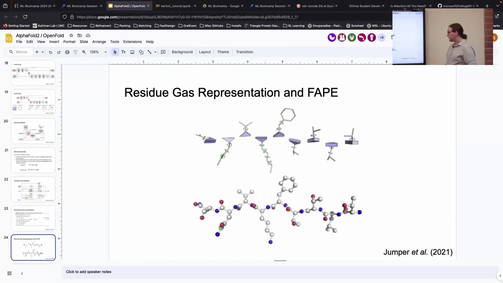

> 关于残基框架：每个残基由一个框架表示，它其实由 **N–Cα–C** 三个共面原子定义（Cβ 大致垂在侧面），还能算出垂直于该平面的**法向量**；侧链则用 **χ 角**参数化——旋转某个键之后的所有部分，就改变了对应的 χ 角。不同的侧链有不同数量的 χ 角可以旋转。[【跳转到 73:22】](https://www.youtube.com/watch?v=Y5-lhdwdJC0&t=4402) 当模型准备输出结构时，它会把框架 + χ 角**转换回每个原子的坐标**（基于理想键长键角、像一棵树一样放置原子）。[【跳转到 77:24】](https://www.youtube.com/watch?v=Y5-lhdwdJC0&t=4644)

---

## 九、训练损失与两个阶段：FAPE、distogram、masked MSA 与置信度

AlphaFold2 的损失函数是多项损失加权求和，讲者用一张图把它完整列出：[【跳转到 46:44】](https://www.youtube.com/watch?v=Y5-lhdwdJC0&t=2804)

$$
\mathcal{L} =
\begin{cases}
0.5\,\mathcal{L}_{\text{FAPE}} + 0.5\,\mathcal{L}_{\text{aux}} + 0.3\,\mathcal{L}_{\text{dist}} + 2.0\,\mathcal{L}_{\text{msa}} + 0.01\,\mathcal{L}_{\text{conf}} & \text{训练} \\
0.5\,\mathcal{L}_{\text{FAPE}} + 0.5\,\mathcal{L}_{\text{aux}} + 0.3\,\mathcal{L}_{\text{dist}} + 2.0\,\mathcal{L}_{\text{msa}} + 0.01\,\mathcal{L}_{\text{conf}} + 0.01\,\mathcal{L}_{\text{exp resolved}} + 1.0\,\mathcal{L}_{\text{viol}} & \text{微调}
\end{cases}
$$

各项的含义：[【跳转到 79:12】](https://www.youtube.com/watch?v=Y5-lhdwdJC0&t=4752)

- **$\mathcal{L}_{\text{FAPE}}$**：主损失，确保每个残基框架与天然蛋白质的框架对齐（见第八章）。
- **$\mathcal{L}_{\text{aux}}$**：一个**辅助损失**，是只作用在 **Cα 上的 FAPE，外加 χ1 的 MSE**，相当于在每个结构模块 block 内部就施加一次引导。
- **$\mathcal{L}_{\text{dist}}$（distogram）**：让模型对最终配对表示**预测每对残基的距离分布**，并施加损失——这正是配对表示带有"结构假设"意味的原因。
- **$\mathcal{L}_{\text{msa}}$（masked MSA）**：把 MSA 中不同的残基**掩掉（mask）**，让模型去**补全**。这让模型开始思考 MSA 内部的缺失部分，对学到**共进化模式**相当重要。
- **$\mathcal{L}_{\text{conf}}$（置信度）**：确保置信度被正确学习。
- **$\mathcal{L}_{\text{exp resolved}}$（仅微调）**：检查模型是否认为某残基**在实验结构里被解析出来（resolved）**——这也许正是它能较好预测无序区域的原因之一。
- **$\mathcal{L}_{\text{viol}}$（仅微调，结构违规）**：确保**键角、键长**合理并约束肽键。

**为什么要分两个阶段？** 因为一次把所有损失都加进去会让训练动态不稳定：损失项越多，你试图最小化的**"能量景观"就越崎岖、越难导航**。所以策略是：**初始训练先把整体结构弄对**，再在**微调**阶段引入针对结构违规的额外约束。微调只是"继续训练，但用非常小的步长更新参数"，从而走进一个更深的损失极小值。[【跳转到 83:56】](https://www.youtube.com/watch?v=Y5-lhdwdJC0&t=5036)

**辅助损失为什么重要？** 因为它作用在**每个结构模块 block 内部**：模型每生成一版框架和 χ 角，就立刻被算一次"离目标还有多远"。结果是模型被强加了一个**漏斗状**的训练形态——每一步的表示都越来越好、损失越来越低，而不是"只看最终结果、中间过程无所谓"。这促使模型进行**迭代精修（iterative refinement）**。[【跳转到 79:12】](https://www.youtube.com/watch?v=Y5-lhdwdJC0&t=4752)

用一句话概括这些损失的"教学分工"：**MSA 损失**教模型读懂 MSA 里的共进化信息、补全蛋白质演化历史中的缺失；**distogram** 帮忙构建那个被迭代优化的结构假设；**FAPE** 是主要目标（最终结构要好看）；**置信度损失**则让模型学会估计自己预测的准确度。[【跳转到 82:16】](https://www.youtube.com/watch?v=Y5-lhdwdJC0&t=4936)

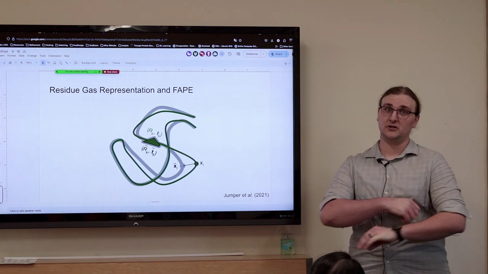

---

## 十、AlphaFold2 的局限：它不是完美系统

讲者用一页幻灯片专门讲局限，因为**所有这类系统都不完美**。[【跳转到 84:21】](https://www.youtube.com/watch?v=Y5-lhdwdJC0&t=5061)

- **突变（mutations）**：对查询序列做一个突变，自然界中结构通常会变；但 AlphaFold 由于**严重依赖 MSA**，很多时候**根本不在乎序列的细微差别**——因为演化历史里，位置本来就会随物种、随共进化而变化。所以在查询序列里改一个位置、其余不变，对它的影响并不大，它**并不擅长预测突变带来的影响**。[【跳转到 85:01】](https://www.youtube.com/watch?v=Y5-lhdwdJC0&t=5101)
- **全新折叠（novel protein folds）**：表现**不算惊艳**，还行、但可以更好。
- **多状态（multiple states）**：也不擅长，虽然我们聊过几种应对办法。
- **五个模型的预测差异**：五个模型会给出不同预测，但通常相当相似；**没有证据表明它们真的代表不同状态**，尽管人们正试图让这点变得有用。[【跳转到 85:51】](https://www.youtube.com/watch?v=Y5-lhdwdJC0&t=5151)
- **内在无序（intrinsic disorder）**：它常常**相当确信某些区域是无序的，却只能拉出一团"意大利面"**。所以你基本**没法相信这些区域到底在哪**，不过可以相对确信它们是无序的。[【跳转到 86:16】](https://www.youtube.com/watch?v=Y5-lhdwdJC0&t=5176)
- **不显式建模其他分子**：它只考虑蛋白质原子；但因为是在 PDB 的真实结构上训练的，它**多少知道存在一些自己没在考虑的东西**——正如前面那个例子，它仍能配位锌离子，也能对"没给的链"做一定推理。

课堂上还追问："那这些会被 Amber 松弛修复吗？"答案是否定的：Amber 虽然知道一点化学，但被**如此强烈地约束向预测结构**，所以它只能解决**严重的化学/物理违规**，并不会去"修复"结构预测本身的问题。[【跳转到 87:06】](https://www.youtube.com/watch?v=Y5-lhdwdJC0&t=5226)

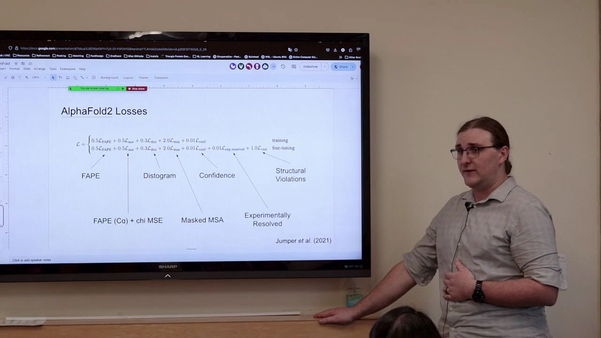

---

## 十一、扩展生态：从 Multimer 到 BindCraft

AlphaFold2 是 AI 与结构生物学里一个非常突出的例子，而且开源，所以很多人能去折腾它、看能做出什么。讲者介绍了一圈重要扩展。[【跳转到 87:24】](https://www.youtube.com/watch?v=Y5-lhdwdJC0&t=5244)

### 11.1 AlphaFold-Multimer：把单体模型扩展到多聚体

第一个扩展来自 DeepMind 自己：把模型**扩展并训练在多聚体复合物上**，得到 **AlphaFold-Multimer**。对模型本身的改动大多比较小：[【跳转到 87:51】](https://www.youtube.com/watch?v=Y5-lhdwdJC0&t=5271)

- 加入了考虑**链排列对称性**的损失（三聚体里 A、B、C 三条链身份可交换，要保证这种对称性在模型内部成立）；
- 对 MSA 做了**跨链配对（pairing）**，利用"序列来自哪些物种"的信息，为"这些链如何相互作用"提供额外线索；
- 引入**新的残基取子集（cropping）方式**——他们无法在完整蛋白上训练，所以在子集上训练（如 356 / 256 / 512 个残基），对多聚体则专门裁剪以**保留蛋白质之间的界面**。

主要卖点是它在 **DockQ**（衡量两个蛋白质对接质量的指标）上**好得多**，远超人们对单体版本做各种修改的尝试。[【跳转到 89:05】](https://www.youtube.com/watch?v=Y5-lhdwdJC0&t=5345) 另一个叫 **AlphaFold-Linker** 的思路是：在两个蛋白质之间插一条**超长连接子**，把它们拉得很远，但仍做多聚体预测——有效，只是不如 Multimer。[【跳转到 89:30】](https://www.youtube.com/watch?v=Y5-lhdwdJC0&t=5370)

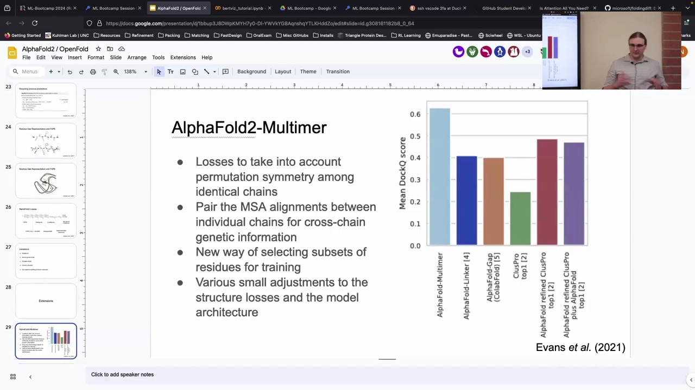

### 11.2 AlphaFold DB：两亿多条预测结构

现在有一个包含海量序列的**结构数据库（AlphaFold DB）**，条目**超过两百万条**，覆盖了大部分 UniProt，包括**整个人类蛋白质组**和另外 **47 个物种**的蛋白质组。做法就是取一大堆序列、做一大堆预测。它的一个局限是**只包含单体**，所以如果你想从中拿多聚体结构，很遗憾拿不到——但它仍是非常好的资源。[【跳转到 90:19】](https://www.youtube.com/watch?v=Y5-lhdwdJC0&t=5419)

### 11.3 让 AlphaFold「知道自己想要什么」：AFsample、AF-Cluster、AF2Rank

- **AFsample（Wallner 等）**：核心洞见是——**AlphaFold 其实知道什么样的结构是好的，只是可能需要很多帮助才能到达那里**。他们的做法是**打开 Evoformer 的 dropout**（把网络中一部分信号随机关掉），并**启用更多 recycling**，从而生成大量多样化结构；再按置信度排序，效果比单次预测好得多。**但有个巨大的前提**：你需要做**大规模预测**（可能要**约一千倍以上的计算量**）来获得足够多样性、再筛选——效率很低，却说明 AlphaFold 的"结构品味"其实不错。[【跳转到 91:21】](https://www.youtube.com/watch?v=Y5-lhdwdJC0&t=5481)
- **AF-Cluster（Sergey Ovchinnikov 等）**：通过**按序列一致性对 MSA 聚类**，把可能偏向某个特定构象的序列聚到一起，从而**把 MSA 偏向不同的状态**。他们展示了**折叠开关（fold switch）蛋白**的例子：用完整 MSA 能预测出其中一个状态，而只用最接近的序列子集就能偏向另一个状态。这再次说明 **MSA 真的非常重要**，能帮助把预测偏向不同状态——不过它也会在合理范围之外产生一些高置信度、但**可能并非真实物理状态**的结果。[【跳转到 92:52】](https://www.youtube.com/watch?v=Y5-lhdwdJC0&t=5572)
- **AF2Rank（Roney & Ovchinnikov）**：一种评估预测质量的巧妙方法。他们发现 **AlphaFold 其实学到了一套很好的能量函数**——知道什么是好结构；于是通过**以另一种方式使用它的置信度数值**，你可以对给定结构排序、判断某个 decoy 是不是好结构。它在**区分错误结构与正确结构**方面非常稳健。[【跳转到 93:42】](https://www.youtube.com/watch?v=Y5-lhdwdJC0&t=5622)

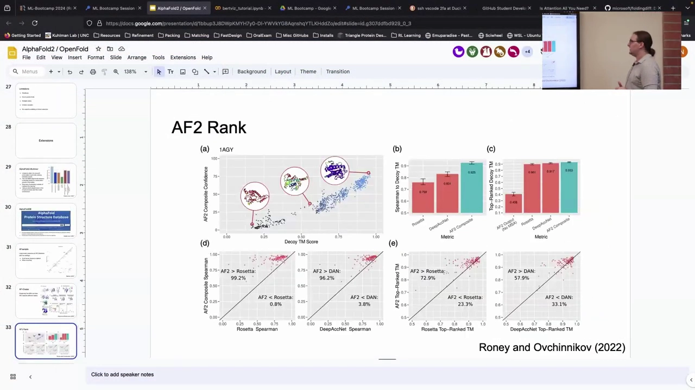

### 11.4 自动化设计工作流：EvoPro / Marita 与 BindCraft

- **EvoPro / Marita**：让"设计—预测—打分"的循环更自动化。思路是做一个**序列的遗传算法**：拿一堆序列做结构预测，再按你关心的指标（比如结合态/未结合态构象是否一致、是否高置信度）打分，然后**排序、淘汰、增加多样性**，反复迭代，直到得到一组 AlphaFold 喜欢、又符合你指标的好序列。[【跳转到 94:36】](https://www.youtube.com/watch?v=Y5-lhdwdJC0&t=5676)
- **BindCraft**：一个很新、很有用的方法，在蛋白质设计竞赛中表现很好。它用 **AlphaFold-Multimer，但通过它做反向传播来更新序列**：从一条带噪声的序列出发，预测出结构并计算置信度，然后把"让置信度更高"作为损失，**把梯度一路传回输入序列**去修改它；之后再用 MPNN 和更多预测优化。这只是大量此类工作流中的一小部分。[【跳转到 95:42】](https://www.youtube.com/watch?v=Y5-lhdwdJC0&t=5742)

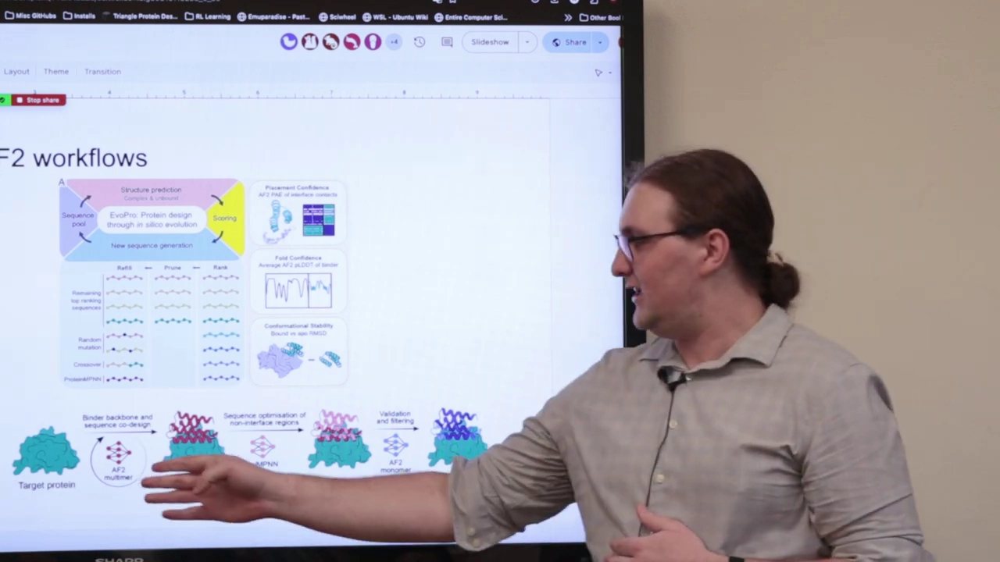

### 11.5 一个课堂延伸问题：能不能对「柔性」不施加损失？

课堂最后讨论了一个想法：既然环区、末端天然更柔性、更难预测，**为什么不降低（甚至不施加）那些柔性残基上的损失权重**，把注意力集中在更有把握的部分？讲者认为这在技术上可行，你也完全可以不信任晶体结构在某些超柔性区域的正确性；但**提前知道哪些区域需要降权比较困难**，加上裁剪等操作，实际收益不确定。而且模型其实**已经知道**这一点——大多数结构里环区置信度本就更低，说明它已经学到"环区更柔性、更难预测"。[【跳转到 98:30】](https://www.youtube.com/watch?v=Y5-lhdwdJC0&t=5910)

---

## 小结

- **CASP14 的登场**：AlphaFold2 是端到端的结构预测模型，把中等难度靶点的中位 Cα RMSD 从约 3 Å 拉到约 1 Å，碾压所有对手；能复现金属配位位点、也能处理大结构。论文 2021 年才发表，期间 RoseTTAFold 登场并取得巨大提升。[【跳转到 01:34】](https://www.youtube.com/watch?v=Y5-lhdwdJC0&t=94)
- **OpenFold 是 AlphaFold2 的"忠实但可训练"复现**：由于原版只开源推理代码，OpenFold 让训练可复现；它快 3–5 倍、更省显存、用 PyTorch（原版用 JAX）。[【跳转到 03:32】](https://www.youtube.com/watch?v=Y5-lhdwdJC0&t=212)
- **输入输出**：输入是 **MSA + 模板**，输出是 **3D 结构 + 置信度**（逐残基 pLDDT、整体 pTM、成对 PAE）；MSA 是输入中最重要的因素，改 MSA 能改变预测出的构象。[【跳转到 07:42】](https://www.youtube.com/watch?v=Y5-lhdwdJC0&t=462)
- **性能**：整链 RMSD 分布大多数很低、但有一条长尾；侧链 χ1 正确率随局部置信度上升；pLDDT↔lDDT、pTM↔TM 校准良好。[【跳转到 12:10】](https://www.youtube.com/watch?v=Y5-lhdwdJC0&t=730)
- **MSA 至关重要**：只有一条序列时表现大跌，约 30 条后趋缓；对没有进化历史的从头设计尤须警惕。消融显示自蒸馏约 +2% GDT、模板影响很小（五个模型里三个不用模板）、recycling 三次有益。[【跳转到 13:42】](https://www.youtube.com/watch?v=Y5-lhdwdJC0&t=822)
- **整体架构**：序列 →（MSA / 模板）→ **Evoformer（48 blocks）** → 单链表示 + 配对表示 → **结构模块（8 blocks）** → 3D 结构；recycling 三次。[【跳转到 20:04】](https://www.youtube.com/watch?v=Y5-lhdwdJC0&t=1204)
- **Evoformer 内部**：token 即残基，靠注意力全局交流；MSA 表示按行/按列门控注意力+转换更新；配对表示用**三角操作**注入三角不等式等归纳偏置，让三元组残基互相交流。[【跳转到 50:27】](https://www.youtube.com/watch?v=Y5-lhdwdJC0&t=3027)
- **结构模块**：从**黑洞初始化**出发，用**残基气体**打破链式结构、同时精修局部；**IPA** 让配对/单链表示与主链坐标互相交流，8 次迭代展开成原子坐标；用 **SE(3)** 的**不变性/等变性**指导设计，用 **FAPE** 作为主损失。[【跳转到 73:48】](https://www.youtube.com/watch?v=Y5-lhdwdJC0&t=4428)
- **损失与两阶段训练**：FAPE + 辅助损失（Cα FAPE + χ1 MSE）+ distogram + masked MSA + 置信度，微调再额外加"实验解析残基"和"结构违规"损失；分阶段是为了避免损失景观过于崎岖。[【跳转到 46:44】](https://www.youtube.com/watch?v=Y5-lhdwdJC0&t=2804)
- **局限**：不擅长突变效应、全新折叠、多状态与无序区；不显式建模非蛋白质分子；松弛只修严重违规。[【跳转到 84:21】](https://www.youtube.com/watch?v=Y5-lhdwdJC0&t=5061)
- **生态扩展**：AlphaFold-Multimer（对称性、跨链 MSA、裁剪、DockQ）、AlphaFold DB（两亿+单体结构）、AFsample（dropout+更多 recycling 造多样性）、AF-Cluster（MSA 聚类偏向状态）、AF2Rank（当能量函数排序 decoy）、EvoPro/Marita（遗传算法工作流）、BindCraft（多聚体反向传播设计）。[【跳转到 87:24】](https://www.youtube.com/watch?v=Y5-lhdwdJC0&t=5244)

## 关键术语速查

| 术语 | 一句话解释 |
| --- | --- |
| CASP14 | 2018 年第 14 届结构预测盲测，AlphaFold2 在此登场 |
| 端到端（end-to-end） | 输入序列直接输出全原子结构，中间无需传统能量法收尾 |
| OpenFold | AlphaFold2 的忠实、可训练、开源的复现（PyTorch） |
| JAX / TPU | AlphaFold2 使用的框架与硬件；OpenFold 改用 PyTorch |
| MSA（多序列比对） | 来自不同物种的同源序列对齐堆叠，模型最重要的输入 |
| 模板（template） | 从 PDB 找到的同源结构，提供初始结构线索 |
| 共进化（co-evolution） | 两个位置一起变化，暗示它们在空间中相互作用 |
| pLDDT | 逐残基的预测局部置信度 |
| pTM | 对整体结构质量的预测（对应 TM-score） |
| PAE（预测对齐误差） | 成对残基的估计误差矩阵，衡量相对位置是否可信 |
| N_eff | MSA 的有效序列数，越多预测通常越好（约 30 条后趋缓） |
| 自蒸馏（self-distillation） | 用高置信度预测微调自身，等于给自己灌更多数据 |
| recycle（循环） | 把预测结果回灌再预测，标准运行三次、共前向四次 |
| Evoformer | AlphaFold2 中处理 MSA 与配对表示、堆叠 48 个 block 的模块 |
| 配对表示（pair representation） | 描述每一对残基相互作用的二维表示（残基×残基×通道） |
| 单链表示（single representation） | 从 MSA 中提取、只保留查询序列的一维表示 |
| 注意力（attention） | 让 token（此处为残基）互相交流并更新表示的机制 |
| query / key / value | 注意力中用于匹配与取值的三个向量 |
| 多头（multi-head） | 并行的多组注意力，可以关注不同方面 |
| 按行 / 按列门控注意力 | MSA 内按序列（行）与按位置（列）分别做注意力 |
| 三角操作（triangle operations） | 让残基三元组互相交流，注入三角不等式等几何约束 |
| 归纳偏置（inductive bias） | 先验地给模型强加的结构性约束（如几何、对称性） |
| 残基气体（residue gas） | 把每个残基当独立对象、打破链式结构以并行精修 |
| 黑洞初始化（black hole initialization） | 所有残基坐标系从原点出发、逐步展开 |
| 结构模块（structure module） | 8 个 block，把表示逐步展开成原子坐标 |
| IPA | 不变性点注意力，让配对/单链表示与 3D 坐标互相交流 |
| SE(3) | 三维刚体运动（旋转+平移）构成的空间/流形 |
| 不变性 / 等变性（invariance / equivariance） | 全局变换下输出不变 / 按可计算方式随之变化 |
| FAPE | 框架对齐点误差，AlphaFold2 的主结构损失 |
| distogram | 残基对之间的距离分布预测 |
| masked MSA | 遮住 MSA 部分残基让模型补全，学共进化 |
| AlphaFold-Multimer | 面向多聚体复合物的扩展，DockQ 显著更好 |
| DockQ | 衡量两个蛋白质对接质量的指标 |
| AlphaFold DB | 两亿多条预测结构的公开数据库（仅单体） |
| AFsample | 打开 dropout、更多 recycling 生成多样构象再筛选 |
| AF-Cluster | 按序列一致性聚类 MSA 以偏向不同构象 |
| AF2Rank | 把 AlphaFold2 的置信度当能量函数来给结构排序 |
| BindCraft | 通过 AlphaFold-Multimer 反向传播来优化设计序列的工作流 |

