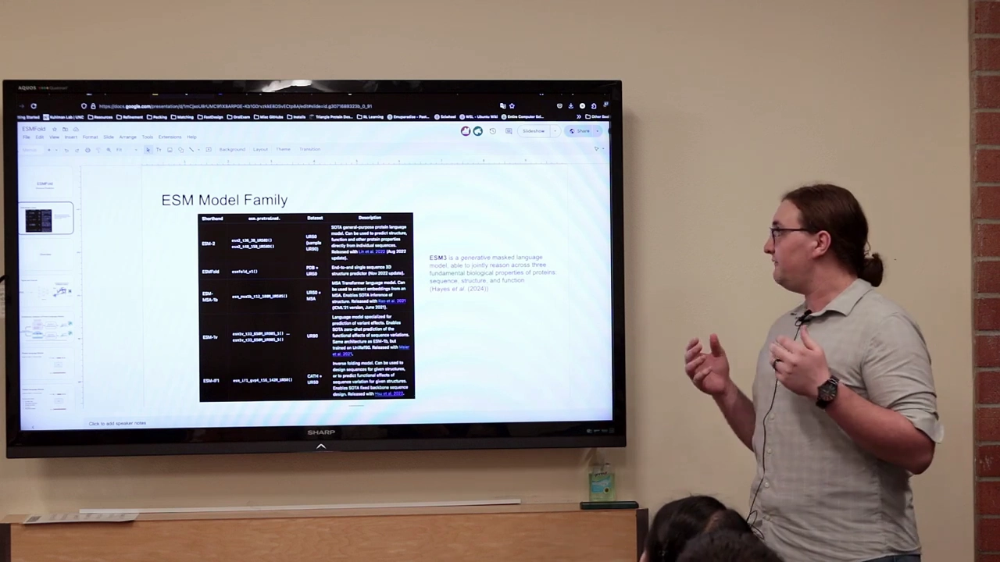
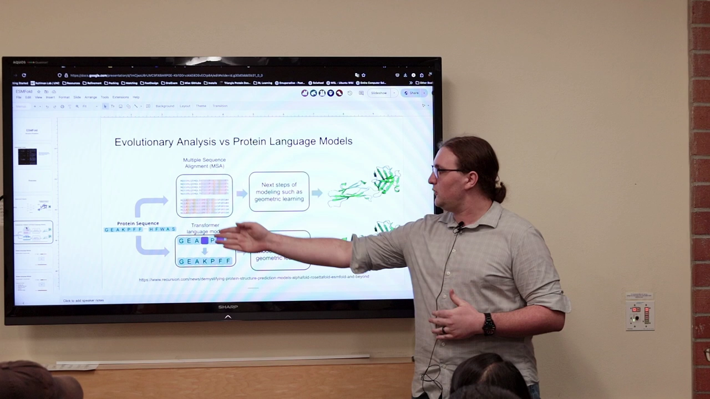
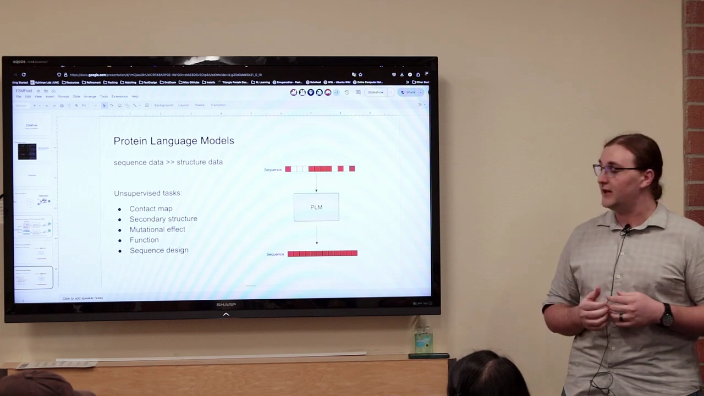
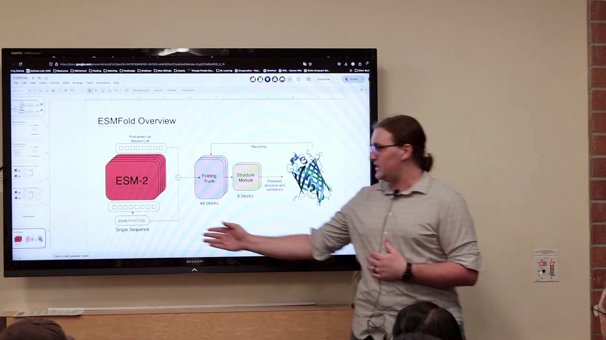
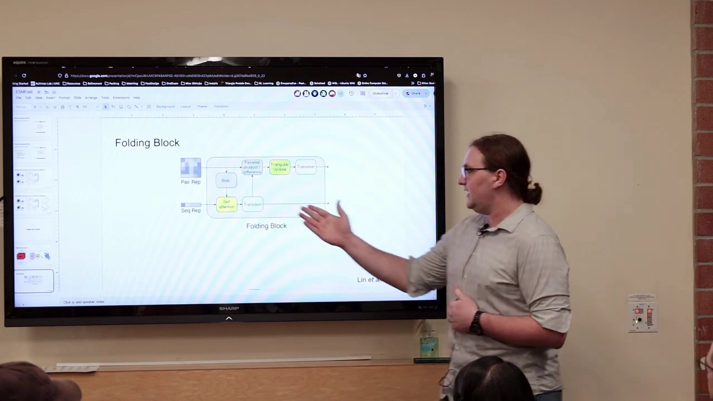
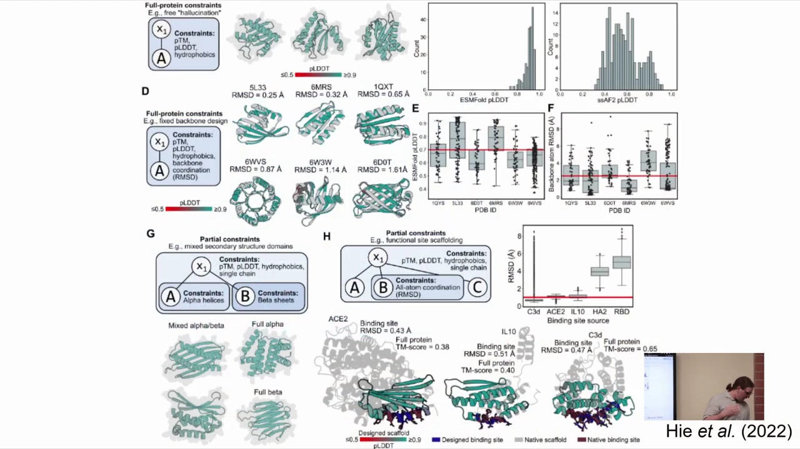

# 第06讲：用 ESMFold 做结构预测——不靠 MSA，让蛋白质语言模型直接「读出」结构

> 视频来源：[Structure Prediction with ESMFold](https://www.youtube.com/watch?v=IkckNa6fVXo)（Rosetta Commons ML Bootcamp：Machine Learning Methods for Protein Modeling and Design，主讲 Nick Randolph，UNC Chapel Hill，时长 10:32）

## 本讲要解决的核心问题（SCQA）

**背景**：前面几讲我们看到，AlphaFold 系列和大部分结构预测模型都**高度依赖 MSA**——先用数据库搜索出一大堆同源序列，再从共进化信号里推断结构 [【跳转到 00:11】](https://www.youtube.com/watch?v=IkckNa6fVXo&t=11)。

**冲突**：但 MSA 有两个现实麻烦。其一，对**没有进化历史**的蛋白质（比如从头设计的新蛋白）来说，根本搜不到足够的同源序列，AlphaFold 的表现会大幅下降；其二，搜索、比对、维护那个巨大的 MSA 表示，本身就很耗资源。

**疑问**：能不能**绕开 MSA**，只用一条序列就预测出结构？如果只给序列，信息从哪来？

**回答（中心思想）**：**ESMFold** 给出的答案是——把整个"进化信息"提前学进一个**蛋白质语言模型（PLM）**里。它在 ESM 家族的语言模型基础上，先把序列编码成高维嵌入，再送进一个和 AlphaFold 的 Evoformer/结构模块几乎相同的折叠网络，直接输出结构与置信度 [【跳转到 01:44】](https://www.youtube.com/watch?v=IkckNa6fVXo&t=104)。结果是：**有 MSA 时它略逊于 AlphaFold / RoseTTAFold，但一旦没有 MSA，它反而明显更好** [【跳转到 04:25】](https://www.youtube.com/watch?v=IkckNa6fVXo&t=265)。它背后的理念很简洁——**序列数据比结构数据多好几个数量级，把这份数据用语言模型榨干，就等于把"进化信息"内化进了模型参数里**。

---

## 一、ESM 家族：从 Facebook AI Research 到 Evolutionary Scale

ESMFold 并不是孤立的一个模型，而是 **ESM 家族**的一员，而这个家族主要就是一系列**蛋白质语言模型**。[【跳转到 00:16】](https://www.youtube.com/watch?v=IkckNa6fVXo&t=16)

ESM 最初由 **Facebook AI Research（FAIR）**的一个团队发起，后来团队独立出来，成立了名为 **Evolutionary Scale** 的公司；最近他们刚发布了 **ESM3**。整个家族里有多个不同规模的模型：[【跳转到 00:21】](https://www.youtube.com/watch?v=IkckNa6fVXo&t=21)

- **ESM2**：一个蛋白质语言模型，可以预测功能属性，也能做其他无监督任务；
- **ESMFold**：本讲的主角；
- **ESM-MSA**：可以从多序列比对中提取嵌入；
- **ESM-1v**：用来预测**变异效应（variant effects）**；
- **ESM-IF1**：一个**反向折叠（inverse folding）**模型，和我们后面要讲的 ProteinMPNN 属于一类；
- **ESM3**：最新的一个，比较特别——因为它能**同时推理结构、序列和功能**。[【跳转到 01:29】](https://www.youtube.com/watch?v=IkckNa6fVXo&t=89)

---

## 二、ESMFold 与 AlphaFold 的根本区别：用语言模型取代 MSA 和模板

和 AlphaFold 一样，ESMFold 的主要目标也是：**给定一条蛋白质序列，求它的结构**。但有一点根本不同——它**不使用 MSA，也不使用模板**，而是使用一个**蛋白质语言模型（PLM）**。[【跳转到 01:44】](https://www.youtube.com/watch?v=IkckNa6fVXo&t=104)

它同样会输出结构、置信度，以及成对的置信度（PAE）。[【跳转到 01:59】](https://www.youtube.com/watch?v=IkckNa6fVXo&t=119)

两者的路线差异可以画成两条轨道：

- **AlphaFold 走上面那条**：序列 → **MSA** → 从 MSA 中提取进化历史与共进化信息，得到关于"它如何折叠"的线索 → 结构模块 → 结构。
- **ESMFold 走下面那条**：序列 → **送进一个基于 Transformer 的语言模型**，得到整条序列的高维**嵌入（embedding）** → 把这些嵌入（理想情况下已编码了进化信息）送进结构模块 → 结构。[【跳转到 02:18】](https://www.youtube.com/watch?v=IkckNa6fVXo&t=138)

两条路线其实很像，**主要区别就在那个语言模型**。[【跳转到 02:45】](https://www.youtube.com/watch?v=IkckNa6fVXo&t=165)

---

## 三、为什么语言模型可以预测结构：序列数据远多于结构数据

用语言模型的核心动机很简单：**我们拥有的序列数据，比结构数据多得多**。[【跳转到 02:45】](https://www.youtube.com/watch?v=IkckNa6fVXo&t=165)

- PDB 里只有大约 **20 万个结构**；
- 而我们有的是一条条序列，数量达到**数十亿**——两者根本不在一个量级。

再加上语言模型本身已经**非常成熟**（你可能见过 GPT 之类的用法），于是就有了一个很自然的想法：**把海量序列喂给语言模型，让它学到"蛋白质序列长什么样"**。[【跳转到 03:10】](https://www.youtube.com/watch?v=IkckNa6fVXo&t=190)

它的训练方式，是经典的**掩码语言建模（masked language modeling）**：给模型一条**被部分遮蔽（mask）**的序列（就是那些小白方块），然后让它**填空、补上缺失的部分**。训练一段时间后，它就会很擅长填空——这有点像**在识别整个蛋白质宇宙里的序列模式**；而且因为见过大量彼此相似的蛋白质，它也对**进化历史**有了某种理解。[【跳转到 03:35】](https://www.youtube.com/watch?v=IkckNa6fVXo&t=215)

学会之后，这些**嵌入**就成了序列的**通用特征**，可以拿去做各种下游任务：**接触图预测、二级结构预测、变异效应、功能，以及序列设计**。[【跳转到 04:00】](https://www.youtube.com/watch?v=IkckNa6fVXo&t=240) 讲者特别指出，家族里这些其他 ESM 模型，其实**都是从语言模型起步的**。

---

## 四、性能：有 MSA 时略逊，无 MSA 时反超

那么它预测得准不准？[【跳转到 04:25】](https://www.youtube.com/watch?v=IkckNa6fVXo&t=265)

- **当 AlphaFold 和 RoseTTAFold 有 MSA 时**，ESMFold 比它们**略差**；
- **但当没有 MSA 时**，ESMFold 要**好得多**——因为它根本不需要 MSA。

原因很直接：AlphaFold 严重依赖 MSA 的大小，一旦 MSA 变小或没有，就"巧妇难为无米之炊"；而 ESMFold 的**所有进化信息都已经包含在蛋白质语言模型里**了。[【跳转到 04:50】](https://www.youtube.com/watch?v=IkckNa6fVXo&t=290) 课堂上也提到，它的置信度和真实质量是**相关的**，这让人比较放心。

一句话总结这两类模型的取舍：**在"有丰富同源序列"的常规场景，AlphaFold 仍是更强的选择；但在"没有 MSA"的场景，ESMFold 的优势就体现出来了。**

---

## 五、ESMFold 的架构：ESM-2 → 折叠主干 → 结构模块

ESMFold 的模型结构非常清晰：[【跳转到 05:25】](https://www.youtube.com/watch?v=IkckNa6fVXo&t=325)

1. 拿**单条输入序列（查询序列）**；
2. 送进**预训练好的语言模型**（他们用的是 **ESM-2**，基本不做微调），得到整条序列的嵌入；
3. 送进一个**折叠主干（Folding Trunk）**——它和 AlphaFold 的 **Evoformer** 类似；
4. 再送进一个**结构模块（Structure Module）**——它和 **OpenFold 里的结构模块完全相同**；
5. 输出预测结构以及置信度，并做 **recycling**。

### 5.1 折叠块内部：把 Evoformer 的 MSA 侧换成序列侧

折叠块（Folding Block）长得也和 Evoformer 很像，关键差别在于：**输入的是序列表示（Seq Rep），而不是 MSA 表示**。[【跳转到 05:50】](https://www.youtube.com/watch?v=IkckNa6fVXo&t=350)

- 序列侧：用**自注意力（self-attention）**替代了 Evoformer 里的**按行/按列注意力**——因为没有 MSA，也就不再需要"跨序列"的列注意力了；
- 配对侧：配对表示（Pair Rep）依旧使用和 AlphaFold 一样的**三角更新（triangular update）**；
- 两侧通过 bias（偏置）互相影响、彼此更新。

所以它和 Evoformer **其实非常相似**，只是操作顺序和侧重略有不同。[【跳转到 06:22】](https://www.youtube.com/watch?v=IkckNa6fVXo&t=382)

课堂上有人问了一个很细的问题：**配对表示一开始是从哪来的？**（在 AlphaFold 里它来自模板。）讲者的回答是：ESMFold 里没有模板，它是直接对序列做一个**外积（outer product）**，得到 L×L×C 的配对表示；不过他记不清这个外积是基于原始序列还是基于语言模型的嵌入。[【跳转到 06:40】](https://www.youtube.com/watch?v=IkckNa6fVXo&t=400)

### 5.2 损失与局限：和 AlphaFold 类似

结构模块完全相同，**损失也基本相同**，各组件几乎一致，只是去掉了 masked MSA 损失（因为没有 MSA）。所以可以说它们在教模型学的东西很相近。[【跳转到 07:12】](https://www.youtube.com/watch?v=IkckNa6fVXo&t=432)

局限也和 AlphaFold 类似：多状态不可靠、不显式建模其他分子。不过有两点**相对更好**——**从头设计（de novo）蛋白和突变**在 ESMFold 上问题没那么大；但讲者强调**这个问题并没有真正解决**，虽然它更好，自己仍不会无条件相信那些预测。[【跳转到 07:19】](https://www.youtube.com/watch?v=IkckNa6fVXo&t=439)

---

## 六、扩展：ESM Atlas、可编程设计语言与 ESM3

ESM 团队还基于这套思路做了几件延伸的东西。

**ESM Atlas**：他们用 ESMFold 大规模预测了**超过 7 亿个**结构（页面显示为 **7.72 亿**），其中很多是**高置信度**的，而且很多来自**宏基因组（metagenomic）序列**——也就是从环境里测出来的序列。这是一个非常好的公共资源。[【跳转到 08:03】](https://www.youtube.com/watch?v=IkckNa6fVXo&t=483)

**可编程设计语言（programmable design language）**：他们把语言模型的约束和 ESMFold 的约束结合起来，做成一个**设计算法**——你可以用"功能"这类条件去引导生成序列。讲者坦言不确定有多少人在用，但觉得这是个很酷的扩展。[【跳转到 08:25】](https://www.youtube.com/watch?v=IkckNa6fVXo&t=505)

**ESM3**：最后讲者提了 ESM3。它**不是 ESMFold 的直接延伸**，但非常相似：它也能预测结构，只不过预测的是**结构 token（structure tokens）**，稍有不同。它遵循的模式很类似——**预测被遮蔽的 token**，然后同时得到**结构、功能和序列**，这是它独特的地方。[【跳转到 08:45】](https://www.youtube.com/watch?v=IkckNa6fVXo&t=525) 它是最新的模型，大约七月发布。

课堂问答里补充了两个有趣的细节：ESM3 可以预测**功能相关的逐残基标注**（比如某个残基是否被糖基化、是否有翻译后修饰、是不是活性位点），尽管它并没有真的建模那个分子；而且你可以**根据功能做条件化**——比如你说"我想做一个水解酶"，它就会做出一个水解酶-like 的东西。他们还用它设计了一个**与天然 GFP 相差很大的新 GFP**。[【跳转到 09:55】](https://www.youtube.com/watch?v=IkckNa6fVXo&t=595)

---

## 小结

- **ESM 家族**由 FAIR 发起、后独立为 Evolutionary Scale；成员包括 ESM2（语言模型）、ESMFold、ESM-MSA、ESM-1v（变异效应）、ESM-IF1（反向折叠）、ESM3（同时推理结构/序列/功能）。[【跳转到 00:21】](https://www.youtube.com/watch?v=IkckNa6fVXo&t=21)
- **ESMFold 的核心创新**：**不用 MSA、不用模板**，改用**蛋白质语言模型**把整条序列编码成嵌入，再送进折叠网络。[【跳转到 01:44】](https://www.youtube.com/watch?v=IkckNa6fVXo&t=104)
- **为什么语言模型可行**：序列数据（数十亿）远多于结构数据（约 20 万），用**掩码语言建模**让模型学会"填空"、内化进化信息；嵌入还能做接触图、二级结构、变异效应、功能、序列设计等下游任务。[【跳转到 04:00】](https://www.youtube.com/watch?v=IkckNa6fVXo&t=240)
- **性能取舍**：有 MSA 时略逊于 AlphaFold/RoseTTAFold，**无 MSA 时明显更好**。[【跳转到 04:25】](https://www.youtube.com/watch?v=IkckNa6fVXo&t=265)
- **架构**：单序列 → **ESM-2** → **Folding Trunk（48 blocks，类似 Evoformer，但用序列表示 + 自注意力替代按列注意力 + 三角更新）** → **Structure Module（8 blocks，与 OpenFold 相同）** → 结构与置信度，并做 recycling；配对表示由序列外积得到。[【跳转到 05:25】](https://www.youtube.com/watch?v=IkckNa6fVXo&t=325)
- **损失与局限**：损失与 AlphaFold 基本相同（去掉 masked MSA），局限也类似，但**从头设计与突变**相对没那么糟（仍未真正解决）。[【跳转到 07:19】](https://www.youtube.com/watch?v=IkckNa6fVXo&t=439)
- **扩展**：**ESM Atlas**（7.72 亿条预测结构，多来自宏基因组）、**可编程设计语言**、以及能同时推理结构/序列/功能的 **ESM3**。[【跳转到 08:03】](https://www.youtube.com/watch?v=IkckNa6fVXo&t=483)

## 关键术语速查

| 术语 | 一句话解释 |
| --- | --- |
| ESM | Meta/FAIR 开源的一系列蛋白质语言模型家族 |
| Evolutionary Scale | ESM 团队独立后成立的公司，发布 ESM3 |
| 蛋白质语言模型（PLM） | 在海量蛋白质序列上预训练、可产出序列嵌入的 Transformer |
| ESM-2 | ESMFold 使用的预训练语言模型 |
| ESMFold | 用 PLM 嵌入取代 MSA/模板来做结构预测的模型 |
| 掩码语言建模（masked LM） | 遮蔽序列部分位置、让模型填空的自监督训练方式 |
| 嵌入（embedding） | 语言模型输出的、编码序列含义的高维向量 |
| MSA | 多序列比对；ESMFold 完全不用它 |
| 模板（template） | 已知同源结构；ESMFold 也不用它 |
| Folding Trunk | ESMFold 的折叠主干，类似 AlphaFold 的 Evoformer（48 blocks） |
| Structure Module | 把表示转成原子坐标的模块，与 OpenFold 完全相同（8 blocks） |
| 自注意力（self-attention） | 序列侧替代按列注意力、让残基互相交流的机制 |
| 三角更新（triangular update） | 配对表示沿用的几何约束操作 |
| recycling | 把预测结果回灌再预测的循环 |
| ESM-MSA | 从多序列比对提取嵌入的 ESM 变体 |
| ESM-1v | 用于预测变异效应的模型 |
| ESM-IF1 | 反向折叠模型，与 ProteinMPNN 同类 |
| ESM Atlas | 用 ESMFold 预测的 7.72 亿条结构数据库（多来自宏基因组） |
| ESM3 | 能同时推理结构、序列、功能的最新模型（预测结构 token） |
