# 第07讲：用 AlphaFold3 做结构预测——一个同时建模蛋白质、核酸、小分子与离子的统一模型

> 视频来源：[Structure Prediction with AlphaFold3](https://www.youtube.com/watch?v=zkvk2k7KE8M)（Rosetta Commons ML Bootcamp：Machine Learning Methods for Protein Modeling and Design，主讲 Nick Randolph，UNC Chapel Hill，时长 42:51）
>
> 这一讲把 AlphaFold 系列推进到最新一代：AlphaFold3 不再只预测蛋白质，而是**同时建模蛋白质、核酸、小分子、离子与共价修饰**。讲者不仅拆解了它的架构（Pairformer + 扩散模块），还花了大段篇幅带大家理解**扩散模型**，最后系统讲了它的**局限与复现现状**。全程穿插大量课堂问答。

## 本讲要解决的核心问题（SCQA）

**背景**：AlphaFold2 解决了"给定蛋白质序列求结构"，OpenFold 让它可训练，ESMFold 让它可以不靠 MSA [【跳转到 00:11】](https://www.youtube.com/watch?v=zkvk2k7KE8M&t=11)。

**冲突**：但真实的生物学问题不只是"一条蛋白质链"。蛋白质会和**DNA、RNA、小分子、离子**结合，还有**共价修饰**（糖基化、磷酸化）会改变结构；AlphaFold2 对这些都**不显式建模**。而且它的结构模块是**确定性**的，很难采样出多种构象。

**疑问**：能不能用一个统一模型，**同时预测所有这些分子及其相互作用**？如果能，它的架构要怎么改？又该怎么处理"一个残基是一个 token"这种设定在非蛋白分子上失效的问题？

**回答（中心思想）**：AlphaFold3 给出了一套完整方案，可以拆成三个关键变化。第一是**统一 token 化**：蛋白质/核酸用"构筑单元"当 token，而**小分子的每个原子、共价修饰都拆成独立 token**，从而让一个 Transformer 同时处理所有分子类型 [【跳转到 03:15】](https://www.youtube.com/watch?v=zkvk2k7KE8M&t=195)。第二是**架构替换**：用 **Pairformer** 取代 Evoformer，并且**不再一路携带巨型 MSA 表示**，从而省下大量显存 [【跳转到 05:46】](https://www.youtube.com/watch?v=zkvk2k7KE8M&t=346)。第三是**用扩散模块取代结构模块**：不再"确定性地"搭结构，而是从随机噪声出发、迭代去噪生成结构 [【跳转到 09:02】](https://www.youtube.com/watch?v=zkvk2k7KE8M&t=542)。理解这三点，就理解了 AlphaFold3 的"新"在哪里——以及它的局限（种子依赖、手性、幻觉、冲突）又来自哪里。

---

## 一、AlphaFold3 的新意：不止蛋白质，还能预测核酸、小分子、离子与共价修饰

讲者开场就点出最令人兴奋的地方：AlphaFold3 是 AlphaFold 的最新迭代，但它**还能建模所有其他类型的分子**——它**同时预测离子、小分子、蛋白质和核酸的构象与位置**。[【跳转到 00:16】](https://www.youtube.com/watch?v=zkvk2k7KE8M&t=16)

看预测结果：它和天然结构对齐得相当好，能预测出核酸，小分子也基本落在正确的区域（构象可能稍有偏差，但大体不错）。[【跳转到 00:42】](https://www.youtube.com/watch?v=zkvk2k7KE8M&t=42)

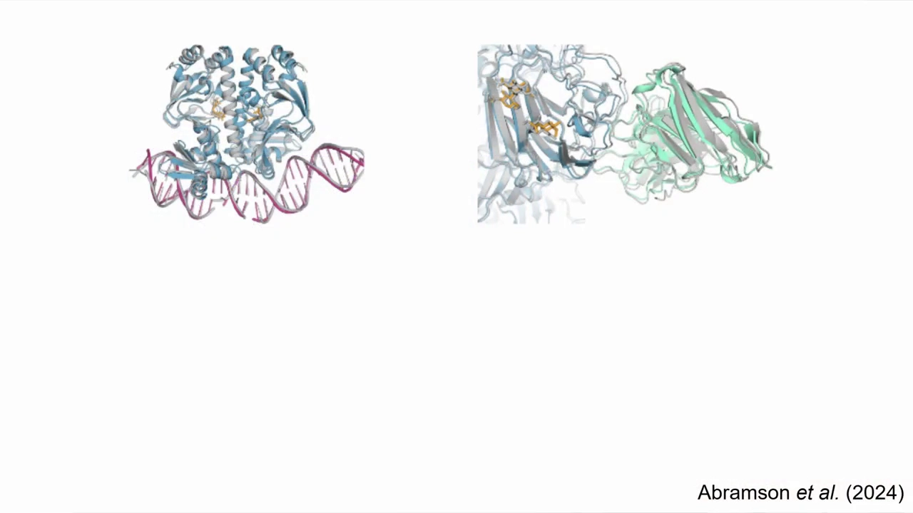

接着是一组不同预测类型的成功率结果：[【跳转到 01:14】](https://www.youtube.com/watch?v=zkvk2k7KE8M&t=74)

- **配体（ligand）测试**：衡量配体构象预测得有多好，成功率相当高；
- **核酸**：成功率也不错；
- **共价修饰**：它也能建模，比如糖基化、磷酸化；
- **蛋白质**：也预测得很好，但**有些注意事项**。

需要特别提醒的是**评估口径**：这些成功率是**给定 25 次预测**下的结果；而**抗体**的结果是基于 **5000 次预测**才做到的。讲者直言，**抗体预测还有很大提升空间**（抗体本来就很难预测准），但即便如此，能把这么多东西建模得还不错，已经很令人兴奋了。[【跳转到 01:32】](https://www.youtube.com/watch?v=zkvk2k7KE8M&t=92)

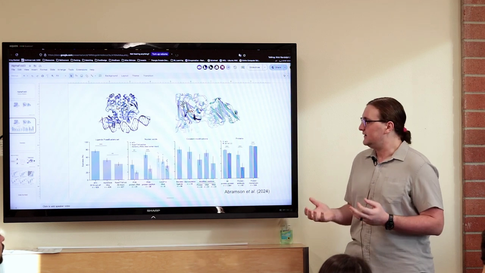

---

## 二、置信度校准：pLDDT / pTM / ipTM 都能信

和 AlphaFold2 一样，AlphaFold3 也自带置信度指标，而且它们**校准得相当好**：[【跳转到 02:28】](https://www.youtube.com/watch?v=zkvk2k7KE8M&t=148)

- 通常 **lDDT 越高，对应的 pLDDT 也越高**；
- 蛋白质-蛋白质用 **pTM** 分数；
- 对核酸和蛋白质，它与相应指标相关；
- **ipTM（界面 pTM）**与界面 lDDT 相关，等等。

所以结论是：**你可以大致信任这些置信度指标**——这是一个很好的验证。[【跳转到 02:47】](https://www.youtube.com/watch?v=zkvk2k7KE8M&t=167)

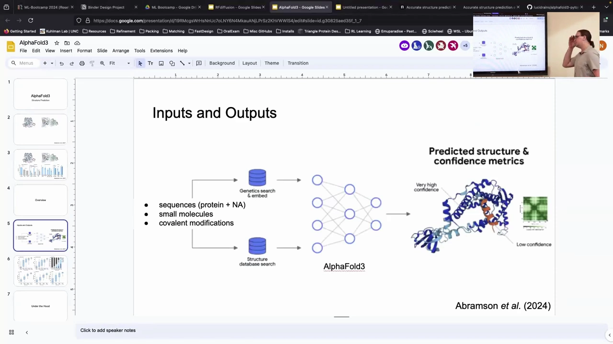

> 上图为「Inputs and Outputs」：输入是序列（蛋白质 + 核酸）、小分子、共价修饰，经过基因库搜索/嵌入与结构库搜索，送入 AlphaFold3，输出预测结构与置信度（很蓝=高置信、偏红=低置信）。

---

## 三、整体架构：从输入到结构的一条新流水线

AlphaFold3 的整体流程和 AlphaFold2 看起来非常相似，但每个环节都做了替换。[【跳转到 02:54】](https://www.youtube.com/watch?v=zkvk2k7KE8M&t=174) 输入侧包括：[【跳转到 00:118】](https://www.youtube.com/watch?v=zkvk2k7KE8M&t=118)

- 我们关心的**蛋白质、DNA、RNA 序列**；
- **小分子**；
- **共价修饰**、**离子**等。

这些输入经过基因库搜索、模板搜索等，得到 MSA（核酸通常只用 RNA）与模板；对小分子，还会先**生成一些构象（conformer）**——因为小分子有多个能量上有利的构象，生成几个给模型一些可选项。[【跳转到 03:15】](https://www.youtube.com/watch?v=zkvk2k7KE8M&t=195)

然后是**输入嵌入器（input embedder）**，产生三种表示：绿色的**输入表示（inputs rep）**、**配对表示（pair representation）**和**单链表示（single representation）**。它们所代表的东西和以前类似，但因为要处理这么多新分子，**token 化**成了必须解决的难题（见下一节）。

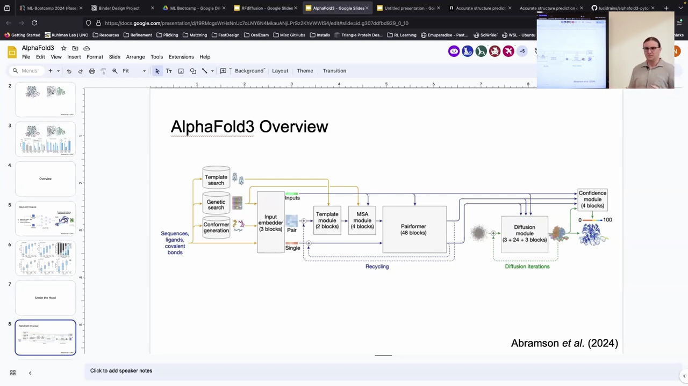

整个模型由几个模块串成（对照上图）：

1. **Input embedder（3 blocks）**：把各种输入编码成 pair / single 表示；
2. **Template module（2 blocks）**、**MSA module（4 blocks）**：分别从模板和 MSA 中提取信息；
3. **Pairformer（48 blocks）**：在配对表示上反复推理；
4. **Diffusion module（3 + 24 + 3 blocks）**：从噪声生成原子坐标；
5. **Confidence module（4 blocks）**：给出置信度。

这个流程图里有两条重要的"回环"：**Recycling**（虚线，把结果回灌重跑）与 **Diffusion iterations**（扩散迭代）。[【跳转到 06:16】](https://www.youtube.com/watch?v=zkvk2k7KE8M&t=376)

---

## 四、Token 化难题：用小分子和修饰「拆成原子」来解决

在 AlphaFold2 里，**Transformer 的每个 token 恰好是一个残基**。但 AlphaFold3 要同时处理核酸、小分子、共价修饰——**怎么让"一个 token = 一个东西"这个设定对新分子也成立呢？**[【跳转到 03:40】](https://www.youtube.com/watch?v=zkvk2k7KE8M&t=220)

答案是**按分子类型分别处理**：

- **核酸**：有很好的**构筑单元**，**每个核苷酸就是一个 token**——这很直接；
- **小分子、共价修饰**：很难定义"一个合适的 token"，于是它们干脆**被拆成一个个原子**，**每个原子成为一个 token**。[【跳转到 04:05】](https://www.youtube.com/watch?v=zkvk2k7KE8M&t=245)

于是整个输入里就混合了多种类型的 token：**氨基酸 token、核苷酸 token、原子 token**。[【跳转到 04:30】](https://www.youtube.com/watch?v=zkvk2k7KE8M&t=270) 相应地，表示的维度也变了：

- **单链表示**：**token 数 × 通道数**；
- **配对表示**：**token 数 × token 数 × 通道数**。[【跳转到 05:00】](https://www.youtube.com/watch?v=zkvk2k7KE8M&t=300)

课堂问答补充了两个细节：

- **构象生成有多穷尽？** 讲者认为只是生成一些**代表构象**，大概是用 **RDKit** 做的，并不穷尽。[【跳转到 05:20】](https://www.youtube.com/watch?v=zkvk2k7KE8M&t=320)
- **小分子在配对表示里长什么样？** 因为配对表示是"token 数 × token 数"，所以小分子的**每个原子**作为一个 token，和另外每个 token 都有相互作用。矩阵的布局是：**蛋白质部分→残基-残基相互作用，中间横/竖条带→小分子原子-残基相互作用，右下角→小分子原子-小分子原子相互作用**。[【跳转到 27:13】](https://www.youtube.com/watch?v=zkvk2k7KE8M&t=1633)

---

## 五、从 Evoformer 到 Pairformer：MSA 只负责「提取」，不再一路携带

AlphaFold3 的第一个大改动是：**不再像 AlphaFold2 那样把 MSA 表示一路带着穿过整个 Evoformer**。[【跳转到 05:30】](https://www.youtube.com/watch?v=zkvk2k7KE8M&t=330)

取而代之的是**两个中间 block**：一个 **MSA module**、一个 **Template module**。它们从 MSA 和模板里**一次性尽量榨取所有信息**，然后把结果灌进配对表示和单链表示。[【跳转到 05:46】](https://www.youtube.com/watch?v=zkvk2k7KE8M&t=346)

这样做有几个明显好处：

- **省显存**：那个巨型 MSA 表示是「序列数 × 残基数 × 通道数」的矩阵，现在可以直接消掉；
- **架构简化**：把"必须一路维护 MSA 表示"这个负担去掉了。

**MSA module** 本身长得**很像 Evoformer**：它拿 MSA 表示，主要通过**转换层（transition）**和**外积均值（outer product mean）**提取有意义的共变信息，形成结构假设，并烘焙进配对表示；配对表示则继续用**三角更新**（三角乘法、三角注意力）来更新。[【跳转到 07:17】](https://www.youtube.com/watch?v=zkvk2k7KE8M&t=437) 关键是：**它只输出配对表示，不再输出 MSA 表示**。[【跳转到 07:42】](https://www.youtube.com/watch?v=zkvk2k7KE8M&t=462)

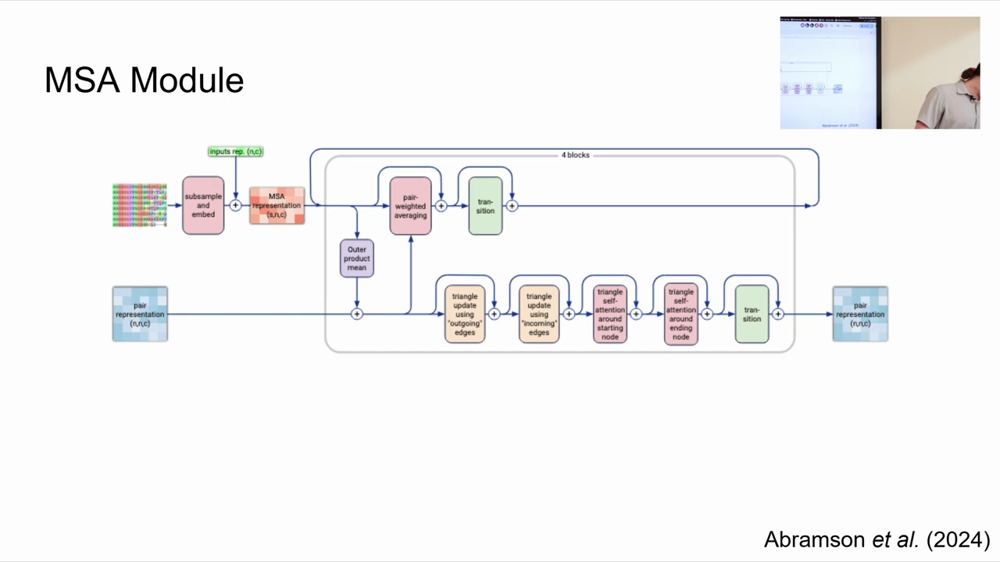

**Pairformer** 做的事情和 Evoformer 的配对侧、以及 ESMFold 的折叠块都很像：[【跳转到 08:22】](https://www.youtube.com/watch?v=zkvk2k7KE8M&t=502)

- 用**三角注意力和三角乘法**进一步更新配对表示；
- 同时用**单链表示**做**单链注意力**，并用配对表示来**偏置（bias）**它；
- 于是配对表示把它的结构假设信息传给单链表示，单链表示据此更新自己、学习"东西大概该在哪里"；
- 通过**反馈回环**，这些信息不断被反复处理，共 **48 个 block**。

讲者评价：它**几乎和 Evoformer / 折叠块一模一样**，也许操作顺序略有不同，但基本是同一套——AlphaFold3 其实是在**复用并重新包装**这些想法。[【跳转到 08:46】](https://www.youtube.com/watch?v=zkvk2k7KE8M&t=526)

---

## 六、扩散模块：用「加噪—去噪」取代确定性的结构模块

AlphaFold3 的第二个大改动，是把结构模块换成了**扩散模块（diffusion module）**。因为训练营此前没讲过扩散，讲者专门用一页幻灯片讲清它的核心思想。[【跳转到 09:02】](https://www.youtube.com/watch?v=zkvk2k7KE8M&t=542)

**扩散（diffusion）的核心想法是：**

1. **前向扩散（forward diffusion / noising）**：我们有一堆数据（在我们的场景里是一堆天然蛋白质结构及其与其他分子的相互作用），然后**逐步往数据里加噪声**；加足够多的噪声后，最终会得到**完全随机**的东西——对应一个**随机先验分布（random prior）**（在三维里就是高斯噪声）。
2. **逆向扩散（reverse diffusion）**：训练一个模型去**逆转这个过程**——从最噪声的版本出发，**一步步去噪（denoise）**回到数据；如果模型训练得足够好，最终采样出的样本就"看起来像是从数据分布里来的"（在我们的场景里，就是像是来自 PDB）。

关键点是：**只有逆向过程是被学习的**（前向过程是人工构造的）。

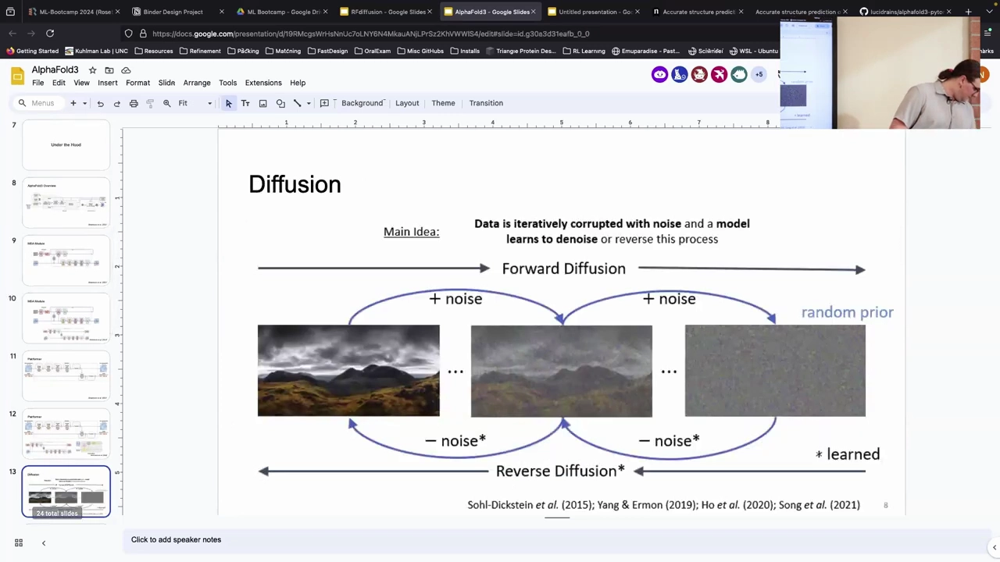

课堂上围绕扩散展开了一长串问答，讲者澄清了几个容易混淆的点：

- **前向和逆向会相互抵消吗？** 不会。训练时你让模型复现的是**去噪后的真值**；但**实际使用时你给它的是完全噪声**，而不同的噪声几乎不可能在训练中见过。因为它学会了很好地复现真值，所以从这个随机噪声出发也能生成接近数据分布的样本。[【跳转到 10:45】](https://www.youtube.com/watch?v=zkvk2k7KE8M&t=645)
- **只有训练时才需要前向过程**：推理时输入就是随机噪声。[【跳转到 11:40】](https://www.youtube.com/watch?v=zkvk2k7KE8M&t=700)
- **它是随机过程，不是确定性的**：即使同一个数据样本，每次加噪都不同；模型必须学会适应任意带噪版本。从数学上看，它学的是一个 **SDE（随机微分方程）**，所以轨迹不是一条直路。[【跳转到 12:48】](https://www.youtube.com/watch?v=zkvk2k7KE8M&t=768)
- **时间步与噪声调度（noise schedule）**：通常时间步从 100 走到 0（100 是完全噪声，0 是完全无噪）。**大约到第 60 步左右，模型就开始收敛到一个非常特定的整体结构**；剩下的最后约 60 步主要是在**精修细节**。这里存在一个**噪声调度**：时间步越低、加噪越少，越接近数据分布；越往上加噪越猛。训练时你先**指定一个噪声调度**，然后模型学会逆转这个特定的调度。[【跳转到 16:53】](https://www.youtube.com/watch?v=zkvk2k7KE8M&t=1013)
- **每次去噪还会加一点噪声**：这让训练动态不断变化、带来更多多样性，但也可能把你"撞"到一个不同的终点。所以即使给出完全相同的噪声，也不会得到同一个结果。[【跳转到 19:13】](https://www.youtube.com/watch?v=zkvk2k7KE8M&t=1153)

---

## 七、AlphaProteo 实例：扩散过程长什么样

AlphaFold3 的扩散过程**没有公开的视频**（我们不知道它内部到底长什么样）。讲者于是用 **AlphaProteo**（基于 AlphaFold3、由 **Isomorphic Labs** 开发）的设计流程来近似展示。[【跳转到 19:41】](https://www.youtube.com/watch?v=zkvk2k7KE8M&t=1181)

看这个例子：他们在设计一个**靶向目标蛋白的结合蛋白（binder）**。你能看到它**从完全随机的噪声开始**（所有坐标一开始非常接近），然后**迅速弄清全局拓扑**（比如"有一定数量的 β 折叠、一个 α 螺旋"），最后才开始**精修侧链原子放置等细节**。[【跳转到 20:35】](https://www.youtube.com/watch?v=zkvk2k7KE8M&t=1235)

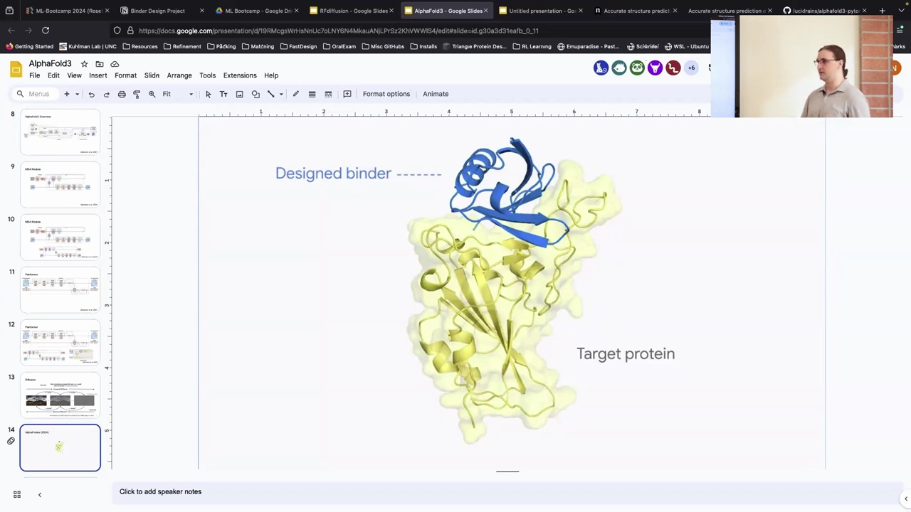

课堂问答里讨论到几个点：

- **起点在哪？** 不是所有坐标都在同一点，而是从**标准高斯分布**采样（大致由某个埃米尺度的球定义）。[【跳转到 21:10】](https://www.youtube.com/watch?v=zkvk2k7KE8M&t=1270)
- **受体保持刚性吗？** 在这个例子里是；至于它怎么知道该往哪结合，讲者猜测有某种**表位（epitope）**信息在引导（可以从初始那团带噪坐标的位置看出来）。用 RFdiffusion 时可以明确指定表位，AlphaProteo 应该类似，但没公开细节。[【跳转到 21:51】](https://www.youtube.com/watch?v=zkvk2k7KE8M&t=1311)

---

## 八、扩散模块与结构模块的差别：确定性 vs 随机性

把 AlphaFold3 的扩散模块和 AlphaFold2 基于 IPA 的结构模块并排对比，两者其实有相似的输入：**成对信息、单链表示，以及当前"带噪"的位置**。[【跳转到 22:16】](https://www.youtube.com/watch?v=zkvk2k7KE8M&t=1336)

差别在于做法：扩散模块从起始位置出发，做一些**非常局部的、针对每个原子的注意力**，把几何信息与各种表示融合成对**每个原子**的更新。[【跳转到 22:58】](https://www.youtube.com/watch?v=zkvk2k7KE8M&t=1378)

- **结构模块是确定性的**（同样输入给同样输出）；
- **扩散模块不是**——所以**每次都会给你不同的答案**。（AlphaFold2 多次运行也可能不同，但那主要是因为一开始对 MSA 做了子采样。）[【跳转到 23:26】](https://www.youtube.com/watch?v=zkvk2k7KE8M&t=1406)

**token 与原子是怎么连接的？** 讲者进一步解释：在蛋白质里一个 token 是一个氨基酸、核酸里是一个核苷酸、小分子里是**一个原子**。到扩散这一步，我们知道每个 token 对应哪些原子（比如一个精氨酸包含哪些原子），于是**把 token 和它的每个原子连起来**：原子在扩散中四处移动，最终与 token 对话，token 再把信息送回给原子——**所有扩散都发生在每个原子上，但由那个 token 的信息引导**。[【跳转到 24:36】](https://www.youtube.com/watch?v=zkvk2k7KE8M&t=1476)

几个补充细节：

- **每个 token 的原子数可以不同**；模型会拿到每个 token 的**理想化版本**（例如理想化的精氨酸）来帮助引导键的几何，但扩散过程中原子**完全不受约束**（这其实很"疯狂"）。[【跳转到 24:58】](https://www.youtube.com/watch?v=zkvk2k7KE8M&t=1498)
- **能处理非天然氨基酸和共价修饰**。[【跳转到 25:28】](https://www.youtube.com/watch?v=zkvk2k7KE8M&t=1528)
- **翻译后修饰**：它预测**修饰位置**比 AlphaFold2 好得多；但**突变**仍有同样的局限（主要因为 MSA）。好消息是，因为不再一路携带 MSA 表示，**MSA 的影响比 AlphaFold2 小了一些**，但仍然重要。[【跳转到 25:57】](https://www.youtube.com/watch?v=zkvk2k7KE8M&t=1557)
- **噪声只加在结构上，不加在查询序列上**：到这个阶段，模型已经把模板和 MSA 里能提取的信息都提取完了，于是**把它们丢掉了**，不再理会；噪声一开始随机，随着扩散进行变得越来越结构化。[【跳转到 28:29】](https://www.youtube.com/watch?v=zkvk2k7KE8M&t=1709)

---

## 九、训练损失与等变性：用数据增强而非架构来保证等变

AlphaFold3 的损失和 AlphaFold2 相当类似，但**替换掉了几个**。[【跳转到 28:55】](https://www.youtube.com/watch?v=zkvk2k7KE8M&t=1735)

$$
\mathcal{L}_{\text{loss}} = \alpha_{\text{confidence}}\cdot(\mathcal{L}_{\text{plddt}}+\mathcal{L}_{\text{pde}}+\mathcal{L}_{\text{resolved}}+\alpha_{\text{pae}}\cdot\mathcal{L}_{\text{pae}}) + \alpha_{\text{diffusion}}\cdot\mathcal{L}_{\text{diffusion}} + \alpha_{\text{distogram}}\cdot\mathcal{L}_{\text{distogram}}
$$

- 最大的替换是：**把 AlphaFold2 的 FAPE 损失换成了基于扩散的损失**——它其实就是让模型去复现**理想的去噪步骤**；[【跳转到 28:55】](https://www.youtube.com/watch?v=zkvk2k7KE8M&t=1735)
- 保留了作用在配对表示上的 **distogram** 损失；
- 还有一组 **confidence 损失**（pLDDT、pDE、resolved、pAE），确保模型能估计自己预测里的误差；
- 微调阶段会把部分系数 $\alpha$ 打开。

由此带来两个重要后果：

1. **不再约束键长/键角，也不再强制手性（chirality）**。因为在每个原子上做扩散损失，FAPE 那种"强制手性"的约束没了。[【跳转到 29:20】](https://www.youtube.com/watch?v=zkvk2k7KE8M&t=1760)
2. **等变性靠数据增强实现**：因为要在每个原子上建模，过程需要是**等变的（equivariant）**。而他们的做法很特别——**没有对架构做任何特殊处理**，只用标准神经网络组件，然后**对数据做增强**（蛋白质旋转、平移后还是同一个，于是他们在几乎每一步扩散里都随机旋转和平移蛋白质），从而**教会模型遵守等变性**，而不是把等变性显式烘焙进架构。[【跳转到 30:10】](https://www.youtube.com/watch?v=zkvk2k7KE8M&t=1810)

讲者指出，这**引发了很大争议**：等变性到底**是否必须烘焙进架构**，至今没有明确答案。因为 AlphaFold3 是闭源的，暂时也没法做"去掉这个损失会怎样"的消融实验。这是个很有意思、也很开放的时期。[【跳转到 30:40】](https://www.youtube.com/watch?v=zkvk2k7KE8M&t=1840)

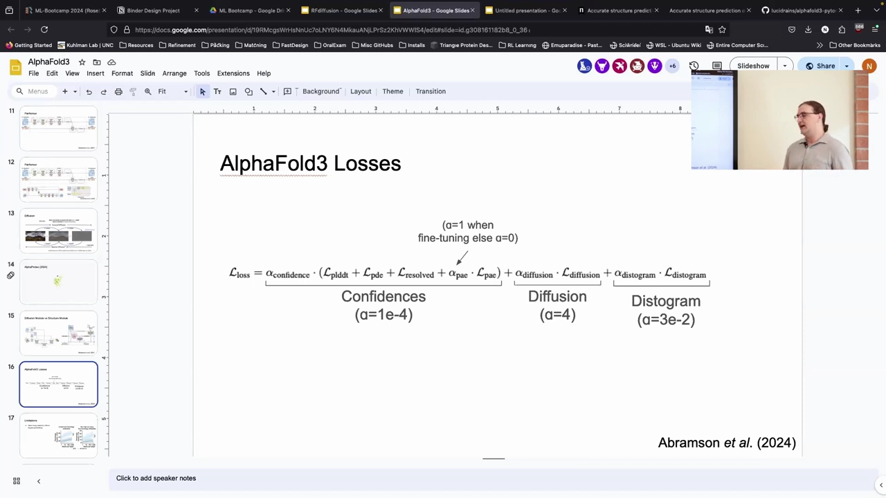

---

## 十、局限（一）：对困难靶点需要海量随机种子，而且不强制手性

讲者说，AlphaFold3 的局限和 AlphaFold2 不完全相同，虽然有些相似。[【跳转到 30:50】](https://www.youtube.com/watch?v=zkvk2k7KE8M&t=1850)

**局限 1：对困难靶点需要大量 seed（随机种子）。** 像抗体，他们用了 **5000 个 seed**，才拿到约 **60%** 的成功率。[【跳转到 31:15】](https://www.youtube.com/watch?v=zkvk2k7KE8M&t=1875) 他们会展示两组图：随着 seed 数量增加，**成功对接率**和**高精度对接率**如何变化。可以看到"高精度"要难得多；而**增加 seed 对 AlphaFold3 的提升比 AlphaFold2 明显得多**（大概是因为扩散过程）。还有一个重要发现：**用 AlphaFold3 内部的置信度给预测排序，仍能挑出质量好的预测**——这说明模型置信度部分**知道它想要什么、知道好结构长什么样**，只是要通过全局采样得到那些结构非常困难、需要很多次尝试。[【跳转到 31:57】](https://www.youtube.com/watch?v=zkvk2k7KE8M&t=1917)

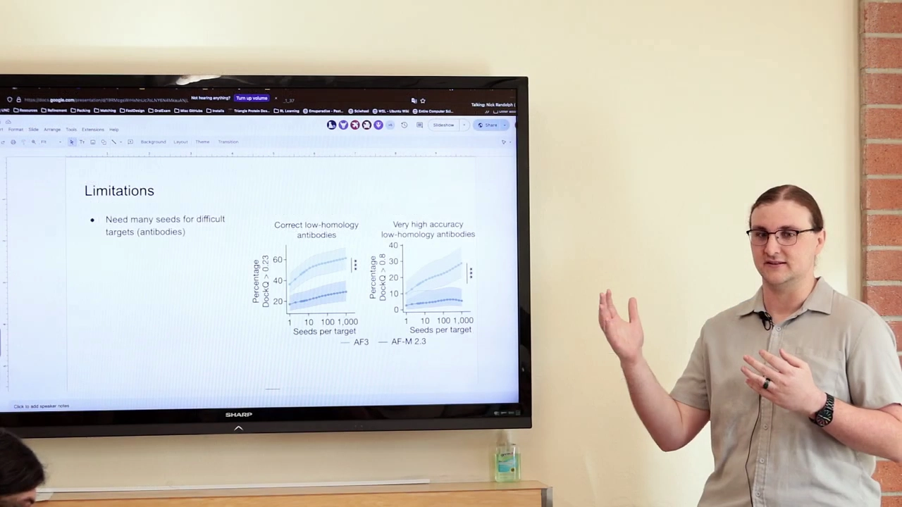

**局限 2：不强制手性。** 在 **PoseBusters** 数据集里，大约有 **4%–5% 的结构手性错误**。[【跳转到 32:53】](https://www.youtube.com/watch?v=zkvk2k7KE8M&t=1973) 也就是说，如果你在预测小分子，**最好自己检查一下手性**。[【跳转到 33:07】](https://www.youtube.com/watch?v=zkvk2k7KE8M&t=1987)

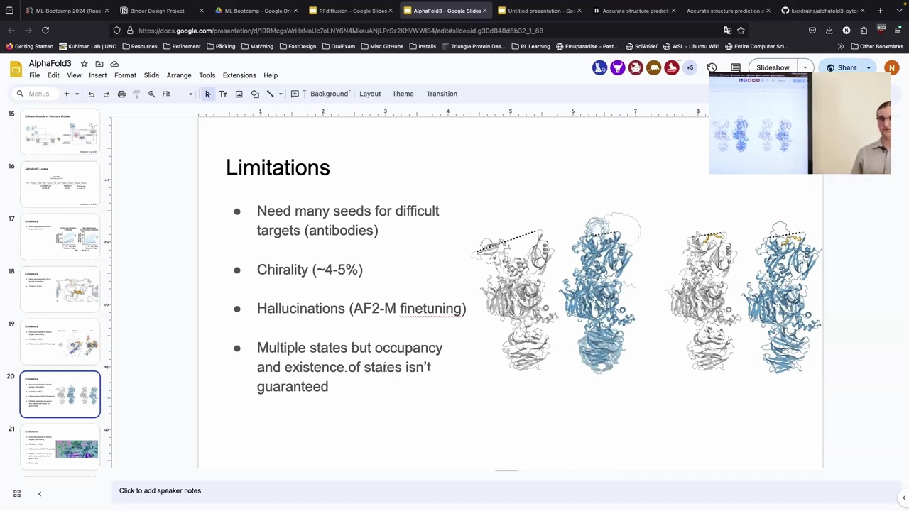

---

## 十一、局限（二）：幻觉、断链与冲突

**局限 3：容易产生幻觉（hallucination）。** 这其实是扩散模型本身的问题——它们试图让输出**看起来很像数据**；对完全不知道该怎么办的部分，它**仍会强行把它做得像蛋白质**。[【跳转到 33:12】](https://www.youtube.com/watch?v=zkvk2k7KE8M&t=1992)

核孔蛋白（nuclear pore protein）是最好的例子：只有很小一个区域被解析出来，**其余约 1800 个残基都没有解析**。

- **AlphaFold2-Multimer** 对此完全没辙，它只能把它做成"**意大利面（spaghetti）**"，而且颜色偏橙红、**置信度很低**——你能很清楚地看出不能信任它。
- **AlphaFold3** 却会让它**看起来非常有结构**，这**非常具有误导性**：乍一看像是结构很好的蛋白质，但现实不是；好在它**显示的置信度很差**，说明它自己也知道那不是真的。[【跳转到 34:20】](https://www.youtube.com/watch?v=zkvk2k7KE8M&t=2060)

为此，他们做了一个有趣的处理：**用一堆 AlphaFold2-Multimer 生成的结构反过来微调 AlphaFold3**，试图教它在"自己很不确定的地方"**重新产生意面状结构**。课堂上围绕"教模型生成意面到底好不好"展开讨论：一方面置信度已经能提示哪些该信/不该信；另一方面教它生成意面相当于把序列本身的一些物理信息拿掉。讲者也承认这很难说是对抗幻觉的**最佳**策略，但这确实是他们选择的方向。[【跳转到 37:53】](https://www.youtube.com/watch?v=zkvk2k7KE8M&t=2273)

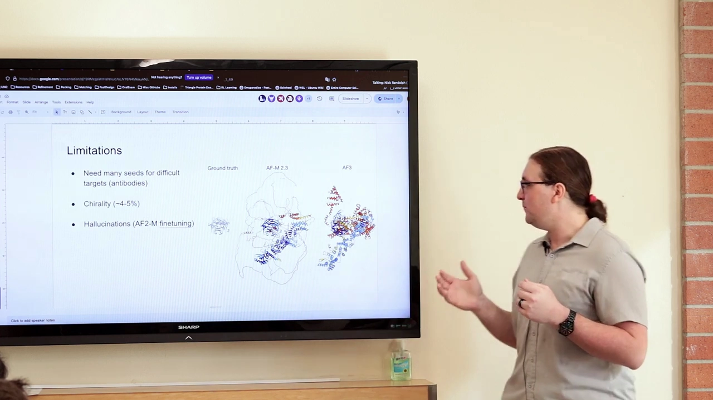

**关于断链与内在无序：** 大蛋白上很多模型都会产生**断链（chain break）**，RoseTTAFold2 开发时也不得不专门处理；内在无序蛋白的**加噪过程和普通蛋白一样**，只是模型会**试图形成其实不存在的结构**。用微调后的版本，对内在无序区域生成"意面"的可能性会更大一些。[【跳转到 36:13】](https://www.youtube.com/watch?v=zkvk2k7KE8M&t=2173)

**局限 4：会产生冲突（clash）。** 经常能看到**链与链完全重叠**在一起——因为扩散损失**没有纳入任何物理信息**，它只是复现蛋白质的形状，并不知道这些不该重叠。[【跳转到 39:57】](https://www.youtube.com/watch?v=zkvk2k7KE8M&t=2397) 核酸也常出现类似问题。

---

## 十二、局限（三）：多状态采样不可靠，且仍是闭源

**局限 5：多状态（multiple states）。** 因为它是扩散过程，理论上**能采样出多个构象**；但这些状态的**存在性与占据比例完全没有保证**。[【跳转到 40:22】](https://www.youtube.com/watch?v=zkvk2k7KE8M&t=2422)

一个典型例子：某个蛋白质有两个构象——一个开放、一个闭合，结合小分子时会转成闭合的 **holo** 构象。

- **没有小分子时**（apo），AlphaFold3 预测的**仍然是闭合**的，但现实中这些区域应该分得更远；
- **有小分子时**它也是闭合的。

也就是说，它**没有正确预测出 apo 结构**，在"采样多个状态"上仍不完美，使用时要小心。[【跳转到 41:03】](https://www.youtube.com/watch?v=zkvk2k7KE8M&t=2463)

**局限 6：仍然只能在服务器上使用（server only）。** 讲者说，如果他们守信，**开源版本大概会在十一月左右发布**，但还得看情况。[【跳转到 41:28】](https://www.youtube.com/watch?v=zkvk2k7KE8M&t=2488)

---

## 十三、复现与替代：HelixFold3、Chai-1 与 Lucidrains

因为 AlphaFold3 闭源，一批团队正尝试复现它：

- **HelixFold3**：其中一个复现（讲者提到来自中国的团队）；
- **Chai-1**：它有一些额外的可调旋钮，比如**可以在某些预测里加入实验数据**，把结果偏向更真实；它还宣称**单序列预测**比 AlphaFold3 的单序列预测好得多；
- **Lucidrains**：正在做一个很了不起的努力——**用纯 PyTorch 复现 AlphaFold3**，有很多人在贡献，进展很酷，但仍处于早期。[【跳转到 41:53】](https://www.youtube.com/watch?v=zkvk2k7KE8M&t=2513)

---

## 小结

- **核心新意**：AlphaFold3 同时建模**蛋白质、核酸、小分子、离子与共价修饰**，输出它们的位置与构象 [【跳转到 00:16】](https://www.youtube.com/watch?v=zkvk2k7KE8M&t=16)。
- **表现与评估口径**：配体构象、核酸、共价修饰、蛋白质都预测得不错；但**成功率是在多次预测下取得的**（一般 25 次，抗体用了 5000 次才能到约 60%），抗体仍有很大提升空间。[【跳转到 01:32】](https://www.youtube.com/watch?v=zkvk2k7KE8M&t=92)
- **置信度可用**：pLDDT↔lDDT、pTM↔TM、ipTM↔界面 lDDT 都校准良好。[【跳转到 02:28】](https://www.youtube.com/watch?v=zkvk2k7KE8M&t=148)
- **统一 token 化**：蛋白质/核酸用构筑单元当 token，**小分子与共价修饰的每个原子拆成独立 token**；单链表示为 token×通道，配对表示为 token×token×通道。[【跳转到 04:05】](https://www.youtube.com/watch?v=zkvk2k7KE8M&t=245)
- **架构变化**：用 **MSA module（4 blocks）** 一次性提取信息、**不再一路携带 MSA 表示**（省显存）；用 **Pairformer（48 blocks）** 取代 Evoformer；用**扩散模块（3+24+3 blocks）**取代结构模块。[【跳转到 05:46】](https://www.youtube.com/watch?v=zkvk2k7KE8M&t=346)
- **扩散**：前向加噪到随机先验、只学习逆向去噪；约在第 60 步收敛到整体结构，其余步骤精修；随机过程，每次结果不同。[【跳转到 16:53】](https://www.youtube.com/watch?v=zkvk2k7KE8M&t=1013)
- **损失与等变性**：FAPE 换成 diffusion loss，另有 distogram 与 confidence；**不再约束键长/键角、不强制手性**；**等变性靠数据增强（随机旋转/平移）而非架构**，这引发了"等变性是否必须进架构"的争议。[【跳转到 30:10】](https://www.youtube.com/watch?v=zkvk2k7KE8M&t=1810)
- **局限**：困难靶点需大量 seed、手性错误约 4–5%、幻觉（把无序区做得像蛋白质）、链重叠冲突、多状态占据比不可靠、仍是闭源。[【跳转到 30:50】](https://www.youtube.com/watch?v=zkvk2k7KE8M&t=1850)
- **复现**：HelixFold3、Chai-1（可注入实验数据、单序列更强）、Lucidrains 的纯 PyTorch 复现。[【跳转到 41:53】](https://www.youtube.com/watch?v=zkvk2k7KE8M&t=2513)

## 关键术语速查

| 术语 | 一句话解释 |
| --- | --- |
| AlphaFold3 | 同时建模蛋白质、核酸、小分子、离子与共价修饰的结构预测模型 |
| Token 化 | 把输入切成模型处理的基本单位；这里蛋白质/核酸用构筑单元，小分子/修饰拆成原子 |
| 原子 token | 小分子或共价修饰的每个原子作为一个 token |
| 构象（conformer） | 小分子能量上有利的某一种排布；输入侧生成若干代表构象 |
| Pairformer | 取代 Evoformer 的模块，在配对表示与单链表示上反复推理（48 blocks） |
| MSA module | 一次性从 MSA 提取共变信息、只输出配对表示的模块（4 blocks） |
| 配对 / 单链表示 | 描述残基对相互作用的二维表示 / 只保留查询序列的一维表示 |
| 扩散（diffusion） | 前向加噪、逆向（学习）去噪的生成范式 |
| 前向 / 逆向扩散 | 逐步加噪到随机先验 / 模型学习的逐步去噪 |
| 随机先验（random prior） | 完全噪声的分布（此处为三维高斯噪声） |
| 噪声调度（noise schedule） | 每个时间步加多少噪声的设定 |
| SDE | 随机微分方程；扩散过程在数学上是一种 SDE |
| 扩散模块（diffusion module） | AlphaFold3 中从噪声迭代生成原子坐标的模块（3+24+3 blocks） |
| 置信度模块（confidence module） | 输出 pLDDT、pDE、pAE、resolved 等置信度的模块 |
| pLDDT / pTM / ipTM / pAE | 逐残基 / 整体 / 界面 / 对误差的预测置信度 |
| 手性（chirality） | 分子的镜像性质；AlphaFold3 不强制，约 4–5% 会出错 |
| 幻觉（hallucination） | 扩散模型在不确定区域强行生成"像蛋白质"的结构 |
| 意面（spaghetti） | 无序/未解析区域被模型拉出的一团无意义结构 |
| 冲突（clash） | 原子或链相互重叠；扩散损失不含物理信息导致 |
| 等变性（equivariance） | 全局旋转/平移下输出按可计算方式变化；此处用数据增强实现 |
| PoseBusters | 评估预测小分子（含手性、几何）是否化学合理的基准数据集 |
| HelixFold3 / Chai-1 | AlphaFold3 的两个第三方复现/替代 |
| Lucidrains | 用纯 PyTorch 复现 AlphaFold3 的开源项目作者 |

