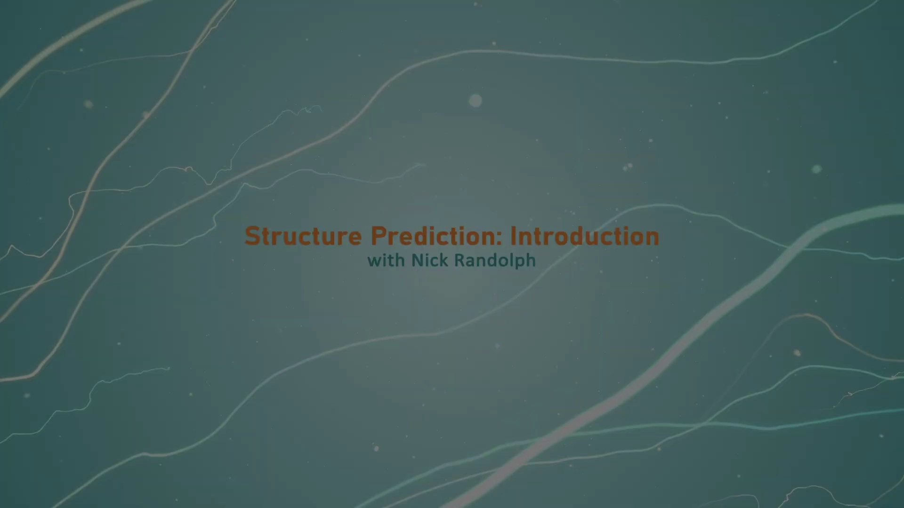
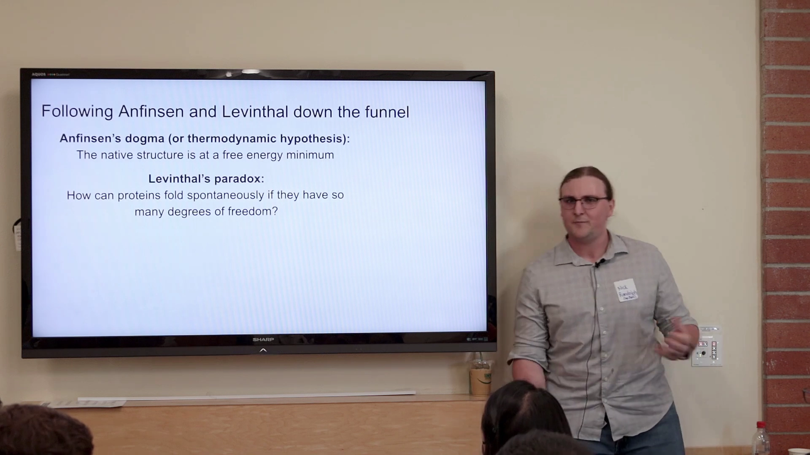
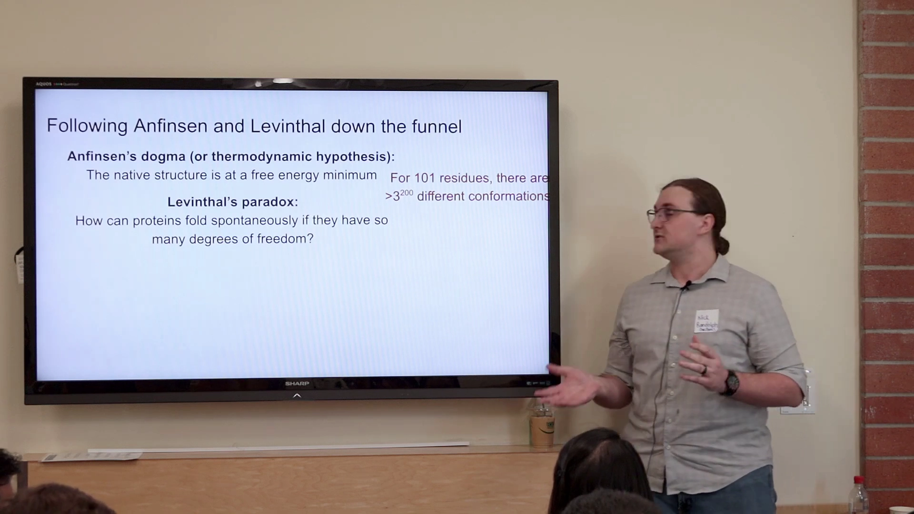
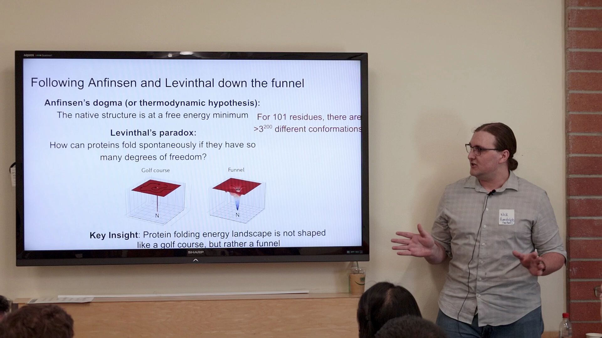
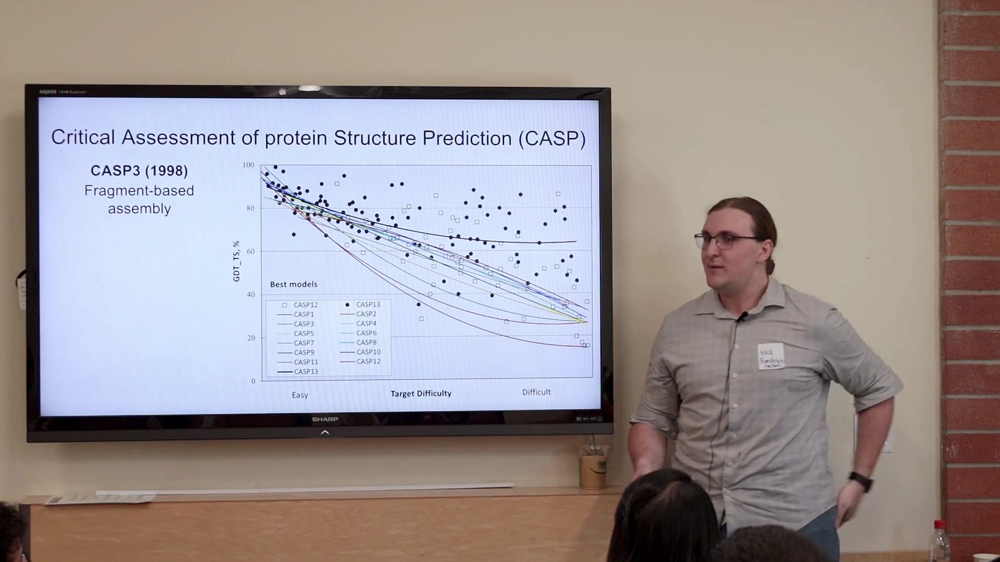
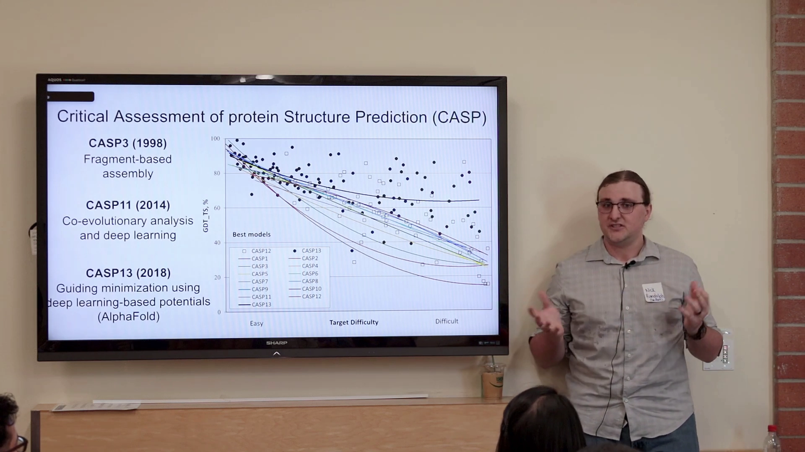
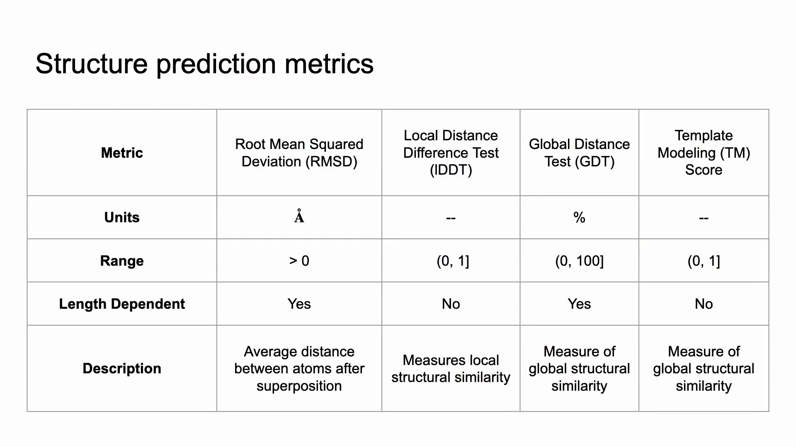
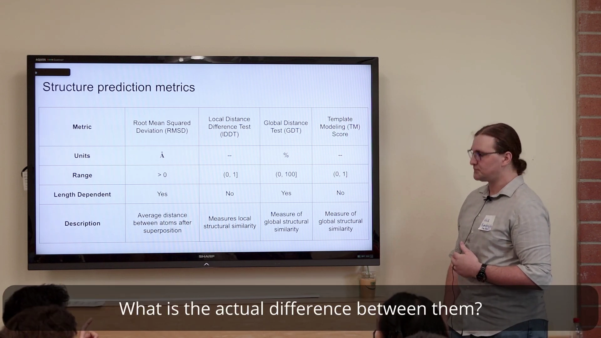
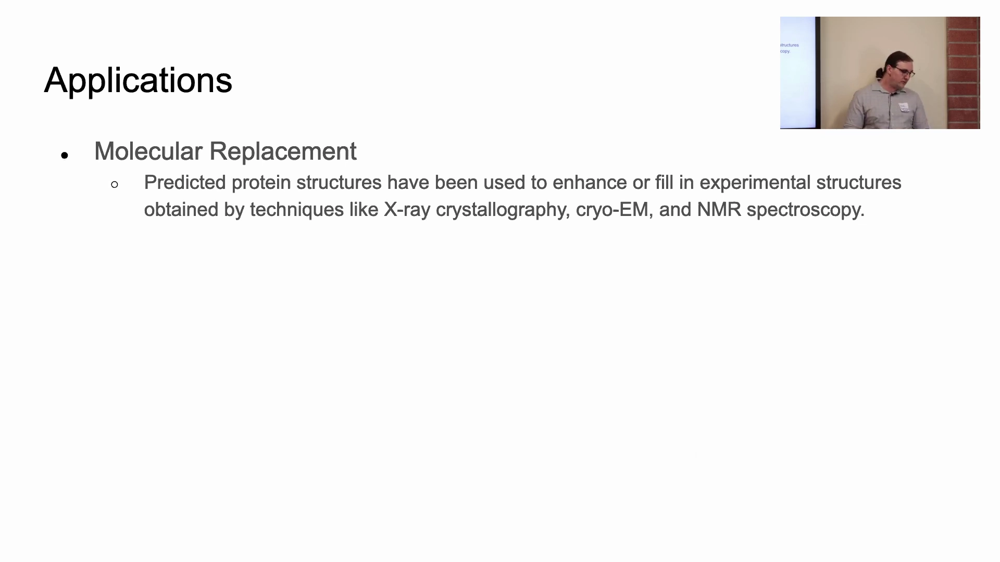
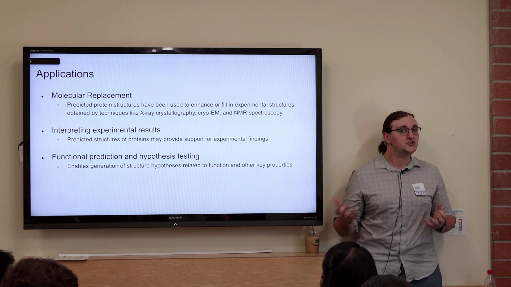

# 第03讲：蛋白质结构预测入门——能量景观解释了「为什么能折叠」，评价指标决定了「预测得好不好」

> 视频来源：[Protein Structure Prediction Introduction](https://www.youtube.com/watch?v=NPmz1ln9AYQ)（Rosetta Commons ML Bootcamp：Machine Learning Methods for Protein Modeling and Design，主讲 Nick Randolph，UNC Chapel Hill，时长 20:22）

## 本讲要解决的核心问题（SCQA）

**背景**：蛋白质的功能由它的三维结构决定，但用实验方法（X 射线晶体学、冷冻电镜 cryo-EM、NMR）去解一个结构又慢又贵。既然氨基酸序列——也就是写成一串字母的那段"一维文字"——里面已经写好了蛋白质最终的三维形状，我们能不能直接用计算把它算出来？

**冲突**：理论上可行，现实却很残酷。一条只有 101 个残基的蛋白质就有超过 3²⁰⁰ 种可能的构象，靠暴力枚举根本不可能；更麻烦的是，就算模型给出了一个结构，我们凭什么说它"对"？不同的评价指标各有各的陷阱，用错了甚至会得出完全相反的结论。

**疑问**：蛋白质在大自然里究竟是怎样快速折叠的？我们如何训练模型来做结构预测？又该用哪些指标、在什么场景下评价它？

**回答（中心思想）**：本讲给出结构预测的完整入门框架，可以拆成三层。第一层是**物理直觉**：Anfinsen 假说把天然结构定义为自由能极小值，Levinthal 悖论点出"自由度爆炸"的难题，而"折叠漏斗"模型解释了自然为何能快速折叠 [【跳转到 00:11】](https://www.youtube.com/watch?v=NPmz1ln9AYQ&t=11)。第二层是**方法演进与客观评价**：CASP 竞赛用"盲测"逼着整个领域正视差距，推动方法从片段组装、共进化分析一路走到深度学习（AlphaFold）[【跳转到 02:43】](https://www.youtube.com/watch?v=NPmz1ln9AYQ&t=163)。第三层是**评价指标体系**：RMSD、lDDT、GDT、TM-score 在量纲、取值范围、是否依赖长度上各不相同，必须按场景选用 [【跳转到 09:35】](https://www.youtube.com/watch?v=NPmz1ln9AYQ&t=575)。理解这三层，才算真正入门结构预测。

---

## 一、结构预测要回答的核心问题：给定一维序列，求三维结构

先把问题本身说清楚。所谓**结构预测（structure prediction）**，就是：给你一条你感兴趣的**多肽（polypeptide）**的**线性氨基酸序列**，问你它的**三维结构**是什么。[【跳转到 00:11】](https://www.youtube.com/watch?v=NPmz1ln9AYQ&t=11)

几个基础概念在这里必须一次讲明白：

- **氨基酸（amino acid）与残基（residue）**：蛋白质是由氨基酸首尾相连组成的长链。当氨基酸连进链里之后，它剩下的那部分叫"残基"。序列通常用**单字母缩写**表示，例如 `M` 代表甲硫氨酸、`G` 代表甘氨酸；屏幕上那串 `MDIQVQVNI...` 就是这样一条序列。
- **三级结构（tertiary structure）**：整条链在空间中折叠成的整体三维形状。
- **四级结构（quaternary structure）**：如果一个蛋白质由**多条链**组成，链与链之间的相互作用和排布方式就叫四级结构。

所以，我们关心的问题可以概括成一句话：**已知序列，求三级结构；若是多条链，还要知道链之间的四级相互作用。**[【跳转到 00:16】](https://www.youtube.com/watch?v=NPmz1ln9AYQ&t=16)

---

## 二、Anfinsen 假说与 Levinthal 悖论：为什么蛋白质能找到天然结构

在进入 AlphaFold 这些模型之前，先要打一点生物物理的底子。理解蛋白质为什么能折叠，是理解结构预测为什么可能的前提。[【跳转到 00:41】](https://www.youtube.com/watch?v=NPmz1ln9AYQ&t=41)

### 2.1 Anfinsen 假说：天然结构处在自由能极小值

第一个原理是 **Anfinsen 假说（Anfinsen's dogma）**，也叫**热力学假说（thermodynamic hypothesis）**。它的核心思想是：**蛋白质的天然结构（native structure）通常处在自由能极小值处。**

要理解这句话，先理解两个词：

- **自由能景观（free energy landscape）**：可以想象成一片"地形图"，横轴是蛋白质所有可能的构象，纵轴是每种构象对应的自由能。蛋白质是**高度柔韧、高度动态**的分子，因此这片地形极其巨大、形状复杂。
- **天然结构**：蛋白质在生理条件下实际采用的那个有功能的构象。

根据 Anfinsen，天然结构并不是随便停在哪里，而是恰好占据了这片能量景观里的一个**低能态、也就是极小值**。物理上的直觉是：系统会自发地滚向能量更低的地方。[【跳转到 01:06】](https://www.youtube.com/watch?v=NPmz1ln9AYQ&t=66)

### 2.2 Levinthal 悖论：自由度太多，怎么来得及折叠

第二个原理是 **Levinthal 悖论（Levinthal's paradox）**。它提了一个看似简单却极其深刻的问题：**蛋白质有这么多的自由度，怎么可能自发地、还折叠得那么快？**

这里的**自由度（degrees of freedom）**，可以理解为"可以独立转动、改变形状的关节数目"。蛋白质主链上每一个残基都有若干可旋转的键（主要是主链的**扭转自由度**，也就是常说的 φ/ψ 二面角）。关节越多，可能的形状就越多。

Levinthal 给了一个惊人的估算：**一条只有 101 个残基的蛋白质，就有超过 3²⁰⁰ 种不同的构象**——而这还是个**低估**，因为这里只考虑了主链的扭转，还没算侧链等其它自由度。3²⁰⁰ 是一个远比可观测宇宙原子总数还大的数字。如果蛋白质是靠随机尝试每一种构象去找天然结构，就算给足宇宙年龄也找不完。[【跳转到 01:31】](https://www.youtube.com/watch?v=NPmz1ln9AYQ&t=91)

---

## 三、折叠漏斗：能量景观不是高尔夫球场

那么自然界到底是怎么做到的？关键洞见是：**蛋白质的折叠能量景观并不像一个高尔夫球场。**

高尔夫球场的隐喻是：一片平坦的草地，上面只有一个球洞，你把球打出去，它要么进洞、要么停在平地上。如果能量景观真是这样，蛋白质就只能在茫茫构象里瞎撞。但真实情况不是这样。[【跳转到 01:56】](https://www.youtube.com/watch?v=NPmz1ln9AYQ&t=116)

真实的能量景观更像一个**漏斗（funnel）**：

- 漏斗的**形状本身带有方向性的引导线索**，告诉折叠中的蛋白质"该往哪里走"；
- 漏斗的内壁上还分布着一些**可以被不同结构共享**的局部结构。例如 **α 螺旋（alpha helix）**就是一种反复出现的**二级结构元件**，很多蛋白质都会采用它；
- 于是蛋白质实际上是**沿着某些特定的轨迹或梯度"滑"下去**的，甚至在还不确切知道最终极小值落在哪里时，就已经开始朝正确的路径走了。

这个"漏斗"模型巧妙化解了 Levinthal 悖论：蛋白质并不是在巨大的构象空间里盲目搜索，而是顺着漏斗的坡度、被一步步引导到天然结构。这正是"蛋白质为什么能折叠、以及如何折叠"的核心答案。[【跳转到 02:18】](https://www.youtube.com/watch?v=NPmz1ln9AYQ&t=138)

---

## 四、CASP：用「盲测」客观衡量结构预测

有了物理直觉，接下来要回答"怎么知道方法好不好"。在结构生物学里，最重要的一个机制就是 **CASP 竞赛**，全称 **Critical Assessment of Protein Structure Prediction（蛋白质结构预测关键评估）**。[【跳转到 02:43】](https://www.youtube.com/watch?v=NPmz1ln9AYQ&t=163)

CASP 的运作方式是这样的：

1. **实验方**提交他们**刚刚解出、但尚未发表**的蛋白质结构。因为这些结构还没公开，所以外界拿不到，"作弊"无从谈起。
2. **参赛方**只拿到氨基酸序列，被要求预测这些蛋白质的结构。
3. 把预测结果与"标准答案"对比，评估每种方法的真实水平。

它从 1994 年开始，**每两年举办一次**，本质上是一次**严格的双盲评估**（预测者在做预测时看不到答案）。这种制度设计让它成为检验结构预测方法的"金标准"。[【跳转到 03:08】](https://www.youtube.com/watch?v=NPmz1ln9AYQ&t=188)

刚起步时，大家以为"结构预测嘛，小菜一碟"。但真正做起 CASP 预测后才发现：**我们其实根本不太行。** 衡量全局相似度的指标 **GDT** 显示，早期对困难目标，**只有约 20% 的 Cα 原子**能被对齐——也就是说大部分结构根本没预测对。此后很多年，预测性能才一点点缓慢提升。[【跳转到 03:33】](https://www.youtube.com/watch?v=NPmz1ln9AYQ&t=213)

---

## 五、从片段组装到共进化：CASP 早期的两支主力

### 5.1 CASP3（1998）：基于片段的组装

CASP 早期最主流的方法是**基于片段的组装（fragment-based assembly）**。思路很朴素：既然我们已经知道目标蛋白质的氨基酸序列，就可以到 **PDB（蛋白质数据库）**里去找**序列相匹配的片段**，这些片段已经有对应的已知结构。把匹配片段"嫁接"进来，再不断找下一段、替换进去，直到拼出一个折叠好的结构；整个过程用某种**打分函数/能量函数**来引导。[【跳转到 03:58】](https://www.youtube.com/watch?v=NPmz1ln9AYQ&t=238)

这个方法的问题也很明显：**计算代价非常高**，流程复杂（比对 PDB、抓取结构元件、嫁接、再找下一段），而且**效果并不好**。但它是这一领域的重要起点。[【跳转到 04:23】](https://www.youtube.com/watch?v=NPmz1ln9AYQ&t=263)

### 5.2 什么是"简单目标"和"困难目标"

CASP 会把预测目标按难度分类，其判据非常直接：

- **简单目标**：PDB 里已经有一个**同源（homologous）**蛋白被解出结构。如果目标序列和某个已知结构的蛋白非常相似，就可以拿那个同源结构当**模板**，至少能开个好头。
- **困难目标**：和 PDB 里任何东西都**没有结构或序列上的相似性**，没有模板可用，预测难度大得多。[【跳转到 04:48】](https://www.youtube.com/watch?v=NPmz1ln9AYQ&t=288)

### 5.3 多序列比对（MSA）：从同源性里挖线索

同源性是结构预测里非常有用的资源。利用它的一种典型方式，是去看一大堆来自**不同物种**的相似蛋白质序列，把它们构成 **MSA（Multiple Sequence Alignment，多序列比对）**：把相似序列一行行堆叠、对齐，然后**顺着某一列往下看**，观察这个位置在不同物种之间是怎么变化的。[【跳转到 05:38】](https://www.youtube.com/watch?v=NPmz1ln9AYQ&t=338)

### 5.4 共进化：同时变化的两个位置，很可能在相互作用

MSA 之所以有用，关键在于**共进化（co-evolution）**。先看一个思想实验：

- 假设某个物种在蛋白质**核心区**发生了一个随机的**有害突变**，把一个原本合适的残基换成了一个**带电**的残基。这通常会破坏蛋白质的功能，甚至**杀死这个生物体**。
- 但如果存在另一个与它相互作用的残基，这个生物体可以通过在**那个残基上再做一个补偿性突变**，把不利的相互作用"抵消"掉，从而挽救功能。
- 举个具体例子：核心区原本是**疏水残基**，被换成了带正电的**精氨酸（arginine）**；此时把与它相互作用的残基突变成**带负电**的，两者就形成了非常有利的相互作用，蛋白质功能可能就此被救回。[【跳转到 06:22】](https://www.youtube.com/watch?v=NPmz1ln9AYQ&t=382)

于是推论水到渠成：**如果观察大量序列，发现某些位置总是"成对地一起变化"，那它们很可能在三维空间中相互作用。** 这就是**共进化分析**的思想基础，也正是今天 AlphaFold、RoseTTAFold 等结构预测网络能够工作的根基——它们都利用了共进化信号。[【跳转到 07:17】](https://www.youtube.com/watch?v=NPmz1ln9AYQ&t=437)

---

## 六、深度学习登场：从 CNN 到 AlphaFold1

### 6.1 把蛋白质当作一张"图像"的早期 CNN

差不多在同一个时期，**深度学习**开始腾飞，尤其是用于蛋白质设计。最初人们使用的是**卷积神经网络（CNN）**，做法很有画面感：**把蛋白质当成一张图像**，在它上面滑动扫描，识别其中的局部模式；或者先构造一张**成对距离矩阵（pairwise distance matrix）**，描述每一对残基之间的距离关系，再逐对考察它们之间的相互作用，最终给出关于结构长什么样的假设。[【跳转到 07:17】](https://www.youtube.com/watch?v=NPmz1ln9AYQ&t=437)

### 6.2 CASP13（2018）：AlphaFold1 把困难目标的水准线抬高

几年之后的 **CASP13**，**AlphaFold1** 登场。它依然是一个依赖 **MSA** 的卷积神经网络，但把水准线抬高了很多。[【跳转到 08:07】](https://www.youtube.com/watch?v=NPmz1ln9AYQ&t=487)

不过要注意，提升主要发生在**困难端**：

- **简单端几乎没变**，因为 PDB 里本来就有大量同源结构，这些目标早就"能靠模板解决"了；
- 但对**困难目标**，AlphaFold1 相比往年展现出**戏剧性的提升**，真正证明了基于深度学习的方法在结构预测上的威力。[【跳转到 08:28】](https://www.youtube.com/watch?v=NPmz1ln9AYQ&t=508)

### 6.3 AlphaFold1 还不是端到端网络

需要强调一个容易被忽略的细节：AlphaFold1 **并不是一个端到端（end-to-end）的网络**。所谓端到端，是指从序列输入直接吐出最终结构。AlphaFold1 的做法是：

1. 模型先预测出**一系列分布**（而不是唯一结构），用这些分布去**约束形状**；
2. 再用基于能量的**极小化方法**（例如 Rosetta），把预测出的分布当作**势能**，引导结构不断优化，最终得到成品。[【跳转到 08:53】](https://www.youtube.com/watch?v=NPmz1ln9AYQ&t=533)

所以它更像是"深度学习给出方向 + 传统能量方法收尾"的混合体。但它无疑是通向现代方法最早、也最重要的几块垫脚石之一。真正端到端的 **AlphaFold2** 留待讲 **CASP14** 时再展开（本讲先留个悬念）。[【跳转到 09:18】](https://www.youtube.com/watch?v=NPmz1ln9AYQ&t=558)

---

## 七、评价指标决定了「预测得好不好」：RMSD、lDDT、GDT、TM-score 各有分工

预测出一个结构只是第一步，**下一步必须回答"它和真实结构差多少"**。最自然的做法是先把两条结构**对齐（superposition）**，再计算偏差。本讲系统介绍了四种指标，它们在量纲、取值范围和"是否依赖长度"上各不相同。[【跳转到 09:35】](https://www.youtube.com/watch?v=NPmz1ln9AYQ&t=575)

### 7.1 RMSD：最简单直观，但有"长度依赖"的硬伤

**RMSD（Root Mean Squared Deviation，均方根偏差）**是最常见的指标。做法是：取两个蛋白质结构（比如预测结构和实验结构），把它们**对齐**，然后计算对齐之后对应原子之间的**平均距离**。[【跳转到 09:40】](https://www.youtube.com/watch?v=NPmz1ln9AYQ&t=580)

用公式表达，在最优叠合之后：

$$
\mathrm{RMSD} = \sqrt{\frac{1}{N}\sum_{i=1}^{N}\left\lVert \mathbf{r}_i - \mathbf{r}_i^{\text{ref}} \right\rVert^2}
$$

其中 $N$ 是原子（或残基）数，$\mathbf{r}_i$ 是预测结构里第 $i$ 个原子的坐标，$\mathbf{r}_i^{\text{ref}}$ 是参考结构里对应原子的坐标。两个变体很常见：

- **RMSD Cα**：只用主链的 Cα（α 碳）原子来算；
- **RMSD Cα95**：先剔除误差最大的 5% 离群点，主要是为了应对**末端（termini）**那种松软摆动的区域，避免它们把分数拉坏。

RMSD 的**单位是埃（Å）**，是一个**正值，最小为 0**（0 表示完全重合）。它的问题是**依赖长度**：随着蛋白质变大，RMSD 会按某种**幂律**增长。因此，当你要**跨不同尺寸**比较蛋白质、或者给一个模型算平均分时，RMSD 可能就不是最好的选择。[【跳转到 10:19】](https://www.youtube.com/watch?v=NPmz1ln9AYQ&t=619)

### 7.2 lDDT：为什么光有全局指标还不够？

第二个指标是 **lDDT（Local Distance Difference Test，局部距离差异测试）**，顾名思义，它度量的是**局部相似度**。课堂上老师抛出的问题是：**既然已经有 RMSD 了，为什么还要一个局部指标？** 同学们给出了几个非常好的理由：[【跳转到 10:38】](https://www.youtube.com/watch?v=NPmz1ln9AYQ&t=638)

- **整体视角会掩盖细节**：RMSD 是"一锅烩"的平均，会漏掉模型里某些原子级别的关键细节。
- **结构域运动（domain motion）**：一个多结构域蛋白质，如果两个结构域之间发生了相对运动，整体 RMSD 会很高；但实际上**两个结构域各自可能折叠得完美无缺**。
- **无序区段**：如果蛋白质里有一些无序（unstructured）的区段，它们会把平均值拉低，可其余部分的折叠其实很好。

lDDT 正是为了解决这些问题而设计的：它**逐个残基**地考察其周围一个**非常特定的局部结构邻域**里的相互作用，因此在观察**结构域结构**时特别有用。[【跳转到 11:17】](https://www.youtube.com/watch?v=NPmz1ln9AYQ&t=677)

一个多结构域的例子最能说明问题：假设蛋白质本应长成某个形状，结果却长成了另一个形状——**各个结构域都折叠得完全正确，但结构域之间的相对位置/相互作用完全错了**。这时全局 RMSD 会严重变差，给你"整个蛋白质都折叠失败"的错误印象；而 lDDT 因为只看局部邻域，能识别出"局部其实没问题"。[【跳转到 11:42】](https://www.youtube.com/watch?v=NPmz1ln9AYQ&t=702)

lDDT 的性质：

- **没有单位**；
- 取值范围大致是 **(0, 1]**，**1 表示局部结构完美对齐**；
- **不依赖长度**，非常适合跨尺寸比较；
- 它带有**阈值处理**：只统计一定距离范围内的原子对，超出这个范围的不计入。因此 lDDT 等于 1 时，整体图景通常也对齐了，但不一定 100% 完美；对很大的蛋白质，它可能不会与全局指标完全一致，但依然相当可靠。[【跳转到 12:07】](https://www.youtube.com/watch?v=NPmz1ln9AYQ&t=727)

![评价指标对照表的前半部分：RMSD 用 Å、范围 >0、依赖长度；lDDT 无单位、范围 (0, 1]、不依赖长度](assets/第03讲_Protein Structure Prediction Introduction/00638.webp)

### 7.3 GDT：用"多次对齐 + 阈值"换来的稳健全局指标

**GDT（Global Distance Test，全局距离测试）**同样衡量全局相似度，但设计得比 RMSD **更稳健**。原因是它**不是只做一次对齐**，而是在**多个不同的对齐方式**下考察两个结构，这样能抵消 RMSD 计算中某些离群点带来的偏差；同时它对**柔性环区（loop）和末端**的偏差也更宽容。[【跳转到 13:19】](https://www.youtube.com/watch?v=NPmz1ln9AYQ&t=799)

GDT 通常表示成一个**百分比，范围 0 到 100，100 表示完美的全局对齐**。它一般只统计 **Cα 原子**，也有一些扩展版本会考虑所有主链原子。[【跳转到 14:01】](https://www.youtube.com/watch?v=NPmz1ln9AYQ&t=841)

一个关键概念是它用到了**阈值（thresholding）**：在不同的误差阈值下，分别计算"误差小于该阈值的残基占多大比例"，再把这些结果综合起来。这正是它区别于 RMSD 的本质，详见 7.5 节。

### 7.4 TM-score：用归一化消除长度依赖

最后一个指标是 **TM-score（Template Modeling score，模板建模分数）**，也是衡量全局相似度。它最大的优点是**不依赖长度**：它引入了一个**归一化因子**，把长度依赖抵消掉，于是特别适合**跨不同结构**做比较，尤其是在结构存在**缺失残基、或部分未被解析**的情况下非常有用。[【跳转到 14:01】](https://www.youtube.com/watch?v=NPmz1ln9AYQ&t=841)

TM-score 的取值范围是 **(0, 1]**。它有一个使用限制：**要求两条序列完全相同**；如果序列不同，就不能直接这么比（不过可以对序列区间做处理）。[【跳转到 14:33】](https://www.youtube.com/watch?v=NPmz1ln9AYQ&t=873)

### 7.5 四个指标怎么配合与区分

这几个指标并不矛盾，而是互相印证：**当 RMSD 等于 0 时，你会得到一个完美的 TM-score、一个完美的 GDT，以及一个大致完美的 lDDT**。反过来就很难说得那么精确了，因为 RMSD 受长度依赖影响。[【跳转到 14:33】](https://www.youtube.com/watch?v=NPmz1ln9AYQ&t=873)

课堂上有人追问：**GDT 和 RMSD 最根本的区别到底是什么？** 答案是：[【跳转到 15:23】](https://www.youtube.com/watch?v=NPmz1ln9AYQ&t=923)

- **RMSD**：只做**一次**对齐，然后计算每个残基/每个原子的位置误差，最后求平均（或均方根）。
- **GDT**：在不同误差**阈值**下做**多次**对齐，分别计算"误差小于阈值的残基占比"，再平均起来得到最终分数。正因为引入了这种**全局平均**，GDT 才更稳健。

下面这张表把四种指标放在一起对照，便于查阅：

| 指标 | 含义 | 单位 | 取值范围 | 是否依赖长度 | 特点与适用场景 |
| --- | --- | --- | --- | --- | --- |
| **RMSD** | 对齐后原子间的平均距离 | Å | > 0（最小为 0） | **是** | 最简单、最好算；跨尺寸比较和取平均时要谨慎 |
| **lDDT** | 局部结构相似度（逐残基邻域） | 无 | (0, 1] | **否** | 捕捉局部/结构域细节，不被全局偏差掩盖 |
| **GDT** | 多阈值、多对齐下的全局相似度 | % | (0, 100] | **是** | 比 RMSD 稳健，对柔性环区/末端宽容 |
| **TM-score** | 归一化后的全局相似度 | 无 | (0, 1] | **否** | 跨结构比较；要求序列完全相同 |

---

## 八、指标怎么选：没有万能指标，AlphaFold 还会自带置信度

知道每个指标的定义之后，真正困难的是**何时用哪一个**。[【跳转到 15:48】](https://www.youtube.com/watch?v=NPmz1ln9AYQ&t=948)

### 8.1 AlphaFold2 会直接把"置信度"交给你

最有趣的一点是：像 **AlphaFold2** 这样的模型，**会直接给出上述指标的"预测版"**：[【跳转到 16:13】](https://www.youtube.com/watch?v=NPmz1ln9AYQ&t=973)

- **pLDDT（predicted lDDT）**：模型对**每一个残基局部结构**的置信度。你可以把它理解成"模型自己说：这里我很有把握 / 这里我不太确定"。
- **pTM（predicted TM-score）**：对**整体结构质量**的粗略估计。

也就是说，你拿到一个预测结构时，模型已经顺便告诉你哪些部分可信、哪些部分要当心。这在实践中极其有用——比如预测出的柔性环区往往 pLDDT 较低，就不应该太当真。

### 8.2 各指标的实用性

- **RMSD** 是最简单、最容易上手的指标，用 Python 就能完成对齐与计算；很多"看起来像另一种算法"的工具，内核其实也是 RMSD。
- **GDT** 主要由做 CASP 评估的研究人员使用，讲者在自己的实际工作中从没用过它。[【跳转到 16:51】](https://www.youtube.com/watch?v=NPmz1ln9AYQ&t=1011)

### 8.3 阈值：没有统一答案，取决于你要解决什么问题

有人问"每个指标要多少才算够相似"，答案是**高度依赖具体任务**：[【跳转到 17:16】](https://www.youtube.com/watch?v=NPmz1ln9AYQ&t=1036)

- **对 RMSD**：很难说一个固定值。如果你在做一个**催化活性位点**，你需要**原子级别的精度**，一切都要非常准确；如果你只是想知道**整体的全局折叠**对不对，那些细枝末节就不重要。
- **对 TM-score**：有一个常被引用的经验阈值 **0.5**。大约在 0.5 附近，通常认为是**同一折叠/同源**；**高于 0.5 表示与目标更同源，低于 0.5 则可能不同源**。[【跳转到 17:41】](https://www.youtube.com/watch?v=NPmz1ln9AYQ&t=1061)

讲者还推荐到 **EMBL-EBI 网站**上看专门讲这些置信度分数如何定义、如何使用的教程；另外，**AlphaFold DB** 是一个包含海量预测结构的巨大数据库，其中也有关于这些数值含义与可解释性的资料，后面会再展开。[【跳转到 18:06】](https://www.youtube.com/watch?v=NPmz1ln9AYQ&t=1086)

---

## 九、结构预测能拿来做什么：从补全实验结构到指导设计

最后回到"为什么要做结构预测"。它有许多不同的应用。[【跳转到 18:29】](https://www.youtube.com/watch?v=NPmz1ln9AYQ&t=1109)

### 9.1 分子置换：用预测结构补全和增强实验结构

第一个应用是**分子置换（molecular replacement）**。实验解结构——无论是 X 射线晶体学、冷冻电镜还是 NMR——都非常耗时、非常困难。研究者要根据晶体电子密度、衍射花样，搭建原子模型，让模型与实验数据相匹配。**预测出的结构可以用来填补缺失部分、增强现有结构，并通过更好地拟合密度来提高分辨率。**[【跳转到 18:34】](https://www.youtube.com/watch?v=NPmz1ln9AYQ&t=1114)

### 9.2 解读实验结果：用预测结构给实验发现当"佐证"

如果你得到了某种有意思的实验结果——比如"这两个蛋白质在相互作用""这两个残基在相互作用"——你可以用预测结构去**验证**，或者**佐证**这些实验发现。[【跳转到 18:59】](https://www.youtube.com/watch?v=NPmz1ln9AYQ&t=1139)

### 9.3 功能预测与假说检验

基于预测结构，你可以提出并检验关于功能的假说，例如：它看起来能不能与一个**锌离子**之类的配位？它是不是有一个非常特定的**口袋（pocket）形状**？由此可以开始推测这个蛋白质在功能上可能在做什么、可能和什么东西相互作用。[【跳转到 19:24】](https://www.youtube.com/watch?v=NPmz1ln9AYQ&t=1164)

### 9.4 设计与工程：把预测结构当作起点

讲者个人最感兴趣的是**设计/工程**方面的应用。你完全可以把预测结构当作设计的**起点**；在后续课程里，我们会把大量特定结构作为**模型的输入**，这正是之后要反复做的事。[【跳转到 19:42】](https://www.youtube.com/watch?v=NPmz1ln9AYQ&t=1182)

---

## 小结

- **结构预测的定义**：给定多肽的线性氨基酸序列，求它的三维（三级）结构；若有多条链，还要给出链间的四级相互作用。
- **Anfinsen 假说**：蛋白质的天然结构处在自由能极小值；**Levinthal 悖论**：101 个残基就有超过 3²⁰⁰ 种构象，暴力搜索不可行。
- **折叠漏斗**：能量景观不是只有一个洞的高尔夫球场，而是带方向性引导的漏斗；α 螺旋等二级结构可在不同结构间共享，蛋白质沿轨迹"滑"向天然态。
- **CASP 竞赛**（1994 年起，每两年一次）用未发表结构做盲测，逼领域正视差距；早期困难目标只有约 20% 的 Cα 能对齐。
- **方法演进**：CASP3 的片段组装 → MSA 与共进化分析 → CNN → CASP13 的 AlphaFold1（非端到端，用深度学习势能引导能量极小化）→ 后续的 AlphaFold2。
- **四种评价指标**：RMSD（Å、依赖长度、最简单）、lDDT（(0,1]、不依赖长度、看局部/结构域）、GDT（%、多阈值多次对齐、更稳健）、TM-score（(0,1]、不依赖长度、要求序列一致）。
- **指标没有万能解**：RMSD 等于 0 时其余指标也趋于完美；具体阈值取决于任务（活性位点要原子级精度，整体折叠则不必）。TM-score 常用经验阈值 0.5。
- **AlphaFold2 自带置信度**：pLDDT 逐残基给出局部置信度，pTM 给出整体质量估计。
- **应用**：分子置换（补全/增强实验结构）、解读实验结果、功能预测与假说检验，以及作为设计与工程的起点。

## 关键术语速查

| 术语 | 一句话解释 |
| --- | --- |
| 结构预测（structure prediction） | 由氨基酸序列推断蛋白质三维结构 |
| 残基（residue） | 氨基酸连入多肽链后剩下的部分，是序列的基本单位 |
| 三级 / 四级结构 | 整条链的三维形状 / 多条链之间的相互作用与排布 |
| 自由能景观（free energy landscape） | 以构象为横轴、自由能为纵轴的地形图 |
| Anfinsen 假说（Anfinsen's dogma） | 天然结构处在自由能极小值处（又称热力学假说） |
| Levinthal 悖论（Levinthal's paradox） | 自由度太多，蛋白质为何还能快速自发折叠 |
| 构象（conformation） | 蛋白质某一种具体的空间形状 |
| 自由度（degrees of freedom） | 可独立转动改变形状的"关节"数目，如主链 φ/ψ 二面角 |
| 折叠漏斗（folding funnel） | 带方向性引导的能量景观，解释蛋白质如何快速折叠 |
| 二级结构元件（secondary structure） | α 螺旋、β 折叠等局部规则结构 |
| CASP | 每两年一次的结构预测盲测竞赛（Critical Assessment of Protein Structure Prediction） |
| PDB | 蛋白质数据库（Protein Data Bank），存放实验解析的结构 |
| 片段组装（fragment-based assembly） | 在 PDB 中找匹配序列片段并拼接成结构的早期方法 |
| MSA | 多序列比对（Multiple Sequence Alignment），把不同物种的相似序列对齐堆叠 |
| 共进化（co-evolution） | 两个位置"一起变化"的现象，暗示它们可能相互作用 |
| 补偿性突变 | 在一个残基突变后，于相互作用残基上再突变以恢复功能 |
| CNN | 卷积神经网络，早期被用来把蛋白质当作图像处理 |
| 端到端（end-to-end） | 从输入序列直接输出结构，中间无需额外传统后处理 |
| RMSD | 均方根偏差，对齐后对应原子间的平均距离（单位 Å） |
| lDDT | 局部距离差异测试，逐残基衡量局部结构相似度（0–1） |
| GDT | 全局距离测试，多阈值多次对齐下的全局相似度（0–100%） |
| TM-score | 模板建模分数，归一化后不依赖长度的全局相似度（0–1） |
| pLDDT / pTM | AlphaFold 预测的 lDDT / TM-score，即模型自带的局部 / 整体置信度 |
| 分子置换（molecular replacement） | 用已知/预测结构帮助解析实验结构、拟合密度的方法 |
