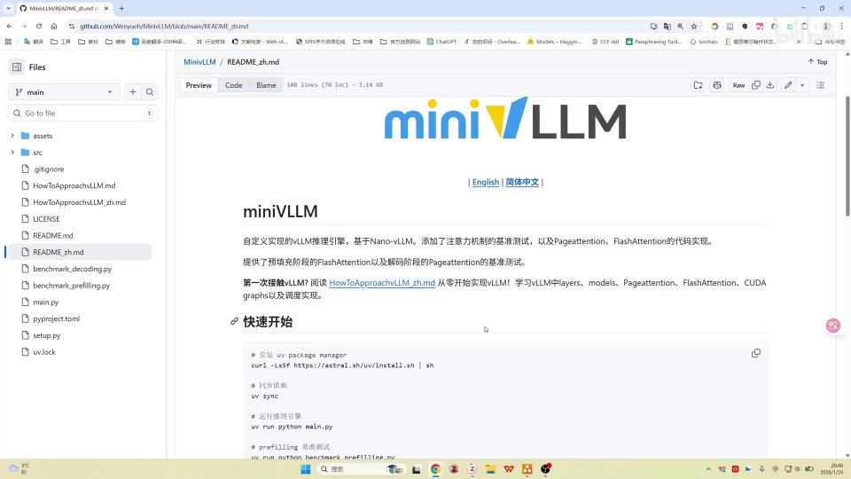
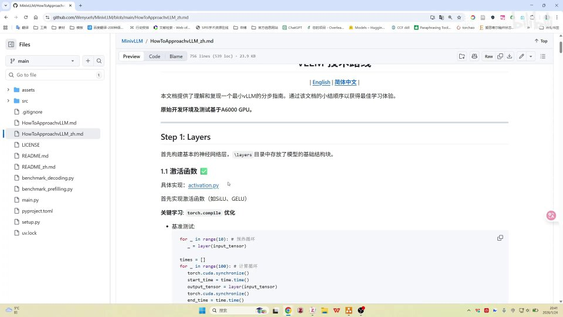

# 第00讲：MiniVLLM —— 一个适合从零学 vLLM 的开源项目

## 本讲要解决的核心问题（SCQA）

**背景**：vLLM 是目前最主流的开源大模型推理引擎之一，很多同学想通过读它的源码来理解「大模型是怎么把话说出来的」，但真实工程往往体量巨大、模块繁杂。

**冲突**：直接啃 vLLM 源码，人很容易迷路——大体框架能看懂，可一旦想深入某一层的实现细节，就不知道从哪里下手，也就是 UP 主说的「摸瞎」。市面上又缺少一份既能跑、又能一层一层讲清楚的入门实现。

**疑问**：有没有一个「小到能读完、又保留核心机制」的 vLLM 替代项目，适合作为学习起点？

**回答（中心思想）**：有。本讲推荐开源项目 **MiniVLLM**：它基于 Nano-vLLM 改写，自带 PagedAttention 与 FlashAttention 的实现和基准测试；文档中英文齐全、按 step by step 的技术路线逐层讲解，非常适合作为学习 vLLM 基础结构的第一个项目。UP 主本人也是该项目的贡献者，接下来会围绕它做一系列「一层一层撸代码」的视频。

[【跳转到 00:00】](https://www.bilibili.com/video/BV1Vjz1B2EQu/?t=0)

---

## 一、MiniVLLM 是什么：一个小而全的 vLLM 学习版

### 1.1 先搞清楚：vLLM 是做什么的

对初学者来说，先记住三个名词就够：

- **大模型（LLM，Large Language Model）**：像 ChatGPT 背后那样、能根据上文一个字一个字往下续写的模型。它的输出过程叫**推理（inference）**。
- **推理引擎**：负责把训练好的模型高效跑起来的软件。同样是回答一个问题，引擎写得好不好，决定了速度、显存占用和能同时服务多少用户。
- **vLLM**：当前最流行的开源推理引擎之一。它的核心技术是 **PagedAttention**，可以粗略理解成「把显存像操作系统管理内存分页那样管理」，从而大幅提升并发吞吐。

MiniVLLM 就是一个人为可控的小型推理引擎，目的是让你**真正读懂 vLLM 里的关键机制**，而不是被工程的复杂度劝退。

### 1.2 MiniVLLM 的来历：微软研究员发起，UP 主参与贡献

据 UP 主介绍，MiniVLLM 是一位**微软的高级人工智能研究院的高级研究员（华博士）**发起的开源项目，而 UP 主本人正在参与贡献。项目地址是 <https://github.com/Wenyueh/MinivLLM>。

需要提醒的是，这是视频中的口述信息，人物头衔以项目仓库页面为准即可，不必记精确职称。

[【跳转到 00:00】](https://www.bilibili.com/video/BV1Vjz1B2EQu/?t=0)

---

## 二、为什么它适合学习：文档比同类项目更全

### 2.1 定位：基于 Nano-vLLM，但文档更丰富

MiniVLLM **基于 Nano-vLLM**（另一个极简的 vLLM 复刻项目）实现。UP 主强调，相较于 vLLM 本身，MiniVLLM 在**文档上更全面**。这一点对初学者尤其重要：读得懂的文档，等于有人给你画好了地图。

### 2.2 它自己实现了核心机制，还做了基准测试

MiniVLLM 不是简单调用现成库，而是**自己实现了 PagedAttention 和 FlashAttention**，并针对它们做了 **benchmark（基准测试）**。这两个名词是理解 vLLM 的关键：

- **PagedAttention（分页注意力）**：vLLM 的招牌技术。它把每个请求的键值缓存（KV Cache）切成固定大小的「页」来管理，减少显存碎片、让显存利用率更高。类比：像操作系统把内存分成一页页来分配，而不是必须找一整块连续空间。
- **FlashAttention（闪电注意力）**：一种把注意力计算做得更省显存、更快的算法实现。它通过分块计算，避免一次性生成巨大的注意力矩阵。
- **benchmark（基准测试）**：用统一的测试脚本去量化「快了多少、省了多少」。有 benchmark，性能提升才算数，而不是嘴上说说。

### 2.3 中英文双语文档，中文翻译也由 UP 主完成

项目文档**同时提供英文和简体中文版本**，方便不同习惯的读者。UP 主提到，其中的**简体中文文档正是由自己翻译的**；仓库里那个 **MiniVLLM 的 logo 也是他本人设计的**。这说明他在项目里的参与度不低，后续讲解也会更贴近实现细节。

[【跳转到 00:25】](https://www.bilibili.com/video/BV1Vjz1B2EQu/?t=25)

---

## 三、杀手锏：一份 step by step 的「vLLM 技术路线」

### 3.1 它为什么对新手友好

除了 README，MiniVLLM 还提供了一份名为 **《vLLM 技术路线》** 的文档（HowToApproachVLLM）。UP 主认为，相较于其他同类项目，这份文档**更丰富**，因为它把每一层**具体做什么、怎么实现、benchmark 测了什么、涉及哪些关键知识点**都写清楚了。

最关键的是它的组织方式是 **step by step（一步一步）**——从第一层开始，按顺序往下走。这对新手非常友好，因为你不必先理解全局工程，只要跟着步骤一层层读即可。

### 3.2 路线里会讲什么

从截图可以看到，路线文档的学习顺序大致是：

1. **Layers（层）**：先搭建基础神经网络层，放在 `layers` 目录里。
2. **激活函数（activation）**：例如 SiLU、GELU，对应 `activation.py`。所谓激活函数，就是给网络引入非线性的那个函数，让模型能拟合复杂关系。
3. **LayerNorm（层归一化）**：稳定每一层数值分布，让训练/推理更稳。
4. 之后继续深入到注意力、调度等更上层的机制。

文档还会教你**如何做基准测试**，例如用循环跑 `layer(input_tensor)` 并计时，用数据说话地比较不同实现的性能。

[【跳转到 00:50】](https://www.bilibili.com/video/BV1Vjz1B2EQu/?t=50)

---

## 四、UP 主的动机：读 vLLM 太臃肿，需要一个能「钻进去」的实现

UP 主分享了自己找项目的心路历程，这段动机恰好说明了为什么 MiniVLLM 值得推荐：

- 学 vLLM 时，**大体框架**能粗略了解；
- 但想**深入细节**时，工程太臃肿（他形容为「vLLM 太臃肿了」），常常「摸瞎」，不知从何入手；
- 于是想找一个干净、完整的 vLLM 实现来对照学习；
- 正好在 **vLLM 官方的小红书账号**上，看到官方推荐了一个 vLLM 入门教程，里面就推荐了 **MiniVLLM** 这个项目；
- 时间点还很巧——当时 MiniVLLM **刚刚发布大约一周**，于是他就这样了解到并被它吸引。

[【跳转到 01:15】](https://www.bilibili.com/video/BV1Vjz1B2EQu/?t=75)

---

## 五、从使用者到贡献者：他做了什么

了解项目之后，UP 主没有停在「用」，而是**提交了几个 PR 和 issue**，正式参与到项目贡献中。

这里顺便解释两个 GitHub 常用名词：

- **issue（议题）**：用来报告问题、提出建议或讨论需求，相当于项目的「问题清单 / 留言板」。
- **PR（Pull Request，拉取请求）**：你改好了代码，向项目发起「请把我的修改合并进去」的请求。审核通过后，你的代码就进了主仓库。

也就是说，他不只是推荐者，还是项目的实际维护参与者，这也让他后续的系列视频更有「内部视角」。

[【跳转到 01:40】](https://www.bilibili.com/video/BV1Vjz1B2EQu/?t=100)

---

## 六、后续计划：一层一层录，把 MiniVLLM 撸一遍

UP 主公布了接下来的内容规划，也是这个系列的价值所在：

- 计划**为每一个 step 都单独做一个视频**；
- 从 **linear layer（线性层）**、也就是 layer 层开始；
- 接着讲具体的 **activation（激活函数）** 实现；
- 再到 **layer norm（层归一化）** 等实现；
- **一步一步往下录**，带着观众把整个项目过一遍。

同时他也坦诚地说明：这个项目**对他来说体量不小，时间上可能没那么充裕**。但他明确表示：**既然决定做了就一定会做**，只是更新时间不太确定；如果**反馈好、有人催更，就会更新得快一些**。所以这算是「先挖个坑」，但他承诺会填。

[【跳转到 02:05】](https://www.bilibili.com/video/BV1Vjz1B2EQu/?t=125)

---

## 小结

- **MiniVLLM 是一个定位清晰的学习型推理引擎**：基于 Nano-vLLM，人为可控、便于通读，目标是让初学者真正读懂 vLLM 的关键机制。
- **它自己实现了 PagedAttention 与 FlashAttention，并配有基准测试**，性能提升有数据支撑，而不是空谈。
- **文档是它最大的优势**：中英文双语、按 step by step 的技术路线逐层讲解，每层讲清「做什么、怎么实现、测了什么、用到什么知识」。
- **UP 主是项目贡献者**：翻译了简体中文文档、设计了 logo，并提交过多个 PR 和 issue，视角更贴近实现。
- **推荐动机来自真实痛点**：vLLM 太臃肿、深入细节时容易「摸瞎」，所以需要一个干净完整的实现来对照学习。
- **后续有持续更新的系列计划**：从 linear layer、activation、layer norm 开始，一步一视频地撸完项目；反馈越好更新越快。
- **适合人群**：想入门 vLLM 基础结构、偏好双语与技术路线文档、愿意动手跑和测的初学者。

## 关键术语速查

| 术语 | 一句话解释 |
| --- | --- |
| vLLM | 主流开源大模型推理引擎，以 PagedAttention 著称。 |
| 推理（inference） | 模型根据输入逐字生成输出的过程，区别于训练。 |
| MiniVLLM | 基于 Nano-vLLM 的极简 vLLM 实现，用于学习，自带核心机制与基准测试。 |
| Nano-vLLM | 另一个极简的 vLLM 复刻项目，MiniVLLM 的基础。 |
| PagedAttention | 把 KV Cache 分页管理以提升显存利用率的注意力技术。 |
| FlashAttention | 通过分块计算降低显存、加速注意力的算法实现。 |
| benchmark | 基准测试，用统一脚本量化性能。 |
| activation（激活函数） | 给网络引入非线性的函数，如 SiLU、GELU。 |
| LayerNorm（层归一化） | 稳定每层数值分布、让模型更稳的归一化操作。 |
| issue / PR | GitHub 上的问题议题 / 拉取请求，分别用于报问题和贡献代码。 |
| step by step | 一步一步、按顺序的学习组织方式，对新手友好。 |
