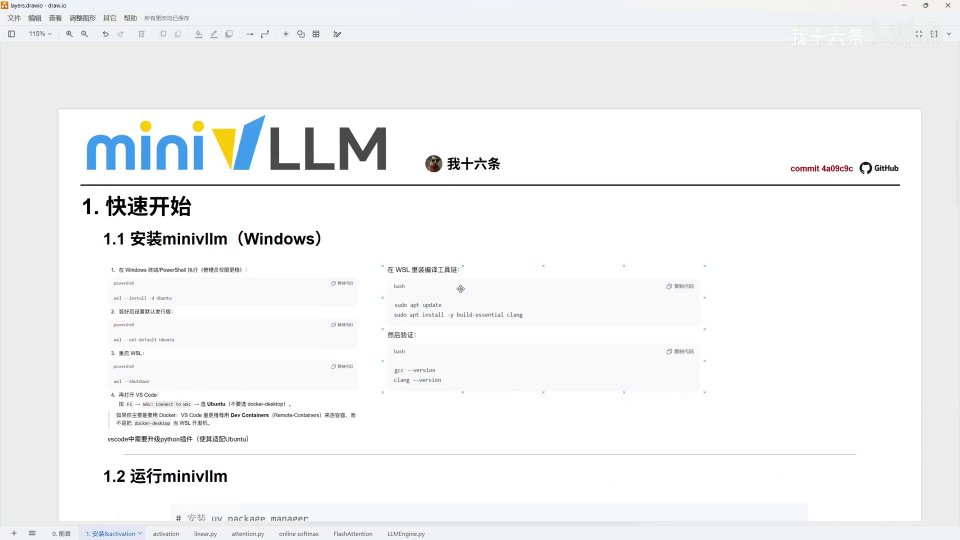
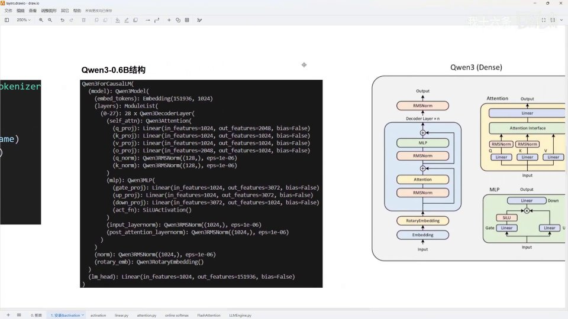
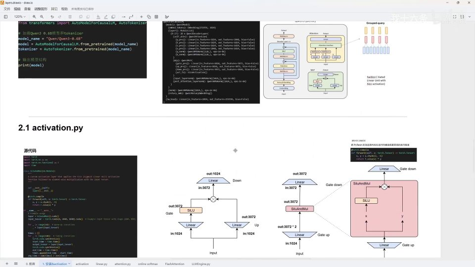
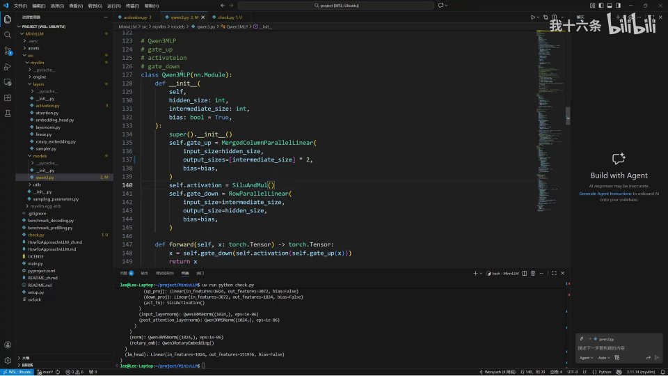
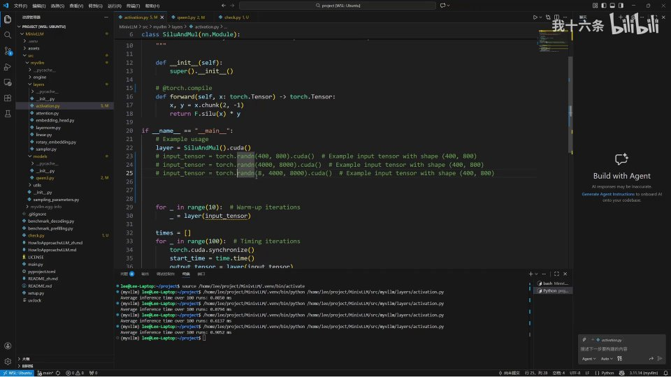

# 第01讲：装好 MiniVLLM，从 activation.py 看懂第一个算子融合

## 本讲要解决的核心问题（SCQA）

**背景**：上一讲我们认识了 MiniVLLM——一个基于 Nano-vLLM 改写、自带 PagedAttention 与 FlashAttention、并有 step by step 技术路线的极简推理引擎。它很适合作为学习 vLLM 的第一个项目。

**冲突**：但「知道它适合学习」和「能把它跑起来、并真正读懂第一段源码」是两回事。很多人卡在第一步：环境装不上、依赖跑不通；好不容易跑起来，打开 `layers/activation.py` 又看不懂——为什么一个激活函数要写成这样？`SiluAndMul` 到底融合了什么？`torch.compile` 开着到底有没有用？

**疑问**：MiniVLLM 到底怎么装、怎么跑通？它的第一个源码文件 `activation.py` 实现的是什么，为什么值得用这种写法？要验证它「更快」，又该怎么做基准测试？

**回答（中心思想）**：本讲分两步走。第一步，把环境装好并跑通三个测试脚本——Windows 用户只需多装一个 WSL 和编译工具链，其余照 README 即可；第二步，精读 `activation.py`，理解 **SiluAndMul 把「SiLU 激活」和「逐元素相乘」融合成了一个算子**，并配合 Qwen3-0.6B 的 MLP 结构看懂「gate 与 up 合并」这一算子融合技巧。最后用 benchmark 说明一个反直觉结论：**`torch.compile` 只在大形状上更快，小形状反而更慢**。

[【跳转到 00:00】](https://www.bilibili.com/video/BV1M4zeB3EoY/?t=0)

---

## 一、开讲之前：先搞清这个系列怎么看

UP 主在进入正式代码前，先交代了六件事。这六点决定了你该怎么跟着这个系列学。

### 1.1 项目定位：基于 Nano-vLLM，FlashAttention 是自己实现的

第一点，**MiniVLLM 是基于 Nano-vLLM 进行二次开发的**。MiniVLLM 相对 Nano-vLLM 来说，大部分内容是一样的，只有一些实现细节不同；此外 **FlashAttention 这一块是 MiniVLLM 自己实现的**。

- **Nano-vLLM**：另一个极简的 vLLM 复刻项目，可以理解为「迷你版 vLLM 的迷你版」，是 MiniVLLM 的底座。
- **FlashAttention（闪电注意力）**：一种把注意力计算分块进行、既省显存又提速的实现。它避免一次性生成巨大的注意力矩阵，是推理性能的关键优化之一。

所以两个项目「都大差不差」，都可以拿来学习；想更贴近 vLLM 官方实现就读 Nano-vLLM，想跟着本系列走就读 MiniVLLM。

> 值得一提的是，MiniVLLM 并不是简单地把 Nano-vLLM 拿来用，而是**自己动手重写/补全了 FlashAttention** 这一关键模块。对学习者来说这反而更好——你可以对照阅读一份「更完整、带自己实现」的代码，而不只是调用现成库。

### 1.2 学习心态：这也是费曼学习法

第二点，UP 主说**自己也是项目的学习者**，这套视频其实是一种**费曼学习法**——费曼学习法的核心是「把知识讲给别人听，讲明白了才算真懂」。他觉得学习过程多多少少有点枯燥无聊，所以习惯把学习过程做成草稿、推导每一步是怎么来的，比如形状（shape）的变化、tensor 的变化，以及公式是怎么一步一步推出来的。

既然平时学习也要做笔记，那干脆**把笔记做成视频**，这就是他做视频的初衷。他也坦诚地说明：过程中难免有些细节掌握不到，因为他并非什么「大佬」，只是在**主观地表达自己的认知和理解**。这句话对初学者很重要——你不需要等一个权威来教你，边学边讲、边讲边学本身就是有效的路径。

[【跳转到 00:25】](https://www.bilibili.com/video/BV1M4zeB3EoY/?t=25)

### 1.3 工具、课件、更新频率与环境

后面四点可以并在一起记：

- **讲解工具用 draw.io**：第三点，视频里的板书主要是用 **draw.io** 画的。这是一个免费的在线画图工具，用来做笔记、画流程图、画结构图都很方便，UP 主也顺势把它推荐给大家。
- **课件放评论区**：第四点，用 draw.io 做的课件和草稿都会放在评论区，随时可以下载，对照视频看会更清楚。
- **更新不设硬承诺，尽量周更**：第五点，关于更新频率，UP 主不打包票。因为最近比较忙，一方面要忙毕业，另一方面要准备申博的材料，所以他只能说「尽量保持周更」。
- **开发环境是 VS Code + Windows**：第六点，他本地的开发环境是基于 **VS Code 加 Windows**。要说明的是，虽然平时用 Linux 开发，但这次是在家里的 Windows 机器上录制的，所以才会有一条 Windows 的安装路线；下节就会讲到，Windows 上只需多一个 WSL。

这六点看起来是「闲聊」，其实决定了你该怎么跟：项目是学习导向的、会边讲边推导、有可下载的课件、更新看反馈、环境普通电脑也能搭——这些正是「适合初学者」的具体含义。


[【跳转到 01:00】](https://www.bilibili.com/video/BV1M4zeB3EoY/?t=60)

### 1.4 本讲内容不多：安装 + activation 两部分

交代完背景，UP 主给出本讲路线：今天主要讲**两个部分**——

1. **安装**：把环境搭起来，然后运行测试一下；
2. **Layers 里的 activation**：也就是 `activation.py` 这个文件。

所以今天的内容其实不多，「可能十来分钟吧」。另外他提到，本讲基于某个 **commit（提交记录）** 录制：以后如果大家看视频时发现项目版本已经变了，可以跟着这个提交记录切到之前的分支再跟着做。不过他判断应该不会有太大变化。



[【跳转到 02:05】](https://www.bilibili.com/video/BV1M4zeB3EoY/?t=125)

> 这里解释两个入门名词：**commit（提交）** 是 Git 里一次代码改动的快照，每个 commit 有唯一编号；**分支（branch）** 是一条独立的开发线。切到某个 commit，就等于把代码「时光倒流」到视频录制时的状态，保证你跟视频看到的是同一份代码。

---

## 二、安装 MiniVLLM：Windows 也能跑，核心是多装一个 WSL

### 2.1 Linux 照 README 走，Windows 先装 WSL

UP 主说，**自己其实是基于 Linux 进行开发的**，Linux 下安装很简单，**跟着 GitHub 上的流程走就行了**。但因为在家里录制时只有 Windows 环境，所以他额外做了一个 **Windows 安装开发的小教程**。

Windows 路径的核心是：**先装一个 WSL**——WSL 全称 Windows Subsystem for Linux，即「Windows 下的 Linux 子系统」，它能让你在 Windows 里直接跑一个真正的 Linux 环境。它和虚拟机不一样：WSL 与 Windows 共享内核层面的能力，启动快、占用小，还能直接在 VS Code 里连接使用，非常适合开发。

讲义里给出的 Windows 安装步骤大致是：

1. **在 Windows 或 PowerShell 执行（需要管理员权限）**，安装 Ubuntu：
   ```bash
   wsl --install -d Ubuntu
   ```
2. **安装后设置默认账户和密码**，把 Ubuntu 设为默认发行版：
   ```bash
   wsl --set-default-ubuntu
   ```
3. **重启 WSL**，让配置生效：
   ```bash
   wsl --shutdown
   ```
4. **再用 VS Code 连接**：按 `F1`，选择 `WSL: Connect to WSL`，连接到 Ubuntu（不需要 Docker Desktop）。如果还需要 Docker，则在 VS Code 里安装 Dev Containers（Remote-Containers）扩展。

另外讲义特别提醒一句：**VS Code 里需要安装 Python 插件**（推荐官方的 Python 扩展），否则后续运行和调试会不方便。

装好 WSL 后，后面的命令就和 Linux 一模一样了，跟着 README 走一遍即可。


[【跳转到 02:51】](https://www.bilibili.com/video/BV1M4zeB3EoY/?t=171)

### 2.2 装编译工具链：C/C++ 的 clang

装好 WSL 之后，还需要**安装一个编译工具链**——也就是 C 语言、C++ 的工具链。UP 主演示的做法是用 apt 安装：

```bash
sudo apt update
sudo apt install -y build-essential clang
```

装完可以验证一下版本，确认工具链就位：

```bash
gcc --version
clang --version
```

**为什么需要编译工具链？** 因为 MiniVLLM 里很多性能关键的部分（比如后面要讲的算子、FlashAttention 相关代码）并不是纯 Python，编译时可能需要 C/C++ 编译器。没有编译器，`uv sync` 或运行时就会报错。

[【跳转到 03:16】](https://www.bilibili.com/video/BV1M4zeB3EoY/?t=196)

### 2.3 克隆项目、同步依赖

UP 主连上 WSL 后进入了一个自己提前创建好的目录。他提示：如果是第一次装 WSL，这个目录下其实什么都没有，用 `mkdir` 创建你自己的目录就行。

然后就是标准的克隆流程：

```bash
# 1. 在 GitHub 上打开 MiniVLLM 主页，复制仓库地址
git clone https://github.com/Wenyueh/MinivLLM.git
cd MinivLLM
```

如果没装过 git，先装 git；克隆完成后项目就落到本地了。

接下来是**安装依赖**。MiniVLLM 用的是 **uv**——一个比 pip 更快的 Python 包管理与运行工具，既能管依赖、也能直接运行脚本。如果还没装 uv，用官方脚本一行装好：

```bash
# 安装 uv package manager
curl -LsSf https://astral.sh/uv/install.sh | sh
```

UP 主已经装过 uv，所以演示的是**同步依赖**这一步：

```bash
uv sync
```

**这一步在做什么？** `uv sync` 会根据项目里声明的依赖清单，把需要的 Python 包全部下载并装到一个隔离环境里。UP 主因为之前装过这些包，所以这一步很快；第一次装的话会需要一点时间。看到命令顺利结束，**环境就搭建好了**。

到这一步，讲义「1.2 运行 minivllm」里列出的命令就都能用了，可以顺手对照记一下：

```bash
# 安装 uv package manager
curl -LsS https://astral.sh/uv/install.sh | sh

# 同步依赖
uv sync

# 运行推理引擎
uv run python main.py

# prefilling 基准测试
uv run python benchmark_prefilling.py

# decoding 基准测试
uv run python benchmark_decoding.py
```

### 2.4 安装时最容易踩的三个坑

UP 主没有逐条报错，但结合他的演示，初学者最容易在这三处卡住：

- **忘了装编译工具链**：`uv sync` 或运行时报 `clang` / `gcc` 找不到，回看 2.2 装好 `build-essential` 和 `clang` 即可。
- **在 Windows 原生环境里跑**：MiniVLLM 的性能相关代码依赖 Linux 工具链，最好在 WSL 里执行，而不是 PowerShell 里。
- **第一次 `uv sync` 很慢**：这不是出错，而是真的在下载一堆包；如果本地已经装过这些包，就会快很多，这也是 UP 主演示时很快的原因。


[【跳转到 04:24】](https://www.bilibili.com/video/BV1M4zeB3EoY/?t=264)

---

## 三、运行测试：三个脚本跑通，说明环境没问题

环境搭好后，UP 主开始运行测试。课程里主要演示了三类脚本：

### 3.1 主程序 main.py

第一条是运行主推理程序：

```bash
uv run python main.py
```

UP 主第一次运行时觉得有点慢，甚至重启了一遍。他解释原因：**自己的显卡是 RTX 3070**，对这个模型来说压力还是挺大的。最终 `main.py` 顺利跑完，说明**基础环境没有问题**。

> **`main.py` 在做什么？** 从后面几帧可以看到，它是一段推理示例：构造一个配置、调用 `llm.generate(prompts, sampling_params)` 生成文本，再用 tokenizer 把结果解码打印出来。它相当于一个「最小可跑的推理入口」——只要它能吐出文本，就说明模型加载、调度、解码整条链路是通的。
>
> 另外，运行 `main.py` 时 GPU 占用会被拉高（UP 主的截图里显存约占 7GB），所以如果机器显存紧张，跑的时候最好先关掉其他占显存的程序。


[【跳转到 05:28】](https://www.bilibili.com/video/BV1M4zeB3EoY/?t=328)

### 3.2 profile 与 decoding 基准测试

接着测试另外两个脚本，用法同样是 `uv run`：

```bash
uv run python benchmark_prefilling.py   # 预填充阶段基准测试
uv run python benchmark_decoding.py     # 解码阶段基准测试
```

UP 主先测了 profile / prefilling，没问题；再测 decoding，同样没问题。在 decoding 的输出里可以看到测试用的配置，比如：

```text
batch_size=4, seq_len=2048, max_head=32,
num_kv_heads=8, head_dim=128, block_size=16
```

以及依次对比了三种实现：

```text
1. Testing Naive PyTorch implementation...
2. Testing optimized PyTorch implementation...
3. Testing Triton implementation...
```

这里其实已经埋下了后面要讲的几个知识点：`num_kv_heads`（KV 头数）暗示了 **GQA（分组查询注意力）**，`block_size` 暗示了 **PagedAttention** 的分块，`Triton implementation` 则说明部分算子是用 Triton 写的自定义内核。今天不用深究，先有个印象。这几个脚本能跑通，就说明 MiniVLLM 的推理链路在你这台机器上是**完整可用**的。

> **预填充（prefilling）**：把用户输入的整段提示一次性喂给模型、算出中间结果。算力密集、适合并行。
> **解码（decoding）**：之后一个 token（词元）一个 token 地往外生成，更依赖访存，往往是延迟瓶颈。
> MiniVLLM 分别对这两个阶段做 benchmark，正好对应 vLLM 优化时最关心的两块性能。这两个脚本后面在讲对应模块时还会细看。

[【跳转到 06:17】](https://www.bilibili.com/video/BV1M4zeB3EoY/?t=377)

---

## 四、再看模型：Qwen3-0.6B 的结构长什么样

测试跑通后，UP 主先讲了一段**讲义（PPT）**，用真实模型的结构来给后面的源码做铺垫。

### 4.1 用 check.py 打印模型结构

他先下载并输出 **Qwen3 0.6B** 的结构。做法是新建一个 `check.py`，内容大致是：

```python
from transformers import AutoModelForCausalLM, AutoTokenizer

model_name = "Qwen/Qwen3-0.6B"
model = AutoModelForCausalLM.from_pretrained(model_name)
tokenizer = AutoTokenizer.from_pretrained(model_name)

print(model)
```

然后运行：

```bash
uv run python check.py
```

**这一步在做什么？** `from_pretrained` 会下载模型（如果本地没有）并加载它；`print(model)` 把整个网络结构打印出来。第一次没下载过 Qwen3-0.6B 的话，会花一段时间先把模型下载下来；下载完就输出了模型结构。

> **Qwen3**：通义千问系列的第三代开源大语言模型；**0.6B** 表示参数规模约 6 亿，属于小模型，适合在普通显卡上跑，也方便学习。
> **tokenizer（分词器）**：把文字切成模型能处理的 token 的工具。

[【跳转到 06:49】](https://www.bilibili.com/video/BV1M4zeB3EoY/?t=409)

### 4.2 对照架构图读懂每一块

打印出来的结构，可以对照 Qwen3 的架构图来看。UP 主带着大家从上到下捋了一遍：

1. **embedding（嵌入层）**：对 token 做一个 embedding，把离散的词元变成向量。结构里显示 `Embedding(151936, 1024)`，即词表约 15 万、隐藏维度 1024。
2. **layers（层）**：这里是 `ModuleList`，包含 28 个 `Qwen3DecoderLayer`，也就是 decoder layer（解码层），是模型的主体。
3. **self_attn（自注意力）**：里面包括 **QKV** 三个线性层和一个 **O** 线性层，这就是 attention 层里边的东西；另外还有两个 **RMSNorm**。
4. **MLP**：注意力之后是一个 MLP（多层感知机），这正是今天要讲的重点。
5. **RMSNorm**：每个 decoder layer 里都有 **RMSNorm**（一种归一化），UP 主评价「很简单」。
6. **旋转嵌入（RoPE）**：结构里是 `Qwen3RotaryEmbedding`，即旋转位置编码，用来把位置信息编码进向量。
7. **lm_head**：最后是一个线性层输出，`Linear(in_features=1024, out_features=151936)`，把隐藏向量映射回词表，也就是「头」那一块，用来预测下一个 token。



打印出来的结构里，还能读到很多具体数字，认识它们有助于理解模型规模：

```text
Qwen3ForCausalLM(
  (model): Qwen3Model(
    (embed_tokens): Embedding(151936, 1024)
    (layers): ModuleList(
      (0-27): 28 x Qwen3DecoderLayer(
        (self_attn): Qwen3Attention(
          (q_proj): Linear(in=1024, out=2048, bias=False)
          (k_proj): Linear(in=1024, out=1024, bias=False)
          (v_proj): Linear(in=1024, out=1024, bias=False)
          (o_proj): Linear(in=2048, out=1024, bias=False)
          (q_norm): RMSNorm(128)
          (k_norm): RMSNorm(128)
        )
        (mlp): Qwen3MLP(
          (gate_proj): Linear(in=1024, out=3072, bias=False)
          (up_proj):   Linear(in=1024, out=3072, bias=False)
          (down_proj): Linear(in=3072, out=1024, bias=False)
          (act_fn): SiLUActivation()
        )
        (input_layernorm): RMSNorm(1024)
        (post_attention_layernorm): RMSNorm(1024)
      )
    )
    (norm): Qwen3RMSNorm(1024)
    (rotary_emb): Qwen3RotaryEmbedding()
  )
  (lm_head): Linear(in=1024, out=151936, bias=False)
)
```

几个值得注意的细节：

- **藏维度是 1024**，一共 **28 个 decoder layer**，词表 **151936**。
- **Q 投影输出 2048，而 K/V 只有 1024**，两者不相等——这正是 **GQA（Grouped-Query Attention，分组查询注意力）** 的特征：多个查询头共享一组键值头，能省下 KV Cache 的显存。结构里 `q_norm`、`k_norm` 的维度是 **128**，即单个头的维度（head_dim = 128）。
- **MLP 的三层维度是 1024 → 3072 → 1024**，中间放大到 3 倍，gate 与 up 都是 `1024 → 3072`，down 是 `3072 → 1024`。
- **激活函数是 SiLU**（`act_fn: SiLUActivation`），这就是今天的主角。

> **为什么说这些数字重要？** 后面做算子融合时，我们要把 gate 和 up 合并成一次矩阵乘。它们的输出维度都是 3072，所以合并后一次输出的宽度正好是 `3072 × 2 = 6144`；`SiluAndMul` 再把这个宽度切成两个 3072——数字对得上，融合才成立。

UP 主对照后确认：自己打印的 0.6B 结构和千问三真实模型**能一一对应**——嵌入、旋转嵌入层、attention 里的三个线性层（Q、K、V）加一个 O、隐藏状态线性层、两个 RMSNorm，以及 MLP，全部对得上。

> 几个名词解释：
> - **linear layer（线性层）**：做矩阵乘法的层，公式是 `y = xW + b`，是神经网络最基本的构件。
> - **RMSNorm**：一种归一化，把每个向量的数值按均方根缩放到稳定范围，让深层网络更稳。
> - **QKV / O**：注意力里的 Query、Key、Value 三个投影，以及把注意力结果汇总输出的 Output 投影。

[【跳转到 07:49】](https://www.bilibili.com/video/BV1M4zeB3EoY/?t=469)

### 4.3 MLP 是今天的重点

最后聚焦到 MLP。对照结构可以看到，Qwen3 的 MLP 里有：

- **gate_proj（门控投影）**：`Linear(1024 → 3072)`
- **up_proj（上投影）**：`Linear(1024 → 3072)`
- **down_proj（下投影）**：`Linear(3072 → 1024)`
- **act_fn**：`SiLUActivation`，也就是 SiLU 激活（结构里写作 `SiluActivation`）

其中 **gate、up、down 加一个 SiLU 激活**这一块，正是今天 `activation.py` 要讲的核心。为什么偏偏是它？因为这一块里同时出现了「两个可以做矩阵乘合并的线性层」和「一个逐元素激活」，是算子融合最容易见效、也最直观的地方——把 gate 和 up 合并成一次矩阵乘，再把 SiLU 和相乘并成一个算子，就可以少做几次显存读写。理解了它，后面再看 attention 里的融合就有参照了。

[【跳转到 08:42】](https://www.bilibili.com/video/BV1M4zeB3EoY/?t=522)

---

## 五、activation.py：把 SiLU 和乘法融合成一个算子

### 5.0 为什么第一站是 activation.py

按 MiniVLLM 的 step by step 技术路线，`layers` 目录是第一层，而 `activation.py` 又是其中最独立、最简单的一个文件——它不依赖别的模块，却能完整展示「一个算子长什么样、基准测试怎么写、算子融合是怎么回事」这套套路。用最小的文件建立对源码的整体感觉，再去看更复杂的 layer norm、attention，就不会一上来就被劝退。这也是 UP 主先讲它的原因。

铺垫完模型结构，UP 主直接打开源码 `layers/activation.py`——里面其实只有一个函数/类，就是 **`SiluAndMul`**。它把**激活函数**和**乘加**算在了一起。

### 5.1 SiluAndMul 在做什么

先看它「融合」的含义。原本的计算图是这样：

- 输入经过**两个线性变化**（两个矩阵乘）；
- 其中左边那路经过 **SiLU** 激活；
- 右边一路**直接做线性变化**，不激活；
- 然后把两路结果**逐元素相乘**，再输出。

而 `SiluAndMul` 做的事，就是把「SiLU + 相乘」这后半段**融合成一个算子**，让整个流程更简洁。

> **算子（operator / op）**：深度学习框架里的一个基本计算单元，比如一次矩阵乘、一次加法、一次激活，都是一个算子。
> **算子融合（operator fusion）**：把多个小算子合并成一个大算子，减少中间结果的读写次数和调度开销，从而提速。
> **SiLU（Sigmoid Linear Unit）**：一种激活函数，公式是 `silu(x) = x · sigmoid(x)`，用来给网络引入非线性。它也是 Qwen 系列 MLP 用的激活函数。

用公式把这段流程写出来会更清楚。设 MLP 的输入为 `x`，权重分别为 `W_gate`、`W_up`、`W_down`，那么原本 Qwen3 的 MLP 计算是：

```text
gate = SiLU(x @ W_gate)      # 门控分支：先线性，再 SiLU
up   = x @ W_up              # 上分支：只做线性，不激活
out  = (gate * up) @ W_down  # 两路逐元素相乘，再下采样
```

而 `SiluAndMul` 处理的，正是中间那句 `gate * up`：把「SiLU 激活」和「逐元素相乘」合成一个算子。之所以能合成，是因为这两步都作用在同一个形状的中间张量上，且都是逐元素运算，融合后可以一次性算完，不必把中间结果写回显存再读出来。

> **为什么 MLP 要用「门控」这种结构？** 可以把它类比成一个「闸门」：`up` 分支提供内容，`gate` 分支决定「放多少内容过去」。gate 经过 SiLU 后大部分数值落在 0 附近，相当于对信息做了一次可学习的筛选，让模型能更灵活地控制信息流。这种带门控的 MLP 在 LLaMA、Qwen 等现代大模型里非常常见。

[【跳转到 09:12】](https://www.bilibili.com/video/BV1M4zeB3EoY/?t=552)

### 5.2 从计算图看融合：输入 1024，输出 3072

UP 主把讲义里的计算图摘下来对照讲解。原本的模型结构里可以清楚看到：**输入形状是 1024，输出是 3072**。

做了算子融合之后，他做了一件事：**把「下采样的层」和「上采样的线性层」实际融合起来，变成一个大上采样**。原本是输入 1024 → 输出 3072，融合后**直接输入 1024、输出两个 3072**，一次矩阵乘就顶了原来的两步。


[【跳转到 09:44】](https://www.bilibili.com/video/BV1M4zeB3EoY/?t=584)

### 5.3 源码只有三行：chunk 之后一半做 SiLU、一半原样，再相乘

那 `SiluAndMul` 内部具体做了什么？UP 主说源代码**很简单**：X 进来后，对 X 做一次 **chunk（切分）**，把 X 平分成两个，一个叫 X、一个叫 Y。对应到计算图，就是「先进入一个大的 gate_up（一次上采样），左边得到 X、右边得到 Y」；然后 **X 做 SiLU，Y 不做 SiLU，最后两者相乘直接输出**。就这么简单。

源码长这样：

```python
import torch
import torch.nn as nn
import torch.nn.functional as F

class SiluAndMul(nn.Module):
    """对输入先做 SiLU 激活，再与另一半逐元素相乘。"""
    def __init__(self):
        super().__init__()

    @torch.compile
    def forward(self, x: torch.Tensor) -> torch.Tensor:
        x, y = x.chunk(2, -1)
        return F.silu(x) * y
```

- `x.chunk(2, -1)`：把最后一维（通道维）平均切成两半，得到 `x` 和 `y`。
- `F.silu(x) * y`：对前面的 `x` 做 SiLU 激活，再和 `y` 逐元素相乘。

也就是说，**输入一个宽度为 `2×d` 的张量，输出一个宽度为 `d` 的张量**：前半做门控（激活），后半原样，两者相乘。这正好对应了 MLP 里 gate 分支和 up 分支的关系。



需要注意源码里那个 **`@torch.compile`** 装饰器——它是性能相关的关键，我们留到第七节专门讲。

[【跳转到 10:14】](https://www.bilibili.com/video/BV1M4zeB3EoY/?t=614)

### 5.4 为什么值得融合：为了读取权重、优化推理引擎

UP 主进一步解释了「为什么要做这个融合」。他切换到 `Qwen3MLP` 的代码（这是之后要做的内容，今天先看一眼它的用法），说明这里 `SiluAndMul` 用在哪里。他给出了两条理由：

1. **必须复现 Qwen3 模型**：我们要把 Qwen3 的整套架构复现出来。
2. **为了从 PyTorch 权重里读出参数**：原本 Qwen3 是用 PyTorch 训练的，模型权重以 `.pt`（或 safetensors）形式存储。我们需要从这些权重文件里读出参数，再放进**我们自己设计的、面向推理引擎做优化的模型**里。

所以，就需要对算子做**融合和重构**——以尽量优化的方式，把原本复杂、甚至动态的算子，融合成一个**融合算子**。这正是推理引擎（比如 vLLM）常见的优化手法。

> **动态算子 vs 融合算子**：「动态」指形状/流程在运行时才确定、需要框架动态调度；「融合」指把多个计算合成一个，减少调度与显存往返。

[【跳转到 11:33】](https://www.bilibili.com/video/BV1M4zeB3EoY/?t=693)

---

## 六、落到 Qwen3MLP：gate_up 合并是融合的实招

### 6.1 我们实现的 Qwen3MLP：三步走

先看「我们自己实现的 Qwen3 MLP」（这部分内容后面才会细讲，今天先看结构）。它定义了**一个上采样、一个下采样，以及一个激活层**。前向传播的具体实现就是三步：

1. 对输入的 X 做一次**上采样**；
2. 做一次**激活**（这里就是 `SiluAndMul`）；
3. 再做一次**下采样**。

也就是：

```python
x = self.gate_down(self.activation(self.gate_up(x)))
```

就三个部分。



[【跳转到 11:58】](https://www.bilibili.com/video/BV1M4zeB3EoY/?t=718)

### 6.2 原本的 Qwen3-0.6B：四个部分

再看**原本的 Qwen3-0.6B**，它里边其实有**四个部分**：一个上采样、一个下采样、一个 **gate**，以及一个 SiLU 激活。这里的 **gate** 就是对传入参数做了一个「门」，实现了一个**门控机制**。

做算子融合时，关键点来了：**这个门（gate）和上采样（up）其实可以合并在一起**，合并后再进入 SiLU。这样一来，我们就实现了自己的 `SiluAndMul` 算子，然后再对它进行划分，从而完成一次算子融合。

### 6.3 融合前 vs 融合后：从三个线性层到一个算子

- **原本的实现**：需要定义**三个线性层**，再加一个 **SiLU**，最后做一个**矩阵乘**，才能实现这个算法。
- **融合后的实现**：只需要实现**一个 `SiluAndMul`**，就把原本稍复杂的实现方式变得**更简洁**。

转化成代码，流程就是：**输入 → 上采样 → SiluAndMul → 下采样**，输出即可。UP 主强调：**数据的算法其实和原来是一样的**，只是流程更简洁、更利于推理。

这背后对应的正是源码里的 **`MergedColumnParallelLinear`**（合并的列并行线性层）：

```python
self.gate_up = MergedColumnParallelLinear(
    input_size=hidden_size,
    output_sizes=[intermediate_size] * 2,   # 一次输出 gate 和 up 两块
    bias=bias,
)
self.activation = SiluAndMul()
self.gate_down = RowParallelLinear(
    input_size=intermediate_size,
    output_size=hidden_size,
    bias=bias,
)

def forward(self, x):
    x = self.gate_down(self.activation(self.gate_up(x)))
    return x
```

把它拆开看就三步：

1. `gate_up`：输入宽度 `hidden_size`，输出宽度 `intermediate_size × 2`，**一次矩阵乘同时算出 gate 与 up 两路**（这正是「合并列」的含义——把两个输出拼在列维度上）。
2. `activation`（即 `SiluAndMul`）：把这块宽度为 `2×intermediate_size` 的结果从中间 `chunk` 成两半，前半做 SiLU、后半原样，再逐元素相乘，宽度回到 `intermediate_size`。
3. `gate_down`：把宽度从 `intermediate_size` 映回 `hidden_size`，完成下采样。

> 名字里的 **「Parallel（并行）」** 是伏笔：`MergedColumnParallelLinear` / `RowParallelLinear` 是为**张量并行（tensor parallel）** 预留的线性层——张量并行就是把一个大矩阵按行或按列切开、分配到多张 GPU 上分别计算再汇总。本讲还用不到多卡，但先认识这两个名字，后面讲并行时会再遇到。

[【跳转到 13:04】](https://www.bilibili.com/video/BV1M4zeB3EoY/?t=784)

---

## 七、benchmark：torch.compile 不是永远更快

### 7.1 torch.compile 是什么

讲完源码，UP 主带大家看 `activation.py` 里的 **benchmark（基准测试）** 部分。这里有一个关键点：那个 **`@torch.compile`** 装饰器。

**它有什么作用？** 它会在程序运行之前，**提前对算子进行编译**，把原本动态图的代码在运行时**编译成更高效的执行版本**。也就是说，它是拿「编译时间」换「运行时间」。


### 7.2 小形状：编译反而更慢

但是 `torch.compile` 有一个问题：**当计算形状很小的时候**，它会帮倒忙。

UP 主用 `400×800` 这个形状实测：开启 `torch.compile` 时耗时是 **0.2ms** 左右；而把 `torch.compile` 注释掉（关掉编译）后，运行时间**反而更快**。

原因很好理解：**编译本身是有成本的**。如果「编译花的时间」大于「这个小计算本身花的时间」，那开编译就是**不划算**的。

### 7.3 大形状：编译明显更快

那什么时候该开？形状变大时。

UP 主实测了两组更大的形状：

- **4000×8000**：开启编译优化后耗时约 **0.6ms**，很快；关掉编译后，**一下就看出区别了**。
- **8×4000×8000**（更极端）：不开编译是 **6.8ms** 左右；开启编译优化后**快了 2ms**，差距明显。

**为什么大形状收益更大？** 因为 `torch.compile` 的核心能力是「把多个小算子融合、生成专门的执行代码、减少显存往返」。计算量越大，这些优化的绝对收益就越高，越能摊薄一次性的编译成本；反过来说，小形状的计算本来就只要几十微秒，融合省下的那点时间还不够抵编译的开销。这也解释了为什么同一个开关，在两种形状上会得出相反的结论。

结论：**在大的形状上，编译优化确实能提升速度；形状越大，提升比例越明显。** 讲义里的数据表也印证了这一点：

| tensor shape | torch.compile | time (ms) |
| --- | --- | --- |
| (400, 800) | on | 0.2044 |
| (400, 800) | off | **0.0823**（更快） |
| (4000, 8000) | **on** | **0.4494**（更快） |
| (4000, 8000) | off | 0.5290 |
| (8, 4000, 8000) | **on** | **2.3865**（更快） |
| (8, 4000, 8000) | off | 3.7650 |

这就是这个 benchmark 想说的全部：**`torch.compile` 并非永远更快，要按形状大小权衡。**


[【跳转到 14:11】](https://www.bilibili.com/video/BV1M4zeB3EoY/?t=851)

### 7.4 基准测试怎么写才准：先预热

最后 UP 主讲了下面这段「测试代码」是怎么写的，核心是**先做预热（warm-up）**。

**为什么要预热？** 主要是为了避免运行过程中一些**无关因素**——比如读取数据、首次调用初始化等——对我们真实的测试造成影响。所以先跑若干次「热身」，把缓存、初始化等都搞定，再进行正式计时。下面才是具体的测试代码：

- 先同步一次 **CUDA**（`torch.cuda.synchronize()`），确保前面所有 GPU 任务都执行完；
- 记录开始时间 `start_time`；
- 执行待测操作；
- 记录结束时间 `end_time`；
- 再同步一次 CUDA，确保 GPU 真的算完了（GPU 是异步执行的，不同步的话计时会不准）；
- 算出时差 `end_time - start_time`，作为单次耗时；
- 累加后除以次数，输出平均时间。

把这段基准测试代码完整写出来，大致是这样：

```python
if __name__ == "__main__":
    layer = SiluAndMul().cuda()
    input_tensor = torch.randn(8, 4000, 8000).cuda()

    # 预热：先空跑 10 次，把初始化的开销排除掉
    for _ in range(10):
        layer(input_tensor)

    times = []
    for _ in range(100):
        torch.cuda.synchronize()          # 确保前面的 GPU 任务都完成
        start_time = time.time()
        output_tensor = layer(input_tensor)
        torch.cuda.synchronize()          # 确保本次计算真正结束
        end_time = time.time()
        times.append(end_time - start_time)

    avg_time = sum(times) / len(times)
    print(f"Average inference time over 100 runs: {avg_time * 1000:.4f} ms")
```

UP 主展示的运行结果里，正好能看到这些输出：

```text
Average inference time over 100 runs: 0.0795 ms
```

这里有两个容易被初学者忽略、但非常关键的细节：

- **为什么开头要循环 10 次？** 那是**预热**。第一次调用时，CUDA 上下文、内存分配、编译缓存等都要初始化，耗时会特别长；如果直接计时，测到的就不是「稳态性能」。
- **为什么计时前后都要 `torch.cuda.synchronize()`？** 因为 GPU 是**异步执行**的：Python 调用完一个 CUDA 算子后会立刻返回、不会等它算完，如果不加同步，计时器测到的可能只是「下发指令」的时间，而不是真正的计算时间。

整个测试代码很简单。关于 activation 的内容就到这里了。

[【跳转到 16:10】](https://www.bilibili.com/video/BV1M4zeB3EoY/?t=970)

UP 主最后鼓励大家：这章内容很少，**可以自己下来实现一遍、自己录一遍，理解会更深刻**。



[【跳转到 16:35】](https://www.bilibili.com/video/BV1M4zeB3EoY/?t=995)

---

## 小结

- **本讲定位**：第 01 讲是「上车课」，内容不多，只做两件事——**装好并跑通 MiniVLLM**，以及**精读 `activation.py`**。
- **安装路径**：Linux 直接照 README 走；Windows 只需多装一个 **WSL** 和一个 **C/C++ 编译工具链**，之后命令与 Linux 一致；再 `git clone` + `uv sync` 完成依赖。
- **跑通验证**：`uv run python main.py`、`benchmark_prefilling.py`、`benchmark_decoding.py` 三个脚本能跑通，就说明推理链路完整可用。UP 主用 RTX 3070 实测可跑。
- **先懂模型再读码**：用 `check.py` 打印 Qwen3-0.6B 结构，对照架构图理解 embedding → 28 层 decoder（attention + MLP）→ RMSNorm → RoPE → lm_head。MLP 里 `gate/up/down + SiLU` 是今天的重点。
- **SiluAndMul 的本质**：把「SiLU 激活」和「逐元素相乘」融合成一个算子；输入按最后一维 `chunk` 成两半，前半做 SiLU、后半原样，再相乘。核心代码只有 `x, y = x.chunk(2, -1); return F.silu(x) * y`。
- **算子融合的实战**：原本 Qwen3 的 gate、up 是两个线性层 + 一个矩阵乘，融合后把 **gate 与 up 合并成一个大的上采样**（输出 `intermediate_size × 2`），再用 `SiluAndMul` 切分激活相乘，最后 down 采样。算法不变，实现更简洁、更适合推理。
- **融合的动机**：既是为了复现 Qwen3，也是为了从 PyTorch 的 `.pt`/safetensors 权重中读出参数、放进面向**推理引擎优化**的自研模型里。
- **benchmark 的反直觉结论**：`torch.compile` 会预先编译动态图以求高效，但**有编译成本**——形状小（如 400×800）时关掉反而更快，形状大（4000×8000、8×4000×8000）时开启才明显更快。测试要**先预热、再同步 CUDA、后计时**，结果才准。

## 关键术语速查

| 术语 | 一句话解释 |
| --- | --- |
| WSL | Windows Subsystem for Linux，在 Windows 里运行真正 Linux 环境的功能。 |
| uv | 一个快速的 Python 包管理与运行工具，`uv sync` 装依赖、`uv run` 跑脚本。 |
| commit / 分支 | Git 的一次代码快照 / 一条独立开发线，切到某 commit 可还原视频对应的代码版本。 |
| activation（激活函数） | 给网络引入非线性的函数，如 SiLU、GELU。 |
| SiLU | `silu(x) = x · sigmoid(x)`，Qwen 系列 MLP 使用的激活函数。 |
| SiluAndMul | MiniVLLM 里把 SiLU 激活与逐元素相乘融合成一个算子的类。 |
| 算子 / 算子融合 | 框架里的基本计算单元 / 把多个小算子合成一个大算子以减少开销。 |
| chunk | 把一个张量沿某一维切成若干份，`chunk(2, -1)` 即沿最后一维切两半。 |
| gate / up / down | MLP 里的门控投影、上投影、下投影三个线性层。 |
| RMSNorm | 按均方根归一化向量数值的层，稳定深层网络。 |
| RoPE（旋转嵌入） | 旋转位置编码，把位置信息编码进向量。 |
| lm_head | 把隐藏向量映射回词表的输出层，用于预测下一个 token。 |
| torch.compile | 在运行前把动态图编译成更高效版本的装饰器，有编译成本。 |
| benchmark（基准测试） | 用统一脚本量化耗时，测试前需预热并同步 CUDA。 |
| prefilling / decoding | 推理的两阶段：预填充一次处理整段提示；解码逐 token 生成。 |
| GQA | Grouped-Query Attention，多个查询头共享一组键值头，省 KV Cache 显存。 |
| MergedColumnParallelLinear | 把多个线性层按列合并成一次矩阵乘的层（这里合并 gate 与 up）。 |
| RowParallelLinear | 按行切分的线性层，为张量并行准备（这里用于下采样）。 |
| 费曼学习法 | 把知识讲给别人听以检验自己是否真懂的学习方法。 |
| draw.io | 免费在线画图工具，本系列用来画板书、流程图和结构图。 |
