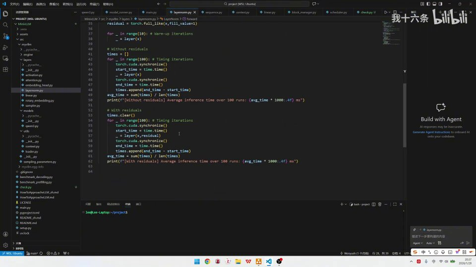
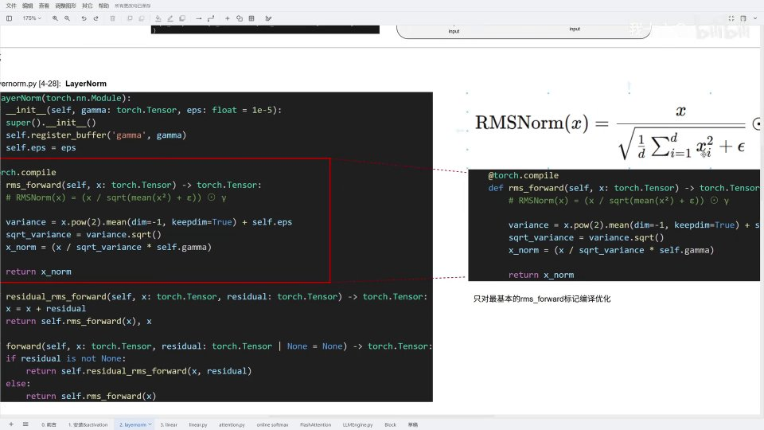
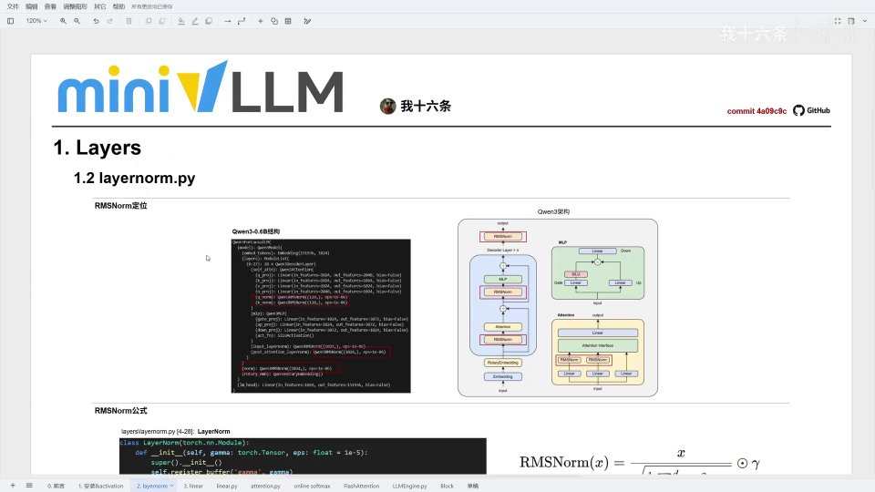

# 第02讲：62 行的 RMSNorm，讲透 Qwen3 为什么要做归一化、又为什么第一层不带残差

## 本讲要解决的核心问题（SCQA）

**背景**：上一讲我们装好了 MiniVLLM，并从 `layers/activation.py` 看懂了 SiluAndMul 这种算子融合。MiniVLLM 是一个教学级的极简推理引擎，目标是把 vLLM 的核心模块一层层手写出来，代码对着 Qwen3-0.6B 这样的真实模型跑。这一讲继续顺着 `layers/` 目录往下读，目标是下一个文件——`layernorm.py`。它是 Qwen3 这类模型每一层都离不开的归一化层，也是理解 Transformer 内部数据流绕不过去的一环。

**冲突**：这个文件很短，一共只有 62 行，短到让人以为「扫一眼就懂了」。可真正读进去会发现里面有几个反直觉的细节：代码用一个叫 `LayerNorm` 的类，实现的却是 RMSNorm；`forward` 被分成了「带残差」和「不带残差」两条路；整个文件只给最底层的 `rms_forward` 打了 `torch.compile`；而同一个 RMSNorm 在 Qwen3-0.6B 里竟然出现了五次，位置和形状还不一样。

**疑问**：RMSNorm 到底做了什么？它和 LayerNorm 差在哪，为什么现代大模型偏爱它？MiniVLLM 这 62 行代码是怎样把公式老老实实翻译成代码的？为什么第一个 Decoder 层用「不带残差」的版本，后面却都「带残差」？`torch.compile` 到底值不值得开？

**回答（中心思想）**：这一讲只要记住三句话。第一，**RMSNorm 是 LayerNorm 的精简版：它不减均值、不做平移，只用输入向量的均方根（RMS）把数值缩放到稳定范围，再用一个可学习的缩放因子 γ 调整每一维的强度**，因此比 LayerNorm 更快、参数更少。第二，MiniVLLM 用一个 `LayerNorm` 类分三层实现它——最底层 `rms_forward` 是公式直译，中间层 `residual_rms_forward` 多了「先加残差」，最外层 `forward` 按「有没有残差」分流；**只有第一个 Decoder 层进来时 `residual` 是 `None`，走不带残差的路，其余层全走带残差的路**。第三，基准测试会给出一个反直觉的结论：**`torch.compile` 只在大形状上显著提速，在小形状上反而更慢**。

[【跳转到 00:00】](https://www.bilibili.com/video/BV1sTz9BREvX/?t=0)

UP 主开场先自嘲了一句：他其实已经录了半个小时，结果忘了打开录制，只能重录一遍。这个插曲也定下了这一讲的基调——**从代码出发，边读边讲，把每一步都讲清楚**。


---

## 一、62 行的文件只有四块内容：一个类、三处定义、一个路由、一份测试

先别急着抠公式，我们先把整个文件「切成块」看。UP 主提醒过：这个文件很短，核心实现就在文件下方的 `main` 函数之上，而 `main` 函数里的内容其实都是它的测试用例。把它拆开，其实只有四块。

### 1.1 一个类：LayerNorm

文件开头 `import torch`、`import time`，然后定义了唯一的一个类：

```python
class LayerNorm(torch.nn.Module):
    def __init__(self, gamma: torch.Tensor, eps: float = 1e-5):
        super().__init__()
        self.register_buffer('gamma', gamma)
        self.eps = eps
```

这个类名虽然叫 `LayerNorm`，但里面实现的却是 RMSNorm——这一点一开始会有点绕，记住「文件名 `layernorm.py` + 类名 `LayerNorm`，但主角是 RMSNorm」即可。至于为什么类名不直接叫 RMSNorm，可以理解为「这是放在 layernorm 这个文件、作为归一化家族的实现」，名字只是容器，真正干活的是里面的 `rms_forward`。

这里还有一个对初学者很有用的细节：`self.register_buffer('gamma', gamma)` 用的是 **buffer（缓冲区）**，而不是 `nn.Parameter`。两者的区别是：

- **`nn.Parameter`** 会被优化器当成「需要训练、需要更新」的权重；
- **`buffer`** 只是模块的一个张量成员，会跟着模型一起搬运（比如切换设备），但默认不参与训练更新。

也就是说，在这份**用于基准测试的教学代码**里，gamma 是**由外部传进来的**，而不是在 `__init__` 里随机初始化、再靠训练去学。这样写的好处是：测试时你可以自由指定 gamma（比如全部设为 0.5），从而把注意力集中在「归一化的计算开销」上。UP 主在讲义里把它讲成「可学习的缩放参数」，说的是 RMSNorm 在真实模型里的作用；而这段代码为了做实验，把它当成一个可直接传入的固定张量，两者并不矛盾。

### 1.2 三处定义：gamma、eps 与一个 forward 路由

在初始化里只做了三件事：

1. 调用 `super().__init__()` 初始化父类；
2. `self.register_buffer('gamma', gamma)`——把传进来的 `gamma` 注册成一个 buffer（张量缓冲区）挂到模块上；
3. `self.eps = eps`——把极小值 `eps` 存起来。

UP 主在讲到 00:47 时特别点出：初始化阶段「定义了一个 gamma，还定义了一个 eps」。其中 **eps 是一个极小值**，**gamma 是对 X 的缩放因子**——注意，是「拿 X 去做缩放」，而不是给 X 加偏移。

[【跳转到 00:47】](https://www.bilibili.com/video/BV1sTz9BREvX/?t=47)

### 1.3 一个路由：forward 按「有没有残差」走两条路

类的最后是 `forward`，它本身几乎不做计算，只负责「转发」：

```python
def forward(self, x, residual=None):
    if residual is not None:
        return self.residual_rms_forward(x, residual)
    else:
        return self.rms_forward(x)
```

也就是说，**这个类真正的计算只在两个地方：`rms_forward`（纯 RMSNorm）和 `residual_rms_forward`（先加残差再 RMSNorm）**。而 `residual_rms_forward` 的底层其实也只是「多了一个对残差的加和」，随后转去调用 `rms_forward`。

### 1.4 一份测试：main 里是 benchmark

`main` 函数不是模型的一部分，而是用来做性能测试的「测试用例」——我们会在最后一章单独讲它。它的存在方式也很典型：用 `if __name__ == "__main__":` 包起来，意味着**直接把 `layernorm.py` 当脚本运行时，才会执行这段测试；而它被别的模块 import 时，测试不会自动跑**。这是 Python 项目里非常常见的写法，值得初学者记住。

看到这里，整份文件的层次就清楚了：**中间那 30 来行是真正的实现，下面的 30 来行是验证它的实验台**。UP 主说「代码其实很短」，指的正是这个——剥离测试之后，真正要读的只剩一个类和它的两个计算函数。



[【跳转到 00:22】](https://www.bilibili.com/video/BV1sTz9BREvX/?t=22)

---

## 二、RMSNorm 的公式：把「平方 → 均值 → 加 eps → 开根 → 除 → 乘 γ」翻译成五行代码

理解了文件的骨架，我们再看它的心脏——`rms_forward`。UP 主把公式写在代码注释里，然后一行一行对照，这个过程非常值得初学者跟着走一遍。

### 2.1 公式先摆出来

$$
\text{RMSNorm}(x) = \frac{x}{\sqrt{\dfrac{1}{d}\sum_{i=1}^{d} x_i^2 + \epsilon}} \odot \gamma
$$

这里每个符号都要能读懂：

- **x**：输入的一串向量。在语言模型里，就是「token 经过嵌入之后的向量」。
- **d**：向量的维度（长度）。对 Qwen3-0.6B 的主干来说 d = 1024，对注意力里的 Q、K 来说 d = 128。
- **$x_i$**：向量里第 i 个数。
- **$\frac{1}{d}\sum x_i^2$**：所有元素先平方、再求平均，也就是「平方的均值」。它的平方根就是 **RMS（Root Mean Square，均方根）**——这正是 RMSNorm 名字的来源。
- **ε（epsilon）**：一个极小值，加在根号里防止除零。
- **γ（gamma）**：一个可学习的缩放向量，每个维度对应一个值。
- **⊙**：逐元素相乘（element-wise multiply）。


[【跳转到 03:07】](https://www.bilibili.com/video/BV1sTz9BREvX/?t=187)

### 2.2 逐行对照：五行代码 = 六个动作

```python
@torch.compile
def rms_forward(self, x: torch.Tensor) -> torch.Tensor:
    # RMSNorm(x) = (x / sqrt(mean(x^2) + e)) ⊙ γ
    variance = x.pow(2).mean(dim=-1, keepdim=True) + self.eps
    sqrt_variance = variance.sqrt()
    x_norm = (x / sqrt_variance * self.gamma)
    return x_norm
```

我们按公式的顺序拆：

1. **平方**：`x.pow(2)`——把输入 X 每个元素平方，对应公式里的 $x_i^2$。UP 主走到 03:24 时说「首先做了一个平方」。
2. **求均值**：`.mean(dim=-1, keepdim=True)`——在最后一维上求平均，也就是「平方和再除以 d」。`dim=-1` 表示沿着向量维度求平均，`keepdim=True` 表示保留这个维度，方便后面广播相除。UP 主解释得很直白：**D 就是 X 的数量、它的维度，也就是我们的嵌入维度**。
3. **加 eps**：`+ self.eps`——加上前面定义的极小值，**目的是避免零除**。
4. **开根号**：`variance.sqrt()`——对「均值 + eps」开平方，得到分母。
5. **相除**：`x / sqrt_variance`——用 X 除以这个标准差式的分母，完成归一化。
6. **乘 gamma**：`* self.gamma`——逐维乘上缩放因子 γ。

到这里，「整个公式就已经讲完了」。

[【跳转到 03:24】](https://www.bilibili.com/video/BV1sTz9BREvX/?t=204)

### 2.3 eps 为什么要加：一次「防止除以 0」的保险

如果你把某一维的输入全取成 0，那么平方的均值就是 0，开根号还是 0，`x / 0` 就会得到 `inf` 或 `nan`，整个网络立刻崩掉。加上一个像 `1e-5` 这样的极小值之后，分母永远大于 0，计算就安全了。这也是为什么代码里默认 `eps: float = 1e-5`。

顺带一提：Qwen3 结构里实际打印出来的 RMSNorm 用的 eps 是 `1e-06`，而这份教学代码默认是 `1e-5`。两者量级相同、作用一样，都是「防止除零的小保险」——不必因为数字不同而困惑。

[【跳转到 03:34】](https://www.bilibili.com/video/BV1sTz9BREvX/?t=214)

### 2.4 gamma 是什么：相当于给每个维度装了一个「门控」

γ 是全篇最需要讲清楚的概念。UP 主的解释是：**gamma 是一个可学习的超参数，用于对我们 token 嵌入之后的各个维度做缩放——每个维度有一个对应的 gamma**。也就是说，如果嵌入维度是 1024，那 gamma 就是一个长度 1024 的向量，第 i 个数专门管第 i 维。

他打了一个很好懂的比方：这有点像**门控（gate）**——可以放大某一维，也可以抑制某一维。但本质很简单，就是**一个缩放**。初学者可以这样记：

- LayerNorm 里通常有 γ（缩放）和 β（平移）两个参数；
- RMSNorm 只用 γ，**没有了 β 的平移，也没有了「减均值」**，所以更快。

举个具体的例子：如果某一维对模型特别重要，训练时 γ 就会把它放大（比如趋近 2）；如果某一维总是带来噪声，γ 就会把它压小（比如趋近 0.1）。这正是「门控」的直觉——**该留的留、该抑的抑**。也正因为它只缩放、不平移，RMSNorm 的参数更少、计算更省，却依然保留了「按维度重新分配重要性」的能力，这也是它能在 LLaMA、Qwen 等现代大模型里取代 LayerNorm 的原因之一。



[【跳转到 04:07】](https://www.bilibili.com/video/BV1sTz9BREvX/?t=247)

---

## 三、RMSNorm 在 Qwen3-0.6B 里的五个位置：两处在 attention 内，两处在 decoder 内，一处在最外层

知道「怎么做」之后，还要知道「用在哪」。打开 Qwen3-0.6B 的结构打印，UP 主带我们数了一遍——**一共有五个地方出现了 RMSNorm**。

### 3.1 从结构打印里定位

先看结构总览（`Qwen3ForCausalLM.models.qwen3.py`）：

```
Qwen3ForCausalLM(
  (model): Qwen3Model(
    (embed_tokens): Embedding(151936, 1024)
    (layers): ModuleList(
      (0-27): 28 x Qwen3DecoderLayer(
        (self_attn): Qwen3Attention(
          ...
          (q_norm): Qwen3RMSNorm((128,), eps=1e-06)
          (k_norm): Qwen3RMSNorm((128,), eps=1e-06)
        )
        (mlp): Qwen3MLP(...)
        (input_layernorm): Qwen3RMSNorm((1024,), eps=1e-06)
        (post_attention_layernorm): Qwen3RMSNorm((1024,), eps=1e-06)
      )
    )
    (norm): Qwen3RMSNorm((1024,), eps=1e-06)
    (rotary_emb): Qwen3RotaryEmbedding()
  )
  (lm_head): Linear(in_features=1024, out_features=151936, bias=False)
)
```



[【跳转到 01:46】](https://www.bilibili.com/video/BV1sTz9BREvX/?t=106)

### 3.2 五处 RMSNorm 逐一对应

按 UP 主的说法，可以归成三类：

1. **attention 内部两个**：`q_norm` 和 `k_norm`。它们分别对 **Q 和 K 做 RMSNorm**。注意它们的形状是 `(128,)`——这是**每个注意力头的维度（head_dim = 128）**，而不是整个模型的 1024 维。也就是说，Q、K 在被拆成多个头之后，是「按头」做归一化的。
2. **每个 decoder layer 里两个**：`input_layernorm` 和 `post_attention_layernorm`，形状都是 `(1024,)`。UP 主对应到取值图上指出：**attention 内部的这两个，就是分别对 Q、K 做归一化的那两个**；而下面对应的 Q、K、V 线性变换，说明这两个 Norm 正好卡在注意力之前、以及注意力之后。
3. **最外层一个**：`model.norm`，形状 `(1024,)`。它位于所有 Decoder 层之后、输出 `lm_head` 之前，是整条主干的最后一道归一化。

至于 **MLP 里，是没有 RMSNorm 的**——UP 主特意确认了这一点。所以「2（Q、K）+ 2（decoder 内）+ 1（最外层）= 5」。

初学者看到这里最容易卡在「形状」上，我们把三个数字对齐一下：

- **1024 是模型的隐藏维度（hidden_size）**：每个 token 被表示成一个 1024 维向量，所以主干上的 RMSNorm 是 `(1024,)`。
- **128 是单个注意力头的维度（head_dim）**：Qwen3-0.6B 有 16 个查询头、8 个键值头，Q 会被投影成 `16 × 128 = 2048` 维，K、V 则被投影成 `8 × 128 = 1024` 维。也就是说，Q、K 在被「切成多个头」之后，是**按每个头的 128 维**去做 RMSNorm 的，所以 `q_norm`、`k_norm` 的形状是 `(128,)`。
- 这种「查询头多、键值头少」的设计叫 **GQA（分组查询注意力）**：多个查询头共享一组键值头，能显著省显存、省带宽，同时尽量不损失精度。Qwen3-0.6B 就是 16 比 8 的比例。

为什么要对 Q、K 做归一化？因为它们马上要参与点积注意力：Q 和 K 的每个数值一旦偏大，点积结果就会剧烈波动，softmax 之后注意力分布会变得极端（几乎全压在一个位置上）。**在点积之前把 Q、K 的每个头归一化，相当于给注意力的「输入电压」做了稳定**，训练更稳、也更好收敛。V 不参与这种「打分」的方式，所以不需要单独的 norm——这也是为什么只有 `q_norm` 和 `k_norm`，没有 `v_norm`。


[【跳转到 02:30】](https://www.bilibili.com/video/BV1sTz9BREvX/?t=150)

## 四、带残差与不带残差：区别只是多了一次「x = x + residual」

接下来是这份代码最值得琢磨的地方：为什么 `forward` 要分成两条路？

### 4.1 先回头看两个 forward

```python
def rms_forward(self, x):
    variance = x.pow(2).mean(dim=-1, keepdim=True) + self.eps
    sqrt_variance = variance.sqrt()
    x_norm = (x / sqrt_variance * self.gamma)
    return x_norm

def residual_rms_forward(self, x, residual):
    x = x + residual          # 唯一的区别
    return self.rms_forward(x), x
```

**带残差版本只比不带残差版本多了一行 `x = x + residual`**，然后照样调用 `rms_forward`。UP 主在 00:22 就点明了：「带残差的那个 forward，底层其实也只是多了一个对残差的加和。」

注意它的返回值是**一个元组 `(归一化后的结果, x)`**：第一个是归一化输出，第二个是「加完残差后的 x」，供后面继续传递。这个细节会在下一章解释清楚。

### 4.2 残差在这份代码里的巧妙约定

`forward` 的返回值其实有两种形态：

- 走 `rms_forward`（不带残差）时，只返回一个张量；
- 走 `residual_rms_forward`（带残差）时，返回 `(新 x, 旧 x + 新 x)` 这个二元组。

这样设计的好处是：调用方每走一层，都能拿到「当前的 x」和「新的残差」两部分，继续往下传。理解了这一点，下一章的调用链就顺理成章了。


[【跳转到 04:50】](https://www.bilibili.com/video/BV1sTz9BREvX/?t=290)

---

## 五、只有第一次进 Decoder 不带残差：跑一遍数据流就懂了

这是本讲最核心、也最容易看漏的一个细节。UP 主反复强调：**«第一次进来的 decoder layer，residual 是 None，所以走不带残差的 RMSNorm；之后所有的都带残差。»**

### 5.1 在 DecoderLayer 里看判断

看 `Qwen3DecoderLayer.forward`（`models/qwen3.py:193-198`）：

```python
def forward(self, x, residual=None):
    if residual is not None:
        x, residual = self.input_layernorm(x, residual)
    else:
        x = self.input_layernorm(x)
        residual = x
    ...
```

逻辑非常清楚：

- **如果 `residual` 不是 None**（说明不是第一次进来），就调用带残差版本：`x, residual = self.input_layernorm(x, residual)`——先把上一轮的结果加到 x 上，再做 RMSNorm，并把「加完残差的 x」作为新 residual 存下来。
- **如果 `residual` 是 None**（第一次进来），就只做 `x = self.input_layernorm(x)`，然后把 **`residual = x`** 存下来——从这一层开始，残差链就建起来了。


[【跳转到 06:07】](https://www.bilibili.com/video/BV1sTz9BREvX/?t=367)

### 5.2 在最外层 Model 里看起点

那么「第一次」的 `None` 是谁给的？看 `Qwen3Model.forward`（`models/qwen3.py:267-273`）：

```python
def forward(self, input_ids):
    x = self.embedding_layer(input_ids)
    residual = None
    for layer in self.layer_stack:
        x, residual = layer(x, residual)
    x, _ = self.final_layernorm(x, residual)
    return x
```

UP 主读到 06:34 时把这条链讲得很顺：

1. X 先做一次 **embedding**（把 token 变成 1024 维向量）；
2. **`residual = None`**——整个模型的第一步，残差就是这个「空」；
3. **`for layer in layer_stack`**：把 28 层 decoder 一层层循环，每一次都把 `(x, residual)` 同时传进去、再同时取回来；
4. 循环结束后，**`x, _ = self.final_layernorm(x, residual)`**——最后用最外层的 RMSNorm 收尾。

所以「第一次进 decoder 不带残差」不是哪一层特殊，而是**整个数据流的起点 residual 本来是空的**，第一层顺手把它补上，从此后面就都有残差可用了。


[【跳转到 06:34】](https://www.bilibili.com/video/BV1sTz9BREvX/?t=394)

### 5.3 一句话总结这条链

- 嵌入之后 → `residual = None`；
- 第 1 个 decoder：走不带残差 RMSNorm，并把 `x` 存成第一份 residual；
- 第 2 至第 28 个 decoder：每次都先把上一份 residual 加回来，再 RMSNorm，再更新 residual；
- 最后：用最外层 RMSNorm 对「x + residual」做收尾。

把每一层「传进什么、传回什么」列成表，会更清楚（记 `x0 = embedding(input_ids)`）：

| 步骤 | 传入的 residual | RMSNorm 走法 | 传回的 residual |
| --- | --- | --- | --- |
| 模型初始化 | `None`（还没进循环） | —— | —— |
| 第 1 层 decoder | `None` | 不带残差 `rms_forward` | `x0` |
| 第 2 层 decoder | `x0` | 带残差 `residual_rms_forward` | `x0 + 第1层输出` |
| … | … | 带残差 | 不断累加 |
| 最后 final norm | 上一层的累加结果 | 带残差 | 用 `_` 丢弃 |

这张表把 UP 主那句「第一次进来没有残差，之后都带残差」落到了纸面上：**唯一一次 `residual=None`，就发生在第 1 层**。

**这就是为什么 `LayerNorm` 类里必须有两条 forward 的原因**——不是为了灵活，而是真实调用链里真的存在「有 residual」和「没 residual」两种情形。

UP 主也建议：想彻底弄明白，就在代码里「来回跳跃一下」——从最开始的 model 调用，跳到 decoder 的前向传播，把流程走一遍，其实就清楚了。

[【跳转到 06:59】](https://www.bilibili.com/video/BV1sTz9BREvX/?t=419)

---

## 六、torch.compile 只标在最底层：优化要挑「纯计算热点」

回到代码，`rms_forward` 上面有一行装饰器 `@torch.compile`，而 `residual_rms_forward` 和 `forward` 都没有。这是有意为之。

`torch.compile` 是 PyTorch 的图编译优化：它把一段 Python 计算捕获成图，再编译成更高效的底层算子。**它最擅长的是「形状稳定、纯计算」的函数**。`rms_forward` 正好符合：输入输出就是一次归一化，没有分支、没有外部依赖。而 `forward` 里有 `if residual is not None` 这种控制流，`residual_rms_forward` 又引入了额外的残差相加，都不适合直接编译。

讲义右侧的小图也明确标注：**«只对最基本的 rms_forward 标记编译优化»**。UP 主顺带夸了一句：对最底层的 RMSNorm 做一次 `torch.compile`，「很简单」，却抓住了真正的计算热点。

可以把它想成「给经常重复的那道工序配了一台专用机器」。`torch.compile` 在第一次遇到这个函数时，会把 Python 逐行执行的逻辑「翻译」成一张计算图，再由编译器生成更贴近硬件的算子；之后每次调用都直接跑编译好的版本，省掉了 Python 解释与框架调度的开销。代价是**第一次调用要花时间编译**——这正好解释了后面 benchmark 里「小形状反而更慢」的现象：形状太小，省下的执行时间还不够付第一次编译的成本。也正因如此，UP 主才把它加在最底层、最常被调用的纯计算函数上，而不是加在外层带分支的 `forward` 上。


[【跳转到 00:47】](https://www.bilibili.com/video/BV1sTz9BREvX/?t=47)

---

## 七、基准测试：不带残差更快，而 torch.compile 只在大形状上赢

最后一章看 `main` 里的基准测试。UP 主说这里的代码**「其实没有写完全」**，需要大家自己动手调整；他用演示跑了一遍，把几个关键结论验证给我们看。

### 7.1 测什么：三个形状 × 两个开关

测试矩阵有三个维度：

- **形状（tensor shape）**：`(400, 800)`、`(4000, 8000)`、`(8, 4000, 8000)` 三种；
- **是否开启 `torch.compile`**：on / off；
- **是否带残差（residuals）**：on / off。

每个组合都是「先热身 10 次，再计时 100 次，取平均」。这就是为什么代码里要先 `for _ in range(10): layer(x)` 热身，再用 `torch.cuda.synchronize()` + `time.time()` 计时。

这两个细节都值得初学者理解：

- **为什么先热身 10 次？** GPU 的第一次调用往往要经历显存分配、上下文初始化，如果开启了 `torch.compile`，还要完成前面说的编译。把这些「一次性开销」热掉之后再计时，得到的才是稳定的单次耗时。
- **为什么计时前后要 `torch.cuda.synchronize()`？** GPU 是异步执行的：Python 发出指令后会立刻返回，真正的计算还在队列里排着。如果不做同步，`time.time()` 量到的只是「指令发出的时间」，而不是「算完的时间」，结果会严重偏小。`synchronize()` 让 CPU 等 GPU 真正算完，两端的差才是可信的耗时。

换句话说，这段 `main` 不只是跑个分，它还顺手示范了 **GPU 基准测试该怎么写**。


[【跳转到 08:15】](https://www.bilibili.com/video/BV1sTz9BREvX/?t=495)

### 7.2 一个真实的报错：维度不统一

UP 主把 `(400, 800)` 这组跑起来时，程序报错了。原因很典型：**gamma 的维度与 X 最后一维不匹配，无法做逐元素乘法**。RMSNorm 最后要算 `x / sqrt_variance * self.gamma`，其中 `x / sqrt_variance` 的最后一维必须和 `gamma` 一样长，才能逐元素相乘；一旦对不上，PyTorch 就抛出广播错误。这提醒我们：读代码时要顺手记住每个张量的形状，否则很容易在实验里踩坑。

### 7.3 结果与结论

在 A6000 上，讲义给出的参照结果如下（单位 ms）：

| tensor shape | torch.compile | residuals | time (ms) |
| --- | --- | --- | --- |
| (400, 800) | off | off | 0.1630 |
| (400, 800) | off | on | 0.1703 |
| (400, 800) | on | off | 0.2024 |
| (400, 800) | on | on | 0.3470 |
| (4000, 8000) | off | off | 1.3725 |
| (4000, 8000) | off | on | 1.9269 |
| (4000, 8000) | on | off | 0.6029 |
| (4000, 8000) | on | on | 1.1786 |
| (8, 4000, 8000) | off | off | 10.4689 |
| (8, 4000, 8000) | off | on | 15.3257 |
| (8, 4000, 8000) | on | off | 3.6483 |
| (8, 4000, 8000) | on | on | 8.1566 |

从这张表能读出三个清晰结论：

1. **带残差比不带残差慢**。同一形状、同一编译设置下，residuals=on 那一行都更慢。原因是多了一次 `x = x + residual` 的加法和额外的读写。
2. **`torch.compile` 在大形状上大幅提速**。看 `(8, 4000, 8000)`：从 10.4689 ms 降到 3.6483 ms，快了近三倍。
3. **`torch.compile` 在小形状上反而更慢**。看 `(400, 800)`：off 是 0.1630 ms，on 却是 0.2024 ms。这印证了「编译有固定开销，小任务不值得」——形状太小，省下的计算还不够付编译/调度的成本。

UP 主自己在 3070 上跑了最简单的 `(400, 800)`：**不带残差约 0.14 ms，带残差约 0.32 ms**；并且发现「不编译的情况下确实慢了很多」，与 how-to-approach 教程里总结的规律一致。


[【跳转到 08:59】](https://www.bilibili.com/video/BV1sTz9BREvX/?t=539)

### 7.4 别把结论当铁律：硬件不同，数字不同

UP 主特意提醒：**他的机器是 3070，而教程用的是 A6000，所以结果会有差距**。这意味着上面的毫秒数和倍数只是「趋势」，不是绝对值。你可以拿到的可靠结论是方向性的：

- 残差会带来额外开销；
- 编译对大形状友好、对小形状不友好；
- 具体数值请在自己的硬件上复现。

为什么会差这么多？因为不同 GPU 的显存带宽、SM 数量、对某个算子的支持程度都不同。3070 是消费级显卡，A6000 是专业卡，它们跑同一个 RMSNorm 的绝对耗时自然不一样。所以看基准测试时，**最重要的是看「相对趋势」（谁比谁快、快多少倍），而不是死记某个毫秒数**。UP 主说自己没把所有实验用例都跑一遍，**留给大家下来自己跑**——在自己的机器上把 12 组数据补齐，才算是真正理解了这份代码。

[【跳转到 09:49】](https://www.bilibili.com/video/BV1sTz9BREvX/?t=589)

---

## 小结

- **RMSNorm 是 LayerNorm 的精简版**：不减均值、不做 β 平移，只用「平方的均值 + ε 开根号」当分母归一化，再乘可学习的 γ。它更快、参数更少。
- **MiniVLLM 用 62 行实现它**：一个 `LayerNorm` 类，包含底层 `rms_forward`（公式直译）、中层 `residual_rms_forward`（先 `x = x + residual`）、外层 `forward`（按 `residual is not None` 分流）。
- **公式六个动作**：平方 → 求均值 → 加 eps → 开根号 → 相除 → 乘 gamma；eps 的作用是防止除零。
- **`torch.compile` 只加在 `rms_forward`**：因为它形状稳定、是纯计算热点；带控制流的 `forward` 不适合编译。
- **RMSNorm 在 Qwen3-0.6B 里有五处**：attention 内的 q_norm、k_norm（按 head_dim=128），decoder 内的 input_layernorm、post_attention_layernorm（1024），以及最外层的 final norm（1024）；MLP 里没有。
- **残差链从 None 开始**：整条数据流第一步 `residual = None`，第一个 decoder 走不带残差版本并顺手把 `residual = x`；此后每一层都先把上一份残差加回来再归一化。
- **基准测试的三个方向性结论**：带残差更慢；`torch.compile` 在大形状上大幅提速；在小形状上反而更慢。具体数值随硬件变化，需自己复现。

## 关键术语速查

| 术语 | 一句话解释 |
| --- | --- |
| **RMSNorm** | 只用「均方根」做归一化、再乘可学习缩放 γ 的归一化层，是 LayerNorm 的精简版。 |
| **LayerNorm** | 经典层归一化：减均值、除标准差，再乘 γ、加 β 平移；RMSNorm 去掉了其中两步。 |
| **RMS（均方根）** | Root Mean Square，先平方、求平均、再开根号，用来衡量向量的整体幅度。 |
| **variance（方差）** | 这里指 `mean(x²)`，即输入平方后的均值，是 RMS 的平方。 |
| **mean（均值）** | 在最后一维上求平均；`keepdim=True` 保留维度以便后续广播。 |
| **epsilon（ε）** | 加在分母里的极小值（如 1e-5 / 1e-6），防止除零导致 inf/nan。 |
| **gamma（γ）** | 每个维度一个的可学习缩放因子，类似门控，负责放大或抑制各维。 |
| **residual（残差）** | 把上一层输出直接加回当前结果（`x = x + residual`），帮助信息和梯度跨层直通。 |
| **head_dim** | 单个注意力头的维度；Qwen3-0.6B 为 128，q_norm/k_norm 按它归一化。 |
| **torch.compile** | PyTorch 的图编译优化，适合形状稳定的纯计算函数；小形状可能因固定开销反而更慢。 |
| **MiniVLLM** | 本系列使用的极简推理引擎项目（[GitHub](https://github.com/Wenyueh/MinivLLM)），逐层手写 vLLM 的核心算子。 |
| **vLLM** | 高性能大模型推理引擎；MiniVLLM 是它的教学级简化复刻。 |
