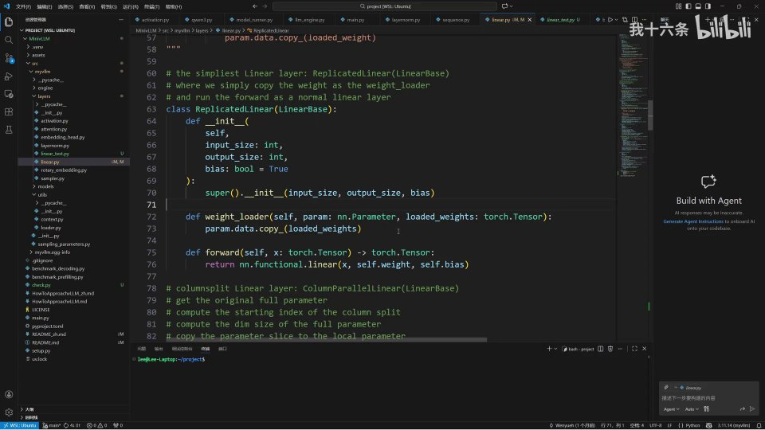
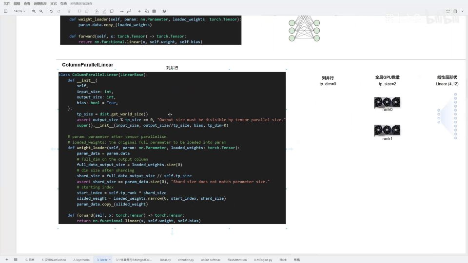
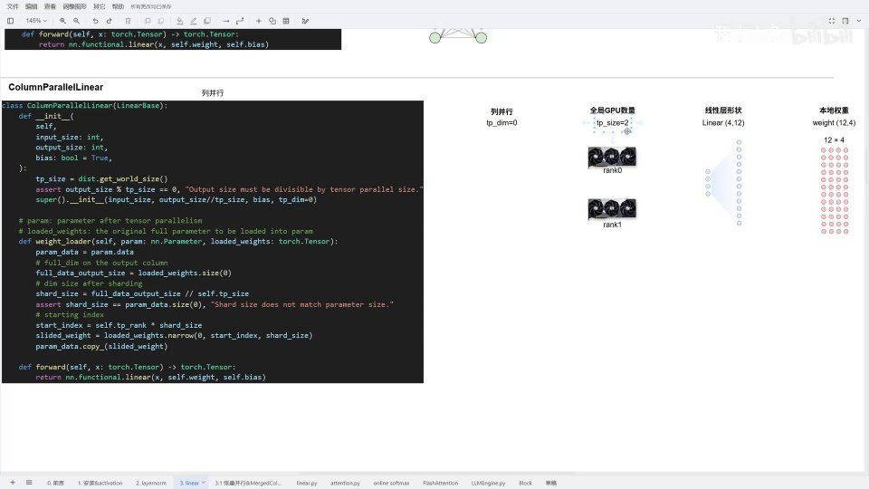
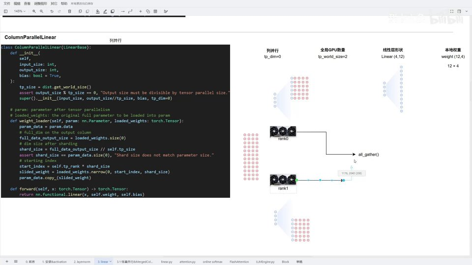
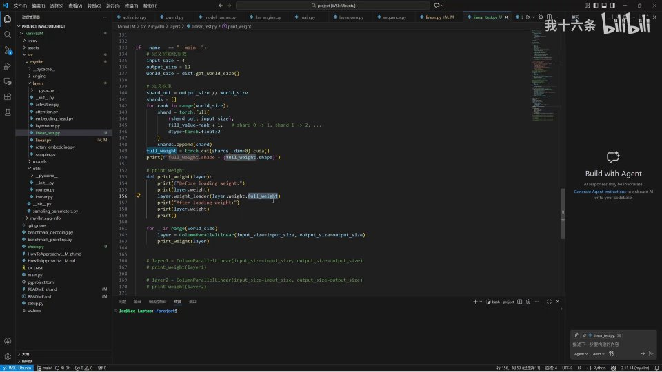

# 第03讲：linear.py——张量并行、线性层列并行实现与权重加载

## 本讲要解决的核心问题（SCQA）

**背景**：前两讲我们已经用 PyTorch 搭出了 Qwen3 的模型骨架——多头注意力、MLP、RMSNorm、旋转位置编码这些层都已经就位。但搭出来的只是一个"空壳"：每一层的权重张量都是刚初始化的随机值，没有任何意义。一个能真正推理的模型，必须把这些随机值替换成从 HuggingFace 权重文件里读出来的真实参数。

**冲突**：麻烦之处在于，大模型不可能完整放在一张显卡上。以 Qwen3-0.6B 为例，词表长度 151936、隐层 1024、28 层，参数虽小，但只要模型继续变大，单卡显存立刻不够用。业界通用的办法是**张量并行（Tensor Parallelism，简称 TP）**：把同一个线性层的权重切成几份，分别放到多张 GPU 上，每张卡只算一部分。可一旦切开，问题就来了——切哪一维？每张卡怎么知道自己该加载权重的哪一块？算完之后分散在各卡上的结果又怎么拼回去？

**疑问**：`linear.py` 这个文件到底做了什么设计，能让"权重加载"和"张量并行"这两件事优雅地结合在一起？列并行（Column Parallel）的权重加载那几行看似简单的切片代码，背后的坐标是怎么算出来的？

**回答（中心思想）**：`linear.py` 用一套"基类 + 子类覆盖 `weight_loader`"的模式解决了上述问题。**`LinearBase` 定义了所有线性层的公共骨架——输入维度、输出维度、偏置、以及张量并行的三个关键参数 `tp_dim`/`tp_rank`/`tp_size`；不同并行策略的子类只需各自实现"从完整权重里取出属于我这块 GPU 的那一片"的 `weight_loader`，即可无缝支持列并行、行并行以及它们的组合。** 本讲重点拆解其中最简单也最核心的**列并行（`ColumnParallelLinear`）**：它沿输出维度切分权重，通过 `shard_size` 和 `start_index` 两个量精确定位分片，前向传播后再用 all-gather 把各卡的输出拼回完整结果。理解了它，后面第 04 讲的合并线性层（`MergedColumnParallelLinear`）与 QKV 并行（`QKVParallelLinear`）都只是它的自然延伸。

---

## 一、先定位：linear.py 在 MiniVLLM 中的位置

### 1.1 本讲的两个重点

跟着 `how-to-approach` 教程的 1.3 节，我们正式进入 `linear.py` 的学习。这个文件有两个重点内容：**第一是张量并行（TP），第二是线性层中的权重加载**。[【跳转到 00:00】](https://www.bilibili.com/video/BV1Br6iBaEVV/?t=0)

这两个重点其实是一枚硬币的两面：张量并行决定了权重**应该怎么被切开**，而权重加载决定了**每张卡怎么取到自己那一份**。二者必须配套设计。


### 1.2 Qwen3 里到底有多少个线性层

要理解线性层，先看它在整个模型结构中的位置。在 Qwen3 的算子图里，红框标出的就是线性层：注意力的 Q/K/V/O 投影、MLP 里的三个线性变换、以及最后的 `lm_head`，全都是线性层。[【跳转到 00:16】](https://www.bilibili.com/video/BV1Br6iBaEVV/?t=16)

我们具体看一下维度的配置。Q、K、V 的**输入维度都是 1024**，输出维度里除了 Q 头是 2048，其余都是 1024。这里有一处细微的不同，原因是模型使用了 **GQA（Grouped Query Attention，分组查询注意力）**——多个查询头共享一组键值头，所以 Q 的输出投影比 K、V 大一倍。[【跳转到 00:21】](https://www.bilibili.com/video/BV1Br6iBaEVV/?t=21)

> **术语解释 · GQA（分组查询注意力）**：标准多头注意力（MHA）里，每个 Query 头都配一个独立的 Key、Value 头；GQA 则是让若干个 Query 头共享同一组 Key/Value 头。举例来说，若 Q 有 16 个头、KV 只有 8 个头，就是"两个 Q 头共享一组 KV"。好处是推理时 KV Cache 的显存占用直接减半，而效果损失很小。这也解释了为什么 Q 的投影输出维度是 K、V 的两倍。


MLP 部分同样有三个线性层，分别是：**门控（gate）的线性变换、上采样（up）、下采样（down）**，这和上一讲里讲过的一致。最后还有一个 `lm_head` 线性层：当我们拿到模型的 output 后，用它把 1024 维的隐层映射到 **151936 维**的输出。[【跳转到 00:46】](https://www.bilibili.com/video/BV1Br6iBaEVV/?t=46)

151936 这个数字其实就是**词表长度（vocabulary size）**——嵌入层（embedding）的词表长度也是这么多。输出词表长度的向量后，每一个位置存放的就是"当前 token 对词表中每个词的预测得分（logits）"，再经过 softmax 和采样，就能生成下一个 token。[【跳转到 01:11】](https://www.bilibili.com/video/BV1Br6iBaEVV/?t=71)

### 1.3 源文件规模

`linear.py` 的源代码一共 200 多行（含测试共 225 行），不算注释大概 100 多行。[【跳转到 01:32】](https://www.bilibili.com/video/BV1Br6iBaEVV/?t=92) 麻雀虽小，五脏俱全——它用一个基类加五个子类的结构，覆盖了 vLLM 里所有线性层的并行形态。

### 1.4 为什么非要做并行：一笔显存账

在进入代码之前，先把"为什么"讲透，后面读代码才不会觉得是为了复杂而复杂。

假设一个线性层的权重是 4096×4096、用 float16 存储，那么它占用的显存是：

$$
4096 \times 4096 \times 2\ \text{字节} = 32\ \text{MB}
$$

单看一个层不大，但一个大模型有几十层，每层里又有 Q/K/V/O、gate/up/down 六七个矩阵乘，累加起来就是几百亿个参数。按当前主流消费级显卡 24GB 显存来算，光是权重就放不下，更别提推理时还要缓存 KV、保存激活值。

**张量并行的思路非常直接：既然一张卡放不下，就把每个大矩阵拆成几块，每张卡只装一块。** 比如把输出维度 4096 均分到 4 张卡，每张卡只需要存 4096/4=1024 行，显存占用直接降到约四分之一。代价是各卡之间需要通信（前向传播后把结果拼起来），但换来的显存收益通常是值得的。

这里就引出了并行方案的设计准则：**切分要切得"干净"**。所谓干净，就是每张卡分到的分片大小完全一致、边界清晰，不需要处理余数、也不需要跨卡的数据依赖。`ColumnParallelLinear` 构造函数里那句 `assert output_size % tp_size == 0` 的断言，做的正是这件事——它把"能不能均匀切"这个前提在初始化阶段就检查掉，避免运行到一半才发现切不匀。

> **一句话总结**：并行的动机是省显存，并行的前提是能整除，并行的难点是每张卡要知道自己负责哪一块。`linear.py` 接下来所有的代码，都围绕"每张卡怎么知道自己负责哪一块"展开。

---

## 二、LinearBase：所有线性层的公共骨架

### 2.1 为什么需要一个基类

先看 `LinearBase`。它实现的原理和最基础的线性层完全一样，但它多带了几个参数，其中最重要的是 **`tp_dim`、`tp_rank`、`tp_size`**。[【跳转到 01:37】](https://www.bilibili.com/video/BV1Br6iBaEVV/?t=97)

这三个参数就是张量并行的全部"上下文信息"：

- **`tp_dim`**：表示沿哪个维度切分权重。它只有两种取值——**`0` 表示列并行（沿输出维度切）**，**`1` 表示行并行（沿输入维度切）**。
- **`tp_rank`**：当前设备的编号，也就是"我在整个并行集群里排第几号"。通过 `dist.get_rank()` 获取。
- **`tp_size`**：参与并行的设备总数，也就是 `dist.get_world_size()`，即"全世界一共有几张卡在干这件事"。

这里的 `dist` 指的是 PyTorch 的 `torch.distributed`，一个分布式通信包。[【跳转到 02:02】](https://www.bilibili.com/video/BV1Br6iBaEVV/?t=122) [【跳转到 02:27】](https://www.bilibili.com/video/BV1Br6iBaEVV/?t=147)

### 2.2 基类源码逐行拆解

`LinearBase` 的 `__init__` 做了四件事：

1. **设置并行参数**：把传入的 `tp_dim` 存下来，并调用 `dist.get_rank()` 和 `dist.get_world_size()` 拿到 `tp_rank` 与 `tp_size`。
2. **创建权重参数**：`self.weight = nn.Parameter(torch.empty(output_size, input_size))`——注意这里用的是 `torch.empty`，先定义一块**空权重**，只是用 `nn.Parameter` 把它注册成一个可训练的参数。**这里有个坑**：`empty` 会保留内存里原本的随机垃圾值，调试时输出很不直观，测试时最好手动改成 `zeros`。
3. **创建偏置参数**：如果 `bias=True`，就注册 `nn.Parameter(torch.zeros(output_size))`；否则用 `register_parameter('bias', None)` 注册一个空偏置。有些线性层（比如多数大模型的 Linear）是不带偏置的，所以要兼容这种情况。
4. **挂载权重加载器**：`self.weight.weight_loader = self.weight_loader`，把加载逻辑绑定到参数上，方便后续统一调度。

基类里定义了一个**空的 `weight_loader`，不做任何实现**。原因很简单：不同的并行策略需要不同的切分方式，基类无法统一，只能留给子类去实现。[【跳转到 02:52】](https://www.bilibili.com/video/BV1Br6iBaEVV/?t=172)

> **术语解释 · `nn.Parameter`**：它是 `torch.Tensor` 的一个子类，但有一个特殊身份——**被注册为模型参数**。一旦某个张量被包成 `nn.Parameter` 并赋值给 `nn.Module` 的属性，PyTorch 就会自动把它纳入 `state_dict`（模型的参数字典），保存、加载、`.to(device)` 时都会带上它。普通张量则不会。所以这里即使初始化的是空张量，也**必须**用 `nn.Parameter` 包一层，否则权重在保存和搬运时会丢失。

> **术语解释 · `torch.empty` vs `torch.zeros`**：`empty` 只申请一块内存、填什么内容不管，因此里面可能是上一次程序留下的任意值（所谓"垃圾值"），速度最快；`zeros` 则会把内存清零。生产环境为了省去清零开销常用 `empty`，反正马上会被真实权重覆盖；但**调试、测试时用 `empty` 会让输出看起来毫无规律**，这也是后面测试环节要把 `empty` 手动改成 `zeros` 的原因。

### 2.3 基类的设计哲学：把"变化"隔离出来

如果用一个词概括 `LinearBase` 的设计，那就是**模板方法（Template Method）**：

- **不变的、公共的部分**放到基类：输入/输出维度、`nn.Parameter` 权重、偏置的创建、并行上下文的获取。
- **会变的、因策略而异的部分**留给子类：到底怎么从完整权重里切出自己那一块，也就是 `weight_loader`。

这样设计的好处是，将来新增一种并行策略（比如 QKV 并行、合并线性层并行），只需要专注写好"切分逻辑"这一个方法，其余全部复用基类，代码量小、也不容易出错。这也是为什么下一讲介绍合并线性层时会发现——**它和列并行极其相似，唯一多出来的只是"一次切多块"的账要算清楚**。

### 2.3 一个反直觉的"坑"：权重形状是反的


理解 `tp_dim` 之前，必须先理解权重张量的形状。**在本地存储时，权重形状是 `[out_features, in_features]`（输出在前、输入在后），这和线性层"输入维度、输出维度"的顺序恰好相反。** [【跳转到 05:29】](https://www.bilibili.com/video/BV1Br6iBaEVV/?t=329)

之所以这样设计，追溯到最经典的线性层公式就明白了：

$$
Y = X W^{T} + b
$$

PyTorch 做矩阵乘时用的是 `X × Wᵀ`。为了保持和线性层 `input_size → output_size` 的直观对应，权重在存储时第一个维度（第 0 维）其实是 `out_features`，第 1 维才是 `in_features`。所以"列的维度"指的是第 0 维（输出维），"行的维度"指的是第 1 维（输入维）。

![线性层公式 Y=XWᵀ+b：权重形状 [out_features, in_features]，tp_dim=0 沿输出维切、tp_dim=1 沿输入维切](assets/第03讲_linear.py&张量并行&线性层列并行实现&权重加载/00312.jpg)

由此，张量并行只有两种情况：

- **`tp_dim = 0`（列并行）**：沿输出维度（第 0 维）切。每张卡**输入维度不变**，但**输出维度变成原来的 1/N**。线性层意义上，就相当于把输出神经元平均分给各卡。
- **`tp_dim = 1`（行并行）**：沿输入维度（第 1 维）切。每张卡保留一部分输入维度，输出维度不变。

[【跳转到 05:54】](https://www.bilibili.com/video/BV1Br6iBaEVV/?t=354) [【跳转到 06:19】](https://www.bilibili.com/video/BV1Br6iBaEVV/?t=379) 先记住这个结论，下面结合具体例子会更容易理解。

用一张图就能记住维度对应关系：

```
线性层语义：        输入维度(input_size)  ──►  输出维度(output_size)
                        │                            ▲
                 对应权重第 1 维                对应权重第 0 维
                        │                            │
权重存储形状：      W[ ? , ? ]  =  [ out_features, in_features ]
                        │                            │
                  tp_dim=1（行并行）           tp_dim=0（列并行）
```

一句话口诀：**"权重第 0 维是输出，第 1 维是输入；切第 0 维叫列并行，切第 1 维叫行并行。"** 把这个口诀和上面这段小图记牢，后面所有关于切分的疑问都能自行推导。

### 2.4 单机单卡 vs 单机多卡：world_size 与 rank

`tp_rank` 和 `tp_size` 到底代表什么？结合具体的硬件场景看最清楚。[【跳转到 07:11】](https://www.bilibili.com/video/BV1Br6iBaEVV/?t=431)

**单机单卡**：只有一台机器、一张卡。此时 `get_world_size()` 等于 **1**（全世界就我一个），`get_rank()` 等于 **0**（设备号从 0 开始编号）。[【跳转到 07:16】](https://www.bilibili.com/video/BV1Br6iBaEVV/?t=436)

**单机多卡**：假设一台机器插了四张显卡，`get_world_size()` 就等于 **4**。在 rank 0 这张卡上调用 `get_rank()`，得到 0；在 rank 1 上得到 1，以此类推。每张卡各自维护自己的 rank 号，`dist.get_rank()` 返回的就是当前进程所在设备的那一个编号。[【跳转到 07:38】](https://www.bilibili.com/video/BV1Br6iBaEVV/?t=458)

> **类比**：可以把 `tp_size` 想成"一共几口人吃饭"，`tp_rank` 想成"我是第几个孩子"。分蛋糕（切权重）时，先要知道总共几个人、自己排老几，才能算出该拿哪一块。

有了这个前提，我们就可以进入列并行的正文了。

---

## 三、ReplicatedLinear：不做并行的"直接复制"版

在看列并行之前，先认识最简单的子类 `ReplicatedLinear`。顾名思义，它就是**直接复制**——不考虑任何并行，等价于最传统、最朴素的 `nn.Linear`。[【跳转到 02:52】](https://www.bilibili.com/video/BV1Br6iBaEVV/?t=172)

它的 `weight_loader` 只有一行：`param.data.copy_(loaded_weights)`，直接把传进来的完整权重复制过去。前向传播就是 `nn.functional.linear(x, self.weight, self.bias)`。[【跳转到 03:17】](https://www.bilibili.com/video/BV1Br6iBaEVV/?t=197)



### 3.1 为什么要强调"权重加载"

这里值得停下来多说一句"权重"这件事，因为它正是本讲标题的另一半。

我们在 MiniVLLM 里定义的模型，从之前到现在其实都只是在**搭结构**——搭 Qwen3 的具体骨架。骨架搭起来了，但**没有血肉**。这个"血肉"就是**权重**。所谓权重加载，就是**从内存里把 HuggingFace 权重文件中的真实参数，填充到我们搭好的骨架（每一层的 `nn.Parameter`）里**。[【跳转到 03:42】](https://www.bilibili.com/video/BV1Br6iBaEVV/?t=222)

骨架决定了"模型长什么样"，权重决定了"模型会不会说话"。本讲正在做的，就是把这两者接起来。

### 3.2 `ReplicatedLinear` 的定位：并行的"零号基准"

你可能会问：既然都要做并行了，为什么还要留一个不并行的版本？

答案是它充当**基准和兜底**。首先，并非所有线性层都值得并行——如果某个层本来就很小，切分带来的通信开销可能超过省下的显存收益，这时直接用 `ReplicatedLinear` 更划算。其次，它是最容易理解的参照物：把它的 `weight_loader`（一行 `copy_`）和列并行的 `weight_loader`（切片四步）放在一起对比，就能清楚看到"并行到底多做了哪些事"。

而且从测试角度，`ReplicatedLinear` 可以当作正确性对照：同一个输入分别喂给 `ReplicatedLinear` 和并行版本，输出应当一致（在单卡模拟下）。

### 3.3 `weight_loader` 是怎么"挂"到参数上的

注意基类里的这一句：`self.weight.weight_loader = self.weight_loader`。它把子类实现的 `weight_loader` 方法，作为一个属性绑到了 `nn.Parameter` 对象上。

这样做的好处是**统一调度**：外部的权重加载流程拿到一个模型的 `state_dict` 后，只需遍历每个参数，看看它身上有没有 `weight_loader` 属性，有就调用它、把完整权重传进去，参数自己就知道该怎么切、怎么装。**加载逻辑被"下放"到了参数内部，外部框架无需为每种并行策略写 if-else。** 这是一种典型的"多态"思想：调用方只喊一句"加载"，每个参数按自己的方式响应。

---

## 四、ColumnParallelLinear：列并行的原理与权重加载

### 4.1 列并行是什么

回到本讲的重头戏——**列并行 `ColumnParallelLinear`**。它继承自 `LinearBase`。[【跳转到 08:13】](https://www.bilibili.com/video/BV1Br6iBaEVV/?t=493)

先给结论：**列并行把线性层的输出维度平均切给每张 GPU。假设输出维度是 4096、4 张卡，那么每张卡只负责计算 1024 个输出神经元。** 输入数据每张卡都完整拥有一份（输入维度不变），每张卡独立算出一个"部分输出"，最后再拼起来。

生活化的类比：一个班要统计 100 个学生的成绩，4 个老师分工，每人只看 25 个学生（输出维切分）。每个老师手里的原始数据（输入）都是完整的，但他们各自只负责计算自己那 25 个学生的结果，最后把 4 份结果合在一起就是全班的成绩单。

那为什么叫"列"并行？因为在约定俗成的图示里，线性层常被画成"输入神经元在左、输出神经元在右"，权重矩阵的每一行对应右端一个输出神经元。沿输出维切分，视觉上就是把输出神经元按"列"分组——名字的来历就藏在这张示意图里。

### 4.2 初始化：output_size 要先做地板除

源码逐行看。构造函数里：

```python
tp_size = dist.get_world_size()
assert output_size % tp_size == 0, "Output size must be divisible by tensor parallel size."
super().__init__(input_size, output_size // tp_size, bias, tp_dim=0)
```

第一行拿到并行设备数量；第二行做了一个**断言**，要求输出维度必须能被 `tp_size` 整除，否则直接报错；第三行调用父类初始化，但输出的维度已经**被 `tp_size` 地板除**了。[【跳转到 08:43】](https://www.bilibili.com/video/BV1Br6iBaEVV/?t=523)

也就是说，每张卡上真正实例化的线性层，其 `output_size` 只是全局的一部分。这解释了为什么上面 4×12 例子里每张卡"只维护上半部分或下半部分"。



### 4.3 weight_loader：三步定位自己该拿哪一片

真正需要仔细琢磨的是 `weight_loader`。它的签名是 `weight_loader(self, param, loaded_weights)`，其中 `loaded_weights` 是**完整的、尚未切分的全局权重**（形状与我们想要加载的原始权重一致），而 `param` 是**本卡上已实例化好的、只有 1/N 大小的那块参数**。[【跳转到 09:08】](https://www.bilibili.com/video/BV1Br6iBaEVV/?t=548)

它通过四行核心代码完成定位与切片：

**第一步，取得完整权重的"列长度"**：

```python
full_data_output_size = loaded_weights.size(0)
```

这行取全局权重的第 0 维长度，也就是完整的输出维度。比如全局权重是 12×4，返回值就是 12。[【跳转到 09:33】](https://www.bilibili.com/video/BV1Br6iBaEVV/?t=573)

**第二步，计算每张卡的切片大小 `shard_size`**：

```python
shard_size = full_data_output_size // self.tp_size
assert shard_size == param.data.size(0), "Shard size does not match parameter size."
```

用完整输出维度除以卡数，得到每张卡应分到的列数。括号里的断言保证这个分片大小与当前参数的实际形状一致，防止配置错误。[【跳转到 09:58】](https://www.bilibili.com/video/BV1Br6iBaEVV/?t=598)

**第三步，计算本卡的起始位置 `start_index`**：

```python
start_index = self.tp_rank * shard_size
```

这张卡从完整权重的第几列开始取，取决于它的排名。rank 0 从 0 开始，rank 1 从 `shard_size` 开始，rank 2 从 `2×shard_size` 开始……比如权重在 4 张设备上分成 4 片，第一张卡取第 1 片、第二张取第 2 片，以此类推。[【跳转到 09:33】](https://www.bilibili.com/video/BV1Br6iBaEVV/?t=573)

**第四步，切出分片并复制进本卡参数**：

```python
loaded_weights = loaded_weights.narrow(0, start_index, shard_size)
param.data.copy_(loaded_weights)
```

`narrow(0, start_index, shard_size)` 表示"沿第 0 维、从 `start_index` 起、取 `shard_size` 个"，正好是本卡负责的那一段。最后用 `copy_` 把它们复制进当前参数。[【跳转到 09:58】](https://www.bilibili.com/video/BV1Br6iBaEVV/?t=598)

> **术语解释 · narrow vs 切片**：`narrow(dim, start, length)` 等价于 Python 里的 `t[dim][start : start+length]`，只是语法更显式，常用于需要动态计算起止位置的场景。这里的三个参数正对应"哪个维度、从哪开始、取多长"。

### 4.4 为什么用 `copy_` 而不是直接赋值

细心的读者会问：既然切出来的就是本卡要的权重，为什么不写 `self.weight = loaded_weights` 直接赋值，而要多此一举地 `param.data.copy_(...)`？

原因在于**参数的身份不能变**。`self.weight` 是已经注册进 `nn.Module` 的那个 `nn.Parameter`，PyTorch 的优化器、`state_dict`、设备搬运都认准这个对象。如果直接赋值一个新张量，参数对象就换了，原本注册的信息、绑定在它上面的 `weight_loader` 属性都会丢失。而 `copy_` 是**原地写入**——参数对象不变，只是把里面的数值替换掉，安全又高效。类似的写法在 vLLM 的权重加载中随处可见，是必须养成的好习惯。

### 4.5 列并行的正确性直觉

为什么"每张卡只算一半输出、再拼起来"能等价于完整线性层？用公式看最清楚。

完整线性层的第 $i$ 个输出神经元只依赖于权重矩阵的第 $i$ 行（在 `[out, in]` 存储下）：

$$
y_i = \sum_{j} x_j \cdot W_{i,j} + b_i
$$

不同的 $i$ 之间**互不影响**。所以把行分成两组分别计算，结果拼起来当然和整体计算完全一致。这正是列并行成立的数学基础——**输出维度天然可加、可拆**。反过来，行并行（切输入维）会把同一个输出神经元的求和项拆到不同卡上，每张卡只能算"部分和"，因此最后必须用 all-reduce 来累加，而不能简单拼接。这也解释了为什么列并行用 all-gather、行并行用 all-reduce。

---

## 五、手算一遍：4×12 的例子

光看代码容易晕，我们用一个具体的小例子把它算清楚。[【跳转到 10:23】](https://www.bilibili.com/video/BV1Br6iBaEVV/?t=623)

**设定**：全局 GPU 数量（world_size / tp_size）= **2**；线性层形状 **4×12**（输出 4 维、输入 12 维）；因为权重存储形状与线性层相反，所以本地完整权重是 **12×4**。用这么小的形状是为了口算方便。



每张卡沿线性层的输出维度切分。于是 rank 0 只维护上半部分（前 2 个输出），rank 1 只维护下半部分（后 2 个输出）。[【跳转到 10:58】](https://www.bilibili.com/video/BV1Br6iBaEVV/?t=658)

### 5.1 rank 0 的计算过程

首先算 `shard_size`：`full_data_output_size` 等于 **12**（全局权重第 0 维长度），除以 `tp_size=2`，得到 **shard_size = 6**。也就是说每张卡（注意：这是按权重第 0 维=12 计算的）维护 6 列。[【跳转到 11:09】](https://www.bilibili.com/video/BV1Br6iBaEVV/?t=669)

> 这里有一个容易绕晕的点：线性层是 4×12，权重却是 12×4。**`shard_size` 是按权重第 0 维（12）来切的**，因此每卡得 6。这与前面"输出维切一半、每卡 2 个输出"看似矛盾，其实只是表述维度不同——看代码要始终以**权重张量的第 0 维**为准。

接着算 `start_index`：对 rank 0 来说，`tp_rank=0`，所以 `start_index = 0 × 6 = 0`。于是从第 0 列取 6 列，得到权重的**前半部分**，再 `copy_` 进当前层。[【跳转到 11:34】](https://www.bilibili.com/video/BV1Br6iBaEVV/?t=694) [【跳转到 11:59】](https://www.bilibili.com/video/BV1Br6iBaEVV/?t=719)

### 5.2 rank 1 的计算过程

对 rank 1 来说，`tp_rank=1`，所以 `start_index = 1 × 6 = 6`。从第 6 列开始取 6 列，正好拿到权重的**后半部分**，加载进去。[【跳转到 12:24】](https://www.bilibili.com/video/BV1Br6iBaEVV/?t=744) [【跳转到 12:45】](https://www.bilibili.com/video/BV1Br6iBaEVV/?t=765)

因为 `LinearBase` 在初始化时已经通过 `dist.get_rank()` 和 `dist.get_world_size()` 拿到了本卡身份，所以每个实例天然知道自己该取哪一片，代码完全无需改动。

### 5.3 前向传播后的 all-gather

两张卡各自算完自己的部分后，会执行一个 **gather（收集）操作**，具体说就是 `dist.gather` / all-gather。这步在做什么？因为分布式计算把结果分散到了不同 GPU 上，必须**把各卡的输出沿着输出维度拼接（concatenate）在一起**，才能继续下一步。[【跳转到 13:10】](https://www.bilibili.com/video/BV1Br6iBaEVV/?t=790)

拼完之后，对外看它**仍然是一个完整的线性层**，只是计算过程被拆分到了多台设备上。这就保持了"模型语义不变、只是执行方式变了"。

> **术语解释 · all-gather**：分布式通信的一种操作。"gather"指把各卡的数据收集到一张卡，而 "all-gather" 是让**每张卡都拿到拼接后的完整结果**。与之对应的行并行用的是 **all-reduce**（把各卡的结果相加求和，而不是拼接），这个区别下一讲会展开。[【跳转到 13:35】](https://www.bilibili.com/video/BV1Br6iBaEVV/?t=815)



### 5.4 再用一组更小的矩阵把 all-gather 算一遍

为了把"拼接"这一步彻底钉死，我们把维数降到一个能口算的规模。

设线性层输入维度为 **2**、输出维度为 **2**，`tp_size = 2`。完整权重（存储形状 `[out=2, in=2]`）设为：

```
W = [[1, 2],
     [3, 4]]
```

`tp_dim = 0`，`shard_size = 2 // 2 = 1`。

- **rank 0**：`start_index = 0×1 = 0`，取第 0 行 → `W0 = [[1, 2]]`
- **rank 1**：`start_index = 1×1 = 1`，取第 1 行 → `W1 = [[3, 4]]`

设输入向量 `x = [10, 20]`（两张卡都拥有**完整**的输入），无偏置。

- rank 0 计算：`y0 = W0 · xᵀ = 1×10 + 2×20 = 50`
- rank 1 计算：`y1 = W1 · xᵀ = 3×10 + 4×20 = 110`

all-gather 把两个标量按输出维顺序拼起来，得到 `y = [50, 110]`。

现在用**完整权重**验证：`W · xᵀ = [1×10+2×20, 3×10+4×20] = [50, 110]`。**完全一致。**

这个例子虽小，却把列并行的全流程浓缩了：**每卡持有完整输入 → 用自己那一片权重算出部分输出 → 拼接得到全局输出**。真实模型里无非是把矩阵从 2×2 放大到几千×几千、把标量换成向量而已。

> **进一步思考**：如果这里改成"行并行"（`tp_dim=1`），每张卡会拿到权重的一列（比如 rank 0 拿 `[1,3]`、rank 1 拿 `[2,4]`），输入 `x` 也要被切成 `[10]` 和 `[20]` 两部分。两卡分别算出一个**部分和**，必须 all-reduce 相加才能还原 `50` 和 `110`。这就是行并行与列并行的根本差别。

---

## 六、动手验证：模拟一个分布式环境

理论再清楚，也得跑一遍才安心。测试的思路是**用一个假（mock）的分布式环境，在不真正多卡的情况下验证列并行分片是否正确**。[【跳转到 14:00】](https://www.bilibili.com/video/BV1Br6iBaEVV/?t=840)

### 6.1 模拟环境怎么写

前面定义一个分布式环境类，包含两个参数：**设备数量**和**当前 rank 值**。每次调用 `get_rank()` 时，就把一个设备号"弹"出去；循环定义多个线性层时，每个线性层各自领一个设备号。`get_world_size()` 返回的就是环境里设定的设备总数。我们只需要模拟设备数量并初始化即可，**其余的业务代码一行都不用改**。[【跳转到 14:16】](https://www.bilibili.com/video/BV1Br6iBaEVV/?t=856)

之所以能做到"业务代码零改动"，是因为 `linear.py` 从始至终只通过 `dist.get_rank()` / `dist.get_world_size()` 这两个接口与外部世界交互，并且入口处做了一次 `dist = MockDist(...)` 的替换。**只要假对象的接口签名和真的一致，调用方就无从分辨。** 这正是"面向接口编程"的价值：把易变的、依赖环境的实现，挡在一个稳定的接口后面。

需要强调的是，mock 环境只替换"谁是我、我们共几个"这类**查询**，并不负责真正的跨卡数据传输。因此它能验证**分片逻辑**，却不能验证**通信逻辑**——通信部分要靠真实的 `torch.distributed` 多进程测试，那不在本讲的验证范围内。分清"哪些能 mock、哪些不能"，是工程测试的重要判断力。


### 6.2 构造"带标记"的权重

测试里我们仍用 4×12 的线性层。关键技巧在于**权重的构造方式**：我们定义了 4 个块，因为把 world_size 设为 4；循环遍历四次，每次给当前块初始化一个递增值——第一块全 1、第二块全 2、第三块全 3、第四块全 4，然后拼成一个大 tensor。[【跳转到 15:06】](https://www.bilibili.com/video/BV1Br6iBaEVV/?t=906) [【跳转到 15:31】](https://www.bilibili.com/video/BV1Br6iBaEVV/?t=931)

**为什么要这样设计？** 因为每片的值各不相同，加载之后只要**观察每张卡上的线性层参数是不是等于它"应该"拿到的那片值**，就能一眼判断分片逻辑对不对。譬如 rank 0 加载后应该全为 1，rank 1 应该全为 2——如果输出不是这样，说明 `start_index` 或 `shard_size` 算错了。[【跳转到 15:56】](https://www.bilibili.com/video/BV1Br6iBaEVV/?t=956)

接着我们定义了一个打印权重的辅助函数，用于对比加载前和加载后的参数，然后直接调用线性层的 `weight_loader`，把完整权重传进去，内部会自动完成分片。[【跳转到 16:21】](https://www.bilibili.com/video/BV1Br6iBaEVV/?t=981)



### 6.3 把 empty 换成 zeros，结果一目了然

第一次输出可能不直观：因为 `LinearBase` 初始化用的是 `torch.empty`，内存里原本是什么就随机输出什么。**把初始化改成 `zeros`**，输出立刻清晰了：加载前全是 0，加载后 rank 0 全变 1、rank 1 全变 2、rank 2 全变 3、rank 3 全变 4，和预想完全一致。[【跳转到 17:11】](https://www.bilibili.com/video/BV1Br6iBaEVV/?t=1031) [【跳转到 17:36】](https://www.bilibili.com/video/BV1Br6iBaEVV/?t=1056)


### 6.4 换个 world_size 再测一次

为了确认不是巧合，把 `world_size` 从 4 改成 **6** 再输出。全局权重 4×12 共 48 个数，48 除以 6 等于 **8**，所以每台设备只维护 8 个权重，输出里正好是 8 个；rank 0 加载后为 1、rank 1 为 2、rank 2 为 3……全部正确，说明分片逻辑是通用的。[【跳转到 18:01】](https://www.bilibili.com/video/BV1Br6iBaEVV/?t=1081) [【跳转到 18:26】](https://www.bilibili.com/video/BV1Br6iBaEVV/?t=1106)

这段验证代码作者会放在配套文档里，读者可以直接下载运行。

### 6.5 为什么"模拟环境"就能测出真问题

可能有人会疑惑：不真正开 4 张卡，这样测出来的结果有意义吗？

有意义。因为 `linear.py` 的并行逻辑，本质上只依赖三个输入：**全局权重的值、本卡的 `tp_rank`、以及 `tp_size`**。至于这些 `tp_rank` 是真实多进程给的，还是 mock 环境里轮流"弹出"的，代码根本不关心——它只调用 `dist.get_rank()` 和 `dist.get_world_size()` 这两个接口。**只要 mock 环境能给出正确的一组 `(rank, world_size)`，切分逻辑的运行路径就和真机一模一样。**

这是一种非常实用的工程技巧：**把"昂贵、难复现的外部依赖"抽象成接口，测试时用一个假的实现替换掉。** 我们不需要 4 张显卡，也能在笔记本上把分片逻辑验证透彻。真正的多卡通信（all-gather 的物理实现）则由 PyTorch 的分布式后端负责，不需要我们操心。

### 6.6 从这个测试能学到什么

- **可观测性**：测试权重特意用递增标记填充，就是为了让"哪张卡拿了哪片"一目了然。设计测试数据时，让数据本身携带语义，会极大降低排查难度。
- **边界验证**：把 `world_size` 从 4 改成 6 再跑一遍，验证的是代码对不同卡数的通用性，而不是碰巧写死对了。
- **前后对比**：打印"加载前 vs 加载后"两份参数，能同时验证初始化和加载两步——如果加载前不是全 0，说明初始化用错了 `empty`；如果加载后不对，说明 `weight_loader` 出错。

---

## 小结

- **本讲的两大主题**是张量并行与线性层权重加载，二者配套：前者决定怎么切，后者决定怎么取。
- **`LinearBase` 是所有线性层的公共骨架**，通过 `tp_dim`（切分维度，0=列/1=行）、`tp_rank`（本卡排名）、`tp_size`（总卡数）三个参数描述并行上下文；并预留空的 `weight_loader` 供子类实现。
- **权重在本地存储时形状是 `[out_features, in_features]`，与线性层输入输出顺序相反**，因为前向公式是 `Y = XWᵀ + b`；所以 `tp_dim=0` 是沿输出维（第 0 维）切。
- **`ReplicatedLinear` 不做并行**，`weight_loader` 直接 `copy_` 完整权重，等价于普通 `nn.Linear`。
- **`ColumnParallelLinear`（列并行）**把输出维度平均分给每张卡：先用 `full_data_output_size // tp_size` 得到 `shard_size`，再用 `tp_rank * shard_size` 得到本卡起点 `start_index`，最后 `narrow(0, start_index, shard_size)` 切片并复制。
- **列并行前向计算后用 all-gather** 沿输出维拼接各卡结果；行并行则用 all-reduce，二者不同。
- **4×12、tp_size=2 的例子**中每卡得 `shard_size=6`，rank 0 取前 6 列、rank 1 取后 6 列；改成 `tp_size=6` 时每卡得 8 个，验证了分片逻辑的通用性。
- **`MergedColumnParallelLinear` 和 `QKVParallelLinear` 都是列并行的推广**，掌握了列并行，它们就水到渠成。

---

## 关键术语速查

| 术语 | 一句话解释 |
| --- | --- |
| 张量并行（TP） | 把一个张量（如线性层权重）切分到多张 GPU 上并行计算的技术 |
| `tp_dim` | 切分维度，0 表示列并行（沿输出维切），1 表示行并行（沿输入维切） |
| `tp_rank` | 当前设备在并行集群中的编号，由 `dist.get_rank()` 获取 |
| `tp_size` | 参与并行的设备总数，由 `dist.get_world_size()` 获取 |
| `torch.distributed` / `dist` | PyTorch 的分布式通信包，提供 `get_rank`、`get_world_size`、all-gather 等接口 |
| `weight_loader` | 把完整全局权重按并行策略切出本卡分片并加载进参数的函数 |
| `ReplicatedLinear` | 不做并行的线性层，权重直接复制，等价于 `nn.Linear` |
| `ColumnParallelLinear` | 列并行线性层，沿输出维度切分权重，每卡保留全部输入维 |
| `RowParallelLinear` | 行并行线性层，沿输入维度切分权重，每卡保留全部输出维 |
| `shard_size` | 每张卡分到的权重列数，等于完整输出维除以 `tp_size` |
| `start_index` | 本卡从完整权重的第几列开始取，等于 `tp_rank × shard_size` |
| `narrow(dim, start, length)` | 沿指定维度从 `start` 起取 `length` 个元素的切片操作 |
| all-gather | 让每张卡都拿到拼接后的完整结果的通信操作（列并行用） |
| all-reduce | 把各卡结果相加求和的通信操作（行并行用） |
| GQA | 分组查询注意力，多个 Query 头共享一组 Key/Value 头，降低 KV Cache 显存 |
| `lm_head` | 把隐层输出映射到词表维度的线性层，用于生成下一个 token 的 logits |
| MLP 三线性层 | Qwen3 的 MLP 由 gate（门控）、up（上采样）、down（下采样）三个线性层组成 |
