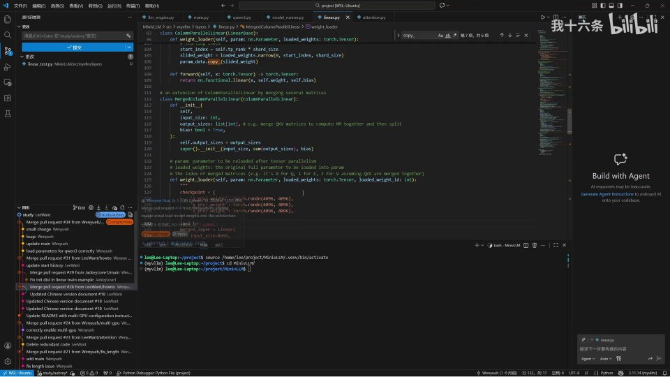
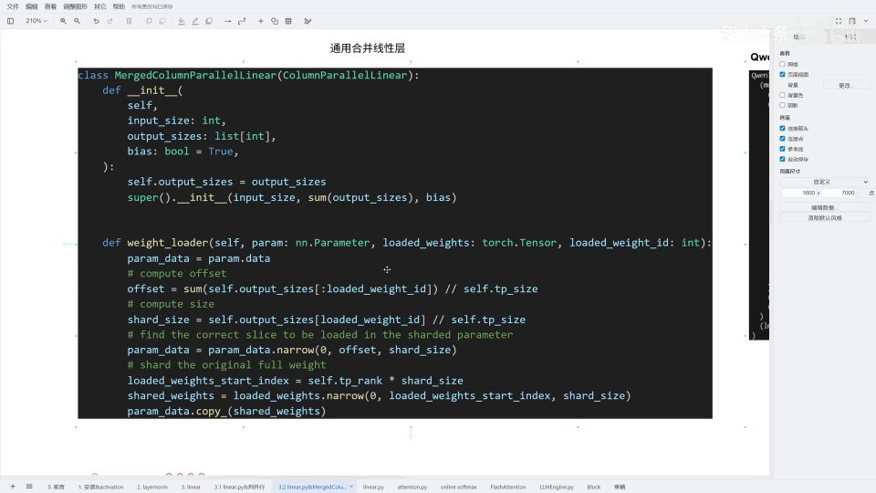
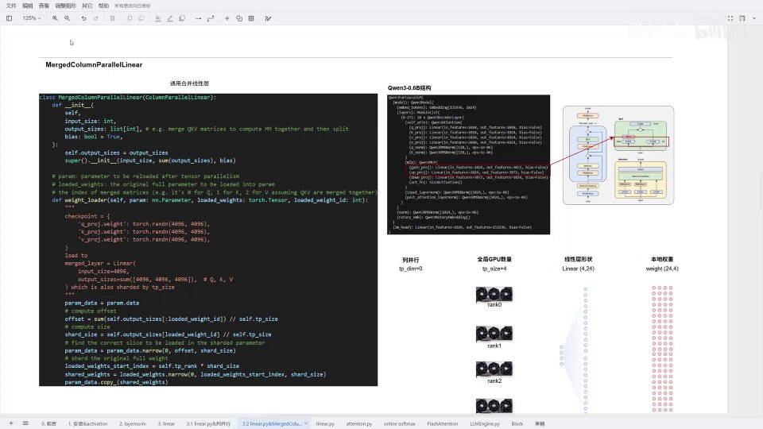
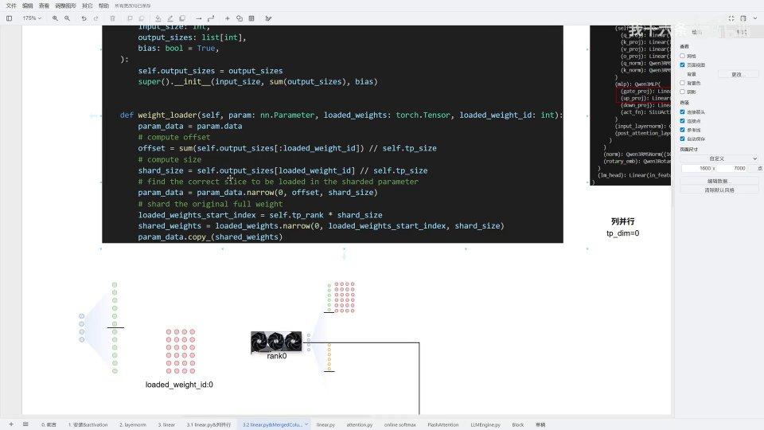
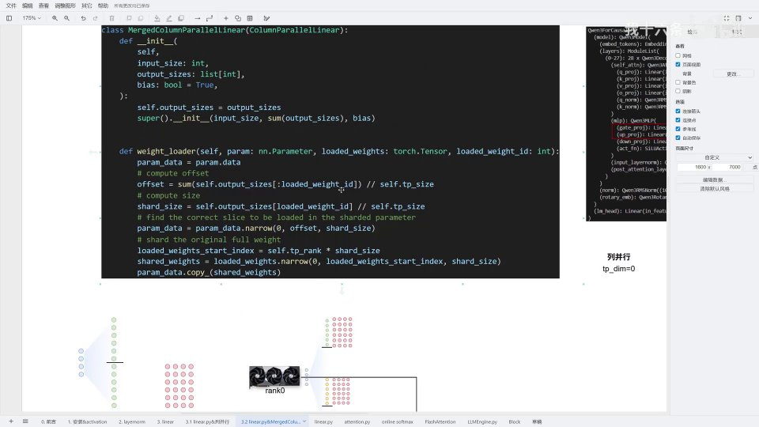

# 第04讲：linear.py——合并线性层（MergedColumnParallelLinear）与张量并行

## 本讲要解决的核心问题（SCQA）

**背景**：上一讲我们已经吃透了 `ColumnParallelLinear`（列并行）：它把线性层的输出维度平均切成 N 份，每张 GPU 只负责其中一份，加载权重时用 `shard_size` 和 `start_index` 定位自己那一块，前向算完再用 all-gather 把结果拼回来。

**冲突**：但 Transformer 的 MLP 里并不是只有一个线性层。以 Qwen3 为例，MLP 里有一对"孪生"的线性层——`gate_proj`（门投影）和 `up_proj`（上采样投影），它们**输入完全相同、输出维度也相同**。训练时它们是分开的两个矩阵，权重文件里也是分开存的。如果还是逐个按列并行去切、去加载，代码会重复，调度也会啰嗦。能不能**先把这两个小线性层"合并"成一个大线性层，再对这个大层做列并行**？

**疑问**：合并之后，一张卡拿到的这一片，到底对应原来哪个小层的哪一部分？权重加载时怎么知道"我现在加载的是 gate 还是 up"？大层的输出维度是各小层之和，切分点和偏移量又该怎么算？

**回答（中心思想）**：`MergedColumnParallelLinear`（合并列并行线性层）用**三个新增的"记账"信息**解决了这个问题——构造函数里多收一个 `output_sizes` 列表记住"每个小层各有多大"；`weight_loader` 多收一个 `loaded_weight_id` 参数标记"当前加载的是第几个小层"；切片时用 `offset`（前面所有小层的累计大小）和 `shard_size`（本小层切给本卡的大小）精确定位。**它本质上就是列并行的"批量版"：把列并行的定位+切片逻辑，对着每一个被合并的小层循环执行一遍，最后仍靠 all-gather 拼回一个完整的大线性层。**

---

## 一、先热身：版本更新与合并线性层的用途

### 1.1 一个提醒：MiniVLLM 代码在持续更新

本讲开头先交代一件小事：MiniVLLM 项目最近发生了更新，**我们之前讲解用的是 `4a4a09c9c` 这个分支，目前最新的是 `188d7f4`**。如果你看视频时发现代码和本地仓库对不上，可以切到最新分支去看一下，可能之后还会有新的更新。[【跳转到 00:00】](https://www.bilibili.com/video/BV11b64BUE5G/?t=0)

这次更新的内容主要集中在**权重加载（weight loading）**这一部分。[【跳转到 00:25】](https://www.bilibili.com/video/BV11b64BUE5G/?t=25) 不过它不影响我们理解核心原理——并行的切分思路、`weight_loader` 的记账逻辑都没变。所以直接沿用视频里的分支继续看即可。



### 1.2 合并线性层到底用在哪：MLP 的 gate 与 up

`MergedColumnParallelLinear` 直译就是"合并列并行线性层"，**它是一个通用的合并线性层**。所谓"合并"，就是把原本分开的多个线性层，在实现时拼成一个大的线性层统一处理。[【跳转到 00:48】](https://www.bilibili.com/video/BV11b64BUE5G/?t=48)

当前它最主要的应用，就是 MLP 里的**门投影（gate_proj）和上采样投影（up_proj）**这两个线性层。回顾 Qwen3 的算子图可以看到，MLP 内部有 gate、up、down 三个投影，其中 **gate 和 up 的输入都来自同一个 `input`，结构对称、维度相同**，非常适合合并。[【跳转到 01:00】](https://www.bilibili.com/video/BV11b64BUE5G/?t=60)


> **术语解释 · gate_proj / up_proj / down_proj**：现代大模型 MLP 常用"SwiGLU"结构，它由三个线性层组成——`gate_proj` 把输入映射后过一个 SiLU 激活，`up_proj` 是另一条并行的升维支路，两者逐元素相乘，再由 `down_proj` 映射回原维度。其中 gate 和 up 的输入相同、输出维度也相同（Qwen3-0.6B 里都是 3072），所以可以合并成一个"输出 6144"的大矩阵一次算完。

### 1.3 为什么偏偏是 gate 和 up 能合并：三个"相同"

并不是随便两个线性层都能合并。能合并的前提是它们在结构上"对齐"。gate_proj 和 up_proj 恰好满足三个相同：

- **输入相同**：都接收同一个 `input`（隐层向量），所以合并后只需要一份输入，不需要为两条支路各准备一份。
- **输出维度相同**：Qwen3-0.6B 里两者都是 3072，合并就是简单地沿输出维拼成 6144。
- **计算逻辑可以并置**：两者的前向都是"输入 × 权重ᵀ"，可以在同一个矩阵乘里一次算完。

> **类比**：这就像食堂里有两道都要用同样原料、同样分量做的菜，与其开两个灶台分别炒，不如把两个锅并成一个更大的锅，一次炒出两份。这里"原料"是相同的输入，"分量"是相同的输出维度。

反过来，MLP 里的 `down_proj` 就不能和 gate/up 合并——它的输入是 gate 与 up 相乘后的结果，输出也回到隐层维度，和 gate/up 的输入输出都对不上。**"输入相同、输出可拼接"是合并的硬条件。**

### 1.4 合并的本质：两个小线性层 → 一个大线性层 → 分发给多张 GPU

合并的动作可以拆成两步看：

1. **先合并**：把原本两个小的线性层拼成一个大的线性层（沿输出维度拼接）。[【跳转到 01:05】](https://www.bilibili.com/video/BV11b64BUE5G/?t=65)
2. **再分发**：把这个大线性层分发到环境里所有的 GPU 上——有几张 GPU，就切成几份发出去。[【跳转到 01:10】](https://www.bilibili.com/video/BV11b64BUE5G/?t=70)

这和上一讲的列并行**逻辑完全一致**：都是沿输出维度切分、每卡拿一片、算完再拼。事实上，`MergedColumnParallelLinear` 的**基类就是 `ColumnParallelLinear`**，它只是在这个基类之上多做了"合并多个矩阵"这件事。[【跳转到 01:21】](https://www.bilibili.com/video/BV11b64BUE5G/?t=81)

正因为相似度极高，读它的方法和读列并行一样：一行一行看下去即可。[【跳转到 01:26】](https://www.bilibili.com/video/BV11b64BUE5G/?t=86)


### 1.5 一处需要修正的注释：它其实也能用在 QKV 上

源码里有一段**注册（registration）相关的注释**，是拿 QKV 的实现来举例的。[【跳转到 01:31】](https://www.bilibili.com/video/BV11b64BUE5G/?t=91) 但作者指出，`MergedColumnParallelLinear` 当前实际上**只用在了 MLP 里两个 proj（gate 和 up）做合并的那一块**，所以这段注释写得不太恰当。[【跳转到 01:36】](https://www.bilibili.com/video/BV11b64BUE5G/?t=96)

不过这并不意味着注释完全错——**合并线性层同样可以用在 QKV 上**，只是现在还没这么用。等之后讲到 QKV 并行（`QKVParallelLinear`）时，可以再探讨两者的区别。为了不误导，作者在本讲里先把这段注释删掉。[【跳转到 01:58】](https://www.bilibili.com/video/BV11b64BUE5G/?t=118) 这也提醒我们：**读源码时对注释也要保持判断力，注释描述的是"意图"，不一定等于"事实"。**

### 1.6 一眼对照：合并列并行 vs 列并行

在进入源码前，先把这两个类放一起对照。它们"形似神也似"，差别只在三个新增点上：

| 对比项 | `ColumnParallelLinear`（上一讲） | `MergedColumnParallelLinear`（本讲） |
| --- | --- | --- |
| 处理对象 | 一个线性层 | 多个结构相同、待合并的线性层 |
| 构造函数输出维度 | 单个 `output_size` | `output_sizes` 列表，父类收 `sum(...)` |
| `weight_loader` 参数 | `param, loaded_weights` | 多一个 `loaded_weight_id` |
| 切分偏移 | 只有 `start_index` | `offset`（往哪存）+ `start_index`（从哪读） |
| 子层边界 | 不存在 | 由 `output_sizes` 逐个记住 |
| 基类 | `LinearBase` | `ColumnParallelLinear` |

一句话概括：**合并列并行 = 列并行 + "记住有哪几段、当前在第几段"的记账。** 凡是上一讲讲过的列并行原理（沿输出维切、`shard_size`、all-gather），在这里全部照旧适用，不需要重新理解一遍。

---

## 二、初始化：多收一个 output_sizes 列表

### 2.1 与列并行最大的区别，就在构造函数

删掉注释后，进入合并线性层的正文。先看初始化函数 `__init__`。[【跳转到 02:03】](https://www.bilibili.com/video/BV11b64BUE5G/?t=123)

和列并行相比，**最大的区别是它多传入了一个 `output_sizes`**——这是一个 `int` 数组（`list[int]`），里面存的是**所有要被合并的线性层各自的输出维度**。比如合并 gate 和 up，就会传入类似 `[3072, 3072]` 的列表（对应 Qwen3-0.6B）。构造函数先把它存下来：

```python
class MergedColumnParallelLinear(ColumnParallelLinear):
    def __init__(
        self,
        input_size: int,
        output_sizes: list[int],  # 要合并的每个线性层的输出维度
        bias: bool = True,
    ):
        self.output_sizes = output_sizes
        super().__init__(input_size, sum(output_sizes), bias)
```

注意最后一行：父类（列并行）接收到的输出维度是 **`sum(output_sizes)`**，也就是所有小层输出维度**求和**后的总维度。


### 2.2 为什么要做一次"求和"

因为列并行的逻辑是基于"合并之后的大层"来做的，所以父类必须知道**大层的总输出维度**是多少，才能正确计算每个分片的大小。[【跳转到 02:28】](https://www.bilibili.com/video/BV11b64BUE5G/?t=148)

这个总维度，同时也就是**前向传播后做 all-gather 拼接时，拼接维度的总大小**。换句话说，`sum(output_sizes)` 既是"加载权重时的总宽度"，也是"通信时把各卡结果拼回来的总宽度"，两者必须一致。**先把账算总，再分片，是这一整套设计的前提。**

再类比上一讲列并行的写法，对比会更清楚：

```python
# 上一讲：单个线性层，只传一个 output_size
super().__init__(input_size, output_size // tp_size, bias, tp_dim=0)

# 本讲：合并线性层，先求和，再交给父类去做整除
super().__init__(input_size, sum(output_sizes), bias)
```

区别只在于：列并行的"输出维度"是一个数，而合并列并行的"输出维度"是一串数的和。**父类负责"把总维度平均切给各卡"，子类负责"记住每一小段原本属于谁"。** 这就是"合并列并行 = 列并行 + 记账"的由来。





### 2.3 父类的整除断言，在合并场景下依然生效

别忘了，上一讲 `ColumnParallelLinear.__init__` 里有一句 `assert output_size % tp_size == 0`。合并列并行把 `sum(output_sizes)` 交给父类，断言检查的也就变成了"**总维度**能否被整除"。

但这里有个值得留意的细节：**总维度能整除，不代表每个小层各自也能整除。** 举个反例，若 `output_sizes = [3, 5]`、`tp_size = 4`，总和 8 能被 4 整除，可 `3 // 4 = 0`、`5 // 4 = 1`，每个小层的分片根本不完整，后续 `narrow` 和 `copy_` 就会出错。所以在实际配置并行度时，**要保证的是"每个小层的输出维度都能被 `tp_size` 整除"**，而不只是它们的和。这也是为什么前面强调：合并列并行对每个小层**分别**应用整除性要求。

---

## 三、用图形理解：两个小层如何被切开、分发

### 3.1 先建立画面，再看代码

在看 `weight_loader` 之前，作者先带我们**用图形建立一个直观理解**。[【跳转到 02:53】](https://www.bilibili.com/video/BV11b64BUE5G/?t=173)

假设是一个**双卡环境（`tp_size = 2`）**。[【跳转到 02:58】](https://www.bilibili.com/video/BV11b64BUE5G/?t=178) 训练时我们有两个线性层，对应 MLP 的 gate 门投影和 up 上采样投影，现在要把这两个线性层合并。[【跳转到 03:03】](https://www.bilibili.com/video/BV11b64BUE5G/?t=183) [【跳转到 03:08】](https://www.bilibili.com/video/BV11b64BUE5G/?t=188)

> **术语解释 · tp_size**：张量并行的"世界大小"，也就是参与并行的 GPU 总数。`tp_size=2` 表示用两张卡，`tp_size=4` 表示四张卡。它和上一讲的 `world_size` 是同一个概念。

### 3.2 loaded_weight_id：区分"我在加载第几个小层"

原本训练时，这两个线性层是**分开训练、权重也分开存储**的。[【跳转到 03:13】](https://www.bilibili.com/video/BV11b64BUE5G/?t=193)

合并之后，我们用一个编号来区分它们：**第一个线性层的 `loaded_weight_id` 是 0，第二个是 1**。[【跳转到 03:18】](https://www.bilibili.com/video/BV11b64BUE5G/?t=198)

这个 `loaded_weight_id` 的作用就是：**告诉 `weight_loader`"我现在正在加载的是哪一个线性层"**，从而算出正确的偏移量。[【跳转到 03:29】](https://www.bilibili.com/video/BV11b64BUE5G/?t=209)

> **术语解释 · loaded_weight_id**：字面意思是"被加载权重的编号"。因为合并线性层一次要装多个小层的权重，外部调度器会分别把每个小层的完整权重传进来，并附上它的编号。`weight_loader` 就靠这个编号，决定这一批权重应该放进大参数的哪一段。

### 3.3 切分规则：每个小层独立切、独立分给各卡

做列切分时，**相当于还是对每一个线性层单独切**。[【跳转到 03:37】](https://www.bilibili.com/video/BV11b64BUE5G/?t=217)

以 `tp_size = 2` 为例：每个线性层都被拆成两部分——上半部分和下半部分；第二个线性层也是一样。[【跳转到 03:42】](https://www.bilibili.com/video/BV11b64BUE5G/?t=222)

如果 `tp_size = 3` 或 `4`，同理，就把每个线性层拆成三份或四份——**只要维度能被整除就可以拆**。

**以 rank0 为例**：rank0 维护的，其实是**第一个线性层的上半部分 + 第二个线性层的上半部分**。[【跳转到 04:07】](https://www.bilibili.com/video/BV11b64BUE5G/?t=247) 也就是说，每张 GPU 设备分别维护自己对应的那一片，但注意——**它是从每个小层里各取一片，而不是从大层里连续取一段**。这是理解合并列并行最关键的一点。

### 3.4 tp_size=3 与 tp_size=4 的切法

继续用图形推演。当 `tp_size = 3` 时，把每个线性层都拆成三份。[【跳转到 04:32】](https://www.bilibili.com/video/BV11b64BUE5G/?t=272) [【跳转到 04:41】](https://www.bilibili.com/video/BV11b64BUE5G/?t=281)

拆成四份也是同理，就是等分成四份。作者提到一个细节：**这里用的示范维度是 12，它既是 3 的倍数也是 4 的倍数**，所以无论 tp_size 取 3 还是 4 都能整除。rank0～rank3 各自拿一份。[【跳转到 05:06】](https://www.bilibili.com/video/BV11b64BUE5G/?t=306)

对应到权重也是同样的切法：每个 rank 维护自己那一片，rank0 一份、rank1 一份、rank2 一份、rank3 一份。

> **回顾上一讲的整除性铁律**：切分的前提是"总维度能被 `tp_size` 整除"。合并线性层把这个前提**分别应用在每个小层上**——每个小层的输出维度都必须能被 `tp_size` 整除，否则分片会出问题。

### 3.5 简化到 rank0/rank1 的场景

为了让推导更清晰，作者把场景简化到 `tp_size = 2`：**rank0 维护上半部分，rank1 维护下半部分**，最后做一个 all-gather 把两半拼回来。[【跳转到 05:31】](https://www.bilibili.com/video/BV11b64BUE5G/?t=331)

接下来就要进入 `weight_loader`，把这些权重**正确地加载到每个 rank 维护的那一片里**。[【跳转到 05:40】](https://www.bilibili.com/video/BV11b64BUE5G/?t=340)


## 四、weight_loader 逐行拆解：offset 与 shard_size 的算法

### 4.1 三个参数

进入 `weight_loader`，先看它的参数。[【跳转到 05:45】](https://www.bilibili.com/video/BV11b64BUE5G/?t=345) [【跳转到 05:50】](https://www.bilibili.com/video/BV11b64BUE5G/?t=350)

```python
def weight_loader(self, param, loaded_weights, loaded_weight_id: int):
    param_data = param.data
    # compute offset
    offset = sum(self.output_sizes[:loaded_weight_id]) // self.tp_size
    # compute size
    shard_size = self.output_sizes[loaded_weight_id] // self.tp_size
    # find the correct slice to be loaded in the sharded parameter
    param_data = param_data.narrow(0, offset, shard_size)
    # shard the original full weight
    loaded_weights_start_index = self.tp_rank * shard_size
    shared_weights = loaded_weights.narrow(0, loaded_weights_start_index, shard_size)
    param_data.copy_(shared_weights)
```

三个参数分别是：

- **`param`**：本卡上这个大线性层的参数，它的形状是"已切分后"的大小。
- **`loaded_weights`**：本地存储的、**完整的**某个小层权重。
- **`loaded_weight_id`**：当前要加载的是第几个小层（0 表示第一个，1 表示第二个）。

这三种信息缺一不可：`param` 告诉它"要往哪装"，`loaded_weights` 给出"要装什么"，`loaded_weight_id` 说明"这批东西属于第几段"。整个加载过程，就是在两把坐标尺之间做搬运——一把量"装到参数的哪里"，一把量"从权重的哪里切"。


### 4.2 计算偏移 offset：前面几个小层加起来有多大

进入函数后先做赋值 `param_data = param.data`，然后**计算偏移 `offset`**：

```python
offset = sum(self.output_sizes[:loaded_weight_id]) // self.tp_size
```

它的含义是：**当前这个小层在大层里的起点，换算到本卡分片上的位置**。也就是"排在它前面的所有小层，各自的输出维度之和，再除以卡数"。[【跳转到 06:15】](https://www.bilibili.com/video/BV11b64BUE5G/?t=375)

先看**加载第一个线性层（`loaded_weight_id = 0`）**的情况：`output_sizes[:0]` 是空列表，`sum` 等于 0，`0 ÷ tp_size`（即 0÷2）还是 0。所以 **`offset = 0`**，相当于本卡从第 0 个位置开始存。

### 4.3 计算分片大小 shard_size

接着算 `shard_size`：

```python
shard_size = self.output_sizes[loaded_weight_id] // self.tp_size
```

也就是"当前小层的输出维度 ÷ 卡数"。[【跳转到 06:40】](https://www.bilibili.com/video/BV11b64BUE5G/?t=400)

在例子中，第一个小层的输出维度是 **12**，`12 ÷ 2 = 6`，所以 **`shard_size = 6`**，正好对应上半部分。

然后执行切片：

```python
param_data = param_data.narrow(0, offset, shard_size)
```

意思是：**沿着第 0 维（输出维度），从 `offset` 开始，取 `shard_size` 个**。对第一片来说，就是从 0 开始取 6 个——也就是把这 6 个输出神经元的位置预留出来，待会把权重要存进这 6 个维度、这 6 个神经元里。

> **术语解释 · narrow(dim, start, length)**：PyTorch 的切片函数，等价于 `t[dim][start : start+length]`。上一讲已经见过它，这里参数含义相同：`dim=0` 沿输出维，`start=offset` 起点，`length=shard_size` 长度。

### 4.4 计算本地权重要从哪切：start_index

接下来计算**本地权重要从哪个位置开始读取**。[【跳转到 07:05】](https://www.bilibili.com/video/BV11b64BUE5G/?t=425)

```python
loaded_weights_start_index = self.tp_rank * shard_size
shared_weights = loaded_weights.narrow(0, loaded_weights_start_index, shard_size)
```

对 rank0 来说，`tp_rank = 0`，所以 `start_index = 0 × 6 = 0`，从第 0 个位置开始取，取 6 个。[【跳转到 07:30】](https://www.bilibili.com/video/BV11b64BUE5G/?t=450)

**注意这里有个容易混淆的地方**：`param_data.narrow` 用的是 `offset`（决定"存到大参数的哪一段"），而 `loaded_weights.narrow` 用的是 `start_index`（决定"从完整权重的哪一段开始取"）。**一个是"目的地偏移"，一个是"来源偏移"，两者用途不同。**

加载完这 6 个权重后，第一片就装好了。

### 4.5 加载第二个小层：offset 从 6 开始

切换到 **`loaded_weight_id = 1`** 的情况。[【跳转到 07:49】](https://www.bilibili.com/video/BV11b64BUE5G/?t=469)

这时 `offset = output_sizes[:1]` 的第一个值，也就是 12；`12 ÷ 2 = 6`，所以 **`offset = 6`**。[【跳转到 07:54】](https://www.bilibili.com/video/BV11b64BUE5G/?t=474) 意思是：**从第 6 个位置开始存**——位置编号 0 1 2 3 4 5 之后是 6，正好接在第一个小层占的 6 个位置后面。

再看 `shard_size = output_sizes[1] // tp_size`：`output_sizes[1] = 12`，`12 ÷ 2 = 6`，还是 6。这对应第二个线性层切给本卡的那一半。[【跳转到 08:19】](https://www.bilibili.com/video/BV11b64BUE5G/?t=499)

于是对本卡参数做切分：从 `offset = 6` 开始，取 6 个神经元，供第二个小层加载。[【跳转到 08:44】](https://www.bilibili.com/video/BV11b64BUE5G/?t=524)

本地权重的来源位置同样计算：rank0 的 `start_index = tp_rank × shard_size = 0 × 6 = 0`，从 0 开始取 6 个。[【跳转到 08:55】](https://www.bilibili.com/video/BV11b64BUE5G/?t=535) 因为我们传入的其实是第二个线性层的权重，所以就是从第二个小层权重的开头开始取，最后把它加载到本卡大参数的第 6～11 这段位置。[【跳转到 09:00】](https://www.bilibili.com/video/BV11b64BUE5G/?t=540)

### 4.6 一句话总结这段算法

把上面的过程浓缩成一张"记账表"：

| 量 | 含义 | 公式 | id=0 | id=1 |
| --- | --- | --- | --- | --- |
| `offset` | 存进本卡参数的起点 | `sum(output_sizes[:id]) // tp_size` | 0 | 6 |
| `shard_size` | 本小层切给本卡的大小 | `output_sizes[id] // tp_size` | 6 | 6 |
| `start_index` | 从完整权重读取的起点 | `tp_rank * shard_size` | 0 | 0 |

**核心就三件事**：`offset` 决定"往哪存"，`shard_size` 决定"存多大"，`start_index` 决定"从哪读"。两者搭配，就把每个小层的每一片，精确地填进了大参数的对应位置。

### 4.7 为什么最后一步是 `copy_`，而不是直接赋值

代码最后一行是 `param_data.copy_(shared_weights)`。上一讲也强调过：这里**不能用 `param = shared_weights` 直接赋值**，必须原地写入。

原因和上一讲完全一致：`param` 是已经注册进 `nn.Module` 的那个 `nn.Parameter` 对象，PyTorch 的优化器、`state_dict`、设备搬运都认准这个对象，`weight_loader` 属性也挂在它身上。如果直接赋值一个新张量，参数对象就被换掉了，之前注册的信息、后续的加载调度都会出问题。而 `copy_` 是**原地写入**——参数对象不变，只把里面的数值替换掉，既安全又高效。**这一条在 vLLM 的权重加载里处处可见，是必须养成的习惯。**

另外注意：`param_data = param_data.narrow(...)` 返回的其实是原参数的一个**视图（view）**，共享同一块内存。所以对 `param_data` 做 `copy_`，改动的就是原参数对应那一段，不会创建新张量，也不会额外占显存。

### 4.8 rank1 的情况与整体结果

至于 **rank 等于 1** 的情况，过程完全一样，作者就不重复推导了，留给读者自己细推。[【跳转到 09:14】](https://www.bilibili.com/video/BV11b64BUE5G/?t=554)

最终结果是：**每个小层的下半部分被加载到 rank1 的对应位置，上半部分被加载到 rank0 的对应位置**。[【跳转到 09:20】](https://www.bilibili.com/video/BV11b64BUE5G/?t=560)

权重加载完成后，就可以做**正常的前向传播**，之后再做一次 **all-gather，把各卡的结果按输出维度拼接起来**，于是又拼回了一个完整的大线性层。[【跳转到 09:40】](https://www.bilibili.com/video/BV11b64BUE5G/?t=580) 从外部看，它和"两个独立小层分别计算"的结果完全一致，只是计算被拆分到了多张卡上。





---

## 五、把整个过程串起来：一图读懂数据流

为了不让细节淹没全貌，这里用一条完整的数据流把本讲内容再串一遍。

```
训练时（HuggingFace 权重文件里）：
   gate_proj: [out=12, in=?]      up_proj: [out=12, in=?]
        │                              │
        │  合并（沿输出维拼接）          │
        ▼                              ▼
   大线性层: [out=24, in=?]   ←── output_sizes = [12, 12]
        │
        │  列并行切分（tp_size=2）
        ▼
   rank0: 前半(每个小层各取一半)   rank1: 后半(每个小层各取一半)

加载权重时（weight_loader）：
   外部按 loaded_weight_id=0 传入完整 gate 权重
        → offset=0, shard_size=6, start_index=0
        → 切出 gate 的前 6 行，存进本卡参数 [0:6]
   外部按 loaded_weight_id=1 传入完整 up 权重
        → offset=6, shard_size=6, start_index=0
        → 切出 up 的前 6 行，存进本卡参数 [6:12]

前向传播后：
   rank0 结果 + rank1 结果 ── all-gather ──► 拼回完整输出
```

这张图把三个关键点连成了一条线：**合并让两个小层共用一次列并行；`output_sizes` 记住每个小层的边界；`loaded_weight_id` + `offset` 把每一小层的分片精确落位。** 理解了这条线，合并列并行就没有暗礁了。

## 小结

- **合并线性层（`MergedColumnParallelLinear`）是列并行的推广**，把 MLP 里 gate_proj、up_proj 这类"输入相同、输出相同"的线性层先合并成一个大层，再对这个大层做列并行。
- **它继承自 `ColumnParallelLinear`**，相似度极高；最大的新增点是构造函数多收一个 **`output_sizes` 列表**，记住每个被合并小层的输出维度。
- **父类收到的输出维度是 `sum(output_sizes)`**，这个总维度既是分片的总宽度，也是前向 all-gather 拼接的总宽度。
- **`weight_loader` 多收一个 `loaded_weight_id`**，用来标记"当前加载第几个小层"，从而算出正确的偏移。
- **三件核心量**：`offset = sum(output_sizes[:id]) // tp_size`（往哪存）、`shard_size = output_sizes[id] // tp_size`（存多大）、`start_index = tp_rank * shard_size`（从哪读）。
- **每个小层独立切分、独立分片**：每张卡从每个小层里各取一片，而不是从大层里连续取一段，这样与"按小层分别加载"的方式吻合。
- **前向传播后用 all-gather 按输出维拼接**，把各卡结果还原成一个完整的大线性层。
- **`QKVParallelLinear` 建立在合并列并行之上**，只是要处理 Q、K、V 维度不等（GQA）的偏移计算。
- **加载完成的判定标准**：每张卡本地参数的每个小层分段，都被正确填入了"完整权重里属于本卡的那一段"；两张卡合起来既不重复、也不遗漏地覆盖了所有小层。
- **合并的价值在于批量化**：把重复的并行与加载流程收进一个类，省去重复的调用、切分和通信，而不是改变了算法本身。

把 `output_sizes`、`loaded_weight_id`、`offset`、`start_index` 四个量记住，合并列并行的权重加载就能随手推出来。

---

## 关键术语速查

| 术语 | 一句话解释 |
| --- | --- |
| `MergedColumnParallelLinear` | 合并列并行线性层，把多个小线性层合并成一个大层后再做列并行 |
| `ColumnParallelLinear` | 列并行线性层，沿输出维度切分权重，是合并列并行的基类 |
| `output_sizes` | 列表，记录每个被合并小层各自的输出维度，如 `[3072, 3072]` |
| `loaded_weight_id` | 标记当前加载的是第几个被合并的小层（0、1、2……） |
| `offset` | 写入位置偏移，`sum(output_sizes[:loaded_weight_id]) // tp_size` |
| `shard_size` | 本小层切给本卡的分片大小，`output_sizes[loaded_weight_id] // tp_size` |
| `start_index` | 从完整小层权重读取的起点，`tp_rank * shard_size` |
| `narrow(dim, start, length)` | 沿指定维度从 start 起取 length 个元素的切片操作 |
| `tp_rank` / `tp_size` | 本卡编号 / 参与并行的 GPU 总数 |
| all-gather | 把各卡结果沿输出维拼接、让每卡都拿到完整结果的通信操作 |
| gate_proj / up_proj | MLP 里输入相同、输出相同的两个线性层，是本讲的合并对象 |
| GQA | 分组查询注意力，使 Q 的输出维度可能是 K/V 的两倍，影响 QKV 并行的偏移计算 |
| MiniVLLM | 教学用的迷你 vLLM 实现，本系列源码所在项目 |
