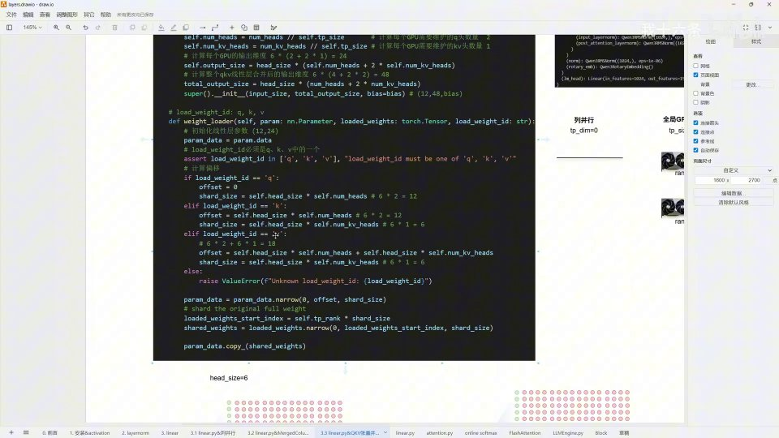

# 第05讲：QKV 张量并行与合并线性层——`QKVParallelLinear` 是怎么切、怎么装的

## 本讲要解决的核心问题（SCQA）

**背景**：前两讲我们分别读懂了列并行（`ColumnParallelLinear`）和它的"升级版"合并列并行（`MergedColumnParallelLinear`）。两者的套路一样：带上 `shard_size` 和偏移量这两个"记账"信息，沿输出维把一个大线性层切成 N 份，每张 GPU 只留一份，加载权重时各自往自己那一小格里填。

**冲突**：但 Transformer 里最核心的 attention（注意力）并不只有一个线性层，而是 Q、K、V 三个。更麻烦的是，它们还各有各的毛病——Q 的头数和 KV 的头数**天生不相等**（Qwen3-0.6B 里是 Q 头 16、KV 头 8），也就是 GQA（分组查询注意力）。这就带来两个难题：第一，三个小矩阵乘分开算，GPU 利用率低，能不能**先融合成一个大矩阵乘**；第二，融合之后，一张 GPU 到底拿的是"Q 的哪一段、K 的哪一段、V 的哪一段"？三者的切分长度还不一样，怎么用一套统一的记账法管起来？

**疑问**：合并后的 QKV 大线性层，维度和偏移到底怎么算？权重加载时怎么知道"我现在装的是 Q 还是 K 还是 V"？多个 GPU、多个头的情况下，每个 rank 的切片起点为什么会不一样？前向算完又靠什么把碎片拼回一个完整的 QKV？

**回答（中心思想）**：`QKVParallelLinear` 用一套"**三个 id + 两个索引**"的机制把上面全部问题一次解决——它继承自列并行，在 `weight_loader` 里新增一个 `load_weight_id`（取值 `"q"`/`"k"`/`"v"`）标记"当前装的是哪一个"，再用 `shard_size`（这段在本卡有多少个神经元）和 `offset`（这段应该写进本卡权重的哪个位置）把权重精确落位；同时它**新增一层"按头数分流"的计算**，把全局的 Q 头、KV 头先均分给各 GPU，再换算成每卡的输出维度。**一句话：`QKVParallelLinear` 就是合并列并行在 attention 上的定制版——多出来的只是"Q/K/V 三段的长度不同、偏移不同"这一层管理，切分与拼接的骨架和列并行完全一致，最后同样靠 all-gather 拼回完整的 QKV。**

---

## 一、先把 QKV 合并成一件事：算子融合为什么值得做

### 1.1 attention 里的三个线性层：Q、K、V

从 Qwen3-0.6B 的算子图看进去，attention 子模块内部其实并排摆着三个线性层，分别是 Q 投影、K 投影、V 投影。[【跳转到 00:09】](https://www.bilibili.com/video/BV1kUfDBfEuK/?t=9)

- **Q（Query，查询）**：把输入隐向量映射成"查询向量"。
- **K（Key，键）**：把输入映射成"键向量"。
- **V（Value，值）**：把输入映射成"值向量"。


> **术语解释 · attention / QKV**：attention 是 Transformer 的核心机制，通俗地说就是"让每个词去看其他所有词、决定该关注谁"。做法是给每个词各算出 query、key、value 三个向量：query 去和所有 key 做点积，得到"关注权重"，再用这些权重对 value 加权求和。因此输入必须先经过三个线性层，才能得到这三组向量。

### 1.2 合并的本质是算子融合：三次小乘法变一次大乘法

在实际计算时，MiniVLLM 会把这 Q、K、V 三个线性层**合并成一个大线性层**，也就是做一次**算子融合（operator fusion）**。[【跳转到 00:14】](https://www.bilibili.com/video/BV1kUfDBfEuK/?t=14)

好处非常直接：**原本三次独立的矩阵乘法，变成了一次更大的矩阵乘法。**

> **术语解释 · 算子融合 / GPU 利用率**：算子融合是指把多个相邻的小计算步骤合成一个大的计算步骤，减少中间结果的读写次数。对 GPU 来说，矩阵越大，越能塞满它的计算单元，硬件的算力利用效率（简称"利用率"）就越高；而三次小矩阵乘因为每次都没把 GPU 喂饱，效率反而低。合并后的结果，可能在数值上和三次分开算完全一样，但速度快得多。

打个比方：搬砖时，如果一次只搬一块砖来回跑三趟，累且慢；不如一次性把三块砖摞起来搬一趟。**合并线性层就是"把三个小矩阵摞成一个大矩阵"这一动作。**

### 1.3 先看形状：Qwen3-0.6B 的 Q、K、V 各有几头

要合并，先得知道三个线性层各自的形状。看 Qwen3-0.6B 的配置：它的 **head_dim（每个注意力头的维度）是 128**，`q_proj` 的输出是 2048，`k_proj`、`v_proj` 的输出是 1024。[【跳转到 00:39】](https://www.bilibili.com/video/BV1kUfDBfEuK/?t=39)

于是头的数量这样算：

- **Q 头数** = 2048 ÷ 128 = **16**
- **KV 头数** = 1024 ÷ 128 = **8**

所以每两个 Q 头共享一个 KV 头。这正是 **GQA（Grouped Query Attention，分组查询注意力）** 的设计。[【跳转到 01:04】](https://www.bilibili.com/video/BV1kUfDBfEuK/?t=64)


> **术语解释 · MHA / GQA**：传统多头注意力（MHA，Multi-Head Attention）里，每个 Q 头都配一个独立的 K 头和 V 头，三者数量相等。GQA 则让**多个 Q 头共享同一组 K/V 头**，从而大幅省下 K/V 的存储和计算。当共享比例是 1（每头一对一）时，GQA 就退化成传统 MHA。Qwen3-0.6B 的 16 Q 头配 8 KV 头，就是 2:1 的 GQA。

---

## 二、`QKVParallelLinear` 的构造函数：先把各种维度算清楚

### 2.1 它继承列并行，参数清单一目了然

打开源代码 `linear.py`，`QKVParallelLinear` 的定义第一行就表明它的出身：**它继承自 `ColumnParallelLinear`**。[【跳转到 01:21】](https://www.bilibili.com/video/BV1kUfDBfEuK/?t=81) 这意味着上一讲讲过的列并行骨架（按输出维切、`shard_size`、all-gather）在这里全部继续沿用，我们只需看它多做了什么。

`__init__` 里接收一系列参数：输入维度 `input_size`、头的维度 `head_size`、Q 头数量 `num_heads`、KV 头数量 `num_kv_heads`、偏置 `bias`。[【跳转到 01:26】](https://www.bilibili.com/video/BV1kUfDBfEuK/?t=86)

```python
class QKVParallelLinear(ColumnParallelLinear):
    def __init__(
        self,
        input_size: int,              # 输入维度
        head_size: int,               # 每个头的维度 head_size
        num_heads: int,               # Q 头数量
        num_kv_heads: int | None = None,  # KV 头数量（可以为空）
        bias: bool = False,           # 偏置
    ):
        ...
```

### 2.2 一个贴心的默认值：KV 头为空就退化成传统 MHA

接着它通过分布式环境拿到当前的**全局 GPU 数量**（`tp_size`，张量并行的并行度）。[【跳转到 01:47】](https://www.bilibili.com/video/BV1kUfDBfEuK/?t=107) 然后处理 `num_kv_heads`：虽然 KV 头数是传进来的，但它可以是空值；**当没有传 KV 头时，就默认让它等于 Q 头的数量。**

```python
self.tp_size = dist.get_world_size()      # 全局 GPU 数量
num_kv_heads = num_kv_heads or num_heads  # KV 头为空则默认等于 Q 头数
self.head_size = head_size                # 头的维度
```

> **为什么这样设计**：KV 头数 == Q 头数，正好就是传统 MHA（一对一）的情形。也就是说，**同一份代码，不传 KV 头就自动变成原始 Transformer 的多头注意力，传了就是 GQA**。用"默认值"来兼容两种模式，是很典型的工程优雅。

### 2.3 按 GPU 均分头数，再换算成每卡的输出维度

接下来是本讲构造函数里最关键的四个量。[【跳转到 02:12】](https://www.bilibili.com/video/BV1kUfDBfEuK/?t=132)

```python
self.num_heads = num_heads // self.tp_size          # 每个 GPU 维护的 Q 头数
self.num_kv_heads = num_kv_heads // self.tp_size    # 每个 GPU 维护的 KV 头数
# 每个 GPU 的输出维度 = head_size * (本卡 Q 头数 + 2 × 本卡 KV 头数)
self.output_size = head_size * (self.num_heads + 2 * self.num_kv_heads)
# 整个 QKV 合并后的总输出维度 = head_size * (Q 头数 + 2 × KV 头数)
total_output_size = head_size * (num_heads + 2 * num_kv_heads)
super().__init__(input_size, total_output_size, bias=bias)
```

这里有几个容易踩坑的点，值得逐一说清：

- **为什么要 ×2**：K 和 V 是两组独立权重，所以 KV 头虽然只有 `num_kv_heads` 个，但算输出维度时要按 **2 × KV 头数**来算（K 占一份、V 占一份）。
- **均分逻辑**：假如全局有 2 个 GPU、共有 4 个 Q 头，那每个 GPU 分到 4 ÷ 2 = 2 个 Q 头。这就是"按头数均分"。
- **两个 output_size 的区别**：`self.output_size` 是**本卡**要维护的输出维度，`total_output_size` 是**合并后完整大层**的输出维度。父类 `ColumnParallelLinear` 收的是后者，内部再按 `tp_size` 去切。

### 2.4 用一个小例子把数字跑通

代码里配了一个小例子，我们跟着算一遍，后面的权重加载全靠这些数字：[【跳转到 02:37】](https://www.bilibili.com/video/BV1kUfDBfEuK/?t=157)

- `head_size` = 6
- `num_heads`（Q 头）= 4
- `num_kv_heads`（KV 头）= 2
- 全局 GPU 数 `tp_size` = 2

那么合并后的**总输出维度**：

```text
total_output_size = head_size × (num_heads + 2 × num_kv_heads)
                  = 6 × (4 + 2 × 2) = 6 × 8 = 48
```

每个 GPU 的**本卡输出维度**：

```text
self.output_size = head_size × (本卡 Q 头 + 2 × 本卡 KV 头)
                 = 6 × (2 + 2 × 1) = 6 × 4 = 24
```


所以这个"QKV 合并线性层"在例子里的完整形状是 **输入 12 → 输出 48**；而每张 GPU 只需维护其中输出 24 的那一片。**把三个 QKV 小层合成一个大层，再把这个大层沿输出维切成两半发给两张卡——这就是 QKV 张量并行的全貌。**

---

## 三、权重加载：用 `load_weight_id` + `offset` + `shard_size` 精确落位

### 3.1 加载一张卡，要先回答三个问题

进入 `weight_loader`，我们的任务是"往 rank0 这张卡的本卡权重里，把 Q、K、V 三段分别填进去"。要填得准，必须回答三个问题：[【跳转到 04:21】](https://www.bilibili.com/video/BV1kUfDBfEuK/?t=261)

1. **这段是谁？** —— 用 `load_weight_id` 区分（`"q"` / `"k"` / `"v"`）。
2. **从原始整块权重里取多少、从哪取？** —— `shard_size` 决定取多少，`loaded_weights_start_index` 决定从哪取。
3. **写进本卡权重的哪个位置？** —— `offset` 决定写到哪，`shard_size` 决定写多宽。

先看一个断言，它保证 `load_weight_id` 只能是 `"q"`、`"k"`、`"v"` 之一：

```python
assert load_weight_id in {"q", "k", "v"}, "load_weight_id must be one of 'q', 'k', 'v'"
```

### 3.2 三段的分片长度与偏移量（最核心的一张对照表）

`weight_loader` 的主体就是一个 `if / elif / elif`，对三种 id 分别给出 `offset` 和 `shard_size`：[【跳转到 04:46】](https://www.bilibili.com/video/BV1kUfDBfEuK/?t=286)

```python
if load_weight_id == "q":
    offset = 0
    shard_size = self.head_size * self.num_heads          # 6 × 2 = 12
elif load_weight_id == "k":
    offset = self.head_size * self.num_heads              # 6 × 2 = 12
    shard_size = self.head_size * self.num_kv_heads       # 6 × 1 = 6
elif load_weight_id == "v":
    offset = (self.head_size * self.num_heads
              + self.head_size * self.num_kv_heads)       # 6×2 + 6×1 = 18
    shard_size = self.head_size * self.num_kv_heads       # 6 × 1 = 6
```

把这三段翻译成"本卡权重（共 24 个神经元）内部的地图"：

| 段 | offset（写到本卡权重的起点） | shard_size（写多宽） | 对应本卡权重的区间 |
| --- | --- | --- | --- |
| Q | 0 | 12 | [0, 12) |
| K | 12 | 6 | [12, 18) |
| V | 18 | 6 | [18, 24) |


### 3.3 写进本卡：`param_data.narrow(0, offset, shard_size)`

定位动作由这一行完成：

```python
param_data = param_data.narrow(0, offset, shard_size)
```

> **术语解释 · narrow**：PyTorch 的 `narrow(dim, start, length)` 表示"在第 `dim` 维上，从 `start` 开始截取 `length` 个元素"，返回的是一个视图（view）。这里 `dim=0` 指输出维，所以意思是"**在本卡权重里从 offset 处开始，圈出 shard_size 这么宽的一块**"，后面就往这块里拷数据。

### 3.4 从原始整块权重里取：`loaded_weights_start_index`

数据来源是官方权重文件里那份**完整的** Q（或 K、V）权重。要从里面取出"属于本 rank 的那一段"，用：

```python
loaded_weights_start_index = self.tp_rank * shard_size
shared_weights = loaded_weights.narrow(0, loaded_weights_start_index, shard_size)
param_data.copy_(shared_weights)
```

**大意就是：第 `tp_rank` 张卡，就从原始权重的第 `tp_rank × shard_size` 行开始，取 `shard_size` 行。** 这样第 0 张卡拿前半段，第 1 张卡拿后半段，互不重叠、合起来正好是完整权重。

### 3.5 逐段走一遍 rank0 的加载

**加载 Q**：`load_weight_id = "q"`，于是 `offset = 0`、`shard_size = 12`。意思就是在本卡权重的**第 0 个位置开始，填 12 个神经元**（因为本卡分到 2 个 Q 头 × 每个头 6 = 12）。数据来源那边，`tp_rank=0`，所以 `start_index = 0 × 12 = 0`，从原始 Q 权重第 0 行取 12 行。[【跳转到 05:11】](https://www.bilibili.com/video/BV1kUfDBfEuK/?t=311)


**加载 K**：`load_weight_id = "k"`。[【跳转到 06:13】](https://www.bilibili.com/video/BV1kUfDBfEuK/?t=373) 这时 `offset = head_size × num_heads = 6 × 2 = 12`——**让开 Q 已经占掉的 12 个位置，从第 12 个开始**；`shard_size = head_size × num_kv_heads = 6 × 1 = 6`。[【跳转到 07:06】](https://www.bilibili.com/video/BV1kUfDBfEuK/?t=426) 因为本卡只分到 1 个 KV 头，所以只填 6 个。取数位置 `start_index = 0 × 6 = 0`，从原始 K 权重第 0 行取 6 行，写到本卡 [12, 18)。[【跳转到 07:34】](https://www.bilibili.com/video/BV1kUfDBfEuK/?t=454)


**加载 V**：`load_weight_id = "v"`。[【跳转到 07:55】](https://www.bilibili.com/video/BV1kUfDBfEuK/?t=475) 这时 `offset = 6×2 + 6×1 = 18`——**再让开 K 占掉的 6 个位置，从第 18 个开始**；`shard_size = 6 × 1 = 6`。[【跳转到 08:00】](https://www.bilibili.com/video/BV1kUfDBfEuK/?t=480) 于是 V 写到本卡 [18, 24)，本卡 24 个神经元刚好填满。



三段填完后，rank0 这张卡的权重就从空到满：[0,12) 是 Q、[12,18) 是 K、[18,24) 是 V。**这就是"每卡维护 QKV 的一部分"的具体含义。**

---

## 四、rank1 为什么和 rank0 不同：一切差别都在"切分起点"

### 4.1 唯一的变量：`self.tp_rank`

对 rank1 来说，本卡权重**要写到哪、写多宽**（`offset` 和 `shard_size`）完全没变——Q 还是 12、K 和 V 还是各 6。**变化的只是"从原始完整权重的哪里开始切"这一步。**[【跳转到 08:45】](https://www.bilibili.com/video/BV1kUfDBfEuK/?t=525)

回顾取数公式：

```python
loaded_weights_start_index = self.tp_rank * shard_size
```

当 `tp_rank = 1`：

- **Q**：`start_index = 1 × 12 = 12`，从原始 Q 权重第 12 行开始，取 12 行（即第二半）。[【跳转到 08:55】](https://www.bilibili.com/video/BV1kUfDBfEuK/?t=535)
- **K**：`start_index = 1 × 6 = 6`，从原始 K 权重第 6 行开始取 6 行。
- **V**：同理，从原始 V 权重第 6 行开始取 6 行。[【跳转到 09:26】](https://www.bilibili.com/video/BV1kUfDBfEuK/?t=566)


### 4.2 rank0 与 rank1 的对照

| | rank0 | rank1 |
| --- | --- | --- |
| Q 存储位置（本卡内） | [0, 12) | [0, 12) |
| K 存储位置（本卡内） | [12, 18) | [12, 18) |
| V 存储位置（本卡内） | [18, 24) | [18, 24) |
| Q 取数起点（原始权重） | 0 | 12 |
| K 取数起点（原始权重） | 0 | 6 |
| V 取数起点（原始权重） | 0 | 6 |

**一句话：本卡内部的地图两张卡一样，只是各自从原始权重的不同半区取料。** 这也解释了为什么 `offset` 由"本卡第几段"决定、而 `start_index` 由"第几号卡 × 本段宽度"决定——两者职责不同，千万别混。


### 4.3 为什么这里只讨论 2 张 GPU

如果全局有 4 张 GPU，那 rank0 就只维护 1/4 个 Q。但因为本讲的例子里 **KV 头总共只有 2 个**，再往下切（每个 GPU 连一个 KV 头都分不到整数）就不合适了，所以这里只探讨全局 GPU 数为 2 的情形。[【跳转到 10:04】](https://www.bilibili.com/video/BV1kUfDBfEuK/?t=604) 这提醒我们：**张量并行的并行度不是想开多大就开多大，它受限于头数能否被整除。**

---

## 五、前向与 all-gather：每卡算一片，最后拼回完整 QKV

权重加载完成后，前向传播就按并行正常进行：每张 GPU 用自己那块 QKV 权重算出本卡负责的那部分输出，然后做一次 **all-gather**，把各卡的输出沿输出维拼在一起，重新得到一个完整的 QKV 结果。[【跳转到 09:41】](https://www.bilibili.com/video/BV1kUfDBfEuK/?t=581)

> **术语解释 · all-gather（全收集）**：分布式里的一种集合通信操作。每张卡都持有一份数据，all-gather 会把所有卡的数据收集起来、按顺序拼成完整的一份，再发给每一张卡。这里就是把 rank0 的前半段和 rank1 的后半段拼回完整 QKV。它正好是"按输出维切分"（列并行）的逆操作。


用颜色标记会更直观：rank0 拿着 Q 的一半、K 的一半、V 的一半；rank1 拿着另外一半；all-gather 之后，黄色的、绿色的、紫色的各段重新拼成完整的 Q、K、V。**这也是"QKV 张量并行"这个说法的落脚点——它把 QKV 切开来算，算完再拼回去。**[【跳转到 10:29】](https://www.bilibili.com/video/BV1kUfDBfEuK/?t=629)

---

## 小结

- **合并动机**：attention 里有 Q、K、V 三个线性层，把它们算子融合成一个大线性层后，三次小矩阵乘变成一次大矩阵乘，显著提升 GPU 算力利用率。[【跳转到 00:14】](https://www.bilibili.com/video/BV1kUfDBfEuK/?t=14)
- **Qwen3-0.6B 的形状**：head_dim = 128，Q 头 = 2048÷128 = 16，KV 头 = 1024÷128 = 8，每 2 个 Q 头共享 1 个 KV 头，即 2:1 的 GQA。[【跳转到 00:39】](https://www.bilibili.com/video/BV1kUfDBfEuK/?t=39)
- **构造函数**：KV 头可为空，为空则默认等于 Q 头数，从而兼容传统 MHA；按 `tp_size` 均分头数得到每卡头数，再换算出每卡输出维度和总输出维度。[【跳转到 01:47】](https://www.bilibili.com/video/BV1kUfDBfEuK/?t=107)
- **小例子**：head_size = 6、Q 头 = 4、KV 头 = 2、tp_size = 2 时，总输出 48、每卡输出 24（Q/K/V = 12/6/6）。[【跳转到 02:37】](https://www.bilibili.com/video/BV1kUfDBfEuK/?t=157)
- **权重加载三要素**：`load_weight_id` 标记是哪一段，`offset` 决定写进本卡权重的哪里，`shard_size` 决定取多宽/写多宽。
- **offset 速记**：Q 从 0 开始写 12 个，K 从 12 开始写 6 个，V 从 18 开始写 6 个，正好填满本卡的 24 个神经元。[【跳转到 04:46】](https://www.bilibili.com/video/BV1kUfDBfEuK/?t=286)
- **取数起点**：`start_index = tp_rank × shard_size`，rank0 取前半、rank1 取后半；本卡内部存储位置两张卡完全相同。
- **前向与拼接**：Forward 算完用 all-gather 把各卡的输出拼回完整 QKV；并行度受头数整除性限制，本讲因 KV 头只有 2，只讨论 2 卡情况。[【跳转到 09:41】](https://www.bilibili.com/video/BV1kUfDBfEuK/?t=581)

---

## 关键术语速查

| 术语 | 一句话解释 |
| --- | --- |
| QKVParallelLinear | 继承自 `ColumnParallelLinear`、专为 attention 的 Q/K/V 合并大层做列并行的类 |
| 算子融合（fusion） | 把多个小计算合成一个大的，减少读写、提升 GPU 利用率 |
| head_dim / head_size | 每个注意力头的向量维度，Qwen3-0.6B 中为 128 |
| MHA | 传统多头注意力，Q/K/V 头数相等，一对一 |
| GQA | 分组查询注意力，多个 Q 头共享一组 K/V 头，省存储省算力 |
| tp_size | 张量并行的并行度，也就是参与切分的全局 GPU 数量 |
| output_size / total_output_size | 分别是本卡维护的输出维度和合并后完整大层的输出维度 |
| load_weight_id | 标记当前加载的是 Q、K 还是 V（`"q"`/`"k"`/`"v"`） |
| offset | 权重写进本卡参数张量时的起始位置 |
| shard_size | 当前这一段在本卡占多少个神经元（写多宽 / 取多宽） |
| narrow(dim, start, length) | PyTorch 按维截取一段的视图操作，这里用于定位与取数 |
| loaded_weights_start_index | 从原始完整权重取数的起点，等于 `tp_rank × shard_size` |
| all-gather | 各卡数据收集拼接后再分发，是列并行切分的逆操作 |
