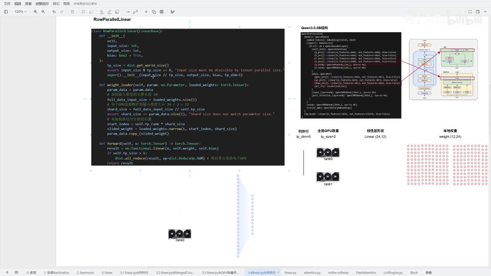
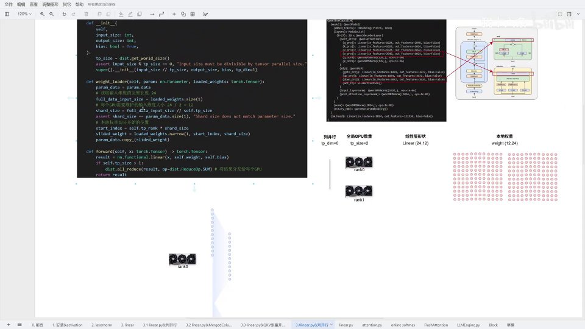
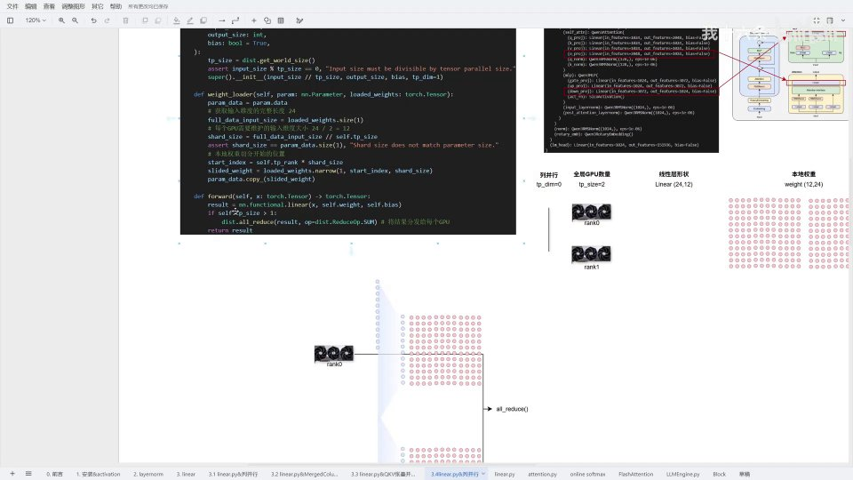
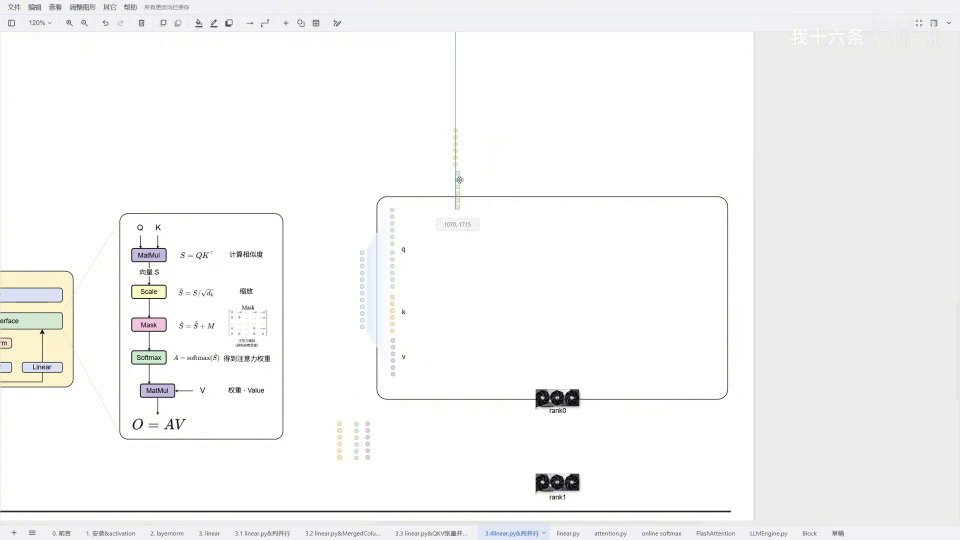
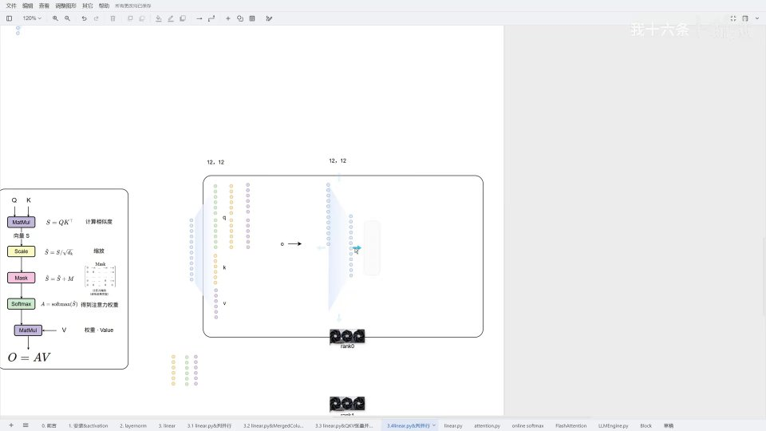
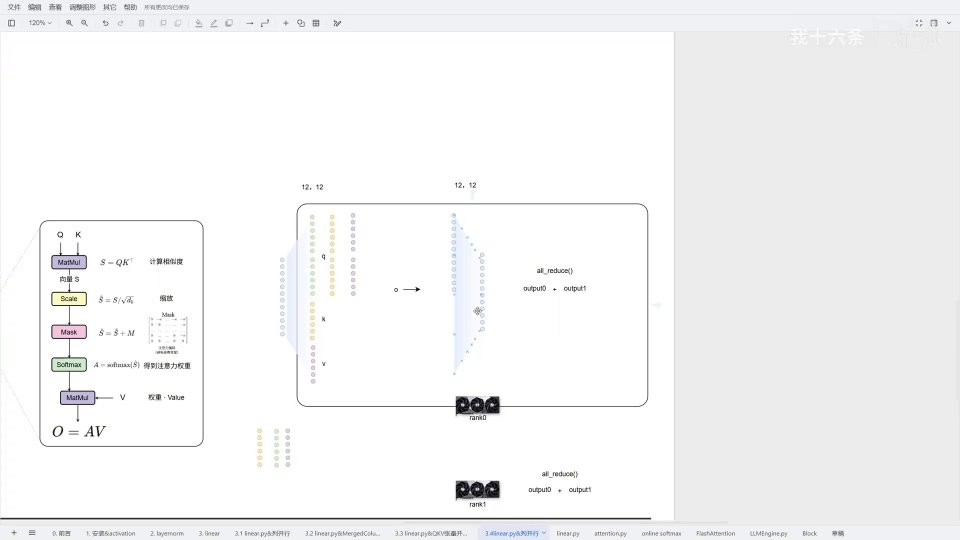

# 第6讲：行并行 —— 把线性层按输入维度切开


## 本讲要解决的核心问题（SCQA）

**背景**：上一讲学了「列并行」（ColumnParallelLinear）——把线性层的输出维度切开，每张 GPU 只算一部分输出。但一个注意力模块里，线性层是一串接一串的：QKV 之后要做 attention，attention 之后还要接一个输出投影 `o_proj`。如果每个线性层都只按列切，中间就会产生大量跨 GPU 的通信。

**冲突**：列并行解决的是「输出怎么分」，但它没法直接说明「下一个线性层的输入怎么接」。因为列并行把输出切开了，下一层拿到的输入就是「残缺」的，必须先把各卡的结果收集（all-gather）起来才能继续算，通信开销很大。

**疑问**：有没有一种切法，能让相邻两个线性层的工作直接接上，少一次跨卡通信？

**回答（中心思想）**：有，这就是**行并行（RowParallelLinear）**。它按**输入维度**把权重切开，每张卡各算一部分乘积，最后用一次 **all-reduce** 把结果相加。它的价值不只是「另一种并行」，而是能和列并行配合：列并行之后直接接行并行，省掉一次 all-gather，只在最后做一次 all-reduce，从而提升通信效率。本讲以 `o_proj` 为例，把行并行的源码、权重加载、具体算例和实际应用讲透。

---

## 一、行并行是什么：沿输入维度切开权重

行并行在 Qwen 0.6B 里主要用在两个地方：

1. `o_proj`：attention 之后那个把潜在状态（latent state）再线性变换一次的层；
2. MLP 里的**上采样**（up 投影）。

[【跳转到 00:00】](https://www.bilibili.com/video/BV1JAFEzPE1F/?t=0)


行并行和列并行都继承自同一个基类 `LinearBase`，所以骨架几乎一样。真正的区别只有一处：**切分发生在哪个维度**。

- 列并行在**输出维度**切分；
- 行并行在**输入维度**切分，也就是在 `LinearBase` 的输入维度上除以 `tp_size`。

### 1.1 为什么代码里看着像在切输出维度？

一个容易被绕晕的点：行并行明明说「切输入」，可看本地权重时又像是切输出。原因在于**权重的存储方向**。权重的形状是「输出维度 × 输入维度」，当我们按输入维度切时，在权重矩阵上表现出来就是按某一维度切一刀。以 `12 → 24` 这种形状为例，代码里 `super().__init__(input_size // tp_size, output_size, bias, tp_dim=1)`：

- 第一个参数是输入维度，被除以 `tp_size`；
- 最后一个参数 `tp_dim=1` 就是用来和列并行（`tp_dim=0`）区分的标记。

[【跳转到 00:15】](https://www.bilibili.com/video/BV1JAFEzPE1F/?t=15)


---

## 二、权重加载：每张卡只维护输入维度的一段

行并行最关键的实现是 `weight_loader`。它要做的事是：把一份完整权重，按当前卡（rank）的位置，切出属于自己的一段。

[【跳转到 00:47】](https://www.bilibili.com/video/BV1JAFEzPE1F/?t=47)

加载逻辑分四步：

1. **取完整输入维度的长度**：`full_data_input_size = loaded_weight.size(1)`。在 `12×24` 的例子里，输入维度的完整长度是 **24**（`size(1)` 取的是第 1 维，即输入维度）。
2. **算出每张卡要维护的大小**：`shard_size = full_data_input_size // tp_size`。以 `tp_size = 2` 为例，`24 ÷ 2 = 12`。接着用一个**断言**检查「本地参数切分后的维度」和「应该维护的维度」是否一致，防止 tp 配置与权重不匹配。
3. **算出本卡切片的起始位置**：`start_index = self.tp_rank * shard_size`。rank0 从第 0 位开始，rank1 从第 12 位开始。
4. **切出并拷贝**：`shard_weight = loaded_weight.narrow(0, start_index, shard_size)`，再 `param.data.copy_(shard_weight)` 写回本地参数。

[【跳转到 00:99】](https://www.bilibili.com/video/BV1JAFEzPE1F/?t=98)



这里的 `narrow(0, start, size)` 表示「在第 0 维上，从 start 开始取 size 个」。因为权重按行切，所以 rank0 拿前半段、rank1 拿后半段。

---

## 三、一个具体算例：24×12 的线性层怎么切

为了看得清楚，UP 主把真实的 `2048×1024` 线性层按比例缩小成 **24×12** 来讲（倍数关系保持一致）。

[【跳转到 02:87】](https://www.bilibili.com/video/BV1JAFEzPE1F/?t=287)



设 `tp_size = 2`：

- 输入维度 24，除以 2 得 **12**；输出维度 12 保持不变；
- 于是每台机器维护的本地权重是 **12×12**，即「输入各管一半、输出完整」；
- rank0 加载输入维度的第 0–11 行，rank1 加载第 12–23 行。

加载完成后，每张卡向前传播时只用到自己那半段输入，各自算出一个 **12** 维的部分输出。

### 3.1 为什么最后要 all-reduce

两张卡各算一半、加起来的和才等于完整线性层的输出。所以在 `forward` 里，做完 `functional.linear` 之后会判断 `if self.tp_size > 1`，再调用：

```python
dist.all_reduce(result, op=dist.ReduceOp.SUM)  # 将结果分发到每个 GPU
```

[【跳转到 03:28】](https://www.bilibili.com/video/BV1JAFEzPE1F/?t=328)



`all_reduce` 把所有卡的结果**相加**，并把加和后的完整结果广播回每张卡。这样每张卡最终都持有完整输出，可以继续往下算。行并行本身就这么简单：切开权重 → 各算一半 → 加和还原。

---

## 四、实际应用：attention 里的「列并行 → 行并行」组合

真正体现行并行价值的，是它在 attention 模块中的位置。一个典型的 attention 结构是：`QKV` 线性层 → attention 内部运算 → `o_proj` 输出投影。

[【跳转到 04:06】](https://www.bilibili.com/video/BV1JAFEzPE1F/?t=406)


### 4.1 QKV 那一步已经做过列并行

QKV 是一个合并的线性层，它先做**列并行**：在 rank0 上，维护的是一个 `12×24` 的权重，其中 12 行分别是 **Q**，另外还有 **K** 和 **V** 的权重。

因为用了 **GQA（Grouped Query Attention，分组查询注意力）**，Q 的头数是 K 的两倍。为了对齐维度，计算时会**把 K 头复制一份**（V 头同理），让 Q、K、V 的头数一致，才能做 `Q × K × V`。

[【跳转到 04:31】](https://www.bilibili.com/video/BV1JAFEzPE1F/?t=431)



### 4.2 为什么这里能直接接行并行

attention 算完得到一个 `O`，接下来要经过 `o_proj`。这里有一个关键的事实：**因为前面已经做过列并行，`O` 在输入维度上本来就是被拆开的**。所以到了 `o_proj` 这里，做行并行时直接用到的就是那个「已经拆过输入维度」的线性层——维度天然对齐。

[【跳转到 05:31】](https://www.bilibili.com/video/BV1JAFEzPE1F/?t=531)



每张卡各算出一半的 output（记作 `output0`、`output1`），最后再做一次 `all_reduce` 把它们相加，得到完整的隐藏状态。

### 4.3 这样设计省了什么

这正是「列并行 + 行并行」组合的精髓。如果每层都用列并行，那么做完列并行后需要一次 **all-gather** 才能把输出拼回完整、喂给下一个线性层。而现在：在同一张 GPU 内，做完列并行后**直接接着做行并行**，就省掉了这一次 all-gather，只需要在整个模块最后做一次 **all-reduce**。通信次数下降，计算效率自然更高。

[【跳转到 07:12】](https://www.bilibili.com/video/BV1JAFEzPE1F/?t=712)


在 MiniVLLM 的 Qwen 代码里，`o_proj` 和 MLP 的下采样都用了行并行；它们内部在前向传播时就做了一次 all-reduce，把所有输出整合完毕。下采样那部分的逻辑与 attention 完全一致。

---

## 五、一个待合并的 TP test

讲到最后，UP 主提到 MiniVLLM 里有一段用于测试张量并行的代码（TP test）。它目前还**没有被审核和合并**，因为它依赖分布式环境，而作者本地暂时没有多卡环境。

[【跳转到 07:88】](https://www.bilibili.com/video/BV1JAFEzPE1F/?t=788)



如果你有单机多卡，可以自己把这段代码粘上跑一跑。它跑完会输出四个结果，分别对应四种矩阵；只要输出满足 `allclose`，就说明「切分前」和「切分后」的计算结果在可控阈值内一致，即验证通过。UP 主预期它之后会被合并，只是目前还没有。

---

## 小结

- **行并行按输入维度切权重**：每张卡各维护一半输入、算出部分输出。
- **加载四步**：取完整输入长度 → 除以 `tp_size` 得 `shard_size` → 按 `tp_rank` 定 `start_index` → `narrow` 切出并拷贝。
- **前向传播的最后一步是 all-reduce**：把各卡的部分结果相加并广播，还原完整输出。
- **`tp_dim` 用来区分列/行并行**：列并行在输出维度切，行并行在输入维度切。
- **与列并行组合是精髓**：列并行之后直接接行并行，省掉一次 all-gather，只在最后做一次 all-reduce，提高通信效率。
- **GQA 需复制 K/V 头**：让 Q、K、V 头数一致，才能正常做注意力运算。

## 关键术语速查

| 术语 | 一句话解释 |
| --- | --- |
| 行并行（RowParallelLinear） | 按**输入维度**切分权重的张量并行方式，各卡算一部分再 all-reduce 相加 |
| 列并行（ColumnParallelLinear） | 按**输出维度**切分的张量并行方式 |
| `all-reduce` | 把所有卡的数据相加，并把结果广播回每张卡的通信操作 |
| `all-gather` | 把所有卡的数据拼接起来、分发到每张卡的通信操作 |
| `tp_size` / `tp_rank` | 张量并行的总卡数 / 当前卡的编号 |
| `shard_size` | 每张卡需要维护的那一段维度大小（这里是输入维度长度 ÷ tp_size） |
| `start_index` | 当前卡切片在这一维上的起始位置 |
| `narrow(dim, start, size)` | 张量切片：在 dim 维上从 start 开始取 size 个 |
| GQA | 分组查询注意力，Q 头数是 K/V 头数的若干倍，需复制 K/V 头对齐 |
| `o_proj` | attention 之后的输出投影线性层 |
