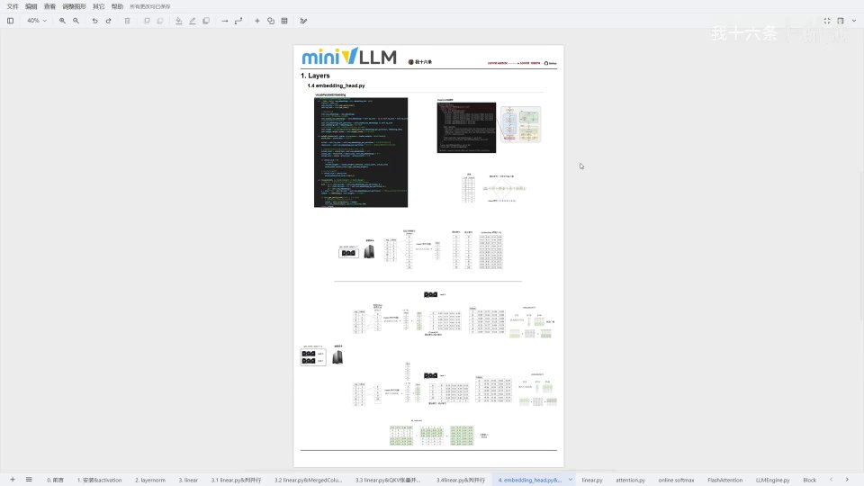
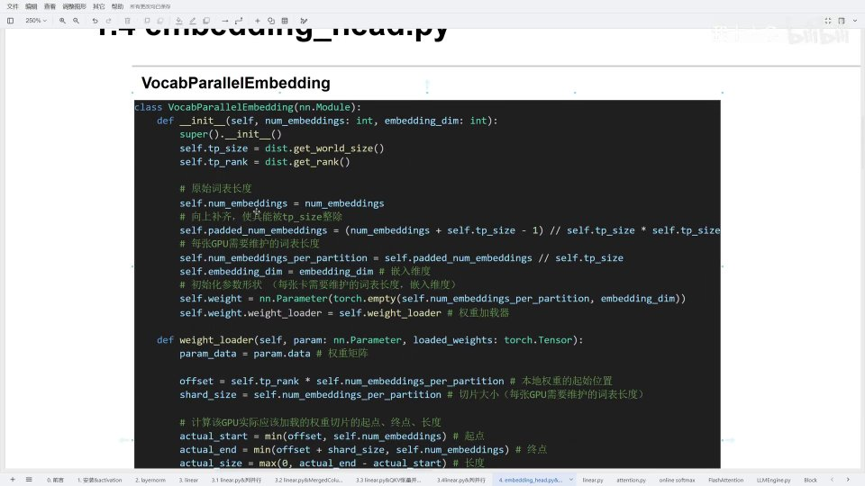
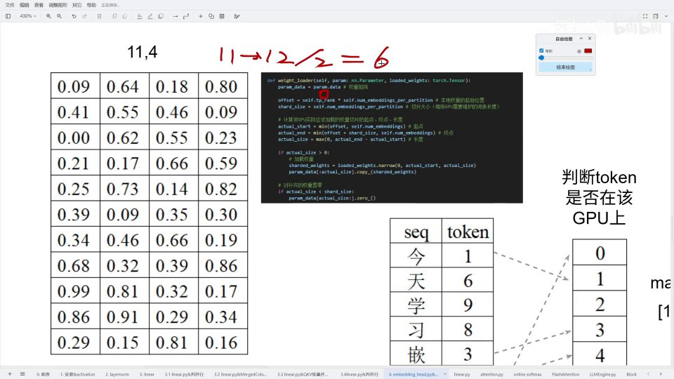
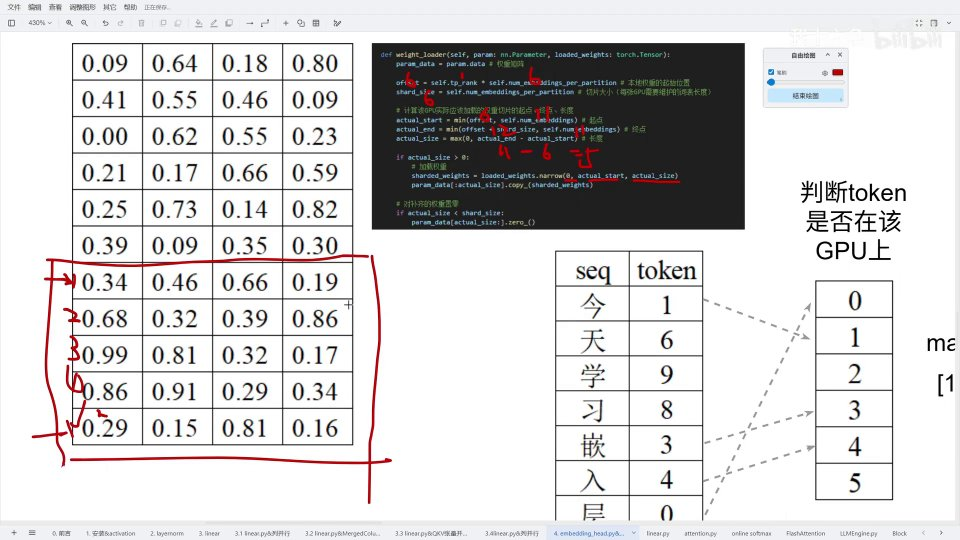
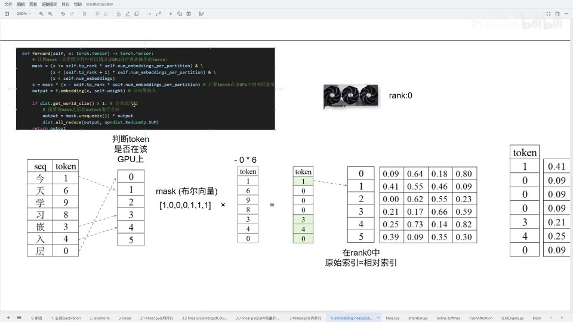
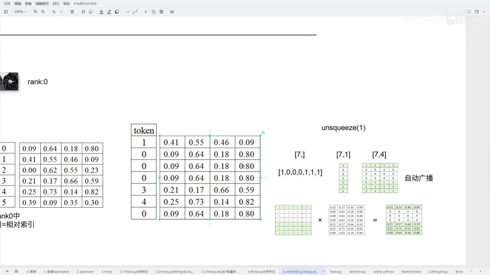

# 第7讲：词表并行嵌入 —— 把十五万词的词表拆到多张卡上



## 本讲要解决的核心问题（SCQA）

**背景**：模型的第一步是**词嵌入（embedding）**——把输入的 token 查表变成一个向量。这个「表」就是词表，Qwen 0.6B 的词表长度有十五万多个，每个 token 对应一条 1024 维的嵌入向量。

**冲突**：词嵌入本质上是一个巨大的参数矩阵。在张量并行（把模型切到多张 GPU）的设定下，如果每张卡都完整存一份十五万行的词表，显存会白白翻倍；而且输入序列里的每个 token 只需要它自己那一行，让每张卡都算全表也是浪费。

**疑问**：能不能像切线性层那样，把词表也切开，让每张卡只维护自己那一部分，输入时按 token 落在哪张卡去查表？

**回答（中心思想）**：可以，这就是 **VocabParallelEmbedding（词表并行嵌入）**。它把词表**按词表长度（行）均分**到各张卡上；每张卡只维护一段词表，前向传播时用 **mask** 筛出「属于自己这段」的 token 去查表，其余位置补零，最后用一次 **all-reduce** 把各卡结果相加，还原出完整的嵌入结果。本讲从源码到完整算例，把初始化、权重加载、前向传播三块讲清楚。

---

## 一、先看结构：它到底在模型里做什么

在 Qwen3 的结构里，embedding 层位于**输入之后**，负责把 token 变成 1024 维的嵌入向量（词向量）。本讲聚焦的词表长度约 **15 万 1000 多**，嵌入维度 **1024**。

[【跳转到 00:00】](https://www.bilibili.com/video/BV1xxcFzbEcb/?t=0)

> 如果对「词表」「词向量」这些基础概念还不清楚，建议先补一下大模型基础知识：**词表**就是「所有可能出现的 token 的清单」，**词向量（嵌入）**就是每个 token 对应的那串稠密数字。

词表并行整段逻辑围绕三个函数展开：`__init__`（初始化与分片）、`weight_loader`（权重加载）、`forward`（前向传播）。

---

## 二、初始化：向上补齐，再按卡均分

`VocabParallelEmbedding` 初始化时接收两个参数：`num_embeddings`（词表长度）和 `embedding_dim`（嵌入维度）。

[【跳转到 00:76】](https://www.bilibili.com/video/BV1xxcFzbEcb/?t=76)

第一步是做**向上补齐**，这一步只为了一个目的：让词表长度能被 `tp_size` 整除。

如果词表长度是 11、`tp_size = 2`，`11 ÷ 2` 除不尽。于是计算 `(num_embeddings + tp_size - 1) // tp_size * tp_size`，也就是 `(11 + 2 - 1) = 12`，补齐到 12，`12 ÷ 2` 就能整除了。

```python
self.padded_num_embeddings = (num_embeddings + self.tp_size - 1) // self.tp_size * self.tp_size
self.num_embeddings_per_partition = self.padded_num_embeddings // self.tp_size
```

[【跳转到 00:94】](https://www.bilibili.com/video/BV1xxcFzbEcb/?t=94)



- `padded_num_embeddings`：补齐后的总词表长度（11 → 12）；
- `num_embeddings_per_partition`：每张卡需要维护的词表长度，等于补齐后长度 ÷ `tp_size`（12 ÷ 2 = 6）。

接着初始化本地权重参数，形状是「每卡维护的词表长度 × 嵌入维度」。比如词表长度 24、`tp_size = 2`、嵌入维度 4，则本地参数形状是 **12 × 4**。

```python
self.weight = nn.Parameter(torch.empty(self.num_embeddings_per_partition, embedding_dim))
self.weight.weight_loader = self.weight_loader
```

[【跳转到 01:44】](https://www.bilibili.com/video/BV1xxcFzbEcb/?t=144)


**为什么要向上补齐？** 因为张量并行要求每一片大小一致。若总长不能被卡数整除，就无法均分。补齐的代价是——多出来的那几行是「假 token」，需要后续补零处理。

---

## 三、权重加载：每张卡只取自己那一段

`weight_loader` 的作用是：从完整的词表权重里，切出属于当前卡（rank）的一段，做本地存储。它涉及四个量：

[【跳转到 01:74】](https://www.bilibili.com/video/BV1xxcFzbEcb/?t=174)

```python
offset = self.tp_rank * self.num_embeddings_per_partition   # 本地权重的起始位置
shard_size = self.num_embeddings_per_partition              # 每卡切片大小
actual_start = min(offset, self.num_embeddings)             # 实际起点
actual_end = min(offset + shard_size, self.num_embeddings)  # 实际终点
actual_size = max(0, actual_end - actual_start)             # 实际长度
```


四个量的含义：

1. **`offset`**：本地权重的起始位置。`tp_rank × 每卡词表长度`。rank0 从第 0 号开始取，rank1 从第 12 号开始取。
2. **`shard_size`**：每张卡需要维护的切片大小（补齐后长度 ÷ `tp_size`）。
3. **`actual_start` / `actual_end`**：因为**实际词表长度可能小于补齐后长度**，切片不能越过真实词表边界，所以用 `min` 把起点、终点都夹到 `num_embeddings` 以内。
4. **`actual_size`**：实际要切的有效长度 = `actual_end - actual_start`。

然后按实际范围切出权重并拷贝：

```python
if actual_size > 0:
    sharded_weights = loaded_weight.narrow(0, actual_start, actual_size)
    param_data[:actual_size].copy_(sharded_weights)
if actual_size < shard_size:
    param_data[actual_size:].zero_()   # 补齐的权重置零
```

[【跳转到 02:99】](https://www.bilibili.com/video/BV1xxcFzbEcb/?t=299)

这里的 `narrow(0, start, size)` 表示沿第 0 维（词表长度这一维）从 `start` 开始取 `size` 个。因为词嵌入不是线性层，本地存储就是按「词表长度 × 嵌入维度」排列，所以它沿的正是**行（词表）维度**。

**补零的意义**：当 `actual_size < shard_size` 时，说明这一段里有一部分是补齐出来的假 token，把它们置零，既避免取值时越界（内存溢出），也保证并行计算的正确性。

[【跳转到 03:49】](https://www.bilibili.com/video/BV1xxcFzbEcb/?t=349)

---

## 四、前向传播：mask 筛选 + 查表 + all-reduce

前向传播要处理的核心问题是：**输入序列里的 token 分布在不同的卡上，每张卡只应该关心落在自己这段词表里的 token。** 这靠一个 mask 完成。

[【跳转到 03:74】](https://www.bilibili.com/video/BV1xxcFzbEcb/?t=374)

```python
mask = (x >= self.tp_rank * self.num_embeddings_per_partition) & \
       (x < (self.tp_rank + 1) * self.num_embeddings_per_partition) & \
       (x < self.num_embeddings)

x = mask * (x - self.tp_rank * self.num_embeddings_per_partition)  # 计算 token 在本卡的相对索引
output = F.embedding(x, self.weight)                               # 查表做词嵌入

if dist.get_world_size() > 1:
    output = mask.unsqueeze(1) * output
    dist.all_reduce(output, op=dist.ReduceOp.SUM)
return output
```


拆开看，mask 的条件是「token 在本卡的词表区间内」：

- `x >= tp_rank × 每卡长度`：落在本卡区间的下界；
- `x < (tp_rank+1) × 每卡长度`：落在本卡区间的上界；
- `x < num_embeddings`：**额外保护**，避免落在补齐出来的「假区间」里。因为最后一张卡维护的词表里有一部分是补位的空行（不是真实嵌入），加上这个条件就不会越界。

[【跳转到 04:24】](https://www.bilibili.com/video/BV1xxcFzbEcb/?t=424)

拿到 mask 后：先 `x - tp_rank × 每卡长度` 把**全局词表索引**换算成**本卡内的相对索引**，再乘 mask 把「不属于本卡」的 token 置零；然后用 `F.embedding` 查表。

**为什么还要再乘一次 mask？** 因为被 mask 置零的位置查出来的是「第 0 行」的嵌入向量，那并不是这些 token 真正该有的值。所以在分布式环境下，把查表结果再乘一次 mask（`mask.unsqueeze(1)` 让它能按行广播），把不属于本卡的行清零，最后 `all_reduce` 求和——各卡各自贡献属于自己那部分的结果，加起来就是完整、正确的嵌入。

[【跳转到 04:90】](https://www.bilibili.com/video/BV1xxcFzbEcb/?t=490)

---

## 五、完整算例：从单卡到双卡

### 5.1 先建立词表与 token 序列

假设有一个长度 11 的词表（索引 0~10），每个词对应一个 token id。原始输入序列是「今天学习嵌入层」，把它转成 token 序列的过程叫 **tokenize**——本质就是查表。

[【跳转到 05:21】](https://www.bilibili.com/video/BV1xxcFzbEcb/?t=521)

![词表与 token 序列：[1, 6, 9, 8, 3, 4, 0]](assets/第07讲_embedding_head.py&嵌入层并行&VocabParallelEmbedding/00521.jpg)

在本例中，序列「今天学习嵌入层」对应 token 序列 **[1, 6, 9, 8, 3, 4, 0]**（共 7 个 token）。

### 5.2 单机单卡：mask 形同虚设

只有一张卡（`get_world_size = 1`）时，所有 token 都在这唯一的卡上，mask 算出来全是 1（true）。于是原始索引就等于相对索引，直接查表即可，得到的是一串完整的嵌入词向量。

[【跳转到 05:79】](https://www.bilibili.com/video/BV1xxcFzbEcb/?t=579)


单卡是最简单的退化情况，真正的重点在双卡。

### 5.3 双卡权重加载：11 补齐成 12，各分 6 行

设 `tp_size = 2`，原始词表 11 行、补到 12，嵌入维度 4，即完整权重形状 11×4（补齐后 12×4），每片 6 行。

**rank0**：

- `offset = 0 × 6 = 0`，`shard_size = 6`；
- `actual_start = min(0, 11) = 0`；
- `actual_end = min(0+6, 11) = 6`；
- `actual_size = 6`。

所以 rank0 从第 0 行开始取 6 行。因为 `actual_size = shard_size`，**不需要补零**。

[【跳转到 07:23】](https://www.bilibili.com/video/BV1xxcFzbEcb/?t=723)



**rank1**：

- `offset = 1 × 6 = 6`，`shard_size = 6`；
- `actual_start = min(6, 11) = 6`；
- `actual_end = min(6+6, 12→夹到 11) = 11`；
- `actual_size = 11 - 6 = 5`。

所以 rank1 从第 6 行开始，只取到第 10 行（5 行有效数据）。因为 `actual_size(5) < shard_size(6)`，**需要补零**——第 6 行（最后一行）用 0 填满。

[【跳转到 08:82】](https://www.bilibili.com/video/BV1xxcFzbEcb/?t=882)



### 5.4 双卡前向传播：以 token 序列 [1, 6, 9, 8, 3, 4, 0] 为例

**rank0** 维护的是 0~5 这一段，所以：

- token 1、3、4、0 落在本卡 → mask 为 1；
- token 6、9、8 不落在本卡 → mask 为 0。

于是 mask = **[1, 0, 0, 0, 1, 1, 1]**。用 mask 乘上「x 减去本卡偏移」，不属于本卡的 token 变为 0，只留下本卡真正要算的 token，再查表。

[【跳转到 09:97】](https://www.bilibili.com/video/BV1xxcFzbEcb/?t=997)


查表得到 rank0 的局部 output：

[【跳转到 10:37】](https://www.bilibili.com/video/BV1xxcFzbEcb/?t=1037)



**广播技巧**：`mask` 原本是一个长度为 7 的向量，`unsqueeze(1)` 后变成 7×1，与 7×4 的 output 相乘时，PyTorch 会自动把它**广播**成 7×4，从而按行筛选。这样就能把「本卡不负责的 token」对应的嵌入行清零，只保留真正属于本卡的部分。

[【跳转到 11:53】](https://www.bilibili.com/video/BV1xxcFzbEcb/?t=1153)



**rank1** 维护的是 6~10 这一段，所以序列里只有 token 6、9、8 落在本卡（对应 mask = [0,1,1,1,0,0,0]），做法与 rank0 完全对称。

最后一步：各卡的结果都只包含自己负责的 token，位置上互补。做一次 **all_reduce 求和**，各卡的有效行拼在一起，就还原出完整的嵌入 tensor——这正是下一层前向传播需要的输入。

[【跳转到 13:13】](https://www.bilibili.com/video/BV1xxcFzbEcb/?t=1313)


---

## 小结

- **词表太大，所以并行**：把词表按「词表长度」均分到各张卡，每卡只维护一段，省显存也省算力。
- **初始化两件事**：向上补齐，让词表长度能被 `tp_size` 整除；算出每卡维护的词表长度。
- **权重加载四步**：算 `offset` → `shard_size` → 夹出 `actual_start/actual_end/actual_size` → `narrow` 切出并拷贝，不足部分补零。
- **补齐的假 token 要补零**：既防越界，又保证并行计算正确。
- **前向传播三步**：用 mask 筛出本卡 token → 换算相对索引后查表 → 再乘一次 mask 清零无关行，最后 all-reduce 求和。
- **两次 mask 各有用处**：第一次用于计算 token 在本卡的相对索引，第二次用于把查表结果里「不属于本卡」的行清零。
- **单卡是退化情况**：mask 全为 true，原始索引 = 相对索引，直接查表即可。

## 关键术语速查

| 术语 | 一句话解释 |
| --- | --- |
| VocabParallelEmbedding | 把词表按长度均分到多张卡的并行嵌入层 |
| num_embeddings | 词表长度（有多少个 token） |
| embedding_dim | 嵌入维度，每个 token 对应的向量长度 |
| padded_num_embeddings | 向上补齐后、能被 tp_size 整除的词表长度 |
| num_embeddings_per_partition | 每张卡维护的词表长度 |
| shard_size | 每张卡切片的理论大小 |
| offset | 本地权重切片的起始位置（`tp_rank × 每卡长度`） |
| actual_start / actual_end / actual_size | 夹到真实词表边界后的有效起点、终点、长度 |
| tokenize | 把文本转成 token 序列的过程，本质是查表 |
| mask | 布尔向量，标记哪些 token 属于本卡 |
| unsqueeze + 广播 | 把向量变形成 7×1，与 7×4 张量相乘时自动按行广播 |
| all_reduce | 各卡结果相加并广播，这里用来还原完整嵌入 |
