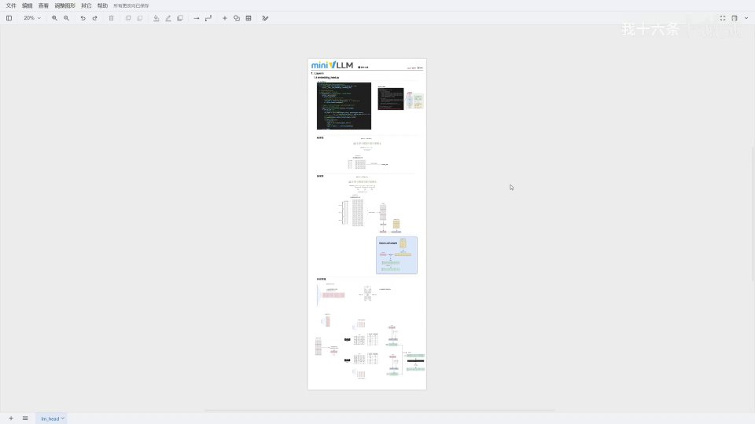
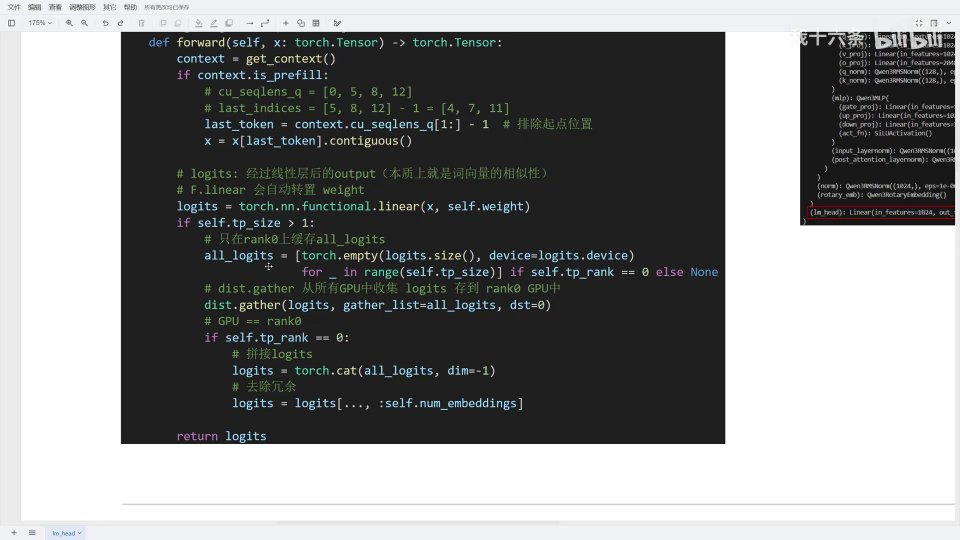
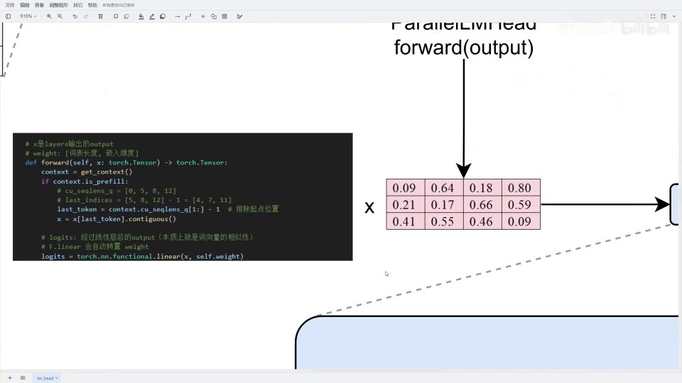
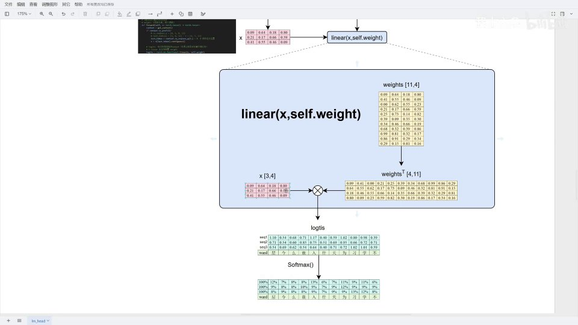
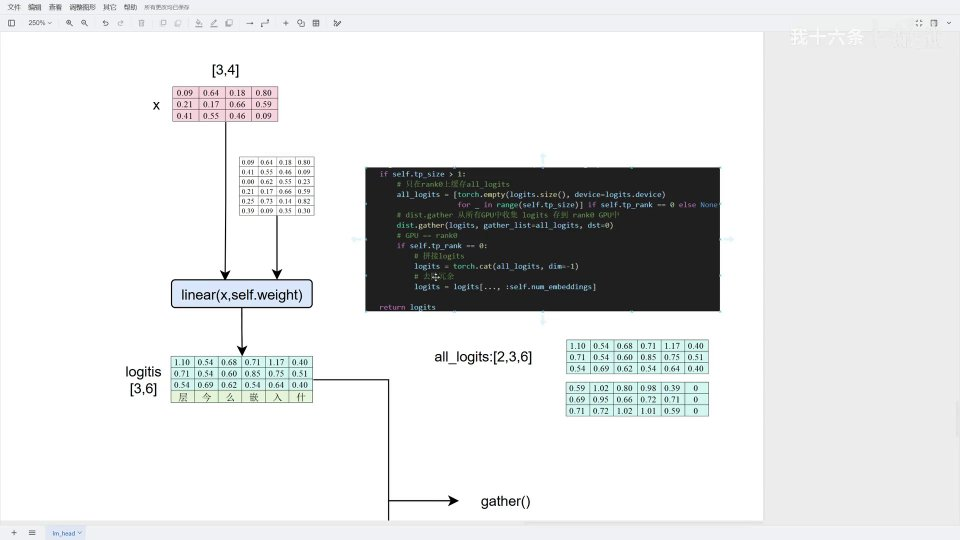
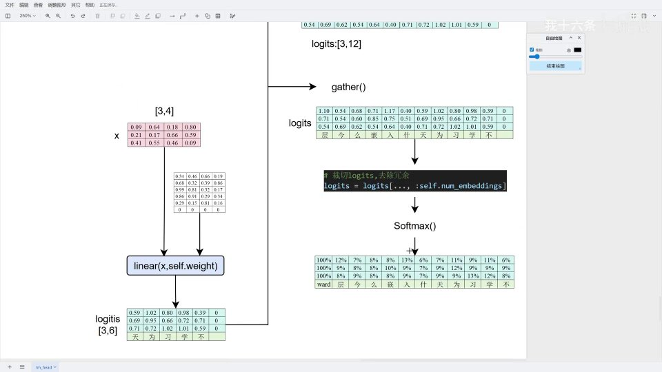

# 第8讲：lm_head —— 用词表权重做一次「语义相似度查询」



## 本讲要解决的核心问题（SCQA）

**背景**：模型一层层算完之后，会输出每个位置的一个隐藏状态（hidden state）。但我们要的是「下一个词是什么」，而隐藏状态本身不是词。

**冲突**：隐藏状态只是一个 1024 维的向量，它和「十五万个候选词」之间没有直接对应关系。怎么把这个向量翻译成「每个词有多大概率被选中」？

**疑问**：既然词表里每个 token 都有一个嵌入向量，那能不能拿隐藏状态去和词表中所有 token 的向量比一比，看它最像谁？

**回答（中心思想）**：这正是 **lm_head（语言模型头）** 做的事——它拿词表的权重当矩阵，对隐藏状态做一次线性变换，得到的 logits 就是「隐藏状态与每个 token 的相似度」。相似度越高，这个词被选中的概率越大。当它要做张量并行时，本质上是一次**列并行**：每张卡只算一部分词表的 logits，最后 gather 到 rank0 拼接、**去冗余**、再 softmax。本讲把它的源码、预填充/解码的差异，以及单/多序列、单卡/双卡的算例讲清楚。

---

## 一、lm_head 是什么：模型输出之后的「最后一次查询」

lm_head 在原本的模型结构中并不单独体现，因为它是模型输出一个 output **之后**才做的计算。它的作用可以理解为一次**语义相似度查询**：

- 输入：模型算出的每个 token 的 hidden state（代码里就是 `x`，即 layers 输出的 output）；
- 权重：词表的嵌入权重（形状是「词表长度 × 嵌入维度」）；
- 输出：logits——隐藏状态与词表里每个 token 的相似度。

所谓 logits，在直觉上就是「这个位置最像词表里的哪个词」。相似度越高，这个词的概率越大。

[【跳转到 00:00】](https://www.bilibili.com/video/BV1GWcbzWE1x/?t=0)

---

## 二、源码结构：继承自 VocabParallelEmbedding

`ParallelLMHead` 直接继承自上一章的 `VocabParallelEmbedding`：

```python
class ParallelLMHead(VocabParallelEmbedding):
    def __init__(self, num_embeddings, embedding_dim):
        super().__init__(num_embeddings, embedding_dim)
```

因此它的 **权重加载逻辑和词表并行嵌入完全一致**（见上一讲），本讲只需关注前向传播。

[【跳转到 00:67】](https://www.bilibili.com/video/BV1GWcbzWE1x/?t=67)


[【跳转到 01:66】](https://www.bilibili.com/video/BV1GWcbzWE1x/?t=166)


---

## 三、前向传播：先取 last token，再算 logits

前向传播接收一个 `x`（就是模型 output），然后分预填充、并行两条逻辑处理。

### 3.1 预填充阶段：为什么要取 last token

在预填充（prefill）阶段，输入是**多个序列拼接**而成的一个长序列。但 transformer 是自回归的，用 mask 让每个位置只能看到自己和之前的 token，所以模型自己并不知道「输入里有几个序列、每个序列从哪开始」。

为了让模型能按序列处理，代码用 `context.cu_seqlens_q`（累积序列长度，即 `q_seq_len`）记录每个序列的起始位置。例如：

```
cu_seqlens_q = [0, 5, 8, 12]
```

表示 `0~5` 是第一个序列、`5~8` 是第二个、`8~12` 是第三个，共三个序列。

预填充时我们**只需要每个序列最后一个 token 的 output**，所以代码这样取 last token：

```python
if context.is_prefill:
    last_indices = context.cu_seqlens_q[1:] - 1   # 排除起点位置后减一
    last_token = context.cu_seqlens_q   # 取每个序列的最后一个 token
    x = x[last_token].contiguous()      # 在内存中连续化
```

- `cu_seqlens_q[1:]` 得到 `[5, 8, 12]`（去掉第一个 0），每个都是「下一个序列的开头」；
- 减一得到 `[4, 7, 11]`——正好是三个序列各自的最后一个 token；
- `.contiguous()` 把分散的 last token 在内存里排成连续的一块。

[【跳转到 01:11】](https://www.bilibili.com/video/BV1GWcbzWE1x/?t=111)

### 3.2 算 logits：一个线性层 + 自动转置

拿到 last token 的 X 之后，直接用线性层算 logits：

```python
logits = torch.nn.functional.linear(x, self.weight)
```

`F.linear` 内部会**自动对权重做转置**，所以这里传进去的 `self.weight` 就是「词表长度 × 嵌入维度」的原始布局。

[【跳转到 02:15】](https://www.bilibili.com/video/BV1GWcbzWE1x/?t=215)

### 3.3 并行分支：gather + 拼接 + 去冗余

当 `tp_size > 1` 时，每张卡只算出了**部分词表**的 logits，需要合并：

```python
if self.tp_size > 1:
    # 只在 rank0 上缓存所有 logits
    all_logits = [torch.empty(logits.size(), device=logits.device)
                  for _ in range(self.tp_size)] if self.tp_rank == 0 else None
    dist.gather(logits, gather_list=all_logits, dst=0)  # 所有 GPU 收集 logits 到 rank0
    if self.tp_rank == 0:
        logits = torch.cat(all_logits, dim=-1)   # 沿最后一维拼接
        logits = logits[..., :self.num_embeddings]  # 去除冗余
```

三点值得强调：

1. **gather ≠ all_gather**：all_gather 是每张卡都存一份聚合结果，而这里的 `gather` 只在指定的 `dst=0`（rank0）上聚合。
2. **拼接**：把所有卡的部分 logits 沿最后一维（词表维度）拼成完整词表。若 `tp_size = 2` 且每卡形式是 `3×6`，拼起来就是 `3×12`。
3. **去冗余**：因为词表长度可能不能被卡数整除（上一讲的补零），拼接后会多出几个补位的「假词」。用 `logits[..., :num_embeddings]` 只保留真实的词表长度（如只取前 11 个），把补零部分丢掉。

[【跳转到 02:35】](https://www.bilibili.com/video/BV1GWcbzWE1x/?t=235)



### 3.4 解码阶段：更简单

预填充处理的是「多个序列、只取 last token」；而**解码（decode）阶段每次只传入一个 token**，所以：

- 不需要取 last token，直接算 logits；
- 得到的就是这一个 token 的 logits 和 softmax 概率，然后进入采样。

[【跳转到 06:71】](https://www.bilibili.com/video/BV1GWcbzWE1x/?t=671)

---

## 四、单序列算例：cu_seqlens = [0, 7]

原始序列是「今天学习嵌入层」，token 序列为 `[1, 6, 9, 8, 3, 4, 0]`。

- `cu_seqlens_q = [0, 7]`：只有一个序列，从 0 开始，到 7 结束；
- last token 就是 `7 - 1 = 6`，即第 6 个 token。

[【跳转到 03:67】](https://www.bilibili.com/video/BV1GWcbzWE1x/?t=367)

![单序列：cu_seqlens=[0,7]](assets/第08讲_embedding_head.py&lm_head&词表列并行/00367.jpg)

token 经词嵌入得到一个嵌入矩阵，做前向传播（`model.forward`）得到 output；这个 output 再进入 lm_head。

[【跳转到 03:91】](https://www.bilibili.com/video/BV1GWcbzWE1x/?t=391)


---

## 五、多序列算例：cu_seqlens = [0, 7, 14, 21]

若同样一个序列「今天学习嵌入层」重复三次，在序列长度允许时会被拼成**一个长序列**，token 序列变成原来的三倍。

[【跳转到 04:56】](https://www.bilibili.com/video/BV1GWcbzWE1x/?t=456)

![多序列：三个序列拼成长序列，cu_seqlens=[0,7,14,21]](assets/第08讲_embedding_head.py&lm_head&词表列并行/00456.jpg)

- `cu_seqlens_q = [0, 7, 14, 21]`：
  - 第一个序列：0 开始，7 结束（位置 0~6）；
  - 第二个序列：7 开始，14 结束（位置 7~13）；
  - 第三个序列：14 开始，21 结束（位置 14~20）。

此时 last token 取的是每个序列的最后一个，分别对应位置 6、13、20 这三个 token，把它们连续化得到 X（形状 `3×4`，因为有 3 个序列）。

[【跳转到 05:61】](https://www.bilibili.com/video/BV1GWcbzWE1x/?t=561)



### 5.1 单机单卡：完整的线性变换

单卡时权重不切分，是一块完整的矩阵。线性层内部：X 形状不变，权重被转置，然后矩阵乘得到 logits。

[【跳转到 06:14】](https://www.bilibili.com/video/BV1GWcbzWE1x/?t=614)


得到的 logits 就是相似度，例如某个词拿到最高的 1.17，说明隐藏状态最像它。再做 softmax，就得到每个词的输出概率（如 13%）。

[【跳转到 06:27】](https://www.bilibili.com/video/BV1GWcbzWE1x/?t=627)



> softmax 之后的概率怎么变成最终选出的词，取决于采样策略（温度、top-k 等），后续再讲。

---

## 六、并行环境：lm_head 的本质是列并行

在张量并行下，词表被拆到各张卡上。因为权重存储是「输出维度 × 输入维度」，而词表对应输出维度，所以 lm_head 的并行**本质上是列并行**——沿着词表维度裁剪。每张卡只维护一部分词表。

[【跳转到 07:93】](https://www.bilibili.com/video/BV1GWcbzWE1x/?t=793)


以词表长度 11、嵌入维度 4、双卡为例：

- 11 不能被 2 整除 → 向上补齐为 12（补的那个 0 是冗余）；
- rank0 维护上半部分 6 行（其中最后一行是冗余），rank1 维护下半部分 6 行（其中真实只有 5 行，末行冗余）。

前向传播时，X 不被拆分，每张卡用自己的那半词表算出**部分 logits**。以三个序列为例，X 是 `3×4`：

[【跳转到 08:43】](https://www.bilibili.com/video/BV1GWcbzWE1x/?t=843)


### 6.1 gather 与去冗余

两张卡各输出一部分 logits，需要合并：rank0 上准备一个 `all_logits` 列表，用 `dist.gather(dst=0)` 把各卡结果收集过来，形成一个 `2×3×6` 的 tensor。

[【跳转到 09:35】](https://www.bilibili.com/video/BV1GWcbzWE1x/?t=935)



然后沿最后一维拼接成 `3×12`，再用 `logits[..., :11]` 去掉补位的那一列（去冗余），得到真实的 `3×11`，最后 softmax、采样。

[【跳转到 09:74】](https://www.bilibili.com/video/BV1GWcbzWE1x/?t=974)



**解码阶段同理，只是更简单**：只有一个 X（一行），算出 logits、拼接、去冗余即可。

---

## 小结

- **lm_head 是模型输出之后的最后一步**：用词表权重对 hidden state 做一次「语义相似度查询」，产出 logits。
- **它继承自 VocabParallelEmbedding**：权重加载逻辑与词表并行嵌入完全一致。
- **预填充要取 last token**：用 `cu_seqlens_q[1:] - 1` 找出每个序列的最后一个位置，因为只有它需要预测下一个词。
- **`cu_seqlens_q` 记录每个序列的起始位置**：解决「transformer 不知道输入里有多少个序列」的问题。
- **logits 由 `F.linear(x, weight)` 得到**：内部会自动转置权重。
- **并行时 lm_head 就是列并行**：每张卡算部分词表的 logits。
- **合并三步**：`gather`（只在 rank0 聚合）→ `cat`（沿词表维拼接）→ 去冗余（丢掉补齐的假词），最后 softmax 采样。
- **解码阶段更简单**：一次只有一个 token，无需取 last token。

## 关键术语速查

| 术语 | 一句话解释 |
| --- | --- |
| lm_head（ParallelLMHead） | 模型输出后的语言模型头，把隐藏状态映射成词表上的 logits |
| logits | 隐藏状态与每个 token 的「相似度」打分，softmax 前未归一化 |
| hidden state | 模型每一层算出的隐藏状态向量，lm_head 的输入 |
| cu_seqlens_q | 累积序列长度，记录预填充中每个序列的起止位置 |
| last token | 预填充时每个序列的最后一个 token，只有它需要预测下一个词 |
| gather / all_gather | 把各卡数据聚合到指定卡（rank0）/ 聚合到每一张卡 |
| 去冗余 | 丢掉词表补齐产生的假 token（多余列），只保留真实词表长度 |
| prefill / decode | 预填充阶段（多序列、并行计算）/ 解码阶段（单 token、逐词生成） |
| 采样策略 | 由 logits/概率决定最终输出的词，如温度、top-k |
