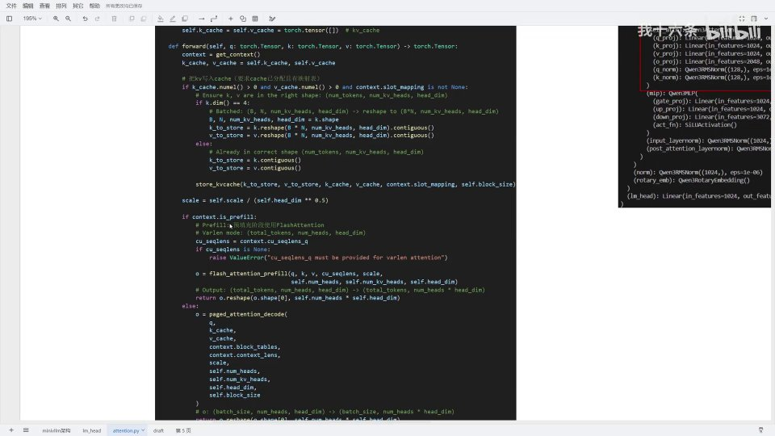
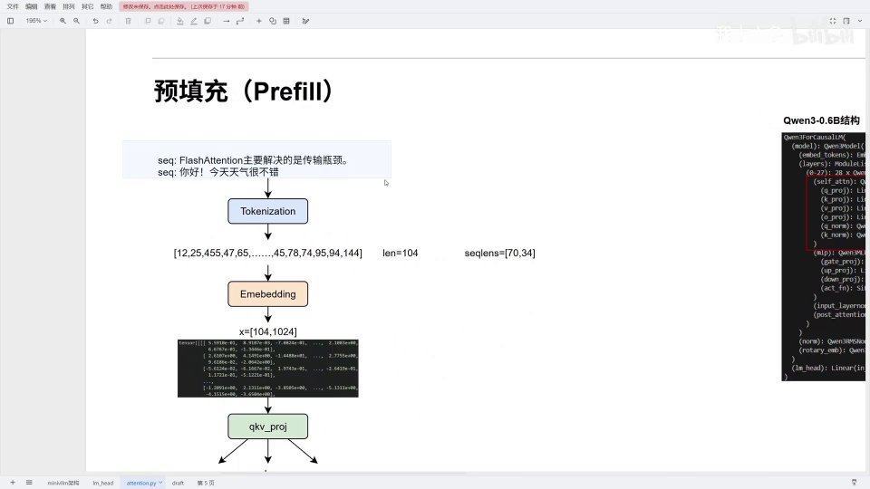
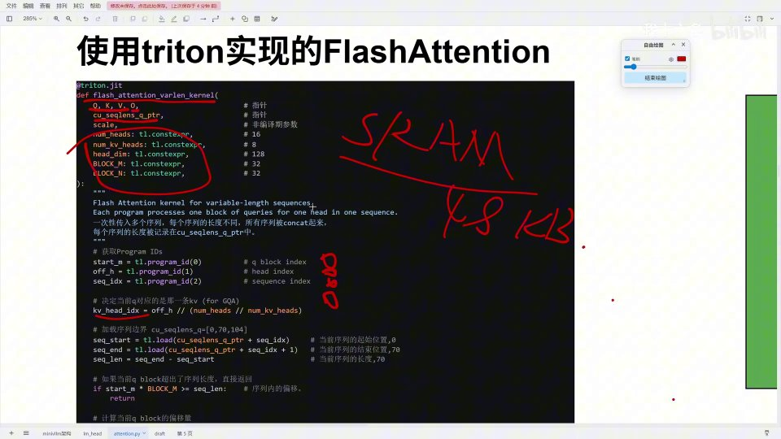

# 第9.1讲：Prefill 阶段的显存分配与 FlashAttention 的 Triton 网格



## 本讲要解决的核心问题（SCQA）

**背景**：模型推理的第一步是**预填充（Prefill）**——把用户输入的整段 prompt 一次性算完，生成第一批 KV cache。Attention 是这一步里最重的计算，而现代推理引擎都用 **FlashAttention** 来实现它。

**冲突**：FlashAttention 的代码不像普通 PyTorch 那样一行行「矩阵乘 → softmax → 矩阵乘」，而是一个用 **Triton** 写的融合 kernel。想读懂它，必须先弄清楚两件事：这么多 Q、K、V 存在显存的什么地方？GPU 又是用什么规则把一个大 attention 拆成很多小任务、分给各个计算单元去跑的？

**疑问**：在预填充阶段，显存是怎么划分给模型权重和 KV cache 的？FlashAttention 为什么要把计算分块？Triton 里的 grid 又是怎么把一个可变长、多序列的 attention 任务铺到 GPU 上的？

**回答（中心思想）**：本讲分三层讲清楚——**显存分配**（模型权重占一块，剩余空间给 KV cache，并按 `[2, 28, 73, 256, 8, 128]` 的结构组织）、**FlashAttention 的分块动机**（GPU 上 HBM 大而慢、SRAM 快而小，分块是为了减少 HBM↔SRAM 的搬运、把算子融合起来）、**Triton 的 grid 划分**（把 attention 拆成「Q 块 × 头 × 序列」共 96 个任务，每个任务只加载自己那部分数据到 48KB 的 SRAM 里算）。理解这三层，才能看懂后面 kernel 里的 `program_id`。

---

## 一、attention 的代码结构与两个阶段

`attention.py` 的前向传播内部其实分成两个阶段：

[【跳转到 00:25】](https://www.bilibili.com/video/BV1CNDgB4EYy/?t=25)

```python
def forward(self, q, k, v):
    context = get_context()
    k_cache, v_cache = self.k_cache, self.v_cache

    # KV cache 相关处理
    if self.k_cache.numel() and self.v_cache.numel() and ...:
        ...
        store_kvcache(k, v, k_cache, v_cache, context.slot_mapping, self.block_size)

    scale = self.scale / (self.head_dim ** 0.5)

    if context.is_prefill:
        # 预填充：使用 FlashAttention
        cu_seqlens = context.cu_seqlens_q
        o = flash_attention_prefill(q, k, v, cu_seqlens, scale, ...)
        return o.reshape(...)
    else:
        # 解码：使用 PagedAttention
        o = paged_attention_decode(...)
        return o
```

- **初始化 / KV cache 配置**：这里如果有 KV cache，会先把 K、V 写入 KV cache（`store_kvcache`），这块内容后续章节再讲；
- **`if context.is_prefill`**：今天的重点——预填充阶段的 `flash_attention_prefill`；
- **`else` 分支**：解码阶段的 `paged_attention_decode`，也是之后的内容。

别看 FlashAttention 预填充只有一行调用，要讲明白需要很大篇幅。

在 Qwen3-0.6B 里，一层 attention 的结构是：input → QKV 线性变换 → RMSNorm → attention 计算 → output 线性变换。对应四个线性层 Q、K、V、O，再加 Q norm。今天聚焦**预填充阶段 QKV 的计算**，以及 QKV 怎么在显存中做 FlashAttention。

---

## 二、显存分配：模型权重与 KV cache 各占多少

在具体运算前，引擎要先把模型装配到显存中，用剩余空间做 KV cache。

[【跳转到 01:21】](https://www.bilibili.com/video/BV1CNDgB4EYy/?t=121)


### 2.1 模型权重占多少

Qwen3-0.6B 是 float32、未量化，一个参数占 **4 字节**。0.6B 表示 10 亿个参数的 0.6 倍：

```
0.6 × 1,000,000,000 × 4 / 1024 / 1024 / 1024 ≈ 2.23 GB
```

所以加载模型后，显存里大约 2.23GB 被权重占用（图中粉色区域）。

### 2.2 KV cache 占多少

剩下的空间用于 KV cache 和其它预留。假设我们给 KV cache 预留 **4GB**，那这块 4GB 能放下多少个「块」？先算**一个 KV cache 块**的大小：

```
2 × 28 × 256 × 8 × 128 × 4 字节
```

逐项含义：

| 因子 | 含义 |
| --- | --- |
| 2 | K 和 V 各一份 |
| 28 | Qwen3-0.6B 有 28 个 attention 层（每层都要存 KV cache） |
| 256 | 每个块存 256 个 token 的 KV |
| 8 | KV head 的数量 |
| 128 | 每个 KV head 的维度（原本 1024 维分给 8 个头） |
| 4 | float32 的字节数 |

用 4GB 除以单块大小，得到：

```
4 × 1024³ / (2 × 28 × 256 × 8 × 128 × 4) ≈ 73 个块
```

也就是全局能维护 **73 个 KV cache 块**。

> 注：256 的块大小是 MiniVLLM 的默认值。实际中一般不会分配这么大的块，因为**块越大，前缀缓存越难命中**——做前缀缓存时，块越大，两个请求越难恰好共享同一整块。

---

## 三、KV cache 的形状与内存布局

所有 KV cache 的整体形状是：

```
all_kv_cache.shape = [2, 28, 73, 256, 8, 128]
```

[【跳转到 03:24】](https://www.bilibili.com/video/BV1CNDgB4EYy/?t=324)

![KV cache 形状：[2, 28, 73, 256, 8, 128]](assets/第09.1讲_推理过程中Prefill阶段的GPU显存分配&Triton网格划分逻辑/00324.jpg)

理解这块内存有两种视角（都只是帮助理解的逻辑模型）：

**视角一：先分 K/V，再分层**
把 4GB 一分为二，上半存 K、下半存 V；每一半再切成 28 块，每块对应一个 layer。于是 layer0 里就有 73 个块，每块存 256 个 KV，每个 KV 有 8 个头、每头 128 维。

**视角二：先分块，把「层」嵌进 token**
把整个内存直接分成 73 个块，每块维护 256 个 token，每个 token 的形状是 `[2, 28, 8, 128]`——相当于把层嵌进 token 里。而视角一是把 token 嵌进层里。

[【跳转到 03:59】](https://www.bilibili.com/video/BV1CNDgB4EYy/?t=359)


建议自己动手把这块内存画一遍，对理解后面的代码帮助很大。

---

## 四、进入 Prefill：一个双序列的例子

假设有两个句子（两个 sequence），tokenize 并嵌入后总长度是 **104** 个 token，`seqlen = [70, 34]`：前 70 个 token 属于 sequence1，后 34 个属于 sequence2。

[【跳转到 04:53】](https://www.bilibili.com/video/BV1CNDgB4EYy/?t=453)



流程是：

1. **Tokenization**：得到 token id 序列，长度 104；
2. **Embedding**：得到 `X = [104, 1024]`；
3. **qkv_proj**：经过 QKV 线性层，分出 **Q、K、V**：

[【跳转到 04:87】](https://www.bilibili.com/video/BV1CNDgB4EYy/?t=487)


- Q：`[104, 16, 128]`（16 个 Q 头，每头 128 维）
- K：`[104, 8, 128]`（8 个 KV 头）
- V：`[104, 8, 128]`

为什么 Q 是 16 个头、KV 是 8 个头？因为 Qwen3 用了 **GQA（分组查询注意力）**：每两个 Q 头共享一个 KV 头，把 Q 头数设为 KV 头数的两倍，从而提高存储和计算效率。原本的多头注意力里 Q 头和 KV 头一一对应（16 个 Q 就 16 个 KV），GQA 则分组合并。

进入 `flash_attention_prefill` 之前，还会做一些准备：让 QKV 在内存中连续（contiguous），并新建一个形状与 Q 一致的 output；第一次运行（预热阶段）时 KV cache 为空，`store_kvcache` 那一步会直接跳过。

此时的参数：`cu_seqlens = [0, 70, 104]`（0 是 seq1 起点、70 是 seq2 起点、104 是最后结束位置），scale 用于缩放，`num_heads = 16`、`num_kv_heads = 8`、`head_dim = 128`。

---

## 五、FlashAttention 为什么快：访存瓶颈与分块

要理解 FlashAttention，先看 GPU 的内存层次。

[【跳转到 06:74】](https://www.bilibili.com/video/BV1CNDgB4EYy/?t=674)


计算单元的存储分三层，越往上越快、越小、越贵：

| 层级 | 容量 | 带宽 |
| --- | --- | --- |
| GPU SRAM（共享内存） | 约 20MB | 约 19 TB/s |
| GPU HBM（显存） | 约 40GB | 约 1.5 TB/s |
| CPU DRAM | >1TB | 约 12.8 GB/s |

Attention 是**计算密集型**：QK、softmax、AV 等操作很快，但数据要在 HBM 和 SRAM 之间来回搬运。此时瓶颈往往不是算力，而是要**等数据搬运**，导致显卡利用率不高。

FlashAttention 的解法是**分块（tiling）**：把 Q、K、V 切成块，**一次把一块加载进 SRAM，在 SRAM 里一口气把整段 attention 算完**，再把结果写回 HBM。这样：

- 数据只搬一次，减少了 HBM↔SRAM 的往返；
- 原本「矩阵乘 → mask → softmax → 矩阵乘」多个算子，被**融合成一个 kernel**。

[【跳转到 07:24】](https://www.bilibili.com/video/BV1CNDgB4EYy/?t=724)

具体就是：搬一小块 Q（比如 32 个 token、一个头）进 SRAM，然后遍历所有 K、V 块，算完这一小块 Q 对应的输出 O；外循环遍历 Q，内循环遍历 K、V。因为有因果 mask，第 i 个 Q 块只需遍历它自己和之前的 KV 块。

---

## 六、block_M / block_N：用 48KB SRAM 反推块大小

块的大小 `block_M`、`block_N` 不是随便定的，而是根据 SRAM 容量**反推**出来的。

[【跳转到 08:50】](https://www.bilibili.com/video/BV1CNDgB4EYy/?t=850)


通常三系、四系显卡的 SRAM 只有 **48KB**。attention 算子需要同时放下 Q 和 K（算 QK）、Q 还要常驻，所以占用主要是：

- `block_M × block_N × 4` 字节：QK 结果（注意力分数矩阵）；
- `block_M × head_dim × 4 × 2` 字节：常驻的 Q 和读入的 K。

以内核里的注释和示例：`block_M = 32`、`block_N = 32`、`head_dim = 128`：

```
32 × 32 × 4              = 4096
32 × 128 × 4 × 2         = 32768
合计 ≈ 36864 字节 ≈ 36KB
```

36KB < 48KB，裕量留给一些中间变量。这是一个**非常保守**的估算，目的就是保证不会溢出（避免 OOM on shared memory）。代码里会根据显存/显卡代数选择 `BLOCK_M`、`BLOCK_N`（例如 32/32，或更小的 16/16）。

---

## 七、Triton 的 grid：把 attention 铺成 96 个任务

Triton 的 `grid` 概念：**不管底层有多少计算资源，先起一个 grid 声明任务总数，具体怎么调度由 GPU 决定**。

[【跳转到 10:82】](https://www.bilibili.com/video/BV1CNDgB4EYy/?t=1082)


```python
num_seqs = cu_seqlens.shape[0] - 1           # 序列数 = 3-1 = 2
max_seq_len = (cu_seqlens[1:] - cu_seqlens[:-1]).max().item()  # 最长序列 = 70
grid = (triton.cdiv(max_seq_len, BLOCK_M), num_heads, num_seqs)  # (3, 16, 2)
```

这里的三个维度对应：

- **3** = `ceil(max_seq_len / BLOCK_M) = ceil(70 / 32) = 3`：最长序列按 32 一块分成 3 块；
- **16** = Q 的头数；
- **2** = 序列数。

`3 × 16 × 2 = 96` 个任务。为什么用**最长序列**来分？因为块大小固定，必须让最长序列也能装下；较短序列（34）自然能用整数块覆盖，最后一块可能装不满。

[【跳转到 12:72】](https://www.bilibili.com/video/BV1CNDgB4EYy/?t=1272)

![grid[3,16,2] 的拖铺：上半是序列1，下半是序列2](assets/第09.1讲_推理过程中Prefill阶段的GPU显存分配&Triton网格划分逻辑/01272.jpg)

把它可视化：上半部分对应序列1（长 70），下半部分对应序列2（长 34）。每个格子代表「某序列的一段 token × 某一个头」。序列1 分满 3 块，最后一块只有 6 个 token（70 不是 32 的整数倍），所以颜色浅；序列2 前三块中最后一块只有 2 个 token，更浅；再往后的格子是「白块」——超出序列长度、没有计算任务，但 kernel 仍会被拉起。

[【跳转到 13:47】](https://www.bilibili.com/video/BV1CNDgB4EYy/?t=1347)


---

## 八、kernel 内部：program_id 与 GQA 头映射

进入 `flash_attention_varlen_kernel` 后，关键前提是：**QKV 都以指针的形式传入**，它们本身在 HBM 里，kernel 只读取自己那一部分进 SRAM。

[【跳转到 17:60】](https://www.bilibili.com/video/BV1CNDgB4EYy/?t=1760)



```python
start_m = tl.program_id(0)   # q block index：第几个 Q 块
off_h   = tl.program_id(1)   # head index：第几个头
seq_idx = tl.program_id(2)   # sequence index：第几个序列

# GQA：决定当前 Q 对应哪一条 KV
kv_head_idx = off_h // (num_heads // num_kv_heads)
```

三个 `program_id` 分别从 grid 的三个维度取坐标，定位当前任务处理的是「哪一段 Q、哪个头、哪个序列」。然后：

```python
seq_start = tl.load(cu_seqlens_q_ptr + seq_idx)
seq_end   = tl.load(cu_seqlens_q_ptr + seq_idx + 1)
seq_len   = seq_end - seq_start

if start_m * BLOCK_M > seq_len:   # 该块超出序列长度
    return                        # 直接返回（对应白块）
```

[【跳转到 16:20】](https://www.bilibili.com/video/BV1CNDgB4EYy/?t=1620)


关于 **GQA 映射**：`num_heads // num_kv_heads = 16 // 8 = 2`，所以 `kv_head_idx = off_h // 2`。即第 0、1 个 Q 头都对应第 0 个 KV 头，第 2、3 个 Q 头对应第 1 个 KV 头……第 15 个 Q 头对应最后一个 KV 头。

后面还会用 `offs_m`、`offs_d` 计算 Q 的偏移、加载 Q 块、初始化输出累加器 `l_i`、`m_i`、`acc`（这些都是 Online Softmax 需要的中间量，属于下一讲的内容）。

---

## 小结

- **attention 前向分两阶段**：预填充用 FlashAttention，解码用 PagedAttention。
- **显存分配**：模型权重（Qwen3-0.6B float32 约 2.23GB）+ KV cache（如 4GB）+ 预留空间。
- **KV cache 形状**：`[2, 28, 73, 256, 8, 128]`，全局能存 73 个块，每块 256 token。
- **FlashAttention 的动机**：HBM 大而慢、SRAM 快而小，分块（tiling）把数据一次搬进 SRAM 算完，减少搬运并融合算子。
- **block_M / block_N 由 SRAM 容量决定**：借 48KB 反推，示例 32×32 约占 36KB。
- **Triton grid**：`(ceil(max_seq_len/block_M), num_heads, num_seqs) = (3, 16, 2)`，共 96 个任务。
- **program_id 三维**：Q 块下标、头下标、序列下标；GQA 用 `off_h // (num_heads // num_kv_heads)` 找到对应 KV 头。
- **白块**：超出序列长度的任务会被拉起但直接 `return`，不做计算。

## 关键术语速查

| 术语 | 一句话解释 |
| --- | --- |
| Prefill / Decode | 预填充（整段 prompt 一次算完）/ 解码（逐 token 生成） |
| FlashAttention | 用分块 + 算子融合实现的注意力，减少 HBM↔SRAM 数据搬运 |
| PagedAttention | 解码阶段的注意力，配合分块 KV cache 使用 |
| KV cache | 缓存已算过的 K、V，避免解码时重复计算 |
| GQA | 分组查询注意力，多个 Q 头共享一个 KV 头 |
| HBM / SRAM | GPU 显存（大而慢）/ 共享内存（快而小） |
| block_M / block_N | FlashAttention 中 Q / K 的分块大小，由 SRAM 容量反推 |
| Triton | 用于编写高效 GPU kernel 的语言，grid 声明任务总数 |
| grid | Triton 的任务网格，这里为 (3,16,2)=96 |
| program_id | kernel 内获取当前任务在 grid 中坐标的标识 |
| cu_seqlens | 累积序列长度，标记多序列拼接后每个序列的边界 |
