# 第9.2讲：FlashAttention 内核实战与 Online Softmax

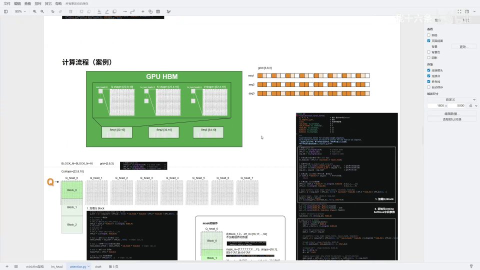

## 本讲要解决的核心问题（SCQA）

**背景**：上一讲我们弄清楚了 FlashAttention 为什么要分块、Triton 的 grid 怎么把任务铺开，以及 QKV 是指针、真正计算在 SRAM 里完成。

**冲突**：但还剩一个最核心的问题没解决——注意力里 softmax 的分母需要「所有」注意力分数的信息。而 FlashAttention 是把 K、V 一块一块读进来的，**每读完一块，我们其实还不知道后面还有没有更大的值**。如果每读一块就重新算一次完整 softmax，前面的计算就全白费了；如果不重算，数值又会不稳定。

**疑问**：能不能在「一块一块读」的前提下，既保证数值稳定，又能把 softmax 增量地算对？

**回答（中心思想）**：能，靠的就是 **Online Softmax**。它维护三个中间量——当前行最大值 `m_i`、归一化因子 `l_i`、以及累加器 `acc`（尚未归一化的 `P·V`）；每读入一个新块，就用 `α = exp(m_prev - m_new)` 把之前累积的结果**补偿（rescale）**到新的最大值尺度上，再把新块的贡献加进来。这样一趟遍历就能算出正确的 softmax 加权结果。本讲以一个三序列的完整案例，跟着 kernel 的四个部分，把 FlashAttention 的每一行走一遍。

---

## 一、案例设定：三个序列与 grid 划分

为了把内核讲清楚，UP 主重新举了一个例子：三个序列，每个序列 22 个 token，都已经嵌入好。

[【跳转到 00:53】](https://www.bilibili.com/video/BV1UaSoBhEco/?t=53)

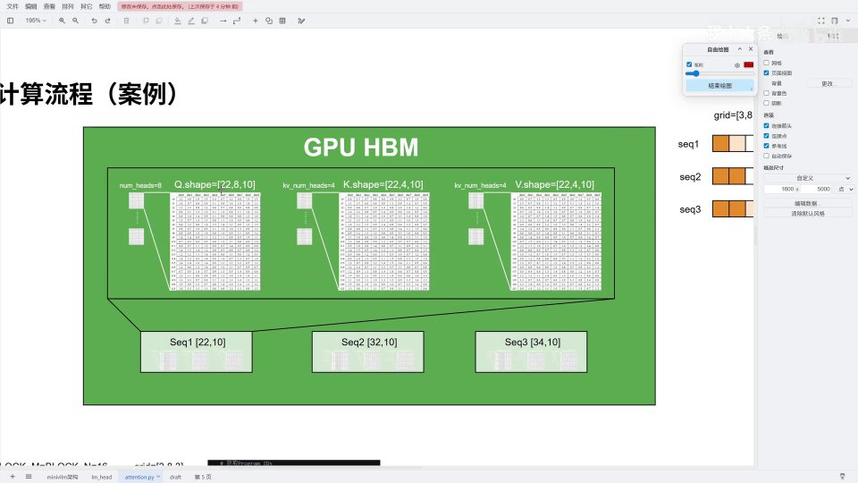

- 三个序列长度都是 22；
- Q 头数 `num_heads = 8`，KV 头数 `num_kv_heads = 4`；
- head_dim = 10；
- `BLOCK_M = BLOCK_N = 16`；
- `cu_seqlens = [0, 22, 54, 88]`（每个序列的起始位置，第三个结束于 88）。

### 1.1 grid 怎么来

[【跳转到 02:08】](https://www.bilibili.com/video/BV1UaSoBhEco/?t=208)

![grid = [3, 8, 3] 的任务划分](assets/第09.2讲_FlashAttention&Online Softmax&案例详解/00208.jpg)

```
grid = (ceil(max_seq_len / BLOCK_M), num_heads, num_seqs)
     = (ceil(22/16), 8, 3)
     = (2, 8, 3)   # 注意：本例最长序列 22，故为 2
```

> 注：如果最长序列是 34，则 `ceil(34/16) = 3`，grid 第一维为 3。UP 主口述中两种数值都出现过，核心公式不变。

三个维度分别是：**Q 块数 × 头数 × 序列数**。每个格子代表「某序列的一段 Q × 某一个头」，颜色深浅表示该块是否装满（序列长度不是 16 的整数倍时，最后一块装不满）。超出序列长度的块是「白块」，拉起内核后直接返回。

---

## 二、kernel 的四个部分

整个内核被分成四步：

[【跳转到 03:07】](https://www.bilibili.com/video/BV1UaSoBhEco/?t=307)

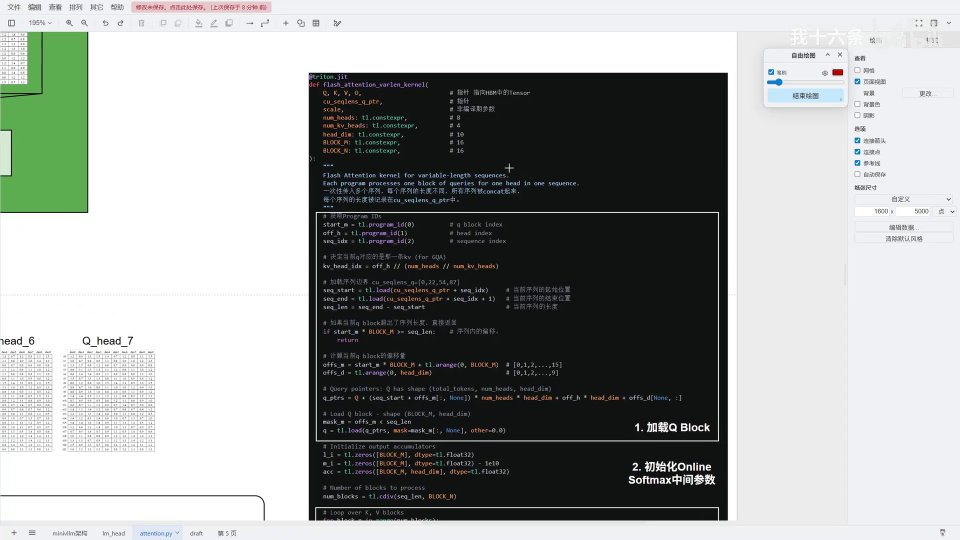

1. **加载 Q 块**：把当前任务负责的那块 Q 从 HBM 读进 SRAM；
2. **初始化 Online Softmax 的中间参数**：`l_i`、`m_i`、`acc`；
3. **遍历 KV 块并做 Online Softmax**：Q 是外循环、KV 是内循环；
4. **归一化并写回**：最后除以 `l_i` 得到 O，写回 HBM。

前面提到一个前提：Q、K、V、O 传进来的都是**指针**，它们本体在 HBM 里，内核只读自己需要的那一部分进 SRAM。

---

## 三、第一部分：把 Q 块加载到 SRAM

内核进来先取任务坐标：

```python
start_m = tl.program_id(0)   # Q 块下标
off_h   = tl.program_id(1)   # 头下标
seq_idx = tl.program_id(2)   # 序列下标

kv_head_idx = off_h // (num_heads // num_kv_heads)   # GQA：找对应 KV 头
```

设当前任务是**序列一的第 0 个头、第 0 个 Q 块**（block0，前 16 个 token）。

[【跳转到 05:74】](https://www.bilibili.com/video/BV1UaSoBhEco/?t=574)

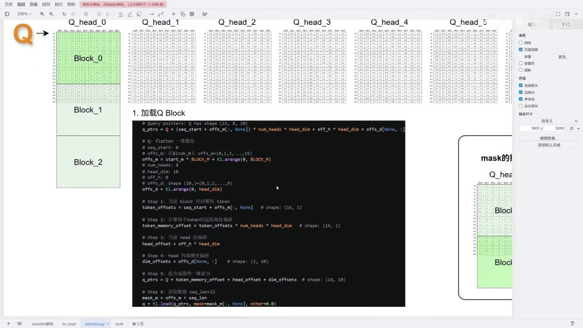

### 3.1 算偏移：这一块读哪些 token

```python
offs_m = start_m * BLOCK_M + tl.arange(0, BLOCK_M)   # token 偏移，如 [0..15]
offs_d = tl.arange(0, head_dim)                      # 维度偏移，[0..9]
```

- block0：`0×16 + [0..15] = [0..15]`，读前 16 个 token；
- block1：`1×16 + [0..15] = [16..31]`，读第 16~31 个 token；
- block2：`2×16 + [0..15] = [32..47]`。

### 3.2 算真实地址：从「逻辑 token」到「内存指针」

光知道读哪些 token 还不够，还要算出它们在内存中的真实地址。

```python
token_offsets = seq_start + offs_m                    # 加上序列起点
token_memory_offset = token_offsets * num_heads * head_dim   # 跨过前面的 token
head_offset = off_h * head_dim                        # 头的偏移
dim_offsets = offs_d[None, :]
q_ptrs = Q + token_memory_offset + head_offset + dim_offsets
```

- `seq_start`：因为三个序列在内存中连续拼接，取自第二个序列时要加上 22；
- `× num_heads × head_dim`：找到该 token 在内存中的相对位置（第几个 token 就跨过几行）；
- 再加上头偏移、维度偏移，组合成一个 `[16, 10]` 的**二维指针数组** `q_ptrs`。

[【跳转到 06:67】](https://www.bilibili.com/video/BV1UaSoBhEco/?t=667)

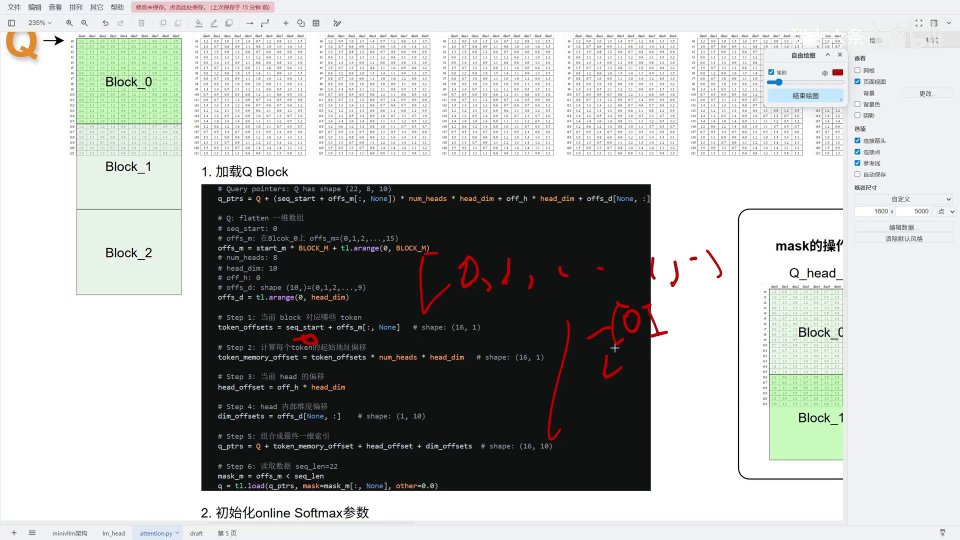

### 3.3 mask 防越界

序列可变长，block0 读前 16 个 token（16 < 22）没问题；但 block1 会读到第 31 个，超出序列长度 22，必须防越界：

```python
mask_m = offs_m < seq_len
q = tl.load(q_ptrs, mask=mask_m[:, None], other=0.0)
```

[【跳转到 08:57】](https://www.bilibili.com/video/BV1UaSoBhEco/?t=857)

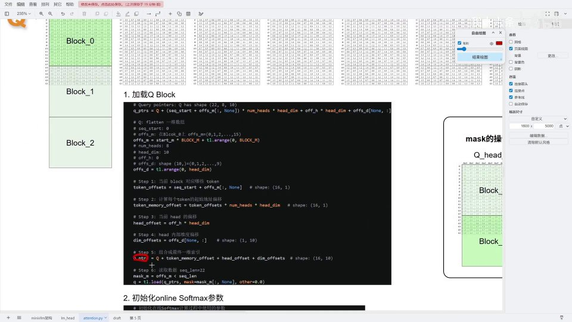

越界的位置 `mask_m` 为 false，读出置 0。这样就把 Q 块安全地加载进 SRAM。

---

## 四、第二部分：初始化三个中间参数

Online Softmax 需要三个中间量：

```python
l_i = tl.zeros([BLOCK_M], dtype=tl.float32)      # 归一化因子（softmax 分母）
m_i = tl.zeros([BLOCK_M], dtype=tl.float32) - 1e10   # 当前行的最大值（初始极小）
acc = tl.zeros([BLOCK_M, head_dim], ...)         # 累加器：未归一化的 P·V
```

- **`l_i`**：最终 softmax 的分母，也就是各指数之和；
- **`m_i`**：当前行的最大值，初始设成一个极小的数（如 -1e10），以便第一次比较时必定被更新；
- **`acc`**：累加器，存尚未归一化的 `P·V`。

[【跳转到 09:73】](https://www.bilibili.com/video/BV1UaSoBhEco/?t=973)

---

## 五、第三部分：Online Softmax 的数学原理

要理解 Online Softmax，先回到普通 softmax，以及它的「数值稳定版」。

[【跳转到 14:52】](https://www.bilibili.com/video/BV1UaSoBhEco/?t=1452)

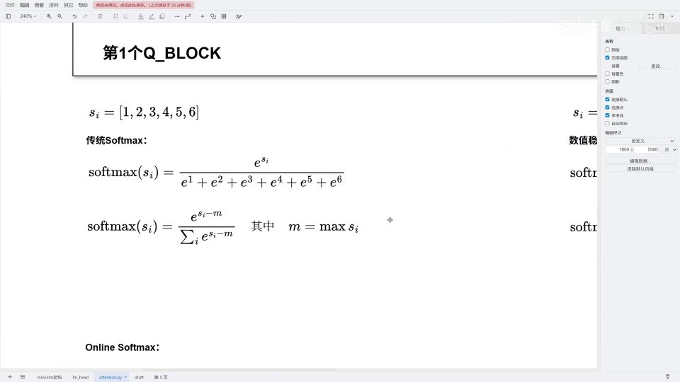

对一个数组 `s_i = [1,2,3,4,5,6]`：

$$\text{softmax}(s_i) = \frac{e^{s_i}}{\sum_j e^{s_j}}$$

问题是指数会爆炸。**数值稳定版**在指数上减去最大值 `m = max s_i`：

$$\text{softmax}(s_i) = \frac{e^{s_i - m}}{\sum_j e^{s_j - m}}$$

分子分母同乘 `e^{-m}`，结果不变，但数值安全——这就是「减最大值」的来历。

### 5.1 跨块的问题

现在把 `s_i = [1,2,3,4,5,6,7]` 分成三块 `s1=[1,2]`、`s2=[3,4]`、`s3=[5,6,7]`——对应 FlashAttention 一块块读取 KV 的过程。

[【跳转到 15:63】](https://www.bilibili.com/video/BV1UaSoBhEco/?t=1563)

![Online Softmax：把 [1..7] 分成三块](assets/第09.2讲_FlashAttention&Online Softmax&案例详解/01563.jpg)

难点在于：**处理 s1 时，我们并不知道后面 s2、s3 会不会出现更大的值**，也就不知道该减哪个 `m`。如果每来一块就把前面全部重算一遍，代价太高。

Online Softmax 的解法是：**先按当前已知的最大值算，等出现更大的值时，把之前累积的结果乘一个补偿因子 α 缩放到新的尺度上。**

### 5.2 三块的计算过程

[【跳转到 17:44】](https://www.bilibili.com/video/BV1UaSoBhEco/?t=1744)

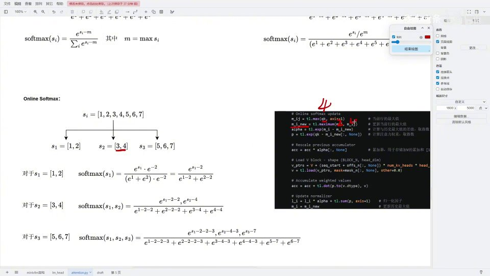

- **处理 s1 = [1,2]**：当前最大 `m=2`，第一次进来补偿 `α = e^{2-2} = 1`。得到局部的 softmax。

- **处理 s2 = [3,4]**：出现更大值，`m_new = 4`。补偿因子
  $$\alpha = e^{m_{prev} - m_{new}} = e^{2-4} = e^{-2}$$
  把之前累积的 `acc` 和 `l_i` 都乘上 α，缩放到新尺度，再把本块的贡献加进来。

- **处理 s3 = [5,6,7]**：同理，`m_new = 7`，`α = e^{4-7} = e^{-3}`，先补偿再累加。

最终三块的结果合并，就是完整序列 `[1..7]` 的 softmax 加权结果。对应到内核：

[【跳转到 10:92】](https://www.bilibili.com/video/BV1UaSoBhEco/?t=1092)

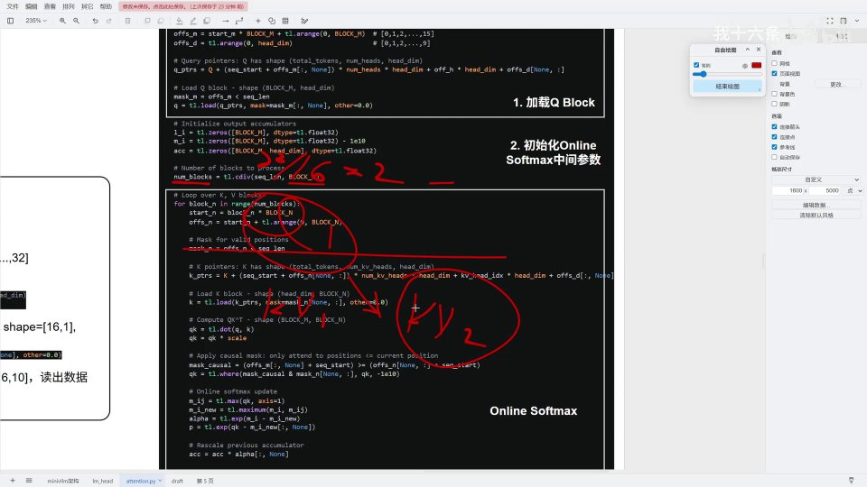

```python
# Online softmax update
m_ij = tl.maximum(m_i, tl.max(qk, 1))     # 更新当前行最大值
alpha = tl.exp(m_i - m_ij)                # 补偿因子
p = tl.exp(qk - m_ij[:, None])            # 计算注意力权重（减新最大值）

acc = acc * alpha[:, None]                # 对历史累加做补偿
acc = acc + tl.dot(p.to(dtype), v)        # 累加本块的 P·V
l_i = l_i * alpha + tl.sum(p, axis=1)     # 更新归一化因子
m_i = m_ij                                # 更新历史最大值
```

[【跳转到 11:76】](https://www.bilibili.com/video/BV1UaSoBhEco/?t=1176)

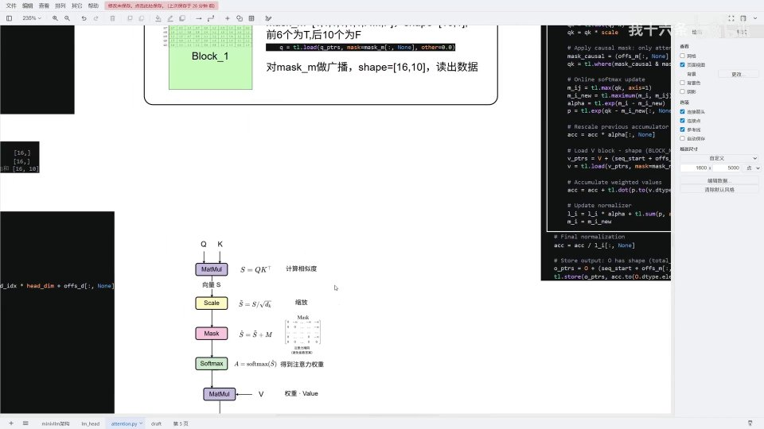

### 5.3 因果 mask 与算子融合

进入 KV 循环前，先读 K 块（K 读出来已经是转置好的），然后：

```python
qk = tl.dot(q, k) * scale          # Q·K^T / √d
qk = tl.where(mask_causal & mask_n, qk, float("-inf"))   # 掩码
```

- **mask_causal**：因果注意力的倒三角，保证每个 Q 只能看到自己及之前的 KV；
- **mask_n**：防越界（越界列置为无效）；
- 两者做「与」，再把无效位置置为 `-∞`，这样 softmax 后它们就贡献 0。

[【跳转到 12:11】](https://www.bilibili.com/video/BV1UaSoBhEco/?t=1211)

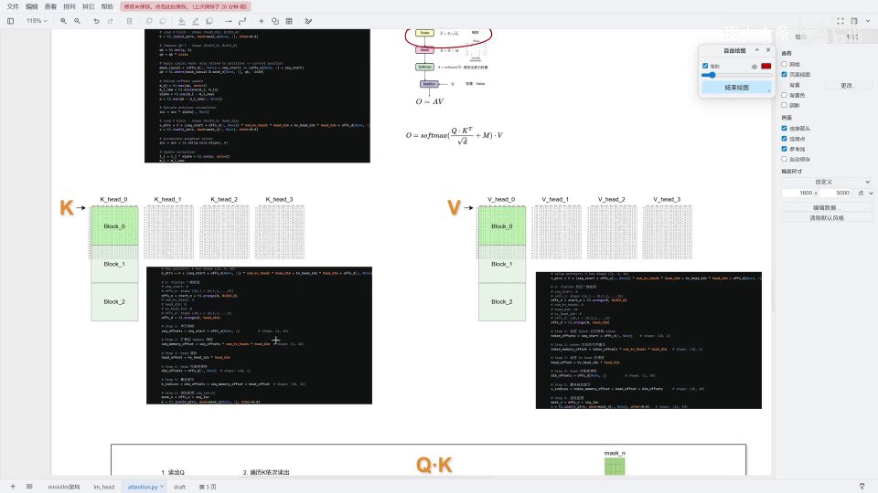

注意这里把 `Q·K^T → scale → mask → softmax → 乘 V` 全部写在一个内核里完成——这就是上一讲说的**算子融合**。

---

## 六、第四部分：结合第二个 Q 块看真实计算

第一个 Q 块（block0）只需要读 block0 的 KV，不涉及跨块补偿，所以看不太出 Online Softmax 的价值。第二个 Q 块（block1，剩余 6 个 token）就不同了。

[【跳转到 19:22】](https://www.bilibili.com/video/BV1UaSoBhEco/?t=1922)

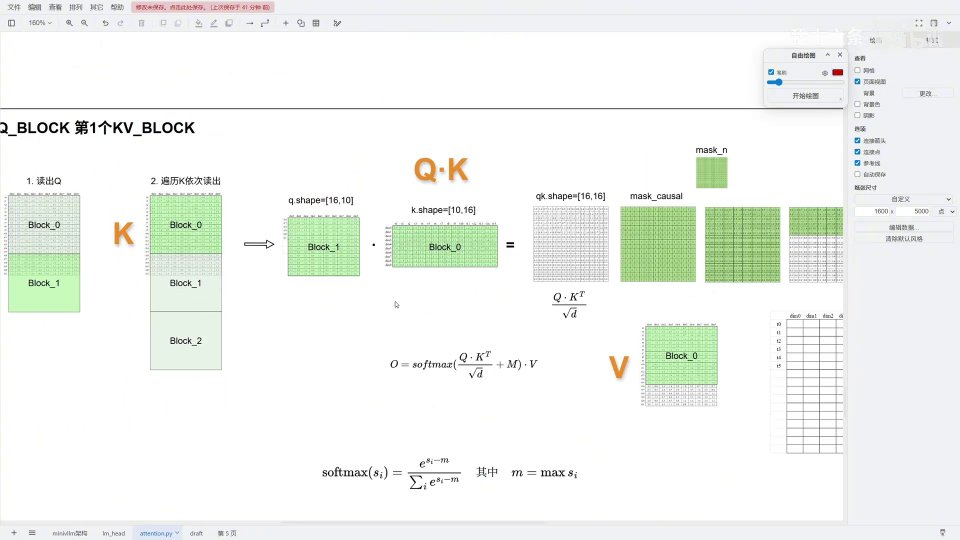

关键点：

- 当前只有 6 个 token，它们是序列的**最后 6 个**，每个 token 都需要乘上前面 block0 的 KV；
- 读 K 的 block1 时，block0 的部分是有效数据、block1 的部分存在越界；
- `mask_causal` 此时是下三角，`mask_n` 右边部分为 0，两者相与得到真正的**有效空间**。

[【跳转到 21:75】](https://www.bilibili.com/video/BV1UaSoBhEco/?t=2175)

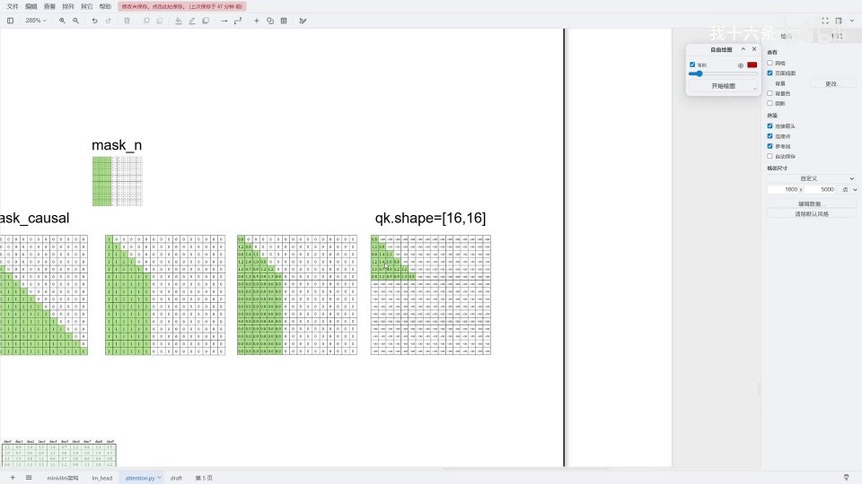

这里有一步容易被忽略：第 16 个 token 其实需要乘上**它自身的 KV**，但在 block0 里读不到，所以必须依赖后一块、靠 Online Softmax 的累加把它补上。这正是为什么必须做跨块补偿。

### 6.1 最后一步：归一化并写回

遍历完所有 KV 块、算出未归一化的 `acc` 后，除以归一化因子：

```python
acc = acc / l_i[:, None]     # 归一化，得到 O
tl.store(o_ptrs, acc, ...)   # 写回 HBM
```

`acc` 归一化后就等于输出 O，写回 HBM，FlashAttention 结束。

> 原本程序是在遍历完所有 KV 块**之后**才对累加的 `P·V` 除以归一化因子，这与「边遍历边除」的结果一致——因为 `l_i` 相当于权重，对 V 来说内外一样，不影响最终结果。

---

## 七、一个可优化的点：冗余计算

MiniVLLM 原实现里，遍历 KV 块的数量用的是 `loop_num_block = seq_len // block_N`（本例 `22 // 16 = 2`）。这意味着 **每个 Q 块都遍历两个 KV 块**：

- Q1 会遍历 KV1 和 KV2，但 KV2 是 Q1 的「未来」，靠 mask 屏蔽掉，不影响结果；
- 但这一步计算本身是**冗余**的——白白浪费算力。

[【跳转到 10:92】](https://www.bilibili.com/video/BV1UaSoBhEco/?t=1092)

序列越长，这种浪费越大（Q1 可能要去乘后面 100 个 Q 块）。UP 主特别指出：**这是算子优化可以下手的空间**——对因果注意力，每个 Q 块其实只需遍历到它自己对应的 KV 块为止。

---

## 小结

- **FlashAttention 内核分四步**：加载 Q 块 → 初始化 Online Softmax 参数 → 遍历 KV 并做 Online Softmax → 归一化写回。
- **Q 块加载**：先算 token 偏移 `offs_m`、维度偏移 `offs_d`，再换算成内存指针 `q_ptrs`，并用 `mask_m` 防越界。
- **三个中间量**：`l_i`（归一化因子）、`m_i`（当前行最大值）、`acc`（未归一化的 P·V）。
- **Online Softmax 的核心**：用补偿因子 `α = exp(m_prev - m_new)` 把历史结果缩放到新的最大值尺度，从而一趟增量算出正确结果。
- **数值稳定版 softmax 的减最大值**：分子分母同乘 `e^{-m}`，结果不变但防止指数越界。
- **算子融合**：`QK → scale → mask → softmax → ·V` 在一个内核里完成。
- **可优化点**：原实现按 `seq_len // block_N` 遍历，存在冗余计算，因果注意力下每个 Q 块只需遍历到自己对应的 KV 块。

## 关键术语速查

| 术语 | 一句话解释 |
| --- | --- |
| Online Softmax | 分块读取时增量计算 softmax 的方法，靠 α 补偿保持数值稳定 |
| 补偿因子 α | `exp(m_prev - m_new)`，把历史累加缩放到新的最大值尺度 |
| m_i | 当前行的最大值，初始极小，边读边更新 |
| l_i | 归一化因子（softmax 分母） |
| acc | 累加器，存放尚未归一化的 P·V |
| mask_causal | 因果注意力掩码（倒三角），限制每个 Q 只能看自己及之前的 KV |
| mask_m / mask_n | 防越界掩码：分别针对 Q 块和 K/N 维度的越界 |
| q_ptrs | Q 块的二维指针数组，指向 SRAM 要读取的内存地址 |
| 算子融合 | 把多个操作（QK、scale、mask、softmax、·V）写进同一个内核 |
| 冗余计算 | 因果注意力下遍历了用不到的后续 KV 块，属于可优化点 |
