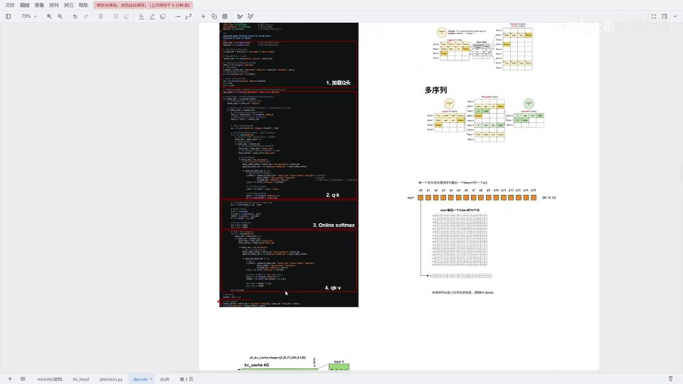
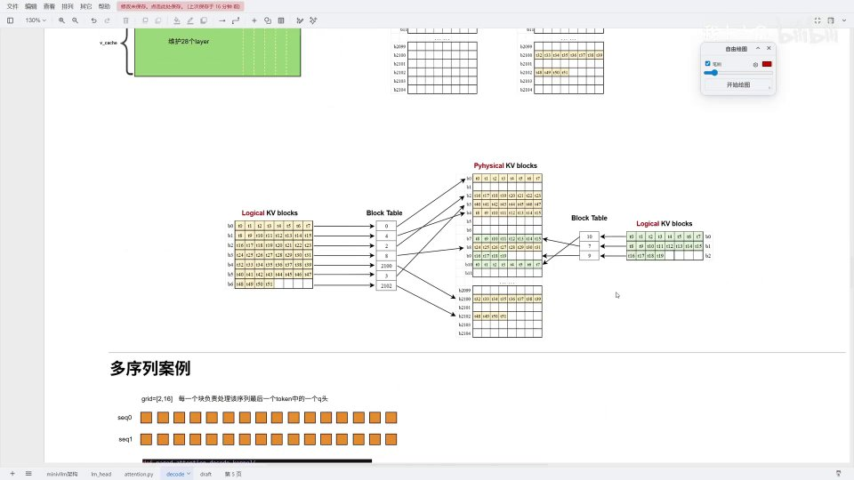
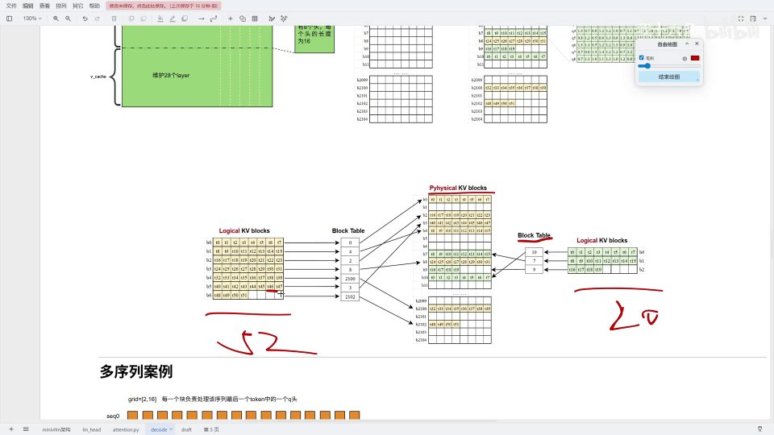
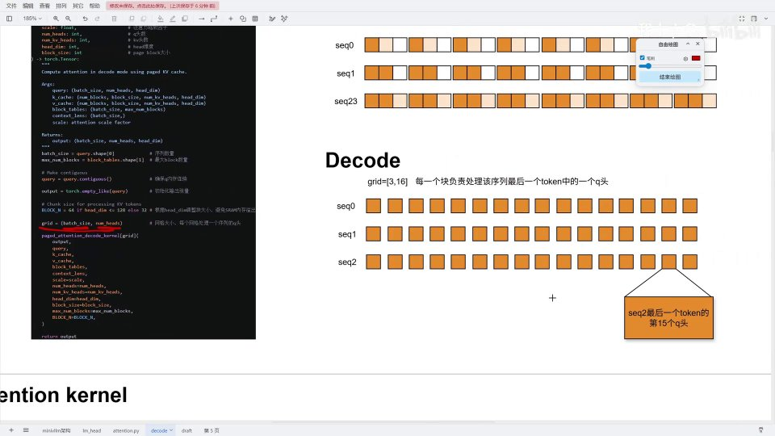
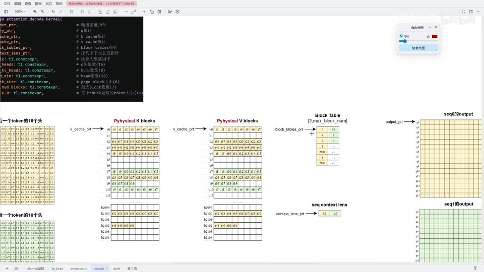

# 第10讲：Decode 阶段与 PagedAttention —— 用「分页」管理 KV cache


## 本讲要解决的核心问题（SCQA）

**背景**：预填充（prefill）把整段 prompt 一次算完，接下来进入**解码（decode）**——每生成一个 token，就要拿它的 Q 去和**所有历史的 K、V** 做注意力。历史 K、V 都存放在 KV cache 里。

**冲突**：decode 阶段是逐 token 进行的，每次都要拼接新的 KV，长度不断变化；而且多个请求会并发进来，长度各不相同。如果每个 request 都独占一块连续显存，就会产生大量**内存碎片**，申请和回收都很麻烦，显存利用率很低。

**疑问**：能不能像操作系统管理内存那样，把 KV cache 也「分页」，让逻辑上连续的 KV 映射到物理上任意位置的空闲块？

**回答（中心思想）**：能，这就是 **PagedAttention**。它把 KV cache 按固定大小的 **block** 管理，用一个 **block_table** 把「逻辑 KV block」映射到「物理 KV block」。请求按块申请、按引用回收，从而消除碎片、支持并发、极大提高显存利用率。本讲会先讲清这套分页机制，再逐段拆解 `paged_attention_decode_kernel`——它按「序列 × 头」划分网格，四大步完成「加载 Q 头 → Q×K → Online Softmax → ×V 归一化写回」。

---

## 一、decode 在模型中的位置

decode 阶段对应 Qwen3-0.6B 的 attention。整个模型有 28 个 decoder layer 堆叠，每个 layer 里有一个 attention 层，attention 层内部就是 attention interface——也就是代码文件里这一块前向传播。

[【跳转到 02:07】](https://www.bilibili.com/video/BV14a5r6YEhY/?t=207)


输入经过 Q、K、V 三个线性变换后进入前向传播；前向传播里根据 `context.is_prefill` 分流：预填充走 FlashAttention，解码走 `paged_attention_decode`。本讲聚焦后者。

---

## 二、PagedAttention 的核心：三张「表」

### 2.1 为什么需要分页

原本 attention 的 KV cache 如果按请求整块管理，会有大量空间浪费：每个请求进来重新申请、用完回收，非常麻烦。PagedAttention 的思想是：**把分配给 GPU 的 KV cache 视作一个整体**（物理上是连续的大数组），但实际访问时维护一个**逻辑 KV**，通过 **block_table** 映射到物理中具体的 block。

[【跳转到 05:06】](https://www.bilibili.com/video/BV14a5r6YEhY/?t=506)



- 新请求需要空间时，直接申请一个 block；
- block 不再需要时，把 block_table 中的引用减一；
- 引用为零时，该块随时可被其他数据填充。

于是我们**屏蔽了对底层 block 的管理**。多序列并发时，内存可以混着放（同一个 block 里只会属于一个序列），显存利用率大幅提高——这正是 PagedAttention 的核心创新点。

[【跳转到 05:36】](https://www.bilibili.com/video/BV14a5r6YEhY/?t=536)


### 2.2 物理 KV cache 长什么样

重新举一个例子：`all_kv_cache.shape = [2, 28, 2104, 8, 16]`。

[【跳转到 07:83】](https://www.bilibili.com/video/BV14a5r6YEhY/?t=783)

![物理 KV cache：[2, 28, 2104, 8, 16]](assets/第10讲_Decode阶段&PagedAttention代码详解&Attention推理过程/00783.jpg)

- 2：K 和 V；
- 28：28 个 layer，每个 layer 各有一份 KV cache；
- 2104：2104 个 block（层内总块数）；
- 8：KV head 数；
- 16：每个 head 的维度。

每个 token 在物理上就是一个 `[8, 16]` 的小张量。

### 2.3 三张表的对照

[【跳转到 08:54】](https://www.bilibili.com/video/BV14a5r6YEhY/?t=854)



以两个序列为例：序列一 52 个 token，序列二 20 个 token。逻辑上连续的 KV block，经过 block_table 映射后，在物理中**并不连续**。

**一个具体例子**：`token46` 在逻辑上位于第 5 个 block；通过 block_table 查到它实际存储在物理的第 3 个 block。

[【跳转到 08:79】](https://www.bilibili.com/video/BV14a5r6YEhY/?t=879)



所以：**所有逻辑 KV block 都要通过 block_table 找到真实物理位置**。

---

## 三、具体案例：网格与 kernel 变量

接下来用一个案例把 decode kernel 讲清楚。网格任务划分为 **2 × 16**：两条序列、16 个头。**每个块负责处理该序列最后一个 token 中的一个 Q 头**。

[【跳转到 04:06】](https://www.bilibili.com/video/BV14a5r6YEhY/?t=406)



kernel 的标量参数：

[【跳转到 09:42】](https://www.bilibili.com/video/BV14a5r6YEhY/?t=942)


- `num_heads = 16`（Q 头）、`num_kv_heads = 8`（KV 头），head_dim = 16；
- `block_size = 8`（分页大小）；
- `max_num_blocks`：最长序列用了多少个 block。例子里最长 52，`52 ÷ 8 = 6.5`，向上取整为 **7**；
- `block_n = 16`：每次从 HBM 读 16 个 token 的 KV 进 SRAM 与 Q 做点积。

指针则有：`output`、`q`、`k_cache`、`v_cache`、`block_tables`、`context_lens` 等。注意 `k_block` / `v_block` 以 **layer** 为单位，每个 layer 各有一套。

---

## 四、第一部分：加载 Q 头

设当前任务在 sequence1、第四个 Q 头：

```python
batch_idx = 1        # 第二个序列
head_idx  = 3        # 第四个 Q 头（从 0 计）
kv_head_idx = head_idx // (num_heads // num_kv_heads)  # GQA
```

因为 GQA：`16 // 8 = 2`，每两个 Q 头共享一个 KV 头，`3 // 2 = 1`，所以第四个 Q 头对应第二个 KV 头。

接着读出当前序列长度（从 `context_lens` 读出 20），再用偏移计算 Q 的位置：

```python
# 跳过前面的序列与头，指向本 Q 头
q_offset = batch_idx * num_heads * head_dim + head_idx * head_dim
q_ptrs = q_ptr + q_offset + offs_d[None, :]
```

`1 × 16 × 16` 跳过第一个序列的全部头，`3 × 16` 跳过块内前三个头，直接取到 Q3。再配合 `offs_d`（0~15）取出 16 个嵌入维度，Q 头就加载出来了。

[【跳转到 11:50】](https://www.bilibili.com/video/BV14a5r6YEhY/?t=1150)



---

## 五、第二部分：Q×K —— 通过 block_table 找物理 K

这一部分有两个任务：从 HBM 读 K 进 SRAM、用 Q 对 K 做点积。因为要循环读取，先把最长序列切成若干「窗口（trunk / chunk）」。

```python
max_num_blocks = 7
max_trunk = ceil(max_num_blocks * block_size / block_n)
          = ceil(7 * 8 / 16) = ceil(3.5) = 4
```

也就是每个序列用 4 个窗口遍历（不足的窗口会被越界处理跳过）。

[【跳转到 15:20】](https://www.bilibili.com/video/BV14a5r6YEhY/?t=1520)


对 seq1（长度 20），窗口 0 的 `offs_n = [0..15]`、`mask_n` 全为 1；窗口 1 的 `offs_n = [16..31]`，但只有前四个 token 有效，`mask_n = [1,1,1,1,0,...0]`。

### 5.1 关键：token → 逻辑块 → block_table → 物理块

读 K 的核心，是把一个 token 的位置层层翻译成物理地址：

[【跳转到 20:28】](https://www.bilibili.com/video/BV14a5r6YEhY/?t=2028)


```python
logical_block = token_id // block_size       # 逻辑块号
block_offset  = token_id %  block_size       # 块内偏移
# 在 block_table 中定位：跳过前面序列，再走 logical_block 步
phys_block = block_tables[batch_idx * max_num_blocks + logical_block]
# 物理地址 = phys_block * block_size * ... + block_offset * ... + head_offset
```

以 `token6` 为例（block_size=8）：逻辑块号 `6 // 8 = 0`，块内偏移 `6 % 8 = 6`。它属于 seq1 的第 0 个逻辑块，对应 block_table 中 `batch_idx × max_num_blocks + 0` 的位置，读出物理块号。

[【跳转到 21:50】](https://www.bilibili.com/video/BV14a5r6YEhY/?t=2150)


比如读到物理块号是 10，就跳到物理 KV cache 的第 10 个 block，再根据块内偏移 6 找到对应 token，最后加上头偏移取出对应的 KV 头。

### 5.2 Q×K 与掩码

读出 K 后（K 读出来已是转置好的）：

```python
kq = tl.dot(q, k) * scale
# mask：把该 token 位置写回 qk 数组
```

用一个 `mask_i`（仅第 i 位为 1）把每个 token 算出的 score 存到 QK 数组对应位置。这里还做了防越界和因果掩码处理。

---

## 六、第三部分：Online Softmax

因为要遍历多个窗口（chunk0、chunk1），跨窗口需要合并，因此这里用 **Online Softmax**——和上一讲 FlashAttention 中完全一致：维护当前行最大值 `m_i`、归一化因子 `l_i`、累加器 `acc`，用补偿因子 `α = exp(m_prev - m_new)` 缩放历史结果。这里不再展开，详见第9.2讲。

---

## 七、第四部分：×V、归一化、写回

得到 QK 后，还需要乘 V：

```python
# 从 v_cache 读出 V（流程与读 K 完全一致）
v = tl.load(v_ptrs, ...)
# 用 QK 权重乘 V，累加到 acc
acc += tl.dot(p.to(dtype), v)
# 归一化并写回
acc = acc / l_i[:, None]
tl.store(o_ptrs, acc, ...)
```

读 V 的操作和读 K 完全一样：同样是「逻辑块 → block_table → 物理块 → 块内偏移 → 头偏移」那一套。最后除以归一化因子 `l_i`，得到输出 O，从 SRAM 写回 HBM，PagedAttention 计算结束。

---

## 八、三张表的关系（本讲精髓）

本讲最关键的，是理清三张表/概念的关系：

[【跳转到 26:28】](https://www.bilibili.com/video/BV14a5r6YEhY/?t=1628)

| 名称 | 是否真实存在 | 作用 |
| --- | --- | --- |
| **逻辑 KV block** | 概念性，不存在实体 | 由序列长度直接推出来（如 52 → 7 块） |
| **block_table** | 真实存在于内存 | 把逻辑块号映射到物理块号 |
| **物理 KV block** | 真实存在于显存 | 实际存放 KV 数据 |

程序运行时其实只有**物理表**和 **block_table** 两个东西；逻辑 KV block 只是我们用来理解的概念——知道序列长度，逻辑块划分就完全能推出来。

---

## 小结

- **decode 逐 token 生成**：每个新 token 的 Q 要和所有历史 K、V 做注意力。
- **PagedAttention = 分页管理 KV cache**：按固定 block 申请/回收，用 block_table 做「逻辑 → 物理」映射，消除碎片、支持并发。
- **三层映射**：token → 逻辑块号 → block_table → 物理块号 → 块内偏移 → 头偏移。
- **物理 KV cache 形状**：`[2, 28, 2104, 8, 16]`（K/V、层、块、KV 头、头维度）。
- **网格划分**：`(batch_size, num_heads)`，每个块负责某序列最后一个 token 的一个 Q 头。
- **kernel 四步**：加载 Q 头 → Q×K（经 block_table 找物理 K）→ Online Softmax → ×V、归一化、写回。
- **GQA**：`kv_head_idx = head_idx // (num_heads // num_kv_heads)`。

## 关键术语速查

| 术语 | 一句话解释 |
| --- | --- |
| Decode | 解码阶段，逐 token 生成，每步用新 Q 与全部历史 KV 做注意力 |
| PagedAttention | 用分页管理 KV cache 的注意力实现，核心创新点 |
| 逻辑 KV block | 概念上的连续 KV 块，由序列长度推出，无实体 |
| 物理 KV block | 显存中实际存放 KV 的块，位置由 block_table 决定 |
| block_table | 逻辑块号 → 物理块号的映射表 |
| block_size | 每个 block 存放多少 token（分页大小，本例 8） |
| max_num_blocks | 批次内最长序列占用的 block 数 |
| trunk / chunk | decode 中按 block_n 切分的遍历窗口 |
| Online Softmax | 跨窗口增量计算 softmax，与 FlashAttention 一致 |
| GQA | 分组查询注意力，多个 Q 头共享一个 KV 头 |
