# 第11讲：KV Cache 的存储过程与 Triton 实现

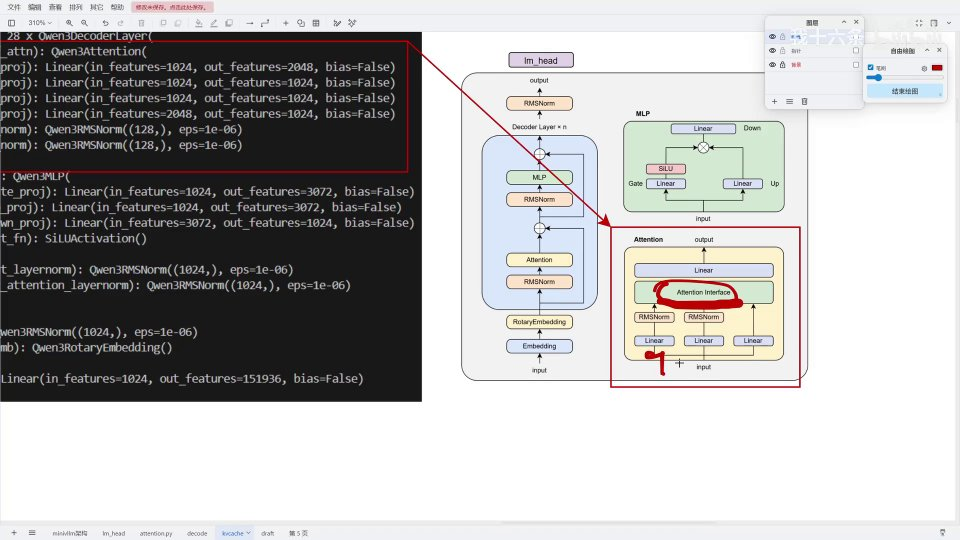

## 本讲要解决的核心问题（SCQA）

**背景**：我们讲过 prefill 和 decode，两种阶段都要用到 KV cache。上一讲还讲了 PagedAttention 用 block_table 管理分页 KV。

**冲突**：但还有一个更基础的问题没回答——算出来的 K、V 到底**是怎么写进 cache 的**？输入可能是多个、长度各异的序列，每个 token 的 K、V 应该存到哪个 block、block 里的哪个位置？如果直接按顺序存，多条序列并发时根本对不上号。

**疑问**：怎么给每个 token 精确计算它的存放位置，并高效地把 K、V 写入分页的 KV cache？

**回答（中心思想）**：靠一个 **slot_mapping**——由 scheduler 为每个 token 预先分配「槽位编号」，再用一个 Triton 算子 `store_kvcache` 并行地把每个 token 的每个头写入对应位置。每个 token 的落点由两步算出：`block_id = slot_id // block_size` 决定写到哪个块，`block_offset = slot_id % block_size` 决定块内第几个位置。本讲把「scheduler 分配 → Triton 读写指针」这条链讲清楚。这一讲比 prefill/decode 简单很多。

---

## 一、KV cache 在 attention 中的位置

KV cache 的处理仍然发生在 **attention interface** 内部：QKV 经过线性层后传入 attention interface，在这里做 KV cache 的存储，然后才进入后续的注意力计算。

[【跳转到 00:32】](https://www.bilibili.com/video/BV1SR7k67Ee9/?t=32)

[【跳转到 00:48】](https://www.bilibili.com/video/BV1SR7k67Ee9/?t=48)

流程的第一步是判断 **KV cache 是否已分配**：KV cache 本质是一个已分配好的张量。只要它已分配、且 `slot_mapping` 存在，就进入存储流程。这里还会根据维度做一次 reshape：若 K、V 是 4 维，就降成 3 维（token 数 × 头数 × 头维度），并做 `contiguous`。

[【跳转到 00:84】](https://www.bilibili.com/video/BV1SR7k67Ee9/?t=84)

---

## 二、显存分配回顾

以 8G 显存为例：约 2.23G 存放 Qwen3-0.6B 模型，剩下约 4GB 可用于 KV cache。

[【跳转到 01:31】](https://www.bilibili.com/video/BV1SR7k67Ee9/?t=131)

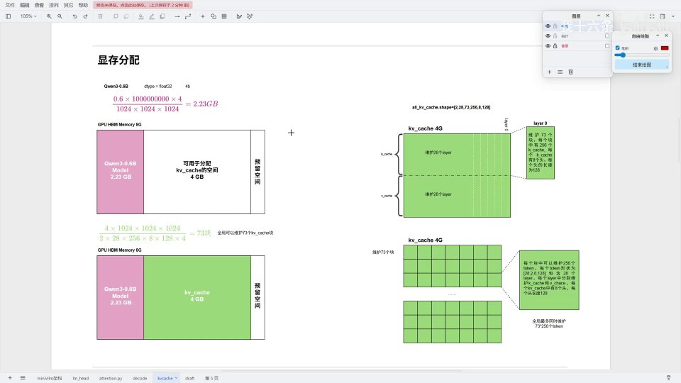

这 4GB 一半存 K、一半存 V。再按 block 大小划分：假设 block_size = 8、每个 K/V 有 8 个头、每头 16 维，就把可用空间除以「每个 token KV 的实际容量」，再乘以 8，得到可划分的 block 数量。内存里就被切成一个个 block——这就是上一讲 PagedAttention 管理的物理块。

---

## 三、store_kvcache 的入口与参数

`scheduler` 会把 K、V、cache、映射信息传给算子：

[【跳转到 02:09】](https://www.bilibili.com/video/BV1SR7k67Ee9/?t=209)

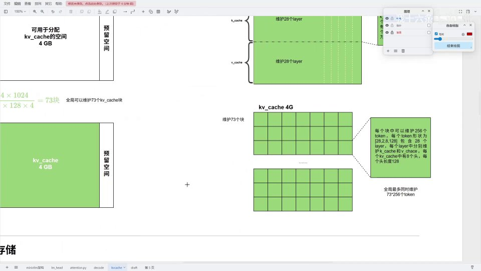

传入参数包括：

- `key`、`value`：要写入的 K、V 数据（Triton 会自动把张量转成指针）；
- `k_cache`、`v_cache`：目标存放位置；
- `slot_mapping`：每个 token 对应的 cache slot 映射；
- `num_kv_heads`、`head_dim`、`block_size` 等标量。

内部做了几件事：把形状提出来（token 数、头数、头维度）、对 K/V 做 contiguous、断言 `k_cache.shape == v_cache.shape`、断言 `slot_mapping.numel() == num_tokens`（slot_mapping 的大小必须与 token 数量一致）。

[【跳转到 02:60】](https://www.bilibili.com/video/BV1SR7k67Ee9/?t=260)

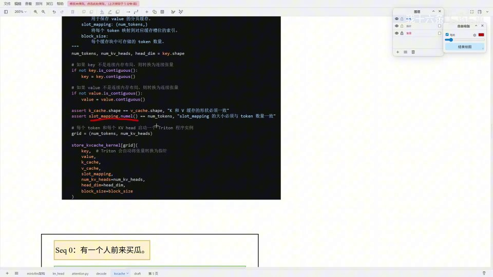

---

## 四、scheduler：block_table 与 slot_mapping

### 4.1 三个长度不同的序列

假设一个 batch 输入三个序列：

[【跳转到 02:78】](https://www.bilibili.com/video/BV1SR7k67Ee9/?t=278)

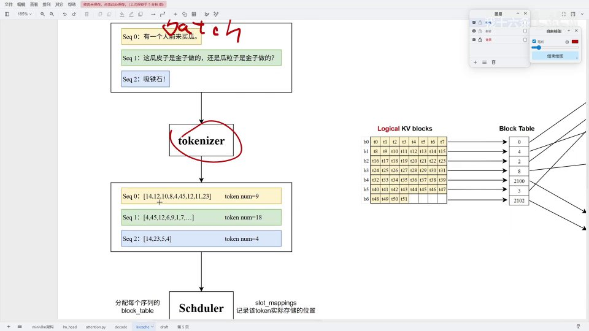

- Seq 0：9 个 token；
- Seq 1：18 个 token；
- Seq 2：4 个 token。

经过 tokenizer 后，MiniVLLM 的 **scheduler** 为每个序列分配一个 `block_table`，并用 `slot_mapping` 记录每个 token 实际存储的位置。

[【跳转到 03:38】](https://www.bilibili.com/video/BV1SR7k67Ee9/?t=338)

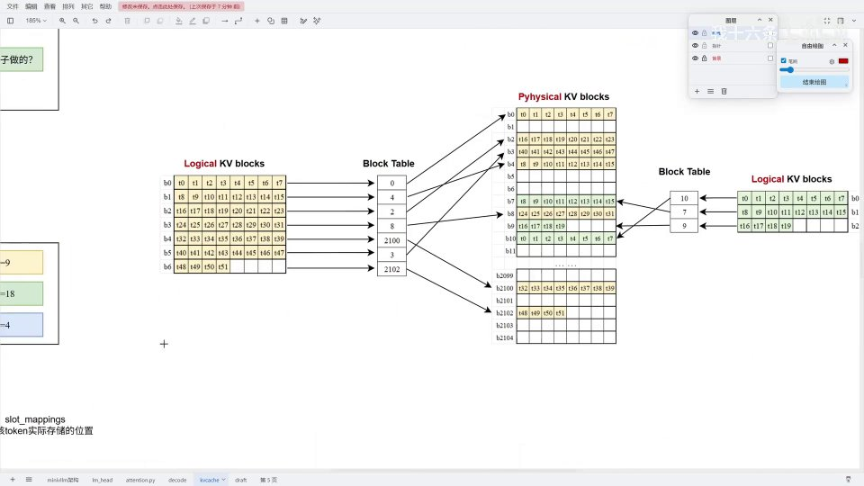

### 4.2 block_table 怎么分配

物理 KV cache 有 B0~B2104 共 2000 多个块，初始都空着。scheduler 按长度分配：

[【跳转到 03:85】](https://www.bilibili.com/video/BV1SR7k67Ee9/?t=385)

- **Seq 0**（9 token）：`9 ÷ 8` 向上取整 = 2 个 block → 分配 B0、B1，`block_table = [0, 1]`；
- **Seq 1**（18 token）：`18 ÷ 8` 向上取整 = 3 → 跳过已用的，分配 B2、B3、B4，`block_table = [2, 3, 4]`；
- **Seq 2**（4 token）：`4 ÷ 8` 向上取整 = 1 → 分配 B5，`block_table = [5]`。

### 4.3 slot_mapping 怎么算

知道 block_table 后，还要为每个 token 计算它在块内的具体位置：

[【跳转到 04:85】](https://www.bilibili.com/video/BV1SR7k67Ee9/?t=485)

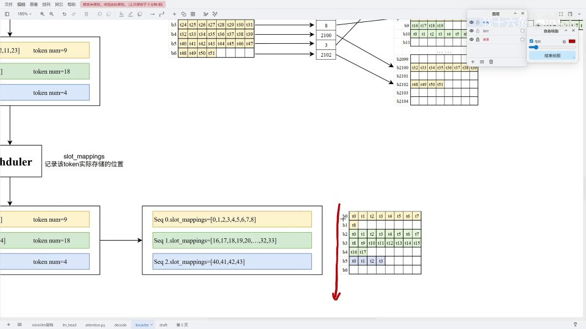

- Seq 0：`[0,1,2,3,4,5,6,7,8]`；
- Seq 1：从 16 开始（跳过了 B0、B1 两个块 × 8 = 16），`[16,17,18,...,33]`；
- Seq 2：从 40 开始，`[40,41,42,43]`。

这里能和 decode 阶段呼应上：B1 并没有存满，留待 decode 阶段继续填充。

---

## 五、Triton 算子：grid 与定位

### 5.1 网格划分

三个序列总计 `9 + 18 + 4 = 31` 个 token，头数是 8，所以：

```
grid = [31, 8]
```

[【跳转到 05:64】](https://www.bilibili.com/video/BV1SR7k67Ee9/?t=564)

![grid = [31, 8]：每个块处理一个 token 的一个头](assets/第11讲_KV Cache存储过程&Triton实现/00564.jpg)

一共 31 行（每行一个 token）、8 列（每个头），约 248 个网格，每个网格执行一个 Triton 算子。

### 5.2 算子内部：定位

[【跳转到 06:03】](https://www.bilibili.com/video/BV1SR7k67Ee9/?t=603)

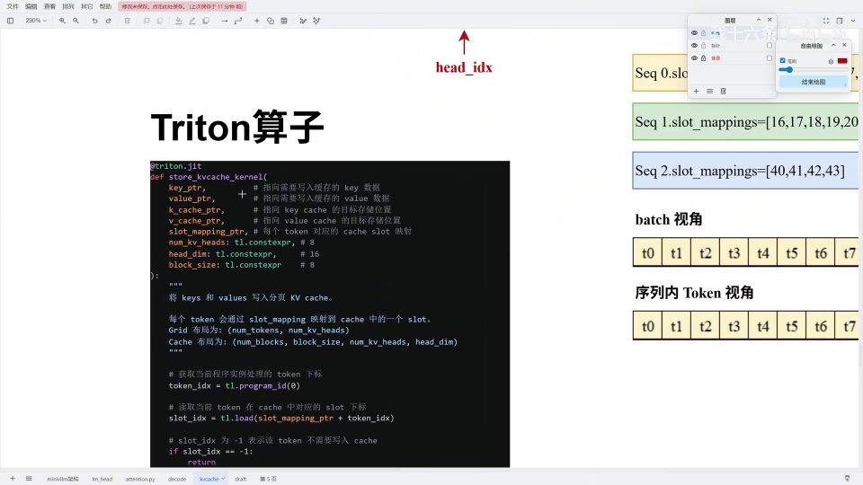

```python
token_idx = tl.program_id(0)                       # token 下标
slot_id = tl.load(slot_mapping_ptr + token_idx)    # 读取该 token 的 slot
if slot_id == -1:
    return                                          # -1 表示不需要写入

block_id     = slot_id // block_size               # 写到哪个 block
block_offset = slot_id %  block_size               # 块内第几个位置
```

以最后一个 token（`token_id = 30`）为例：它的 slot_id 是 **43**。

[【跳转到 07:83】](https://www.bilibili.com/video/BV1SR7k67Ee9/?t=783)

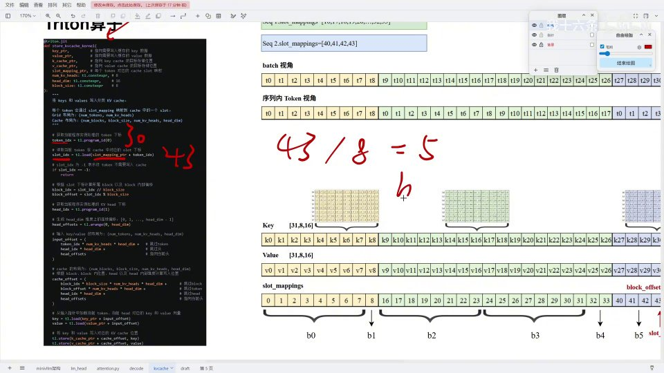

- `block_id = 43 // 8 = 5`，写到 B5；
- `block_offset = 43 % 8 = 3`，写 B5 的第 3 个位置。

然后再确定当前处理的是哪个头（`k_idx`，这里最后一个头是 7）。

---

## 六、input_offset：从 KV 中取出要存的值

`input_offset` 用于**从传入的 K、V 中取出当前 token、当前头的那 16 个值**。

[【跳转到 09:07】](https://www.bilibili.com/video/BV1SR7k67Ee9/?t=907)

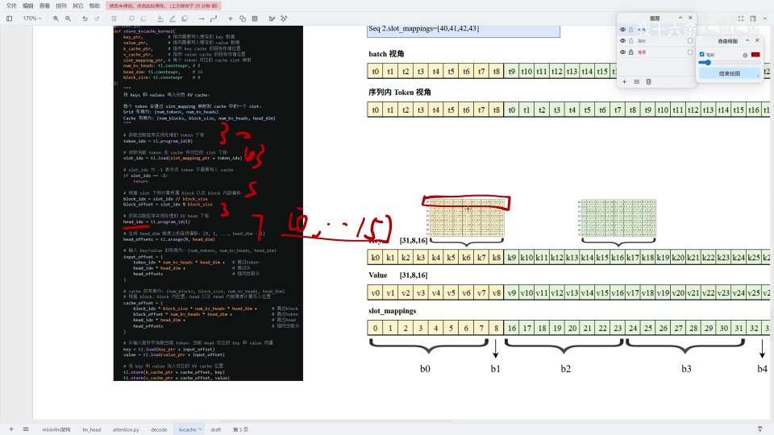

计算分几步：

1. 跳过前面的 token：`token_id(30) × num_heads × head_dim`，指针从 K 的第 0 个指向 K30；
2. 跳过头：`head_idx(7) × 16`，跳过前面 7 个头（K、V 指针本身都指向头的起始位置）；
3. 加上 head offset：`0~15` 的维度偏移，让指针覆盖这一整个头的 16 个值。

这样就能把当前 token、当前头的所有参数取出来。

---

## 七、cache_offset：写到 cache 的正确位置

取出的值要存进 cache，还需要算 `cache_offset`——即对 `k_cache`、`v_cache` 的写入偏移。

[【跳转到 10:28】](https://www.bilibili.com/video/BV1SR7k67Ee9/?t=1028)

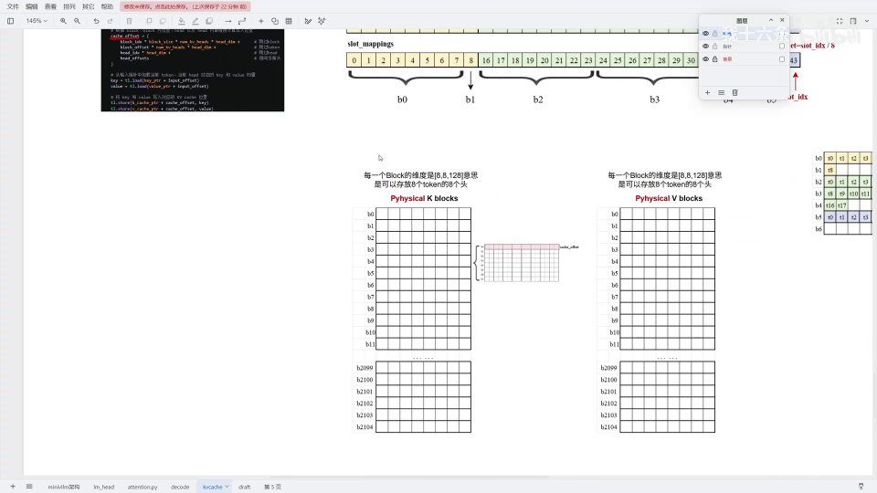

同样分三步：

1. **跳 block**：`block_id(5) × block_size × 8 × head_dim`，跳过前面的 B0~B4；
2. **跳 token**：`block_offset(3) × 8 × head_dim`，跳过块内前面 3 个 token；
3. **跳头**：`head_idx(7) × 16`，跳过前面 7 个头。

[【跳转到 11:05】](https://www.bilibili.com/video/BV1SR7k67Ee9/?t=1105)

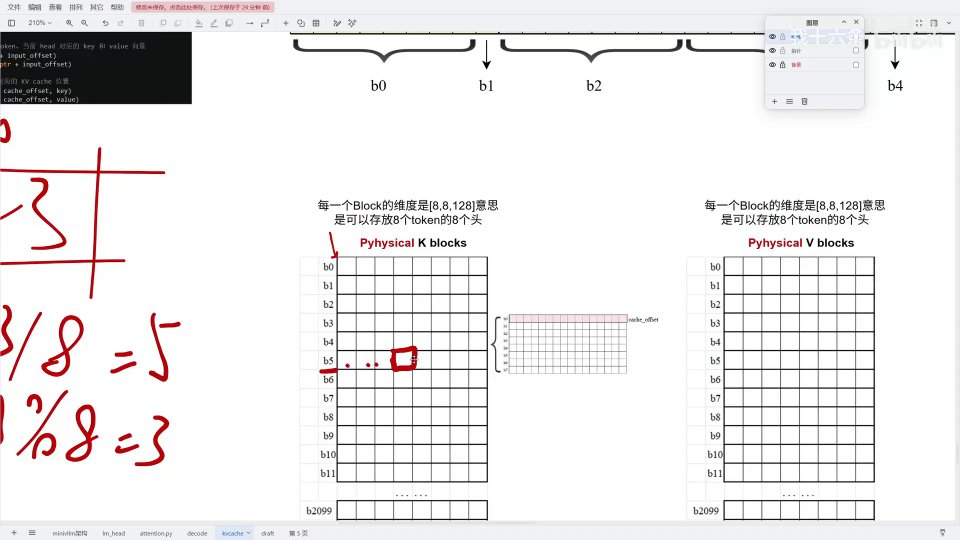

指针就对齐到 B5 第 3 个 token 的第 7 个头，把取出的 K、V 值一一对应写进去即可。

---

## 小结

- **KV cache 的存储在 attention interface 内**：QKV 算完后判断 cache 是否已分配、slot_mapping 是否存在，再调用 `store_kvcache`。
- **scheduler 负责分配**：按序列长度算出需要多少 block，分配 `block_table`；再为每个 token 算 `slot_mapping`（槽位编号）。
- **block_table vs slot_mapping**：前者记录序列占用哪些 block，后者记录每个 token 在整块 cache 中的槽位编号。
- **落点两步**：`block_id = slot_id // block_size`，`block_offset = slot_id % block_size`。
- **Triton 两个偏移**：`input_offset` 从 KV 中取数（跳 token、跳头、加维度偏移）；`cache_offset` 定位写入点（跳 block、跳 token、跳头）。
- **grid = [num_tokens, num_kv_heads]**：每个网格处理一个 token 的一个头。
- **slot_id = -1**：表示该 token 不需要写入，直接返回。

## 关键术语速查

| 术语 | 一句话解释 |
| --- | --- |
| store_kvcache | 把算好的 K、V 写入分页 KV cache 的 Triton 算子 |
| slot_mapping | 每个 token 在 cache 中槽位编号的映射表 |
| block_table | 序列占用的逻辑块 → 物理块映射 |
| block_size | 每个 block 存放的 token 数 |
| block_id | `slot_id // block_size`，写到哪个块 |
| block_offset | `slot_id % block_size`，块内第几个位置 |
| input_offset | 从传入 K、V 中取出目标 token/头的指针偏移 |
| cache_offset | 定位到 cache 中目标 block/token/头的写入偏移 |
| scheduler | 为序列分配 block_table 与 slot_mapping 的调度器 |
| grid | Triton 任务网格，这里为 [num_tokens, num_kv_heads] |
