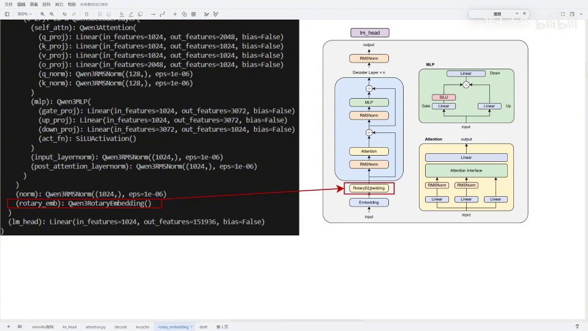
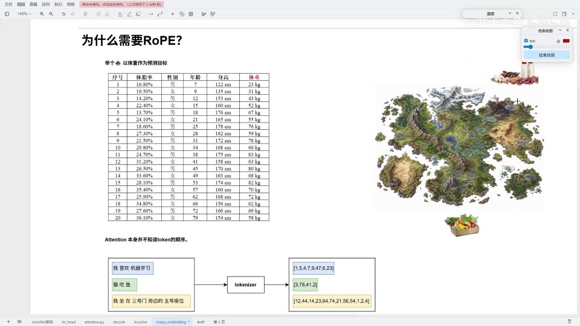
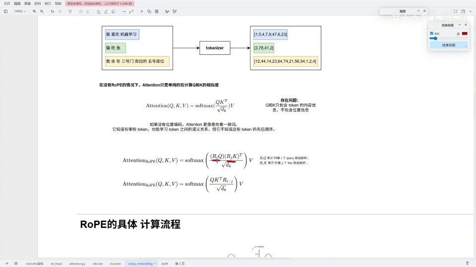
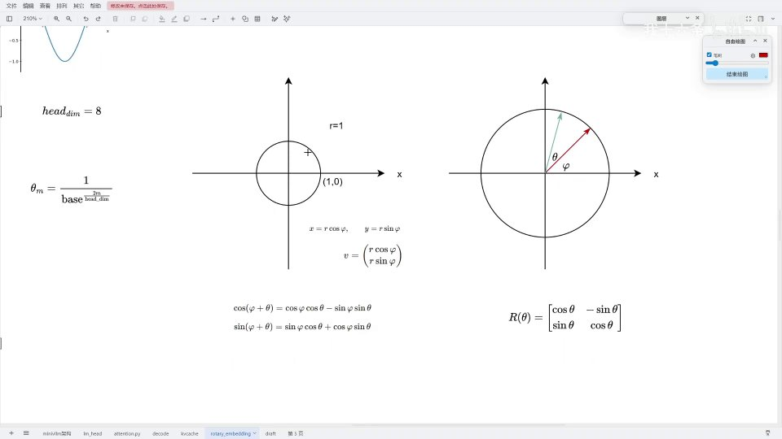
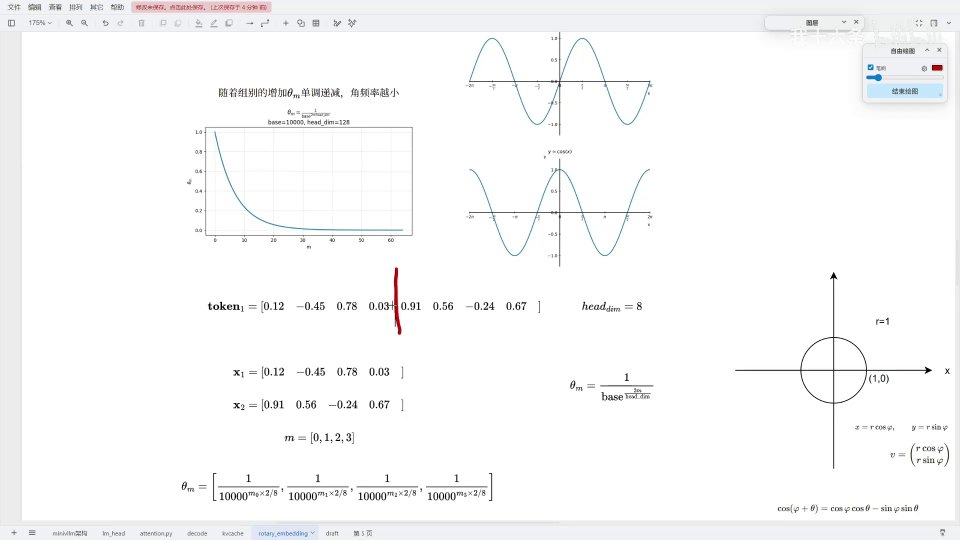
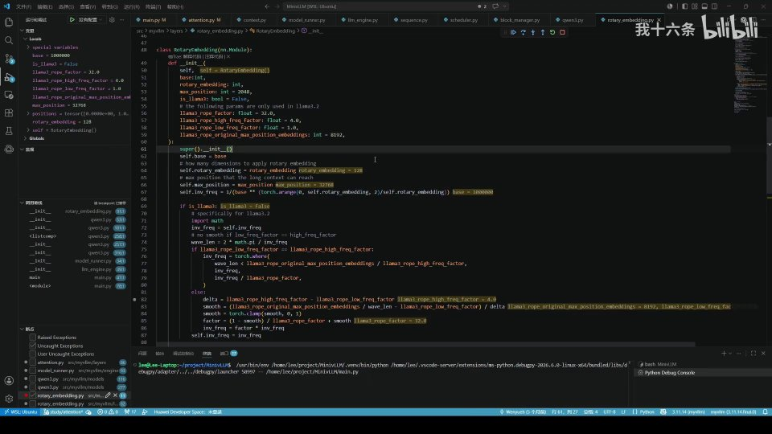
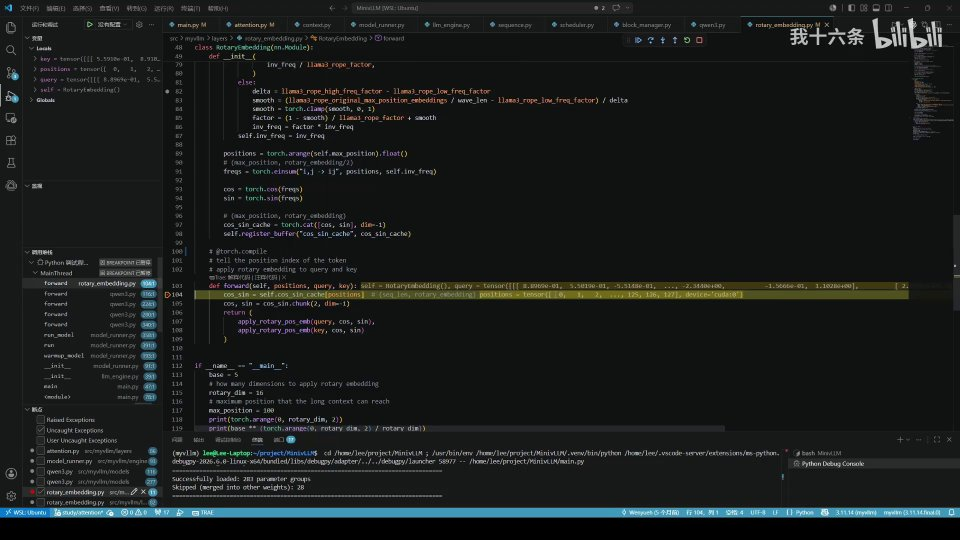

# 第12讲：RoPE —— 用「旋转」把位置信息写进 Q、K



## 本讲要解决的核心问题（SCQA）

**背景**：Attention 是 Transformer 的核心，它靠 Q 和 K 的点积计算相似度。但点积本身是**顺序无关**的——「猫吃鱼」和「鱼吃猫」用的是同一批 token，点积算出来一样。

**冲突**：注意力机制本身并不知道 token 的先后顺序。如果直接把 token 的嵌入拿去算注意力，位置信息就丢失了，语句意思可能被完全颠倒。而位置信息又不能简单地「多加一维特征」——那样会增加参数量，还可能破坏模型对长度的泛化。

**疑问**：有没有一种方法，能在**不增加参数**的前提下，把位置信息编码进 Q、K？

**回答（中心思想）**：有，这就是 **RoPE（Rotary Position Embedding，旋转位置嵌入）**。它的核心是：把每个 token 的向量按维度两两分成「向量对」，每一对根据它所在的位置乘上一个**旋转矩阵**，相当于在二维平面上转一个角度。旋转角与位置成正比。这样做的妙处在于：当第 i 个位置的 Q 和第 j 个位置的 K 做点积时，两个旋转矩阵相乘，最后只剩一个与**相对位置 (i−j)** 有关的角度——位置信息被自然编码进注意力里。本讲从「为什么」到「旋转矩阵」，再到代码走查，讲清楚 RoPE。

---

## 一、为什么需要 RoPE

用一个「预测体重」的类比来理解位置的重要性。

[【跳转到 00:99】](https://www.bilibili.com/video/BV1U6jN6MEet/?t=99)



预测体重时，特征有体脂率、性别、年龄、身高——这些决定体重。但体重还与**饮食结构**有关：北方人吃肉蛋奶多、南方人吃蔬菜多，这来自**地理位置的差异**。我们希望在**不增加特征量**的前提下，把这种「位置差异」体现进去。旋转嵌入解决的正是这个问题。

具体到语言：三个序列经过 tokenizer 变成 token。在没有 RoPE 的情况下，attention 只是单纯计算 Q、K 的点积：

[【跳转到 01:82】](https://www.bilibili.com/video/BV1U6jN6MEet/?t=182)



$$\text{Attention}(Q,K,V) = \text{softmax}\left(\frac{QK^T}{\sqrt{d_k}}\right)V$$

**问题**：Q 和 K 只含 token 的内容信息，不含位置信息。「猫吃鱼」的内容信息确实在，但位置一换变成「鱼吃猫」，token 一样、词的位置不同，整句意思就变了。所以需要把位置信息嵌入进去。

加了 RoPE 之后，公式变成：先对第 i 个位置的 Q 乘旋转矩阵 `R_i`，对第 j 个位置的 K 乘 `R_j`：

$$\text{Attention}_{RoPE}(Q,K,V) = \text{softmax}\left(\frac{(Q\cdot R_i)(K\cdot R_j)^T}{\sqrt{d_k}}\right)V$$

---

## 二、预备知识：旋转矩阵

在单位圆上，任意一点可以用 `x = r cosφ`、`y = r sinφ` 表示。想把它逆时针旋转角度 θ：

[【跳转到 02:07】](https://www.bilibili.com/video/BV1U6jN6MEet/?t=207)



旋转后角度变成 `φ + θ`，用高中三角函数展开：

$$\cos(\varphi+\theta) = \cos\varphi\cos\theta - \sin\varphi\sin\theta$$
$$\sin(\varphi+\theta) = \sin\varphi\cos\theta + \cos\varphi\sin\theta$$

代入 `x = r cosφ`、`y = r sinφ` 整理，得到：

$$\begin{bmatrix} x' \\ y' \end{bmatrix} = \begin{bmatrix} \cos\theta & -\sin\theta \\ \sin\theta & \cos\theta \end{bmatrix}\begin{bmatrix} x \\ y \end{bmatrix}$$

这个 2×2 矩阵就是**旋转矩阵** `R(θ)`。RoPE 的一切都建立在这个旋转矩阵上。

---

## 三、RoPE 怎么做：分组旋转

假设 token 的嵌入维度是 8。高维不好直接旋转，做法是：**把 token 向量按相邻两维分成「向量对」，对每一对分别旋转**。

[【跳转到 04:07】](https://www.bilibili.com/video/BV1U6jN6MEet/?t=407)



以 `token1 = [0.12, -0.45, 0.78, 0.03, 0.91, 0.56, -0.24, 0.67]` 为例，head_dim = 8，分成四对。

**每对的旋转角度不同**，角频率由公式给出：

[【跳转到 04:32】](https://www.bilibili.com/video/BV1U6jN6MEet/?t=432)

$$\theta_m = \frac{1}{\text{base}^{2m / d}}, \quad m = 0,1,2,\dots$$

其中 `base` 是超参数（Qwen3 里是 10000），`d` 是 head_dim。四组算出来：

[【跳转到 04:57】](https://www.bilibili.com/video/BV1U6jN6MEet/?t=457)

![四个组别的角频率：θ_m = [1, 0.1, 0.01, 0.001]](assets/第12讲_RoPE旋转嵌入/00457.jpg)

$$\theta_m = [1,\ 0.1,\ 0.01,\ 0.001]$$

也就是：越靠前（低频组）旋转越快，越靠后旋转越慢。**位置不同，旋转频率就不同**——通过组合不同频率，模型就能感知不同距离的位置关系。

### 3.1 频率表与 cos/sin cache

把角频率乘以位置，得到每个位置的旋转频率：

[【跳转到 05:57】](https://www.bilibili.com/video/BV1U6jN6MEet/?t=557)


```
freqs = positions^T · θ_m
```

预计算每个位置、每个维度对应的 `cos` 和 `sin`，存成 `cos_sin_cache`（形状 `[max_position, head_dim]`），实际计算时直接查表即可。

---

## 四、注意力公式的变换：只剩相对位置

加入旋转后，把公式展开：

[【跳转到 06:32】](https://www.bilibili.com/video/BV1U6jN6MEet/?t=632)


$$\text{Attention}_{RoPE}(q_i,k_j,v) = \text{softmax}\left(\frac{(q_i R_i)(k_j R_j)^T}{\sqrt{d_k}}\right)v = \text{softmax}\left(\frac{q_i R_i R_j^T k_j^T}{\sqrt{d_k}}\right)v$$

对旋转矩阵来说，**转置等于逆**（`R_j^T = R_j^{-1}`）。`R_j` 是逆时针旋转，它的逆就是顺时针旋转，于是：

$$R_i R_j^T = R_i R_j^{-1} = R_{i-j}$$

[【跳转到 06:82】](https://www.bilibili.com/video/BV1U6jN6MEet/?t=682)


$$\text{Attention}_{RoPE}(q_i,k_j,v) = \text{softmax}\left(\frac{q_i \cdot R_{i-j}\cdot k_j^T}{\sqrt{d_k}}\right)v$$

这就是 RoPE 的精髓：旋转矩阵相乘后，**只剩下一个只与相对位置 `i−j` 有关的角度**。位置信息被自然地嵌入到注意力计算中，而且天然表达了「相对距离」。

---

## 五、代码走查

RoPE 代码发生在 attention 内部，也就是 QKV 线性变换之后。

[【跳转到 07:38】](https://www.bilibili.com/video/BV1U6jN6MEet/?t=738)



- **base**：与模型有关，Qwen3-0.6B 的 base 是 10000；
- **rotary_dim / head_dim**：旋转嵌入维度是 128。虽然 Qwen3-0.6B 的嵌入是 1024，但因为 GQA、多头，每个头维度是 128，所以针对每个头做旋转；
- **max_position**：支持的最大位置，这里是 32768（32K 上下文长度）。

初始化时预计算所有位置的 cos/sin：

[【跳转到 08:88】](https://www.bilibili.com/video/BV1U6jN6MEet/?t=888)



```python
self.cos_sin_cache = torch.cat([cos, sin], dim=-1)  # shape: [32768, 128]
```

它是 `32768 × 128` 的矩阵——32768 个位置，每个位置 128 维的旋转信息。计算时按传入的 position 从这个大矩阵里取出对应行即可。

实际应用旋转：

[【跳转到 11:38】](https://www.bilibili.com/video/BV1U6jN6MEet/?t=1138)


```python
def apply_rotary_pos_emb(q, k, cos, sin):
    # cos/sin unsqueeze 到与 head_dim 对齐
    x1, x2 = x.chunk(2, dim=-1)      # 沿 embedding 维分成前后两半
    out1 = x1 * cos - x2 * sin        # 旋转
    out2 = x2 * cos + x1 * sin
    return torch.cat([out1, out2], dim=-1)   # 拼回
```

要点：

- 旋转只作用于 Q 和 K，不作用于 V；
- cos/sin 做了一个 `unsqueeze`，把维度拓展到与头维度对齐，因为它只对最后的 head_dim 做旋转；
- 通过 `chunk(2)` 把向量分成前后两半（对应「向量对」），做旋转后再 `cat` 拼回去，就得到了嵌入位置信息后的 Q、K。

---

## 小结

- **Attention 本身不含位置信息**：单纯的 Q·K 点积分不清「猫吃鱼」和「鱼吃猫」。
- **RoPE 用旋转编码位置**：把向量按维度两两分组，每组按位置乘一个旋转矩阵，不增加参数量。
- **旋转矩阵来自单位圆**：`R(θ) = [[cosθ, -sinθ], [sinθ, cosθ]]`。
- **角频率 `θ_m = 1 / base^{2m/d}`**：不同组频率不同（如 `[1, 0.1, 0.01, 0.001]`），靠多种频率感知不同距离。
- **位置编码进角度**：频率 = 位置 × 角频率，预计算成 `cos_sin_cache`。
- **核心结论**：`R_i R_j^T = R_{i-j}`，注意力最终只与**相对位置 (i−j)** 有关。
- **代码**：Qwen3-0.6B 的 base=10000、head_dim=128、max_position=32768；对 Q、K 做旋转（V 不做）。

## 关键术语速查

| 术语 | 一句话解释 |
| --- | --- |
| RoPE | 旋转位置嵌入，用旋转矩阵把位置信息编码进 Q、K |
| 旋转矩阵 R(θ) | `[[cosθ,-sinθ],[sinθ,cosθ]]`，把向量逆时针转 θ |
| 向量对 | 把 token 向量按相邻两维分成的一组，RoPE 对每组单独旋转 |
| 角频率 θ_m | `1 / base^{2m/d}`，决定第 m 组旋转的快慢 |
| base | 频率底数超参数，Qwen3 里为 10000 |
| head_dim / rotary_dim | 每个头的维度（本例 128），旋转作用在这一维度上 |
| max_position | 支持的最大位置数（本例 32768） |
| cos_sin_cache | 预计算好的 cos/sin 表，形状 `[max_position, head_dim]` |
| R_{i-j} | 旋转矩阵相乘后的结果，只与相对位置有关 |
| apply_rotary_pos_emb | 实际执行旋转的函数：切分、旋转、拼回 |
