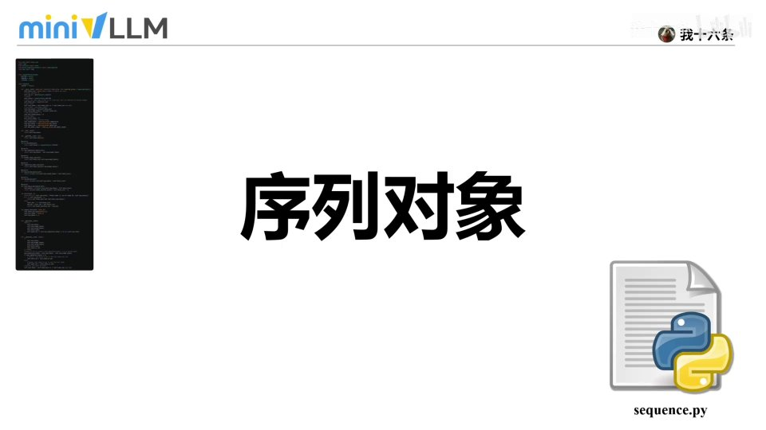
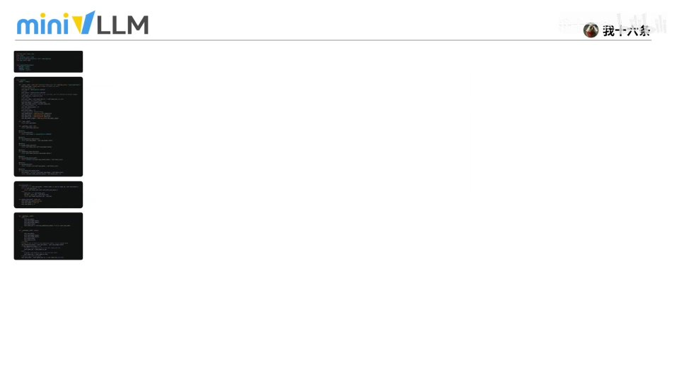
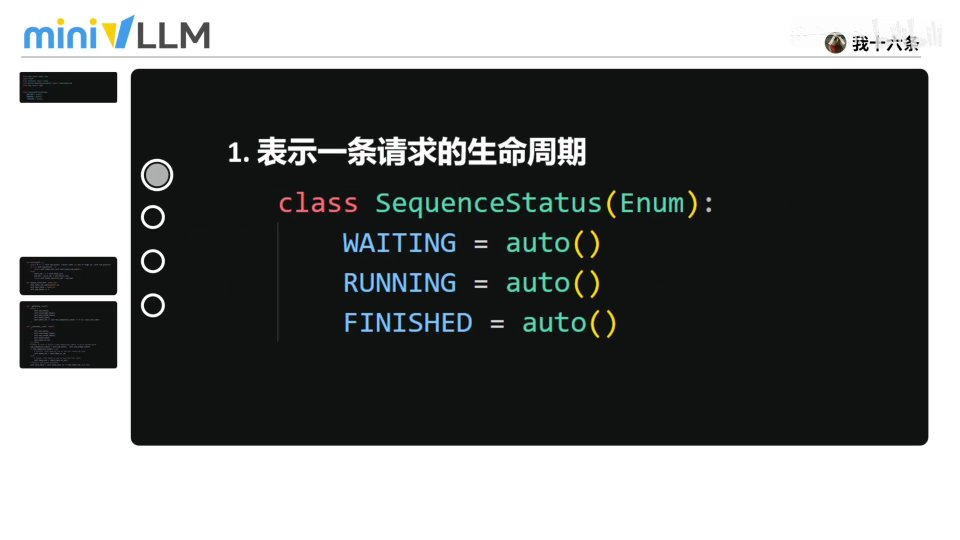
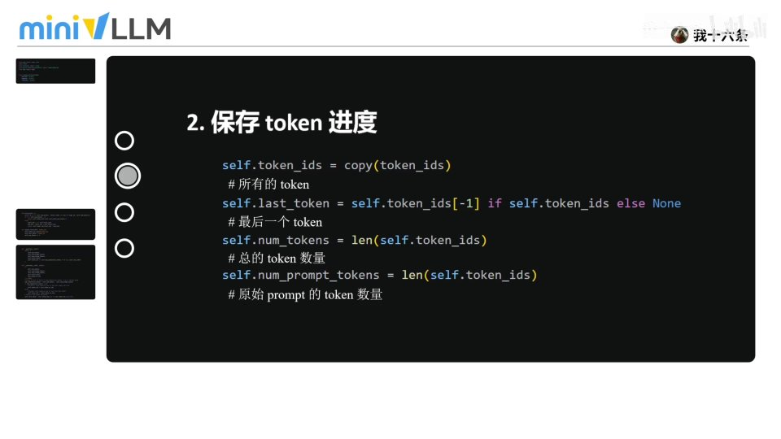
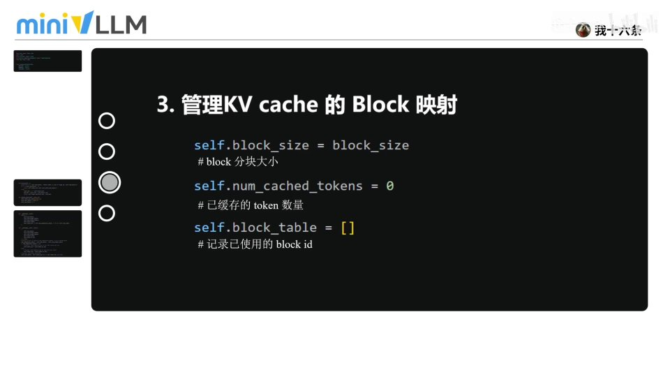
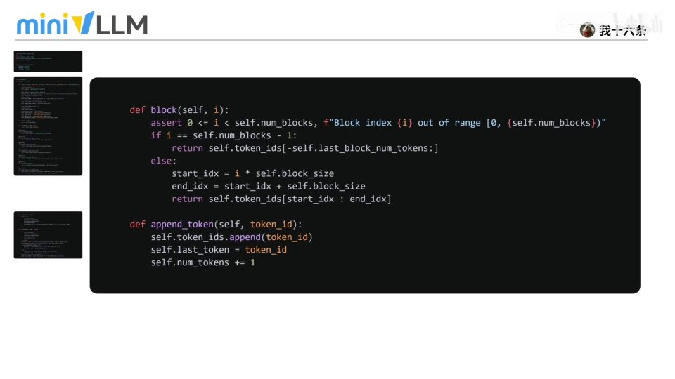
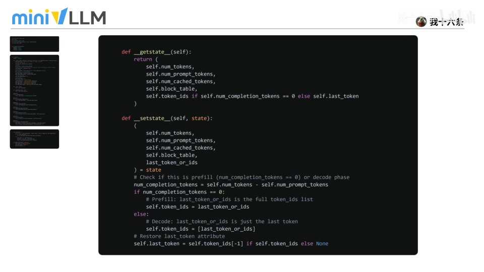

# 第13讲：sequence.py —— 推理引擎中的序列对象



## 本讲要解决的核心问题（SCQA）

**背景**：我们一路把 MiniVLLM 的各个算子（activation、RMSNorm、各种并行线性层、embedding、FlashAttention、PagedAttention、KV cache、RoPE）都讲完了。但一个推理引擎要同时服务很多条请求，每条请求都有自己的一串 token、自己的进度、自己占用的 KV cache。

**冲突**：这些状态如果散落在各处，就没法统一调度：谁在排队、谁在生成、谁结束了？某条请求现在生成了多少 token？它占用了哪些 KV cache 块？怎么在「暂停—恢复」时把它的状态存下来？

**疑问**：怎么把「一条请求」的完整状态封装成一个对象，让调度、缓存、采样都能围绕它来管理？

**回答（中心思想）**：用一个 **Sequence（序列对象）** 来表示一条请求的完整生命周期。它封装了四类信息——**序列状态**（waiting/running/finished）、**token 进度**、**KV cache 的 block 映射**、**采样与停止参数**；并提供按 block 读取、追加 token、序列化/反序列化等方法。本讲把 `sequence.py` 分成四个部分讲清楚。

---

## 一、概览：四个部分

`sequence.py` 可以分成四个部分来理解：

[【跳转到 00:27】](https://www.bilibili.com/video/BV1aYMM6wEsm/?t=27)



1. **序列状态类**：用枚举表示一条请求的生命周期（三种状态）；
2. **序列对象**：核心类，定义 token 进度、KV cache 映射、采样参数等；
3. **block / append_token 函数**：按 block 读取 token、追加新 token；
4. **序列化 / 反序列化函数**：`__getstate__` / `__setstate__`。

---

## 二、四个关键点

### 2.1 序列状态：一条请求的生命周期

序列状态用枚举类 `SequenceStatus` 表示，对应一条请求从进入到结束的三种状态：

[【跳转到 00:74】](https://www.bilibili.com/video/BV1aYMM6wEsm/?t=74)



```python
class SequenceStatus(Enum):
    WAITING  = auto()   # 等待：还在排队、等待资源调度
    RUNNING  = auto()   # 运行：已被调度到执行队列，开始生成 token
    FINISHED = auto()   # 结束：完成 / 达到停止条件 / 被终止
```

- **waiting**：请求进入系统，还没有被调度；
- **running**：被调度到 GPU / 执行队列，开始逐 token 生成；
- **finished**：请求完成、达到停止条件或被终止。

### 2.2 保存 token 进度

序列对象需要记录 token 的进度：

[【跳转到 01:24】](https://www.bilibili.com/video/BV1aYMM6wEsm/?t=124)



```python
self.token_ids = copy(token_ids)          # 所有的 token
self.last_token = self.token_ids[-1] if self.token_ids else None  # 最后一个 token
self.num_tokens = len(self.token_ids)     # 总 token 数量
self.num_prompt_tokens = len(self.token_ids)  # 原始 prompt 的 token 数量
```

- **token_ids**：当前请求已有的全部 token；
- **last_token**：最后生成或输入的 token；
- **num_tokens**：当前总长度；
- **num_prompt_tokens**：原始 prompt 的 token 数——后续可以用它区分「输入部分」和「输出部分」。

### 2.3 管理 KV cache 的 block 映射

序列对象也保存 KV cache 的分块映射：

[【跳转到 01:49】](https://www.bilibili.com/video/BV1aYMM6wEsm/?t=149)



```python
self.block_size = block_size            # 每个 block 能存多少 token
self.num_cached_tokens = 0              # 已缓存的 token 数量
self.block_table = []                   # 记录已使用的 block id
```

- **block_size**：每个缓存块能存放多少 token；
- **num_cached_tokens**：已经写入缓存的 token 数量；
- **block_table**：该序列占用过的 block id，方便后续生成时快速定位缓存。

> 这正是 PagedAttention 分页机制在「序列」层面的落地（详见第10、11讲）。

### 2.4 采样与停止参数

序列对象还携带采样和停止相关参数：

- **temperature**：采样随机性，温度越高越随机；
- **max_tokens**：限制最多生成多少 token；
- **ignore_eos**：是否忽略结束符、继续生成；
- **max_model_len**：限制 prompt + 输出的总长度，避免超过模型上下文窗口。

[【跳转到 01:49】](https://www.bilibili.com/video/BV1aYMM6wEsm/?t=149)

---

## 三、按 block 读取与追加 token

第三部分有两个函数：`block(i)` 按编号取出某个逻辑 block 里的 token，`append_token` 追加新 token。

```python
def block(self, i: int):
    assert 0 <= i < self.num_blocks
    if i == self.num_blocks - 1:
        return self.token_ids[-self.last_block_num_tokens:]   # 最后一块可能不满
    start_idx = i * self.block_size
    return self.token_ids[start_idx : start_idx + self.block_size]

def append_token(self, token_id: int):
    self.token_ids.append(token_id)
    self.last_token = token_id
    self.num_tokens += 1
```

[【跳转到 01:88】](https://www.bilibili.com/video/BV1aYMM6wEsm/?t=188)



### 3.1 一个例子

序列「今天天气非常不错」tokenize 后是长度 11 的 token 序列。设 `block_size = 3`：

[【跳转到 02:13】](https://www.bilibili.com/video/BV1aYMM6wEsm/?t=213)


- `11 ÷ 3` 向上取整 = **4 个 block**；
- 把一整段 token 看成一条长队，按 `block_size` 切成一块一块；
- 传入的 `i` 就是想取第几块，`block(i)` 返回该块缓存的 token。

`append_token` 则在每次生成新 token 后，把它加入 `token_ids`、更新 `last_token`、并把总数加一。

---

## 四、序列化与反序列化

第四部分是 `__getstate__` 和 `__setstate__`，用于「暂停—恢复」序列的状态。

[【跳转到 02:64】](https://www.bilibili.com/video/BV1aYMM6wEsm/?t=264)



**`__getstate__`（打包）** 保存关键信息：token 数量、prompt 长度、缓存数量、block 映射表，以及 token_ids 或 last_token。

```python
num_completion_tokens = self.num_tokens - self.num_prompt_tokens
if num_completion_tokens == 0:
    # 还在 prefill：保存完整的 token_ids
    self.token_ids = last_token_or_ids
else:
    # 已进入 decode：只需保存最后一个 token，节省开销
    self.token_ids = [last_token_or_ids]
self.last_token = self.token_ids[-1] if self.token_ids else None
```

**`__setstate__`（还原）** 把保存的信息复制回来，并判断当前是 **prefill 还是 decode**：

- prefill 阶段：恢复**完整的 token_ids**；
- decode 阶段：为节省开销，只恢复**最后一个 token**；
- 最后更新 `last_token`，保证序列能继续正常生成。

---

## 小结

- **Sequence 表示一条请求的完整生命周期**，是推理引擎调度的基本单位。
- **状态三态**：waiting（排队）→ running（生成）→ finished（结束）。
- **token 进度**：token_ids、last_token、num_tokens、num_prompt_tokens。
- **KV cache 映射**：block_size、num_cached_tokens、block_table，衔接 PagedAttention。
- **采样与停止参数**：temperature、max_tokens、ignore_eos、max_model_len。
- **block(i) / append_token**：按块读 token、追加新 token。
- **序列化/反序列化**：`__getstate__` 打包、`__setstate__` 还原；prefill 恢复全量 token，decode 只恢复最后一个以省开销。

## 关键术语速查

| 术语 | 一句话解释 |
| --- | --- |
| Sequence（序列对象） | 表示一条请求完整生命周期与状态的对象 |
| SequenceStatus | 序列状态枚举：waiting / running / finished |
| token_ids | 当前请求已有的全部 token |
| last_token | 最后生成或输入的 token |
| num_prompt_tokens | 原始 prompt 的 token 数，用于区分输入与输出 |
| block_size | 每个缓存块能存的 token 数 |
| block_table | 序列占用的 block id 列表 |
| block(i) | 取出第 i 个逻辑 block 里的 token |
| append_token | 追加新 token，并更新 last_token 与总数 |
| __getstate__ / __setstate__ | 序列化打包 / 反序列化还原序列状态 |
| prefill / decode | 序列处于预填充阶段 / 解码阶段 |
