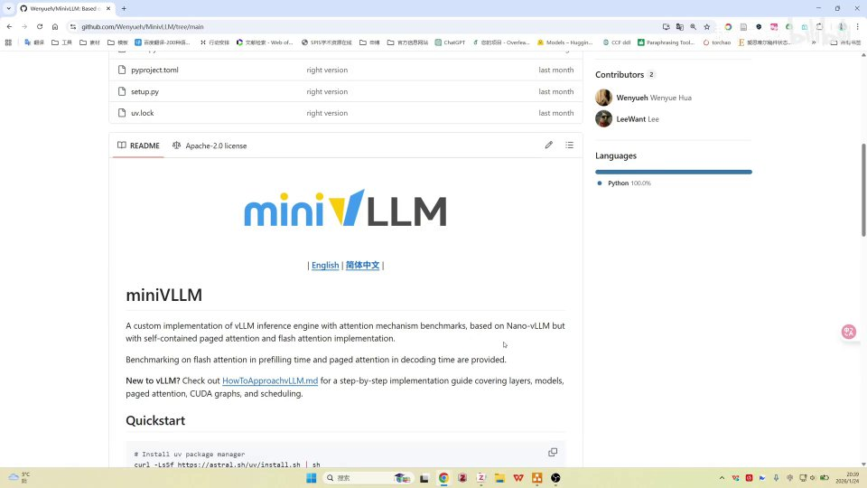
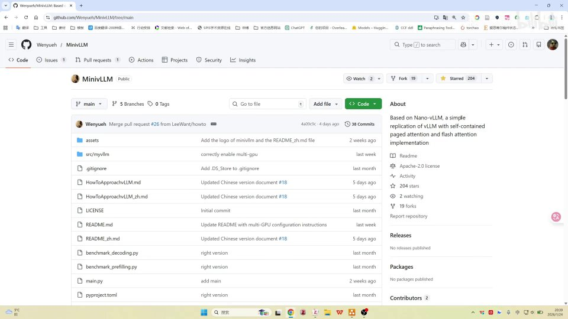
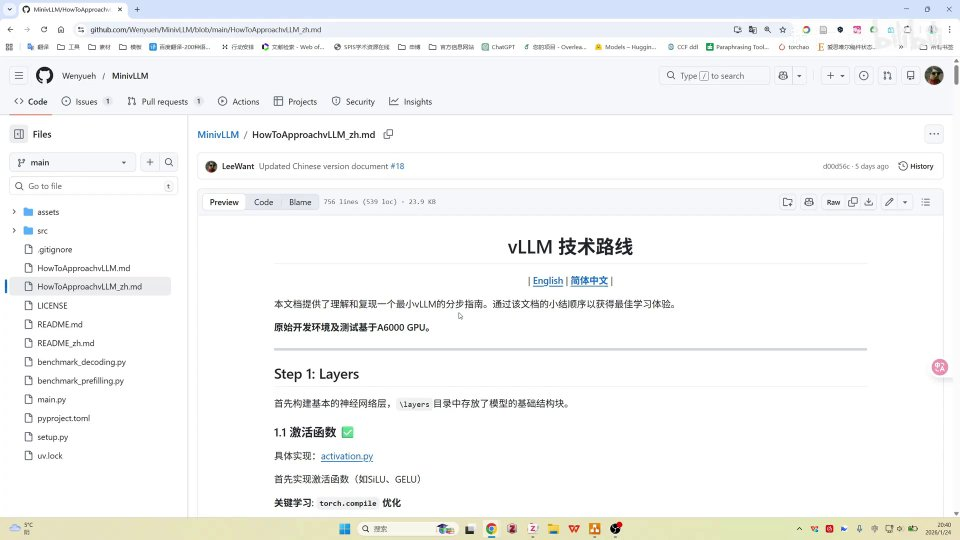
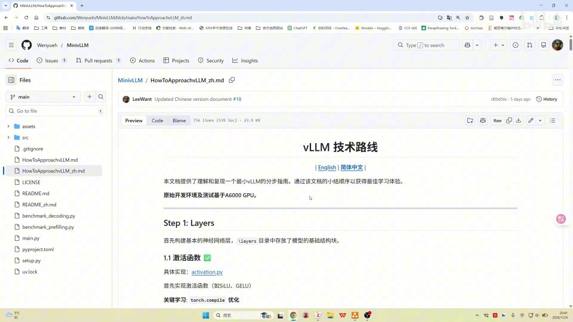
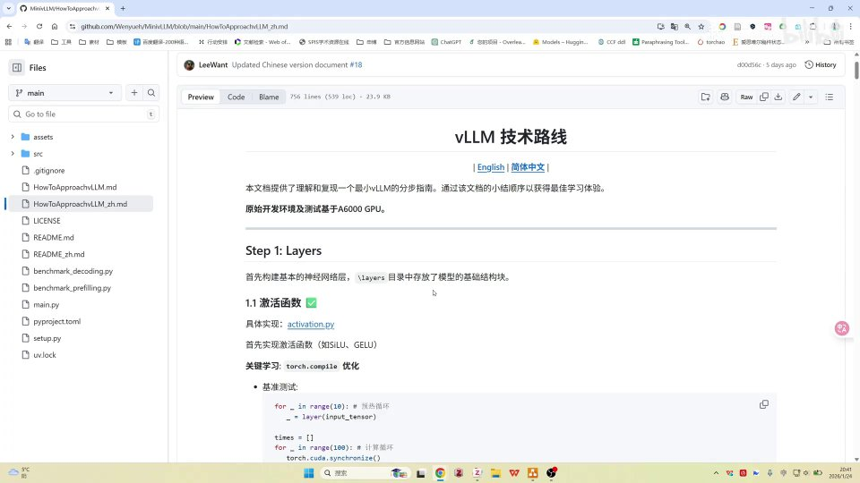
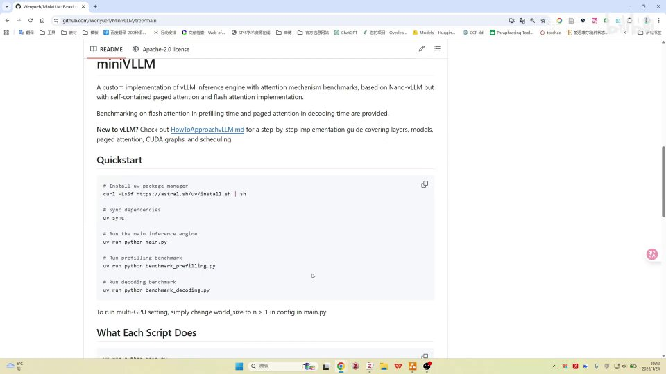

# minivllm项目介绍 原始文稿（图-字幕分栏）

| 字幕文本 | 画面 |
| :--- | ---: |
| 今天给大家推荐一个开源项目吧，就是这个 MiniVLLM。呃，其实这个 MiniVLLM 是我正在参与贡献的一个项目，然后它是由呃微软的高级研究员，也就微软高级人工智能研究院的高级研究员，就是这位华博士，他做的一个开源项目。这个项目它其实基于的是 Nano-vLLM，呃，相较于 vLLM 来说呢 [【跳转到 00:00】](https://www.bilibili.com/video/BV1Vjz1B2EQu/?t=0) |  |
| MiniVLLM 它在文档上会更全面一点，并且就是呃实现了自己的 page attention 以及 flash attention，然后做了一些 benchmark。嗯，大家可以粗略地看一下，这个文档其实还是比较丰富的，包括中英文版都有。啊，这个 logo 其实是我自己设计的，我觉得其实还挺好看的。然后这个呃简体中文呢，其实就是嗯也是我去做的翻译。 [【跳转到 00:25】](https://www.bilibili.com/video/BV1Vjz1B2EQu/?t=25) |  |
| 然后包括一个 vLLM 的技术路线，它相较于 Nano-vLLM 来说的话，呃，就是这一部的文档会稍微丰富一点，就是包括呃每一层具体是做什么、然后有什么实现、然后 benchmark 做了些啥，然后基本的关键知识呀啥的，其实都有去做一个介绍。然后它是 step by step 吧，就比较新手友好。就我在学习 vLLM 的时候，我就觉得啊，vLLM 太臃肿了。 [【跳转到 00:50】](https://www.bilibili.com/video/BV1Vjz1B2EQu/?t=50) |  |
| 就没办法去做，呃，虽然说大体框架可能呃比较粗略地去了解了一下，但是当想要深入细节的时候，就发现有时候有点摸瞎、不知道从哪里去入手。所以说当时就是想去找一个呃 vLLM 的实现，但是其实当时就找了一些，然后正好又看见那个 vLLM 的官方，就小红书官方，他又发表了一个呃 vLLM 的一个入门教程。 [【跳转到 01:15】](https://www.bilibili.com/video/BV1Vjz1B2EQu/?t=75) |  |
| 然后就推荐了 MiniVLLM 这个项目啊。当时也十分凑巧，也就是刚刚 MiniVLLM 呃发布一周左右，然后嗯 vLLM 的官网就小红书官方就做了一个推荐，所以说就了解到了这个项目。然后就这就提交了几个 PR 然后以及 issue，然后就参与到了这个项目的贡献中。呃，后续我是准备每一个节 [【跳转到 01:40】](https://www.bilibili.com/video/BV1Vjz1B2EQu/?t=100) |  |
| 每一个字，每一个这个 step 都去做一个视频。从 linear layer 啊，就是从 layer 层，包括具体的 activation 的实现啊，还有呃 layer norm 之类的实现，就一步一步往下录视频。呃，这个项目其实对于我来说应该还挺大的吧，就时间上可能没有那么充分，但是反正先挖个坑在这里，既然都决定去做了就一定会去做的，只是这个时间嗯不是很确定。 [【跳转到 02:05】](https://www.bilibili.com/video/BV1Vjz1B2EQu/?t=125) |  |
| 就希望如果说反馈比较好的话，可能会更新得比较快一点吧。呃，这个就这样吧，就还是给大家推荐一下，然后大家可以感兴趣的话可以关注一下。就我觉得这个 MiniVLLM 就用于做学习的话，其实还是挺好的，就对 vLLM 的基础结构有一个比较初步的了解啊，而且因为呃中英文版都有，然后包括技术路线也有。 [【跳转到 02:30】](https://www.bilibili.com/video/BV1Vjz1B2EQu/?t=150) |  |
| 就对新手还是比较友好。感兴趣的同学就可以关注一下吧，就点个 Star 呀，或者说关注我也可以，之后的视频我会及时更新。如果有人催更的话，可能会更新得快一点吧。好，就这样。 [【跳转到 02:55】](https://www.bilibili.com/video/BV1Vjz1B2EQu/?t=175) |  |