# minivllm安装&activation.py实现 原始文稿（图-字幕分栏）

| 字幕文本 | 画面 |
| :--- | ---: |
| 没想到前两天发布的关于 MiniVLLM 这个 GitHub 项目分享，还挺多人看的。不过在进入正式的项目讲解之前，我想先给大家说几句话。首先第一点，MiniVLLM 是基于 Nano-vLLM 进行二次开发的，MiniVLLM 相对于 Nano-vLLM 来说，其实大部分内容是一样的，只有一些实现细节不同，以及 FlashAttention 这一块是 MiniVLLM 自己实现的。 [【跳转到 00:00】](https://www.bilibili.com/video/BV1M4zeB3EoY/?t=0) |  |
| 其他的都大差不差，两个都可以去学习。第二点，我也是项目的学习者，这其实算是费曼学习法。我觉得自己在学习的过程中多多少少有点枯燥、有点无聊，包括我在学习的时候，很喜欢把学习过程做成草稿，也会去推导这个学习的过程。 [【跳转到 00:25】](https://www.bilibili.com/video/BV1M4zeB3EoY/?t=25) |  |
| 比如形状（shape）的变化、tensor 的变化，还有公式是怎么一步一步推导出来的。既然平时学习也有做笔记，那就把这个笔记做成视频吧，这也是我自己做视频的初衷。所以在这个过程中，难免有些细节我掌握不到，因为我其实也并不是什么大佬，只是主观地表达自己的一个认知和理解。 [【跳转到 00:50】](https://www.bilibili.com/video/BV1M4zeB3EoY/?t=50) |  |
| 第三点，讲解的方式主要基于 draw.io。大家目前看到这个画面，也是想给大家推荐一下这个软件，用 draw.io 来做笔记或者做流程图什么的都非常方便。第四点，课件，比如我们用 draw.io 做的课件和草稿，我都会放在评论区，大家随时可以下载。第五点，关于更新频率。 [【跳转到 01:15】](https://www.bilibili.com/video/BV1M4zeB3EoY/?t=75) |  |
| 这个我其实不太能给出保障，因为上个视频我也说了会尽快更新，而上一个视频其实就是两天前更新的。因为最近确实挺忙的，一方面要忙毕业，另一方面还要准备申博的材料。所以更新的话，我尽量保持周更。第六点，关于环境。 [【跳转到 01:40】](https://www.bilibili.com/video/BV1M4zeB3EoY/?t=100) | 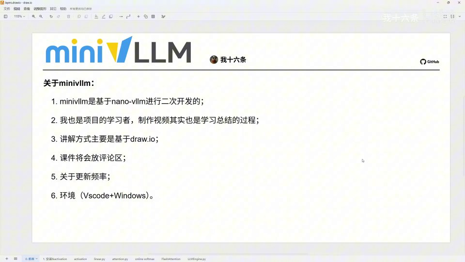 |
| 我这边的开发环境其实是基于 VS Code 加 Windows。总的来说就这么多。接下来就开始正式的分享吧。今天主要讲两个部分，第一个部分是安装，就是要安装环境，然后运行测试一下。 [【跳转到 02:05】](https://www.bilibili.com/video/BV1M4zeB3EoY/?t=125) | 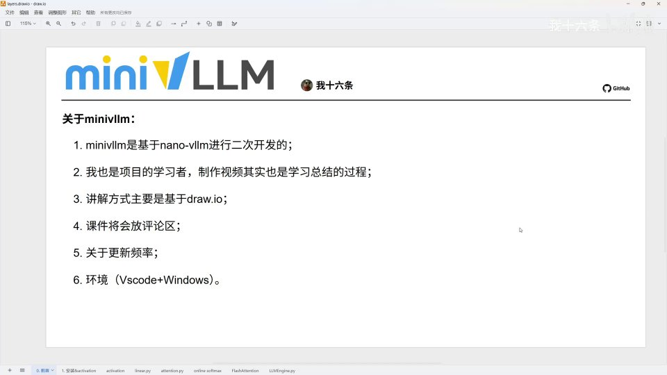 |
| 第二个部分是 layers 里的 activation 这一部分。所以今天的内容其实不是很多。 [【跳转到 02:21】](https://www.bilibili.com/video/BV1M4zeB3EoY/?t=141) | 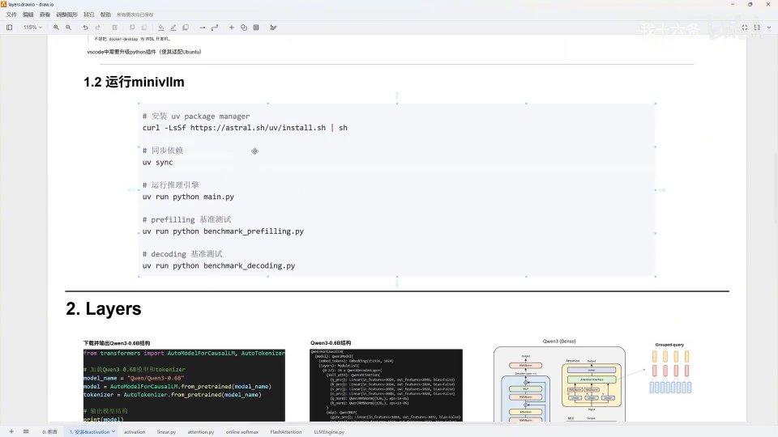 |
| 可能十来分钟吧。我们基于的提交记录是这个，以后如果大家看视频时发现我们的版本已经发生变化，可以跟着这个提交记录切到之前的分支，然后跟着这个视频来做。但我想应该不会有太大的变化。首先来讲一下安装。我其实是基于 Linux 进行开发的。 [【跳转到 02:26】](https://www.bilibili.com/video/BV1M4zeB3EoY/?t=146) |  |
| 但因为在家里录制的时候只有 Windows 环境，所以还是做了一个关于 Windows 安装开发的小教程。Linux 开发的话其实很简单，跟着 GitHub 上的流程走就行了。Windows 的话，其实只需要安装一个 WSL，也就是虚拟的 Linux 环境，然后跟着步骤走一遍就可以了。 [【跳转到 02:51】](https://www.bilibili.com/video/BV1M4zeB3EoY/?t=171) | 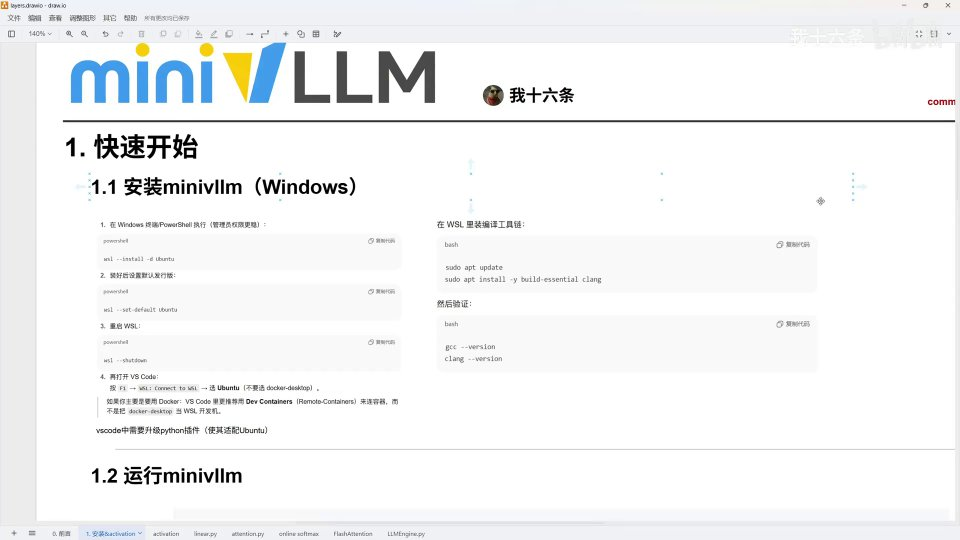 |
| 安装好 WSL 之后，还需要安装一个编译工具链，也是 C 语言、C++ 的，同样跟着步骤走一遍就可以了。然后我们直接来运行看一下。 [【跳转到 03:16】](https://www.bilibili.com/video/BV1M4zeB3EoY/?t=196) | 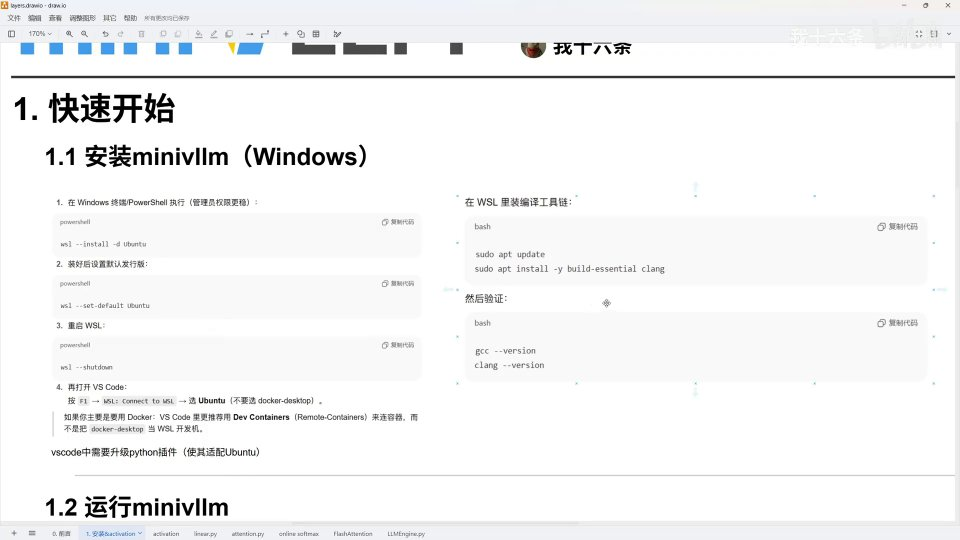 |
| 我这边已经连接到了 WSL，然后进入了一个目录。 [【跳转到 03:32】](https://www.bilibili.com/video/BV1M4zeB3EoY/?t=212) | 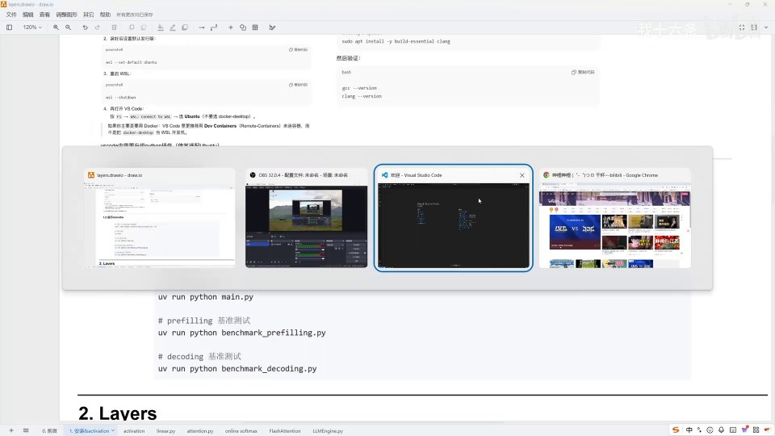 |
| 这个目录是我之前就创建好的，你们如果是第一次安装 WSL 的话…… [【跳转到 03:37】](https://www.bilibili.com/video/BV1M4zeB3EoY/?t=217) | 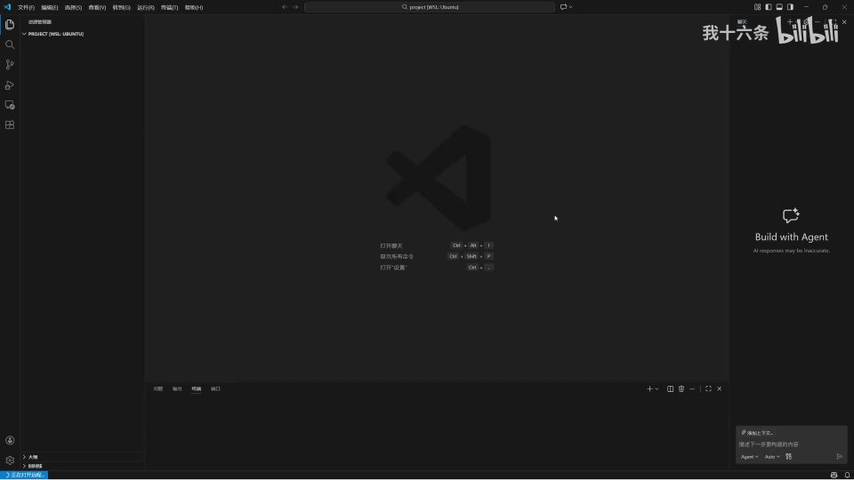 |
| 可以看到这下面其实是没有的。 [【跳转到 03:42】](https://www.bilibili.com/video/BV1M4zeB3EoY/?t=222) | 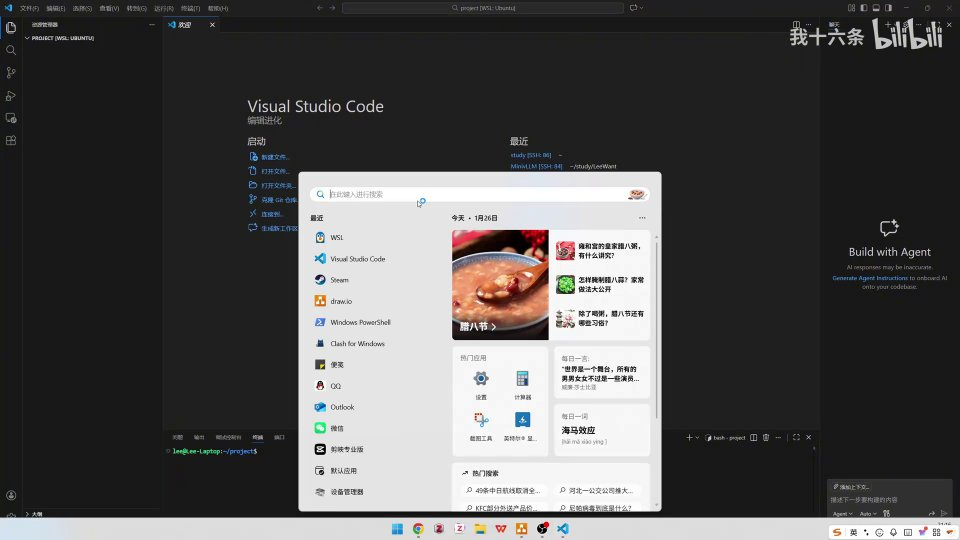 |
| 直接用 mkdir 创建你自己的目录就行了。好，我们现在已经在目录里面了，然后我们把项目克隆下来。 [【跳转到 03:47】](https://www.bilibili.com/video/BV1M4zeB3EoY/?t=227) | 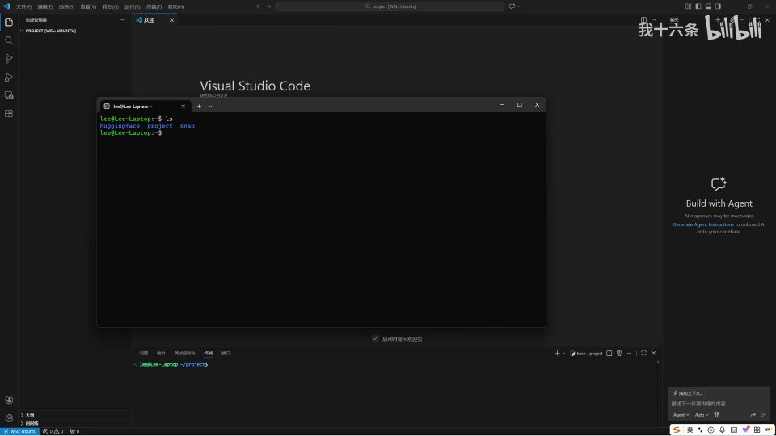 |
| 去 GitHub 主页，也就是 MiniVLLM 的主页，把链接复制下来。 [【跳转到 03:56】](https://www.bilibili.com/video/BV1M4zeB3EoY/?t=236) | 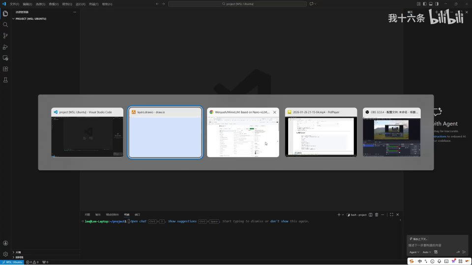 |
| 因为我已经装过 git 了，如果你们没装 git 的话，可以先装一个 git。ok，然后我们把项目克隆下来。好，项目已经到本地了。 [【跳转到 04:01】](https://www.bilibili.com/video/BV1M4zeB3EoY/?t=241) | 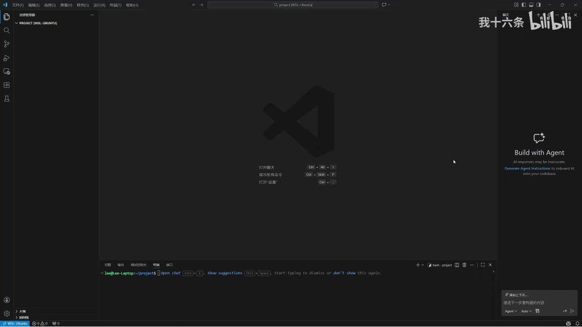 |
| 好，我们跟着这个步骤来走，因为我这边 uv 已经安装过了。 [【跳转到 04:14】](https://www.bilibili.com/video/BV1M4zeB3EoY/?t=254) | 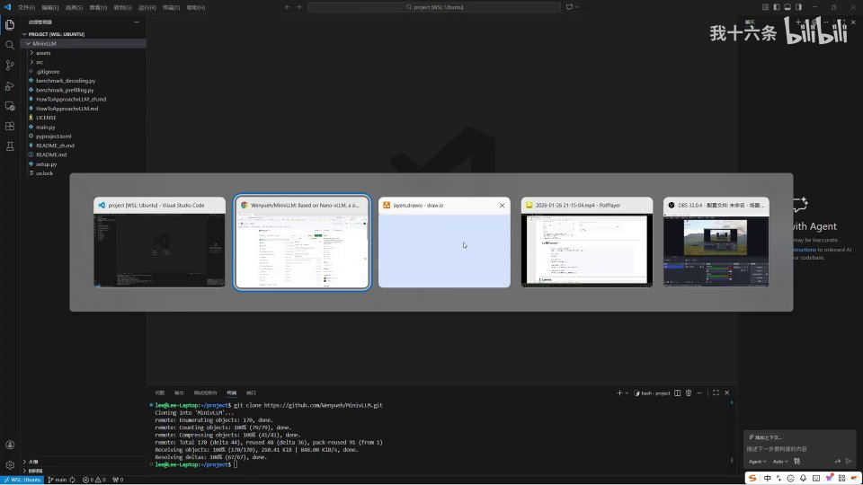 |
| 你们如果没有安装的话，运行一下就可以了。 [【跳转到 04:19】](https://www.bilibili.com/video/BV1M4zeB3EoY/?t=259) | 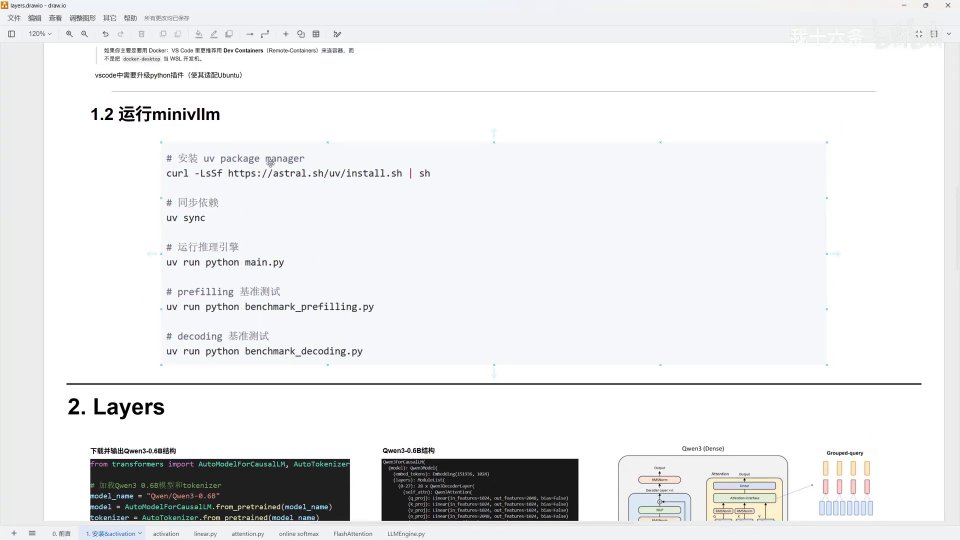 |
| 啊，我没有进入项目，先进入项目，然后 uv sync。这个地方因为我已经下载过，这些包之前都安装过，所以这一步会比较快；你们如果没装过的话会需要一点时间。ok，现在环境已经搭建好了。 [【跳转到 04:24】](https://www.bilibili.com/video/BV1M4zeB3EoY/?t=264) | 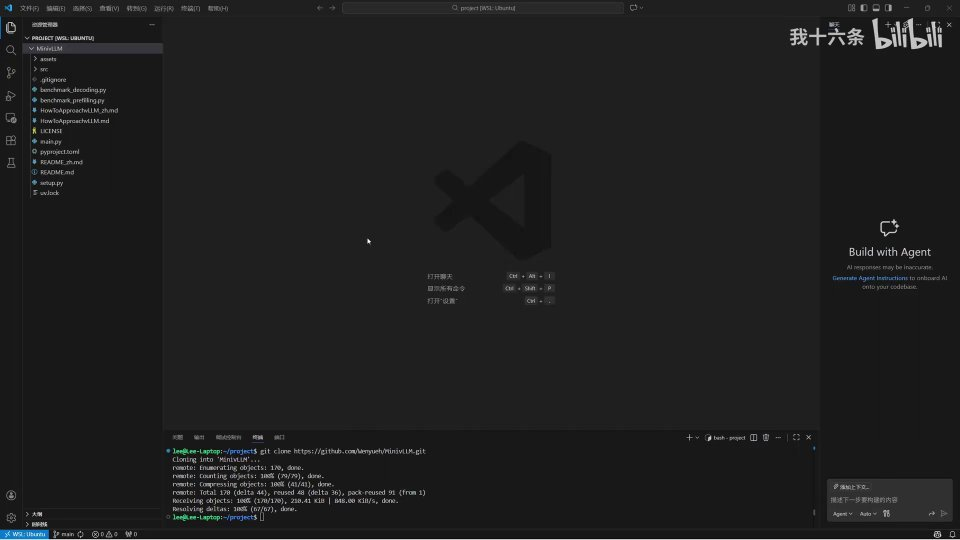 |
| 我们先来看一下 layers，今天我们就只介绍一下 activation。 [【跳转到 04:49】](https://www.bilibili.com/video/BV1M4zeB3EoY/?t=289) | 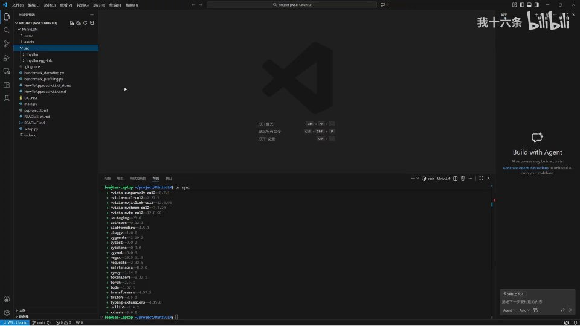 |
| 我们来看一下。哦对，这三个也可以去运行一下。 [【跳转到 04:58】](https://www.bilibili.com/video/BV1M4zeB3EoY/?t=298) | 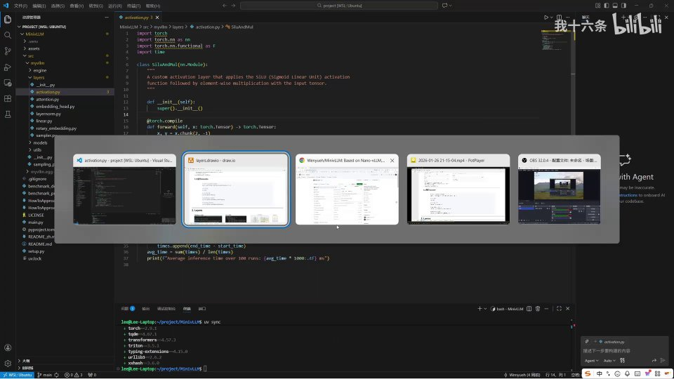 |
| 我这边也给大家做一个演示吧。首先是 main 函数，uv run xxx。 [【跳转到 05:03】](https://www.bilibili.com/video/BV1M4zeB3EoY/?t=303) | 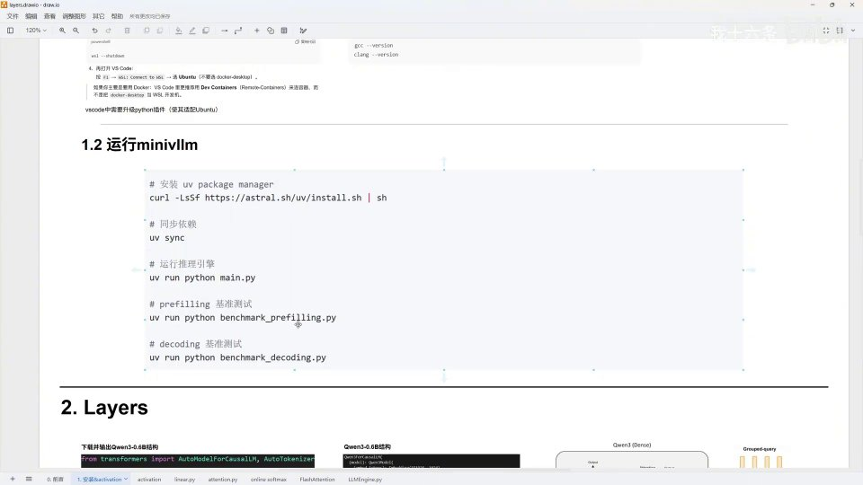 |
| 我看一下，它这个运行有点慢，因为我的显卡是 3070。 [【跳转到 05:08】](https://www.bilibili.com/video/BV1M4zeB3EoY/?t=308) | 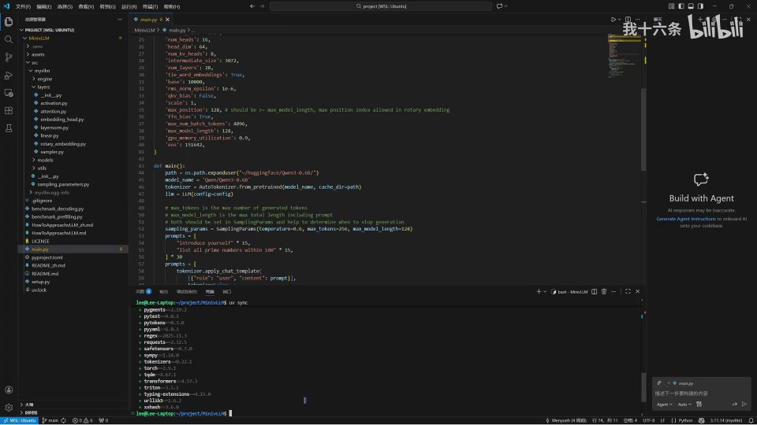 |
| 这不是慢的问题，这边重新运行一遍吧。 [【跳转到 05:17】](https://www.bilibili.com/video/BV1M4zeB3EoY/?t=317) | 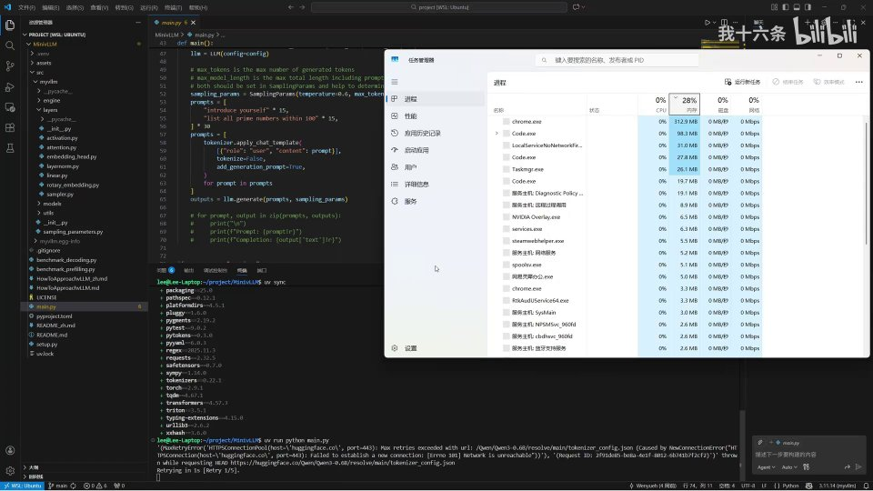 |
| （此区间无字幕） [【跳转到 05:23】](https://www.bilibili.com/video/BV1M4zeB3EoY/?t=323) | 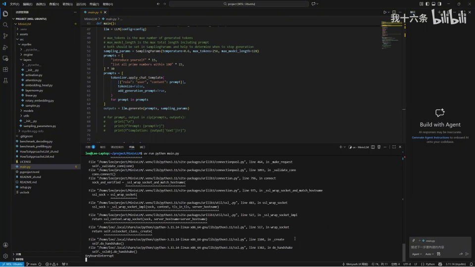 |
| 对于 3070 来说，其实压力还是挺大的。ok，main 函数就测试完了。 [【跳转到 05:28】](https://www.bilibili.com/video/BV1M4zeB3EoY/?t=328) | 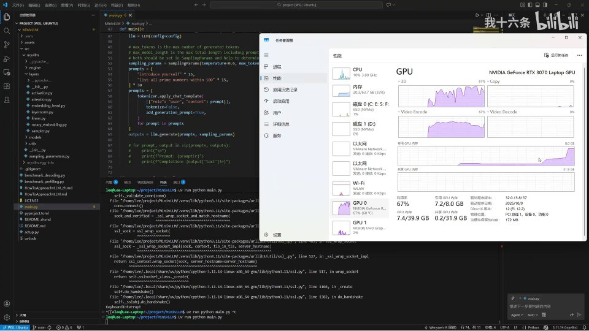 |
| 能运行的话就说明没有问题。然后我们可以接着测试一下 decoder 和那个 profile，一样的 uv run。先测 profile 吧，profile benchmark。 [【跳转到 05:43】](https://www.bilibili.com/video/BV1M4zeB3EoY/?t=343) | 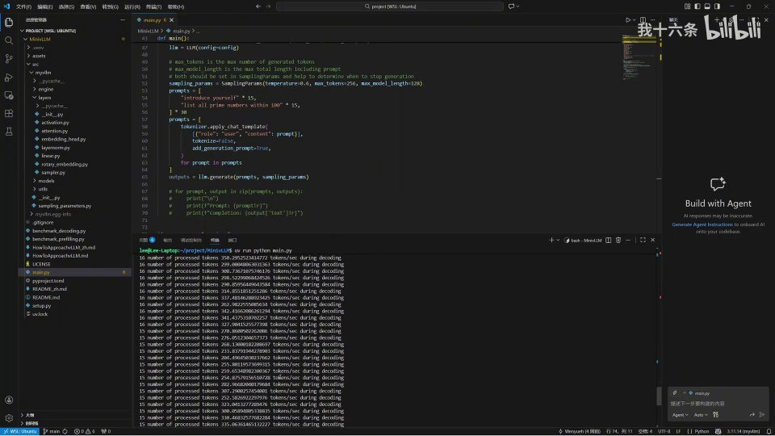 |
| ok，没问题。再来 uv run benchmark。 [【跳转到 06:04】](https://www.bilibili.com/video/BV1M4zeB3EoY/?t=364) | 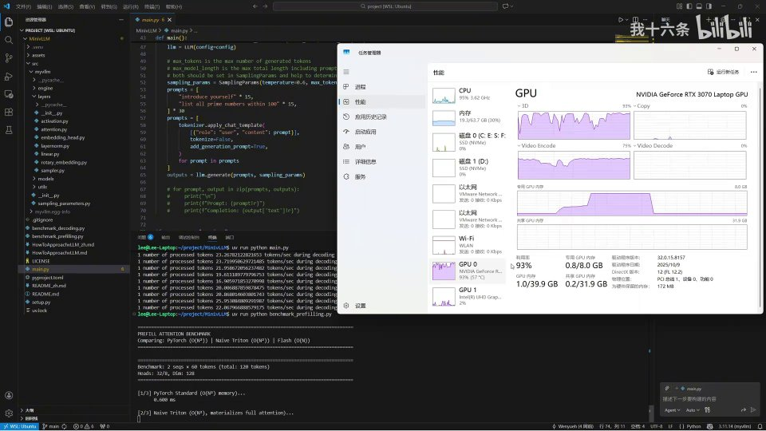 |
| 来测试一下 decoder。 [【跳转到 06:09】](https://www.bilibili.com/video/BV1M4zeB3EoY/?t=369) | 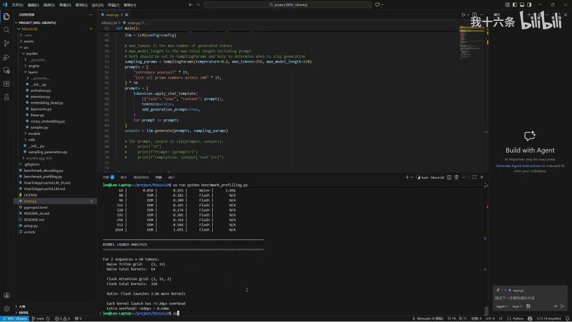 |
| ok ok，都没问题。 [【跳转到 06:17】](https://www.bilibili.com/video/BV1M4zeB3EoY/?t=377) | 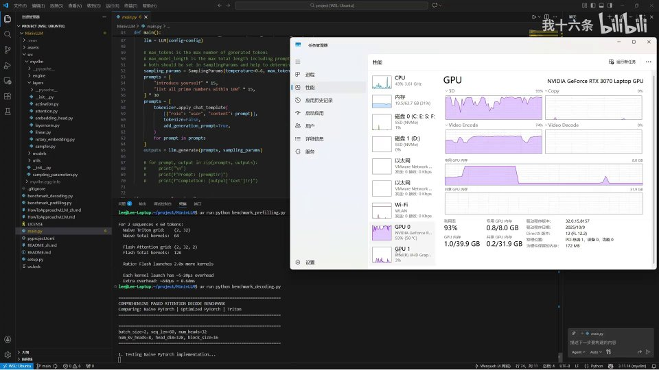 |
| 那接下来我们就深入讲一下 activation。activation 里边其实只有一个函数，就是这个 SiluAndMul，它其实就是把激活函数和乘加算在了一起。然后下面是一个基准测试，也就是 forward 函数，这个其实是最主要的。 [【跳转到 06:22】](https://www.bilibili.com/video/BV1M4zeB3EoY/?t=382) | 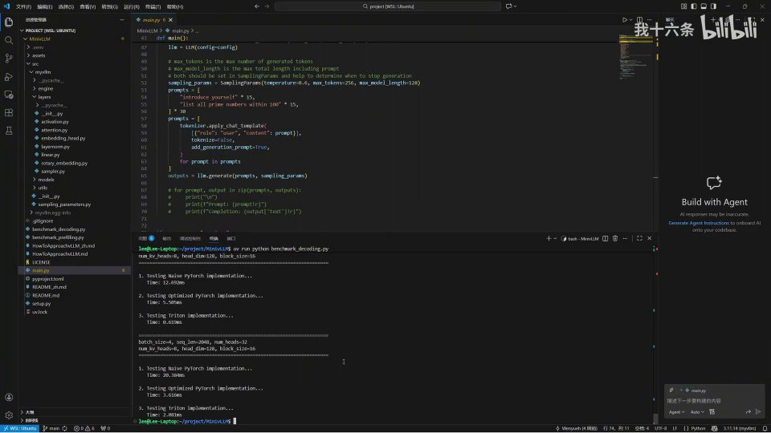 |
| 我们先来看讲义吧，在那之前。 [【跳转到 06:44】](https://www.bilibili.com/video/BV1M4zeB3EoY/?t=404) | 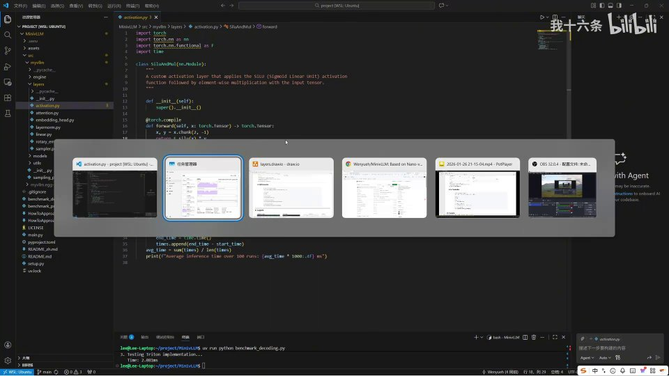 |
| 我们先下载并输出一下 Qwen3 0.6B 的结构，就把这个代码复制过去。 [【跳转到 06:49】](https://www.bilibili.com/video/BV1M4zeB3EoY/?t=409) | 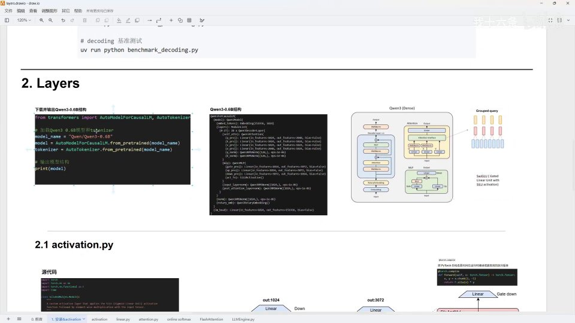 |
| 在这个目录下可以新建一个 check.py，然后挪到目录里边去，uv run 这个 check。这一步其实就是…… [【跳转到 06:56】](https://www.bilibili.com/video/BV1M4zeB3EoY/?t=416) | 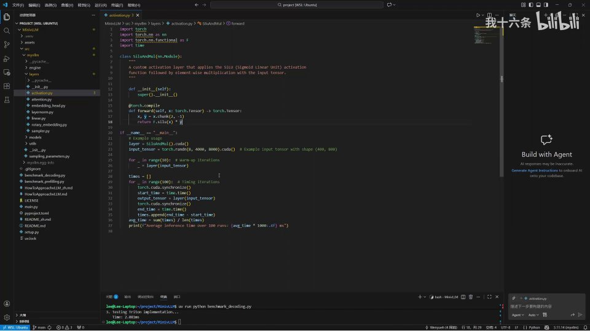 |
| 让它打印那个 Qwen3 0.6B 的模型结构。如果你没有下载这个 Qwen3 0.6B 的话，它可能会花一段时间把这个模型下载下来。现在就输出了模型的结构，这个模型结构我在讲义中也有写。 [【跳转到 07:21】](https://www.bilibili.com/video/BV1M4zeB3EoY/?t=441) | 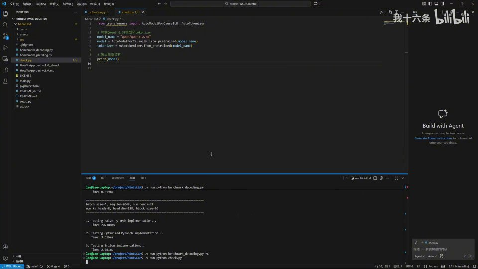 |
| 就是这样的，我们可以粗略地看一下。 [【跳转到 07:39】](https://www.bilibili.com/video/BV1M4zeB3EoY/?t=459) | 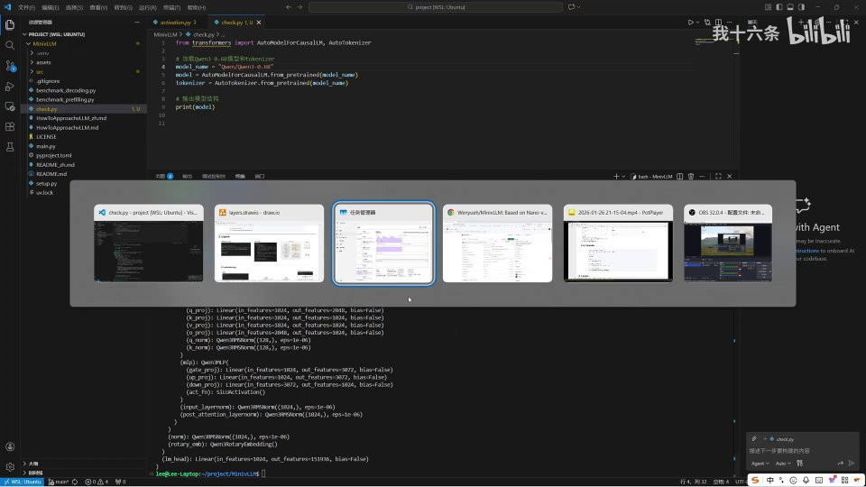 |
| 这个是 Qwen3 的模型架构图，我们可以对照着看一下。 [【跳转到 07:44】](https://www.bilibili.com/video/BV1M4zeB3EoY/?t=464) |  |
| Qwen3 模型进来，先是一个 embedding，对 token 做一个 embedding，然后是 layers，这个地方就是 decoder layer，包括 QKV，这里就是 attention 层里边的东西，然后这里有一个 RMSNorm，后面就是一个 MLP。 [【跳转到 07:49】](https://www.bilibili.com/video/BV1M4zeB3EoY/?t=469) | 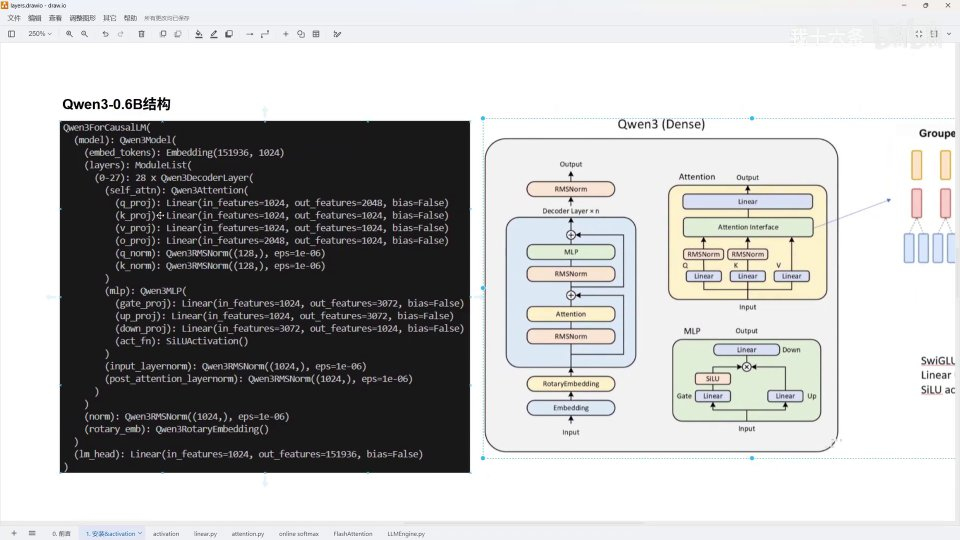 |
| MLP 里边就是三个线性层以及一个 SiLU 激活。然后还是 RMSNorm，RMSNorm 很简单。最后有一个旋转嵌入（RoPE），后面就是线性层输出，这个就是 lm_head 那一块输出的内容。然后我们来对照看一下这个结构图。 [【跳转到 08:06】](https://www.bilibili.com/video/BV1M4zeB3EoY/?t=486) | 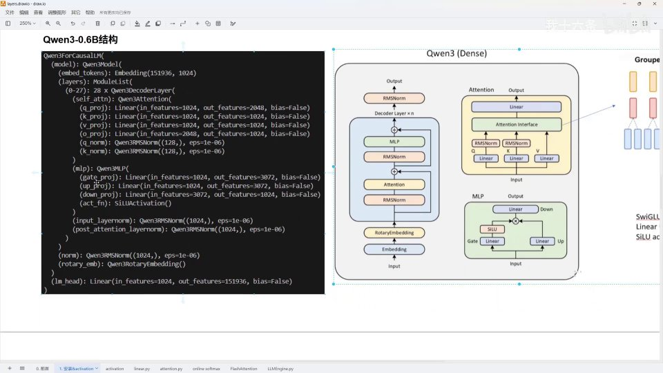 |
| 输出就是我们输出的 Qwen3 0.6B 和我们 Qwen3 真实模型。 [【跳转到 08:27】](https://www.bilibili.com/video/BV1M4zeB3EoY/?t=507) | 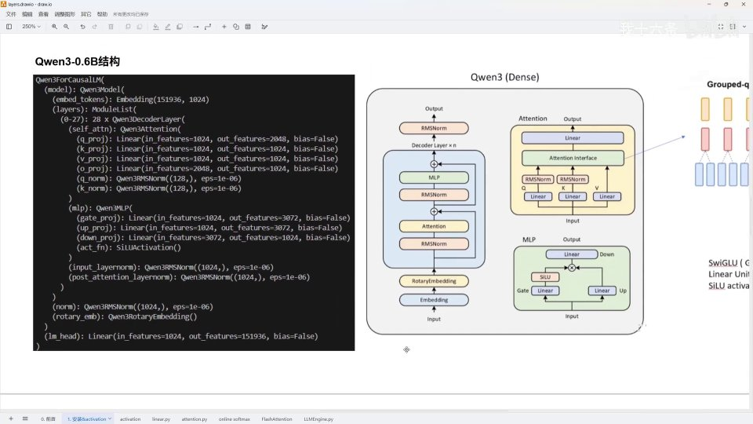 |
| 其实是能够对应上的，一样的，就嵌入，然后这就是旋转嵌入层，然后进入 Qwen3 的 attention 模块。 [【跳转到 08:32】](https://www.bilibili.com/video/BV1M4zeB3EoY/?t=512) | 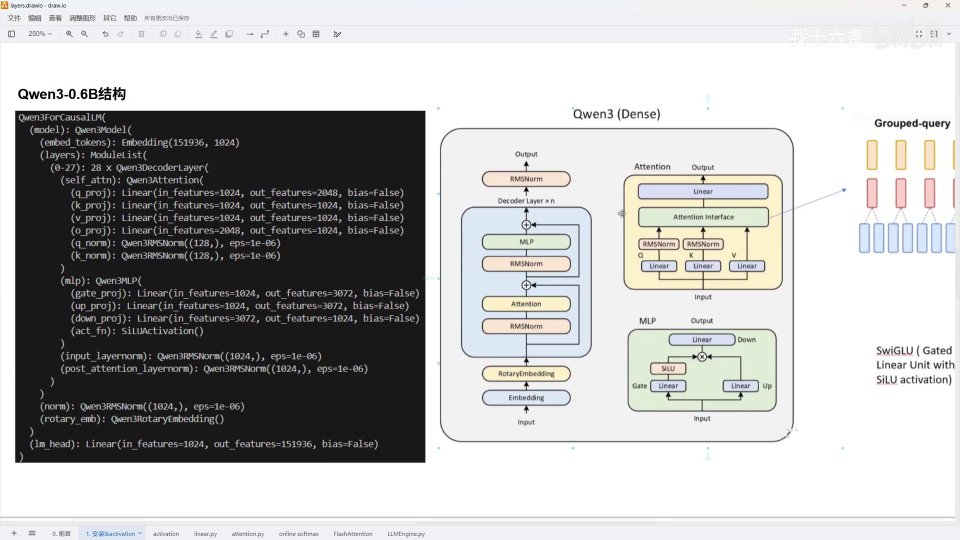 |
| 里边的细节就是三个线性层，分别是 Q、K、V，然后还有一个 O；我们的隐藏状态也是一个线性层；里面两个 RMSNorm，全部都能对应上。然后我们来看这个 MLP。 [【跳转到 08:42】](https://www.bilibili.com/video/BV1M4zeB3EoY/?t=522) | 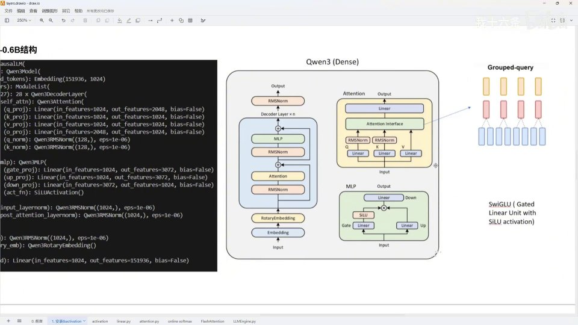 |
| MLP 里边其实就是一个 gate、一个 up。 [【跳转到 08:56】](https://www.bilibili.com/video/BV1M4zeB3EoY/?t=536) | 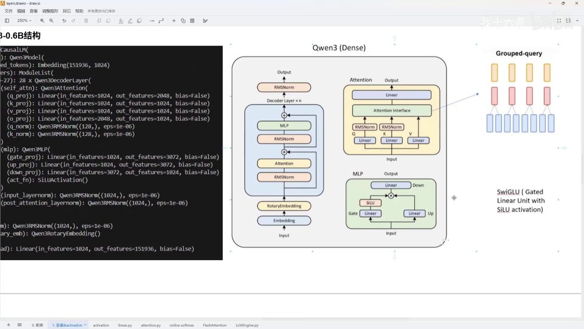 |
| 一个 down，然后还有一个 SiLU 激活。这一块其实就是我们今天要讲的重点。 [【跳转到 09:01】](https://www.bilibili.com/video/BV1M4zeB3EoY/?t=541) | 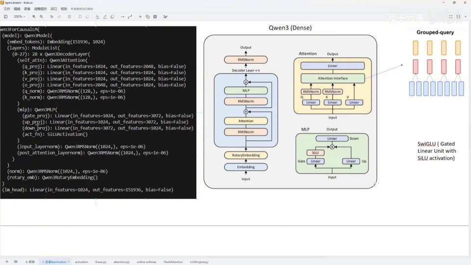 |
| ok，我们现在直接来看源码，Activation 这一块的源码。 [【跳转到 09:07】](https://www.bilibili.com/video/BV1M4zeB3EoY/?t=547) | 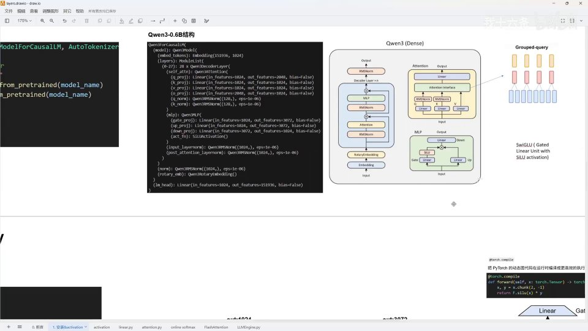 |
| 其实就是把 SiLU 和矩阵乘做了一个算子融合，就让原本的计算图…… [【跳转到 09:12】](https://www.bilibili.com/video/BV1M4zeB3EoY/?t=552) | 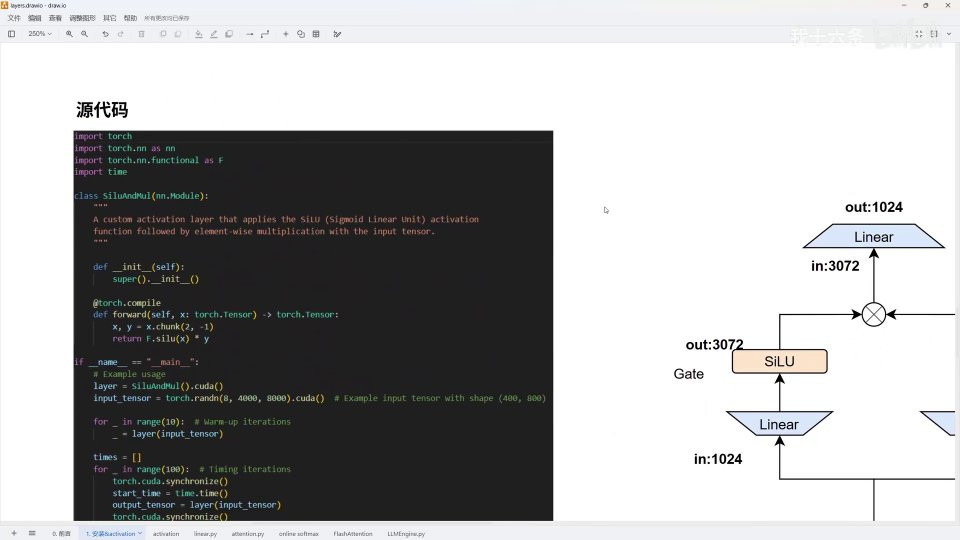 |
| 我们可以把这个图直接摘下来，其实就是这样的。 [【跳转到 09:17】](https://www.bilibili.com/video/BV1M4zeB3EoY/?t=557) | 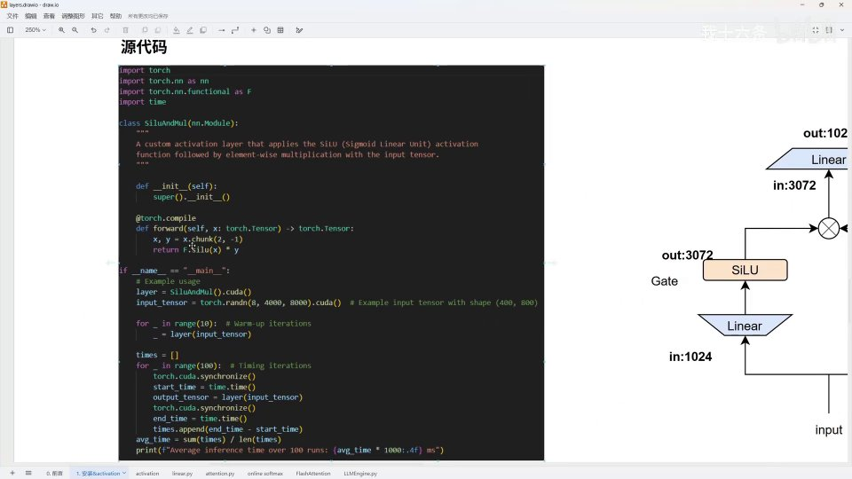 |
| 原本的计算图是这样的：我们的输入，然后经过两个线性变化，左边经过 SiLU，右边是直接线性变化，然后做一个矩阵乘，然后输出。原本是这样的。我们可以看一下这个模型结构。 [【跳转到 09:22】](https://www.bilibili.com/video/BV1M4zeB3EoY/?t=562) | 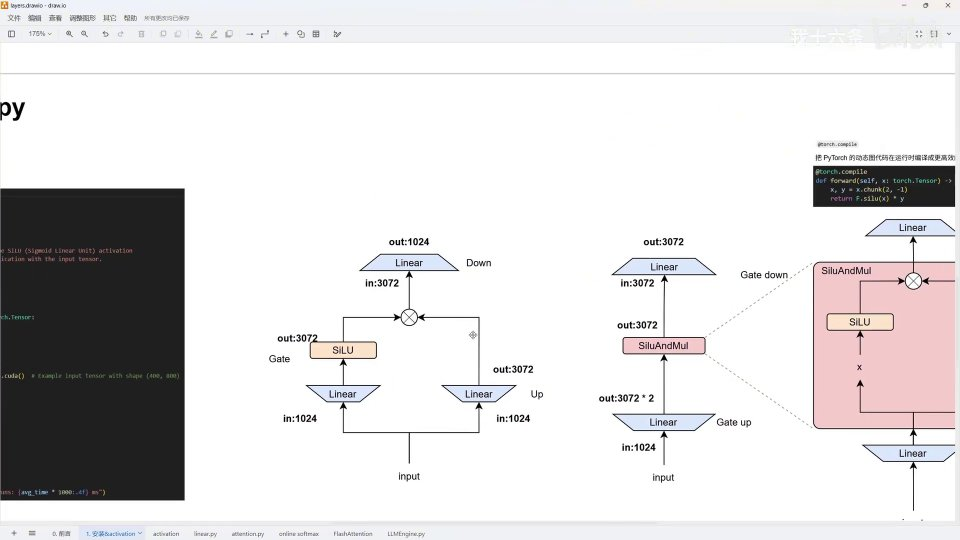 |
| 其实也可以看出来，它原本输入形状是 1024，然后输出是 3072，这边我都标出来了。 [【跳转到 09:34】](https://www.bilibili.com/video/BV1M4zeB3EoY/?t=574) |  |
| 那我们现在做了一件什么事情？我们现在把这个算子融合，把整个流程融合成了一个 SiluAndMul。 [【跳转到 09:44】](https://www.bilibili.com/video/BV1M4zeB3EoY/?t=584) | 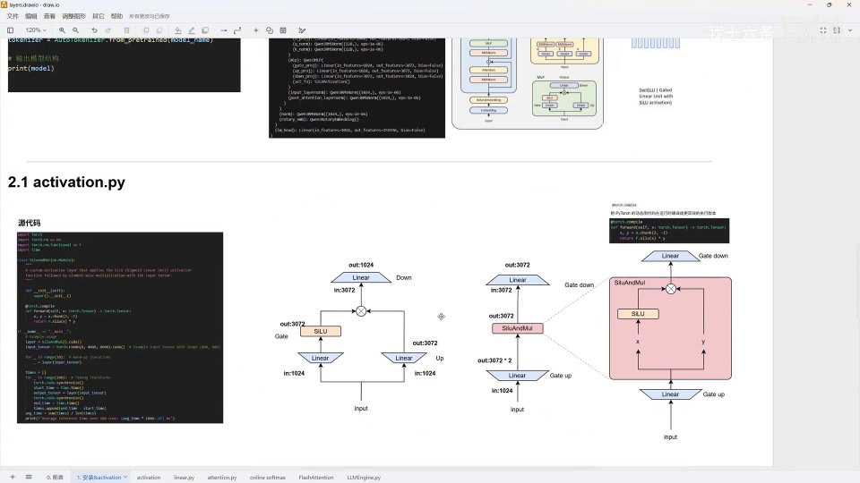 |
| 就是把下采样那个层和上采样的线性层实际上做了一个融合，变成了一个大的上采样。原本我们输入的是 1024，然后到 3072，但是现在我们直接输入 1024，输出两个 3072。 [【跳转到 09:49】](https://www.bilibili.com/video/BV1M4zeB3EoY/?t=589) | 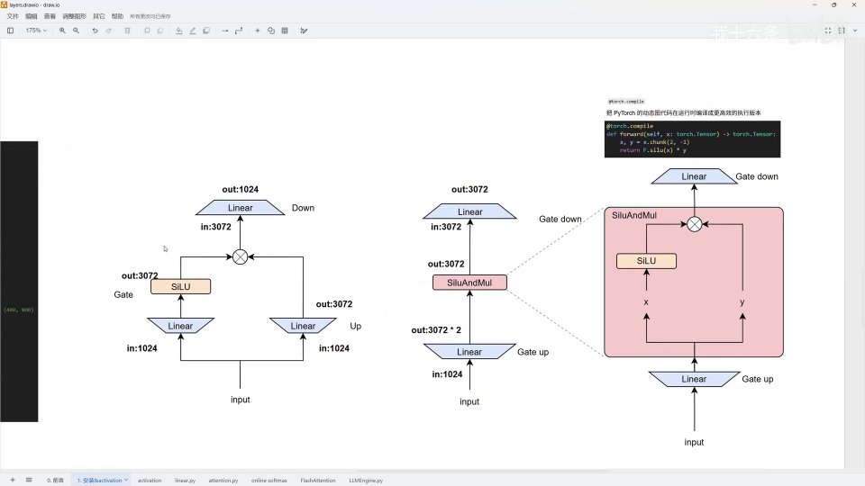 |
| 然后 SiluAndMul 里边做了什么事情？我们的源代码其实很简单，就是 X 进来之后…… [【跳转到 10:09】](https://www.bilibili.com/video/BV1M4zeB3EoY/?t=609) | 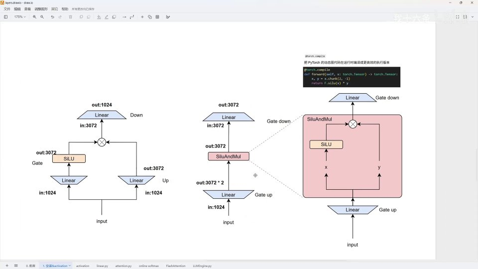 |
| 对 X 做了一个 chunk，就是把 X 平分成两个，一个是 X，一个是 Y。对应起来看，其实就是进入一个大的 gate_up，做了一个上采样，然后左边 X、右边 Y，然后 X 做 SiLU，Y 不做 SiLU，然后做一个乘法就直接输出了，其实很简单很简单。 [【跳转到 10:14】](https://www.bilibili.com/video/BV1M4zeB3EoY/?t=614) | 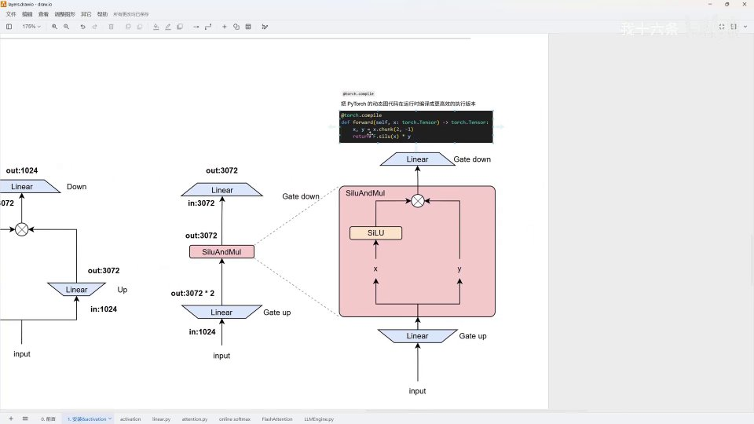 |
| 然后我们可以看一下源代码这一块。 [【跳转到 10:38】](https://www.bilibili.com/video/BV1M4zeB3EoY/?t=638) | 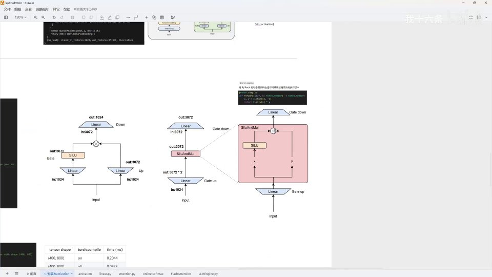 |
| 我们可以看一下这个 SiLU 具体用在哪里。这里有一个用法，这个就是我们 Qwen3 model、MLP model，这个是我们之后要做的，因为我们必须要把 Qwen3 模型给复现出来，所以我们这边会对它所有的架构…… [【跳转到 10:43】](https://www.bilibili.com/video/BV1M4zeB3EoY/?t=643) | 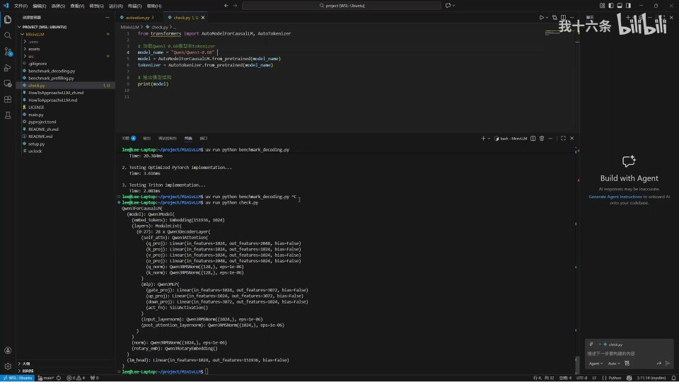 |
| 去做一个复现。我们原本的 Qwen3，比如说是用 PyTorch 进行训练的，它模型存储的结构应该是用的 safetensors 还是什么？应该是 pt 吧，应该是 .pt 然后做的存储。但是这一块呢，因为我们需要从那个 .pt 中读出它的权重。 [【跳转到 11:08】](https://www.bilibili.com/video/BV1M4zeB3EoY/?t=668) | 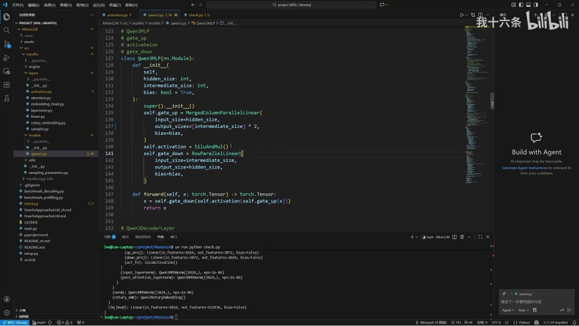 |
| 然后放在我们自己设计的、相当于对推理引擎做优化的一个模型里边。所以这边就需要对它做一个算子的融合和重构，以尽量优化的方式，把原本复杂的算子，比如动态算子，把它融合起来，变成一个融合算子。我们可以看一下这个…… [【跳转到 11:33】](https://www.bilibili.com/video/BV1M4zeB3EoY/?t=693) |  |
| 我们自己实现的 Qwen3 MLP，这个其实是之后的内容，但我们可以先看一下。这个地方就是，首先他自己定义了一个上采样、一个下采样以及一个激活层。具体实现其实就是：在前向传播的时候，先对输入的 X 做了一个上采样，然后再去做一个激活，这个地方就是 SiluAndMul，然后再做一个下采样。其实就三个部分，对吧？ [【跳转到 11:58】](https://www.bilibili.com/video/BV1M4zeB3EoY/?t=718) |  |
| 然后我们来看原本的 Qwen3 0.6B。 [【跳转到 12:23】](https://www.bilibili.com/video/BV1M4zeB3EoY/?t=743) | 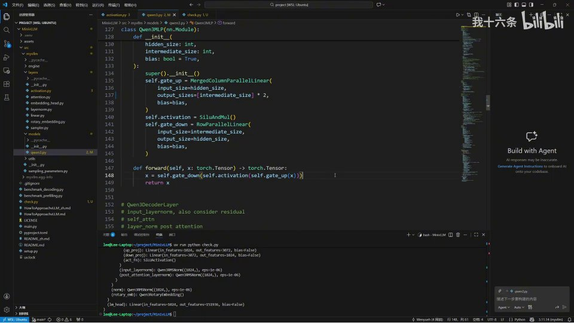 |
| 它里边其实是有四个部分的，一个上采样、一个下采样和一个 gate。这个 gate 其实就是对我们传入的参数…… [【跳转到 12:28】](https://www.bilibili.com/video/BV1M4zeB3EoY/?t=748) | 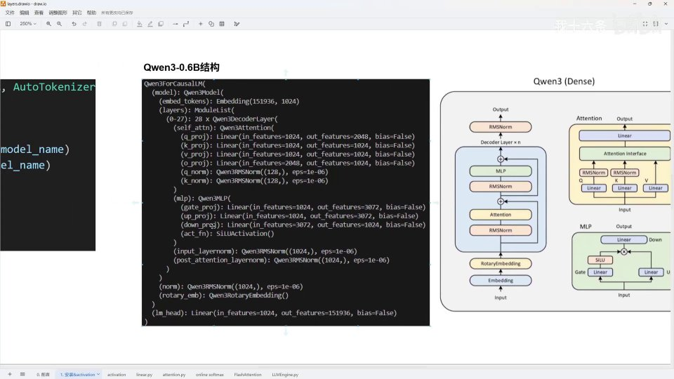 |
| 做了一个 gate 门，实现了一个门控机制。那我们在做算子融合的时候…… [【跳转到 12:35】](https://www.bilibili.com/video/BV1M4zeB3EoY/?t=755) | 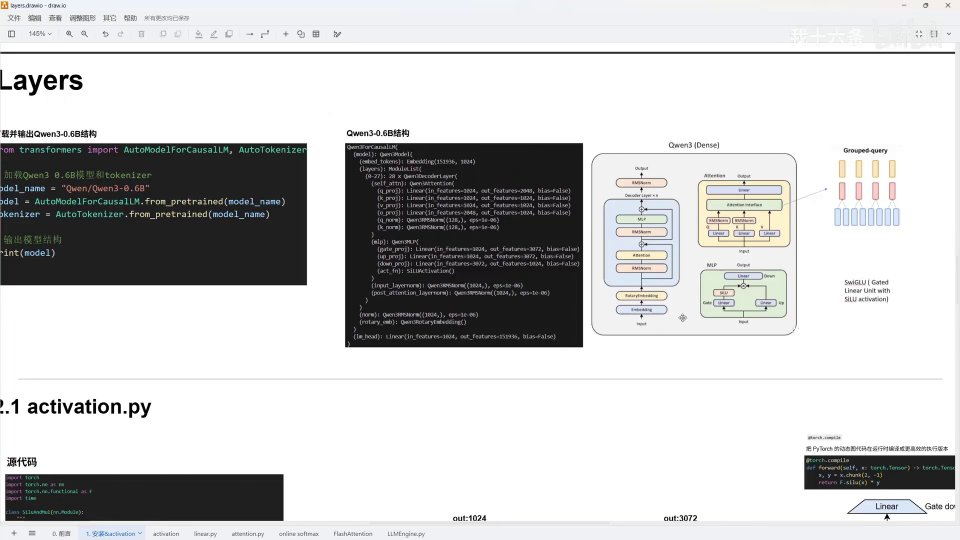 |
| 其实这个门和上采样是可以合并在一起的，然后再进入 SiLU。之后我们实现了 SiLU 的那个算子，再去对它进行划分，这样就可以实现一个算子融合。 [【跳转到 12:40】](https://www.bilibili.com/video/BV1M4zeB3EoY/?t=760) | 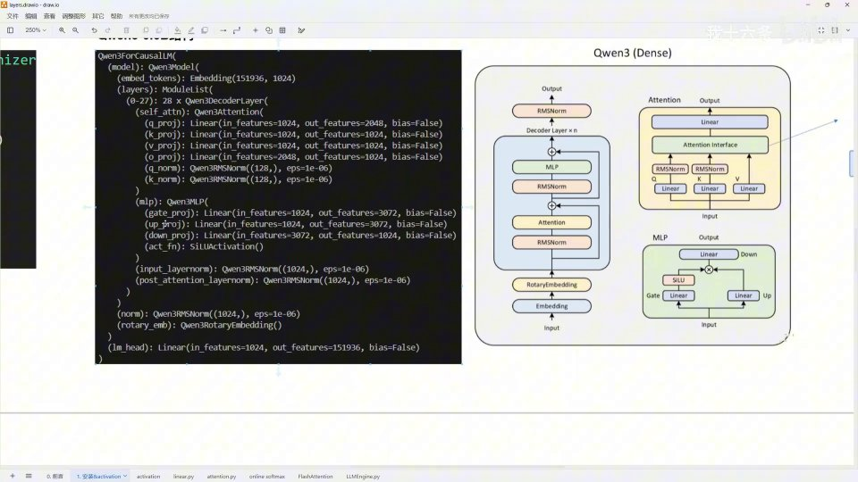 |
| 原本它是这样实现的，原本我们需要定义三个线性层。 [【跳转到 12:54】](https://www.bilibili.com/video/BV1M4zeB3EoY/?t=774) | 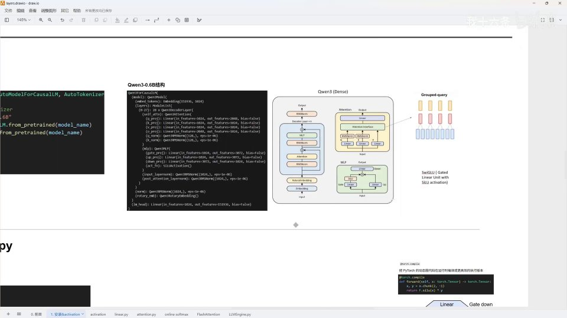 |
| 然后一个 SiLU，然后再做一个矩阵乘来实现这个算法。 [【跳转到 12:59】](https://www.bilibili.com/video/BV1M4zeB3EoY/?t=779) | 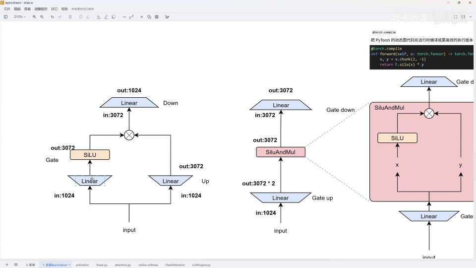 |
| 但是我们现在只需要实现一个 SiluAndMul，就可以把原本稍微复杂的实现方式变换成更简洁的实现方式。 [【跳转到 13:04】](https://www.bilibili.com/video/BV1M4zeB3EoY/?t=784) | 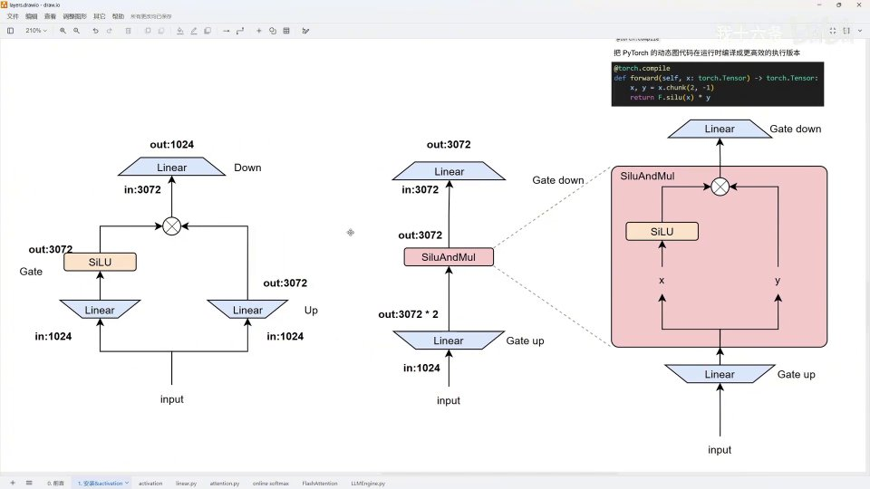 |
| 转化成代码其实就是这个样子。它具体的流程就是我们输入，然后做一个上采样。 [【跳转到 13:11】](https://www.bilibili.com/video/BV1M4zeB3EoY/?t=791) | 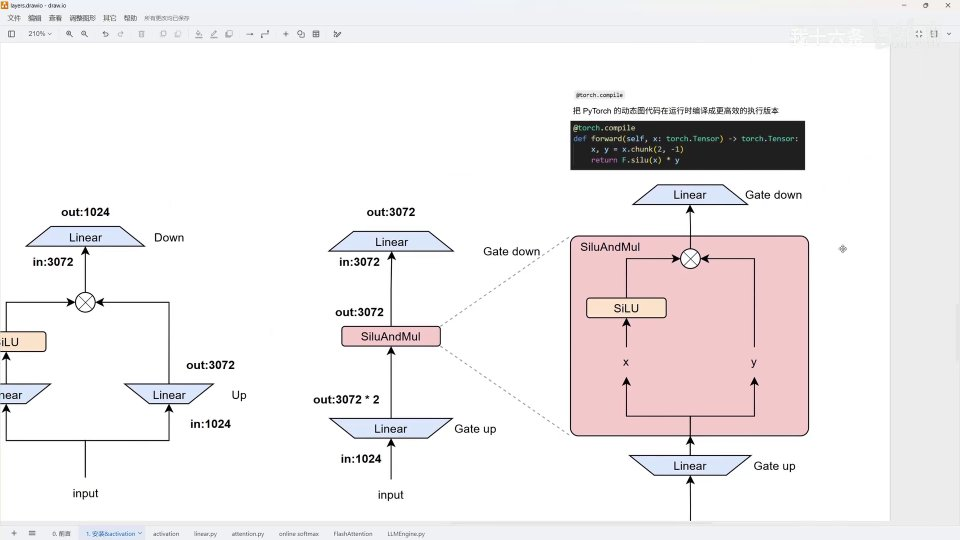 |
| 再做一个 SiluAndMul，最后再做一个下采样就可以了。 [【跳转到 13:17】](https://www.bilibili.com/video/BV1M4zeB3EoY/?t=797) | 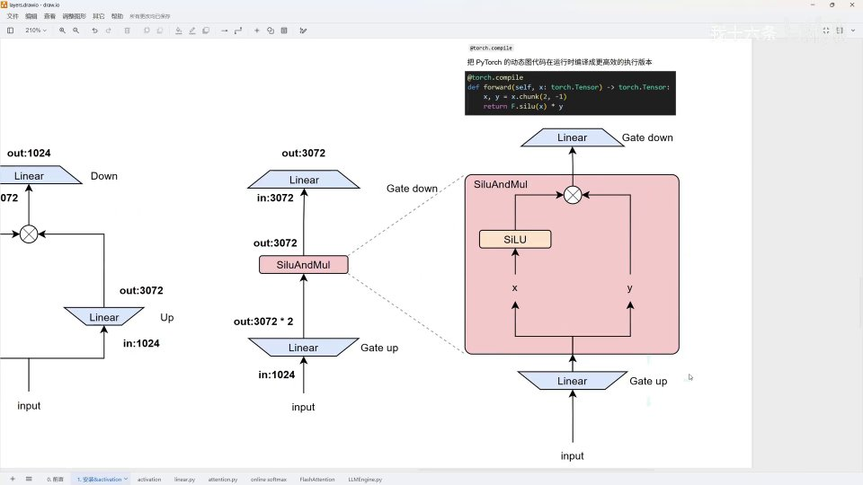 |
| 数据的算法其实和原来是一样的，只是说我们的流程会更简洁一点。 [【跳转到 13:22】](https://www.bilibili.com/video/BV1M4zeB3EoY/?t=802) | 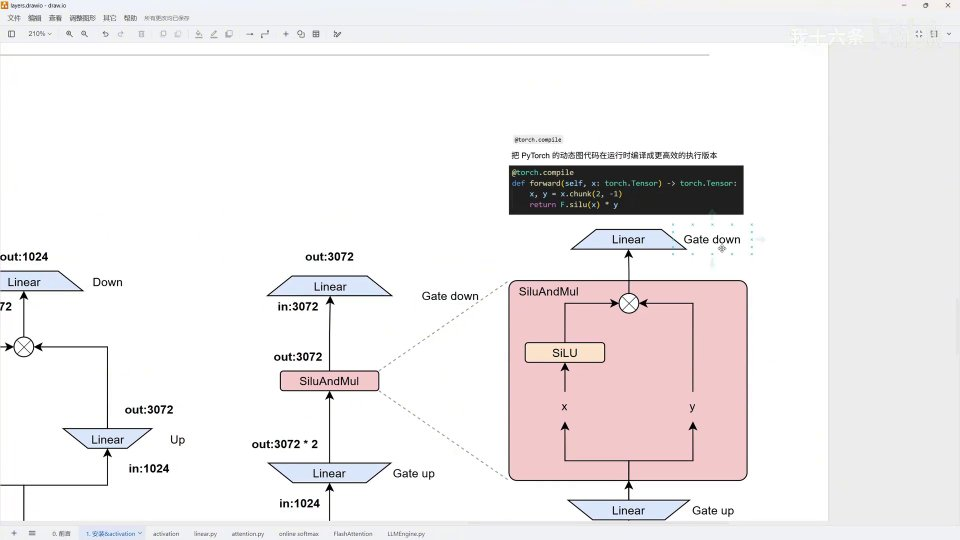 |
| 然后我们来看一下 benchmark。 [【跳转到 13:27】](https://www.bilibili.com/video/BV1M4zeB3EoY/?t=807) | 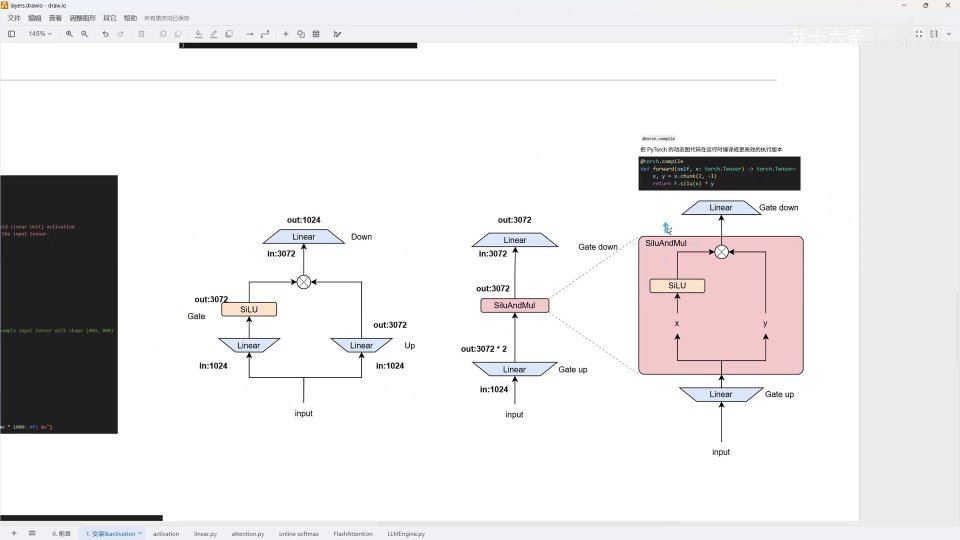 |
| Benchmark 这个地方其实是对输入的三种形状做了一个…… [【跳转到 13:32】](https://www.bilibili.com/video/BV1M4zeB3EoY/?t=812) | 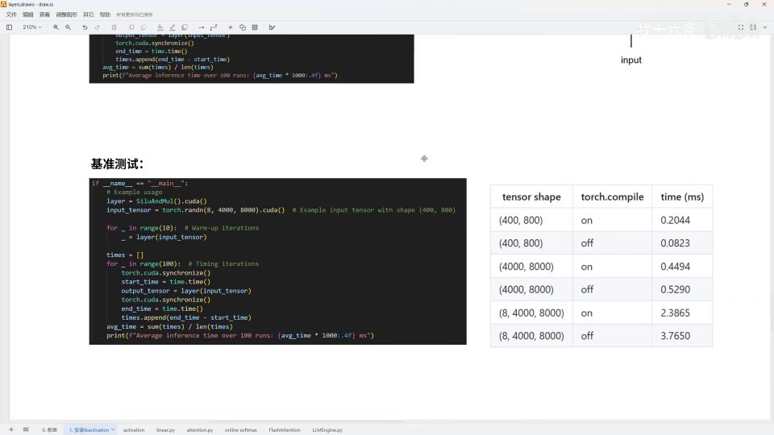 |
| 耗时计算，分别是 400×800、4000×8000，以及 8×4000×8000。这里有一个关键点，就是这个 torch.compile 这个东西。 [【跳转到 13:37】](https://www.bilibili.com/video/BV1M4zeB3EoY/?t=817) | 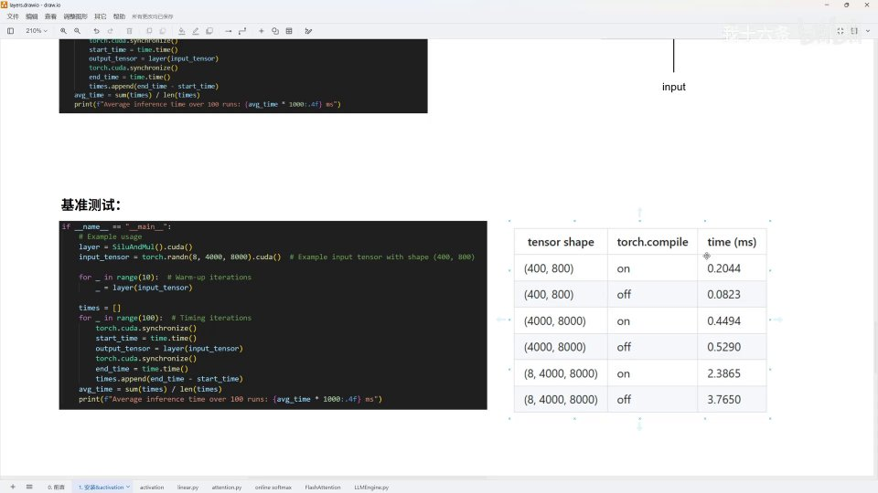 |
| 这个注解可以在我们运行程序之前…… [【跳转到 13:49】](https://www.bilibili.com/video/BV1M4zeB3EoY/?t=829) | 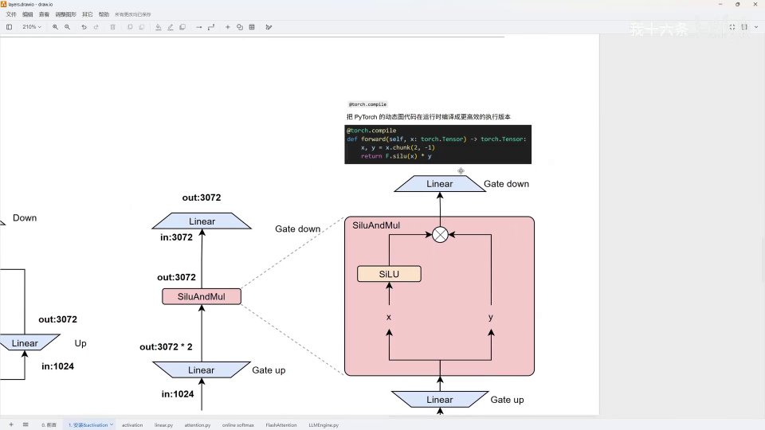 |
| 它会提前对这个算子进行一个编译，就把原本的动态图代码在运行的时候编译成更高效的执行版本。 [【跳转到 13:54】](https://www.bilibili.com/video/BV1M4zeB3EoY/?t=834) | 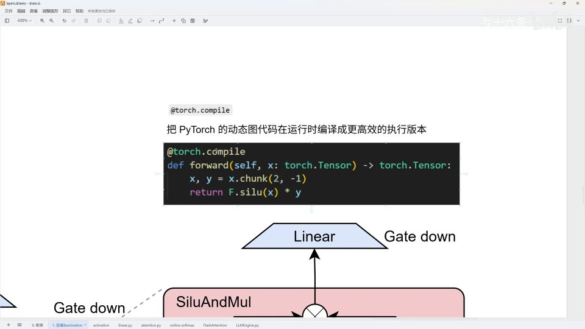 |
| 但是它有一个问题，就是当我们的计算形状很小的时候。 [【跳转到 14:01】](https://www.bilibili.com/video/BV1M4zeB3EoY/?t=841) | 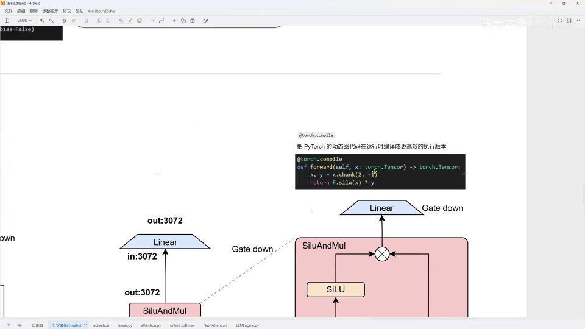 |
| 比如 400×800，我们开启 torch.compile。 [【跳转到 14:06】](https://www.bilibili.com/video/BV1M4zeB3EoY/?t=846) | 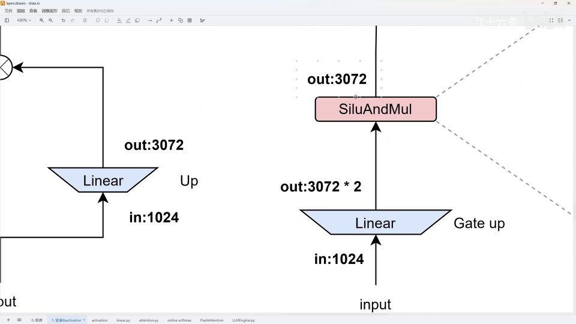 |
| 这个时候耗时是 0.2ms，但是如果我们关掉这个，也就是把 torch.compile 给注释掉，这个时候运行时间反而更快。这是因为编译是有成本的，我们编译的时间如果大于我们计算形状的时间的话，那就是不划算的。然后这个 benchmark 主要就是说这么一件事情。具体在代码中…… [【跳转到 14:11】](https://www.bilibili.com/video/BV1M4zeB3EoY/?t=851) | 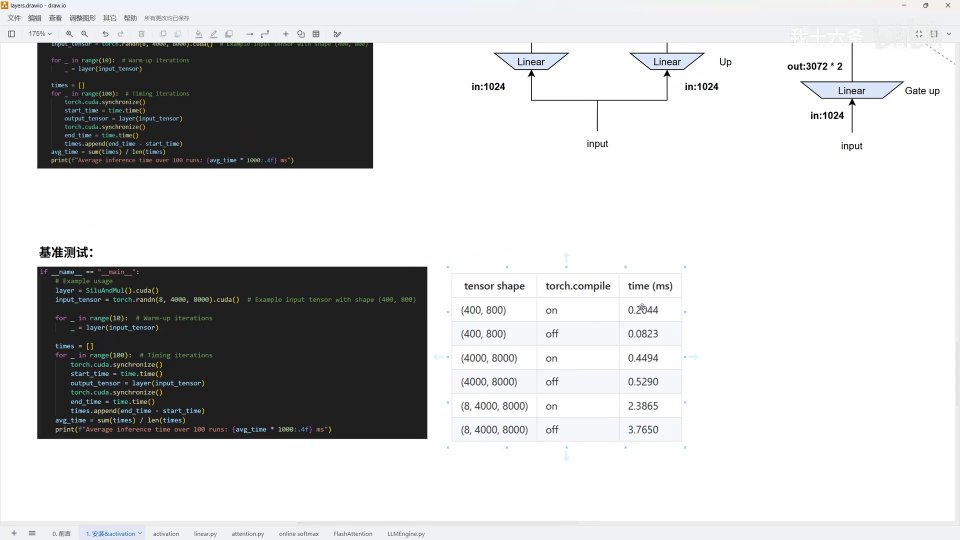 |
| 我们可以这样去测试一下。哦，因为它没有那个形状，我们先复制三个形状，400、800、4000×8000 这些。ok，这三个形状我们先来测 400 和 800 的吧，在开启编译的情况下，我们来看一下耗时会花多久。 [【跳转到 14:30】](https://www.bilibili.com/video/BV1M4zeB3EoY/?t=870) | 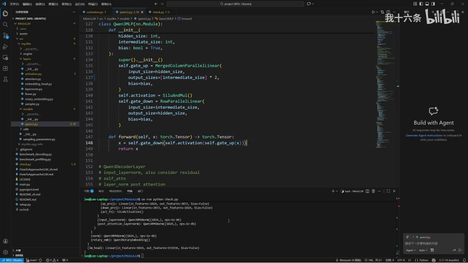 |
| ok，0.085 秒。我们把编译关掉来看一下，0.079，差距不是很大。但确实我们把编译关掉之后，速度反而更快一点。好，然后我们来测试一下更大的一个形状 4000×8000。 [【跳转到 14:55】](https://www.bilibili.com/video/BV1M4zeB3EoY/?t=895) | 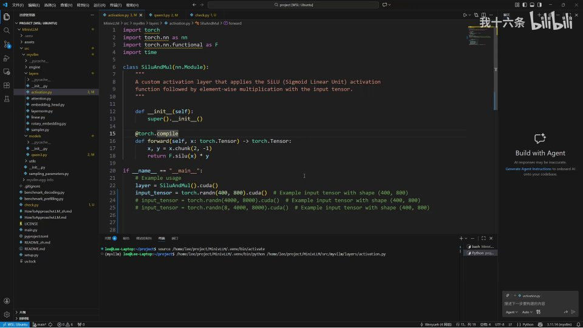 |
| ok，启用编译优化的时间是 0.6，很快。那我们把编译给关掉，啊，一下就看出区别了。它在大的形状上，当我们使用编译优化的时候，速度确实会有提升。如果说是更极端的情况下…… [【跳转到 15:20】](https://www.bilibili.com/video/BV1M4zeB3EoY/?t=920) | 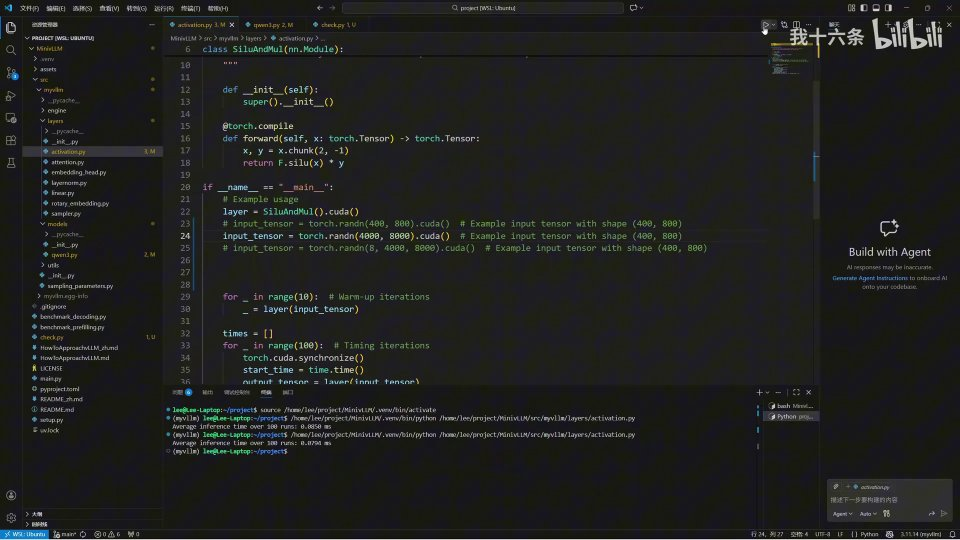 |
| 比如说 8×4000×8000，那提升的比例会更大。现在我们是没有对它进行优化编译的情况下是 6.8，ok，开启编译优化，快了 2ms，这个差距还是挺明显的。这第一章其实主要就是讲这么一些事情。 [【跳转到 15:45】](https://www.bilibili.com/video/BV1M4zeB3EoY/?t=945) |  |
| 内容很少，大家其实可以下来自己去实现一下，自己录一遍，可以理解得更深刻一点。ok，然后我们来讲一下这下面这个测试吧。这个其实就是先做了一个预热，然后再去做实现。预热主要是为了避免我们在运行过程中一些其他的无关因素，比如读取数据之类的，对我们真实的测试造成影响。 [【跳转到 16:10】](https://www.bilibili.com/video/BV1M4zeB3EoY/?t=970) | 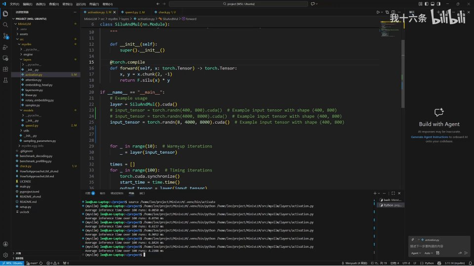 |
| 所以这里就用了一个预热来避免这些影响。然后下面就是具体的测试代码：先同步了一下 CUDA，然后再去计时，算了一个时差，输出具体的时间。整个代码很简单。关于 activation 的就到这里了。 [【跳转到 16:35】](https://www.bilibili.com/video/BV1M4zeB3EoY/?t=995) | 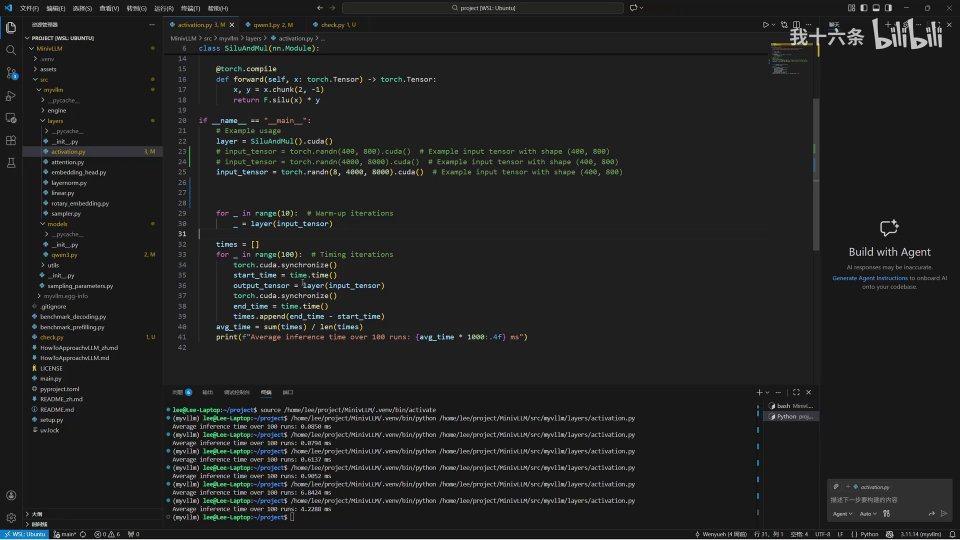 |