# layernorm.py中的RMSNorm实现 原始文稿（图-字幕分栏）

| 字幕文本 | 画面 |
| :--- | ---: |
| 哈喽大家好，今天给大家分享 LayerNorm 中 RMSNorm 的具体实现。很遗憾，我刚才其实已经录制了半个小时，但因为忘了打开录制，不得不重新录了一遍。嗯，我们还是先从代码看起吧。 [【跳转到 00:00】](https://www.bilibili.com/video/BV1sTz9BREvX/?t=0) | 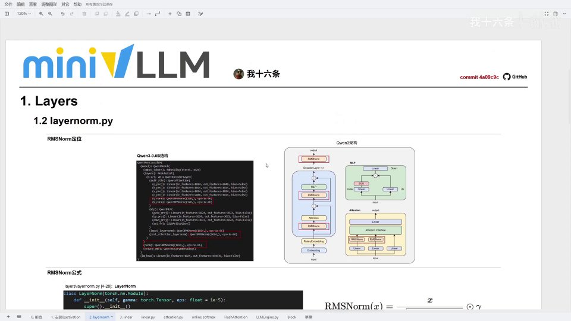 |
| 这个是 LayerNorm 相关的具体代码，其实很短。 [【跳转到 00:17】](https://www.bilibili.com/video/BV1sTz9BREvX/?t=17) |  |
| 一共就只有 62 行。它的具体实现就在下面这个 main 函数下方；main 函数这个入口其实都是它的测试用例。我们来看一下，这段代码其实很简单，核心就是这个 forward。它里边分了一个路由，有一个带残差的 forward 和一个不带残差的 forward；带残差的那个底层其实也只是多了一个对残差的加和。 [【跳转到 00:22】](https://www.bilibili.com/video/BV1sTz9BREvX/?t=22) |  |
| 然后再去访问这个 Norm，最底层其实就是 RMSNorm，公式就是这一块。嗯，然后对最底层的 RMSNorm 做了一个 torch.compile 的优化，很简单。再来看一下它的定义：它在初始化的时候，其实是定义了一个 gamma（γ），还定义了一个 eps（极小值）。 [【跳转到 00:47】](https://www.bilibili.com/video/BV1sTz9BREvX/?t=47) | 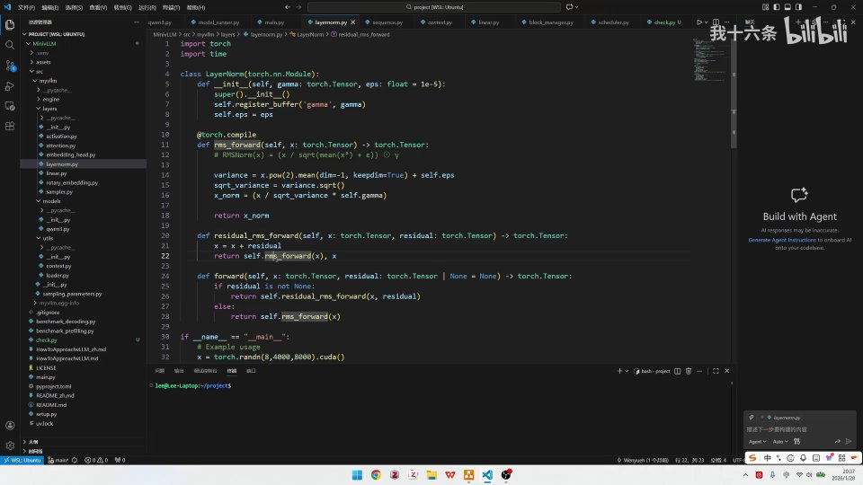 |
| 这个 eps 是极小值，而 gamma 是对 X 的缩放因子，就是拿 X 去做缩放。我们看完整体代码之后，再去看具体的讲义。 [【跳转到 01:12】](https://www.bilibili.com/video/BV1sTz9BREvX/?t=72) | 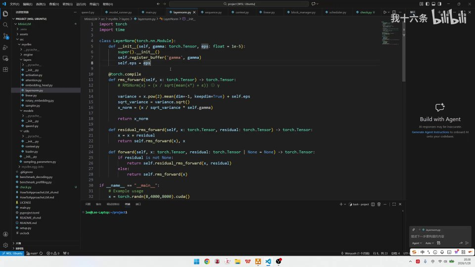 |
| 首先要说明一下我这个标号：之前「快速开始」这个地方我设置的是一， [【跳转到 01:23】](https://www.bilibili.com/video/BV1sTz9BREvX/?t=83) |  |
| 但是为了和 GitHub 上 how-to-approach 那篇文档相匹配，我还是把这个 layers 改成了 1。 [【跳转到 01:31】](https://www.bilibili.com/video/BV1sTz9BREvX/?t=91) | 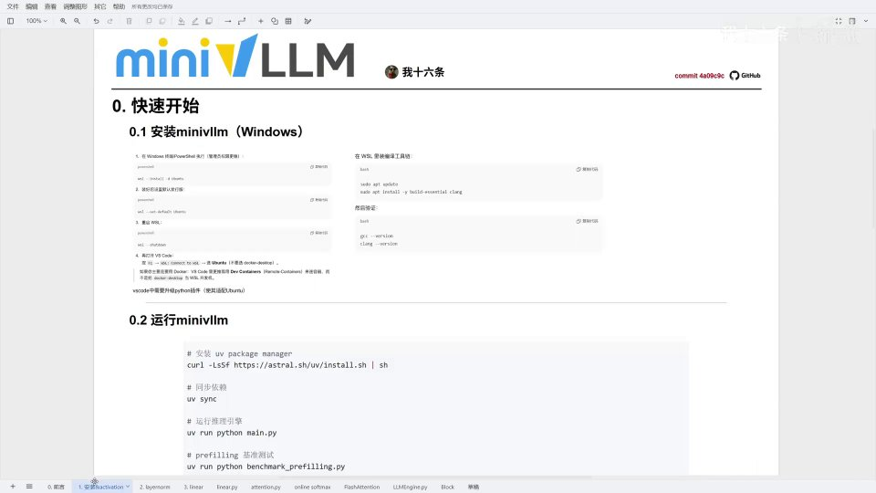 |
| 所以「快速开始」这里就设置为 0 吧，有一点点小小的不同。 [【跳转到 01:41】](https://www.bilibili.com/video/BV1sTz9BREvX/?t=101) | 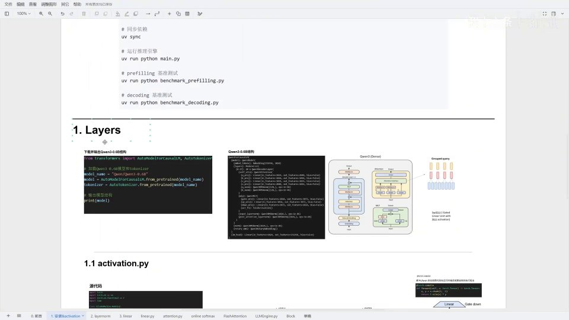 |
| 那我们就回到这里，先来看 RMSNorm 在哪个位置，还是看这个 Qwen3-0.6B 的结构。 [【跳转到 01:46】](https://www.bilibili.com/video/BV1sTz9BREvX/?t=106) |  |
| 这个是代码输出的结构。它其实主要在三处地方出现 RMSNorm。 [【跳转到 01:51】](https://www.bilibili.com/video/BV1sTz9BREvX/?t=111) | 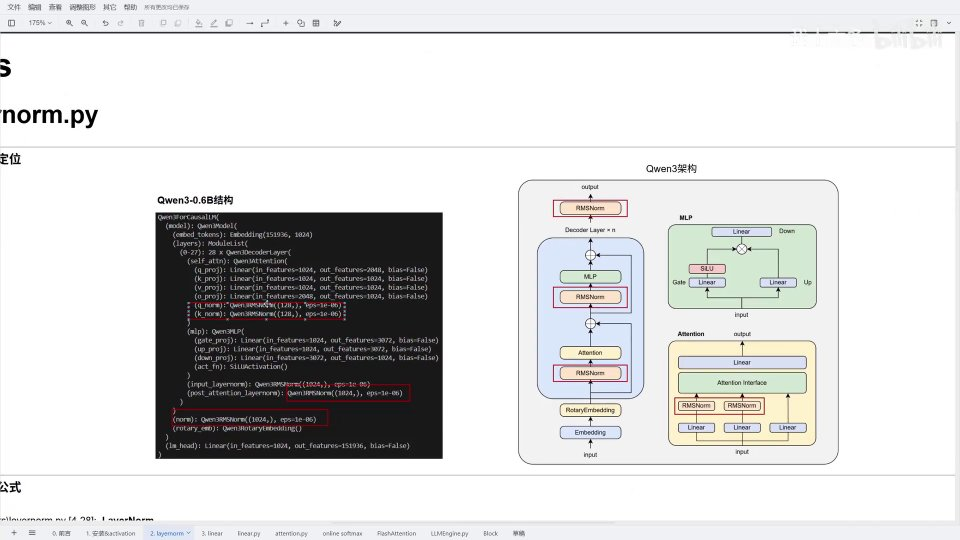 |
| 然后这地方有两个。 [【跳转到 01:56】](https://www.bilibili.com/video/BV1sTz9BREvX/?t=116) | 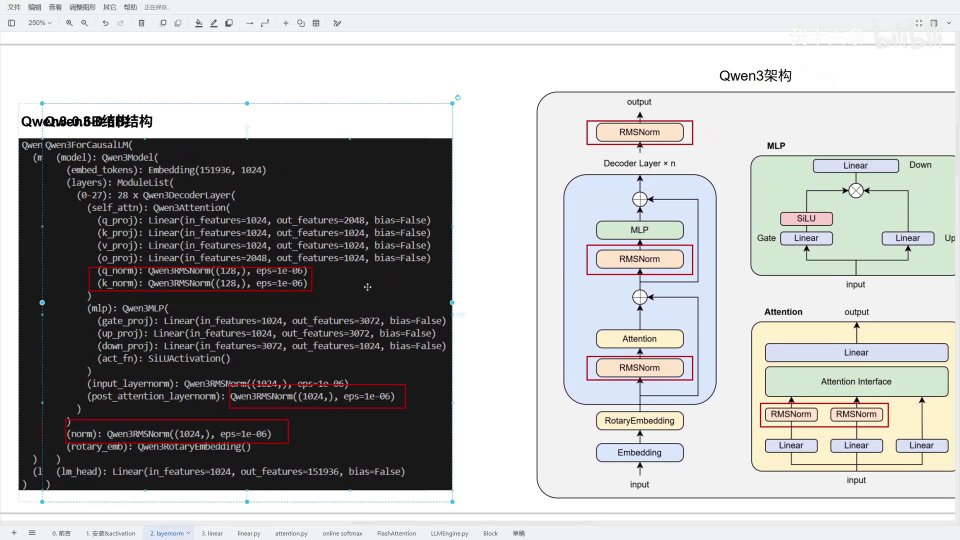 |
| 这地方有一个，这地方有一个。在 attention（注意力）里边它有两个，然后 MLP 里边是没有的；在 decoder 外边还有两个，就是 decoder 里边的 Qwen3 decoder layer 里边还有两个，所以一共有五个地方有 RMSNorm。然后 decoder 外边还有一个，是前面的这个 RMSNorm。我们来具体对应一下算子图。 [【跳转到 02:01】](https://www.bilibili.com/video/BV1sTz9BREvX/?t=121) | 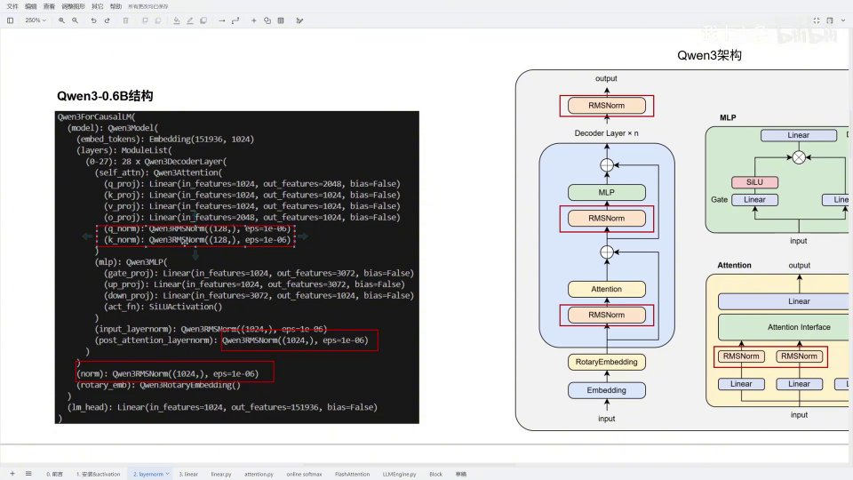 |
| 我们去找一下它们具体在哪个位置。首先 attention 中的这两个，其实就是这两个，对吧，过来一点。 [【跳转到 02:23】](https://www.bilibili.com/video/BV1sTz9BREvX/?t=143) | 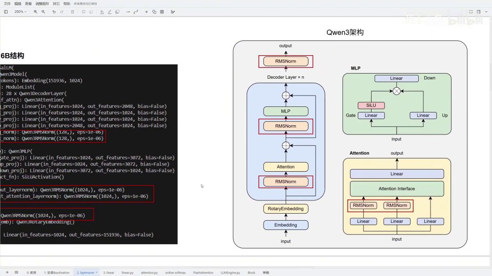 |
| 就是这两个，attention 内部这两个分别对 Q、K 做 RMSNorm，这下面其实就是 Q 的线性变换、K 的线性变换和 V 的线性变换。那我们来看一下这两个是在哪个位置：这两个其实是在 Qwen3 decoder layer 里边，内部刚好就是这两个。然后我们看一下名字，有一个叫做 input layernorm，其实就是这个；还有一个叫做 post attention layernorm。 [【跳转到 02:30】](https://www.bilibili.com/video/BV1sTz9BREvX/?t=150) |  |
| 那就是这两个。这两个其实没有太大的区别，但它们有一些细微的不同，就是在残差上面有一些细微的不同，有一些小细节需要注意一下。 [【跳转到 02:55】](https://www.bilibili.com/video/BV1sTz9BREvX/?t=175) |  |
| 然后我们继续看一下 RMSNorm 的公式。RMSNorm 其实很简单， [【跳转到 03:07】](https://www.bilibili.com/video/BV1sTz9BREvX/?t=187) | 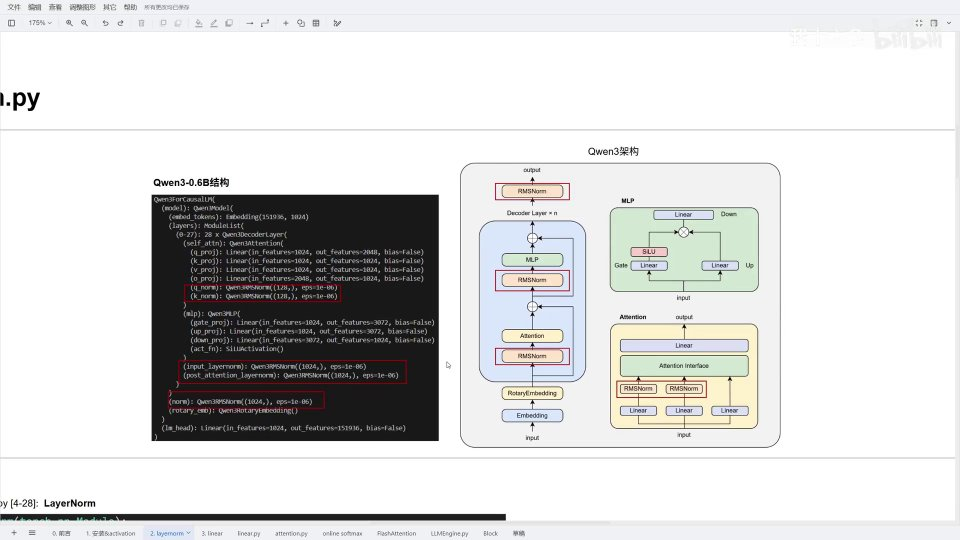 |
| 它其实就是对一串向量、也就是我们输入的 X 求了 RMS（均方根）……感觉自己说了句废话。那下面我们来逐行看一下吧。这个在源代码中就是 RMSNorm 的 forward。 [【跳转到 03:12】](https://www.bilibili.com/video/BV1sTz9BREvX/?t=192) | 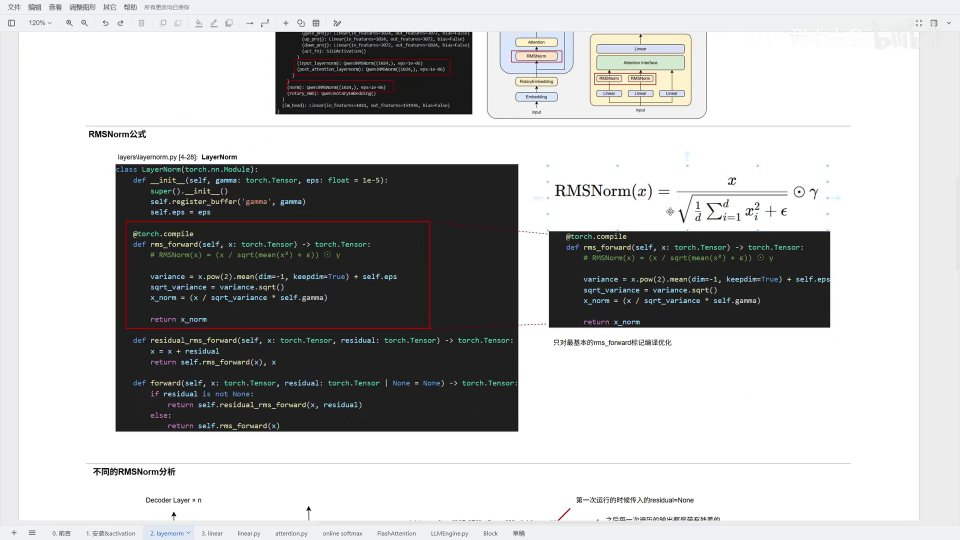 |
| 它其实就是这个公式的具体实现。我们来看一下，传入一个 X，它首先做了一个平方，就是这个地方做了一次平方， [【跳转到 03:24】](https://www.bilibili.com/video/BV1sTz9BREvX/?t=204) | 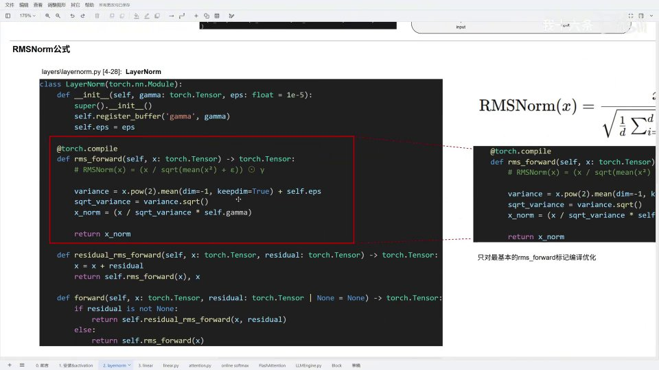 |
| 然后求了一个均值，也就是平方和再除以 D，D 就是 X 的数量、它的维度，其实就是我们的嵌入维度。求完均值之后加上了一个 self.eps，就是前面定义的 eps，它其实就是一个极小值，是为了避免零除。 [【跳转到 03:34】](https://www.bilibili.com/video/BV1sTz9BREvX/?t=214) |  |
| 所以这个地方加了一个 eps。然后继续看， [【跳转到 03:52】](https://www.bilibili.com/video/BV1sTz9BREvX/?t=232) | 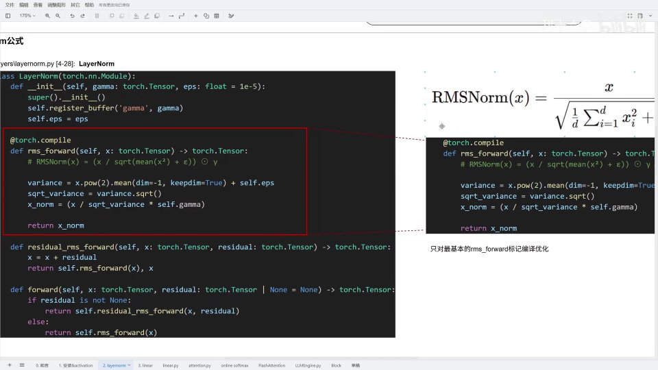 |
| 接下来开了个根号，就是这一步；然后再用 X 除以这个开根号之后的结果， [【跳转到 03:57】](https://www.bilibili.com/video/BV1sTz9BREvX/?t=237) | 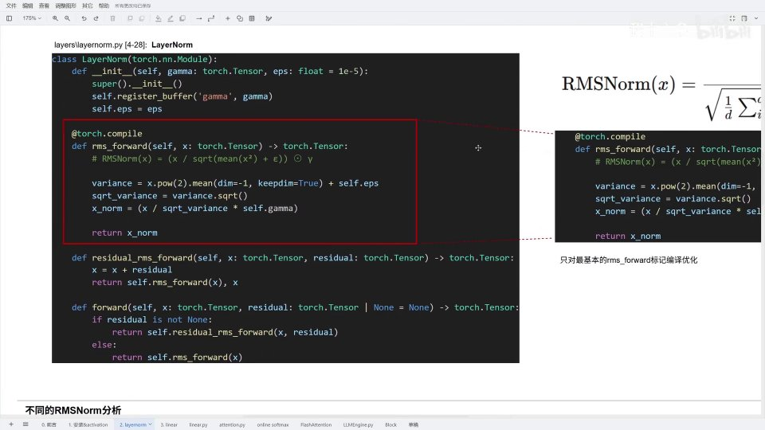 |
| 再乘了 self.gamma，其实整个公式就已经讲完了。 [【跳转到 04:02】](https://www.bilibili.com/video/BV1sTz9BREvX/?t=242) | 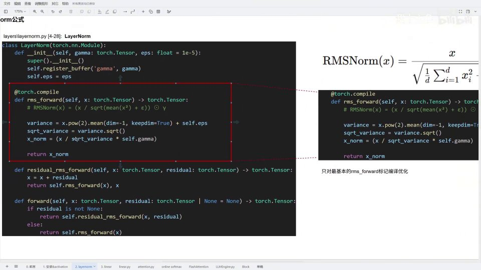 |
| 那这个 gamma 是什么东西？gamma 其实是一个可学习的超参数，用于对我们 token 嵌入之后的各个维度做缩放——每个维度有一个对应的 gamma，然后对那个维度做缩放。相当于让我们每一个 RMSNorm 都可以学到……有点类似于，嗯， [【跳转到 04:07】](https://www.bilibili.com/video/BV1sTz9BREvX/?t=247) | 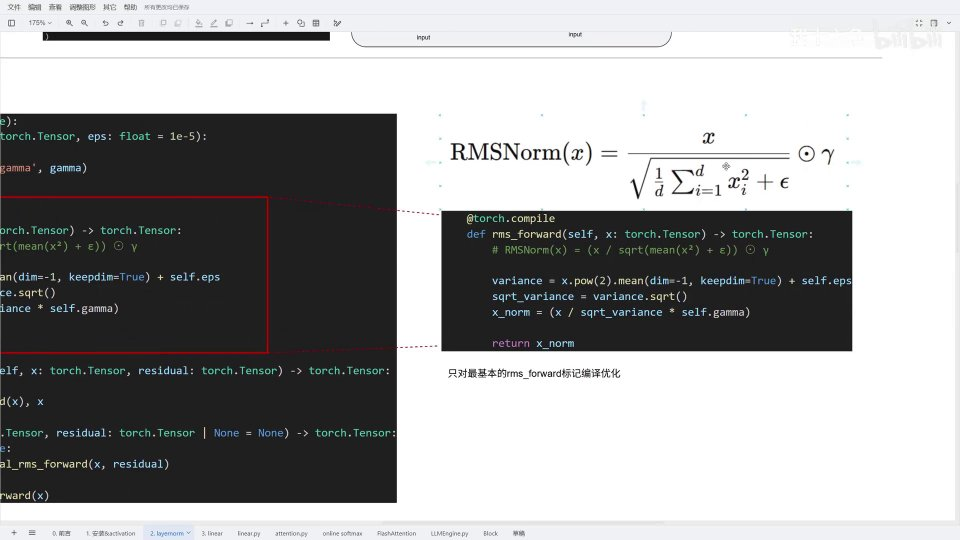 |
| 怎么说呢，有点类似于门控吧，就是放大或者抑制，有点类似于抑制。那它本质上就是一个缩放。 [【跳转到 04:32】](https://www.bilibili.com/video/BV1sTz9BREvX/?t=272) | 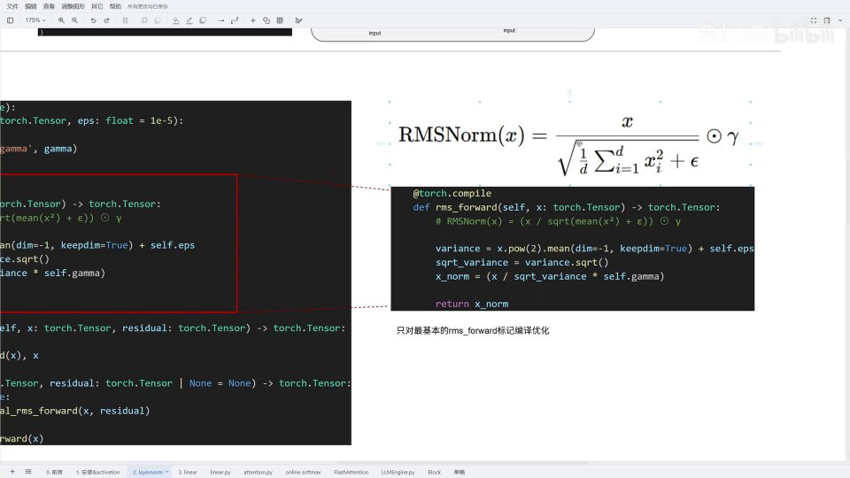 |
| 那好，我们看完这个公式之后，就直接来看这个不同的 [【跳转到 04:40】](https://www.bilibili.com/video/BV1sTz9BREvX/?t=280) | 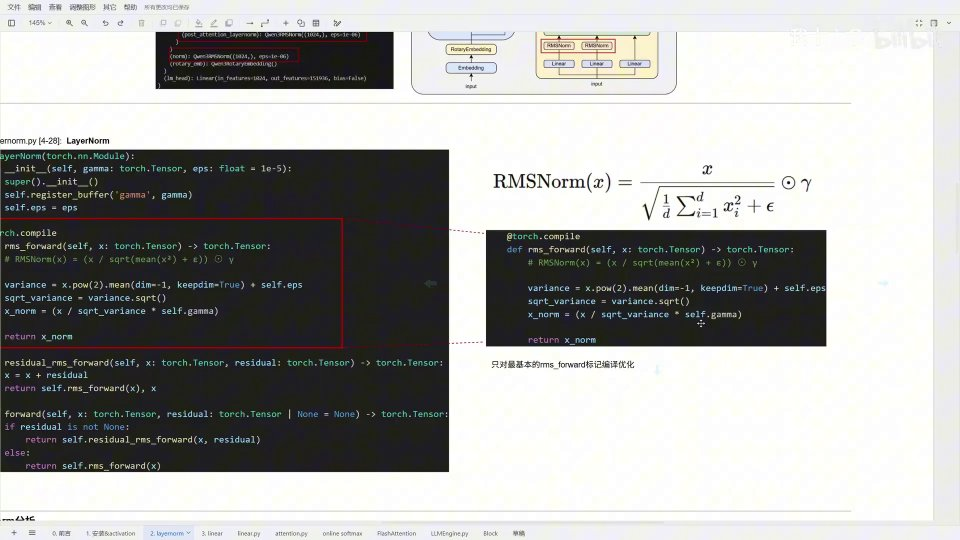 |
| RMSNorm 有什么区别吧。就我们刚才也说了，在 decoder layer 里边 [【跳转到 04:45】](https://www.bilibili.com/video/BV1sTz9BREvX/?t=285) | 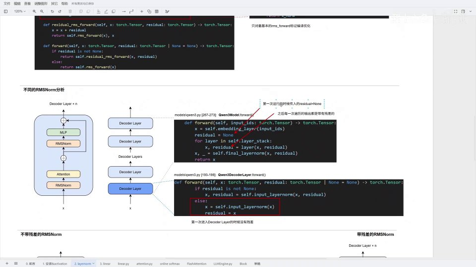 |
| 其实是有两个 RMSNorm 的。这个就是 post attention，也就是在 attention 之后做的这个 RMSNorm；这个就是 input RMSNorm。因为我们的 decoder 层其实是串起来的，就一个一个地循环访问。那我们在进入第一个 decoder layer 的时候， [【跳转到 04:50】](https://www.bilibili.com/video/BV1sTz9BREvX/?t=290) | 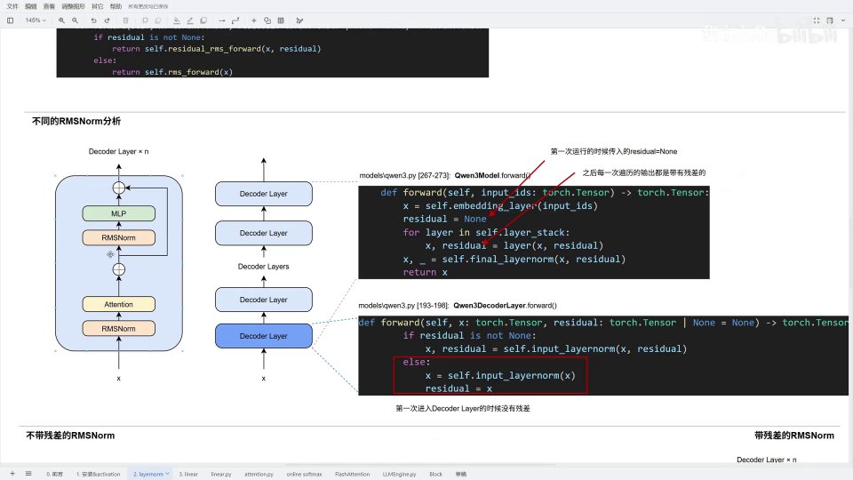 |
| 我们的 X 其实是没有残差的。想象这样一个场景： [【跳转到 05:07】](https://www.bilibili.com/video/BV1sTz9BREvX/?t=307) | 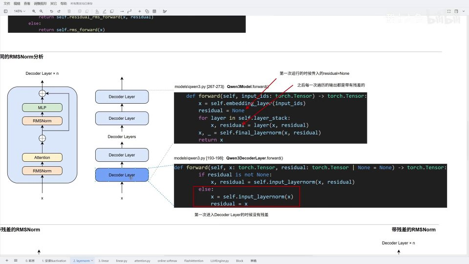 |
| 在我们 token 做了嵌入之后得到了嵌入后的 token，然后再去输入这个 decoder。第一次进来的时候我们是没有残差的，也就是说残差是 None。那没有残差的时候，具体在这个 decoder layer 层里边也有定义，代码就是这样：它第一次进来的时候，因为 residual 是没有的，所以它用的是这个不带残差的 RMSNorm。 [【跳转到 05:12】](https://www.bilibili.com/video/BV1sTz9BREvX/?t=312) | 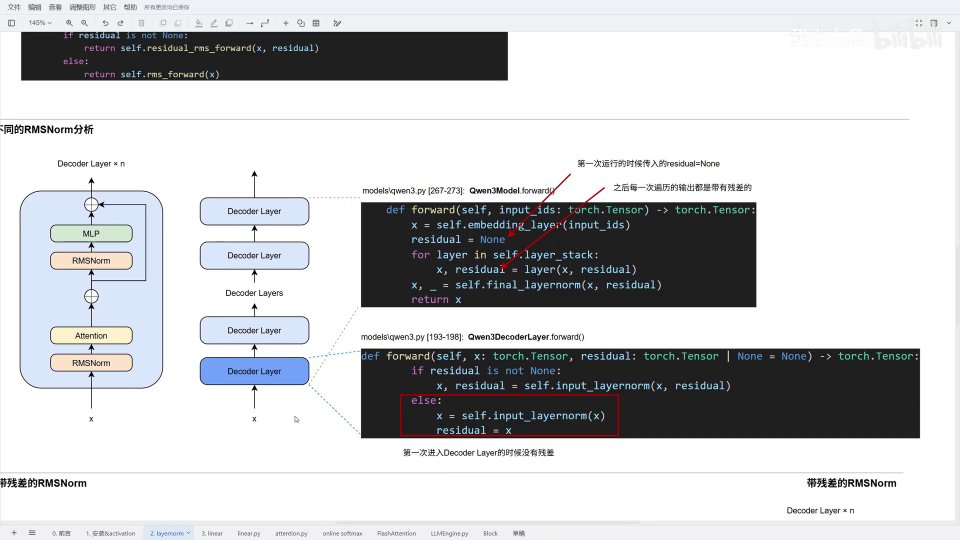 |
| 我们可以去代码里边看一下，看一下这个。 [【跳转到 05:37】](https://www.bilibili.com/video/BV1sTz9BREvX/?t=337) | 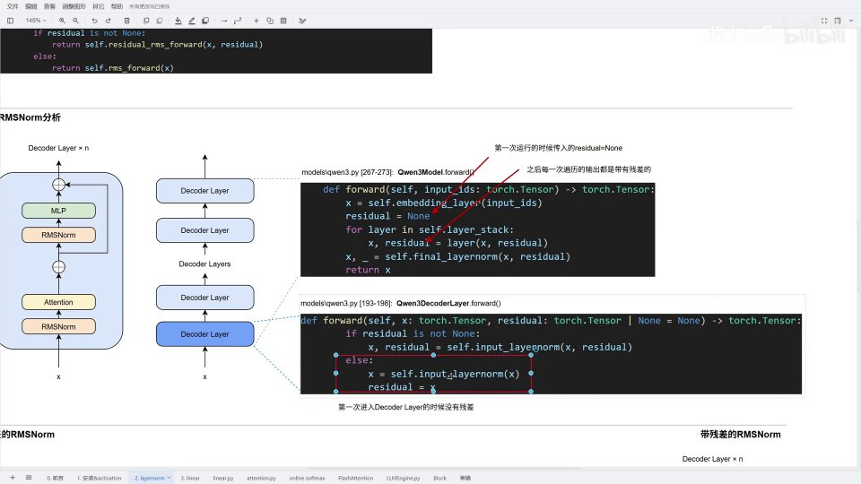 |
| 看它在 Qwen3 这个模型文件里边其实有四处用到，就是定义了四个 RMSNorm。我们刚才说的 decoder layer，其实就在这里边。我们看这个 input layer，input layer 是定义层，定义之后我们看看它在哪里用——就是在它前向传播的时候。那 decoder layer 就是我们的 decoder layer 层。 [【跳转到 05:42】](https://www.bilibili.com/video/BV1sTz9BREvX/?t=342) | 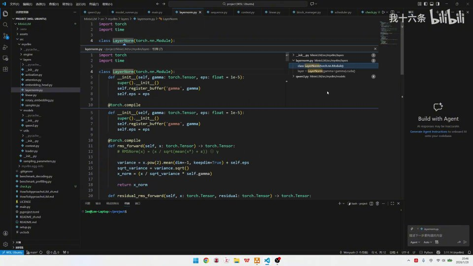 |
| 第一次进来的时候，也就是我们访问的第一个 decoder layer，我们是没有 residual 的。没有 residual，是因为这里 residual is not None 才会访问带残差的；那么第一次进来的时候就没有，所以访问的是下面这个，本质上就是走到这个 forward 里边，它也判断了一次，走的是这个 RMSNorm，也就是最底层的 RMSNorm。 [【跳转到 06:07】](https://www.bilibili.com/video/BV1sTz9BREvX/?t=367) | 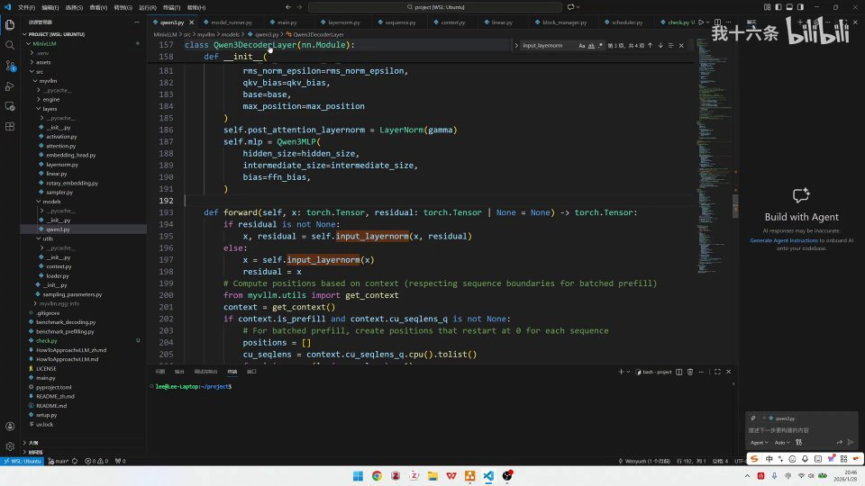 |
| 然后在第二次的时候，或者说除了第一次之后的 [【跳转到 06:29】](https://www.bilibili.com/video/BV1sTz9BREvX/?t=389) | 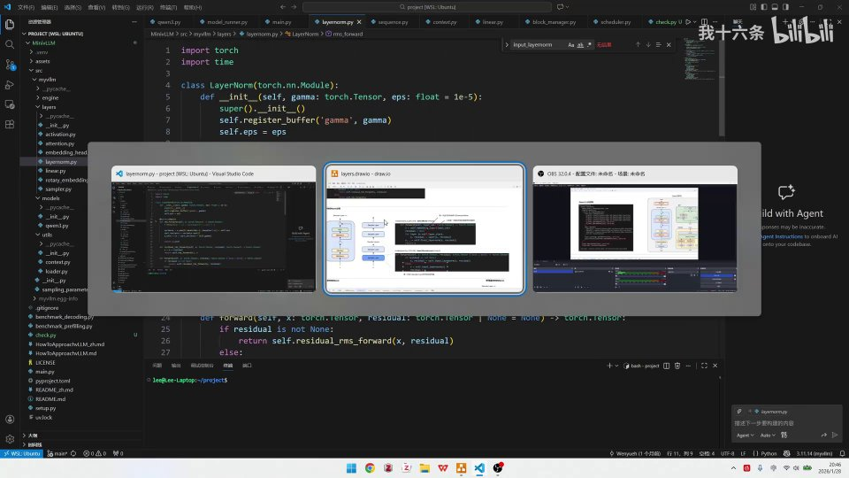 |
| 其他 decoder layer，它都是带残差的。这里因为 input layer 需要残差，而之后都是有残差的，所以它走的就是前面这一个了。然后我们再看一个地方的代码，就是这个 Qwen3 model 整体的前向传播。在前向传播的时候，我们的 X 先做了一个 embedding，embedding 之后…… [【跳转到 06:34】](https://www.bilibili.com/video/BV1sTz9BREvX/?t=394) |  |
| 这里 residual 设为 None，这个 layers 是 stack，其实就是我们 decoder 的堆积，就这一整个。每一个 decoder、每一个 layer 就是一个 decoder。进来的时候，因为我们第一次进来时这个 residual 是 None，那这个 x_residual 就传进去访问，然后走到这一步。所以说这里有一点点细微的差别。好，那我们来看一下不带残差的 RMSNorm 啊， [【跳转到 06:59】](https://www.bilibili.com/video/BV1sTz9BREvX/?t=419) | 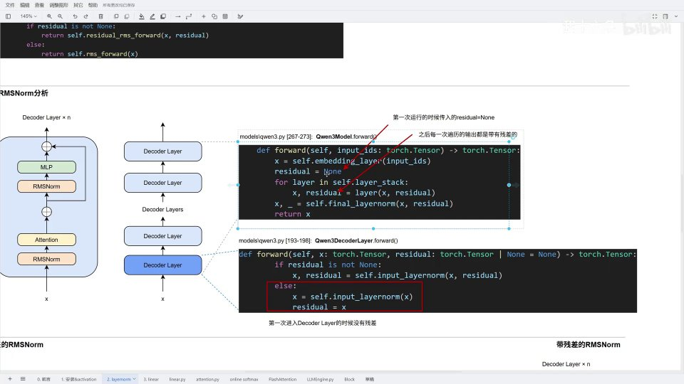 |
| 其实刚才我们也讲了， [【跳转到 07:23】](https://www.bilibili.com/video/BV1sTz9BREvX/?t=443) | 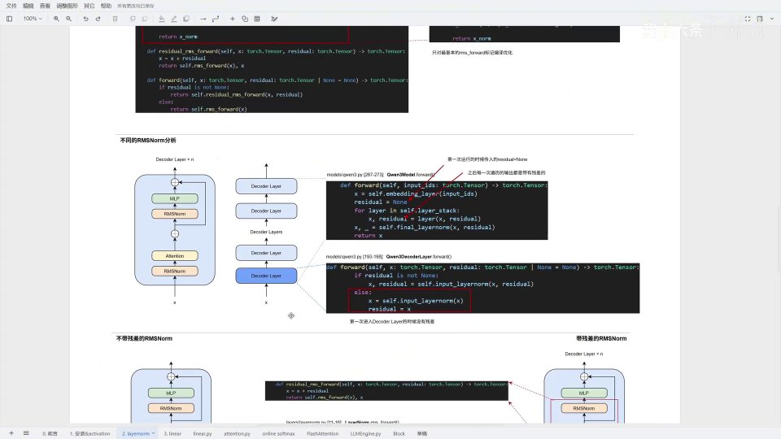 |
| 就是在第一个 decoder 进来的时候，它其实访问的是不带残差的这个。你们可以去代码里面看一下，来回跳跃一下就可以：从这个最开始的 model 调用， [【跳转到 07:28】](https://www.bilibili.com/video/BV1sTz9BREvX/?t=448) | 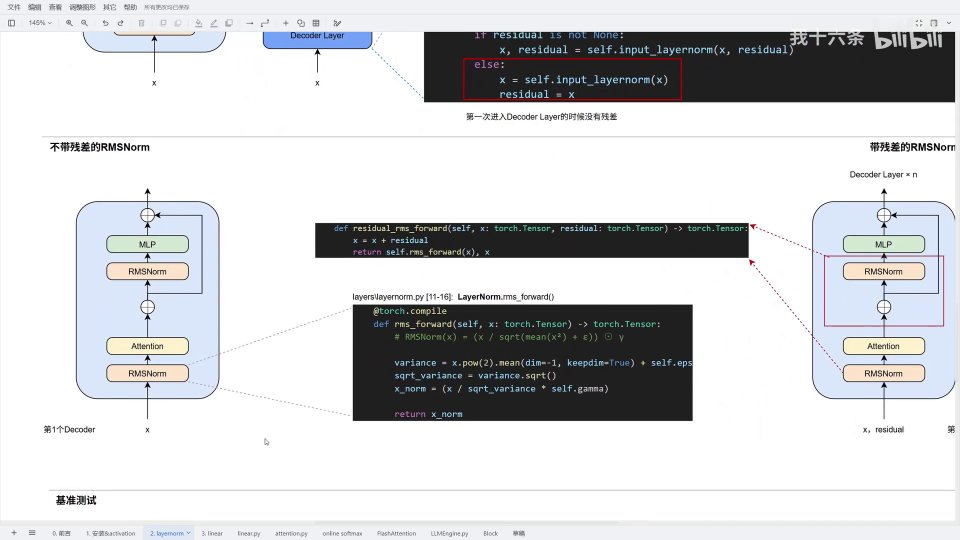 |
| 然后到这个 decoder 调用前向传播， [【跳转到 07:36】](https://www.bilibili.com/video/BV1sTz9BREvX/?t=456) | 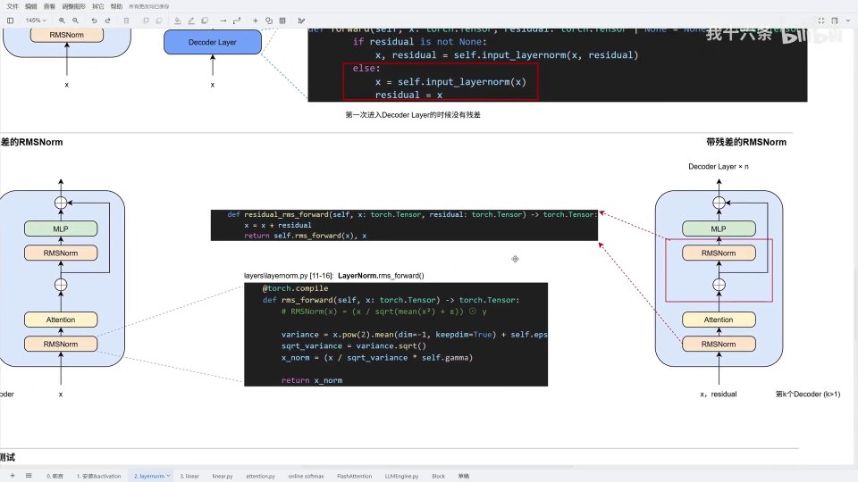 |
| 把它看一遍、流程走一遍，其实就清楚了。因为他只有在第一个 decoder 进来的时候 [【跳转到 07:41】](https://www.bilibili.com/video/BV1sTz9BREvX/?t=461) | 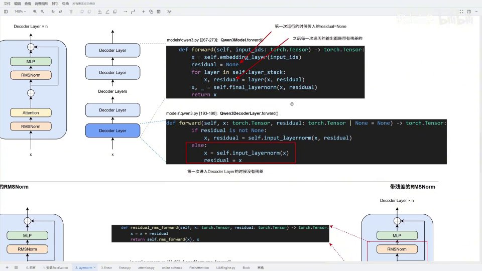 |
| 是不带残差的，那之后所有的 RMSNorm 其实都带残差， [【跳转到 07:46】](https://www.bilibili.com/video/BV1sTz9BREvX/?t=466) | 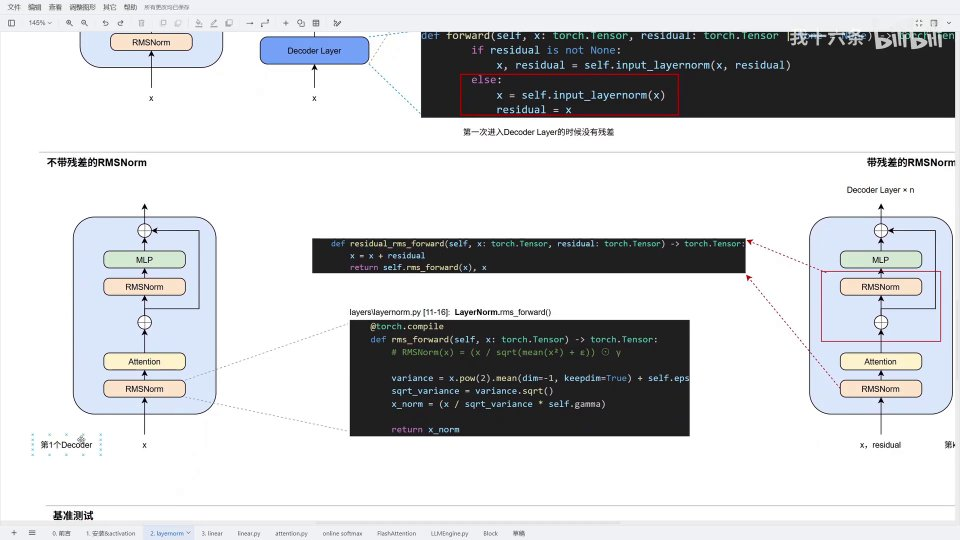 |
| 所以说相对来说还比较好理解。那这个就是第 K 个 decoder 之后、K 大于 1 的情况。 [【跳转到 07:51】](https://www.bilibili.com/video/BV1sTz9BREvX/?t=471) | 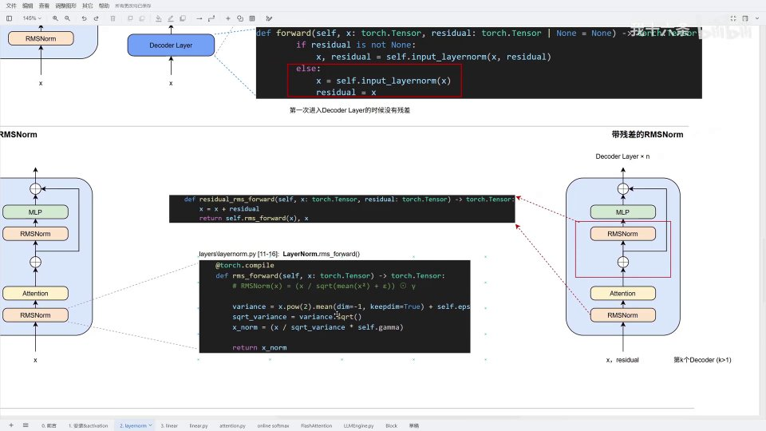 |
| 因为我们循环遍历嘛，我们第二次进来这个 decoder layer 的时候，它的 input layer、input RMSNorm layer 其实也是有了这个残差的，然后走的就是上面这一步了。 [【跳转到 07:56】](https://www.bilibili.com/video/BV1sTz9BREvX/?t=476) | 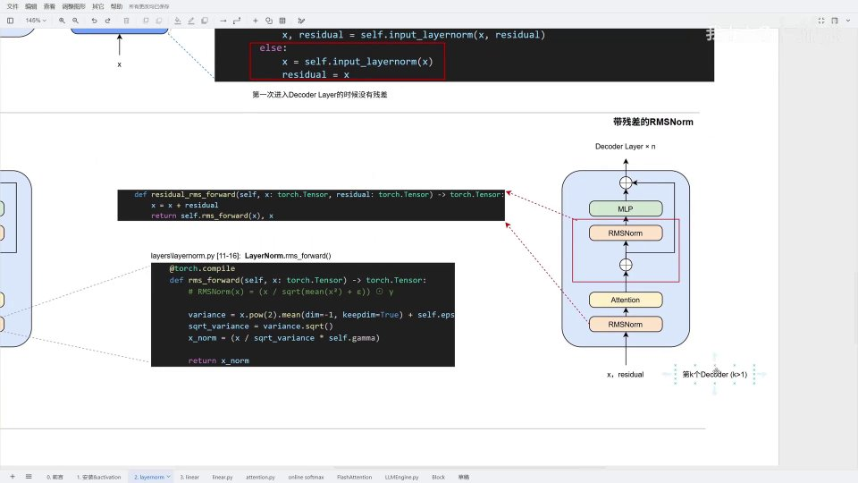 |
| 那最后就看一下这个基准测试吧。 [【跳转到 08:10】](https://www.bilibili.com/video/BV1sTz9BREvX/?t=490) | 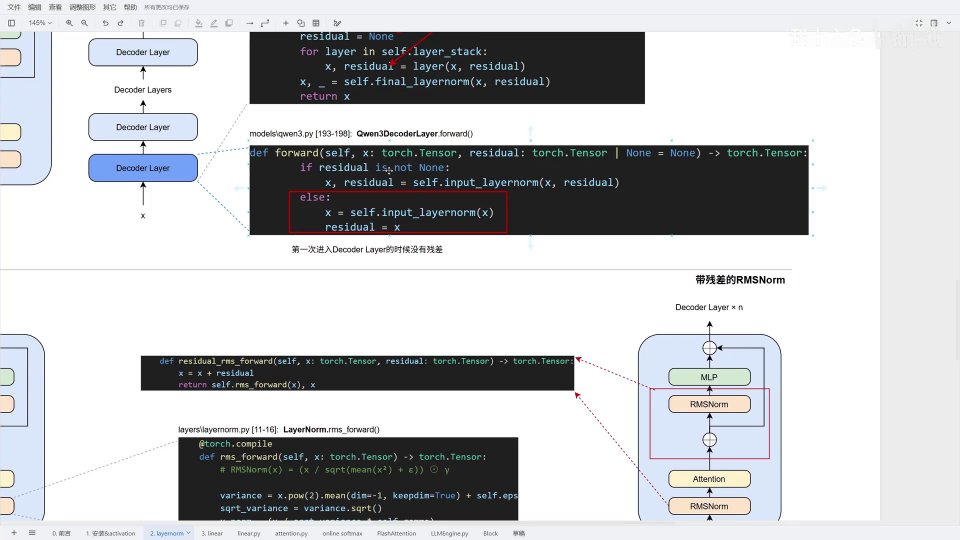 |
| 基准测试这边就是测试了带残差的，以及带编译的 [【跳转到 08:15】](https://www.bilibili.com/video/BV1sTz9BREvX/?t=495) | 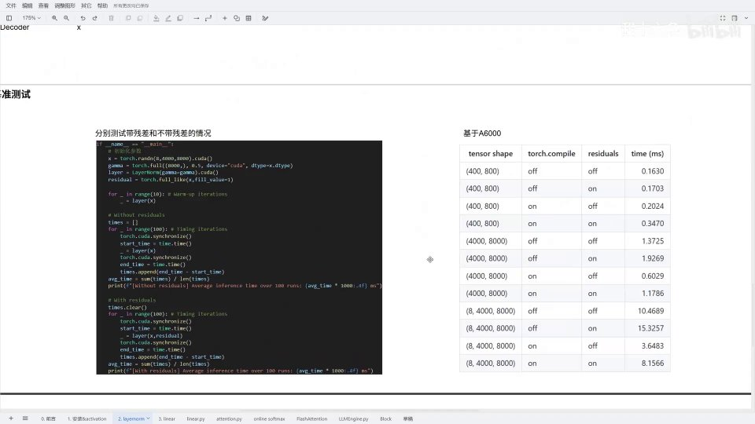 |
| 和这三种形状。其实还是一样的，但是代码里边它其实是没有写完的，就需要大家动手去调整一下。比如说，我还是给大家跑一下吧。 [【跳转到 08:20】](https://www.bilibili.com/video/BV1sTz9BREvX/?t=500) | 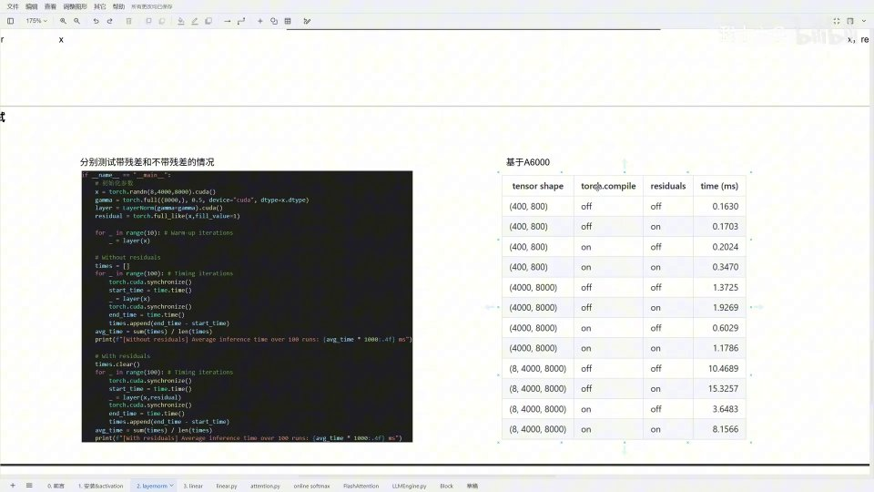 |
| （此区间无字幕） [【跳转到 08:29】](https://www.bilibili.com/video/BV1sTz9BREvX/?t=509) | 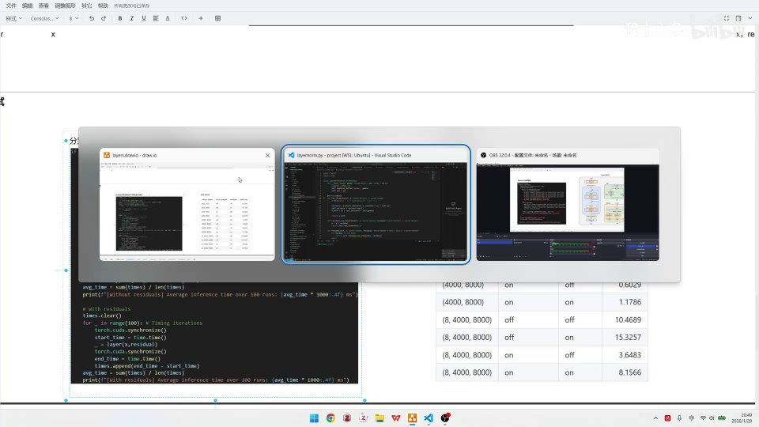 |
| 还是三个形状吧，我先把它们注释掉。首先测试最简单的 400×800，然后跑一下吧。这个就是因为我没有注释掉，就是使用编译的 400×800，然后它会输出……咦，怎么给我报错了呢？刚才报错的原因其实就是那个维度不统一， [【跳转到 08:34】](https://www.bilibili.com/video/BV1sTz9BREvX/?t=514) | 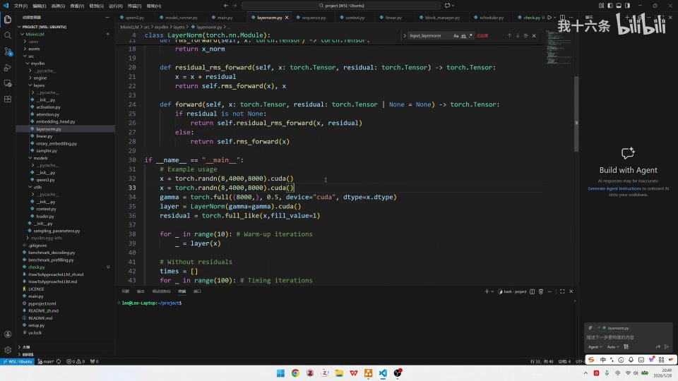 |
| 就是我们的 gamma 和我们定义的 X 最后一层的维度不统一，就没办法做逐元素乘法。那这个时候我们再运行一下，嗯，可以看到不带残差的是 0.14ms，然后带残差的是 0.32ms。需要注意的是，因为我的机器是 3070， [【跳转到 08:59】](https://www.bilibili.com/video/BV1sTz9BREvX/?t=539) | 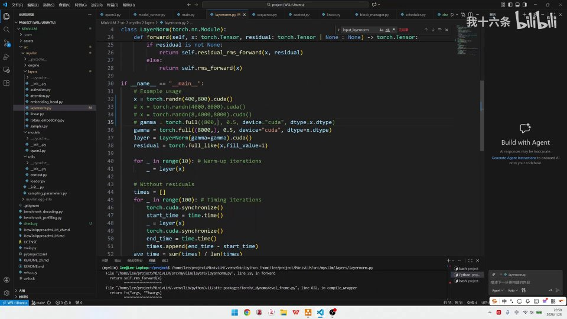 |
| 然后那个 how-to-approach 教程上面用的是 A6000，所以它的结果会有一些差距。那我们再来看一下其他情况，注释一下，用另一组形状来看一下。OK，这个不带残差的要快一些， [【跳转到 09:24】](https://www.bilibili.com/video/BV1sTz9BREvX/?t=564) | 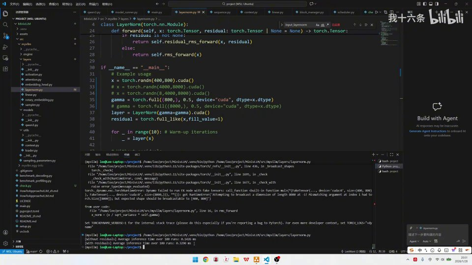 |
| 带残差的要慢一些。那我们把这个编译取消了再看一下，就不编译的情况下这个结果怎么样。哦，不编译的情况下确实慢了很多，就是和我们那个 how-to-approach 里边总结的是一样的。那我就不去把所有的实验案例全都跑一遍了。 [【跳转到 09:49】](https://www.bilibili.com/video/BV1sTz9BREvX/?t=589) | 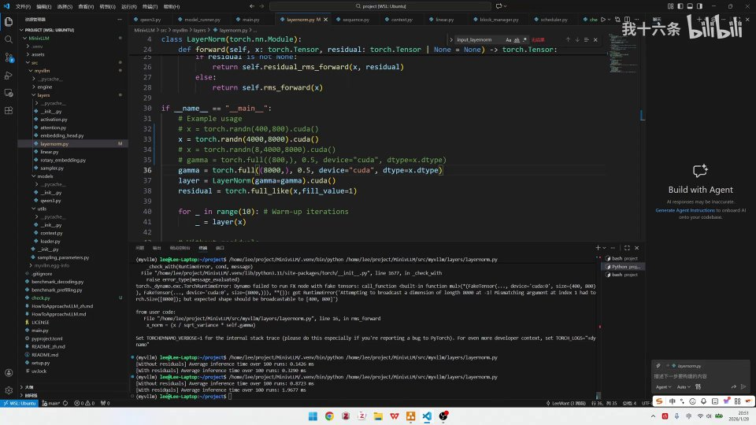 |
| 就大家下来之后可以自己去跑一下。 [【跳转到 10:05】](https://www.bilibili.com/video/BV1sTz9BREvX/?t=605) | 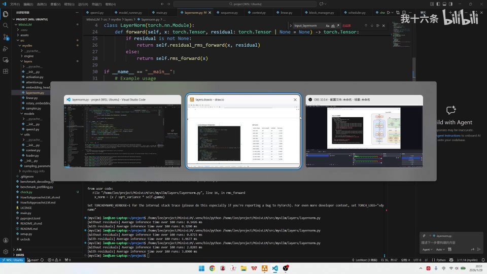 |