# linear.py&张量并行&线性层列并行实现&权重加载 原始文稿（图-字幕分栏）

| 字幕文本 | 画面 |
| :--- | ---: |
| 接下来我们就可以进入 lin 点 py 的学习了。跟着 how-to-approach 教程的 1.3 节，我们就要学习 Linear 这个章节，它有两个比较重点的内容：第一个就是张量并行， [【跳转到 00:00】](https://www.bilibili.com/video/BV1Br6iBaEVV/?t=0) | 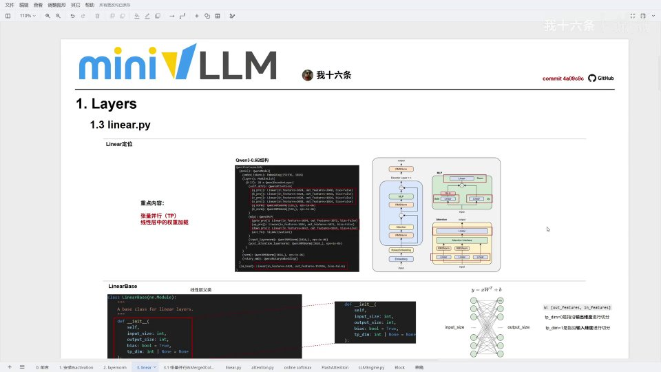 |
| 第二个就是线性层中的权重加载。张量并行这一块我们待会再细讲。 [【跳转到 00:11】](https://www.bilibili.com/video/BV1Br6iBaEVV/?t=11) | 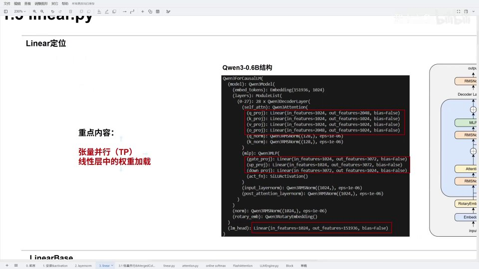 |
| 然后我们还是先看这个结构。在结构中我们可以看到这个红框部分， [【跳转到 00:16】](https://www.bilibili.com/video/BV1Br6iBaEVV/?t=16) | 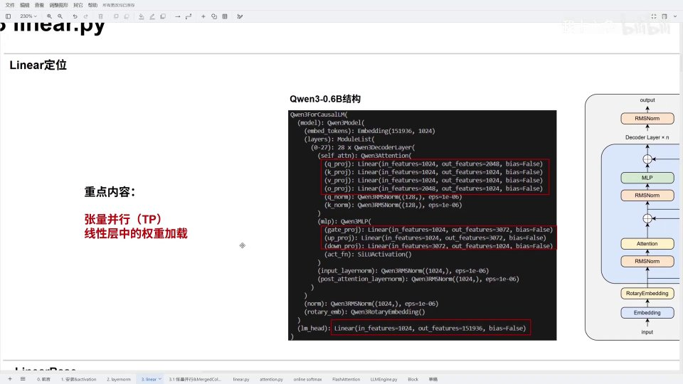 |
| 就是我标出来的线性层，然后对应着右图的算子图里边也对应地标了出来。我们来看一下线性层的维度：Q、K、V 的输入维度都是 1024，输出维度除了 Q 头是 2048，其他的都是 1024。这个地方有一点细微的不同，具体原因是他这里使用了 GQA，也就是分组查询注意力。 [【跳转到 00:21】](https://www.bilibili.com/video/BV1Br6iBaEVV/?t=21) | 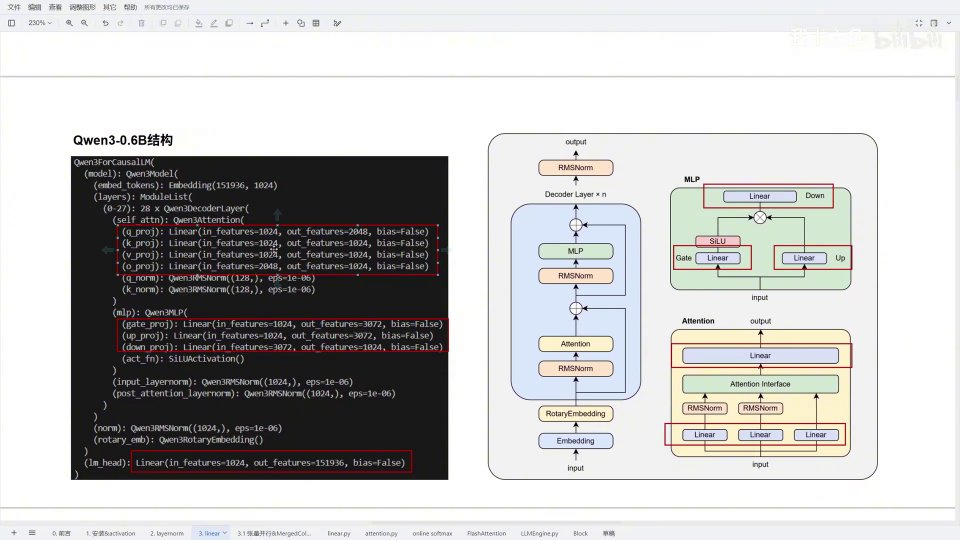 |
| 对 GQA 不太了解的话，可以去看一下我之前的视频，那里对 GQA 有比较详细的讲解。MLP 里边其实也有三个线性层，分别是门控的线性变换、一个上采样、一个下采样，这个之前其实也提到过。然后最后还有一个 lm_head 线性层，当我们得到 output 之后就得到那个嵌入，在这个地方做了一个 15 万维度的输出。 [【跳转到 00:46】](https://www.bilibili.com/video/BV1Br6iBaEVV/?t=46) | 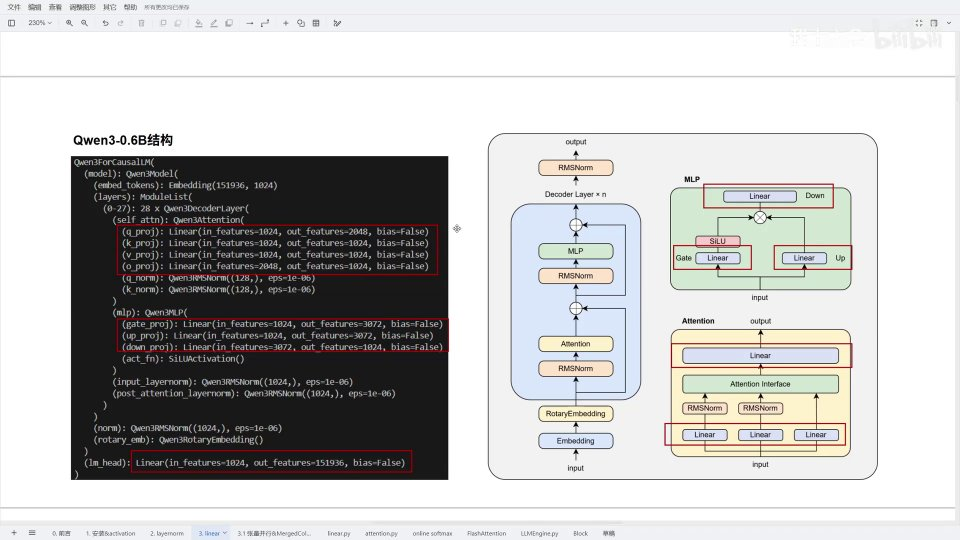 |
| 这个其实就是词表长度，包括我们嵌入的词表其实长度也是这么多。然后输出这个词表长度，得到当前 token 对每一个词的预测概率，然后就可以去做采样了。好，我们接下来看一下基类。 [【跳转到 01:11】](https://www.bilibili.com/video/BV1Br6iBaEVV/?t=71) | 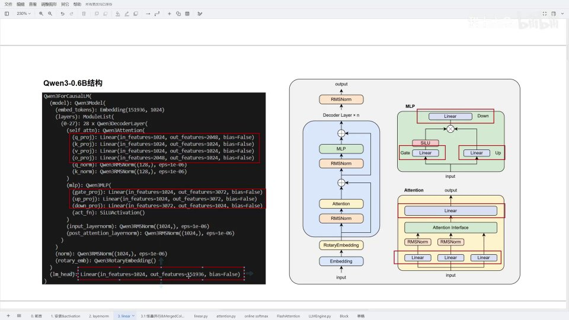 |
| 还是先从源代码去看吧。 [【跳转到 01:27】](https://www.bilibili.com/video/BV1Br6iBaEVV/?t=87) | 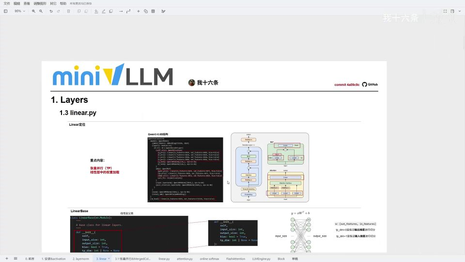 |
| lin 点 py 的源代码一共有 200 多行。 [【跳转到 01:32】](https://www.bilibili.com/video/BV1Br6iBaEVV/?t=92) | 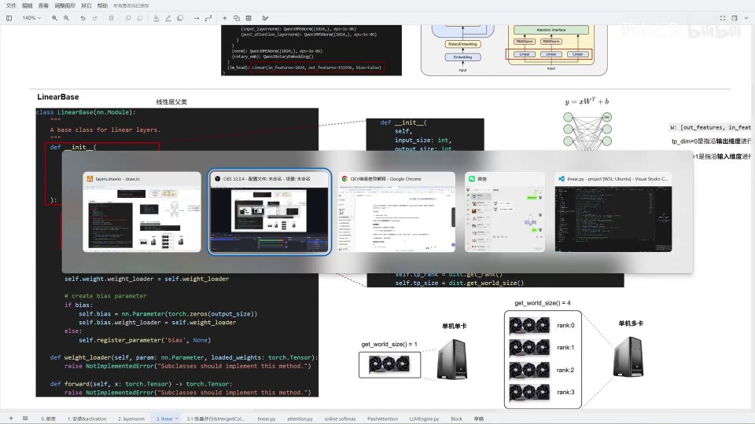 |
| 不包括这个测试，测试用例我们待会再重新讲。看这里一共有 225 行，不包括注释的话可能就 100 多行。我们先来看这个 LinearBase。LinearBase 里边其实实现的原理是和最基本的那个线性层一样的，但是它多了一些参数，包括这个 tp_dim，还有并行的 rank 和 size。这个 tp_dim 就是用来做张量并行的。 [【跳转到 01:37】](https://www.bilibili.com/video/BV1Br6iBaEVV/?t=97) | 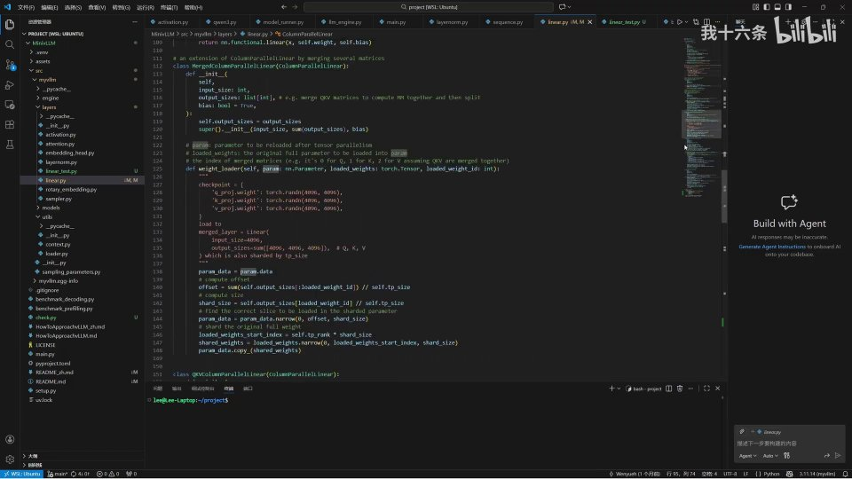 |
| 具体从哪个维度去做切分，它只有两种情况：一个是零，一个是一，零的话就是列并行，一的话就是行并行。这个 tp_rank 就是获取当前设备的 rank 号，也就是我当前在整个并行设备中排第几个设备。那这个 get_world_size 就是获取整个参与并行的机器数量。 [【跳转到 02:02】](https://www.bilibili.com/video/BV1Br6iBaEVV/?t=122) | 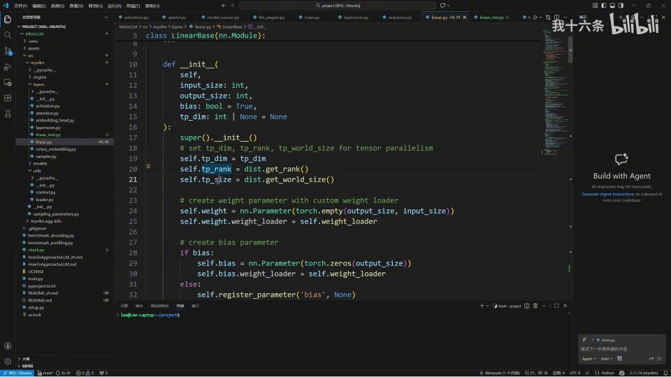 |
| 对，搞忘说这个 dist，这个 dist 其实就是 PyTorch 的 distributed，里边是一个分布式通讯的包。然后他还定义了一个 weight，也就是我们初始化的权重，它是定义了一个空权重，只是用 nn.Parameter 告诉这个权重它是一个权重参数。然后这边定义了一个权重加载器，初始化的权重加载器，这里是没有做任何实现的。 [【跳转到 02:27】](https://www.bilibili.com/video/BV1Br6iBaEVV/?t=147) | 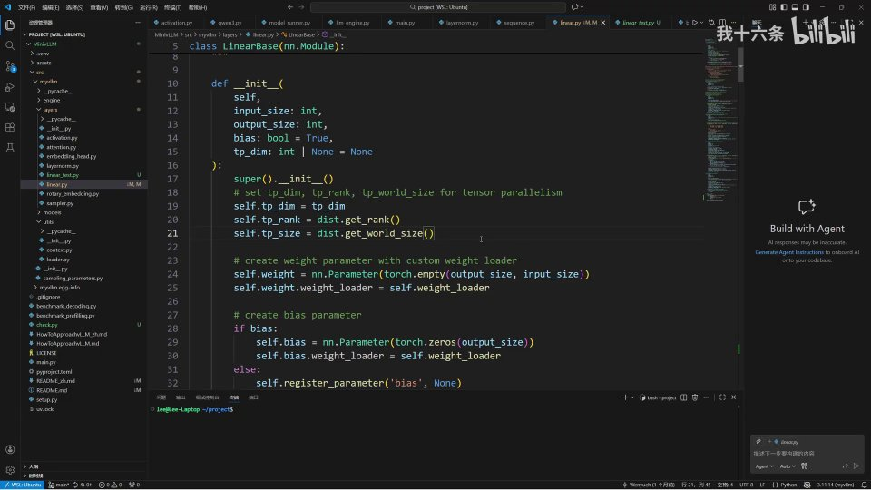 |
| 但因为我们之后要继承这个 LinearBase，所以我们之后基于这个 LinearBase 都是需要去实现这个 weight_loader 的。对于偏置来说也是一个道理，但有些情况可能没有偏置，所以就只是会注册一个空的偏置。这个就是 LinearBase。然后来看第一个，这个 ReplicatedLinear，这个其实就是直接复制，看这个就直接复制。 [【跳转到 02:52】](https://www.bilibili.com/video/BV1Br6iBaEVV/?t=172) | 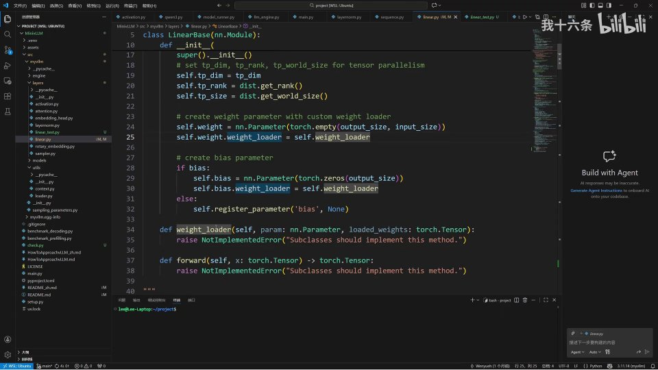 |
| 复制这个 Linear，就是不考虑并行的情况下，最传统的那个 Linear。然后这里边的 weight_loader 是直接加载，直接 copy——这个 load_weight 就是直接对权重做的一个 copy。然后需要提一嘴的就是这个权重，以防大家不知道，我这边多说一句。 [【跳转到 03:17】](https://www.bilibili.com/video/BV1Br6iBaEVV/?t=197) |  |
| 就是因为我们在 MiniVLLM 里面定义的模型，从之前到现在其实都是在搭结构，我们一直在搭 Qwen3 的具体结构。在 MiniVLLM 里边，我们骨架搭起来了，但是我们没有血肉，这个血肉其实就是权重。那我们需要从内存中把权重放到我们骨架中去，这一块就是我们具体现在正在做的事情，正在学习的事情。 [【跳转到 03:42】](https://www.bilibili.com/video/BV1Br6iBaEVV/?t=222) | 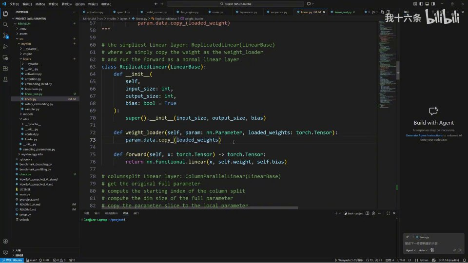 |
| 然后这个是列并行，就简单看一下吧，待会我们再去深入讲一下。它的权重加载就要复杂很多，它这边是对输出维度做了一个 TP size 的整除、取余，这个地方待会我们再细讲。然后这个是合并线性层，就是当有多个线性层的时候，我们要去做一个合并线性层的并行，这种情况下就会去调用这个。 [【跳转到 04:07】](https://www.bilibili.com/video/BV1Br6iBaEVV/?t=247) |  |
| 这个是 QKV 并行，这个就更复杂了，相对来说要复杂吧，其实也不是很复杂。我们在了解了列并行之后，其实前面这两个都是基于列并行去做的，所以说没有太大的问题在里边。然后最后一个是行并行。这下面就不用管了，我们一个一个来看。 [【跳转到 04:32】](https://www.bilibili.com/video/BV1Br6iBaEVV/?t=272) | 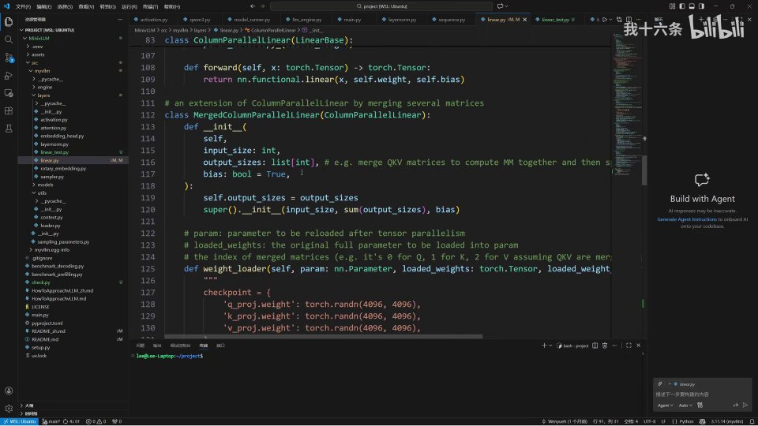 |
| 好，先看这个 LinearBase，就是我们的线性层基类。 [【跳转到 04:57】](https://www.bilibili.com/video/BV1Br6iBaEVV/?t=297) | 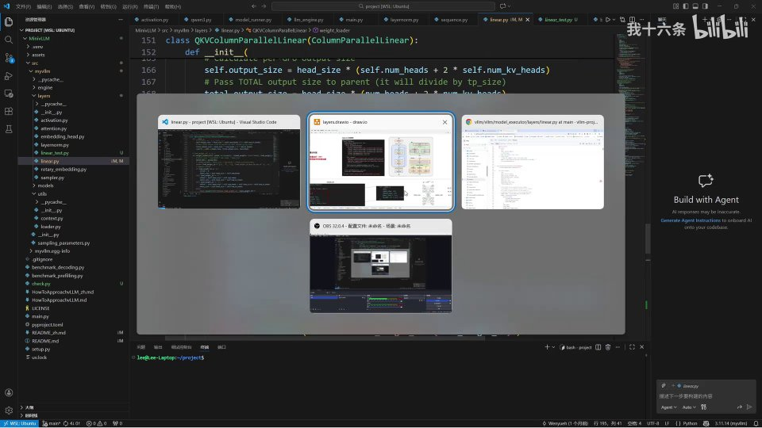 |
| 首先线性层基类，刚才也讲过了，他这个最基础的，还是看一下吧。 [【跳转到 05:02】](https://www.bilibili.com/video/BV1Br6iBaEVV/?t=302) | 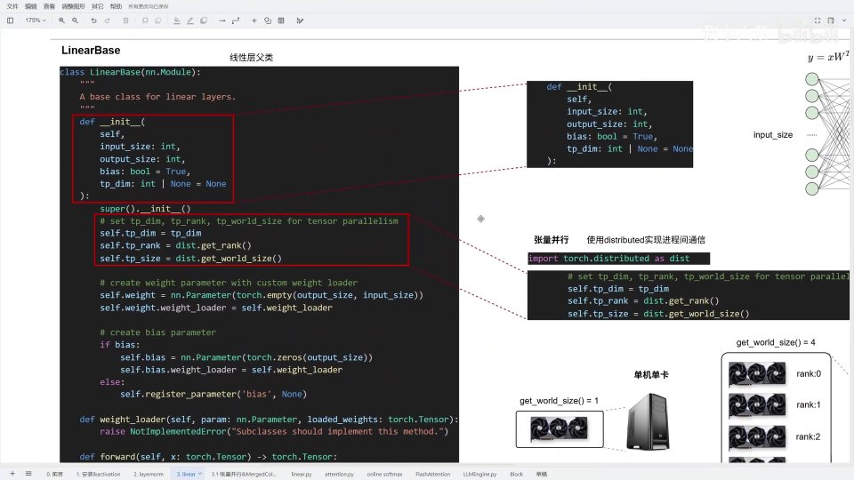 |
| 就是我们的权重。我们线性层定义好之后有一个 input_size 和 output_size。 [【跳转到 05:07】](https://www.bilibili.com/video/BV1Br6iBaEVV/?t=307) | 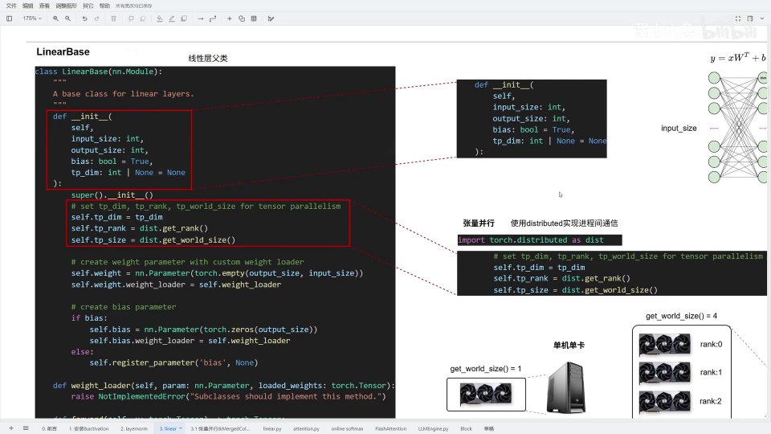 |
| 我们最经典的就是这个线性层，Y 等于 X 乘以权重的转置，然后加上一个偏置。那 input_size 就是输入维度，output_size 就是输出维度，偏置的维度其实就是等于我们输出的维度。 [【跳转到 05:12】](https://www.bilibili.com/video/BV1Br6iBaEVV/?t=312) | 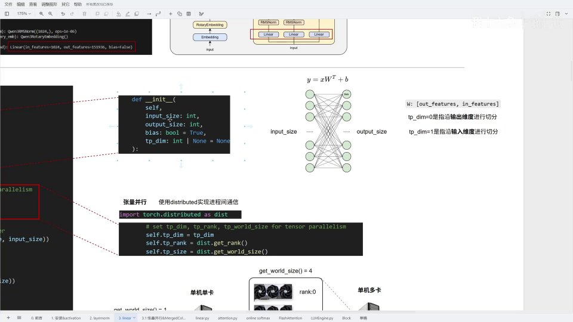 |
| 就每一个神经元这里是有一个 bias 在里边的。 [【跳转到 05:24】](https://www.bilibili.com/video/BV1Br6iBaEVV/?t=324) | 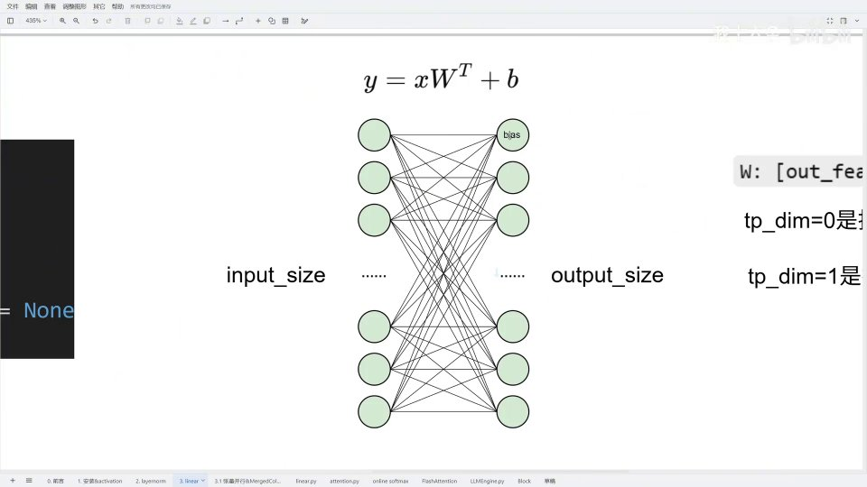 |
| 然后 tp_dim 的意思就是，沿着行、也就是沿着输入维度，还是沿着……去进行切分。这个地方有一个坑在里边，就是我们权重在本地存储的情况下，是 out_features 和 in_features，它的形状是这样的，和我们的线性层的输入输出维度是相反的，听起来有点反直觉。但实际上是因为我们线性层在做矩阵乘的时候， [【跳转到 05:29】](https://www.bilibili.com/video/BV1Br6iBaEVV/?t=329) | 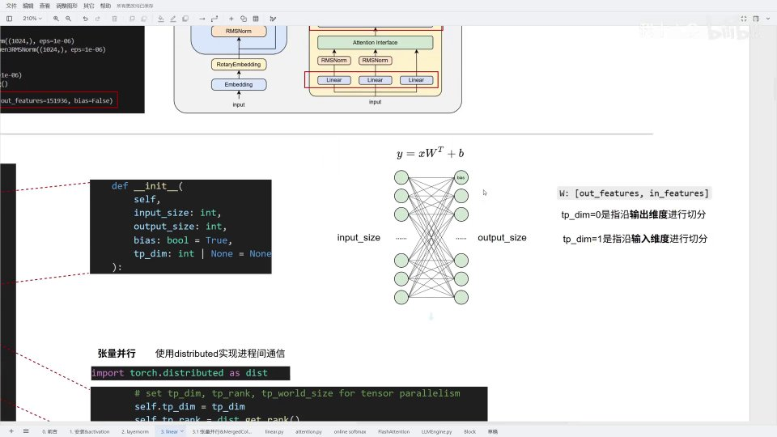 |
| 我们这个地方 X 乘的是权重的转置，所以说为了保证和我们线性层做统一的这种 input_size、output_size 的对应，我们对它做一个统一，所以说权重在本地存储的时候它是反过来的：第一个维度、就是 0 这个维度其实是 out_features，然后输入维度其实是 1 这个维度。所以说对于张量并行来说就两种情况：等于 0 的时候就沿着输出维度 [【跳转到 05:54】](https://www.bilibili.com/video/BV1Br6iBaEVV/?t=354) | 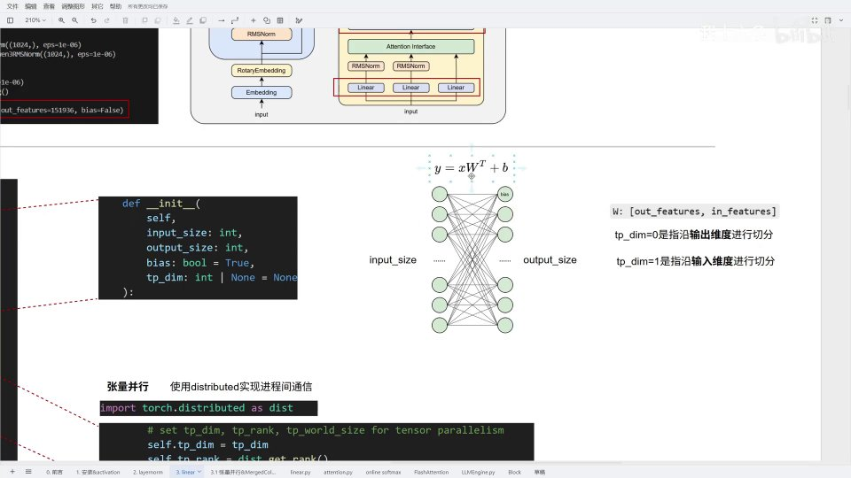 |
| 就沿着这个第一个维度去做的切分，然后 tp_dim 等于一的时候就是输入维度、就是这个维度去做的切分。从线性层来看的话，当 tp_dim 等于零的时候，那就是从这里、从这个地方开始切，每个模型保留……输入的数量是不变的，我们的输入该是多少还是多少，但是我们的输出就变成只有一半了，那这个就是列并行。那 tp_dim 等于一的时候就是行并行。 [【跳转到 06:19】](https://www.bilibili.com/video/BV1Br6iBaEVV/?t=379) |  |
| 可能现在讲的有点早，待会我们去结合具体案例去看吧， [【跳转到 06:44】](https://www.bilibili.com/video/BV1Br6iBaEVV/?t=404) | 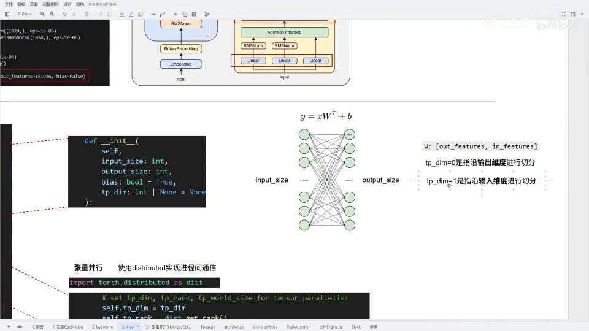 |
| 就比较好理解一点。好，然后这个地方就是做的张量并行。 [【跳转到 06:49】](https://www.bilibili.com/video/BV1Br6iBaEVV/?t=409) | 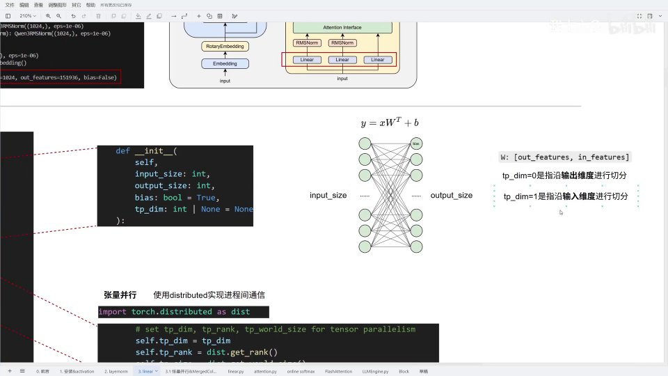 |
| 这个 import torch.distributed 就是刚才我们说的那个分布式通信包。然后下面这三个，tp_dim 已经讲了，tp_rank 之前也讲过，那再讲一遍吧，这个就是获取我们当前设备号。 [【跳转到 06:54】](https://www.bilibili.com/video/BV1Br6iBaEVV/?t=414) | 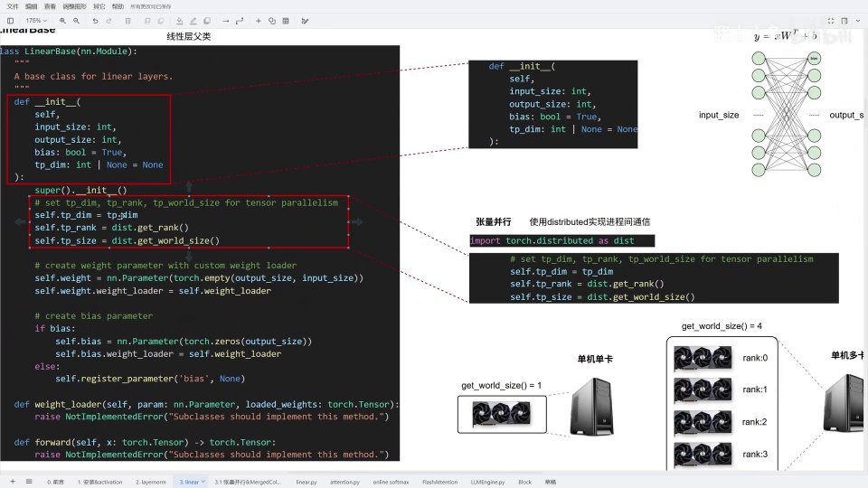 |
| 具体结合下面这个图片来讲。目前可能大部分人用的应该都是单机单卡吧， [【跳转到 07:11】](https://www.bilibili.com/video/BV1Br6iBaEVV/?t=431) | 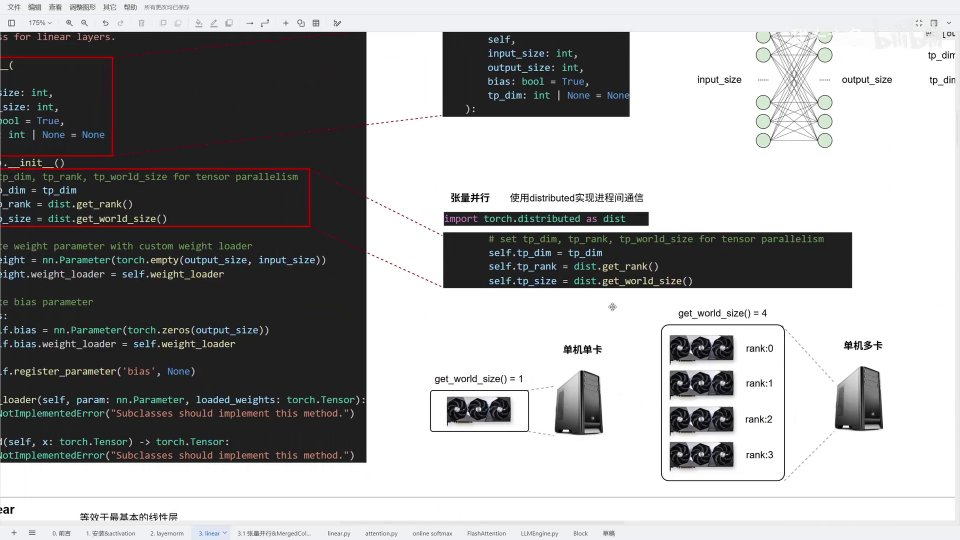 |
| 如果说你实验室有环境的话，可能是有单机多卡或者多机多卡的情况。那单机单卡就很直白，就只有一台机器，那整个比如说我们如果调用这个 get_world_size 的话就等于一，全世界只有一个；那 get_rank 的话可能就等于零，因为设备号是从零开始排的，所以这个 rank 号就是零。那我们来看一下单机多卡的情况。 [【跳转到 07:16】](https://www.bilibili.com/video/BV1Br6iBaEVV/?t=436) | 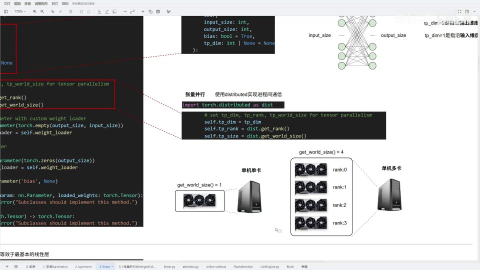 |
| 如果说要用这个 get_world_size 的话，比如说我们有四张显卡，那就用 get_size，那就是有四个。那么对应着，比如我在这个 rank 0 中调用 get_rank 的话，输出的 rank 就是零。每台机器它内部维护的这个 rank 号就会输出，就是这个 dist.get_rank()，获取的是每台设备自己维护的那个 rank 号。 [【跳转到 07:38】](https://www.bilibili.com/video/BV1Br6iBaEVV/?t=458) | 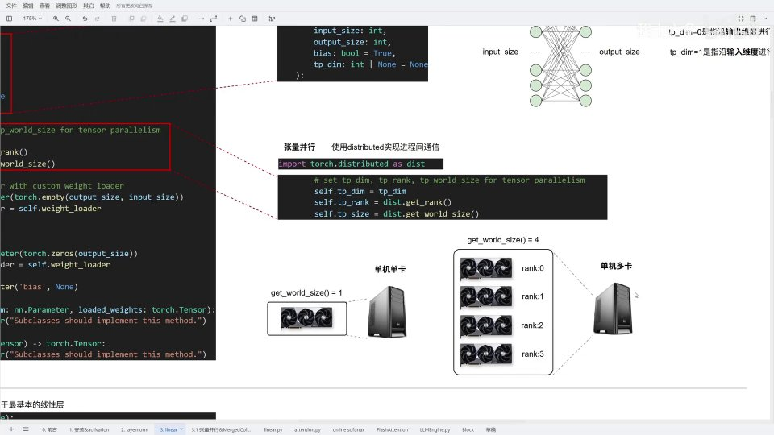 |
| 那有这样一个前提过后，我们就可以来看……先把这个最基本的这个线性层 [【跳转到 08:03】](https://www.bilibili.com/video/BV1Br6iBaEVV/?t=483) | 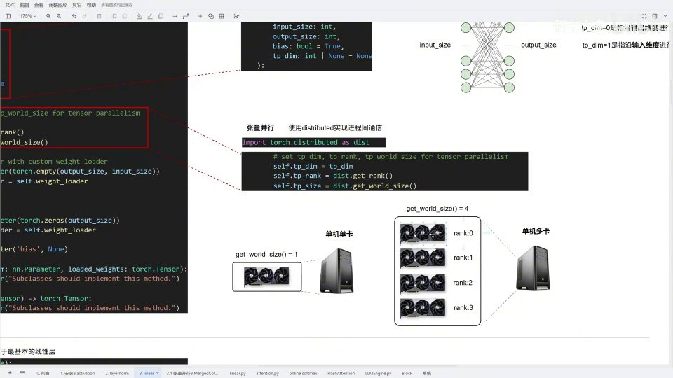 |
| 哎，我就不讲了，这一块其实就是最基础的线性层。 [【跳转到 08:08】](https://www.bilibili.com/video/BV1Br6iBaEVV/?t=488) | 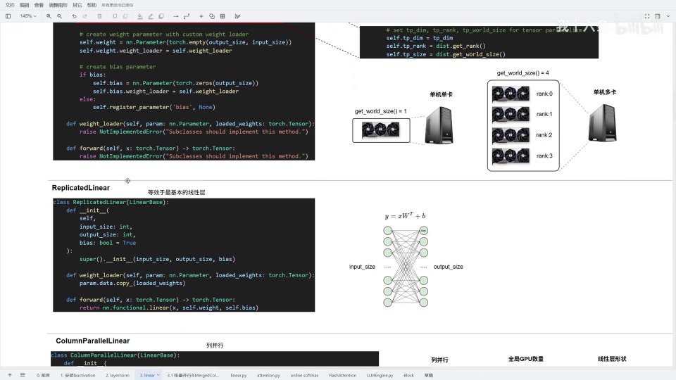 |
| 然后我们直接来看这个列并行。先还是从源代码一行一行给大家解释一下。 [【跳转到 08:13】](https://www.bilibili.com/video/BV1Br6iBaEVV/?t=493) | 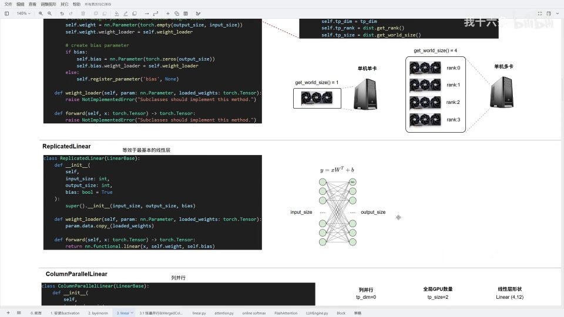 |
| 首先定义一个列并行，然后继承的是 LinearBase，这前面都是一样的。然后 tp_size 获取当前我并行设备的数量。然后这个地方做了一个断言，output_size 一定要被这个 tp_size 整除，如果不整除的话就会报错。然后这边做了一个 init，就调用我们原本的基类，但是他这个地方 output_size 是直接除 [【跳转到 08:18】](https://www.bilibili.com/video/BV1Br6iBaEVV/?t=498) |  |
| 这个是地板除，直接除了这个 tp_size，然后是沿着 0 这个维度，也就是做的列并行、去做的一个整除。好，然后我们来看一下权重 weight_loader。这个参数形状与我们想要加载的那个权重形状其实是一致的，这个就是我们要加载的权重、本地存储的权重。这一行代码其实是在获取我们本地存储权重的第一行 [【跳转到 08:43】](https://www.bilibili.com/video/BV1Br6iBaEVV/?t=523) | 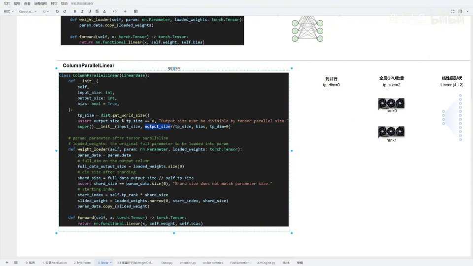 |
| 也就是列的那一行的长度。比如说我们本地存储如果是 12 的话，他这个返回值其实就是 12。这一行其实是在计算我们本地存储的权重一共会被划分成多少片，这个就是 shard_size，就相当于我每一台 GPU 上存储的那个权重的列、也就是输出维度是多少。然后这个地方做了一个断言 [【跳转到 09:08】](https://www.bilibili.com/video/BV1Br6iBaEVV/?t=548) | 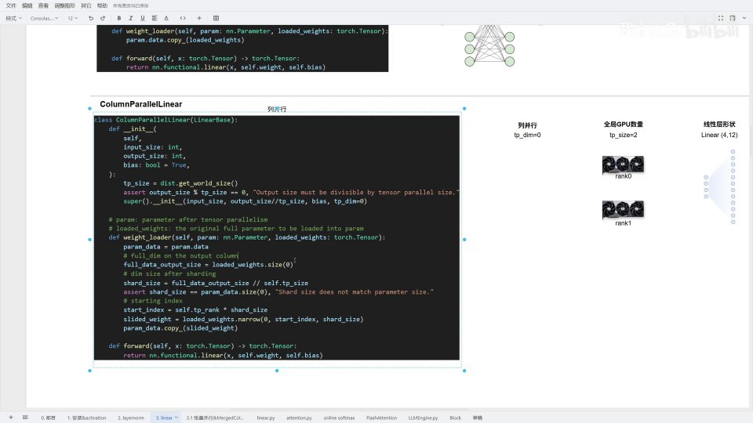 |
| 就是说我们这个输出维度要和我们原本定义的那个输出维度要一致。然后开始计算，这个地方是算我们当前 GPU 是从哪一个点出发，比如说我们权重在四台设备上被分成了四片，那这个 start_index 就是我第一台设备要从权重的第一片出发，第二台 GPU 就是从我权重的第二片出发，第三台就是从我权重的第三片出发。 [【跳转到 09:33】](https://www.bilibili.com/video/BV1Br6iBaEVV/?t=573) |  |
| 因为我们权重存储的时候它是被划分了，但是我们划分的权重具体是从哪儿开始去读取的，这个就是这一步在做的事情。然后这一行就是对权重做具体的划分：一个是我们权重开始的起点，然后这个地方就是我们要走多少步，划分出来具体的权重。这个 0 就是沿着列、也就是输出维度去做的那个划分。然后最后就是把这个权重给加载进去。 [【跳转到 09:58】](https://www.bilibili.com/video/BV1Br6iBaEVV/?t=598) |  |
| 就这个权重加载就是这样。然后我们还是通过例子去理解吧。 [【跳转到 10:23】](https://www.bilibili.com/video/BV1Br6iBaEVV/?t=623) | 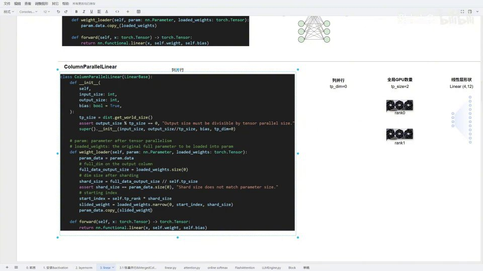 |
| 考虑这样一个情况：我们全局的 GPU 数量是二，就 TP size 的…… [【跳转到 10:28】](https://www.bilibili.com/video/BV1Br6iBaEVV/?t=628) | 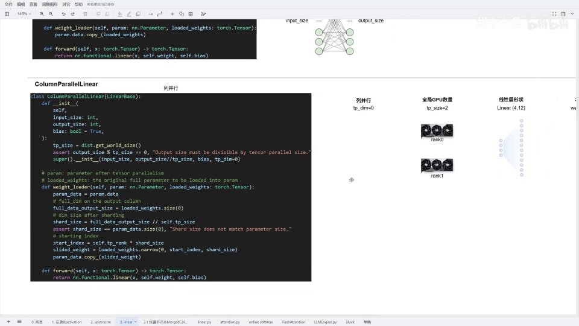 |
| TP，这应该我写严谨一点，world_size，就我们全局的数量是二。然后线性层形状是 4×12，我们用一个比较小的线性层这样比较好理解。然后本地权重是 12×4，因为权重的形状和线性层的形状是相反的。我们把这个 GPU 拿下来，每一台 GPU 因为是张量并行，那每一台 GPU 它沿着线性层的输出维度做的裁剪， [【跳转到 10:33】](https://www.bilibili.com/video/BV1Br6iBaEVV/?t=633) |  |
| 那我第一个 rank 等于零的情况下，我的 GPU 实际上线性层就只维护上半部分、就只有上半部分。那对于我们 rank 等于一的情况下， [【跳转到 10:58】](https://www.bilibili.com/video/BV1Br6iBaEVV/?t=658) | 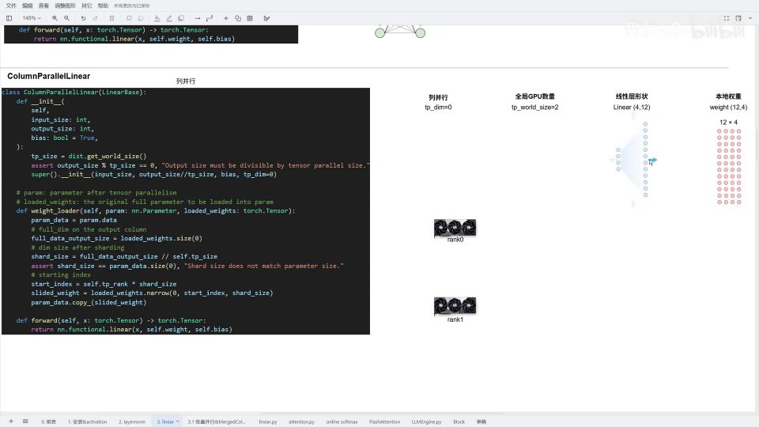 |
| 我 GPU 可能就只有下半部分。这样其实就比较好理解了。在这个权重加载的过程中，首先计算这个 load_weight 的 size，这个地方就等于 12，因为我们现在的权重是 12 进来，然后 12 再除以我们全局的 TP size，那就等于 6，这个 shard_size 就等于 6。相当于我们每一台 GPU 设备，这个 shard_size 就维护了线性层的输出维度，其实就是 6。 [【跳转到 11:09】](https://www.bilibili.com/video/BV1Br6iBaEVV/?t=669) | 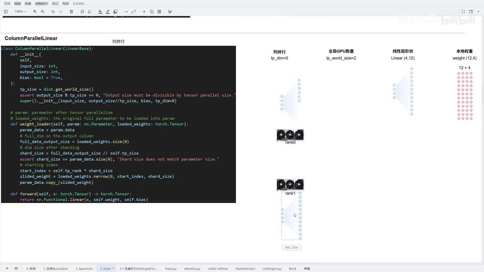 |
| 然后看这个 start_index。那对于我们 rank 0 来说，第一台 GPU，这个 tp_rank 就等于零，0 乘以 shard_size 0×6，那输出就是零。然后我们再看这个 local weight，这就是我们本地存放的权重，把它放这边来，这是我们本地存放的权重。然后现在是需要加载这个权重。 [【跳转到 11:34】](https://www.bilibili.com/video/BV1Br6iBaEVV/?t=694) | 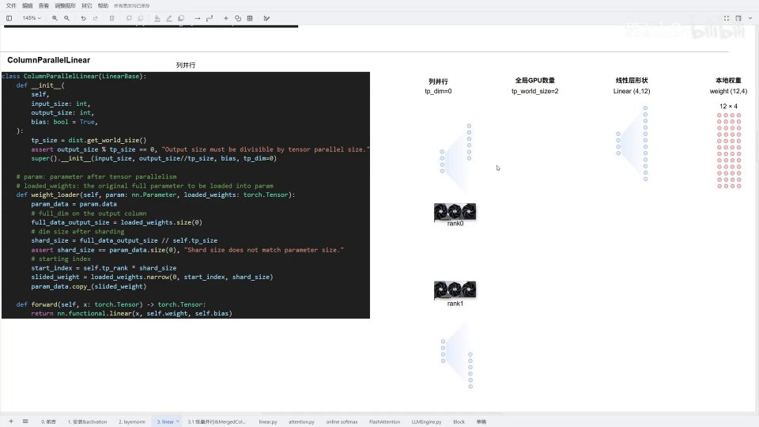 |
| 首先对权重做一个切分，沿着列的维度。比如说我们现在 GPU 0 上，start_index 这个地方就是零，然后 shard_size 是六，那就是沿着零取到 6 这个位置，就是取得前半部分的那个位置。那这个 weight 我们取出来了，然后 data.copy_，OK，直接把这个东西 copy 复制到我们当前层里边去。 [【跳转到 11:59】](https://www.bilibili.com/video/BV1Br6iBaEVV/?t=719) | 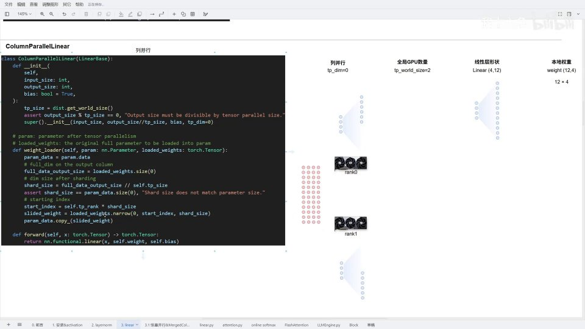 |
| 然后这个线性层的权重就被加载进来了，对吧。那这个 rank 一，一样的，rank 1 我们还是看一下吧。我们当前的 tp_rank 这个地方……因为我们是实现了这个 LinearBase 嘛，LinearBase [【跳转到 12:24】](https://www.bilibili.com/video/BV1Br6iBaEVV/?t=744) | 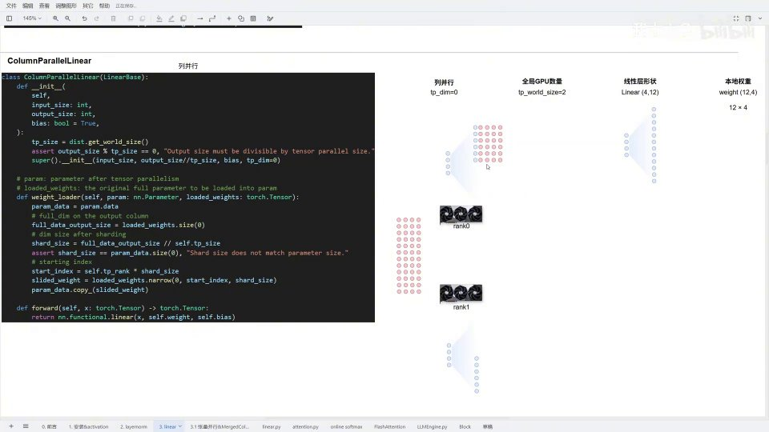 |
| 它其实是已经获取了这个 get_rank 和 get_world_size 的。对于我们 GPU 1 来说， [【跳转到 12:40】](https://www.bilibili.com/video/BV1Br6iBaEVV/?t=760) | 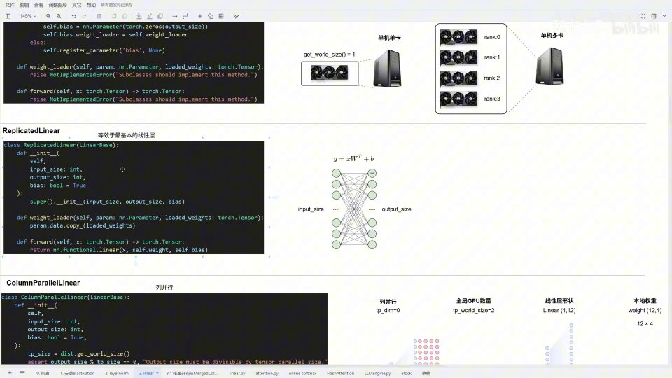 |
| 当前的 tp_rank 等于一，一乘以 shard_size 等于六。OK，那就是从第六个开始，start_index 就等于六，然后 shard_size 等于六，就从第六步开始取六个，那就是后边这六个，对吧，就是这一部分没取到的、就后半部分，哦摘下来，然后加载进去，就是调用最后一行加载进去。 [【跳转到 12:45】](https://www.bilibili.com/video/BV1Br6iBaEVV/?t=765) | 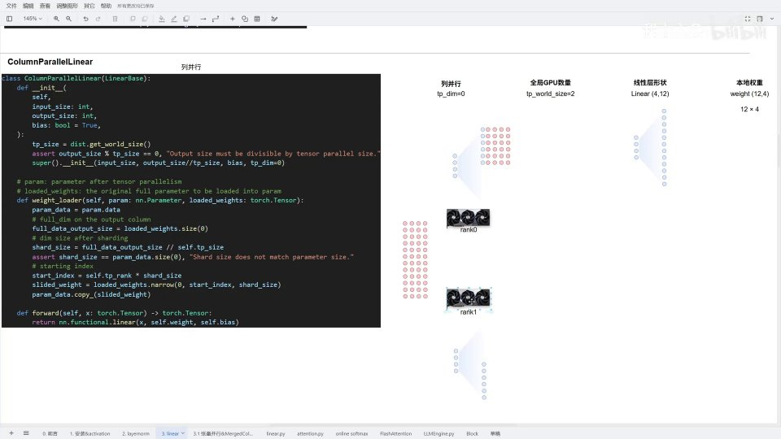 |
| 然后我们 GPU 进行前向传播做计算，计算完了之后这个地方会做一个 gather，gather 操作，这其实就是 dist.gather 操作。这个地方是在做什么？实际上就是因为我们分布式计算，计算完了之后我们要做合并，我们数据得合并了才能进行下一步呀。 [【跳转到 13:10】](https://www.bilibili.com/video/BV1Br6iBaEVV/?t=790) | 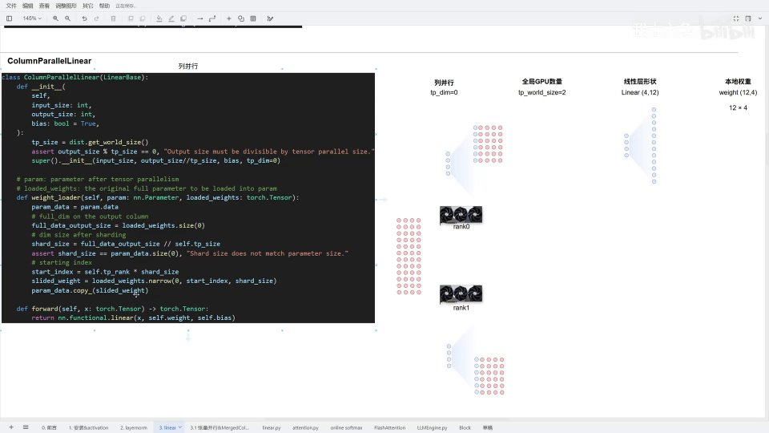 |
| 这个 gather 它其实就是一个拼接操作，就是把我们原本分散到两台 GPU 上的那个……不是权重，就是把他的输出、我们计算完之后的输出给合并在一起，就是沿着这个输出维度把它拼在一起。其实就是相当于这一个操作还是一个整体，就还是一个线性层，只是说因为我们做了一个 TP [【跳转到 13:35】](https://www.bilibili.com/video/BV1Br6iBaEVV/?t=815) |  |
| 然后分布到了两台设备，然后通过这个 all-gather 就把下面的和上面的拼在一起。与之对应的行并行，它有个区别，它这个地方做的不是 gather，他做的是 all-reduce，做的一个合并，这个之后我们再讲。然后我们来做一个测试。 [【跳转到 14:00】](https://www.bilibili.com/video/BV1Br6iBaEVV/?t=840) | 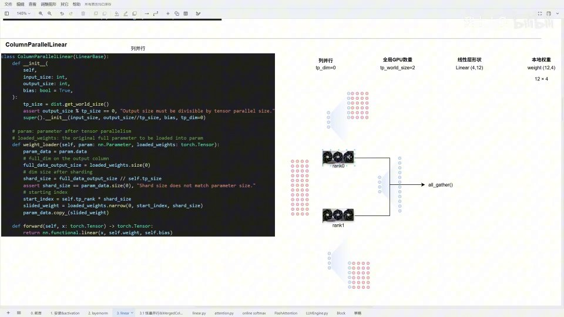 |
| 通过模拟一个分布式环境来对我们刚才实现的列并行做一个测试。我把这些先留着吧，这下面这些都可以先删掉。这前面我们定义一个分布式环境，这个分布式环境里边就有两个参数，一个是设备数量， [【跳转到 14:16】](https://www.bilibili.com/video/BV1Br6iBaEVV/?t=856) | 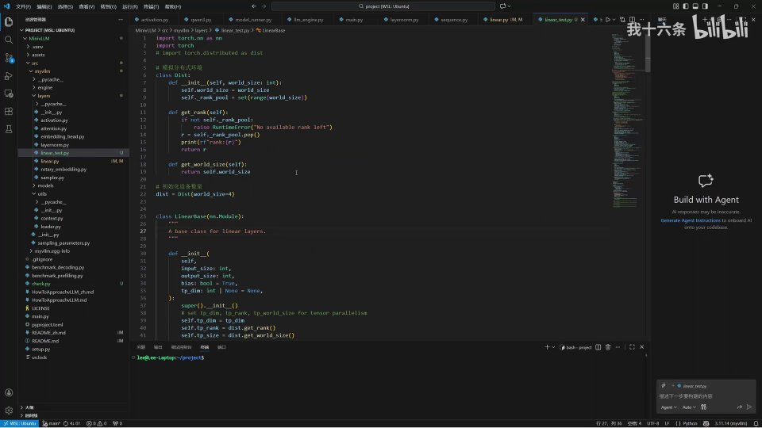 |
| 然后一个是当前的 rank 值。然后每一次访问这个 get_rank 的时候，都会把当前一个设备号给弹出去。比如说我会循环定义多个线性层，然后每个线性层都会通过 get_rank 去获取这个当前的设备号，就相当于每个线性层拿一个设备号。这个 get_world_size 就是我们当前环境中所有的那个数量。我们只需要模拟这个 [【跳转到 14:41】](https://www.bilibili.com/video/BV1Br6iBaEVV/?t=881) | 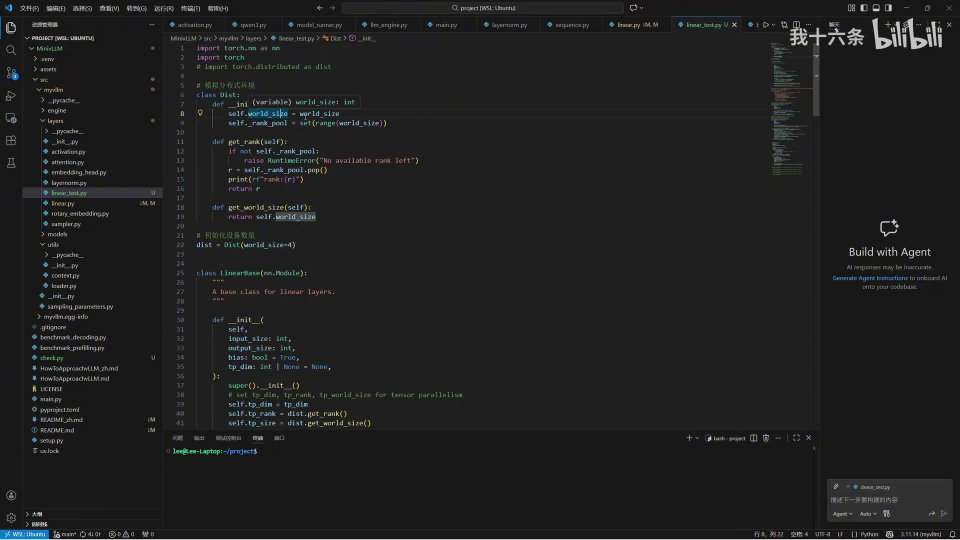 |
| 然后初始化一个这个设备数量就可以了，这个 dist。然后我们其他的代码都不用改，直接来看下面。我们还是用 4×12 的情况来做的测试，当然其他形状也是可以的，只是 4×12 比较简单、比较好理解一点。然后定义权重，这个权重，他这一串代码是什么意思？就是我们定义了四个块，因为我这边 world_size 设置的是四。 [【跳转到 15:06】](https://www.bilibili.com/video/BV1Br6iBaEVV/?t=906) | 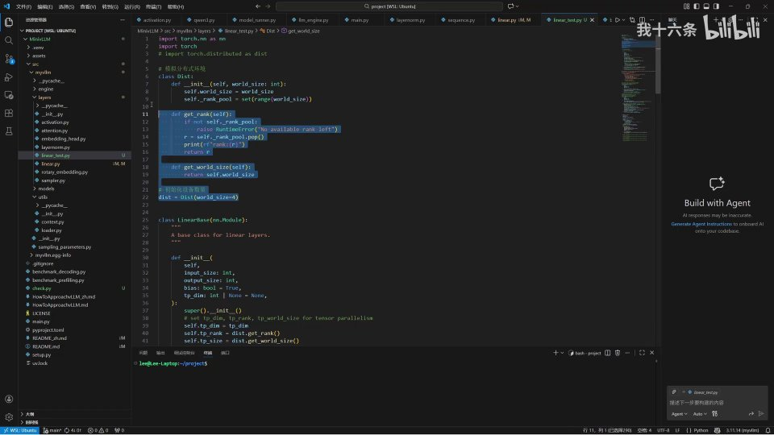 |
| 当然你这个设置其他的也可以，比如说我们设置为二，也可以设置为其他的都可以，要调整的话就在这边调整、就在这个地方。我们先看四的情况。world_size 是四的情况，我们这个地方就相当于是有一个 4，他这边是循环遍历四次，然后每一次都会给我们当前线性层初始化一个值，从一开始，1、2、3、4 就依次这样去循环。 [【跳转到 15:31】](https://www.bilibili.com/video/BV1Br6iBaEVV/?t=931) | 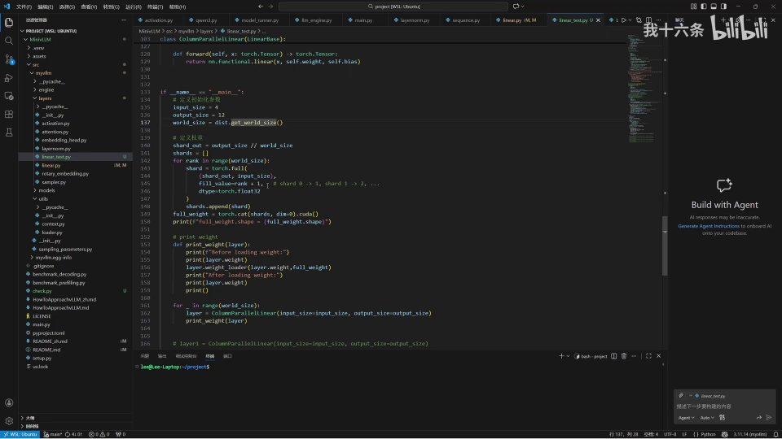 |
| 就这现在它循环，然后拼接在一起，就相当于我们得到了我们所有的权重，就是一个拼在一起的一个 tensor。为什么要这样去设计？相当于是我们通过这种提前分片，然后每片的值不一样，那我们之后再去做切分的时候，我们只需要观察我们输出的那个线性层的值是否和我们预设的是一样的就可以了。 [【跳转到 15:56】](https://www.bilibili.com/video/BV1Br6iBaEVV/?t=956) | 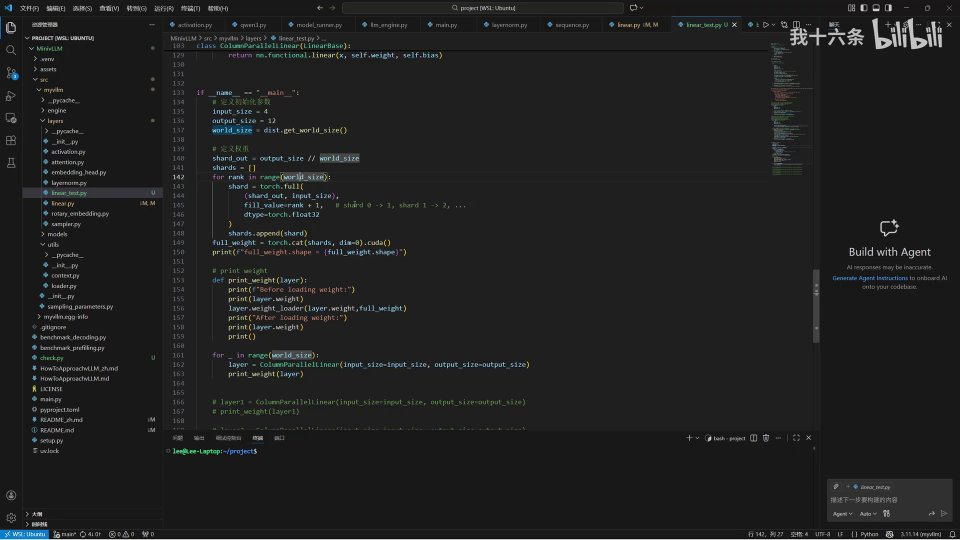 |
| 这样我们就可以去做一个验证。然后这边定义了一个打印权重的一个函数、输出函数，就我们在权重加载之前我们的内部的参数是什么样的，然后加载权重之后我们内部的参数是什么样的。这个地方就是加载权重，直接调用线性层的 weight_loader，把那个线性层的初始形状和那个所有的权重给传入进去就可以了。 [【跳转到 16:21】](https://www.bilibili.com/video/BV1Br6iBaEVV/?t=981) | 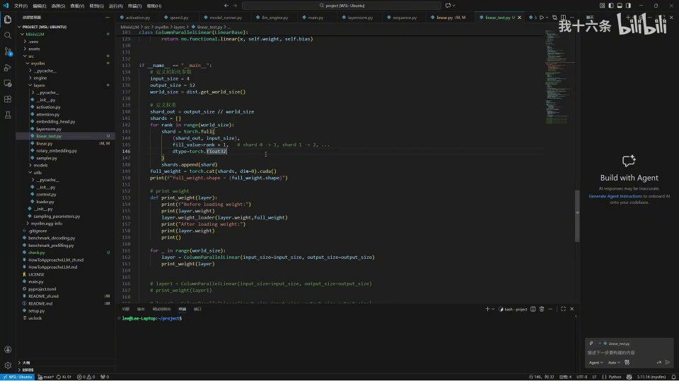 |
| 然后在内部调用这个 weight_loader 的时候，它会自动在这个所有的权重里面去做分片。然后这个地方就是循环定义然后输出。哦我们可以先看一下，好，输出的是这样一个情况，我来解释一下这个输出。首先这个第一个 tensor，这个就是我们原本这个 GPU 里边的那个权重。 [【跳转到 16:46】](https://www.bilibili.com/video/BV1Br6iBaEVV/?t=1006) |  |
| 因为我们要注意一个问题，因为现在他那个 LinearBase 它这个地方初始化使用的是 empty，这个地方它就会……我们内存里边它原本有什么它就会随机输出什么，就不太好、不太直观。我们把这个可以调成 zeros。好，我们看这个地方，这 zero 是我们初始化的时候都是零，就全部都是零。 [【跳转到 17:11】](https://www.bilibili.com/video/BV1Br6iBaEVV/?t=1031) | 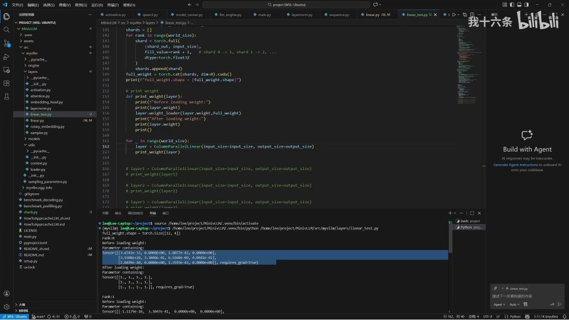 |
| 然后我们全权重加载之后，它这个地方就变成全一了，因为我们定义的整体权重、所有的一个大的权重是 4×12 的，然后这个 4×12 的权重里面存放的就是：从前面第一个部分就是一，第二个部分就是二，第三个部分就是三，第四个部分就是四。那对应到我们分片 GPU 这样就更好去观察。那我们第二个 GPU、rank 1 的情况下就是这样的，初始化是零， [【跳转到 17:36】](https://www.bilibili.com/video/BV1Br6iBaEVV/?t=1056) | 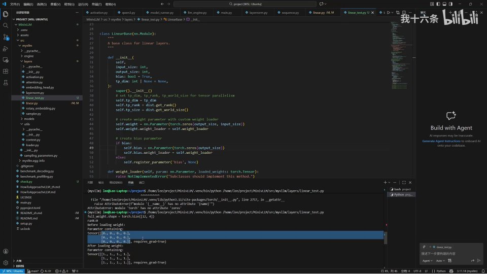 |
| 然后加载之后又全为二。第三个就是初始化为零，加载之后全为三，就和我们预想的是一样的。那我们再去做一个测试，比如说我们把这个 world_size 变大一点、变成六吧，然后再去输出，还是去正确做了一个分片。从这开始 rank 0，然后他只加载这八个。 [【跳转到 18:01】](https://www.bilibili.com/video/BV1Br6iBaEVV/?t=1081) | 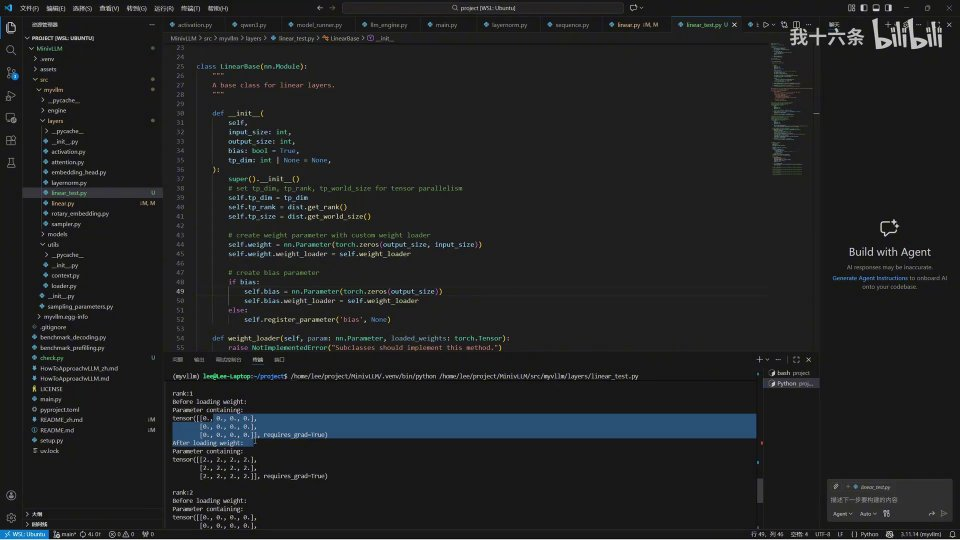 |
| 只加载这八个权重，因为我们现在 world_size 是 6 嘛，我们原本是 4×12 就 48 个，48 除以 6 等于 8，就相当于我每台设备上只维护八个权重，那刚好这里就是八个，然后加载之后为一是正确的，然后第二个 GPU 加载之后为二，第三个 GPU 加载为三。OK，这样其实就可以去做一个验证。这个代码我也会放在那个文档里边儿。 [【跳转到 18:26】](https://www.bilibili.com/video/BV1Br6iBaEVV/?t=1106) | 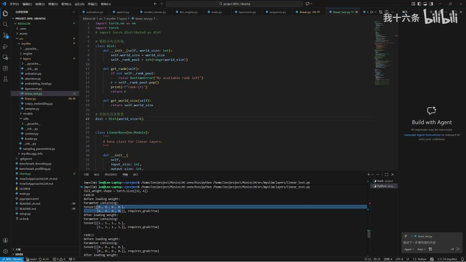 |
| 大家到时候都可以直接下载。好，今天就讲这么多吧，然后下一次就讲那个合并线性层和那个 QKV 线性层。 [【跳转到 18:51】](https://www.bilibili.com/video/BV1Br6iBaEVV/?t=1131) | 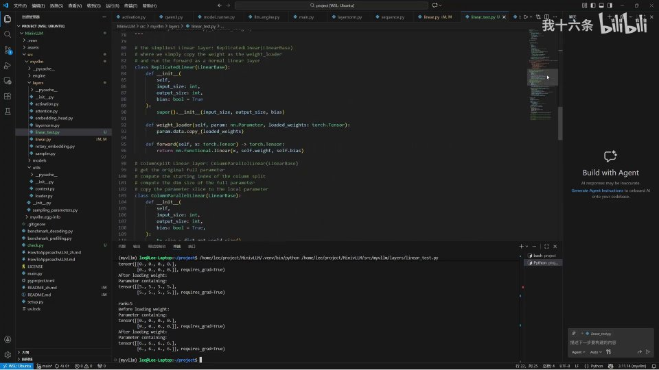 |