# linear.py&MergedColumnParallelLinear&合并线性层张量并行 原始文稿（图-字幕分栏）

| 字幕文本 | 画面 |
| :--- | ---: |
| OK，今天我们来分享 MergedColumnParallelLinear，也就是合并线性层。这里需要注意一下：因为最近 MiniVLLM 发生了更新，我们之前讲的分支是 4a4a09c9c，目前最新的是 188d7f4。如果你们在看的过程中发现有些代码和视频对不上， [【跳转到 00:00】](https://www.bilibili.com/video/BV11b64BUE5G/?t=0) | 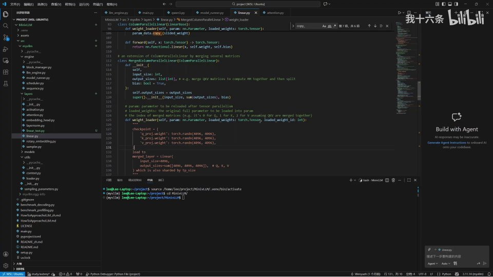 |
| 可以切到最新的分支去看一下，可能到时候又会有新的更新。这次更新主要是在权重加载这一部分做了些调整，但不影响我们学习，可以继续看。我们回到这个函数，根据它来深入讲一讲 MergedColumnParallelLinear。 [【跳转到 00:25】](https://www.bilibili.com/video/BV11b64BUE5G/?t=25) |  |
| 它其实就是一个通用的合并线性层，其中一个应用就是在门 [【跳转到 00:48】](https://www.bilibili.com/video/BV11b64BUE5G/?t=48) |  |
| 和上采样这两个线性层做合并，用的就是 MergedColumnParallelLinear。 [【跳转到 01:00】](https://www.bilibili.com/video/BV11b64BUE5G/?t=60) | 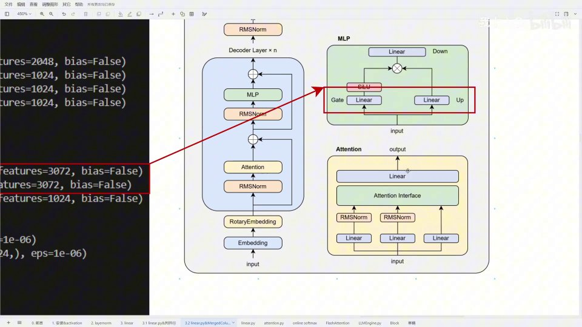 |
| 其实就是把原本的两个小的线性层 [【跳转到 01:05】](https://www.bilibili.com/video/BV11b64BUE5G/?t=65) | 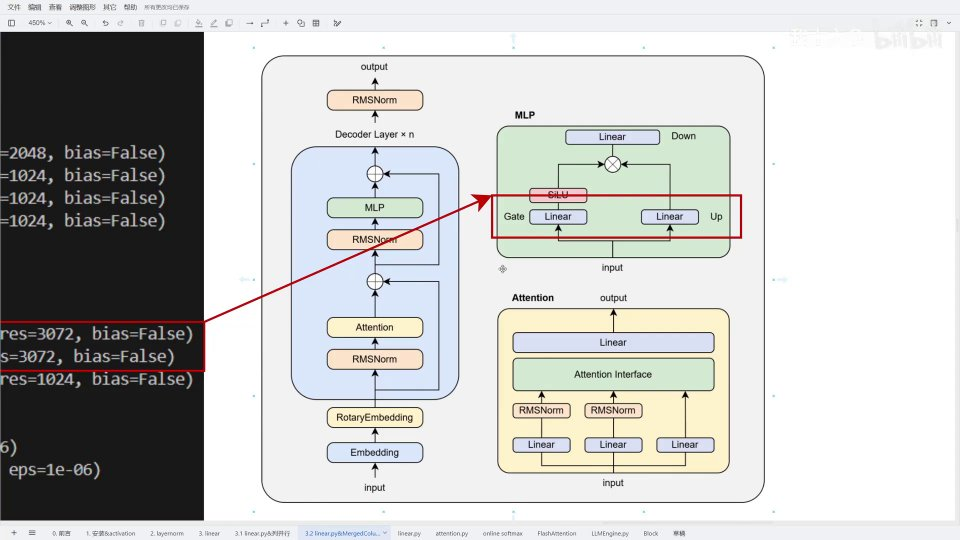 |
| 合并成一个大的线性层，然后再把这个大的线性层分发到不同的 GPU 上：环境里有多少个 GPU，就分发到多少个 GPU。 [【跳转到 01:10】](https://www.bilibili.com/video/BV11b64BUE5G/?t=70) | 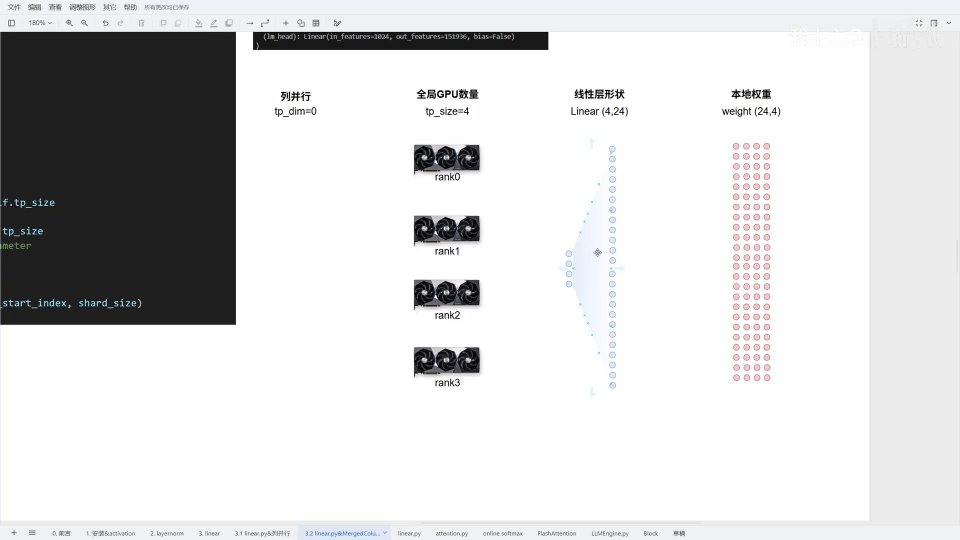 |
| 这一点和列并行（ColumnParallelLinear）是一样的，而且它的基类其实就是列并行。 [【跳转到 01:21】](https://www.bilibili.com/video/BV11b64BUE5G/?t=81) | 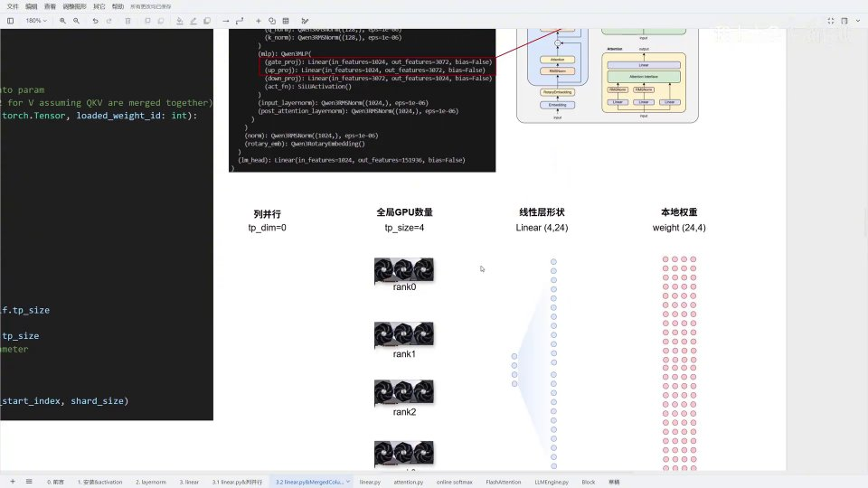 |
| 所以说相似性还是很高的，我们就还是一行一行地看吧。 [【跳转到 01:26】](https://www.bilibili.com/video/BV11b64BUE5G/?t=86) | 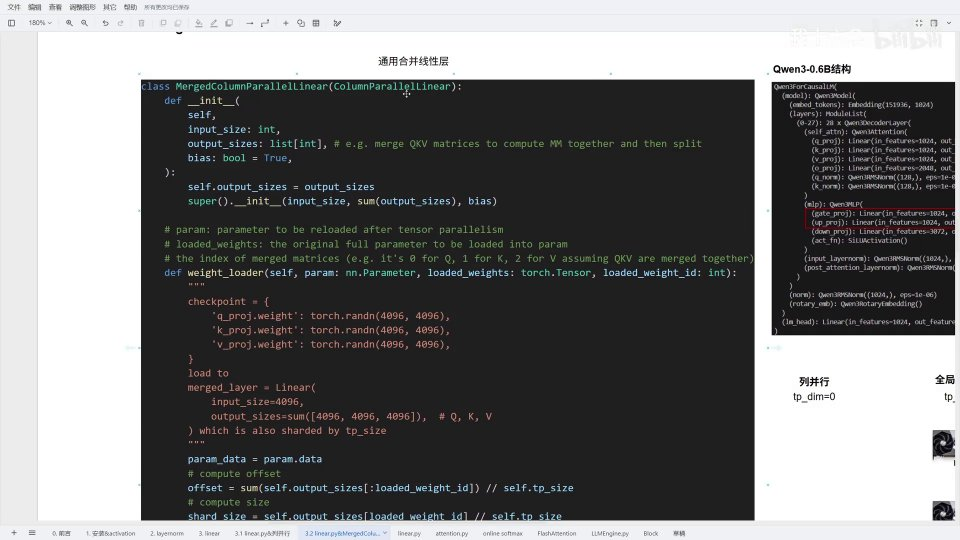 |
| 这个注册先不管它，这个注册是与 QKV 的实现 [【跳转到 01:31】](https://www.bilibili.com/video/BV11b64BUE5G/?t=91) | 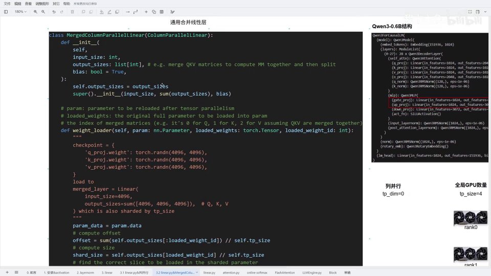 |
| 来举例的。但实际上 MergedColumnParallelLinear 只用在了 MLP 里面两个 proj（也就是 gate_proj 和 up_proj）做合并的那一块，所以这个注释写得还不是很恰当。其实它也可以在 QKV 里用上，之后讲 QKV 的时候可以再探讨一下它们的区别。我先把这段注释删掉。 [【跳转到 01:36】](https://www.bilibili.com/video/BV11b64BUE5G/?t=96) | 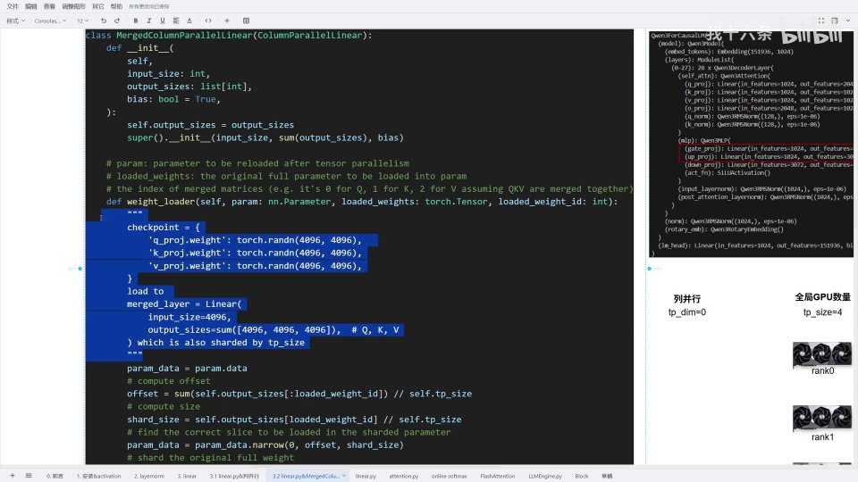 |
| OK，我们现在把注释清掉。 [【跳转到 01:58】](https://www.bilibili.com/video/BV11b64BUE5G/?t=118) | 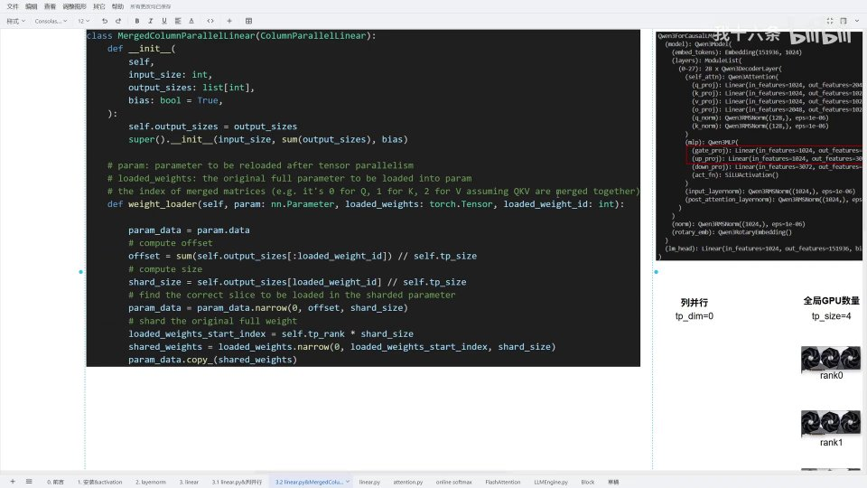 |
| 接下来看这个通用合并线性层。先看初始化函数，最大的区别就在这里：它传入了多个线性层输出维度组成的 int 数组（int list），也就是我们要合并的那几个线性层的输出维度。这里先做赋值，然后调用父类——列并行的初始化函数。 [【跳转到 02:03】](https://www.bilibili.com/video/BV11b64BUE5G/?t=123) | 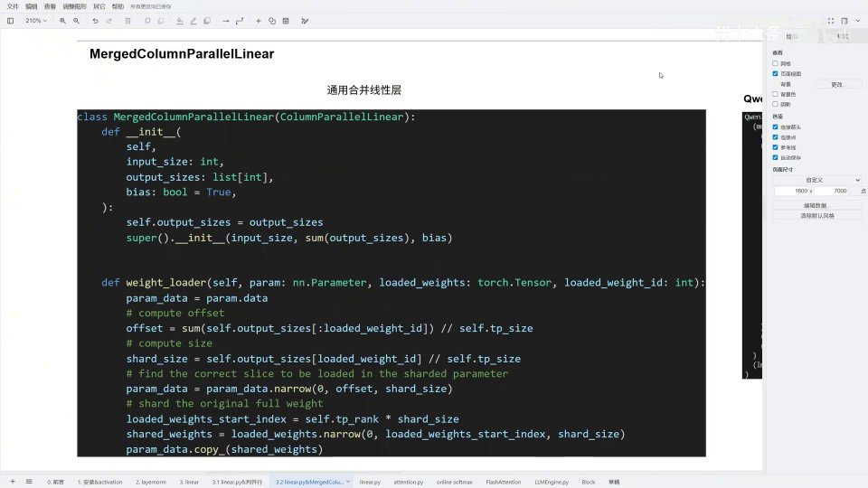 |
| 它的输出维度做了一次求和，因为我们是在合并之后的基础上做列并行的，所以需要求和，才能知道最后做 all-gather 的维度大小。这个维度大小实际上和最后做 all-gather 的维度大小是一致的。好，我们来看 weight_loader。 [【跳转到 02:28】](https://www.bilibili.com/video/BV11b64BUE5G/?t=148) |  |
| 在看它之前，我们还是先通过图形来理解一下。 [【跳转到 02:53】](https://www.bilibili.com/video/BV11b64BUE5G/?t=173) | 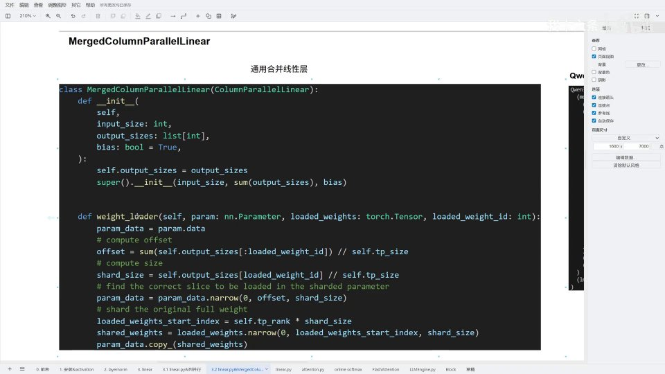 |
| 假设还是一个双卡（TP=2）的环境， [【跳转到 02:58】](https://www.bilibili.com/video/BV11b64BUE5G/?t=178) |  |
| 我们有两个线性层——训练的时候实际上就是两个线性层，对应 MLP 里面的 gate 门投影 [【跳转到 03:03】](https://www.bilibili.com/video/BV11b64BUE5G/?t=183) | 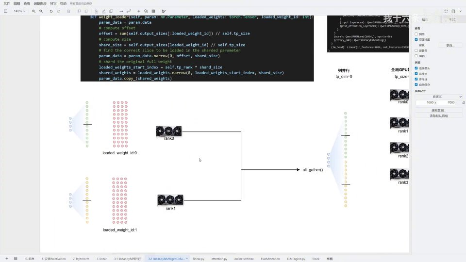 |
| 和 up 上采样投影，把这两个线性层做合并。 [【跳转到 03:08】](https://www.bilibili.com/video/BV11b64BUE5G/?t=188) | 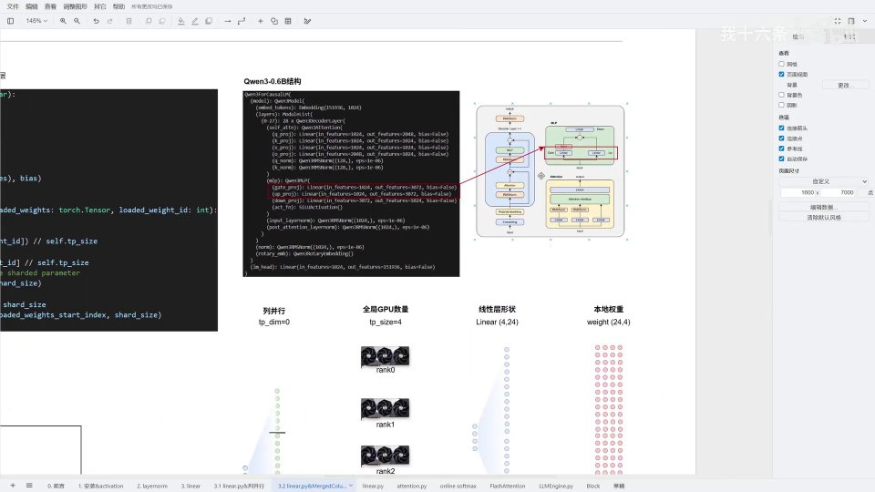 |
| 原本我们训练的时候其实是单独训练了两个线性层， [【跳转到 03:13】](https://www.bilibili.com/video/BV11b64BUE5G/?t=193) | 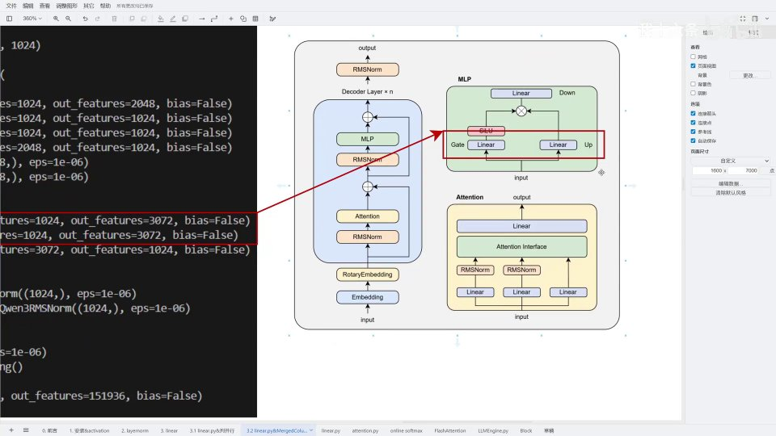 |
| 权重可能也是分开存的。这时第一个线性层的 loaded_weight_id 就是 0，第二个是 1，就对应这里的 loaded_weight_id。 [【跳转到 03:18】](https://www.bilibili.com/video/BV11b64BUE5G/?t=198) | 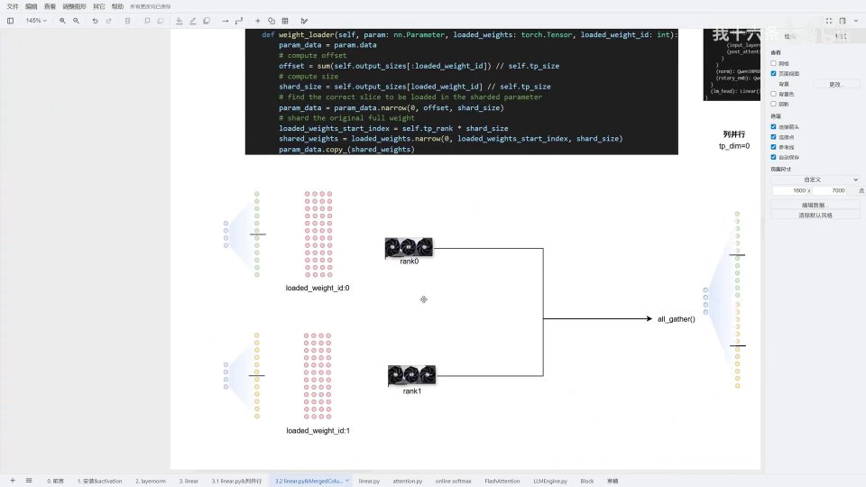 |
| 因为在做权重加载时，我当前加载的是哪一个线性层，就是通过这个 loaded_weight_id 来区分的。 [【跳转到 03:29】](https://www.bilibili.com/video/BV11b64BUE5G/?t=209) | 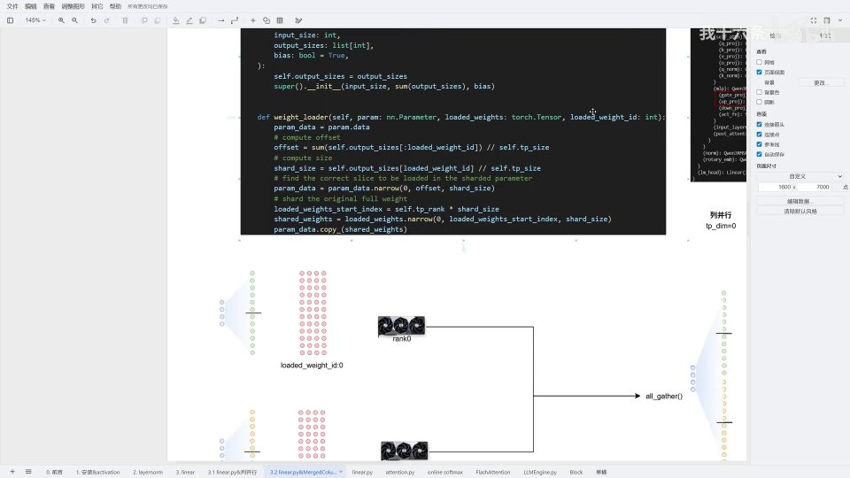 |
| 然后再做列切分，相当于还是对着每一个线性层 [【跳转到 03:37】](https://www.bilibili.com/video/BV11b64BUE5G/?t=217) | 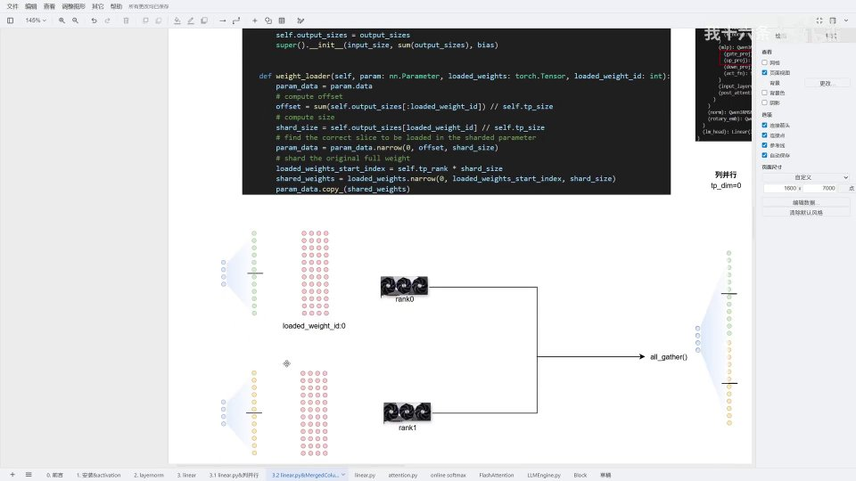 |
| 都会做一个切分。比如在全局 tp_size=2 的情况下，我们的线性层会被拆成两部分：上半部分和下半部分；第二个线性层也一样。如果 tp_size=3 或 4，同理，拆成三份或四份，只要能被整除就可以拆。以 rank0 为例， [【跳转到 03:42】](https://www.bilibili.com/video/BV11b64BUE5G/?t=222) | 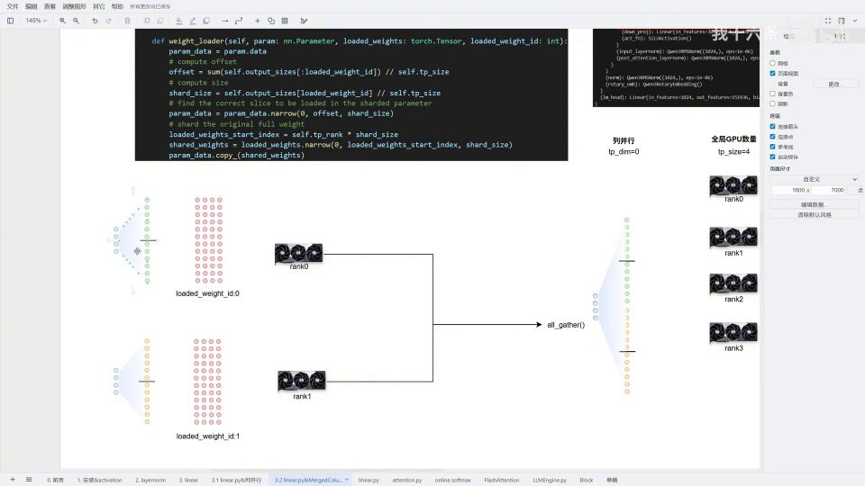 |
| rank0 维护的其实就是第一个线性层的上半部分和第二个线性层的上半部分。画出来大概就是这样（这里缩小一点）：这部分是下半部分，这部分是上半部分。每个 GPU 设备分别维护自己的一部分。当 TP rank 等于 3 时， [【跳转到 04:07】](https://www.bilibili.com/video/BV11b64BUE5G/?t=247) | 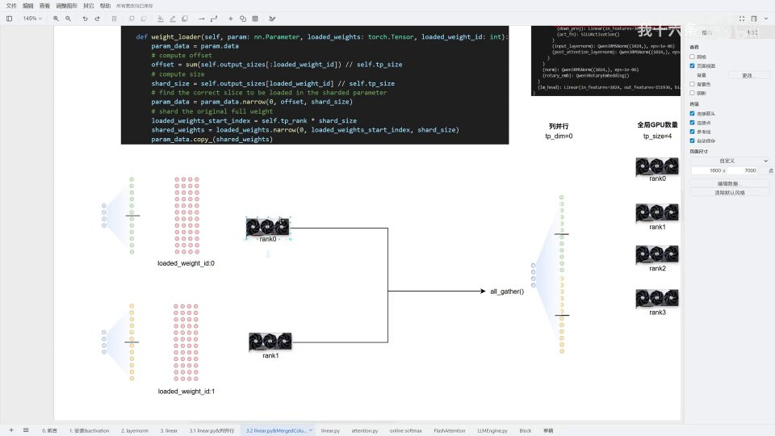 |
| 我们就把每一个线性层拆分成三份， [【跳转到 04:32】](https://www.bilibili.com/video/BV11b64BUE5G/?t=272) | 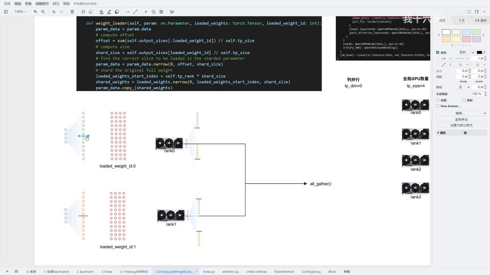 |
| 比如这样拆：这部分是 rank0，中间部分是 rank1，最下面部分是 rank2。如果拆成四份也是一个道理，就是等分成四份——因为这个维度是 12，既是 3 的倍数也是 4 的倍数。OK，这是拆成四份，这部分是 rank0， [【跳转到 04:41】](https://www.bilibili.com/video/BV11b64BUE5G/?t=281) | 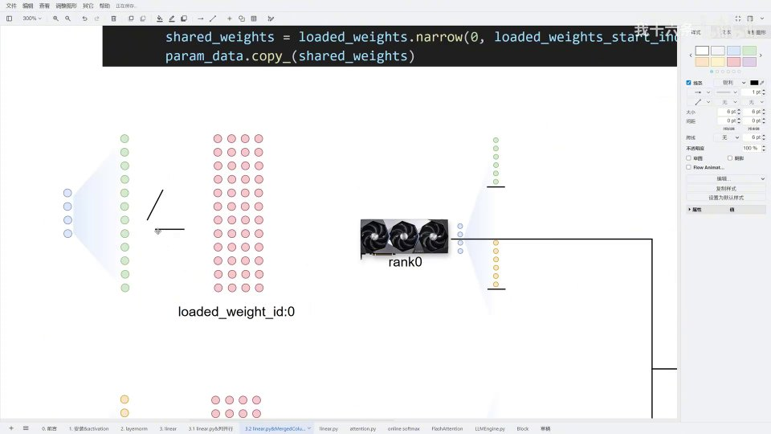 |
| 这个是 rank1，这个是 rank2，这个是 rank3。对应到权重其实也是这样的，权重就是这样去切分，每个 rank 维护自己那一部分：这是 rank0 维护的权重，这是 rank1，这是 rank2，这是 rank3。OK，我们还是以 rank0 为例，只关注 rank0 的情况（rank1 的情况待会再讲）。 [【跳转到 05:06】](https://www.bilibili.com/video/BV11b64BUE5G/?t=306) | 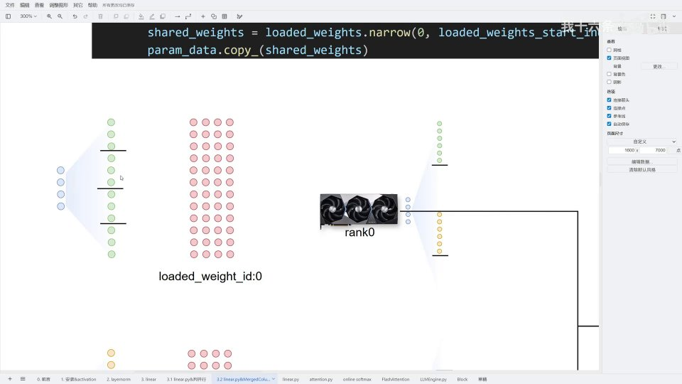 |
| rank0 维护的是上半部分，rank1 是下半部分，最后做一个 all-gather。现在我们就是要进入 weight_loader， [【跳转到 05:31】](https://www.bilibili.com/video/BV11b64BUE5G/?t=331) | 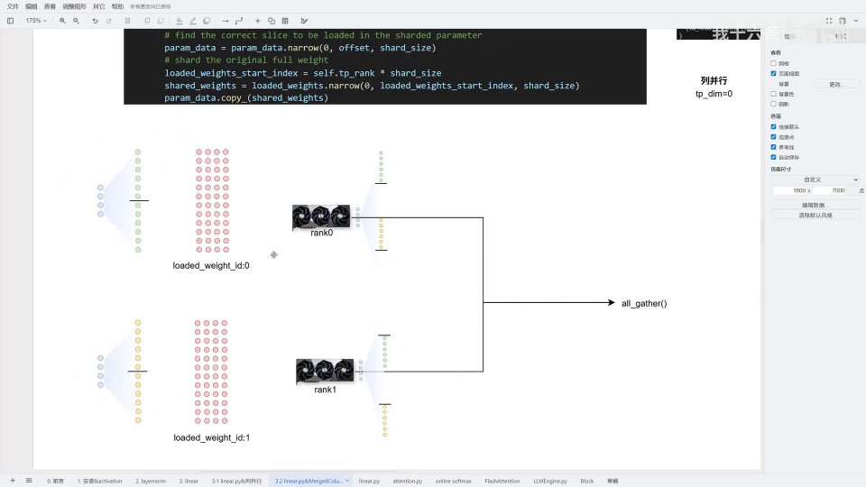 |
| 把每个 rank 维护的权重正确地加载进去。 [【跳转到 05:40】](https://www.bilibili.com/video/BV11b64BUE5G/?t=340) | 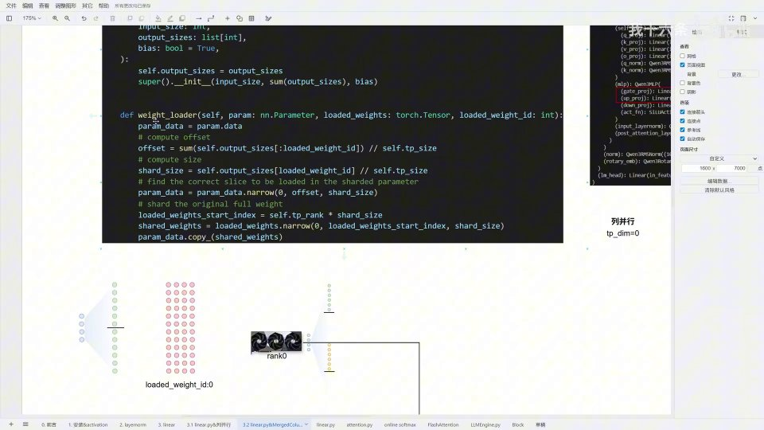 |
| 我们来看一下，首先是参数。 [【跳转到 05:45】](https://www.bilibili.com/video/BV11b64BUE5G/?t=345) | 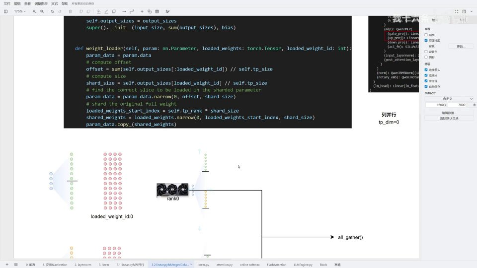 |
| 有三个参数。param 就是我们这个 GPU 里线性层的参数形状；loaded_weights 是本地存储的权重；loaded_weight_id 这里是 0，表示加载第一片、也就是第一个线性层。进来之后先做赋值，然后计算一个偏移（offset），这个偏移用到 self.output_sizes[0]。 [【跳转到 05:50】](https://www.bilibili.com/video/BV11b64BUE5G/?t=350) | 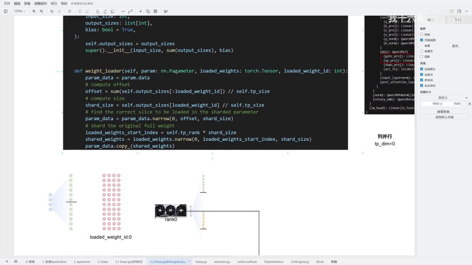 |
| 当我们加载第一片线性层时，loaded_weight_id=0，那 output_sizes[:0] 这个地方取不到值，sum 就等于 0，0 除以 tp_size（0÷2）还是 0，所以 offset 就等于 0，相当于这个 GPU 从第 0 个位置开始存。再来看 shard_size，当 id=0 时， [【跳转到 06:15】](https://www.bilibili.com/video/BV11b64BUE5G/?t=375) |  |
| output_sizes[0] 等于 12，12÷2 等于 6，也就是上半部分。看这里 param_data = param_data.narrow(0, offset, shard_size)：沿着第 0 维（输出维度），offset 从 0 开始，shard_size 等于 6，就是加载这 6 个——也就是说，我待会加载的权重要存到 6 个维度、6 个神经元里面去。然后我们来计算本地权重要从 [【跳转到 06:40】](https://www.bilibili.com/video/BV11b64BUE5G/?t=400) | 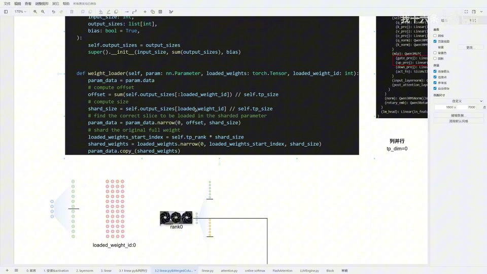 |
| 哪个地方开始读取。首先是开始的位置：start_index = self.tp_rank * shard_size，0×6 还是等于 0，所以开始位置就是从第 0 个位置开始。然后这个地方 shard_size 也用于切分：从 0 开始，沿着列的维度、也就是输出维度， [【跳转到 07:05】](https://www.bilibili.com/video/BV11b64BUE5G/?t=425) | 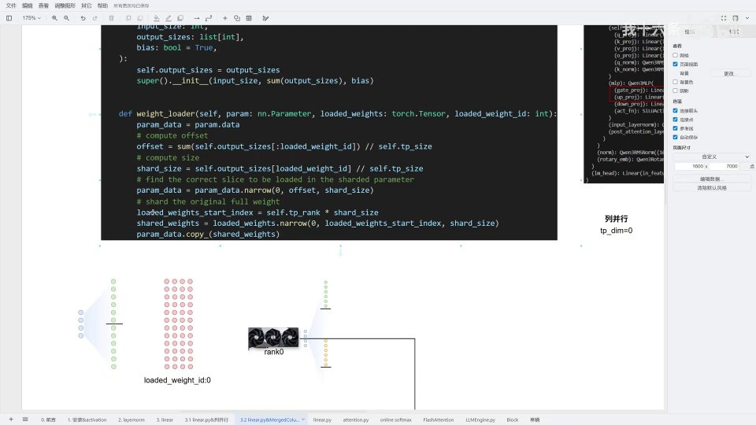 |
| 从 0 的位置开始，取 6 个，这 6 个权重就被加载进这些神经元里去了。好，这一片就加载完了。来看第二片，也就是 loaded_weight_id 等于 1 的情况下。 [【跳转到 07:30】](https://www.bilibili.com/video/BV11b64BUE5G/?t=450) |  |
| 那这个 offset 就是 output_sizes[:1] 取第一个（即 12）， [【跳转到 07:49】](https://www.bilibili.com/video/BV11b64BUE5G/?t=469) | 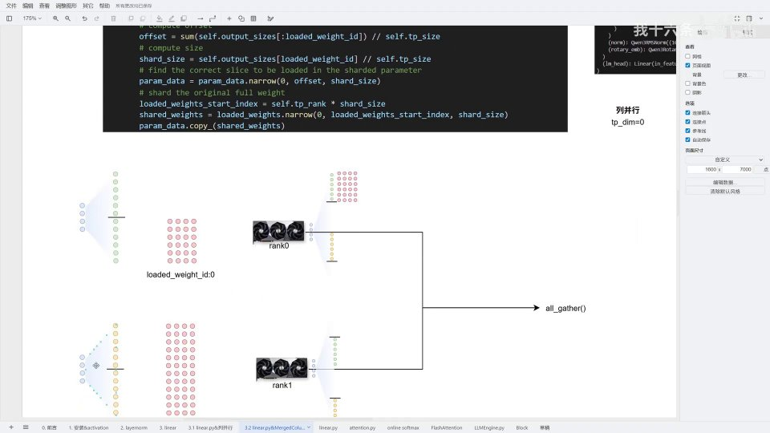 |
| 12 除以 2 等于 6，所以偏移就是从第 6 个位置开始存——位置是 0 1 2 3 4 5，到 6 这里开始存。再看 shard_size = self.output_sizes[loaded_weight_id]：当 id 等于 1 时，output_sizes[1]=12，就取第二个，也就是第二个线性层。 [【跳转到 07:54】](https://www.bilibili.com/video/BV11b64BUE5G/?t=474) |  |
| 第二个线性层除以 2 还是等于 6。然后看这个 GPU 维护的那个线性层做切分：从 0 开始沿着列/输出维度，offset 等于 6，shard_size 等于 6，就是从第 6 个位置开始的 6 个神经元做权重加载。接着计算本地权重从哪儿切分：loaded_weights_start_index = self.tp_rank * shard_size，rank 等于 0， [【跳转到 08:19】](https://www.bilibili.com/video/BV11b64BUE5G/?t=499) |  |
| shard_size 等于 6，还是从 0 开始。加载位置是 rank0 沿着第 0 维加载，从 0 开始加载 6 个。 [【跳转到 08:44】](https://www.bilibili.com/video/BV11b64BUE5G/?t=524) | 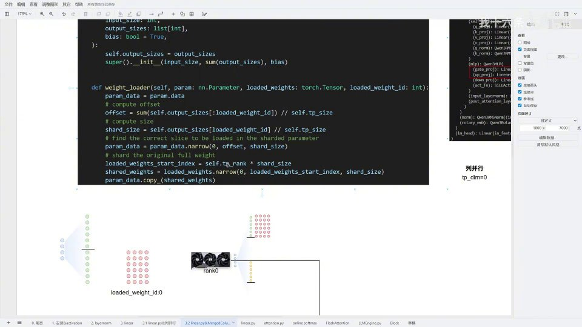 |
| 因为我们传入的加载位置其实是第二个线性层的权重，所以从这个位置开始， [【跳转到 08:55】](https://www.bilibili.com/video/BV11b64BUE5G/?t=535) | 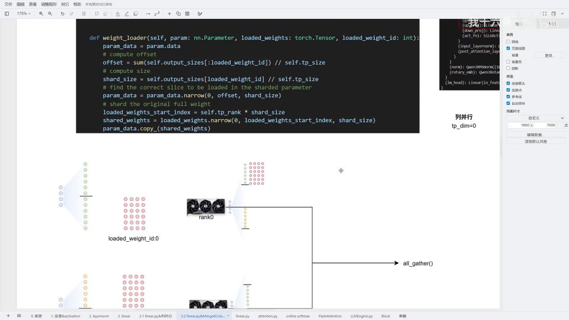 |
| 实际上就是把它加载到这里边去，这样权重就被正确加载了。OK，然后在 rank 等于 1 的情况下 [【跳转到 09:00】](https://www.bilibili.com/video/BV11b64BUE5G/?t=540) | 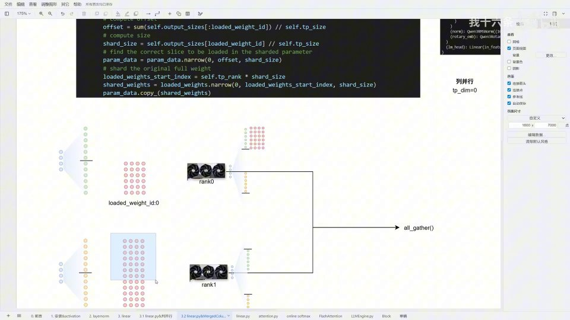 |
| 其实也是一样的，具体过程你们可以自己细推一下，我就不推了。最后的结果就是： [【跳转到 09:14】](https://www.bilibili.com/video/BV11b64BUE5G/?t=554) |  |
| 相当于我这一部分被加载到这儿，那一部分被加载到这儿，权重就加载完了。之后就可以做正常的前向传播，然后做一个 all-gather 把结果拼接在一起，就又拼回了一个大的 [【跳转到 09:20】](https://www.bilibili.com/video/BV11b64BUE5G/?t=560) | 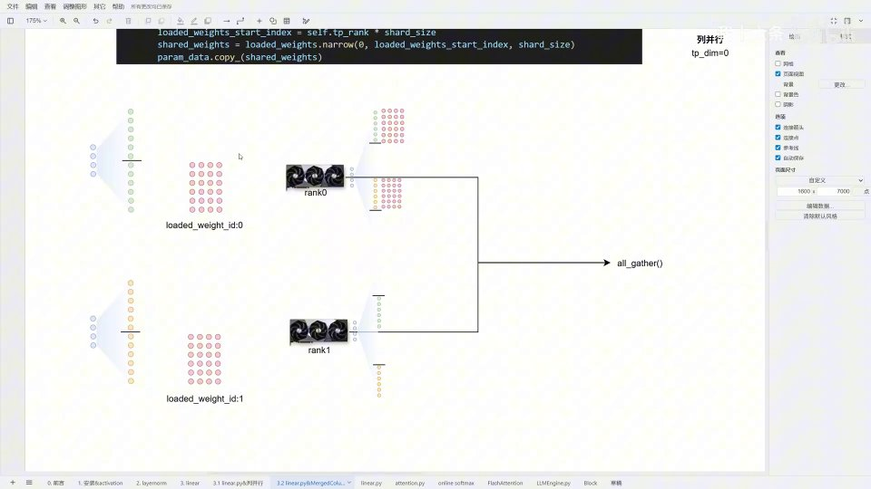 |
| 线性层，实际上就是拼回来了。 [【跳转到 09:40】](https://www.bilibili.com/video/BV11b64BUE5G/?t=580) | 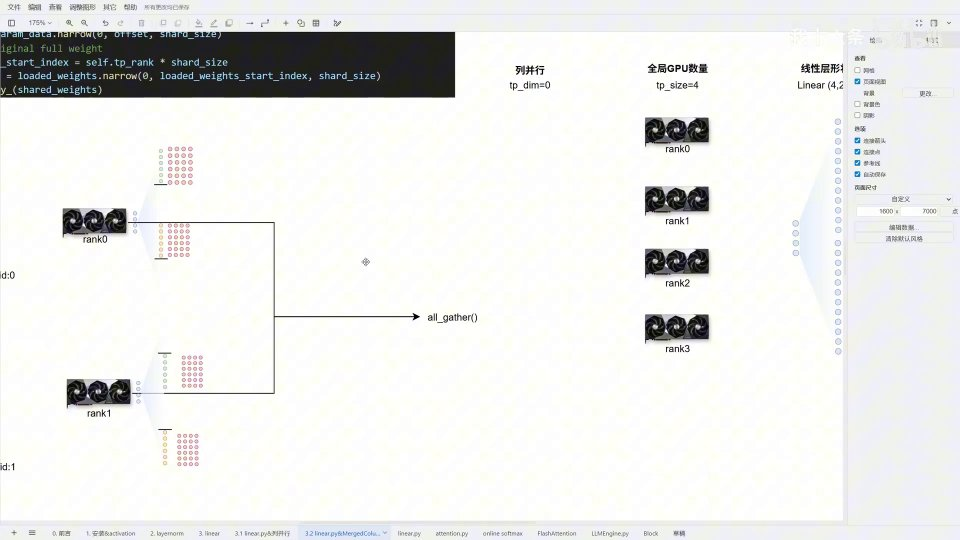 |
| 这就是通用的合并线性层，它里面其实就是这样。 [【跳转到 09:45】](https://www.bilibili.com/video/BV11b64BUE5G/?t=585) | 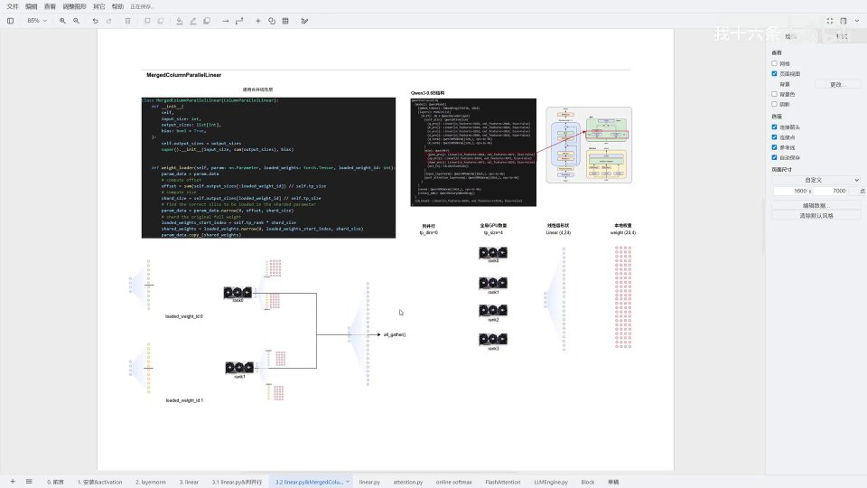 |
| 这一块就讲完了。 [【跳转到 09:50】](https://www.bilibili.com/video/BV11b64BUE5G/?t=590) | 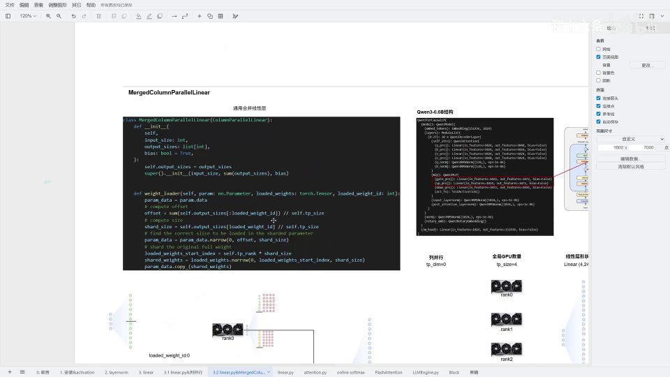 |