# linear.py&QKV张量并行&合并线性层 原始文稿（图-字幕分栏）

| 字幕文本 | 画面 |
| :--- | ---: |
| 好，我们现在来了解一下 QKV 合并线性层这一块的内容，这部分稍微要复杂一点。我们还是先从前面的 Qwen3-0.6B 结构看起吧。 [【跳转到 00:00】](https://www.bilibili.com/video/BV1kUfDBfEuK/?t=0) | 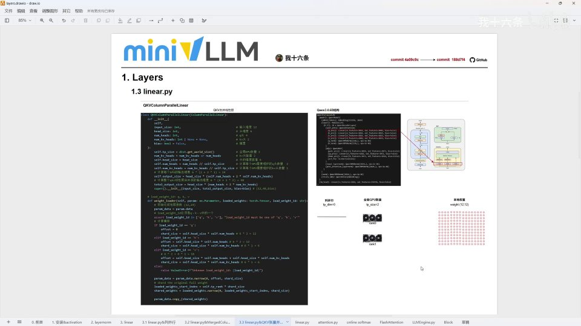 |
| 从算子图里我们可以看到， [【跳转到 00:09】](https://www.bilibili.com/video/BV1kUfDBfEuK/?t=9) | 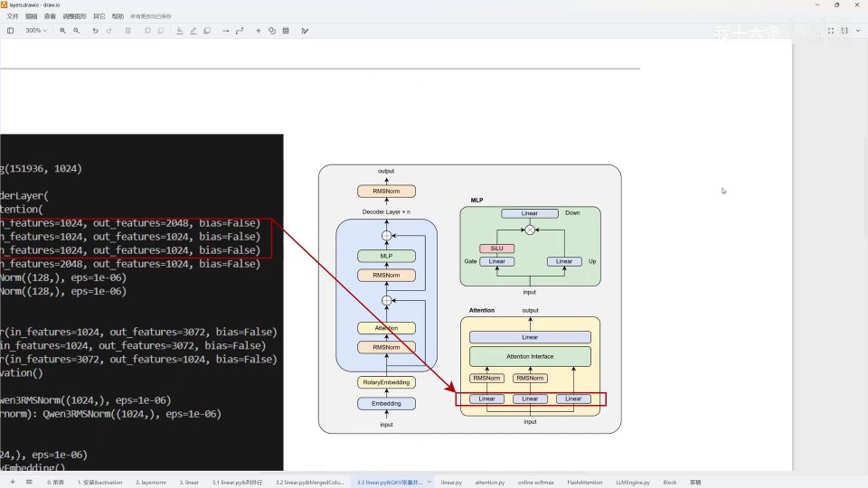 |
| 在 attention（注意力）算子里实际上有三个线性层：Q、K、V。但在实际计算过程中，我们会把这三个线性层合并一次，也就是做一个算子融合，让它们变成一个更大的线性层。这样做的好处是，把原本三次的矩阵乘法变成了一次——对 GPU 来说只是计算了一个更大的矩阵乘法，但算力利用效率的提升非常显著。 [【跳转到 00:14】](https://www.bilibili.com/video/BV1kUfDBfEuK/?t=14) |  |
| 然后我们来看一下这三个线性层的形状。第一个是 Q 线性层，它其实做了一次上采样，因为这里是多头注意力。看这个地方就可以发现：Qwen3-0.6B 的 RMSNorm 维度是 128，那么 Q 的头数就用 2048÷128 算出来等于 16；而 KV 头则是用 1024÷128…… [【跳转到 00:39】](https://www.bilibili.com/video/BV1kUfDBfEuK/?t=39) | 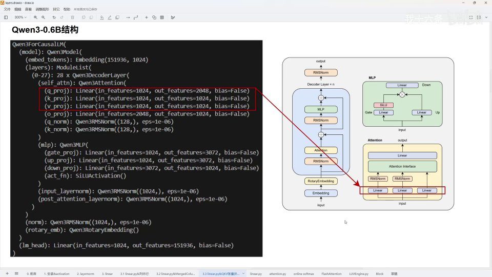 |
| ……等于 8。所以相当于每两个 Q 头共享一个 KV 头。关于多头注意力这一块，大家可以看一下我之前分享的 GQA（分组查询注意力）视频，我个人觉得还是讲清楚了的。 [【跳转到 01:04】](https://www.bilibili.com/video/BV1kUfDBfEuK/?t=64) |  |
| 现在我们来看源代码，还是从头开始看。 [【跳转到 01:21】](https://www.bilibili.com/video/BV1kUfDBfEuK/?t=81) | 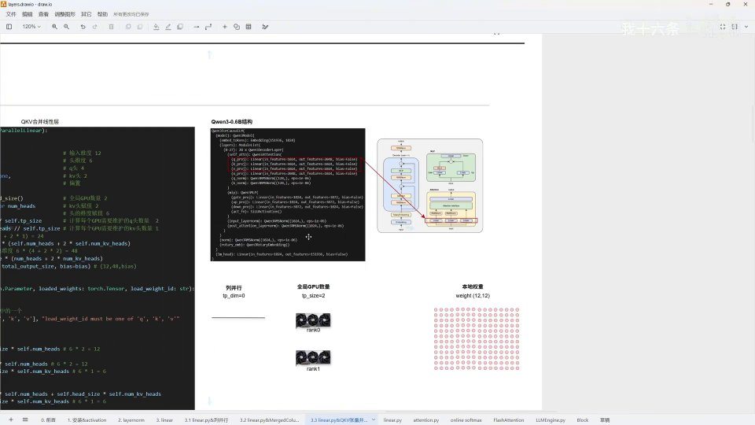 |
| 首先它继承了 ColumnParallelLinear 这个基类，然后在 __init__ 初始化方法里有一系列参数：输入维度、头的维度（head_dim）、Q 头数量、KV 头数量、bias 偏置。这些参数后面具体怎么计算，我们待会会举例子。再下面这个就是全局的 GPU 数量。 [【跳转到 01:26】](https://www.bilibili.com/video/BV1kUfDBfEuK/?t=86) | 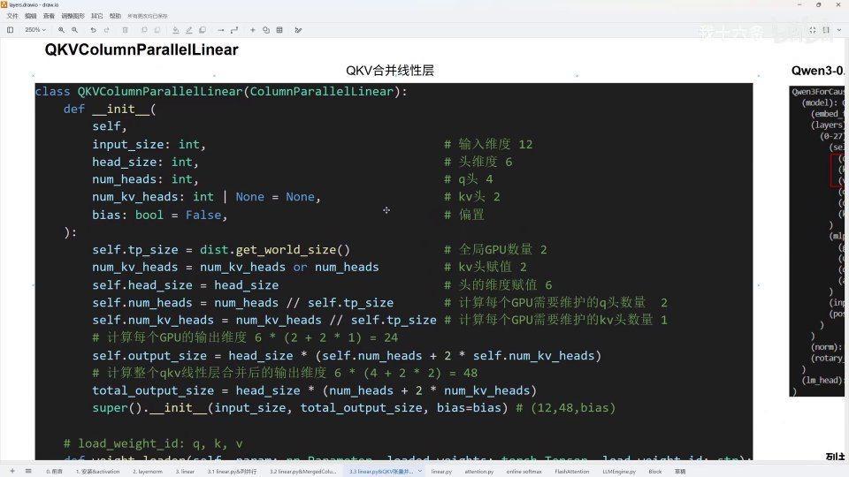 |
| 这里是分布式环境，用来获得当前全局的 GPU 数量。接着计算当前的 KV 头数量：虽然 KV 头是我们传进来的，但这个参数实际上可以为空。所以当没有传 KV 头时，它就默认等于 Q 头的数量。这时其实就退化成 Transformer 原始的那种实现，也就是一对一的传统多头注意力（MHA）。 [【跳转到 01:47】](https://www.bilibili.com/video/BV1kUfDBfEuK/?t=107) |  |
| 这个地方是给头的维度赋值。然后计算每一个 GPU 需要维护的 Q 头数量，以及每一个 GPU 需要维护的 KV 头数量。比如说分布式环境中有两个 GPU，那我们每个 GPU 本来一共有 4 个 Q 头，它就是按这个意思去均分的。接着这里计算每个 GPU 的输出维度，相当于用头的维度乘以…… [【跳转到 02:12】](https://www.bilibili.com/video/BV1kUfDBfEuK/?t=132) | 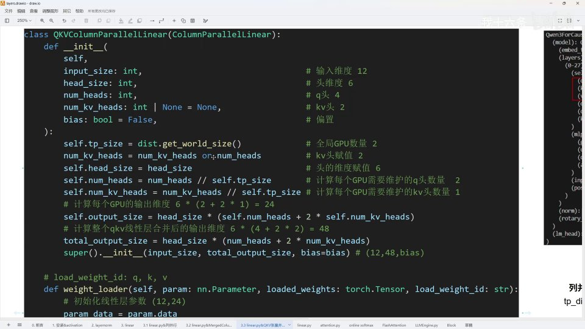 |
| ……当前 GPU 总共维护的头数量，就可以算出这个 GPU 的输出维度。然后这里计算整个 QKV 线性层合并后的输出维度，那就是用头的维度乘以所有头的数量。这里举了一个例子：当头的维度为 6 时，有 4 个 Q 头，KV 头数量为 2。这个 2×2 的意思是因为既有 K 又有 V—— [【跳转到 02:37】](https://www.bilibili.com/video/BV1kUfDBfEuK/?t=157) |  |
| K 两个头、V 两个头，所以一共是 2×2 就是 4 个头。这样算出来就是 48。也就是说，我们整个 QKV 线性层合并后输出的那个线性层，实际上就是输入维度 24、输出维度 48 的这样一个线性层。相当于我们把三个 QKV 做了合并。接着我们来看一下具体的权重加载。 [【跳转到 03:02】](https://www.bilibili.com/video/BV1kUfDBfEuK/?t=182) |  |
| （此区间无字幕） [【跳转到 03:23】](https://www.bilibili.com/video/BV1kUfDBfEuK/?t=203) | 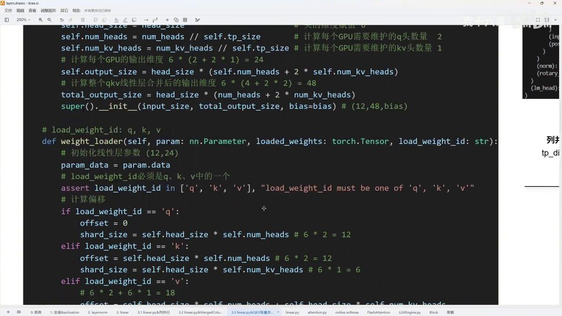 |
| 假设我们全局环境有两个 GPU，也就是 rank0 和 rank1。 [【跳转到 03:28】](https://www.bilibili.com/video/BV1kUfDBfEuK/?t=208) | 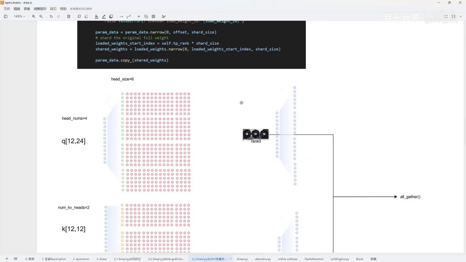 |
| 每个 GPU 需要维护的权重形状是 12×24，这是怎么算出来的呢？其实前面我们已经计算过了。 [【跳转到 03:33】](https://www.bilibili.com/video/BV1kUfDBfEuK/?t=213) | 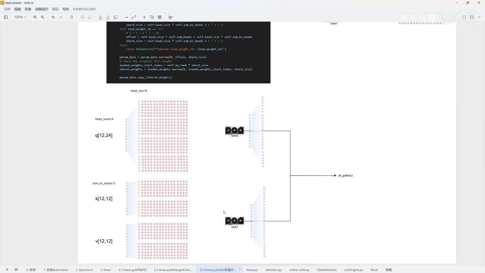 |
| 就是在这个地方：我们算出了每个 GPU 的输出维度等于 24，而输入维度是 12。 [【跳转到 03:42】](https://www.bilibili.com/video/BV1kUfDBfEuK/?t=222) | 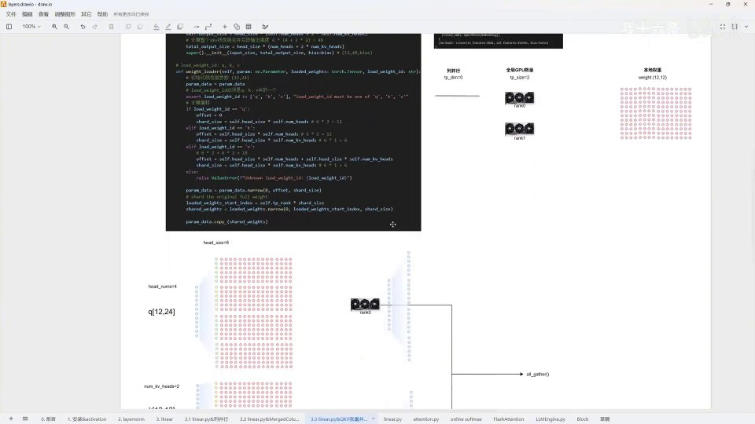 |
| 所以我们就知道每个 GPU 的输入维度是 12、输出维度是 24。 [【跳转到 03:47】](https://www.bilibili.com/video/BV1kUfDBfEuK/?t=227) | 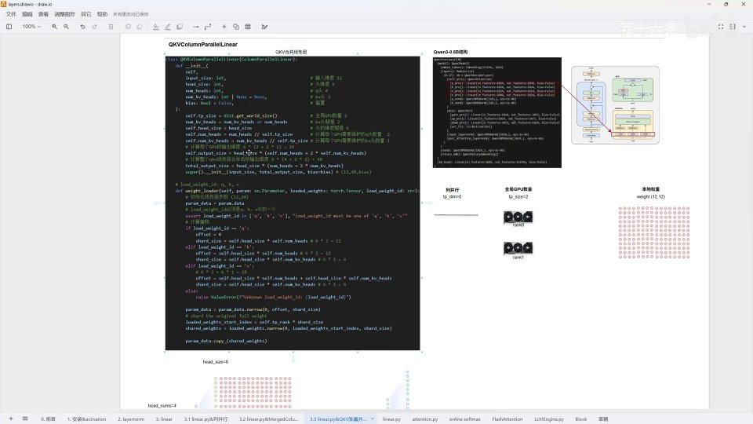 |
| 然后我们有三个线性层，分别是 Q、K、V，每个都是 12×24。 [【跳转到 03:52】](https://www.bilibili.com/video/BV1kUfDBfEuK/?t=232) | 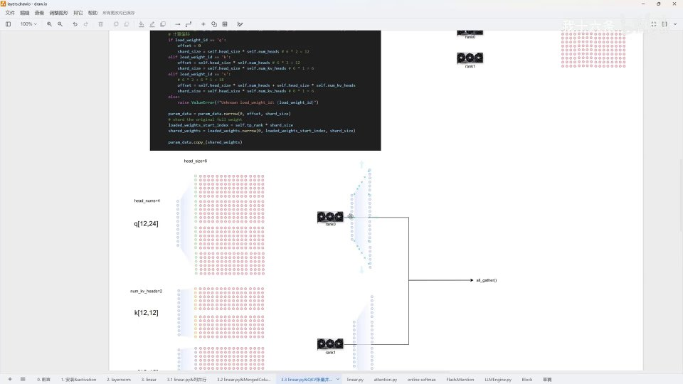 |
| 这个地方参考的是 Qwen3-0.6B，因为它做了一次上采样，输出是 24。实际上它是多头注意力：取了 4 个头，头的维度是 6，4×6=24，所以输出维度是 24。KV 头只设计成 2 个，也就是每个 KV 都被划分成 2 个头，被一分为二。在这样一个前提下，假设我们需要对 rank0 做权重加载。 [【跳转到 03:57】](https://www.bilibili.com/video/BV1kUfDBfEuK/?t=237) | 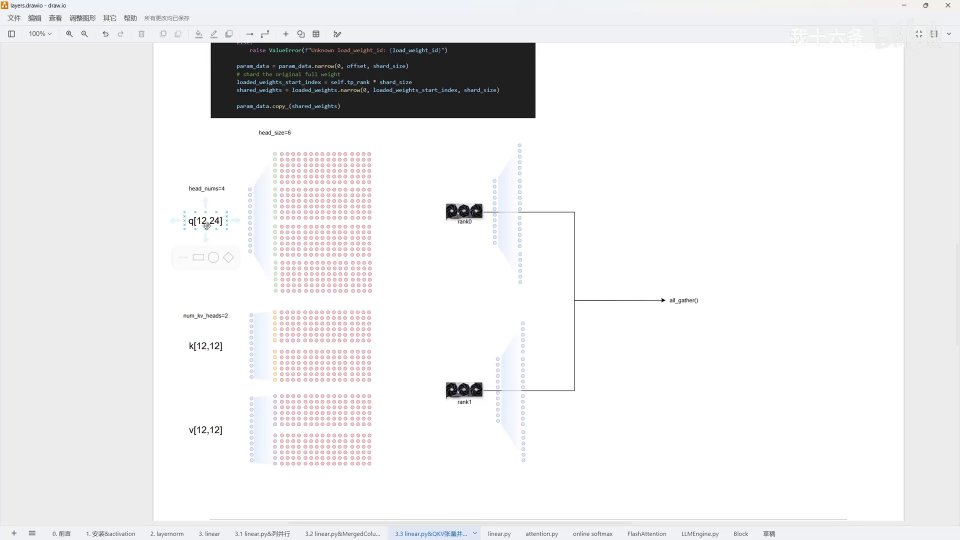 |
| 我们还是先看 Q，也就是加载 Q 这个权重的时候是怎么加载的。比如说现在传进来的是 12×24，load_weight 就把这一整个本地存储的权重传进来，其中 load_weight_id 是 Q。初始化的线性层是 12×24，这就是我们 rank0 维护的线性层。 [【跳转到 04:21】](https://www.bilibili.com/video/BV1kUfDBfEuK/?t=261) | 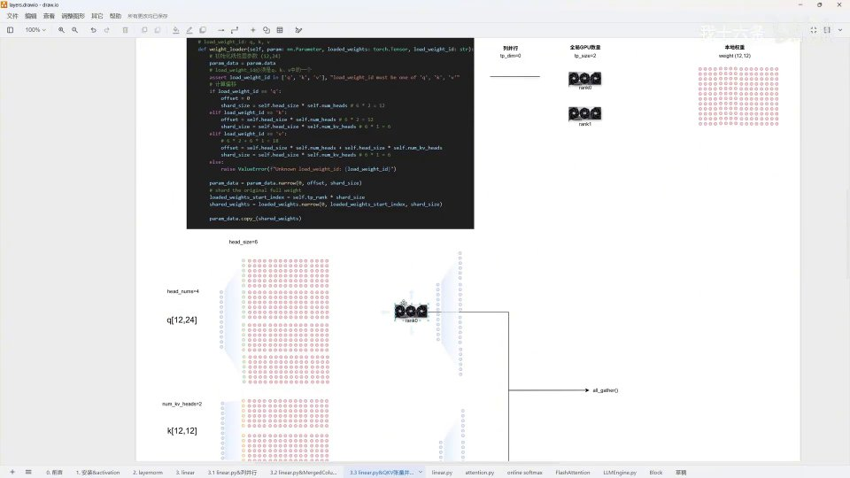 |
| 然后这里做了一个断言，要求我们传入的 load_weight_id 必须是 Q、K、V 中的一个。这里我们传入的是 Q。接着先计算偏移：加载 Q 的权重时 offset 等于 0。这个 offset 实际上用在这个地方——param_data 是对这个 GPU 的权重做的划分，意思是从第 0 个位置开始，截取 shard_size 这么多。 [【跳转到 04:46】](https://www.bilibili.com/video/BV1kUfDBfEuK/?t=286) | 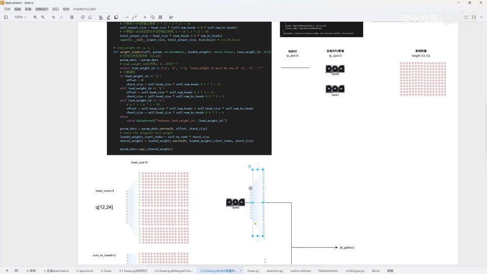 |
| shard_size 等于头的维度乘以头的数量，也就是 Q 头的数量乘以头的维度：因为头的维度是 6，6×2 就等于 12。也就是说这里相当于是给 GPU 的这 6 个神经元来加载。我们可以把颜色变一下。 [【跳转到 05:11】](https://www.bilibili.com/video/BV1kUfDBfEuK/?t=311) | 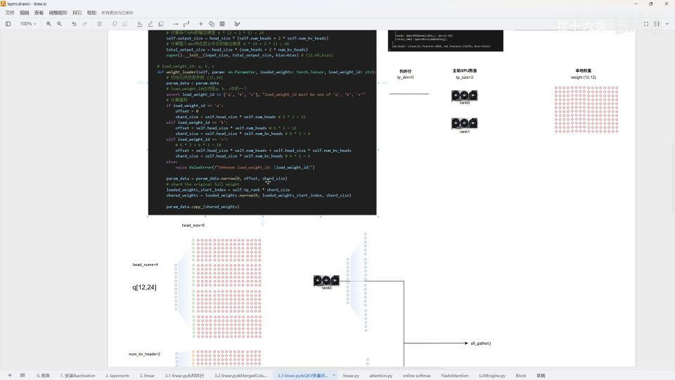 |
| 换成绿色吧，待会看起来好看一点。接着看 load_weight_start_index，它是在计算我们要从本地存储的权重哪一个位置开始取。 [【跳转到 05:36】](https://www.bilibili.com/video/BV1kUfDBfEuK/?t=336) | 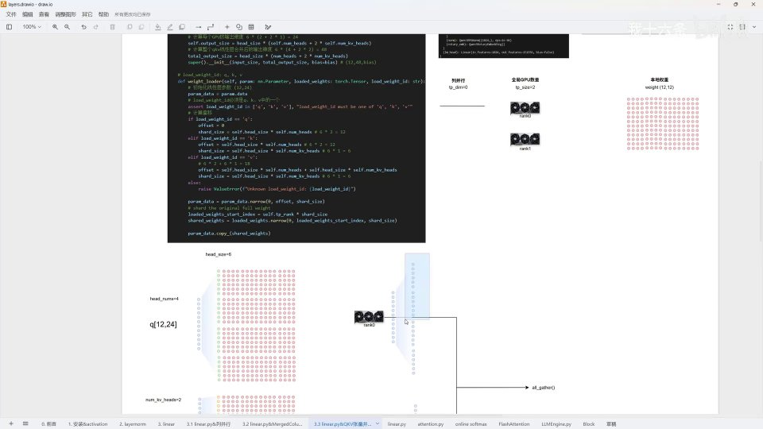 |
| 我们来看一下本地权重是怎么划分的。本地权重先是沿着第 0 维，也就是沿着列的维度，沿着这个维度切分。这里的 load_weight_start_index 就是 rank0 乘以 shard_size，shard_size 这边算的是 12，乘以 rank0 就是 0。 [【跳转到 05:50】](https://www.bilibili.com/video/BV1kUfDBfEuK/?t=350) | 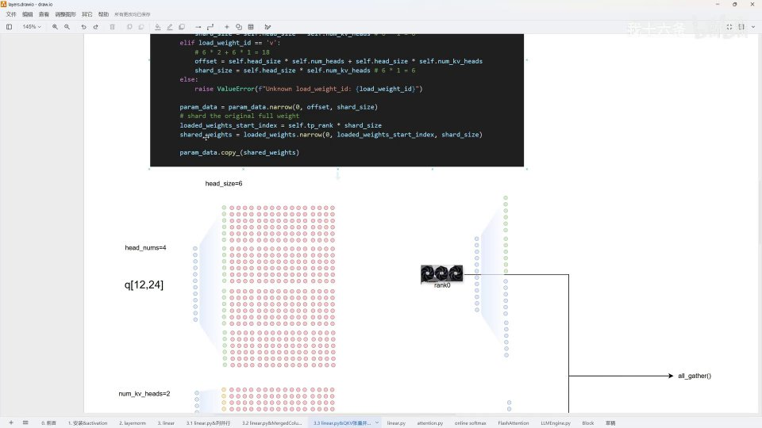 |
| 就是从这一个位置开始，然后取 shard_size 的长度。 [【跳转到 06:03】](https://www.bilibili.com/video/BV1kUfDBfEuK/?t=363) | 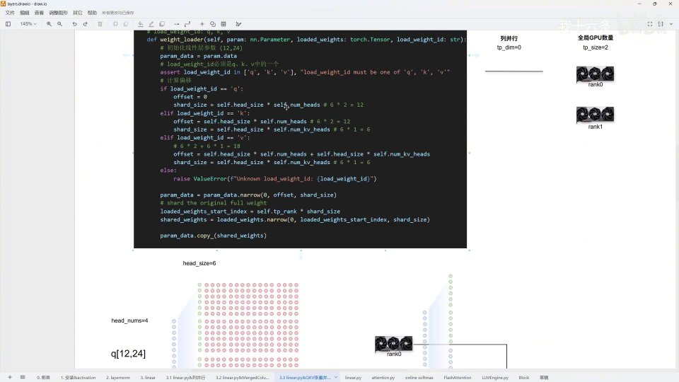 |
| shard_size 是 12，也就是说从 0 开始取 12 个。那我们把这个权重粘过来。 [【跳转到 06:08】](https://www.bilibili.com/video/BV1kUfDBfEuK/?t=368) | 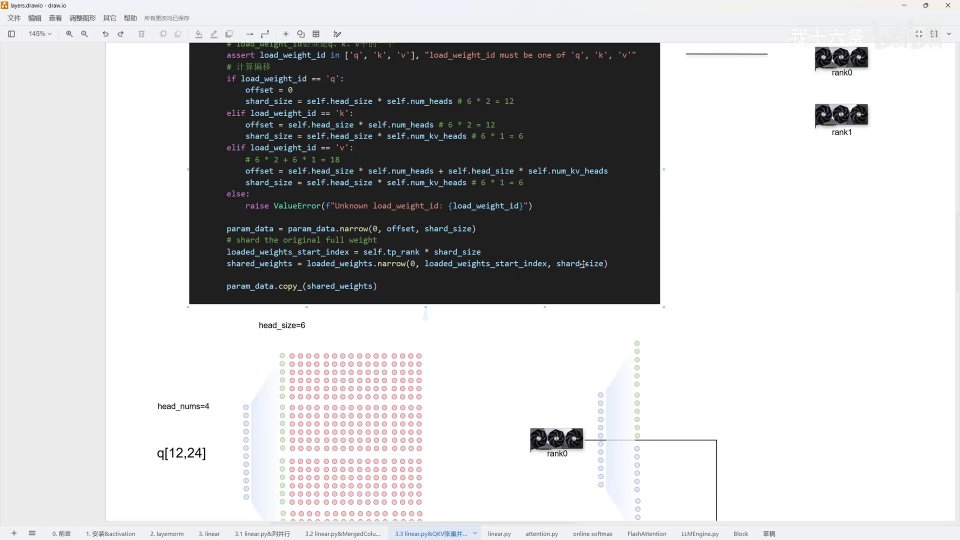 |
| OK，这里就 copy 过来了，我们 rank0 的 Q 权重就加载完了。接着我们来看 K 是怎么加载的。 [【跳转到 06:13】](https://www.bilibili.com/video/BV1kUfDBfEuK/?t=373) | 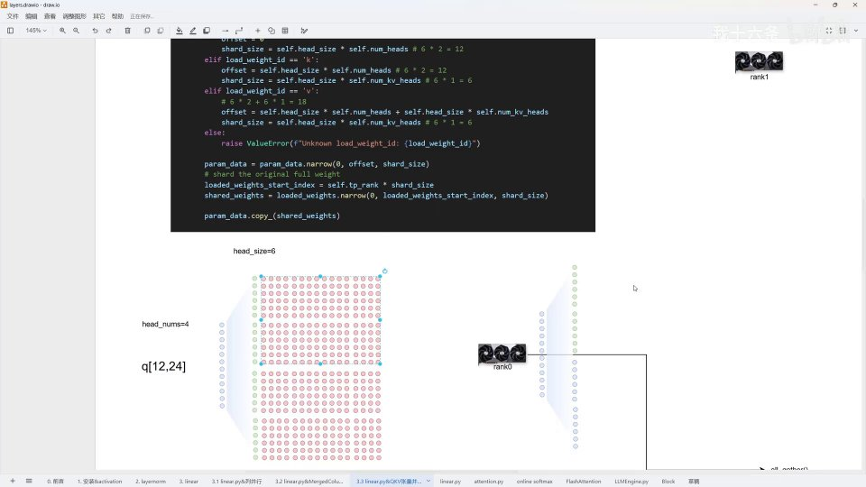 |
| 还是一样的，我们来看一下。 [【跳转到 06:24】](https://www.bilibili.com/video/BV1kUfDBfEuK/?t=384) | 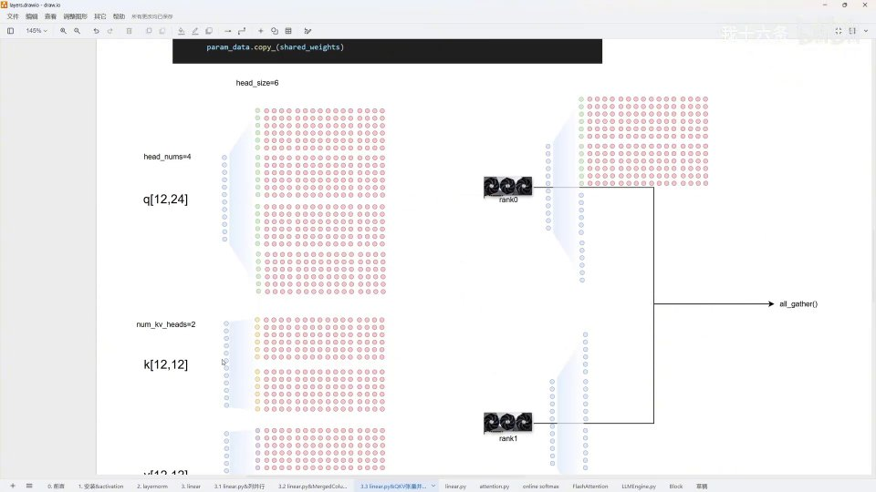 |
| 这里只是 load_weight_id 变成了 K，然后 load_weight 这个地方变成了…… [【跳转到 06:29】](https://www.bilibili.com/video/BV1kUfDBfEuK/?t=389) | 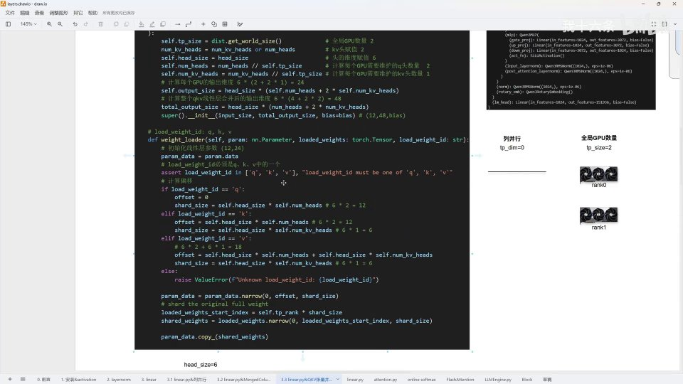 |
| 就变成了这一圈，这一圈全中，然后来加载。 [【跳转到 06:35】](https://www.bilibili.com/video/BV1kUfDBfEuK/?t=395) | 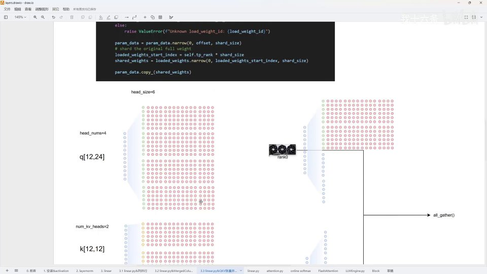 |
| 还是初始化的线性层形状，其实这个地方也不是说初始化，就相当于还是这个线性层。 [【跳转到 06:40】](https://www.bilibili.com/video/BV1kUfDBfEuK/?t=400) | 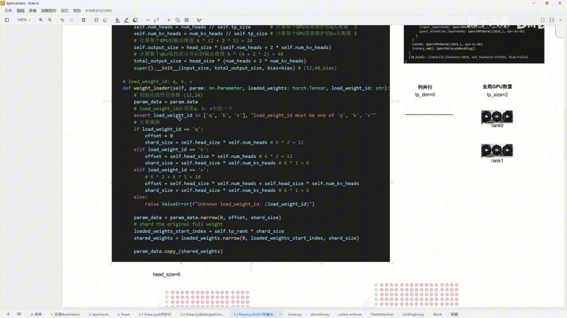 |
| 然后这里传入的是 K，算出 load_weight_id 等于 K。 [【跳转到 06:45】](https://www.bilibili.com/video/BV1kUfDBfEuK/?t=405) | 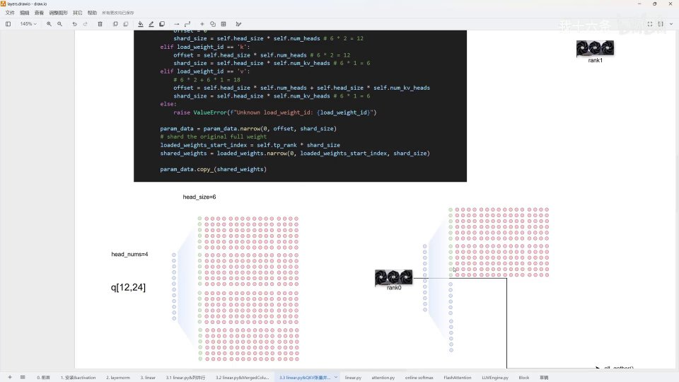 |
| 接着偏移这个地方是 6，也就是 6 乘以 Q 头的数量 2，等于 12。意思就是说，按这个偏移来算，就是从这个位置开始。 [【跳转到 06:50】](https://www.bilibili.com/video/BV1kUfDBfEuK/?t=410) | 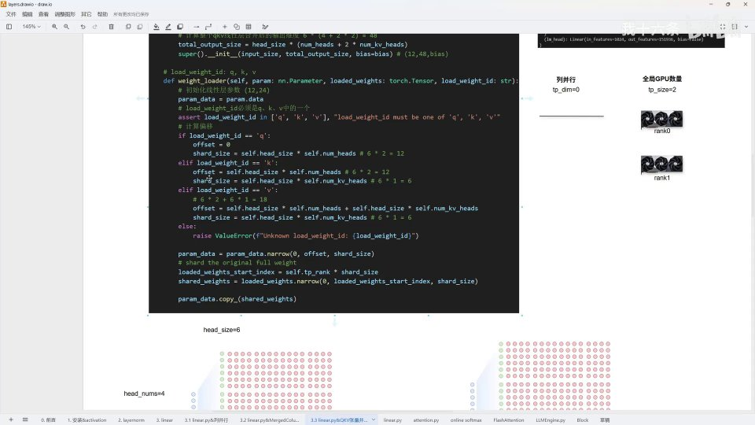 |
| 从第 12 个位置开始，然后看 shard_size 加载多少个。 [【跳转到 07:01】](https://www.bilibili.com/video/BV1kUfDBfEuK/?t=421) |  |
| 就是 6 乘以 KV 头数量乘以 1，那就等于 6，只加载六个。 [【跳转到 07:06】](https://www.bilibili.com/video/BV1kUfDBfEuK/?t=426) | 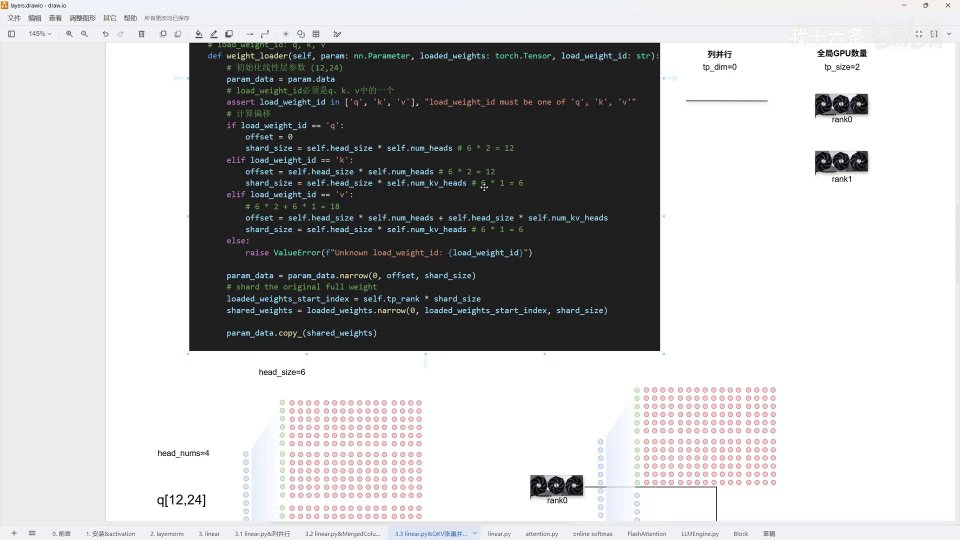 |
| 然后我们再来看下面这个，先跳过。 [【跳转到 07:11】](https://www.bilibili.com/video/BV1kUfDBfEuK/?t=431) | 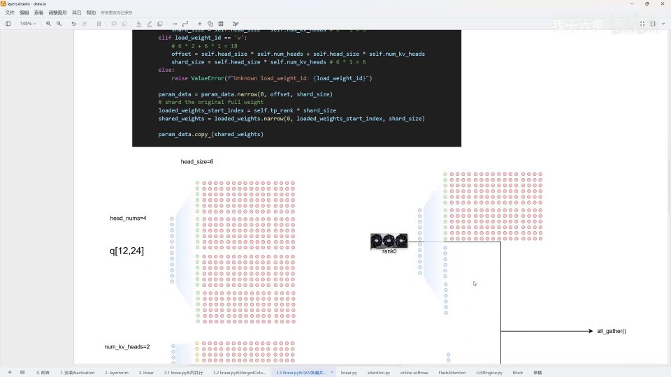 |
| 这边就是取到了我们这个权重。 [【跳转到 07:16】](https://www.bilibili.com/video/BV1kUfDBfEuK/?t=436) | 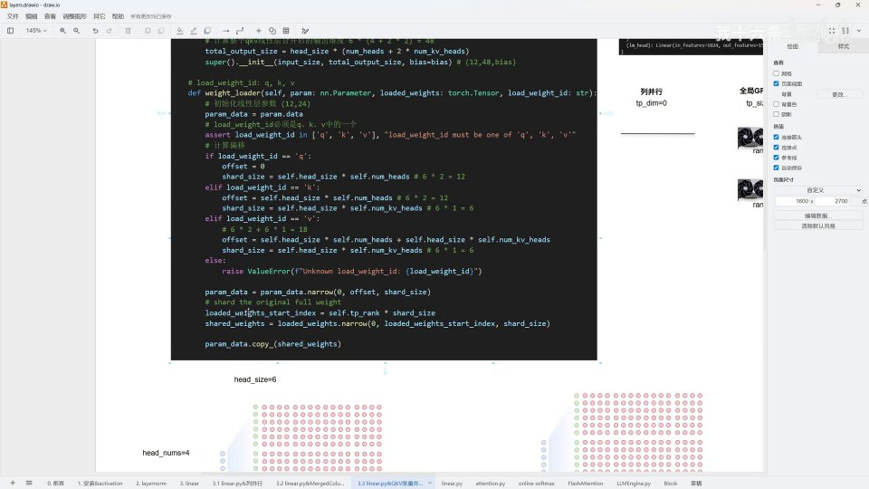 |
| 这个地方当前 rank 是 0，0 乘以 shard_size 等于 0，意思就是说在 K 本地权重里…… [【跳转到 07:21】](https://www.bilibili.com/video/BV1kUfDBfEuK/?t=441) | 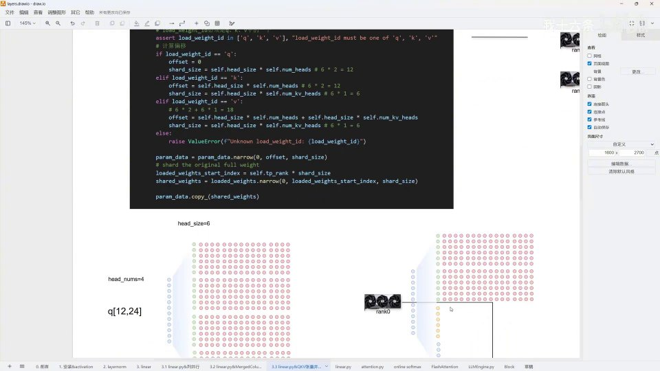 |
| 开始的位置就是 0，这里就等于 0，然后写入的位置 shard_size 等于 6。 [【跳转到 07:28】](https://www.bilibili.com/video/BV1kUfDBfEuK/?t=448) | 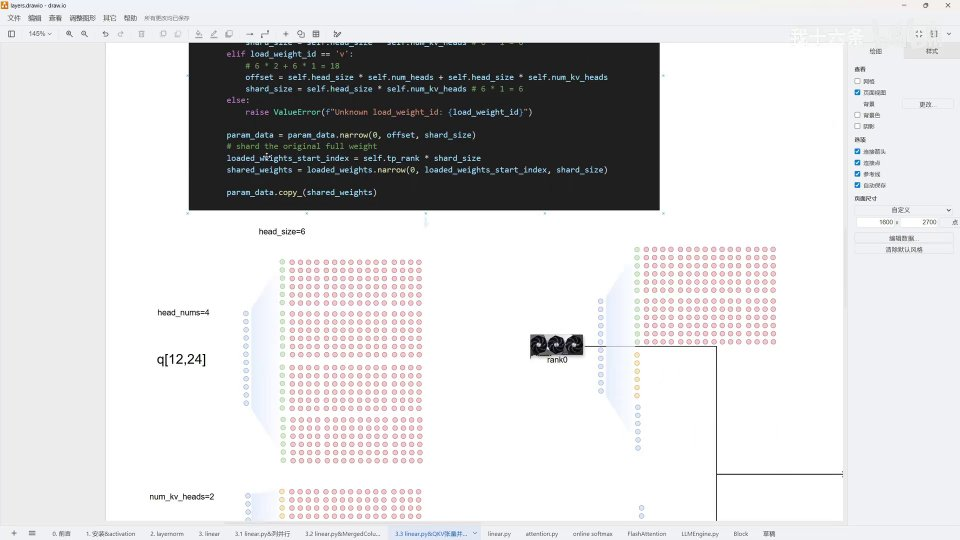 |
| 也就是说从 0 开始数 6 个位置，就是这一部分，把这一部分加载过来。OK，这就加载完了。对于最后一个 V 头，其实也是一样的。 [【跳转到 07:34】](https://www.bilibili.com/video/BV1kUfDBfEuK/?t=454) | 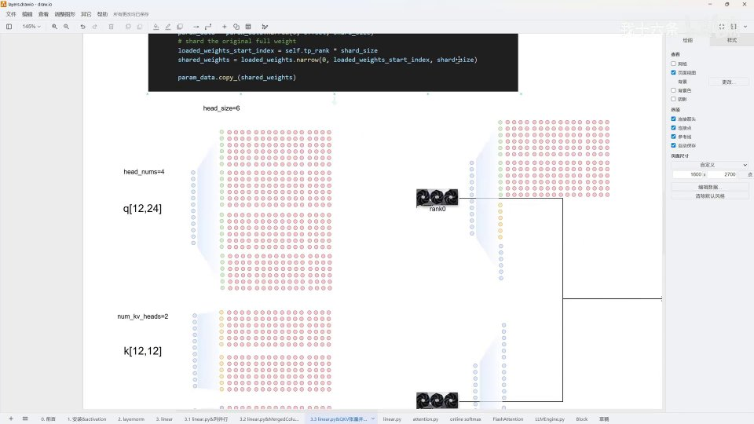 |
| 变的只是 load_weight_id，这里变成了 V。 [【跳转到 07:45】](https://www.bilibili.com/video/BV1kUfDBfEuK/?t=465) | 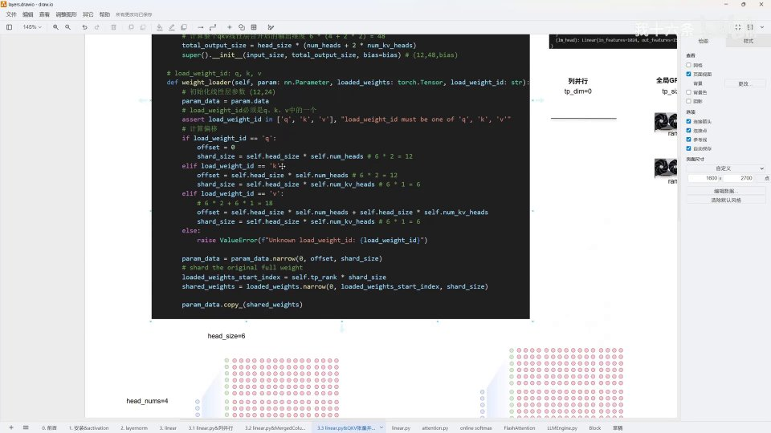 |
| 然后这个 load 位置传进来是这一个参数，这个 load 位置，param 就是传的这一整个进来。 [【跳转到 07:50】](https://www.bilibili.com/video/BV1kUfDBfEuK/?t=470) | 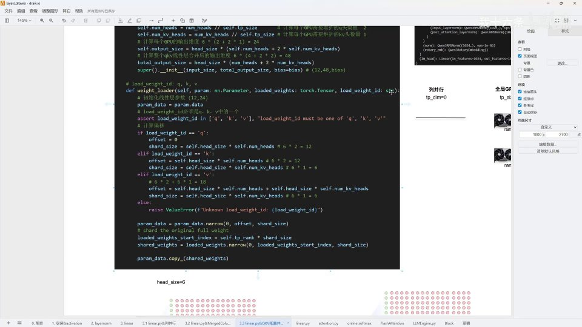 |
| 然后我们来判断 V，直接看这里。 [【跳转到 07:55】](https://www.bilibili.com/video/BV1kUfDBfEuK/?t=475) | 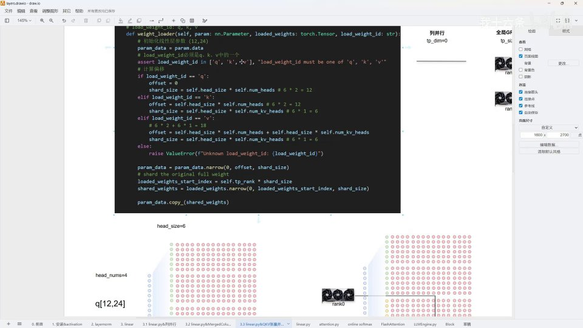 |
| 偏移等于头的维度 6 乘以头的数量 2，也就是 6×2，再加上 6 再乘以 K 头的数量，就等于 18：6×2 + 6×1 = 18，所以 offset 就等于 18。意思就是说从这个位置开始。 [【跳转到 08:00】](https://www.bilibili.com/video/BV1kUfDBfEuK/?t=480) |  |
| 然后 shard_size 等于 6 乘以 1，也就是乘以 KV 头的数量。 [【跳转到 08:16】](https://www.bilibili.com/video/BV1kUfDBfEuK/?t=496) | 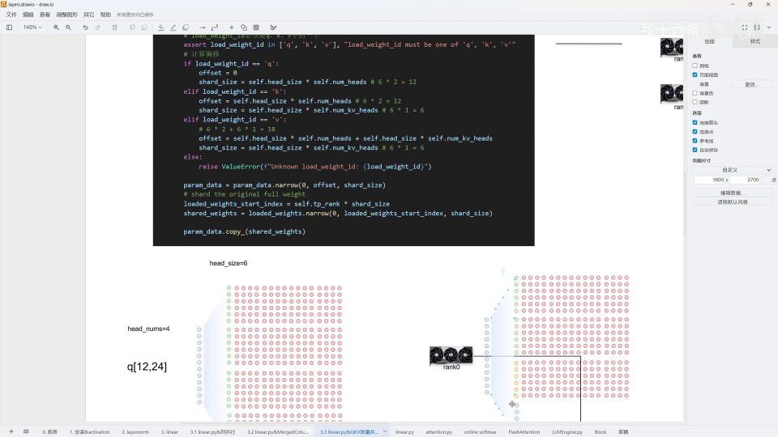 |
| 就等于 6，就是说从这个位置、从第 18 个位置开始加载 6 个，这个地方就是 V 的…… [【跳转到 08:21】](https://www.bilibili.com/video/BV1kUfDBfEuK/?t=501) | 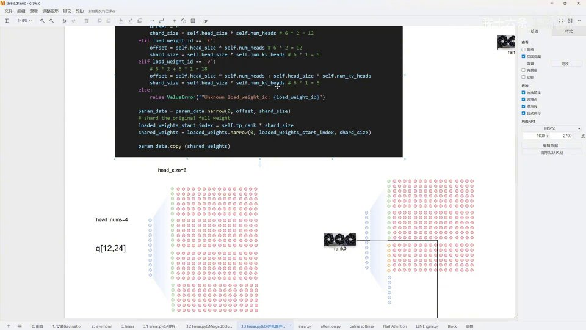 |
| ……V 的权重。下面就是计算我们本地权重是怎么切的。 [【跳转到 08:29】](https://www.bilibili.com/video/BV1kUfDBfEuK/?t=509) | 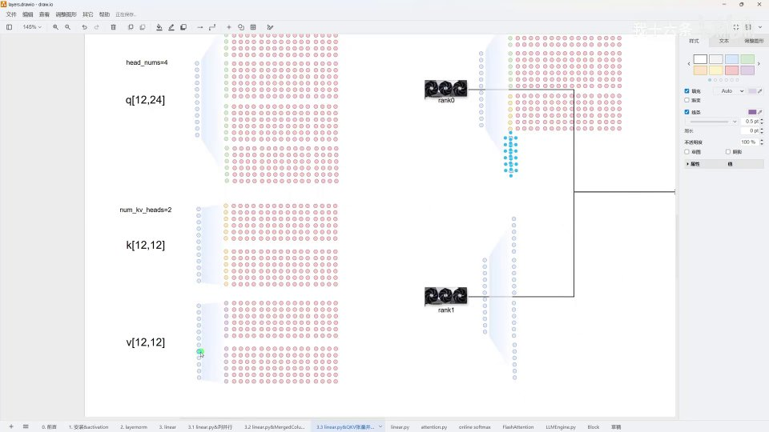 |
| 这里我就不讲了，你们可以自己推一下。然后把它粘过去。 [【跳转到 08:34】](https://www.bilibili.com/video/BV1kUfDBfEuK/?t=514) | 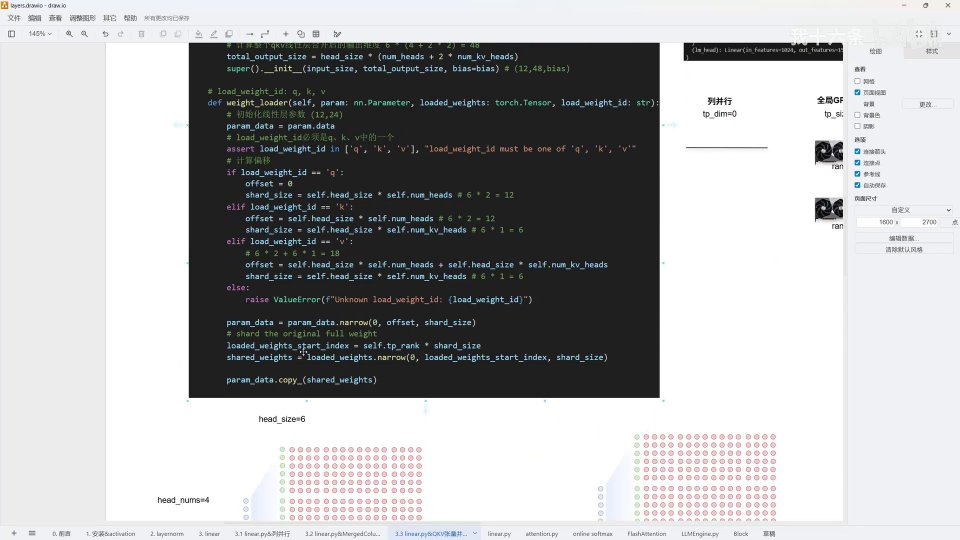 |
| OK，那我们 rank0 就加载完了。 [【跳转到 08:39】](https://www.bilibili.com/video/BV1kUfDBfEuK/?t=519) | 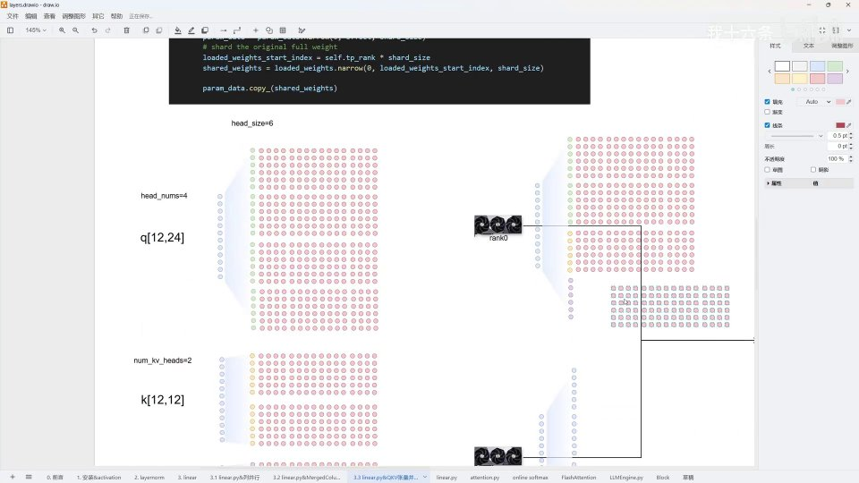 |
| 对于我们 rank1 来说，变化就在这里。这个位置的变化其实只是…… [【跳转到 08:45】](https://www.bilibili.com/video/BV1kUfDBfEuK/?t=525) | 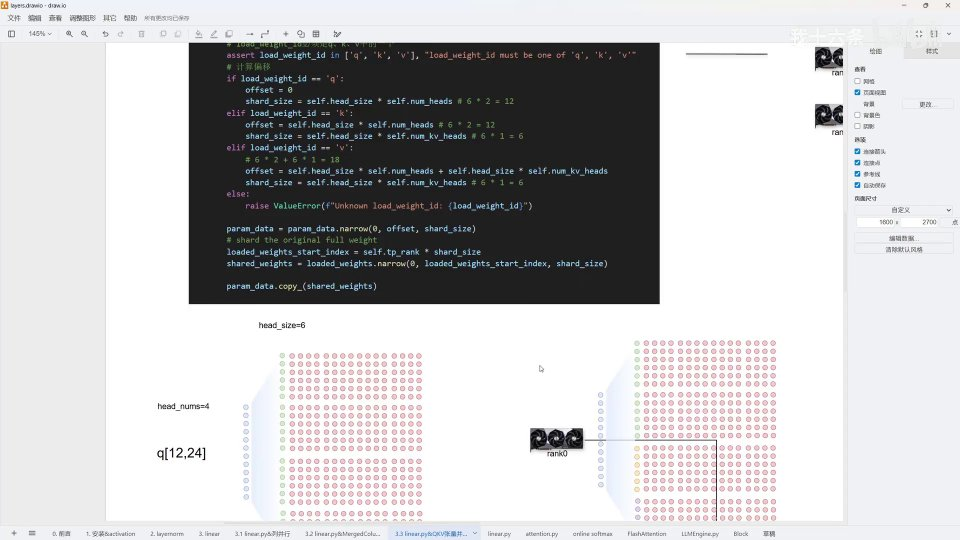 |
| ……我们本地权重开始划分的位置。当 TP rank 等于 1 的时候， [【跳转到 08:50】](https://www.bilibili.com/video/BV1kUfDBfEuK/?t=530) | 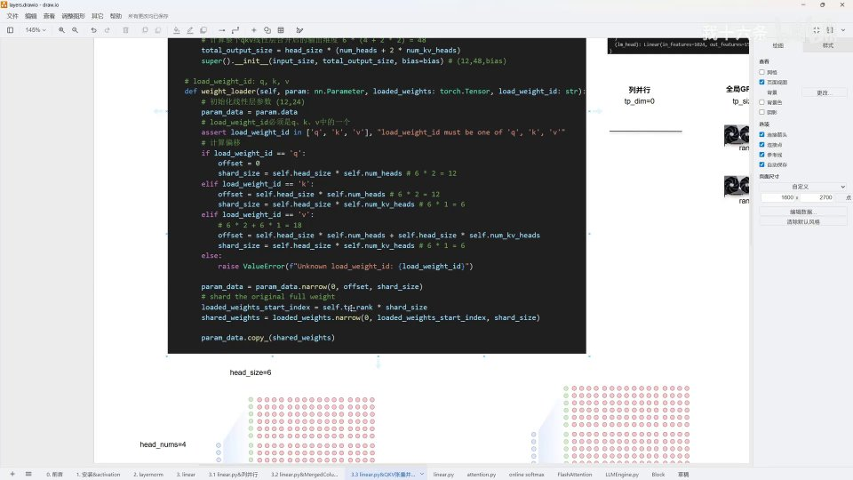 |
| 对于 Q 头来说，它实际上等于 1，也就是 1 乘 shard_size，1×12 得 12，就是从这个位置开始划分。 [【跳转到 08:55】](https://www.bilibili.com/video/BV1kUfDBfEuK/?t=535) | 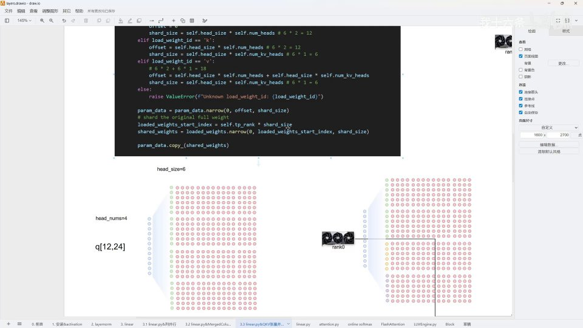 |
| 就是从第 12 个位置、神经元开始划分，然后取 12 个，相当于取下面这一部分，然后粘过来。 [【跳转到 09:04】](https://www.bilibili.com/video/BV1kUfDBfEuK/?t=544) | 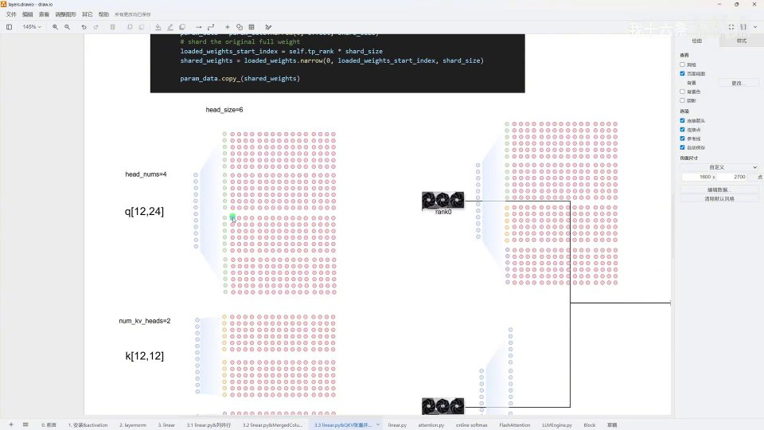 |
| 这个是 Q 头，这个是 K 头，K 头也是一样的，只是变化…… [【跳转到 09:11】](https://www.bilibili.com/video/BV1kUfDBfEuK/?t=551) | 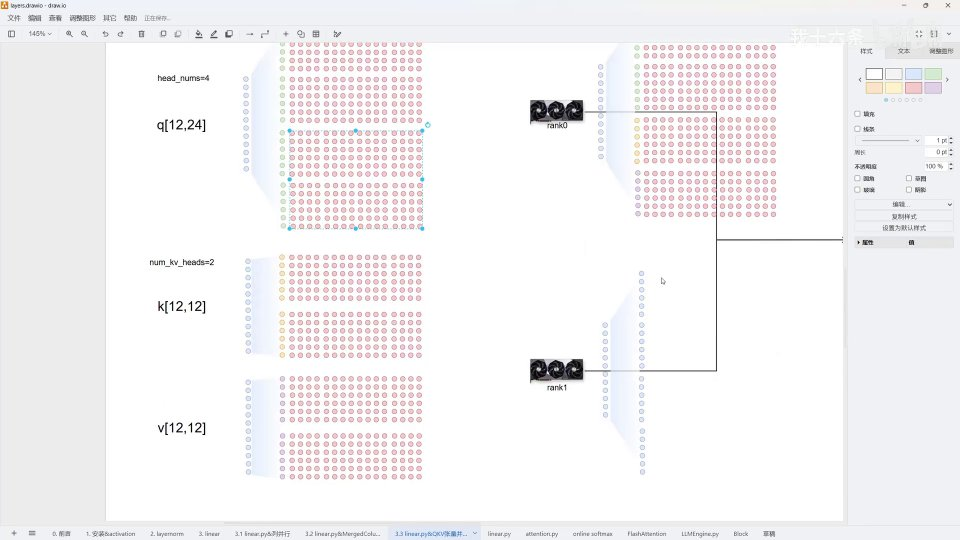 |
| ……就是在这里取的位置不同，其实取的是下面这个地方、下面这块权重。 [【跳转到 09:21】](https://www.bilibili.com/video/BV1kUfDBfEuK/?t=561) |  |
| OK，对于 V 头来说也是一样的，取的就是下半部分。好，我们权重就加载完了。 [【跳转到 09:26】](https://www.bilibili.com/video/BV1kUfDBfEuK/?t=566) | 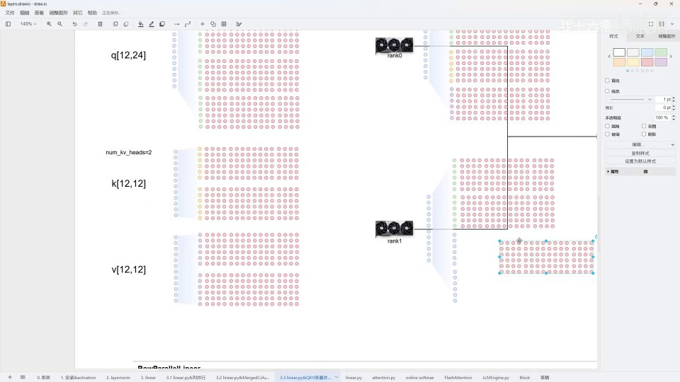 |
| QKV 其实就是这样的。那 QKV 这个合并线性层全都加载完了之后， [【跳转到 09:36】](https://www.bilibili.com/video/BV1kUfDBfEuK/?t=576) | 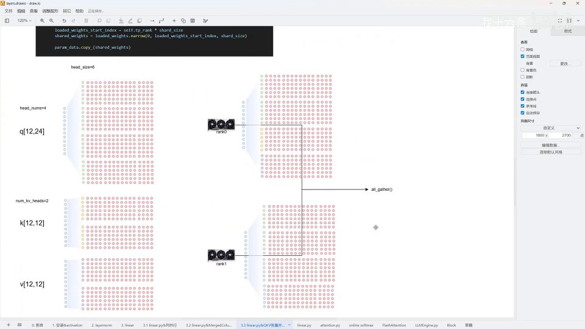 |
| 做前向传播，然后再做一个 gather（all_gather），把它们再拼接在一起。我在这里再画细一点吧。 [【跳转到 09:41】](https://www.bilibili.com/video/BV1kUfDBfEuK/?t=581) | 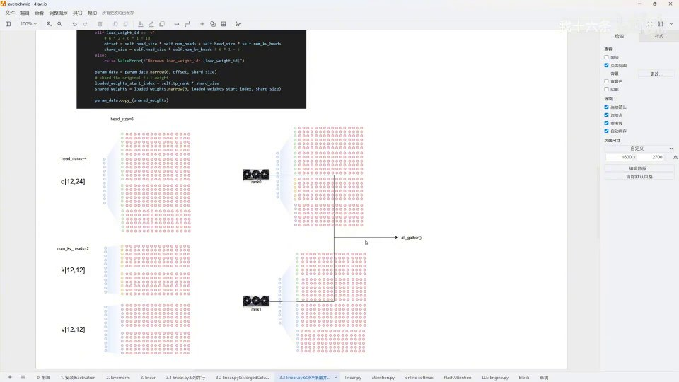 |
| 这个地方是黄色的，这个地方是绿色的。 [【跳转到 09:48】](https://www.bilibili.com/video/BV1kUfDBfEuK/?t=588) | 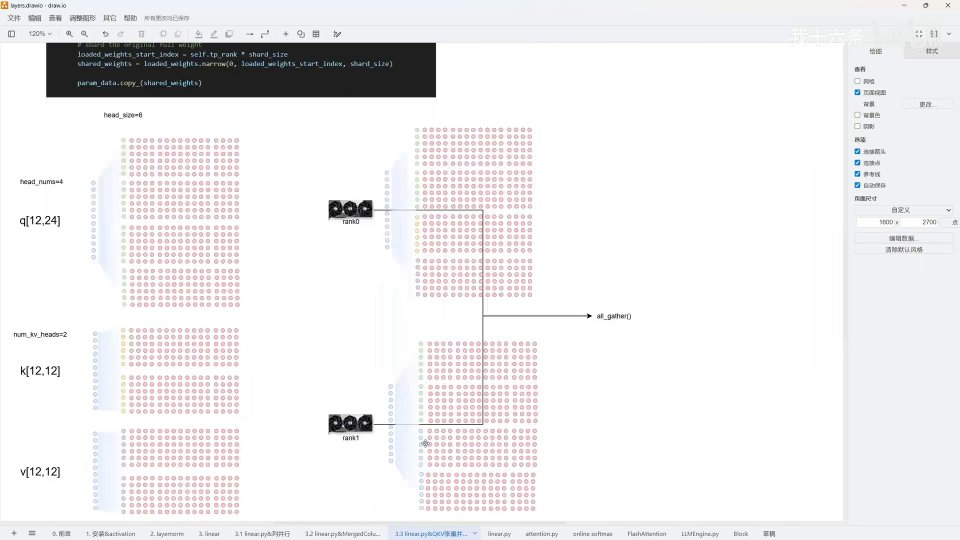 |
| 这个地方是黄色的，然后最后一个这个是紫色的。 [【跳转到 09:53】](https://www.bilibili.com/video/BV1kUfDBfEuK/?t=593) | 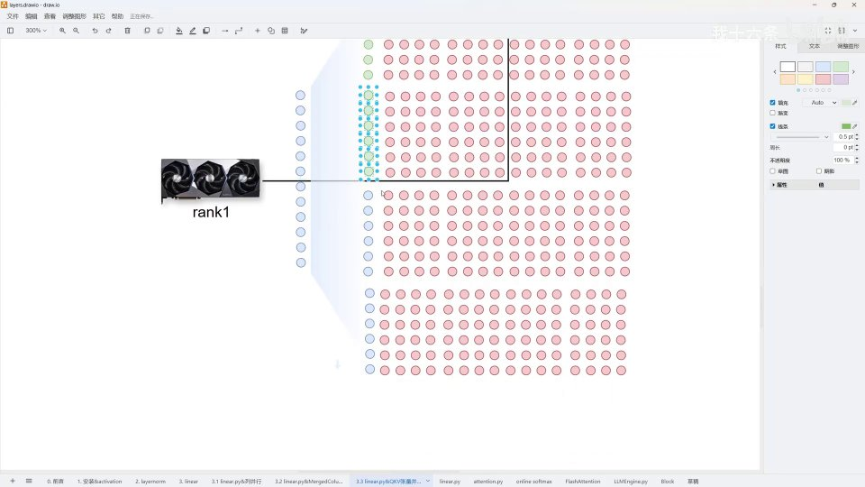 |
| 相当于我们每一个 rank 都维护了 QKV 的一部分。比如说我们这个 rank0， [【跳转到 09:59】](https://www.bilibili.com/video/BV1kUfDBfEuK/?t=599) | 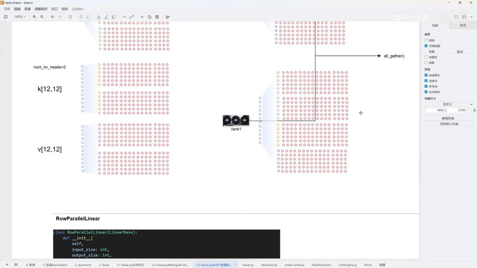 |
| 它上面就是 Q 的一半，然后 K 的一半、V 的一半。因为我们的并行是 2，全局并行就是两个 GPU。如果是 4 个 GPU 的话，那对于 rank0 来说它就只维护 1/4 个 Q，相当于就只有这一部分；对于 rank1 来说其实也是维护 1/4。但因为我们这个地方 KV 头只有 2，所以说我们这里就只探讨了全局 GPU 数量为 2 的情况。 [【跳转到 10:04】](https://www.bilibili.com/video/BV1kUfDBfEuK/?t=604) | 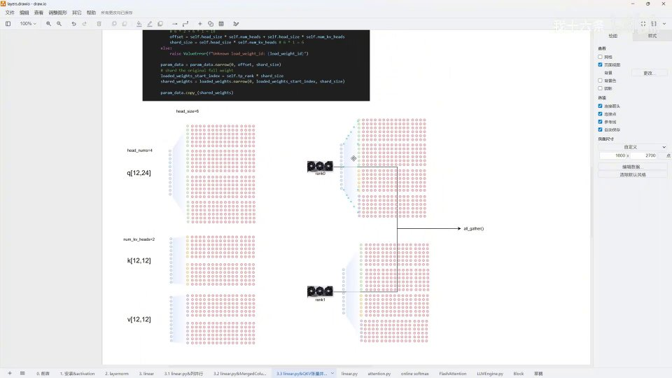 |
| 它是怎么去划分的。 [【跳转到 10:29】](https://www.bilibili.com/video/BV1kUfDBfEuK/?t=629) | 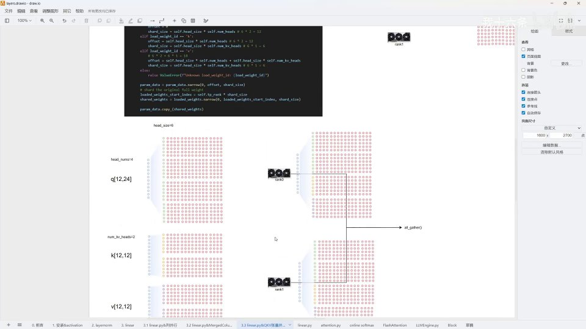 |