# linear.py&行并行&张量并行 原始文稿（图-字幕分栏）

| 字幕文本 | 画面 |
| :--- | ---: |
| 好，现在我们终于来到了 linear.py 的最后一个部分，也就是行并行。还是先从 Qwen 0.6B 的结构看起吧。 [【跳转到 00:00】](https://www.bilibili.com/video/BV1JAFEzPE1F/?t=0) | 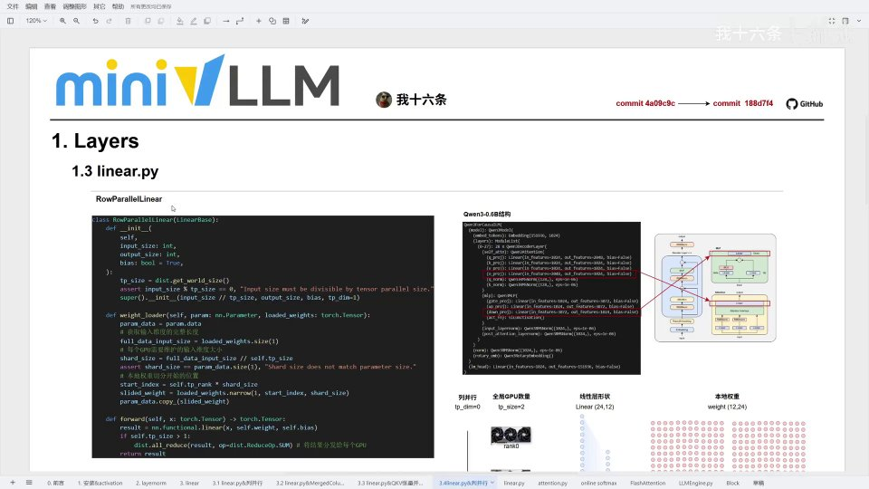 |
| 行并行主要用在两个部分：一个是在 QKV 之后的那一个输出维度， [【跳转到 00:10】](https://www.bilibili.com/video/BV1JAFEzPE1F/?t=10) | 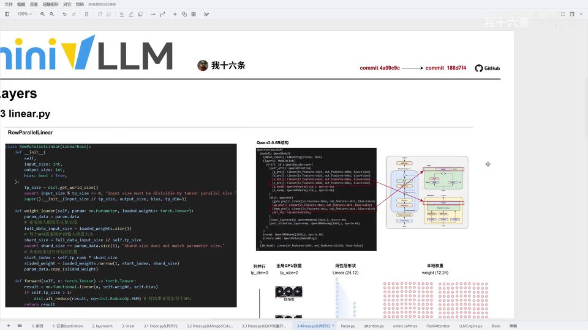 |
| 也就是 o_proj，即潜在状态（latent state）的线性变换；另一个部分是上采样，也就是 MLP 里做的那个上采样。我们待会举例还是以 o_proj 的情况为例，看它在输出维度是输入维度两倍的情况下，怎么做行并行。对应的位置其实就是 MLP 的上采样， [【跳转到 00:15】](https://www.bilibili.com/video/BV1JAFEzPE1F/?t=15) | 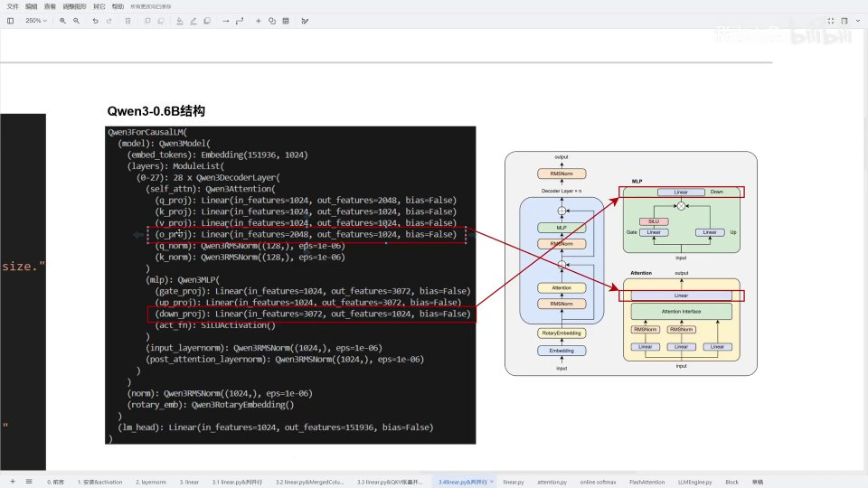 |
| 和 attention 的最后面。好，我们还是先过一遍源码。 [【跳转到 00:40】](https://www.bilibili.com/video/BV1JAFEzPE1F/?t=40) | 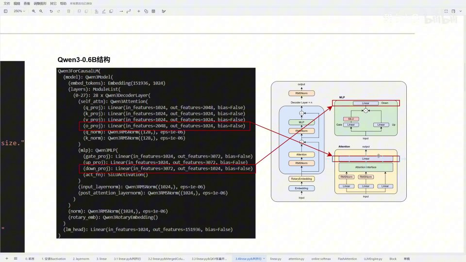 |
| 首先，行并行 [【跳转到 00:47】](https://www.bilibili.com/video/BV1JAFEzPE1F/?t=47) | 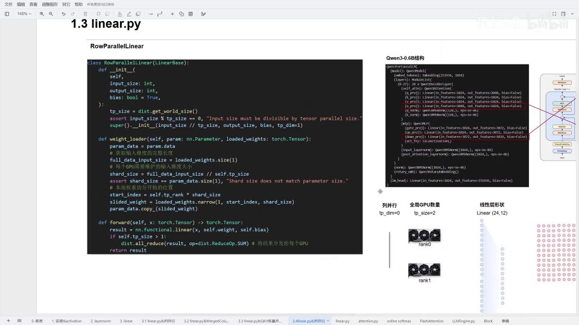 |
| 它是基于 LinearBase，也就是和列并行一样的基类。它们不一样的地方在于：行并行是在输入维度上做了切分，也就是在 LinearBase 这个输入维度这里除以了 TP size。但实际上放到我们本地的权重上看，因为权重是转置过来的，所以其实也是在输出维度——只不过是在……看一下， [【跳转到 00:52】](https://www.bilibili.com/video/BV1JAFEzPE1F/?t=52) | 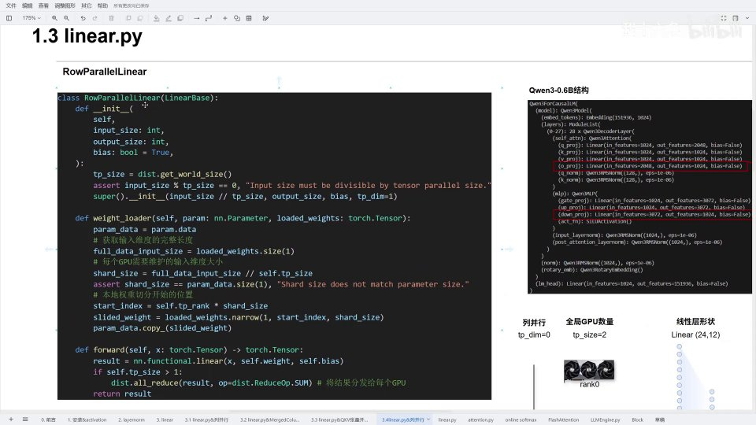 |
| 其实只不过是在这个输出维度。如果说是 12 到 24 的情况，那就是这样，相当于从中间把权重分成两个部分。好， [【跳转到 01:17】](https://www.bilibili.com/video/BV1JAFEzPE1F/?t=77) | 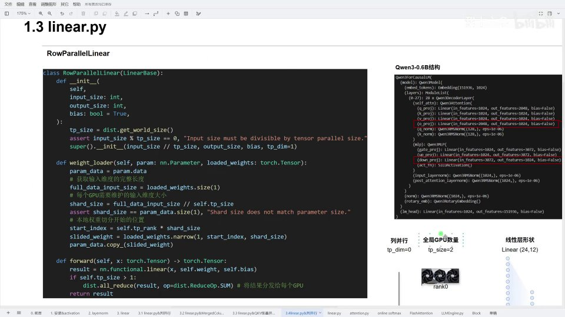 |
| 那就是这样，相当于从中间把权重分成了两个部分。 [【跳转到 01:22】](https://www.bilibili.com/video/BV1JAFEzPE1F/?t=82) | 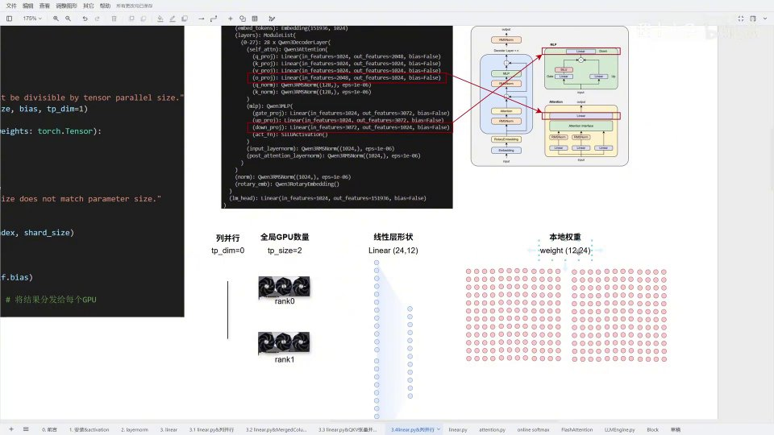 |
| 我们继续看。另一个不同就是 tp_dim 这里等于 1，这就是一个区分。 [【跳转到 01:27】](https://www.bilibili.com/video/BV1JAFEzPE1F/?t=87) | 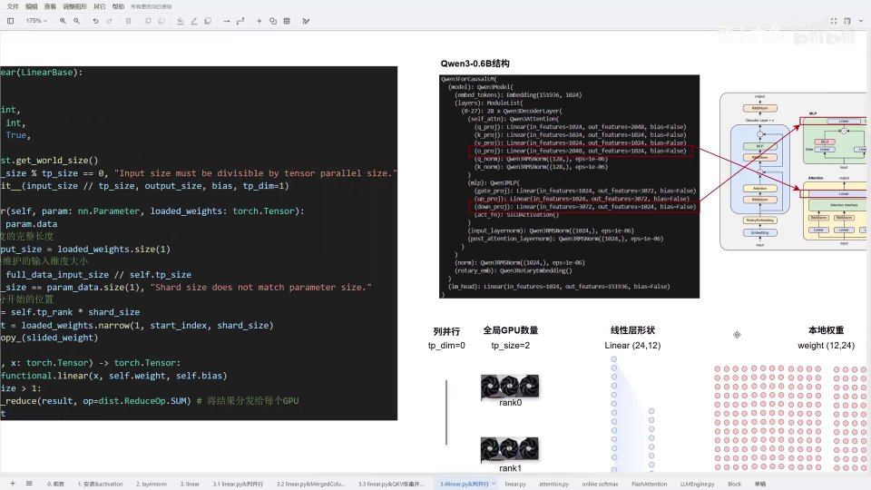 |
| 然后前面这个就没什么好讲的，之前也讲过。 [【跳转到 01:32】](https://www.bilibili.com/video/BV1JAFEzPE1F/?t=92) | 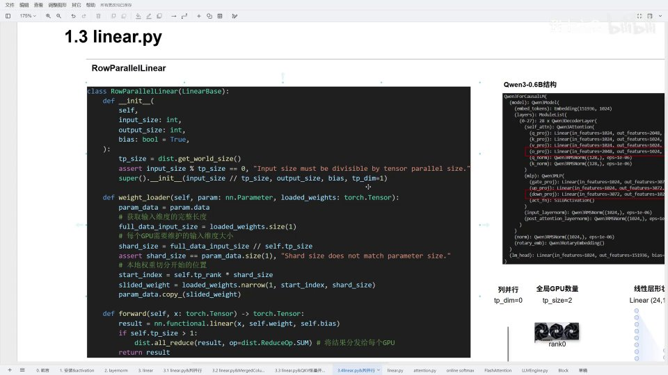 |
| 我们重点来看权重加载的部分。嗯，待会再举个例子吧，先看一下：首先还是对参数进行赋值，然后获取输入维度的完整长度，也就是我们本地权重存储的那个输入维度，这是 loaded_weight 的输入维度 size1。在我们举的例子，也就是 12×24 的权重形状下， [【跳转到 01:39】](https://www.bilibili.com/video/BV1JAFEzPE1F/?t=99) |  |
| 它这个完整长度其实就是 24。那对应的每个 GPU 需要维护的维度大小，我们还是以全局 GPU 数量为 2 的情况为例，那就是 24÷2，其实等于 12。这里做了一个断言，判断本地权重切分后的维度大小和我需要存储的维度大小是否一致。 [【跳转到 02:04】](https://www.bilibili.com/video/BV1JAFEzPE1F/?t=124) |  |
| 然后做了一个断言。这个地方 start_index 就是我们本地权重开始切分的位置。假如我们在 0 号机器上（rank0），乘以 shard_size 就是 0，那就从 0 这个位置开始切。我们再看，如果是 rank1，那就是从第 12 个位置开始写。如果从权重上看的话， [【跳转到 02:29】](https://www.bilibili.com/video/BV1JAFEzPE1F/?t=149) | 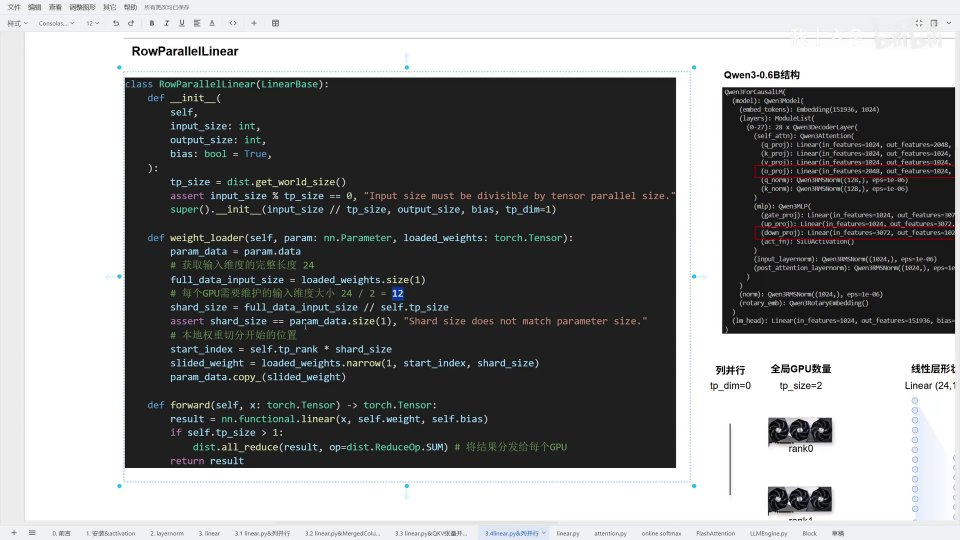 |
| 第 0 个位置就是这，那如果第 12 个位置的话就是这。因为我们是按行切的， [【跳转到 02:52】](https://www.bilibili.com/video/BV1JAFEzPE1F/?t=172) | 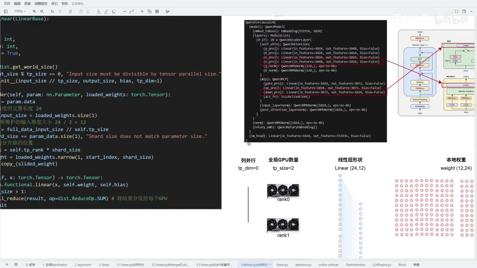 |
| 所以从 0 开始，这是按行数 12 个，那就是这个地方。 [【跳转到 02:57】](https://www.bilibili.com/video/BV1JAFEzPE1F/?t=177) | 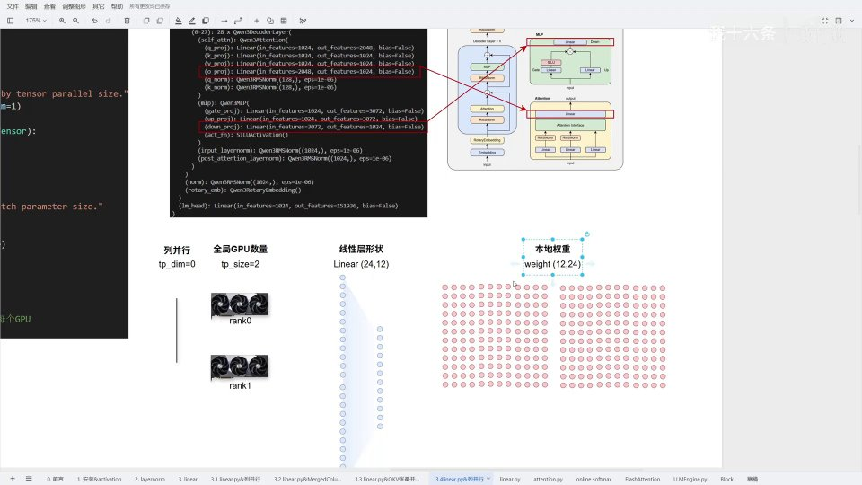 |
| 然后继续看，这个是需要切分的窗口大小，也就是我们切多少。 [【跳转到 03:03】](https://www.bilibili.com/video/BV1JAFEzPE1F/?t=183) | 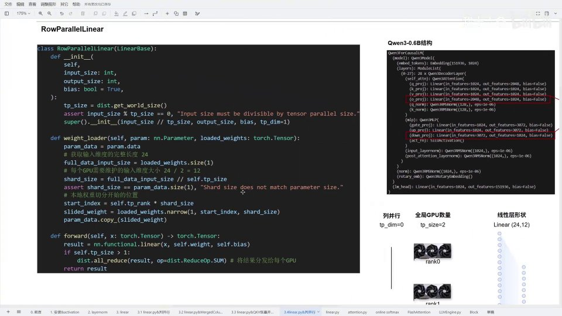 |
| 这里就是 shard_size，即我们切多少；然后这个就是我们切出来的权重，这个权重沿行的维度，从 0 开始切，切 12 长度。其实经过前面列并行的学习，这一块应该都不难理解。还是看一下例子。 [【跳转到 03:08】](https://www.bilibili.com/video/BV1JAFEzPE1F/?t=188) | 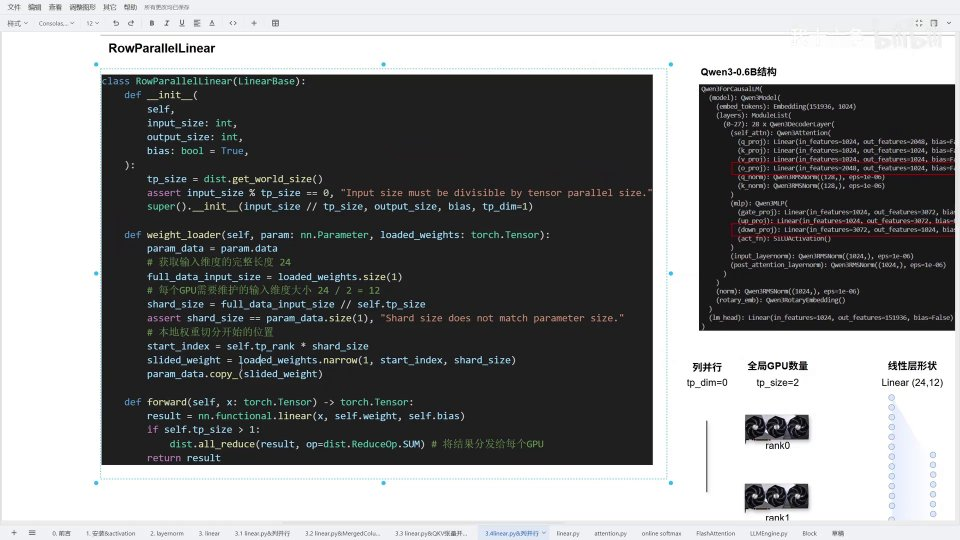 |
| 还是一个多机的环境，我们的输…… [【跳转到 03:28】](https://www.bilibili.com/video/BV1JAFEzPE1F/?t=208) | 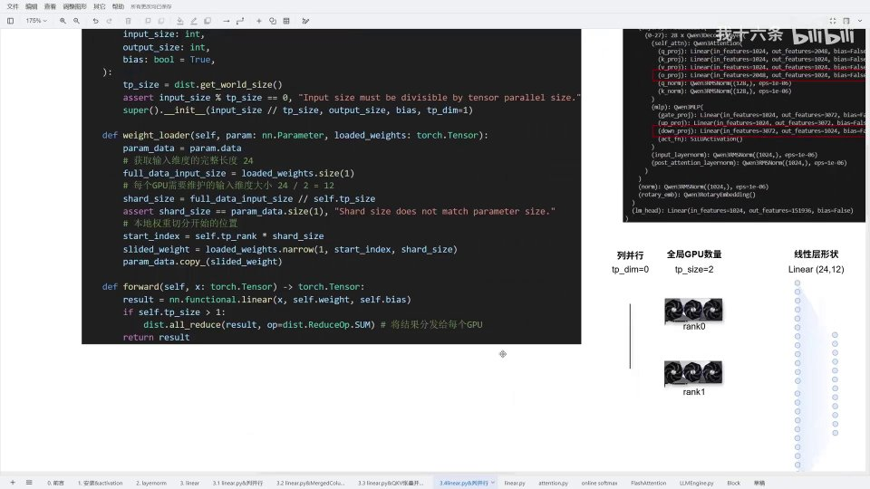 |
| 我们线性层的维度是 24×12。就假设这个是 o_proj， [【跳转到 03:33】](https://www.bilibili.com/video/BV1JAFEzPE1F/?t=213) | 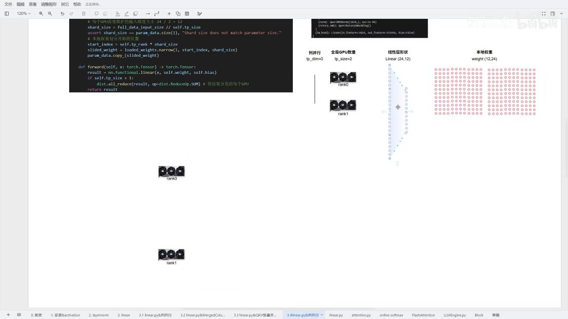 |
| 只是它的线性层形状是 2048×1024。我们为了方便展示， [【跳转到 03:38】](https://www.bilibili.com/video/BV1JAFEzPE1F/?t=218) | 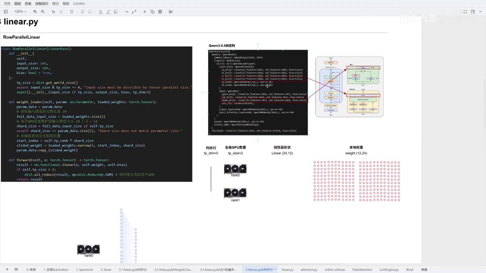 |
| 所以把它缩小成 24×12，但它们的倍数是一样的， [【跳转到 03:43】](https://www.bilibili.com/video/BV1JAFEzPE1F/?t=223) | 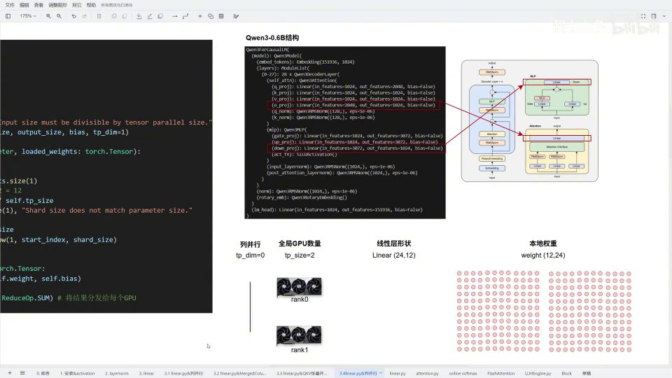 |
| 方便我们理解。好，然后是原始权重，是 24×12。 [【跳转到 03:48】](https://www.bilibili.com/video/BV1JAFEzPE1F/?t=228) | 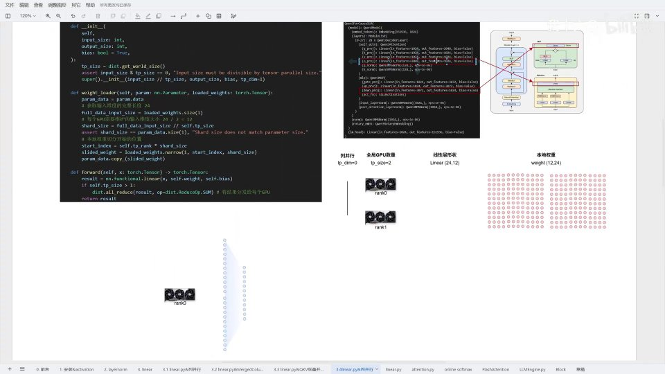 |
| 但因为我们要做行并行，我们还是从这一步一步步看吧。 [【跳转到 03:53】](https://www.bilibili.com/video/BV1JAFEzPE1F/?t=233) | 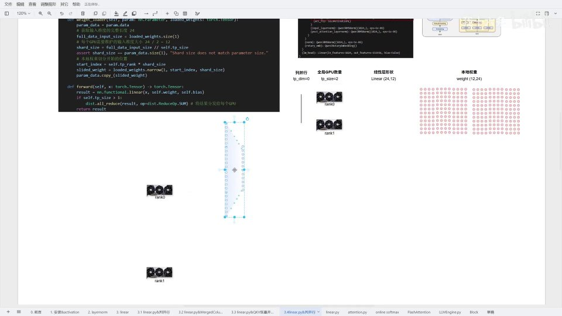 |
| 首先，我们本地机器需要维护的长度：实际上这个形状参数的形状就是 12×12。因为 input size [【跳转到 03:58】](https://www.bilibili.com/video/BV1JAFEzPE1F/?t=238) | 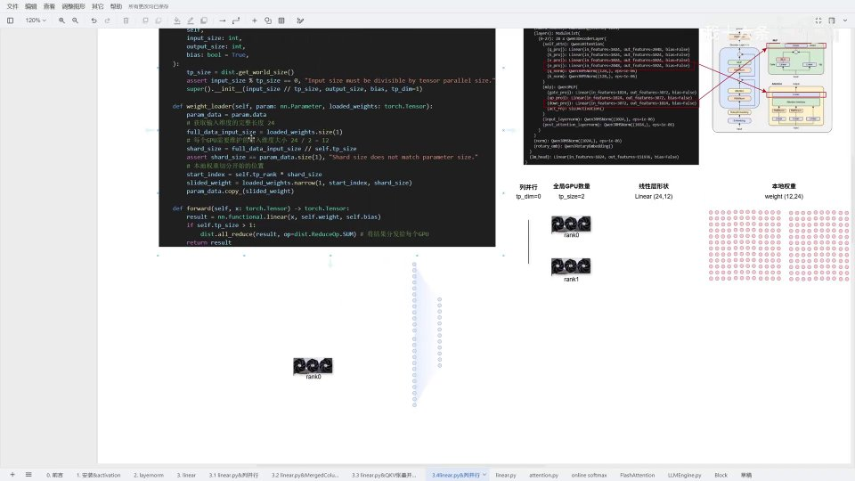 |
| 我们 input size 是 24，除以 TP size（这里是 2），24÷2 就等于 12；我们的 output size 是 12，所以每台机器维护的…… [【跳转到 04:09】](https://www.bilibili.com/video/BV1JAFEzPE1F/?t=249) |  |
| 每台机器其实就只维护它的一半。把下面这个删掉， [【跳转到 04:20】](https://www.bilibili.com/video/BV1JAFEzPE1F/?t=260) | 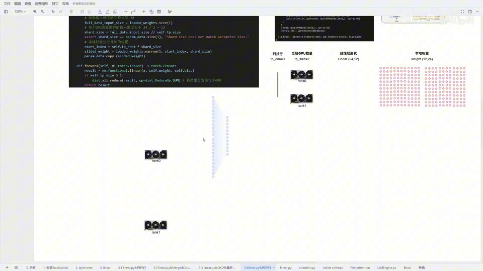 |
| 下面这个删掉的其实是上面那部分。那第一台机器就是这样的，第二台机器就是这样的，各自只维护一半的输入。 [【跳转到 04:26】](https://www.bilibili.com/video/BV1JAFEzPE1F/?t=266) | 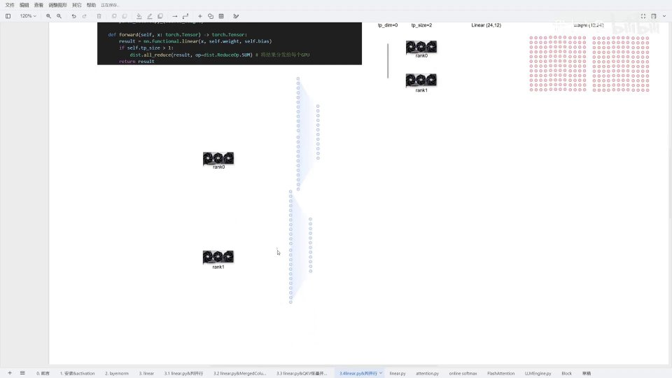 |
| 然后我们来看权重是怎么加载的。前面这一块其实就是在计算我们的切片大小。 [【跳转到 04:42】](https://www.bilibili.com/video/BV1JAFEzPE1F/?t=282) | 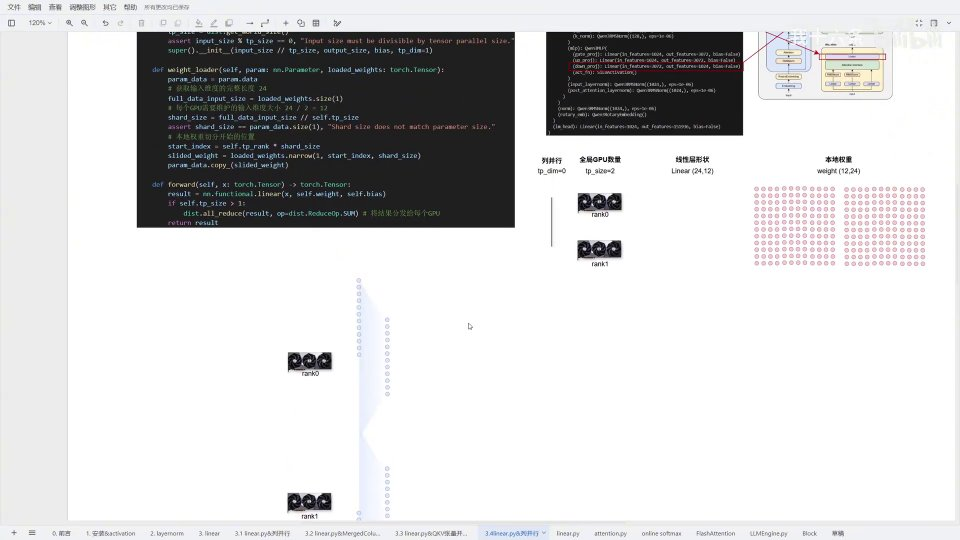 |
| 然后直接看 shard_weight，也就是从沿行的维度，假设我们在 GPU 0 上面、rank0，那 start_index 就是 0，shard_size 是 12，就是沿行的维度从第 0 个开始数 12 个，实际上就是前半部分。那它的权重就是这样复制过来， [【跳转到 04:47】](https://www.bilibili.com/video/BV1JAFEzPE1F/?t=287) |  |
| 就这样加载进去。OK，然后我们第一台机器的权重就加载完了。行并行其实很简单。 [【跳转到 05:10】](https://www.bilibili.com/video/BV1JAFEzPE1F/?t=310) | 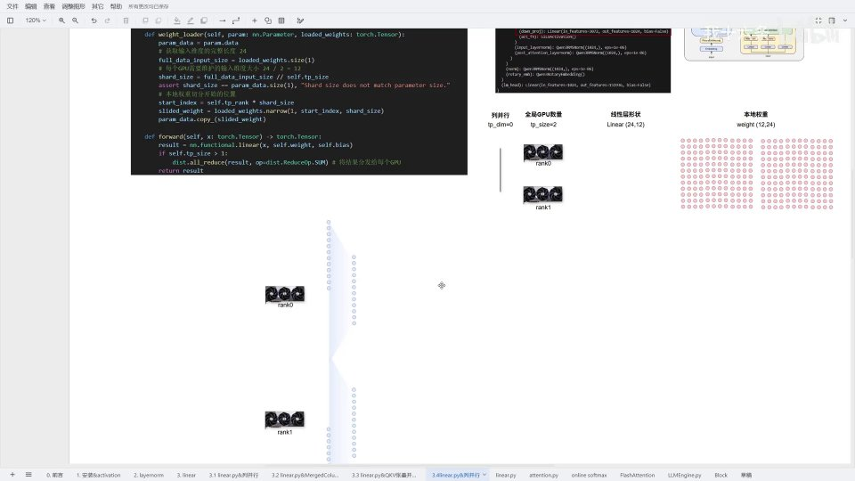 |
| 然后我们来看第二台机器。第二台机器就是 rank1，这就是剩下的这一部分，计算的结果 [【跳转到 05:18】](https://www.bilibili.com/video/BV1JAFEzPE1F/?t=318) | 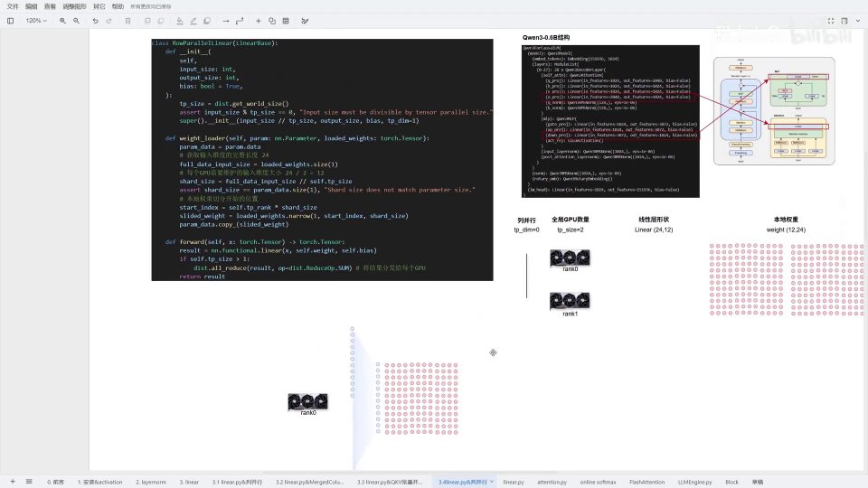 |
| 就是剩下的这一部分。 [【跳转到 05:23】](https://www.bilibili.com/video/BV1JAFEzPE1F/?t=323) | 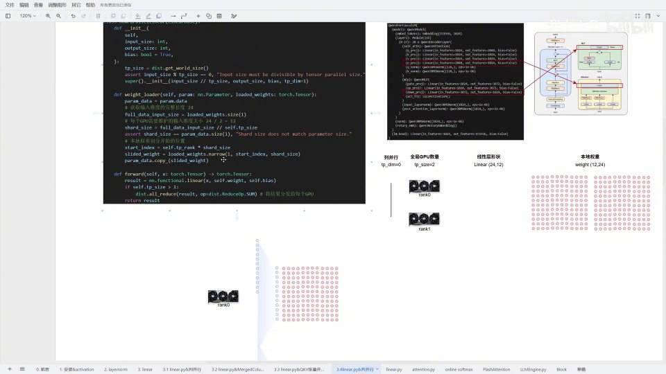 |
| 其实行并行到这就完了，只是说在最后经过前向传播之后，会做一个 all_reduce 操作，把我们的输出结果加在一起。 [【跳转到 05:28】](https://www.bilibili.com/video/BV1JAFEzPE1F/?t=328) | 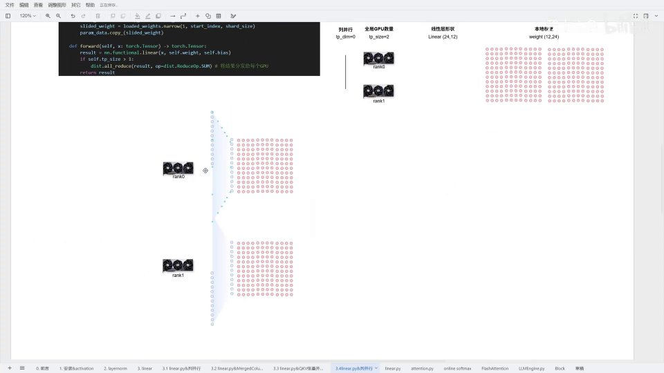 |
| 看我们这个前向传播这里其实就已经显示出来了：这里在我们做了前向传播之后， [【跳转到 05:53】](https://www.bilibili.com/video/BV1JAFEzPE1F/?t=353) | 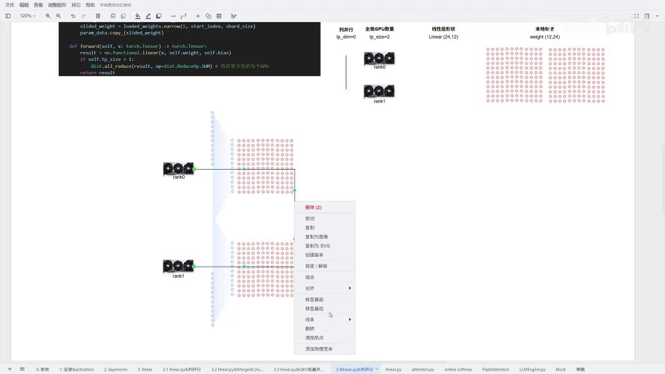 |
| 然后调用了线性层，做了一个 all_reduce，就是将加和的结果分发到每个 GPU 上去。 [【跳转到 05:58】](https://www.bilibili.com/video/BV1JAFEzPE1F/?t=358) |  |
| 因为我们每个 GPU 实际上只维护了加和的一半。本来我们前向传播是 24×12，如果是完整的线性层，它在前向传播过后，那我们的加和实际上就等于一个完整的线性层。这就是行并行做的事情，很简单。我们还是在实际应用过程中再讲一讲吧。 [【跳转到 06:08】](https://www.bilibili.com/video/BV1JAFEzPE1F/?t=368) | 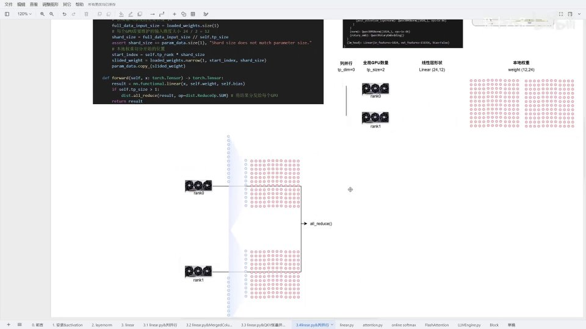 |
| 我们以线性层为例， [【跳转到 06:28】](https://www.bilibili.com/video/BV1JAFEzPE1F/?t=388) | 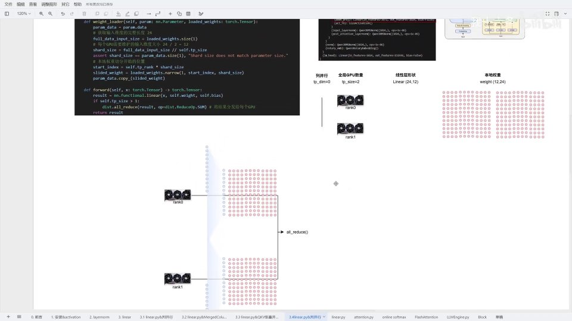 |
| 就是做了 QKV 之后，再去做 attention，最后再做 o_proj。这个地方是怎么做行并行的。 [【跳转到 06:33】](https://www.bilibili.com/video/BV1JAFEzPE1F/?t=393) | 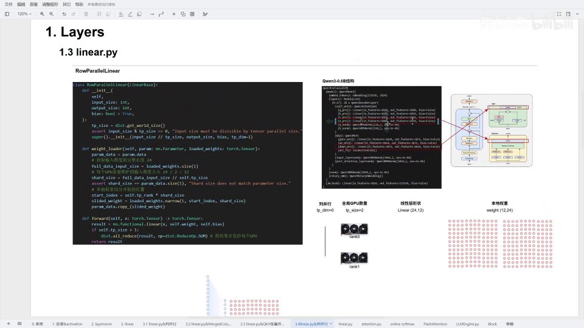 |
| 好，我们来看一下，这是一个 attention 模块。 [【跳转到 06:41】](https://www.bilibili.com/video/BV1JAFEzPE1F/?t=401) | 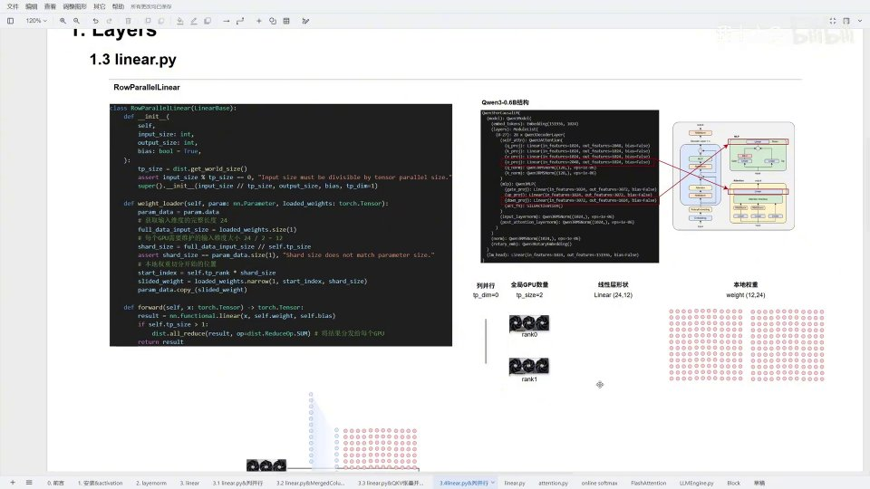 |
| 这就是 attention 内部的具体操作。attention 的内部是 Q、K 乘以 V，最后是这样做的操作。然后我们结合前面讲的 QKV 张量并行来看一下：当我们在 rank0 机器上的时候，做完列并行（就是对 QKV 那个合并的线性层），实际上就是这个。 [【跳转到 06:46】](https://www.bilibili.com/video/BV1JAFEzPE1F/?t=406) | 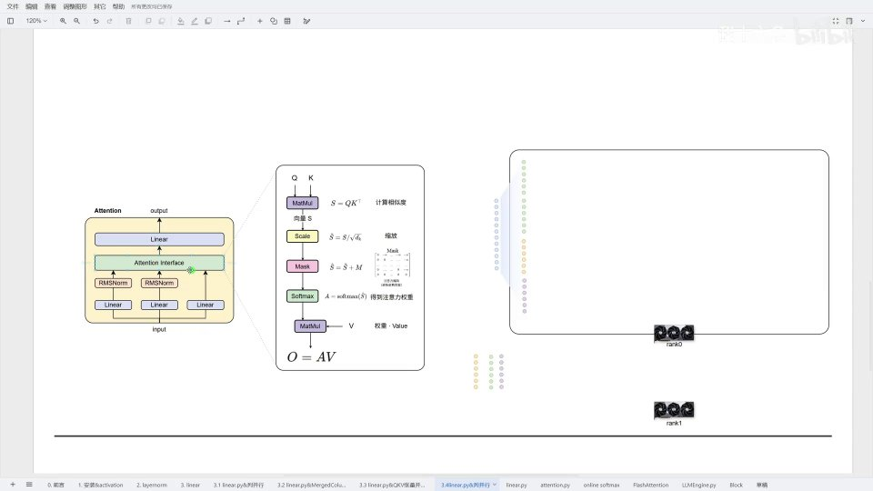 |
| 这实际上在实际计算过程中是做了一个合并。合并过后，我的 rank0 实际维护的就是这样一个矩阵，在 12×24 的情况下，也就是前面 QKV 的那种情况。好，实际上这 12 个权重就是 Q， [【跳转到 07:11】](https://www.bilibili.com/video/BV1JAFEzPE1F/?t=431) | 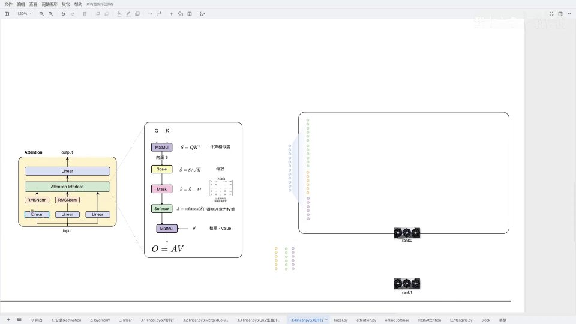 |
| 然后因为我们这里做的是多头，这个是 K，这个权重就是 V，而且因为用了 GQA，我们上一节也讲了，Q 头实际上是 K 头的两倍。实际计算过程中，为了对齐，会把 K 头进行复制， [【跳转到 07:36】](https://www.bilibili.com/video/BV1JAFEzPE1F/?t=456) | 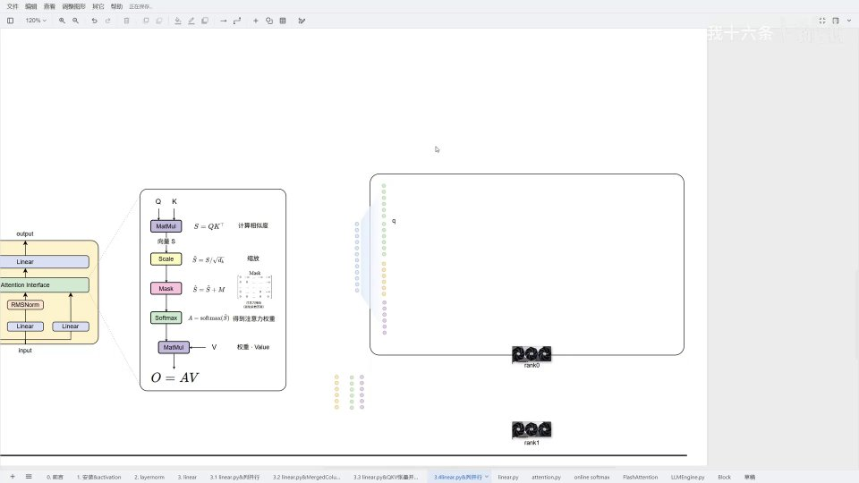 |
| 不仅 K 头，V 头也会复制，为了和 Q 头保持一致。所以最后在前向传播的过程中，就是 Q 乘以 K、再乘以 V，只不过这个 K 是复制过的，相当于原本只有一个头，需要经过一个 repeat 进行复制。这一块其实我之前讲 GQA 时也说过很多遍了，看了应该就能理解它这个地方具体是怎么做的。做完之后，前向传播 QKV 完成，最后输出的是一个 O。这一块还是写一个 O，写一个 O 在这。 [【跳转到 08:01】](https://www.bilibili.com/video/BV1JAFEzPE1F/?t=481) |  |
| 做完之后，前向传播 QKV 完成，最后输出的是一个 O，这一块还是写一个 O 在这。 [【跳转到 08:26】](https://www.bilibili.com/video/BV1JAFEzPE1F/?t=506) | 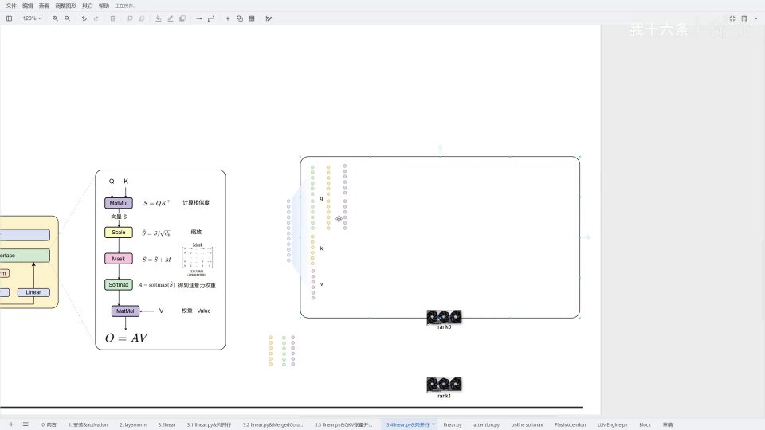 |
| 然后 O 在这，它继续进行前向传播。这个时候因为我们本来就做过列并行了，实际上就是在我们的输出维度做了列并行，把输出维度拆成了两个部分。但我们在做行并行时需要对输入维度做拆分，而因为列已经做过一次 [【跳转到 08:51】](https://www.bilibili.com/video/BV1JAFEzPE1F/?t=531) | 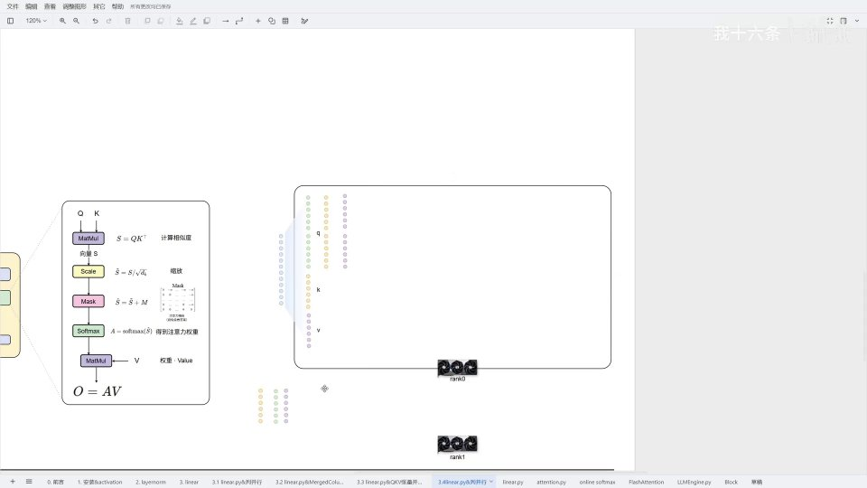 |
| 拆分，所以实际上在我们 rank0 中做行并行的时候，就已经是拆分过的那个线性层了。也就是说我们内部维护的 [【跳转到 09:16】](https://www.bilibili.com/video/BV1JAFEzPE1F/?t=556) | 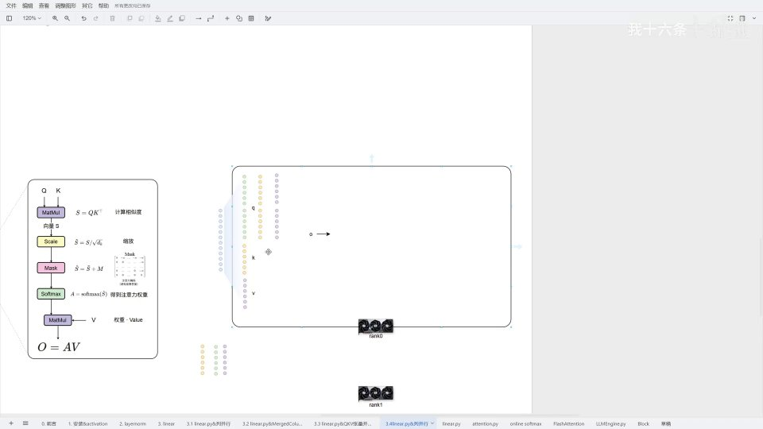 |
| 就是这样的一个线性层。那我们这个 O，在输入的维度是……我们本来输入是 12、输出也是 12 的情况下，就是这个线性层，也就是 QKV 那个线性层。那我们在这里其实也是一样的，我们这个维度就对齐了。我们的 O 就是这个计算过后的输出，实际上也是 12。维度对齐过后， [【跳转到 09:25】](https://www.bilibili.com/video/BV1JAFEzPE1F/?t=565) | 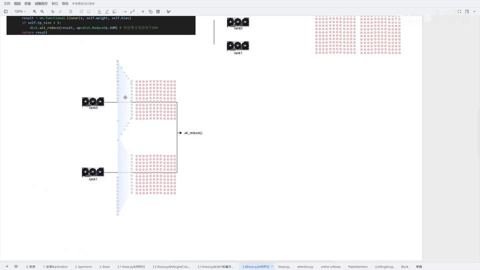 |
| 那我们这个维度就对齐了，O 就是它计算过后的输出，实际上也是 12。 [【跳转到 09:30】](https://www.bilibili.com/video/BV1JAFEzPE1F/?t=570) | 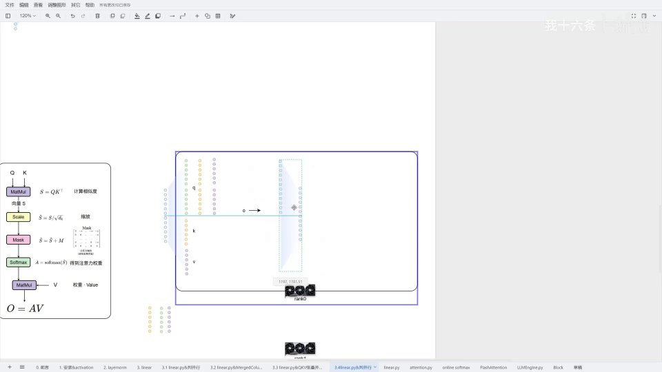 |
| 我们这个权重也是处于一个已经加载好的状态，包括这两个线性层，实际上权重都已经加载好了。然后我们的输出就是 12。这个时候我们得到的这个 O，然后直接输入到最后的一个线性变换，也就是这一层：经过 attention 得到 O，再乘以这个线性变换，实际上就得到了我们最后的 output，也就是最后的隐藏状态， [【跳转到 09:55】](https://www.bilibili.com/video/BV1JAFEzPE1F/?t=595) |  |
| 真正输出的那个隐藏状态。但是我们在这个地方，因为只是 rank0 的这一部分，它其实只做了一半的计算，rank1 上面还有，所以这个时候就需要做一个 all_reduce，把 rank1 的 output 加进来。两个 output 做个标记区分一下，就是 output0 和 output1， [【跳转到 10:20】](https://www.bilibili.com/video/BV1JAFEzPE1F/?t=620) | 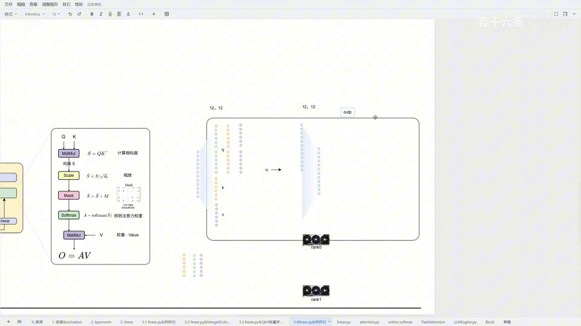 |
| 实际上它们就是做了一个加和，实际上就是做了这么一回事。然后在 GPU 1 上、rank1 上面其实也是这样的，最后做了一个 all_reduce，把它们加在一起。 [【跳转到 10:45】](https://www.bilibili.com/video/BV1JAFEzPE1F/?t=645) | 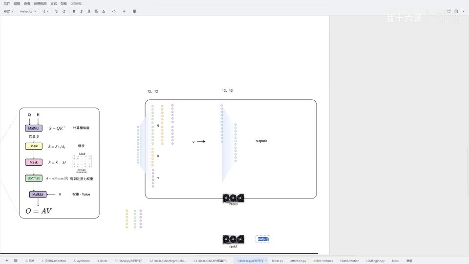 |
| 这个其实就是在实际应用中，在 Qwen 0.6B 的代码中，它其实也是这样做的。我们现在可以再去看一下。 [【跳转到 11:10】](https://www.bilibili.com/video/BV1JAFEzPE1F/?t=670) | 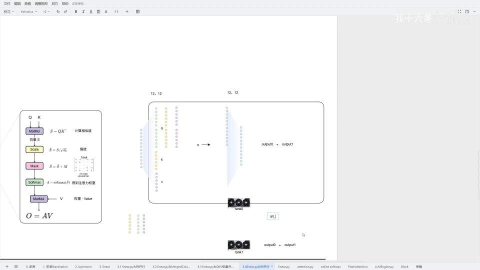 |
| 比如说我们这个行并行，它实际上在这个 Qwen 模型中 [【跳转到 11:23】](https://www.bilibili.com/video/BV1JAFEzPE1F/?t=683) | 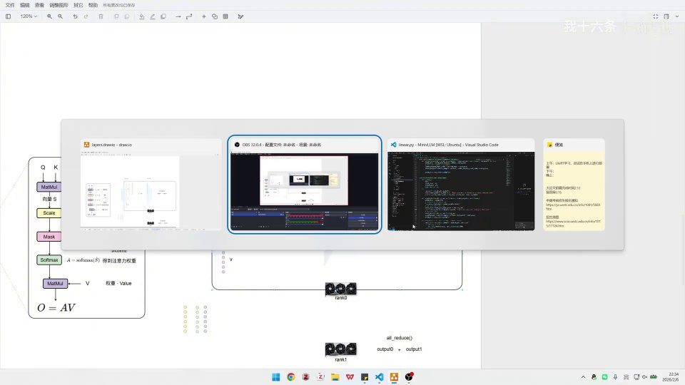 |
| 是有两个地方做了定义：一个是 o_proj，还有一个就是上采样和下采样，刚才也说过。我们看一下具体的实现：他这里是做了 QKV，然后在最后这个 O 做了一个 o_proj。其实它内部在前向传播的时候就做了一次 all_reduce，相当于把所有的输出都做了一次整合。 [【跳转到 11:28】](https://www.bilibili.com/video/BV1JAFEzPE1F/?t=688) | 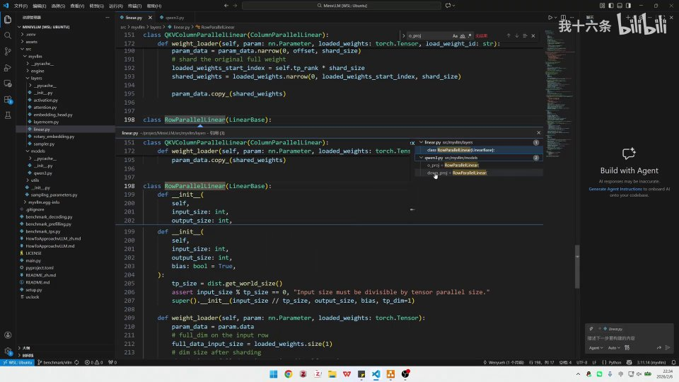 |
| 这样做的好处是：因为我们原本做列并行，做完之后是需要做一次 all_gather 的；但这个地方因为我们在同一个 GPU 内，做完列并行过后，实际上就可以直接再做一次行并行，相当于减少了一次 all_gather 的通信。这样的设计可以提高通信效率， [【跳转到 11:52】](https://www.bilibili.com/video/BV1JAFEzPE1F/?t=712) |  |
| 让计算更高效，只需要最后做一次 all_reduce 就可以了。包括下采样这个地方其实也是一样的。 [【跳转到 12:17】](https://www.bilibili.com/video/BV1JAFEzPE1F/?t=737) | 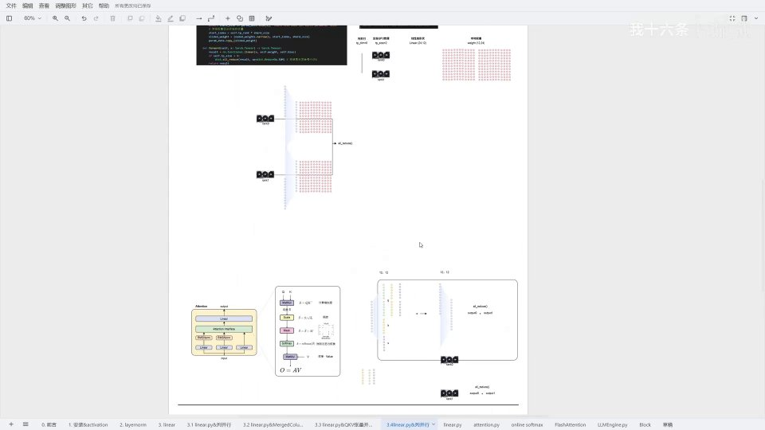 |
| 只是我们这里举的例子是以 attention 为例的。 [【跳转到 12:24】](https://www.bilibili.com/video/BV1JAFEzPE1F/?t=744) | 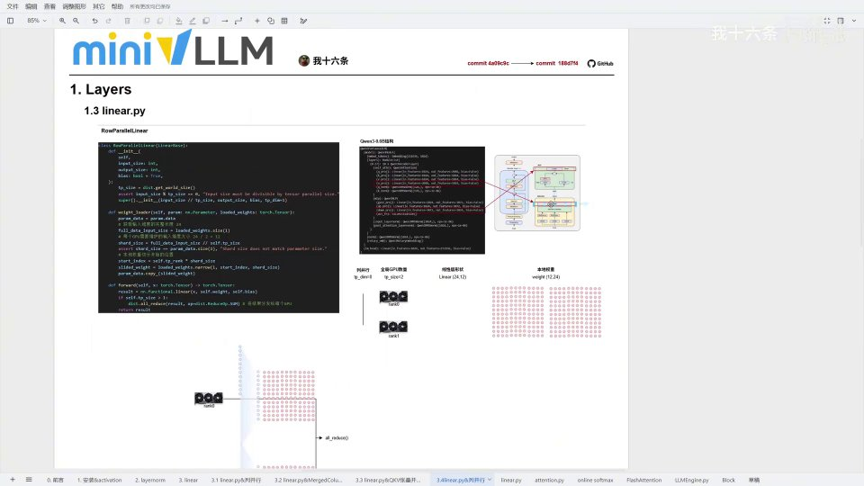 |
| 然后这一块是 attention 内部具体的计算算子，感兴趣的话可以去看我做的那个 attention 算子讲解。linear 这一块其实就已经讲完了。 [【跳转到 12:29】](https://www.bilibili.com/video/BV1JAFEzPE1F/?t=749) | 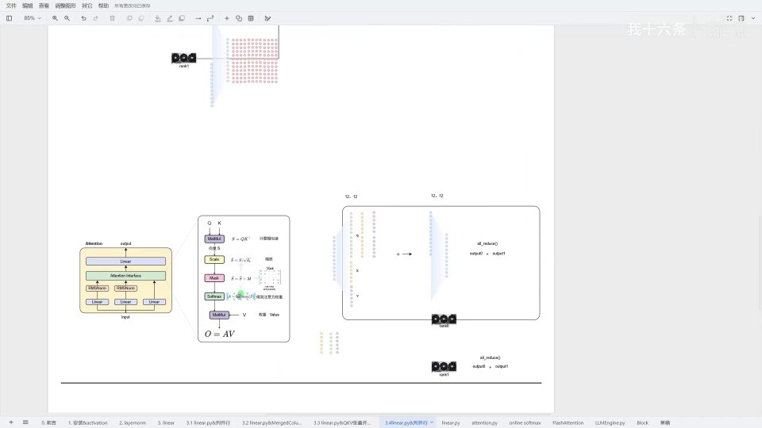 |
| 今天总算把 linear 的内容给讲完了。还有一点就是 MiniVLLM， [【跳转到 12:42】](https://www.bilibili.com/video/BV1JAFEzPE1F/?t=762) | 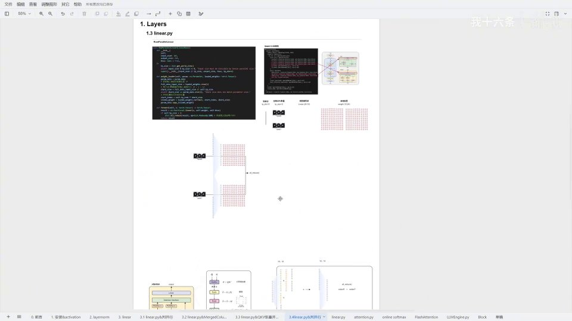 |
| 我之前其实提过一个 TP test 的代码，这个代码最近一直没有审，我也没有去合并，因为需要一个分布式的环境，我现在电脑上也没有这个分布式环境。如果你们有单机多卡的情况，可以自己去做一下测试，把这个代码粘下来，放到那个后边就可以了。 [【跳转到 12:48】](https://www.bilibili.com/video/BV1JAFEzPE1F/?t=768) |  |
| 如果你们自己有一个分布式环境的话，可以去做一个测试。 [【跳转到 13:08】](https://www.bilibili.com/video/BV1JAFEzPE1F/?t=788) | 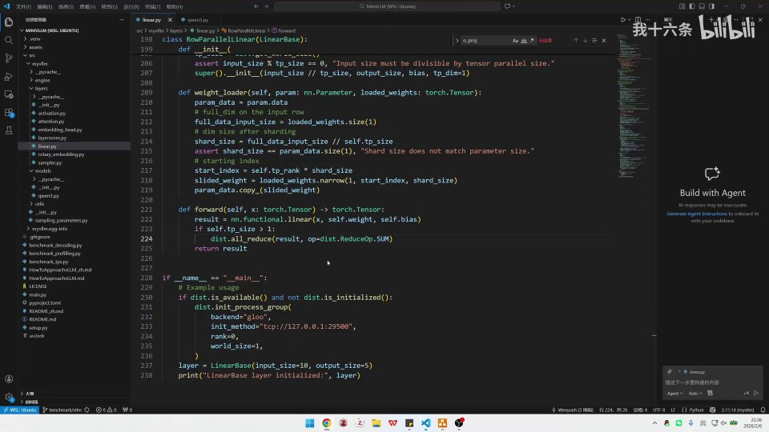 |
| 实际上我们看这块，它最后做完分布式测试之后会有四个输出，分别测试的是四种矩阵。只要这个 allclose，就代表我们的计算结果——切分前和切分后的计算精度是在一个可控的阈值内，那我们就认为结果是一致的，输出是对的，就说明测试结果正常。你们下来感兴趣的话 [【跳转到 13:14】](https://www.bilibili.com/video/BV1JAFEzPE1F/?t=794) | 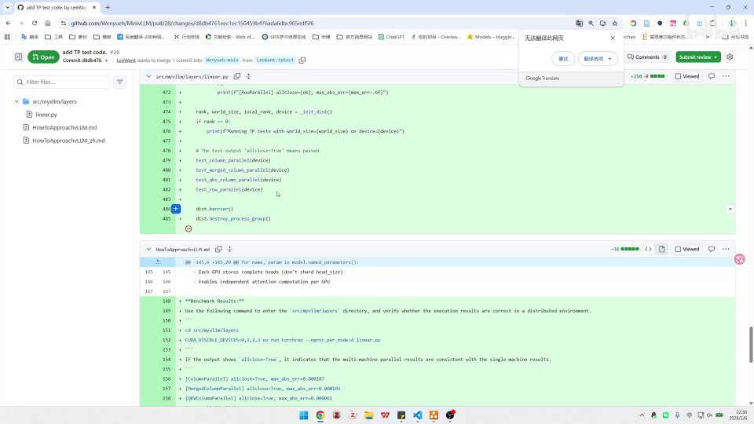 |
| 可以去看一看，这个之后应该会被通过，只不过目前还暂时没有通过。OK，今天就这样吧。 [【跳转到 13:39】](https://www.bilibili.com/video/BV1JAFEzPE1F/?t=819) | 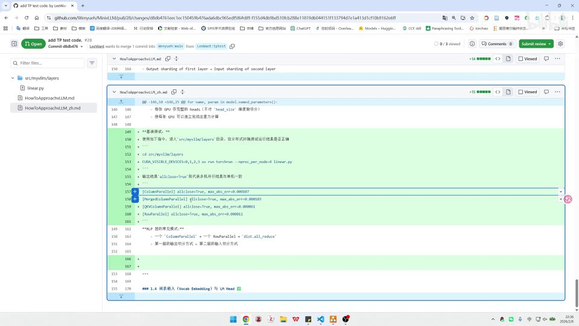 |
| （此区间无字幕） [【跳转到 13:47】](https://www.bilibili.com/video/BV1JAFEzPE1F/?t=827) | 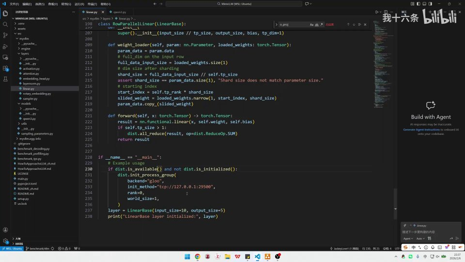 |