# embedding_head.py&嵌入层并行&VocabParallelEmbedding 原始文稿（图-字幕分栏）

| 字幕文本 | 画面 |
| :--- | ---: |
| 好，我们现在开始分享 1.4，也就是 embedding_head.py 这个文件的编写。今天主要讲 VocabParallelEmbedding，也就是词表并行嵌入。这一章我写得很详细，待会儿深入细节时，看这一章应该会让你对 embedding 层、特别是在并行情况下，有一个比较深刻的理解。 [【跳转到 00:00】](https://www.bilibili.com/video/BV1xxcFzbEcb/?t=0) |  |
| 我们还是老样子：先看结构，再看源码，最后讲例子。好，我们先来看结构。 [【跳转到 00:25】](https://www.bilibili.com/video/BV1xxcFzbEcb/?t=25) | 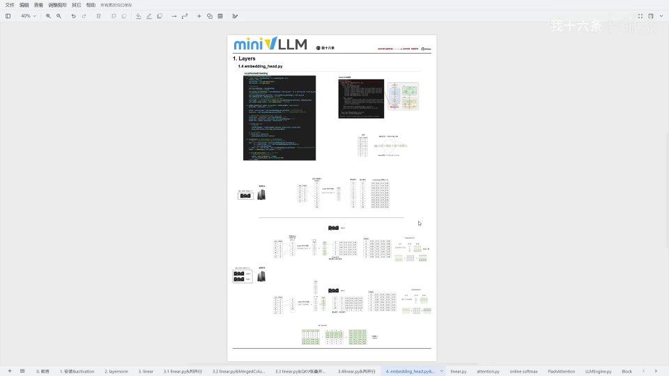 |
| 这个 embedding 层在 Qwen 0.6B，也就是 Qwen3 里，它用的那个词表， [【跳转到 00:37】](https://www.bilibili.com/video/BV1xxcFzbEcb/?t=37) | 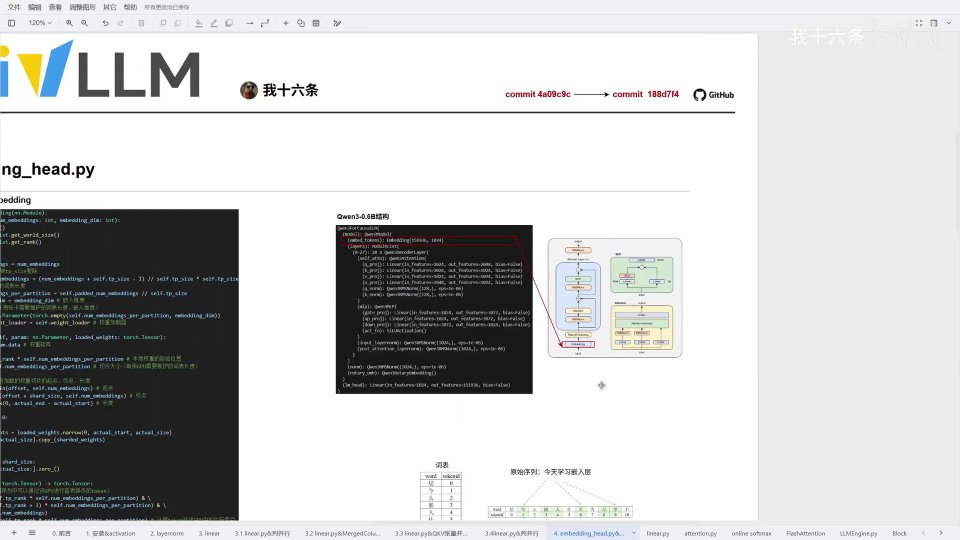 |
| 长度大概是 15 万 1000 多，嵌入维度是 1024。我觉得能看到这里的，应该都理解词表到底是什么，也包括嵌入维度（也就是词向量）。如果对这一块不太理解，可以再去看一下大模型的一些基础知识。我们今天讲的这个模块，主要是在输入之后做的 embedding， [【跳转到 00:42】](https://www.bilibili.com/video/BV1xxcFzbEcb/?t=42) |  |
| 也就是词嵌入，把我们的 token 转换成嵌入维度。好，我们来看源码。 [【跳转到 01:07】](https://www.bilibili.com/video/BV1xxcFzbEcb/?t=67) | 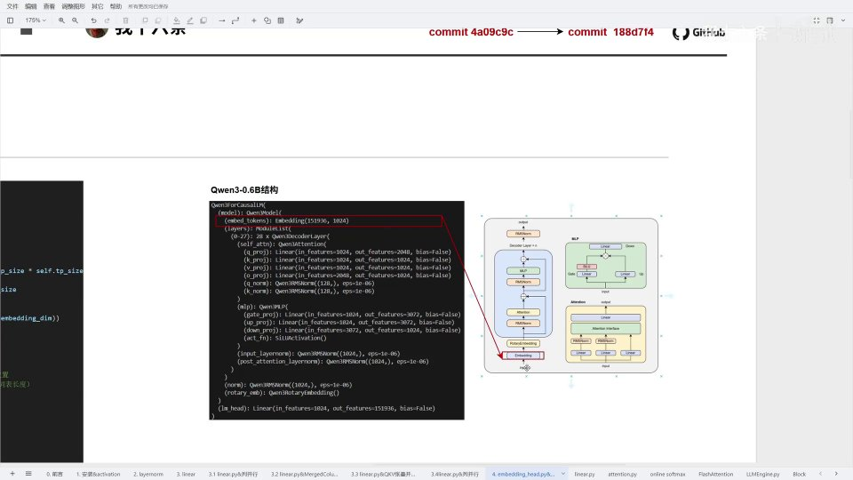 |
| 词表并行的源码，我们还是先从初始化看起。初始化时会传入两个参数：一个是 num_embeddings，另一个是 embedding_dim， [【跳转到 01:16】](https://www.bilibili.com/video/BV1xxcFzbEcb/?t=76) | 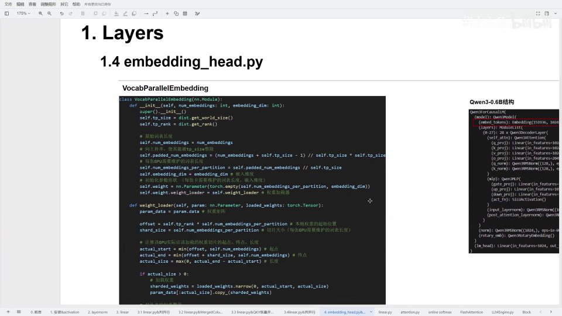 |
| 以及这个嵌入维度。num_embeddings 就是我们的词表长度。 [【跳转到 01:24】](https://www.bilibili.com/video/BV1xxcFzbEcb/?t=84) | 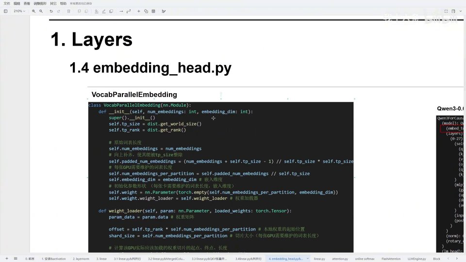 |
| 我们继续看。这里维护了一个原始的词表长度， [【跳转到 01:29】](https://www.bilibili.com/video/BV1xxcFzbEcb/?t=89) | 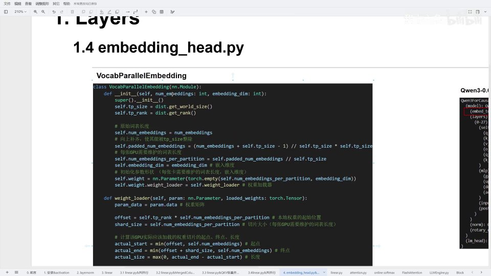 |
| 而这个 padded_num_embeddings 是做了一次向上补齐。因为我们并不确定全局的 TP size 是多少，所以为了让这个数能被 TP size 整除，这里做了一次向上取整。比如原本是 11，TP size 为 2 时，11÷2 除不尽，于是 11+2-1=12，12÷2 就能整除了。 [【跳转到 01:34】](https://www.bilibili.com/video/BV1xxcFzbEcb/?t=94) |  |
| 这就是做了一次向上取整、向上补齐。然后 num_embeddings_per_partition 就是每一张 GPU 需要维护的词表长度，用补齐后的长度除以 TP size。接着 embedding_dim 就是我们的嵌入维度，也就是词向量的长度。然后这里初始化了一个参数，形状是 [【跳转到 01:59】](https://www.bilibili.com/video/BV1xxcFzbEcb/?t=119) | 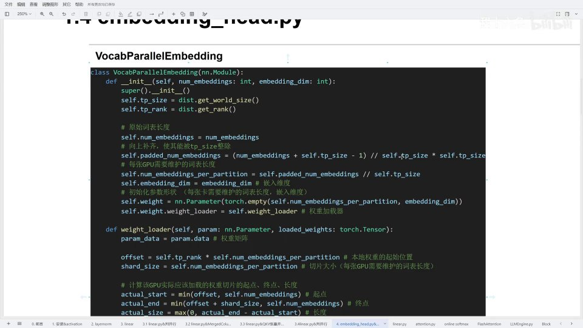 |
| 每张卡需要维护的词表长度 × 嵌入维度。比如原本词表长度是 24，除以 tp_size（2）得 12，那参数形状就是 12 × 4（假设嵌入维度是 4）。这里就是权重加载器，因为词表其实也是以权重的形式表示的， [【跳转到 02:24】](https://www.bilibili.com/video/BV1xxcFzbEcb/?t=144) | 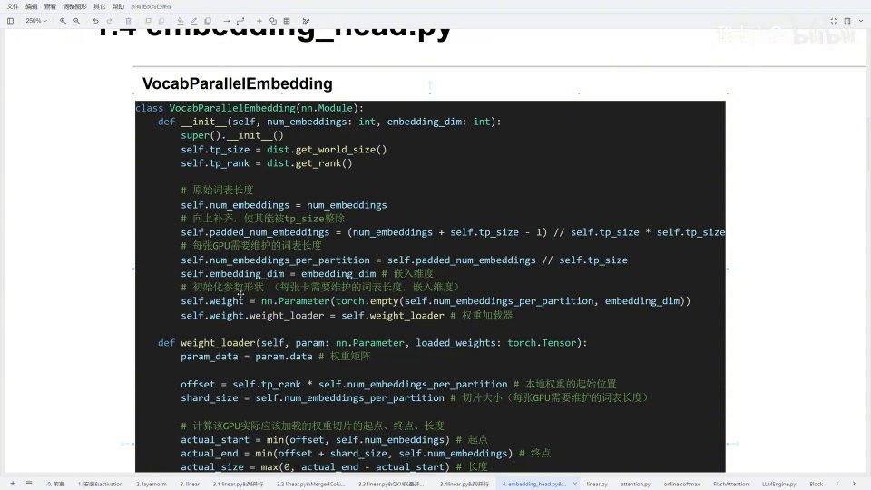 |
| 然后在本地做一个存储。 [【跳转到 02:49】](https://www.bilibili.com/video/BV1xxcFzbEcb/?t=169) | 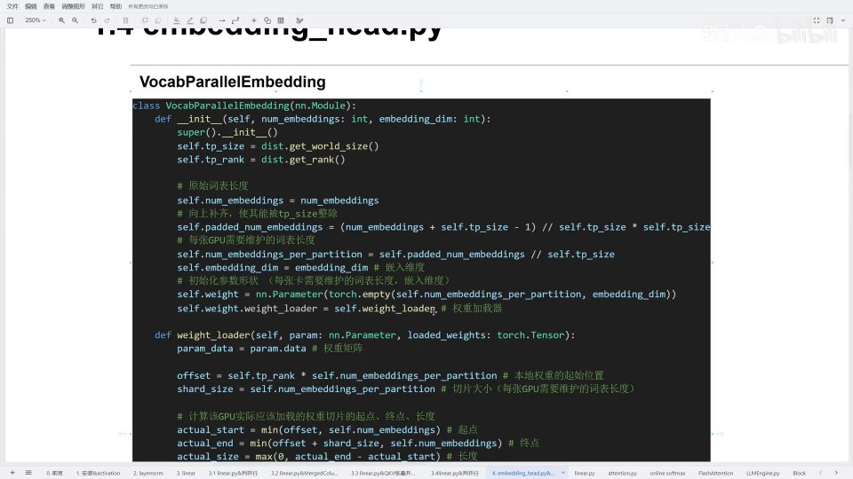 |
| 我们来看这个权重加载。这里还是维护了一个权重矩阵。这个 offset 就是在计算本地权重的起始位置。因为我们当前 GPU 要从哪里开始切本地权重，需要用 tp_rank 乘以每张 GPU 维护的那部分大小。比如词表长度是 24 时，每片是 12；tp_rank 为 0 就是 0×12， [【跳转到 02:54】](https://www.bilibili.com/video/BV1xxcFzbEcb/?t=174) | 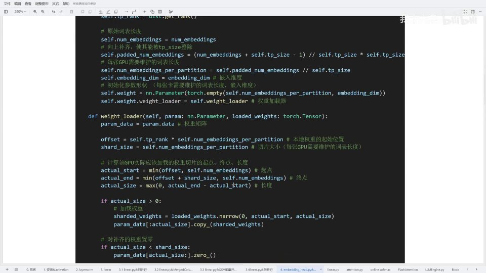 |
| 也就是从第 0 号位置开始取；如果是 rank1，就是 1×12，也就是把 GPU0 的那一段排除掉，直接从第 12 号开始取。shard_size 就是我们切片的大小，实际上等于每张 GPU 需要维护的切片大小。但因为我们做了向上补齐，在补齐的情况下，需要对补齐的那部分维度做一个取零， [【跳转到 03:19】](https://www.bilibili.com/video/BV1xxcFzbEcb/?t=199) |  |
| 比如词表原本是 11，补齐成 12，那第 12 个 token 就要做补零操作。具体其实就是在这个地方做了一个补零操作。然后这个地方是在算我们本地实际存储的那一片的长度。因为补齐后是 12，而本地是 11，所以在第一张 GPU（rank0）上， [【跳转到 03:44】](https://www.bilibili.com/video/BV1xxcFzbEcb/?t=224) | 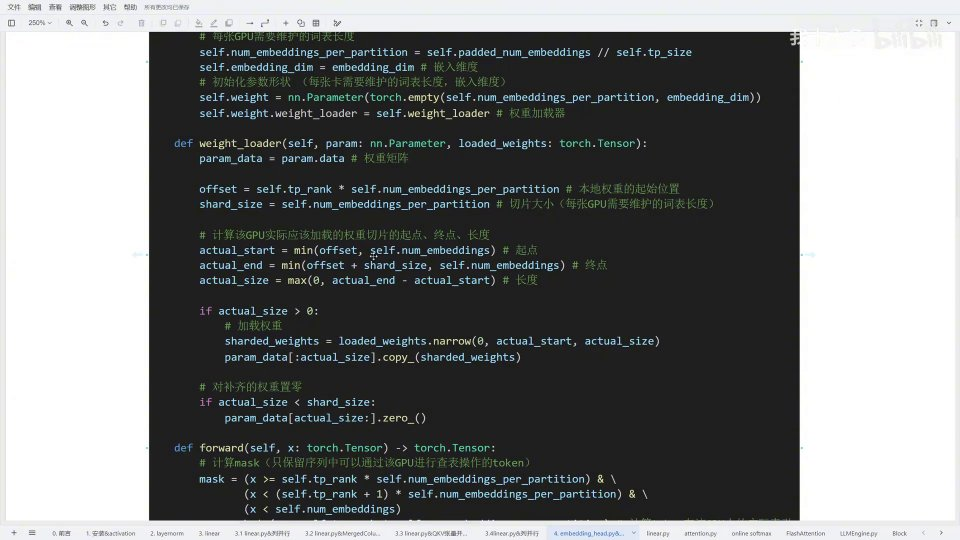 |
| 它实际加载的是 0~6；对 rank1（第二张 GPU）来说，实际加载的是 6~10，第 11 个是不会加载的，第 11 个就在这个地方补了一个零。actual_start 实际上是在计算我们实际的起点位置，它取 offset 和 num_embeddings（实际词表长度）里的最小值。然后这个 end 就是我们实际要切的 [【跳转到 04:09】](https://www.bilibili.com/video/BV1xxcFzbEcb/?t=249) |  |
| 终点，也就是本地真正要切的停止位置，这样可以避免溢出。actual_size 就是我们实际切的长度，用实际终点减去实际起点。待会我们举具体例子来讲，这一块应该会理解得比较深刻。然后这里就是加载权重，按照权重切分，其实和我们之前讲的没有太大区别。 [【跳转到 04:34】](https://www.bilibili.com/video/BV1xxcFzbEcb/?t=274) | 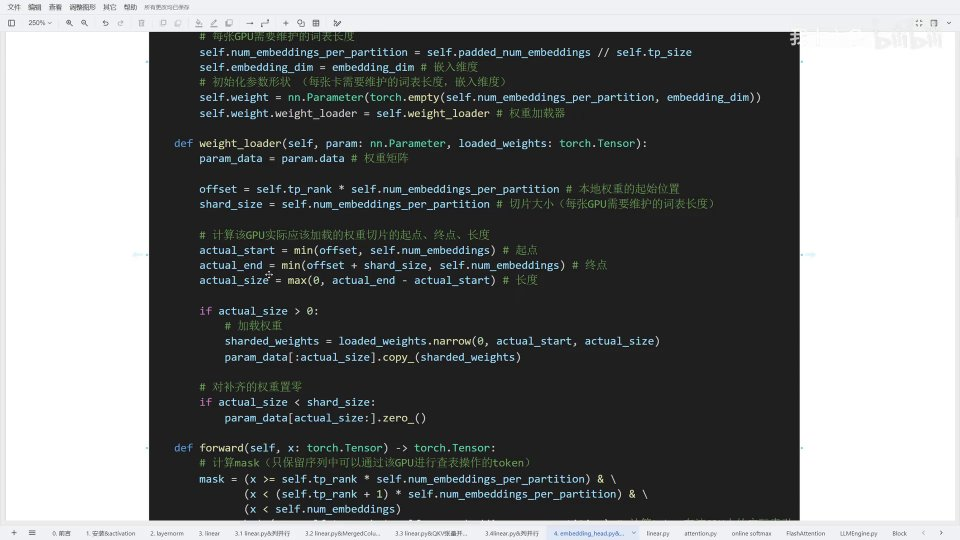 |
| 然后这里的 narrow(0, ...) 实际上是沿着权重的输出维度、也就是第一个维度切，因为这个地方它并不是一个线性层。本地存储的时候是按词表长度来的，比如词表形状是 12×4，那 narrow 就沿着 12 这个维度切分，相当于沿行的维度区分， [【跳转到 04:59】](https://www.bilibili.com/video/BV1xxcFzbEcb/?t=299) |  |
| 好，我们继续讲。这个补零我们刚才都讲过了：因为切片时，为了权重能被正常整除，我们会维护一个可能比原始权重更大的词汇表；对超出原始词表的那一部分， [【跳转到 05:24】](https://www.bilibili.com/video/BV1xxcFzbEcb/?t=324) | 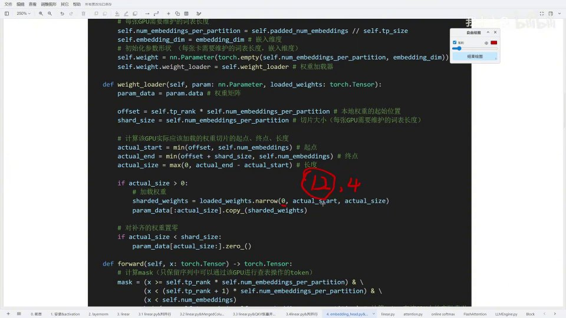 |
| 就做补零操作，避免取值时内存溢出，也保证计算确实能被并行。然后这个地方就是前向传播。在并行情况下，需要通过 mask 来确定每一片 GPU 上哪些权重真正属于该片。我们还是举例来讲。比如 x 的 token 假设是 4， [【跳转到 05:49】](https://www.bilibili.com/video/BV1xxcFzbEcb/?t=349) |  |
| 那当 tp_rank 等于 0、总词表大小是 12 时，我 rank0 实际维护的词表大小是 0~6，这种情况它肯定在 0~6 区间内。用代码怎么写呢？就是这个 x 在本张 GPU 上，也就是 0，乘以本张 GPU 应该维护的长度， [【跳转到 06:14】](https://www.bilibili.com/video/BV1xxcFzbEcb/?t=374) | 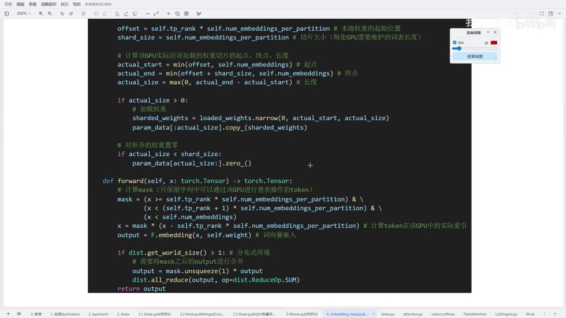 |
| 这里是 6，0×6 等于 0，那 x 大于等于 0 就满足了下界，只要在 0~6 区间内。然后我们还要判断上界，就是 (当前 rank+1) 乘以维护长度，找到它停止的位置，先确定在这个区间内。这里做的 x < self.num_embeddings 是为了避免切片之后的问题，比如在最后一片 GPU 上， [【跳转到 06:39】](https://www.bilibili.com/video/BV1xxcFzbEcb/?t=399) | 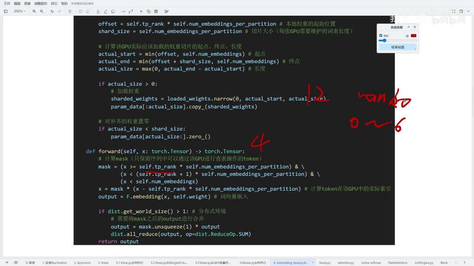 |
| 如果你不在最后一片 GPU 上，前两个条件满足其实就在区间内了。但如果我们在 rank1（两张 GPU 的情况）上，词表原本是 11、补到了 12，那 rank1 实际维护的词表就只有从第七个到第 11 个，第 12 个位置其实是空的，它不是一个实际的嵌入维度。 [【跳转到 07:04】](https://www.bilibili.com/video/BV1xxcFzbEcb/?t=424) | 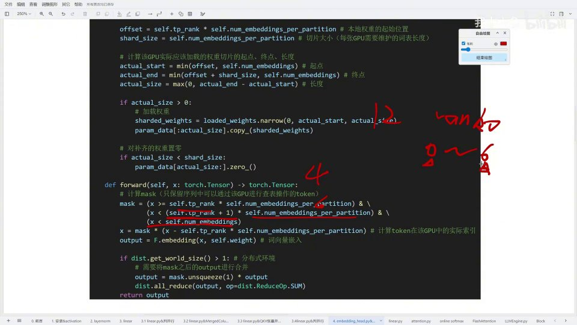 |
| 所以这里要求 x 小于等于 num_embeddings（实际是 11）就可以了，说明这个 token 在这个范围内，不会越界。所以它就是做了这么一件事。因为我们用 mask 算出了 [【跳转到 07:29】](https://www.bilibili.com/video/BV1xxcFzbEcb/?t=449) | 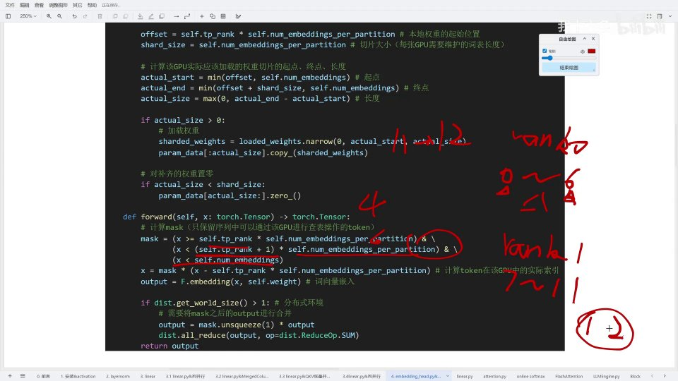 |
| 当前 GPU 维护的那个布尔表。原本传入的是一个 token 序列，我们需要确定当前 GPU 具体是哪几个 token 在本地做嵌入，也就是计算 token 在该 GPU 中的实际索引。然后这个地方就是实际去做嵌入计算了。 [【跳转到 07:45】](https://www.bilibili.com/video/BV1xxcFzbEcb/?t=465) | 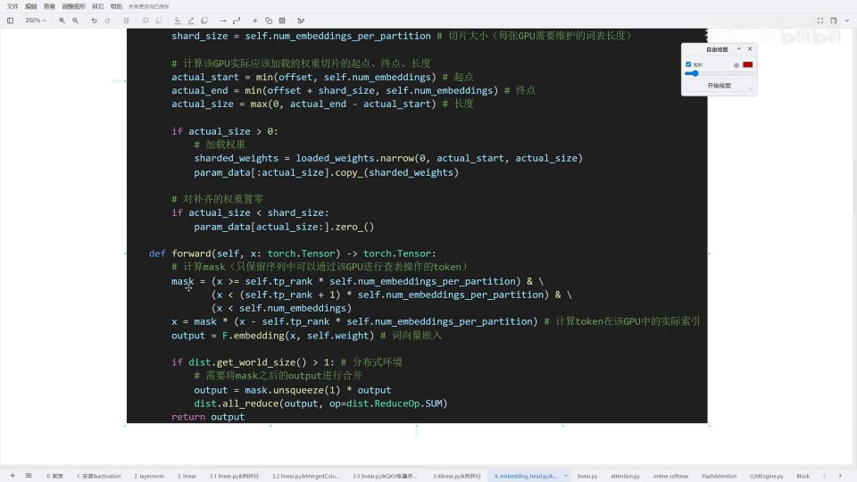 |
| 但在分布式环境中有一点区别：它通过 get_world_size 大于 1 判断是分布式环境。分布式环境中，每一片 GPU 实际计算的是不同的 token，最后需要通过一次 all_reduce 把所有 token 加起来，就可以继续前向传播了。这实际上就是整个 VocabParallelEmbedding 的源码。可能光这样说还有点难以理解， [【跳转到 08:10】](https://www.bilibili.com/video/BV1xxcFzbEcb/?t=490) |  |
| 我们还是结合具体的例子去看一下。首先还是看一下词表。 [【跳转到 08:31】](https://www.bilibili.com/video/BV1xxcFzbEcb/?t=511) | 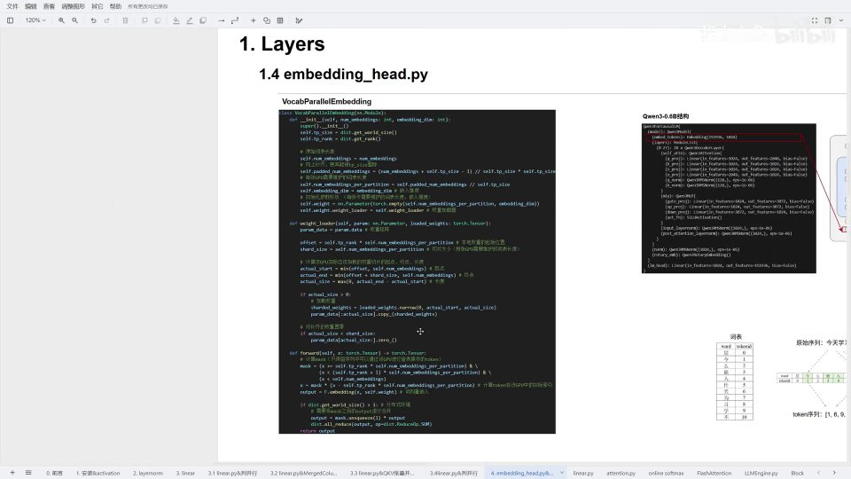 |
| 词表这个概念我想不需要太过于普及，但还是简单说一下。 [【跳转到 08:36】](https://www.bilibili.com/video/BV1xxcFzbEcb/?t=516) | 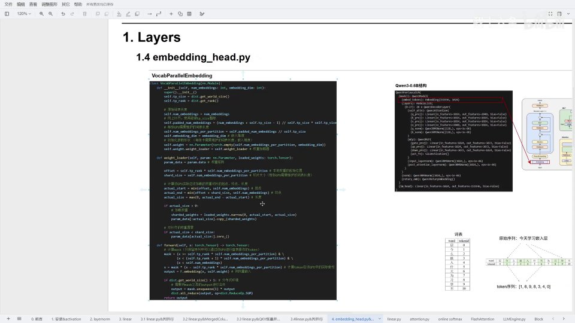 |
| 假设我们现在有一个长度为 11 的词表，从 0 到 10 刚好 11 个，每一个单词对应一个 token id。假设我们原始输入的序列是「今天学习嵌入层」，把这个序列转化成 token 的过程就叫 tokenize。那具体是怎么转的呢？ [【跳转到 08:41】](https://www.bilibili.com/video/BV1xxcFzbEcb/?t=521) | 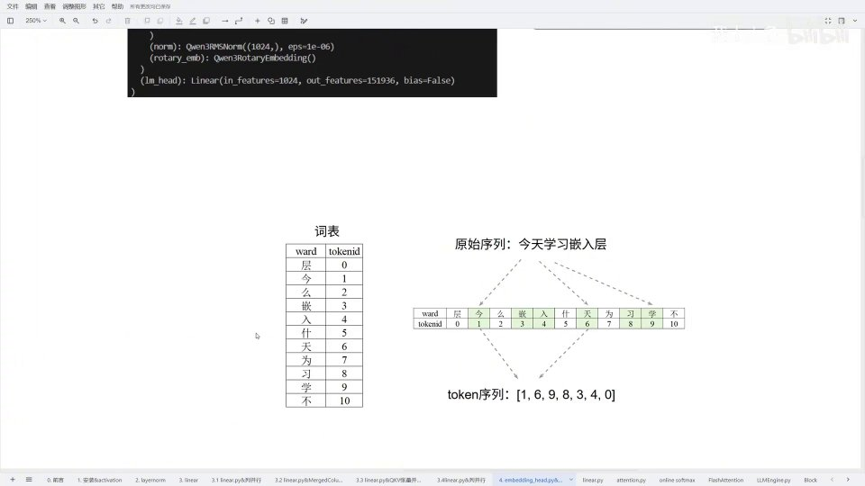 |
| 其实就是一个查表操作：今对应这个、天对应这个……学习对应这个，大概就是这个意思，应该能理解。那我们拿到这个 token 序列之后又做了什么事呢？我们还是以例子来看。 [【跳转到 09:06】](https://www.bilibili.com/video/BV1xxcFzbEcb/?t=546) | 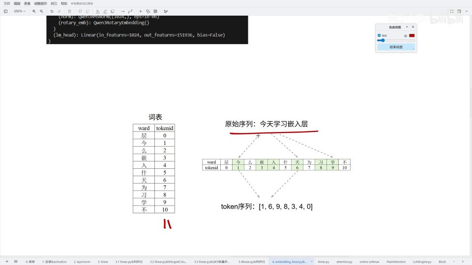 |
| 先看单机单卡的情况，也就是全局 get_world_size 等于 1、只有一张 GPU 的时候。 [【跳转到 09:29】](https://www.bilibili.com/video/BV1xxcFzbEcb/?t=569) | 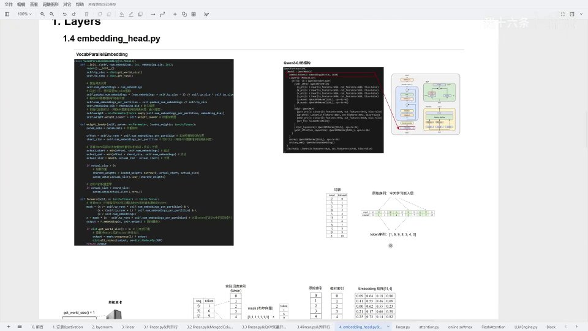 |
| 我们还是以传入一个序列「今天学习嵌入层」为例。 [【跳转到 09:34】](https://www.bilibili.com/video/BV1xxcFzbEcb/?t=574) | 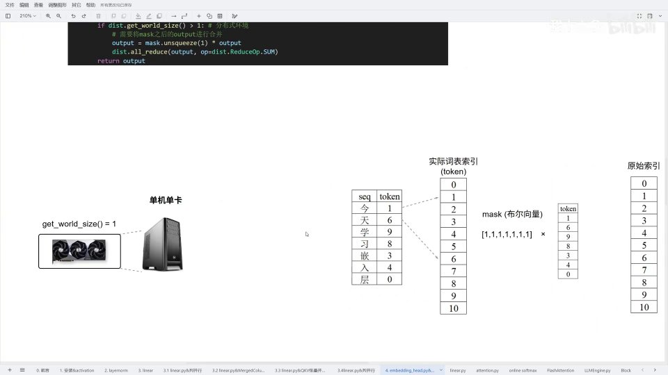 |
| 先把它转换成 token，实际的词表索引是 0~10。进来之后，因为我们是单卡，它其实也会进这个 mask，但这个 mask 在单卡过程中起不了太大作用，主要还是在分布式环境里用。这里它做了一个布尔向量，确定我所有的 token 都在这个词表上——因为是单卡，所以 mask 算出来全是一， [【跳转到 09:39】](https://www.bilibili.com/video/BV1xxcFzbEcb/?t=579) | 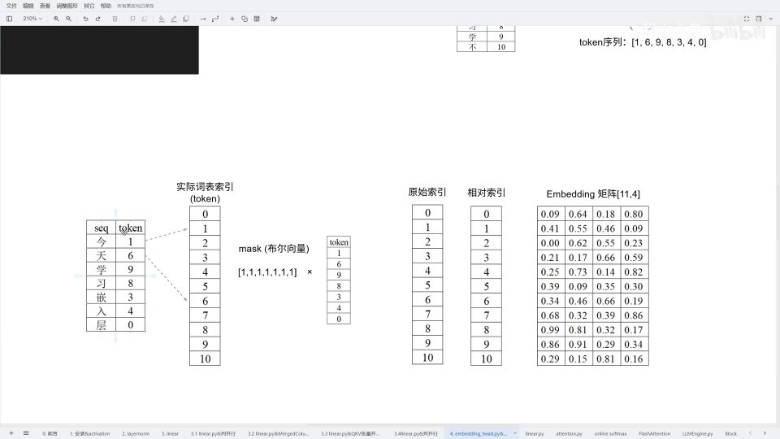 |
| 一个全为 true 的布尔向量，再乘以我们的 token，就说明这张 GPU 维护了该序列的所有 token，包括我们的原始索引和相对索引。这个在分布式环境里会区分得更明显，单机单卡时原始索引其实就等于相对索引。它实际上做的就是查表：从索引一开始查， [【跳转到 10:04】](https://www.bilibili.com/video/BV1xxcFzbEcb/?t=604) | 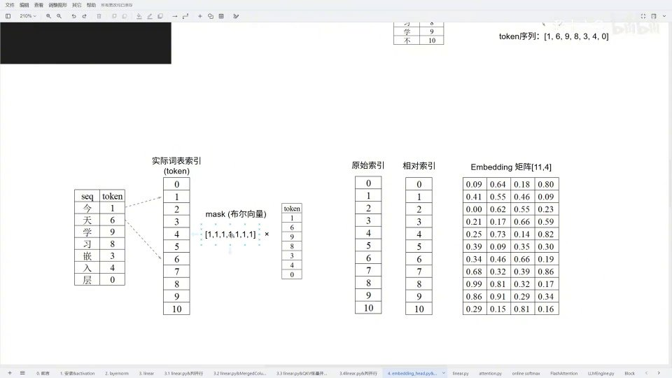 |
| 找到的一就在这个位置，嵌入时 token1 就是这个；token6 就找这，这个就是它的相对索引。但因为我们是单机单卡，相对索引等于原始索引，也就是实际的原始词表索引，比如 9 就查这、8 就查这。查完嵌入之后，就得到一个完整的嵌入词向量了。 [【跳转到 10:29】](https://www.bilibili.com/video/BV1xxcFzbEcb/?t=629) | 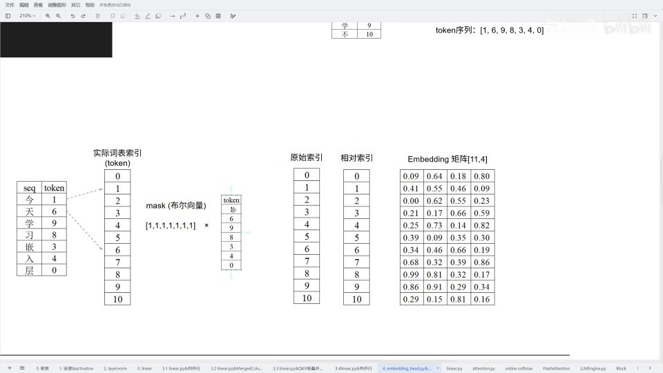 |
| 单机单卡的情况就是这样。我们重点还是讲单机多卡的情况，所以单机单卡就简单过一过。这边如果有不理解的地方，接下来讲分布式环境时 [【跳转到 10:54】](https://www.bilibili.com/video/BV1xxcFzbEcb/?t=654) | 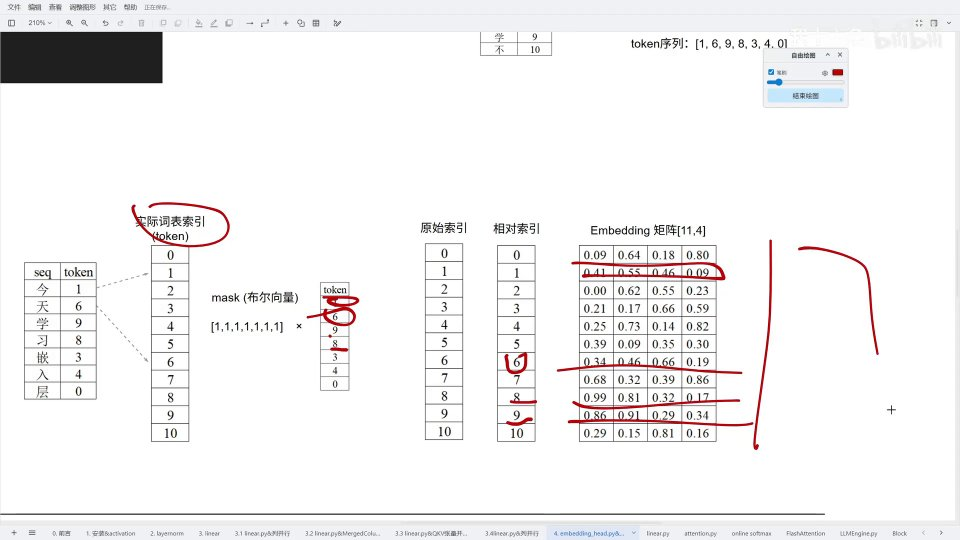 |
| 应该会有更深的理解。好，我们现在来讲分布式环节， [【跳转到 11:06】](https://www.bilibili.com/video/BV1xxcFzbEcb/?t=666) | 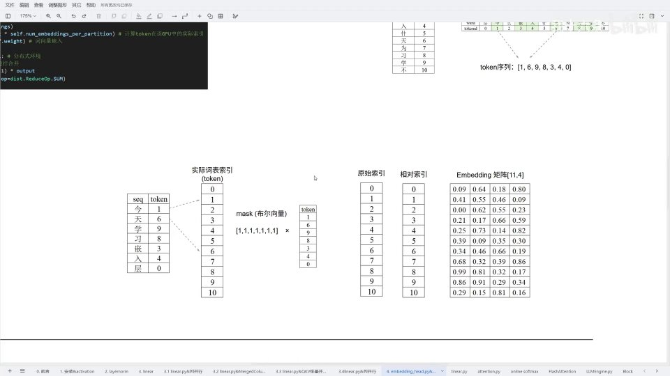 |
| 也就是单机多卡的情况。我们还是先讲权重加载。 [【跳转到 11:11】](https://www.bilibili.com/video/BV1xxcFzbEcb/?t=671) | 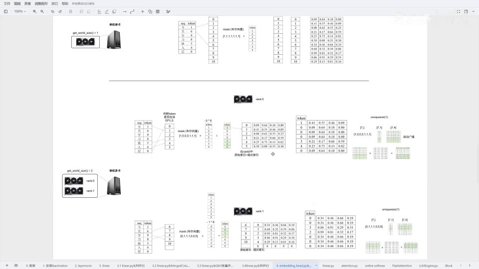 |
| 比如说这是我们本地存储的一个原始权重，我写一下它的形状，其实是 11×4。 [【跳转到 11:16】](https://www.bilibili.com/video/BV1xxcFzbEcb/?t=676) | 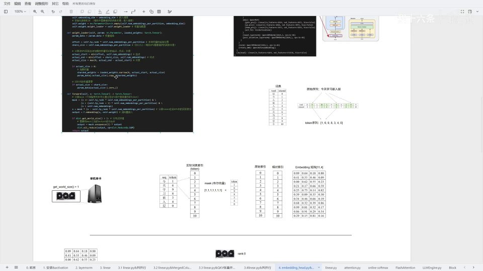 |
| 我们还是把代码粘下来看一下， [【跳转到 11:21】](https://www.bilibili.com/video/BV1xxcFzbEcb/?t=681) | 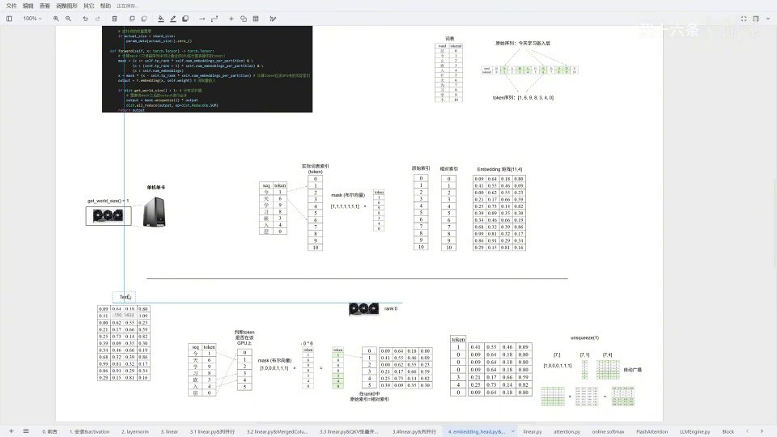 |
| 截个图吧。 [【跳转到 11:28】](https://www.bilibili.com/video/BV1xxcFzbEcb/?t=688) | 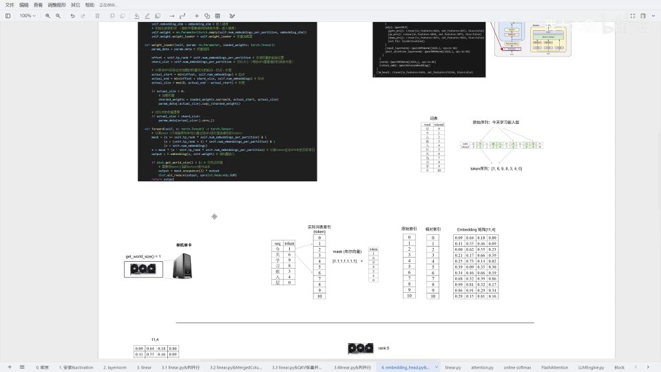 |
| 好，我们把代码粘下来，一步一步看。 [【跳转到 11:33】](https://www.bilibili.com/video/BV1xxcFzbEcb/?t=693) | 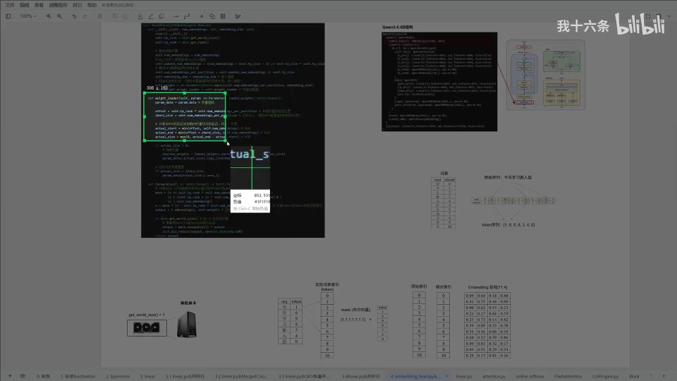 |
| 首先我们维护本地权重，比如在 rank0 的情况下，把整片权重加载进来。假设 tp_rank 等于 0，那 shard_size——因为我们做了一次向上补齐，从 11 补到了 12——再除以 tp_size（2），实际上每一片维护的就是 6。 [【跳转到 11:38】](https://www.bilibili.com/video/BV1xxcFzbEcb/?t=698) | 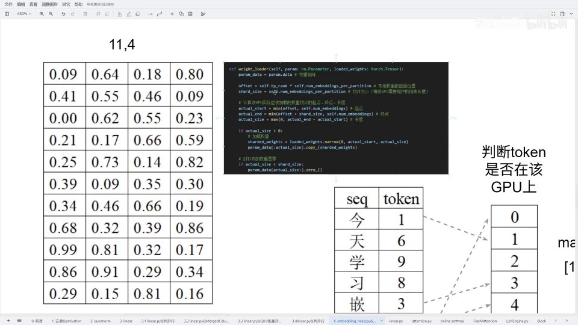 |
| 所以这个地方就是 6，shard_size 实际上就是每片需要维护的切片大小，这里是 6。offset 等于 0×6 就等于 0。然后计算该 GPU 实际应该加载的权重切片的起点、终点和长度：实际起点等于 0（0 和 11 取更小的，是 0），所以从这个位置开始；再看实际终点， [【跳转到 12:03】](https://www.bilibili.com/video/BV1xxcFzbEcb/?t=723) |  |
| 0 加上 shard_size（6）等于 6，而 num_embeddings 是 11，所以取最小值是 6，也就是 0~6 这个位置。然后看实际切片的长度，用 max 取 0 和 6-0 的最大值，就是 6。 [【跳转到 12:28】](https://www.bilibili.com/video/BV1xxcFzbEcb/?t=748) | 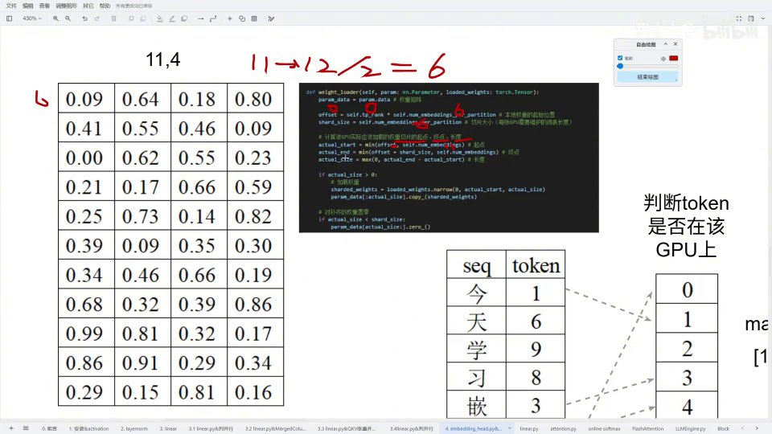 |
| 那实际上就是从这里从 0 开始取 6 个值。然后加载权重，load_weight 沿行的维度加载，从 0 号开始取 6 个，刚好取 6 个。所以 rank0 维护的整片词表就是这一片，rank0 其实就加载完了。因为这里 actual_size 等于 6， [【跳转到 12:53】](https://www.bilibili.com/video/BV1xxcFzbEcb/?t=773) | 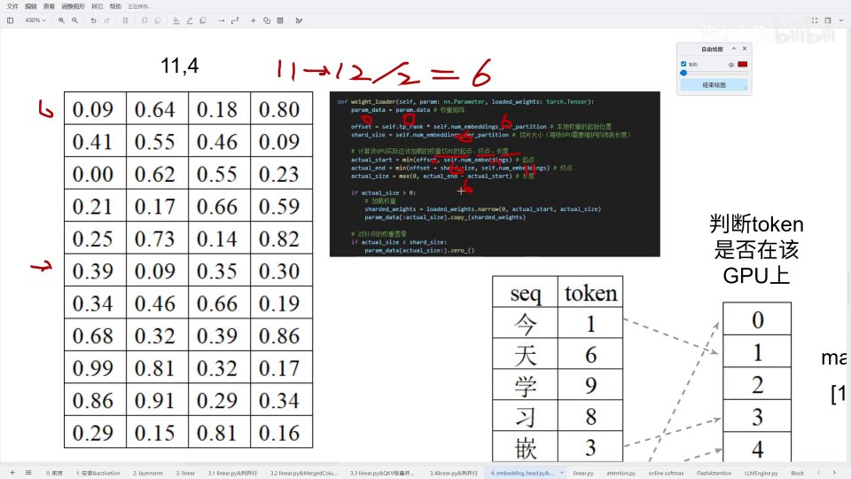 |
| 而 shard_size 也等于 6，所以不会进入补零的条件，不需要补零；只有当实际存储的长度小于 shard_size 时才会补零。好，rank0 看完了，我们来看 rank1。把前面删一删。好，我们现在来看 rank1。还是进来维护一个权重，这里起始的 offset， [【跳转到 13:18】](https://www.bilibili.com/video/BV1xxcFzbEcb/?t=798) | 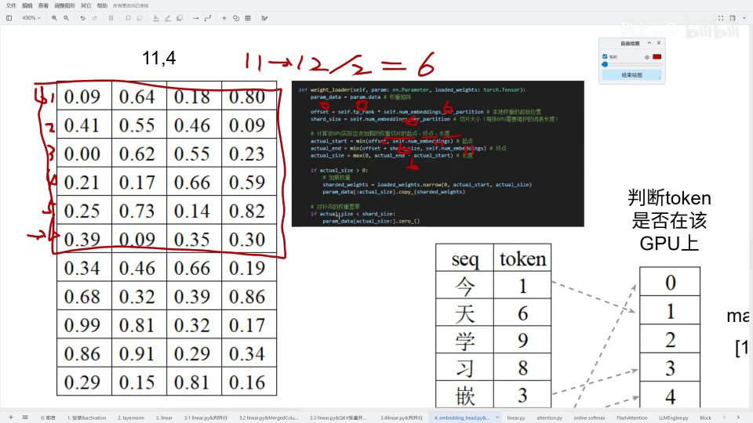 |
| rank1 就是 1×6 等于 6，offset 等于 6，shard_size 还是 6。那 actual_start 等于 min(offset, num_embeddings)，即 6 和 11 里的 6，实际起点就是 6，也就是这个位置。再看实际终点，min(offset+6, 12) 和 num_embeddings， [【跳转到 13:43】](https://www.bilibili.com/video/BV1xxcFzbEcb/?t=823) | 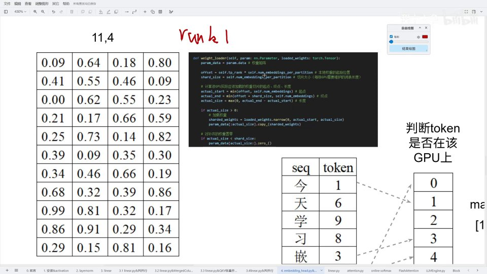 |
| self.num_embeddings 是 11，所以实际终点取最小值就是 11，也就是这里，最后一个就是它的终点。再看 actual_size，这里是 11-6 等于 5。所以我们从第 6 个位置开始取 5 个，加载权重的位置沿行的维度从 actual_start [【跳转到 14:08】](https://www.bilibili.com/video/BV1xxcFzbEcb/?t=848) | 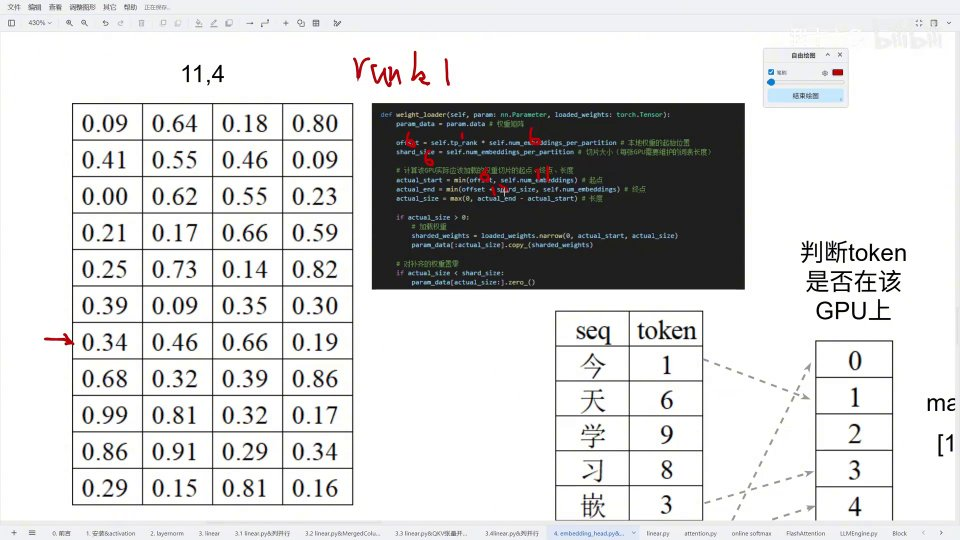 |
| 也就是这个位置取 5 个，即 1 2 3 4 5。OK，所以 rank1 实际加载的就是这一部分的权重。 [【跳转到 14:33】](https://www.bilibili.com/video/BV1xxcFzbEcb/?t=873) | 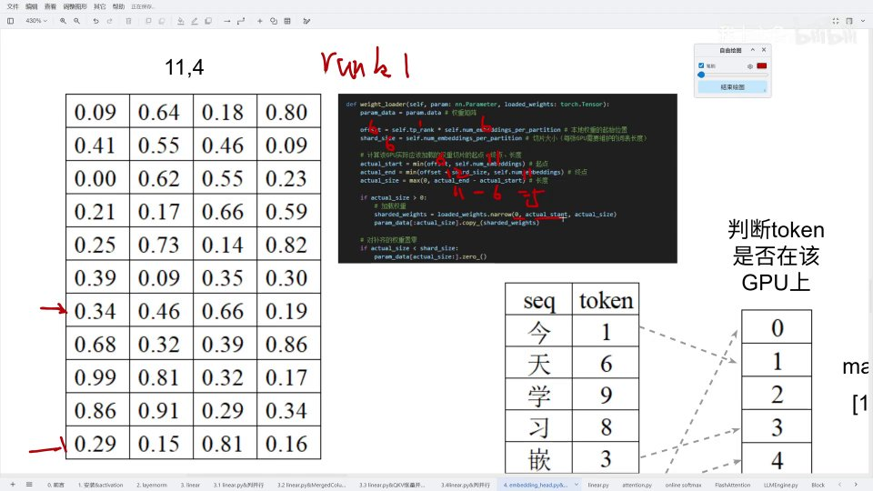 |
| 因为我们 actual_size 等于 5，而 shard_size 等于 6，所以这个地方要做补零操作。也就是说在最后一个维度，从这个 5 到最后一个维度——因为实际上这个 GPU 上权重的形状是 6×4，实际权重是这样的，但我们这里只加载了 5 个——那我们最后一个维度也就是从 actual_size（5）到最后一个维度， [【跳转到 14:42】](https://www.bilibili.com/video/BV1xxcFzbEcb/?t=882) |  |
| 全部补零，也就是 zero。所以本地在 rank1 上的权重就是这样的。OK，权重加载进来之后，我们就来看前向传播。 [【跳转到 15:07】](https://www.bilibili.com/video/BV1xxcFzbEcb/?t=907) | 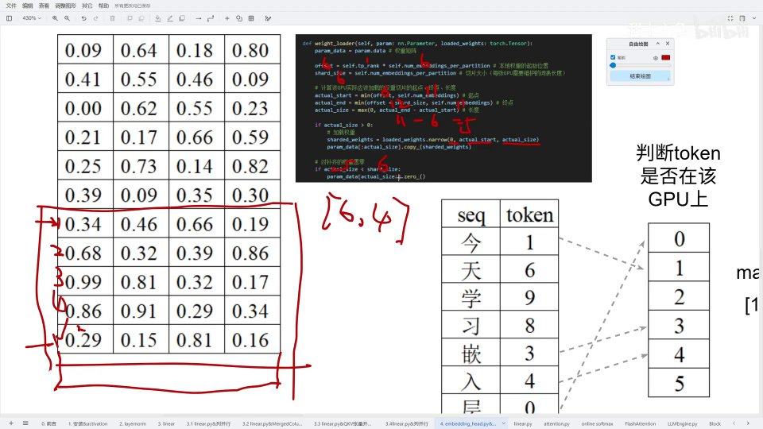 |
| 删掉这些。OK，我们现在来看前向传播是怎么做的。 [【跳转到 15:17】](https://www.bilibili.com/video/BV1xxcFzbEcb/?t=917) | 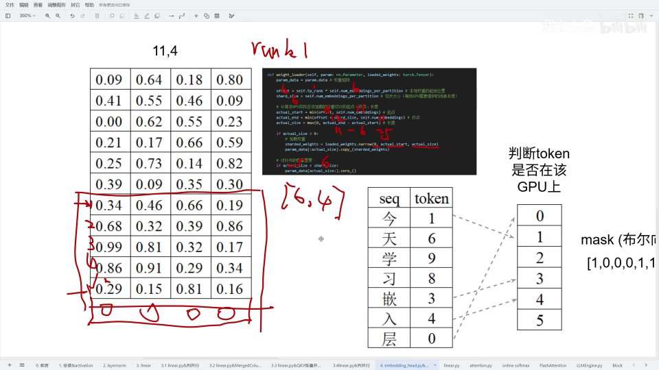 |
| 还是把代码粘过来、切下来吧。 [【跳转到 15:22】](https://www.bilibili.com/video/BV1xxcFzbEcb/?t=922) | 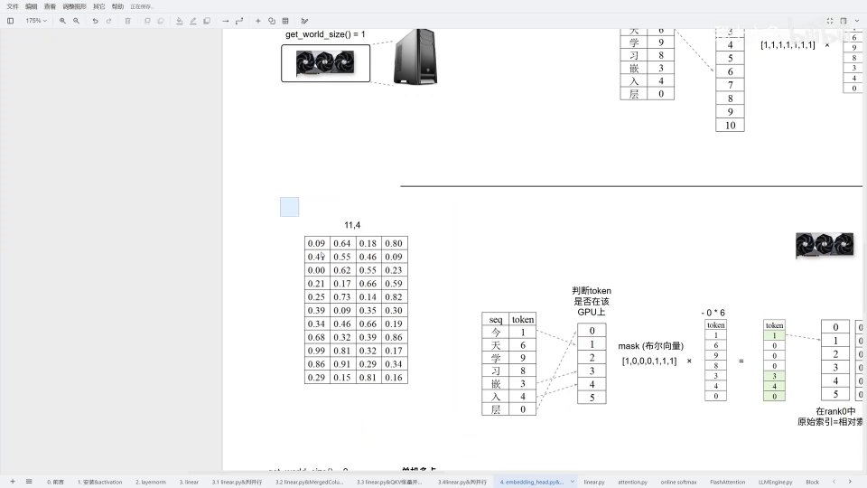 |
| 好，我们先看 rank0 是怎么做的。 [【跳转到 15:27】](https://www.bilibili.com/video/BV1xxcFzbEcb/?t=927) | 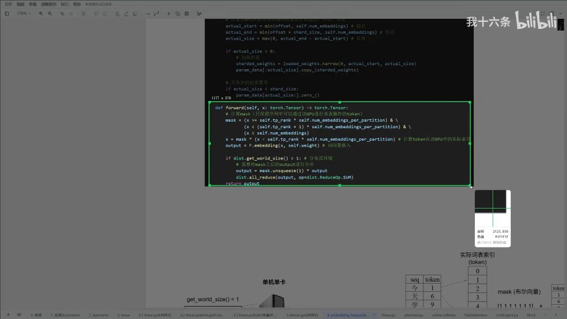 |
| 这个时候权重已经加载进来了，实际上我们权重的形状就是这样，相当于原始权重形状的 [【跳转到 15:32】](https://www.bilibili.com/video/BV1xxcFzbEcb/?t=932) | 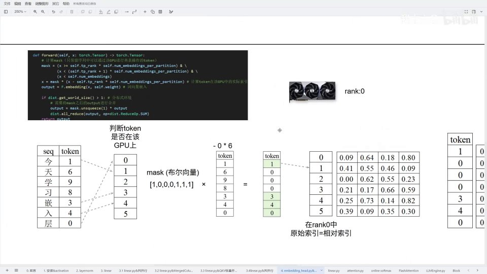 |
| 前面六个，对吧，就刚好是前六个。 [【跳转到 15:37】](https://www.bilibili.com/video/BV1xxcFzbEcb/?t=937) | 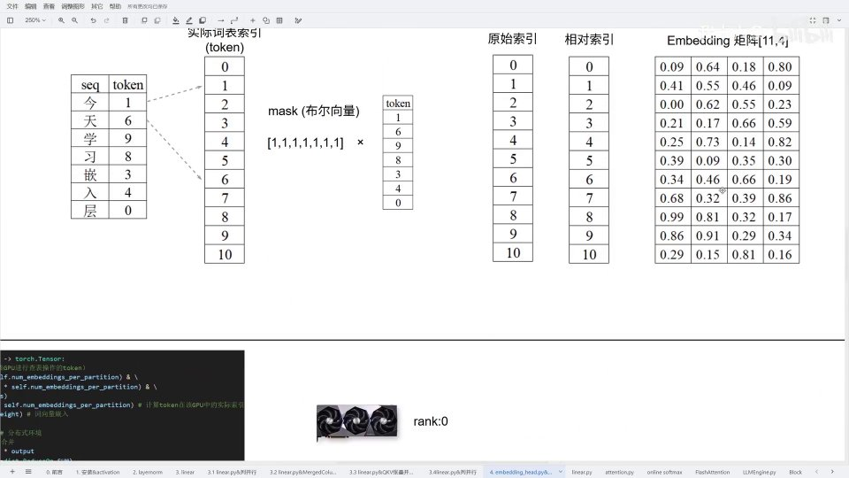 |
| 我们本地权重加进来的就是前六个。OK，我们来看一下，还是以序列「今天学习嵌入层」为例。 [【跳转到 15:42】](https://www.bilibili.com/video/BV1xxcFzbEcb/?t=942) | 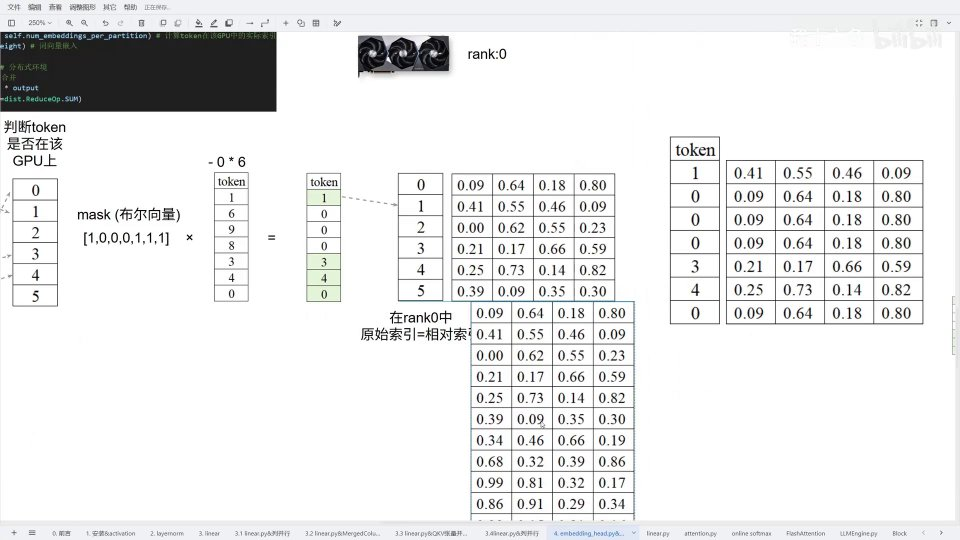 |
| 把它转换成 token id，然后做判断，判断它是否在该 GPU 上，这个判断就是 mask 的过程。比如 token1，我们本地维护的 token 序列是 0~5，那 1 刚好在 0~5 区间内，实际上就是做了这一步。然后 mask 布尔向量的第一个位置就是 true（用 1 代表 true，用 0 代表 false）。 [【跳转到 15:47】](https://www.bilibili.com/video/BV1xxcFzbEcb/?t=947) | 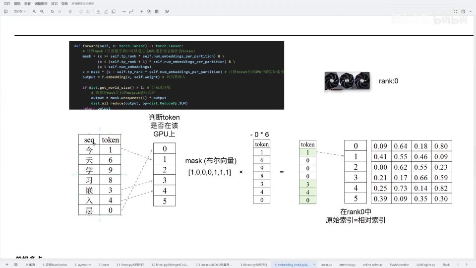 |
| 我们看第二个 token 6，它其实没有在该片上，所以这里 mask 算出来是 0；然后是 9，也是 0；8 也是 0；3 和 4 都落在该片上，所以是 1；最后一个是 0，0 也在这个片上，所以是 1。那这个 mask 布尔向量实际上就是 1 0 0 0 1 1 1。得到 mask 之后， [【跳转到 16:12】](https://www.bilibili.com/video/BV1xxcFzbEcb/?t=972) | 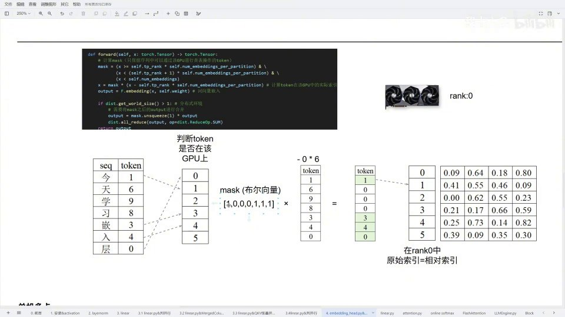 |
| 这里做了一个乘法：mask 乘以 (x - self.tp_rank × 实际大小)，实际上就是在计算该片 GPU 上实际的 token 索引。我们具体看一下，比如在 rank0，x 原本就是 token 那些，然后减去 0×6， [【跳转到 16:37】](https://www.bilibili.com/video/BV1xxcFzbEcb/?t=997) | 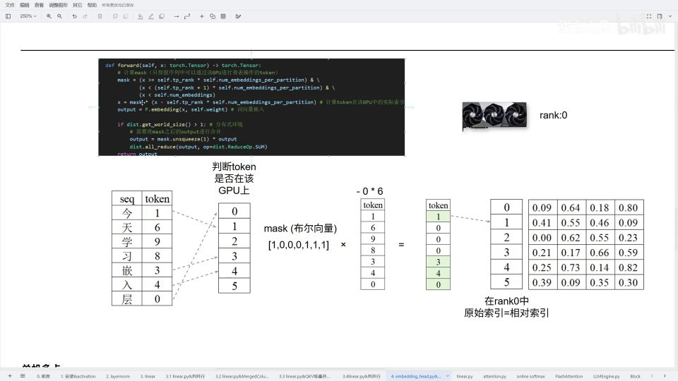 |
| 因为减的是 0，所以它不会变化。但因为这里有一个 mask 乘上去，所以算出来就是 1 三个 0 然后 3、4，这个绿色的部分实际上就是真正在该片 GPU 上被计算的 token。计算完之后， [【跳转到 16:58】](https://www.bilibili.com/video/BV1xxcFzbEcb/?t=1018) | 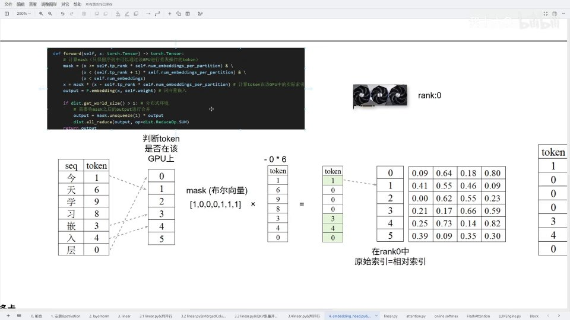 |
| x 就变成这个样子：不属于该片 GPU 的就被置零。然后我们用这个词向量把 x 去做嵌入。具体是怎么嵌入的呢？ [【跳转到 17:17】](https://www.bilibili.com/video/BV1xxcFzbEcb/?t=1037) |  |
| 比如 token 在 1，就去查表查到 1，得到这个；这个 0 实际上查的就是 0，这个 0 也查的 0，这个 0 也查的 0，3 和 4 查的就是这个，0 查的就是 0。最后查完出来之后， [【跳转到 17:29】](https://www.bilibili.com/video/BV1xxcFzbEcb/?t=1049) | 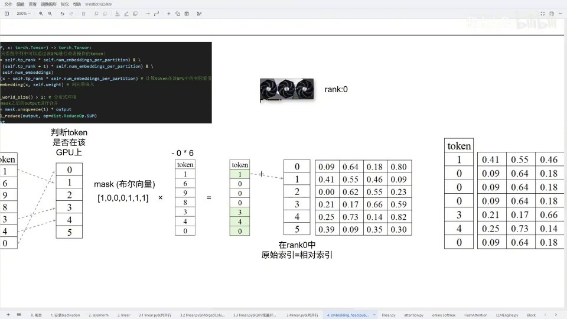 |
| 这个表就是我们查完之后的 token，对应到代码的这个部分， [【跳转到 17:44】](https://www.bilibili.com/video/BV1xxcFzbEcb/?t=1064) | 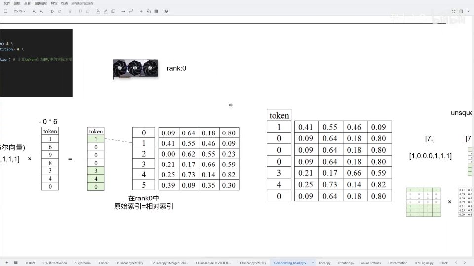 |
| 实际上就是这个 output。 [【跳转到 17:51】](https://www.bilibili.com/video/BV1xxcFzbEcb/?t=1071) | 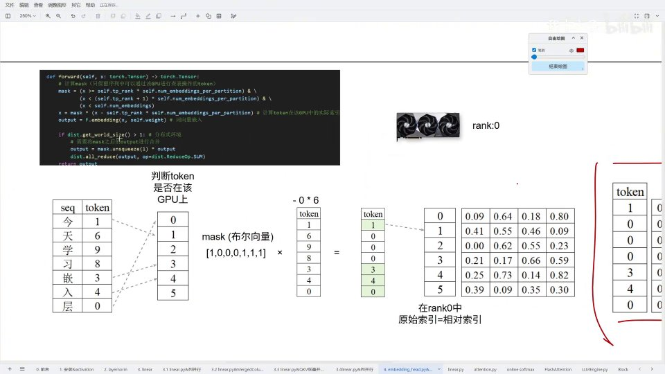 |
| 这个实际上就是 output。然后这个时候， [【跳转到 17:56】](https://www.bilibili.com/video/BV1xxcFzbEcb/?t=1076) | 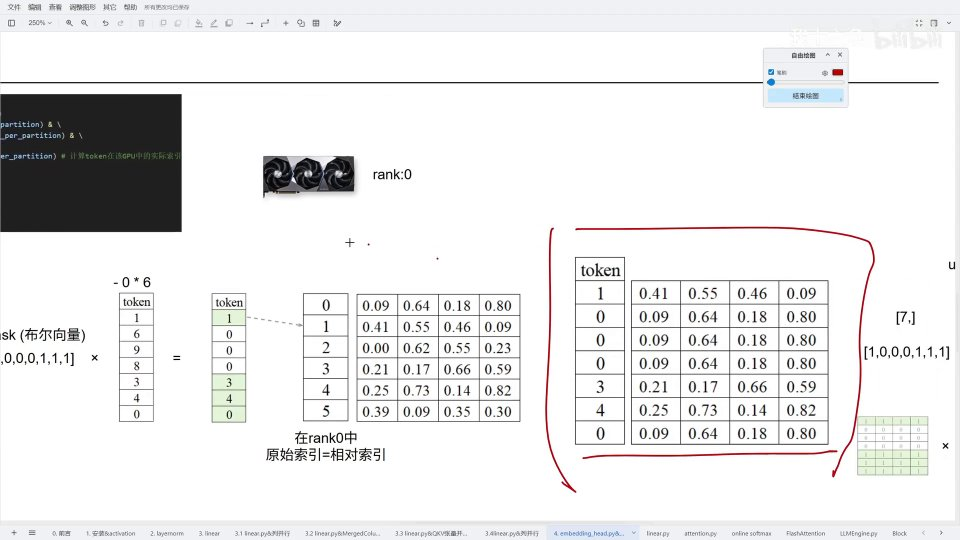 |
| 因为我们是在分布式环境，get_world_size 是 2、大于 1，那我们就要进入分布式环境。 [【跳转到 18:01】](https://www.bilibili.com/video/BV1xxcFzbEcb/?t=1081) | 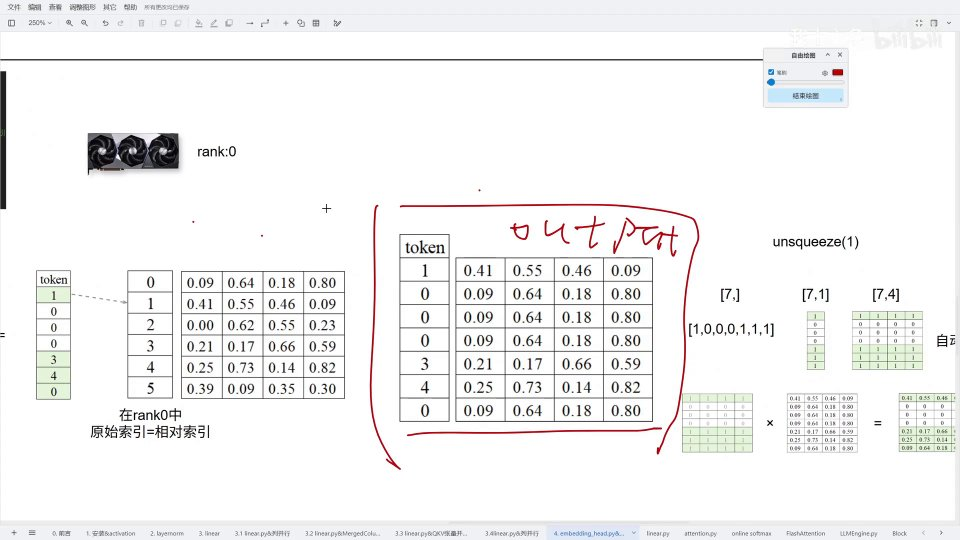 |
| 分布式环境中会做一件事：因为我们并不知道 [【跳转到 18:06】](https://www.bilibili.com/video/BV1xxcFzbEcb/?t=1086) | 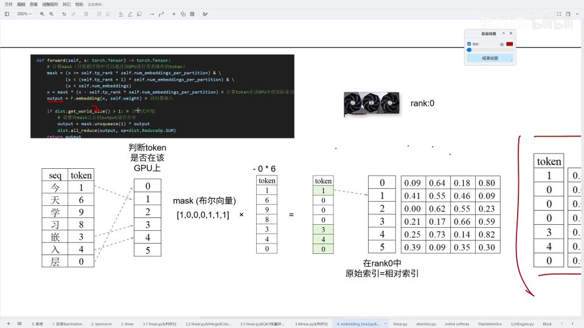 |
| 哪一个零是我们真正的 token。 [【跳转到 18:11】](https://www.bilibili.com/video/BV1xxcFzbEcb/?t=1091) | 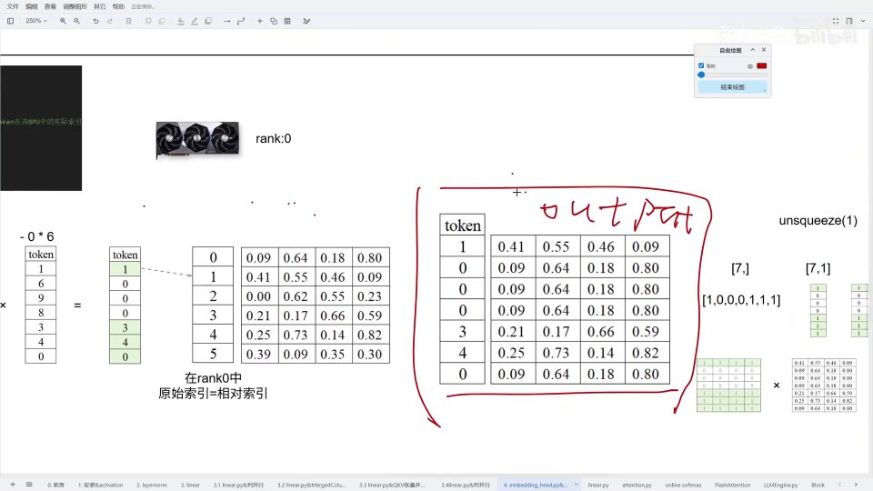 |
| 有一些零它不是 token，因为我们是乘了这个 mask，这三个零实际上并不是我们真正的 token。 [【跳转到 18:16】](https://www.bilibili.com/video/BV1xxcFzbEcb/?t=1096) | 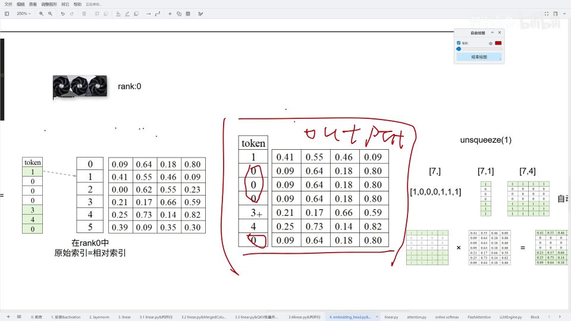 |
| 比如说这三个并不是我们实际的 token，那这个时候我们就需要再乘以一个 mask， [【跳转到 18:21】](https://www.bilibili.com/video/BV1xxcFzbEcb/?t=1101) | 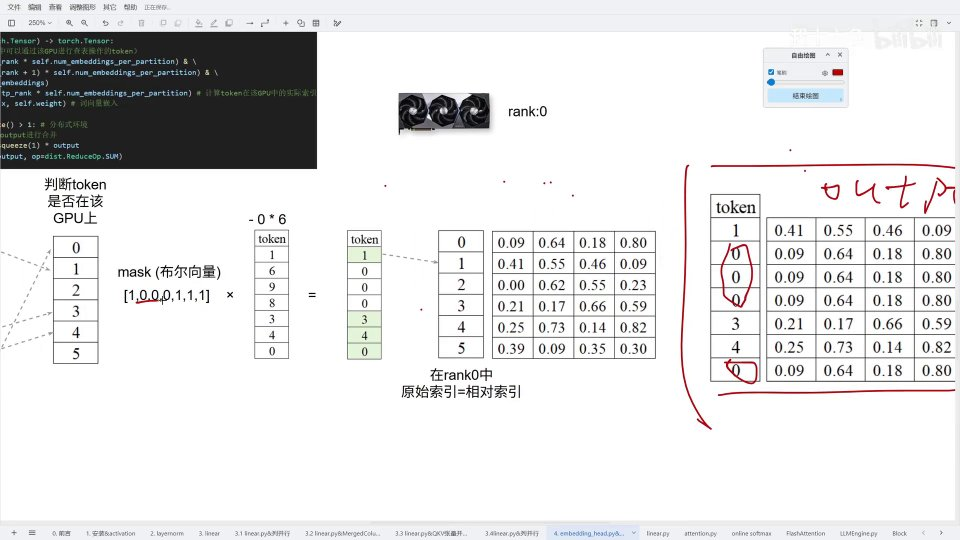 |
| 把这个表用 output 再乘一个 mask，把真正属于该表的 token 维护出来。具体怎么做，我们来看一下。 [【跳转到 18:28】](https://www.bilibili.com/video/BV1xxcFzbEcb/?t=1108) | 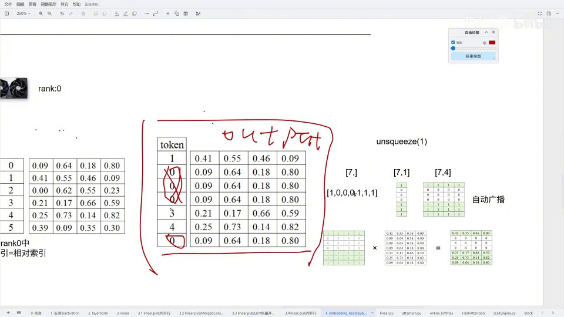 |
| 比如说这个表中，首先是 output 等于 mask.unsqueeze(...) 乘以 output。这是怎么理解呢？ [【跳转到 18:40】](https://www.bilibili.com/video/BV1xxcFzbEcb/?t=1120) | 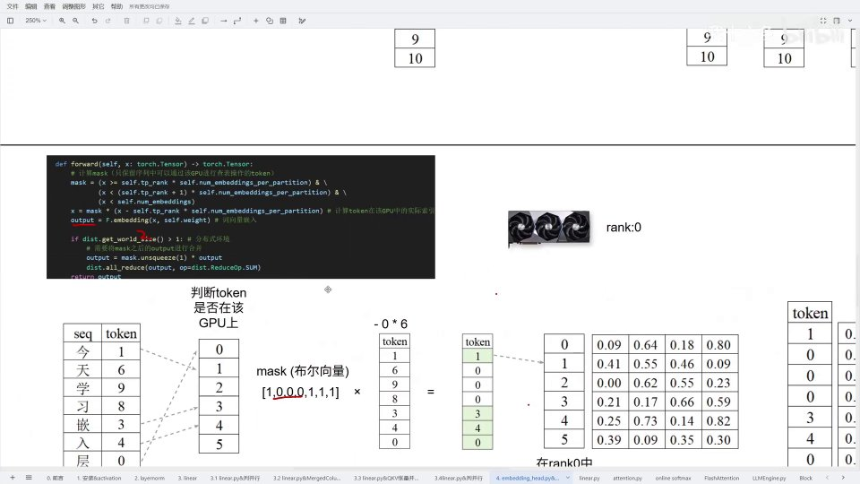 |
| 我们的 mask 原本是一个布尔向量，它做了一个 unsqueeze， [【跳转到 18:49】](https://www.bilibili.com/video/BV1xxcFzbEcb/?t=1129) | 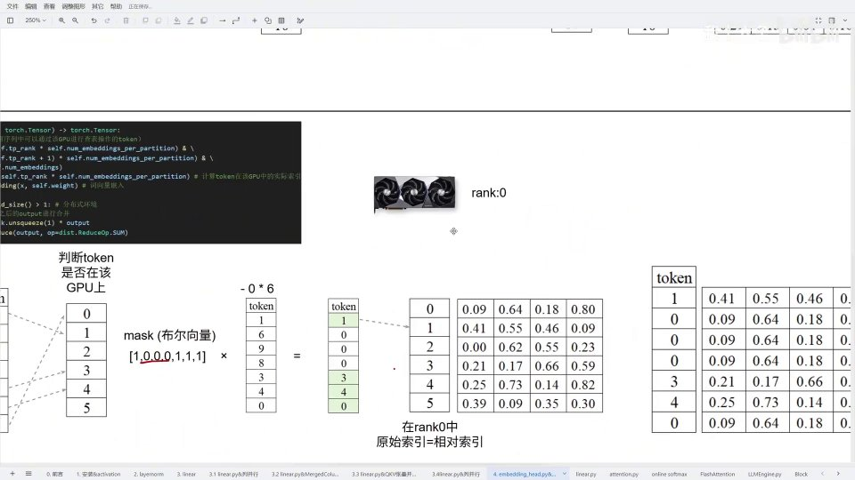 |
| 沿第一个维度——因为它原本只有第 0 维——在第一个维度上加一个维度，就把原本的一个向量变成了一个 7×1 的 tensor。那这个 tensor 再做什么呢？ [【跳转到 18:54】](https://www.bilibili.com/video/BV1xxcFzbEcb/?t=1134) | 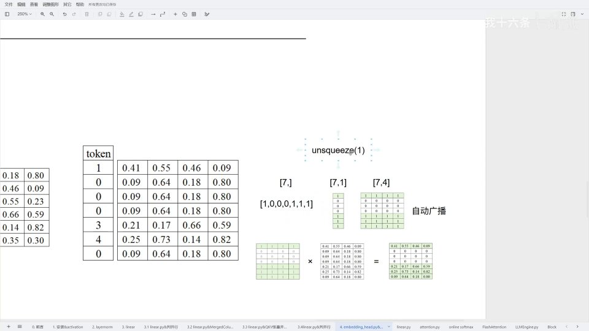 |
| 就用这个 tensor 再去乘以 output，我们的 output 现在是这个样子的。 [【跳转到 19:08】](https://www.bilibili.com/video/BV1xxcFzbEcb/?t=1148) | 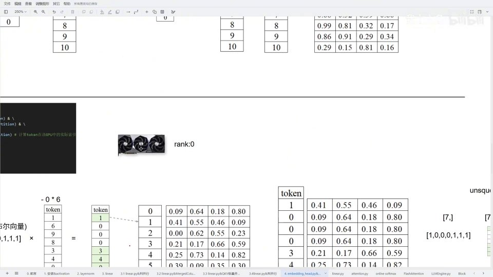 |
| 但因为我们的是 7×1，这个 7×1 的 mask 矩阵怎么去乘以 7×4 的 output 呢？在 PyTorch 中它其实会自动广播，把这个 7×1 的矩阵自动广播成 7×4，然后再用这个矩阵去乘以我们的 output，实际上就是这样，绿色部分就是被保留的部分。 [【跳转到 19:13】](https://www.bilibili.com/video/BV1xxcFzbEcb/?t=1153) |  |
| 那最后输出就是这个样子，这个矩阵实际上就是我们在 rank0 上计算得到的 [【跳转到 19:38】](https://www.bilibili.com/video/BV1xxcFzbEcb/?t=1178) | 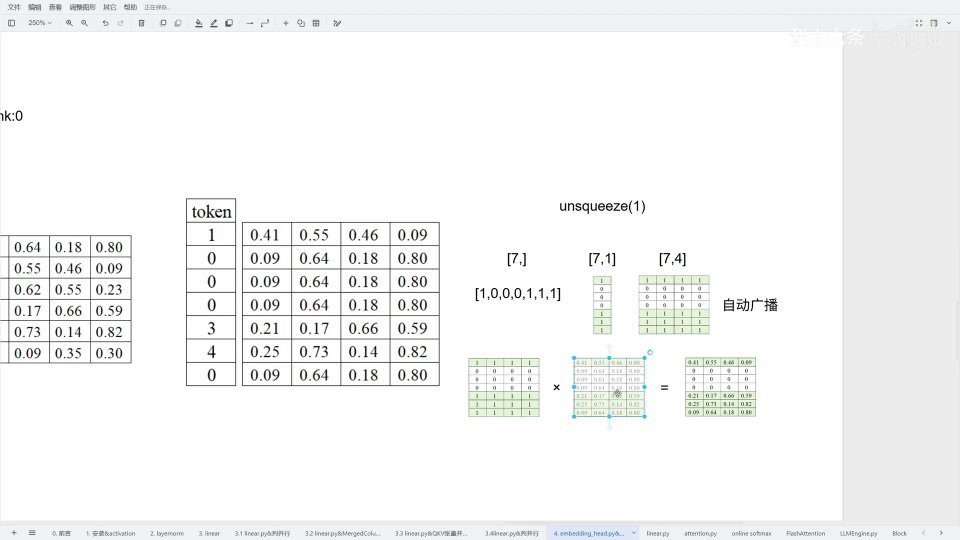 |
| 最后的一个 output。rank0 这一步就已经走完了。 [【跳转到 19:45】](https://www.bilibili.com/video/BV1xxcFzbEcb/?t=1185) | 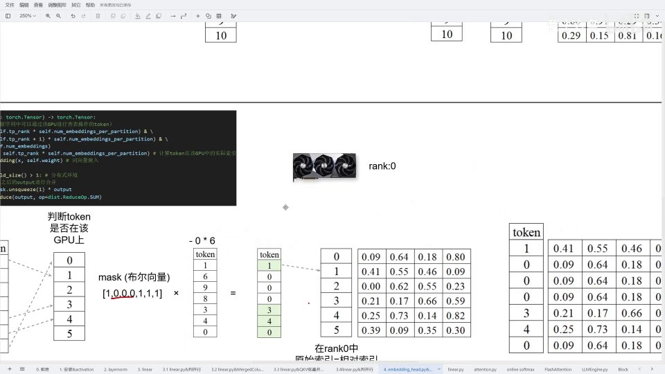 |
| OK，我们现在来看 rank1，其实也是一样的。比如在 rank1，序列「今天学习嵌入层」的原始 token 中，有哪些是在 rank1 中被维护的呢？实际上只有 3 个 token，因为我们原本的序列在 rank1 上只有 6~10 这个范围的 token 才真正存在。 [【跳转到 19:50】](https://www.bilibili.com/video/BV1xxcFzbEcb/?t=1190) | 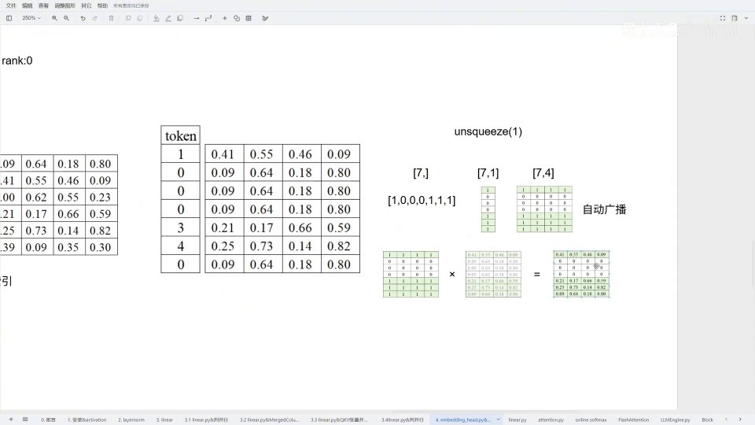 |
| 然后我们的 mask 实际上就是 0 三个 1 然后三个 0。因为这只是我们原始索引，我们在该 GPU 上的相对索引是从 0~5 的（这边实际维护了 6 个，即原始词表长度的 6，只不过最后一位是被补齐的）。然后计算 mask，乘以我们输入的原始 token，但这个时候要减去 rank1 乘以 [【跳转到 20:15】](https://www.bilibili.com/video/BV1xxcFzbEcb/?t=1215) | 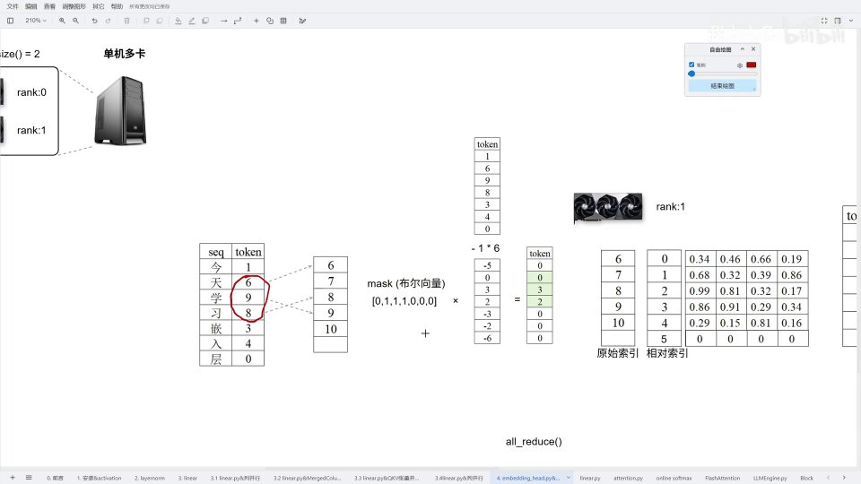 |
| 每片维护的词表长度，也就是减去 1×6，就变成了这个样子，再用 mask 去乘以这个向量，最后得到的 token 是 0 0 3 2 三个零，但实际上只有这三个是该片 GPU 所维护的 token。然后用这个 token 去做查表，它实际上对应的就是这里的 [【跳转到 20:40】](https://www.bilibili.com/video/BV1xxcFzbEcb/?t=1240) | 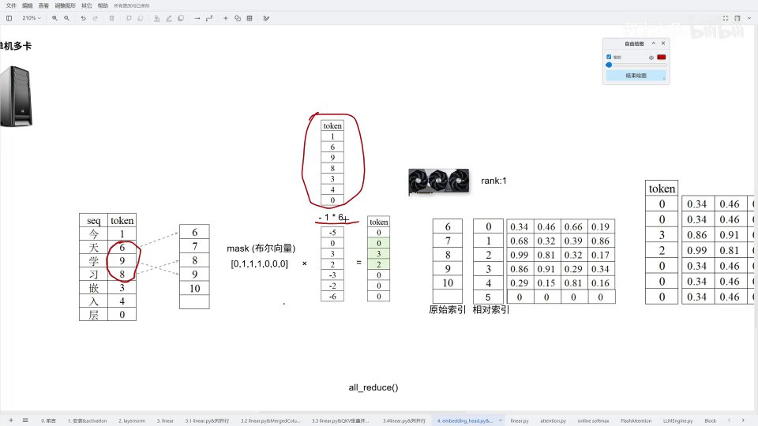 |
| 这个 x，然后这个 x 去做嵌入的查表， [【跳转到 21:00】](https://www.bilibili.com/video/BV1xxcFzbEcb/?t=1260) | 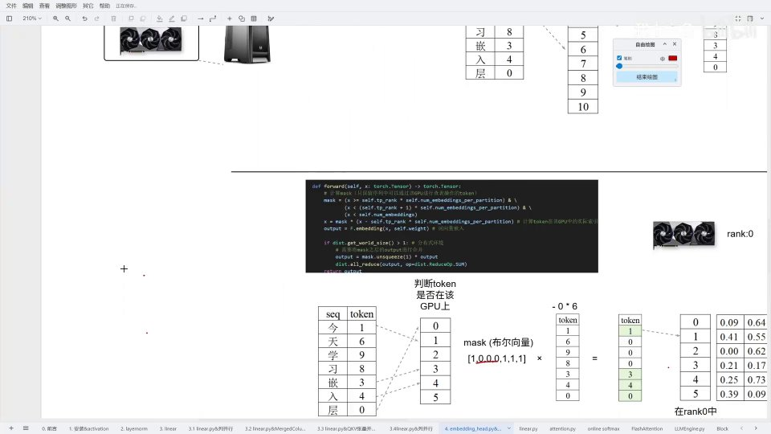 |
| 最后查出来。 [【跳转到 21:05】](https://www.bilibili.com/video/BV1xxcFzbEcb/?t=1265) | 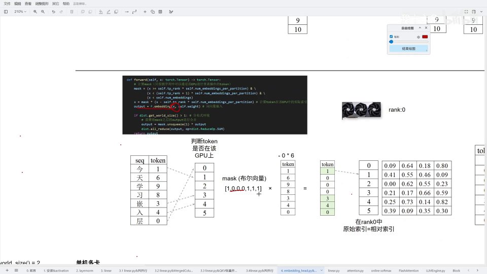 |
| 这个地方就是在查表，因为现在这个就是我们 rank1 上维护的那个词表，这是它的索引 0 1 2 3 4 5。0 查 0、3 查 3、2 查 2，其余位置都是零，最后查出来的就是 output。得到具体的 output 之后，我们还需要确认到底哪些 token 是在该表里被维护的，于是用 mask [【跳转到 21:10】](https://www.bilibili.com/video/BV1xxcFzbEcb/?t=1270) | 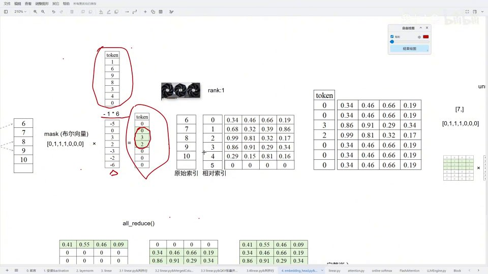 |
| 把它用 unsqueeze 转换成矩阵，做自动广播，再用这个 mask 乘以我们的 output，得到我们实际维护的那个矩阵，也就是真正的 output。其余零的位置其实都不是该片 GPU 上维护的 token。然后我们最后做了一件什么事呢？ [【跳转到 21:35】](https://www.bilibili.com/video/BV1xxcFzbEcb/?t=1295) | 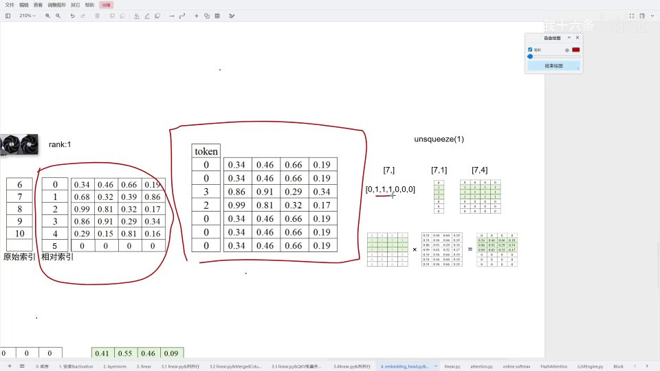 |
| 就是做了一个 all_reduce，那个分布式的操作，把原本这两片 [【跳转到 21:53】](https://www.bilibili.com/video/BV1xxcFzbEcb/?t=1313) | 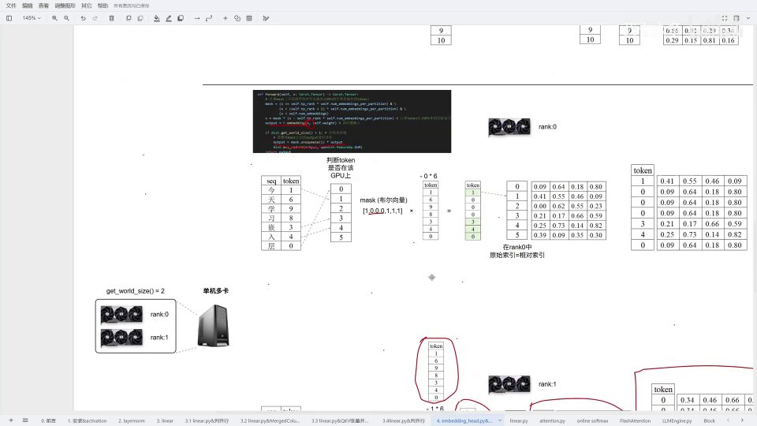 |
| 因为现在只有两个 GPU，其实就是把原本这两片加起来。 [【跳转到 21:58】](https://www.bilibili.com/video/BV1xxcFzbEcb/?t=1318) | 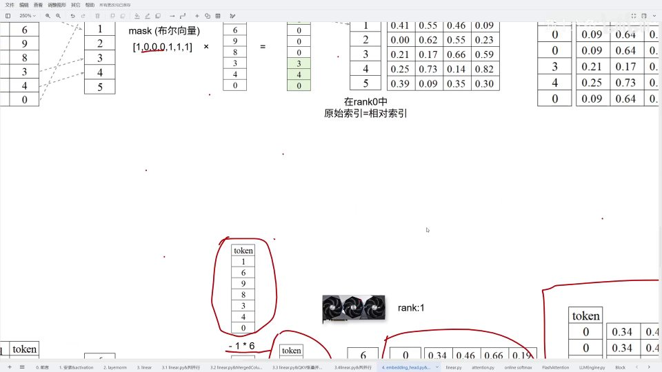 |
| 那就是做了 all_reduce，这个是 rank0 的， [【跳转到 22:03】](https://www.bilibili.com/video/BV1xxcFzbEcb/?t=1323) | 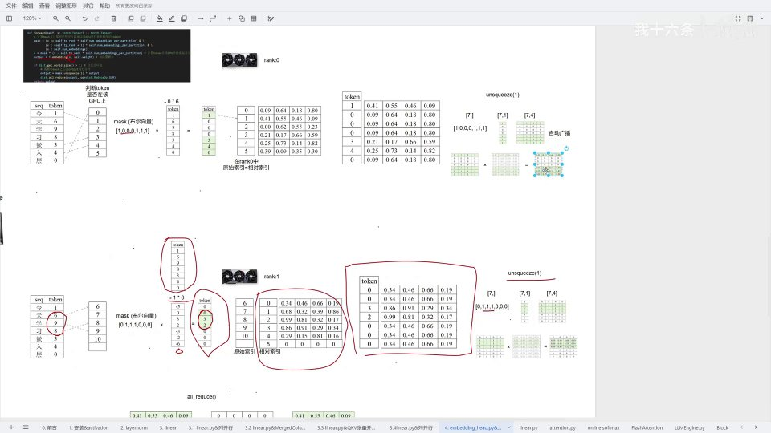 |
| 这个就是 rank1 的。好，我们这么加出来，这个其实就是真正的 output 了，也就是实际上我们在前向传播中用于下一步计算的完整 tensor。这一片是我 rank0 上没有的 token（所以是零），那一片是我 rank1 上有的 token，两者加起来刚好是一片完整的 tensor。词表嵌入并行就是这么做的。 [【跳转到 22:08】](https://www.bilibili.com/video/BV1xxcFzbEcb/?t=1328) | 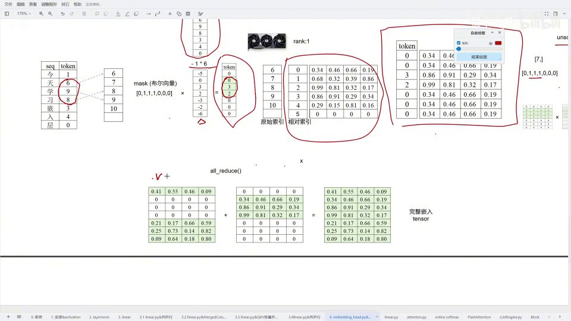 |
| 可能讲得有点快，但我觉得思路还是挺清晰的。 [【跳转到 22:32】](https://www.bilibili.com/video/BV1xxcFzbEcb/?t=1352) | 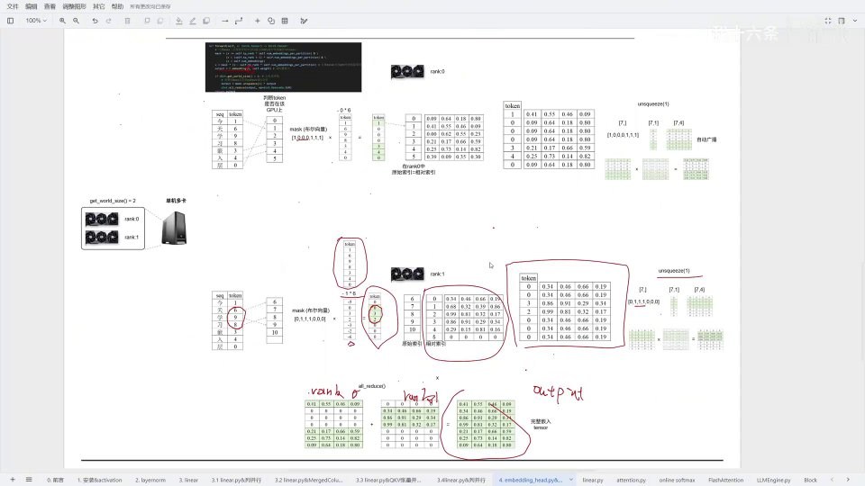 |
| 你们在看、在学习的时候，就对着代码一步一步走一遍， [【跳转到 22:37】](https://www.bilibili.com/video/BV1xxcFzbEcb/?t=1357) | 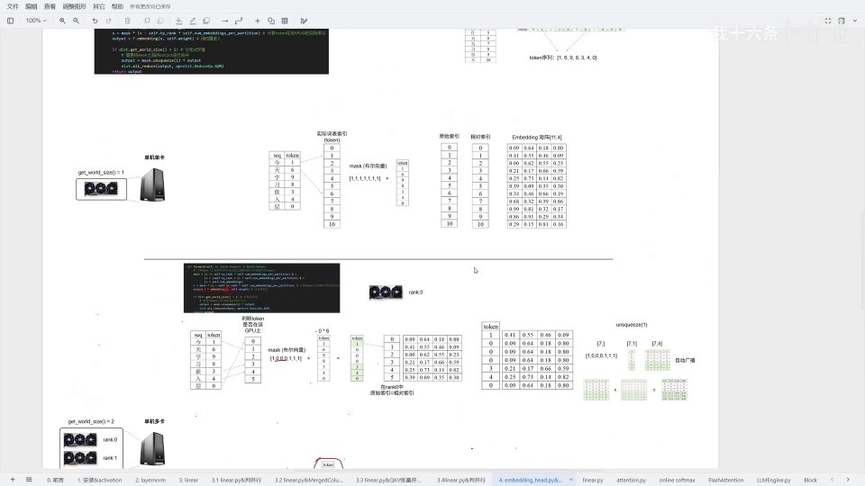 |
| 自己推一遍，我觉得肯定能够对它有一个 [【跳转到 22:42】](https://www.bilibili.com/video/BV1xxcFzbEcb/?t=1362) | 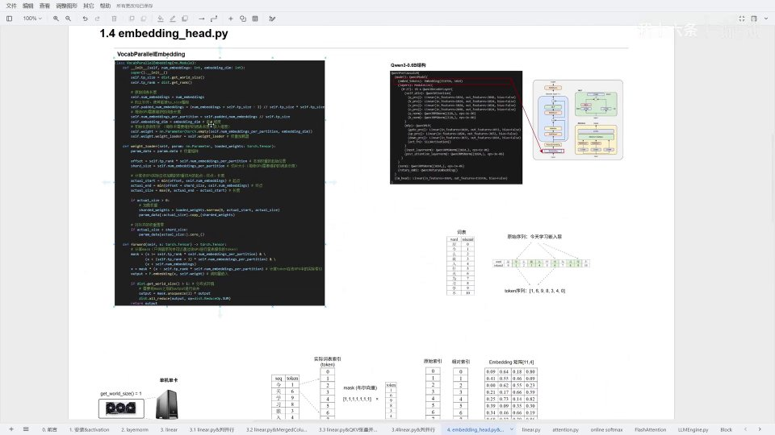 |
| 很明确的理解。如果有什么不明白的问题，其实可以在群、评论区里面讨论， [【跳转到 22:47】](https://www.bilibili.com/video/BV1xxcFzbEcb/?t=1367) | 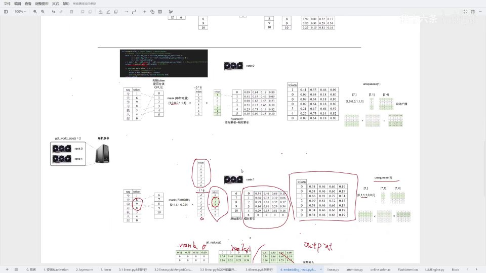 |
| 我看到的话也会回复大家。 [【跳转到 22:52】](https://www.bilibili.com/video/BV1xxcFzbEcb/?t=1372) | 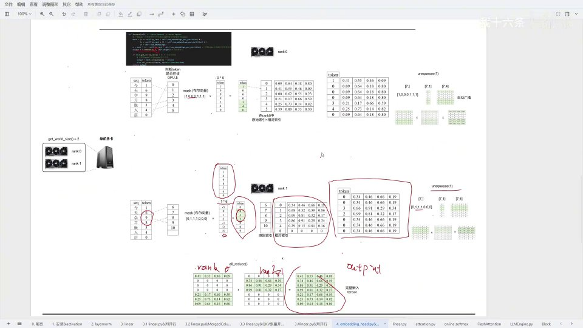 |