# embedding_head.py&lm_head&词表列并行 原始文稿（图-字幕分栏）

| 字幕文本 | 画面 |
| :--- | ---: |
| 哈喽大家好，先提前跟大家拜个早年、说声新年快乐。今天我们分享 embedding_head 里面的 lm_head，也就是模型中的最后一个部分。 [【跳转到 00:00】](https://www.bilibili.com/video/BV1GWcbzWE1x/?t=0) |  |
| 它虽然不算整个模型的最后——后面还有旋转嵌入以及 attention， [【跳转到 00:11】](https://www.bilibili.com/video/BV1GWcbzWE1x/?t=11) | 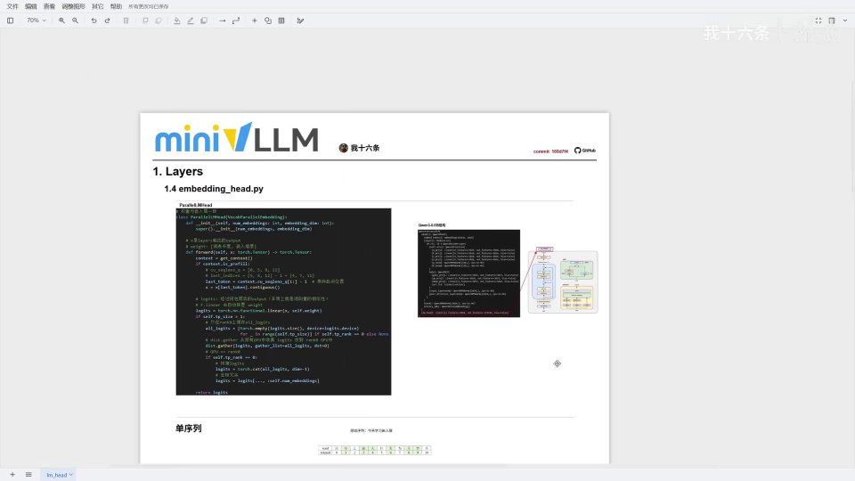 |
| attention 是后面非常重要的内容，包括 PagedAttention、FlashAttention 都在这个模块里，应该会花很大的篇幅去讲。今天主要讲 lm_head。这个模块在原本的模型结构里其实没有单独体现，因为它是模型输出一个 output 之后，再去做的一次计算。它实际上是一个 [【跳转到 00:16】](https://www.bilibili.com/video/BV1GWcbzWE1x/?t=16) | 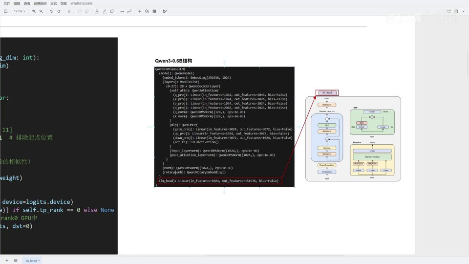 |
| 做语义相似度查询的功能：在我们得到 output、也就是每个 token 的 output 之后，再去原本的词表权重里做一次查询。本质上是点积，但我认为它其实就是在做一个语义相似度的查询。好，我们来看代码。 [【跳转到 00:41】](https://www.bilibili.com/video/BV1GWcbzWE1x/?t=41) | 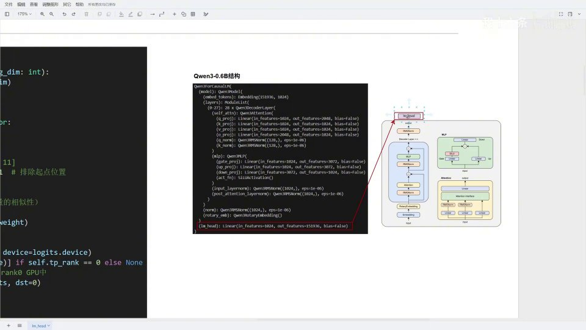 |
| 我们还是按「模型结构 → 代码 → 举例」的模式来讲。 [【跳转到 01:02】](https://www.bilibili.com/video/BV1GWcbzWE1x/?t=62) | 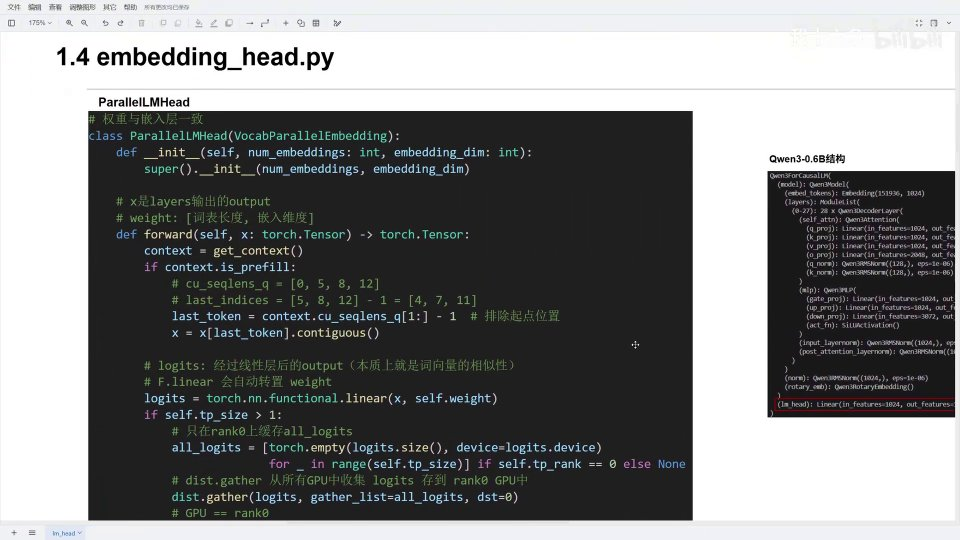 |
| 我们来看代码，一行一行看。Lm_head 其实继承自 VocabParallelEmbedding， [【跳转到 01:07】](https://www.bilibili.com/video/BV1GWcbzWE1x/?t=67) | 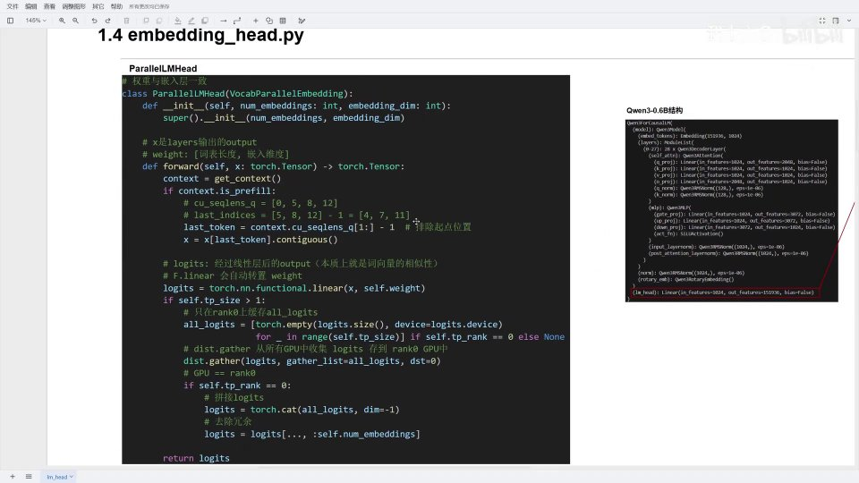 |
| 也就是上一章讲的那个词表并行嵌入。它继承这个类，然后 `__init__` 里调用父类方法，这个就没什么好看的。 [【跳转到 01:12】](https://www.bilibili.com/video/BV1GWcbzWE1x/?t=72) | 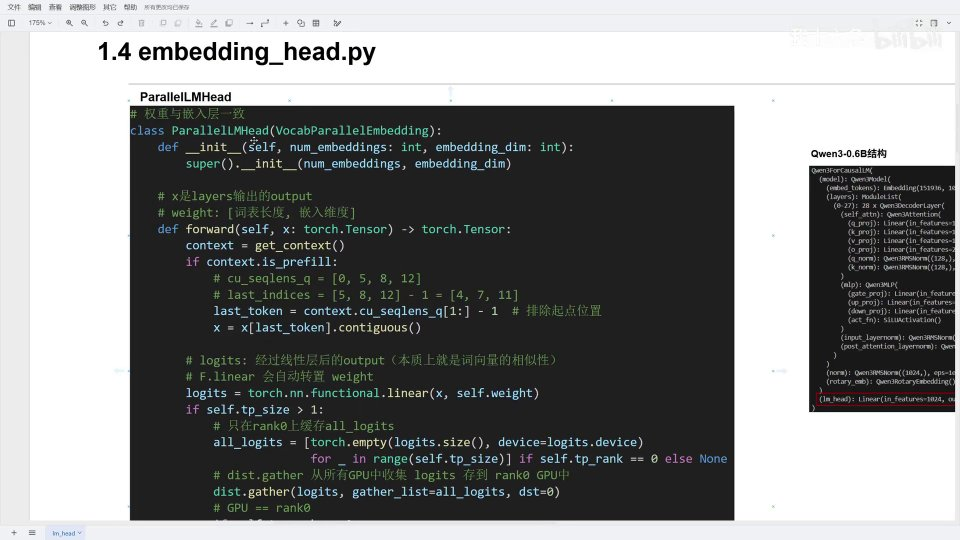 |
| 它主要是在 forward、也就是前向传播上有一点不一样。它的权重加载实际上和 VocabParallelEmbedding 是一致的， [【跳转到 01:25】](https://www.bilibili.com/video/BV1GWcbzWE1x/?t=85) | 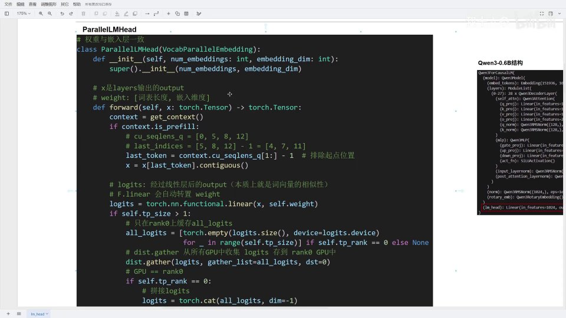 |
| 所以我们来看这个。 [【跳转到 01:30】](https://www.bilibili.com/video/BV1GWcbzWE1x/?t=90) | 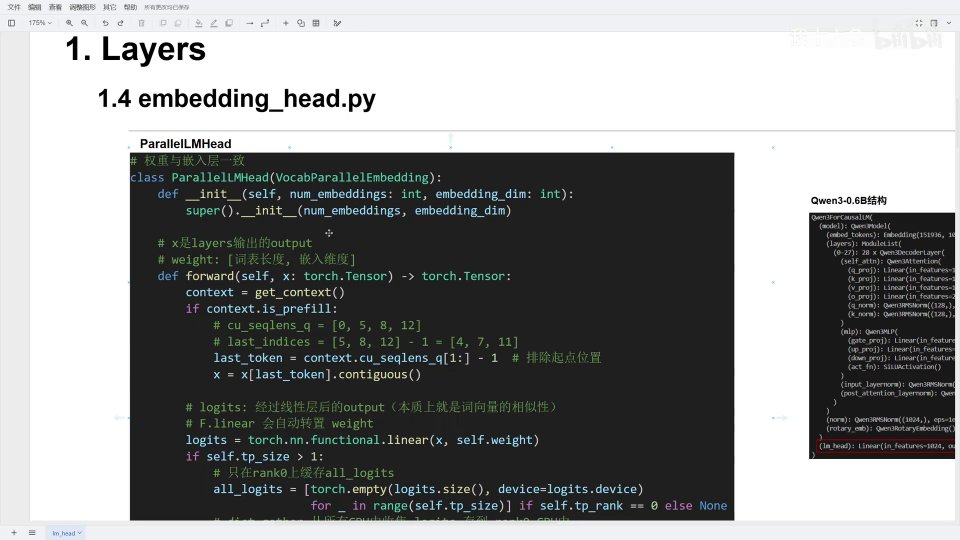 |
| 如果想了解它的权重加载，看上一章讲的内容就可以了。然后我们来看它的前向传播。 [【跳转到 01:36】](https://www.bilibili.com/video/BV1GWcbzWE1x/?t=96) | 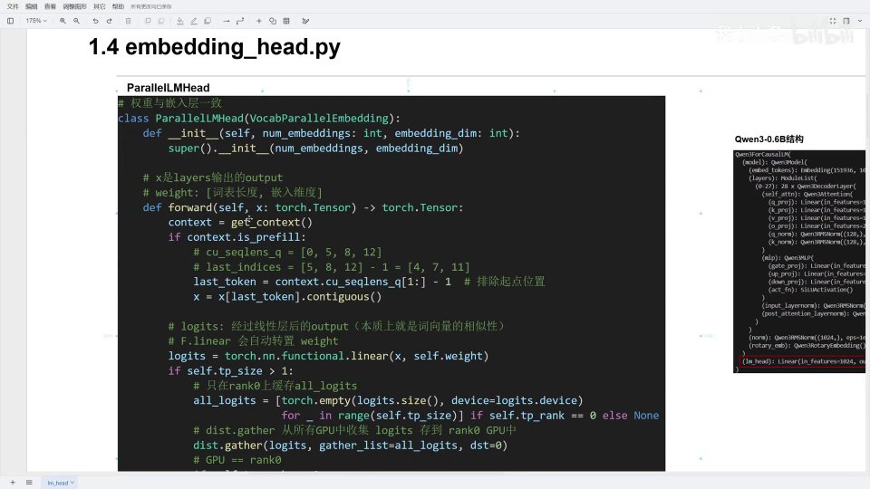 |
| 前向传播输入一个 X， [【跳转到 01:41】](https://www.bilibili.com/video/BV1GWcbzWE1x/?t=101) | 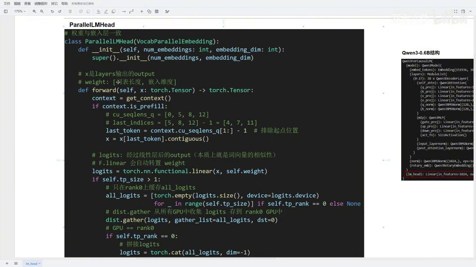 |
| 这个 X 实际上就是刚才模型讲的那个 output。 [【跳转到 01:46】](https://www.bilibili.com/video/BV1GWcbzWE1x/?t=106) | 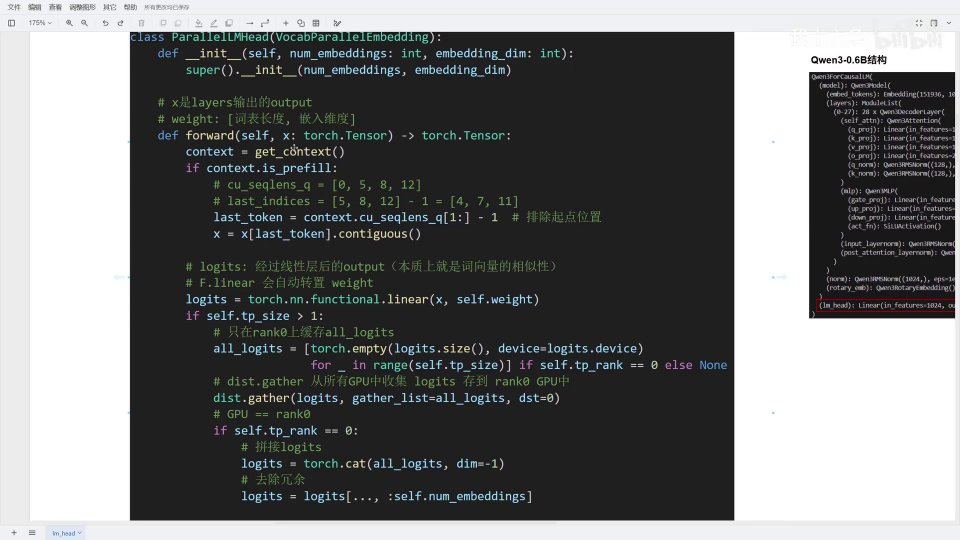 |
| 然后它这里通过 context 获取了一个上下文环境，里面存储了我们序列的状态， [【跳转到 01:51】](https://www.bilibili.com/video/BV1GWcbzWE1x/?t=111) | 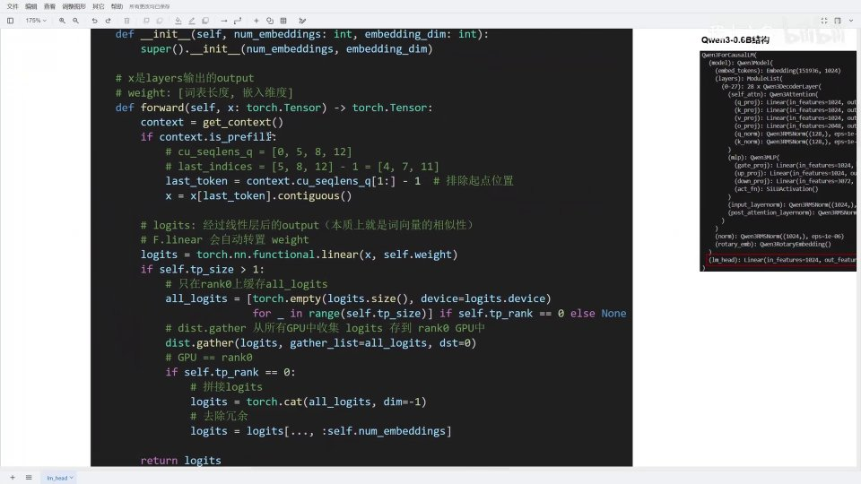 |
| 还有一些其他参数。然后这里判断如果当前是预填充（prefill）状态，就计算一个 last token，从 context 中取出 cu_seqlens（累积序列长度，代码里写作 q_seq_len）。它这个东西是序列的起始位置。所谓序列的起始位置是什么意思呢？因为一般来说我们传入的 X 是多个序列，对 transformer 来说，在预填充的时候 [【跳转到 01:56】](https://www.bilibili.com/video/BV1GWcbzWE1x/?t=116) |  |
| 它其实是自回归的，会用 mask 把输入的序列遮住，让每个序列只能看见它自身以及它之前的 token。所以对 transformer 模型来说，它其实并不知道输入里有多少个序列。因此我们需要用一个 cu_seqlens 数组来记录每个序列的起始位置。这里举了个例子，比如 0 5 8 12， [【跳转到 02:21】](https://www.bilibili.com/video/BV1GWcbzWE1x/?t=141) | 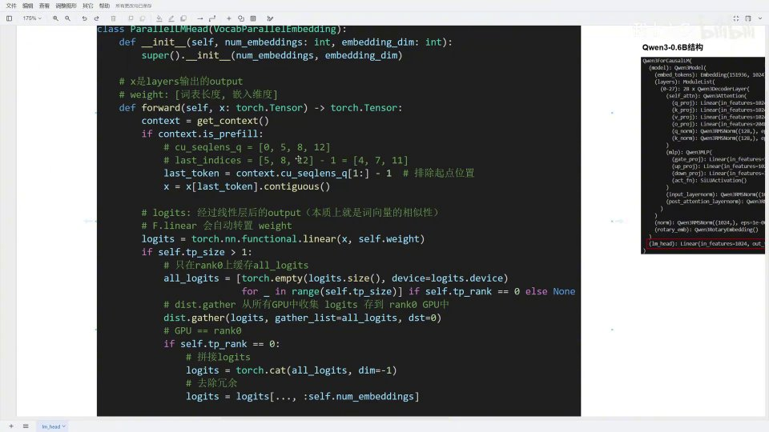 |
| 0~5 是一个序列，5~8 是另一个序列，8~12 又是一个序列，所以这里面一共有三个序列。然后 last token 就是取每个序列的最后一个 token，因为预填充过程中我们只需要每个序列最后一个 token 的 output 就可以了。我们再看这个 5、8、12 是怎么算出来的：先把第一个起点位置排除掉，把这个 0 排除掉。这里为什么要减一呢？ [【跳转到 02:46】](https://www.bilibili.com/video/BV1GWcbzWE1x/?t=166) | 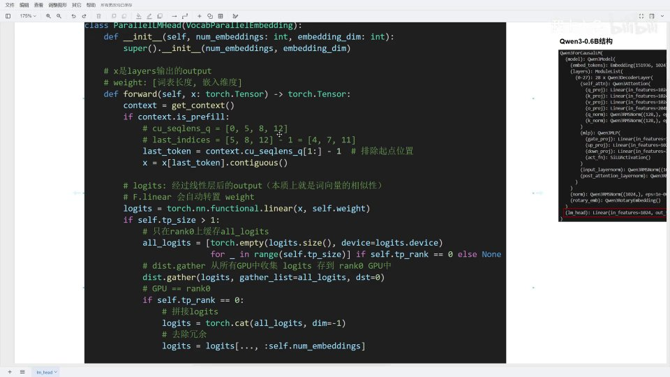 |
| 因为这个 5、8、12 实际上是另一个序列的开头，待会举例会讲。所以这里直接减一，就可以取到上一个序列的最后一个 token，它做的就是这么一个事情。这个地方把取到的 last token 在内存中做了一个连续化，把原本分散的 last token 放到一块连续的内存上。然后这个地方是计算逻辑， [【跳转到 03:11】](https://www.bilibili.com/video/BV1GWcbzWE1x/?t=191) | 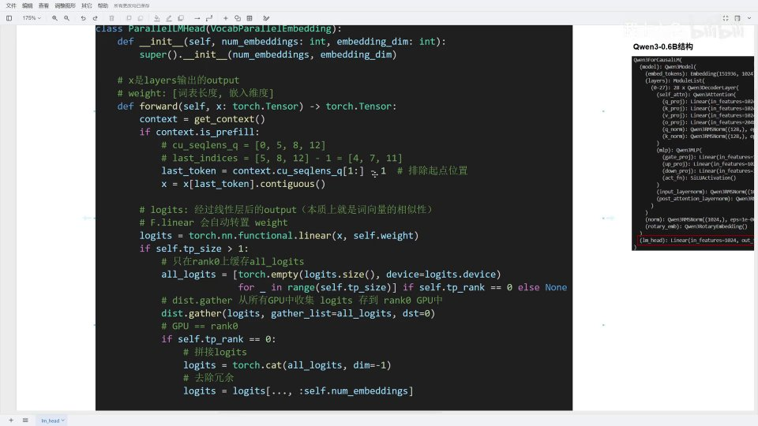 |
| 它其实就是一个线性层：输入是我们传进来的 X（也就是 last token，这里只有三个序列，所以 last token 长度也只有三），再把权重传进来，这个权重就是词表的权重。然后这里就是并行的情况。 [【跳转到 03:35】](https://www.bilibili.com/video/BV1GWcbzWE1x/?t=215) | 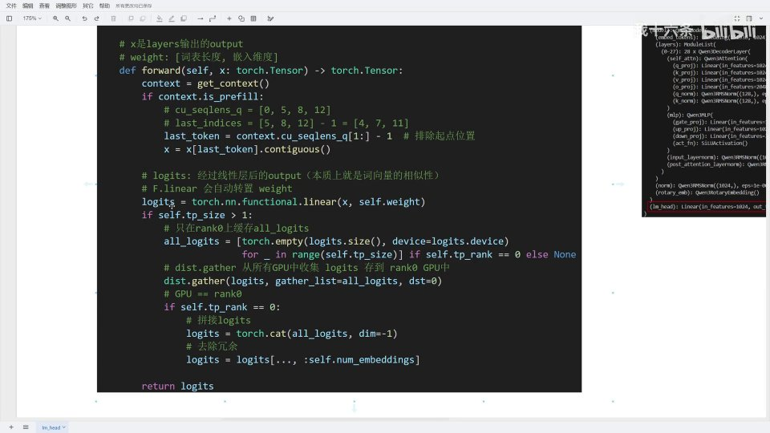 |
| 在并行的时候，我们会维护一个 all_logits（所有逻辑值）。因为我们需要对权重做拆分，这一块待会进例子会详细讲，我觉得这块还挺关键。这个地方维护了一个列表来存所有的 logits，因为我们每一片 GPU 只输出部分词表的 logits，所以需要在某一张 GPU（比如 rank0）上做所有 logits 的维护，于是这里做了一个初始化。它这里是一个列表，列表里是 tensor，range(self.tp_size) 就是按全局 GPU 数量，有多少个 GPU 就初始化多少个。比如长度为 3 的列表，就存三个 GPU 的 logits。 [【跳转到 03:55】](https://www.bilibili.com/video/BV1GWcbzWE1x/?t=235) |  |
| 在 rank0 上做所有 logits 的维护。所以它做了一个初始化：这里是一个列表，列表里是 tensor，range(self.tp_size) 就是全局的 GPU 数量，有多少个 GPU 就初始化多少个。比如长度为 3 的列表，就存三个 GPU 的 logits，就是这个意思。 [【跳转到 04:20】](https://www.bilibili.com/video/BV1GWcbzWE1x/?t=260) | 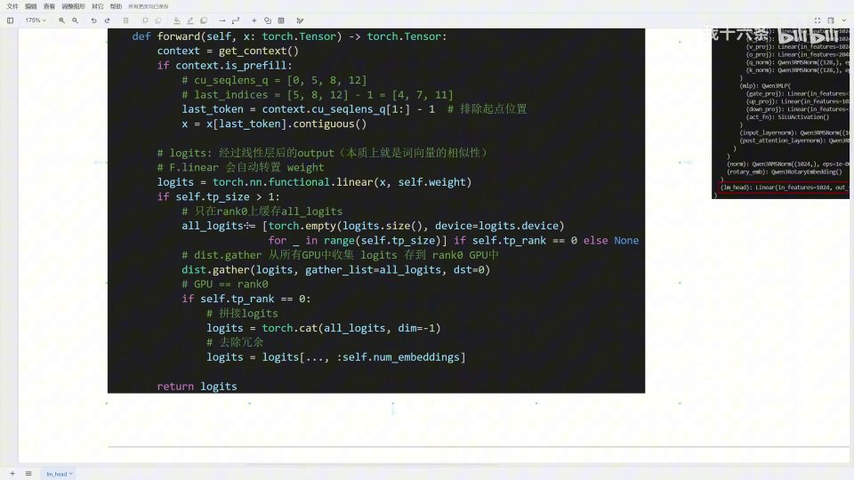 |
| 然后它做了一个 gather 操作，把所有 GPU 中的 logits 收集、存放到 rank0 里，注意这个存放的目标是 rank0。要注意 gather 和 all_gather 是有区别的：all_gather 是每一张 GPU 都会去存放、做聚合，而这里的 gather 实际上只是在指定的 GPU 上做聚合。这一行代码的意思就是只在 GPU0 上 [【跳转到 04:45】](https://www.bilibili.com/video/BV1GWcbzWE1x/?t=285) | 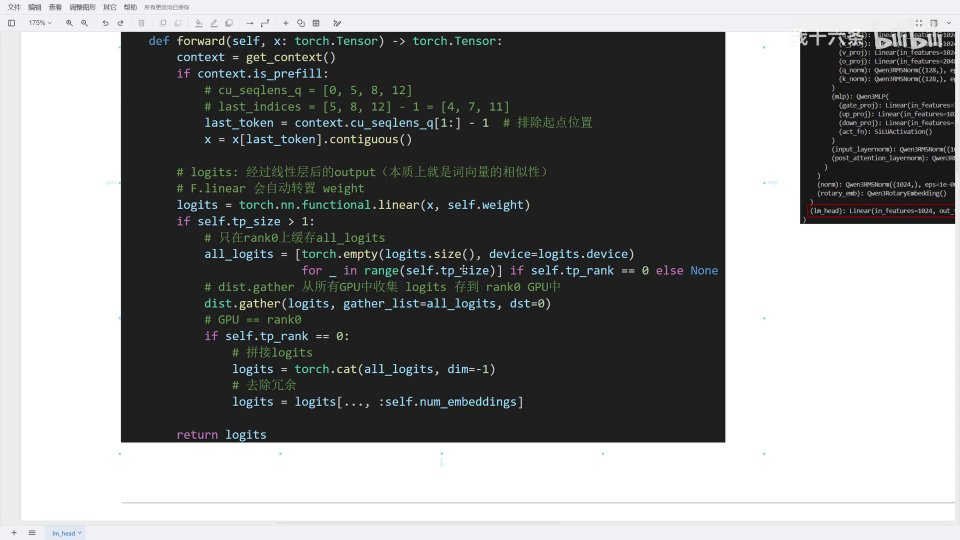 |
| 把所有收集到的 logits 存到 all_logits 中。然后在 GPU 等于 0（rank0）的情况下还要做一件事：首先把所有 logits 沿着最后一维（也就是列表里词表那一维）拼接在一起，让它变成一个完整的词表；然后做一次去除冗余——因为有时候会存在冗余，比如词表长度不能被 GPU 数量整除的时候，就是上一章讲的为什么要补零，补的那个零实际上就是冗余。这个地方把冗余去掉，只取到词表长度那一片。它做的就是这么一个事情。好，我们看完代码了，来看一下例子。 [【跳转到 05:10】](https://www.bilibili.com/video/BV1GWcbzWE1x/?t=310) |  |
| 不能被 GPU 整除时，就是上一章讲的为什么要补零，补的那个零实际上就是冗余。这里把冗余去掉，只取到词表长度那一片。它做的就是这么一个事情。OK，我们看完代码了，来看一下例子。 [【跳转到 05:35】](https://www.bilibili.com/video/BV1GWcbzWE1x/?t=335) |  |
| 讲一下例子。 [【跳转到 05:57】](https://www.bilibili.com/video/BV1GWcbzWE1x/?t=357) | 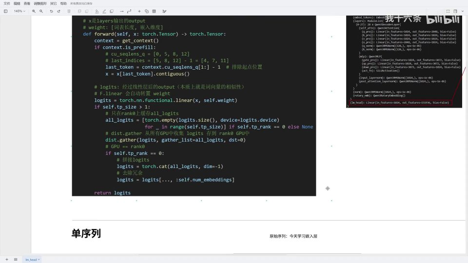 |
| 好，我们先看一个单序列的情况：原始序列是「今天学习嵌入层」， [【跳转到 06:02】](https://www.bilibili.com/video/BV1GWcbzWE1x/?t=362) | 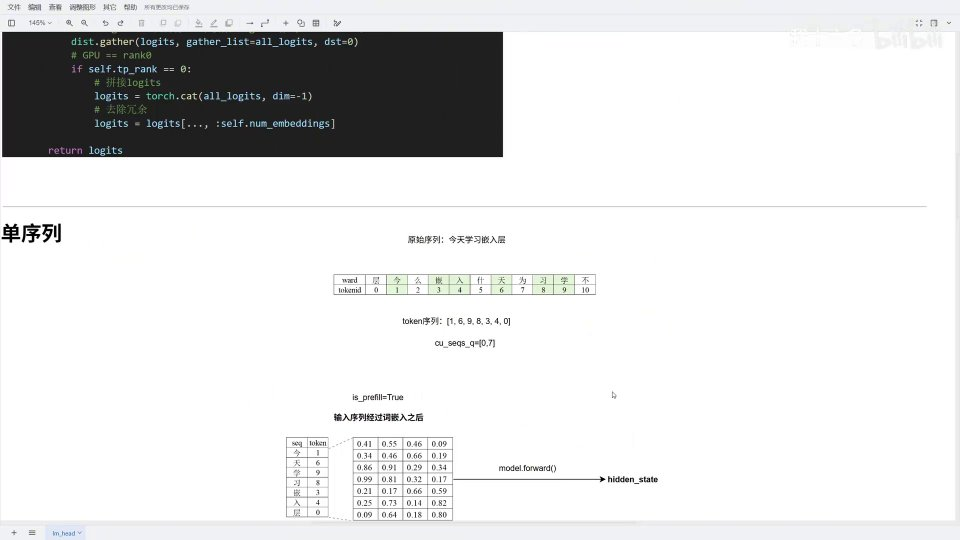 |
| 经过查表得到 token，也就是做了 tokenization，然后得到 cu_seqlens。这里的 0~7 是什么意思？就是序列的起点。这里面实际上只有一个序列，序列起点是 0，终点是 7，它的 last token 就是 7-1=6，所以取的就是第 6 个，第 6 个就是它的 last token。然后我们来看它在预填充的时候， [【跳转到 06:07】](https://www.bilibili.com/video/BV1GWcbzWE1x/?t=367) | 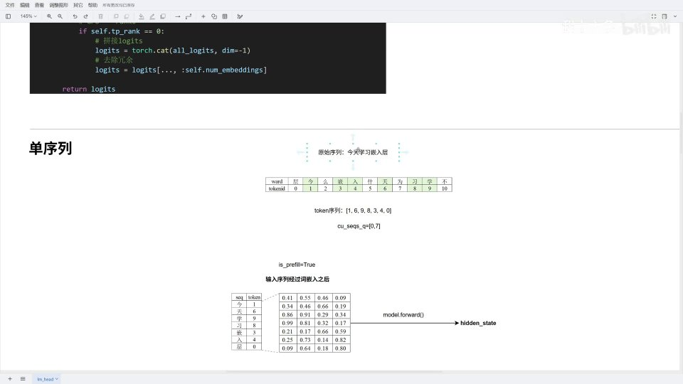 |
| 在 lm_head 里面是怎么做的。这是我们的 token 序列「今天学习嵌入层」，token 是 1 6 9 8 3 4 5，经过词嵌入之后是这样一个矩阵，做前向传播，最后得到一个 output，这个模型的 output 实际上就是这一块。 [【跳转到 06:31】](https://www.bilibili.com/video/BV1GWcbzWE1x/?t=391) | 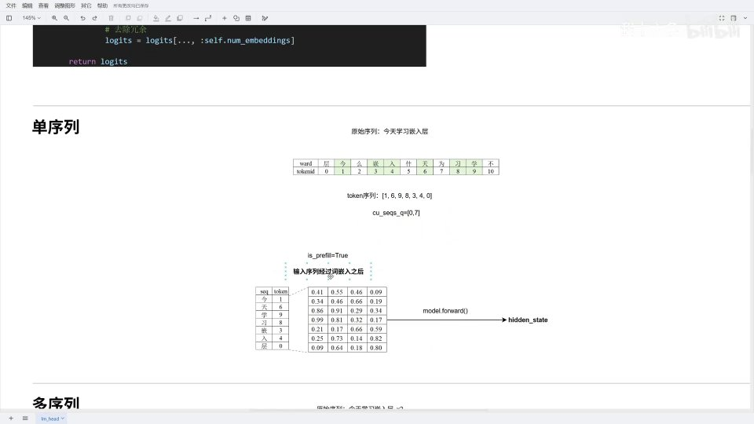 |
| 这个就是 output。得到这个 output 之后就去做 lm_head 了。 [【跳转到 06:56】](https://www.bilibili.com/video/BV1GWcbzWE1x/?t=416) | 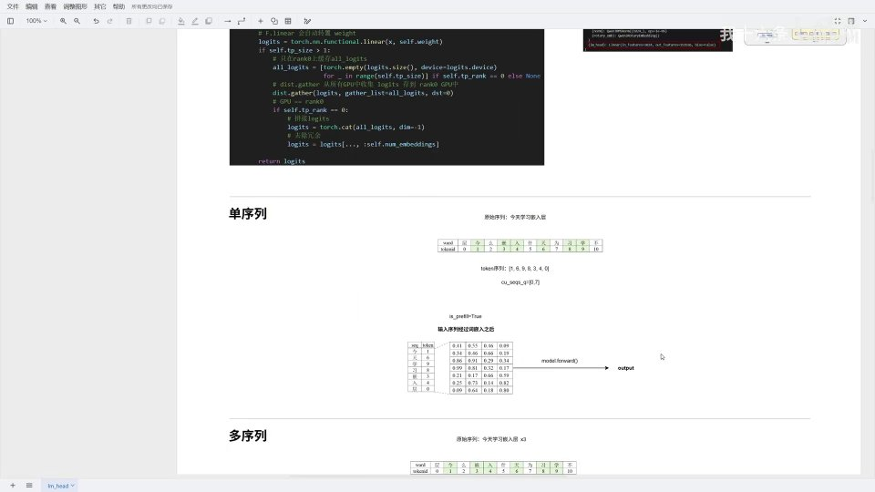 |
| 单序列这里我只是为了解释 cu_seqlens 这一块和多序列有什么不一样，然后我们来看多序列的情况。 [【跳转到 07:01】](https://www.bilibili.com/video/BV1GWcbzWE1x/?t=421) | 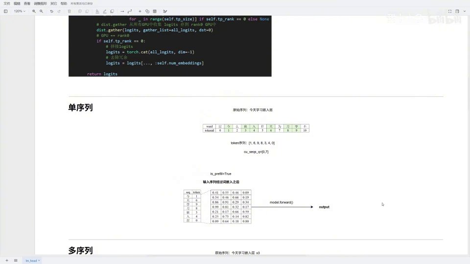 |
| 比如我们原始序列是「今天学习嵌入层」，但这个序列有三个，那这三个序列输入进来后，在序列长度允许的情况下会把它拼成一个序列。一个序列经过词表之后，相当于重复了三次。它的 sequence 部分就是 sequence1、 [【跳转到 07:11】](https://www.bilibili.com/video/BV1GWcbzWE1x/?t=431) | 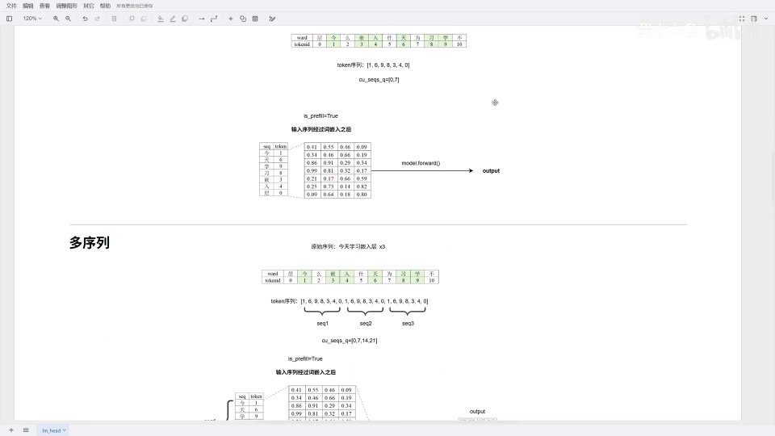 |
| sequence2、sequence3。这个 cu_seqlens 就是 0 7 14 21，意思是第一个序列从位置 0 开始，结束位置是 7；第二个序列起始位置是 7，结束位置是 14；第三个序列起始位置是 14，结束位置是 21。我们可以数一下：第一个序列从 0 位置开始 0 1 2 3 4 5 6 到 7 结束， [【跳转到 07:36】](https://www.bilibili.com/video/BV1GWcbzWE1x/?t=456) | 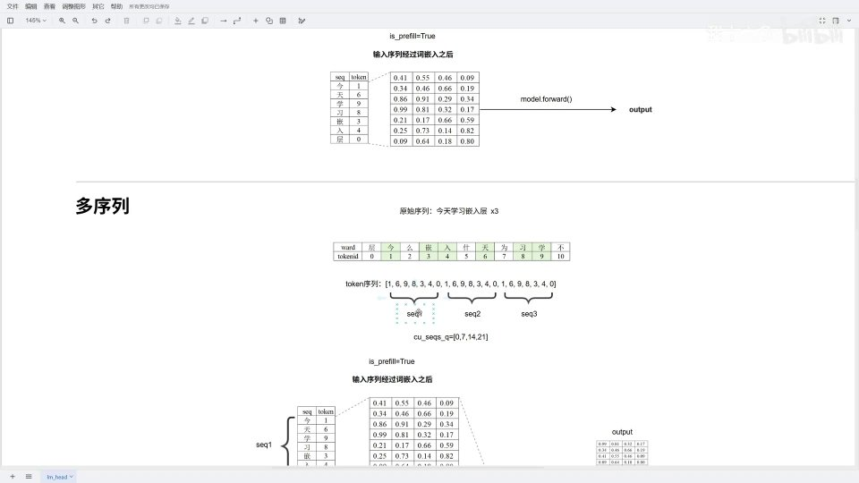 |
| 第二个序列从第 7 个位置开始 7 8 9 10 11 12 13，到 14 结束，第三个序列就是 14~21，14 开始、20 结束、21 收尾。这就是 cu_seqlens，我觉得不难理解。然后我们来看预填充在 lm_head 里 [【跳转到 08:01】](https://www.bilibili.com/video/BV1GWcbzWE1x/?t=481) | 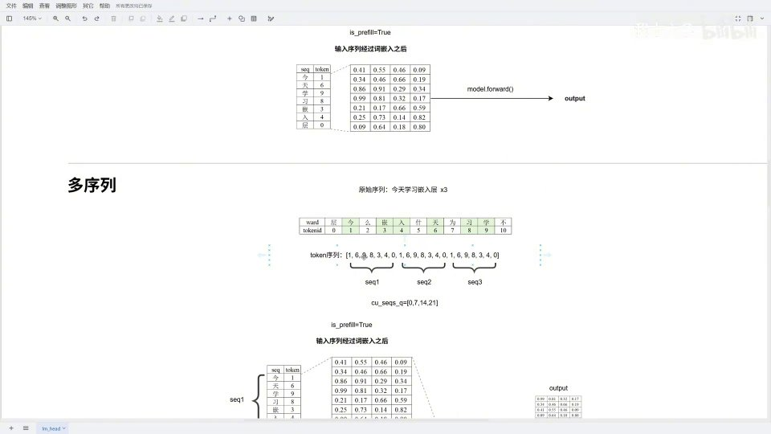 |
| 是怎么做的。首先是三个序列，经过 tokenization 得到一串 token，再经过词嵌入得到一个嵌入矩阵；得到矩阵之后做前向传播，模型最后得到一个 output，这就是即将进入 lm_head 的 output。然后我们把这个 output 传入 parallel_lm_head 里去做前向传播。好，我们来看一下：首先这个 X——因为我们只取序列的 last token，也就是刚才代码讲的那一部分，就是这一部分。 [【跳转到 08:26】](https://www.bilibili.com/video/BV1GWcbzWE1x/?t=506) | 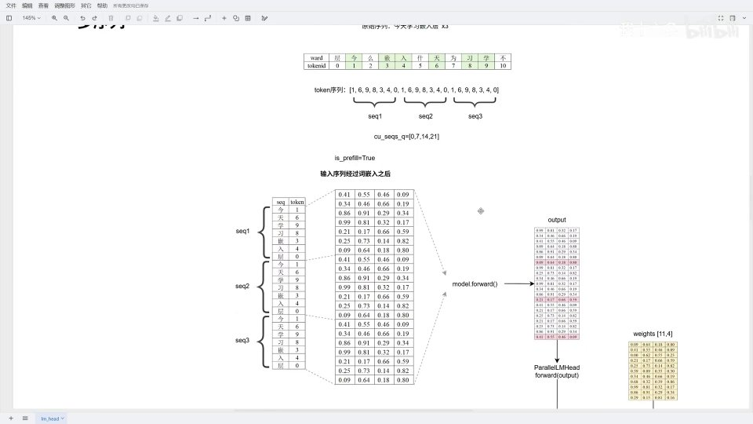 |
| lm_head 里边去做前向传播。好，我们来看一下：首先这个 X——因为我们的 X 只取序列的 last token，也就是刚才代码讲的那一部分。 [【跳转到 08:51】](https://www.bilibili.com/video/BV1GWcbzWE1x/?t=531) | 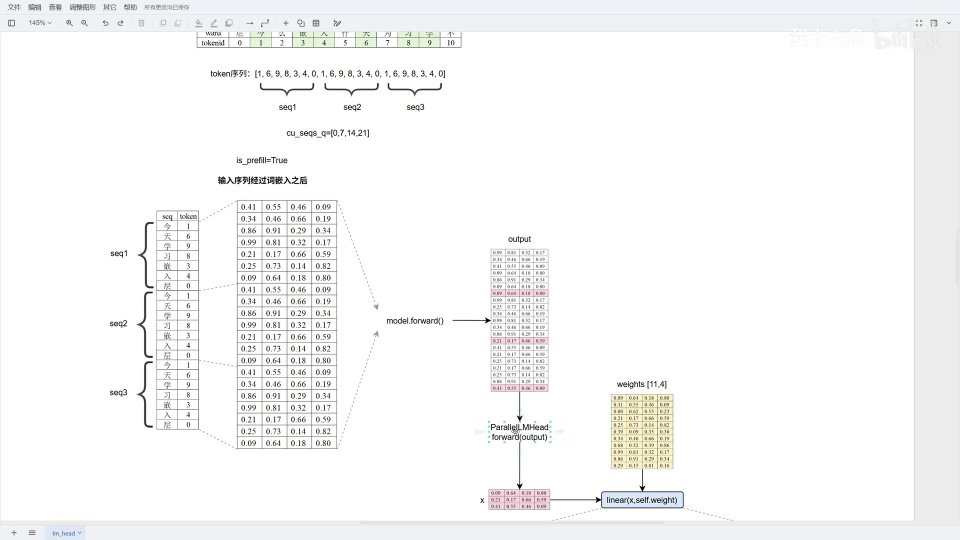 |
| （此区间无字幕） [【跳转到 09:06】](https://www.bilibili.com/video/BV1GWcbzWE1x/?t=546) | 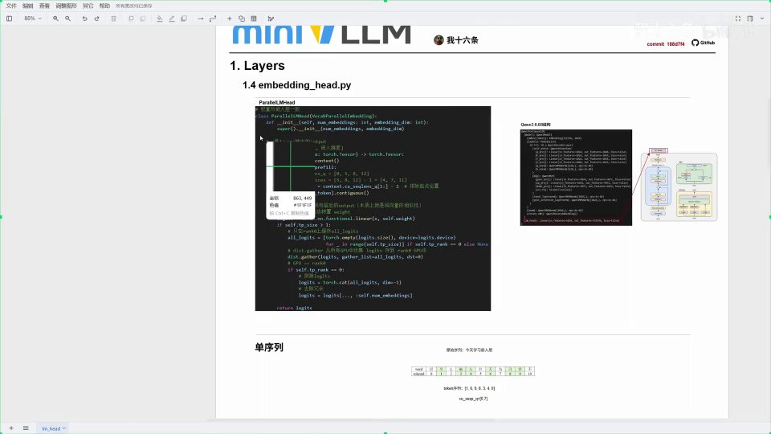 |
| （此区间无字幕） [【跳转到 09:11】](https://www.bilibili.com/video/BV1GWcbzWE1x/?t=551) | 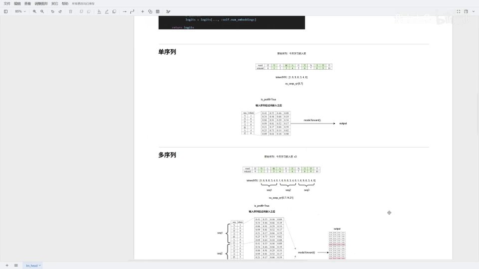 |
| 我们来看一下 X。 [【跳转到 09:16】](https://www.bilibili.com/video/BV1GWcbzWE1x/?t=556) | 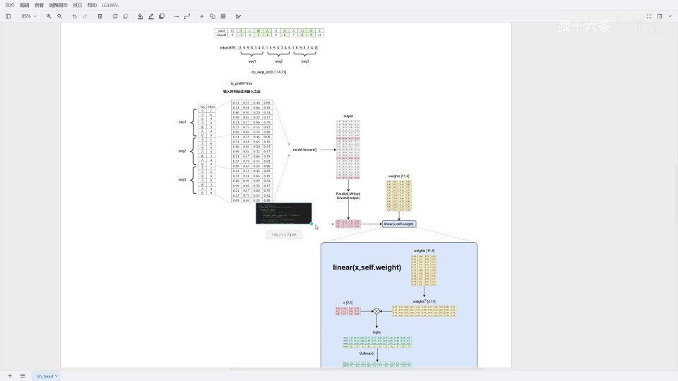 |
| 这个 X 实际上就是这个地方。因为我们只取了 last token，按刚才讲的 last token 计算方式， [【跳转到 09:21】](https://www.bilibili.com/video/BV1GWcbzWE1x/?t=561) |  |
| 实际上就是通过 cu_seqlens [【跳转到 09:27】](https://www.bilibili.com/video/BV1GWcbzWE1x/?t=567) | 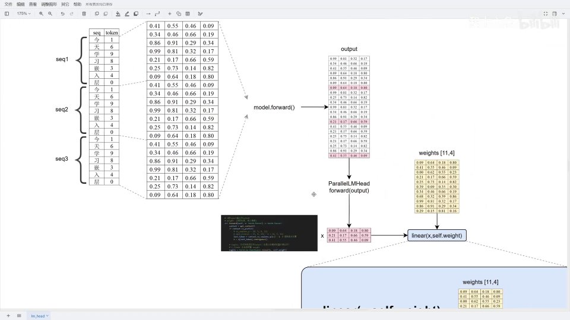 |
| 排除第一个位置后，取每个序列结束位置减一的那个位置。也就是说，如果有三个序列， [【跳转到 09:32】](https://www.bilibili.com/video/BV1GWcbzWE1x/?t=572) | 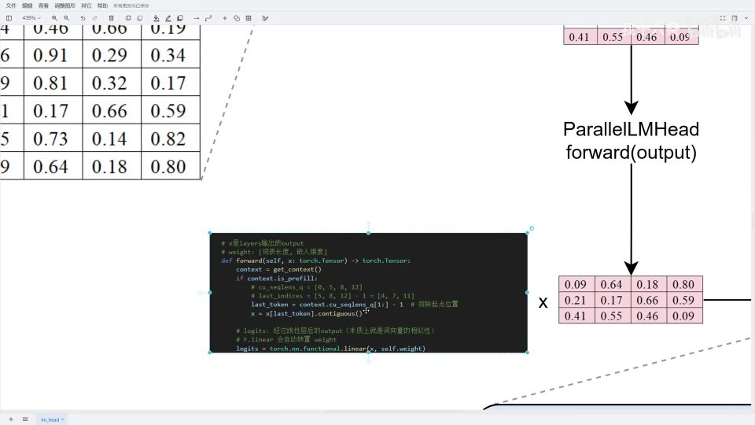 |
| 得到的三个 last token 就分别是标红的这三个。这个 X 就是把它们在内存中变成连续的， [【跳转到 09:39】](https://www.bilibili.com/video/BV1GWcbzWE1x/?t=579) | 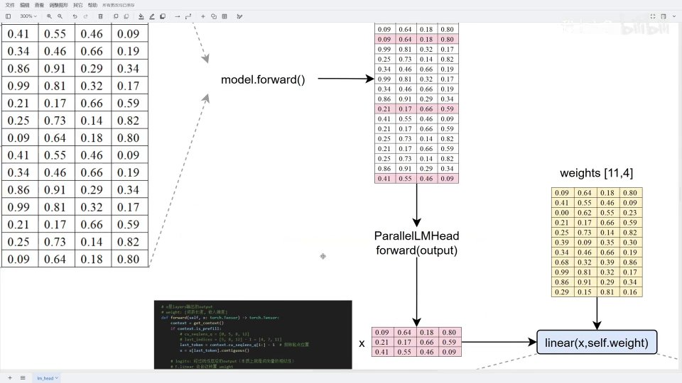 |
| 这里就是 X 的 last_token_continues，最后得到的 X 就是这样一个矩阵。得到 X 之后， [【跳转到 09:44】](https://www.bilibili.com/video/BV1GWcbzWE1x/?t=584) | 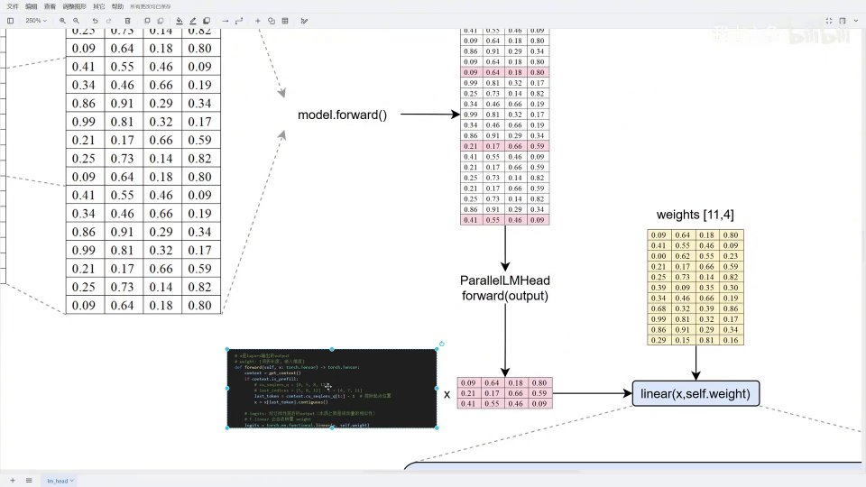 |
| 我们继续去计算 logits。这个时候把 X 和权重（weight）作为输入， [【跳转到 09:52】](https://www.bilibili.com/video/BV1GWcbzWE1x/?t=592) | 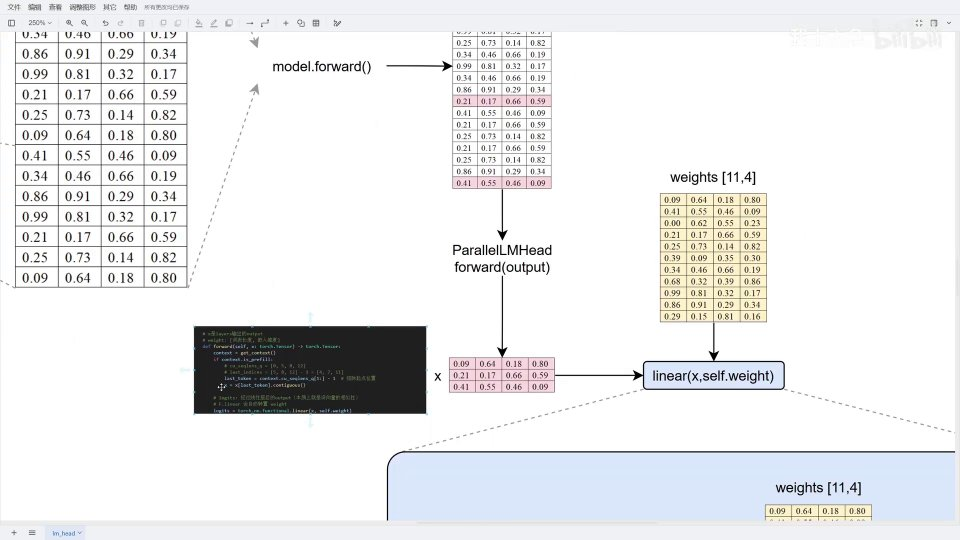 |
| 这个位置就是它的权重，放进线性层。因为我们这个多序列目前讲的是单机单卡，所以权重不会做切分，是一块完整的矩阵。OK，我们来看一下这个线性层内部具体发生了什么。 [【跳转到 09:57】](https://www.bilibili.com/video/BV1GWcbzWE1x/?t=597) | 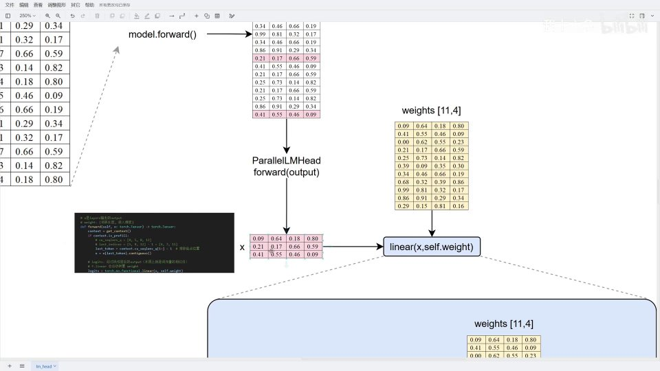 |
| 目前讲的是单机单卡的情况，所以权重不会做切分，是一块完整的矩阵。OK，我们来看一下这个线性层内部具体发生了什么。 [【跳转到 10:03】](https://www.bilibili.com/video/BV1GWcbzWE1x/?t=603) | 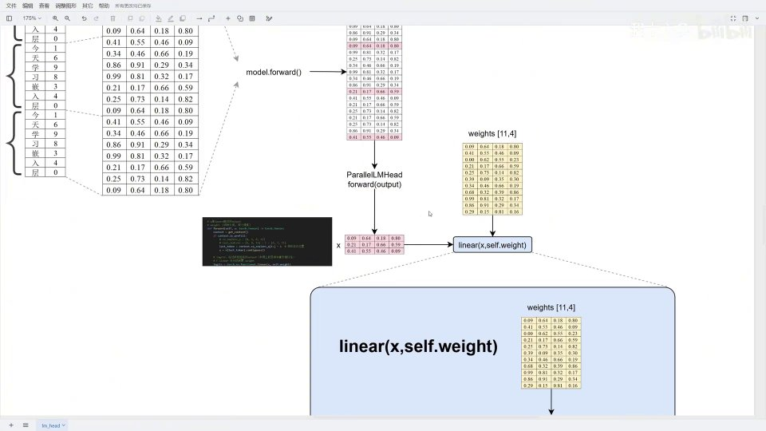 |
| 首先 X 和 weight 已经传进来了，X 的形状不变，但它会对权重做一个转置，然后做一个矩阵乘， [【跳转到 10:14】](https://www.bilibili.com/video/BV1GWcbzWE1x/?t=614) | 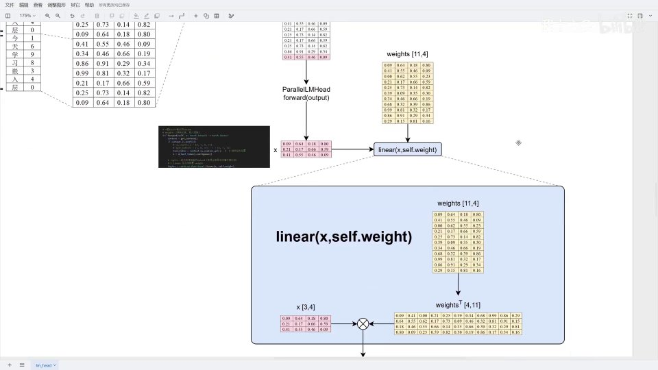 |
| 输出的就是 logits。它这里实际上做的是点积，但本质上我觉得就是查询我这个 token [【跳转到 10:22】](https://www.bilibili.com/video/BV1GWcbzWE1x/?t=622) | 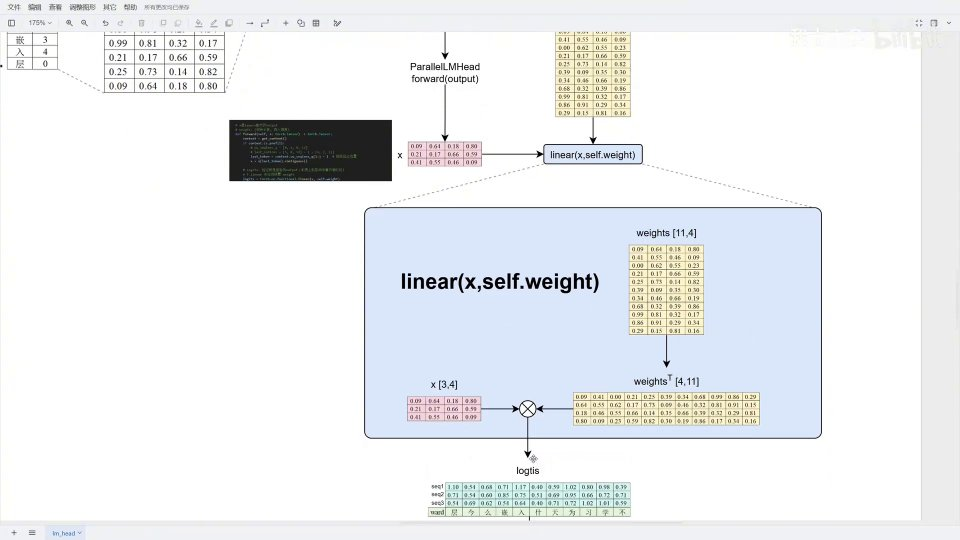 |
| 与词表中 token 的相似度。这个值其实就是相似度，相似度越高，说明选这个词的概率越高。比如这里最高的相似度是 1.17，就是这个 token，它的 logits 实际上是最高的，logits 越高说明相似性越高。然后做 softmax，就可以确定下一个词输出的概率，比如这个 13%， [【跳转到 10:27】](https://www.bilibili.com/video/BV1GWcbzWE1x/?t=627) |  |
| 也就是这个 token 可能是之后输出的那个词的概率最高的。具体是哪一个词，就要看我们的采样策略，比如温度、比如概率采样的 top-k，具体策略我们之后讲。 [【跳转到 10:52】](https://www.bilibili.com/video/BV1GWcbzWE1x/?t=652) | 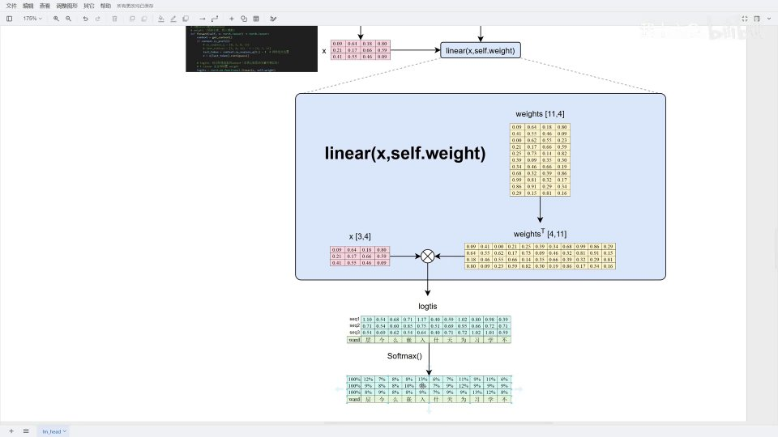 |
| 我还需要补充一点：因为我们这里都是在预填充的情况下这样处理的， [【跳转到 11:11】](https://www.bilibili.com/video/BV1GWcbzWE1x/?t=671) | 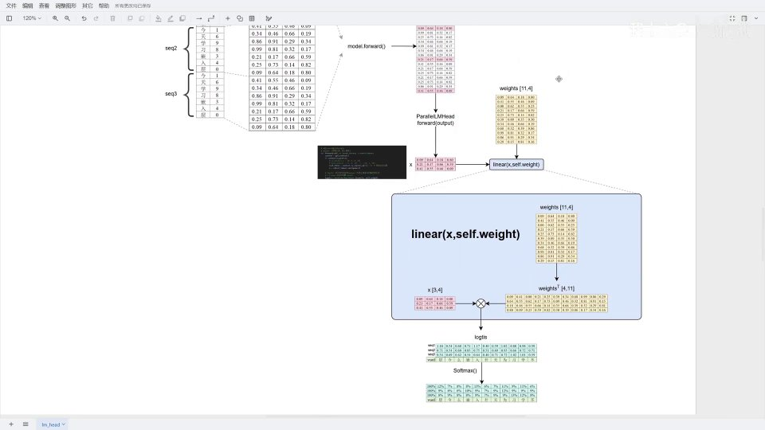 |
| 但实际上在解码（decode）阶段，它只有一个 token 传进来， [【跳转到 11:16】](https://www.bilibili.com/video/BV1GWcbzWE1x/?t=676) | 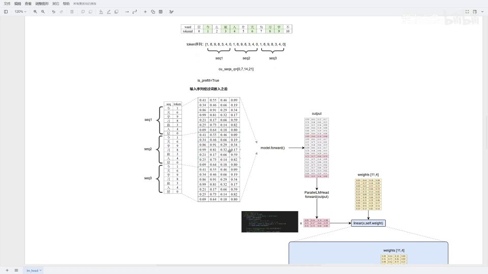 |
| 就一个 token 去做查表，输出的就是一个 token 的 softmax 和 logits。因为 decode 阶段相对预填充更简单，所以我这边就没有再做 decode 的例子了。大家理解的时候只需要知道，decode 阶段传进来的 X 只有一个，而且不需要 [【跳转到 11:21】](https://www.bilibili.com/video/BV1GWcbzWE1x/?t=681) | 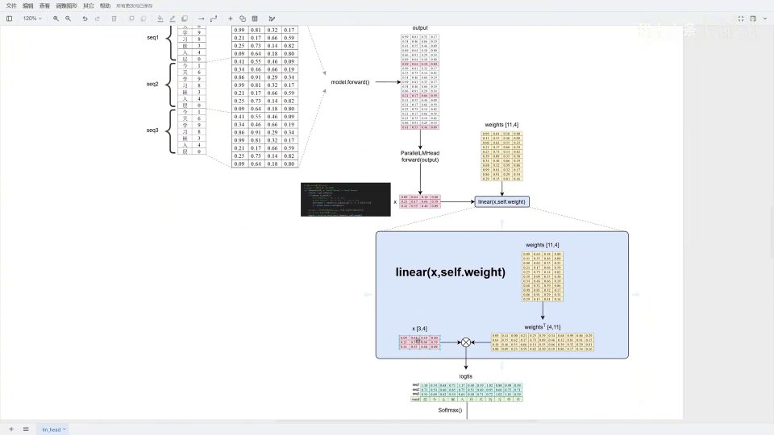 |
| 取 last token，因为取 last token 只在预填充阶段才会做。如果是 decode 阶段，它是直接就算 logits 了。 [【跳转到 11:43】](https://www.bilibili.com/video/BV1GWcbzWE1x/?t=703) | 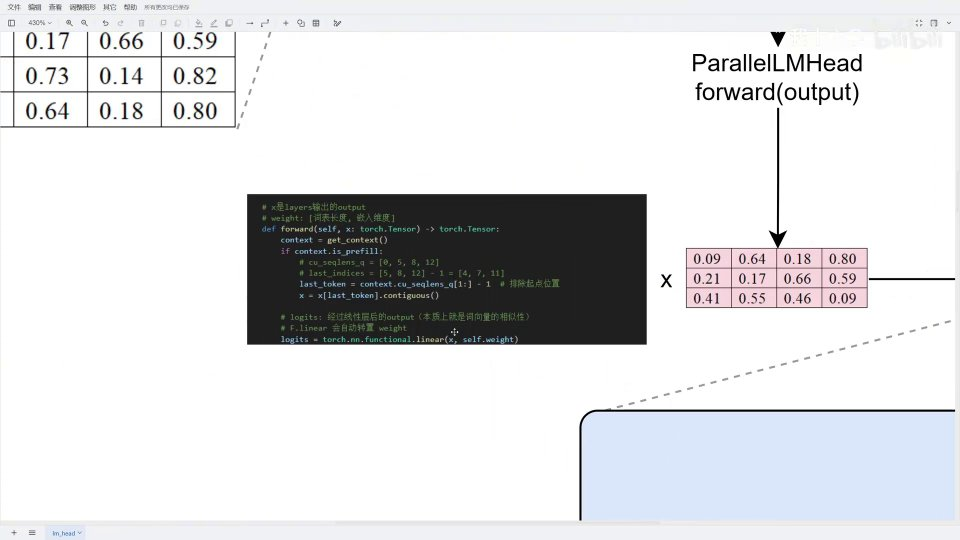 |
| OK，然后我们来看并行环境，也就是单机多卡的情况。 [【跳转到 11:53】](https://www.bilibili.com/video/BV1GWcbzWE1x/?t=713) | 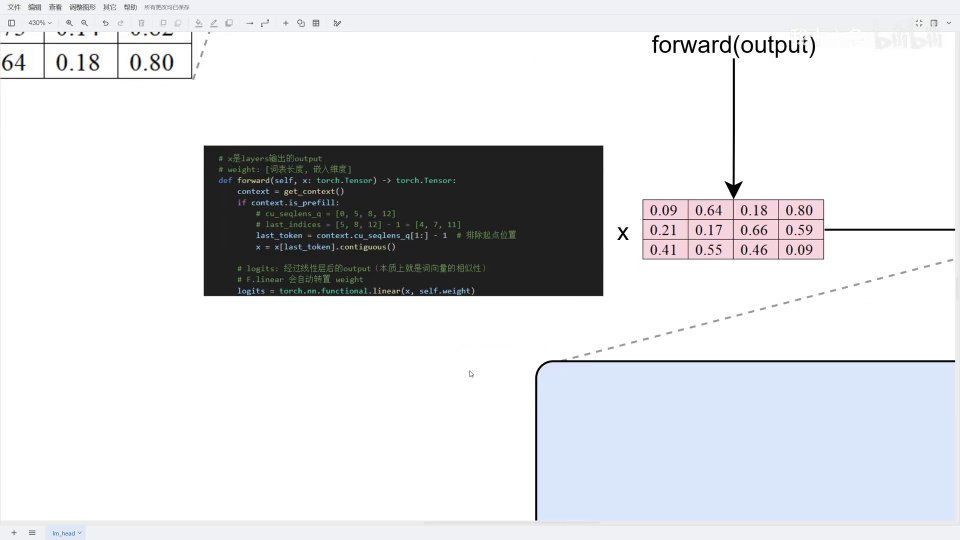 |
| 首先要知道一个情况：我们词表长度是 15 万，本地存储实际上就是 15 万的长度、1024 的嵌入维度（这里只是示意一下，其实不是精确的值）。因为我们前面做列并行的时候知道，权重存储是「输出维度 × 输入维度」，我们是沿着输出维度去裁的。本质上我们在做 lm_head 的并行时， [【跳转到 11:58】](https://www.bilibili.com/video/BV1GWcbzWE1x/?t=718) | 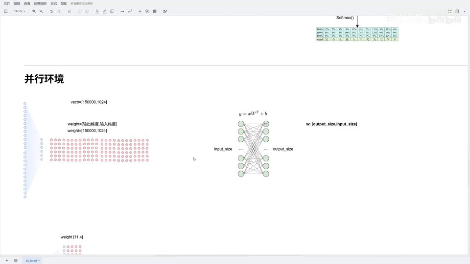 |
| 它其实也是列并行，也就是沿着词表维度、也就是 output size 去裁。也就是说每一张 GPU 只维护一部分词表，并沿着词表维度做了拆分。我们先看一下本地存储的权重，还是以词表长度 11、嵌入维度 4 的情况来讲解。 [【跳转到 12:23】](https://www.bilibili.com/video/BV1GWcbzWE1x/?t=743) | 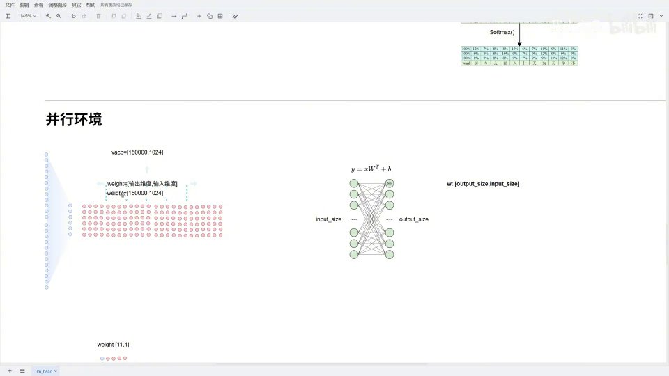 |
| 在双卡的情况下，因为词表长度是 11，之前讲过，如果词表长度不能被 GPU 数量整除，就需要向上取整、做补齐，那这个白色的权重实际上就是 0，也就是补齐的部分。补齐之后，实际维度就变成了 12。 [【跳转到 12:48】](https://www.bilibili.com/video/BV1GWcbzWE1x/?t=768) | 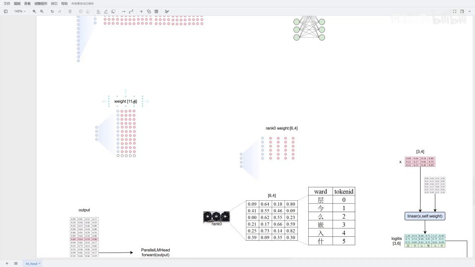 |
| 我们来看权重：因为本质上是列并行，沿着输出维度（也就是这个维度）去拆分，那 rank0 实际上维护了词表的上半部分，rank1 维护词表的下半部分。rank0 中存放的权重就是这样的 6×4，是整个词表的上半部分；那这个就是整个词表的下半部分， [【跳转到 13:13】](https://www.bilibili.com/video/BV1GWcbzWE1x/?t=793) | 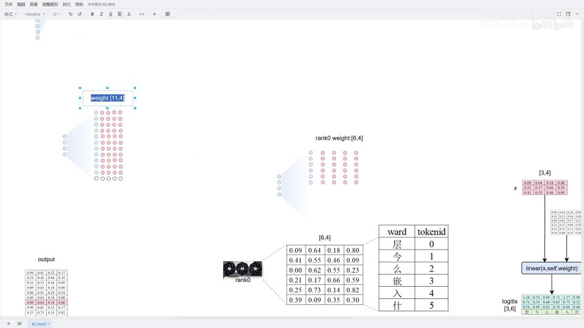 |
| 但除了冗余部分，实际上只有上面这五个能在词表里有对应，下面的就是冗余部分，会对它做额外处理。然后我们还是得到 output：这是模型已经输出 output 之后，再传入这一层做前向传播。传入的 output，实际上 X 就是三个 token，比如我们三个序列 [【跳转到 13:38】](https://www.bilibili.com/video/BV1GWcbzWE1x/?t=818) | 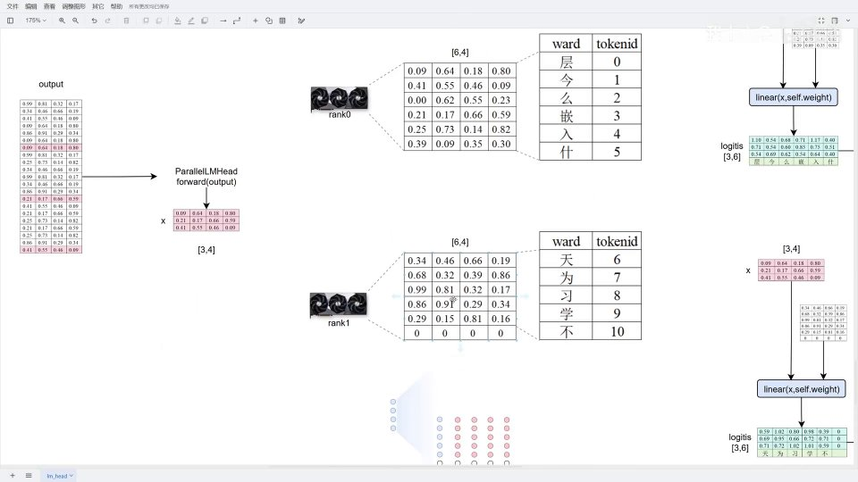 |
| 各自的最后一个 token 就是这三个，得到 X 后把它们拼接在一起，因为在内存上做了连续，得到一个 3×4 的 tensor。我们来看在 rank0 中它是怎么做的：rank0 中 X 传进来，矩阵就是这一块 6×4，然后 3×4，在这里做了一个线性运算，内部输出就是这个 logits， [【跳转到 14:03】](https://www.bilibili.com/video/BV1GWcbzWE1x/?t=843) | 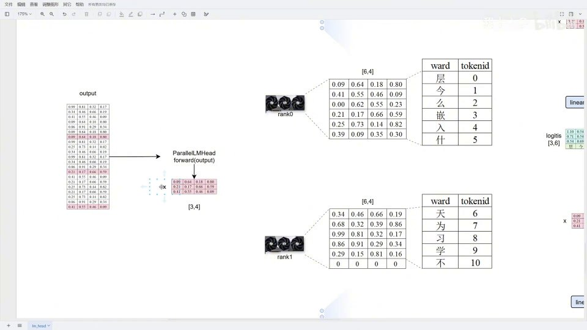 |
| 也就是我们刚才讲的，但它这个 logits 实际上只有一部分，这一点要明确。然后 rank1 上其实也是这样的，传入的 X 不会被拆分，矩阵是下半部分那个词表，得到的是下半部分词表的 logits。rank0 和 rank1 都维护了一部分词表、输出了各自的 logits，这个时候我们就需要对它做一个 [【跳转到 14:28】](https://www.bilibili.com/video/BV1GWcbzWE1x/?t=868) | 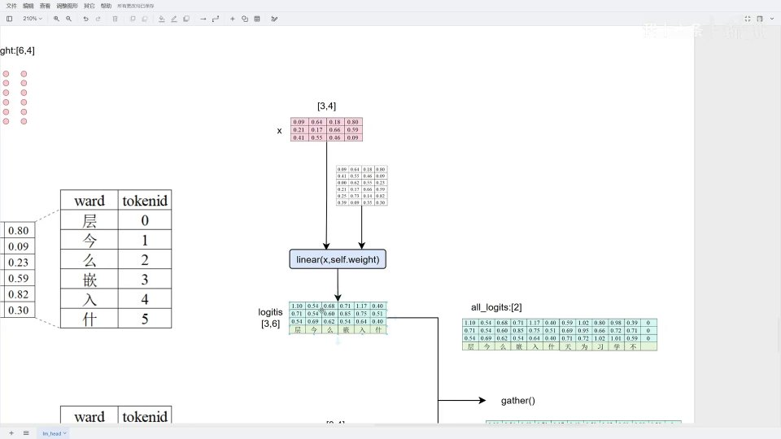 |
| 聚合操作，做一个合并。合并操作我还是把代码贴过来， [【跳转到 14:53】](https://www.bilibili.com/video/BV1GWcbzWE1x/?t=893) | 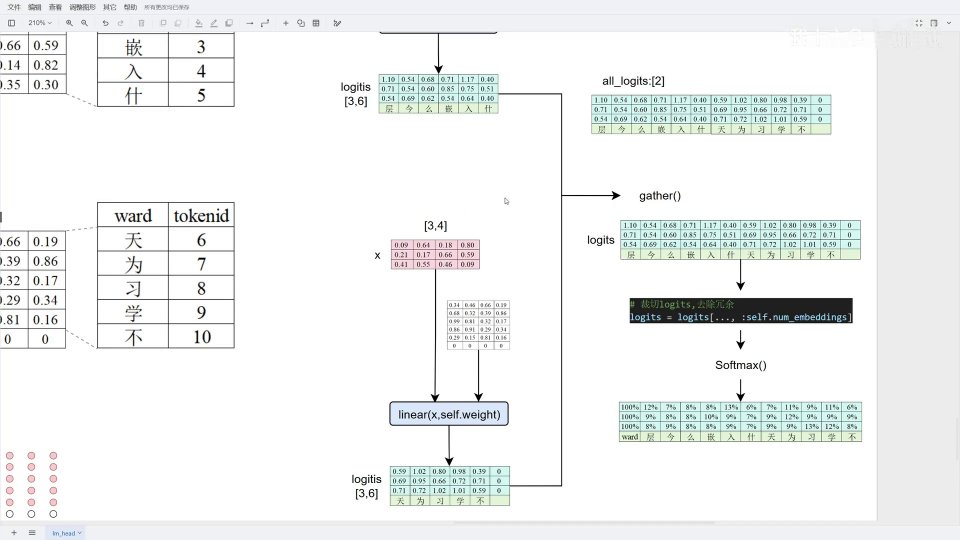 |
| 实际上就是这一部分。 [【跳转到 14:58】](https://www.bilibili.com/video/BV1GWcbzWE1x/?t=898) | 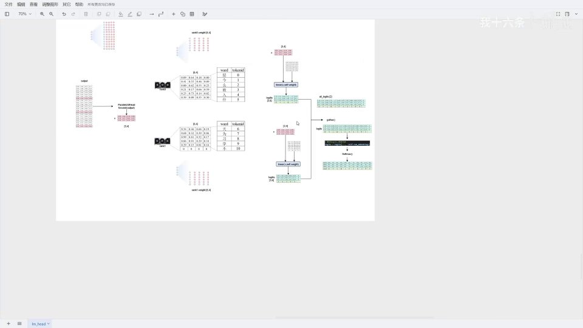 |
| （此区间无字幕） [【跳转到 15:05】](https://www.bilibili.com/video/BV1GWcbzWE1x/?t=905) | 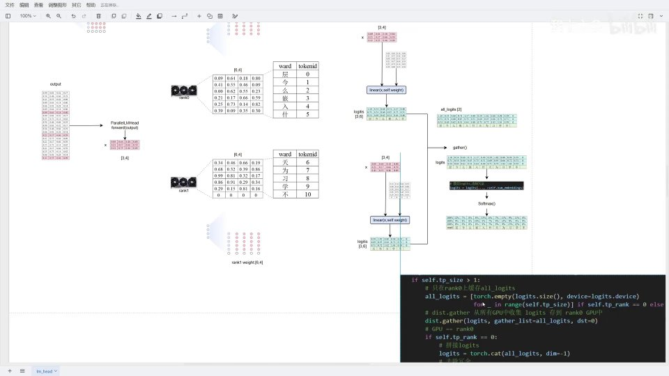 |
| 然后在 tp_size 大于 1、也就是并行的情况下，rank0 上维护了一个 all_logits。它本来是分布式的 gather 操作，只在 GPU0 中把所有 logits 收集到 all_logits 中，所以我们的 all_logits 本质上就是一个 2×3×6 的 tensor。然后沿着最后一维做拼接， [【跳转到 15:10】](https://www.bilibili.com/video/BV1GWcbzWE1x/?t=910) | 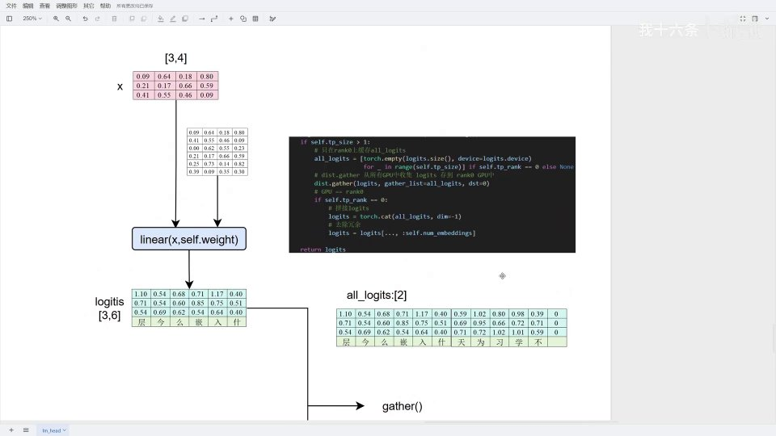 |
| 沿着它的最后一个维度拼接，就变成这样。这个 all_logits 实际上就变成了完整的 logits，它是一个 3×12 的 tensor。 [【跳转到 15:35】](https://www.bilibili.com/video/BV1GWcbzWE1x/?t=935) |  |
| 得到这个 3×12 的 tensor 之后，再做去除冗余，就是代码的这一部分， [【跳转到 15:50】](https://www.bilibili.com/video/BV1GWcbzWE1x/?t=950) | 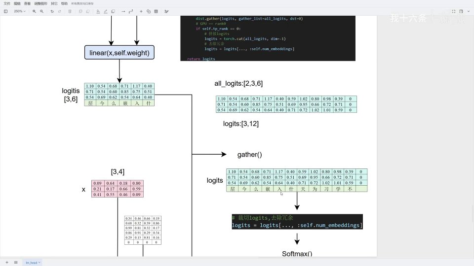 |
| 把这个零去掉，因为取 logits 只取 num_embeddings 之前的——我们词表长度是 11，所以这里实际上只取了 11，只取这一部分。然后做 softmax， [【跳转到 15:55】](https://www.bilibili.com/video/BV1GWcbzWE1x/?t=955) | 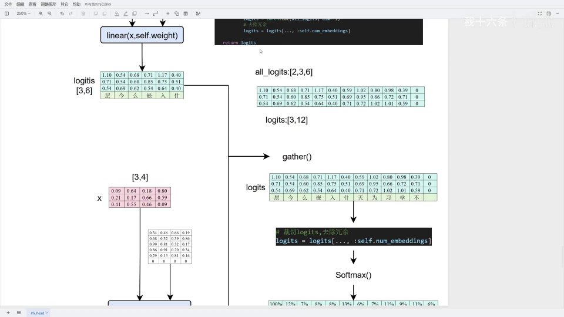 |
| 计算每一个词的概率，最后再去做采样。这就是并行情况下的做法， [【跳转到 16:14】](https://www.bilibili.com/video/BV1GWcbzWE1x/?t=974) |  |
| 稍微有一点不一样，主要就是多了一个去除冗余的步骤。 [【跳转到 16:20】](https://www.bilibili.com/video/BV1GWcbzWE1x/?t=980) | 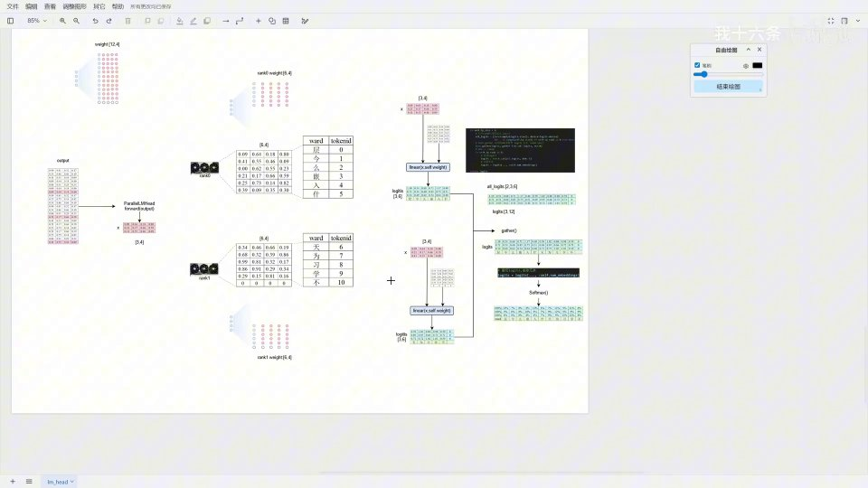 |
| 然后就是词表的拆分，因为要知道 lm_head 做并行的时候实际上是列并行。知道这一点其实就可以了。它的 decode 阶段其实也一样：当只有一个 X、只有一个 token 的时候，decode 阶段就只有一个，不用管这么多，X 进来，计算，然后还是做拼接，再把冗余去掉，就可以了，最后得到的其实就是一行，只有一行而已。 [【跳转到 16:25】](https://www.bilibili.com/video/BV1GWcbzWE1x/?t=985) | 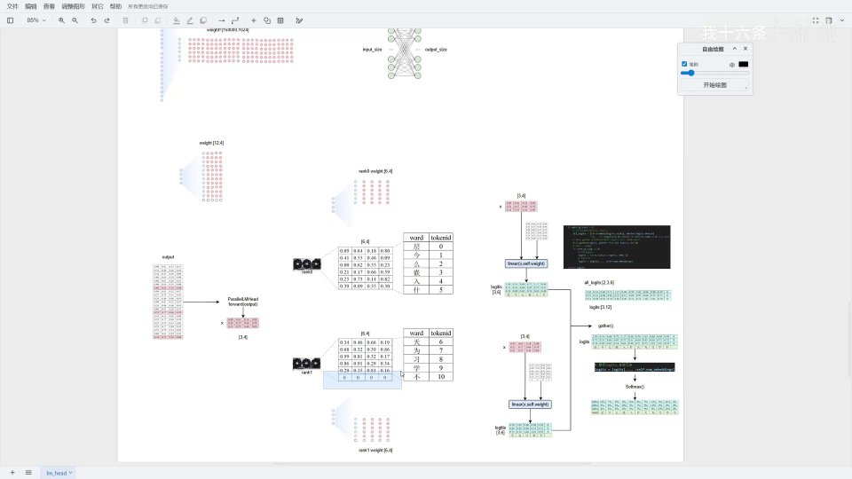 |
| 这就是预填充和 decode 最大的区别。预填充其实要稍微难一点。 [【跳转到 16:50】](https://www.bilibili.com/video/BV1GWcbzWE1x/?t=1010) | 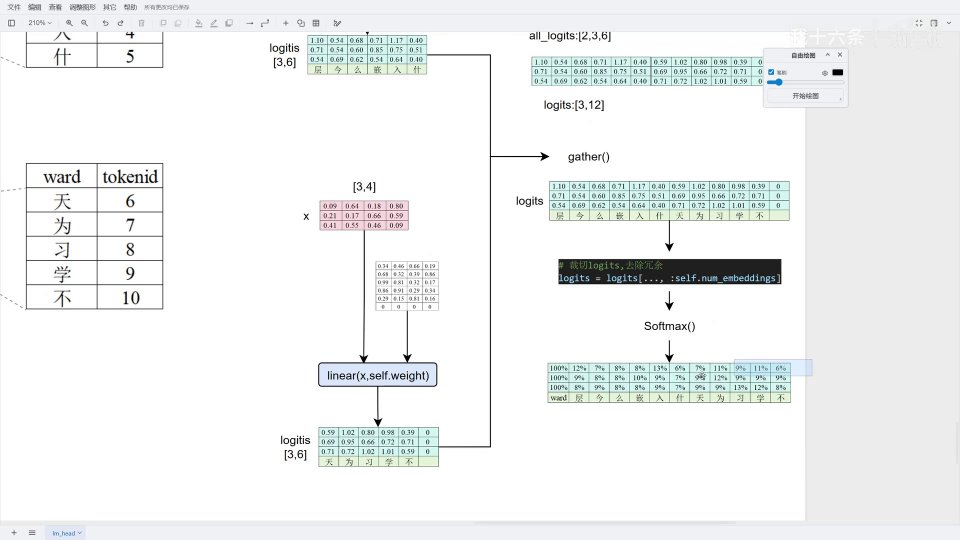 |
| 今天这一部分就讲到这里。我觉得这一部分我讲得不是很好，大家在理解的时候， [【跳转到 16:58】](https://www.bilibili.com/video/BV1GWcbzWE1x/?t=1018) | 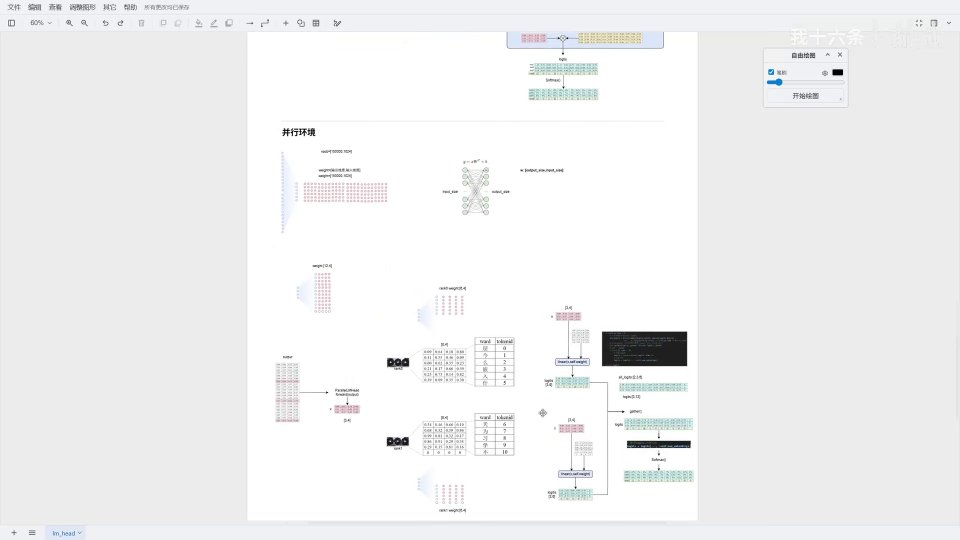 |
| 最好还是结合代码一行一行看。如果对里面的 logits、或者对它的流程、或者 softmax 不太清楚， [【跳转到 17:07】](https://www.bilibili.com/video/BV1GWcbzWE1x/?t=1027) | 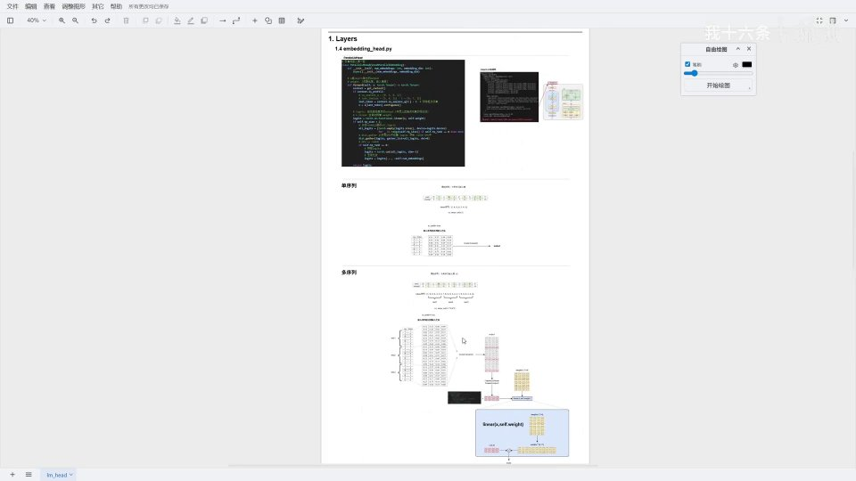 |
| 我建议还是从前面的大模型基础再学一学，那这一块应该就能理解了。嗯，就到这儿吧。 [【跳转到 17:13】](https://www.bilibili.com/video/BV1GWcbzWE1x/?t=1033) | 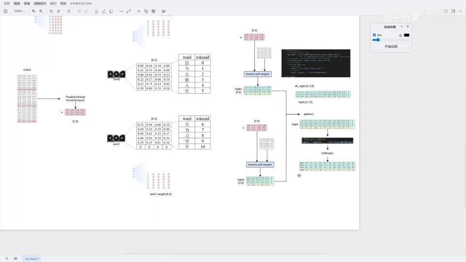 |
| 再去学一学，这一块应该就能理解了。嗯，就到这儿吧。 [【跳转到 17:18】](https://www.bilibili.com/video/BV1GWcbzWE1x/?t=1038) | 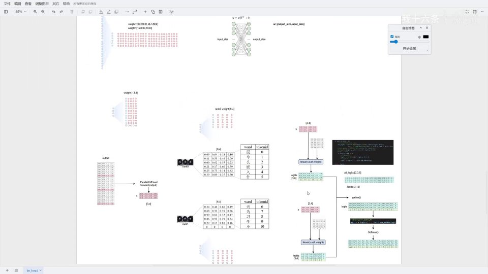 |