# 推理过程中Prefill阶段的GPU显存分配&Triton网格划分逻辑 原始文稿（图-字幕分栏）

| 字幕文本 | 画面 |
| :--- | ---: |
| 哈喽，好久不见。最近很忙，刚把大论文忙完，终于有时间更新了。可以看到今天的内容非常多，我的笔记也很长，但今天要分享的其实只是 attention 中预填充阶段的 FlashAttention 这一块。那我们就进入正题吧。 [【跳转到 00:00】](https://www.bilibili.com/video/BV1CNDgB4EYy/?t=0) | 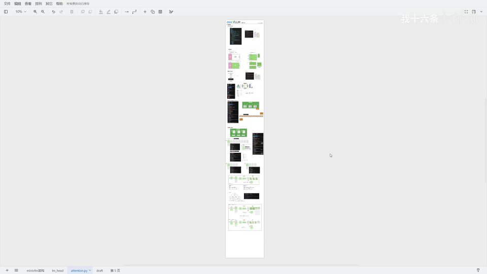 |
| 还是从代码开始看，这是 attention 的代码，这是 attention 的前向传播。 [【跳转到 00:25】](https://www.bilibili.com/video/BV1CNDgB4EYy/?t=25) | 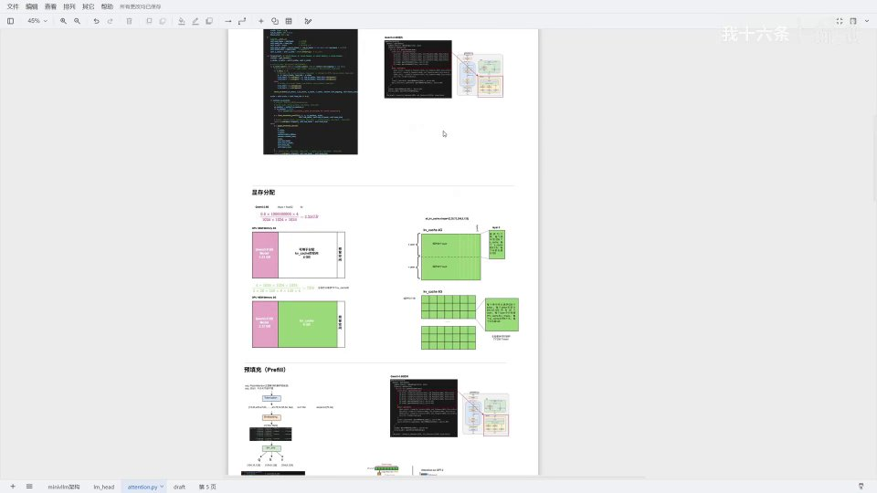 |
| 它内部其实分了两个阶段。 [【跳转到 00:30】](https://www.bilibili.com/video/BV1CNDgB4EYy/?t=30) | 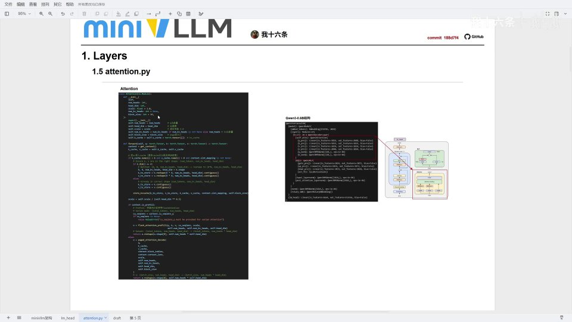 |
| 我们可以看一下：这里是初始化，这边是获取当前环境变量， [【跳转到 00:35】](https://www.bilibili.com/video/BV1CNDgB4EYy/?t=35) | 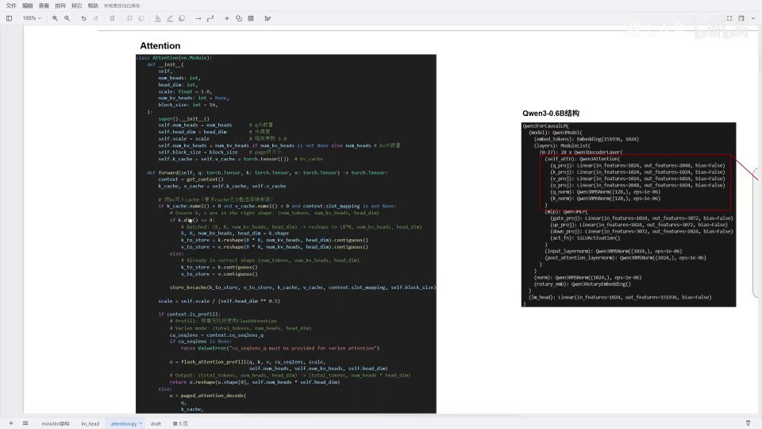 |
| 这里是配置 KV cache。如果有 KV cache，它会把 KV cache 写入内存，这个我们会在之后的章节分享，也就是保存 KV cache。 [【跳转到 00:40】](https://www.bilibili.com/video/BV1CNDgB4EYy/?t=40) | 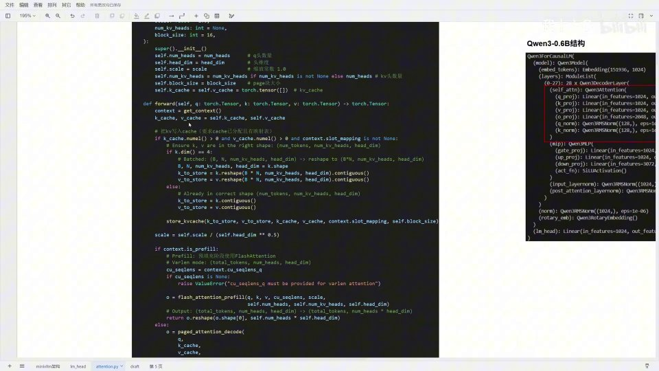 |
| 这个就是预填充，也是我们今天要分享的部分，主要讲这个地方。别看只有这么一点，但 FlashAttention 这个 prefill 算子要深入讲、讲明白，还是需要挺大篇幅的。 [【跳转到 00:49】](https://www.bilibili.com/video/BV1CNDgB4EYy/?t=49) |  |
| 然后这个是 PagedAttention，也就是 decode 阶段，也是之后的内容。我们来看一下 attention 在哪个地方， [【跳转到 01:04】](https://www.bilibili.com/video/BV1CNDgB4EYy/?t=64) | 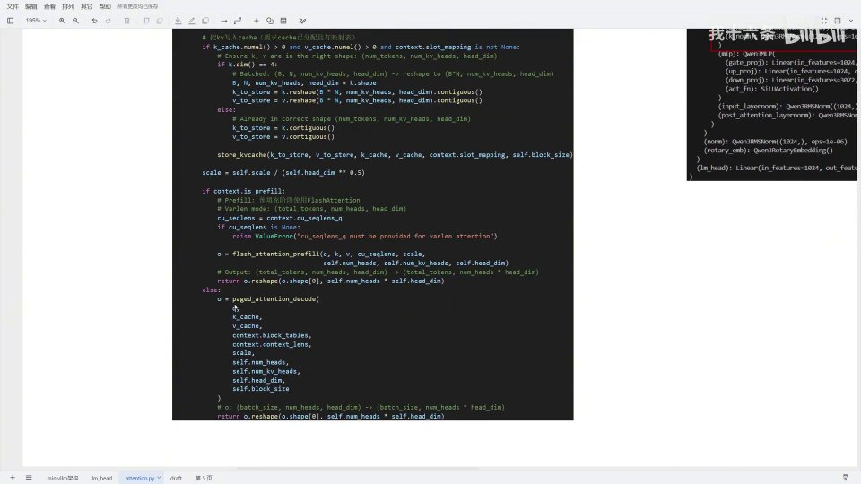 |
| 在 Qwen3-0.6B 里它是在这个地方。 [【跳转到 01:09】](https://www.bilibili.com/video/BV1CNDgB4EYy/?t=69) | 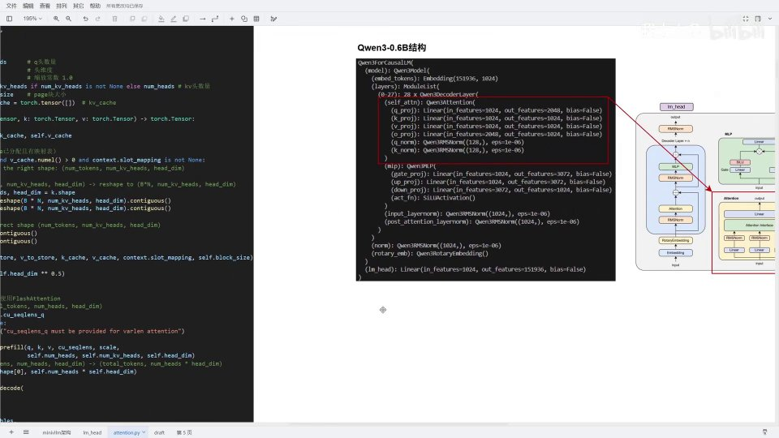 |
| 这就是一整个 attention 层：input 经过 QKV 线性变换，再经过 RMSNorm，然后做具体 attention 计算，再通过一个线性变换（output 的那个线性变换），最后输出 output。对应到我们之前打印的代码结构里就是 Q、K、V、O 加 Q norm——这四个线性层。但今天我们主要讲预填充阶段，也就是在 QKV 计算的过程中， [【跳转到 01:14】](https://www.bilibili.com/video/BV1CNDgB4EYy/?t=74) | 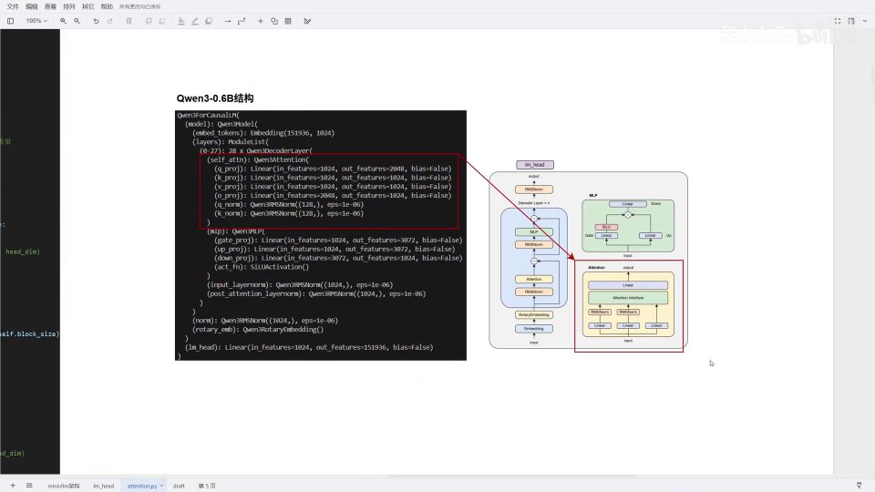 |
| 这几个线性层怎么做运算，以及 QKV 怎么在内存中进行 FlashAttention 计算。我觉得想把它搞明白还是需要 [【跳转到 01:39】](https://www.bilibili.com/video/BV1CNDgB4EYy/?t=99) |  |
| 自己动手把内存里那些 KV cache 画一遍， [【跳转到 01:51】](https://www.bilibili.com/video/BV1CNDgB4EYy/?t=111) | 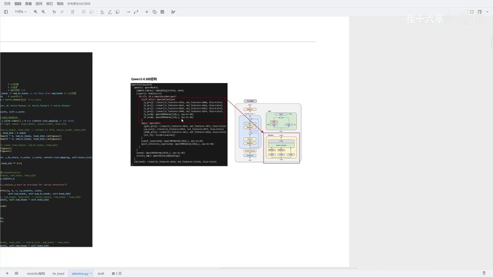 |
| 我觉得这对理解是有很大帮助的。 [【跳转到 01:56】](https://www.bilibili.com/video/BV1CNDgB4EYy/?t=116) | 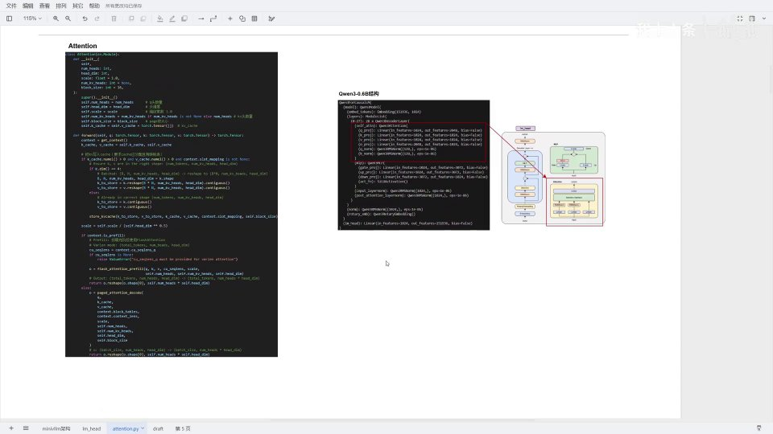 |
| OK，接下来我们来看显存分配。在具体运算过程中， [【跳转到 02:01】](https://www.bilibili.com/video/BV1CNDgB4EYy/?t=121) | 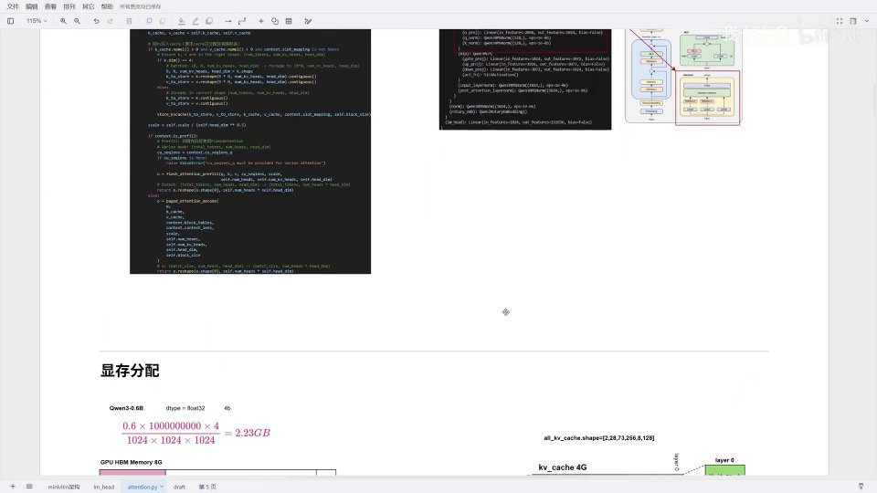 |
| 我们需要先把模型装配到内存中，把剩余空间用于做 KV cache。第一步先加载模型。比如 Qwen3-0.6B，它的数据类型是 float32、没有做量化，就是一个原始 32 位浮点数，一个参数大概占 4 个字节（这里是"大 B"，我写错了）。那 Qwen3-0.6B 具体占的内存就是这么多， [【跳转到 02:06】](https://www.bilibili.com/video/BV1CNDgB4EYy/?t=126) | 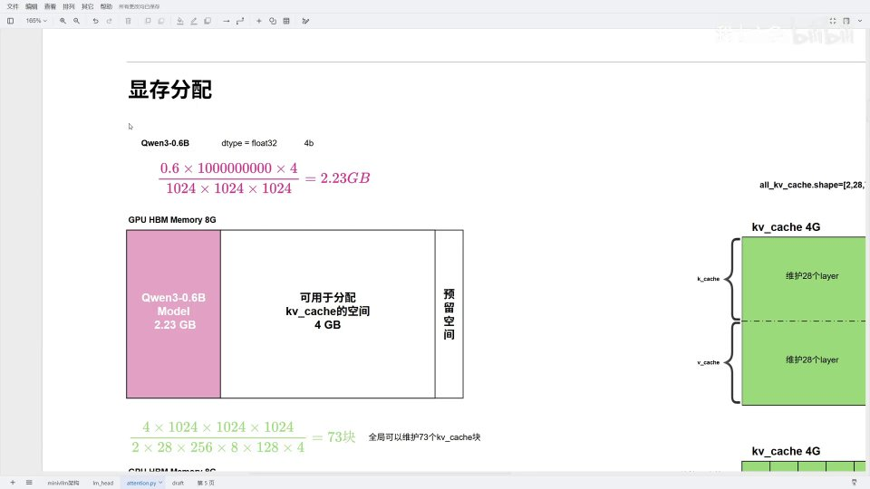 |
| 也就是 2.23GB。怎么算的？0.6B 代表 10 亿个参数，那就是 0.6×1000000000，乘以 4 个字节，再除以 1024（KB）再除以 1024（MB）再除以 1024（GB），算出来就是 2.23GB。在内存中，这块粉色区域就是用于模型权重存储。 [【跳转到 02:31】](https://www.bilibili.com/video/BV1CNDgB4EYy/?t=151) |  |
| 剩下的部分就用于做 KV cache 以及一些其他预留空间。具体分配多少看我们自己的参数设置，包括 vLLM 也有一个参数用于配置当前启动多少空间用于 KV cache。假设我们用 4GB 作为 KV cache 空间，那我们算一下 KV cache 大概是什么情况：4×1024×1024×1024 [【跳转到 02:56】](https://www.bilibili.com/video/BV1CNDgB4EYy/?t=176) |  |
| 上面其实就是 4GB，是我们预留的空间。再看下面，这是一块 KV cache 占的内存大概是多大：这个 2 是 KV，因为既要存 K 也要存 V；这个 28 是我们 28 个 attention 层，Qwen3-0.6B 里有 28 个 layer，也就是 28 个 [【跳转到 03:19】](https://www.bilibili.com/video/BV1CNDgB4EYy/?t=199) | 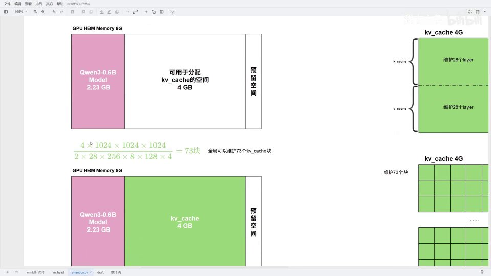 |
| decoder layer，也就是 28 个 attention 层。 [【跳转到 03:44】](https://www.bilibili.com/video/BV1CNDgB4EYy/?t=224) | 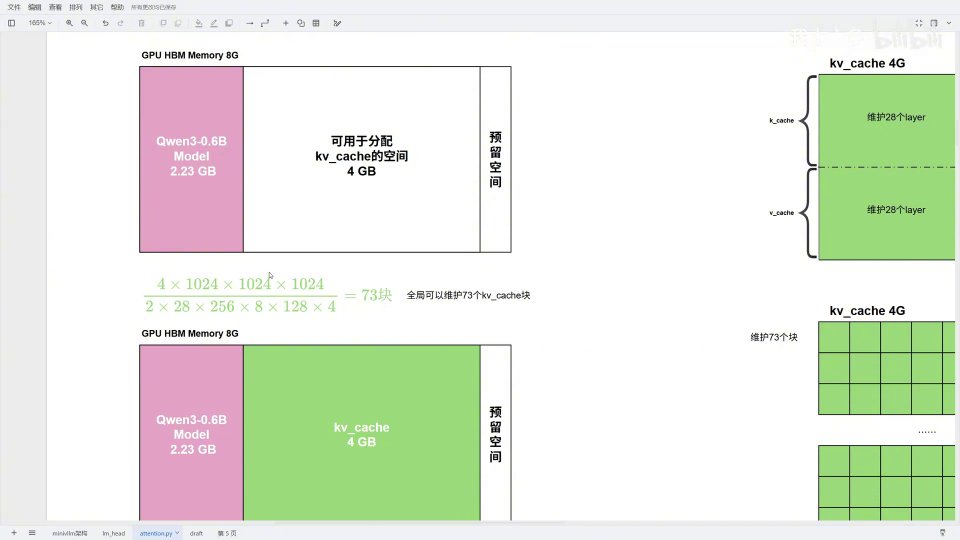 |
| 相当于我们每一层都要做一个 KV cache。这个 256 指的就是分块大小， [【跳转到 03:49】](https://www.bilibili.com/video/BV1CNDgB4EYy/?t=229) | 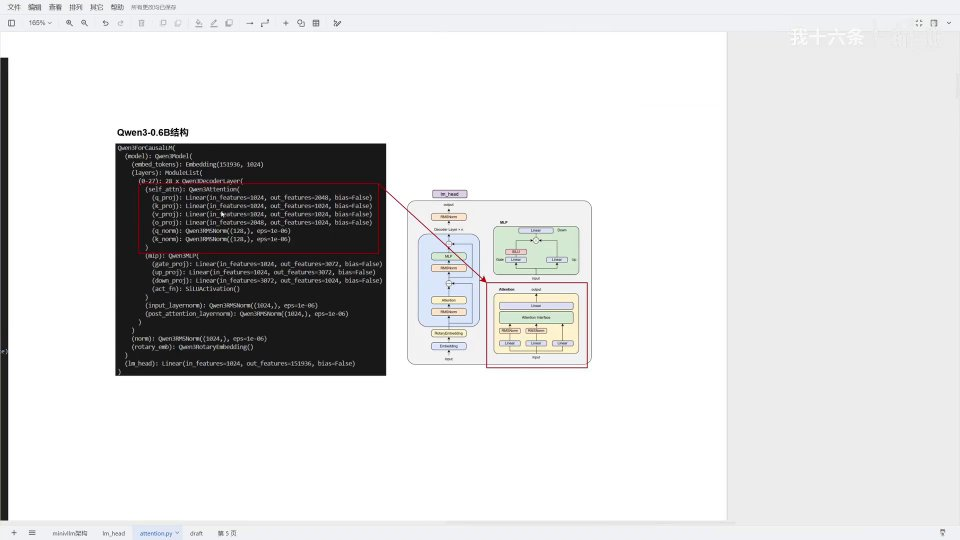 |
| 也就是每个块存储多少个 token 的 KV，这里是 256。我用的是 MiniVLLM 的默认块大小，但实际计算中一般不会分配这么大的块，因为块太大，前缀是很难命中的——做前缀缓存时，块越大越难命中，这其实也很好理解。 [【跳转到 03:54】](https://www.bilibili.com/video/BV1CNDgB4EYy/?t=234) |  |
| 然后这个 8 是 KV head 的数量，128 是每个 KV head 的维度。其实原本我们的 KV 是 1024，但因为我们分了 8 个头，所以现在变成 128。这个 4 是 4 个字节，也就是每个中间变量需要 4 个字节存储，因为我们是 float32。 [【跳转到 04:19】](https://www.bilibili.com/video/BV1CNDgB4EYy/?t=259) | 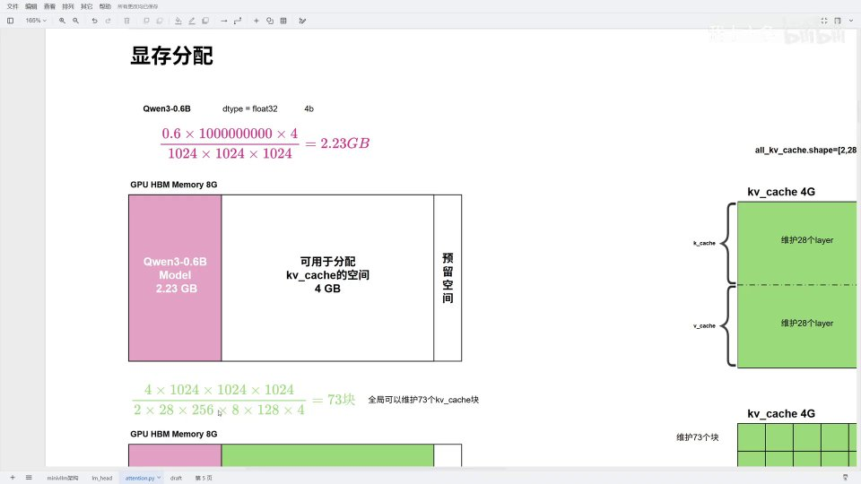 |
| 最后用 4GB 除以每个块的大小，算出来大概是 73 个块，说明我们全局可以维护 73 个 KV cache 块。最后分配下来大概就是这样。 [【跳转到 04:44】](https://www.bilibili.com/video/BV1CNDgB4EYy/?t=284) | 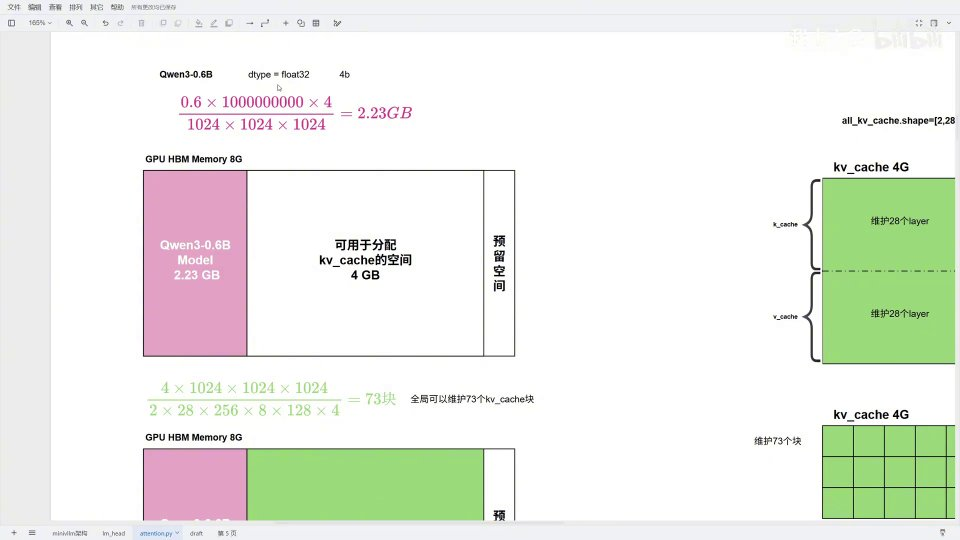 |
| 启动模型之后其实也可以观察一下 GPU 的性能：模型刚加载完全时 GPU 大概占 2.23GB，然后我们去分配 KV cache，分配完之后性能指示器这里就会标满，还留有一部分预留空间。 [【跳转到 04:54】](https://www.bilibili.com/video/BV1CNDgB4EYy/?t=294) | 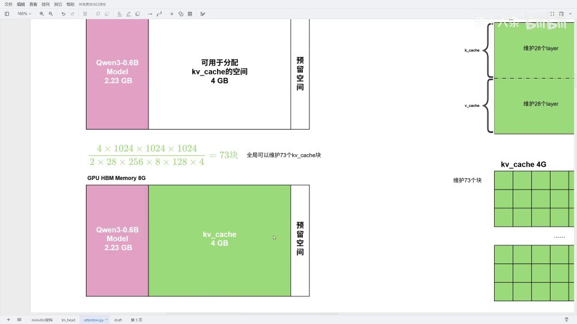 |
| 好，我们现在来看一下分配完之后，在显卡中 [【跳转到 05:14】](https://www.bilibili.com/video/BV1CNDgB4EYy/?t=314) | 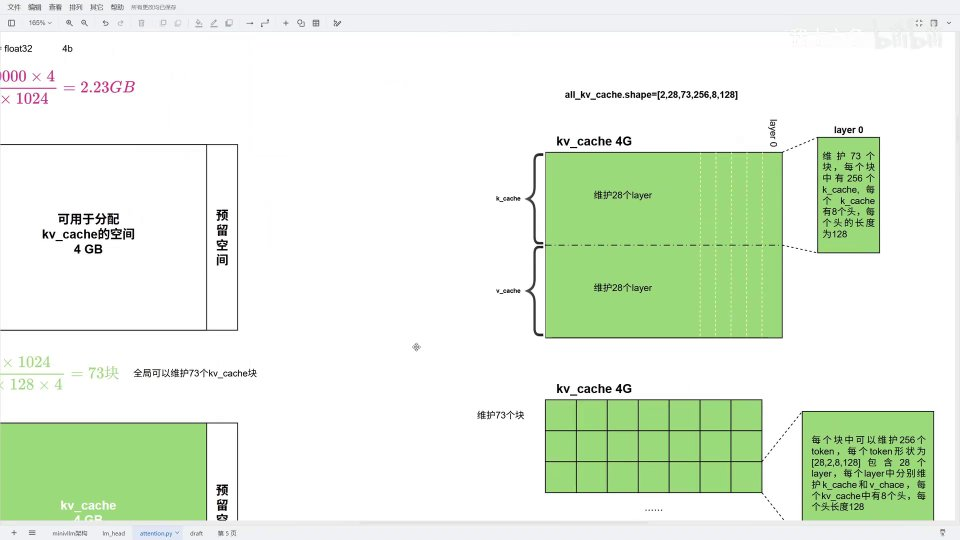 |
| 我们 KV 具体是怎么去理解这一部分、这一部分是什么样的。 [【跳转到 05:19】](https://www.bilibili.com/video/BV1CNDgB4EYy/?t=319) | 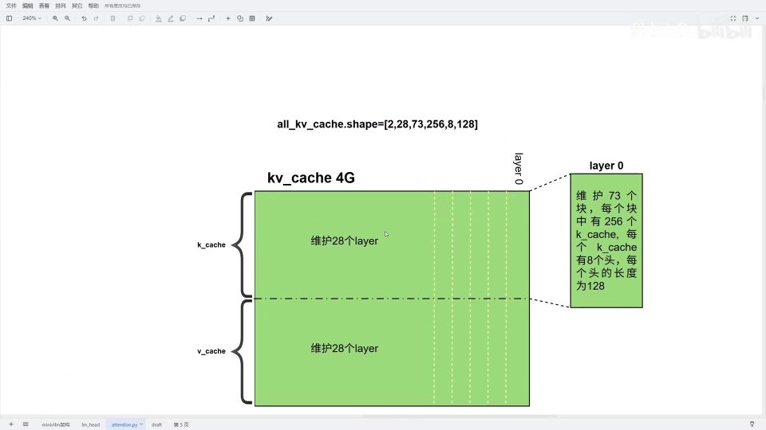 |
| 我们可以看到，比如说所有 KV cache 的 shape 是 [2, 28, [【跳转到 05:24】](https://www.bilibili.com/video/BV1CNDgB4EYy/?t=324) | 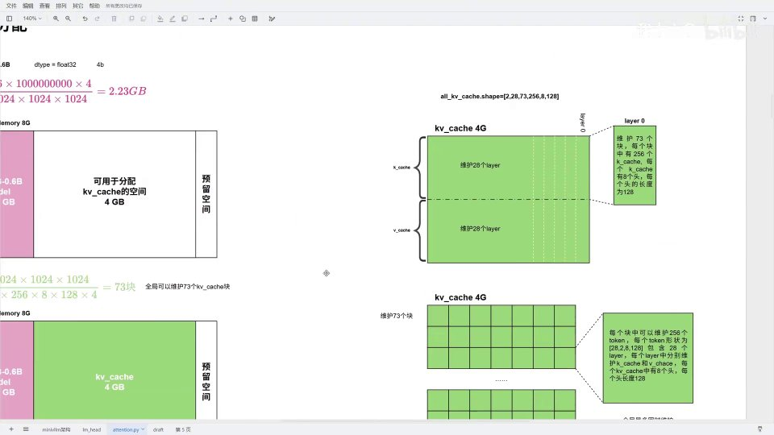 |
| 73, 256, 8, 128]。这些分别是什么意思？刚才也讲过：这个 2 就是 KV， [【跳转到 05:29】](https://www.bilibili.com/video/BV1CNDgB4EYy/?t=329) | 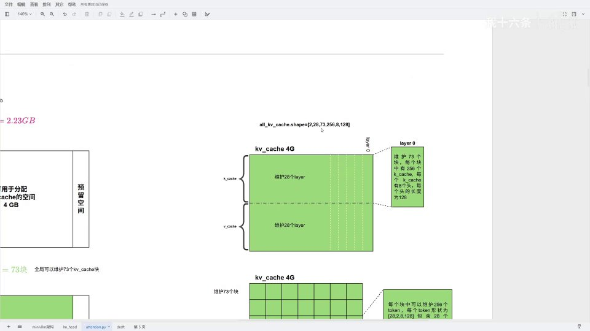 |
| K 一个、V 一个；28 就是 28 个 layer；73 就是 73 个块；每个块有 256 个 token（投的数量）；这个就是头的维度。好，我们来看显卡内存中具体是什么样的。这是一个 KV cache 4G，我们把它分区，可以这样去理解——这只是一种理解方式，理解方式有很多，不一定非按这种，只是一个参考。比如分成 2，把内存一分为二， [【跳转到 05:34】](https://www.bilibili.com/video/BV1CNDgB4EYy/?t=334) | 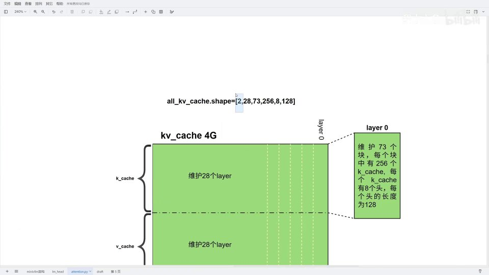 |
| 上面存 K，下面存 V。然后我们再看 28，相当于又把上半部分（下半部分也一样）切成 28 个块，每一个维护一个 layer。比如这个地方就是 layer0，layer0 里边就是 73 个块，相当于这里画了 73 个块。 [【跳转到 05:59】](https://www.bilibili.com/video/BV1CNDgB4EYy/?t=359) | 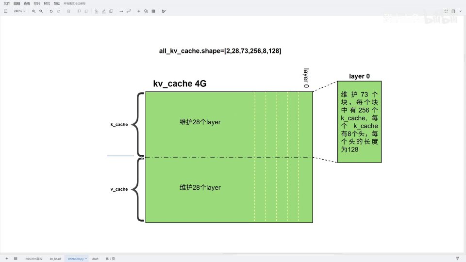 |
| 怎么理解？就相当于每一个 layer 里可以维护 73 个块，每个块中有 256 个 KV，每个 KV 有 8 个头、每个头长度 128 维。V 的 cache 当然也是一样的。当然这只是一种理解方式，也可以这样理解： [【跳转到 06:24】](https://www.bilibili.com/video/BV1CNDgB4EYy/?t=384) | 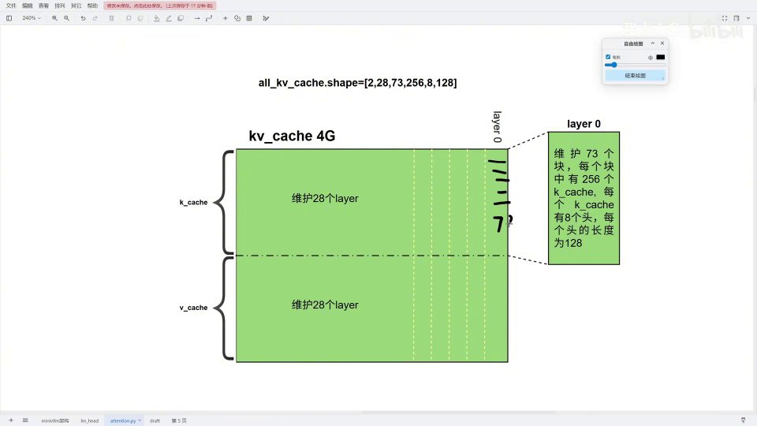 |
| 把整个内存直接分成 73 个块，每个块维护 256 个 token， [【跳转到 06:41】](https://www.bilibili.com/video/BV1CNDgB4EYy/?t=401) | 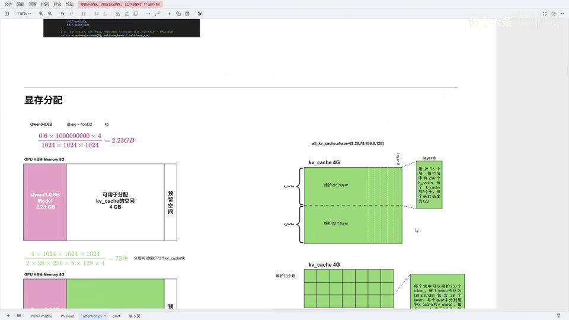 |
| 每个 token 的形状是 28——相当于把层嵌到 token 里去了；而上面那种方式是把 token 嵌到层里。 [【跳转到 06:46】](https://www.bilibili.com/video/BV1CNDgB4EYy/?t=406) | 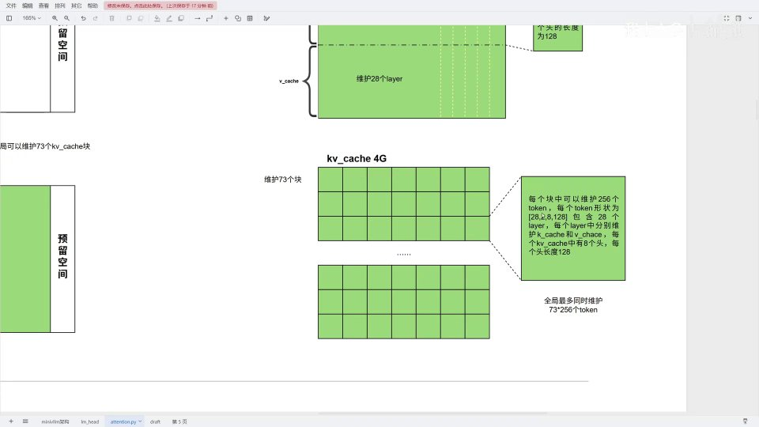 |
| 这是另一种理解方式。这个内存大家可以去画一下，再看一下 KV cache 划分的逻辑代码。 [【跳转到 06:53】](https://www.bilibili.com/video/BV1CNDgB4EYy/?t=413) | 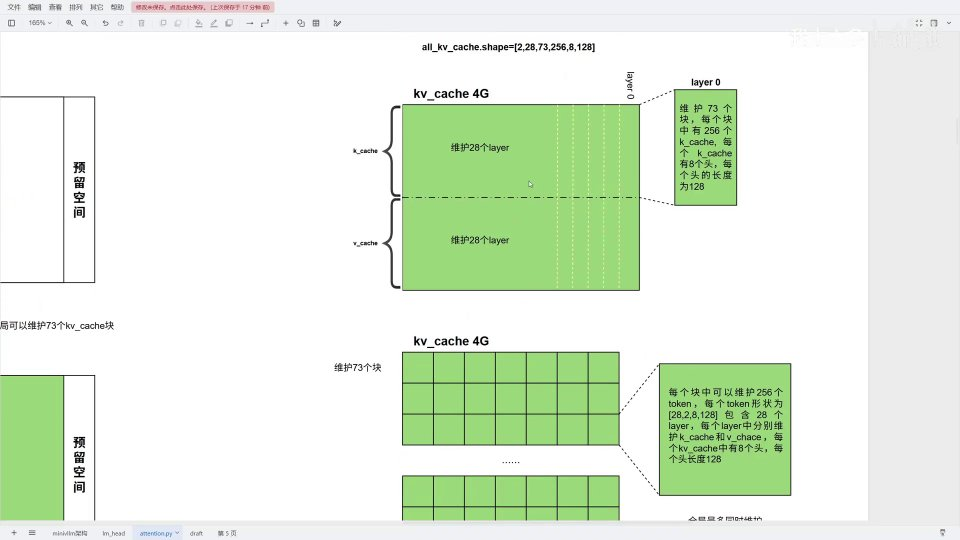 |
| 这种方式其实只是逻辑上的，帮助大家理解，做个参考。OK，我们现在进入预填充。 [【跳转到 07:03】](https://www.bilibili.com/video/BV1CNDgB4EYy/?t=423) | 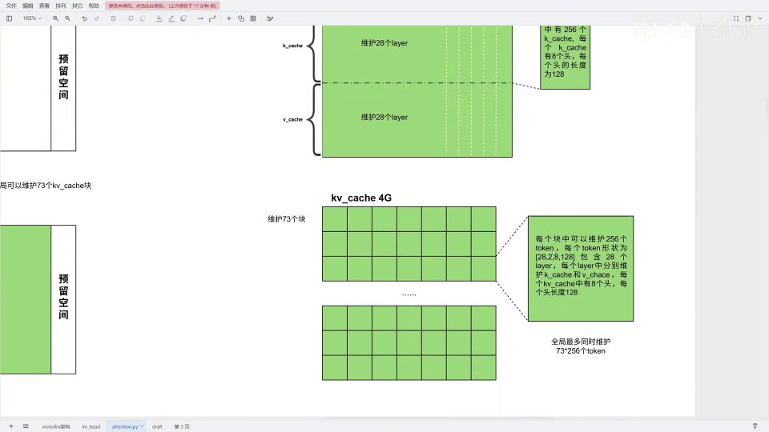 |
| 预填充这部分主要就是一个 FlashAttention， [【跳转到 07:12】](https://www.bilibili.com/video/BV1CNDgB4EYy/?t=432) | 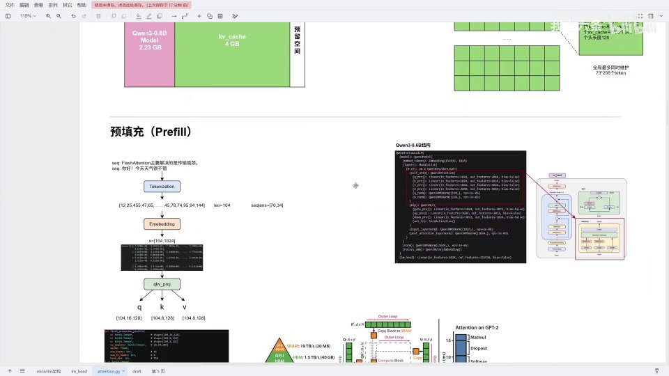 |
| 这一块比较复杂，我会带着大家逐行理解它。 [【跳转到 07:17】](https://www.bilibili.com/video/BV1CNDgB4EYy/?t=437) | 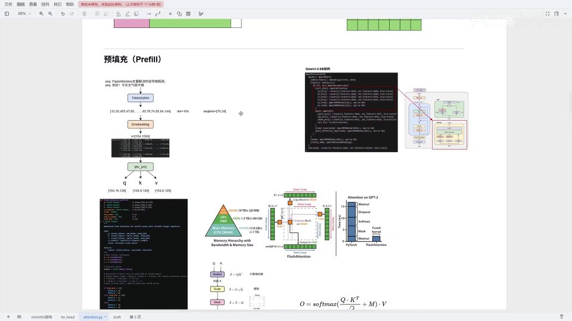 |
| 这个 FlashAttention 是用 Triton 实现的，我们一步步看它怎么把结果算出来。OK，我们来看预填充。 [【跳转到 07:22】](https://www.bilibili.com/video/BV1CNDgB4EYy/?t=442) | 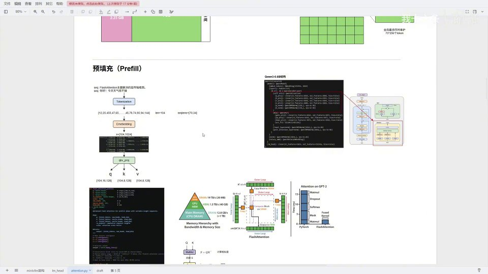 |
| 假设我们现在有两个句子，两个 sequence， [【跳转到 07:33】](https://www.bilibili.com/video/BV1CNDgB4EYy/?t=453) | 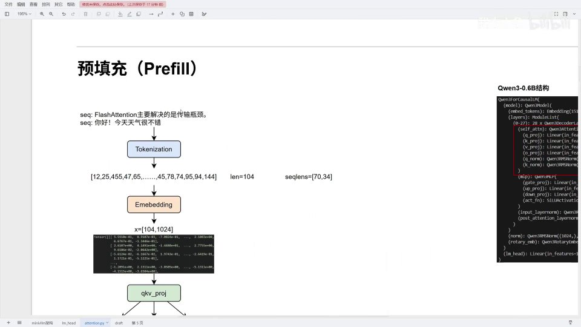 |
| 做了 tokenization、嵌入之后，总长度是 104， [【跳转到 07:38】](https://www.bilibili.com/video/BV1CNDgB4EYy/?t=458) |  |
| 就是 104 个 token。那 seqlen 就是 70、34：前 70 个 token 属于 sequence1，后 34 个属于 sequence2。当然这只是我举的例子，实际中可能不是这样。OK，然后做 embedding， [【跳转到 07:43】](https://www.bilibili.com/video/BV1CNDgB4EYy/?t=463) | 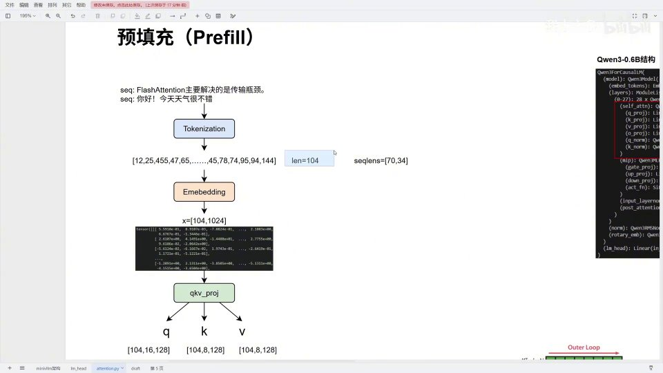 |
| X 就变成 104×1024，这时 token 已经做了嵌入，大概长这样。然后经过 QKV 线性变化， [【跳转到 07:58】](https://www.bilibili.com/video/BV1CNDgB4EYy/?t=478) | 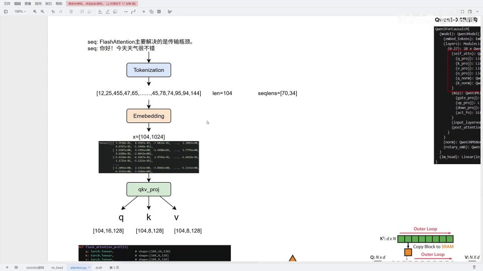 |
| 会分出 Q、K、V——我们的查询、键、 [【跳转到 08:07】](https://www.bilibili.com/video/BV1CNDgB4EYy/?t=487) | 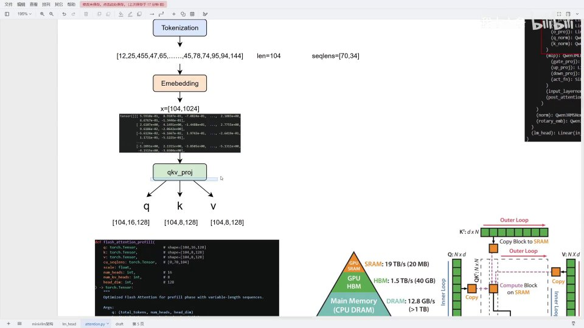 |
| 值。OK，我们的查询是 104，就是 104 个 token， [【跳转到 08:12】](https://www.bilibili.com/video/BV1CNDgB4EYy/?t=492) | 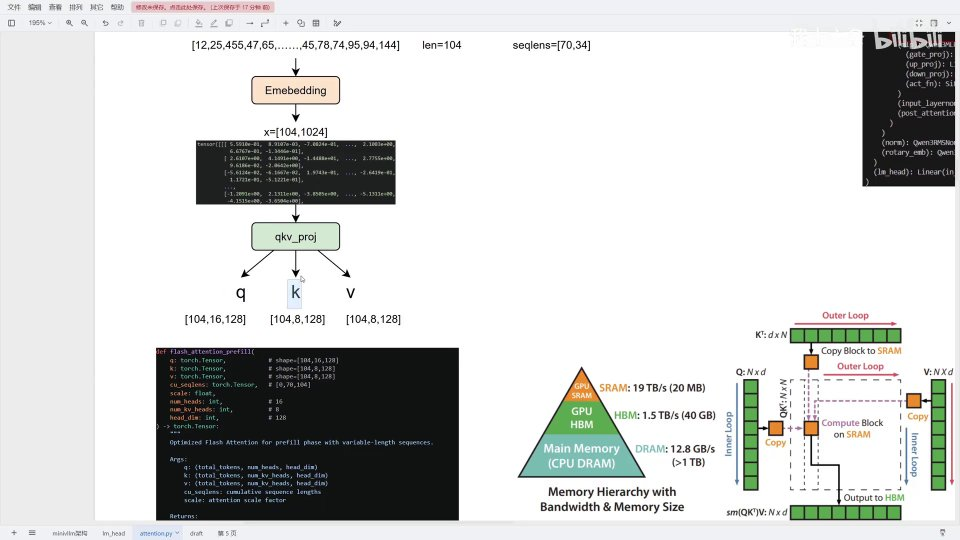 |
| 16 个头、128 维。这里为什么是 16？这其实就是 Qwen3 [【跳转到 08:17】](https://www.bilibili.com/video/BV1CNDgB4EYy/?t=497) | 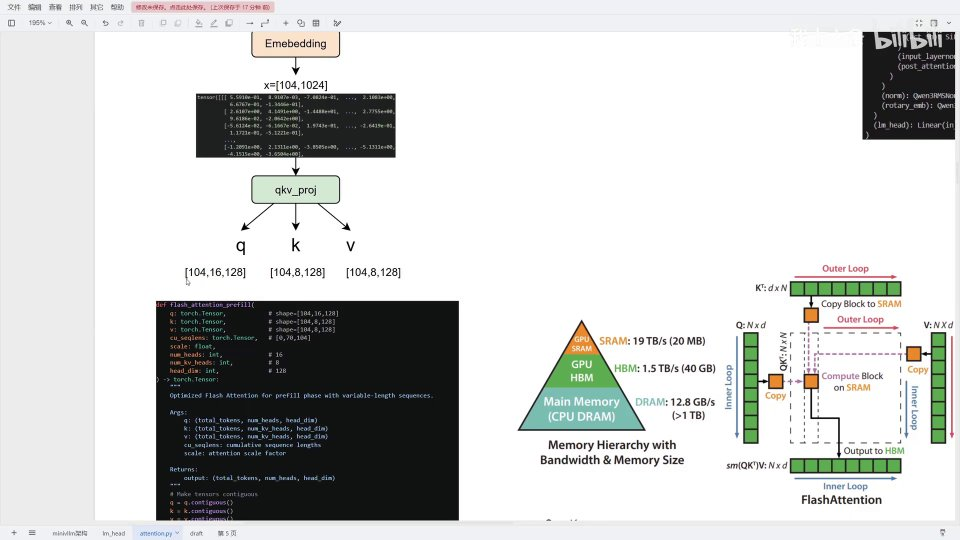 |
| 模型里原本就是这样的。经过 QKV 之后它输出的是 2048， [【跳转到 08:23】](https://www.bilibili.com/video/BV1CNDgB4EYy/?t=503) | 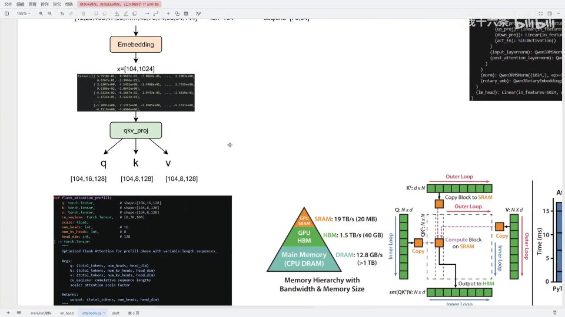 |
| 所以 Q 头有 16 个、KV 头有 8 个。这里其实也是分组查询注意力， [【跳转到 08:28】](https://www.bilibili.com/video/BV1CNDgB4EYy/?t=508) | 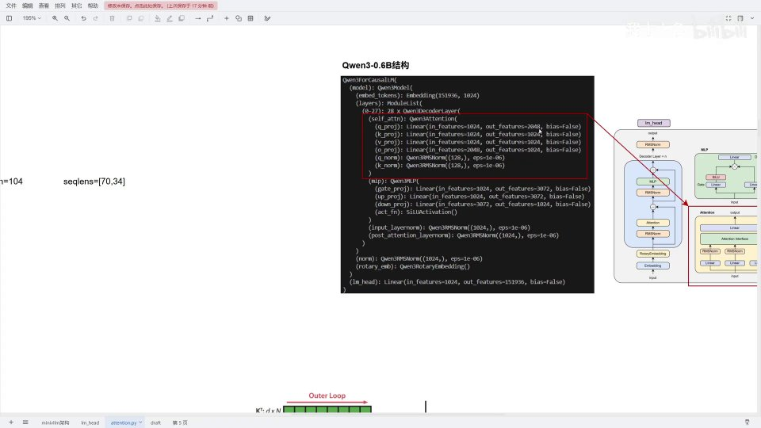 |
| 也就是 GQA，相当于每两个 Q 头共享一个 KV 头。 [【跳转到 08:33】](https://www.bilibili.com/video/BV1CNDgB4EYy/?t=513) | 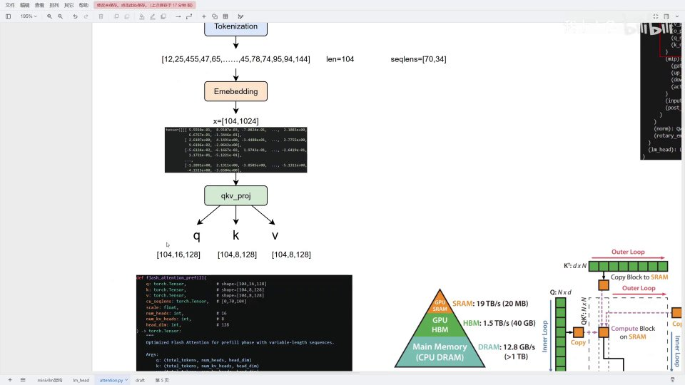 |
| 这其实可以提高存储效率和计算效率。原本的注意力是多头注意力，Q 和 KV 完全一一对应，比如 16 个 Q 头就有 16 个 KV 头；而 GQA 是每两个 Q 为一组，对应一个 KV 头。OK，这个如果不明白还是可以再去补一补，我说过很多遍了。 [【跳转到 08:41】](https://www.bilibili.com/video/BV1CNDgB4EYy/?t=521) | 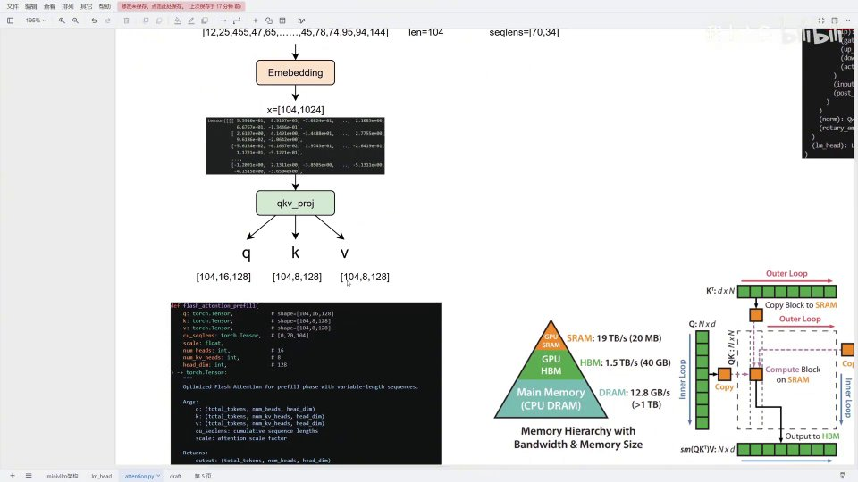 |
| 然后来看 FlashAttention 的 prefill 阶段具体怎么做。 [【跳转到 09:04】](https://www.bilibili.com/video/BV1CNDgB4EYy/?t=544) | 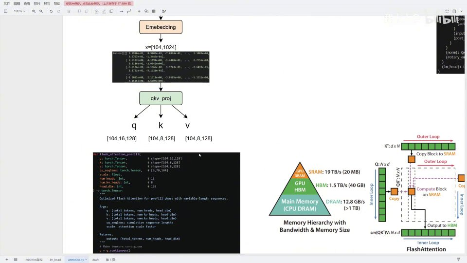 |
| 我想想，还是先看一下这个吧。 [【跳转到 09:09】](https://www.bilibili.com/video/BV1CNDgB4EYy/?t=549) | 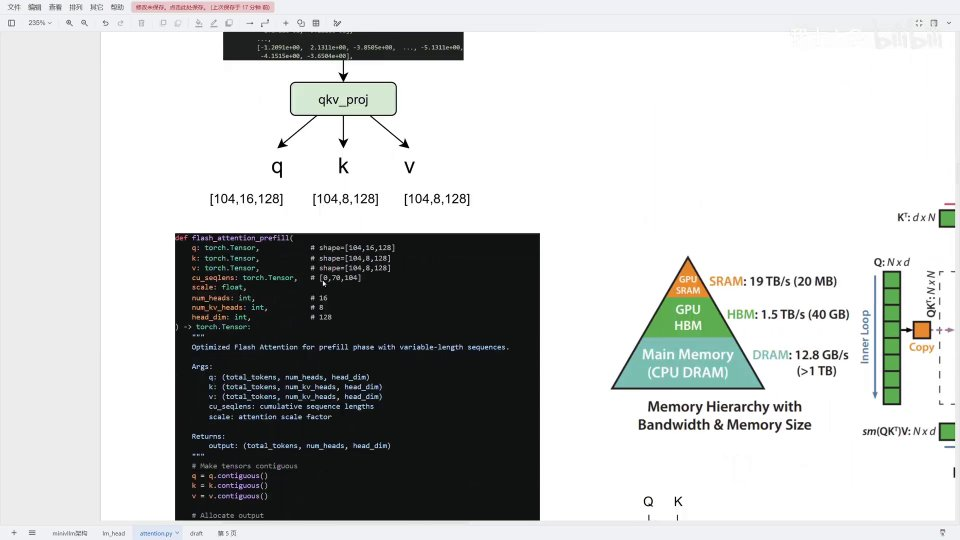 |
| 我们来看 forward 前向传播。比如 QKV [【跳转到 09:14】](https://www.bilibili.com/video/BV1CNDgB4EYy/?t=554) | 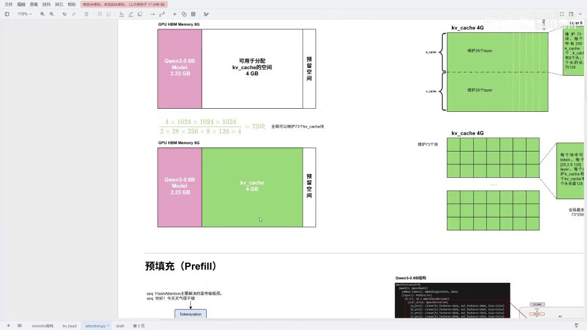 |
| 已经传进来了，然后这个地方分别可以 cache。因为我们在刚开始预填充的时候， [【跳转到 09:19】](https://www.bilibili.com/video/BV1CNDgB4EYy/?t=559) | 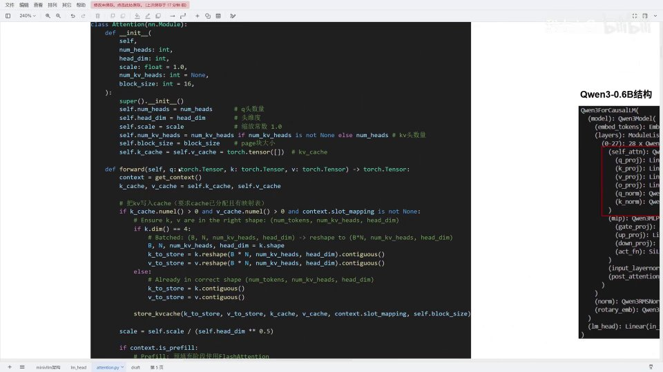 |
| 这一块是没有的，也就是我们的 K cache 和 V cache 都是没有的，所以这个地方都是空的，这一步其实是直接跳过。你在程序里调试一下会发现，第一次运行、也就是预热阶段，这个 forward 地方是直接跳过的。然后给 scale 赋值之后， [【跳转到 09:24】](https://www.bilibili.com/video/BV1CNDgB4EYy/?t=564) | 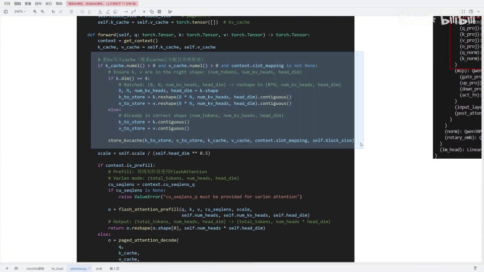 |
| 进入 profile 阶段，计算 q_seqlen，再把这些参数作为参数传入我们的 flash_prefill（也就是 FlashAttention 预填充），看它具体是怎么算的。好，前面我们粗浅地讲了一下， [【跳转到 09:45】](https://www.bilibili.com/video/BV1CNDgB4EYy/?t=585) | 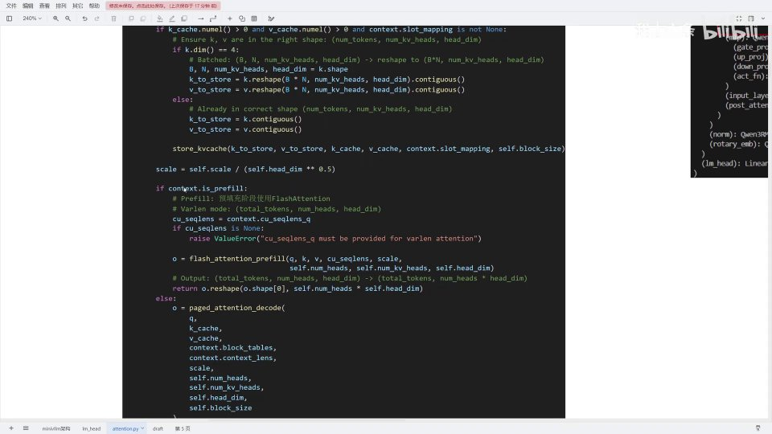 |
| 这一块其实很简单，重点还是这一块。我们现在进入 FlashAttention 的 prefill 阶段， [【跳转到 10:00】](https://www.bilibili.com/video/BV1CNDgB4EYy/?t=600) | 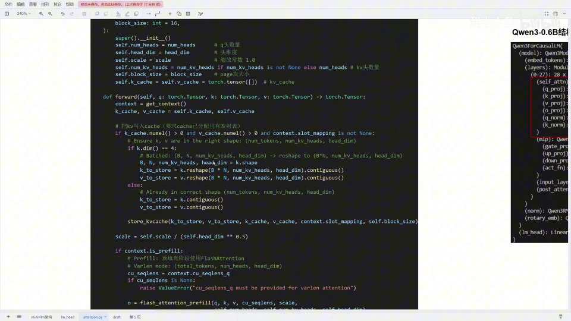 |
| 就是这个地方。好，我们现在进来了，看一下我们的 QKV 和 q_seqlen 是什么样的。 [【跳转到 10:06】](https://www.bilibili.com/video/BV1CNDgB4EYy/?t=606) | 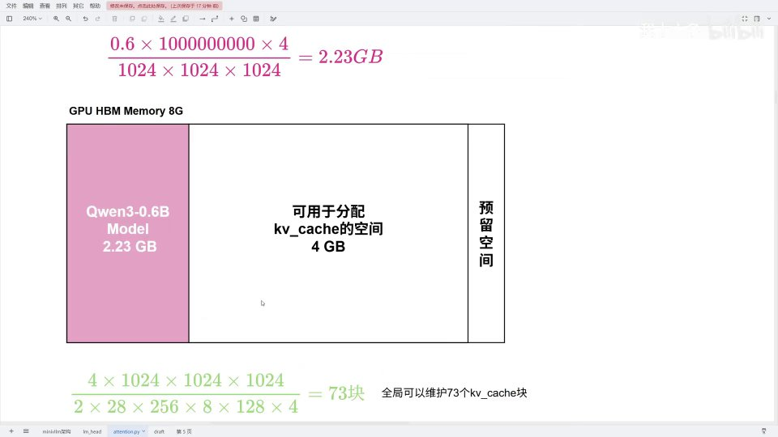 |
| 首先是 Q 的 shape， [【跳转到 10:11】](https://www.bilibili.com/video/BV1CNDgB4EYy/?t=611) |  |
| 104×16，刚才也分析过了。然后这个 q_seqlen 是 70、104， [【跳转到 10:16】](https://www.bilibili.com/video/BV1CNDgB4EYy/?t=616) | 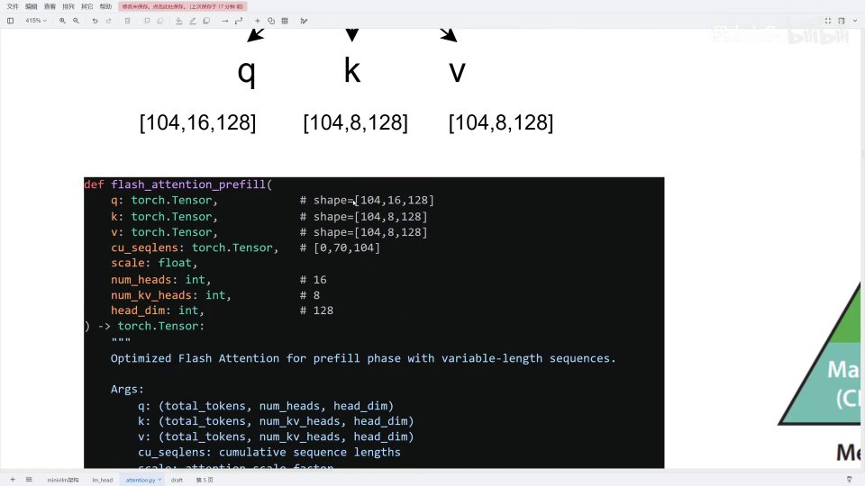 |
| 0 是第一个序列的起始位置，70 是第二个序列的起始位置， [【跳转到 10:21】](https://www.bilibili.com/video/BV1CNDgB4EYy/?t=621) | 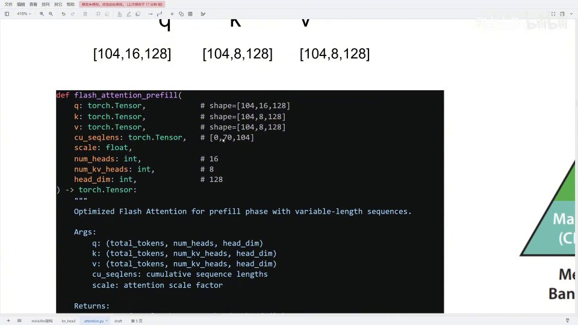 |
| 104 是最后一个序列的结束位置。它们的差值：70-0 是第一个序列的长度，104-70 是第二个序列的长度，它存放的就是序列的起始位置。然后这个 scale 是注意力计算过程中的缩放，Q 头数是 16，KV 头数是 8，嵌入维度是 128。 [【跳转到 10:26】](https://www.bilibili.com/video/BV1CNDgB4EYy/?t=626) | 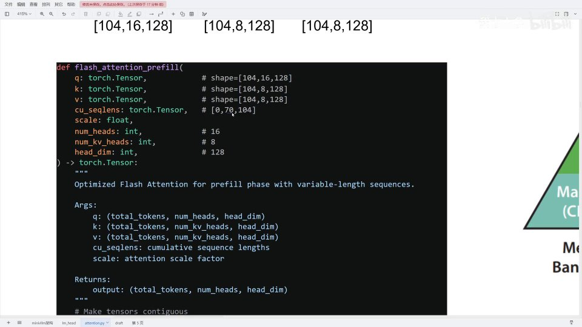 |
| OK，然后我们进来，这个地方做了一个 contiguous，让 QKV 在内存中连续；然后做了一个 output，我们最后输出的形状和 Q 的形状一致，这里新建了一个 output。我们来看一下 block_n 和 block_m 具体是什么。因为 FlashAttention 其实是需要做分块的， [【跳转到 10:47】](https://www.bilibili.com/video/BV1CNDgB4EYy/?t=647) | 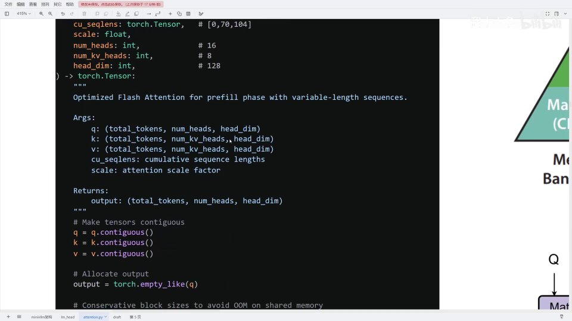 |
| 就是……我不知道大家了不了解 Flash 和 Triton， [【跳转到 11:09】](https://www.bilibili.com/video/BV1CNDgB4EYy/?t=669) | 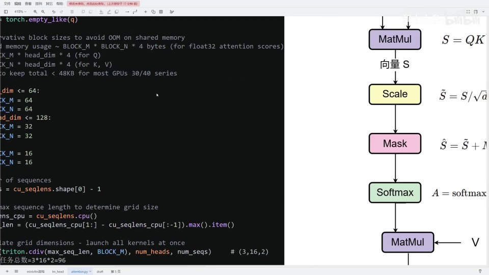 |
| 我还是粗略讲一讲。我们的内存大概呈现这样一个金字塔形状：这是 CPU，这是 GPU 的 HBM、这是 GPU 的 SRAM（共享内存）。成本随着这个金字塔往上升，所以 GPU 中大量的其实是 HBM，因为它便宜。共享内存实际上和 GPU 的计算单元绑定在一起， [【跳转到 11:14】](https://www.bilibili.com/video/BV1CNDgB4EYy/?t=674) | 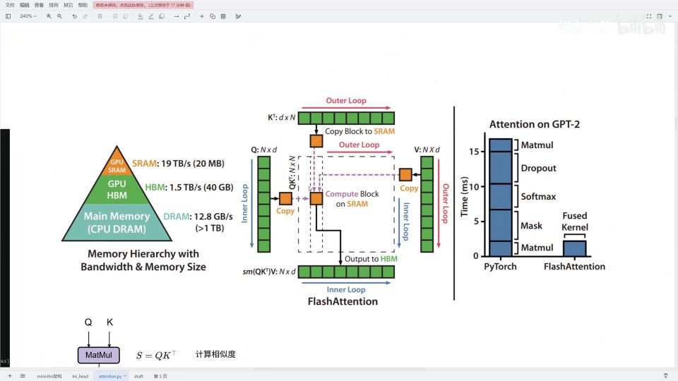 |
| 它很小但读取速度很快。可以看到这里是 19TB/s，但它很小，整个 GPU 加起来可能就 10MB；HBM 是 1.5TB/s。在 FlashAttention 中，它属于计算密集型，但数据需要来回在 HBM 和 SRAM 之间搬运，这时候就会造成计算很快、 [【跳转到 11:39】](https://www.bilibili.com/video/BV1CNDgB4EYy/?t=699) | 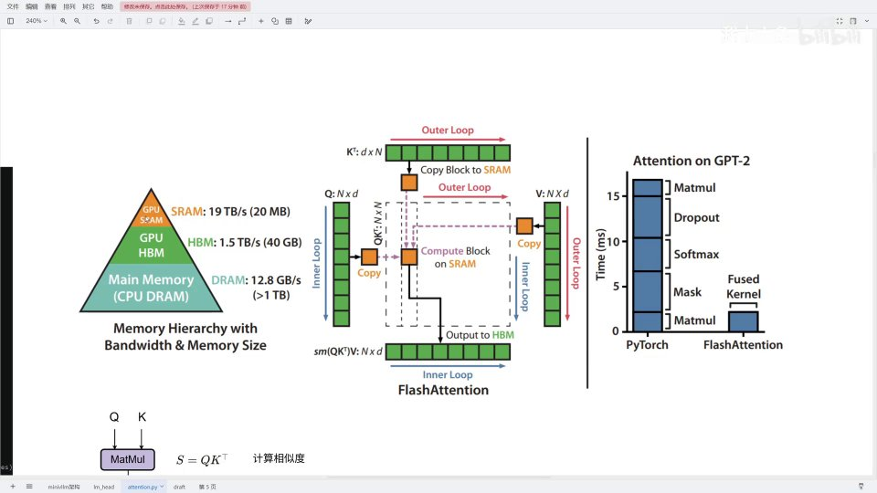 |
| 但要等数据搬运，导致显卡利用率不高。于是 FlashAttention 提出了分块机制：把 QKV 按块分块，把块直接加载到 SRAM，一次性把整个 attention 过程算完。具体示意就是：我搬一小块 Q，比如分块大小是 32， [【跳转到 12:04】](https://www.bilibili.com/video/BV1CNDgB4EYy/?t=724) | 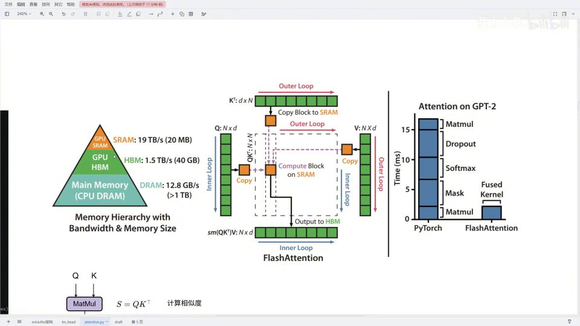 |
| 那我一次搬 32 个 token、一个头的 32 个 token 进来，KV 也一样每次搬 32 进来。Q 进来之后，我要遍历所有的 K 和 V，去计算最后输出的 O 值，相当于完成一次计算。这样就把原本整块计算的过程拆成小块小块去算，待会我们会详细深入讲。 [【跳转到 12:29】](https://www.bilibili.com/video/BV1CNDgB4EYy/?t=749) |  |
| 因为在计算 attention 的过程中，实际上需要做多次矩阵乘，GPT-2 里还有 mask、softmax，再做矩阵乘。这样做的好处是：我一次性把所有运算数据都丢进 SRAM，相当于在 SRAM 中把所有这些操作都做了，最后就是一个融合的算子，减少数据搬运次数。 [【跳转到 12:54】](https://www.bilibili.com/video/BV1CNDgB4EYy/?t=774) |  |
| 这就是 FlashAttention 的最终目的。 [【跳转到 13:19】](https://www.bilibili.com/video/BV1CNDgB4EYy/?t=799) | 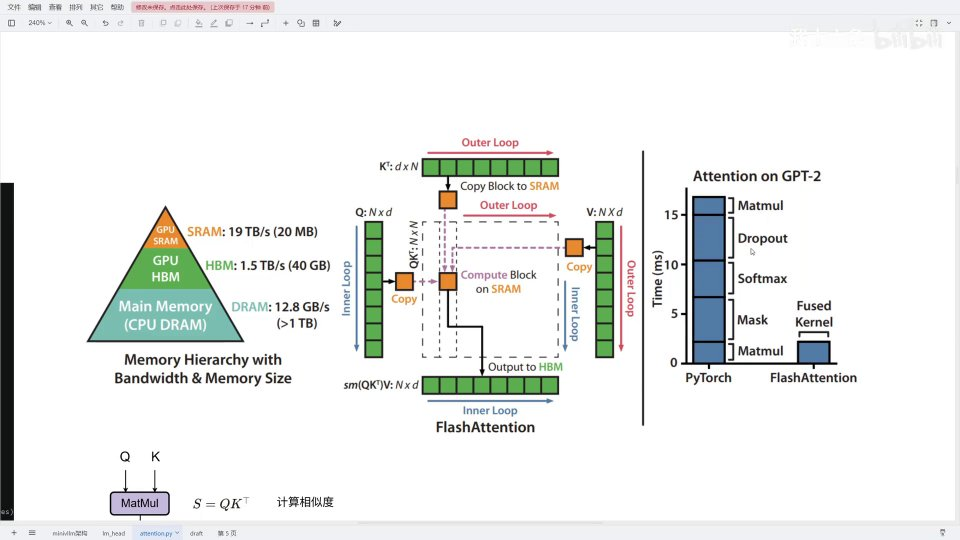 |
| OK，我们继续看。待会我会细讲。那 block_m 和 block_n 又是怎么算出来的？ [【跳转到 13:24】](https://www.bilibili.com/video/BV1CNDgB4EYy/?t=804) | 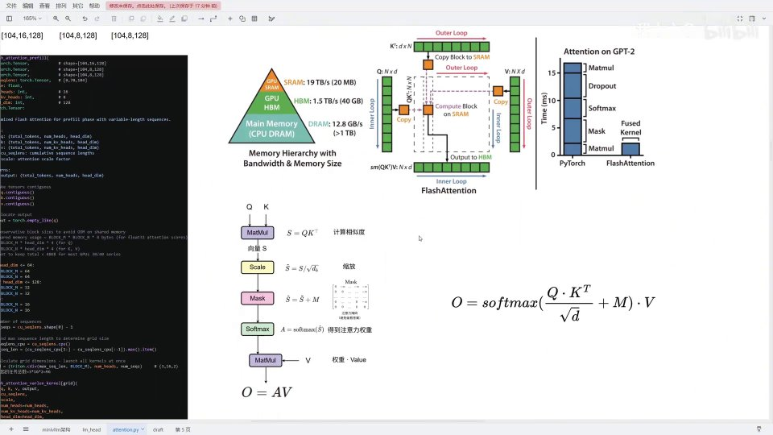 |
| 以我们通常三系和四系的显卡为例，SRAM 大小通常只有 48KB。我们需要算这 48KB 一次最多能容纳多少个 token 的 QKV 计算。这里有一个非常保守的计算方式，我们要看一下 attention 算子具体的流程。 [【跳转到 13:29】](https://www.bilibili.com/video/BV1CNDgB4EYy/?t=809) | 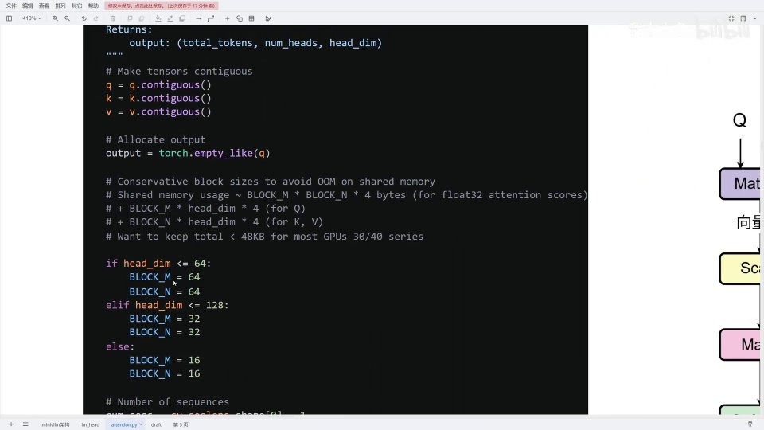 |
| attention 算子需要同时把 Q、K 读进来，计算 QK， [【跳转到 13:50】](https://www.bilibili.com/video/BV1CNDgB4EYy/?t=830) | 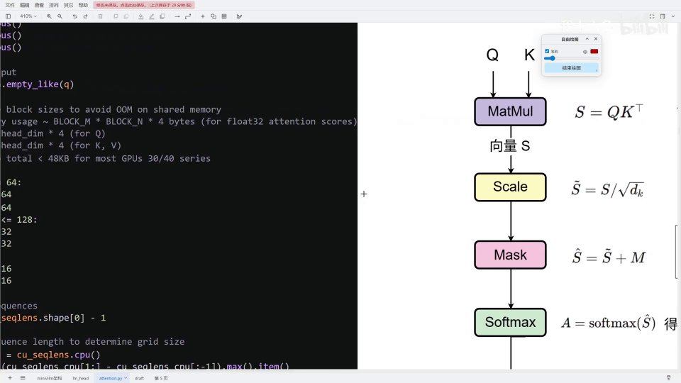 |
| 还需要读取位置进来。因为我们要在这 48KB 里完成计算， [【跳转到 13:55】](https://www.bilibili.com/video/BV1CNDgB4EYy/?t=835) | 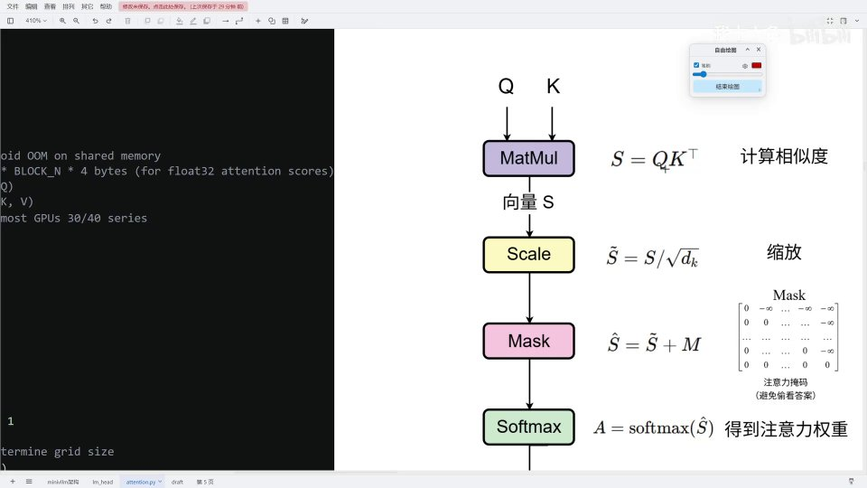 |
| 就需要算一次性最多能放多少个、长度为多少的 Q， [【跳转到 14:00】](https://www.bilibili.com/video/BV1CNDgB4EYy/?t=840) | 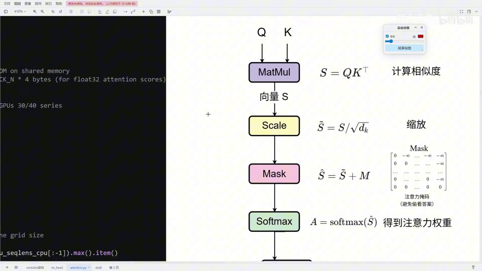 |
| 也就是大概能一次性容纳多少个 token 做这个计算。 [【跳转到 14:05】](https://www.bilibili.com/video/BV1CNDgB4EYy/?t=845) | 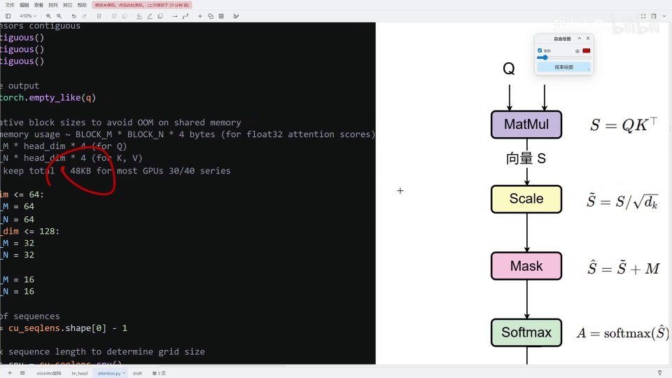 |
| 比如这里的 block_m 和 block_n，第一项是 block_m × block_n × 4 次， [【跳转到 14:10】](https://www.bilibili.com/video/BV1CNDgB4EYy/?t=850) | 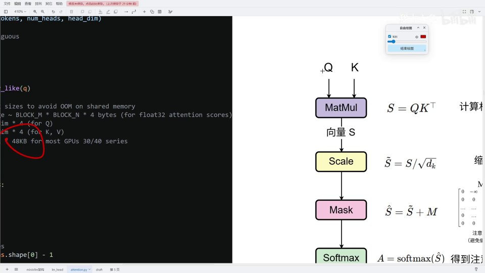 |
| 实际上就是 QK 最后需要占用的空间；然后 block_m × 头维度 × 4，这是 Q 的内存大小，因为 Q 是常驻的。FlashAttention 计算中有两层循环，外循环遍历 Q，内循环遍历 K 和 V。拿到一个 Q 块的时候， [【跳转到 14:15】](https://www.bilibili.com/video/BV1CNDgB4EYy/?t=855) | 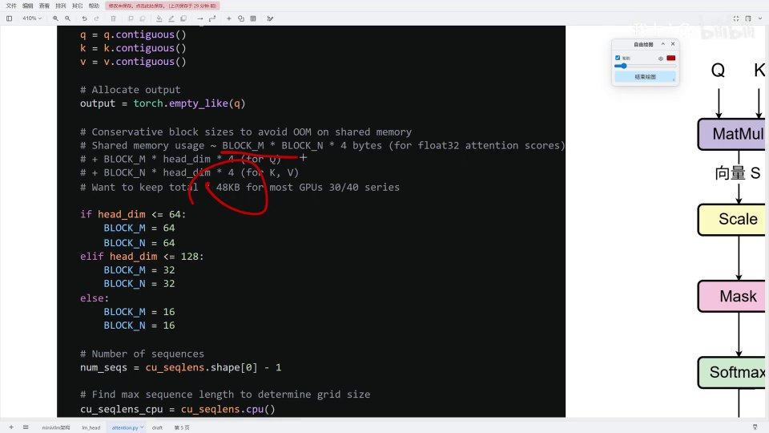 |
| 用这个 Q 块去乘 KV 块。比如内存分了多个块，Q 块和 K 块数量一样，但 Q 块遍历时：第一个 Q 块遍历第一个 KV 块，第二个 Q 块遍历第一个和第二个 KV 块，以此类推，最后一个 Q 块要遍历前面所有的 KV 块。 [【跳转到 14:40】](https://www.bilibili.com/video/BV1CNDgB4EYy/?t=880) | 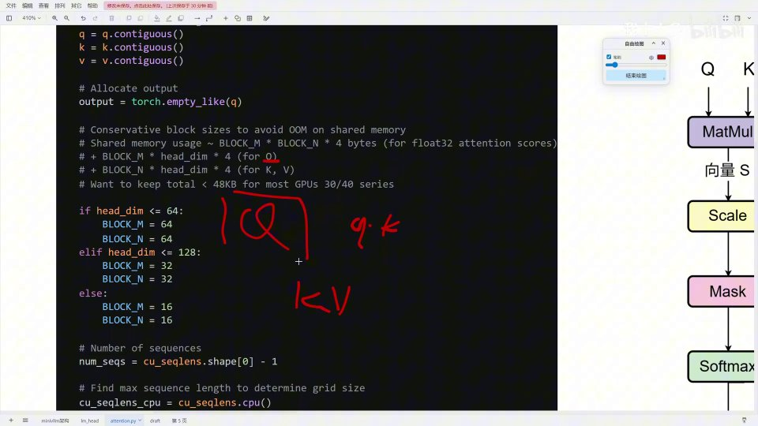 |
| 这其实就是因果注意力，里面有一个 mask，待会后面会详细讲。 [【跳转到 15:05】](https://www.bilibili.com/video/BV1CNDgB4EYy/?t=905) | 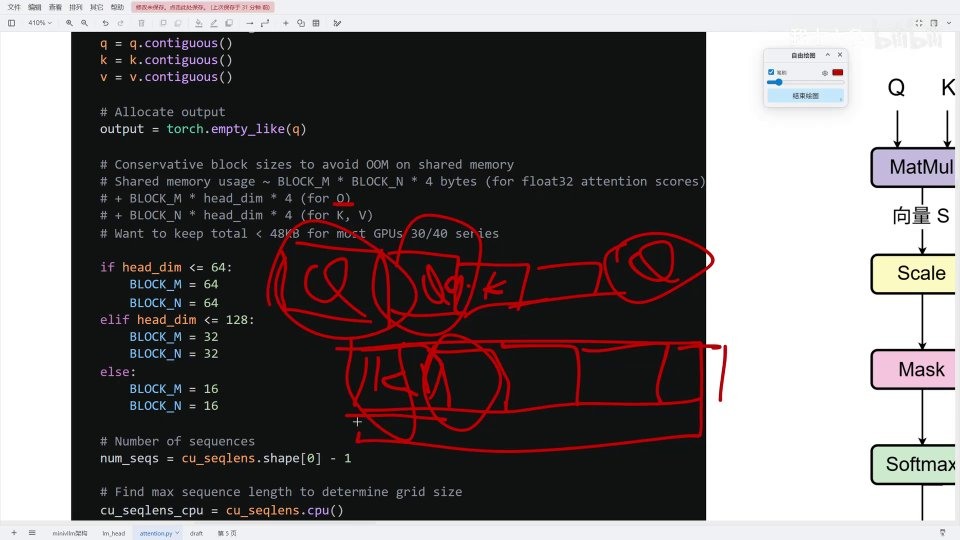 |
| OK，然后来看内存具体是什么情况。QK [【跳转到 15:13】](https://www.bilibili.com/video/BV1CNDgB4EYy/?t=913) | 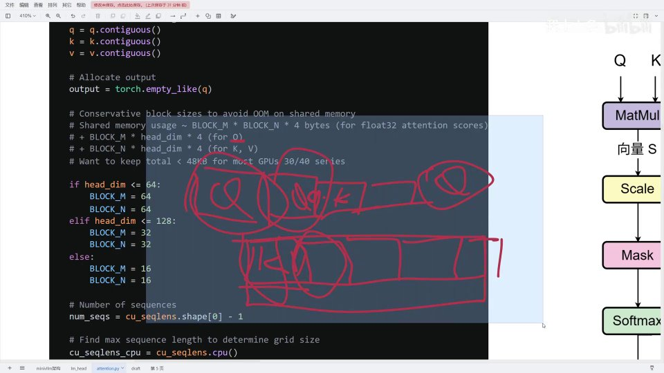 |
| 这一块用于存放 QK，这一块是常驻的 Q，这块是 KV 的读取。因为 KV 是顺序存取，QK 进来先做 Q 乘 K， [【跳转到 15:18】](https://www.bilibili.com/video/BV1CNDgB4EYy/?t=918) | 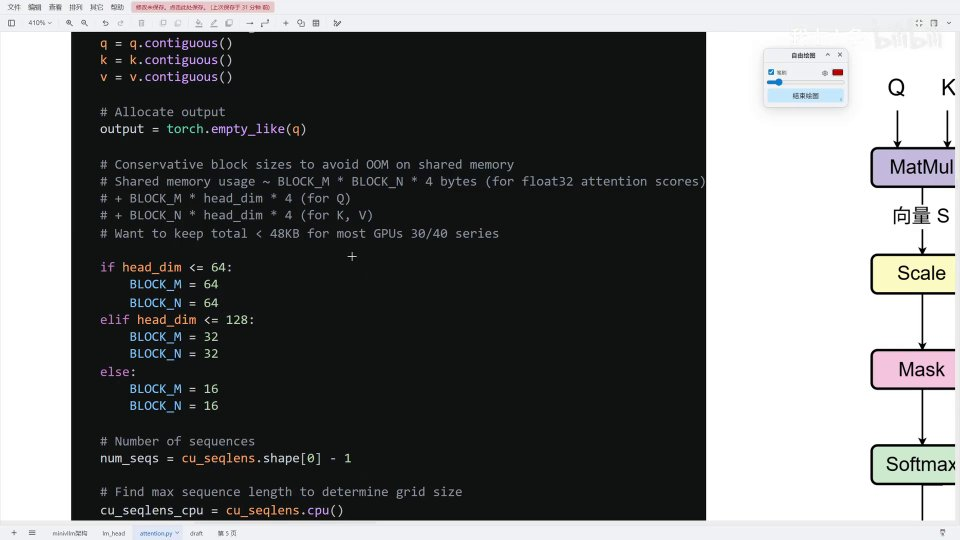 |
| 这时 K 的内存可以不用常驻，之后读 V 时把前面的内存用上就行。 [【跳转到 15:31】](https://www.bilibili.com/video/BV1CNDgB4EYy/?t=931) | 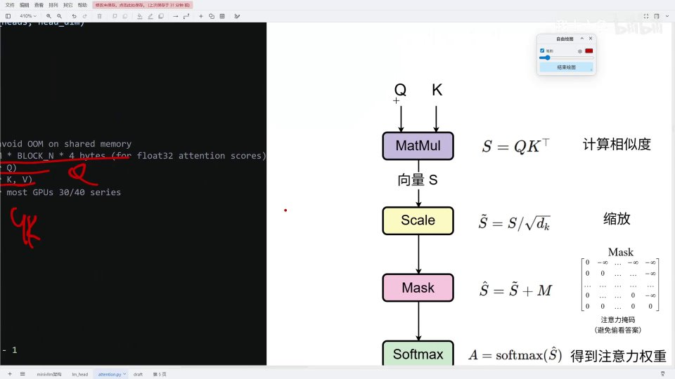 |
| 所以 KV 实际上只需要占用一次内存读取。 [【跳转到 15:40】](https://www.bilibili.com/video/BV1CNDgB4EYy/?t=940) | 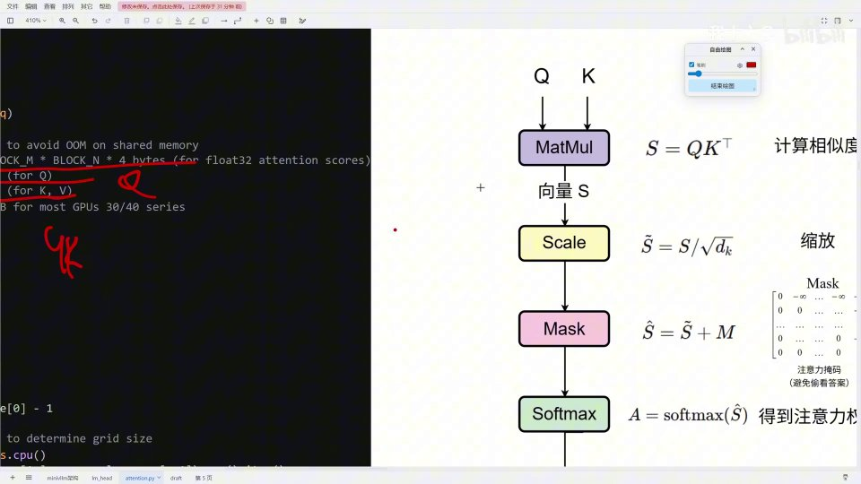 |
| OK，来看一下。比如 32×32 乘以 4， [【跳转到 15:45】](https://www.bilibili.com/video/BV1CNDgB4EYy/?t=945) | 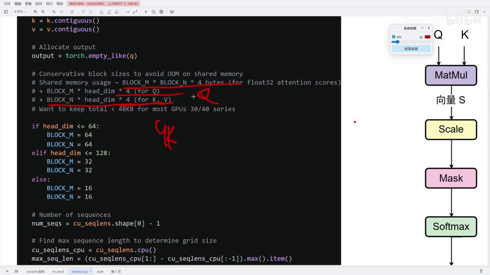 |
| 还是用计算器吧。 [【跳转到 15:50】](https://www.bilibili.com/video/BV1CNDgB4EYy/?t=950) | 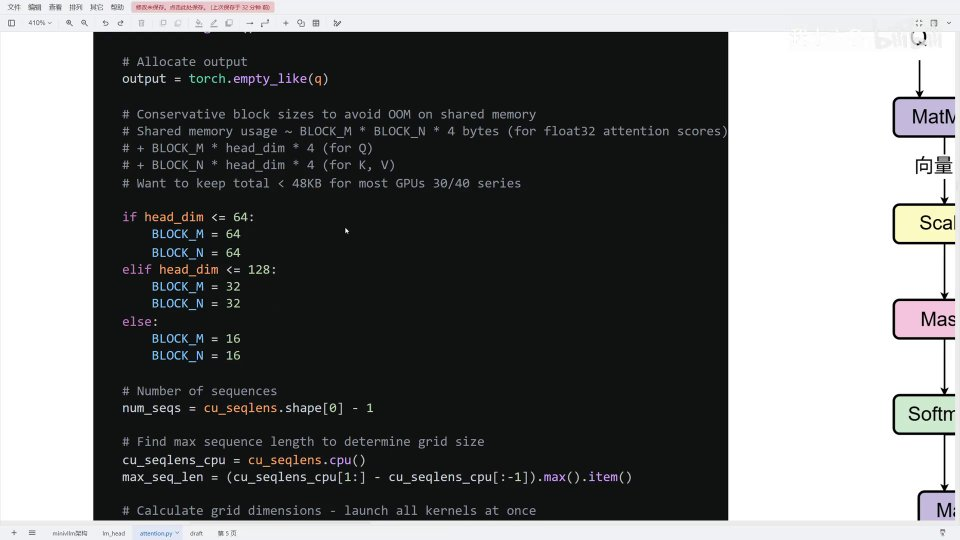 |
| 32×32×4 = 4096。 [【跳转到 15:56】](https://www.bilibili.com/video/BV1CNDgB4EYy/?t=956) | 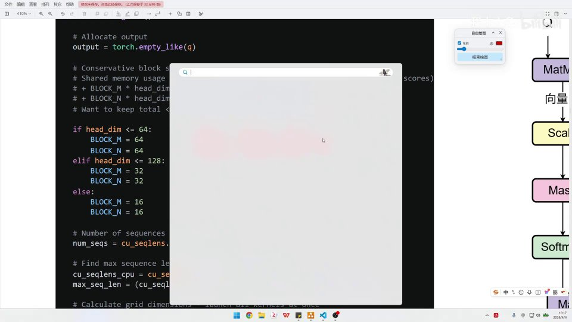 |
| OK，这里就是 4096。 [【跳转到 16:01】](https://www.bilibili.com/video/BV1CNDgB4EYy/?t=961) | 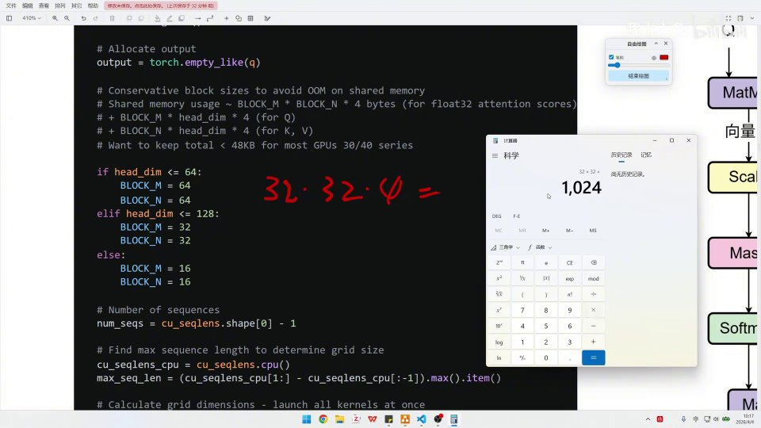 |
| 然后 Q 是 32×128 再乘以 4， [【跳转到 16:06】](https://www.bilibili.com/video/BV1CNDgB4EYy/?t=966) | 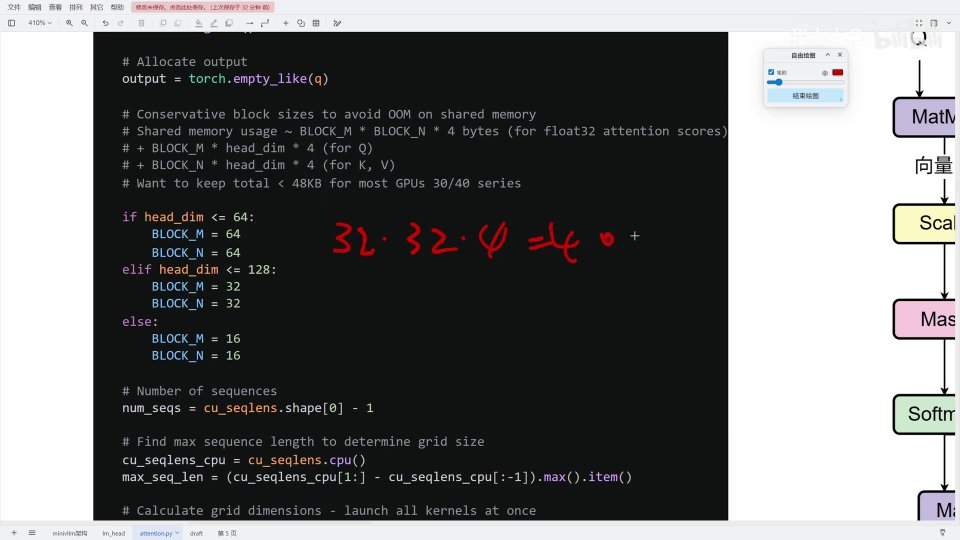 |
| 32×128×4，然后因为有两个，K 也是一样的，其实就相当于两倍，再乘以 2，再加上刚才算出的 4096。那我们 SRAM 最大内存占用大概就是这么多，再除以 1024 就是 36KB，所以 SRAM 最大大概 36KB。 [【跳转到 16:16】](https://www.bilibili.com/video/BV1CNDgB4EYy/?t=976) | 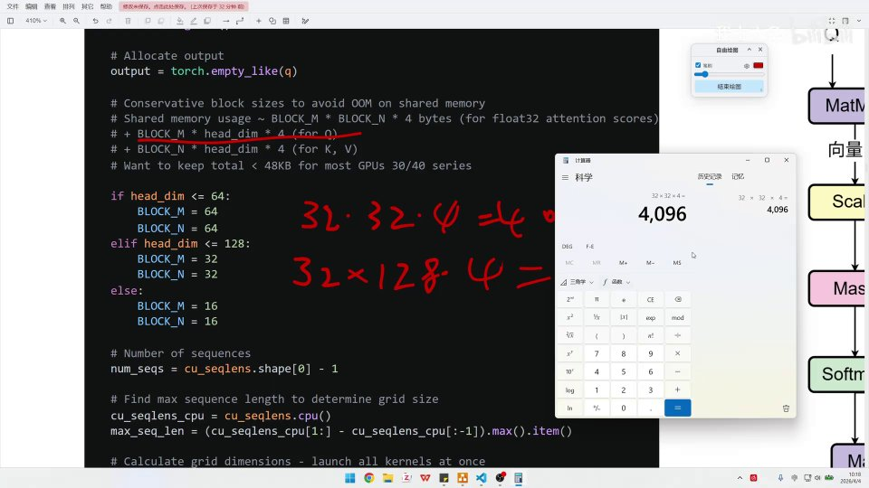 |
| 剩下其实还有一些中间变量，但剩下的内存留给它已经够了。大概就是这样一个计算过程。 [【跳转到 16:41】](https://www.bilibili.com/video/BV1CNDgB4EYy/?t=1001) | 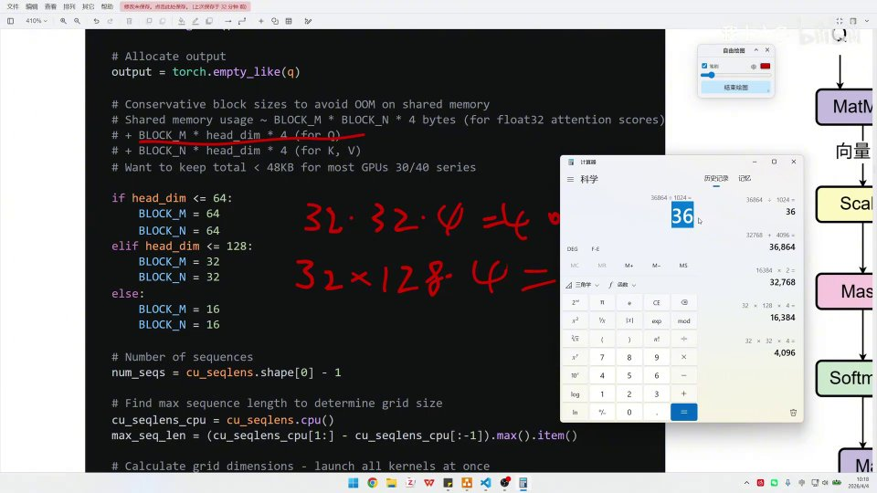 |
| OK，继续讲后面。这个地方没理解没关系，后面还会深入讲 block_m 和 block_n。我也建议大家下来自己推敲、推一下， [【跳转到 16:50】](https://www.bilibili.com/video/BV1CNDgB4EYy/?t=1010) | 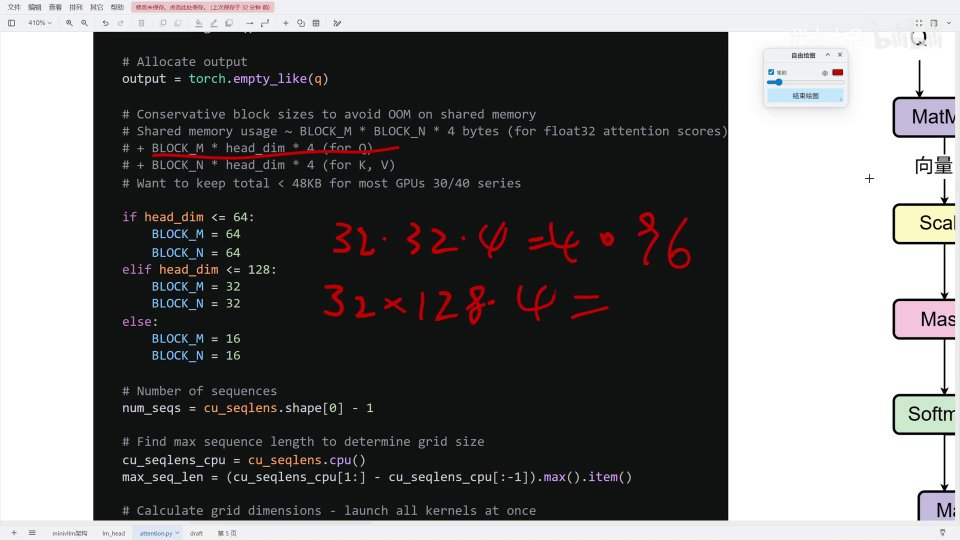 |
| 自己推一下会更清楚。OK，这个地方是 sequence 的数量， [【跳转到 17:02】](https://www.bilibili.com/video/BV1CNDgB4EYy/?t=1022) | 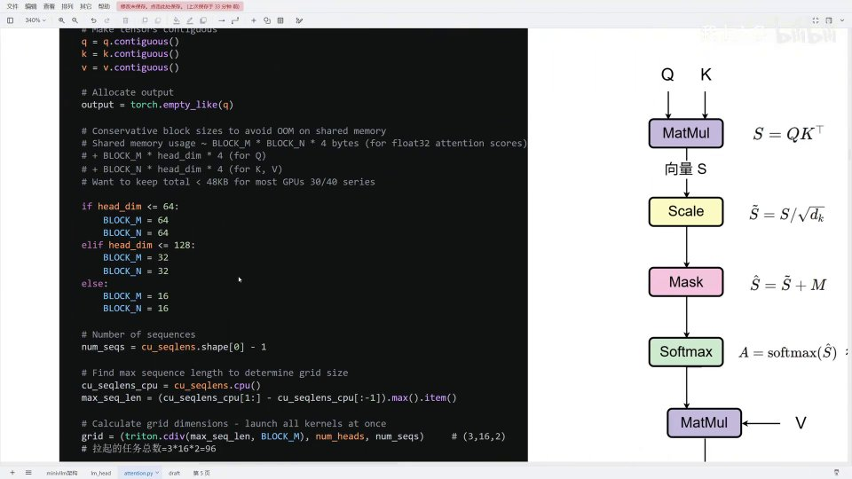 |
| 通过 q_seqlen 减一得到，因为它存的是起始位置， [【跳转到 17:07】](https://www.bilibili.com/video/BV1CNDgB4EYy/?t=1027) | 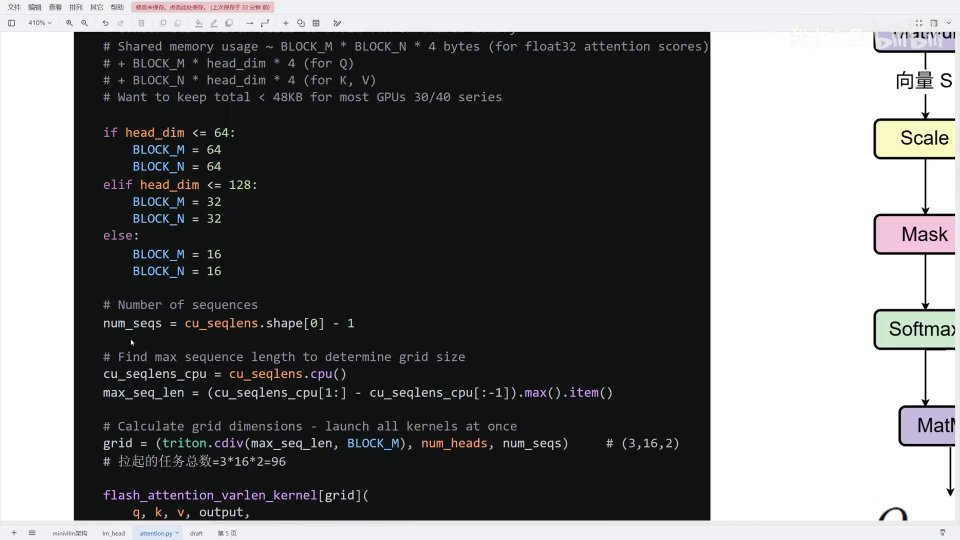 |
| 减一就是所有序列的数量。然后这个是把数据搬到 CPU 上，这个是获取序列的最大长度——这一组序列中最大序列的长度，目的是方便后面分块。这个地方是 grid。grid 是 Triton 的一个概念，相当于把 GPU 的计算资源——不管你底层有多少计算资源——我起一个 grid 分配我的任务总数，任务分配完，底层具体怎么执行我不太在意。这是 Triton 的理念。我们来看这个地方是怎么划分任务的。刚才传了两个 sequence，一个是 70、一个是 34， [【跳转到 17:12】](https://www.bilibili.com/video/BV1CNDgB4EYy/?t=1032) | 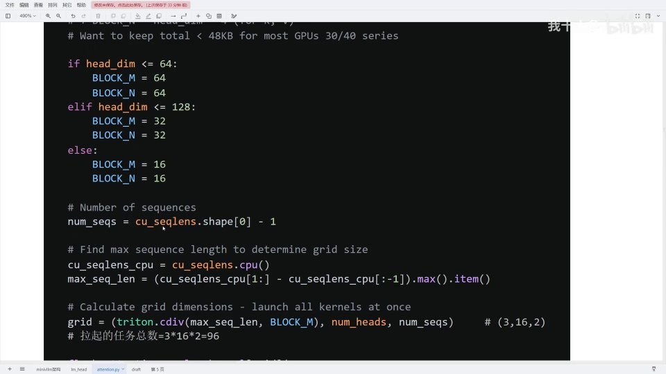 |
| 那 max 可能是 70，不是可能——这是 max_seqlen，就是 70。这个 block_m 呢？因为我们这里是 demo，小于 128， [【跳转到 17:37】](https://www.bilibili.com/video/BV1CNDgB4EYy/?t=1057) | 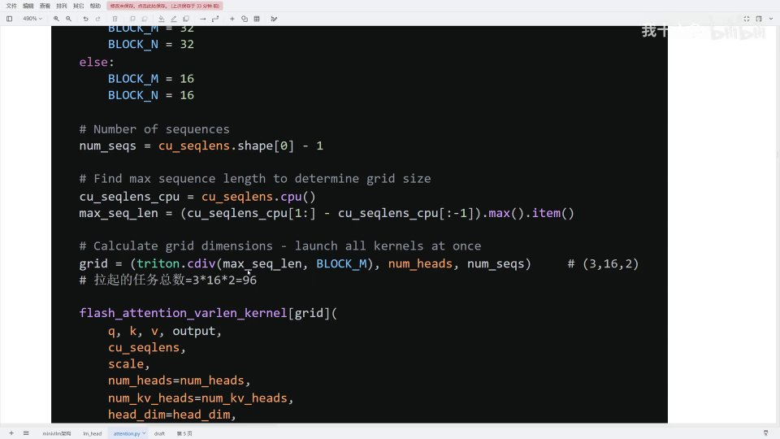 |
| 所以 block_m 其实是 32。然后 num_head 就是 Q 头的数量，是 16；num_sequence 是 2。我们来看 70÷32，这里是 3，所以整个 grid 网格就是 3×16×2。我们来理解一下 grid 是什么情况： [【跳转到 18:02】](https://www.bilibili.com/video/BV1CNDgB4EYy/?t=1082) | 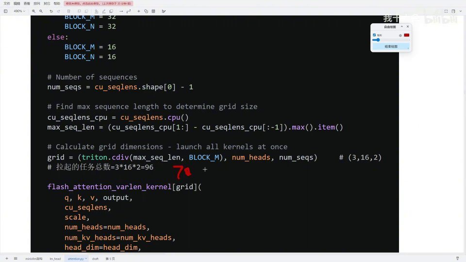 |
| 在内存中…… [【跳转到 18:27】](https://www.bilibili.com/video/BV1CNDgB4EYy/?t=1107) | 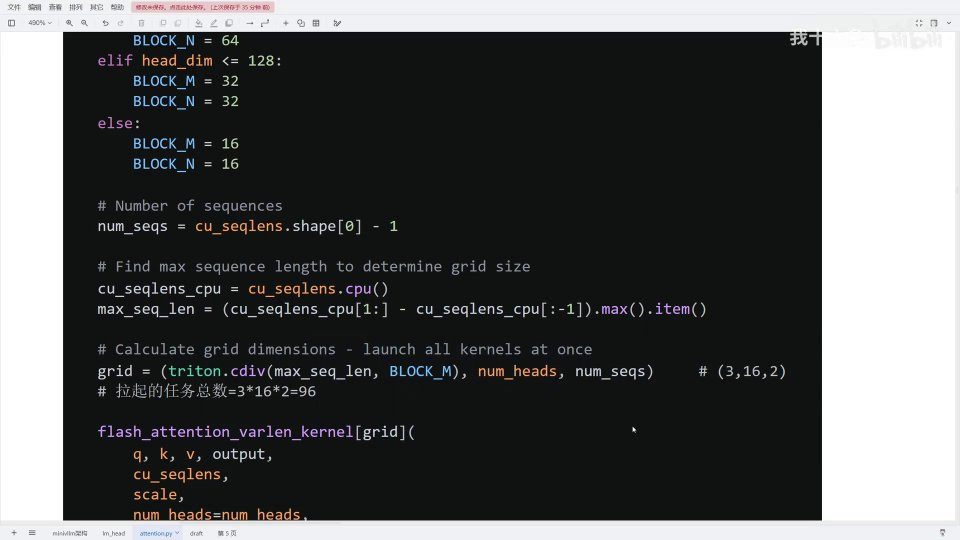 |
| 哦，还是接着讲吧。这个 grid 相当于把 GPU 划分成 3×16 [【跳转到 18:32】](https://www.bilibili.com/video/BV1CNDgB4EYy/?t=1112) | 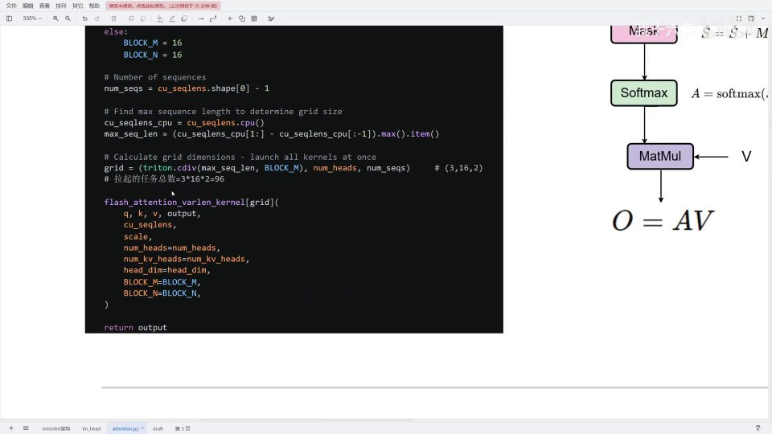 |
| ×2 这么一个形状，相当于把 GPU 底层的算力资源分成了 96 个任务，让 GPU 自己分配具体怎么执行，Triton 不太在意。那我们现在就进入了 FlashAttention 的可变长 kernel，这个很关键——这是可变长的 kernel，然后 grid 的每一个任务相当于起一个这样的 kernel， [【跳转到 18:37】](https://www.bilibili.com/video/BV1CNDgB4EYy/?t=1117) | 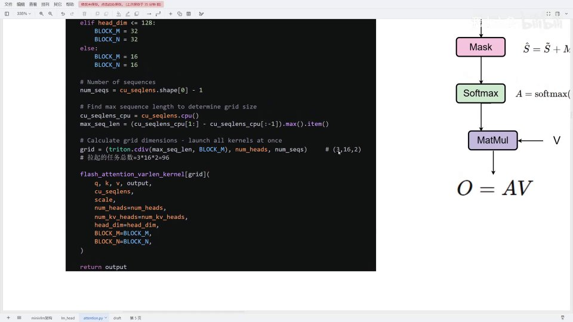 |
| 去做运算。来看 FlashAttention 这个 kernel 具体怎么算吧。好，OK，现在就进入正题了： [【跳转到 19:02】](https://www.bilibili.com/video/BV1CNDgB4EYy/?t=1142) | 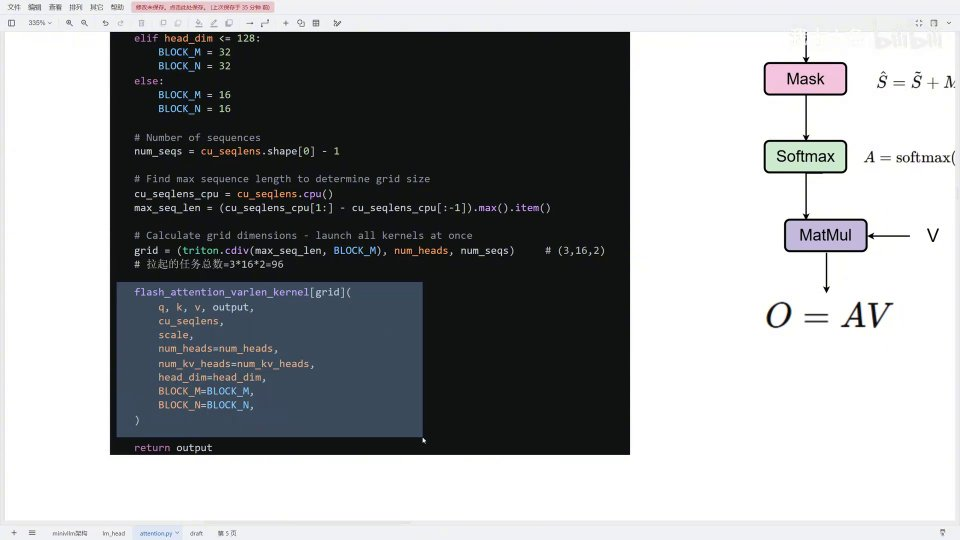 |
| 用 Triton 实现的 FlashAttention。 [【跳转到 19:10】](https://www.bilibili.com/video/BV1CNDgB4EYy/?t=1150) | 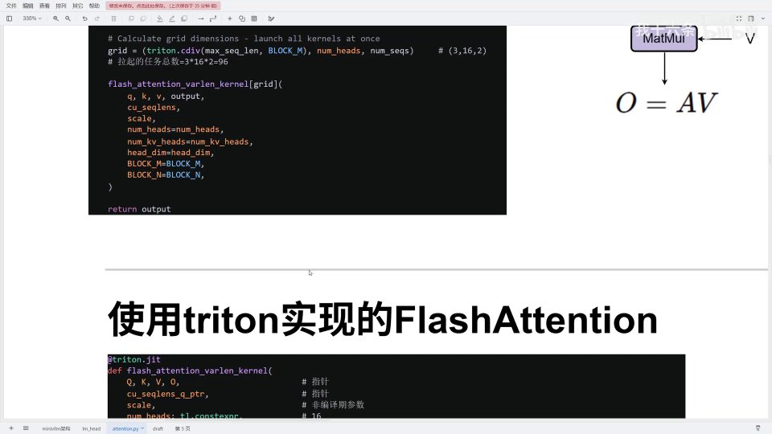 |
| OK，我们先讲一个比较关键的概念：grid，刚才已经说过， [【跳转到 19:15】](https://www.bilibili.com/video/BV1CNDgB4EYy/?t=1155) | 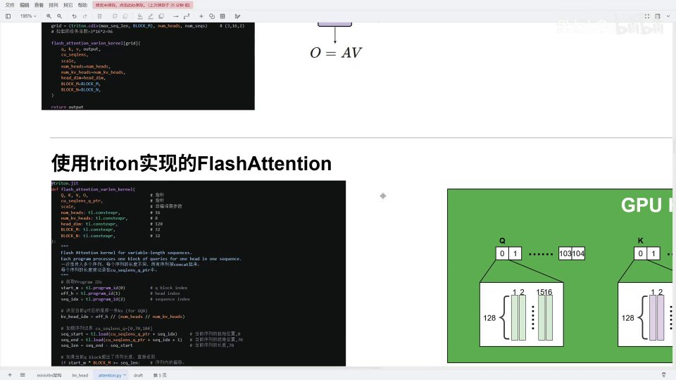 |
| grid 在内存中相当于分成了 96 个任务，让 GPU 去算。 [【跳转到 19:20】](https://www.bilibili.com/video/BV1CNDgB4EYy/?t=1160) | 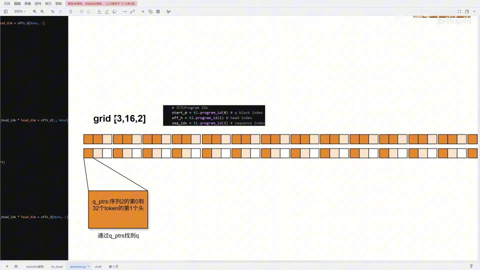 |
| 这 96 个任务怎么理解？我们来看。首先我们已经知道 GPU 的 HBM、也就是它的内存 [【跳转到 19:25】](https://www.bilibili.com/video/BV1CNDgB4EYy/?t=1165) | 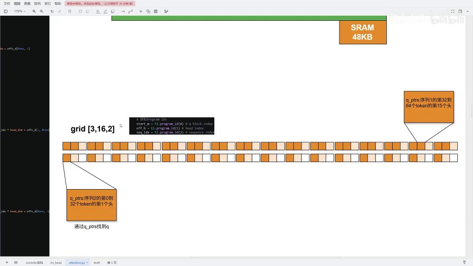 |
| 显存中，实际上存了两个序列，而这两个序列是连续存储的。这个内存里相当于已经存放好了 QKV，这只是一个示意。Q 从 0~70 是第一个序列的，从 70~104 是第二个序列的，K、V 也一样。在这种情况下， [【跳转到 19:33】](https://www.bilibili.com/video/BV1CNDgB4EYy/?t=1173) | 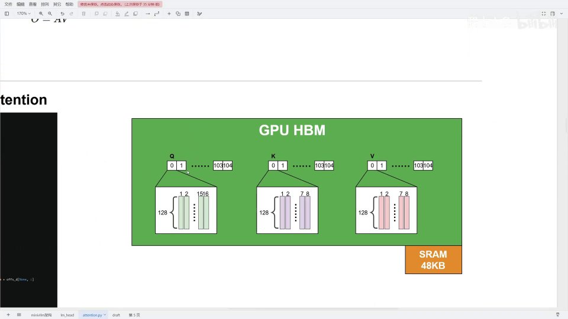 |
| 我们 Q 的第一个块、第一个 token，它里边有 16 个头、每个头 128 维；KV 也一样，第一个 token 里有 8 个头、每个头 128 维。然后我们要做一件事：SRAM 在计算过程中要读哪一块、哪一部分？因为我们已经对 QKV 分块了， [【跳转到 19:58】](https://www.bilibili.com/video/BV1CNDgB4EYy/?t=1198) | 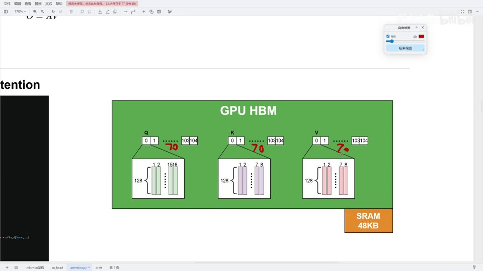 |
| 怎么分块非常关键。我们刚才提到一个 grid， [【跳转到 20:23】](https://www.bilibili.com/video/BV1CNDgB4EYy/?t=1223) | 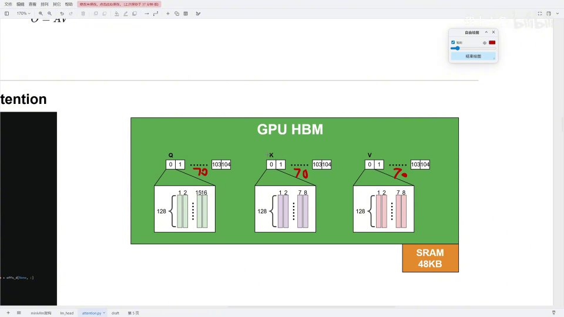 |
| 然后我们分的大小是 3×16×2。怎么把这个 grid 和 QKV 联系起来，就是接下来要先厘清的点。 [【跳转到 20:43】](https://www.bilibili.com/video/BV1CNDgB4EYy/?t=1243) | 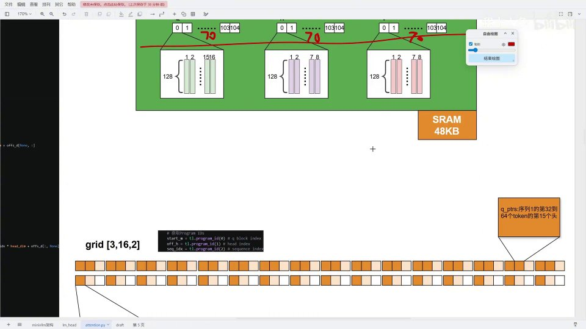 |
| grid 分了三层：16、2，大概是这么一个形状，相当于把整个 GPU 的资源分成了 96 个块，每个块执行具体任务，最后把结果汇总。这就是 grid 大概的意思。这里我画了一个 grid 的情况：上半部分对应第一个序列， [【跳转到 20:48】](https://www.bilibili.com/video/BV1CNDgB4EYy/?t=1248) | 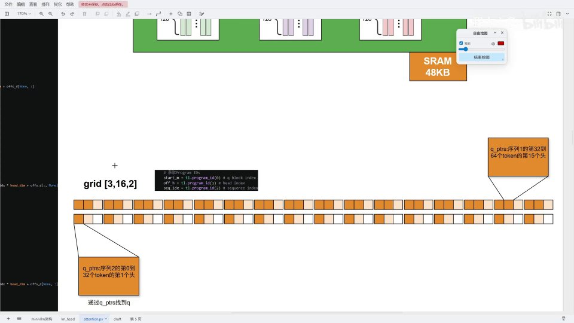 |
| 就是我们说的 70，下半部分就是 34。我们来看它里边具体是什么意思。这个 3 是什么意思？因为刚才说的 3 是怎么算的？70÷32，每个块大概存放 32 个 token，算出来等于 3，所以这个 3 实际上代表最长的那个序列它的分块大小是 3。 [【跳转到 21:12】](https://www.bilibili.com/video/BV1CNDgB4EYy/?t=1272) | 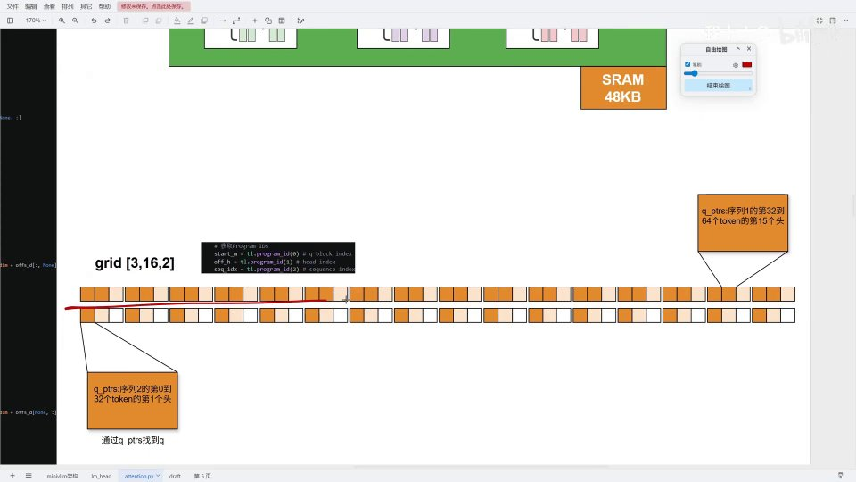 |
| 如果说这个不是最长序列，如果我们把块设置成 2，那读某一个序列，比如以 2 为标准，34 可以装一下，因为一个块大概 32，32、32 两个块去装一个 34 的序列；但两个块装不下一个 70 的序列，所以这里需要用最长的序列来做划分。 [【跳转到 21:37】](https://www.bilibili.com/video/BV1CNDgB4EYy/?t=1297) | 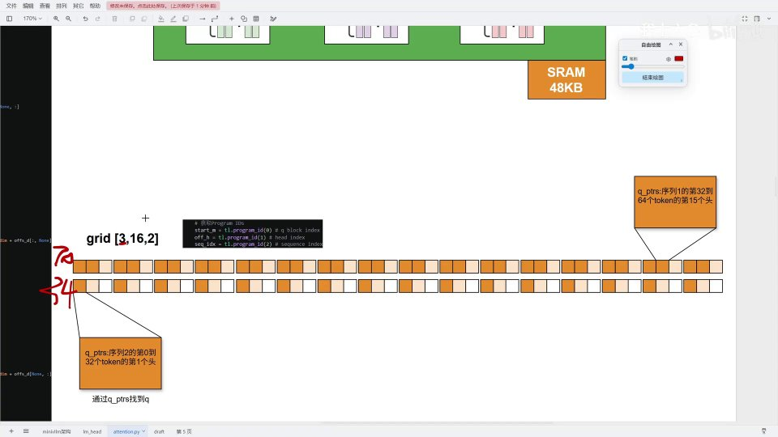 |
| OK，再看这个 16，就是头的维度，相当于我第一个块读取的是第一个头。第一个块读的其实就是我这个序列……怎么说呢，我这第一块读的其实是第一个序列从第 0 个 token 到第 70 个 token，然后这里是第 32 个 token， [【跳转到 22:02】](https://www.bilibili.com/video/BV1CNDgB4EYy/?t=1322) | 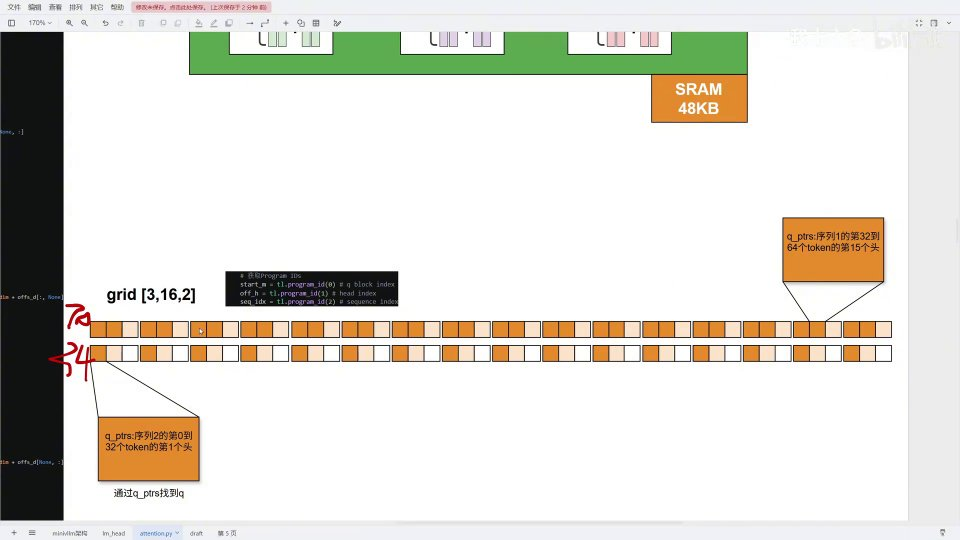 |
| 这里是第 64 个 token。第一个块读取的就是这一部分，前 32 个 token。比如我第一个块读的是前 32 个 token 的第一个头，那也就是第一个头。对应到内存中， [【跳转到 22:27】](https://www.bilibili.com/video/BV1CNDgB4EYy/?t=1347) | 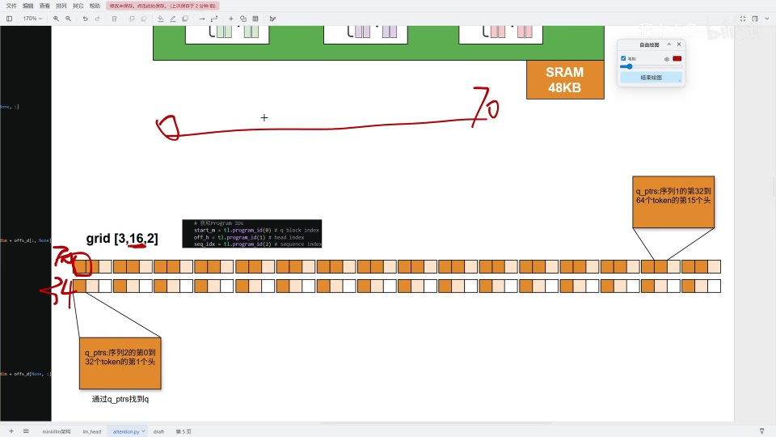 |
| 其实就是读这前 32 个 token 的第一个头。K 也是一样的，就是前 32 个 token 的第一个头。 [【跳转到 22:44】](https://www.bilibili.com/video/BV1CNDgB4EYy/?t=1364) | 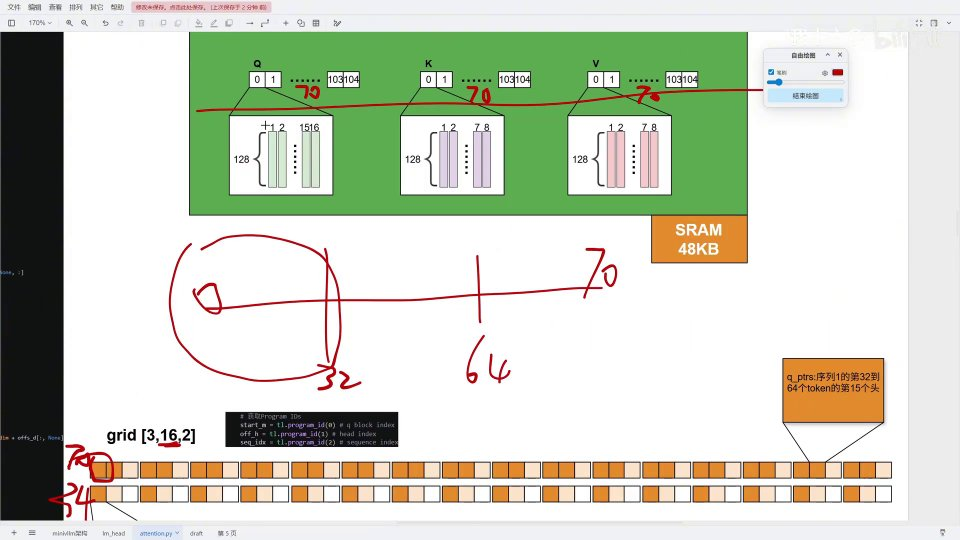 |
| 这里我其实画了 16 个：这是前 32 个 token 的第一个头，这一块是前 32 个 token 的第二个头，这个块相当于第 32 到第 64 个 token 的第二个头。大家可以理解一下。包括这一块为什么我画的第三个块颜色要淡一点？因为它其实没有装满，只能读 6 个 token，因为最长的序列只有 70 个 token， [【跳转到 23:01】](https://www.bilibili.com/video/BV1CNDgB4EYy/?t=1381) | 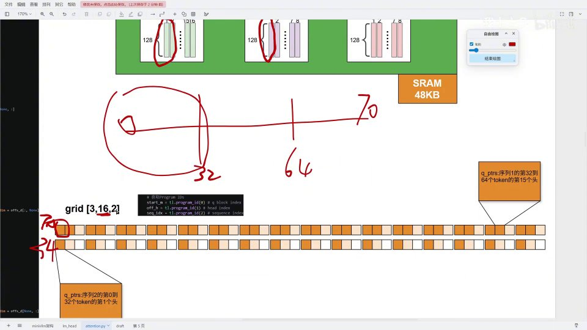 |
| 前两个块已经满了、都是 32，但最后一个块只能读 6 个 token，所以我这里画得浅一点，表示这个任务并没有被填满。 [【跳转到 23:26】](https://www.bilibili.com/video/BV1CNDgB4EYy/?t=1406) | 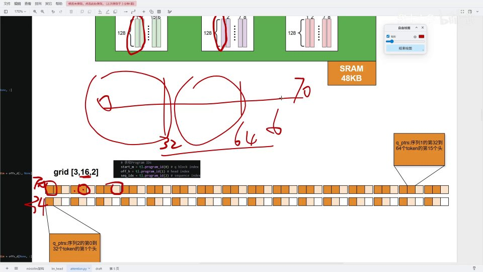 |
| 下面这一个块代表第二个序列的第 0 到第 32 个 token 的第一个头。这个浅一点，因为第二个序列长度是 34，第一个块分到 32，取了第 0 到第 32 个 token 的第一个头。 [【跳转到 23:43】](https://www.bilibili.com/video/BV1CNDgB4EYy/?t=1423) |  |
| 这个地方颜色更淡，说明它取的是这一块、只有两个 token，即第 32 到第 34 的第一个头。这一块为什么是白的？因为最长的窗口分了三个块，但我们必须把第三个块表示出来，所以最后第三个块实际上是白的，它没有计算任务，但依然会进这个流程。具体在代码里也可以看到， [【跳转到 24:08】](https://www.bilibili.com/video/BV1CNDgB4EYy/?t=1448) | 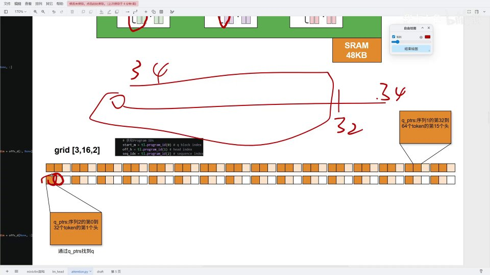 |
| 比如这个地方做了一个判断：当 q_block 超过了序列长度的时候， [【跳转到 24:31】](https://www.bilibili.com/video/BV1CNDgB4EYy/?t=1471) | 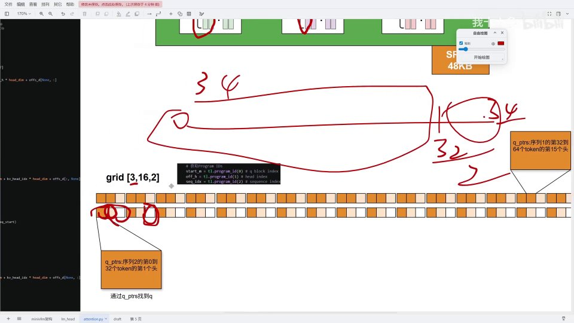 |
| 它会直接返回，对应的就是这一块。 [【跳转到 24:36】](https://www.bilibili.com/video/BV1CNDgB4EYy/?t=1476) | 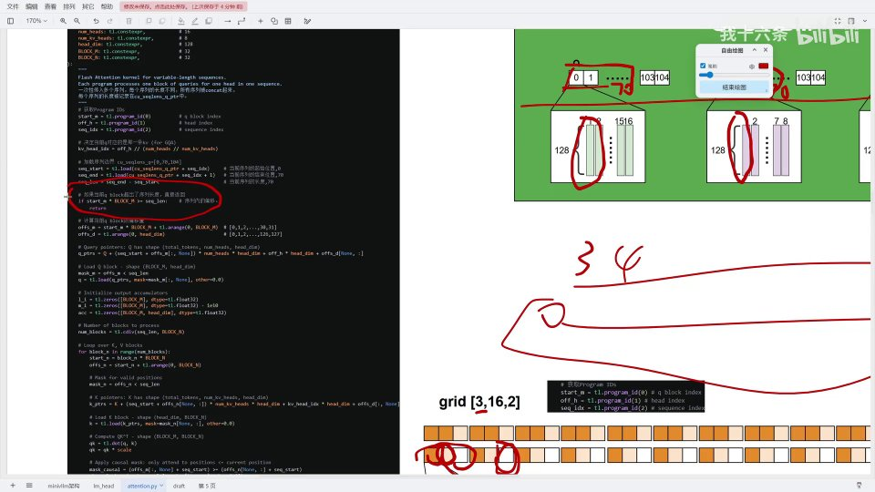 |
| 当这个块已经超过序列长度时，它直接返回，不做运算。 [【跳转到 24:41】](https://www.bilibili.com/video/BV1CNDgB4EYy/?t=1481) | 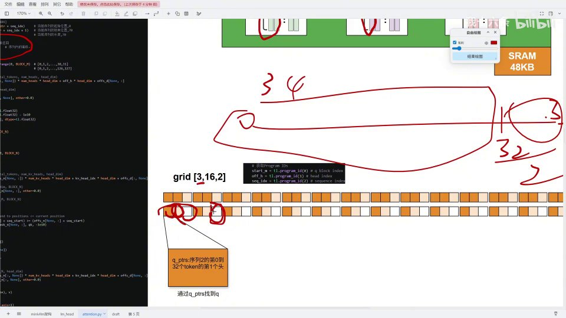 |
| 就是这么个意思。OK，grid 讲完了。这个 grid 其实只是我们一个前提理解， [【跳转到 24:46】](https://www.bilibili.com/video/BV1CNDgB4EYy/?t=1486) | 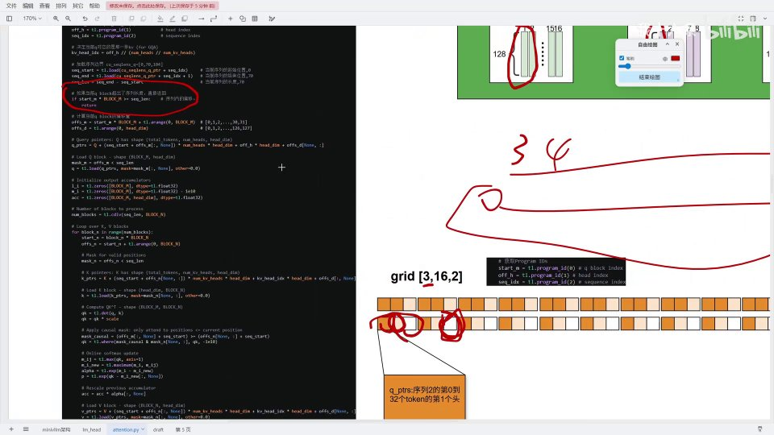 |
| 没理解也没关系，随着接下来深入讲可能会有更深刻的理解。OK，我们具体来看 FlashAttention 的 kernel 是怎么计算的。 [【跳转到 24:51】](https://www.bilibili.com/video/BV1CNDgB4EYy/?t=1491) | 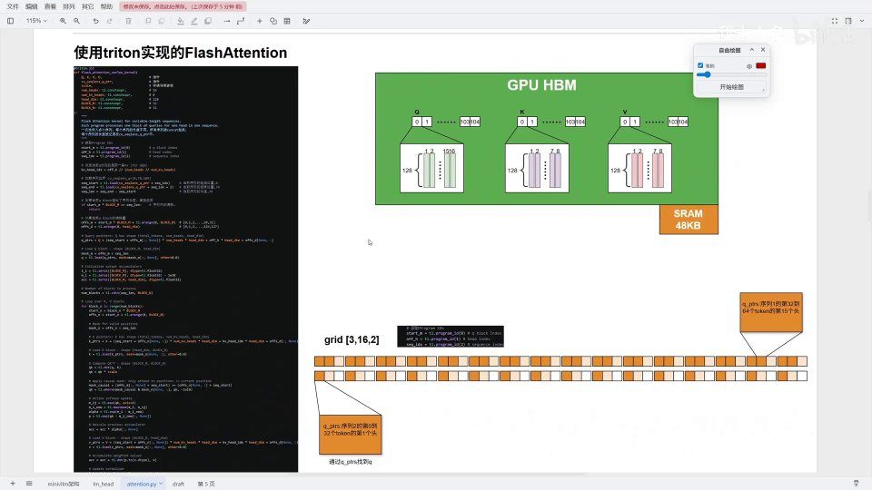 |
| 首先这里有 program_id， [【跳转到 25:03】](https://www.bilibili.com/video/BV1CNDgB4EYy/?t=1503) | 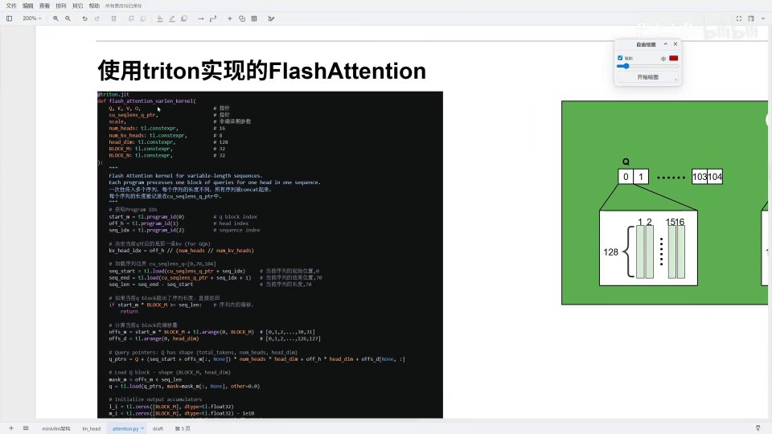 |
| 这是什么意思？相当于我获取每一个块、也就是每一个块具体要做什么任务、 [【跳转到 25:08】](https://www.bilibili.com/video/BV1CNDgB4EYy/?t=1508) | 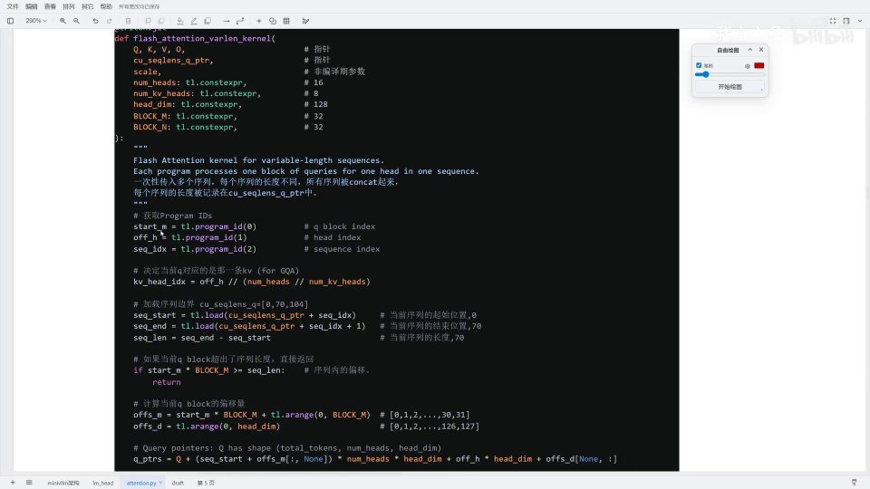 |
| 具体读取哪一部分数据。因为刚才说了，第一个块读的其实是第一个序列第 0 到第 32 个 token 的第一个头，所以每个块里边都会拉起这么一个 kernel。 [【跳转到 25:13】](https://www.bilibili.com/video/BV1CNDgB4EYy/?t=1513) | 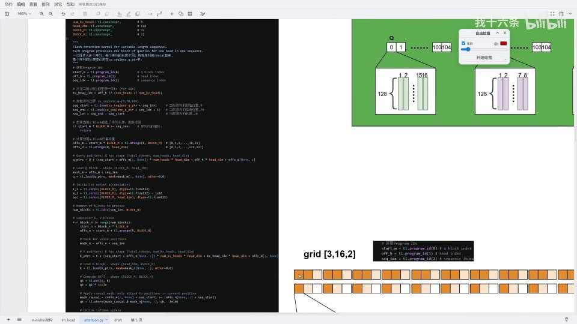 |
| 假设我们在第一个块里，这个 program_id 的第四维 M 表示什么？它叫 Q 的 block index， [【跳转到 25:31】](https://www.bilibili.com/video/BV1CNDgB4EYy/?t=1531) | 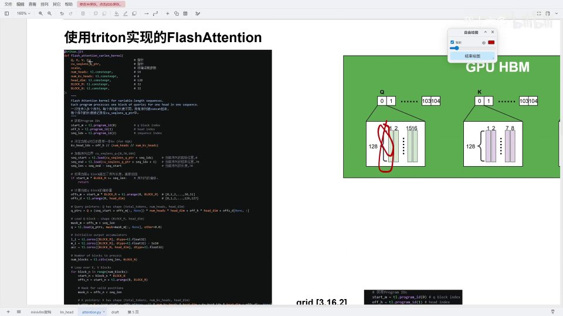 |
| 意思就是我们这个 Q 块 [【跳转到 25:36】](https://www.bilibili.com/video/BV1CNDgB4EYy/?t=1536) | 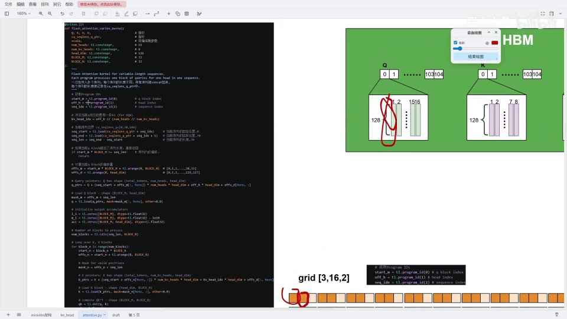 |
| 它读的 Q 开始的位置。 [【跳转到 25:44】](https://www.bilibili.com/video/BV1CNDgB4EYy/?t=1544) | 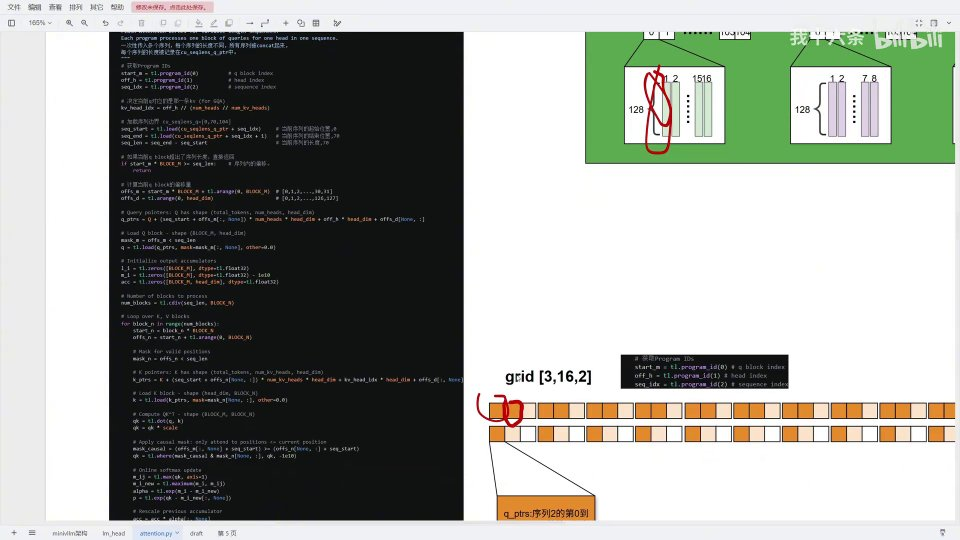 |
| 比如在第一个块里，它开始的位置就是 0，相当于从这个地方开始读。然后这个 offset 的 H 是头的 index，读取的是第几个头。刚才说的 grid 第二个参数 0、1、2，代表读取这三个参数具体是什么。 [【跳转到 25:49】](https://www.bilibili.com/video/BV1CNDgB4EYy/?t=1549) | 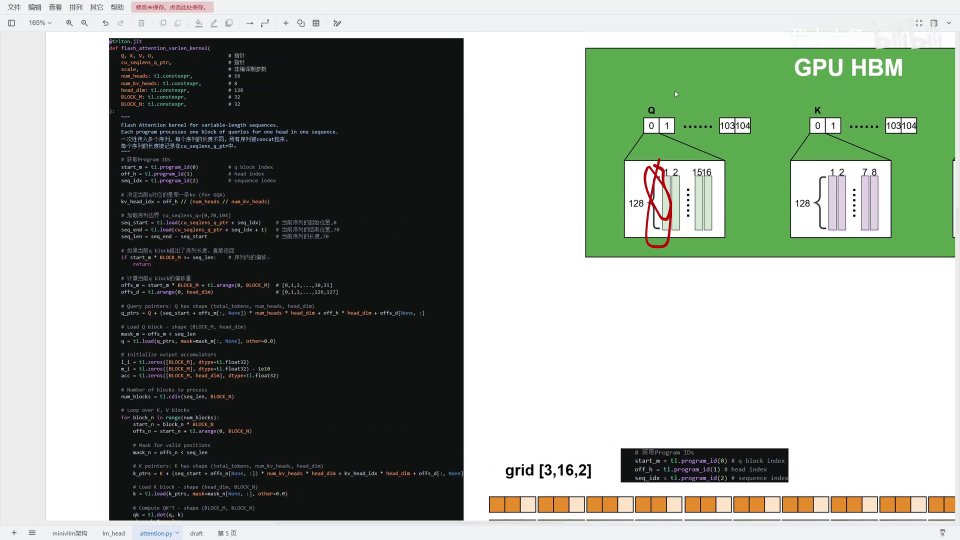 |
| OK，我们读 offset_h，也就是头的偏移，当前任务块里读的是哪一个头。在第一个块里读的就是第一个头，没毛病。然后 sequence_index 是当前序列的索引，我们在哪个序列？在这个块里我们现在是第 0 个块， [【跳转到 26:14】](https://www.bilibili.com/video/BV1CNDgB4EYy/?t=1574) |  |
| 自然读的就是第一个序列，所以这个地方 q_block_index 就是 0， [【跳转到 26:34】](https://www.bilibili.com/video/BV1CNDgB4EYy/?t=1594) | 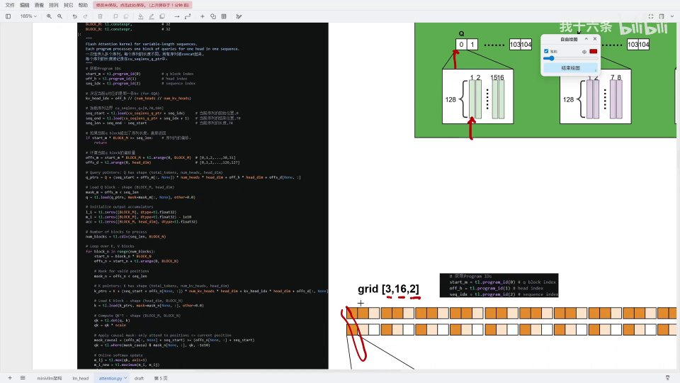 |
| h_index 也是 0， [【跳转到 26:39】](https://www.bilibili.com/video/BV1CNDgB4EYy/?t=1599) | 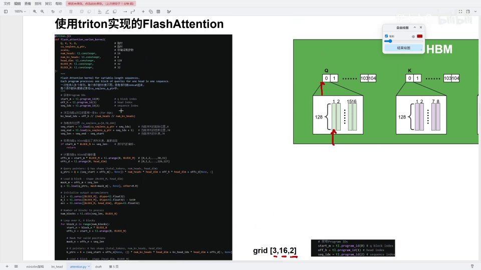 |
| seq_index 也是 0。OK，然后这一步再算什么？当前 Q 对应的……这里其实是一个 GQA，刚才也提到，因为我们是两个 Q 对应一个 KV，所以需要计算当前 Q 具体读的是哪一个 KV。我们来看， [【跳转到 26:44】](https://www.bilibili.com/video/BV1CNDgB4EYy/?t=1604) | 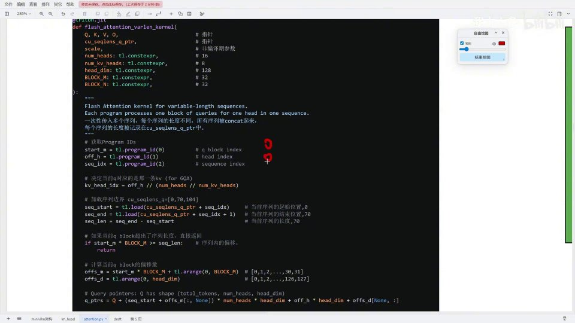 |
| 比如我们现在读的是第 0 到 32、 [【跳转到 27:00】](https://www.bilibili.com/video/BV1CNDgB4EYy/?t=1620) | 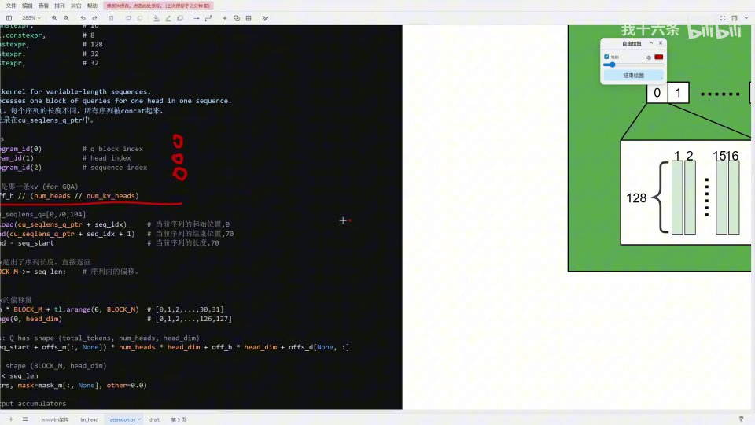 |
| 第一个 Q 块，读的是第一个头。因为 GQA 是每两个 Q 头对应一个 KV 头，意思就是第 1 号和第 2 号 Q 头对应的其实都是这一个 KV，V 也一样， [【跳转到 27:05】](https://www.bilibili.com/video/BV1CNDgB4EYy/?t=1625) | 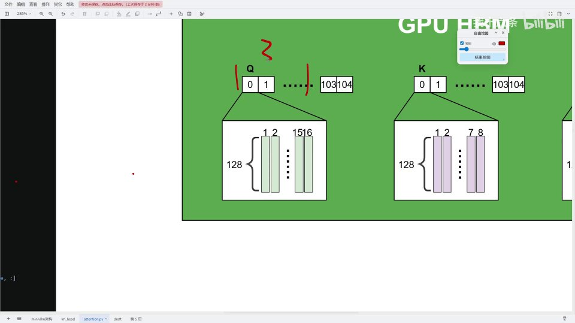 |
| 都是这第一个 KV 头。 [【跳转到 27:30】](https://www.bilibili.com/video/BV1CNDgB4EYy/?t=1650) | 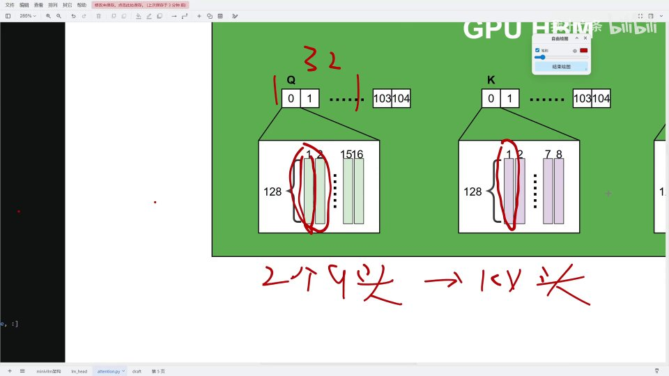 |
| 再举个例子，比如第 16 个 Q 头对应的是什么？自然是最后一个。OK，应该没什么问题。 [【跳转到 27:35】](https://www.bilibili.com/video/BV1CNDgB4EYy/?t=1655) | 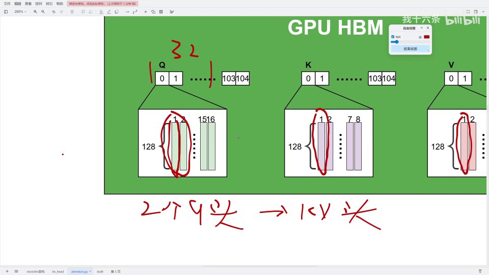 |
| 好，回来继续看。KV 的 h_index 找到之后， [【跳转到 27:45】](https://www.bilibili.com/video/BV1CNDgB4EYy/?t=1665) | 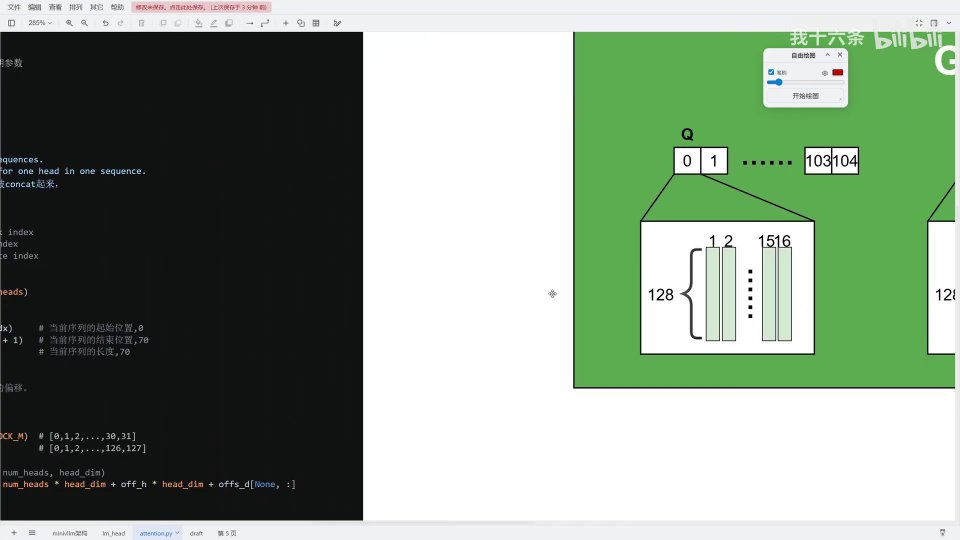 |
| 比如当前是第 0 个头，000 都是零，那当前是第 0 个头。0 除以 num_head 再除以 kv_head，这里是 16÷8 等于 2，offset 是 0、还是 0。这也能理解：第一个 Q 头对应的就是第一个 KV 头。OK，现在加载序列的边界， [【跳转到 27:50】](https://www.bilibili.com/video/BV1CNDgB4EYy/?t=1670) | 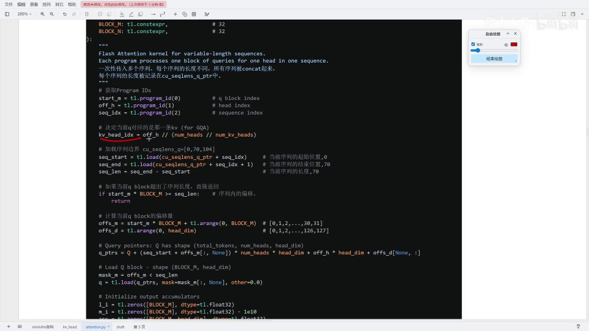 |
| 因为我们传入的参数是 70、104。我们来看 start，就是序列的起始位置。我们来看……哦对，这个地方还有个前提我没提到：传入的这些参数， [【跳转到 28:15】](https://www.bilibili.com/video/BV1CNDgB4EYy/?t=1695) | 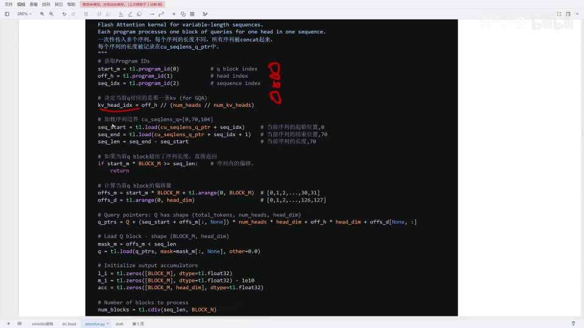 |
| 在 Triton 计算过程中，QKV 传的都是它的地址，我们并没有把真正的 QKV 那一整块读进去。因为我们进入这个 kernel 函数之后，实际上就是在 SRAM 中做运算了。SRAM 刚才也提到只有 48KB，不可能装下完整的 QKV。还有这个 q_seqlen， [【跳转到 28:35】](https://www.bilibili.com/video/BV1CNDgB4EYy/?t=1715) | 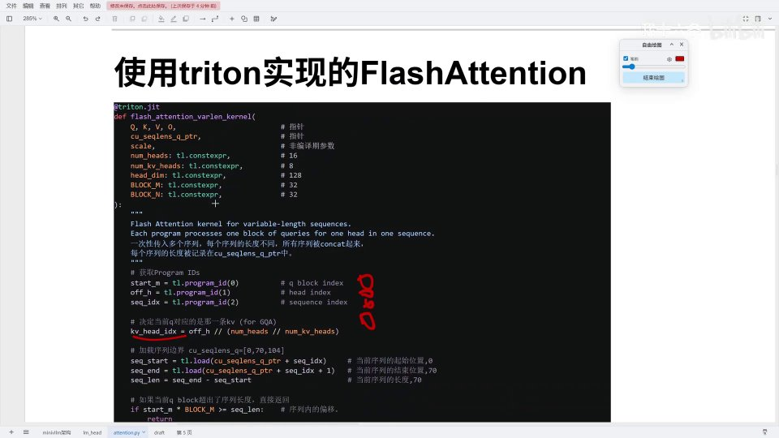 |
| 实际上也是一个指针。这几个其实是常量，占的空间并不大。而 QKV 都是以指针形式放进来的，所以每一个 kernel、每一个 SRAM 具体要读哪一部分，就对应我们刚才讲的 grid。 [【跳转到 29:00】](https://www.bilibili.com/video/BV1CNDgB4EYy/?t=1740) | 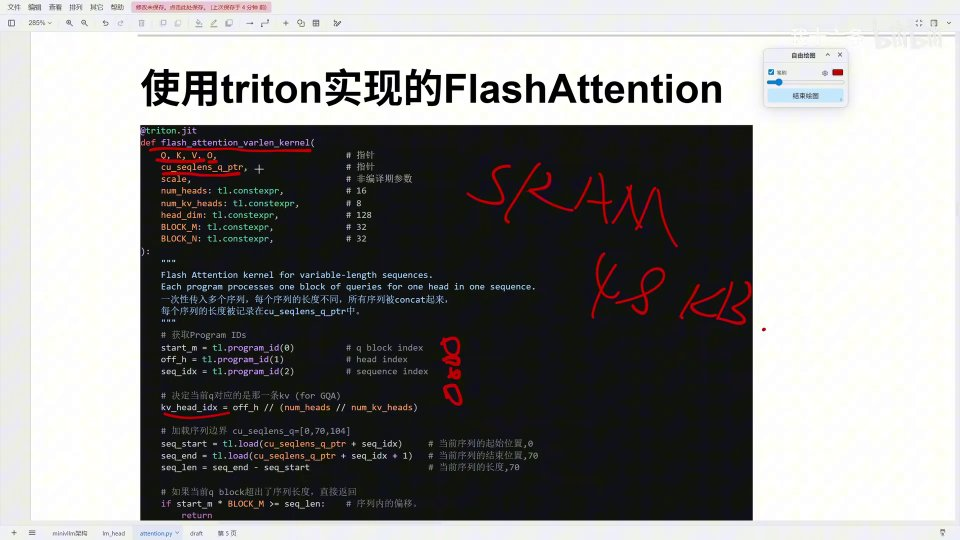 |
| 刚才有个前提我忘了讲， [【跳转到 29:15】](https://www.bilibili.com/video/BV1CNDgB4EYy/?t=1755) | 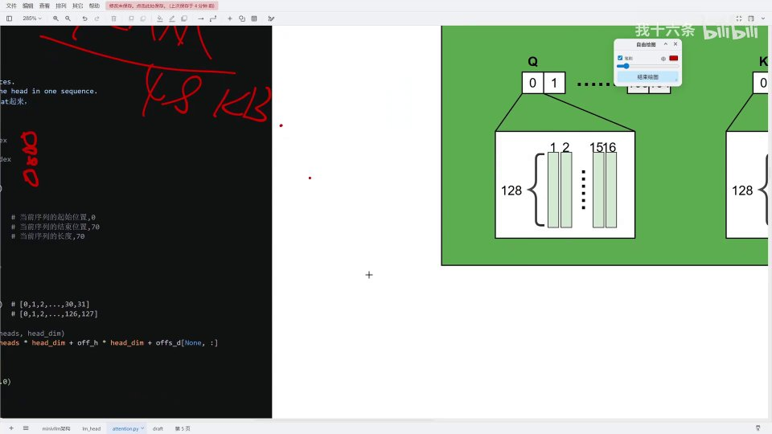 |
| 就是有一个默认前提：我们的 QKV 都在 HBM 里边， [【跳转到 29:20】](https://www.bilibili.com/video/BV1CNDgB4EYy/?t=1760) |  |
| 都在 HBM 里。那我们的 SRAM 就要通过 grid、grid_id， [【跳转到 29:25】](https://www.bilibili.com/video/BV1CNDgB4EYy/?t=1765) | 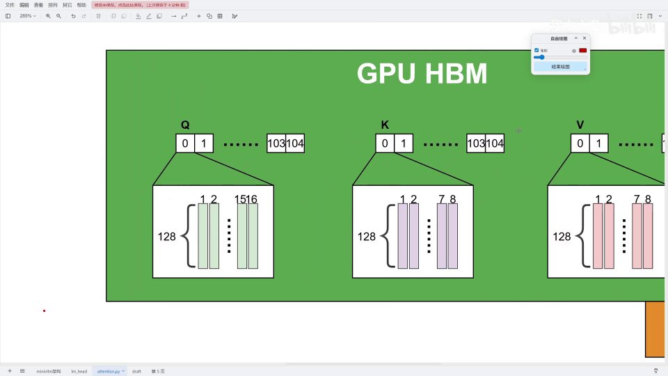 |
| 去找到具体的 QKV 头、读取哪一部分。这是一个比较重要的前提。 [【跳转到 29:30】](https://www.bilibili.com/video/BV1CNDgB4EYy/?t=1770) | 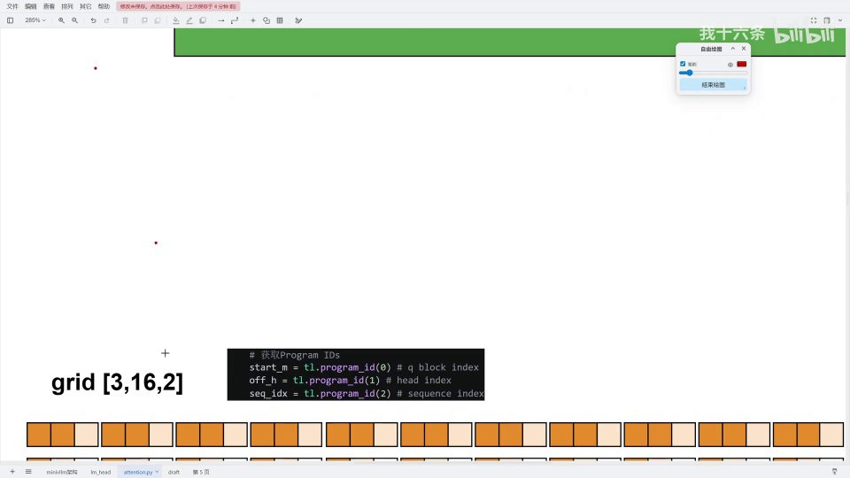 |
| OK，我们接下来继续。 [【跳转到 29:35】](https://www.bilibili.com/video/BV1CNDgB4EYy/?t=1775) | 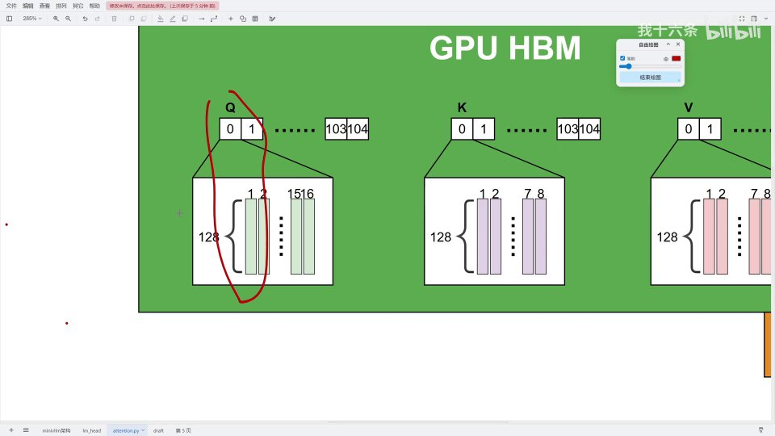 |
| 这加载序列的边界。当前因为我们都在第一个块上，序列的边界，起始位置当然是 0，结束位置就是整个序列的长度，也就是 N 减去……这个没啥好说的。这个长度的作用就是判断：如果当前序列超出了，就直接退出。 [【跳转到 29:40】](https://www.bilibili.com/video/BV1CNDgB4EYy/?t=1780) | 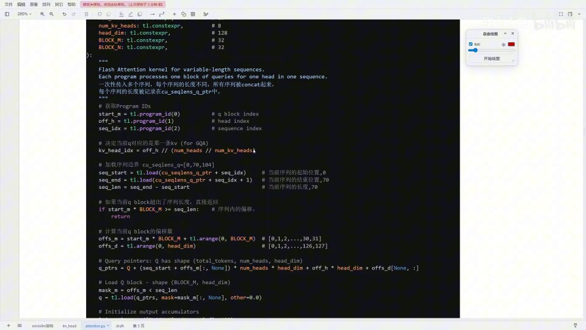 |
| 我们来讲个特殊点的例子：当前在序列二上面。OK，我们来看这个白块具体特殊在哪。 [【跳转到 30:05】](https://www.bilibili.com/video/BV1CNDgB4EYy/?t=1805) | 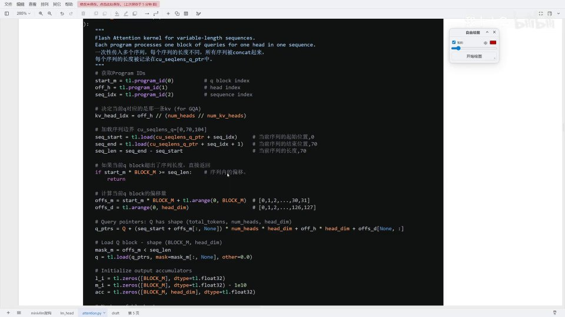 |
| OK，加载序列边界。 [【跳转到 30:11】](https://www.bilibili.com/video/BV1CNDgB4EYy/?t=1811) | 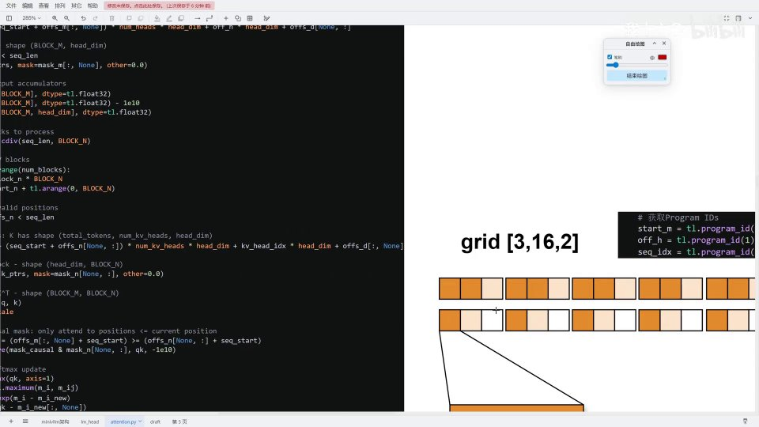 |
| 当前它在白块，序列起始位置是 1，相当于到了第二个序列， [【跳转到 30:16】](https://www.bilibili.com/video/BV1CNDgB4EYy/?t=1816) | 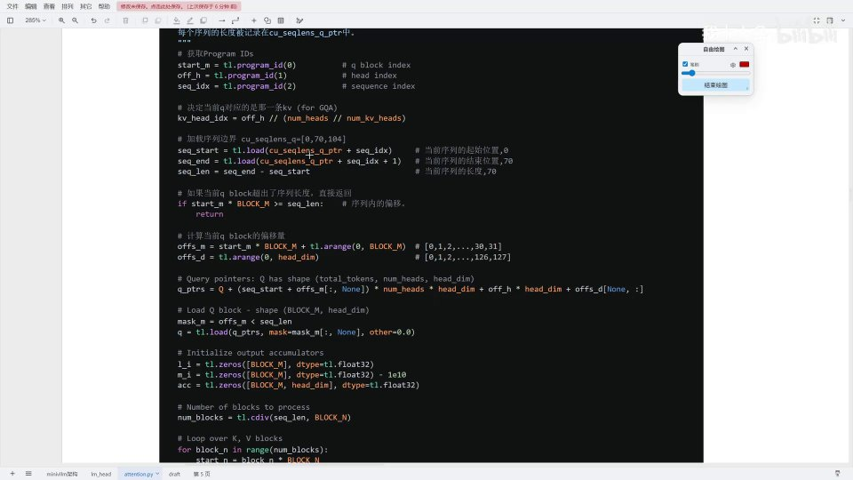 |
| 然后看当前序列结束位置，是 104。 [【跳转到 30:21】](https://www.bilibili.com/video/BV1CNDgB4EYy/?t=1821) | 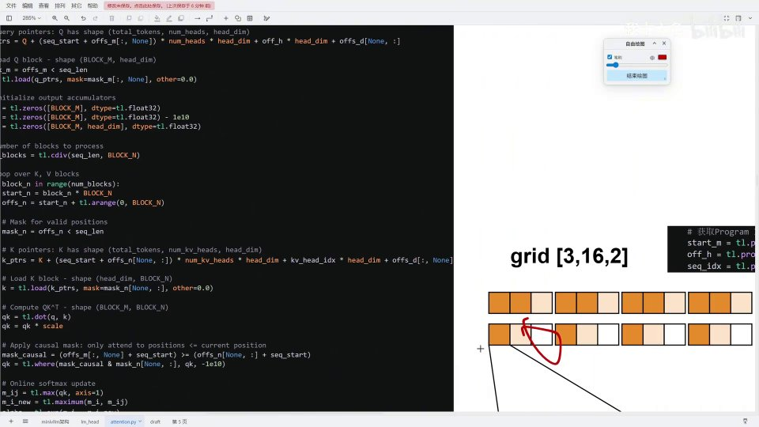 |
| 这个地方……其实我们现在讲另一个例子：它其实就是 104，然后序列长度算出来其实是 34。因为 block_m 是 Q 头的长度、是 32，然后这个 s_idx 就是 q_block 的 index、我们第几个 Q 头，我们是第三个 Q 头，第三个 Q 头 3×32 等于多少？ [【跳转到 30:26】](https://www.bilibili.com/video/BV1CNDgB4EYy/?t=1826) | 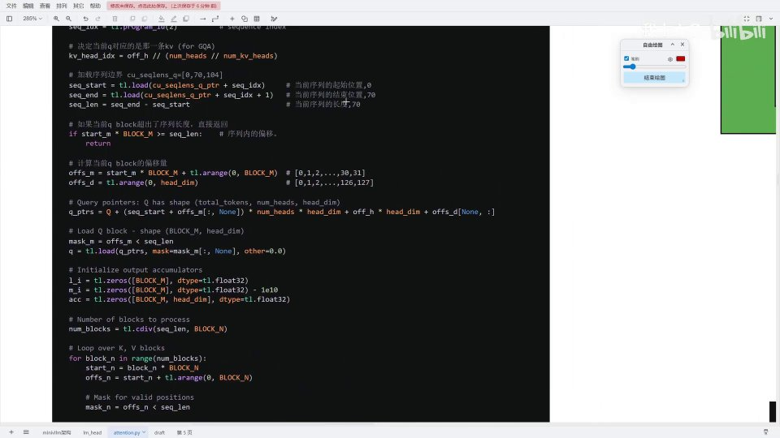 |
| 就是 96。96 大于 34，大于我们这个 sequence length，所以它这里就直接返回、不做运算了，证明这个块里没有运算。 [【跳转到 30:51】](https://www.bilibili.com/video/BV1CNDgB4EYy/?t=1851) | 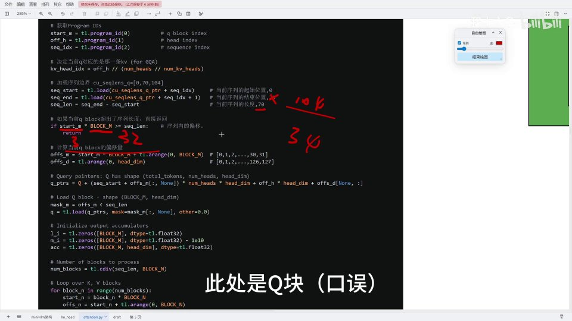 |
| 这就是白块的意思。 [【跳转到 31:02】](https://www.bilibili.com/video/BV1CNDgB4EYy/?t=1862) | 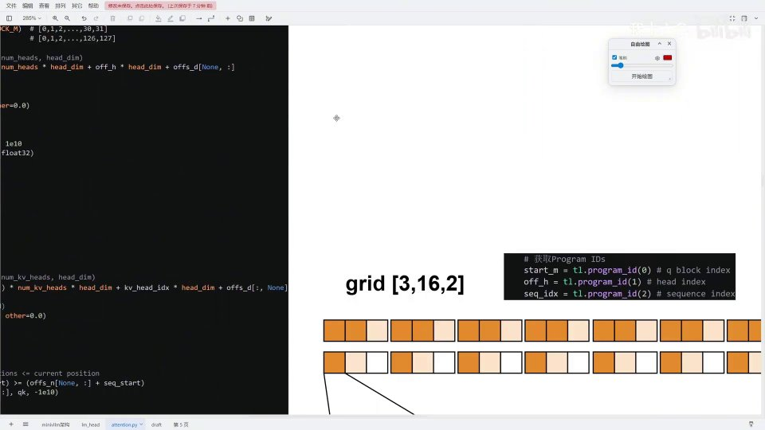 |
| OK，我们继续还是以第一个块为例。 [【跳转到 31:07】](https://www.bilibili.com/video/BV1CNDgB4EYy/?t=1867) | 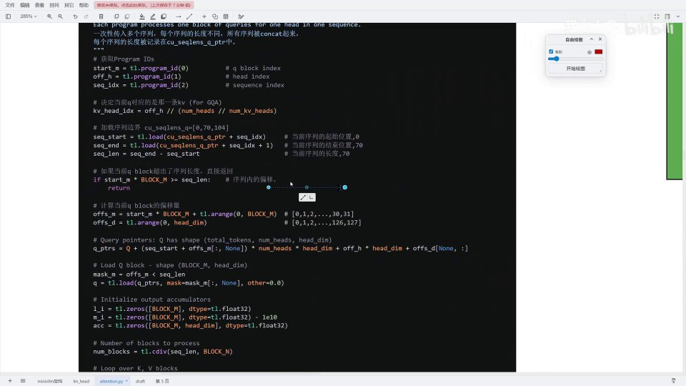 |
| 比如当前计算 q_block 的偏移量，这里实际上是在为后续读 Q 头做准备。这个我们待会儿用另外一个例子来讲，用一个稍微短一点的例子。后面这一块我们也用另外一个例子来讲，因为原本在 MiniVLLM 里，它的头数量和嵌入维度都太大了， [【跳转到 31:12】](https://www.bilibili.com/video/BV1CNDgB4EYy/?t=1872) | 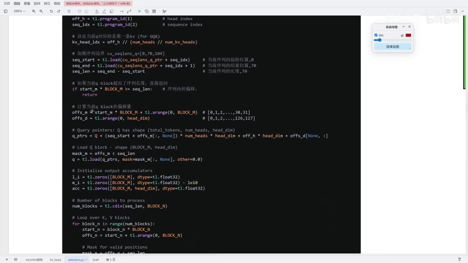 |
| 嵌入维度是 128、头数量又是 16，我做例子不太好做，所以现在换一个例子来讲。 [【跳转到 31:37】](https://www.bilibili.com/video/BV1CNDgB4EYy/?t=1897) | 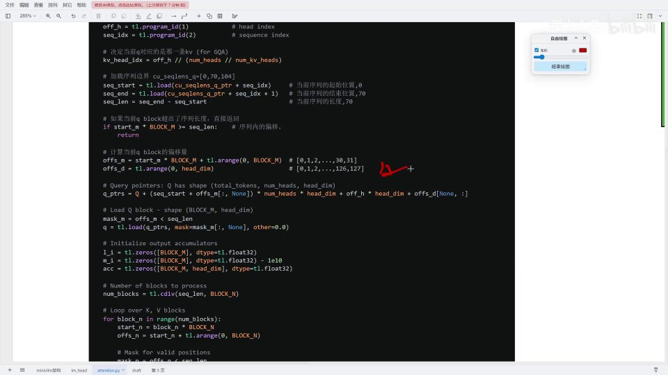 |
| 在这一块中，我们主要是要搞清楚一个前提： [【跳转到 31:46】](https://www.bilibili.com/video/BV1CNDgB4EYy/?t=1906) | 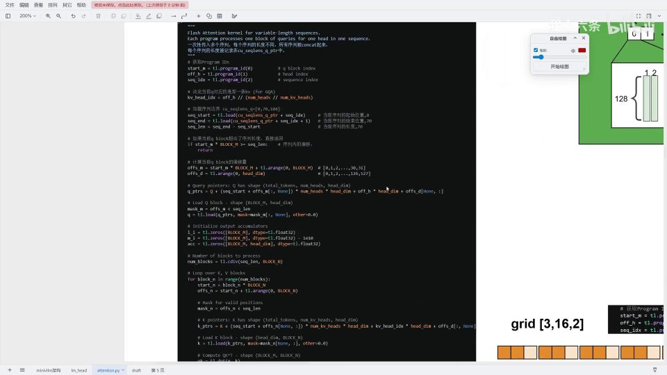 |
| 显卡中的 HBM 和 SRAM 具体是怎么读的。HBM 存了所有 QKV 数据，SRAM 只负责读取 QKV 中的某一部分，然后 SRAM 还负责计算——读出 QKV 的部分数据之后，底层具体怎么计算，就是之后要讲的内容。OK，这一部分主要是搞清楚 grid 任务划分， [【跳转到 31:51】](https://www.bilibili.com/video/BV1CNDgB4EYy/?t=1911) | 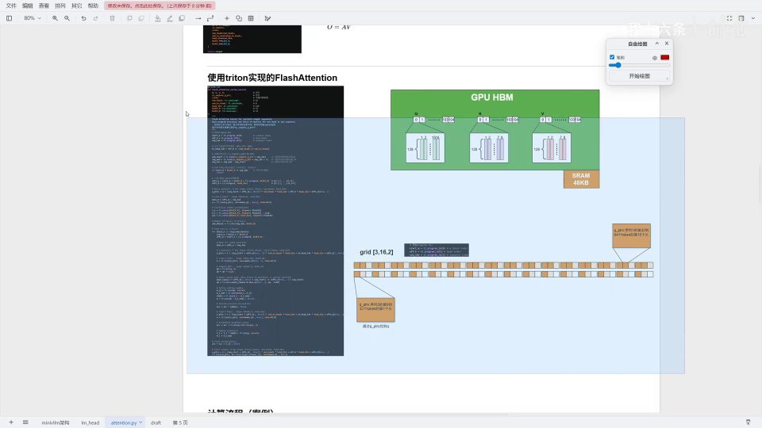 |
| 以及每一个块里具体做了啥， [【跳转到 32:12】](https://www.bilibili.com/video/BV1CNDgB4EYy/?t=1932) | 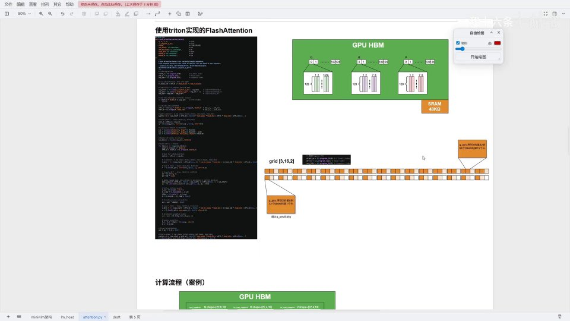 |
| 这是要搞清楚的。 [【跳转到 32:17】](https://www.bilibili.com/video/BV1CNDgB4EYy/?t=1937) | 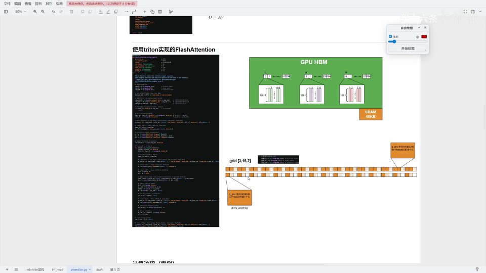 |