# Decode阶段&PagedAttention代码详解&Attention推理过程 原始文稿（图-字幕分栏）

| 字幕文本 | 画面 |
| :--- | ---: |
| 在正式开始之前，想跟大家唠几句。我更新比较慢，因为最近确实比较忙：一方面在忙毕业的事情，另一方面——告诉大家一个好消息，我目前已经被电子科技大学录取了，所以组内任务也比较重，更新会慢一些，希望大家理解。你们也能看到，我做这些课件 [【跳转到 00:00】](https://www.bilibili.com/video/BV14a5r6YEhY/?t=0) | 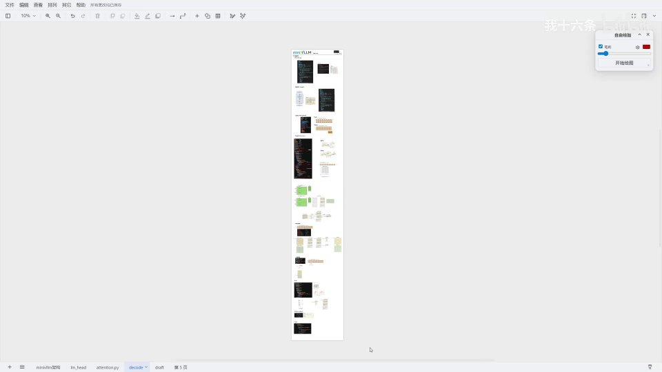 |
| 是希望尽可能把东西讲得更清楚，但受限于个人实力，有很多地方讲得比较含糊、细节也不到位。不过我还是想尽量做到最好，希望大家理解。同时大家也能看到，这个工作量非常大，就一张 [【跳转到 00:25】](https://www.bilibili.com/video/BV14a5r6YEhY/?t=25) | 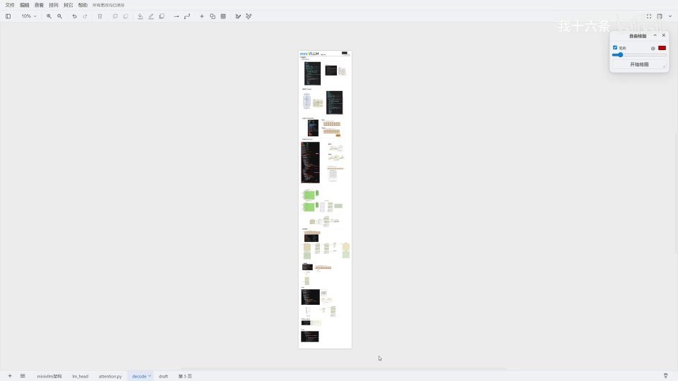 |
| 课件，我基本上要做的话得花两天：可能花一天把代码完整梳理一遍，再花一天把课件做出来，因为课件涉及的内容挺多，每个元素都非常多，我也想尽可能讲到细节，所以工作量很大，之后还要录制和剪辑。 [【跳转到 00:50】](https://www.bilibili.com/video/BV14a5r6YEhY/?t=50) | 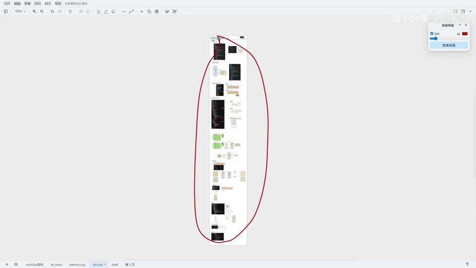 |
| 录制过程中其实也会有非常多幺蛾子，比如有时候录不上，或者我经常说错、还有口头禅，其实我都会剪掉。你们看到的视频其实是我已经优化过的，我自己也看过很多遍，会把口癖尽量剪掉，避免影响观感。所以说到这儿，也是想让大家看到我的视频 [【跳转到 01:15】](https://www.bilibili.com/video/BV14a5r6YEhY/?t=75) | 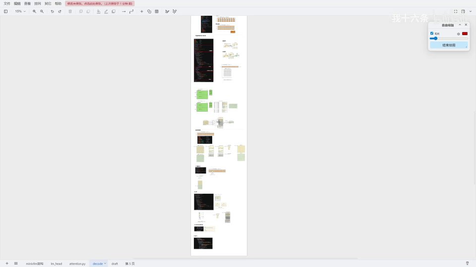 |
| 如果确实有帮助，动动小手点个赞、点个收藏、加个关注，谢谢大家。确实也是因为有大家的支持我才能不断更新下去；如果做这个系列都没什么人看，我想我也不会坚持很久，因为做这个东西确实耽误太多时间、工作量也非常大。谢谢大家，我们接下来进入正题吧。 [【跳转到 01:40】](https://www.bilibili.com/video/BV14a5r6YEhY/?t=100) | 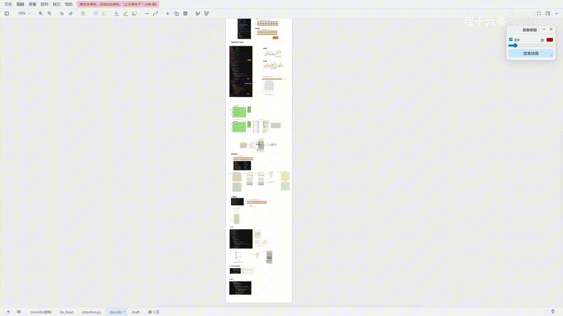 |
| 说得有点多了。Hello 大家好，今天给大家更新 MiniVLLM 的 attention 的 decode 部分， [【跳转到 02:05】](https://www.bilibili.com/video/BV14a5r6YEhY/?t=125) |  |
| 也就是这一块。 [【跳转到 02:10】](https://www.bilibili.com/video/BV14a5r6YEhY/?t=130) | 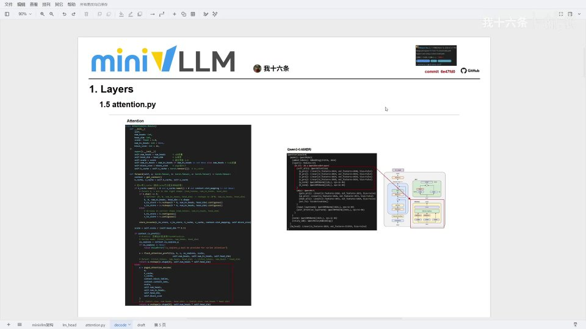 |
| 上一节讲的是 prefill 阶段，今天讲 decode。需要注意一点， [【跳转到 02:15】](https://www.bilibili.com/video/BV14a5r6YEhY/?t=135) | 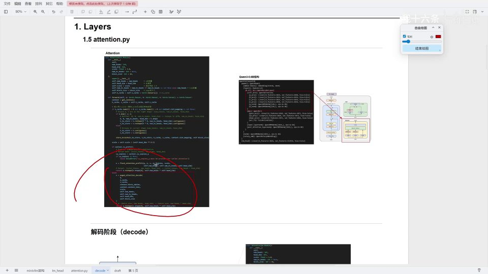 |
| 目前版本发生了一些变化，我这边同步了最新的提交，但其实无所谓， [【跳转到 02:22】](https://www.bilibili.com/video/BV14a5r6YEhY/?t=142) | 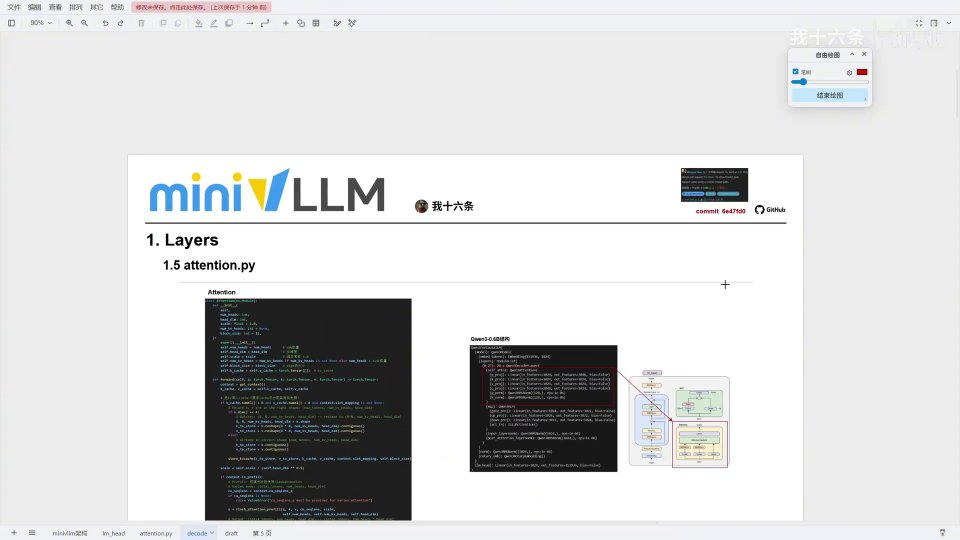 |
| 因为今天主要讲 PagedAttention，也就是 decode 这一部分， [【跳转到 02:30】](https://www.bilibili.com/video/BV14a5r6YEhY/?t=150) | 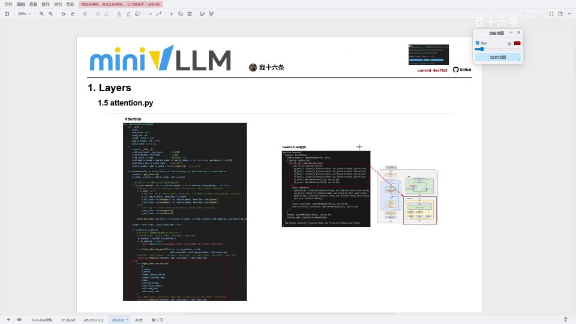 |
| 实际上没有太大的代码变更，主要逻辑没有变化。 [【跳转到 02:35】](https://www.bilibili.com/video/BV14a5r6YEhY/?t=155) | 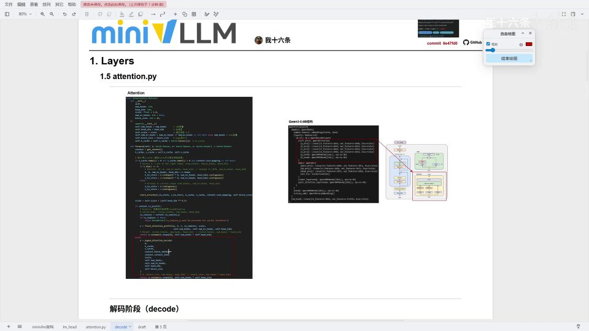 |
| OK，还是老样子，先从模型结构讲起。 [【跳转到 02:40】](https://www.bilibili.com/video/BV14a5r6YEhY/?t=160) | 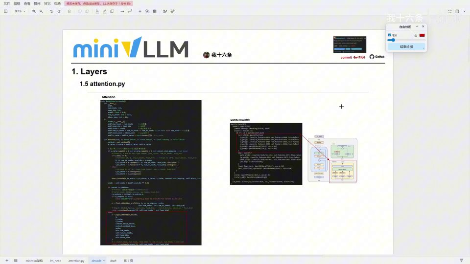 |
| decode 阶段其实对应 Qwen3-0.6B [【跳转到 02:45】](https://www.bilibili.com/video/BV14a5r6YEhY/?t=165) | 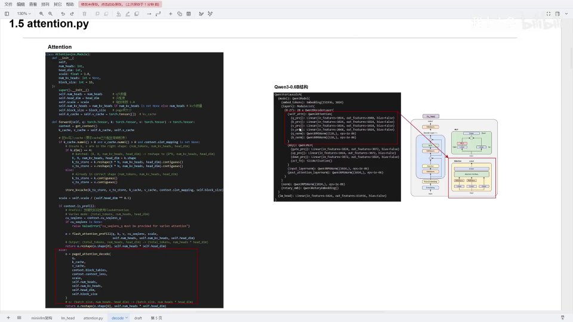 |
| 的 attention 这一部分。解码阶段 [【跳转到 02:50】](https://www.bilibili.com/video/BV14a5r6YEhY/?t=170) | 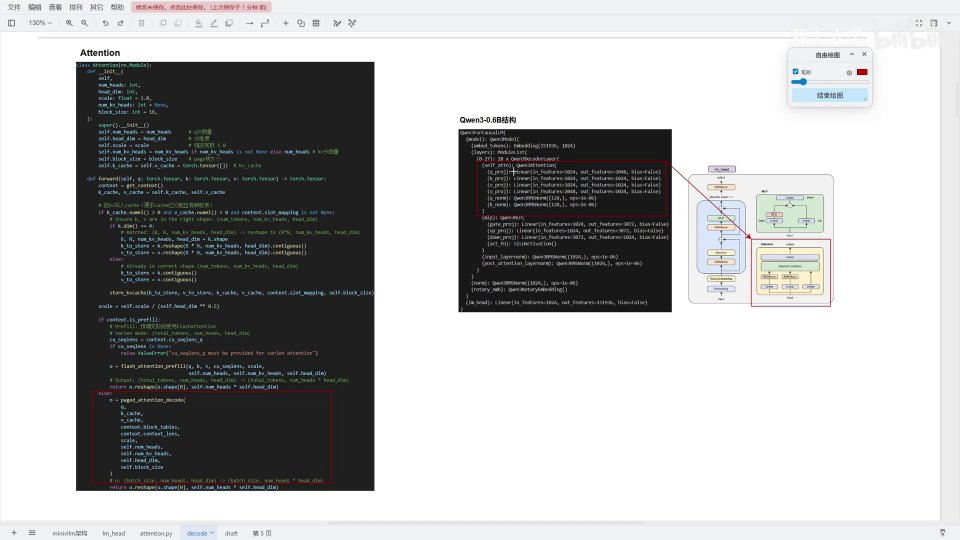 |
| 我们有多个 decoder layer 重叠排起来， [【跳转到 02:55】](https://www.bilibili.com/video/BV14a5r6YEhY/?t=175) | 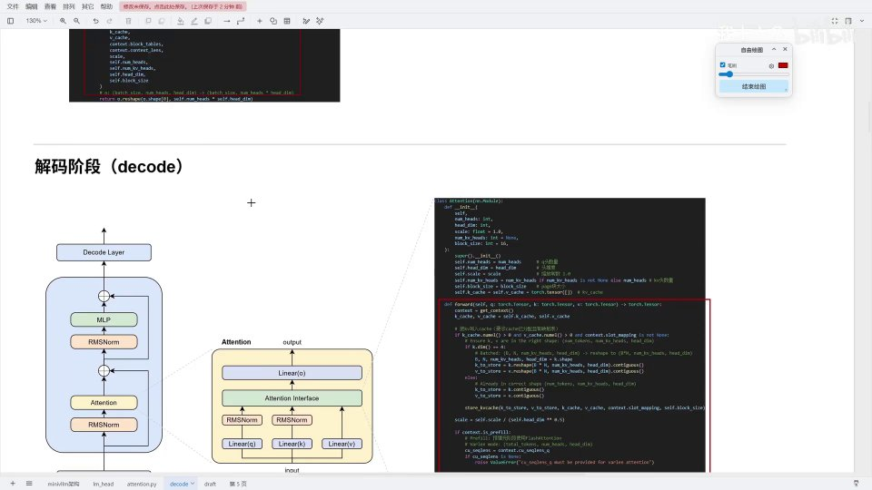 |
| 在 Qwen3-0.6B 里一共有 28 层，也就是 28 个 decoder layer 不断堆叠。每个 decoder layer 里都有一个 attention 层，attention 层里就有这个 attention interface，这一块刚好对应我们代码文件里的这一块， [【跳转到 03:00】](https://www.bilibili.com/video/BV14a5r6YEhY/?t=180) | 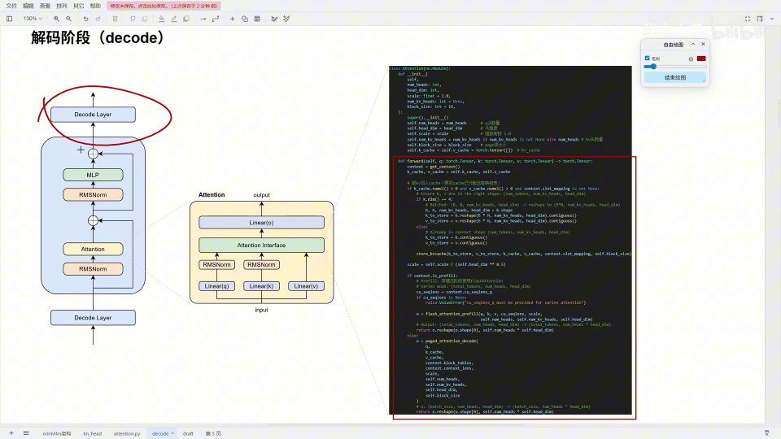 |
| 也就是 attention 前向传播的部分。比如这些就是我们的输入， [【跳转到 03:22】](https://www.bilibili.com/video/BV14a5r6YEhY/?t=202) | 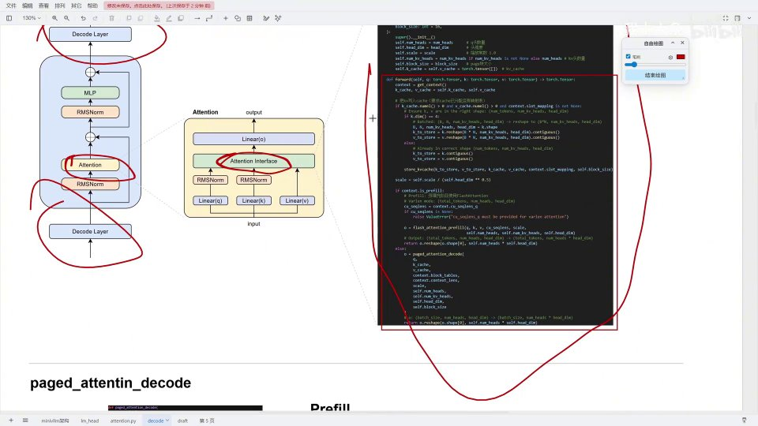 |
| 输入进来后经过 Q、K、V 三个线性变换，再输入这个前向传播。这个 interface 指的就是这一块前向传播的内容。我们今天主要讲前向传播中的这一块， [【跳转到 03:27】](https://www.bilibili.com/video/BV14a5r6YEhY/?t=207) | 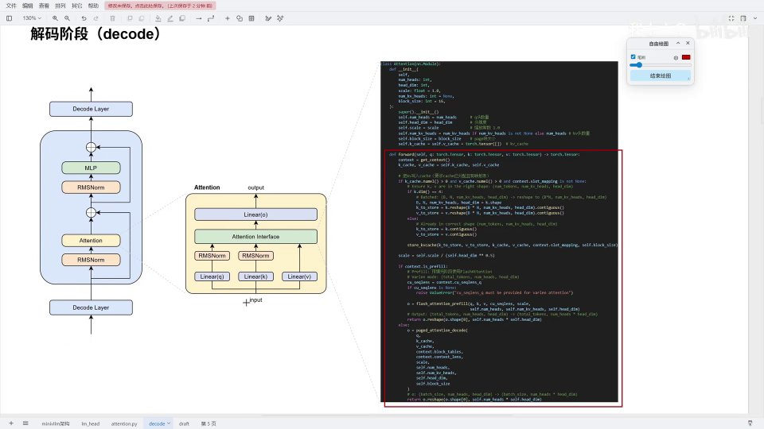 |
| 包括 PagedAttention decode。OK，我们一步一步来看。 [【跳转到 03:39】](https://www.bilibili.com/video/BV14a5r6YEhY/?t=219) | 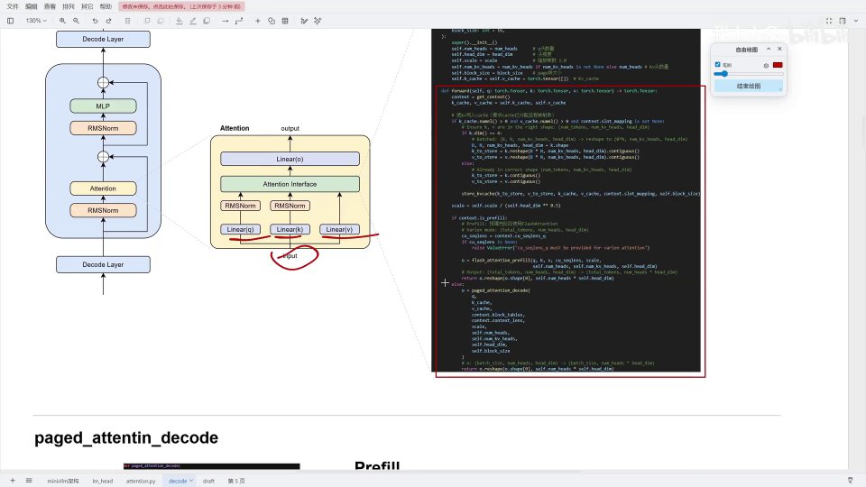 |
| 先看这个配置和 `paged_attention_decode` 这个函数。 [【跳转到 03:45】](https://www.bilibili.com/video/BV14a5r6YEhY/?t=225) | 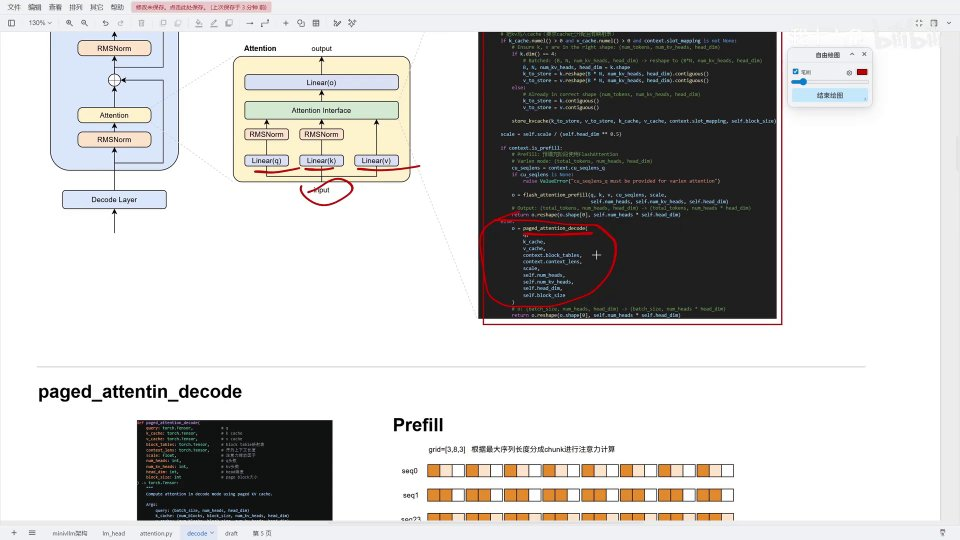 |
| 这个函数其实没有太多可讲的，很简单。 [【跳转到 03:50】](https://www.bilibili.com/video/BV14a5r6YEhY/?t=230) | 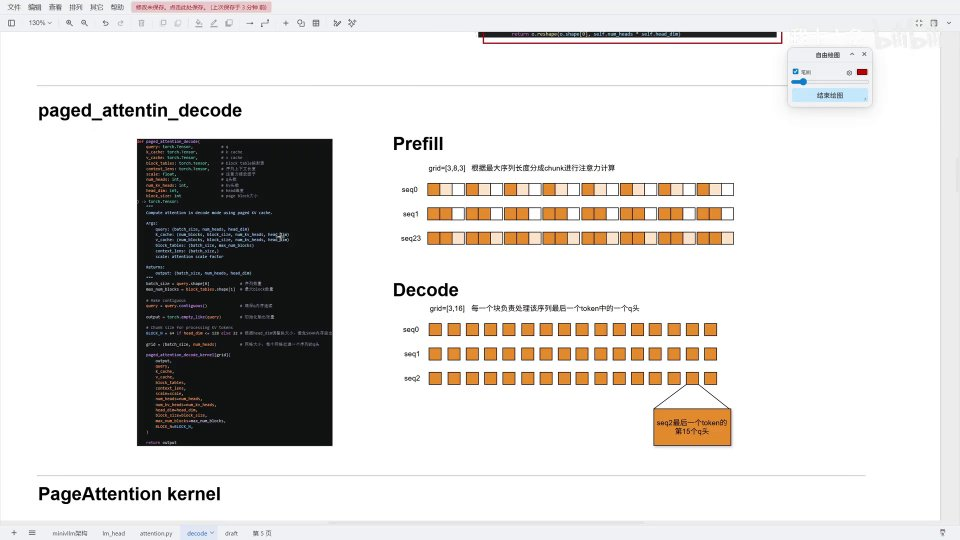 |
| 我们还是一步步看。首先之前讲 prefill 的时候，grid 是 [【跳转到 03:55】](https://www.bilibili.com/video/BV14a5r6YEhY/?t=235) | 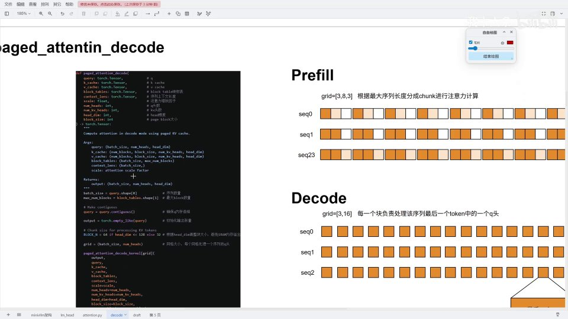 |
| (3, 8, 3)，实际上是三个序列。 [【跳转到 04:00】](https://www.bilibili.com/video/BV14a5r6YEhY/?t=240) | 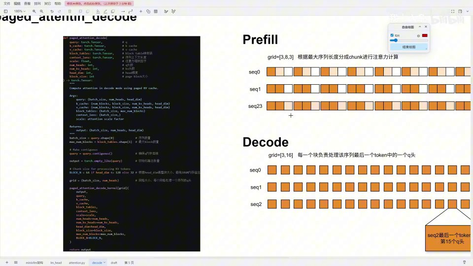 |
| 之前讲 prefill 时，grid 的逻辑：这个 3 代表最长序列能被 block_N 分成多少个块，8 代表 8 个头，3 代表三个序列。这个 prefill 主要是和 decode 做对比。我们来看 decode 的 grid。 [【跳转到 04:06】](https://www.bilibili.com/video/BV14a5r6YEhY/?t=246) | 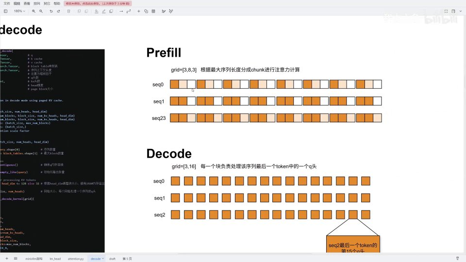 |
| （先不急着讲代码。） [【跳转到 04:29】](https://www.bilibili.com/video/BV14a5r6YEhY/?t=269) | 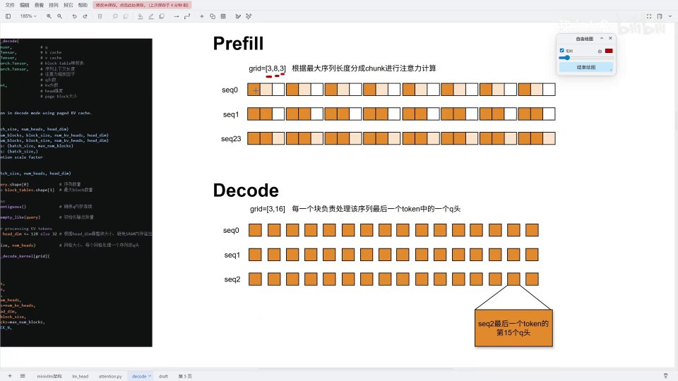 |
| 先讲一下 decode 的网格任务是怎么划分的。 [【跳转到 04:34】](https://www.bilibili.com/video/BV14a5r6YEhY/?t=274) | 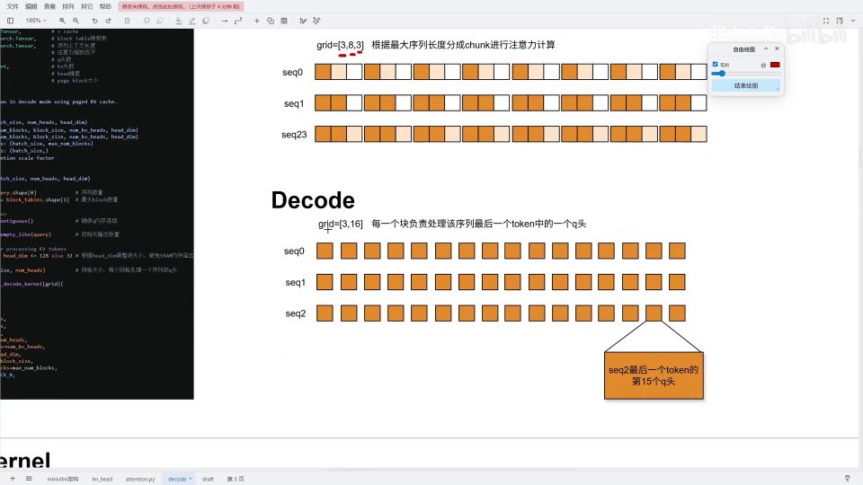 |
| 这个 grid： [【跳转到 04:39】](https://www.bilibili.com/video/BV14a5r6YEhY/?t=279) | 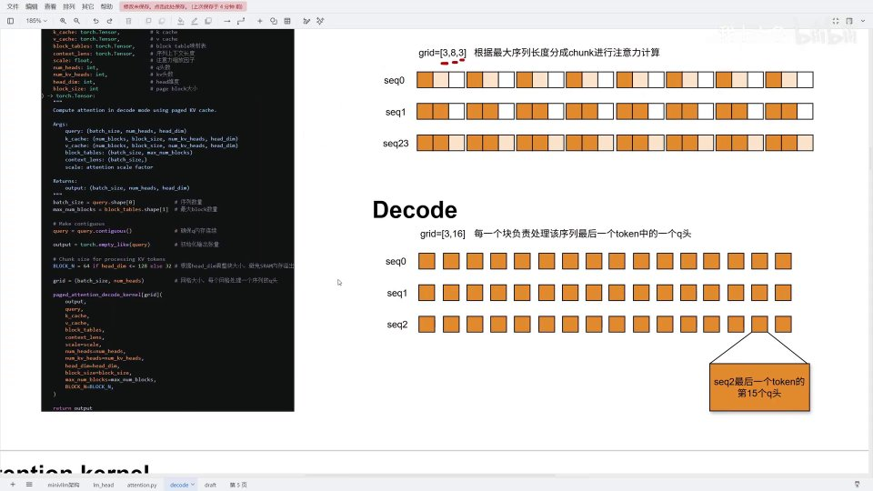 |
| grid 的三个维度代表三个序列，16 是 16 个头。也就是划分网格时这样安排任务：每个序列的每个 Q 都有 16 个头——Qwen3 里 Q 头数量设为 16、KV 头数量设为 8，这就是 GQA。老是提到 GQA，非常重要， [【跳转到 04:44】](https://www.bilibili.com/video/BV14a5r6YEhY/?t=284) | 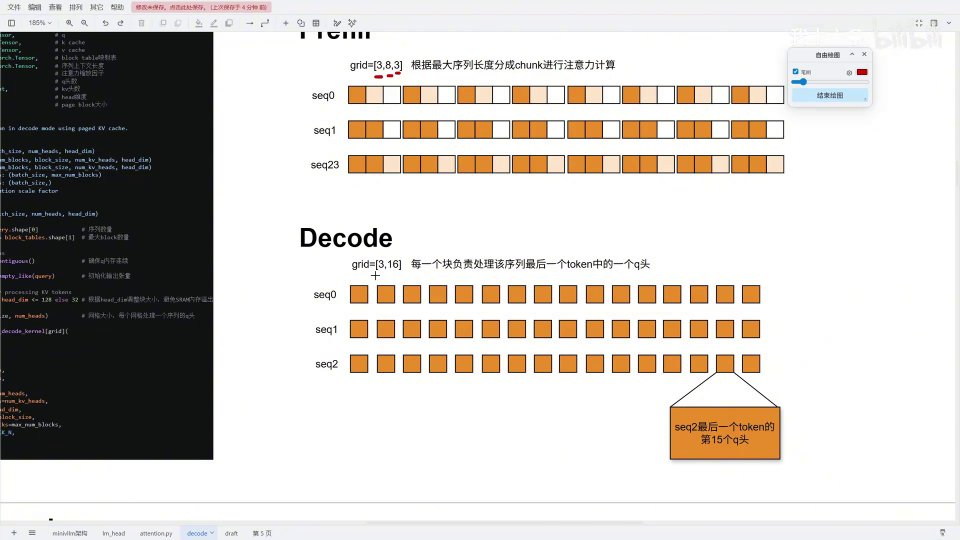 |
| 不明白的话可以回头去看我做的关于 GQA 的视频。OK，我们来讲 PagedAttention decode。 [【跳转到 05:09】](https://www.bilibili.com/video/BV14a5r6YEhY/?t=309) | 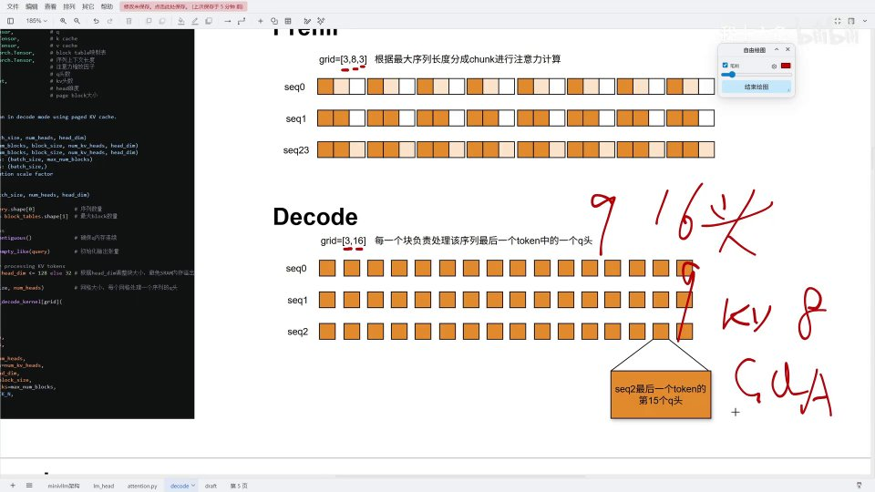 |
| 这个函数主要在干参数初始化，告诉我们怎么划分网格；得到网格后，再把 `paged_attention_decode` 这个 kernel 分配下去，每个网格块里执行一个 kernel 函数。我们一步步看。这里 `batch_size` 就是序列数量， [【跳转到 05:20】](https://www.bilibili.com/video/BV14a5r6YEhY/?t=320) | 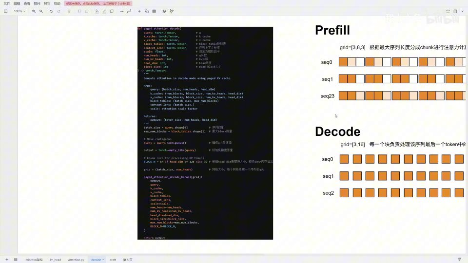 |
| 比如传三个序列进来，`batch_size` 就等于 3。然后 `max_num_blocks` 是我们 block_table 的最大 block 数量，后面会讲，结合其他案例会更清楚。这里确保 Q 的内存连续，用 contiguous 保证 Q 连续。 [【跳转到 05:45】](https://www.bilibili.com/video/BV14a5r6YEhY/?t=345) |  |
| 然后初始化一个 output，最后 kernel 的输出就写到这里。 [【跳转到 06:10】](https://www.bilibili.com/video/BV14a5r6YEhY/?t=370) |  |
| 然后这个 block_n 和 prefill 讲的一样， [【跳转到 06:15】](https://www.bilibili.com/video/BV14a5r6YEhY/?t=375) | 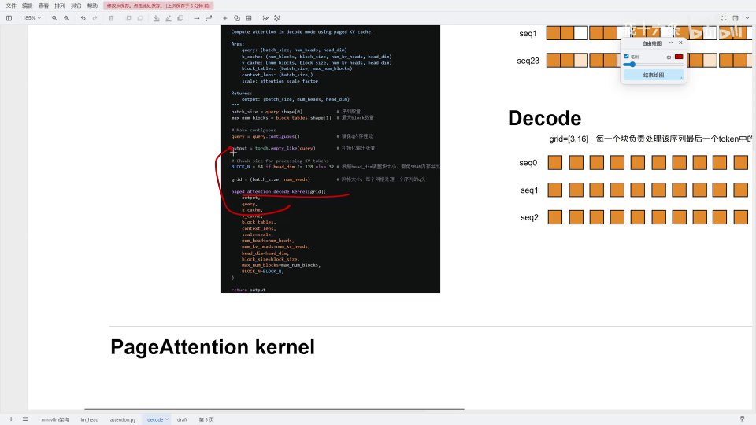 |
| 是为了避免内存溢出，根据头的维度、嵌入维度灵活调整我们输入到 SRAM 中每次要处理的 token 数量。然后是 grid， [【跳转到 06:22】](https://www.bilibili.com/video/BV14a5r6YEhY/?t=382) | 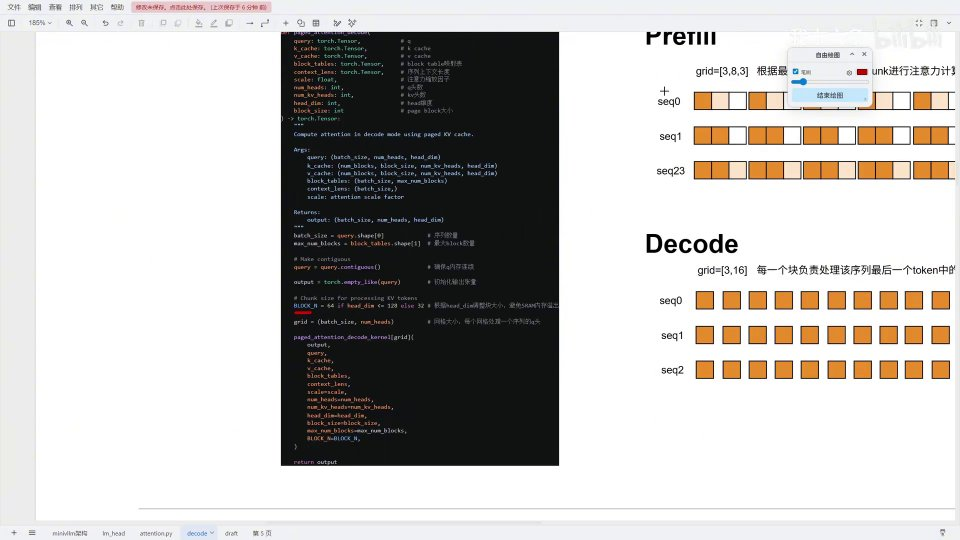 |
| `batch_size` 就是序列数量，`num_heads` 就是头的数量，刚好对应这里。 [【跳转到 06:38】](https://www.bilibili.com/video/BV14a5r6YEhY/?t=398) | 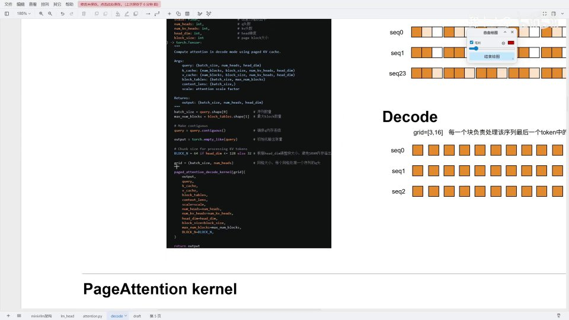 |
| 每个块比如这一块，实际上代表 sequence2 最后一个 token 的第 15 个头。这个函数就讲清楚了。 [【跳转到 06:46】](https://www.bilibili.com/video/BV14a5r6YEhY/?t=406) |  |
| 然后我们来看 kernel 函数，这也是最重头的地方。 [【跳转到 06:56】](https://www.bilibili.com/video/BV14a5r6YEhY/?t=416) | 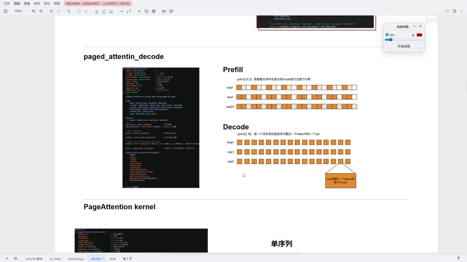 |
| 整个 kernel 函数很长， [【跳转到 07:01】](https://www.bilibili.com/video/BV14a5r6YEhY/?t=421) | 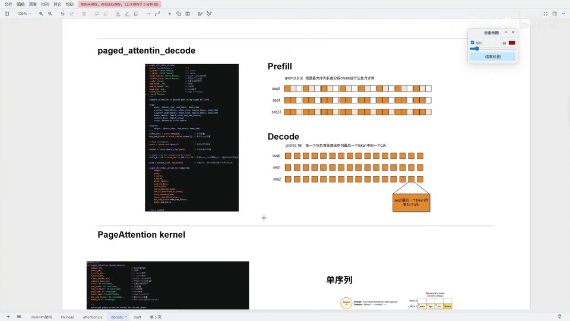 |
| 可能有一百来行代码。 [【跳转到 07:06】](https://www.bilibili.com/video/BV14a5r6YEhY/?t=426) | 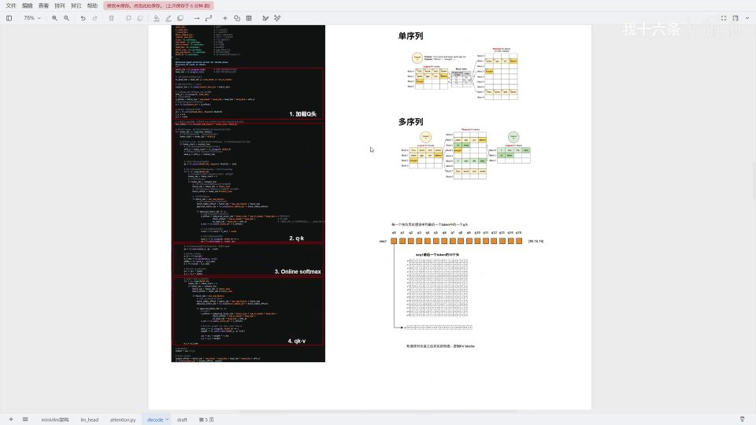 |
| 主要分成四个块、四个部分来看。第一部分是加载 Q 头：我们传入的 Q，对一个序列来说 [【跳转到 07:11】](https://www.bilibili.com/video/BV14a5r6YEhY/?t=431) | 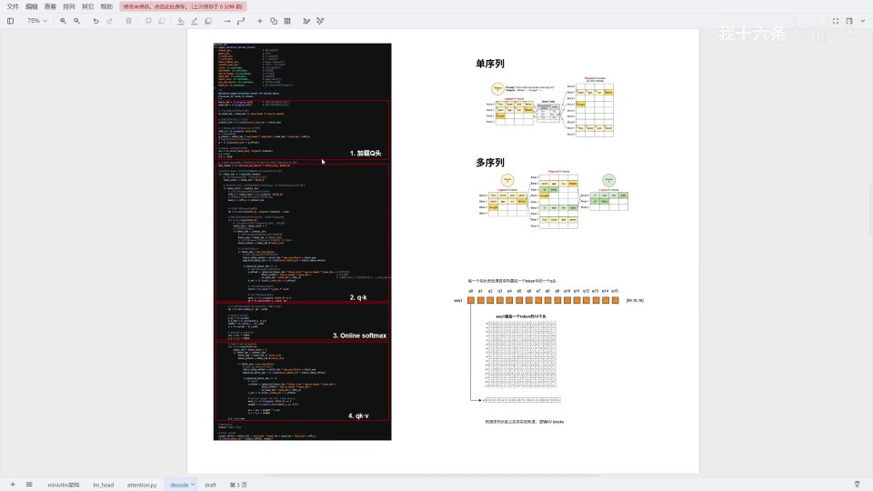 |
| 有 16 个 Q 头，每个 kernel 分配一个 Q 头，我们就需要加载这一个 Q 头然后计算， [【跳转到 07:24】](https://www.bilibili.com/video/BV14a5r6YEhY/?t=444) | 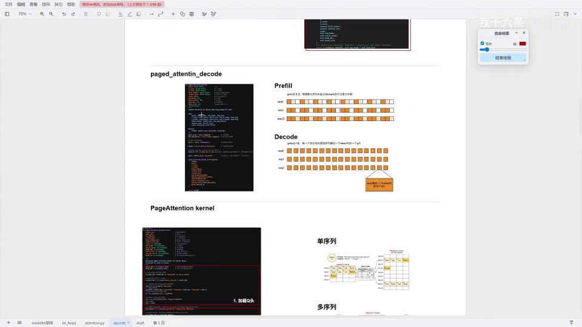 |
| 再针对这个 Q 头计算 QK、做 Online Softmax。这个也是在 SRAM 中做的（上一节讲过），所以这一节我不深入讲， [【跳转到 07:29】](https://www.bilibili.com/video/BV14a5r6YEhY/?t=449) | 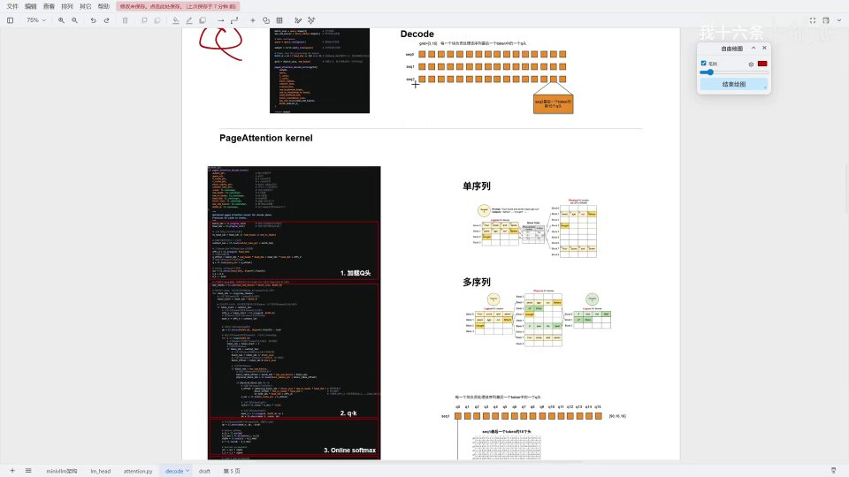 |
| 如果还不太清楚，可以去看我做的 FlashAttention 那一块， [【跳转到 07:36】](https://www.bilibili.com/video/BV14a5r6YEhY/?t=456) | 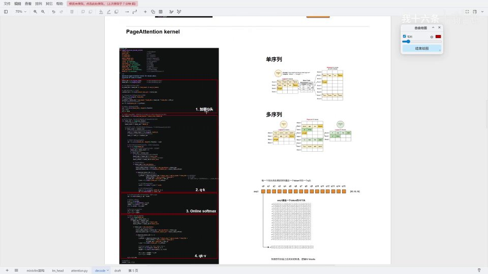 |
| 对 Online Softmax 有比较详细的讲解。最后用算出的 QK 乘以 V，然后 [【跳转到 08:01】](https://www.bilibili.com/video/BV14a5r6YEhY/?t=481) | 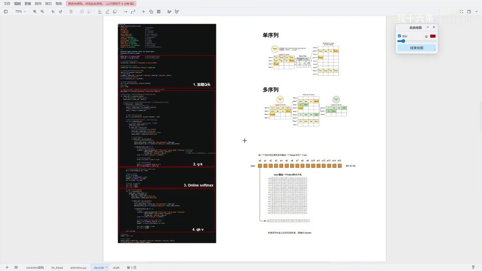 |
| 把计算得到的结果通过函数写回 output。 [【跳转到 08:17】](https://www.bilibili.com/video/BV14a5r6YEhY/?t=497) | 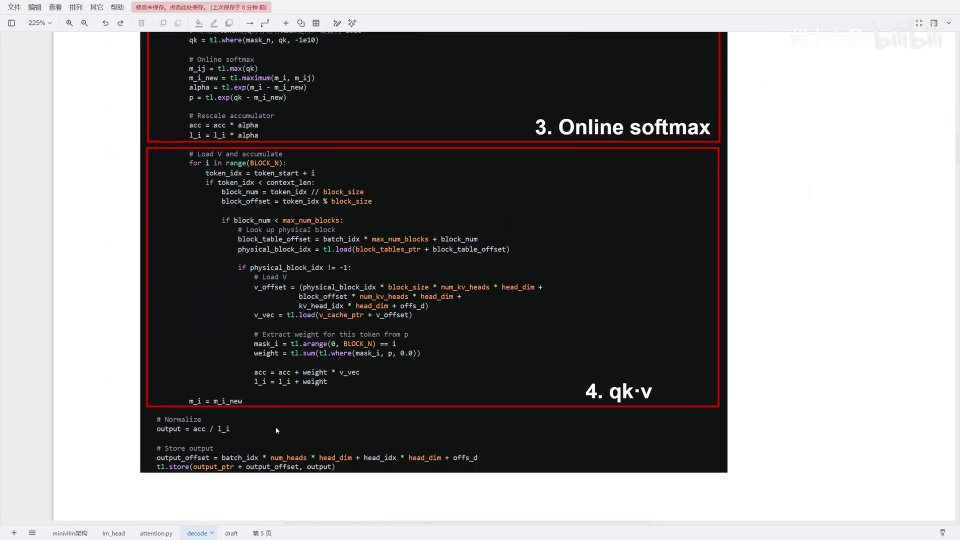 |
| OK，PagedAttention 中有一个非常重要的思想： [【跳转到 08:26】](https://www.bilibili.com/video/BV14a5r6YEhY/?t=506) |  |
| **分页（paging）**。它解决什么问题？解决 attention 计算过程中的内存碎片问题，本质上是解决存储瓶颈。原本 attention 计算的 block 如果不对它做管理，会有非常多的空间浪费：每个请求进来重新申请空间，又要回收，非常麻烦。 [【跳转到 08:31】](https://www.bilibili.com/video/BV14a5r6YEhY/?t=511) |  |
| PagedAttention 提出的思想是：把整个分配到 GPU 中的 KV cache 视作一个整体，在物理存储中它是一个整体；而我们在实际推理过程中会维护一个**逻辑的 KV**， [【跳转到 08:56】](https://www.bilibili.com/video/BV14a5r6YEhY/?t=536) |  |
| 通过一个 **block_table** 映射到物理中具体的哪一个 block。这样我们就不需要过多关心底层在内存中具体存储的位置。每次有新请求，比如推理过程中需要申请新的内存，它直接申请一个 block；当这个 block 不需要时，只需把 block_table 中的引用减少即可。 [【跳转到 09:21】](https://www.bilibili.com/video/BV14a5r6YEhY/?t=561) | 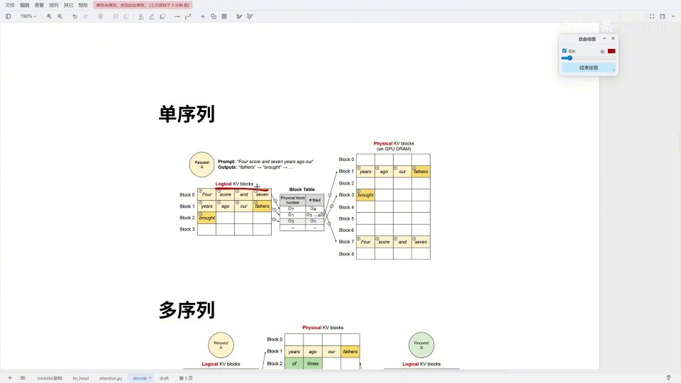 |
| 当这个 block_table 的引用为零时，就视为这个块已经没有引用了，随时可以被其他数据填充。单序列的情况我们先看，多序列无非是单序列的拓展。比如单个序列 [【跳转到 09:46】](https://www.bilibili.com/video/BV14a5r6YEhY/?t=586) | 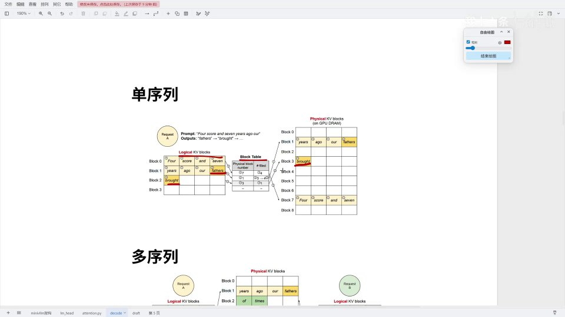 |
| output 就是一个推理过程，这边其实是一个预填充的部分。在这个过程中，比如在逻辑存储中，逻辑的 KV cache 在 block 上（比如 block0）是连续的，通过 block_table 把它映射到内存具体的存储，而具体存储不一定是连续的。这一点待会结合代码和例子看会更清楚。 [【跳转到 10:11】](https://www.bilibili.com/video/BV14a5r6YEhY/?t=611) | 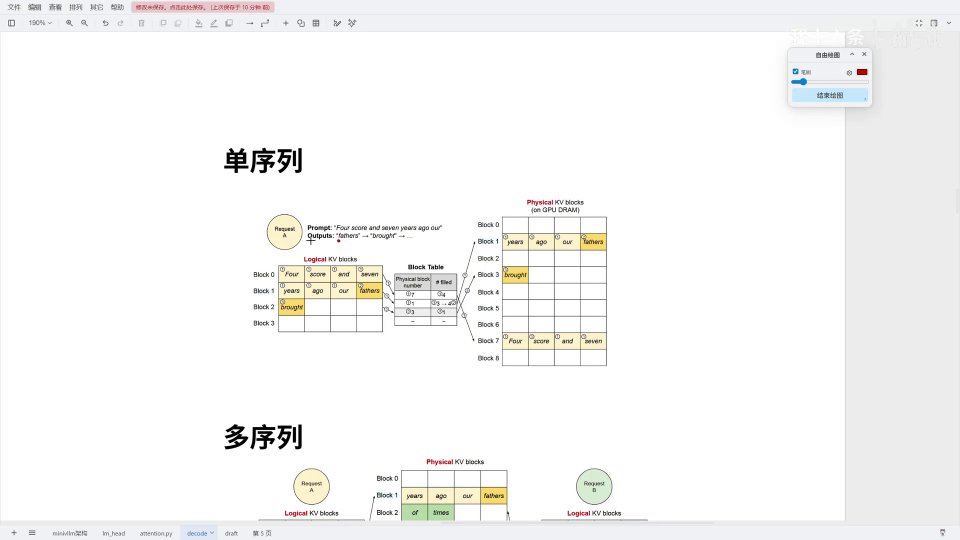 |
| 这就是多序列的情况：当有两个不同序列进行预填充或推理时，内存情况其实是混着的。反正以 block 为单位，同一个 block 里只会有一个序列，所以就屏蔽了对底层 block 的管理。这在并发情况下非常有用，并且可以极大提高显存利用率，这也是 PagedAttention 的核心创新点。 [【跳转到 10:36】](https://www.bilibili.com/video/BV14a5r6YEhY/?t=636) | 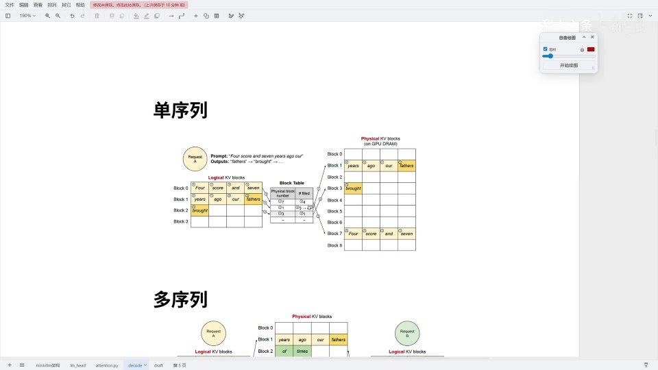 |
| OK，我们先来看一下。 [【跳转到 11:01】](https://www.bilibili.com/video/BV14a5r6YEhY/?t=661) | 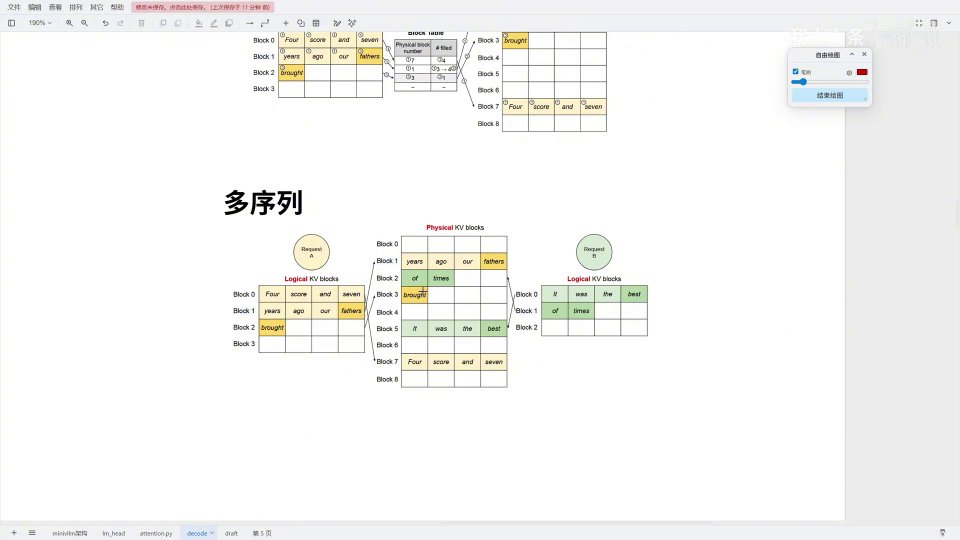 |
| 这个地方主要是一个推理过程。比如在 sequence1 中，Q0 这个地方处理的就是 Q0 这个头，一直到 Q15。想给大家说的是：每一个块具体在干什么——每一个块就是处理每一个 Q 头，从 Q0 到 Q15 共 16 个头，因为我们 Q 头是 16。 [【跳转到 11:06】](https://www.bilibili.com/video/BV14a5r6YEhY/?t=666) | 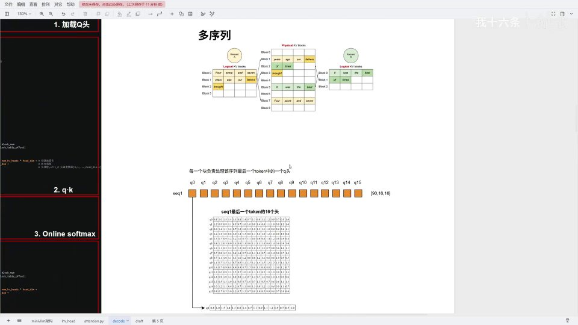 |
| 每个块负责处理一个 Q 头，比如 Q0 处理这一块，最后一个 SRAM 处理的就是 Q15。这句话是什么意思？就是我们在推理过程中，知道序列长度之后，就知道逻辑的 KV block，也就是逻辑表是什么样的。比如序列长度是 90， [【跳转到 11:31】](https://www.bilibili.com/video/BV14a5r6YEhY/?t=691) | 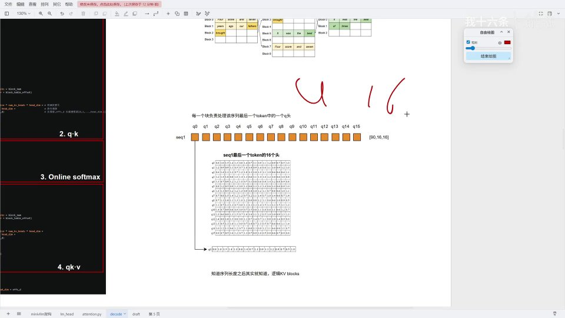 |
| 90 除以 block_size（分页大小），比如分页大小为 8，90÷8 向上取整就需要 12 个块来存这条序列，逻辑 block 就是知道的。不理解没关系，待会结合案例讲会更清楚。 [【跳转到 11:56】](https://www.bilibili.com/video/BV14a5r6YEhY/?t=716) | 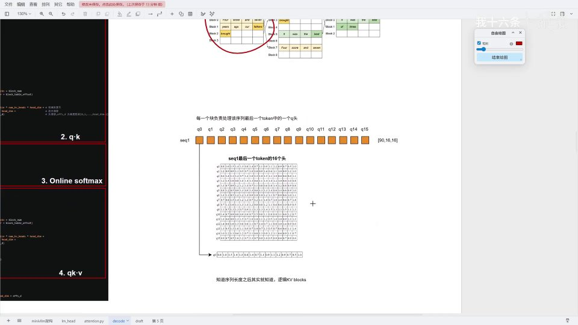 |
| 这边先……我们需要明确一个前提。 [【跳转到 12:21】](https://www.bilibili.com/video/BV14a5r6YEhY/?t=741) | 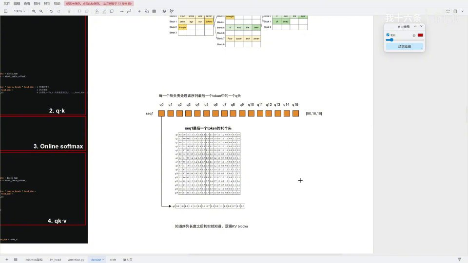 |
| 在之前的 prefill 阶段 [【跳转到 12:26】](https://www.bilibili.com/video/BV14a5r6YEhY/?t=746) |  |
| 我们讲过显存中 KV cache 大概是什么情况。我们现在重新举个例子： [【跳转到 12:31】](https://www.bilibili.com/video/BV14a5r6YEhY/?t=751) |  |
| 假设所有 KV cache 的 shape 是 `[2, 28, 2104, 8, 16]`——2104 个块，块大小为 8，KV cache 头是 8，每个嵌入维度是 16。对每一个 layer，里边的 KV cache，比如 layer0 里的这个 KV cache，实际上就是一个物理的 KV cache， [【跳转到 12:38】](https://www.bilibili.com/video/BV14a5r6YEhY/?t=758) |  |
| 从 0~2104，也就是物理内存中 layer0 存了 2104 个块。假设现在有两个序列：第一个序列从 T0 到 T51，也就是 51 个 token；第二个序列从 T0 到 T19， [【跳转到 13:03】](https://www.bilibili.com/video/BV14a5r6YEhY/?t=783) |  |
| 也就是 19 个 token。它们在实际物理存储中并没有按非常规律的线性方式存储——不是说 T0、T1、T2 一定在一起，B1 就存 T8~T15——实际物理存放的位置是乱的。反正哪里有位置就去申请，申请之后 [【跳转到 13:28】](https://www.bilibili.com/video/BV14a5r6YEhY/?t=808) |  |
| 通过一个映射表去做具体查找。每个 token 大概是一个 `[8, 16]` 的张量（8 个头，每个头 16 维）。我们来看一下 [【跳转到 13:53】](https://www.bilibili.com/video/BV14a5r6YEhY/?t=833) |  |
| 具体情况。比如现在有两个序列需要存放在物理 block 中：序列一长度 52 个 token，序列二长度 20 个 token，它们通过 block_table 找到自己在物理中存放的具体位置。随便看一个 token，比如 token46， [【跳转到 14:14】](https://www.bilibili.com/video/BV14a5r6YEhY/?t=854) |  |
| 它在逻辑上位于第五个块，通过 block_table 推过去，发现实际存储在第三个块，也就是这一行、物理中存放在第三个位置。所以所有逻辑 KV block 都需要一个 block_table [【跳转到 14:39】](https://www.bilibili.com/video/BV14a5r6YEhY/?t=879) |  |
| 做映射，再在实际物理 KV block 中找到它真实的位置。 [【跳转到 15:04】](https://www.bilibili.com/video/BV14a5r6YEhY/?t=904) |  |
| 好，我们来看一个具体案例，通过这个案例大家会对 decode 阶段 [【跳转到 15:13】](https://www.bilibili.com/video/BV14a5r6YEhY/?t=913) |  |
| 有非常清晰的了解。首先网格任务划分为 2×16， [【跳转到 15:18】](https://www.bilibili.com/video/BV14a5r6YEhY/?t=918) |  |
| 也就是两条序列、16 个头。每个序列负责处理该序列最后一个 token 中的一个 Q 头，这里是 Q0、Q1、Q2，一直到 Q15。这里是我们的 kernel 函数， [【跳转到 15:25】](https://www.bilibili.com/video/BV14a5r6YEhY/?t=925) |  |
| 我把所有变量都写出来了，包括所有指针和标量。先看标量：num_heads 是 16（Q 头数量），num_kv_heads 是 8，嵌入维度是 16，page_block、block_size 设为 8（比较小），然后 max_num_blocks 是在前面算出来的。怎么算？比如两个序列，第一个 52 个 token， [【跳转到 15:42】](https://www.bilibili.com/video/BV14a5r6YEhY/?t=942) |  |
| 第二个 20 个 token。为了能处理完最长的序列，有一个 max_num_blocks：52÷8=6.5，向上取整等于 7，就是当前的 max_num_blocks。 [【跳转到 16:07】](https://www.bilibili.com/video/BV14a5r6YEhY/?t=967) |  |
| 然后 block_n 设为 16，也就是每次从内存加载 16 个 token 到 SRAM。比如当前 Q 在 SRAM 中，每次读 16 个 KV 进来与 Q 做点积。再看指针： [【跳转到 16:32】](https://www.bilibili.com/video/BV14a5r6YEhY/?t=992) |  |
| 这个 output 指针就是这边， [【跳转到 16:57】](https://www.bilibili.com/video/BV14a5r6YEhY/?t=1017) |  |
| 最后计算完通过这个指针把结果写回 [【跳转到 17:02】](https://www.bilibili.com/video/BV14a5r6YEhY/?t=1022) |  |
| HBM。这是 Q 指针， [【跳转到 17:07】](https://www.bilibili.com/video/BV14a5r6YEhY/?t=1027) |  |
| 因为进入 kernel 之后， [【跳转到 17:12】](https://www.bilibili.com/video/BV14a5r6YEhY/?t=1032) |  |
| sequence0 和 sequence1 实际上是连续的， [【跳转到 17:17】](https://www.bilibili.com/video/BV14a5r6YEhY/?t=1037) |  |
| 通过 Q 指针找到每个 token、每个头对应的具体位置。 [【跳转到 17:22】](https://www.bilibili.com/video/BV14a5r6YEhY/?t=1042) |  |
| 这是 k_cache， [【跳转到 17:30】](https://www.bilibili.com/video/BV14a5r6YEhY/?t=1050) |  |
| 实际物理存储的方式；这是 v_cache；这是 block_table，因为现在有两个序列。 [【跳转到 17:36】](https://www.bilibili.com/video/BV14a5r6YEhY/?t=1056) |  |
| 这个 seq_lens 就是序列长度，也是传参传进来的。 [【跳转到 17:43】](https://www.bilibili.com/video/BV14a5r6YEhY/?t=1063) |  |
| 需要注意一点： [【跳转到 17:48】](https://www.bilibili.com/video/BV14a5r6YEhY/?t=1068) |  |
| 这个 k_block 和 v_block 实际上是以 layer 为单位的，每个 layer 都有这么一个 k_block 和 v_block。刚才讲了有 28 个 layer， [【跳转到 17:53】](https://www.bilibili.com/video/BV14a5r6YEhY/?t=1073) |  |
| 以 layer 为单位，每个 layer 都有这么一个 k_block 和 v_block。刚才不是讲了吗？ [【跳转到 17:58】](https://www.bilibili.com/video/BV14a5r6YEhY/?t=1078) |  |
| 也就是说这个地方有 28 个 layer，一共 28 个 layer。 [【跳转到 18:04】](https://www.bilibili.com/video/BV14a5r6YEhY/?t=1084) |  |
| 每个 layer 里都会维护一个 KV block。 [【跳转到 18:09】](https://www.bilibili.com/video/BV14a5r6YEhY/?t=1089) |  |
| 然后这个 block_table 详细讲一讲： [【跳转到 18:14】](https://www.bilibili.com/video/BV14a5r6YEhY/?t=1094) |  |
| 它就是我们逻辑上的 KV 对应的实际物理存储的 KV。 [【跳转到 18:19】](https://www.bilibili.com/video/BV14a5r6YEhY/?t=1099) |  |
| 这个表也是一样的。比如逻辑上序列一的第一个 block 存的是逻辑表的第一个位置，对应实际的 B0 位置，这个位置取出来的值就是实际物理对应的位置。比如序列二，随便看第二个、第三个块，映射表查出来的值是 9，也就是说它实际存储的 KV block 对应第 9 个 block。 [【跳转到 18:24】](https://www.bilibili.com/video/BV14a5r6YEhY/?t=1104) |  |
| 比如逻辑上序列一的第一个 block 存的是逻辑表的第一个位置，对应实际的 B0，这个位置取出来的值就是物理对应的位置。比如序列二，随便看它的第二个、第三个块，映射表查出来值是 9，也就是说它实际存储的 KV block 对应第 9 个 block。 [【跳转到 18:29】](https://www.bilibili.com/video/BV14a5r6YEhY/?t=1109) |  |
| 这样就可以通过一个逻辑关系、通过查表 block_table 取出真实存放的 KV 值。 [【跳转到 18:54】](https://www.bilibili.com/video/BV14a5r6YEhY/?t=1134) |  |
| OK，我们知道参数之后来看代码，一部分一部分看。第一步加载 Q 头。 [【跳转到 19:10】](https://www.bilibili.com/video/BV14a5r6YEhY/?t=1150) |  |
| 我们假设当前在这个块里完成任务，这个块实际上 [【跳转到 19:15】](https://www.bilibili.com/video/BV14a5r6YEhY/?t=1155) |  |
| 是序列……第二个序列（sequence1）中的第三个头，对第三个头的 Q 做注意力计算。进入 kernel， [【跳转到 19:20】](https://www.bilibili.com/video/BV14a5r6YEhY/?t=1160) |  |
| 第二个序列，也就是序列一中的第三个头，去对第三个头的 Q 做注意力计算。好， [【跳转到 19:25】](https://www.bilibili.com/video/BV14a5r6YEhY/?t=1165) |  |
| kernel 第一部分：先读出当前序列索引。当前在 sequence1 上，`batch_idx` 实际上就是 1（第二个序列，从 0 开始计数）。这个头我们在第四个头上，从 0、1、2、3 计算， [【跳转到 19:35】](https://www.bilibili.com/video/BV14a5r6YEhY/?t=1175) |  |
| 所以 `head_idx` 等于 3。然后计算当前 Q 头对应的 KV 索引，因为我们是 GQA：当前是第三个 Q 头，对应的 KV 头用这种方式算——16 个 Q 头 [【跳转到 20:00】](https://www.bilibili.com/video/BV14a5r6YEhY/?t=1200) |  |
| 除以 8 个 KV 头，每两个 Q 头共享一个 KV 头，16÷8=2。当前在第四个 Q 头上，用 `head_idx=3`、3÷2 等于 1，说明当前第四个 Q 头对应第二个 KV 头。 [【跳转到 20:25】](https://www.bilibili.com/video/BV14a5r6YEhY/?t=1225) |  |
| 接着加载当前序列的上下文长度。当前在 sequence1 上，我们需要知道它的逻辑—— [【跳转到 20:50】](https://www.bilibili.com/video/BV14a5r6YEhY/?t=1250) |  |
| 这里是加载一个序列的上下文长度，也就是当前序列的上下文长度。因为当前在 sequence1 上，需要知道它的逻辑—— [【跳转到 20:55】](https://www.bilibili.com/video/BV14a5r6YEhY/?t=1255) |  |
| 要知道逻辑 block， [【跳转到 21:08】](https://www.bilibili.com/video/BV14a5r6YEhY/?t=1268) |  |
| 就必须知道序列长度，这个序列长度是 20，所以要从 `seq_context_lens` 中读出这个 20。这一步代码 [【跳转到 21:13】](https://www.bilibili.com/video/BV14a5r6YEhY/?t=1273) |  |
| 中读出这个 20。这一步代码的这一步 [【跳转到 21:19】](https://www.bilibili.com/video/BV14a5r6YEhY/?t=1279) |  |
| 实际上就是在读出这个 20。怎么读？通过指针 [【跳转到 21:24】](https://www.bilibili.com/video/BV14a5r6YEhY/?t=1284) |  |
| 加上 `batch_idx`（刚才算出来是 1）——`context_lens` 指向第 0 个位置，加上 `batch_idx` 就指向第二个位置，取出来的值就是 20。现在我们有了 `context_len = 20`。 [【跳转到 21:29】](https://www.bilibili.com/video/BV14a5r6YEhY/?t=1289) |  |
| 然后这里用 offs_d 生成一个 0~15 的数组， [【跳转到 21:46】](https://www.bilibili.com/video/BV14a5r6YEhY/?t=1306) |  |
| 用来读取 Q，即具体读哪一个 Q。 [【跳转到 21:51】](https://www.bilibili.com/video/BV14a5r6YEhY/?t=1311) |  |
| 也是 16。这个 1×16×16 的意思是：告诉我们偏移，把第 0 个序列的所有头跳过去（每个头嵌入维度 16，共 16 个头），这个 1 代表第一个序列，也就是把第一个序列跳过去。然后再计算， [【跳转到 22:16】](https://www.bilibili.com/video/BV14a5r6YEhY/?t=1336) |  |
| 再通过 head_idx。因为我们 head_idx 读出来是 3， [【跳转到 22:21】](https://www.bilibili.com/video/BV14a5r6YEhY/?t=1341) |  |
| 3×16 就是块内索引，跳过 0、1、2， [【跳转到 22:35】](https://www.bilibili.com/video/BV14a5r6YEhY/?t=1355) |  |
| 直接取到 Q3。这个就是我们要拿去算注意力的那个 Q 值。然后 offs_d 就是刚才算出来的 0~15，对应指针到这个位置，做一个升维，取出每一个参数，也就是取出这 16 个嵌入维度。自此我们就把 Q 加载出来了。 [【跳转到 22:40】](https://www.bilibili.com/video/BV14a5r6YEhY/?t=1360) |  |
| 跳过 0、1、2，直接取到 Q3。这就是我们真正要拿去算注意力的那个 Q 值。这个 offs_d 就是刚才算出来的 0~15，对应指针到这个位置，做一个升维，取出每一个参数，也就是取出这 16 个嵌入维度。自此就把 Q 加载出来了。 [【跳转到 22:46】](https://www.bilibili.com/video/BV14a5r6YEhY/?t=1366) |  |
| 下面是 Online Softmax 的参数初始化， [【跳转到 23:09】](https://www.bilibili.com/video/BV14a5r6YEhY/?t=1389) |  |
| 这一块我不详细赘述了。 [【跳转到 23:14】](https://www.bilibili.com/video/BV14a5r6YEhY/?t=1394) |  |
| OK，我们现在分享代码的第二部分，也就是 Q 乘 K。 [【跳转到 23:19】](https://www.bilibili.com/video/BV14a5r6YEhY/?t=1399) |  |
| 这部分在原本代码块中其实是中间这一块。 [【跳转到 23:24】](https://www.bilibili.com/video/BV14a5r6YEhY/?t=1404) |  |
| 这一块的任务主要有两个： [【跳转到 23:29】](https://www.bilibili.com/video/BV14a5r6YEhY/?t=1409) |  |
| 第一，从 HBM 把 K 读出来， [【跳转到 23:34】](https://www.bilibili.com/video/BV14a5r6YEhY/?t=1414) |  |
| 读到 SRAM 中，然后用 Q 和 K 做点积。这里有一个问题： [【跳转到 23:39】](https://www.bilibili.com/video/BV14a5r6YEhY/?t=1419) |  |
| 前面设置了 block_n 参数， [【跳转到 23:49】](https://www.bilibili.com/video/BV14a5r6YEhY/?t=1429) |  |
| 它的作用就是限制我们每次从 HBM 读多少个 token 的 K 到 SRAM 中计算。我们来看代码，先把这里放大一点。 [【跳转到 23:54】](https://www.bilibili.com/video/BV14a5r6YEhY/?t=1434) |  |
| 首先计算一个 `max_trunk`（窗口数）。它根据之前算的 max_num_blocks 得到：max_num_blocks 代表最长序列用了多少个 block。例子里一个是 52 个 token、一个是 20 个 token， [【跳转到 24:11】](https://www.bilibili.com/video/BV14a5r6YEhY/?t=1451) |  |
| 最长 52，之前算出用了 7 个 block。 [【跳转到 24:16】](https://www.bilibili.com/video/BV14a5r6YEhY/?t=1456) |  |
| 7 个 block 乘以 8（block_size）= 56，再除以 block_n（16），向上取整。56÷16=3.5， [【跳转到 24:41】](https://www.bilibili.com/video/BV14a5r6YEhY/?t=1481) |  |
| 向上取整得到 4。 [【跳转到 24:56】](https://www.bilibili.com/video/BV14a5r6YEhY/?t=1496) |  |
| 意思是每个序列需要用 4 个窗口来遍历， [【跳转到 25:02】](https://www.bilibili.com/video/BV14a5r6YEhY/?t=1502) |  |
| 从窗口里读出 K，用 Q 对 K 做点积。这就是窗口的作用。 [【跳转到 25:07】](https://www.bilibili.com/video/BV14a5r6YEhY/?t=1507) |  |
| 继续往下看，这里遍历窗口。看这个例子： [【跳转到 25:15】](https://www.bilibili.com/video/BV14a5r6YEhY/?t=1515) |  |
| 这是 sequence1 的逻辑 KV block。 [【跳转到 25:20】](https://www.bilibili.com/video/BV14a5r6YEhY/?t=1520) |  |
| 逻辑 KV block 刚才说了，我们只需要知道序列长度就可以推算出来，实际内存中它并没有一个实体。比如序列长度是 20，直接对它划分就行：这是窗口 0、窗口 1，后面窗口 2 是空的，这是窗口 3。对 sequence1 来说，最长 20 个 token， [【跳转到 25:25】](https://www.bilibili.com/video/BV14a5r6YEhY/?t=1525) |  |
| 其实就可以推算出来。实际内存中它并没有一个实体，没有逻辑 KV block 的实体，因为我们只需要知道序列长度。比如序列长度是 20，直接对它划分就可以了：从这开始是窗口 0，这是窗口 1，后面这里是窗口 2（空的），然后窗口 3。对 sequence1 来说，最长就是 20 个 token， [【跳转到 25:30】](https://www.bilibili.com/video/BV14a5r6YEhY/?t=1530) |  |
| 它会遍历四次，但到窗口 2 就——只会遍历前两个窗口有实际计算，后面的窗口 2、窗口 3 虽然在逻辑上存在，但不会进行更深入的计算，每次 if 判断 [【跳转到 25:55】](https://www.bilibili.com/video/BV14a5r6YEhY/?t=1555) |  |
| 和遍历判断都会做越界处理，避免多余计算。首先第一步计算窗口 [【跳转到 26:13】](https://www.bilibili.com/video/BV14a5r6YEhY/?t=1573) |  |
| 第一个 token 的全局偏移。比如在窗口 0 中得到 T0 的开始位置，在窗口 1 中得到 T16。比如当前窗口 id 在窗口 0 上，0×block_n(16)=0，拿到的是 B0 块中第一个 token 的相对位置索引；在窗口 1 上就是 1×16=16， [【跳转到 26:18】](https://www.bilibili.com/video/BV14a5r6YEhY/?t=1578) |  |
| 第一个 token 的全局偏移。比如在窗口 0 中得到 T0 的开始位置，在窗口 1 中得到 T16。比如当前窗口 id 在窗口 0 上，0×block_n(16)=0，拿到的是 B0 块中第一个 token 的相对位置索引；在窗口 1 上就是 1×16=16。 [【跳转到 26:23】](https://www.bilibili.com/video/BV14a5r6YEhY/?t=1583) |  |
| 拿到 T16 在逻辑 KV block 中的相对位置。这里做了越界处理：比如窗口 1 中我们只有四个 token 可以取 K 值，所以判断 `token_start=16 < context_len`， [【跳转到 26:48】](https://www.bilibili.com/video/BV14a5r6YEhY/?t=1608) |  |
| 因为 context_len 是 20，所以有效；如果窗口 2，起始位置 `2×16=32` 大于 20， [【跳转到 27:13】](https://www.bilibili.com/video/BV14a5r6YEhY/?t=1633) |  |
| 就不会进入 if 判断，没有后续计算。继续看，这里是 offs_n，用 `token_start + tl.arange(0, block_n)`，即从 0 到 15 的数组， [【跳转到 27:38】](https://www.bilibili.com/video/BV14a5r6YEhY/?t=1658) |  |
| 加上 token_start 就得到窗口 0 中所有 token 的位置。比如窗口 0 中 offs_n 是 0~15， [【跳转到 28:03】](https://www.bilibili.com/video/BV14a5r6YEhY/?t=1683) |  |
| 窗口 1 中 offs_n 是 16~31。 [【跳转到 28:19】](https://www.bilibili.com/video/BV14a5r6YEhY/?t=1699) |  |
| 再看 mask_n， [【跳转到 28:25】](https://www.bilibili.com/video/BV14a5r6YEhY/?t=1705) |  |
| 做防越界处理，用 offs_n < context_len。 [【跳转到 28:30】](https://www.bilibili.com/video/BV14a5r6YEhY/?t=1710) |  |
| 在窗口 1 中就只有前四个为 1（长度为 16 的数组），窗口 0 中全为 1，窗口 1 中只有前四位为 1， [【跳转到 28:36】](https://www.bilibili.com/video/BV14a5r6YEhY/?t=1716) |  |
| 比如在窗口 1 中，mask_n 这里只有前四位为 1，它也是长度为 16 的数组；窗口 0 中全为 1 的向量，窗口 1 中只有前四位为 1。 [【跳转到 28:41】](https://www.bilibili.com/video/BV14a5r6YEhY/?t=1721) |  |
| 其余为零。接下来初始化 QK（长度为 16 的数组）， [【跳转到 28:56】](https://www.bilibili.com/video/BV14a5r6YEhY/?t=1736) |  |
| 也就是存放 16 个 token 的 [【跳转到 29:01】](https://www.bilibili.com/video/BV14a5r6YEhY/?t=1741) |  |
| QK，即 16 个注意力权重。 [【跳转到 29:06】](https://www.bilibili.com/video/BV14a5r6YEhY/?t=1746) |  |
| 然后开始遍历窗口中的所有 token。比如在窗口 0 中， [【跳转到 29:14】](https://www.bilibili.com/video/BV14a5r6YEhY/?t=1754) |  |
| Q 已经到了 SRAM 中，但 K 还没进来。窗口 0 中再做一次遍历，每次读出具体的 K 值，与 Q 做点积。 [【跳转到 29:19】](https://www.bilibili.com/video/BV14a5r6YEhY/?t=1759) |  |
| `for i in range(0, block_n)`，block_n 是 16，遍历 16 次，把 token 读出来。怎么读？现在 k_cache 已经拿到了指针，这一整块就是 k_cache 的逻辑 [【跳转到 29:37】](https://www.bilibili.com/video/BV14a5r6YEhY/?t=1777) |  |
| 它的长度是 16，for i in range(16) 遍历 16 次，刚好把 token 读出来。怎么读出这个 token？现在 k_cache 已经拿到了指针，这一整块就是 k_cache 的逻辑 [【跳转到 29:42】](https://www.bilibili.com/video/BV14a5r6YEhY/?t=1782) |  |
| block 分布。当前在 trunk0 中，想读出 T0 或接下来这些位置，已经有了 Q 和 K 的指针，就需要算每个 token 的相对位置。`token_idx = token_start + i`，即每次循环的当前位置， [【跳转到 30:07】](https://www.bilibili.com/video/BV14a5r6YEhY/?t=1807) |  |
| 比如窗口 0 中 i 循环到第 5 次，就是 token5，用 token_start 加上 i 把指针挪到 token4。这里做了防越界处理，只计算有效 token。 [【跳转到 30:32】](https://www.bilibili.com/video/BV14a5r6YEhY/?t=1832) |  |
| 这一块是干什么的？我们现在知道 token 的位置了，比如 T6，还要算出它的相对块，也就是它在 block_table 中的物理实际存储位置。已知 token6、block_size 是 8，token6 在窗口 0 的第 0 个 block，所以它指向 block_table 的第 0 个位置； [【跳转到 30:57】](https://www.bilibili.com/video/BV14a5r6YEhY/?t=1857) |  |
| 还要从 block_table 第 0 个位置读出真正物理块指向的位置。比如 block_table 第 0 个位置存放的是 10，那 10 就代表真实物理存放地址，即第 10 个 block。 [【跳转到 31:22】](https://www.bilibili.com/video/BV14a5r6YEhY/?t=1882) |  |
| 就是在 KV cache 中去找第 10 个块。好，我们来看。先计算 block_num、token_id， [【跳转到 31:47】](https://www.bilibili.com/video/BV14a5r6YEhY/?t=1907) |  |
| 比如 T6，token_id 是 6，6÷block_size(8) 算出来是 0，说明 block_num 是 0，代表它在逻辑表中存放的 block 是 0，对应 block_table 第 0 个位置。然后计算块内偏移：6 对 8 取余等于 6。然后又做越界处理， [【跳转到 32:12】](https://www.bilibili.com/video/BV14a5r6YEhY/?t=1932) |  |
| 防越界。这里查找当前 token 对应的物理块索引。根据例子，block_num 是 0、block_offset 是 6，在 block_table 中的位置是：`batch_idx × max_num_blocks + block_num`。序列一乘以 max_num_blocks(7) 加上 block_num(0) 等于 8。 [【跳转到 32:31】](https://www.bilibili.com/video/BV14a5r6YEhY/?t=1951) |  |
| 这个 8 是什么意思？相当于在 block_table 中走 8 步——起始指针指向第 0 个位置，走 8 步 0、1、2……8 [【跳转到 32:56】](https://www.bilibili.com/video/BV14a5r6YEhY/?t=1976) |  |
| 就指向这个位置。然后从物理表直接读出这个位置，即起始指针加上实际要走的位置，取出真正物理表的 block_id。 [【跳转到 33:21】](https://www.bilibili.com/video/BV14a5r6YEhY/?t=2001) |  |
| 对着实际的 block_table 来看， [【跳转到 33:43】](https://www.bilibili.com/video/BV14a5r6YEhY/?t=2023) |  |
| 它就是 block_table 指针。在内存中它虽然用矩阵表示，但实际是连续的。当前在 sequence1 上、S1、Q1，sequence1 实际块在 block_table 中对应的就是绿色这一部分。我们说的 T6， [【跳转到 33:48】](https://www.bilibili.com/video/BV14a5r6YEhY/?t=2028) |  |
| 它实际在逻辑表中存放的 [【跳转到 34:13】](https://www.bilibili.com/video/BV14a5r6YEhY/?t=2053) |  |
| T6 在 block0 上，对应的 block_table [【跳转到 34:19】](https://www.bilibili.com/video/BV14a5r6YEhY/?t=2059) |  |
| 也在 sequence1 的物理表 block0 位置。但因为这个 block_table 不只存放 sequence1， [【跳转到 34:24】](https://www.bilibili.com/video/BV14a5r6YEhY/?t=2064) |  |
| 还有 sequence0。 [【跳转到 34:42】](https://www.bilibili.com/video/BV14a5r6YEhY/?t=2082) |  |
| 这也是为什么每个 sequence 都用当前批次内最长序列的 block（比如 7）来存储，为了后面找位置方便——做了一个对齐。可以看到 sequence1 的 block_table 中 [【跳转到 34:47】](https://www.bilibili.com/video/BV14a5r6YEhY/?t=2087) |  |
| 后面这一部分是 1，代表它没存东西，只有前三个 block 存了 token。因为我们最长序列是 sequence0，有七个 block。来看 block_table 指针怎么取到这个 10：刚才算了当前 token 对应的物理块索引， [【跳转到 35:12】](https://www.bilibili.com/video/BV14a5r6YEhY/?t=2112) |  |
| 就是偏移了一整个序列之后取到的这个 10， [【跳转到 35:29】](https://www.bilibili.com/video/BV14a5r6YEhY/?t=2129) |  |
| 也就是 sequence1 中的第 0 个位置。取到之后， [【跳转到 35:34】](https://www.bilibili.com/video/BV14a5r6YEhY/?t=2134) |  |
| 这个 physical block_id 就是 10。 [【跳转到 35:39】](https://www.bilibili.com/video/BV14a5r6YEhY/?t=2139) |  |
| 物理 KV cache 在内存中 [【跳转到 35:45】](https://www.bilibili.com/video/BV14a5r6YEhY/?t=2145) |  |
| 是这样存储的：把这一整块想象成一个内存空间，分成多个块。 [【跳转到 35:50】](https://www.bilibili.com/video/BV14a5r6YEhY/?t=2150) |  |
| B0 中存放第一个序列的第 0 到 T7，B10 就是我们取出来的 B10，指向物理 KV cache 的第 10 个位置，里边存了 T0 到 T7。 [【跳转到 35:55】](https://www.bilibili.com/video/BV14a5r6YEhY/?t=2155) |  |
| 所以相当于找到了这个 token 在物理块中的实际位置——属于第 10 个 block。现在就要从这个第 10 个 block 中取出这个 token 真正的 K 值。 [【跳转到 36:19】](https://www.bilibili.com/video/BV14a5r6YEhY/?t=2179) |  |
| 完整流程是：通过序列长度（token 长度）找到 token 对应的逻辑 block 位置，通过逻辑 block 索引去 block_table 中查它真正的物理 block 位置， [【跳转到 36:27】](https://www.bilibili.com/video/BV14a5r6YEhY/?t=2187) |  |
| 再通过物理 block 位置读出 K 值。现在已经拿到物理 block 位置是 10，也知道这个 token 在块内的索引（块内是第 7 个 token：1、2、3、4、5、6、7），找到第 10 个 block 后加上偏移 7， [【跳转到 36:52】](https://www.bilibili.com/video/BV14a5r6YEhY/?t=2212) |  |
| 就可以把 token6 的 K 值读出来。后面做的 [【跳转到 37:17】](https://www.bilibili.com/video/BV14a5r6YEhY/?t=2237) |  |
| 就是刚才说的操作。先做一个判断，这里 k_offset 是物理块索引， [【跳转到 37:25】](https://www.bilibili.com/video/BV14a5r6YEhY/?t=2245) |  |
| 因为我们拿到的是 k_cache 的指针，要找到 B0，首先要跳过前面这么多块的内存， [【跳转到 37:37】](https://www.bilibili.com/video/BV14a5r6YEhY/?t=2257) |  |
| 第一步就是用 physical block_id [【跳转到 37:42】](https://www.bilibili.com/video/BV14a5r6YEhY/?t=2262) |  |
| × block_size × 头数量 × 16， [【跳转到 37:47】](https://www.bilibili.com/video/BV14a5r6YEhY/?t=2267) |  |
| 这一步就是在跳过这一整块的地址， [【跳转到 37:55】](https://www.bilibili.com/video/BV14a5r6YEhY/?t=2275) |  |
| 再加上块内索引（刚才算出是 7），7×头数量×头维度，就是跳过这些 token，把指针指向 T6。最后是头偏移——在这个 token6 中具体取哪个头。 [【跳转到 38:00】](https://www.bilibili.com/video/BV14a5r6YEhY/?t=2280) |  |
| offs_d 就是嵌入维度 16，即在这个头里取出对应的第几个维度、把这个头的所有权重取出来。需要注意， [【跳转到 38:25】](https://www.bilibili.com/video/BV14a5r6YEhY/?t=2305) |  |
| 这个 token 在内存中的布局 [【跳转到 38:39】](https://www.bilibili.com/video/BV14a5r6YEhY/?t=2319) |  |
| ……我画个示意图。长度 16 就是嵌入维度，这里是头，比如 K 的 H0、H1。 [【跳转到 38:44】](https://www.bilibili.com/video/BV14a5r6YEhY/?t=2324) |  |
| 可以看我前面画的，比如这是一个 token， [【跳转到 38:58】](https://www.bilibili.com/video/BV14a5r6YEhY/?t=2338) |  |
| 这是它的头。实际 KV block 中只有 KV 头。刚才例子取到 T6，T6 展开就是有八个头（我应该写 K0 到 K7），每个头的维度是 16。 [【跳转到 39:03】](https://www.bilibili.com/video/BV14a5r6YEhY/?t=2343) |  |
| 比如刚才算过具体取哪个头：我们说第三个 Q 头，3÷2=1，对应第一个 KV 头，所以拿到的 KV head 取的是这一块。比如 T6 就从这一块开始算。 [【跳转到 39:28】](https://www.bilibili.com/video/BV14a5r6YEhY/?t=2368) |  |
| 好，我们现在看回来。 [【跳转到 39:53】](https://www.bilibili.com/video/BV14a5r6YEhY/?t=2393) |  |
| 继续。现在 `k_offset` 算完后， [【跳转到 40:01】](https://www.bilibili.com/video/BV14a5r6YEhY/?t=2401) |  |
| 就拿到了 token6 [【跳转到 40:06】](https://www.bilibili.com/video/BV14a5r6YEhY/?t=2406) |  |
| 真正要计算的那个头，从内存中把这个头取出来， [【跳转到 40:11】](https://www.bilibili.com/video/BV14a5r6YEhY/?t=2411) |  |
| 用 k_cache 指针加上 k_offset 偏移到 T6， [【跳转到 40:16】](https://www.bilibili.com/video/BV14a5r6YEhY/?t=2416) |  |
| 从 T6 中取出 K1 这个头。取出之后 [【跳转到 40:21】](https://www.bilibili.com/video/BV14a5r6YEhY/?t=2421) |  |
| 计算一个点积、乘以缩放，后面就是 softmax，不细讲，这里也做了 mask 处理。 [【跳转到 40:29】](https://www.bilibili.com/video/BV14a5r6YEhY/?t=2429) |  |
| 这里做了什么？计算完 QK 后，还需要把 QK 放到对应位置上。 [【跳转到 40:38】](https://www.bilibili.com/video/BV14a5r6YEhY/?t=2438) |  |
| 因为 Q 是固定的，但 K 是第几个 K——比如在窗口 0 中从 T0 遍历到 T15，在 T0 算完 QK0 时， [【跳转到 40:44】](https://www.bilibili.com/video/BV14a5r6YEhY/?t=2444) |  |
| Q 是固定的，但 K 是第几个 K——因为这里在遍历，在窗口 0 中， [【跳转到 40:49】](https://www.bilibili.com/video/BV14a5r6YEhY/?t=2449) |  |
| 从 T0 一直遍历到 T15，在 T0 算完 QK0 的时候， [【跳转到 40:54】](https://www.bilibili.com/video/BV14a5r6YEhY/?t=2454) |  |
| 要存放在对应位置，这里用了 mask_i， [【跳转到 40:59】](https://www.bilibili.com/video/BV14a5r6YEhY/?t=2459) |  |
| 它等于 `i` 对应位置为 1，比如 i=0（窗口 0 第 0 个位置）只有这里为 1、其余为零。通过这个 mask [【跳转到 41:04】](https://www.bilibili.com/video/BV14a5r6YEhY/?t=2464) |  |
| 把计算得到的 score 存到 QK 中对应 mask_i 为 1 的位置。比如在窗口 0 中 [【跳转到 41:13】](https://www.bilibili.com/video/BV14a5r6YEhY/?t=2473) |  |
| 只会在这个唯一位置存放下来，即把计算得到的 score 存到 QK 中 mask_i 为 1 的位置。比如在窗口 0 中， [【跳转到 41:18】](https://www.bilibili.com/video/BV14a5r6YEhY/?t=2478) |  |
| 只有这个位置为 1，窗口 0 算完的 score 就存到这里。 [【跳转到 41:31】](https://www.bilibili.com/video/BV14a5r6YEhY/?t=2491) |  |
| 再比如 T6，mask_i 只会在第七个位置为 1， [【跳转到 41:36】](https://www.bilibili.com/video/BV14a5r6YEhY/?t=2496) |  |
| 即 0、1、2、3、4、5、6、7， [【跳转到 41:41】](https://www.bilibili.com/video/BV14a5r6YEhY/?t=2501) |  |
| 算出的 Q×K（这里是 K6）就存到这里。QK 就计算完了。 [【跳转到 41:46】](https://www.bilibili.com/video/BV14a5r6YEhY/?t=2506) |  |
| 然后看下一部分，Online Softmax。 [【跳转到 42:00】](https://www.bilibili.com/video/BV14a5r6YEhY/?t=2520) |  |
| 这里就是 Online Softmax 的更新，因为可能有多个窗口（窗口 0、窗口 1）， [【跳转到 42:05】](https://www.bilibili.com/video/BV14a5r6YEhY/?t=2525) |  |
| 涉及 softmax。这里和前面讲 FlashAttention 时一样，不讲了， [【跳转到 42:10】](https://www.bilibili.com/video/BV14a5r6YEhY/?t=2530) |  |
| 再讲视频就太长了（虽然现在已经很长了）。我们来看 QK 乘 V，因为已经得到 QK， [【跳转到 42:21】](https://www.bilibili.com/video/BV14a5r6YEhY/?t=2541) |  |
| 还需要计算 V。V 值怎么算其实一样，因为现在有 v_cache， [【跳转到 42:26】](https://www.bilibili.com/video/BV14a5r6YEhY/?t=2546) |  |
| 传参时不仅传了 k_cache 还传了 v_cache，现在从 v_cache 读出 V，与 QK 做乘法、再做缩放。加载 V 的操作和加载 K 基本完全一致， [【跳转到 42:34】](https://www.bilibili.com/video/BV14a5r6YEhY/?t=2554) |  |
| 一样的计算， [【跳转到 42:55】](https://www.bilibili.com/video/BV14a5r6YEhY/?t=2575) |  |
| 和 K 完全一样，也是一个偏移，从 v_cache 加上 V 偏移读出 V 值，这里有 mask。算权重实际上就是：当前 V 对应的 QK 权重是多少，用 mask 从 P 中取出权重，再用权重乘以 V。 [【跳转到 43:00】](https://www.bilibili.com/video/BV14a5r6YEhY/?t=2580) |  |
| 实际上就是这个 QK——当前 V 对应的 QK，再加上 ACC。 [【跳转到 43:25】](https://www.bilibili.com/video/BV14a5r6YEhY/?t=2605) |  |
| 看代码最后一部分：做了一个归一化， [【跳转到 43:31】](https://www.bilibili.com/video/BV14a5r6YEhY/?t=2611) |  |
| 更新 softmax 维护的最大值，然后归一化，从 SRAM 写回 HBM，PagedAttention 的计算过程就结束了。 [【跳转到 43:36】](https://www.bilibili.com/video/BV14a5r6YEhY/?t=2616) |  |
| 这一期内容和 FlashAttention 有一些重叠，但我觉得最关键的还是那 [【跳转到 43:48】](https://www.bilibili.com/video/BV14a5r6YEhY/?t=2628) |  |
| 几张表的关系：一个是物理表，一个是逻辑表， [【跳转到 43:53】](https://www.bilibili.com/video/BV14a5r6YEhY/?t=2633) |  |
| 以及 block_table。把这三者关系理清楚之后，KV cache 就没什么大问题了。实际存放中，程序运行时其实只有物理表和 block_table 两个东西存在，逻辑 KV block 只是一个概念性的东西——我们只需要知道序列长度（比如 52），逻辑表就完全能推出来；而内存中维护的是 block_table，即序列在物理表中的实际位置。 [【跳转到 43:58】](https://www.bilibili.com/video/BV14a5r6YEhY/?t=2638) |  |
| 然后在物理 KV cache 中的实际位置。OK，今天的分享就到这里，感谢大家。 [【跳转到 44:23】](https://www.bilibili.com/video/BV14a5r6YEhY/?t=2663) |  |