# RoPE旋转嵌入 原始文稿（图-字幕分栏）

| 字幕文本 | 画面 |
| :--- | ---: |
| 好，OK。今天我们就讲一讲 RoPE，这也是算子的最后一个部分。今天讲完，算子部分就讲完了。我们来看一下这个旋转嵌入。 [【跳转到 00:00】](https://www.bilibili.com/video/BV1U6jN6MEet/?t=0) | 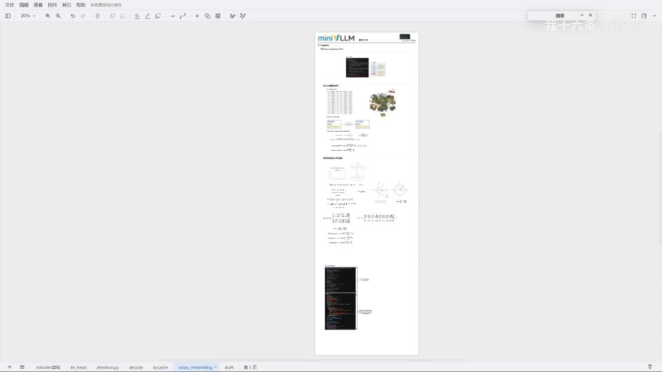 |
| 旋转嵌入具体是怎么做的？我们还是先看结构。 [【跳转到 00:13】](https://www.bilibili.com/video/BV1U6jN6MEet/?t=13) | 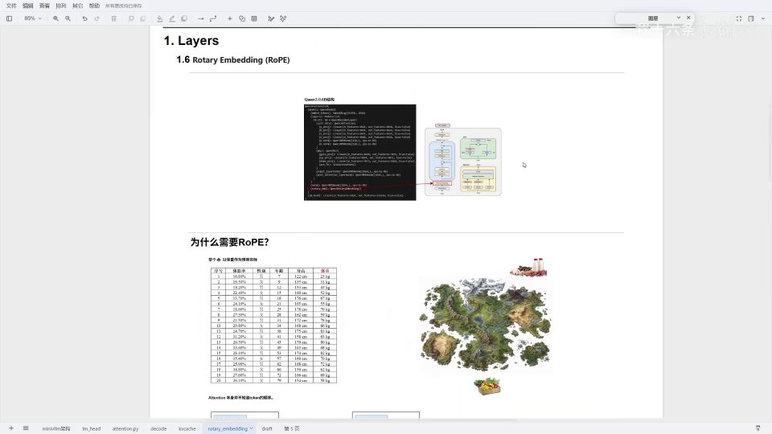 |
| 它在 embedding 之后去做，实际上看代码的话， [【跳转到 00:18】](https://www.bilibili.com/video/BV1U6jN6MEet/?t=18) | 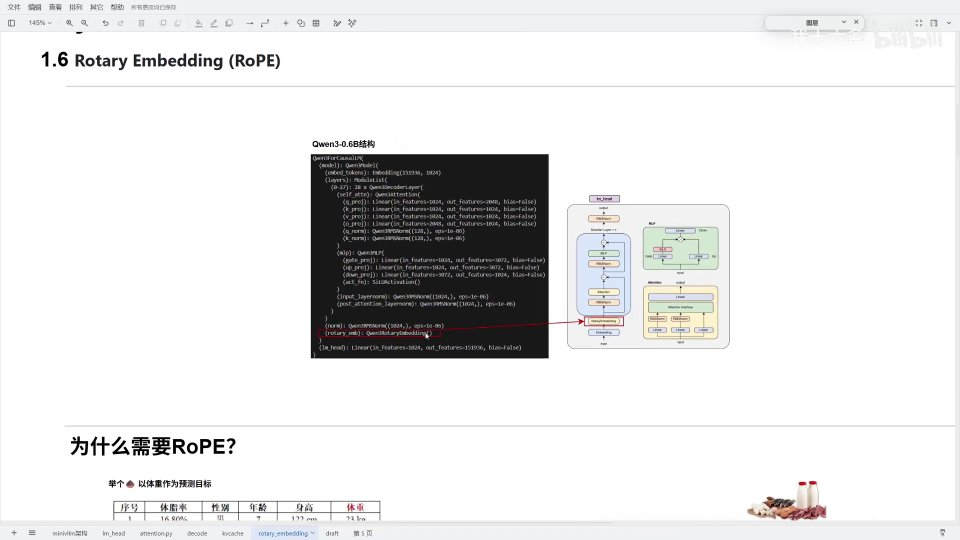 |
| 它发生在这个 attention 里边，也就是在做完 QKV 的线性变换之后，再去做旋转嵌入。OK，我们先来看第一个问题： [【跳转到 00:23】](https://www.bilibili.com/video/BV1U6jN6MEet/?t=23) |  |
| 我们为什么要做一个旋转嵌入？ [【跳转到 00:32】](https://www.bilibili.com/video/BV1U6jN6MEet/?t=32) | 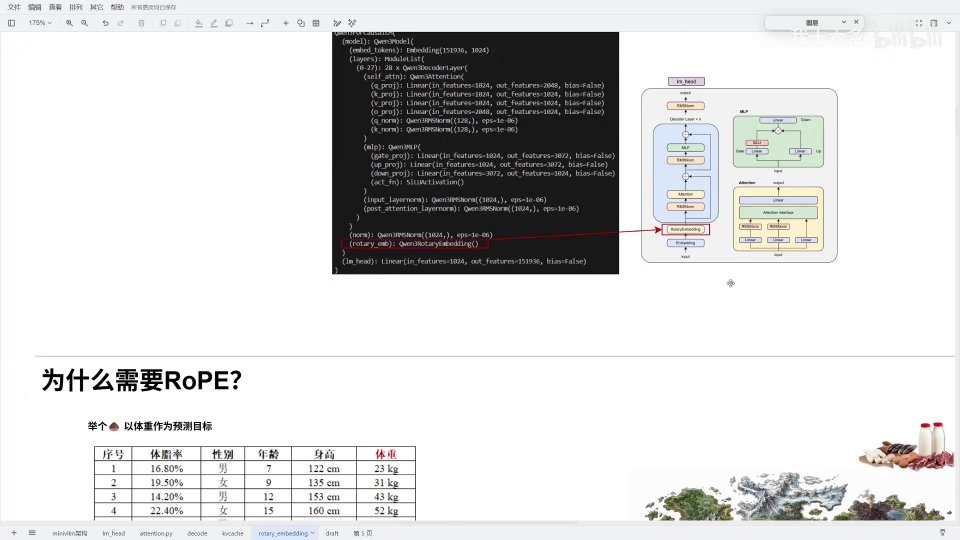 |
| 我想大部分同学应该都知道，但我还是举个例子。 [【跳转到 00:37】](https://www.bilibili.com/video/BV1U6jN6MEet/?t=37) | 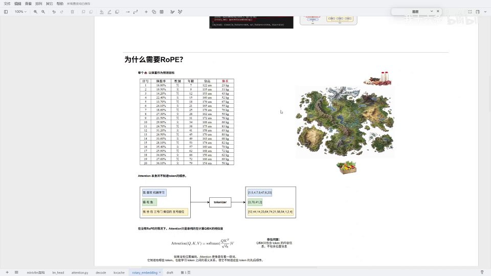 |
| 比如在 attention 计算过程中，我们想预测一个人的体重。假设体重是我们要预测的目标，特征是体脂率、性别、年龄、身高等等，这些特征具体决定体重。但有一个问题：体重不仅与这些有关， [【跳转到 00:44】](https://www.bilibili.com/video/BV1U6jN6MEet/?t=44) | 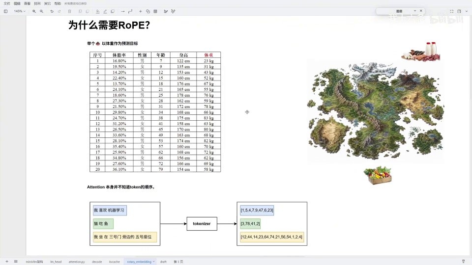 |
| 还和饮食结构有关。比如这是一张地图：北方的人可能吃肉蛋奶比较多， [【跳转到 01:09】](https://www.bilibili.com/video/BV1U6jN6MEet/?t=69) | 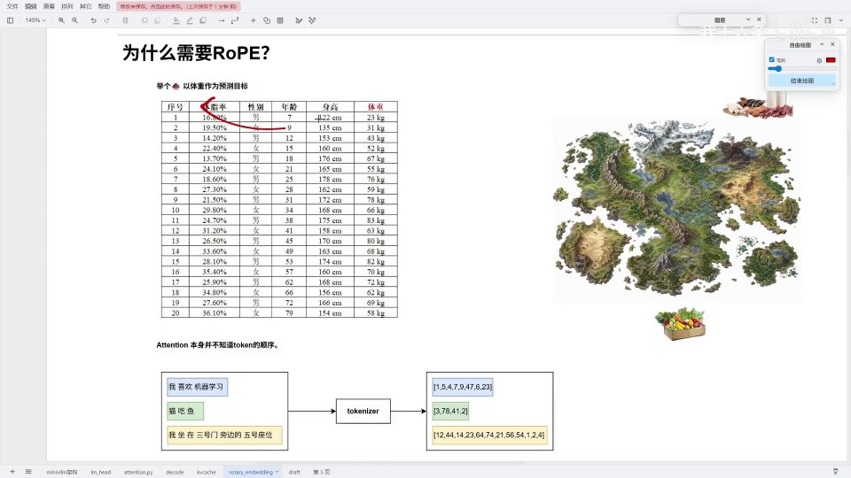 |
| 南方的人可能吃蔬菜比较多，因为南方森林茂盛、植物资源丰富；北方生存条件恶劣、蔬菜少，就通过打猎、放牧维持生计。所以存在一个南北差异。 [【跳转到 01:14】](https://www.bilibili.com/video/BV1U6jN6MEet/?t=74) | 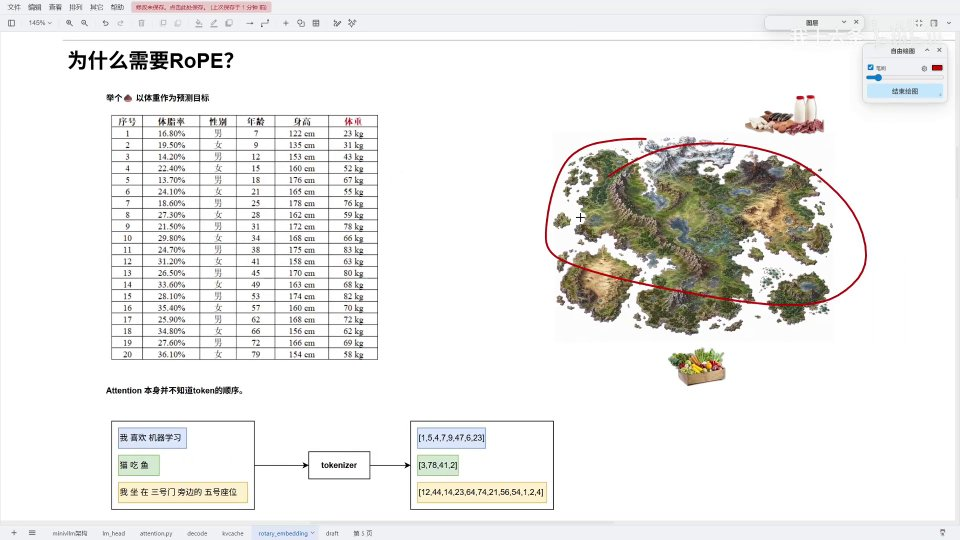 |
| 这个南北差异其实可以理解成位置上的区别。那我们如何在不增加特征量的情况下，把这种位置上的区别体现进去呢？旋转嵌入解决的就是这个问题。 [【跳转到 01:39】](https://www.bilibili.com/video/BV1U6jN6MEet/?t=99) |  |
| Attention 本身并不知道 token 的顺序。如果不加旋转嵌入，比如三个序列经过 tokenizer 生成 token，在没有 RoPE 的情况下，attention 只是单纯地计算 Q 和 K 的相似度， [【跳转到 01:57】](https://www.bilibili.com/video/BV1U6jN6MEet/?t=117) | 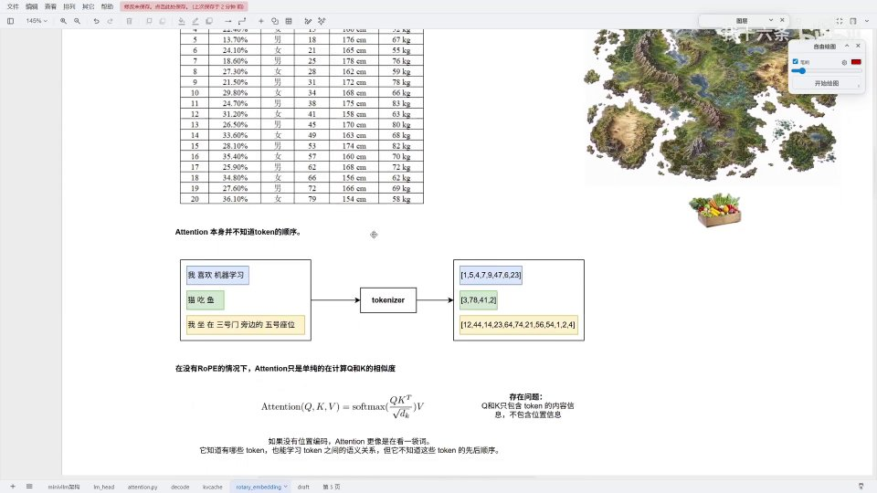 |
| 也就是这个公式——里面其实没有体现位置，只是一个单纯的点积。这样的公式存在什么问题？Q 和 K 只包含 token 的内容信息，不包含位置信息。比如「猫吃鱼」，我们知道的确实是内容信息；但如果位置调换，变成「鱼吃猫」，token 还是一样的，但词的位置不一样， [【跳转到 02:12】](https://www.bilibili.com/video/BV1U6jN6MEet/?t=132) | 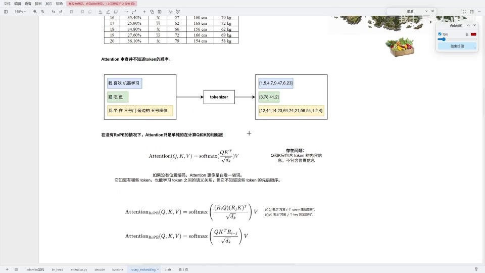 |
| 整个句子的意思就变了。所以为了把位置信息嵌入进去，就需要做一个旋转嵌入，这也是目前主流的解决位置信息的方法。加上旋转嵌入之后，attention 的公式就发生了一些变化：我们分别对 Q 和 K 做一个旋转，Ri 和 Rj 分别就是 [【跳转到 02:37】](https://www.bilibili.com/video/BV1U6jN6MEet/?t=157) | 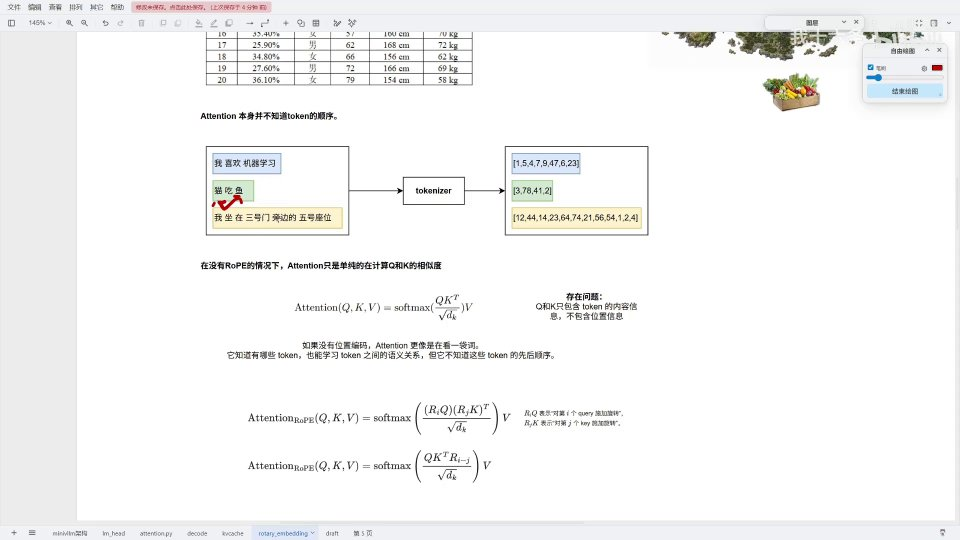 |
| 对应 Q 第 i 个位置的旋转矩阵、以及 K 第 j 个位置的旋转矩阵。接下来我们仔细看一下 RoPE 怎么做。在了解具体计算流程之前，先普及一个概念——**旋转矩阵**。比如这是一个单位圆， [【跳转到 03:02】](https://www.bilibili.com/video/BV1U6jN6MEet/?t=182) |  |
| 单位圆上的任意一点都可以用 cosθ 和 sinθ 来表示（我这里用 θ）。因为单位圆 R=1，所以前面没写 R；如果不是单位圆，就是下面这个公式，会有一个 R。根据这个公式可以推断，在一个圆上， [【跳转到 03:27】](https://www.bilibili.com/video/BV1U6jN6MEet/?t=207) |  |
| 比如有这样一个初始向量，我们想对它做一个逆时针旋转，旋转角度是 θ，初始角度是 φ。怎么旋转呢？初始的 X、Y 就是 R·cosφ、R·sinφ，旋转之后角度就是 θ+φ， [【跳转到 03:52】](https://www.bilibili.com/video/BV1U6jN6MEet/?t=232) | 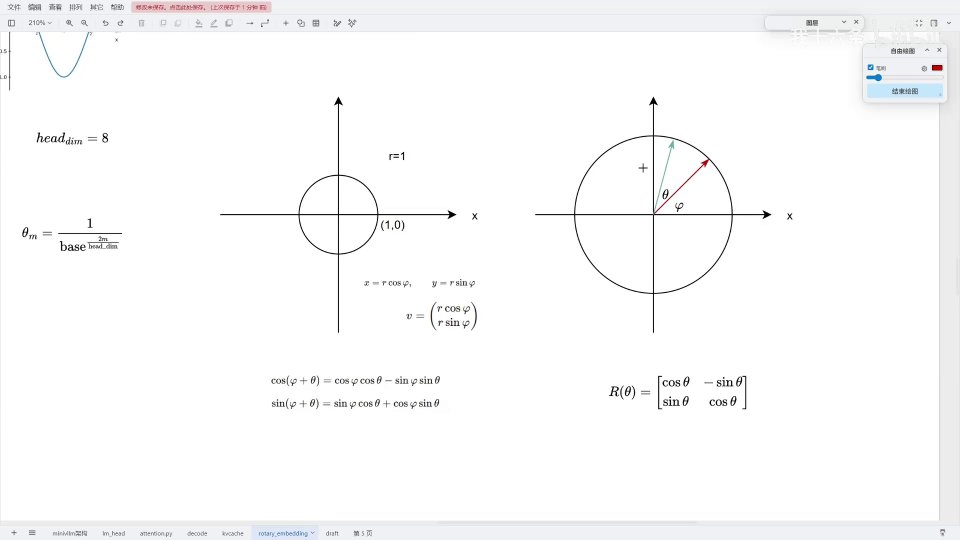 |
| 旋转之前是 cosφ……旋转之后就是 cos(θ+φ)。把三角函数展开，cos(θ+φ) = cosθcosφ - sinθsinφ（这是高中的三角函数公式，具体名字我有点记不清了）；sin(θ+φ) = sinθcosφ + cosθsinφ。 [【跳转到 04:17】](https://www.bilibili.com/video/BV1U6jN6MEet/?t=257) | 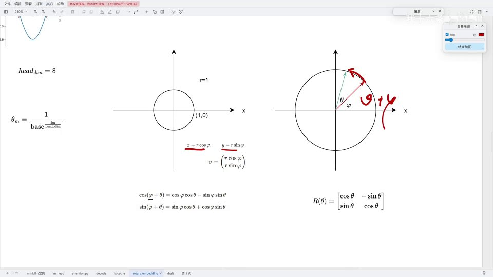 |
| 因为这里是单位圆矩阵，没做拓展。如果把 R 加上去，这是 X、这是 Y，写完之后其实就等于 X·cosθ 减去 Y·sinθ， [【跳转到 04:42】](https://www.bilibili.com/video/BV1U6jN6MEet/?t=282) | 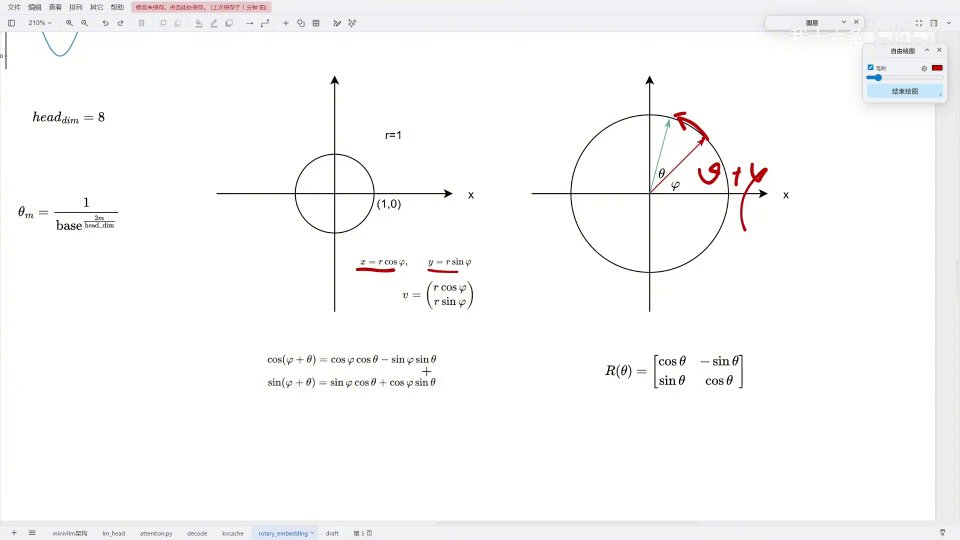 |
| 下面这个就是 Y 坐标，等于 Y……把 R 写上，R·cos 就是 X，写过去就变成 Y·cosθ [【跳转到 05:07】](https://www.bilibili.com/video/BV1U6jN6MEet/?t=307) | 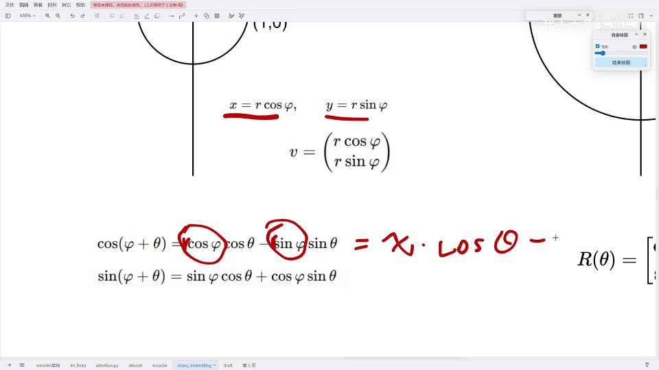 |
| 加上 X·sinθ。整理后就是 X'、Y'。写成向量形式，就发现 X'、Y' 等于 [【跳转到 05:32】](https://www.bilibili.com/video/BV1U6jN6MEet/?t=332) | 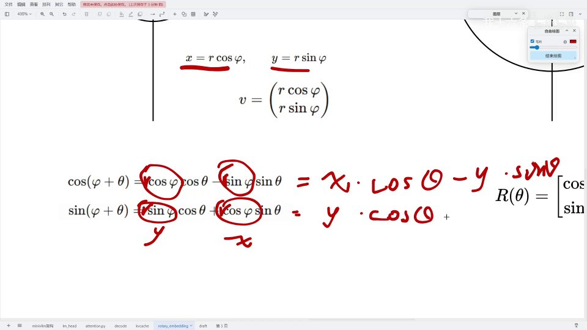 |
| 这个矩阵，也就是旋转矩阵：cosθ、-sinθ、sinθ、cosθ 乘以 X、Y。我们的旋转矩阵就是这么来的——通过单位圆旋转，得出 sinθ 和 cosθ。 [【跳转到 05:57】](https://www.bilibili.com/video/BV1U6jN6MEet/?t=357) | 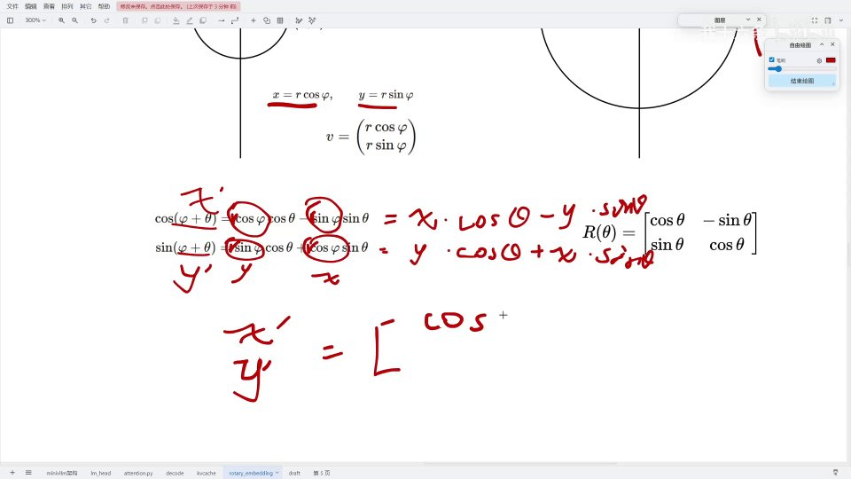 |
| 有了这个前提，我们来看具体怎么做。比如有一个 token1，它的维度是 8（嵌入维度 8 维），高维确实非常不好旋转，怎么处理？它会先把这个 token1 切分开， [【跳转到 06:22】](https://www.bilibili.com/video/BV1U6jN6MEet/?t=382) | 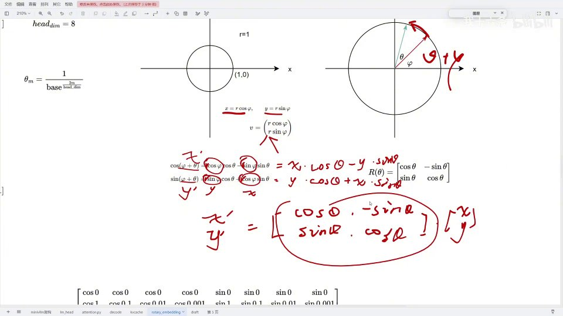 |
| 切分成 X1 和 X2，也就是四对向量对，对这四对向量对分别做旋转。还有一个关键点：针对不同的组别（这四对向量对）， [【跳转到 06:47】](https://www.bilibili.com/video/BV1U6jN6MEet/?t=407) |  |
| 要分别计算它们的旋转角度——四个组别的旋转角度不一样。每个组别的角频率通过公式计算：β 是一个超参数，head_dim 是 8，m 就是组别（比如第 0 个组别）。这里就是四个组别的角频率。 [【跳转到 07:12】](https://www.bilibili.com/video/BV1U6jN6MEet/?t=432) | 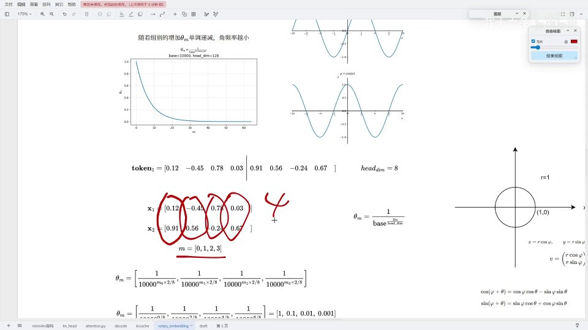 |
| 写出来的值就是：在单个 token 的嵌入向量里，第一个向量对的旋转角度比较快，越往后（比如 0.001）旋转角度越慢，这就是它的角频率。每个组的角频率都不一样。 [【跳转到 07:37】](https://www.bilibili.com/video/BV1U6jN6MEet/?t=457) | 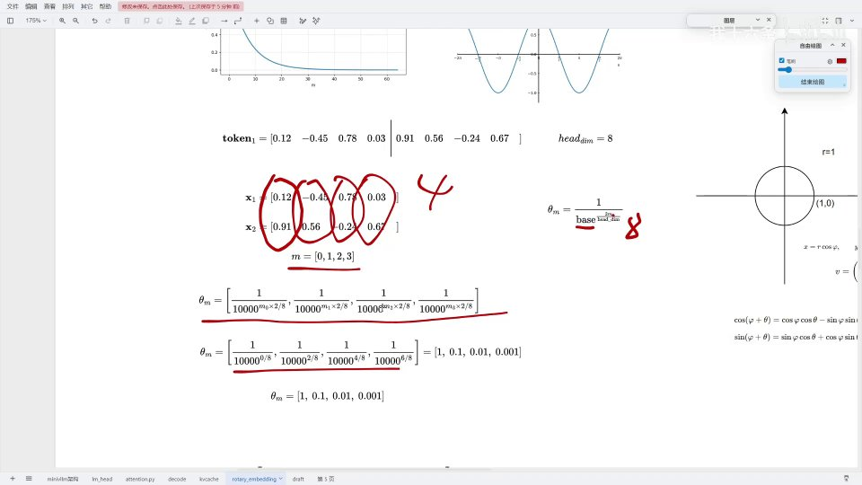 |
| 然后还需要根据角频率计算出具体旋转的频率，就是用角频率乘以它的位置。比如 token 的相对位置 i、组别 m。对第 0 个 token，位置是 0，角频率也是 0，乘下来就是 θ = i × ω_m。 [【跳转到 08:02】](https://www.bilibili.com/video/BV1U6jN6MEet/?t=482) | 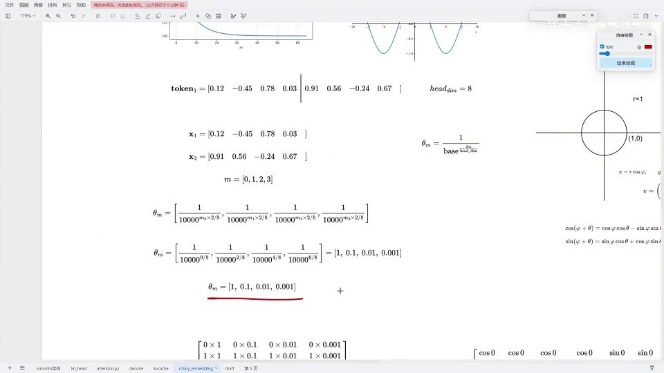 |
| 以此类推。词表长度我举例是 100（没画完），相当于支持的最大上下文长度是 100。程序里有一个 cos 与 sin cache，其实是我们通过频率算出来的——现在有了频率表，还需要计算 cos 和 sin 的具体旋转值， [【跳转到 08:27】](https://www.bilibili.com/video/BV1U6jN6MEet/?t=507) | 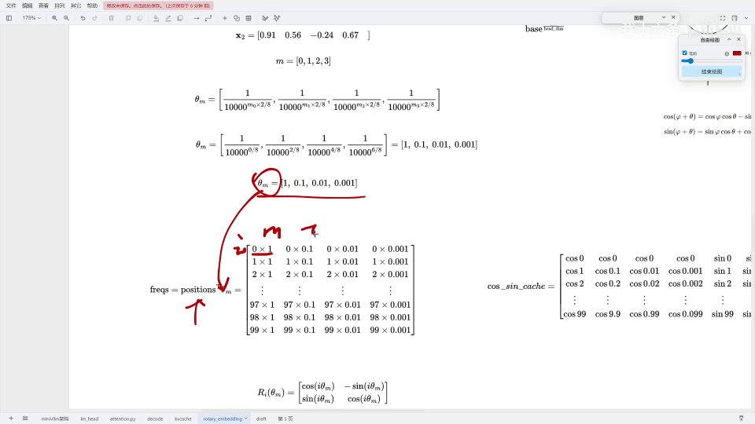 |
| 这个具体旋转值用得上算出来的频率。频率从这儿划分：前面是 cos(φ)、后面是 sin(φ)，φ 对应这个频率。它表示当 i 等于 1 时这个 token 怎么旋转； [【跳转到 08:52】](https://www.bilibili.com/video/BV1U6jN6MEet/?t=532) | 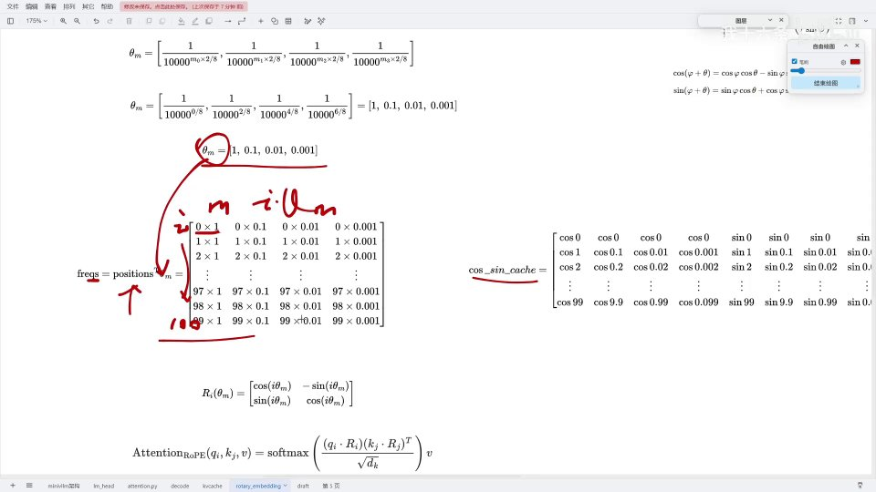 |
| 比如嵌入维度是 8，那每个维度对应具体怎么旋转，就是用这个去乘。我们来看具体怎么乘：针对一个二维向量、每个组别做旋转。先从程序里读出 cos 和 sin（提前算好了）， [【跳转到 09:17】](https://www.bilibili.com/video/BV1U6jN6MEet/?t=557) | 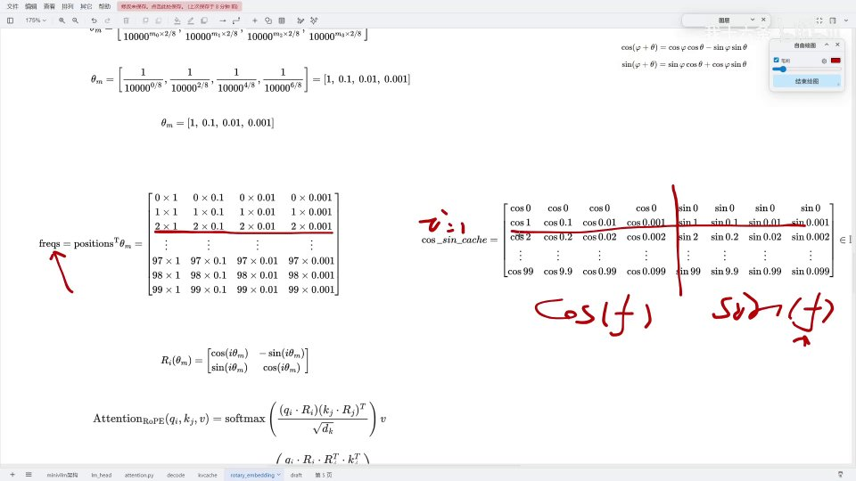 |
| 当 i 等于 1 时，cos、sin 就取这一行。比如第一个组别，用 cos1 和 sin1 提取出来，乘以 i=1 的位置做旋转。比如在组别 [【跳转到 09:42】](https://www.bilibili.com/video/BV1U6jN6MEet/?t=582) | 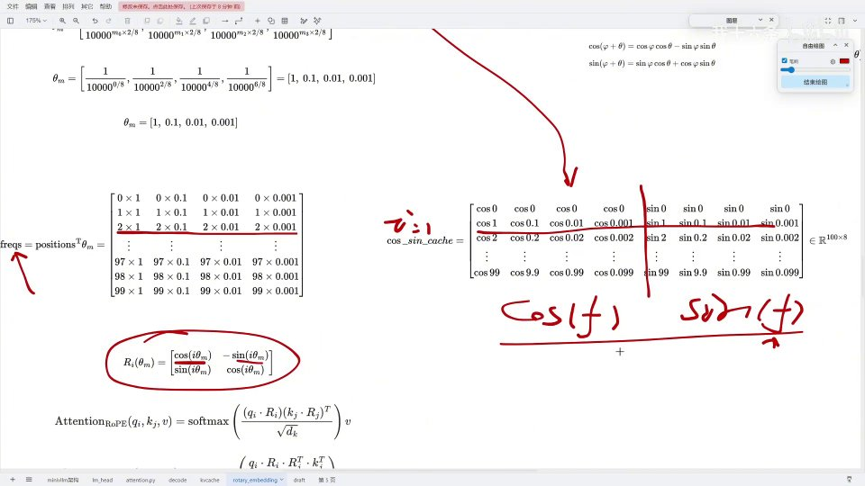 |
| ……这个向量对，取的就是最后一个 cos 和 sin。取出来之后，原本的 attention 计算公式可以做一个推导变换：加入 RoPE 之后，原本第 i 个位置的 Q 和第 j 个位置的 K 做点积，attention 公式就变成：Qi 先乘以 Ri， [【跳转到 10:07】](https://www.bilibili.com/video/BV1U6jN6MEet/?t=607) | 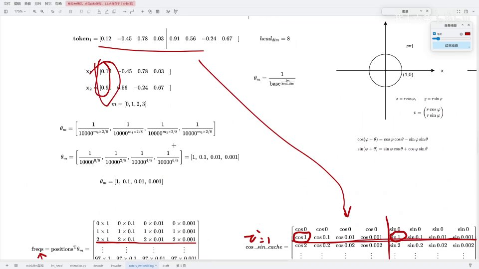 |
| 再乘以 Kj 乘以 Rj，相当于对 Qi 做旋转、对 Kj 做旋转，再转置。把公式展开：Qi·Ri 再乘 Rj 的转置（这里是 Rj^T 乘以 Kj），R^T 可以变成 R_i - R_j， [【跳转到 10:32】](https://www.bilibili.com/video/BV1U6jN6MEet/?t=632) | 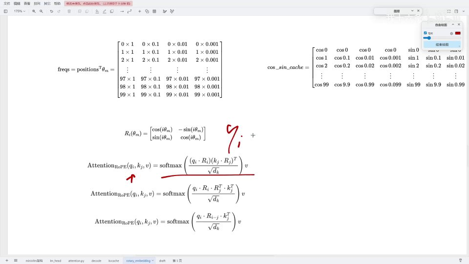 |
| 因为对旋转矩阵来说，转置就是它的逆。R 是逆时针旋转，Rj 的逆就是顺时针旋转，所以直接用 R_i - R_j、用角度差就可以算出来。原本的 attention 公式就变成了 Qi·Kj^T，做 softmax 除以根号 d，再乘以 V。 [【跳转到 10:57】](https://www.bilibili.com/video/BV1U6jN6MEet/?t=657) | 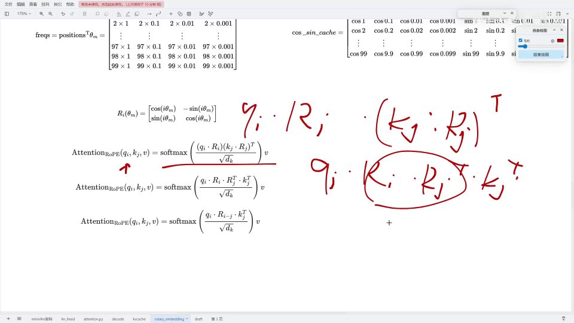 |
| 这里的 R_i - R_j 就把位置信息引入了进去，attention 计算过程就有了位置信息。这就是 RoPE 的核心思想。然后我们来看代码， [【跳转到 11:22】](https://www.bilibili.com/video/BV1U6jN6MEet/?t=682) | 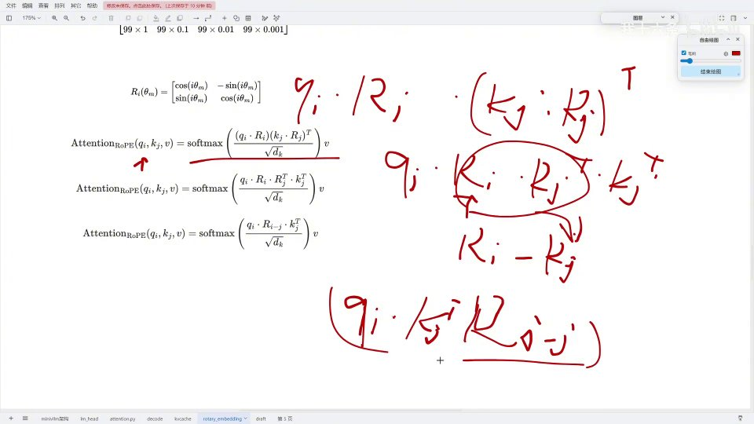 |
| 具体是什么情况。我觉得这一块直接走调试路线吧， [【跳转到 11:43】](https://www.bilibili.com/video/BV1U6jN6MEet/?t=703) | 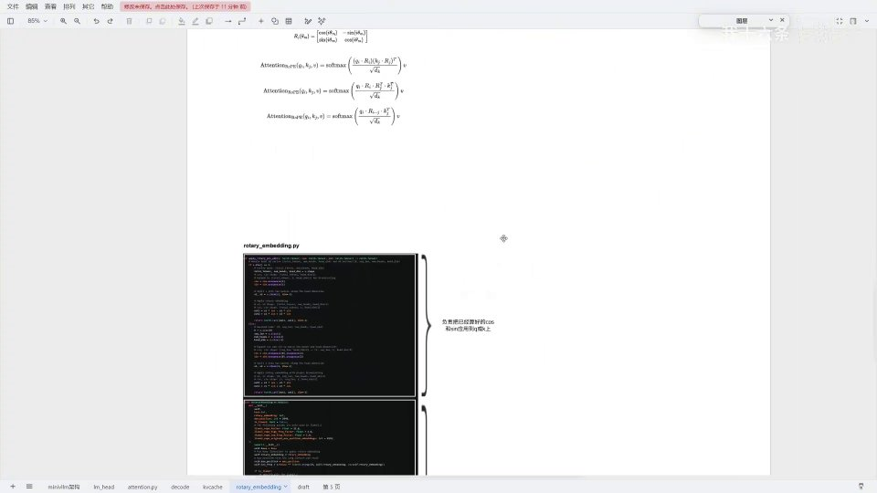 |
| 去看一下。我们也很久没看这个代码了， [【跳转到 11:48】](https://www.bilibili.com/video/BV1U6jN6MEet/?t=708) | 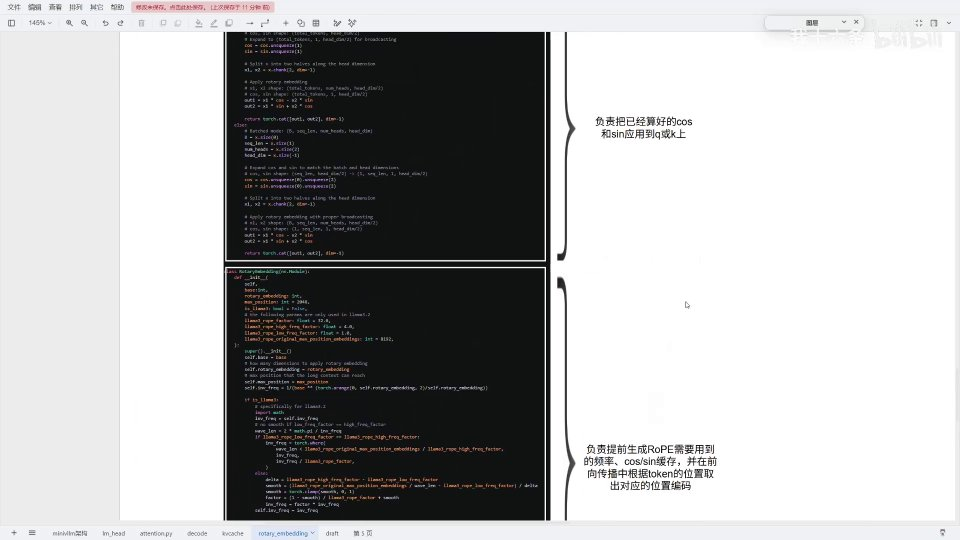 |
| 我把断点打在旋转嵌入上，调试一下。程序启动了，看它现在在哪——现在在初始化过程。这一块代码实际上就是传进来的超参，在 MiniVLLM 中， [【跳转到 11:53】](https://www.bilibili.com/video/BV1U6jN6MEet/?t=713) | 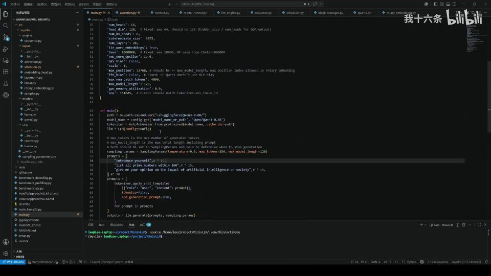 |
| 这个 base 跟使用的模型有关。比如 Qwen3-0.6B，它的 base 是 10 万；也可以看到旋转嵌入维度是 128 位。为什么是 128 位？Qwen3-0.6B 的嵌入其实是 1024，但因为 GQA、多头，这里计算多头后，针对每一个头都做旋转， [【跳转到 12:18】](https://www.bilibili.com/video/BV1U6jN6MEet/?t=738) |  |
| 所以嵌入维度实际上是 128 维。这个 max_position 就是我们支持的最大位置，这里是 32K，也就是模型的上下文长度。它提前生成每个位置上的每一个 cos 和 sin，生成之后在计算过程中直接从 sin/cos 里取。 [【跳转到 12:43】](https://www.bilibili.com/video/BV1U6jN6MEet/?t=763) | 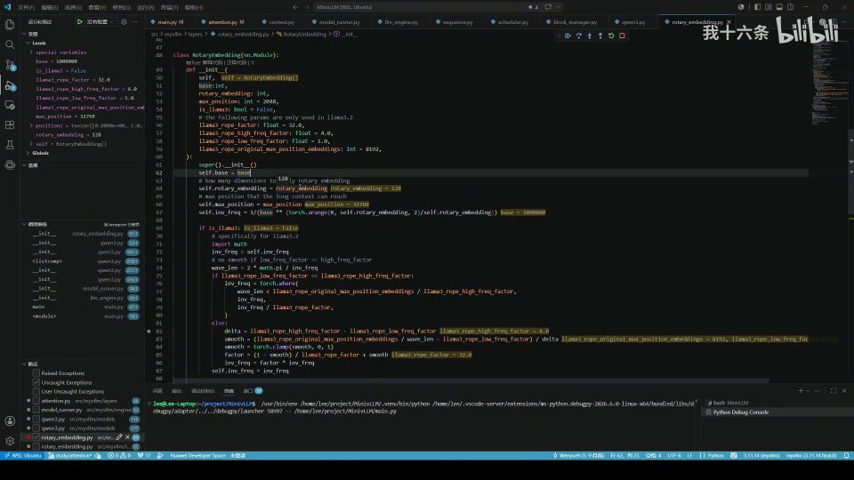 |
| 也就是直接在缓存里提取具体的 sin 和 cos。然后这里计算小频率，就是我们刚才讲的公式 θ_m。继续看，这里是 Llama3——如果走 Llama3，会对角频率做一定修改， [【跳转到 13:08】](https://www.bilibili.com/video/BV1U6jN6MEet/?t=788) | 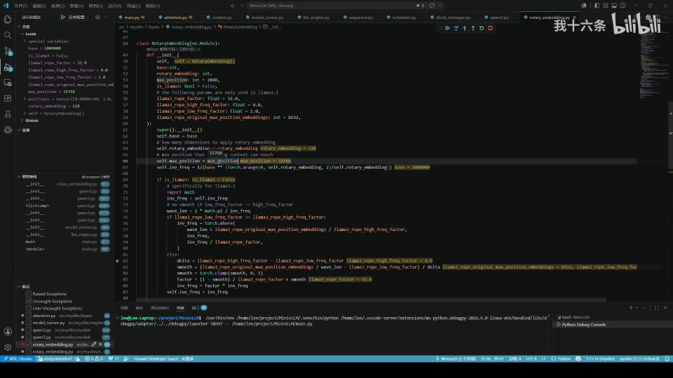 |
| 让角频率呈现不同的状态。原本的 RoPE 角频率直接按公式推就行，Llama3 有一些变化，大家可以自己去看。然后这里生成一个 position 向量，从零开始一直到结束。接着对每个 position 计算具体的 cos 和 sin， [【跳转到 13:33】](https://www.bilibili.com/video/BV1U6jN6MEet/?t=813) | 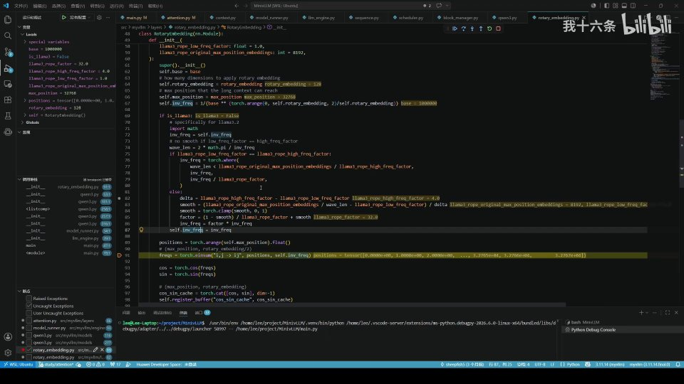 |
| cos 和 sin 乘以频率 FREQUENCE 就得到具体的 cos 和 sin。这里把 cos 和 sin 拼在一起，最后把 cos、sin cache 放到缓存里，旋转嵌入模块的初始化就完成了。继续走，不用管它，把断点关掉。 [【跳转到 13:58】](https://www.bilibili.com/video/BV1U6jN6MEet/?t=838) | 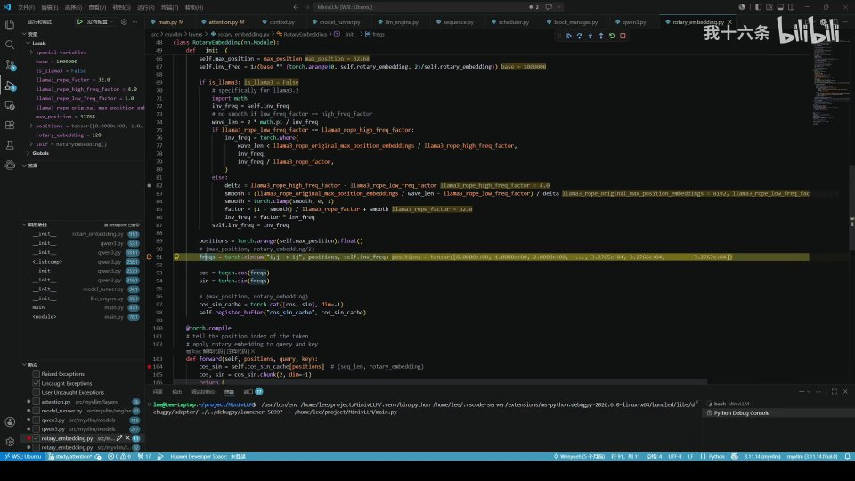 |
| 它没有进到这里边。大家注意调试时得把这里注释掉再重新调试。我把它注释掉重新启动。好，现在进到这里了。这个 sin/cos cache 就是我们刚才算好的， [【跳转到 14:23】](https://www.bilibili.com/video/BV1U6jN6MEet/?t=863) | 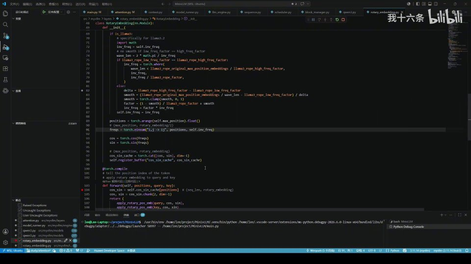 |
| 看一下它具体长什么样。在 self 里面它是一个 32768，这个 32768 实际上就是我们的位置数（上下文长度 32K，所以有 3 万多个），128 就是嵌入维度。它实际上是一个 32768×128 的矩阵。 [【跳转到 14:48】](https://www.bilibili.com/video/BV1U6jN6MEet/?t=888) |  |
| 接下来看它怎么把 cos 和 sin 从这个大矩阵中提取出来。看一下 sin/cos 是什么矩阵——4096×128，因为我这里传进来的在 warm 阶段（预热阶段），传进了 4096 个 token， [【跳转到 15:13】](https://www.bilibili.com/video/BV1U6jN6MEet/?t=913) | 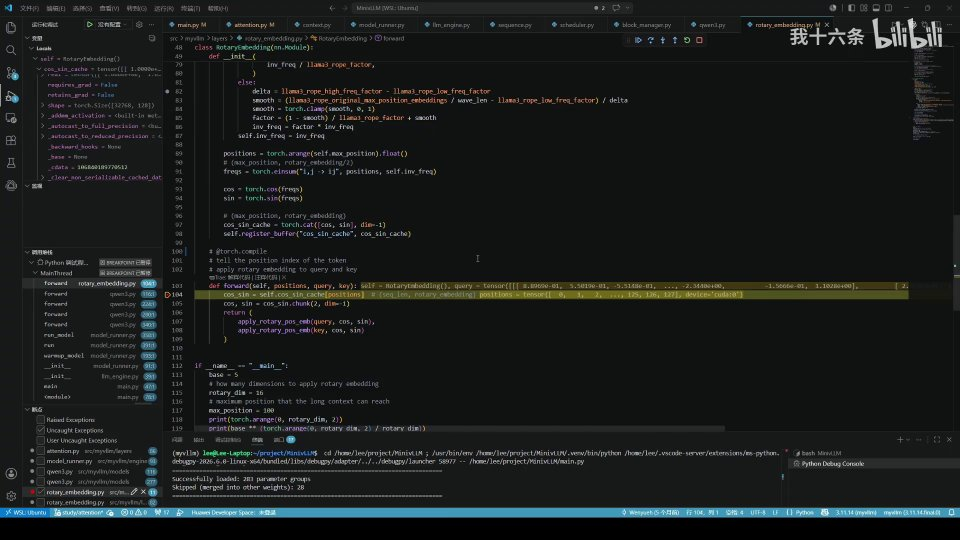 |
| 所以 position 从 0 到 4096。这里取 sin 和 cos 时取出来的矩阵就是 4096×128。看一下 sin/cos 的形状……就是 4096×128。如果把预热阶段 [【跳转到 15:38】](https://www.bilibili.com/video/BV1U6jN6MEet/?t=938) | 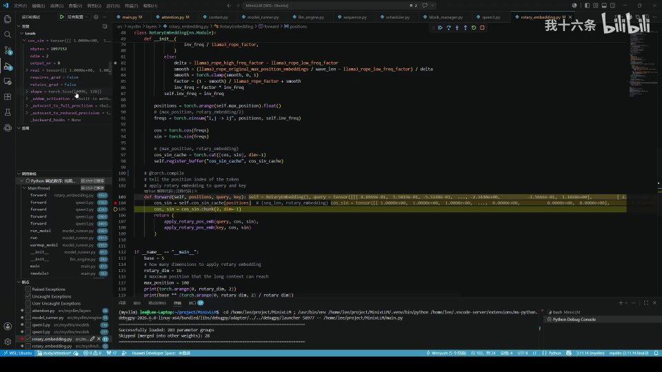 |
| 跳过的话……我把预热阶段跳过，把这个也打上断点。预热阶段已经跳过了， [【跳转到 16:03】](https://www.bilibili.com/video/BV1U6jN6MEet/?t=963) | 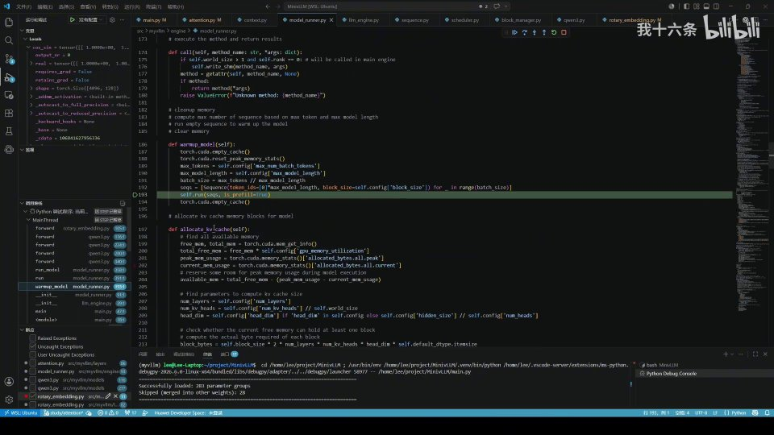 |
| 回到刚才打断点的地方。现在传进来的 position 已经变化了，从 0~10，第二个序列从 0~16， [【跳转到 16:28】](https://www.bilibili.com/video/BV1U6jN6MEet/?t=988) | 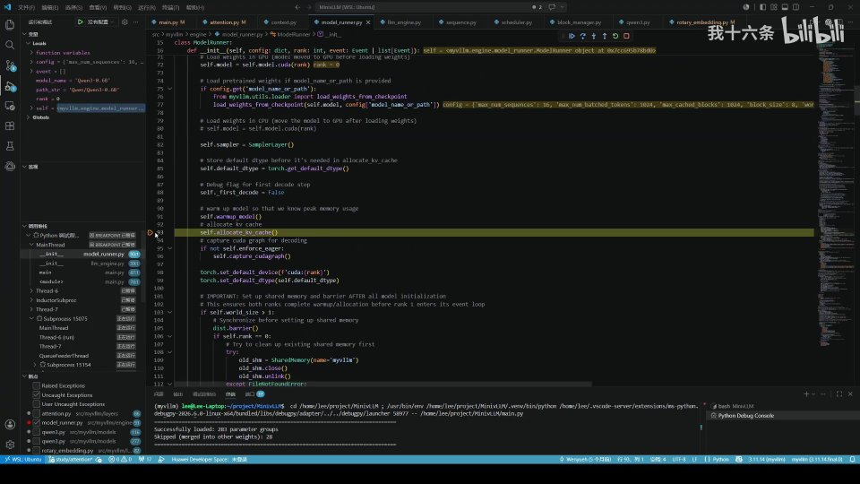 |
| 第三个序列从 0~19，这就是三个序列（这里只传了三个序列）。cos、sin 会从这个位置取，取出对应位置的旋转矩阵。cos、sin 的形状和 position 矩阵一致。 [【跳转到 16:53】](https://www.bilibili.com/video/BV1U6jN6MEet/?t=1013) | 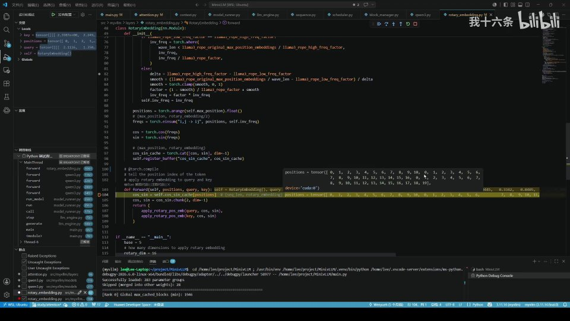 |
| 比如 token 总数是 11+17+28……加二十四十八，传进来有 48 个 token，就有 48 个位置，所以 cos、sin 应该是 48×128。看一下 cos、sin 这个矩阵具体长什么样……48×128 就出来了， [【跳转到 17:18】](https://www.bilibili.com/video/BV1U6jN6MEet/?t=1038) | 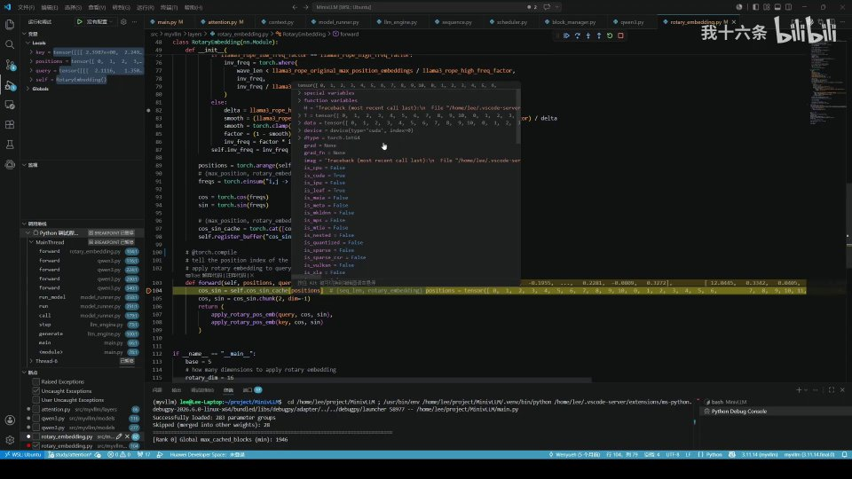 |
| 也就是 48 个 token，每个 token 的旋转矩阵都存在这里。然后单独提取 cos 和 sin，再对 Q 和 K 做具体的旋转变换——因为旋转矩阵只会对 Q 和 K 做旋转。 [【跳转到 17:43】](https://www.bilibili.com/video/BV1U6jN6MEet/?t=1063) | 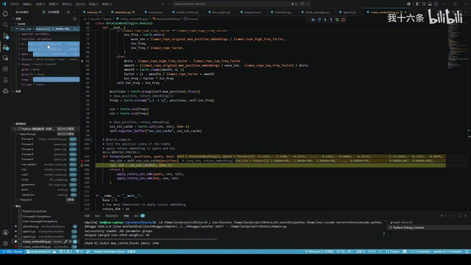 |
| 看一下里边具体什么情况。走一下。这个 `x_dim = 3` 是维度上的区别：下面这种情况是批处理模式，即某个 P 里有多少个 sequence；我们现在走的是 dim=3， [【跳转到 18:08】](https://www.bilibili.com/video/BV1U6jN6MEet/?t=1088) | 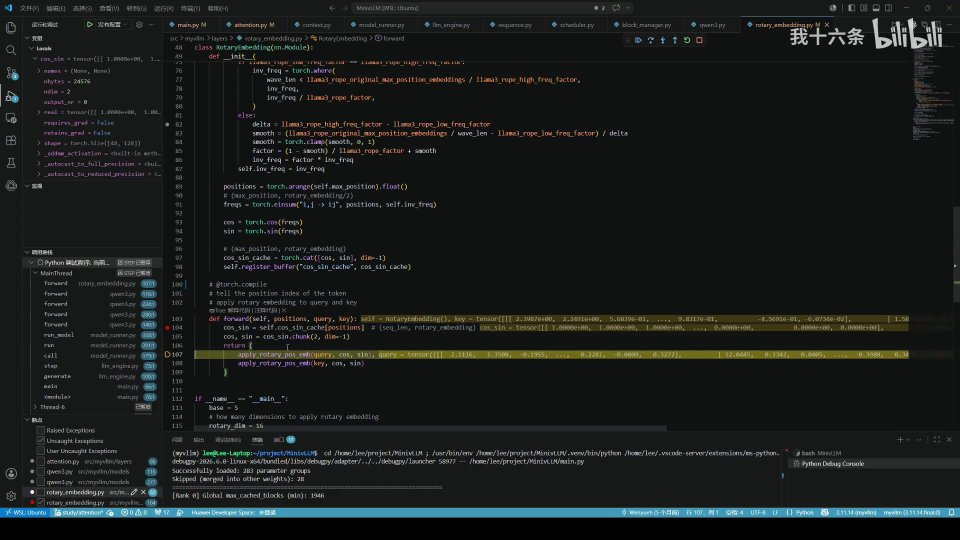 |
| 就是总的 token——所有序列的 token 全部放在一起。我们传进来的 prompt 实际上就是 48。继续看，这里对 cos 和 sin 做了一个 unsqueeze，把原本二维的 cos、sin 做维度拓展， [【跳转到 18:33】](https://www.bilibili.com/video/BV1U6jN6MEet/?t=1113) | 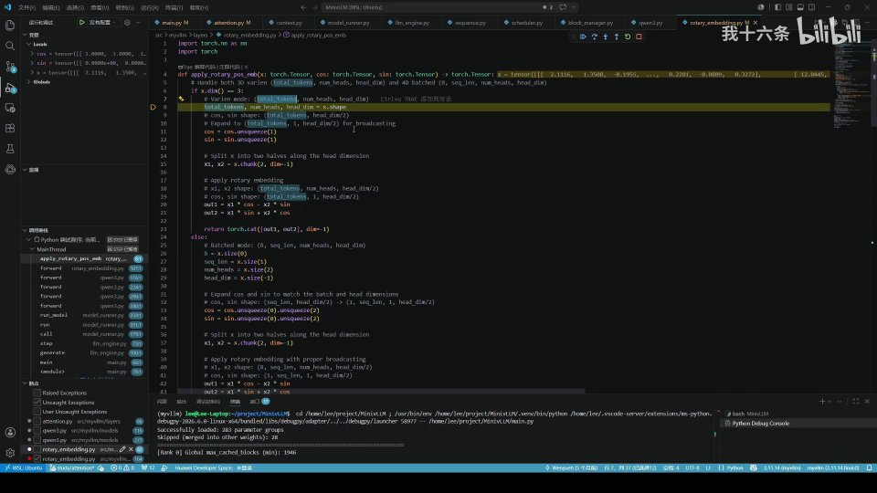 |
| 拓展的维度就是头的维度，因为它只会对最后的 head_dim（嵌入维度）做旋转，所以做了一个扩展。然后 X1、X2 chunk， [【跳转到 18:58】](https://www.bilibili.com/video/BV1U6jN6MEet/?t=1138) | 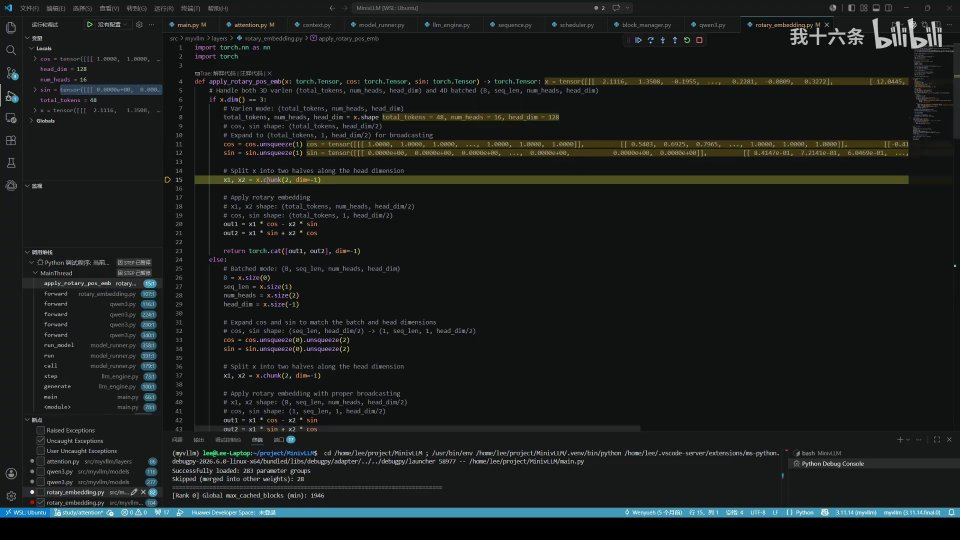 |
| X 就是传进来的嵌入，也对嵌入维度做了一个切分，把它分成前后两个部分。然后 out1、out2 做旋转。 [【跳转到 19:23】](https://www.bilibili.com/video/BV1U6jN6MEet/?t=1163) | 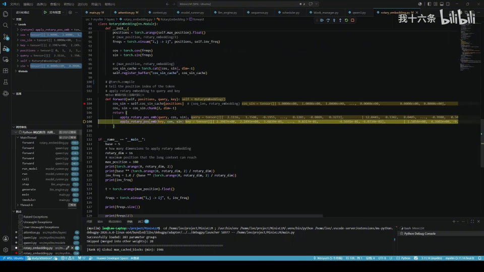 |
| 不过我觉得大家还是要真的仔细推一下这个公式，因为我讲得比较粗糙。具体里边的 shape 是怎么变化的、非常关键；cos、sin 的角频率怎么旋转、为什么要按向量对去作用，大家都可以去看一下。好，今天的分享就到这里，谢谢大家。 [【跳转到 19:48】](https://www.bilibili.com/video/BV1U6jN6MEet/?t=1188) | 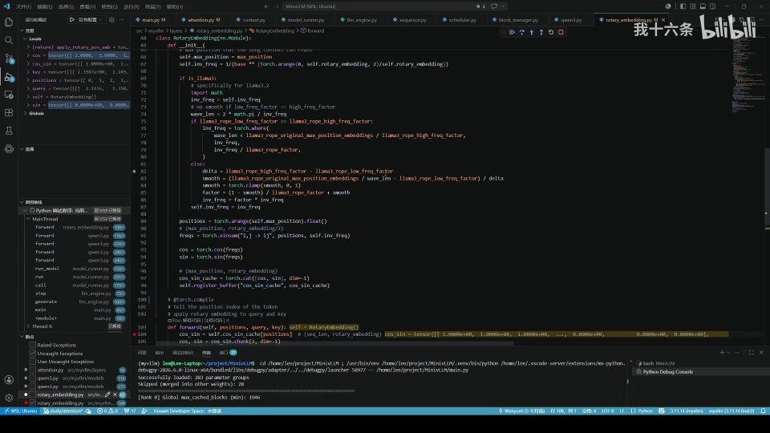 |